# コンピューターのしくみ

・コンピューターの五大装置とその役割について再確認。
・CPUの仕組み、レジスタ、キャッシュ、パイプライン制御、バス。
・ビット・バイト、2の補数表現によるマイナスの実装、浮動小数点数の計算誤差。
・トランジスタとコンデンサを使ったメモリの仕組み。
・誤り訂正符号、RAID、暗号化、データ圧縮。
・巷にはびこる三文字略語の解説。

ここに「ゲームにこんなに役に立つから数学やろうぜ」的な話をまぜたりしていく。

>画像の一部は`http://www.sugilab.net/jk/joho-kiki/index.html`から借用しています。

## 1. コンピューターのしくみ

### 1.1 コンピューターの種類

Computer(コンピューター)という単語はラテン語のcom-(コム)とputare(プターレ)に由来します。コムは「一緒に」という意味で、プターレは「考える、<ruby>整頓<rt>せいとん</rt></ruby>する」という意味です。

つまり、com-putare(コンプターレ)は「一緒に考える、一緒に整頓する」という意味になります。ここから「なんらかの計算を行う人や、天文台や測量などで計算を行うために雇われた人々」を指すようになり、そして「計算する」という意味が派生しました。

そして時は流れ、ラテン語は歴史の一部となり、今ではcom-putareが英語化したcomputerは「電子計算機」、つまり、

>データを受け取り、プログラムで与えられた命令に従って計算等の処理を行い、その結果を表示する電子機器

を意味するようになりました。

現代のコンピューターは、規模や用途によって、いくつかに分類することができます。

#### (1) スーパーコンピューター

大規模な科学技術計算に用いられる超高速、超並列化されたコンピューターです。HPC(ハイ・パフォーマンス・コンピューター)とも呼ばれます。

例えば、2007年にIBM社が開発した「ブルージーンP」というスーパーコンピューターは、65,536個のCPUと144テラバイトのメモリを搭載しています。2021年に富士通社が開発した「富岳(ふがく)」は、158,976個のCPUと4.85ペタバイトのメモリを搭載しています。

スーパーコンピューターは、大きな部屋を埋め尽くすほどの大きさがあります。

<p align="center">
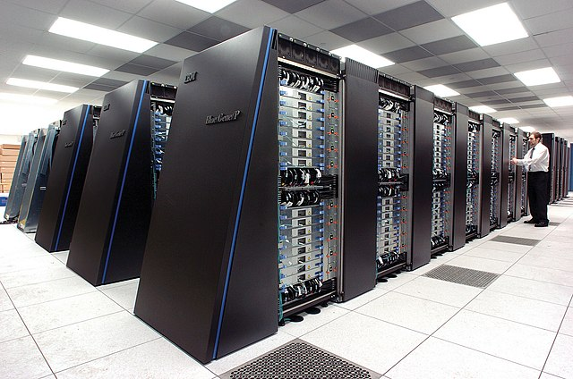<br>
IBM社のスーパーコンピューター「ブルージーンP」<br>
https://en.wikipedia.org/wiki/IBM_Blue_Gene
</p>

#### (2) メインフレーム

現代では、主にデータベース処理などの事務計算に用いられる大型コンピューターです。十個から数百個のCPUを搭載し、総メモリ容量は数十ギガバイト～数テラバイトに及びます。

メインフレームの特徴は「高い信頼性」です。例えば、ハードウェアが多少故障しても、正常に動作を続けられるように設計されています。また、エラーや操作ミスがあっても正しい状態を復元できるような、専用のOSが使われています。

現代のCPUやOSに使われている基本技術には、メインフレームで初めて採用され、進化してきたものが数多く含まれています(パソコンより歴史が古いので当然といえば当然ですが)。

* 割り込み機能
* SMP(シンメトリック・マルチ・プロセッシング)。
* 分岐予測
* キャッシュメモリ
* ハードディスク
* 仮想記憶
* 仮想マシン
* 時分割処理
* OS
* データベース

<p align="center">
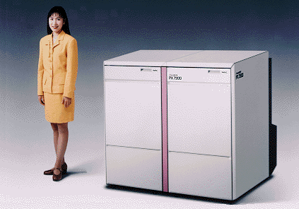<br>
NEC社のメインフレーム「ACOS-6/PX7900」<br>
http://www.nec.co.jp/press/ja/9603/1401.html
</p>

#### (3) サーバ

サーバ(Server)は「給仕人」や「従者」という意味で、専門的な業務に用いられるコンピューターを指します。利用するOSやCPUによっていくつかの種類があります。

* UNIX(ユニックス)サーバ: UNIXというサーバ用OSを使用するサーバです。一般的に、高性能かつ大規模なコンピューターで構成されており、メインフレームの代用として使われることもあります。
* IA(アイエー)サーバ: パソコンと同じインテル系(インテル・アーキテクチャ)のCPUを使用するサーバです。そのため「PC(ピーシー)サーバ」とも呼ばれます。OSにはLinux(リナックス)やWindowsが使われます。UNIXサーバより性能が低いかわりに安いので、現代では最も広く使われています。
* Web(ウェブ)サーバ: インターネットに接続され、ウェブサイトのデータを提供するサーバです。多くはUNIXサーバやIAサーバが使われます。
* ラックマウント型サーバ: データセンターなどで使われる、電子機器収納棚(ラック)に搭載できるサイズで設計されたサーバです。多数のサーバーを効率よく収納できるため、データセンターなどの大規模な用途で使われます。
* ブレード型サーバ: ラックマウント型をさらに小型化したサーバです。ラックマウント型では個別に搭載していた「電源」や「LANボード」などを別ユニットに分離し、複数のサーバで共有することで小型化を実現しています。ラックマウント型以上にコンパクトかつ省電力ですが、ラックのような標準規格がないことから、価格は高めです。

<p align="center">
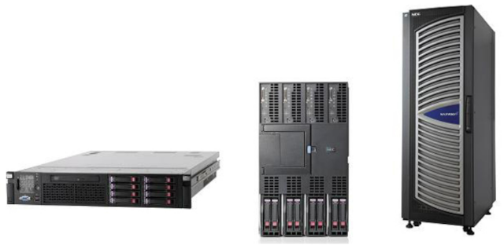<br>
NEC社のUNIXサーバ「NX7700iシリーズ」<br>
左=ラックマウント型 中=ブレード型 右=タワー型<br>
https://jpn.nec.com/press/201211/20121128_04.html
</p>

#### (4) パソコン

パーソナル・コンピューターの略称で、個人が利用するコンピューターを指します。

デスクトップ型、ノート型、タブレット型などさまざまな形状が存在します。

<p align="center">
<br>
HP社のパソコン<br>
https://jp.ext.hp.com/directplus/business/smb/
</p>

#### (5) マイクロコントローラー

自動車や家電製品などを制御するためのコンピューターです。MCU(マイクロ・コントローラー・ユニット)とも呼ばれます。価格と消費電力を下げるために性能は低く、メモリも数十キロバイトから数メガバイト程度しか搭載していません。

しかし、小型かつ安価であることから非常に広く利用されています。パソコンの部品にも、さまざまなマイクロコントローラーが組み込まれています。

<p align="center">
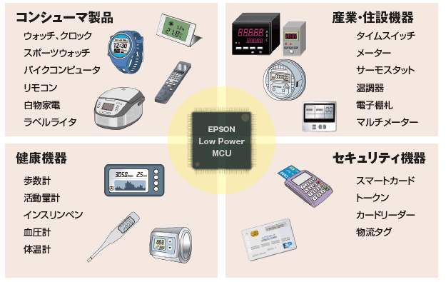<br>
EPSON社のマイクロコントローラーの利用例<br>
https://www.epson.jp/prod/semicon/products/micro_controller/
</p>

### 1.2 コンピューターの５大機能

コンピューターには次の5つの主要な機能が備わっています。

* 入力装置
* 演算装置
* 制御装置
* 記憶装置
* 出力装置

<p align="center">
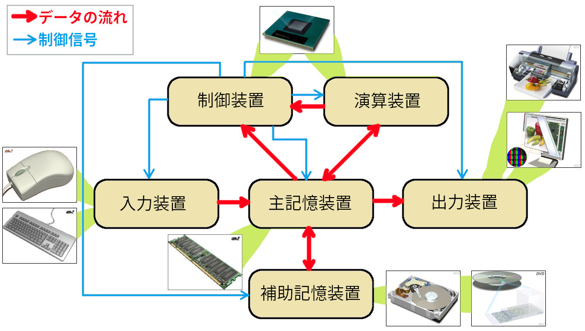
</p>

#### (1) 入力装置

入力装置の役割は、文字や図形、音声のような「コンピューターの外部にあるデータ」を、コンピューターが扱える「0と1の組み合わせに変換する」ことです。

入力装置はデータをコンピューターに受け渡す入り口です。利用者(ユーザー)がコンピューターを操作するとき、最も目に触れる機会が多い装置です。入力装置には以下のようなデバイスがあります。

* タッチパネル
* ゲームパッド
* マウス
* キーボード
* マイク
* カメラ
* 各種センサー(赤外線センサー、地磁気センサー、温度センサーなど)
* LAN

#### (2) 演算装置と制御装置

現代のコンピュータでは、演算装置と制御装置はCPUにまとめられています。CPUはCentral Processing Unit(セントラル・プロセッシング・ユニット)の略称で、日本語では「中央処理装置」といいます。

「演算装置」と「制御装置」の役割は次のようになっています。

* 演算装置: 四則演算や比較などの演算を行う。
* 制御装置: データの流れ、命令の実行、その他の装置の制御などを行う。

「演算装置」はALU(Arithmetic Logical Unit, アリスマティック・ロジカル・ユニット、算術論理演算装置)とも呼ばれます。

### (3) 主記憶装置と補助記憶装置

記憶装置の役割は、入力装置から送られた「0と1の組み合わせを記憶する」こと、または、演算装置の計算結果としての「0と1の組み合わせを記憶する」こと、です。

記憶装置は大きく2つに分けられます。ひとつは「主記憶装置」で、コンピューターに入力されたデータやプログラム、演算装置によって処理されたデータを記憶します。

現代のコンピューターの主記憶装置には、DRAM(ダイナミック・ラム、ディーラム)やSRAM(スタティック・ラム、エスラム)が使われています。

主記憶装置に記憶させた内容は、電源を切ると全て消えてしまいます。そのため、重要なデータは、電源が切れても記憶が保持される「補助記憶装置」にコピーしておきます。

現代のコンピューターの補助記憶装置には次のようなものがあります。

* HDD(ハードディスク・ドライブ)
* SSD(ソリッド・ステート・ドライブ)
* USBメモリー
* SDカード
* 磁気テープ装置
* DVD(デジタル・バーサタイル・ディスク)
* ブルーレイディスク

一部の例外を除いて、全てのデータやプログラムは主記憶装置に記憶されます。他の装置は、主記憶装置に記憶されたデータやプログラムを読み取って処理を行います。

記憶装置の性能は、「記憶容量」と「サイクルタイム(読み書きにかかる時間)」によって評価されます。

一般に、主記憶装置は容量が少ない代わりに、サイクルタイムが短く、特にランダムアクセスサイクルタイムに優れています。対して、補助記憶装置は、ランダムアクセスサイクルタイムが長いかわりに、大きな容量を持っています。

| 装置の種類 | 記憶容量 | サイクルタイム |
|:----------:|:-------:|:--------------:|
| 主記憶装置 | ×(少ない) | ○(短い) |
| 補助記憶装置 | ○(多い) | ×(長い) |

### (4) 出力装置

出力装置の役割は、主記憶装置に記憶されている「0と1の組み合わせ」を、「利用者(ユーザー)が理解できる形で取り出す」ことです。

入力装置と並んで、利用者(ユーザー)にとって最も目に触れる機会が多い装置です。出力装置には以下のようなものがあります。

* 液晶ディスプレイ
* スピーカー
* ゲームパッドなどに内蔵された振動装置
* プリンタ
* モーター
* LAN

### 1.3 コンピューターの特徴

コンピューターの特徴は、高速な計算能力、正確性、データ記憶能力の3つが非常に優れていることです。

#### 高速な計算能力

コンピューターの最大の特徴は、四則演算、数の比較、論理演算などを非常に高速に実行できることです。コンピューターの実行速度は、周波数を表すHz(ヘルツ)という単位で表されます。

1Hzは「１秒間に１回」計算を処理できることを意味します。現代のコンピューターは5'000'000'000Hz以上の速度で動作します。つまり、１秒間に５０億回の計算を実行できるわけです。

コンピューターの世界では、速度や容量を表すために次のようなギリシャ語の単位を使います。

| 単位      | 10進数      | 2のべき乗  | 10のべき乗 | 2と10のべき乗の差 |
|:----------|------------:|:----------:|:---------:|-----------------:|
| K(キロ)   | 1千         |       2^10 |     10^3  | 24 |
| M(メガ)   | 100万       |       2^20 |     10^6  | 48,576 |
| G(ギガ)   | 10億        |       2^30 |     10^9  | 73,741,824 |
| T(テラ)   | 1兆         |       2^40 |     10^12 | 99,511,627,776 |
| P(ペタ)   | 1000兆      |       2^50 |     10^15 | 125,899,906,842,624 |
| E(エクサ) | 100京(けい) |       2^60 |     10^18 | 152,921,504,606,846,976 |
| Z(ゼタ)   | 10垓(がい)  |       2^70 |     10^21 | 180,591,620,717,411,303,424 |
| Y(ヨタ)   | 1𥝱(じょ)   |       2^80 |     10^24 | 208,925,819,614,629,174,706,176 |

通常は「2のべき乗」が使われます。ただし、国際的標準で決められた単位としては「10のべき乗」が正しいです。そのため、場合によって使い分けられます。

>ちなみに、テレビやディスプレイの解像度に使われる2Kや4KのKは、上表の「K(キロ)」のことです。しかし、実際の2Kの解像度は1920, 4Kの解像度は3840なので、正確には「約2K」と「約4K」になります。

また、コンピューターの性能をあらわす単位として、次のような単位が使われています。

| 単位 | 説明 |
|:----:|:-----|
| MIPS(ミップス) | メガ・インストラクションズ・パー・セコンドの略で、1秒間に100万回の整数演算命令を実行する能力をあらわす。 |
| GFLOPS(ギガ・フロップス) | ギガ・フローティングポイント・オペレーションズ・パー・セコンドの略で、1秒間に10億回の浮動小数点数演算命令を実行する能力をあらわす。 |
| TFLOPS(テラ・フロップス) | テラ・フローティングポイント・オペレーションズ・パー・セコンドの略で、1秒間に1兆回の浮動小数点数演算命令を実行する能力をあらわす。 |
| TOPS(トップス) | テラ・オペレーションズ・パー・セコンドの略で、CPUが最も得意な演算命令を、1秒間に1兆回を実行する能力をあらわす。

CPUの種類によって、性能は大きく異なります。パソコン用のCPUは、安いもので2～3GFLOPS、高価なものでは500GFLOPSを超えます。IAサーバ向けCPUでは2TFLOPSに達するものもあります。

スーパーコンピューターの富岳になると、その性能は500PFLOPS(ペタ・フロップス)になります。これは、パソコン用CPUと比べて100万倍の性能です。

#### 正確性

コンピューターは、計算を非常に正確に行うことができます。これは、デジタル電子回路の特徴でもあります。

電子回路がオフのときは0V(ボルト)、 オンのときは3Vというように、状態に応じて一定の差のある電圧をかけます。そして、1.5V未満なら0、1.5V以上なら1のようにデジタル化して処理を行います。

電子回路にはさまざまな理由でアナログ的なノイズが入り込むため、電圧は常に変化しています。しかし、デジタル回路の場合、たとえノイズが入り込んだとしても最終的にはデジタル化されるため、情報が失われることはありません。

#### データ記憶能力

電子回路には「非常に小さく作ることができる」という特徴があります。この特徴によって、コンピューターは大量の0, 1を記憶することができます。2つの値を組み合わせることで、さまざまなデータを記憶できます。

0, 1の2文字だけで数字を表現する方法は「２進数」といいます。２進数の１桁をあらわす単位としてbit(ビット)が使われます。ビットを複数まとめた単位をbyte(バイト)といいます。

2008年になって、ISO(国際標準化機構)およびIEC(国際電気標準会議)により、国際標準を「8ビット=1バイト」とすることが決められました。これによって、現代では「8ビット=1バイト」とすることがほとんどです。

現代の主記憶装置に使われているDRAMは、わずか数百個の原子で1ビットを記憶することができます。そのため、指先に乗るようなチップひとつで10億文字ものデータを記憶することができるのです。

補助記憶装置は電源無しで記憶を保存する必要があるため、主記憶装置よりかなり多くの原子が必要となります。IBM社によると、HDDの場合は約100万個の原子が必要です。

反面、主記憶装置ほど速度が重要でないことからさまざまな工夫を組み込みやすく、電圧の段階を増やしたりチップを多層化したりして、指先に乗るようなマイクロSDカードに1兆文字ものデータを記憶できるようになっています。

>**【C言語は、1バイトのビット数を決めていない】**<br>
>2008年以前、1バイトのビット数は決められていませんでした。実際に、昔のコンピューターには「4ビット=1バイト」や「6ビット=1バイト」、「9ビット=1バイト」のものがありました。
>9ビット=1バイトのコンピューターとして有名なものに、DEC社が開発したPDP-10(ピーディーピー・テン)や、NEC社が開発したACOS-6(エイコス・シックス)というメインフレームがあります。ACOS-6は2009年頃まで稼働していたようです。<br>
>また、C言語の規格では、今でも「1バイト=8ビット以上」と定義されています。

## 2. CPUのしくみ

### 2.1 CPUの中身

CPUには制御装置と演算装置が組み込まれています。制御装置は主記憶装置から命令を読み取り、命令の内容を解読して他の装置に指示を出します。演算装置は制御装置から受けた指示にしたがって、四則演算や数値の比較を行います。

CPUは「ダイ(die、サイコロの単数形)」と呼ばれる薄いシリコンチップの表面に、数千万から数百億個の電子回路を焼き付けて作られています。

しかし、ダイのままでは小さすぎて他の装置と接続することができません。そのため、ダイをプラスチック板の上に乗せて、ダイの端から銅線をプラスチック板の裏側に伸ばし、その先端に、他の装置とつなぐための細いピンを出してあります。ダイを乗せたプラスチック板のことを「パッケージ」といいます。

<p align="center">
<br>
</p>

ダイの中身はいくつかの機能ブロックに分かれています。機能ブロックの配置や種類、数はCPUによって異なります。

<p align="center">
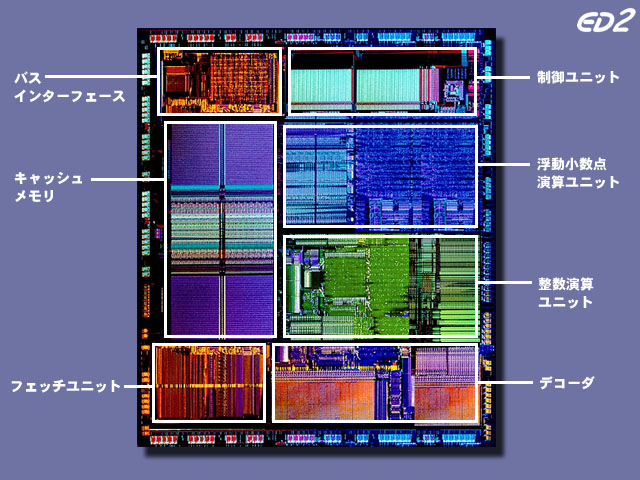<br>
ダイはブロックに分かれている
</p>

各ブロックの役割は次のようになっています。

| 名前 | 分類 | 機能 |
|:----:|:----:|:-----|
| バスインターフェイス | 制御装置 | CPUの外にある他の装置と接続する |
| 制御ユニット | 制御装置 | デコーダが解読した命令に従って、他の装置に指令を出す |
| キャッシュメモリ | 制御装置 | 主記憶装置から読み取ったデータを一時的に記憶する |
| フェッチユニット | 制御装置 | キャッシュメモリから命令を読み取る |
| デコーダ | 制御装置 | フェッチユニットが読み取った命令を解読する |
| 整数演算ユニット | 演算装置 | 整数の四則演算や比較を実行する |
| 浮動小数点演算ユニット | 演算装置 | 浮動小数点数の四則演算や比較を実行する |

なお、銅線はダイの外周部にある小さな長方形の部品に接続されます。

### 2.2 クロック

コンピューターの動作のタイミングを取るために、制御ユニットには「クロック・ジェネレータ」という回路が内蔵されています。

>クロック(clock)は「時計」という意味です。

クロックジェネレータは「クロック信号」を規則正しく発生させる回路です。コンピューターは、クロック信号に合わせてすべての動作を開始します。

クロック信号を発生させる速度を「クロック周波数」といいます。コンピューターの速度は「クロック周波数」で表されます。

例えば、5GHzで動作するコンピューターには、クロック周波数5GHz1のクロックジェネレータが搭載されています。

一般に、クロック周波数が高くなれば、コンピューターの動作速度も速くなります。

### 2.3 レジスタ

CPUの1回の処理時間を秒数であらわすとしましょう。クロック周波数5GHzのCPUの場合、1回の処理時間は、

0.000000002秒

となります。ただ、秒数だとゼロが多すぎて分かりにくいです。そこで、通常は次のような非常に短い時間をあらわす単位を使います。

| 単位 | 10進数 | 10のべき乗 |
|:-----|-------:|:----------:|
| ミリ秒(ms) | 1千分の1秒 | 10^-3 |
| マイクロ秒(μs) | 100万分の1秒 | 10^-6 |
| ナノ秒(ns) | 10億分の1秒 | 10^-9 |
| ピコ秒(ps) | 1兆分の1秒 | 10^-12 |

周波数5GHzのCPUの場合、1回の処理時間は0.2ナノ秒(=200ピコ秒)です。

この時間の単位は記憶装置の速度をあらわすために使われます。2022年現在、CPUと記憶装置の動作速度と容量は次のようになります。

| 装置 | 動作速度 | 容量 |
|:----:|---------:|-----:|
| CPU(5GHz) | 200ピコ秒 | ---- |
| 主記憶装置(DDR4 SDRAM) | 100ナノ秒 | 4G～2Tバイト |
| 補助記憶装置(SSD) | 50～200マイクロ秒 | 256G～4Tバイト |
| 補助記憶装置(HDD) | 10～20ミリ秒 | 1T～16Tバイト |

各装置のあいだで、動作速度の単位が異なるところに注目してください。CPUの速度は、次に速い主記憶装置にくらべて500倍も高速です。

CPUから主記憶装置に、データを読み書きする指令を出したとします。するとCPUは、主記憶装置の処理が終わるまで、じっと待っていなくてはなりません。これでは、せっかくの超高速な計算能力が活かせません。

この問題を解決するために、CPUには「レジスタ」と「キャッシュメモリ」という2つの特別な記憶装置が組み込まれています。

「レジスタ」は制御ユニットに搭載されている「超高価で超高速な記憶装置」です。レジスタはCPUとまったく同じ速度で動作します。

ひとつのレジスタには、数ビットから数百程度のデータを記憶することができます。レジスタの数えかたは「本(ほん)」です。例えば、インテル社の「Core i(コア・アイ)」というCPUには、以下のレジスタが組み込まれています。

| 種類 | 本数 | ビット数 |
|:----:|---:|---------:|
| 汎用レジスタ | 16 | 64 |
| 命令ポインタ |  1 | 64 |
| フラグレジスタ | 1 | 32 |
| 浮動小数点数レジスタ | 8 | 80 |
| 拡張命令用レジスタ | 16 | 128 |

CPUが実行するほとんど命令は、レジスタに記憶させたデータを使って演算を行います。

>主記憶装置の速度は毎年のように向上しているのですが、CPUの向上率のほうがはるかに高いため、CPUと主記憶装置の速度差が埋まる気配はありません。

### 2.4 キャッシュメモリ

<p align="center">
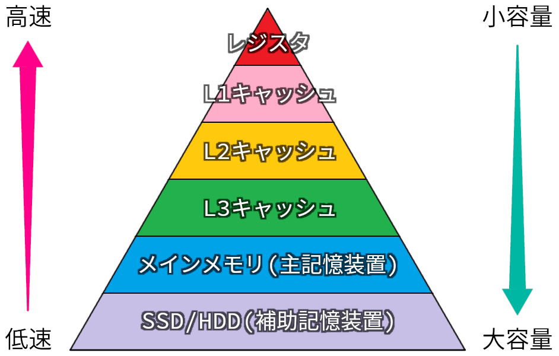<br>
コンピューターの記憶階層
</p>

レジスタは非常に高速ですが、高価で複雑なため、CPUに組み込める数は多くありません。そのため、レジスタだけでは大量のデータを扱うことができません。

そこで、レジスタと主記憶装置のあいだに、両者の中間の特性を持つ記憶装置を組み込みます。これが「キャッシュメモリ」です。

キャッシュメモリは、主記憶装置の速度をおぎなうために作られた、多少高価だけれど比較的高速な記憶装置です。

高速になるほど価格も高くなります。現代のCPUでは、価格と性能のバランスを取るために、数種類のキャッシュメモリを組み合わせることが多いです。

最も高価で高性能なものを1次キャッシュメモリと呼びます。次に高性能なものを2次キャッシュメモリ、その次に高性能なものを3次キャッシュメモリと呼びます。

>「1次キャッシュメモリ」は長くて読みづらいため、L1(エルワン)キャッシュ、L2(エルツー)キャッシュ、L3(エルスリー)キャッシュと呼ばれることが多いです。なお、LはLevel(レベル)の頭文字です。

2022年現在の、レジスタとキャッシュメモリを加えた各装置の速度と容量は次のようになります。

| 装置 | 動作速度 | 容量 |
|:----:|---------:|-----:|
| CPU(5GHz) | 200ピコ秒 | ---- |
| レジスタ | 200ピコ秒 | 数百バイト |
| L1キャッシュ | 1ナノ秒 | 32K～64Kバイト |
| L2キャッシュ | 3～4ナノ秒 | 256K～1Mバイト |
| L3キャッシュ | 7～10ナノ秒 | 4M～256Mバイト |
| 主記憶装置(DDR4 SDRAM) | 100ナノ秒 | 4G～2Tバイト |
| 補助記憶装置(SSD) | 50～200マイクロ秒 | 256G～4Tバイト |
| 補助記憶装置(HDD) | 10～20ミリ秒 | 1T～16Tバイト |

キャッシュを組み込んだことで、装置間の動作速度の差が小さくなっていることが分かります。

キャッシュメモリの役割は、CPUが使いそうなデータを主記憶装置からコピーしておき、CPUが遅い主記憶装置から読み出す回数を減らすことです。

CPUが記憶装置からデータを読み出すときは、最初にキャッシュメモリを調べます。データがキャッシュメモリにあれば、CPUはそのデータを使って演算を行います。

データがキャッシュメモリになかった場合、仕方がないので主記憶装置からデータを読み出します。このとき、必要なデータの前後の部分もまとめて読み出して、キャッシュメモリにコピーしておきます。

コンピューターが扱うデータは、配列のように連続して読み書きするものが多いです。そのため、CPUが読み書きするデータは、直前に読み書きしたデータのすぐ近くにあることが多いです。この性質は「参照の局所性」と呼ばれています。

CPUが読み書きしたいデータが、キャッシュメモリに記憶されている確率を「キャッシュヒット率」といいます。キャッシュメモリは、キャッシュヒット率が90%以上になるように設計されます。

>L3キャッシュだけが組み込まれている仮定すると、ヒット率が90%のときの平均的な読み書き速度は、
>
>100ナノ秒 × 0.1 + 10ナノ秒 × 0.9 = 19ナノ秒
>
>となります。主記憶装置だけでは100ナノ秒かかっていたのに比べて、平均では約５倍の速さで読み書きできることが分かります。

キャッシュヒット率は、プログラムの作り方によって大きく変化します。現代のコンピューターでは、「理論上高速だがキャッシュヒット率が低いプログラム」よりも、「理論上は低速だがキャッシュヒット率が高いプログラム」のほうが、処理が速くなることが多いです。

### 2.5 パイプライン制御

CPUが命令を実行する流れは、次のようにいくつかの細かい基本動作に分けられます。

1. 記憶装置からの命令の読み出し
2. 命令の解読
3. レジスタからのデータの読み出し
4. 演算の実行
5. レジスタへのデータの書き戻し

これらの基本動作は順番に実行され、1～5のすべてが完了した時点でひとつの命令の実行が完了します。ただし、基本動作ごとに独立した電子回路として作られているため、並列に実行できるようになっています。

<p align="center">
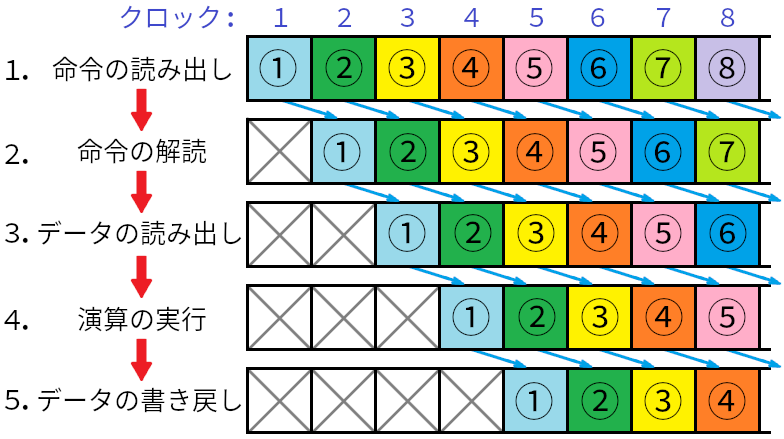
</p>

このように、基本動作を並列に実行すると、最初の命令だけは5クロックかかるものの、それ以降の命令は1クロックごとに実行されます。基本動作を並列に実行するしくみを「パイプライン制御」といいます。

クロックを向上させるには、基本動作をより細かい処理に分割して並列に実行します。このしくみことを「スーパーパイプライン」といいます。

#### パイプラインの弱点

パイプラインの弱点は、`if`などの分岐命令です。分岐するかどうかは「4.演算の実行」が行われるまで分からないからです。

例えば、上の図の②が分岐命令だとします。分岐命令が4を完了するまでに、③、④、⑤という3つの命令が読み出されます。

しかし、分岐先が分からないのに、どうやったら次の命令が判断できるのでしょう。この判断には「分岐予測」という技術が使われているのですが、今回は単純に`if`の直後にある命令列を読み出すことにします(分岐しないと予測したことになります)。

この命令列は「`if`の条件式が真」の場合に実行されるはずの命令です。4の結果、条件式が真ならば、読み出しだ③、④、⑤は何事もなく実行が続けられます。

しかし、条件式が偽の場合は、読み込んだ③、④、⑤はパイプラインから即座に取り除かれ、分岐先の命令を1から読み出し直します。③、④、⑤の読み出しに使った時間は無駄になりますが、仕方ありません。

このように、分岐命令はパイプラインの効率を大きく低下させる可能性があります。スーパーパイプラインのように、処理を分割すればするほど無駄になる時間が増加します。現代のCPUは20段前後という長いパイプラインを持つので、分岐予測の失敗は性能に大きく影響することになります。

>サーバ用などの高価なCPUでは、複数のパイプラインを用意して、分岐する場合としない場合の両方の命令を読み出してしまうものも存在します。しかし、非常にコストがかかるため、一般のCPUで採用される気配はありません。

### 2.6 バス

CPU内部の各ブロックは、「バス(bus)」という線でつながっています。命令やデータ、制御信号は、バスを通して各ブロックに送られます。

また、CPUと他の装置のあいだも別のバスでつながっています。CPU内部のバスを「内部バス」、CPUと他の装置をつなぐバスを「外部バス」といいます。

バスは複数の線で構成されています。線数が多いほど一度に多くのデータをやり取りすることができます。バスの線数のことを「バス幅(はば)」といいます。一般に、CPUのビット数は内部バスの線数によって決まります。32ビットCPUの内部バス幅は32本です。

### 2.7 マルチプロセッサとマルチ「コア」プロセッサ

現代のコンピュータシステムでは、複数のCPUが組み込まれることが当然となってきています。複数のCPUを組み込むことで、システムの性能を高めることができます。

コンピューターシステムの中に複数のCPUを組み込むことを「マルチプロセッサ」といいます。スーパーコンピューター、メインフレーム、サーバで使われています。

「マルチコアプロセッサ」は、CPU内部にあるいくつかのブロックをまとめて「コア」とし、この「コア」を複数搭載したCPUのことです。マルチプロセッサよりも安価に性能を上げることができます。

現代では、マイクロコントローラのような低価格なものをのぞいて、ほとんどのコンピュータシステムで使われています。

## 3. データの表現方法

### 3.1 10進数と2進数

>* 2進数を知っていると、片手の指で0～31まで数えられる。

正確性の解説で説明したように、コンピューターが扱う命令やデータは、内部では電圧の違い(0Vと3Vなど)で表現されています。しかし、データを電圧の組み合わせとして考えるのは簡単ではありません。そこで、普段は電圧を数字の0と1に置き換えて考えます。

普段、わたしたちが買い物をしたり数を数えたりするときは、10進数で計算を行います。10進数は次の規則であらわされます。

* 0, 1, 2, 3, 4, 5, 6, 7, 8, 9という10種類の文字を使って数を表現する。
* 数は0～9まで順番に増えていき、9の次はひとつ桁が上がって10になる。
* 各桁の大きさは10のべき乗で表現する。1=10の0乗、10=10の1乗、100=10の2乗、0.1=10の-1乗など。

べき乗の底(てい)にあたる数を「基数(きすう)」といいます。10進数の基数は10です。また、べき乗で表現された各桁の大きさのことを「桁の重み」といいます。

小数をあらわすには、べき数をマイナスにします。

さて、コンピューターはすべての処理を0と1の組み合わせで行います。このような、2つの文字を使って数をあらわす方法を「2進数」といいます。2進数は次の規則であらわされます。

* 0, 1という2種類の文字を使って数を表現する。
* 数は0～1まで順番に増えていき、1の次はひとつ桁が上がって10になる。
* 各桁の大きさ(桁の重み)は2のべき乗で表現する。1=2の0乗、10=2の1乗、100=2の2乗、0.1=2の-1乗など。
* 基数は2。

C++言語で2進数を書くときは、先頭に`0b`(ゼロ・ビー)を付けます。10進数の1234を2進数にすると0b10011010010になります。

### 3.2 16進数と8進数

>* バグの原因をさぐるためにメモリを直接調べるときとか、知っておかないと詰む。

2進数を使うと、コンピューターが扱うデータをそのまま表現することができます。しかし、2進数はすぐに桁数が大きくなるため、読み書きに向いていません。

例えば10進数の1234は、2進数では0b10011010010と書く必要があります。そこで、2進数の代わりに8進数や16進数が使われるようになりました。8と16は2のべき乗なので、2進数との変換が簡単に行えます。

8進数は次の規則であらわされます。

* 0, 1, 2, 3, 4, 5, 6, 7という8種類の文字を使って数を表現する。
* 数は0～7まで順番に増えていき、7の次はひとつ桁が上がって10になる。
* 各桁の大きさは8のべき乗で表現する。1=8の0乗、10=8の1乗、100=8の2乗、0.1=8の-1乗など。
* 基数は8。

C++言語で8進数を書くときは、先頭に`0`(ゼロ)を付けます。10進数の1234を8進数にすると02322となります。

2進数から8進数に変換するには、2進数を下位から3桁ごとに区切り、それぞれを0～7の数字に置き換えます。

```txt
0b 10 011 010 010
   ↓   ↓   ↓   ↓
   2   3   2   2
```

16進数は次の規則であらわされます。

* 0, 1, 2, 3, 4, 5, 6, 7, 8, 9, A, B, C, D, E, Fという16種類の文字を使って数を表現する。
* 数は0～Fまで順番に増えていき、Fの次はひとつ桁が上がって10になる。
* 各桁の大きさは16のべき乗で表現する。1=16の0乗、10=16の1乗、100=16の2乗、0.1=16の-1乗など。
* 基数は16。

C++言語で16進数を書くときは、先頭に`0x`(ゼロ・エックス)を付けます。10進数の1234を16進数にすると0x4D2となります。

2進数から16進数に変換するには、2進数を下位から4桁ごとに区切り、それぞれを0～Fの数字に置き換えます。

```txt
0b 100 1101 0010
    ↓    ↓    ↓
    4    D    2
```

### 3.3 マイナスの表現方法

>* これも、バグの原因をさぐるためにメモリを直接調べるときとか、知っておかないと詰む。

コンピューターでは、数値の符号も0と1で表現しなくてはなりません。負の数を表現するには「2の補数」を使います。

補数とは、

>基準となる数から、元の数を引いた数

のことです。式であらわすと次のようになります。

>元の数の補数 = 基準となる数 - 元の数

「2の補数」の場合、「基準となる数」は「表現可能な最大値+1」です。

例えば4ビットの値の場合、表現可能な最大値は0b1111なので、基準となる数は0b10000となります。

このとき、数値の6について2の補数を計算すると、

0b10000 - 0b110 = 0b1010

となります。これは-6を意味します。

2の補数を使って、4ビットで負の数をあらわすと次のようになります。

| 10進数 | 2進数 |
|:--:|:----:|
| +7 | 0111 |
| +6 | 0110 |
| +5 | 0101 |
| +4 | 0100 |
| +3 | 0011 |
| +2 | 0010 |
| +1 | 0001 |
|  0 | 0000 |
| -1 | 1111 |
| -2 | 1110 |
| -3 | 1101 |
| -4 | 1100 |
| -5 | 1011 |
| -6 | 1010 |
| -7 | 1001 |
| -8 | 1000 |

最上位の桁に注目すると、正の数では常に0、負の数では常に1になっていることが分かります。

### 3.4 小数の表現方法

>* しくみを知っておくと、ゲームでもいざというとき役に立つ。

コンピューターで小数を表現する方法には「固定小数点数」方式と「浮動小数点数」方式があります。

固定小数点数では、決められた下位ビットを小数部、小数部より上位のビットを整数部として扱います。例えば8ビットの固定小数点数で、下位3ビットを小数部とすると次のようになります。

```txt
         | 符号 |        整数部         |         小数部        |
         |   0  |  0  |  0  |  0  |  0  |   0   |   0   |   0   |
桁の重み |   ±  |  8  |  4  |  2  |  1  |  0.5  | 0.25  | 0.125 |
```

この例では、00000.000のように、下位3ビットと上位5ビットのあいだに小数点があると考えます。表現できる小数は次のようになります。

| 10進数 | 2進数 |
|:-------:|:---------:|
| +15.875 | 01111.111 |
|   ︙    |    ︙     |
| +0.875  | 00000.111 |
| +0.75   | 00000.110 |
| +0.625  | 00000.101 |
| +0.5    | 00000.100 |
| +0.375  | 00000.011 |
| +0.25   | 00000.010 |
| +0.125  | 00000.001 |
|  0      | 00000.000 |
| -0.125  | 11111.111 |
| -0.25   | 11111.110 |
| -0.375  | 11111.101 |
| -0.5    | 11111.100 |
| -0.625  | 11111.011 |
| -0.75   | 11111.010 |
| -0.875  | 11111.001 |
| -1      | 11111.000 |
|   ︙    |    ︙     |
| -16     | 10000.000 |

10進数の整数の場合、2進数でもまったく同じ数をあらわすことができました。しかし、10進数の小数の場合は、2進数では表現できないことがほとんどです。

この性質は、次に説明する「浮動小数点数」でも同じです。

固定小数点数はビットを整数部と小数部に分けているため、表現できる範囲がせまくなります。「浮動小数点数」方式は、この問題を解決するために作られました。

浮動小数点数では、数を「べき乗」を使って表現します。そのために、ビットを「指数部(しすうぶ)」と「仮数部(かすうぶ)」に分けます。そして、以下の式によって数をあらわします。

>数 = 仮数 × 基数の「指数」乗

浮動小数点数では、「1の位にはじめて1が来る」ように指数を調節します。この処理を「正規化(せいきか)」といいます。そして、「正規化された値」のことを「仮数」といいます。

浮動小数点数では、負の値を符号ビットのみであらわします。「2の補数」は使いません。

8ビットの浮動小数点数で、符号1ビット、指数部5ビット、仮数部2ビットに分けたものは次のようになります。

```txt
         | 符号 |        指数部                |  仮数部  |
         |   0  |  0  |  0  |  0  |  0  |  0  |  0  |  0  |
桁の重み |   ±  |  16 |  8  |  4  |  2  |  1  |  ?  |  ?  |
```

上の表では、仮数部の桁の重みを「?」としています。浮動小数点数では「仮数部の桁の重みは、指数部によって変化する」ためです。

浮動小数点数では、ビットを効率的に使うために、指数と仮数の表現方法を次のように定めています。

>指数部 = 指数 + 指数の最大値の半分
>
>仮数部 = 仮数 - 1

指数部の表現方法を「イクセス表現」といいます。イクセス(excess)は「過剰、超過」という意味です。上記の8ビット浮動小数点数の場合、「指数部 = 指数 + 15」となります。

仮数部の表現方法は、「隠しビット表現」または「ケチ表現」といいます。この方法は「正規化された値の1の位は常に1」という事実を利用しています(常に1なので、データとして持っておく必要がない)。

ただし、ケチ表現をつかうと常に1が<ruby>補<rt>おぎな</rt></ruby>われるため、ゼロを表現できなくなってしまいます。そこで、「指数部のビットがすべて0のとき、仮数部を正規化していない(普通の)小数として扱う」という特別ルールがあります。

正規化されていない値のことを「非正規化数」といいます。一般に、ゼロ以外の非正規化数が計算にまじると、処理速度が大きく低下します。できるだけ避けるようにしましょう。

もう一つの特別ルールとして、「指数部のビットが全て1のとき、仮数部が0なら無限大、0以外なら非数(計算不能な値)とみなす」というルールがあります。

「無限大」は「掛け算の結果が、表現可能な最大値を超えるとき」に設定されます。無限大にはどんな数を足しても掛けても、結果は無限大になります。

非数は「無限大同士の割り算」や「0同士の割り算」などを行ったときに設定されます。非数を含む計算の結果は常に非数になります。

| 10進数 | 2進数 |
|:------:|:-----------:|
|  非数   | 0 11111 11 |
|   ︙    |     ︙     |
|  非数   | 0 11111 01 |
| +無限大 | 0 11111 00 |
| +57344  | 0 11110 11 |
| +49152  | 0 11110 10 |
|   ︙    |     ︙     |
| +2      | 0 10000 00 |
| +1      | 0 01111 00 |
| +0.109375 | 0 01011 11 |
| +0.09375 | 0 01011 10 |
| +0.00006103515625 | 0 00001 00 |
| +0.00000762939453125 | 0 00000 01 |
| +0      | 0 00000 00 |
| -0      | 1 00000 00 |
| -0.00000762939453125 | 1 00000 01 |
| -0.00006103515625 | 1 00001 00 |
| -0.09375 | 1 01011 10 |
| -0.109375 | 1 01011 11 |
| -1      | 1 01111 00 |
| -2      | 1 10000 00 |
|   ︙    |    ︙     |
| -49152  | 1 11110 10 |
| -57344  | 1 11110 11 |
| -無限大 | 1 11111 00 |
|  非数   | 1 11111 01 |
|   ︙    |     ︙     |
|  非数   | 1 11111 11 |

浮動小数点数では「2の補数」を使いません。そのため、表現可能な範囲はプラスでもマイナスでも同じです。これは、2の補数を使う整数や固定小数点数とは異なります。

上の表からも分かるように、浮動小数点数を使うと、整数や固定小数点数と同じビット数で、はるかに広い範囲の数をあらわせます。

しかし、浮動小数点数を使っても、すべての10進数の小数を正確にあらわすことはできません。

浮動小数点数用の電子回路は高価なため、マイクロコントローラーなどのコストが重要な用途では搭載していないことが多いです。

### 3.5 ２進化１０進数(BCD)

>* ゲームではまず使わないけど、社会では大活躍。

普通の２進数では、どうがんばってもすべての１０進数の小数をあらわすことはできません。しかし、銀行のように、数値を正確に扱うことが重要な業務では、すべての１０進数の小数をあらわせなくてはなりません。

このような場合、「２進化１０進数」という方式が使われます。

２進化１０進数では、0～9を4ビットで表現します。4ビットは0～15までの値を表現できますが、そのうち0～9を有効な値として扱います(10～15は使いません)。

C言語には２進化１０進数を表現する方法が用意されていません。そこで、2進数か16進数で代用します。10進数の1234を２進化１０進数で表現すると次のようになります。

```txt
    1    2    3    4
    ↓    ↓    ↓    ↓
0b 0001 0010 0011 0100
```

小数を表現するには、２進化１０進数と固定小数点数を組み合わせます。小数点以下3桁まで表現する場合、
1.234は次のようになります。

```txt
    1  . 2    3    4
    ↓    ↓    ↓    ↓
0b 0001 0010 0011 0100
```

このように、２進化１０進数では１０進数を直接扱うため、すべての10進数の小数を正確にあらわすことができます。

## 4. 記憶装置に使われている技術

### 4.1 半導体メモリのしくみ

>* SRAMとDRAMは適材適所。
>* SRAM: 速くて省電力。でかくて高い。
>* DRAM: そこそこの速さで、小さくて安い。電力を食う。

記憶装置に使われる半導体メモリには、次のような種類があります。

* RAM(ランダム・アクセス・メモリ): 読み書きどちらも可能で、電源が切れるとデータが消えるメモリ。本来は「好きな順序で読み書きできるメモリ」を意味する。一般に、書き換え可能回数に制限はない。
* SRAM(エス・ラム): RAMの一種。複数のトランジスタを使って構成されており、非常に高速で消費電力も低いが、高価。
* DRAM(ディー・ラム): RAMの一種。1つのトランジスタと1つのコンデンサで構成されており、非常に安く小さく作ることができる。速度は普通。
* SDRAM(エスディー・ラム): DRAMの一種。
* ROM(ロム、リード・オンリー・メモリ): 製造時にデータが書き込まれ、書き換えができない(読み込み専用)メモリ。
* EPROM(イーピー・ロム): ROMの一種。EPは「イレーザブル・プログラマブル」の略で、紫外線を当てることでデータを消去し、再度書き込むことができる。ROMのくせに。書き換え可能な回数は数千回程度。
* EEPROM(イーイーピー・ロム): ROMの一種。EEPは「エレクトリカリー・イレーザブル・プログラマブル」の略で、紫外線の代わりに高電圧によってデータを消去する。書き換え可能な回数は百万回程度。
* FLASH(フラッシュ)メモリ: EEPROMを改良し、ビット単位でなくブロックと呼ばれる数十Kバイト単位でデータを消去・書き込みできるようにしたもの。ビット単位の操作をしなくて済むため、安価かつ大容量のものが作れるようになり、すごい勢いで普及した。書き換え可能回数はブロックごとに数百～数万回程度。SSD, USBメモリ, SDカードの中身。

これらのうち、プログラムを作る上で重要なのはSRAMとDRAMです。

#### SRAM(スタティック・ラム)

SRAMは6個のトランジスタを複雑に配線することで作られます。一度記憶させた内容は、通電さえしていれば、あとは何もしなくても維持されます。この特性が「スタティック(変化しない)」という名前の由来です。

SRAMは非常に高速かつ省電力ですが、回路が大きく複雑なため、容量を増やすことが難しいです。

>ファミリーコンピュータなどで使われた「バッテリーバックアップ」は、SRAMと電池を組み合わせることでデータを保持しています。

#### DRAM(ダイナミック・ラム)

DRAMは1個のトランジスタと1個のコンデンサを配線するだけで作れます。そのため、SRAMと比べた回路規模は1/20程度です。

DRAMは、コンデンサが空なら0、電気が溜まっていれば1として扱います。コンデンサの特性上、時間が経つと電気が抜けて値が変化してしまうため、一定時間ごとに内容を記憶し直す「リフレッシュ」という処理が必要です。

リフレッシュのたびに電力を消費するため、電力効率は悪いです。また、リフレッシュ中はメモリの読み書きができません。2022年現在のメモリ規格では、リフレッシュ間隔は7.8マイクロ秒(0.0000078秒)とされています。

また、値を読み取るときにもコンデンサの電気が抜けるため、読み取ったあとにもリフレッシュが必要です。コンデンサ自体も読み書きが遅いうえにリフレッシュ処理も必要なため、読み書きの速度はあまり速くありません。

徐々に電気が抜けていくことから「ダイナミック(常に変化する)」という名前が付けられました。

実際にコンピューターに搭載されているメモリは、DRAMをベースに小容量のSRAMをキャッシュメモリとして搭載し、連続したデータの読み書き速度を向上させています。

### 4.2 SSDとHDD

>* 時代はSSD。
>* HDDは大容量、高信頼性が必要な用途で使われる。

SSD(ソリッド・ステート・ドライブ, Solid State Drive)は、FLASHメモリで作られた補助記憶装置です。

ソリッドステートは「固体の状態」という意味で、HDDのような可動部品を全く使わないことから名付けられました。

<p align="center">
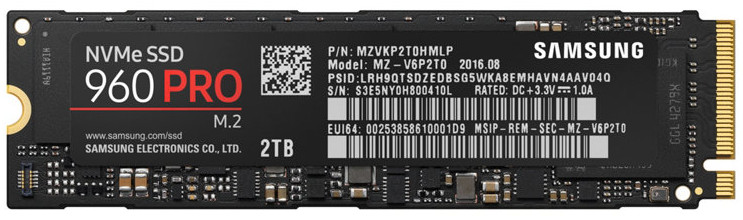<br>
https://commons.wikimedia.org/wiki/File:Ssd_960.jpg
</p>

SSDは次のような特徴を持っています。

* 補助記憶装置のなかでは読み書きの速度がかなり速い。
* 音を出さない。
* 可動部品がないため衝撃に強い。

現代の快適なPCライフのうち、多くの部分がSSDの特徴によって生み出されています。

HDD(ハード・ディスク・ドライブ, Hard Disk Drive)は、アルミニウムやガラスなどの硬い円盤(「プラッタ」といいます)に、磁性体(じせいたい、磁石の一種)を塗り、磁気制御装置(磁気ヘッド)によって情報を読み書きする補助記憶装置です。

<p align="center">
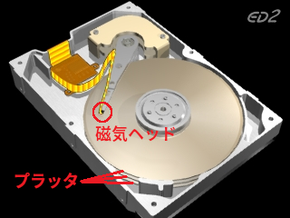 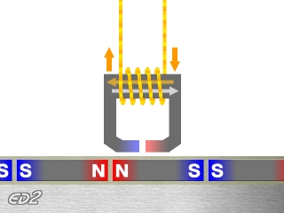<br>
左:HDDの構造 右: 磁気ヘッドが磁気を読み書きする模式図
</p>

「ハードディスク」という名前は、硬い円盤状の素材を使うことから名付けられました。HDDは次のような特徴を持っています。

* 書き換え回数が非常に多い。
* 長期間放置してもデータが消えにくい。
* 価格が安い。

PC用途では、HDDはSSDに取って代わられつつあります。しかし、速度よりも容量が必要な分野では、今後もHDDが使われ続けるだろうと言われています。

### 4.3 

・誤り訂正符号、RAID、暗号化、データ圧縮。


## 5. 

・巷にはびこる三文字略語の解説。


多くのゲームでは1/60秒単位で処理が行われます。そのため、1/60秒をあらわす単位として「フレーム」が使われます。

>例：「このエフェクトの表示時間、あと4フレーム短くならない？」

1/60秒は約16.7ミリ秒なので、この間に光が進む距離は約5千キロメートルです。日本からブラジルまでの距離は約1.7万キロメートルなので、光の速度でも3フレーム以上かかることになります。

<p align="center">
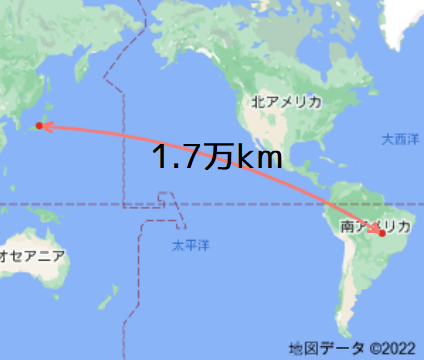
</p>


