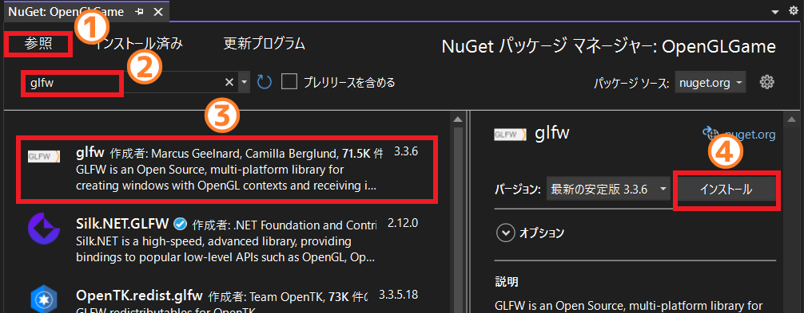
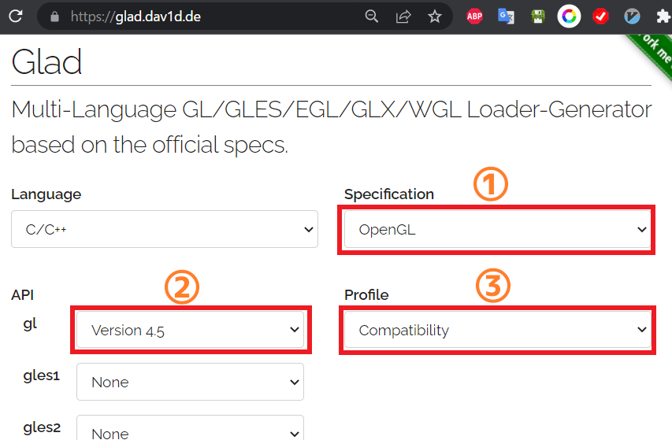

[OpenGL 3D 2022 第01回]

# OpenGLアプリを作ろう

## 習得目標

* GLFWとGLADライブラリを使って、OpenGLのウィンドウを作成できる。
* バッファオブジェクトを作成し、頂点データをGPUメモリにコピーできる。
* バーテックスアレイオブジェクト(VAO)を作成し、図形を描画できる。

## 1. OpenGLについて

### 1.1 習得目標について

このテキストでは、3D空間でプレイヤーが射撃して敵を全滅させる、アクションシューティングゲームを作っていきます。全13回の授業を通じて、以下の技術の獲得を目指します。

* OpenGLの管理方法
* OpenGLを使った3Dモデルの管理と表示
* 障害物との衝突判定
* カメラの制御

<p align="center">
<br>
[作成するゲームのイメージ]
</p>

学習をすすめるうえで、心に留めておいてほしいことがあります。それは、

>最初から全てを覚えようとしない。

ということです。

OpenGLやDirectXのようなグラフィックスプログラミングでは、みなさんがこれまで触れたことのない、さまざまな関数や定数を使いこなさなくてはなりません。

しかし、テキストでちょっと触れた程度では、ゲームを作るために必要となる全ての関数を覚えることは難しいでしょう。

ですから、最初は

>OpenGLを使ってできること。

を覚えてください。「できること」さえ覚えていれば、「やりかた」はテキストを読み返したり、インターネットで検索すれば見つけられます。

何度も読み返したり検索をして、OpenGLの機能を使い続けることによって、少しずつOpenGLの関数が身についていくと思います。

### 1.2 OpenGLとは

<p align="center">

</p>

現代のコンピュータには、一般的な計算処理を行う`CPU`(シーピーユー)の他に、グラフィックス処理を高速に行うための`GPU`(ジーピーユー)という部品が搭載されています。

そして、`CPU`から`GPU`を制御するための手順をまとめたものを「グラフィックスAPI(エーピーアイ、アプリケーション・プログラミング・インターフェイス)」といいます。

OpenGL(オープン・ジーエル)は、クロノス・グループ(Khronos Group)というアメリカの非営利団体が策定しているグラフィックスAPIです。

`GPU`を開発している会社は、`GPU`を制御する手順をOpenGL APIのルールに従って作成します。OpenGL APIに対応している`GPU`であれば、種類が異なっていても、同じプログラムを実行することができるようになります。

現代のほとんどの`GPU`にはOpenGLのAPIが用意されているので、OpenGLを習得すれば、ゲーム機、スマホ、PCなどあらゆる環境で、グラフィックスプログラムを作れるようになります。

また、OpenGL APIはC言語の関数として定義されています。そのため、C以外のプログラミング言語でも、Cの関数を呼び出す機能を作るだけでOpenGL APIを利用できます。

<p align="center">
<br>
[プログラムはAPIを通じてGPUを操作する]
</p>

現在、OpenGLの最新バージョンは4.6(2022.2.02現在)です。OpenGLは、バージョン3.1において、それまで使われていた「古い」グラフィックスAPIを全て捨て去り、「シェーダ」という機能を中心とした、より柔軟なグラフィックスAPIに置き換わりました。それ以来、徐々に機能を改善・追加しつつ現在に至ります。

>**【参考】**<br>
>OpenGL公式 `https://www.khronos.org/opengl/`<br>
>OpenGLの歴史 `https://www.khronos.org/opengl/wiki/History_of_OpenGL`

ただし、すべてのコンピュータで最新バージョンが動作するわけではありません。例えば、すこし古いパソコンでは、3.3(2010年に策定)や4.3(2012年に策定)までしか対応していません。また、アップル社のMacは2019年発売の機種でも4.1(2010年に策定)までしか対応していません。

そうはいっても、学習という点からはできるだけ最新の機能を使えるほうがよいです。そこで、本テキストではバージョン4.5(2014年に策定)を使用します。

>**【OpenGL以外のグラフィックスAPI】**<br>
>グラフィックスを扱うAPIとして、他にもVulkan(バルカン)やDirectX(ダイレクト・エックス)というAPIがあります。
>
>Vulkan(バルカン)はOpenGLと同様に、クロノス・グループが開発したAPIです。OpenGLの後継として、より高度なグラフィックス処理が可能です。反面、OpenGLと比べてかなり複雑な仕組みを採用していることから、扱いが難しいAPIになってしまっています。
>
>DirectX(ダイレクト・エックス)は、Microsoft社が開発したWindows専用のAPIです。APIはC++言語のクラスとして定義されているため、C言語を採用したAPIよりもプログラミングしやすくなっています。
>
>OpenGLとVulkanはWindows以外にもmacOS、Android OS、Linux、FreeBSDなどさまざまな環境で使用できます。このように、さまざまな環境で動作することを「クロスプラットフォーム」と呼びます。

### 1.3 表記について

本テキストでは、みなさんが実際に書き写す必要のあるプログラムは、次のように細い枠付きで示します。

```diff
 サンプルプログラム.
```

以前のサンプルプログラムに追加したり削除した部分がある場合、行頭にプラスまたはマイナスの記号を付けます。

```diff
-先頭にマイナス記号が付いているのは、削除する行です。
+プラス記号が付いているのは追加する行です。
 どちらも付いていない場合は変更しない行です。
```

また、書き写す必要のないサンプルプログラムや特記事項は、以下のように薄い水色の背景で示すことにします。

>これは書き写さない。

<br>

>**【1章のまとめ】**<br>
>
>* OpenGLは、さまざまなコンピュータやOSで動作する「グラフィックスAPI」のひとつ。
>* グラフィックスAPIとは、`CPU`から`GPU`を使うための手順をまとめたもの。OpenGLではC言語の関数として定義されている。
>* OpenGLでは「シェーダ」を使って画面を表示する。

<div style="page-break-after: always"></div>

## 2. Windowsアプリケーションの作成

### 2.1 プロジェクトの作成

まず、OpenGLを動かすアプリケーションの雛形を作ります。OpenGLのプログラムは、この雛形の上に増築していくことになります。

Visual Studio 2022を起動してください。そして、右側のリストから「新しいプロジェクトの作成」をクリックしましょう。すると「新しいプロジェクトの作成」ウィンドウが開きます。

<p align="center">

</p>

右側のプロジェクトテンプレートの一覧から「<ruby>空<rt>から</rt></ruby>のプロジェクト」を選択します(①)。「空のプロジェクト」では、Visual Studioは必要最小限のファイルとフォルダだけを作成します。ソースファイルやヘッダファイルは自分でプロジェクトに追加することになります。

項目が見つからない場合は「テンプレートの検索」という部分に「空」と入力してください。そして「空のプロジェクト」を選択したら「次へ」をクリックします(②)。

<p align="center">

</p>

すると、「新しいプロジェクトを構成します」というウィンドウに切り替わります。

<p align="center">

</p>

まず、これから作成するプロジェクトに名前をつけます(①)。プロジェクト名は、プロジェクトを格納するフォルダや、作成される実行ファイルの名前にも使われます。本テキストでは「OpenGLGame」としますが、好きな名前を付けてもらっても構いません。

次に、プロジェクトを保存する場所を決めます(②)。場所について気にしないのであれば、そのままで構いません。

その下に「ソリューションとプロジェクトを同じディレクトリに配置する」というチェックボックスがあると思います。もしチェックが入っていなかったら、クリックしてチェックを付けてください(③)。

最後に、名前、場所、チェックボックスをもう一度確認してください。問題がなければ「作成」ボタンをクリックしてプロジェクトを作成しましょう(④)。

>**【ソリューションって何？】**<br>
>「ソリューション」は複数のプロジェクトをまとめて扱うための機能です。ソリューション用のフォルダを作り、その中に複数のプロジェクト用フォルダを配置することで、プログラムを管理しやすくします。しかし、ひとつのプロジェクトしか使わない場合、階層が増えて分かりにくくなるだけです。だから、今回はソリューション用フォルダを作成しません。

### 2.2 使用するC++バージョンの設定

C++言語はその歴史の中で、何回かのバージョンアップが行われています。それぞれのバージョンは、それが成立した西暦の下位2桁を取って`C++17`(シー・プラス・プラス・セブンティーン、シープラプラ・じゅうなな)のように呼ばれます。

バージョンが上がるごとに便利な機能が追加されているので、できるだけ新しいバージョンを使うべきです。しかし、2021年時点の最新版である`C++20`について、Visual Studioはまだ完全に対応できていません。

そこで、本テキストでは十分に対応されている`C++17`を使うことにしました。

C++バージョンの指定は「プロパティページ」というウィンドウで設定します。プロパティページを開くには、ソリューションエクスプローラーのプロジェクト名をクリックして選択し、キーボードの`Alt`キーを押しながら`Enter`キーを押します。

<p align="center">

</p>

>**【ソリューションエクスプローラーが見あたらない！】**<br>
>ソリューション エクスプローラーが見つからないときは、上部メニューバーから<br>「表示→ソリューション エクスプローラー」<br>を選択してください。

すると、次のような「プロパティページ」ウィンドウが開きます。

<p align="center">

</p>

プロパティページを開いたら、以下の手順で「C++言語標準」を変更してください。

>1. 「構成」を「すべての構成」にする。
>2. 「プラットフォーム」を「すべてのプラットフォーム」にする。
>3. 「構成プロパティ」配下の「全般」をクリック。
>4. 右側の「C++言語標準」をクリック。
>5. 右端に表示された「ｖ」アイコンをクリック。
>6. 言語標準の一覧が表示されるので`ISO C++17標準(/std:c++17)`をクリック。
>7. OKボタンをクリック。

これで、使用するC++のバージョンが選択されます。

### 2.3 文字セットの設定

次に「文字セット」を設定します。文字セットはWindows用の関数が扱う文字データの種類で、以下の2種類があります。

>* マルチバイト: 半角英数は8ビット、全角文字は16ビットで表現される文字セット。
>* Unicode(ユニコード): すべての文字を16ビットで表現する文字セット。UTF-16と同等。

最近のWindows用アプリではUTF-16を使うことが多くなっていますが、古くからのアプリではマルチバイトが主流でした。OpenGLもUTF-16には対応していませんので、プロジェクトの設定をマルチバイトに変更しておきます。

ソリューションエクスプローラーのプロジェクト名をクリックして選択し、`Alt+Enter`キーを押して、プロパティページを開いてください。

<p align="center">

</p>

プロパティページを開いたら、以下の手順で「文字セット」を変更してください。

>1. 「構成」を「すべての構成」にする。
>2. 「プラットフォーム」を「すべてのプラットフォーム」にする。
>3. 「構成プロパティ」配下の「詳細」をクリック。
>4. 右側の「文字セット」をクリック。
>5. 右端に表示された「ｖ」アイコンをクリック。
>6. 言語標準の一覧が表示されるので`マルチバイト文字セットを使用する`をクリック。
>7. OKボタンをクリック。

これで文字セットの設定は完了です。

### 2.4 サブシステムの設定

次に「サブシステム」を設定します。サブシステムは、作成するプログラムの種類です。Windows用アプリを作成する場合、サブシステムを`Windows`に設定します。設定はプロパティページで行います。プロジェクト名を選択し、`Alt+Enter`キーを押してプロパティページを表示してください。

<p align="center">

</p>

以下の手順で「サブシステム」を変更してください。

>1. 「構成」を「すべての構成」にする。
>2. 「プラットフォーム」を「すべてのプラットフォーム」にする。
>3. 左側のリストから「リンカー」の左にある三角アイコンをクリック。
>4. 「リンカー」配下の「全般」をクリック。
>5. 右側の「サブシステム」をクリック。
>6. 右端に表示された「ｖ」アイコンをクリック。
>7. サブシステム一覧が表示されるので`Windows(/SUBSYSTEM:WINDOWS)`をクリック。
>8. OKボタンをクリック。

これでサブシステムの設定は完了です。

### 2.5 OpenGLコンテキスト

OpenGLの初期化は次の2段階からなります

1. OpenGLコンテキストの作成
2. 関数アドレスの取得

この章では、1の「OpenGLコンテキストの作成」を行います。

「OpenGLコンテキスト」は、OpenGL実行におけるあらゆる状態を保持します。また、実行環境による差異を吸収する役割も持っています。とりあえず「非常に複雑で巨大な構造体」だと考えてください。

OpenGLコンテキストが保持する主な状態には、以下のようなデータがあります(この図に挙げた以外にも、描画に必要なありとあらゆる状態が含まれます)。

<p align="center">

</p>

先に「OpenGLはクロスプラットフォームなライブラリである」と説明しました。しかし、OpenGLの初期化方法はプラットフォームごとに違っています。

その理由は、プラットフォームによって、ウィンドウの作成方法や描画パラメータの設定方法が異なるからです。OpenGLは共通のグラフィックス機能を提供するのが主な目的なので、初期化に関しては各プラットフォーム上で動作するOpenGL実装の提供者に一任されています。

例えば、WindowsでOpenGLコンテキストを作成するには`wglCreateContext`(ダブリュージーエル・クリエイト・コンテキスト)関数などの、WGL関数群を使います。

せっかくのクロスプラットフォームライブラリなのに、環境によって違うプログラムを書かなければならない、というのはとても不便です。そう思った人は世の中に何人もいて、この問題をなんとかしてくれるとても便利なライブラリを作ってくれています。本テキストでも、そういったライブラリを使っていくことにします。

### 2.6 <ruby>GLFW<rt>ジーエルエフダブリュー</rt></ruby>のインストール

OpenGLコンテキストを作成するライブラリには様々なものがありますが、今回は「GLFW(ジーエルエフダブリュー)」というものを選びました。理由は、Visual Studioの組み込まれている「NuGet(ニューゲット)」というツールを使って、簡単にインストールできるからです。

また、GLFWにはOpenGLコンテキストの作成だけでなく、ウィンドウを制御したり、キーボード、マウス、ジョイスティックを扱う機能も用意されています。OpenGLの世界では広く使われているライブラリなので、Webで情報を検索する場合も、それほど苦労はしないと思います。

>**【参考】** GLFW公式サイト `https://www.glfw.org`

「NuGet(ニューゲット)」は、さまざまなライブラリを簡単にインストールできるツールです。Visual Studioに最初から組み込まれているので、すぐに使うことができます。GLFWのWebサイトからダウンロードして、手動でインストールすることもできますが、NuGetを使うほうが簡単ですし手間もかかりません。

まずは「NuGetパッケージ管理ウィンドウ」を開きましょう。まずは、ソリューションエクスプローラーのプロジェクト名の上にマウスカーソルを持っていってください。そこで右クリックしてコンテキストメニューを表示します(①)。

<p align="center">

</p>

次に「NuGetパッケージの管理」という項目をクリックします(②)。すると、以下のようなパッケージ管理ウィンドウが開きます。

<p align="center">

</p>

NuGetでは、ライブラリやツールと、それをVisual Studioで使えるようにする手順をまとめたものを「パッケージ」と呼びます。

以下の手順で、新しいパッケージをインストールしてください。

>1. 左上にある「参照」をクリック。
>2. 「参照」のすぐ下にある検索テキストボックスに`glfw`と入力する。
>3. リストの最初にある`glfw`をクリック。
>4. 右側にパッケージの詳細が表示されるので、「インストール」ボタンをクリック。

上記の手順を実行すると、「変更のプレビュー」ウィンドウが開きます。

<p align="center">

</p>

OKボタンを押すとインストールが開始されます。NuGetタブの「×」ボタンを押して、パッケージ管理ウィンドウを閉じてください(インストール完了を待つ必要はありません)。

>**【バージョン番号について】**<br>
>パッケージのバージョン番号はテキスト執筆時点のものです。画像と番号が違っていても、気にせずインストールしてください。

### 2.7 Main.cppを追加する

それでは、最初のソースファイルを追加していきましょう。ソリューションエクスプローラーにある「ソースファイル」フィルターを右クリックしてください。するとコンテキストメニューが開くので、「追加→新しい項目」の順で選択してください。

<p align="center">

</p>

すると「新しい項目の追加」ウィンドウが開きます。

<p align="center">

</p>

右側パネルは「Visual C++」、中央パネルは「C++ファイル(.cpp)」が選択された状態になっていると思います。別の項目が選択されていた場合は、「Visual C++」「C++ファイル(.cpp)」をクリックして選択状態にして下さい(①、②)。

次に、ウィンドウ下部の「名前」テキストボックスの内容を「ソース.cpp」から「Main.cpp」に変更します(③)。

それから、「場所」テキストボックスの内容は、プロジェクトのフォルダになっていると思います。これを「`プロジェクトのフォルダ名\Src`」となるように変更してください(④)。

例えば、場所欄が次のようになっていたとします(場所欄の内容は人によって違います)。

>D:\\User\\Tanjiro\\source\\repos\\OpenGLGame\\

この末尾に`Src`を加えて、以下のように変更します。

>D:\\User\\Tanjiro\\source\\repos\\OpenGLGame\\Src

上記の例を参考に場所欄を変更したら「追加」ボタンをクリックしてください(⑤)。

ここで「ソリューション エクスプローラー」パネルに「Main.cpp」が追加されていることを確認してください。ここでフォルダを指定しているのは、Visual Studioが自動的に追加したファイルと、自分の意思で追加したファイルを、簡単に区別できるようにするためです。

>**【Srcという名前について】**<br>
>`Src`は「ソース」と読みます。これは`Source`(ソース)という英単語の短縮形です。「源」や「起源」または「情報源」という意味があります。コンピュータの世界では、「実行ファイル(アプリ)の元になるデータ」ということから、プログラムのことを「ソース」または「ソースコード」と呼ぶことが多いです。

### 2.8 最初のプログラム

それでは、最初のプログラムを書いていきましょう。ソリューションエクスプローラーに表示されている「Main.cpp」をダブルクリックして開き、次のプログラムを入力して下さい。

```diff
+/**
+* @file Main.cpp
+*/
+#include <GLFW/glfw3.h>
+#include <Windows.h>
+#include <string>
+
+/**
+* エントリーポイント
+*/
+int WINAPI WinMain(
+  _In_ HINSTANCE hInstnce,
+  _In_opt_ HINSTANCE hPrevInstance,
+  _In_ LPSTR lpCmdLine,
+  _In_ int nShowCmd)
+{
+  // GLFWの初期化
+  if (glfwInit() != GLFW_TRUE) {
+    return 1;
+  }
+
+  // 描画ウィンドウの作成
+  GLFWwindow* window = nullptr; // ウィンドウオブジェクト
+  const std::string title = "OpenGLGame"; // ウィンドウタイトル
+  window = glfwCreateWindow(1280, 720, title.c_str(), nullptr, nullptr);
+  if (!window) {
+    glfwTerminate();
+    return 1;
+  }
+
+  // OpenGLコンテキストの作成
+  glfwMakeContextCurrent(window);
+
+  // メインループ
+  while (!glfwWindowShouldClose(window)) {
+    glfwSwapBuffers(window);
+    glfwPollEvents();
+  }
+
+  // GLFWの終了
+  glfwTerminate();
+
+  return 0;
+}
```

プログラムが書けたらビルドして実行してください。以下に示すように、真っ黒なウィンドウが表示されたら成功です。「×」ボタンをクリックしてウィンドウを閉じてください。

<p align="center">

</p>

作成したプログラムを解説します。最初に`glfw3.h`(ジーエルエフダブリュー・スリー・エイチ)と`Windows.h`(ウィンドウズ・エイチ)という2つのヘッダファイルをインクルードしています。

* `glfw3.h`: GLFWライブラリの関数が定義されているヘッダファイルです。`3`の部分はGLFWのメジャーバージョンを示しています。
* `Windows.h`: ウィンドウズ用の関数が定義されているヘッダファイルです。

Windowsアプリを作成する場合、`main`関数の代わりに`WinMain`(ウィン・メイン)関数を使います。`WinMain`関数は`Windows.h`の中で宣言されている(正確にはさらにその中でインクルードされている`WinBase.h`)ので、`Windows.h`をインクルードしておく必要があります。

>**【WinMain関数の引数について】**<br>
>本テキストでは`WinMain`の引数を使う予定はありませんので、特に気にしなくて構いません。気になる方は`WinMain`でGoogle検索するとよいでしょう。

`WinMain`関数内では以下の作業を行っています。

>* GLFWライブラリの初期化
>* 描画ウィンドウの作成
>* OpenGLコンテキストの作成
>* メインループの定義
>* GLFWライブラリの終了

GLFWライブラリを初期化するには`glfwInit`関数を使います。

<p><code class="tnmai_code"><strong>【書式】</strong><br>
int glfwInit();
</code></p>

初期化に成功した場合は`GLFW_TRUE`(ジーエルエフダブリュー・トゥルー)が返されます。失敗した場合は`GLFW_FALSE`(ジーエルエフダブリュー・フォルス)が返されます。ですので、「戻り値が`GLFW_TRUE`でなければエラーとみなし、1を返して終了」というプログラムにしています。

>**【bool型について】**<br>
>`GLFW_TRUE`, `GLFW_FALSE`はC++でいうところの`true`, `false`です。ただ、旧来のC言語には`bool`型がないので(C99というバージョンで追加された)、多くのライブラリは、ライブラリ固有の真偽値を定義しています。

GLFWを初期化したら、次は描画ウィンドウを作成します。描画ウィンドウを作成するには`glfwCreateWindow`(ジーエルエフダブリュー・クリエイト・ウィンドウ)関数を使います。

<p><code class="tnmai_code"><strong>【書式】</strong><br>
GLFWwindow* glfwCreateWindow(ウィンドウの幅、ウィンドウの高さ,<br>
&emsp;タイトルバーに表示する文字列, 表示するモニタの選択, リソースを共有するウィンドウ);
</code></p>

`glfwCreateWindow`(ジーエルエフダブリュー・クリエイト・ウィンドウ)関数は、グラフィックス描画用のウィンドウを作成します。ウィンドウの作成に成功すると、「GLFWウィンドウオブジェクト」のアドレスを返します。失敗すると`nullptr`を返します。

「GLFWウィンドウオブジェクト」は、GLFWが作成したウィンドウのデータを管理するオブジェクトです。GLFWではこのオブジェクトを通して、ウィンドウの位置やサイズ、キー入力、マウス入力を取得します。

関数実行後、`window`変数をチェックして、失敗した場合は`glfwTerminate`(ジーエルエフダブリュー・ターミネート)関数を呼び出してから、アプリを終了させます。

`glfwTerminate`関数はGLFWを終了させます。`glfwInit`関数の呼び出しに成功した場合、アプリケーションを終了するまえに、必ずこの関数を呼び出さなければなりません。

<p><code class="tnmai_code"><strong>【書式】</strong><br>
void glfwTerminate();
</code></p>

次にOpenGLコンテキストを作成します。OpenGLコンテキストを作成するには`glfwMakeContextCurrent`(ジーエルエフダブリュー・メイク・コンテキスト・カレント)関数を使います。

<p><code class="tnmai_code"><strong>【書式】</strong><br>
void glfwMakeContextCurrent(GLFWウィンドウオブジェクトのアドレス);
</code></p>

この関数は、引数で指定したウィンドウに対応するOpenGLコンテキストを作成します。

>OpenGLコンテキストについて、くわしくは次のURLを参照してください。<br>
>`https://www.khronos.org/opengl/wiki/OpenGL_Context`

OpenGLコンテキストを作成したら、メインループを定義します。Windowsのようなシステムでは、必要に迫られるまでは画面を一切書き換えない、というのが一般的です。一方、多くのゲームは、一定時間ごとに次々と画面を書き換えます。そのおかげで、ユーザー操作の結果が、即座に画面に反映されるのです。

これは、ユーザー操作、ゲーム状態の更新、ゲーム状態の描画、という処理を定期的に繰り返すことで実現されています。大抵のゲームのプログラムには、ゲームの基本的な処理を繰り返す部分が存在します。この部分のことを「メインループ」(あるいは「ゲームループ」)といいます。C++の場合、メインループは`for`や`while`を使って作ることが多いです。

GLFWライブラリを使ってメインループを作成する場合、以下の3つの関数を組み込む必要があります。

<p><code class="tnmai_code"><strong>【書式】</strong><br>
int glfwWindowShouldClose(GLFWwindowへのポインタ);
</code></p>

`glfwWindowShouldClose`(ジーエルエフダブリュー・ウィンドウ・シュッド・クローズ)関数は、ウィンドウを閉じるべきかどうかを調べる関数です。終了要求が来ていなければ0を、ユーザー操作などの結果、終了要求が来ていれば0以外を返します。GLFWで作成したウィンドウが1つだけの場合、アプリの終了判定はこの関数の戻り値によって行います。

>**【複数のウィンドウを扱う場合】**<br>
>本テキストでは扱いませんが、もし複数のウィンドウを作成した場合は、最後のウィンドウ、あるいはメインウィンドウが閉じられたかどうかを判定する必要があるでしょう。

<p><code class="tnmai_code"><strong>【書式】</strong><br>
void glfwSwapBuffers(GLFWwindowへのポインタ);
</code></p>

`glfwSwapBuffers`(ジーエルエフダブリュー・スワップ・バッファーズ)関数は、フレームバッファの表示側と描画側を入れ替えます。「フレームバッファ」というのは絵を描画するためのメモリです。

GLFWでは、2つのフレームバッファAとBを用意して、まずAを表示側、Bを描画側に設定します。表示側のフレームバッファのことを「フロントバッファ」、描画側のフレームバッファのことを「バックバッファ」といいます。

Bの描画が終わったら、AとBの役割を交換して、Bを表示側、Aを描画側にします。コンピューターは今度はAに描画を行い、それが終わったら再びAとBの役割を交換し、Aを表示側、Bを描画側に戻します。

この仕組みによって、描画中の画面がユーザーに見えてしまうことを防いでいます。

<p><code class="tnmai_code"><strong>【書式】</strong><br>
void glfwPollEvents();
</code></p>

`glfwPollEvents`(ジーエルエフダブリュー・ポール・イベンツ)関数は、「OSからの要求」を処理するための関数です。キーボードやマウスなどの状態を取得するには、この関数を定期的に呼び出す必要があります。

>**【2章のまとめ】**<br>
>
>* OpenGLの初期化方法は環境によって異なる。GLFWなどのライブラリを使うと、環境の違いに対応できる。
>* OpenGLを使うには、「OpenGLコンテキスト」という「巨大で複雑な構造体のようなもの」を作成する必要がある。
>* 画面を表示するには`glfwSwapBuffers`関数を実行して、フロントバッファとバックバッファを交換する。
>* GLFWを適切に動作させるには、定期的に`glfwPollEvents`関数を実行して、OSからの要求を処理しなくてはならない。

<div style="page-break-after: always"></div>

## 3. 関数アドレスの取得

### 3.1 <ruby>GLAD<rt>グラッド</rt></ruby>のダウンロード

OpenGLコンテキストを作成しただけでは、まだOpenGLのの関数は使えません。関数を使えるようにするには、使いたいOpenGL関数へのポインタをグラフィックス・ドライバなどから取得しなければなりません。

OpenGLのプログラムを書くには、関数ポインタを取得するプログラムを、アプリケーションで利用する全ての関数に対して行います。問題は、OpenGLで定義された関数が数百個にのぼることです。実際に使う関数に限ったとしても、50個はあるでしょう。

そんなにたくさんの関数ポインタを取得するプログラムを書くのは非常に面倒です。しかも、ちょっと名前が違うだけで、プログラムとしてはほぼ同じです。このような単純作業を避けるために、便利なライブラリを使っていくことにします。

OpenGLコンテキストを作成するライブラリにさまざまなものがあるように、OpenGLの関数アドレスを取得するライブラリも複数存在します。その中で、今回は`GLAD`(グラッド)というライブラリを使うことにしました。

`GLAD`の利点は、プロジェクトにソースファイルとヘッダファイルを追加するだけで使えることと、それらのファイルを簡単にwebから取得できることです。

>ダウンロードページ: `https://glad.dav1d.de/`<br>
>webサイト: `https://github.com/Dav1dde/glad`

webブラウザでダウンロードページを開いてください。以下のような画面が表示されると思います。

<p align="center">

</p>

### 3.2 GLADのダウンロード

`GLAD`のダウンロードページが表示されたら、まず`Specification`(スペシフィケーション)を「OpenGL」に設定します(①)(すでに設定されている場合はそのまま)。次に`API`(エーピーアイ)の`gl`(ジーエル)を「Version 4.5」に設定します(②)。最後に、`Profile`(プロファイル)を「Compatibility」(コンパチビリティ)に設定します(③)。

3つの設定が済んだら、ページを下にスクロールさせます。以下のような項目が見えてくると思います。

<p align="center">

</p>

項目が見えたら`Generate a loader`(ジェネレート・ア・ローダー)にチェックが入っていることを確認します(①)(入っていなかったらクリックしてチェックを入れてください)。そして、右下の`Generate`(ジェネレート)ボタンをクリックすると、以下のダウンロードページに切り替わります。

<p align="center">

</p>

`glad.zip`をクリックして、ファイルをプロジェクトの`Src`フォルダにダウンロードしてください。ダウンロードしたら、ウィンドウズのエクスプローラーを開き、自分で作成したOpenGLGameプロジェクトの`Src`フォルダを開いてください。

<p align="center">

</p>

ダウンロードした`glad.zip`を右クリックしてメニューを表示し(①)、「すべて展開」を選択してください。すると「圧縮(ZIP形式)フォルダーの展開」ウィンドウが表示されます。

<p align="center">

</p>

「完了時に展開されたファイルを表示する」をクリックしてチェックを外し(①)、「展開」ボタンを押してください(②)。これで`Src`フォルダに`glad`フォルダが作成されます。ファイルを展開したら、`glad.zip`は不要なので削除してください(誤って`glad`フォルダを消さないように注意)。

### 3.3 GLADをプロジェクトに追加する

Visual Studioを開き、ソリューションエクスプローラーの「ソース ファイル」項目を右クリックしてコンテキストメニューを開いてください(①)。そして「追加→新しいフィルター」の順にクリックして新しいフィルターを追加してください(②、③)。

<p align="center">

</p>

フィルターを追加したら、そのフィルターの名前を`glad`に変更してください。

次に、Visual Studioの上にエクスプローラーを表示します。そして、エクスプローラーでプロジェクトの`Src`フォルダを開いてください。`glad`フォルダが見えていると思います。

その`glad`フォルダを、Visual Studioの`glad`フィルターへ「ドラッグ&ドロップ」してください。

<p align="center">

</p>

この操作によって、`glad`フォルダに含まれるすべてのファイルがプロジェクトに追加されます。コンテキストメニューの「既存の項目を追加」を使うこともできますが、「既存の項目を追加」では特定のフォルダの中にあるファイルしか選択できません。そのため、複数のフォルダを一括で追加したい場合はドラッグ&ドロップのほうが便利です。

### 3.4 Visual Studioにヘッダファイルの場所を教える

現在、`GLAD`のヘッダファイルをインクルードしようとすると、

`#include "glad/include/glad/glad.h"`

のように書かなければなりません。さらに、`Src`フォルダ以外の場所にあるファイルの場合、その場所に応じてパスを変更する必要があります。これは不便なので、Visual Studio「ヘッダファイルの場所を指定する機能」を使うことにします。

ソリューションエクスプローラーに表示されているプロジェクト名を選択し、`Alt+Enter`キーを押して「プロパティページ」を開いてください。

<p align="center">

</p>

プロパティウィンドウを開いたら、以下の手順でインクルードディレクトリを追加してください。

>1. 「構成」を「すべての構成」にする。
>2. 「プラットフォーム」を「すべてのプラットフォーム」にする。
>3. 左側のリストから「C/C++」をクリック。
>4. 「C/C++」配下の「全般」をクリック。
>5. 右側の「追加のインクルードディレクトリ」をクリック。
>6. 右端に表示された「ｖ」アイコンをクリック。
>7. 表示されたウィンドウの「<選択…>」をクリック。

上記の操作を行うと「追加のインクルードディレクトリ」というウィンドウが開きます。

<p align="center">

</p>

ウィンドウ上部のテキストボックスをクリックして、次のテキストを入力してください(①)。

`$(ProjectDir)Src\glad\include`

入力したら、「OK」ボタンをクリックしてウィンドウを閉じてください(②)。プロパティウィンドウに戻るので、プロパティウィンドウの「OK」ボタンをクリックして、このウィンドウも閉じてください。

この操作によって、ファイルの場所に関わらず、以下の書き方をすればGLADのヘッダファイルをインクルードできるようになります。

`#include "glad/glad.h"`

>**【補足】**<br>
>NuGetを使ったインストールでは、このインクルードディレクトリの追加も自動的にやってくれています。だから、`#include <GLFW/glfw3.h>`でインクルードできるわけです。

### 3.5 glad.hをインクルードする

それでは、GLADライブラリを使ってOpenGL関数を使えるようにしていきましょう。まずはGLADのヘッダファイルをインクルードします。`Main.cpp`の先頭に、次のプログラムを追加してください。

```diff
 /**
 * @file Main.cpp
 **/
+#include "glad/glad.h"
 #include <GLFW/glfw3.h>
 #include <Windows.h>
```

`glad.h`は、GLADライフラリの関数が定義されているヘッダファイルです。`glad.h`は最初にインクルードしなくてはなりません。理由は「`gl.h`をインクルードさせないため：です。

OpenGLには`gl.h`(ジーエル・エイチ)という標準のヘッダファイルがあります。`glfw3.h`や`Windows.h`は自動的に`gl.h`をインクルードしようとします。

ところが、`gl.h`にはバージョン1.1までの定義しか書かれていません。そこで`glad.h`で置き換える必要があるのですが、ライブラリのヘッダを直接書き換えるわけにはいきません。

そこで、`glfw3.h`や`Windows.h`より前に`glad.h`をインクルードします。これによって、先に読み込まれる`glad.h`の定義が優先され、`gl.h`の定義は無視されるようになります。

>**【重要】**<br>
>`glad.h`は必ず最初にインクルードすること.

### 3.6 関数アドレスを取得する

それでは、`GLAD`ライブラリを使って関数アドレスを取得しましょう。関数アドレスを取得するプログラムを、次のように書き換えてください。

```diff
   // OpenGLコンテキストの作成
   glfwMakeContextCurrent(window);
+
+  // OpenGL関数のアドレスを取得する
+  if (!gladLoadGLLoader(reinterpret_cast<GLADloadproc>(glfwGetProcAddress))) {
+    glfwTerminate();
+    return 1;
+  }

  // メインループ
  while (!glfwWindowShouldClose(window)) {
```

関数アドレスを取得するには`glfwGetProcAddress`(ジーエルエフダブリュー・ゲット・プロック・アドレス)関数を使用します。この関数にOpenGL関数名を渡すと、その名前に対応する関数のアドレスを返してくれます。

<p><code class="tnmai_code"><strong>【書式】</strong><br>
GLFWglproc glfwGetProcAddress(アドレスを知りたい関数の名前);
</code></p>

この関数をGLADライブラリの`gladLoadGLLoader`(グラッド・ロード・ジーエル・ローダー)関数に渡すと、必要な関数のアドレスを全て取得してくれます。

<p><code class="tnmai_code"><strong>【書式】</strong><br>
int gladLoadGLLoader(関数アドレスを取得する関数);
</code></p>

ただ、GLFWとGLADは全く別のライブラリなので、関数の型が微妙に異なります。そこで、`reinterpret_cast`(リ・インタープリト・キャスト)を使って、GLADライブラリの型にキャストしています。

### 3.7 OpenGLの関数を使う

```diff
   // メインループ
   while (!glfwWindowShouldClose(window)) {
+    // バックバッファをクリア
+    glClearColor(0.9f, 0.6f, 0.3f, 1.0f);
+    glClear(GL_COLOR_BUFFER_BIT | GL_DEPTH_BUFFER_BIT);
+
     glfwSwapBuffers(window);
     glfwPollEvents();
   }
```

<p><code class="tnmai_code"><strong>【書式】</strong><br>
void glClearColor(赤色の量, 緑色の量, 青色の量, アルファ値色の量);
</code></p>

`glClearColor`関数は、`glClear`関数でバックバッファを消去するときに使われる色を指定します。引数は「赤(R)、緑(G)、青(B)、透明度(A)」の各要素を0.0～1.0で表した値です。引数を(0, 0, 0, 1)にすると黒、(1, 1, 1, 1)にすると白になります。

<p><code class="tnmai_code"><strong>【書式】</strong><br>
void glClear(消去するバッファを示すビットフラグ);
</code></p>

`glClear`関数は、実際にバックバッファを消去する関数です。フレームバッファはひとつ以上のサブバッファで構成されているので、消去するバッファの種類を指定する必要があります。指定できる値は以下の3つです。

| バッファの種類 | 値 |
|:---|:--|
| カラーバッファ | `GL_COLOR_BUFFER_BIT`(ジーエル・カラー・バッファ・ビット) |
| 深度バッファ   | `GL_DEPTH_BUFFER_BIT`(ジーエル・デプス・バッファ・ビット) |
| ステンシルバッファ | `GL_STENCIL_BUFFER_BIT`(ジーエル・ステンシル・バッファ・ビット) |

カラーバッファは名前のとおり「色」を扱います。深度バッファはピクセルの奥行き情報を扱います。ステンシルバッファは画像の一部を「切り抜く」ための特殊なバッファです。

プログラムが書けたらビルドして実行してください。黒かった描画ウィンドウがオレンジ色になっていたら成功です。

<p align="center">

</p>

<pre class="tnmai_assignment">
<strong>【課題01】</strong>
描画ウィンドウを水色(または好きな色)で塗りつぶしてください。
</pre>

>**【3章のまとめ】**<br>
>
>* OpenGLの関数を使うには「関数のアドレス」を取得する必要がある。
>* 関数は大量にあるので、関数のアドレスを取得するのは`GLAD`のようなライブラリにまかせるとよい。
>* 手動でライブラリを追加した場合、「追加のインクルードディレクトリ」という項目に、ヘッダファイルのある場所を指定する。

<div style="page-break-after: always"></div>

## 4. ポリゴンを表示する

### 4.1 データをGPUメモリにコピーする

背景色を変えられるだけではあまり面白くありません。三角形を表示してみましょう。OpenGLで図形を描画するには、以下の3つのデータを用意する必要があります。

>* 頂点データ: 頂点の座標や法線など。
>* インデックスデータ: 図形を構成する頂点の番号。
>* 頂点データ形式: 頂点データの解釈方法。

これらのデータはOpenGLの関数によってGPUメモリにコピーされ、図形を描画する指示を受け取ったときに利用されます。

>**【GPUメモリ？】**<br>
>「GPU(ジーピーユー)メモリ」は「GPUが直接読み書きできるメモリ」のことです。`VRAM`(ブイ・ラム)やビデオメモリ、グラフィックスメモリとも呼ばれます。

それでは、データを作成するプログラムを追加しましょう。関数アドレスを取得するプログラムの下に、次のプログラムを追加してください。

```diff
   if (!gladLoadGLLoader(reinterpret_cast<GLADloadproc>(glfwGetProcAddress))) {
     glfwTerminate();
     return 1;
   }
+
+  // 頂点データをGPUメモリにコピー
+  const float vertexData[][3] = {
+    {-0.2f,-0.2f, 0}, { 0.2f,-0.2f, 0}, { 0.0f, 0.2f, 0}
+  };
+  GLuint vbo = 0; // 頂点バッファの管理番号
+  glCreateBuffers(1, &vbo);
+  glNamedBufferStorage(vbo, sizeof(vertexData), vertexData, 0);
+
+  // インデックスデータをGPUメモリにコピー
+  const GLushort indexData[] = {
+    0, 1, 2,
+  };
+  GLuint ibo = 0; // インデックスバッファの管理番号
+  glCreateBuffers(1, &ibo);
+  glNamedBufferStorage(ibo, sizeof(indexData), indexData, 0);

   // メインループ
   while (!glfwWindowShouldClose(window)) {
```

`GLuint`(ジーエル・ユー・イント)、`GLushort`(ジーエル・ユー・ショート)といった、頭に`GL`のつく名前は、OpenGLのヘッダファイルで定義されている型です。

OpenGLのようにハードウェアを操作するライブラリでは、特定のビット数の型が必要になることがあります。しかし、C/C++が標準で定義している`int`や`char`といった型は、環境によってビット数が異なります。例えば`int`型は、ある環境では32ビット、別の環境では64ビット、また別の環境では16ビットです。

そのため、OpenGLは「全ての環境で同じビット数となる独自の型」を用意しています。それが「頭に`GL`のつく型」の正体です。

>OpenGLが定義する型の一覧は、次のURLから参照できます。<br>
>`https://www.khronos.org/opengl/wiki/OpenGL_Type`

`vertexData`(バーテックス・データ)配列は、以下の座標系における座標を表しています。

<p align="center">

</p>

>上図には書いてありませんが、Z座標も`-1～+1`の範囲になります。

`indexdata`(インデックス・データ)は「図形を構成する頂点番号」の配列です。頂点データの先頭を0番として、何番目の頂点を使うかを示しています。

頂点データとインデックスデータの作成方法は同じです。どちらも`glCreateBuffers`(ジーエル・クリエイト・バッファーズ)と`glNamedBufferStorage`(ジーエル・ネームド・バッファ・ストレージ)を使います。

<p><code class="tnmai_code"><strong>【書式】</strong><br>
void glCreateBuffers(作成するオブジェクト数, 番号を格納する配列のアドレス);
</code></p>

`glCreateBuffers`は、メモリを管理する`Buffer Object`(バッファ・オブジェクト)を作成する関数です。バッファオブジェクトは、GPUメモリを管理するためのオブジェクトです。

OpenGLではポインタではなく「番号」によってオブジェクトを管理します。上記のプログラムでは、変数`vbo`と`ibo`にオブジェクトの管理番号が格納されます。管理番号には常に`1`以上の値が割り当てられます。管理番号`0`は「バッファオブジェクトが作成されていない」ことを意味します。

頂点データを格納するオブジェクトのことを`Vertex Buffer Object`(バーテックス・バッファ・オブジェクト)といいます。略称は`VBO`(ブイ・ビー・オー)です。

インデックスデータを管理するオブジェクトはを`Index Buffer Object`(インデックス・バッファ・オブジェクト)といいます。略称は`IBO`(アイ・ビー・オー)です。

<p><code class="tnmai_code"><strong>【書式】</strong><br>
void glNamedBufferStorage(バッファの管理番号, コピーするバイト数, コピーするデータのアドレス,<br>
&emsp;各種フラグ);
</code></p>

`glNamedBufferStorage`はGPUメモリを確保して、そこにデータをコピーする関数です。メモリの確保だけを行う場合は、データのアドレスに`nullptr`を指定します。

この2つの関数のペアは、GPUメモリについて`new`や`malloc`と同じことを行う機能だと考えてください。

### 4.2 頂点データ形式を設定する

次に頂点データ形式を設定します。頂点データ形式は、`glNamedBufferStorage`で確保したGPUメモリに、どんなデータがどのように詰め込まれているかをGPUに教えるためのデータです。

インデックスデータをGPUメモリにコピーするプログラムの下に、次のプログラムを追加してください。

```diff
   GLuint ibo = 0; // インデックスバッファの管理番号
   glCreateBuffers(1, &ibo);
   glNamedBufferStorage(ibo, sizeof(indexData), indexData, 0);
+
+  // 頂点データの構成情報を設定
+  GLuint vao = 0; // 構成情報の管理番号
+  glCreateVertexArrays(1, &vao);
+  glBindVertexArray(vao);
+  glBindBuffer(GL_ARRAY_BUFFER, vbo);
+  glBindBuffer(GL_ELEMENT_ARRAY_BUFFER, ibo);
+  glEnableVertexAttribArray(0);
+  glVertexAttribPointer(0, 3, GL_FLOAT, GL_FALSE, 0, 0);

   // メインループ
   while (!glfwWindowShouldClose(window)) {
```

頂点データ形式を管理するオブジェクトのことを、`Vertex Array Object`(バーテックス・アレイ・オブジェクト)といいます。略称は`VAO`(ブイ・エー・オー)です。

`VAO`は、かなり複雑な設定ができるように作られています。そのために設定項目が多く、最初は難しく感じるかもしれません。詳しい説明は次回以降にやりますので、今回は「そういうもの」として進めてもらって大丈夫です。

<p><code class="tnmai_code"><strong>【書式】</strong><br>
void glCreateVertexArrays(作成するオブジェクト数, 番号を格納する配列のアドレス);
</code></p>

`glCreateVertexArrays`(ジーエル・クリエイト・バーテックス・アレイズ)は、`VAO`を作成する関数です。

<p><code class="tnmai_code"><strong>【書式】</strong><br>
void glBindVertexArray(OpenGLコンテキストに割り当てるVAOの管理番号);
</code></p>

`glBindVertexArray`(ジーエル・バインド・バーテックス・アレイ)は、OpenGLコンテキストに`VAO`を割り当てる関数です。

基本的にOpenGLの関数は、OpenGLコンテキストに割り当てられているオブジェクトを対象とします。そのため、関数を実行する前に、操作したいオブジェクトを、OpenGLコンテキストに割り当てておく必要があります。

<p><code class="tnmai_code"><strong>【書式】</strong><br>
void glBindBuffer(割り当てるオブジェクトの種類,<br>
&emsp;OpenGLコンテキストに割り当てるバッファオブジェクトの管理番号);
</code></p>

`glBindBuffer`(ジーエル・バインド・バッファ)は、バッファオブジェクトをOpenGLコンテキストに割り当てる関数です。

この関数にはさらに、「`VAO`が使うバッファオブジェクトを指定する」という役割もあります。`VAO`がOpenGLコンテキストに割り当てられている場合、バッファオブジェクトはまず「OpenGLコンテキスト」に割り当てられ、さらに`VAO`に管理番号が記録されます。

`VAO`が割り当てられていない場合、OpenGLコンテキストに割り当てる操作だけが行われます。

<p><code class="tnmai_code"><strong>【書式】</strong><br>
void glEnableVertexAttribArray(有効にする頂点属性配列のインデックス);
</code></p>

`glEnableVertexAttribArray`(ジーエル・イネーブル・バーテックス・アトリブ・アレイ)は、「頂点属性」を有効にする関数です。

>**【頂点属性、頂点属性配列とは】**<br>
>頂点属性は、頂点データ形式のことです。頂点属性配列は、頂点属性の配列のことです。GPUは16要素の頂点属性配列を扱うことができます。しかし、常に16個全てを扱うとデータの処理に時間がかかるので、通常は必要な部分だけを有効にします。

<p><code class="tnmai_code"><strong>【書式】</strong><br>
void glVertexAttribPointer(頂点属性配列のインデックス, データの要素数,<br>
&emsp;データの型, 次のデータまでのバイト数, 最初のデータの位置);
</code></p>

`glVertexAttribPointer`(ジーエル・バーテックス・アトリブ・ポインタ)は、簡単に言うと「`glBindBuffer`で割り当てたバッファには、こういうデータが入っているよ」ということをGPUに教える関数です。OpenGLのリファレンスでは「汎用頂点属性を定義する関数」と説明されています。

例えば、頂点バッファオブジェクトに3次元座標を格納する場合、データはX, Y, Zの3つの`float`型のセットになります。そこで、「データの要素数=`3`」、「データの型=`GL_FLOAT`」として、GPUに頂点データの扱い方を指示します。

「次のデータまでのバイト数」に`0`を指定すると、「データ型のバイト数(`float`なら`4`)×データの要素数」が使われます。

「最初のデータの位置」は、頂点データが構造体のように複数のメンバを持つ場合に使用します。最初のメンバなら`0`、次のメンバは「最初のメンバのバイト数」になります。

### 4.3 描画コマンドを実行する

3種類のデータをGPUメモリにコピーすることができたので、実際に図形を描画します。メインループに次のプログラムを追加してください。

```diff
     // バックバッファをクリア
     glClearColor(0.5f, 0.6f, 0.7f, 1.0f);
     glClear(GL_COLOR_BUFFER_BIT | GL_DEPTH_BUFFER_BIT);
+
+    // 図形を描画
+    glDrawElementsInstanced(GL_TRIANGLES, 3, GL_UNSIGNED_SHORT, 0, 1);

     glfwSwapBuffers(window);
     glfwPollEvents();
   }
```

図形を描画するには`glDrawElementsInstanced`(ジーエル・ドロー・エレメンツ・インスタンスド)という関数を使います。

<p><code class="tnmai_code"><strong>【書式】</strong><br>
void glDrawElementsInstanced(基本図形の種類, 描画するデータ数,<br>
&emsp;インデックスデータの型, データの開始位置, 描画する図形の数);
</code></p>

「基本図形の種類」には、OpenGLが描画できる7種類の図形のひとつを指定します。

「描画するデータ数」と「データの開始位置」を適切に指定することで「頂点データの一部だけを描画する」ことができます。これは、`VAO`の割り当て処理にかかる時間を減らすために、頂点属性が同じ図形をひとつのバッファオブジェクトに詰め込んでいる場合に役立ちます。

「インデックスデータの型」には、描画に使う`IBO`に格納したインデックスデータの型を指定します。これは以下の3つから選択できます。基本的には、必要なバイト数と表現可能範囲のバランスが取れた`GLushort`が使われます。

| インデックスの型 | 対応する定数名 | バイト数 | 表現可能な範囲 |
|:-:|:--|:-:|:-:|
|GLubyte  | <ruby>GL_UNSIGNED_BYTE<rt>ジーエル・アンサインド・バイト</rt></ruby> | 1 | 0～255 |
|GLushort | <ruby>GL_UNSIGNED_SHORT<rt>ジーエル・アンサインド・ショート</rt></ruby> | 2 | 0～65,535 |
|GLuint   | <ruby>GL_UNSIGNED_INT<rt>ジーエル・アンサインド・イント</rt></ruby> | 4 | 0～4,294,967,295 |

「描画する図形の数」は通常は`1`を指定します。単純にこの数値を増やすだけでは、三角形が複数表示されたりはしないので注意してください。この引数を意味あるものにするには、「シェーダ・プログラム」を書く必要があります。

>**【エレメンツって何？】**<br>
現代では「インデックス」という呼び方が主流ですが、OpenGLが作られた当時は、インデックスのことを「エレメント」と呼んでいました。そのため、インデックスを操作する関数には`Element`という単語が含まれています。OpenGLに関して検索すると、「エレメント・アレイ」や`EBO`といった単語が見つかるのも同じ理由によります。

プログラムが書けたらビルドして実行してください。白い三角形が表示されたら成功です。

<p align="center">

</p>

### 4.4 多角形を表示する

頂点データを追加して、四角形を表示しましょう。`vertexData`配列と`indexData`配列に、次のデータを追加してください。

```diff
   // 頂点データをGPUメモリにコピー
   const float vertexData[][3] = {
     {-0.2f,-0.2f, 0}, { 0.2f,-0.2f, 0}, { 0.0f, 0.2f, 0},
+    {-0.8f,-0.2f, 0}, {-0.4f,-0.2f, 0}, {-0.4f, 0.2f, 0}, {-0.8f, 0.2f, 0},
   };
   GLuint vbo = 0; // 頂点バッファの管理番号
   glCreateBuffers(1, &vbo);
   glNamedBufferStorage(vbo, sizeof(vertexData), vertexData, 0);

   // インデックスデータをGPUメモリにコピー
   const GLushort indexData[] = {
     0, 1, 2,
+    3, 4, 5, 5, 6, 3,
   };
   GLuint ibo = 0; // インデックスバッファの管理番号
```

次に、`glDrawElementsInstanced`関数の第2引数を、増やしたデータに合わせて変更します。図形を描画するプログラムを次のように変更してください。

```diff
     // バックバッファをクリア
     glClearColor(0.5f, 0.6f, 0.7f, 1.0f);
     glClear(GL_COLOR_BUFFER_BIT | GL_DEPTH_BUFFER_BIT);

     // 図形を描画
-    glDrawElementsInstanced(GL_TRIANGLES, 3, GL_UNSIGNED_SHORT, 0, 1);
+    glDrawElementsInstanced(GL_TRIANGLES, 9, GL_UNSIGNED_SHORT, 0, 1);

     glfwSwapBuffers(window);
     glfwPollEvents();
   }
```

プログラムが書けたらビルドして実行してください。三角形の左に四角形が表示されていたら成功です。

<p align="center">

</p>

<pre class="tnmai_assignment">
<strong>【課題02】</strong>
頂点データとインデックスデータを追加して、三角形の右側にも四角形を表示しなさい。
</pre>

### 4.4 プリミティブとバーテックス

`glDrawElementsInstanced`関数に指定できる図形の種類は次のとおりです。

<p align="center">

</p>

|定数名|説明|
|---|---|
|<ruby>GL_POINTS<rt>ジーエル・ポインツ</rt></ruby>|点の集まりです|
|<ruby>GL_LINES<rt>ジーエル・ラインズ</rt></ruby>|直線の集まりです|
|<ruby>GL_LINE_STRIP<rt>ジーエル・ライン・ストリップ</rt></ruby>|連続した直線です|
|<ruby>GL_LINE_LOOP<rt>ジーエル・ライン・ループ</rt></ruby>|GL_LINE_STRIPの最初と最後の点の間にも直線が引かれます|
|<ruby>GL_TRIANGLES<rt>ジーエル・トライアングルズ</rt></ruby>|三角形の集まりです|
|<ruby>GL_TRIANGLE_STRIP<rt>ジーエル・トライアングル・ストリップ</rt></ruby>|辺のつながった三角形の集まりです|
|<ruby>GL_TRIANGLE_FAN<rt>ジーエル・トライアングル・ファン</rt></ruby>|辺のつながった、最初の頂点を共有する三角形の集まりです|

これらの図形のことを「`Primitive`(プリミティブ)」と呼びます。プリミティブというのは「原型、原始的」という意味の英単語です。この7種類で表現できない形状は、プリミティブ組み合わせて作ります。あらゆる図形の原型となる形状だから「プリミティブ」という名前が付けられているわけです。

このうち、現在もっともよく使われている図形は`GL_TRIANGLES`です。というのも、このプリミティブがあれば、ほぼ全ての図形を表現できるからです。そのため、現代の多くのGPUは`GL_TRIANGLES`を特に効率的に処理できるように作られています。

プリミティブを構成する点のことを「`Vertex`(バーテックス)」といいます。そして、頂点の座標や色などのパラメータの集合を「頂点データ」といいます。ゲームのキャラクターや背景のほとんどは、どんなに複雑な形状であっても、これらのプリミティブを組み合わせることで描画されています。

また、同じ頂点データであっても、プリミティブを変えることで異なる図形を描画することができます。

>**【消えた四角形・多角形プリミティブ】**<br>
>OpenGL 3.0以前は、四角形を表す`GL_QUADS`(ジーエル・クアッズ)や、多角形を表す`GL_POLYGON`(ジーエル・ポリゴン)といったプリミティブがありました。しかし、それらは三角形などの基本形状で再現が可能なため、バージョン3.1において削除されました。他に「隣接頂点付きプリミティブ」というプリミティブもあるのですが、「ジオメトリシェーダ」専用なので、本テキストでは扱いません。

<pre class="tnmai_assignment">
<strong>【課題03】</strong>
<code>glDrawElementsInstanced</code>の第1引数を<code>GL_POINTS</code>に変更してプログラムを実行し、描画内容がどのように変化するかを確認しなさい。確認したら、次は<code>GL_LINES</code>に変更して、描画内容の変化を確認しなさい。確認したら、<code>GL_TRIANGLES</code>に戻しなさい。
</pre>

>**【4章のまとめ】**<br>
>
>* 図形を描画するには、図形のデータをGPUメモリにコピーしなくてはならない。
>* データをGPUメモリへコピーするには`glGreateBuffers`と`glBufferStorage`のペアを使用する。
>* OpenGLが描画できる基本図形のことを「プリミティブ」という。

<div style="page-break-after: always"></div>

## 5. エラー処理

### 5.1 デバッグコンテキストを作成する

古いOpenGLでは、エラーを調べるには明示的に`glGetError`(ジーエル・ゲット・エラー)関数を呼び出す必要がありました。しかし、OpenGLのバージョン4.3から、「コールバック」という仕組みでエラーを通知する機能が追加されました。

この機能を十分に活用するには、OpenGLコンテキストを「デバッグコンテキスト」として作成する必要があります。ウィンドウを作成するプログラムに、次のプログラムを追加してください。

```diff
   // 描画ウィンドウの作成
   GLFWwindow* window = nullptr; // ウィンドウオブジェクト
   const std::string title = "OpenGLGame"; // ウィンドウタイトル
+  glfwWindowHint(GLFW_OPENGL_DEBUG_CONTEXT, GLFW_TRUE);
   window = glfwCreateWindow(1280, 720, title.c_str(), nullptr, nullptr);
   if (!window) {
```

GLFWライブラリを使ってコンテキストの種類を設定するには、`glfwWindowHint`(ジーエルエフダブリュー・ウィンドウ・ヒント)関数を使います。

<p><code class="tnmai_code"><strong>【書式】</strong><br>
void glfwWindowHint(ヒントの種類, ヒントに設定する値);
</code></p>

デバッグコンテキストを作成するには、ヒントの種類に`GLFW_OPENGL_DEBUG_CONTEXT`(ジーエルエフダブリュー・オープンジーエル・デバッグ・コンテキスト)を指定します。

この引数に設定できる値は以下の2つです。

| 値 | 効果 |
|:-:|:--|
| `GLFW_TRUE` | デバッグコンテキストを作成する |
| `GLFW_FALSE` | 通常のコンテキストを作成する |

これでデバッグコンテキストが作成されるようになりました。

>ヒントの種類、設定できる値については、以下のURLを参照してください。<br>
>`https://www.glfw.org/docs/3.3/window_guide.html#window_hints`

### 5.2 コールバック関数を作る

「コールバック」は、事前に関数を登録しておくと、何らかの条件によって、登録した関数が呼び出される、という仕組みです。C#などの言語で「デリゲート」と呼ばれているものに似ています。

コールバックによって呼び出される関数のことを「コールバック関数」といいます。コールバックの仕組みを利用するには、まずコールバック関数を定義しなくてはなりません。`Main.cpp`に次のプログラムを追加してください。

```diff
 #include <GLFW/glfw3.h>
 #include <Windows.h>
 #include <string>
+
+/**
+* OpenGLからのメッセージを処理するコールバック関数
+*
+* @param source    メッセージの発信者(OpenGL、Windows、シェーダなど)
+* @param type      メッセージの種類(エラー、警告など)
+* @param id        メッセージを一位に識別する値
+* @param severity  メッセージの重要度(高、中、低、最低)
+* @param length    メッセージの文字数. 負数ならメッセージは0終端されている
+* @param message   メッセージ本体
+* @param userParam コールバック設定時に指定したポインタ
+*/
+void GLAPIENTRY DebugCallback(GLenum source, GLenum type, GLuint id,
+  GLenum severity, GLsizei length, const GLchar* message, const void* userParam)
+{
+  std::string s;
+  if (length < 0) {
+    s = message;
+  } else {
+    s.assign(message, message + length);
+  }
+  s += '^n';
+  OutputDebugString(s.c_str());
+}

 /**
 * エントリーポイント
```

この関数は、OpenGLから渡されたメッセージをVisual Studioの出力ウィンドウに表示します。とりあえず、message以外の引数は使いません。メッセージの扱いに慣れてきたら、「重要度の高いメッセージだけ表示する」などの改造をしてみるとよいでしょう。

>引数にどんな値が渡されるのかについては、以下のURLを参照してください。<br>
>`https://www.khronos.org/opengl/wiki/Debug_Output`

出力ウィンドウへの表示には`OutputDebugString`(アウトプット・デバッグ・ストリング)関数を使います。

<p><code class="tnmai_code"><strong>【書式】</strong><br>
void OutputDebugString(出力する文字列);
</code></p>

### 5.2 コールバック関数を登録する

次に、`DebugCallback`関数をOpenGLのコールバック関数として登録します。コールバック関数の登録には`glDebugMessageCallback`(ジーエル・デバッグ・メッセージ・コールバック)関数を使います。OpenGL関数のアドレスを取得するプログラムの下に、次のプログラムを追加してください。

```diff
   if (!gladLoadGLLoader(reinterpret_cast<GLADloadproc>(glfwGetProcAddress))) {
     glfwTerminate();
     return 1;
   }
+
+  // メッセージコールバックの設定
+  glDebugMessageCallback(DebugCallback, nullptr);

   // 頂点データをGPUメモリにコピー
   const float vertexData[][3] = {
```

`glDebugMessageCallback`の最初の引数は「呼び出す関数のアドレス」です。2番目の引数は「関数の`userParam`引数に渡される値」です。今回は特に渡すものがないので、`nullptr`を指定しています。

これで、エラーや不具合があったときは、その原因がすぐに出力ウィンドウに表示されるようになりました。

### 5.3 わざとエラーを起こしてみる

コールバックが正しく働いていることを確かめてみましょう。簡単な方法は、削除または非推奨とされた関数を実行することです。ということで、コールバック関数を登録するプログラムの下に、次のプログラムを追加してください。

```diff
   glDebugMessageCallback(DebugCallback, nullptr);
+
+  glDrawElementsInstanced(GL_POINT, 3, GL_UNSIGNED_SHORT, 0, 1);
+  glDrawElementsInstanced(GL_POINTS, GL_UNSIGNED_SHORT, 3, 0, 1);

   // メインループ.
  while (!glfwWindowShouldClose(window)) {
```

最初の行は、`GL_POINTS`と書くべきところを`GL_POINT`と間違えています。2行目は、引数の順番を間違えています。

プログラムが書けたらビルドして実行してください。Visual Studioの出力ウィンドウに、以下のような英文メッセージが表示されていたら成功です。

<p align="center">

</p>

エラーメッセージは長文になりがちです。出力ウィンドウ上部の「右端で折り返す」アイコンをクリックして、折返し表示を有効にしておくと読みやすくなります。

コールバックが動作していることを確認したら、`glDrawElementsInstanced`を削除します。

```diff
   glDebugMessageCallback(DebugCallback, nullptr);
-
-  glDrawElementsInstanced(GL_POINT, 3, GL_UNSIGNED_SHORT, 0, 1);
-  glDrawElementsInstanced(GL_POINTS, GL_UNSIGNED_SHORT, 3, 0, 1);

   // メインループ.
  while (!glfwWindowShouldClose(window)) {
```

これで第01回のテキストは終了です。お疲れさまでした。

>**【5章のまとめ】**<br>
>
>* OpenGLの関数に間違った引数を指定するとエラーになる。
>* デバッグコールバックを設定しておくと、関数のエラーを表示することができる。
