[OpenGL 3D 2022 第02回]

# グラフィックス・パイプラインとシェーダ

## 習得目標

* GPUにはグラフィックスパイプラインというものがあり、パイプラインの一部はシェーダで作成する、ということを説明できる。
* イン変数、アウト変数を定義して、シェーダからシェーダへとデータを送ることができる。
* ユニフォーム変数を定義して、C++プログラムからシェーダへとデータを送ることができる。
* テクスチャオブジェクトを作成し、サンプラ型を定義して図形にテクスチャを表示できる。
* テクスチャ座標が`(0, 0)`から`(1, 1)`の範囲であることを理解している。

## 1. グラフィックス・パイプライン

### 1.1 グラフィックス・パイプラインの概要

OpenGLはプリミティブを描画することできる、ということが分かりました。早速描画しよう！となるところですが、その前に、OpenGLがどのような手順でプリミティブを描画するのかを説明しましょう。

OpenGLの描画は、それぞれが異なる処理を行う「ステージ」という単位に分けられています。ステージが順番に実行されることで、最終的にレンダー・バッファ(Render Buffer。描画した画像を格納するメモリ上の領域)にプリミティブが描画されます。

この、「ステージが順番に実行される仕組み」のことを「グラフィックス・パイプライン」と呼びます。グラフィックス・パイプラインは次のような構造になっています。

<p align="center">
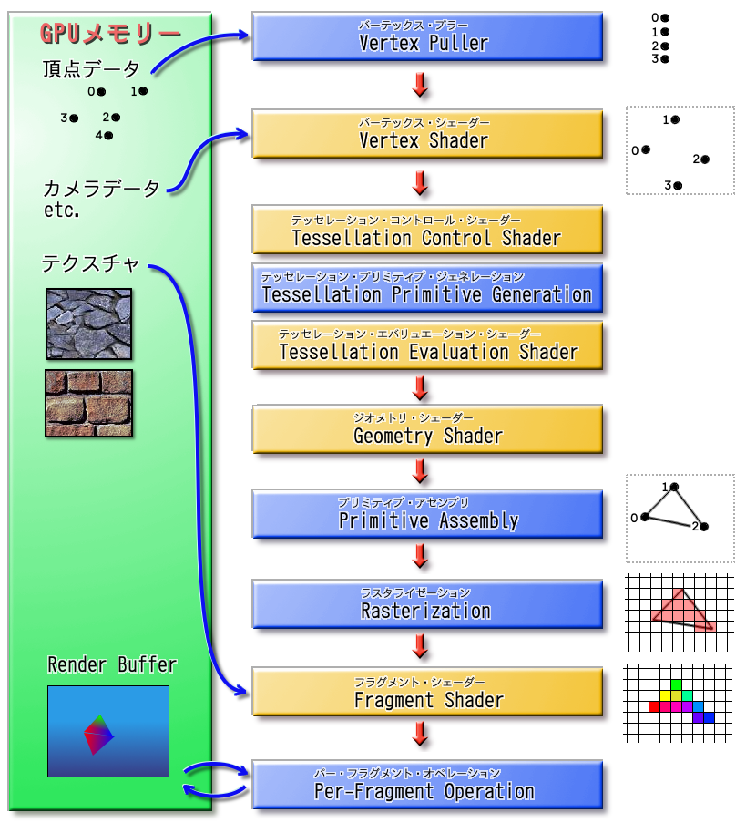
</p>

「石油パイプライン」という言葉を聞いたことがあるでしょうか。金属製の筒(つつ)を、線のように長くつないだもので、石油はこの中を通って、ある地点から別の地点へと運ばれていきます。グラフィックス・パイプラインは名前の通り、石油ではなく画像を運びます。

石油パイプラインと違うところは、画像がパイプラインの中を進んでいくごとに、少しずつ加工されていく点です。自動車工場なんかで製品がベルトコンベアの上を流れていって、それをちょっとずつ組み立てていく「ライン生産方式」のほうが、イメージとしては近いでしょう。

なお、グラフィックス・パイプラインの全ての機能を覚える必要はありません。今は、流れ作業で画像が作られていくイメージが分かかれば十分です。詳しい知識が必要になったら、このテキストで復習したり、インターネットで検索するとよいでしょう。

### 1.2 <ruby>Vertex Puller<rt>バーテックス・プラー</rt></ruby>(VP)

ここからは、パイプラインの動作を順番に説明します。VP(バーテックス・プラー)はグラフィックス・パイプラインの最初のステージです。VPはGPUメモリからひとつずつ頂点データを取り出し、Vertex  Shaderステージへ渡します。

取り出されるのは、頂点データのうちVertex Shaderが実際に必要とする情報だけです。どの情報を取り出せばいいかは、「頂点アトリビュート」というパラメーターで設定します。

>**【補足】**<br>
>Vertex(バーテックス)は「頂点」という意味で、Pull(ぷる)は「引っ張る」という意味です。つまり、Vertex Pull-erは「頂点データを引っ張り出す装置」といった意味合いになります。

### 1.3 <ruby>Vertex Shader<rt>バーテックス・シェーダ</rt></ruby>(VS)

VS(バーテックス・シェーダ)は最初のプログラム可能なステージです。VPで読み取られた全ての頂点データは、最初にこのステージで処理されます。

VSでは、プリミティブの回転、拡大縮小、移動のほか、座標系の変換、頂点単位のライティングなど、様々な操作を行うことができます。VSは省略できません。

>**【補足】**<br>
>Shade(シェード)は「光を遮る、陰影を付ける」という意味です。ですから、Shade-rは「陰影を付ける装置」といった意味になります。

### 1.4 <ruby>Tessellation Control Shader<rt>テッセレーション・コントロール・シェーダ</rt></ruby>(TCS)

TCS(テッセレーション・コントロール・シェーダ)は「テッセレーション」ステージの最初のステージです。テッセレーション・ステージは3つのステージで構成され、共同で「テッセレーション」と呼ばれる処理を行います。

テッセレーションは「同じ模様を隙間なく敷き詰める」という意味の単語です。コンピューター・グラフィックスの世界では「描画する画像に細かなディテールを加えるために、プリミティブをより多くの小さなプリミティブに分割する」操作のことを指します。

基本的な使い方は、頂点データを低ポリゴンモデルにしておき、テッセレーション・ステージで高ポリゴンモデルを生成する、というものです。頂点データは低ポリゴンモデルのみ用意すればいいので、GPUメモリを節約できます。

TCSは、新たに作成する小さなプリミティブの頂点データを、どこに、どのように作成するかを指定する作業を担当します。TCSはVSと同様にプログラム可能なステージです。

テッセレーション・ステージは省略可能ですが、3つのステージはセットで扱われるため、3つ全てを使用するか、全て省略するかのいずれかになります。

> 本テキストではテッセレーションについては扱いません。そのため、TCSについてもこれ以上詳細な説明はしませんが、このようなステージがあるということは覚えておいてください。

### 1.5 <ruby>Tessellation Primitive Generation<rt>テッセレーション・プリミティブ・ジェネレーター</rt></ruby>(TPG)

TPG(テッセレーション・プリミティブ・ジェネレーション)は「テッセレーション」ステージの2番目のステージです。これはVPと同じく固定機能のステージです。

TPGはTCSからの情報を受け取り、実際に小さなプリミティブへと分割し、最後のテッセレーション・ステージであるTESへと送ります。

### 1.6 <ruby>Tessellation Evaluation Shader<rt>テッセレーション・エバリュエーション・シェーダ</rt></ruby>(TES)

TES(テッセレーション・エバリュエーション・シェーダ)は最後の「テッセレーション」ステージです。TESはTCS同様にプログラム可能なステージで、TPGから受け取ったプリミティブの座標や色を変形し、実際に複雑なディテールを加える役割を持ちます。

### 1.7 <ruby>Geometry Shader<rt>ジオメトリ・シェーダ</rt>(GS)

GS(ジオメトリ・シェーダ)は、ひとつのプリミティブの全頂点データを受け取り、0個以上のプリミティブの頂点データを生成して後段のステージへ送ります。

プリミティブを増やすという点は「テッセレーション」ステージと似ていますが、このステージの特徴は、頂点を増やすだけでなく、削除もできることです。

テッセレーションは「元のプリミティブを分割する」という処理に最適化され、大量のプリミティブを生成するのに向いているのに対して、GSは「プリミティブの頂点データから別のプリミティブを生成する、あるいは削除する」という、比較的小規模かつ汎用的な処理を得意とします。

GSはプログラム可能なステージです。また、テッセレーション・ステージと同様に省略することができます。GSはパーティクルの描画や輪郭線の生成など、様々な用途で使われています。本テキストではGSは扱いません。

### 1.8 <ruby>Primitive Assembly<rt>プリミティブ・アセンブリ</rt></ruby>(PA)

PA(プリミティブ・アセンブリ)は、前段のステージで変換された1つ以上の頂点データを蓄積し、プリミティブを構成できる数になった段階で、まとめて次のステージへ渡します。例えば`GL_TRIANGLES`の場合は3つです。PAは固定機能のステージです。

### 1.9 <ruby>Rasterization<rt>ラスタライゼーション</rt></ruby>(RS)

RS(ラスタライゼーション)は、PAから送られたプリミティブをもとにフラグメントと呼ばれるピクセル片を生成し、後段のFragment Shaderへと送ります。RSは固定機能ステージです。各フラグメントは2～3つの頂点データを補間した値を持ちます。

RSはまた、裏向きのプリミティブを除去したり(カリングといいます)、プリミティブの画面に表示されない部分を切り捨てたり (クリッピングといいます) します。

また、RSは「ビューポート」というパラメータを使って、「クリッピング空間」から「スクリーン空間」への変換を行います。これらについては今後のテキストで説明します。

### 1.10 <ruby>Fargment Shader<rt>フラグメント・シェーダ</rt></ruby>(FS)

FS(フラグメント・シェーダ)は最後のプログラム可能なステージで、RSより送られてきたフラグメントから、実際の色を計算します。

VSがひとつの頂点データを受けとり、ひとつの頂点を送り出すように、FSもひとつのフラグメントを受け取り、ひとつの色を送り出します。FSは主に、フラグメント単位のライティングを行うために使用されます。

>**【補足】**<br>
>Fragment(フラグメント)は「破片、断片」という意味です。OpenGLにおける「Fragment」とは、RSがプリミティブを分解したあとの、ピクセル単位の個々の領域を指す単語です。

### 1.11 <ruby>Per-Fragment Operations<rt>パー・フラグメント・オペレーション</rt></ruby>(PFO)

PFO(パー・フラグメント・オペレーションズ)はグラフィックス・パイプラインの最後のステージです。

PFOは固定機能のステージです。FSから送られてきた色情報と深度情報を「レンダー・バッファ」や「デプス・バッファ」、「ステンシル・バッファ」と呼ばれるメモリ上の領域に書き込みます。

PFOはまた、FSからの色情報とレンダー・バッファの色を、さまざまな方法で合成する機能も備えています。このステージの結果が、レンダー・バッファに書き込まれることになります。

>**【1章のまとめ】**<br>
>
>* プリミティブを描画する仕組みのことを「グラフィックス・パイプライン」と呼ぶ。
>* グラフィックス・パイプラインに、頂点データや座標変換行列などのパラメータを送り込むことで、プリミティブを描画する。
>* グラフィックス・パイプラインのパラメータを変えることで、同じ頂点データでも描画結果が異なる。

<div style="page-break-after: always"></div>

## 2. シェーダを使う

### 2.1 シェーダについて

シェーダ・プログラム(`Shader Program`)は、GPUが実行するプログラムのことです。ご存知かと思いますが、GPUはピクセルの陰影を付けるためのハードウェアです。

「陰影をつける」ことを英語で「`Shade`(シェード)」と言います。これに「～するモノ」を示す`-er`を付けて、「陰影を付けるためのプログラムやプロセッサ」のことを「シェーダ」と呼ぶようになりました。

大抵は「シェーダ」とだけ書き、プログラムなのかプロセッサなのかは文脈から判別します。明確にしたい場合は「シェーダ・プログラム」、「シェーダ・プロセッサ」と書きます。

本テキストでは、特に断りがない限り「シェーダ」は「シェーダ・プログラム」のことを指します。

OpenGLのシェーダは`GLSL`(Open**GL** **S**hading **L**anguage, オープン・ジーエル・シェーディング・ランゲージ)という言語で記述します。

GLSLはC言語をベースにして、シェーダにとって必要な機能や型を追加し、不要な機能を削除した言語です。このため、普通のCコンパイラではGLSLをビルドできません。代わりに、OpenGLの機能を使ってビルドします。

グラフィックスパイプラインの章で説明したように、シェーダには以下の5種類があります。

>* 頂点(バーテックス)・シェーダ
>* テッセレーション・コントロール・シェーダ
>* テッセレーション・エバリュエーション・シェーダ
>* ジオメトリ・シェーダ
>* フラグメント・シェーダ

このうち、最低限必要なのは「頂点シェーダ」と「フラグメントシェーダ」の2つです。残りの3種類は、より高度な画面効果を表現するためのシェーダです。

>**【第6のシェーダ】**<br>
>グラフィックスパイプラインとは別に、計算だけを行う「コンピュート・シェーダ」というシェーダが存在します。つまり、実際には全部で6種類のシェーダあることになります。

### 2.2 シェーダを書く

さっそくシェーダを書いてみしょう。ソリューションエクスプローラーの「リソースファイル」フィルタを右クリックしてコンテキストメニューを開き、「追加→新しい項目」を選択してください。

<p align="center">
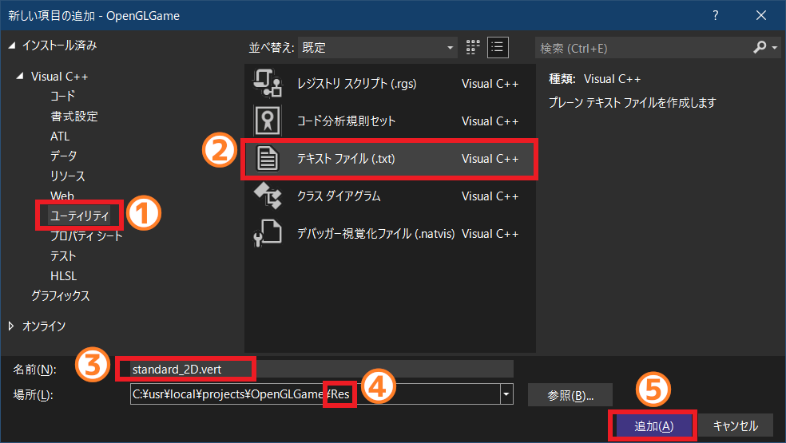
</p>

そして、以下の手順で頂点シェーダファイルを追加してください。

>1. 左のリストから「ユーティリティ」を選択。
>2. 中央のリストから「テキストファイル(.txt)」を選択。
>3. 名前欄に`standard_2D.vert`を入力。
>4. 場所欄をプロジェクトの`Res`フォルダに設定。
>5. 「追加」ボタンをクリック。

追加した`standard_2D.vert`(スタンダード・ツーディ・バート)を開き、次のプログラムを追加してください。

```diff
+/**
+* @file standard_2D.vert
+*/
+#version 450
+
+// シェーダへの入力
+layout(location=0) in vec3 inPosition; // 頂点座標
+
+void main()
+{
+  gl_Position = vec4(inPosition, 1);
+}
```

これは「頂点シェーダ」です。頂点シェーダは「図形の頂点の座標を決定する」シェーダです。頂点シェーダは「図形の頂点ひとつにつき1回実行」されます。

同様にして、プロジェクトの`Res`フォルダに`standard_2D.frag`というファイルを追加してください。追加したファイルを開き、次のプログラムを追加してください。

```diff
+/**
+* @file standard_2D.frag
+*/
+#version 450
+
+// 出力する色データ
+out vec4 outColor;
+
+void main()
+{
+  outColor = vec4(0.5, 0.5, 0.5, 1.0);
+}
```

これは「フラグメントシェーダ」です。フラグメントシェーダは「画面に表示するピクセルの色を決定する」シェーダです。フラグメントシェーダは「図形のピクセルひとつにつき1回実行」されます。

各シェーダの先頭にある`#version 450`はシェーダの「バージョン指定」です。ここにはGLSLのバージョン番号を100倍した値を指定します。例えばバージョン4.5の場合は`4.5*100=450`を指定します。

バージョン番号の下にあるのは、各シェーダ・ステージへの入力、および出力に使われる変数です。見慣れない定義なので、最初のうちは分かりづらいと思います。しかし、以下のように「型」と「変数名」と手前に、「修飾子(しゅうしょくし)」と呼ばれる属性が追加されているだけです。

<p align="center">
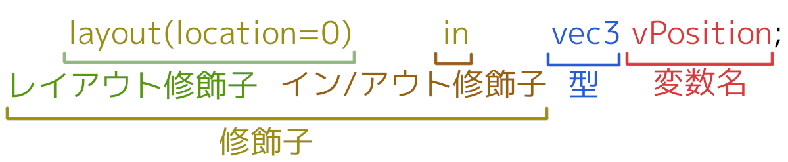
</p>

修飾子は「他のプログラムとやり取りするための属性」を設定します。多くのシェーダは単独では意味をなさず、他のシェーダと協力しながらグラフィックスを作り上げます。そのため、他のシェーダからデータをもらったり、逆にデータを渡したりするための書式が決められています。

`layout`(レイアウト)は「レイアウト修飾子」です。レイアウト修飾子は、他のプログラムが変数にアクセスするための番号を付けたり、型やステージに固有の属性を設定するために使います。番号を付けるには`location`(ロケーション)を使います。

`in`(イン)、`out`(アウト)は「イン/アウト修飾子」です。`in`修飾子のついた変数を「イン変数」、`out`修飾子のついた変数を「アウト変数」といいます。

頂点シェーダの場合、イン変数にはバーテックスプラーステージから送られた値が設定されます。これは、実際には`glVertexArrayAttribPointer`関数によって指定した頂点データです。イン変数は書き換え禁止です。

シェーダからの出力はアウト変数に格納します。基本的に、シェーダはすべてのアウト変数に値を設定しなければなりません。アウト変数に格納した値は、次のシェーダ・ステージのイン変数にコピーされます。

`vec3`(ベク・スリー)、`vec4`(ベク・フォー)は、3つまたは4つの要素を持つGLSLの組み込み型です。基本的には、以下の構造体と同じものだと考えてください。

>```c++
>struct vec3 {
>  float x;
>  float y;
>  float z;
>};
>
>struct vec4 {
>  float x;
>  float y;
>  float z;
>  float w;
>};
>```

GLSLのすべての組み込み型はコンストラクタを持っていて、`vec4(inPosition, 1)`のように書くことができます。

`gl_Position`はGLSLが自動的に定義する特別な変数です。この変数は`vec4`型の出力変数になります。自動的に定義されるとはいえ出力変数には違いないので、頂点シェーダでは必ず`gl_Position`を設定しなくてはなりません。

>グローバル変数は`gl_Position`だけではありません。くわしくは以下のURLを参照してください。<br>
>`https://www.khronos.org/opengl/wiki/Built-in_Variable_(GLSL)`

### 2.2 シェーダのコンパイル

作成したシェーダファイルをグラフィックス・パイプラインで使えるようにするには、以下の手順で「コンパイル」と「リンク」を行う必要があります。

>1. 頂点シェーダファイルを読み込む。
>2. 頂点シェーダをコンパイルする。
>3. フラグメントシェーダファイルを読み込む。
>4. フラグメントシェーダをコンパイルする。
>5. 頂点シェーダとフラグメントシェーダをリンクする。

ファイルの読み込みには`ifstream`(アイ・エフ・ストリーム)クラスと`filesystem`名前空間を使います。`Main.cpp`を開き、以下の2つのヘッダファイルをインクルードしてください。

```diff
 #include <GLFW/glfw3.h>
 #include <Windows.h>
 #include <string>
+#include <vector>
+#include <fstream>
+#include <filesystem>

 /**
 * OpenGLからのメッセージを処理するコールバック関数
```

次に、エラーメッセージコールバックを設定するプログラムの下に、次のプログラムを追加してください。

```diff
   // メッセージコールバックの設定
   glDebugMessageCallback(DebugCallback, nullptr);
+
+  // 頂点シェーダを読み込んでコンパイルする
+  std::ifstream file;
+  GLuint vs = 0; // 頂点シェーダの管理番号
+  vs = glCreateShader(GL_VERTEX_SHADER);
+  const char filenameVS[] = "Res/standard_2D.vert";
+  file.open(filenameVS, std::ios::binary); // ファイルを開く
+  if (file) {
+    // メインメモリ領域を確保
+    std::vector<char> s(std::filesystem::file_size(filenameFS));
+
+    // ファイルを読み込む
+    file.read(s.data(), s.size());
+    s.push_back('\0'); // ヌル終端を追加
+
+    // ソースを設定してコンパイル
+    const char* a[] = { s.c_str() };
+    glShaderSource(vs, 1, a, nullptr);
+    glCompileShader(vs);
+  }
+  file.close();

   // 頂点データをGPUメモリにコピー
   const float vertexData[][3] = {
```

シェーダを管理するオブジェクトを作成するには`glCreateShader`(ジーエル・クリエイト・シェーダ)関数を使います。

<p><code class="tnmai_code"><strong>【書式】</strong><br>
GLuint glCreateShader(作成するシェーダの種類);
</code></p>

シェーダの種類には`GL_????_SHADER`という値を指定します。`????`の部分には`VERTEX`, `FRAGMENT`などが入ります。よく似た`GL_????_SHADER_BIT`という値が存在するので、間違えないように注意してください。

この関数の戻り値は「作成したシェーダオブジェクトの管理番号」です。

ファイルを読み込むには`ifstream`クラスを使います。`ifstream`には様々なメンバ関数が定義されていますが、今回は以下の3つを使います。

| メンバ関数名 | 用途 |
|:-:|:--|
| `open(ファイル名, フラグ)` | ファイルを開く。フラグに`std::ios::binary`を指定すると<br>バイナリモードになる。 |
| `read(バッファアドレス, 読み込むバイト数)` | ファイルを読み込む。 |
| `close()` | ファイルを閉じる。 |

`open`(オープン)関数に`std::ios::binary`(エスティーディー・アイオーエス・バイナリ)フラグを指定すると、バイナリモードでファイルを開きます。バイナリモードは改行文字の変換等を行わないため、読み込みが速くなります。

ファイルストリームクラスは`bool`型に変換することができます。変換結果は、ファイルが正常に開かれていれば`true`、エラーが起きていたら`false`になります。この機能と`if`を組み合わせることで、「ファイルを開くことができた場合のみ処理を行う」プログラムが書けます。

ファイルを開くことができたらファイルを読み込みます。読み込みには`read`(リード)関数を使います。

また、今回はファイル全体を一気に読み込みたいので、ファイルサイズを取得しなければなりません。ファイルサイズを取得するには`filesystem`名前空間の`file_size`(ファイル・サイズ)関数を使います。

<p><code class="tnmai_code"><strong>【書式】</strong><br>
uintmax_t file_size(ファイルパス);
</code></p>

`unitmax_t`は、「処理系で表現可能な最大の符号なし整数型」と定義されています。x64系のCPUでは`uint64_t`相当であることが多いです。

次に読み込んだファイルをコンパイルします。シェーダをコンパイルするには、まず`glShaderSource`(ジーエル・シェーダ・ソース)関数でシェーダ文字列を設定します。

<p><code class="tnmai_code"><strong>【書式】</strong><br>
void glShaderSource(シェーダの管理番号, 文字列の数, 文字列の配列, 文字列長の配列);
</code></p>

GLSLコンパイラにはインクルード文を扱う機能がありありません。そのかわり、複数の文字列を指定できるようになっています。ライブラリファイルなどがある場合、それらを文字列配列に指定することで、インクルード文に近いことが実現できます。

すべての文字列が`\0`で終わっている場合、文字列長の配列には`nullptr`を指定できます。

シェーダ文字列を設定したら、`glCompileShader`(ジーエル・コンパイル・シェーダ)関数を呼び出します。

<p><code class="tnmai_code"><strong>【書式】</strong><br>
void glCompileShader(シェーダの管理番号);
</code></p>

この関数は、直前の`glShaderSource`関数で指定されたシェーダ文字列をコンパイルします。

最後に`close`(クローズ)関数を実行してファイルを閉じます。

続いてフラグメントシェーダをコンパイルします。頂点シェーダをコンパイルするプログラムの下に、次のプログラムを追加してください。

```diff
     glCompileShader(vs);
   }
   file.close();
+
+  // フラグメントシェーダを読み込んでコンパイルする
+  GLuint fs = 0; // フラグメントシェーダの管理番号
+  fs = glCreateShader(GL_FRAGMENT_SHADER);
+  const char filenameFS[] = "Res/standard_2D.frag";
+  file.open(filenameFS, std::ios::binary);
+  if (file) {
+    std::vector<char> s(std::filesystem::file_size(filenameFS));
+    file.read(s.data(), s.size());
+    s.push_back('\0');
+    const char* ss[] = { s.data() };
+    glShaderSource(fs, 1, ss, nullptr);
+    glCompileShader(fs);
+  }
+  file.close();

   // 頂点データをGPUメモリにコピー
   const float vertexData[][3] = {
```

このプログラムは頂点シェーダとほとんど同じなので、コピペして作成すると簡単でしょう。ただし、変数名、引数、ファイル名など、コピー元とは異なる部分は注意深く変更すること。

### 2.3 シェーダのリンク

頂点シェーダとフラグメントシェーダをコンパイルしたら、この2つをリンクして、実行可能なプログラムオブジェクトを作成します。

フラグメントシェーダをコンパイルするプログラムの下に、次のプログラムを追加してください。

```diff
     glCompileShader(fs);
   }
   file.close();
+
+  // 2つのシェーダをリンクする
+  GLuint progSprite = 0; // プログラムオブジェクトの管理番号
+  progSprite = glCreateProgram();
+  glAttachShader(progSprite, vs);
+  glAttachShader(progSprite, fs);
+  glLinkProgram(progSprite);

   // 頂点データをGPUメモリにコピー
   const float vertexData[][3] = {
```

プログラムオブジェクトを作成するには`glCreateProgram`(ジーエル・クリエイト・プログラム)関数を使います。

<p><code class="tnmai_code"><strong>【書式】</strong><br>
GLuint glCreateProgram();
</code></p>

`glCreateShader`と異なり、プログラムオブジェクトは1種類しかないので引数はありません。戻り値は「作成したプログラムオブジェクトの管理番号」です。

管理番号は適当な変数に代入しておきます。今回は`progSprite`(プログ・スプライト)という名前の変数に代入しました。

シェーダをリンクするには、まず`glAttachShder`(ジーエル・アタッチ・シェーダ)関数を使って、リンクしたいシェーダを指定します。

<p><code class="tnmai_code"><strong>【書式】</strong><br>
GLuint glAttachShader(プログラムオブジェクトの管理番号, シェーダの管理番号);
</code></p>

指定したシェーダをリンクするには`glLinkProgram`(ジーエル・リンク・プログラム)関数を使います。

<p><code class="tnmai_code"><strong>【書式】</strong><br>
void glLinkProgram(プログラムオブジェクトの管理番号);
</code></p>

これで、シェーダを使う準備が整いました。

### 2.4 シェーダを使う

それではシェーダを使って描画してみましょう。メインループに次のプログラムを追加してください。

```diff
     // バックバッファをクリア
     glClearColor(0.3f, 0.6f, 0.9f, 1.0f);
     glClear(GL_COLOR_BUFFER_BIT | GL_DEPTH_BUFFER_BIT);
+
+    // 描画に使うシェーダを指定
+    glUseProgram(progSprite);

     // 図形を描画
     glDrawElementsInstanced(GL_TRIANGLES, 9, GL_UNSIGNED_SHORT, 0, 1);
```

プログラムが書けたらビルドして実行してください。図形が灰色になっていたら成功です。

<p align="center">
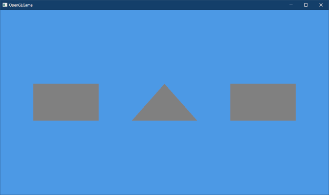
</p>

うまく表示されない場合は、Visual Studioの出力ウィンドウに、次のようなエラーが表示されていないか確認してください。

>```txt
>SHADER_ID_COMPILE error has been generated. GLSL compile failed for shader 1, "": FLEX: Unknown char 1
>ERROR: 0:20: '1' : syntax error syntax error
>
>SHADER_ID_LINK error has been generated. GLSL link failed for program 3, "": Attached vertex shader is not compiled.
>
>Error has been generated. GL error GL_INVALID_OPERATION in UseProgram: (ID: 1001309929) Generic error

これらは「OpenGLデバッグコンテキスト」からのエラーメッセージです。`SHADER_ID_COMPILE`で始まるエラーはシェーダのコンパイルエラーです。

この次の行の`ERROR: 0:20:`と書かれた行がエラーの場所です。これは「文字列配列の0番目の文字列の中の20行目でエラーが起きた」ことを示しています。

できるだけ最初に表示されたエラーから調べていくことをおすすめします。後続のエラーは、それより前のエラーが大本の原因である可能性が高いためです。

さて、図形が灰色になるのは、`standard_2D.frag`に書いてもらった以下の行で、「明るさ0.5」を最終出力としているからです。

>```c++
>outColor = vec4(0.5, 0.5, 0.5, 1.0);
>```

数値を変更して、本当に色が変化するか見てみましょう。`standard_2D.frag`を開き、メイン関数を次のように変更してください。

```diff
 void main()
 {
-  outColor = vec4(0.5, 0.5, 0.5, 1.0);
+  outColor = vec4(0.0, 0.0, 1.0, 1.0);
 }
```

プログラムが書けたらビルドして実行してください。図形が青色で表示されたら成功です。

<p align="center">
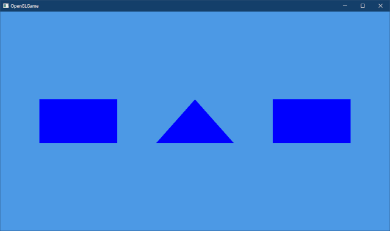
</p>

このように、フラグメントシェーダの最終出力が、画面に実際に表示される色になります。

### 2.5 シェーダ間でデータを送る

頂点シェーダからフラグメントシェーダにデータを送るには、対応するイン変数とアウト変数を定義します。実験として、頂点の色を送ってみましょう。

まず頂点シェーダにアウト変数を追加します。`standard_2D.vert`を開き、次のプログラムを追加してください。

```diff
 #version 450

 // シェーダへの入力
 layout(location=0) in vec3 inPosition; // 頂点座標
+
+// シェーダからの出力
+layout(location=0) out vec4 outColor; // 頂点色

 void main()
 {
  gl_Position = vec4(inPosition, 1.0);
```

次に`standard_2D.frag`を開き、次のプログラムを追加してください。

```diff
 * @file standard_2D.frag
 */
 #version 450
+
+// シェーダへの入力
+layout(location=0) in vec4 inColor;

 // 出力する色データ
 out vec4 outColor;
```

シェーダ間でデータをやり取りする場合、対応するアウト変数とイン変数のロケーション番号を一致させなくてはなりません。

あるシェーダにおいて、イン変数とアウト変数に割り当てたロケーション番号が同じ値になることがあります。しかし、これらは実際には別々の場所を指します(電車の1番ドアと駅の1番出口が違うようなものです)。

また、頂点シェーダの`inPosition`と`outColor`のロケーション番号が重複していますが、これは問題ありません。`inPosition`は`VP`からの入力、`outColor`は次のステージへの出力というように、違う場所を指しているからです。

下図に示すように、前段のステージのアウト変数に書き込んだ値は、同じロケーション番号を持つ次のシェーダのイン変数にコピーされます。

<p align="center">
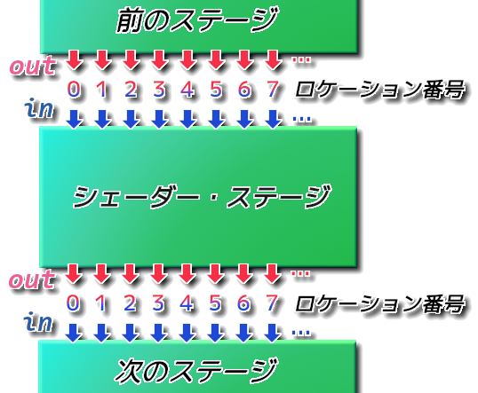
</p>

アウト変数とイン変数の組み合わせについて、ロケーション番号と型が一致しない場合、シェーダのリンクに失敗します。

それでは、頂点シェーダの`outColor`変数に値を設定しましょう。`standard_2D.vert`を開き、次のプログラムを追加してください。

```diff
 void main()
 {
+  const vec4 colors[] = {
+    { 1, 0, 0, 1 }, // 赤
+    { 0, 1, 0, 1 }, // 緑
+    { 0, 0, 1, 1 }, // 青
+  };
+  outColor = colors[gl_VertexID % 3];
   gl_Position = vec4(inPosition, 1.0);
 }
```

`gl_VertexID`(ジーエル・バーテックス・アイディ)は、GLSLが自動的に定義している変数です。この変数は「頂点データのインデックス」を表し、IBOに設定した数値と一致します。

次にフラグメントシェーダの`inColor`変数を使って、図形に色を付けてみます。`standard_2D.frag`を開き、プログラムを次のように変更してください。

```diff
 void main()
 {
-  outColor = vec4(0.0, 0.0, 1.0, 1.0);
+  outColor = inColor;
 }
```

プログラムが書けたらビルドして実行してください。図形が赤、緑、青で塗られていたら成功です。イン変数、アウト変数を使うことで、頂点シェーダからフラグメントシェーダへと数値を送ることができます。

<p align="center">
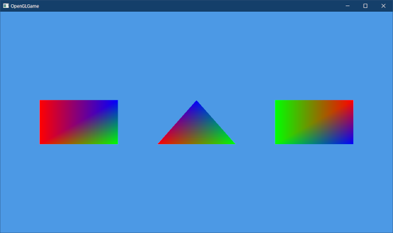
</p>

<pre class="tnmai_assignment">
<strong>【課題01】</strong>
<code>colors</code>配列に要素を追加して、四角形が4色で塗られるようにしなさい。
</pre>

### 2.6 C++プログラムからシェーダへデータを送る

C++プログラムからシェーダへデータを送るには、「ユニフォーム変数」というものを使います。例として、アプリ起動時からの経過時間をシェーダに送ってみましょう。

ユニフォーム変数を定義するには`uniform`(ユニフォーム)という修飾子を使います。`standard_2D.vert`を開き、次のプログラムを追加してください。

```diff
 // シェーダからの出力
 layout(location=0) out vec4 outColor;
+
+// プログラムからの入力
+layout(location=0) uniform float timer;

 void main()
 {
   const vec4 colors[] = {
```

ユニフォーム変数のロケーション番号は、C++プログラムからデータを送るときの「送り先番号」になります。ユニフォーム変数はイン変数、アウト変数とは全く別の場所に作られるので、ロケーション番号がイン変数、アウト変数と重複していても大丈夫です。

次にC++プログラムからユニフォーム変数にデータを送ります。`Main.cpp`を開き、シェーダを指定するプログラムの下に、次のプログラムを追加してください。

```diff
     // 描画に使うシェーダを指定
     glUseProgram(progSprite);
+
+    // ユニフォーム変数にデータをコピーする
+    const float timer = static_cast<float>(glfwGetTime());
+    glProgramUniform1f(progSprite, 0, timer);

     // 図形を描画
     glDrawElementsInstanced(GL_TRIANGLES, 9, GL_UNSIGNED_SHORT, 0, 1);
```

アプリ起動時からの経過時間を取得するには、`glfwGetTime`(ジーエルエフダブリュー・ゲット・タイム)関数を使います。

<p><code class="tnmai_code"><strong>【書式】</strong><br>
double glfwGetTime();
</code></p>

この関数の戻り値は`double`型なので、`static_cast`(スタティック・キャスト)を使って`float`型にしています。

ユニフォーム変数にデータを送る(コピーする)には、`glProgramUniform???`(ジーエル・プログラム・ユニフォーム・\[送る型によって変化。`float`の場合は`1f`(ワン・エフ)\])関数を使います。

<p><code class="tnmai_code"><strong>【書式】</strong><br>
void glProgramUniform1f(プログラムオブジェクトの管理番号, 送り先ロケーション番号, 送るデータ);
</code></p>

シェーダに正しくデータが送られたことを確認する方法は、データを最終出力である色データに反映することです。そこで、送られた時間データを使って、頂点の色を周期的に変更してみます。

`standard_2D.vert`を開き、`outColor`を設定するプログラムを次のように変更してください。

```diff
     { 0, 1, 0, 1 }, // 緑
     { 0, 0, 1, 1 }, // 青
     { 1, 1, 1, 1 }, // 白
   };
+  int i = gl_VertexID + int(timer);
-  outColor = colors[gl_VertexID % 4];
+  outColor = colors[i % 4];
   gl_Position = vec4(inPosition, 1.0);
 }
```

プログラムが書けたら、プログラムを実行する前に、どのような結果になるかを想像してください。

…想像してみましたか？<br>
それでは、ビルドして実行してください。

頂点の色が1秒間隔で切り替わっていたら成功です。想像通りの結果だったでしょうか、それとも、想像したものと違っていたでしょうか。

<pre class="tnmai_assignment">
<strong>【課題02】</strong>
シェーダを変更して、頂点の色が2.0秒間隔で切り替わるようにしなさい。
</pre>

>**【2章のまとめ】**
>
>* 「シェーダ・プログラム」はGPUが実行するプログラムのこと。
>* 「頂点シェーダ」は頂点ごとに実行され、頂点の位置などを決める。
>* 「フラグメントシェーダ」はピクセルごとに実行され、ピクセルの色を決める。
>* シェーダを使えるようにするには「コンパイル」と「リンク」が必要。
>* あるシェーダの「アウト変数」に設定した値は、次のシェーダの「ロケーション番号が等しいイン変数」に送られる。
>* C++プログラムからシェーダにデータを送るには「ユニフォーム変数」を使う。

<div style="page-break-after: always"></div>

## 3. テクスチャ

### 3.1 PNG形式の画像をTGA形式に変換する

物体の表面の細かな模様や凹凸まで全てを`GL_LINES`や`GL_TRIANGLES`で作成し、色などの属性を指定すれば、理論上はあらゆる物体を表現できます。しかし、この方法では信じられない数のプリミティブが必要になってしまいます。

そこで、プリミティブに画像を貼り付ける「テクスチャ・マッピング」という技法が考案されました。`texture`(テクスチャ)は「織物の出来栄え、手触り、物の質感」という意味です。

テクスチャとシェーダを組み合わせることで、物体の色だけでなく、凹凸や物体の濡れ具合といったさまざまな状態を表すことができます。

テクスチャデータはGPUが読める場所、つまりGPUメモリに作成する必要があります。一般的には、CPUが読み書きできるメモリ(つまり「通常のメモリ」)に画像データを作成し、それをGPUメモリにコピーします。

>**【GPUメモリがCPUから直接読み書きできない理由】**<br>
>これは、GPUとCPUがハードウェア的に離れていることが多いためです。そして、GPUメモリはGPUが高速に読み書きできなくてはならないので、GPUのすぐそばに配置されます。
>その結果、CPUからGPUメモリを読み書きするには、特別な命令を使う必要があります。OpenGLでは`glNamedBufferStorage`などの関数がそれらの命令を実行します。

基本的には、画像ファイルを読み込んで、それをGPUメモリにコピーすることになります。ただし、どんな画像ファイルでもよいわけではありません。例えば、`PNG`や`JPG`といった形式のファイルはデータが「<ruby>圧縮<rt>あっしゅく</rt></ruby>」されているため、単純に読み込むだけではテクスチャにできません。

また、`JPG`形式や`BMP`形式は透明度を持たないため、透明度が必要なテクスチャには使えません。

読み込むだけで使えて、透明度を持っている画像形式として、`TGA`(ティージーエー)形式を使うことにしました。`TGA`は1984年に開発された画像形式で、現在ではあまり使われてはいません。しかし、PhotoShopやGIMPといった主要な画像編集ソフトは`TGA`形式に対応しています。

`TGA`はVisual Studioでも作成・編集が可能です。また、`PNG`や`JPG`形式から`TGA`に変換することもできます。

実際に変換してみましょう。次のURLから`objects.png`という画像ファイルをダウンロードしてください。

>`https://github.com/tn-mai/OpenGL3D2022/blob/master/Res/objects.png`

次に、ダウンロードした`objects.png`を、Visual Studioの編集ウィンドウにドラッグ&ドロップしてください。

<p align="center">
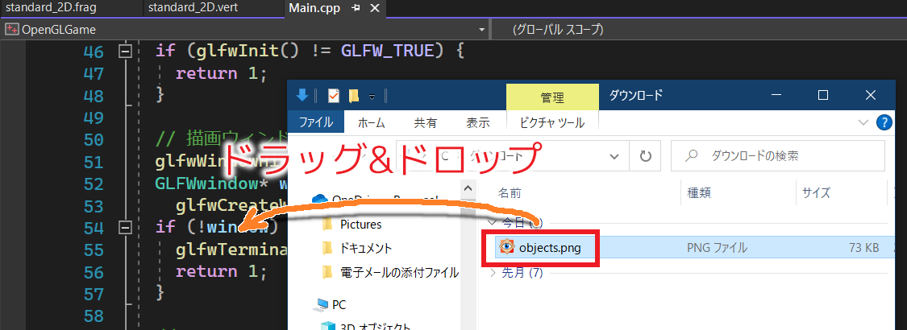
</p>

するとPNGファイルが表示されます。表示されない場合は、`objects.png`というタブを探してクリックしてください。

PNGファイルをTGAに変換するには「名前をつけて～を保存」を選択します。

<p align="center">
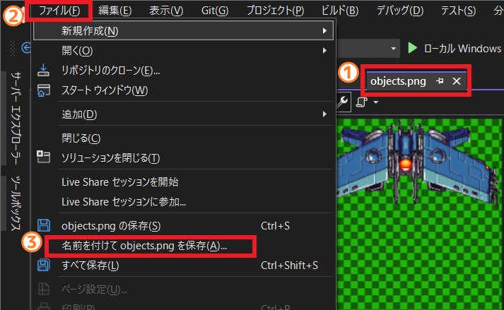
</p>

まず、変換したい画像のタブをクリックして画像を表示します(①)。次に「ファイル」メニューをクリックし(②)、「名前をつけて`objects.png`を保存」を選択します(③)。すると、次のようなウィンドウがヒョ持されます。

<p align="center">
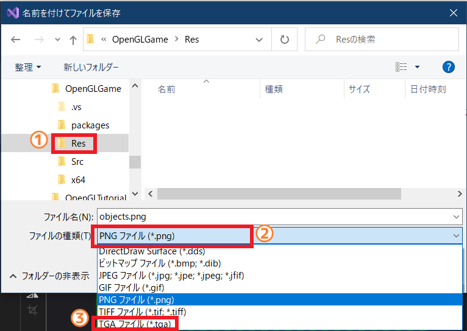
</p>

ウィンドウ左側のツリーをたどり、保存先をプロジェクトの`Res`フォルダにしてください(①)。続いて「ファイルの種類」をクリックすると、保存可能な形式の一覧が表示されます(②)。一覧から`TGAファイル(*.tga)`を選択してください(③)。

`TGAファイル(*.tga)`を選択すると、ファイル拡張子が`tga`に変化します。そうしたら、「保存」ボタンをクリックしてください。画像がTGA変換され、指定したフォルダに保存されます。

>TGA形式で保存したら、画像タブは閉じてください。

### 3.2 テクスチャを作成する

それでは、変換したTGAファイルを読み込んでテクスチャを作成しましょう。`VAO`を作成するプログラムの下に、次のプログラムを追加してください。

```diff
   glBindBuffer(GL_ELEMENT_ARRAY_BUFFER, ibo);
   glEnableVertexAttribArray(0);
   glVertexAttribPointer(0, 3, GL_FLOAT, GL_FALSE, 0, 0);
+
+  // テクスチャを作成する
+  GLuint tex = 0; // テクスチャの管理番号
+  glCreateTextures(GL_TEXTURE_2D, 1, &tex);
+  const char filenameImg[] = "Res/objects.tga";
+  file.open(filenameImg, std::ios::binary);
+  if (file) {
+    const size_t tgaHeaderSize = 18; // ヘッダ情報のバイト数
+
+    // 読み込み先メモリ領域を確保
+    std::vector<char> img(
+      std::filesystem::file_size(filenameImg) - tgaHeaderSize);
+
+    // ファイルを読み込む
+    file.ignore(tgaHeaderSize); // ヘッダ情報をスキップ
+    file.read(img.data(), img.size());
+
+    // テクスチャを作成
+    glTextureStorage2D(tex, 1, GL_RGBA8, 512, 512);
+    glTextureSubImage2D(tex, 0, 0, 0, 512, 512,
+      GL_BGRA, GL_UNSIGNED_BYTE, img.data());
+  }
+  file.close();

   // メインループ
   while (!glfwWindowShouldClose(window)) {
```

テクスチャを作成するには、`glCreateTextures`(ジーエル・クリエイト・テクスチャーズ)関数を使います。

<p><code class="tnmai_code"><strong>【書式】</strong><br>
void glCreateTextures(テクスチャの種類, 作成する個数, 番号を格納する配列のアドレス);
</code></p>

`glCreateTextures`関数は、画像データを管理する「テクスチャ・オブジェクト」を作成します。

「テクスチャの種類」には、作成するテクスチャの種別を指定します。よく使われる値を以下に示します。

>| 定数名 | 種類 |
>|---|---|
>| <ruby>GL_TEXTURE_1D<rt>ジーエル・テクスチャ・ワンディ</rt></ruby>               | 一次元画像 |
>| <ruby>GL_TEXTURE_2D<rt>ジーエル・テクスチャ・ツーディ</rt></ruby>               | 二次元画像 |
>| <ruby>GL_TEXTURE_3D<rt>ジーエル・テクスチャ・スリーディ</rt></ruby>             | 三次元画像 |
>| <ruby>GL_TEXTURE_CUBE_MAP<rt>ジーエル・テクスチャ・キューブ・マップ</rt></ruby> | キューブマップ画像 |
>| <ruby>GL_TEXTURE_2D_ARRAY<rt>ジーエル・テクスチャ・ツーディ・アレイ</rt></ruby> | 二次元画像の配列 |
>| <ruby>GL_TEXTURE_BUFFER<rt>ジーエル・テクスチャ・バッファ</rt></ruby>           | 数値を格納するテクスチャ |

TGAファイルを読み込むには`ifstream`クラスを使います。手順はシェーダのときと同じです。

ただし、TGAファイルの先頭18バイトには「TGAヘッダ」と呼ばれるデータ領域があります。画像データはTGAヘッダの後ろにあるので、先頭の18バイトを読み飛ばす必要があります。

データを読み飛ばすには`ignore`(イグノア)関数を使います。

<p><code class="tnmai_code"><strong>【書式】</strong><br>
ifstream& ifstream::ignore(読み飛ばすバイト数);
</code></p>

`glTextureStorage2D`(ジーエル・テクスチャ・ストレージ・ツーディ)関数は、画像データのコピー先であるGPUメモリ領域を確保します。

<p><code class="tnmai_code"><strong>【書式】</strong><br>
void glTextureStorage2D(テクスチャの管理番号, 作成するレベル数, ピクセル形式, 幅, 高さ);
</code></p>

「レベル数」は、「ミップマップ」という「視点からオブジェクトまでの距離に応じて、大きさの違うテクスチャを使い分ける機能」に関連した引数です。今回はミップマップ機能を使わないので、最小値の`1`を指定しています。

`glCreateTextures`と`glTextureStorage2D`のペアは、GPUメモリについて`new`や`malloc`と同じことを行う機能だと考えてください。

機能的には、以前に説明した`glCreateBuffers`と`glNamedBufferStorage`関数のペアとほぼ同じですが、管理対象の種類が異なります。

以下の表は、`malloc`, `new`とOpenGLのメモリ確保関数を比較したものです。

| 名前                 | どこから確保するか | 管理対象   | 機能説明 |
|:--------------------:|:------------------:|:----------:|:-----|
| malloc               | メインメモリ       | (なし)     | メインメモリ上の領域を確保し、確保したメモリのアドレスを返す |
| new                  | メインメモリ       | 任意の型   | メインメモリ上の領域を確保し、コンストラクタを実行し、確保したメモリのアドレスを返す |
| glCreateBuffers      | (なし)             | バッファ   | GPUメモリを管理するバッファオブジェクトを作成する |
| glNamedBufferStorage | GPUメモリ          | バッファ   | GPUメモリ上の領域を確保し、バッファオブジェクトに割り当てる |
| glCreateTextures     | (なし)             | テクスチャ | GPUメモリを管理するテクスチャオブジェクトを作成する |
| glTextureStorage2D   | GPUメモリ          | テクスチャ | GPUメモリ上の領域を確保し、テクスチャオブジェクトに割り当てる |

「ピクセル形式」は、画像データがどのようにGPUメモリに格納されるかを指定します。よく使われる形式を以下に示します。

| 定数名 | 赤成分のbit数 | 緑成分のbit数 | 青成分のbit数 | 透明度のbit数 |
|:-:|:-:|:-:|:-:|:-:|
| <ruby>GL_R8<rt>ジーエル・アール・はち</rt></ruby> | 8 | - | - | - |
| <ruby>GL_RGB8<rt>ジーエル・アールジービー・はち</rt></ruby> | 8 | 8 | 8 | - |
| <ruby>GL_RGBA8<rt>ジーエル・アールジービーエー・はち</rt></ruby> | 8 | 8 | 8 | 8 |
| <ruby>GL_RGBA16F<rt>ジーエル・アールジービーエー・じゅうろく・エフ</rt></ruby> | 16 | 16 | 16 | 16 |
| <ruby>GL_RGB565<rt>ジーエル・アールジービー・ごーろくご</rt></ruby> | 5 | 6 | 5 | - |

一部の色成分だけを格納する形式を指定した場合、格納されない色成分は`0`、透明度は`1`になります。例えば`GL_R8`を指定すると、赤成分だけを持つテクスチャが作られます。このテクスチャの緑や青成分は`0`、透明度は`1`になります。

画像データをGPUメモリにコピーするには`glTextureSubImage2D`(ジーエル・テクスチャ・サブ・イメージ・ツーディ)関数を使います。

<p><code class="tnmai_code"><strong>【書式】</strong><br>
void glTextureSubImage2D(テクスチャの管理番号, コピー先レイヤー番号,<br>
&emsp;コピー先のX座標, コピー先のY座標, コピーする画像の幅, コピーする画像の高さ,<br>
&emsp;ピクセルに含まれる要素と順序, 要素の型, 画像データのアドレス);
</code></p>

`glTextureSubImage2D`関数は、画像データをGPUメモリの指定した場所にコピーする関数です。画像データはテクスチャの`(コピー先のX座標, コピー先のY座標)`の位置にコピーされます。

コピー先の座標指定は、スプライトシートやテクスチャアトラスのように、複数の画像データをひとつのテクスチャにまとめたい場合に使います。

「ピクセルに含まれる要素と順序」と「要素の型」には、画像データのピクセル形式を指定します。以下に指定可能な名前の一部を示します。

| 名前    | ピクセルに含まれる要素と順序 |
|:--------|:-----------------------------|
| <ruby>GL_RED <rt>ジーエル・レッド</rt></ruby> | 赤 |
| <ruby>GL_RG  <rt>ジーエル・アールジー</rt></ruby> | 赤, 緑 |
| <ruby>GL_RGB <rt>ジーエル・アールジービー</rt></ruby> | 赤, 緑, 青 |
| <ruby>GL_BGR <rt>ジーエル・ビージーアール</rt></ruby> | 青, 緑, 赤 |
| <ruby>GL_RGBA<rt>ジーエル・アールジービーエー</rt></ruby> | 赤, 緑, 青, 透明度 |
| <ruby>GL_BGRA<rt>ジーエル・ビージーアールエー</rt></ruby> | 青, 緑, 赤, 透明度 |

この引数は、要素のビット数を指定しないことに注意してください。`GL_RGBA8`のように、末尾にビット数の書かれた名前を指定するとエラーになります。

要素のビット数は「要素の型」という引数で指定します。以下に指定可能な名前の一部を示します。

| 名前 | 型 |
|:-----|:---|
| <ruby>GL_UNSIGNED_BYTE<rt>ジーエル・アンサインド・イント</rt></ruby> | 8ビット符号なし整数 |
| <ruby>GL_UNSIGNED_SHORT<rt>ジーエル・アンサインド・ショート</rt></ruby> | 16ビット符号なし整数 |
| <ruby>GL_FLOAT<rt>ジーエル・フロート</rt></ruby> | 32ビット浮動小数点数 |
| <ruby>GL_UNSIGNED_SHORT_5_6_5<rt>ジーエル・アンサインド・ショート・ごーろくご</rt></ruby> | 16ビット符号なし整数<br>(上位ビットから5/6/5ビットに分割) |
| <ruby>GL_UNSIGNED_SHORT_5_6_5_REV<rt>ジーエル・アンサインド・ショート・ごーろくご・リブ</rt></ruby> | 16ビット符号なし整数<br>(下位ビットから5/6/5ビットに分割) |

末尾に数字が並んでいる名前は、特定のビット数で分割して扱うことを意味します。

これで、画像データからテクスチャを作成することができました。

### 3.3 テクスチャを表示する

作成したテクスチャを表示するには、テクスチャを「テクスチャ・イメージ・ユニット」に割り当てます。ユニフォーム変数にデータをコピーするプログラムの下に、次のプログラムを追加してください。

```diff
     // ユニフォーム変数にデータをコピーする
     const float timer = static_cast<float>(glfwGetTime());
     glProgramUniform1f(progSprite, 0, timer);
+
+    // テクスチャを指定する
+    glBindTextures(0, 1, &tex);

     // 図形を描画
     glDrawElementsInstanced(GL_TRIANGLES, 9, GL_UNSIGNED_SHORT, 0, 1);
```

テクスチャを割り当てるには`glBindTextures`(ジーエル・バインド・テクスチャーズ)関数を使います。

<p><code class="tnmai_code"><strong>【書式】</strong><br>
void glBindTextures(割り当て開始インデックス, 割り当てる個数,<br>
&emsp;テクスチャ管理番号配列のアドレス);
</code></p>

「テクスチャ・イメージ・ユニット」は「GPUのテクスチャ割り当てスロット」のことです。ユニット数はGPUによって異なりますが、OpenGLの仕様では最少でも16個はあることになっています。

GPUにテクスチャを差し込むスロットが16個空いていて、`glBindTextures`はその穴にテクスチャオブジェクトを差し込む、というようなイメージです。

上記のプログラムでは、「`0`番ユニットから`1`個テクスチャを割り当てる」ように設定しています。

次に、ユニット割り当てたテクスチャを使うようにシェーダを修正します。`standard_2D.frag`を開き、プログラムを次のように変更してください。

```diff
 // シェーダへの入力
 layout(location=0) in vec4 inColor;
+
+// テクスチャサンプラ
+layout(binding=0) uniform sampler2D texColor;

 // 出力する色データ
 out vec4 outColor;

 void main()
 {
+  vec4 c = texture(texColor, gl_FragCoord.xy * 0.005);
-  outColor = inColor;
+  outColor = c * inColor;
 }
```

「テクスチャ・イメージ・ユニット」に割り当てられたテクスチャを使うには、`sampler`(サンプラ)型のユニフォーム変数を使います。

サンプラ変数が使用するユニットを選択するには、`binding`(バインディング)識別子にユニット番号を指定します。C++プログラムで0番ユニットにテクスチャを割り当てたので、ここも`0`番を指定しています。

実際にテクスチャを読み込むには`texture`(テクスチャ)関数を使います。

<p><code class="tnmai_code"><strong>【書式】</strong><br>
vec4 texture(サンプラ変数, テクスチャ座標);
</code></p>

`texture`関数は、「サンプラ変数」が参照するユニットに割り当てられたテクスチャから、「テクスチャ座標」の位置のピクセル値を読み取って返します。テクスチャが割り当てられていないユニットを参照すると、「`vec4(0, 0, 0, 1)` = 不透明の黒」が返されます。

`gl_FragCoord`(ジーエル・フラグ・コード)は、GLSLが自動的に定義する変数のひとつで、ピクセルのウィンドウ座標が代入されています。

フラグメントシェーダがウィンドウ中央のピクセルを処理する場合、本テキストで作成したウィンドウのサイズは`1280x720`なので、`gl_FragCoord`の`x`メンバには`639.5`、`y`メンバには`359.5`が代入されます。

>`z`メンバ、`w`メンバには、頂点シェーダで`gl_Position`変数に代入した値が入っています。

テクスチャ座標は「画像の左下が`(0, 0)`、右上が`(1, 1)`」である座標系で指定します。例えば`(0.5, 0.5)`を指定すると、画像の中央にあるピクセルが読み取られます。

テクスチャ座標として使うには、`gl_FragCoord`の値は大きすぎます。画像が表示される程度に値を小さくするために`0.005`を掛けています。

プログラムが書けたらビルドして実行してください。図形の中に画像が表示されていたら成功です。

<p align="center">
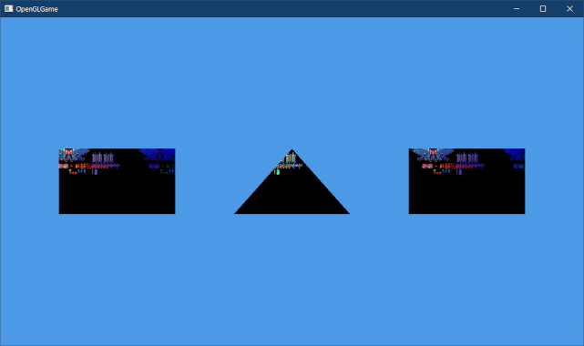
</p>

### 3.4 テクスチャ座標

図形の中に画像の特定の範囲を表示するには、頂点データにテクスチャ座標を追加します。ただ、データが増えると管理が面倒です。そこで、四角形ひとつを残して、他の図形は削除します。`Main.cpp`を開き、`vertexData`配列を次のように変更してください。

```diff
   // 頂点データをGPUメモリにコピー
   const float vertexData[][3] = {
-    {-0.2f,-0.2f, 0}, { 0.2f,-0.2f, 0}, { 0.0f, 0.2f, 0},
-    {-0.8f,-0.2f, 0}, {-0.4f,-0.2f, 0}, {-0.4f, 0.2f, 0}, {-0.8f, 0.2f, 0},
     { 0.4f,-0.2f, 0}, { 0.8f,-0.2f, 0}, { 0.8f, 0.2f, 0}, { 0.4f, 0.2f, 0},
   };
   GLuint vbo = 0; // 頂点バッファの管理番号
   glCreateBuffers(1, &vbo);
```

頂点データを減らしたので、対応するインデックスデータも減らします。`indexData`配列を次のように変更してください。

```diff
   // インデックスデータをGPUメモリにコピー
   const GLushort indexData[] = {
-    0, 1, 2,
+    0, 1, 2, 2, 3, 0,
-    3, 4, 5, 5, 6, 3,
-    7, 8, 9, 9,10, 7,
   };
   GLuint ibo = 0; // インデックスバッファの管理番号
   glCreateBuffers(1, &ibo);
```

それから、描画するインデックス数も減らさなくてはなりません。`図形を描画するプログラムを次のように変更してください。

```diff
     // テクスチャを指定する
     glBindTextures(0, 1, &tex);

     // 図形を描画
-    glDrawElementsInstanced(GL_TRIANGLES, 15, GL_UNSIGNED_SHORT, 0, 1);
+    glDrawElementsInstanced(GL_TRIANGLES, 6, GL_UNSIGNED_SHORT, 0, 1);

     glfwSwapBuffers(window);
     glfwPollEvents();
```

プログラムが書けたらビルドして実行してください。右側の四角形だけが表示されていたら成功です。

<p align="center">
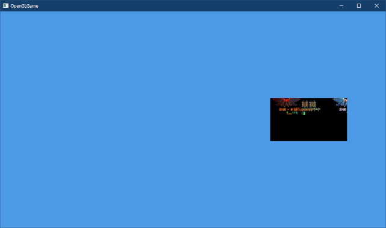
</p>

それではテクスチャ座標を追加しましょう。`vertexData`配列について、次のように`},`の直後で改行し、各行の末尾にテクスチャ座標を追加してください。

```diff
   // 頂点データをGPUメモリにコピー
+  struct Vertex {
+    float x, y, z; // 頂点座標
+    float u, v;    // テクスチャ座標
+  };
-  const float vertexData[][3] = {
+  const Vertex vertexData[] = {
-    { 0.4f,-0.2f, 0}, { 0.8f,-0.2f, 0}, { 0.8f, 0.2f, 0}, { 0.4f, 0.2f, 0},
+    { 0.4f,-0.2f, 0, 0.1875f, 1.0000f},
+    { 0.8f,-0.2f, 0, 0.2500f, 1.0000f},
+    { 0.8f, 0.2f, 0, 0.2500f, 0.9375f},
+    { 0.4f, 0.2f, 0, 0.1875f, 0.9375f},
   };
   GLuint vbo = 0; // 頂点バッファの管理番号
   glCreateBuffers(1, &vbo);
```

頂点データが「頂点座標」と「テクスチャ座標」の2つになるため、分かりやすいように構造体`Vertex`(バーテックス)を定義しています。

続いて、`vertexData`へ加えた変更を`VAO`に反映します。`VAO`を作成するプログラムを次のように変更してください。

```diff
   glBindBuffer(GL_ARRAY_BUFFER, vbo);
   glBindBuffer(GL_ELEMENT_ARRAY_BUFFER, ibo);
   glEnableVertexAttribArray(0);
-  glVertexAttribPointer(0, 3, GL_FLOAT, GL_FALSE, 0, 0);
+  glVertexAttribPointer(0, 3, GL_FLOAT, GL_FALSE, sizeof(Vertex), 0);
+  glEnableVertexAttribArray(1);
+  glVertexAttribPointer(1, 2, GL_FLOAT, GL_FALSE, sizeof(Vertex),
+    (const void*)offsetof(Vertex, u));

   // テクスチャを作成する
   GLuint tex = 0; // テクスチャの管理番号
```

`glVertexAttribPointer`の第6引数は`const void*`型ですが、実際には「データの先頭から対象のメンバまでのバイト数」を整数で指定します。これは`offsetof`(オフセット・オブ)マクロを使うと簡単に求めることができます。

<p><code class="tnmai_code"><strong>【書式】</strong><br>
size_t offsetof(構造体名, メンバ名);
</code></p>

`offsetof`は「構造体の先頭から特定のメンバまでのバイト数」を計算するマクロです。

このマクロの戻り値は`size_t`型なので、`glVertexAttribPointer`型の要求に合わせるためにキャストしています。

>**【なぜ、整数が必要な引数の型がポインタ型なのか】**<br>
>実は、古いOpenGLでは関数の使い方が異なっていて、実際にポインタを渡していました。その後、時代は進み、OpenGLに新機能を追加することになりました。ただ、当時の開発者たちは新しい関数を作るのが面倒だったらしく、「ひらめいた！　既存の関数に新しい機能を追加しちゃおう。新しい機能を使うときはキャストが必要だけど、なに、大した問題じゃないさ！」と考えたそうです。そうはならんやろ…。

これで、テクスチャ座標がロケーション1番のイン変数に送られるようになります。ということで、データを受け取るイン変数を追加しましょう。`standard_2D.vert`を開き、次のプログラムを追加してください。

```diff
 // シェーダへの入力
 layout(location=0) in vec3 inPosition;
+layout(location=1) in vec2 inTexcoord;

 // シェーダからの出力
 layout(location=0) out vec4 outColor;
+layout(location=1) out vec2 outTexcoord;

 // プログラムからの入力
 layout(location=0) uniform float timer;

 void main()
 {
   const vec4 colors[] = {
     { 1, 0, 0, 1 }, // 赤
     { 0, 1, 0, 1 }, // 緑
     { 0, 0, 1, 1 }, // 青
     { 1, 1, 1, 1 }, // 白
   };
   int i = gl_VertexID + int(timer * 0.5);
   outColor = colors[i % 4];
+  outTexcoord = inTexcoord;
   gl_Position = vec4(inPosition, 1.0);
 }
```

次に、`standard_2D.frag`を開き、プログラムを次のように変更してください。

```diff
 // シェーダへの入力
 layout(location=0) in vec4 inColor;
+layout(location=1) in vec2 inTexcoord;

 // テクスチャ
 layout(binding=0) uniform sampler2D texColor;

 // 出力する色データ
 out vec4 outColor;

 void main()
 {
-  vec4 c = texture(texColor, gl_FragCoord.xy * 0.005);
+  vec4 c = texture(texColor, inTexcoord);
   outColor = c * inColor;
 }
```

プログラムが書けたらビルドして実行してください。次のようにテクスチャの一部が表示されていたら成功です。

<p align="center">
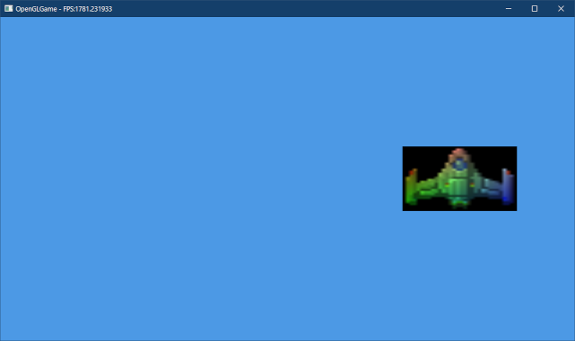
</p>

### 3.5 アルファブレンド

黒い部分の透明度は`0`なので、背景の色が表示されるはずです。しかし、実際にはそうなっていません。

それは、初期状態では「アルファブレンド(半透明合成)機能」が無効化されているからです。そこで、アルファブレンドを有効にしましょう。

`Main.cpp`を開き、シェーダを指定するプログラムの下に、次のプログラムを追加してください。

```diff
     // 描画に使うシェーダを指定
     glUseProgram(progSprite);
+
+    // アルファブレンドを有効にする
+    glEnable(GL_BLEND);
+    glBlendEquation(GL_FUNC_ADD);
+    glBlendFunc(GL_SRC_ALPHA, GL_ONE_MINUS_SRC_ALPHA);

     // ユニフォーム変数にデータをコピーする
     const float timer = static_cast<float>(glfwGetTime());
     glProgramUniform1f(progSprite, 0, timer);
```

`glEnable`(ジーエル・イネーブル)は、引数で指定した機能を有効にする関数です。

<p><code class="tnmai_code"><strong>【書式】</strong><br>
void glEnable(有効にする機能名);
</code></p>

以下の表は、この関数で有効にできる機能のうち、比較的よく使われるものです。

| 名前 | 機能 |
|:-----|:-----|
| <ruby>GL_BLEND<rt>ジーエル・</rt></ruby> | アルファブレンド |
| <ruby>GL_CULL_FACE<rt>ジーエル・かる・フェイス</rt></ruby> | カリング(裏向きポリゴンを描画しない) |
| <ruby>GL_DEPTH_TEST<rt>ジーエル・デプス・テスト</rt></ruby> | 深度テスト(奥にあるピクセルを描画しない) |
| <ruby>GL_SCISSOR_TEST<rt>ジーエル・シザー・テスト</rt></ruby> | シザリング領域外のピクセルを描画しない |
| <ruby>GL_STENCIL_TEST<rt>ジーエル・ステンシル・テスト</rt></ruby> | ステンシル判定に失敗したピクセルを描画しない |
| <ruby>GL_FRAMEBUFFER_SRGB<rt>ジーエル・フレームバッファ・エスアールジービー</rt></ruby> | フレームバッファをSRGBモードにする |
| <ruby>GL_MULTISAMPLE<rt>ジーエル・マルチサンプル</rt></ruby> | ハードウェアアンチエイリアス |

半透明合成を行うには、アルファブレンドを有効にしたうえで、さらに`glBlendEquation`(ジーエル・ブレンド・イクウェイション)関数と`glBlendFunc`(ジーエル・ブレンド・ファンク)関数を使って、「ブレンド関数」を設定する必要があります。

<p><code class="tnmai_code"><strong>【書式】</strong><br>
void glBlendEquation(ブレンド式の種類);
</code></p>

<p><code class="tnmai_code"><strong>【書式】</strong><br>
void glBlendFunc(ソース係数, ディスティネーション係数);
</code></p>

ブレンド式の種類」には、以下の表の名前を指定できます。ただし`S = フラグメントシェーダから出力された色`, `D = 描画先の画面の色`とします。

| 名前 | ブレンド式 |
|:-----|:-----------|
| GL_FUNC_ADD | S \* ソース係数 + D \* ディスティネーション係数 |
| GL_FUNC_SUBTRACT | S \* ソース係数 - D \* ディスティネーション係数 |
| GL_FUNC_REVERSE_SUBTRACT | D \* ディスティネーション係数 - S \* ソース係数 |
| GL_MIN | min(S \* ソース係数, D \* ディスティネーション係数) |
| GL_MAX | max(S \* ソース係数, D \* ディスティネーション係数) |

次の表は、ソース係数とディスティネーション係数に指定できる名前です。`S.`と`D.`に続く文字は`r=赤`, `g=緑`, `b=青`, `a=透明度`を表します。

| 名前 | カラーの値 | 透明度の値 |
|:-----|:---|:---|
| <ruby>GL_ZERO<rt>ジーエル・ゼロ</rt></ruby> | (0, 0, 0) | 0 |
| <ruby>GL_ONE<rt>ジーエル・ワン</rt></ruby> | (1, 1, 1) | 1 |
| <ruby>GL_SRC_COLOR<rt>ジーエル・ソース・カラー</rt></ruby> | (S.r, S.g, S.b) | S.a |
| <ruby>GL_SRC_ALPHA<rt>ジーエル・ソース・アルファ</rt></ruby> | (S.a, S.a, S,a) | S.a |
| <ruby>GL_ONE_MINUS_SRC_ALPHA<rt>ジーエル・ワン・マイナス・ソース・アルファ</rt></ruby> | (1-S.a, 1-S.a, 1-S.a) | 1-S.a |
| <ruby>GL_DST_COLOR<rt>ジーエル・デスト・カラー</rt></ruby> | (D.r, D.g, D.b) | D.a |
| <ruby>GL_DST_ALPHA<rt>ジーエル・デスト・アルファ</rt></ruby> | (D.a, D.a, D.a) | D.a |

上記以外にもさまざまな名前を指定できますが、一般的に使われるのは次の4つの組み合わせです。

| 効果 | ブレンド式 | ソース係数 | ディスティネーション係数 |
|:-----|:-----------|:-----------|:-------------------------|
| ブレンドなし | GL_FUNC_ADD | GL_ONE | GL_ZERO |
| 半透明 | GL_FUNC_ADD | GL_SRC_ALPHA | GL_ONE_MINUS_SRC_ALPHA |
| 加算 | GL_FUNC_ADD | GL_SRC_ALPHA | GL_ONE |
| 減算 | GL_FUNC_REVERSE_SUBTRACT | GL_SRC_ALPHA | GL_ONE |

プログラムが書けたらビルドして実行してください。次のように黒い部分がなくなっていたら成功です。

<p align="center">
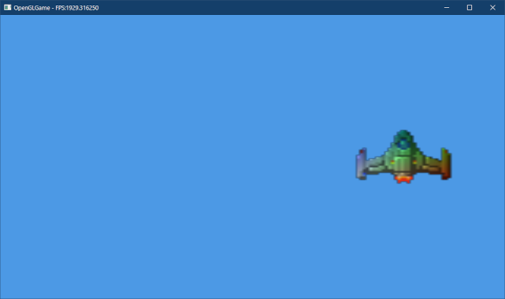
</p>

>**【透明度をアルファと呼んでいる理由】**<br>
>`https://en.wikipedia.org/wiki/Alpha_compositing#History`によると、半透明合成の発明者が「伝統的な線形補間式`αA+(1-α)B`に現れるギリシャ文字`α`(アルファ)」を流用したから、ということのようです。

<pre class="tnmai_assignment">
<strong>【課題03】</strong>
テクスチャ座標を変更して、TGA画像の次の部分が表示されるようにしなさい。
あるいは、他の好きな部分を表示しても構いません。

</pre>

>**【3章のまとめ】**
>
>* 画像をTGAファイルに変換するには、Visual Studioで画像ファイルを開き「ファイル→名前をつけて～を保存」を選択する。
>* テクスチャを表示するには`glBindTextures`関数を使って、テクスチャを「テクスチャ・イメージ・ユニット」に割り当てる。
>* テクスチャ座標は`(0, 0)`から`(1, 1)`の範囲で指定する。
>* アルファブレンドを有効にするには、`GL_BLEND`を有効にして、`glBlendEquation`, `glBendFunc`関数を使ってブレンド式を指定する。
