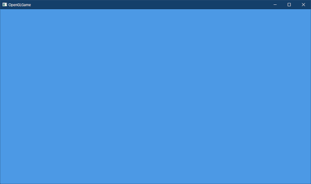

[OpenGL 3D 2022 第03回]

# 画像を大量に表示する

## 習得目標

* C++の乱数を使って、任意の範囲の乱数を作ることができる。
* インスタンシングを使って、図形を大量に表示できる。
* `SSBO`を使って、C++プログラムからシェーダにデータを送ることができる。
* `gl_InstanceID`を使うと、インスタンスごとに位置やテクスチャ座標を変えられる。

## 1. 図形の位置を制御する

### 1.1 ユニフォーム変数で図形の位置を指定する

一般的に、頂点データは一度作成したら変更することはありません。そのため、いつも同じ位置に同じ図形が表示されます。しかし、ゲームでは図形の位置を変更できないと困ります。

OpenGLで図形の位置を変更する方法は何種類もあり、時と場合によって適切な方法は異なります。一番簡単なのはユニフォーム変数を使うことです。ちょっと実験してみましょう。<br>`standard_2D.vert`を開き、次のプログラムを追加してください。

```diff
 // プログラムからの入力
 layout(location=0) uniform float timer;
+layout(location=1) uniform vec3 position;

 void main()
 {
   const vec4 colors[] = {
     { 1, 0, 0, 1 }, // 赤
     { 0, 1, 0, 1 }, // 緑
     { 0, 0, 1, 1 }, // 青
     { 1, 1, 1, 1 }, // 白
   };
   int i = gl_VertexID + int(timer * 0.5);
   outColor = colors[i % 4];
   outTexcoord = inTexcoord;
-  gl_Position = vec4(inPosition, 1.0);
+  gl_Position = vec4(inPosition + position, 1.0);
 }
```

追加したのは、「ユニフォーム変数`position`(ポジション)を頂点の座標に加算する」プログラムです。

次に`Main.cpp`を開き、図形を描画するプログラムに、次のプログラムを追加してください。

```diff
     // テクスチャを指定する
     glBindTextures(0, 1, &tex);

     // 図形を描画
+   glProgramUniform3f(progSprite, 1, 0.0f, 0.0f, 0.0f);
    glDrawElementsInstanced(GL_TRIANGLES, 6, GL_UNSIGNED_SHORT, 0, 1);
+
+   glProgramUniform3f(progSprite, 1, -0.5f, 0.0f, 0.0f);
+   glDrawElementsInstanced(GL_TRIANGLES, 6, GL_UNSIGNED_SHORT, 0, 1);

    glfwSwapBuffers(window);
    glfwPollEvents();
```

`glProgramUniform3f`(ジーエル・プログラム・ユニフォーム・スリーエフ)関数は、`vec3`型のユニフォーム変数にデータをコピーします。

<p><code class="tnmai_code"><strong>【書式】</strong><br>
void glProgramUniform3f(プログラムオブジェクトの管理番号, 送り先ロケーション番号,<br>
&emsp;送るデータ0, 送るデータ1, 送るデータ2);
</code></p>

この関数は、前回使った`glProgramUniform1f`の仲間です。ユニフォーム変数にデータをコピーする関数は、関数名の末尾にある数値と文字が、コピー先の型ごとに決まっています。

コピー先が`float`型の場合は`1f`、`vec2`の場合は`2f`、`vec3`の場合は`3f`となります。整数版も存在していて、`int`の場合は`1i`、`ivec2`の場合は`2i`、…のようになっています。

>配列を含む全ての型と対応する関数のリストは、以下のURLを参照してください。
>`https://www.khronos.org/registry/OpenGL-Refpages/gl4/html/glUniform.xhtml`

プログラムが書けたらビルドして実行してください。次のように同じ画像が2つ表示されていたら成功です。

<p align="center">

</p>

このように、ユニフォーム変数を使うと、図形を描画する位置を変更することができます。また、位置だけでなく色や大きさ、テクスチャ座標なども変更可能です。

<pre class="tnmai_assignment">
<strong>【課題01】</strong>
<code>glProgramUniform3f</code>と<code>glErawElementsInstanced</code>関数を追加して、画面に3つめの画像を表示しなさい。座標はどこでも構いません。
</pre>

### 1.2 C++の乱数

もっとたくさんの画像を表示してみましょう。表示位置は乱数を使って決めることにします。乱数を使うために、次のヘッダファイルをインクルードしてください。

```diff
 #include <Windows.h>
 #include <string>
 #include <vector>
+#include <random>
 #include <fstream>
 #include <filesystem>
```

それでは、画像の表示データ配列を作成しましょう。テクスチャを作成するプログラムの下に、次のプログラムを追加してください。

```diff
       GL_BGRA, GL_UNSIGNED_BYTE, img.data());
   }
   file.close();
+
+  // 画像表示用データ(スプライト)を格納する構造体
+  struct Sprite
+  {
+    float x, y, z, w; // 画像を表示する座標
+  };
+
+  // スプライトの配列を作成
+  const size_t maxSpriteCount = 1'000; // スプライトの最大数
+  std::vector<Sprite> spriteList(maxSpriteCount);
+
+  // 乱数を初期化
+  std::random_device rd; // 真の乱数を生成するオブジェクト(遅い)
+  std::mt19937 rg;       // 疑似乱数を生成するオブジェクト(速い)
+  rg.seed(rd()); // 疑似乱数を「真の乱数」で初期化
+
+  // スプライトの座標をランダムに決定
+  std::uniform_real_distribution<float> rx(-1, 1); // X軸方向の分布域
+  std::uniform_real_distribution<float> ry(-1, 1); // Y軸方向の分布域
+  for (Sprite& e : spriteList) {
+    e = { rx(rg), ry(rg), 0, 0 };
+  }

   // メインループ
   while (!glfwWindowShouldClose(window)) {
```

乱数を使うには「乱数生成クラス」と「分布クラス」を組み合わせます。

>* 乱数生成クラス: 0～42億(クラスとテンプレート引数によって異なる)の範囲の整数を生成する。
>* 分布クラス: 乱数生成クラスが生成した乱数を、特定の分布(例:1～6)に変換する。

C++標準ライブラリには数種類の乱数生成クラスが定義されていますが、基本的には`mt19937`(エムティ・いちゅきゅうきゅうさんなな)クラスを使います。

`random_device`(ランダム・デバイス)も乱数生成クラスで、「真の乱数」を生成します。問題はとても遅いことです。そのため、基本的には`mt19937`クラスの初期化だけに使います。

`mt19937`を初期化するには`seed`(シード)関数を使います。

<p><code class="tnmai_code"><strong>【書式】</strong><br>
void mt19937::seed(乱数の初期化に使う値);
</code></p>

分布クラスは「乱数の分布」を決定します。例えばサイコロを再現したい場合、`uniform_int_distribution`(ユニフォーム・イント・ディストリビューション)クラスのコンストラクタに`1`と`6`を指定します。

その後、「乱数生成クラス」のオブジェクトを引数として渡すと、1～6の数値がランダムに返されます。よく使われる分布クラスを以下に示します。

| クラス名 | 戻り値 |
|:---------|:-----|
| <ruby>uniform_int_distribution<rt>ユニフォーム・イント・ディストリビューション</rt></ruby> | 指定した範囲のいずれかの整数 |
{ <ruby>uniform_real_distribution<rt>ユニフォーム・リアル・ディストリビューション</rt></ruby> | 指定した範囲のいずれかの浮動小数点数 |
| <ruby>normal_distribution<rt>ノーマル・ディストリビューション</rt></ruby> | 指定した範囲の正規分布 |

それでは図形を描画するプログラムを、次のように変更してください。

```diff
     // テクスチャを指定する
     glBindTextures(0, 1, &tex);

     // 図形を描画
-   glProgramUniform3f(progSprite, 1, 0.0f, 0.0f, 0.0f);
-   glDrawElementsInstanced(GL_TRIANGLES, 6, GL_UNSIGNED_SHORT, 0, 1);
-
-   glProgramUniform3f(progSprite, 1, -0.5f, 0.0f, 0.0f);
-   glDrawElementsInstanced(GL_TRIANGLES, 6, GL_UNSIGNED_SHORT, 0, 1);
-
-   glProgramUniform3f(progSprite, 1, 0.0f, 0.5f, 0.0f);
-   glDrawElementsInstanced(GL_TRIANGLES, 6, GL_UNSIGNED_SHORT, 0, 1);
+   for (const Sprite& e : spriteList) {
+     glProgramUniform3f(progSprite, 1, e.x, e.y, e.z);
+     glDrawElementsInstanced(GL_TRIANGLES, 6, GL_UNSIGNED_SHORT, 0, 1);
+   }

    glfwSwapBuffers(window);
    glfwPollEvents();
```

プログラムが書けたらビルドして実行してください。たくさんの画像が表示されていたら成功です。

<p align="center">

</p>

### 1.3 表示座標と座標変換

乱数の範囲を`-1～+1`にしたのですから、画像が画面全体を埋め尽くすはずです。それなのに、実際には左側に空きができています。

これは、図形データが原点`(0, 0)`を中心としていないからです。そこで、`vertexData`配列の頂点座標を、原点を中心とするように変更してください。

```diff
     float u, v;    // テクスチャ座標
   };
   const Vertex vertexData[] = {
-    { 0.4f,-0.2f, 0, 0.0f,   0.125f},
-    { 0.8f,-0.2f, 0, 0.125f, 0.125f},
-    { 0.8f, 0.2f, 0, 0.125f, 0.0f},
-    { 0.4f, 0.2f, 0, 0.0f,   0.0f},
+    {-0.2f,-0.2f, 0, 0.0f,   0.125f},
+    { 0.2f,-0.2f, 0, 0.125f, 0.125f},
+    { 0.2f, 0.2f, 0, 0.125f, 0.0f},
+    {-0.2f, 0.2f, 0, 0.0f,   0.0f},
   };
   GLuint vbo = 0; // 頂点バッファの管理番号
   glCreateBuffers(1, &vbo);
```

プログラムが書けたらビルドして実行してください。画面左に空きがなくなっていたら成功です。

<p align="center">

</p>

ところで、画面サイズは1280x720なのに、座標は縦も横も`-1～+1`の範囲で指定する、というのはちょっと扱いにくいです。

そこで、画面上の座標を使って(つまりX座標=0～1280, Y座標=0～720の範囲で)、図形の座標を設定できるようにします。

まず画面サイズを受け取るユニフォーム変数を追加します。`standard_2D.vert`を開き、次のプログラムを追加してください。

```diff
 // プログラムからの入力
 layout(location=0) uniform float timer;
 layout(location=1) uniform vec3 position;
+
+// 画面座標系をクリップ座標系に変換するためのパラメータ
+layout(location=2) uniform vec4 screenToClip;

 void main()
 {
```

「クリップ座標系」は、これまで定義してきた座標で使われている座標系です。クリップ座標系の定義は

>画面に写る範囲をX軸=`-1～+1`, Y軸=`-1～+1`, Z軸=`-1～+1`とする座標系

となっています。これに対し、「画面座標系」の定義は

>画面に写る範囲をX軸=`0～画面の幅`, Y軸=`0～画面の高さ`, Z軸=`-1～+1`とする座標系

となっています。GPUはクリップ座標系しか理解できないので、`画面座標系からクリップ座標系へと変換する必要があります。

`screenToClip`(スクリーン・トゥ・クリップ)はこの変換に使う変数です。画面座標系からクリップ座標系へと変換するためのパラメータを設定します。

続いて、`gl_Position`に座標を大入雛するプログラムの下に、次のプログラムを追加してください。

```diff
   outColor = colors[i % 4];
   outTexcoord = inTexcoord;
   gl_Position = vec4(inPosition + position, 1.0);
+
+  // 画面座標系からクリップ座標系へ変換
+  gl_Position.xy = (gl_Position.xy * screenToClip.xy) + screenToClip.zw;
 }
```

次に`Main.cpp`を開き、ユニフォーム変数に時間データをコピーするプログラムの下に、次のプログラムを追加してください。

```diff
     // ユニフォーム変数にデータをコピーする
     const float timer = static_cast<float>(glfwGetTime());
     glProgramUniform1f(progSprite, 0, timer);
+
+    // ユニフォーム変数に、座標変換用パラメータをコピーする
+    int w, h;
+    glfwGetWindowSize(window, &w, &h);
+    glProgramUniform4f(progSprite, 2,
+      2.0f / static_cast<float>(w),
+      2.0f / static_cast<float>(h), -1, -1);

     // テクスチャを指定する
     glBindTextures(0, 1, &tex);
```

`glfwGetWindowSize`(ジーエルエフダブリュー・ゲット・ウィンドウ・サイズ)は、ウィンドウの「描画領域」の幅と高さを取得する関数です。

<p><code class="tnmai_code"><strong>【書式】</strong><br>
void glfwGetWindowSize(GLFWウィンドウオブジェクトのアドレス,<br>
&emsp;幅を格納する変数のアドレス, 高さを格納する変数のアドレス);
</code></p>

プログラムが書けたらビルドして実行してください。すると、…何も表示されませんね？

<p align="center">

</p>

何も表示されない理由は、座標の値が小さすぎるからです。クリップ座標系は`-1～+1`なので、座標値は`1.0`未満になりますが、これは横`0～1280`、縦`0～720`の画面座標系にとっては小さすぎます。

そこで、図形の座標を画面座標系で表示できる数値に変更します。`vertexData`配列を次のように変更してください。

```diff
     float u, v;    // テクスチャ座標
   };
   const Vertex vertexData[] = {
-    {-0.20,-0.20, 0, 0.000f, 0.125f},
-    { 0.20,-0.20, 0, 0.125f, 0.125f},
-    { 0.20, 0.20, 0, 0.125f, 0.000f},
-    {-0.20, 0.20, 0, 0.000f, 0.000f},
+    {-32,-32, 0, 0.000f, 0.125f},
+    { 32,-32, 0, 0.125f, 0.125f},
+    { 32, 32, 0, 0.125f, 0.000f},
+    {-32, 32, 0, 0.000f, 0.000f},
   };
   GLuint vbo = 0; // 頂点バッファの管理番号
   glCreateBuffers(1, &vbo);
```

>座標の値を`32`としているのは、表示する画像の大きさが64x64ピクセルだからです。

プログラムが書けたらビルドして実行してください。画面左下に画像が表示されていたら成功です。画像が左下に表示されるのは、「OpenGLの画面座標系では左下が原点(0, 0)」だからです。

<p align="center">

</p>

画面いっぱいに画像を表示するには、乱数の範囲も画面座標系で設定します。スプライトの座標をランダムに決定するプログラムを、次のように変更してください。

```diff
   rg.seed(rd()); // 疑似乱数を「真の乱数」で初期化

   // スプライトの座標をランダムに決定
+  int w, h;
+  glfwGetWindowSize(window, &w, &h);
-  std::uniform_real_distribution<float> rx(-1, 1); // X軸方向の分布域
-  std::uniform_real_distribution<float> ry(-1, 1); // Y軸方向の分布域
+  std::uniform_real_distribution<float> rx(0, static_cast<float>(w)); // X軸方向の分布域
+  std::uniform_real_distribution<float> ry(0, static_cast<float>(h)); // Y軸方向の分布域
   for (auto& e : spriteList) {
     e = { rx(rg), ry(rg), 0, 0 };
   }
```

プログラムが書けたらビルドして実行してください。画面にたくさんの画像が表示されていたら成功です。微妙に隙間が空いているのは、図形の大きさを画像本来の大きさに合わせた結果、表示サイズが小さくなったためです。

<p align="center">

</p>

### 1.4 色を変化させるプログラムを削除する

画面全体に画像が表示されるようになったので、急激に色が変化するのは目に悪そうです。そこで色を変化させるプログラムを削除します。`standard_2D.vert`を開き、シェーダを次のように変更してください。

```diff
 void main()
 {
-  const vec4 colors[] = {
-    { 1, 0, 0, 1 }, // 赤
-    { 0, 1, 0, 1 }, // 緑
-    { 0, 0, 1, 1 }, // 青
-    { 1, 1, 1, 1 }, // 白
-  };
-  int i = gl_VertexID + int(timer * 0.5);
-  outColor = colors[i % 4];
+  outColor = vec4(1, 1, 1, 1);
   outTexcoord = inTexcoord;
   gl_Position = vec4(inPosition + position, 1);
```

これでタイマー変数を使わなくなったので、タイマー変数にデータを送るプログラムは無効化します。`Main.cpp`を開き、タイマー変数にデータを送るプログラムに、次のプログラムを追加してください。

```diff
     glEnable(GL_BLEND);
     glBlendEquation(GL_FUNC_ADD);
     glBlendFunc(GL_SRC_ALPHA, GL_ONE_MINUS_SRC_ALPHA);

+#if 0
    // ユニフォーム変数にデータをコピーする
    const float timer = static_cast<float>(glfwGetTime());
    glProgramUniform1f(progSprite, 0, timer);
+#endif

    // ユニフォーム変数に、座標変換用パラメータをコピーする
    int w, h;
```

`#if`(シャープ・イフ)は「プリプロセッサ指令」のひとつです。直後の式が`1`の場合は`#endif`(シャープ・エンド・イフ)までの内容を有効化し、`0`の場合は無効化します。

最初の式の値を変更するだけで有効・無効を切り替えられるため、デバッグ用途などで頻繁に有効・無効を切り替えるような場合に便利です。

プログラムが書けたらビルドして実行してください。色が変化しなくなっていたら成功です。

### 1.5 秒間フレーム数(FPS)を表示する

ところで、画像を1000枚表示すると、1秒間に何回くらい画面を描き換えられるのでしょう？

1秒間に画面を書き換えた回数は`FPS`(エフビーエス, フレーム・パー・セコンド)という単位で表されます。GLFWには「アプリが起動してからの経過時間」を取得する関数があります。この関数を使ってFPSを計測してみましょう。

`main`関数に次のプログラムを追加してください。

```diff
   for (auto& e : spriteList) {
     e = { rx(rg), ry(rg), 0, 0 };
   }
+
+  // FPS計測用の変数
+  double fpsTime = glfwGetTime();
+  double fpsCount = 0;

   // メインループ
   while (!glfwWindowShouldClose(window)) {
+    // FPSを計測
+    const double curTime = glfwGetTime();
+    const double diffTime = curTime - fpsTime;
+    ++fpsCount;
+
+    // 1秒ごとにFPSを表示
+    if (diffTime >= 1) {
+      const std::string fps = std::to_string(fpsCount / diffTime);
+      const std::string newTitle = title + " - FPS:" + fps;
+      glfwSetWindowTitle(window, newTitle.c_str());
+
+      // 計測用変数をリセット
+      fpsTime = curTime;
+      fpsCount = 0;
+    }
+
     // バックバッファをクリア
     glClearColor(0.3f, 0.6f, 0.9f, 1.0f);
```

このプログラムは、メインループが一周するたびに`fpsCount`(エフビーエス・カウント)を加算し、1秒経過するごとにFPSを表示します。

経過時間を取得するには`glfwGetTime`(ジーエルエフダブリュー・ゲット・タイム)関数を使います。

<p><code class="tnmai_code"><strong>【書式】</strong><br>
double glfwGetTime(GLFWウィンドウオブジェクトのアドレス);
</code></p>

FPSはタイトルバーに表示することにします。タイトルバーの表示を変更するには`glfwSetWindowTitle`(ジーエルエフダブリュー・セット・ウィンドウ・タイトル)関数を使います。

<p><code class="tnmai_code"><strong>【書式】</strong><br>
void glfwGetTime(GLFWウィンドウオブジェクトのアドレス, タイトルバーに表示する文字列);
</code></p>

FPSは`double`型で計算しているので、タイトルバーに表示するためには、何らかの方法で文字列に変換しなくてはなりません。今回は`to_string`(トゥ・ストリング)関数を使って変換します。

<p><code class="tnmai_code"><strong>【書式】</strong><br>
std::string std::to_string(文字列に変換したい数値);
</code></p>

`to_string`は、桁数や基数を指定できないという欠点があるものの、手軽に数値を文字列に変換できるので便利です。

プログラムが書けたらビルドして実行してください。タイトルバーにFPSが表示されていたら成功です。

<p align="center">

</p>

FPSが分かるようになったので、画像の枚数を増やして、どのくらいFPSが変化するかを調べてみましょう。スプライトの最大数を次のように変更してください。

```diff
     float x, y, z, w; // 画像を表示する座標
   };

   // スプライトの配列を作成
-  const size_t maxSpriteCount = 1'000; // スプライトの最大数
+  const size_t maxSpriteCount = 100'000; // スプライトの最大数
   std::vector<Sprite> spriteList(maxSpriteCount);

   // スプライトの座標をランダムに決定
```

プログラムが書けたらビルドして実行してください。FPSが変化していたら成功です。PCの構成にもよりますが、FPSが1/50～1/80に低下したのではないでしょうか。

>**【1章のまとめ】**
>
>* 任意の範囲の乱数を生成するには、乱数生成クラス`mt19937`と乱数分布クラス`uniform_real_distribution`を組み合わせる。
>* 図形の定義に画面上の座標を使うには、シェーダで「画面座標系→クリップ座標系」の変換を行う。
>* アプリ起動からの経過時間を調べるには`glfwGetTime`関数を使う。
>* 時間パラメータをシェーダに送ると、時間を使ったアニメーションを作ることができる。

<div style="page-break-after: always"></div>

## 2. インスタンシング

### 2.1 インスタンス数を使った描画

ユニフォーム変数はお手軽ですが、図形をひとつ描画するごとに設定し直さなくてはなりません。これは実際、あまり効率的な方法ではありません。

より効率的な方法は、すべての座標データをバッファオブジェクトにコピーし、すべての画像を一回の描画コマンドで表示してしまうことです。

これは、`glDrawElementsInstanced`関数の第5引数を活用することで実現できます。図形を描画するプログラムを、次のように変更してください。

```diff
     // テクスチャを指定する
     glBindTextures(0, 1, &tex);

     // 図形を描画
-    for (const Sprite& e : spriteList) {
-      glProgramUniform3f(progSprite, 1, e.x, e.y, e.z);
-      glDrawElementsInstanced(GL_TRIANGLES, 6, GL_UNSIGNED_SHORT, 0, 1);
-    }
+    glDrawElementsInstanced(GL_TRIANGLES, 6, GL_UNSIGNED_SHORT, 0,
+      static_cast<GLsizei>(spriteList.size()));

     glfwSwapBuffers(window);
     glfwPollEvents();
```

第5引数は「インスタンス数」を表します。「インスタンス」は日本語では「実体」という意味で、OpenGLの場合は「同じデータを何度も描画する(実体化する)」という意味で使われます。

プログラムが書けたらビルドして実行してください。画面の左下にひとつだけ画像が表示されると思います。

<p align="center">

</p>

これは実際にはひとつではなく、全ての(つまり100万の)インスタンスが同じ場所に表示されています。同じ場所に表示される理由は、

>全てのインスタンスは同じデータを使って描画される

からです。インスタンスごとに座標を変更するには、それを行うシェーダを書かなくてはなりません。

### 2.2 gl_InstanceID変数の使い方

シェーダには「何番目のインスタンスを描画しているか」を表す`gl_InstanceID`(ジーエル・インスタンス・アイディ)変数が用意されています。この変数を使うことで、インスタンスごとに処理を変えることができます。

`standard_2D.vert`を開き、シェーダを次のように変更してください。

```diff
   outColor = vec4(1, 1, 1, 1);
   outTexcoord = inTexcoord;
+
+  // 頂点座標を計算
-  gl_Position = vec4(inPosition + position, 1.0);
+  gl_Position = vec4(inPosition, 1);
+  uint n = gl_InstanceID * 59;
+  gl_Position.x += n % 1280;
+  gl_Position.y += n % 720;

   // 画面座標系からクリップ座標系へ変換
   gl_Position.xy = (gl_Position.xy * screenToClip.xy) + screenToClip.zw;
```

このプログラムは、`gl_InstanceID`を適当に加工して座標に加算することで、インスタンスごとに描画する位置を変化させています。

プログラムが書けたらビルドして実行してください。次のように、画面いっぱいにたくさんの画像が表示されていたら成功です。タイトルバーに表示されるFPSが、`for`ループで描画していたときと比較して、1.5倍くらいの数値になっていると思います。

<p align="center">

</p>

インスタンス数を指定して描画することを「インスタンシング(インスタンス+ing)」と言います。インスタンシングは「同じ図形を大量に描画したい」場合に有効です。

### 2.3 シェーダーストレージバッファオブジェクト

`gl_InstanceID`変数を使えば、インスタンスごとに座標を変えられることが分かりました。さらに進んで、インスタンスごとにC++プログラムで指定した座標で表示できるようにしていきます。

これには「シェーダー・ストレージ・バッファ・オブジェクト」、略称`SSBO`(エスエスビーオー)を使います。

`SSBO`はバッファオブジェクトの一種で、配列や構造体をまとめてGPUメモリにコピーし、シェーダから参照することができます。

`SSBO`の利用は、次の手順で行います。

>1. シェーダにSSBOを定義する。
>2. SSBOを「ダブルバッファ」サイズで作成する。
>3. SSBOを「マッピング(CPUから書き込めるアドレスを取得すること)」する。
>4. 「マッピング」したアドレスにデータを書き込む。
>5. SSBOをシェーダに割り当てる。
>6. 「フェンス(GPUの処理完了を待つ機能)」を追加する。

まずはシェーダに`SSBO`を定義します。`standard_2D.vert`を開き、次のプログラムを追加してください。

```diff
 // 画面座標系をクリップ座標系に変換するための係数
 layout(location=2) uniform vec4 screenToClip;
+
+// 画像表示用データ(スプライト)を格納する構造体
+struct Sprite 
+{
+  vec4 position;
+};
+
+// スプライト用SSBO
+layout(std430, binding=0) buffer spriteDataBlock
+{
+  Sprite spriteList[];
+};

 void main()
 {
```

`SSBO`を定義するには`buffer`(バッファ)識別子を使います。`spriteDataBlock`(スプライト・データ・ブロック)は`SSBO`の名前です。この名前はほぼ使わないので適当に付けます。

`SSBO`を定義するにはレイアウト識別子に`std430`(エスティーディー・よんさんぜろ)と`binding`(バインディング)を指定します。`std430`は「メモリレイアウト」を決める識別子です
。ただ、`SSBO`のメモリレイアウト識別子はこれ一種類だけなので、選択の余地はありません。

バインディング番号は`SSBO`用のバッファオブジェクトをシェーダに割り当てる際に使用します。

次に、`gl_InstanceID`を使っている部分を、次のように変更してください。

```diff
   // 頂点座標を計算
   gl_Position = vec4(inPosition, 1);
-  uint n = gl_InstanceID * 59;
-  gl_Position.x += n % 1280;
-  gl_Position.y += n % 720;
+
+  // 図形をSSBOの座標に移動
+  gl_Position.xyz += spriteList[gl_InstanceID].position.xyz;

   // 画面座標系からクリップ座標系へ変換
   gl_Position.xy = (gl_Position.xy * screenToClip.xy) + screenToClip.zw;
```

>`SSBO`を使うときは、メンバの名前を直接参照します。構造体のように`SSBO`の名前を使うことはできないので注意してください。

### 2.4 SSBOを作成する

それでは、`SSBO`を作成しましょう。まずSSBOのサイズを計算する関数を定義します。OpenGLからのメッセージを処理する関数の定義の下に、次のプログラムを追加してください。

```diff
   s += '\n';
   OutputDebugString(s.c_str());
 }
+
+/**
+* SSBOのサイズを計算する
+*/
+size_t CalcSsboSize(size_t n)
+{
+  const size_t alignment = 256; // アライメント(データの境界)
+  return ((n + alignment - 1) / alignment) * alignment;
+};

 /**
 * エントリーポイント
```

`CalcSsboSize`(カルク・エスエスビーオー・サイズ)関数は、「n以上かつ256の倍数の値」を返します。`256`はアライメントの値です。

コンピューターの世界では、アライメントは「データの境界」を意味します。ほとんどのコンピューターはアライメント単位でメモリを読み書きします。

例えば、CPUは`int`や`double`型のデータを扱うことが多いので、アライメントは4か8になります。1バイトのデータであっても、読み書きは4や8バイト単位で行われます。

GPUは同時に大量のデータを処理する必要があるため、アライメントは64や256といった大きな値になります。1バイトのデータであっても、読み書きは64や256バイト単位で行われます。

OpenGLの仕様では「SSBOのアライメントの最大値は256」と決められています。そのため、アライメントを256にすれば、OpenGLに対応した全てのGPUで正しく動作することが期待できます。

次にSSBOを作成します。スプライトの配列を作成するプログラムの下に、次のプログラムを追加してください。

```diff
   // スプライトの配列を作成
   const size_t maxSpriteCount = 100'000; // スプライトの最大数
   std::vector<Sprite> spriteList(maxSpriteCount);
+
+  // スプライト用のSSBOを作成
+  size_t spriteSsboSize = 0; // スプライト用SSBOのバイトサイズ
+  GLuint ssboSprite = 0;     // スプライト用SSBOの管理番号
+  spriteSsboSize = CalcSsboSize(maxSpriteCount * sizeof(Sprite));
+  glCreateBuffers(1, &ssboSprite);
+  glNamedBufferStorage(ssboSprite,
+    spriteSsboSize * 2, // ダブルバッファのためにサイズを2倍にする
+    nullptr,
+    // コピー先アドレスを取得するためのフラグを指定
+    GL_MAP_PERSISTENT_BIT | GL_MAP_COHERENT_BIT | GL_MAP_WRITE_BIT);

   // 乱数を初期化
   std::random_device rd; // 真の乱数を生成するオブジェクト(遅い)
```

`spriteSsboSize`(スプライト・エスエスビーオー・サイズ)は、作成する`SSBO`のバイト数です。ダブルバッファ技法を使うため、実際にはこの2倍のメモリを確保します。

さて、`SSBO`はバッファオブジェクトなので、`VBO`や`IBO`と同様に`glCreateBuffers`と`glNamedBufferStorage`関数を使って作成します。ただし、今回は下記のフラグを指定して作成します。

| フラグ名 | 効果 |
|:---------|:-----|
| <ruby>GL_MAP_PERSISTENT_BIT<rt>ジーエル・マップ・パーシステント・ビット</rt></ruby> | 「マッピング」を解除しないバッファを作るように指示する |
| <ruby>GL_MAP_COHERENT_BIT<rt>ジーエル・マップ・コヒーレント・ビット</rt></ruby> | GPUが読み出し中にCPUが書き込んでも、GPUの描画に影響しないバッファを作るように指示する |
| <ruby>GL_MAP_WRITE_BIT<rt>ジーエル・マップ・ライト・ビット</rt></ruby> | CPUから書き込めるバッファを作るように指示する |

`SSBO`を作成する場合、この3つのフラグをまとめて指定します。

>これらのフラグは`VBO`や`IBO`にも指定できます。これまで指定してこなかったのは、CPUがいつでも書き込める`VBO`や`IBO`を作る必要がなかったからです。

### 2.5 SSBOのマッピング

3つのフラグを指定して作成した`SSBO`からは、「CPUから書き込めるアドレス」を取得することができます。`SSBO`から書き込み用アドレスを取得することを「マッピング」といいます。

`SSBO`を作成するプログラムの下に、次のプログラムを追加してください。

```diff
     nullptr,
     // コピー先アドレスを取得するためのフラグを指定
     GL_MAP_PERSISTENT_BIT | GL_MAP_COHERENT_BIT | GL_MAP_WRITE_BIT);
+
+  // スプライトデータのコピー先アドレスを取得(マッピング)
+  size_t spriteSsboIndex = 0;     // コピー先バッファのインデックス
+  uint8_t* pSpriteSsbo = nullptr; // スプライトデータのコピー先アドレス
+  pSpriteSsbo = static_cast<uint8_t*>(glMapNamedBuffer(ssboSprite, GL_WRITE_ONLY));

   // 乱数を初期化
   std::random_device rd; // 真の乱数を生成するオブジェクト(遅い)
```

「マッピング」を行うには`glMapBuffer`(ジーエル・マップ・バッファ)関数を使います。

<p><code class="tnmai_code"><strong>【書式】</strong><br>
void* glMapBuffer(バッファオブジェクトの管理番号, 用途);
</code></p>

`glMapBuffer`関数は、「CPUから書き込めるアドレス」を返します。あとでアドレスを計算する必要があるので、`uint8_t*`(ユー・イント・はち・ティー・ポインタ)型にキャストしておきます。

### 2.6 SSBOにデータを書き込む

次に、マッピングで取得したアドレスに対して、スプライトデータをコピーします。メインループの、経過時間を計測するプログラムの下に、次のプログラムを追加してください。

```diff
       fpsTime = curTime;
       fpsCount = 0;
     }
+
+    // コピー先バッファを切り替える
+    spriteSsboIndex = (spriteSsboIndex + 1) % 2;
+
+    // スプライトデータをSSBOにコピー
+    uint8_t* p = pSpriteSsbo + spriteSsboIndex * spriteSsboSize;
+    memcpy(p, spriteList.data(), spriteList.size() * sizeof(Sprite));

     // バックバッファをクリア
     glClearColor(0.3f, 0.6f, 0.9f, 1.0f);
```

「マッピング」で取得したアドレスにデータを書き込むには、`memcpy`, `std::copy`などの通常のコピー関数を使います。書き込んだデータは、自動的にGPUメモリへとコピーされます。

ただし、まだGPUが「コピー先にあるデータ」を描画中の場合は注意が必要です。そのデータを上書きしてしまうと、描画結果がおかしくなってしまうことがあるからです。

この問題を回避するには、CPUが書き込むバッファとGPUが参照する領域を分離します。この技法を「ダブルバッファ」といいます。

| 時間 | CPU | GPU |
|:----:|:---------:|:---------:|
| 1    | バッファ0に書き込む | (待機) |
| 2    | バッファ1に書き込む | バッファ0を参照して描画 |
| 3    | バッファ0に書き込む | バッファ1を参照して描画 |
| 4    | バッファ1に書き込む | バッファ0を参照して描画 |
| 5    | バッファ0に書き込む | バッファ1を参照して描画 |
| ︙ | ︙ | ︙ |

ダブルバッファを使うと、上図のように、CPUがデータを書き込むバッファと、GPUが描画のために読み込むバッファを分けることができます。これによって、GPUが読み込み中のメモリを、CPUが上書きしてしまうことを防ぎます。

`spriteSsboIndex`(スプライト・エスエスビーオー・インデックス)変数は、書き込み先のバッファ番号を示します。バッファ番号の切り替えは、「`2`で割ったあまり」を計算することで実現しています。

このように、`SSBO`を使うと、大量のデータを簡単にGPUメモリへとコピーすることができます。これにより、1要素ずつコピーしなくてはならないユニフォーム変数と比較して、大幅な効率アップが見込めます。

### 2.7 SSBOをシェーダに割り当てる

シェーダから`SSBO`にコピーしたデータを参照するには、`SSBO`をシェーダに割り当てる必要があります。図形を描画するプログラムに、次のプログラムを追加してください。

```diff
     // テクスチャを指定する
     glBindTextures(0, 1, &tex);
+
+    // スプライト用SSBOを割り当てる
+    glBindBufferRange(GL_SHADER_STORAGE_BUFFER, 0, ssboSprite,
+      spriteSsboIndex * spriteSsboSize, spriteSsboSize);

     // 図形を描画
     glDrawElementsInstanced(GL_TRIANGLES, 6, GL_UNSIGNED_SHORT, 0,
       static_cast<GLsizei>(spriteList.size()));
+
+    // スプライト用SSBOの割り当てを解除する
+    glBindBufferRange(GL_SHADER_STORAGE_BUFFER, 0, 0, 0, 0);

     glfwSwapBuffers(window);
     glfwPollEvents();
```

`SSBO`をシェーダに割り当てるには`glBindBufferRange`(ジーエル・バインド・バッファ・レンジ)関数を使います。

<p><code class="tnmai_code"><strong>【書式】</strong><br>
void glBindBufferRange(バッファの種類, 割り当て先のインデックス,<br>
&emsp;SSBOの管理番号, 割り当て開始位置, 割り当てるサイズ);
</code></p>

割り当てを解除するには「SSBO管理番号」に`0`を指定します。

プログラムが書けたらビルドして実行してください。FPSが増えていたら成功です。

### 2.8 フェンスを追加する

データが多くて描画に時間がかかる場合、ダブルバッファを使っても、GPUが読み込み中のバッファにCPUが書き込んでしまうことがあります。

| 時間 | CPU | GPU |
|:----:|:---------:|:---------:|
| 1    | バッファ0に書き込む | (待機) |
| 2    | バッファ1に書き込む | バッファ0を参照して描画 |
| 3    | バッファ0に書き込む | バッファ0を参照して描画 |
| 4    | バッファ1に書き込む | バッファ1を参照して描画 |
| 5    | バッファ0に書き込む | バッファ1を参照して描画 |
| ︙ | ︙ | ︙ |

これを避けるには、「これからCPUが書き込もうとしているバッファを、GPUが使っていない」ことを確認しなくてはなりません。このための仕組みとして「同期オブジェクト」が用意されています。

OpenGLの同期オブジェクトは「フェンス(「柵、囲い」という意味)」と呼ばれます。フェンスは、GPUの処理と処理のあいだに設置します。まず同期オブジェクトを代入する変数を定義しましょう。

`SSBO`をマッピングするプログラムの下に、次のプログラムを追加してください。

```diff
   size_t spriteSsboIndex = 0;     // コピー先バッファのインデックス
   uint8_t* pSpriteSsbo = nullptr; // スプライトデータのコピー先アドレス
   pSpriteSsbo = static_cast<uint8_t*>(glMapNamedBuffer(ssboSprite, GL_WRITE_ONLY));
+
+  GLsync syncSpriteSsbo[2] = { 0, 0 }; // スプライト用SSBOの同期オブジェクト

   // 乱数を初期化
   std::random_device rd; // 真の乱数を生成するオブジェクト(遅い)
```

同期オブジェクトの管理番号には、`GLsync`(ジーエル・シンク)型の変数を使います。

次にフェンスを作成します。SSBOの割り当てを解除するプログラムの下に、次のプログラムを追加してください。

```diff
     // スプライト用SSBOの割り当てを解除する
     glBindBufferRange(GL_SHADER_STORAGE_BUFFER, 0, 0, 0, 0);
+
+    // スプライト描画の直後にフェンスを作成
+    syncSpriteSsbo[spriteSsboIndex] =
+      glFenceSync(GL_SYNC_GPU_COMMANDS_COMPLETE, 0);

     glfwSwapBuffers(window);
     glfwPollEvents();
```

フェンスを作成するには`glFenceSync`(ジーエル・フェンス・シンク)関数を使います。

<p><code class="tnmai_code"><strong>【書式】</strong><br>
void glFenceSync(フェンスを通過したとみなす条件, 制御フラグ);
</code></p>

OpenGL 4.6において定義されている「条件」は、`GL_SYNC_GPU_COMMANDS_COMPLETE`(ジーエル・シンク・ジーピーユー・コマンズ・コンプリート)だけで、選択の余地はありません。また、制御フラグには常に`0`を指定します。

`GL_SYNC_GPU_COMMANDS_COMPLETE`を日本語に訳すと「GPUコマンドの完了と同期する」となります。これは、「このフェンスより前にGPUに送られた全ての命令が完了していること」という条件を表しています。

この条件の結果として、スプライトの描画が完了している、つまり「`SSBO`を使い終わった」ことをチェックできるという仕組みです。

最後に、作成したフェンスを使って、GPUがバッファを使い終わるのを待ちます。コピー先バッファを切り替えるプログラムの下に、次のプログラムを追加してください。

```diff
     // コピー先バッファを切り替える
     spriteSsboIndex = (spriteSsboIndex + 1) % 2;
+
+    // GPUがバッファを使い終わるのを待つ
+    for (GLsync& sync = syncSpriteSsbo[spriteSsboIndex]; sync;) {
+      const GLuint64 timeout = 16'700'000; // 16.7ミリ秒(約1/60秒)
+      const GLenum status = glClientWaitSync(sync, 0, timeout);
+      if (status != GL_TIMEOUT_EXPIRED) {
+        // 使い終わった同期オブジェクトは削除しなくてはならない
+        glDeleteSync(sync);
+        sync = 0;
+        break;
+      }
+    }

     // スプライトデータをSSBOにコピー
     uint8_t* p = pSpriteSsbo + spriteSsboIndex * spriteSsboSize;
```

GPUがフェンスに到達し、条件を満たしたかどうかを調べるには、`glClientWaitSync`(ジーエル・クライアント・シンク)関数を使います。

<p><code class="tnmai_code"><strong>【書式】</strong><br>
GLenum glClientWaitSync(フェンスの管理番号, 制御フラグ, 待機時間);
</code></p>

「制御フラグ」は`GL_SYNC_FLUSH_COMMANDS_BIT`(ジーエル・シンク・フラッシュ・コマンズ・ビット)を指定できます。ただ、このフラグはほとんど使われません。

このフラグを指定すると、内部的に`glFlush`関数を呼び出しますが、それなら明示的に`glFlush`関数を呼び出すべきだからです。そのため、フラグには`0`を指定しています。

「待機時間」には「条件を満たすのを待つ時間」を「ナノ秒」単位で指定します。つまり、1マイクロ秒=`1,000`, 1ミリ秒=`1,000,000`, 1秒=`1,000,000,000`です。

一般にゲームは1/60秒または1/30秒の間隔で動いています。そのため、一般的には待機時間をどちらかの数値に設定します。今回は約1/60秒待つ設定にしました。さらに、重たいエフェクトなどで処理落ちすることを考慮して、`for`文によって条件を満たすまでループさせています。

`glClientWaitSync`関数の戻り値は次のいずれかです。

| 名前 | 意味 |
|:-----|:-----|
| <ruby>GL_ALREADY_SIGNALED<rt>ジーエル・オールレディ・シグナルド</rt></ruby> | すでに条件を満たしている |
| <ruby>GL_TIMEOUT_EXPIRED<rt>ジーエル・タイムアウト・エクスパイアド</rt></ruby> | 条件が満たされないまま待機時間を超えた |
| <ruby>GL_CONDITION_SATISFIED<rt>ジーエル・コンディション・サテスファイド</rt></ruby> | 待機時間中に条件を満たした |
| <ruby>GL_WAIT_FAILED<rt>ジーエル・ウェイト・フェイルド</rt></ruby> | 何らかのエラーが発生したため待機を中断した |

条件を満たさなかった場合だけループしたいので、戻り値と`GL_TIMEOUT_EXPIRED`を比較すれば十分です。`GL_WAIT_FAILED`は「引数が間違っている」場合に返されます。正しくプログラムできている限りは発生しないため、基本的には考慮しなくても大丈夫です。

プログラムが書けたらビルドして実行してください。インスタンシングに変更する前と同じように、画像がランダムな位置に表示されていたら成功です。それから、FPSが増えたままになっていることを確認してください。

<p align="center">

</p>

>**【2章のまとめ】**
>
>* 同じ図形を大量に表示する場合、「インスタンシング」を使うと効率的に表示できる。
>* インスタンスごとに座標や画像を変更するには`gl_InstanceID`変数を使う。
>* `SSBO`(シェーダ・ストレージ・バッファ・オブジェクト)を使うと、座標などのデータをまとめてGPUメモリに送ることができる。
>* GPUが使用中のメモリにCPUが書き込むことを防ぐには、「ダブルバッファ」と「フェンス」を組み合わせる。

<div style="page-break-after: always"></div>

## 3. 画像を変更する

### 3.1 スプライトデータにテクスチャ座標を追加する

どれほどたくさんの図形を表示できたとしても、その全てが全く同じ見た目をしている、というのでは、あまり使いみちがありません。

そこで、スプライト構造体に「テクスチャ座標を指定するメンバ」を追加して、シェーダでテクスチャ座標を書き換えることにします。

その下準備として、頂点データのテクスチャ座標を、シェーダで操作しやすい数値に変更します。`Main.cpp`を開き、`vertexData`配列を次のように変更してください。

```diff
     float u, v;    // テクスチャ座標
   };
   const Vertex vertexData[] = {
-    {-32,-32, 0, 0.000f, 0.125f},
-    { 32,-32, 0, 0.125f, 0.125f},
-    { 32, 32, 0, 0.125f, 0.000f},
-    {-32, 32, 0, 0.000f, 0.000f},
+    {-32,-32, 0, 0, 1},
+    { 32,-32, 0, 1, 1},
+    { 32, 32, 0, 1, 0},
+    {-32, 32, 0, 0, 0},
   };
   GLuint vbo = 0; // 頂点バッファの管理番号
```

それでは「テクスチャ座標を指定するメンバ」を追加しましょう。テクスチャを作成するプログラムの下に、次のプログラムを追加してください。

```diff
       GL_BGRA, GL_UNSIGNED_BYTE, img.data());
   }
   file.close();
+
+  // 図形に表示する範囲をあらわす構造体
+  // 数値はテクスチャ座標系で指定する
+  struct Texcoord
+  {
+    float u, v;   // テクスチャ座標
+    float sx, sy; // 画像の大きさ
+  };

   // 画像表示用データ(スプライト)を格納する構造体
   struct Sprite
   {
     float x, y, z, w; // 画像を表示する座標
+    Texcoord texcoord;// テクスチャ座標と大きさ
   };

   // スプライトの配列を作成
   const size_t maxSpriteCount = 100'000; // スプライトの最大数
```

テクスチャ座標をあらわす構造体の名前は`Texcoord`(テックスコード, 「テクスチャ座標」という意味)としました。

次に、テクスチャ座標の配列を定義します。テクスチャ座標は、表示座標のようにランダムに決めることができません。ランダムな座標は、画像として意味をなさない可能性が高いからです。

そこで、いくつか意味のある座標を配列として用意しておき、どの要素を使うかをランダムに決めることにします。同期オブジェクトを作成するプログラムの下に、次のプログラムを追加してください。

```diff
   pSpriteSsbo = static_cast<uint8_t*>(glMapNamedBuffer(ssboSprite, GL_WRITE_ONLY));

   GLsync syncSpriteSsbo[2] = { 0, 0 }; // スプライト用SSBOの同期オブジェクト
+
+  // テクスチャ座標を作成するラムダ式(座標はピクセル数で指定)
+  auto MakeTexcoord = [](float u, float v, float sx, float sy) {
+    return Texcoord{ u / 512, v / 512, sx / 512, sy / 512 };
+  };
+
+  // テクスチャ座標のリスト
+  const Texcoord texcoordList[] = {
+    MakeTexcoord(0, 0, 64, 64),     // 大型機
+    MakeTexcoord(0, 128, 32, 32),   // 小型機
+    MakeTexcoord(128, 176, 48, 48), // 隕石
+  };

   // 乱数を初期化
   std::random_device rd; // 真の乱数を生成するオブジェクト(遅い)
```

`MakeTexcoord`(メイク・テックスコード)は、ピクセル数で指定された座標をテクスチャ座標に変換し、その値を使って`Texcoord`構造体を作成するラムダ式を保持します。

なお`MakeTexcoord`は、テクスチャのサイズが512x512だと仮定しています。もし大きさの違うテクスチャを使いたいときは、計算式を修正してください。

>テクスチャ座標を直接指定するのではなく、ピクセル座標で指定するのは、そのほうが人間にとって扱いやすいからです。

続いて、テクスチャ座標をスプライトデータに設定します。スプライトの座標を設定するプログラムを、次のように変更してください。

```diff
   // スプライトの座標をランダムに決定
   std::uniform_real_distribution<float> rx(0, (float)w); // X軸方向の分布域
   std::uniform_real_distribution<float> ry(0, (float)h); // Y軸方向の分布域
+  std::uniform_int_distribution<size_t> tc(
+    0, std::size(texcoordList) - 1); // テクスチャ座標の分布域
   for (auto& e : spriteList) {
+    const size_t i = tc(rg);
-    e = { rx(rg), ry(rg), 0, 0 };
+    e = { rx(rg), ry(rg), 0, 0, texcoordList[i] };
   }

   // スプライト用のSSBOを作成
   size_t spriteSsboSize; // スプライト用SSBOのバイトサイズ
```

<pre class="tnmai_assignment">
<strong>【課題02】</strong>
<code>texcoordList</code>の末尾に要素を追加して、以下の画像が表示されるようにしなさい。

</pre>

### 3.2 シェーダにテクスチャ座標を追加する

C++プログラムに続いて、シェーダにテクスチャ座標を扱うプログラムを追加します。`standard_2D.vert`を開き、次のプログラムを追加してください。

```diff
 // 画面座標系をクリップ座標系に変換するための係数
 layout(location=2) uniform vec4 screenToClip;
+
+// テクスチャ座標構造体
+struct Texcoord
+{
+  vec2 uv;
+  vec2 size;
+};

 // スプライトデータ構造体
 struct Sprite 
 {
   vec4 position;
+  Texcoord texcoord;
 };

 // スプライト用SSBO
 layout(std430, binding=0) buffer spriteDataBlock
```

次にテクスチャ座標を設定します。シェーダの`main`関数を次のように変更してください。

```diff
 void main()
 {
   outColor = vec4(1, 1, 1, 1);
+
+  // テクスチャ座標を計算
-  outTexcoord = inTexcoord;
+  Texcoord texcoord = spriteList[gl_InstanceID].texcoord;
+  outTexcoord = texcoord.uv + (inTexcoord * texcoord.size);

   // 頂点座標を計算
   gl_Position = vec4(inPosition, 1);
```

プログラムが書けたらビルドして実行してください。次のように数種類の画像が混ざって表示されていたら成功です。

<p align="center">

</p>

### 3.3 スプライトの大きさを操作する

図形の大きさが一緒なので、一部の画像は引き伸ばされて見えています。そのため、ちょっと見た目がよくありません。シェーダを修正して、画像が引き伸ばされないようにしましょう。

まず`Main.cpp`を開き、`vertexData`配列を次のように変更してください。

```diff
     float u, v;    // テクスチャ座標
   };
   const Vertex vertexData[] = {
-    {-32,-32, 0, 0, 1},
-    { 32,-32, 0, 1, 1},
-    { 32, 32, 0, 1, 0},
-    {-32, 32, 0, 0, 0},
+    {-0.5f,-0.5f, 0, 0, 1},
+    { 0.5f,-0.5f, 0, 1, 1},
+    { 0.5f, 0.5f, 0, 1, 0},
+    {-0.5f, 0.5f, 0, 0, 0},
   };
   GLuint vbo = 0; // 頂点バッファの管理番号
   glCreateBuffers(1, &vbo);
```

これで、図形の大きさが`64x64`から`1x1`に変更されました。

次に`standard_2D.vert`を開き、`screenToClip`ユニフォーム変数の定義の下に、次のプログラムを追加してください。

```diff
 // 画面座標系をクリップ座標系に変換するための係数
 layout(location=2) uniform vec4 screenToClip;
+
+// テクスチャ
+layout(binding=0) uniform sampler2D texColor;

 // テクスチャ座標構造体
 struct Texcoord
```

`texColor`サンプラ変数は、画像の色ではなく「画像の大きさ」を取得するために追加しました。

続いて、頂点座標を計算するプログラムに、次のプログラムを追加してください。

```diff
   // 頂点座標を計算
   gl_Position = vec4(inPosition, 1);
+
+  // 図形の大きさを画像の大きさと等しくする
+  gl_Position.xy *= texcoord.size * textureSize(texColor, 0);

   // 図形をSSBOの座標に移動
   gl_Position.xyz += spriteList[gl_InstanceID].position.xyz;
```

`texcoord.size`は、テクスチャ座標における画像の大きさを示します。これに「テクスチャの大きさ」を掛けると、ピクセル数に変換することができます。テクスチャの大きさを取得するには`textureSize`(テクスチャ・サイズ)関数を使います。

<p><code class="tnmai_code"><strong>【書式】</strong><br>
ivec2 textureSize(サンプラ変数, 参照するレベル);
</code></p>

「参照するレベル」は、テクスチャが2枚以上のレベルを持つ場合に意味を持つ引数です。指定可能なのは、`glTextureStorage2D`関数でテクスチャを作成するときに指定したレベル数未満の値です。

ここで使っているテクスチャは、「レベル数=1」で作成しているので`0`を指定します。

プログラムが書けたらビルドして実行してください。画像が引き伸ばされずに表示されていたら成功です。

<p align="center">

</p>

### 3.4 複数の画像ファイルを読み込む

複数の画像ファイルを使って`Sprite`を描画するには、描画関数を実行する前にテクスチャを切り替えます。ということで、背景画像を表示しましょう。まず画像を用意します。

<pre class="tnmai_assignment">
<strong>【課題03】</strong>
次のURLから<code>bg0.png</code>という画像ファイルをダウンロードしなさい。
<code>https://github.com/tn-mai/OpenGL3D2022/blob/master/Res/bg0.png</code>
ファイルをダウンロードしたら、Visual Studioを使ってTGA形式に変換し、プロジェクトの<code>Res</code>フォルダに保存しなさい。
</pre>

次に変換したTGAファイルを読み込みます。`Main.cpp`を開き、テクスチャをs区政するプログラムを次のように変更してください。

```diff
   glVertexAttribPointer(1, 2, GL_FLOAT, GL_FALSE, sizeof(Vertex),
     (const void*)offsetof(Vertex, u));

   // テクスチャを作成する
-  GLuint tex = 0; // テクスチャの管理番号
-  glCreateTextures(GL_TEXTURE_2D, 1, &tex);
-  const char filenameImg[] = "Res/objects.tga";
+  GLuint tex[2] = { 0, 0 }; // テクスチャの管理番号
+  glCreateTextures(GL_TEXTURE_2D, static_cast<GLsizei>(std::size(tex)), tex);
+  const char* filenameImgList[] = { "Res/bg0.tga", "Res/objects.tga" };
+  for (size_t i = 0; i < std::size(tex); ++i) {
+    const char* filenameImg = filenameImgList[i];
     file.open(filenameImg, std::ios::binary);
     if (file) {
       const size_t tgaHeaderSize = 18; // ヘッダ情報のバイト数

       // 読み込み先メモリ領域を確保
       std::vector<char> img(
         std::filesystem::file_size(filenameImg) - tgaHeaderSize);

       // ファイルを読み込む
       file.ignore(tgaHeaderSize); // ヘッダ情報をスキップ
       file.read(img.data(), img.size());

       // テクスチャを作成
-      glTextureStorage2D(tex, 1, GL_RGBA8, 512, 512);
-      glTextureSubImage2D(tex, 0, 0, 0, 512, 512,
+      glTextureStorage2D(tex[i], 1, GL_RGBA8, 512, 512);
+      glTextureSubImage2D(tex[i], 0, 0, 0, 512, 512,
         GL_BGRA, GL_UNSIGNED_BYTE, img.data());
     }
     file.close();
+  }

   // 図形に表示する範囲をあらわす構造体
   struct Texcoord
```

### 3.5 背景用のスプライト配列を追加する

続いて、背景を表示するためのスプライト配列を追加します。スプライトの配列を作成するプログラムを次のように変更してください。

```diff
   // スプライトの配列を作成
   const size_t maxSpriteCount = 100'000; // スプライトの最大数
-  std::vector<Sprite> spriteList(maxSpriteCount);
+  std::vector<Sprite> spriteListBg;  // 背景用
+  std::vector<Sprite> spriteListObj; // 味方、敵、その他用
+  spriteListBg.reserve(10'000);
+  spriteListObj.reserve(10'000);

   // スプライト用のSSBOを作成
   size_t spriteSsboSize; // スプライト用SSBOのバイトサイズ
```

役割を明確にするため、既存のスプライト配列の名前を`spriteListObj`(スプライトリスト・オブジェ)に変更しました。背景用に追加した配列は`spriteListBg`(スプライトリスト・ビージー)という名前にしました。

名前や初期化方法を変えたので、スプライト配列を使うプログラムも変更していきます。スプライトの座標をランダムに決定するプログラムを、次のように変更してください。

```diff
   std::uniform_int_distribution<size_t> tc(
     0, std::size(texcoordList) - 1); // テクスチャ座標の分布域
-  for (Sprite& e : spriteList) {
+  for (size_t i = 0; i < 100; ++i) {
     const size_t n = tc(rg);
-    spriteList.push_back({rx(rg), ry(rg), 0, 0, texcoordList[n]});
+    spriteListObj.push_back({rx(rg), ry(rg), 0, 0, texcoordList[n]});
   }
```

これまでは画面を埋め尽くすほど大量の画像を表示していましたが、背景が見えるように数を`100`に減らしています。

次に、スプライトデータをSSBOにコピーするプログラムを、複数のスプライト配列を扱えるように変更します。スプライトデータをSSBOにコピーするプログラムを、次のように変更してください。

```diff
         break;
       }
     }

     // スプライトデータをSSBOにコピー
+    const std::vector<Sprite>* drawList[] = { &spriteListBg, &spriteListObj };
     uint8_t* p = pSpriteSsbo + spriteSsboIndex * spriteSsboSize;
+    for (size_t i = 0; i < std::size(drawList); ++i) {
-      memcpy(p, spriteList.data(), spriteList.size() * sizeof(Sprite));
+      memcpy(p, drawList[i]->data(), drawList[i]->size() * sizeof(Sprite));
+      p += CalcSsboSize(drawList[i]->size() * sizeof(Sprite));
+    }

    // バックバッファをクリア
    glClearColor(0.3f, 0.6f, 0.9f, 1.0f);
```

このプログラムのポイントは、`CalcSsboSize`関数を使って、次のデータの「コピー開始アドレス」を計算している部分です。

SSBOには複数のデータをコピーし、それらを個別に描画することができます。ただし、ハードウェアの制限により、データの先頭アドレスはアライメントを守る必要があります。

>アライメントを破ると、画像が壊れて描画されたりプログラムがエラー終了したりします。

```diff
     glProgramUniform4f(progSprite, 2,
       2.0f / static_cast<float>(w),
       2.0f / static_cast<float>(h), -1, -1);

+    // スプライト配列を描画
+    size_t spriteSsboOffset = spriteSsboIndex * spriteSsboSize;
+    for (size_t i = 0; i < std::size(drawList); ++i) {
+      // 描画データがなければスキップ
+      const size_t size = CalcSsboSize(drawList[i]->size() * sizeof(Sprite));
+      if (size == 0) {
+        continue;
+      }
+
       // テクスチャを指定する
-      glBindTextures(0, 1, &tex);
+      glBindTextures(0, 1, &tex[i]);

       // スプライト用SSBOを割り当てる
       glBindBufferRange(GL_SHADER_STORAGE_BUFFER, 0, ssboSprite,
-        spriteSsboIndex * spriteSsboSize, spriteSsboSize);
+        spriteSsboOffset, static_cast<GLintptr>(size));
+      spriteSsboOffset += size;

       // 図形を描画
       glDrawElementsInstanced(GL_TRIANGLES, 6, GL_UNSIGNED_SHORT, 0,
-        static_cast<GLsizei>(spriteList.size()));
+        static_cast<GLsizei>(drawList[i]->size()));
+    }

     // スプライト用SSBOの割り当てを解除する
     glBindBufferRange(GL_SHADER_STORAGE_BUFFER, 0, 0, 0, 0);
```

このプログラムのポイントは、スプライトデータのコピーと同様に、`CalcSsboSize`関数を使って「割り当て範囲」を計算している部分です。

同じ計算式を使うことで、コピーしたデータとぴったり一致する範囲を指定することができます。

### 3.6 背景スプライトを追加する

それでは、背景用のスプライト配列にデータを追加して、画面に表示してみましょう。スプライトの座標をランダムに決定するプログラムの下に、次のプログラムを追加してください。

```diff
     const size_t n = tc(rg);
     spriteListObj.push_back({rx(rg), ry(rg), 0, 0, texcoordList[n]});
   }
+
+  // 背景スプライトを作成(タイルサイズ=32x32)
+  const size_t bgSizeX = 17;  // 横のタイル数
+  const size_t bgSizeY = 110; // 縦のタイル数
+  float bgBaseX = 16; // 背景の配置開始X座標
+  float bgBaseY = 16; // 背景の配置開始Y座標
+  for (float y = 0; y < static_cast<float>(bgSizeY); ++y) {
+    for (float x = 0; x < static_cast<float>(bgSizeX); ++x) {
+      spriteListBg.push_back({
+        x * 32 + bgBaseY, y * 32 + bgBaseY, 0, 0,
+        MakeTexcoord(fmod(x + y * 18, 5.0f) * 32, 224, 32, 32) });
+    }
+  }

   // 時間, FPS計測用の変数
   double prevTime = glfwGetTime();
```

プログラムが書けたらビルドして実行してください。画面の左側に、宇宙空間のような背景が表示されていたら成功です。

<p align="center">

</p>

### 3.7 背景スプライトを動かす

せっかくなので、背景をスクロールさせてみましょう。まずメインループにかかる時間を計測します。時間、FPS計測用の変数を定義するプログラムに、次のプログラムを追加してください。

```diff
   // 時間, FPS計測用の変数
   double fpsTime = glfwGetTime();
   double fpsCount = 0;
+  double prevTime = glfwGetTime(); // 前回のループで計測した時間

   // メインループ
   while (!glfwWindowShouldClose(window)) {
```

次に、FPSを計測するプログラムの下に、次のプログラムを追加してください。

```diff
       fpsTime = curTime;
       fpsCount = 0;
     }
+
+    // 経過時間(デルタタイム)を計測
+    const float deltaTime = static_csst<float>(curTime - prevTime);
+    prevTime = curTime;

     // コピー先バッファを切り替える
     spriteSsboIndex = (spriteSsboIndex + 1) % 2;
```

経過時間は`deltaTime`(デルタタイム)変数に代入しておきます。`deltaTime`の型を
`float`にキャストしている理由は「OpenGLでは基本的に`float`を使う」からです。

それでは背景をスクロールさせましょう。経過時間を計測するプログラムの下に、次のプログラムを追加してください。

```diff
     // 経過時間を計測
     const float deltaTime = float(curTime - prevTime);
     prevTime = curTime;
+
+    // 背景をスクロールさせる
+    const int viewSizeY = 22 * 32; // 描画範囲の高さ
+    const float bgBaseYEnd = -static_cast<float>(bgSizeY * 32) +
+      viewSizeY + 16; // スクロール終端座標
+    const float scrollSpeed = 32; // スクロール速度(ピクセル毎秒)
+    bgBaseY -= scrollSpeed * deltaTime;
+    if (bgBaseY < bgBaseYEnd) {
+      bgBaseY = bgBaseYEnd; // 終端座標でスクロールを止める
+    }
+    for (size_t y = 0; y < bgSizeY; ++y) {
+      const float sy = y * 32 + bgBaseY;
+      for (size_t x = 0; x < bgSizeX; ++x) {
+        spriteListBg[y * bgSizeX + x].y = sy;
+      }
+    }

     // コピー先バッファを切り替える
     spriteSsboIndex = (spriteSsboIndex + 1) % 2;
```

プログラムが書けたらビルドして実行してください。背景が下方向に動いていたら成功です。

<p align="center">

</p>

### 3.8 テクスチャフィルタを設定する

スクロールさせると画像の一部ががちらつくと思います。これは、表示する「画像」と「テクスチャ・フィルタ」の相性が悪いからです。

「テクスチャ・フィルタ」は、テクスチャのピクセル(以後、テクセルといいます)を読み取る方法のことです。これは以下の2種類から選択できます。

| フィルタ名 | 読み取り方法 |
|:-----------|:-----|
| <ruby>GL_LINEAR<rt>ジーエル・リニア</rt></ruby> | テクスチャ座標の周囲の4テクセルの<ruby>加重平均<rt>かじゅうへいきん</rt></ruby> |
| <ruby>GL_NEAREST<rt>ジーエル・ニアレスト</rt></ruby> | テクスチャ座標に最も近い1テクセル |

テクスチャを作成すると、自動的に`GL_LINEAR`が設定されます。通常は、設定を変更する必要はありません。

ただし、`bg0.tga`のように、表示する画像がタイル状に分割されている画像の場合、`GL_LINEAR`だとタイルの端で隣のタイルのテクセルを参照してしまいます。

そのため、`bg0.tga`のようにタイルが隙間なく詰め込まれたテクスチャでは、タイル境界で意図しない色が表示されてしまいます。

<p align="center">
<br>
[UV座標(赤点)とフィルタによる色の違い]
</p>

そこで、テクスチャフィルタを設定して、意図しない色が表示されないようにしましょう。テクスチャを作成するプログラムに、次のプログラムを追加してください。

```diff
       glTextureStorage2D(tex[i], 1, GL_RGBA8, 512, 512);
       glTextureSubImage2D(tex[i], 0, 0, 0, 512, 512,
         GL_BGRA, GL_UNSIGNED_BYTE, img.data());
+
+      // タイル境界で意図しない色が表示されないようにする
+      glTextureParameteri(tex[i], GL_TEXTURE_MAG_FILTER, GL_NEAREST);
+      glTextureParameteri(tex[i], GL_TEXTURE_MIN_FILTER, GL_NEAREST);
     }
     file.close();
```

テクスチャフィルタを設定するには`glTextureParameteri`(ジーエル・テクスチャ・パラメータ・アイ)関数を使います。

<p><code class="tnmai_code"><strong>【書式】</strong><br>
void glTextureParameteri(テクスチャ管理番号, パラメータ名, 設定値);
</code></p>

この関数を使うと、テクスチャの様々なパラメータを設定することができます。テクスチャフィルタを設定する場合は以下の2つを使います。

| パラメータ名 | 機能 |
|:-------------|:-----|
| <ruby>GL_TEXTURE_MAG_FILTER<rt>ジーエル・テクスチャ・マグ・フィルタ</rt></ruby> | テクスチャ拡大時のフィルタ設定 |
| <ruby>GL_TEXTURE_MIN_FILTER<rt>ジーエル・テクスチャ・ミン・フィルタ</rt></ruby> | テクスチャ縮小時のフィルタ設定 |

プログラムが書けたらビルドして実行してください。ちらつきがなくなっていたら成功です。

### 3.9 表示位置と範囲を制御する

縦スクロールシューティングを作るために背景の横サイズを制限したのですが、そのために中央と右側が空いてしまっています。ちょっと見栄えがよくないので、表示位置を変更しましょう。

表示位置を変更するには`glViewport`(ジーエル・ビューポート)関数を使います。

<p><code class="tnmai_code"><strong>【書式】</strong><br>
void glViewport(表示範囲の左下X座標, 表示範囲の左下Y座標,<br>
&emsp;表示範囲の幅, 表示範囲の高さ);
</code></p>

まずデフォルトの表示範囲を設定します。バックバッファをクリアするプログラムに、次のプログラムを追加してください。

```diff
     // バックバッファをクリア
+    glViewport(0, 0, 1280, 720);
     glClearColor(0.3f, 0.6f, 0.9f, 1.0f);
     glClear(GL_COLOR_BUFFER_BIT | GL_DEPTH_BUFFER_BIT);
```

次に、アルファブレンドを有効化するプログラムの下に、次のプログラムを追加してください。

```diff
     glEnable(GL_BLEND);
     glBlendEquation(GL_FUNC_ADD);
     glBlendFunc(GL_SRC_ALPHA, GL_ONE_MINUS_SRC_ALPHA);
+
+    // スプライトの描画範囲を設定
+    const int viewSizeX = 17 * 32; // 描画範囲の幅
+    glViewport((1280 - viewSizeX) / 2, (720 - viewSizeY) / 2, viewSizeX, viewSizeY);

     // ユニフォーム変数に、座標変換用パラメータをコピーする
-    int w, h;
-    glfwGetWindowSize(window, &w, &h);
     glProgramUniform4f(progSprite, 2,
-      2.0f / static_cast<float>(w),
-      2.0f / static_cast<float>(h), -1, -1);
+      2.0f / static_cast<float>(viewSizeX),
+      2.0f / static_cast<float>(viewSizeY), -1, -1);

     // スプライト配列を描画
     size_t spriteSsboOffset = spriteSsboIndex * spriteSsboSize;
```

プログラムが書けたらビルドして実行してください。スプライトが画面中央にだけ表示されていたら成功です。

<p align="center">

</p>

>**【3章のまとめ】**
>
>* 表示するテクスチャ座標を指定するとき、ピクセル座標で設定すると分かりやすい。
>* シェーダでテクスチャのサイズを知りたいときは`textureSize`関数を使う。
>* 複数のテクスチャを表示するには、テクスチャごとに描画関数を分けて実行する。
>* スプライトを移動させるには、メインループの中でスプライトの座標を変更する。
>* 画像の表示範囲を設定するには`glViewport`関数を使う。
