[OpenGL 3D 2021 第04回]

# 構造化と配置データ

## 習得目標

* プログラムの役割の違いを見分けて構造化できる。
* キー状態によって処理を分けることができる。
* CSVファイルを配列に読み込むことができる。

## 1. プログラムの構造化

### 1.1 Sprite構造体を分離する

ここまでは、ほぼすべてのプログラムを`main`関数に書いてきました。理由は、OpenGLの本質的な部分だけを書くためです。しかし、そろそろクラスを使って構造化していくべきでしょう。

とりあえず`Sprite`構造体をファイルに分離しましょう。ソリューションエクスプローラーの「ヘッダーファイル」フィルタを右クリックして「追加→新しい項目」を選択してください。

<p align="center">
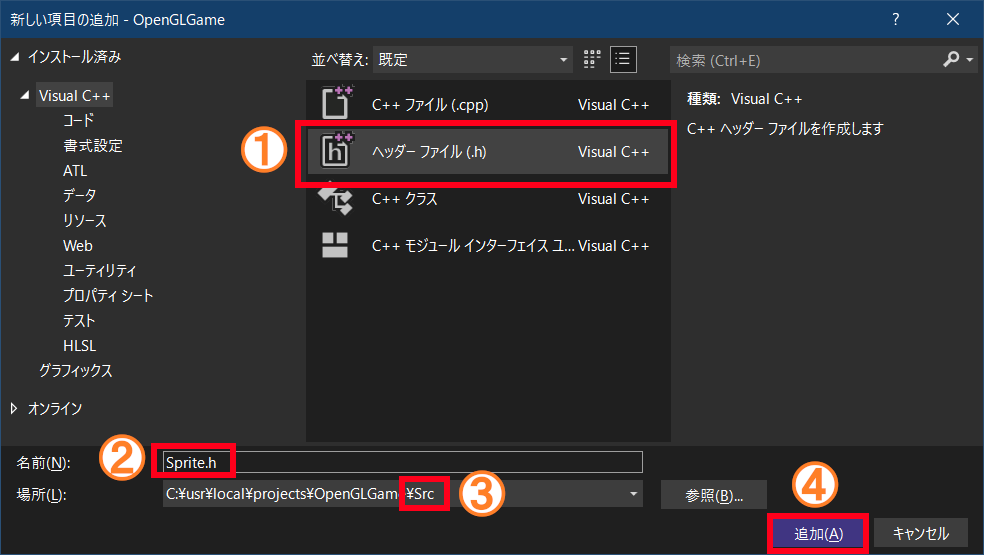
</p>

「新しい項目の追加」ウィンドウが開いたら、中央のリストから「ヘッダーファイル(.h)」を選択してください(①)。

次に、下部の「名前」欄を`Sprite.h`に変更します(②)。最後に「場所」として「プロジェクトの`Src`フォルダ」を選択したら(③)、右下にある「追加」ボタンをクリックします(④)。

これで、プロジェクトに`Sprite.h`というファイルが追加されます。追加した`Sprite.h`を開き、最初から書かれている`#pragma once`行を削除し、次のプログラムを追加してください。

```diff
+/**
+* @file Sprite.h
+*/
+#ifndef SPRITE_H_INCLUDED
+#define SPRITE_H_INCLUDED
+#include <vector>
+
+
+// スプライト配列型
+using SpriteList = std::vector<Sprite>;
+
+#endif // SPRITE_H_INCLUDED
```

`Main.cpp`を開き、シフトキーを押しながらマウスドラッグまたは矢印キーで`Texcoord`構造体と`Sprite`構造体の定義を選択し、`Ctrl+X`キーで切り取ってください。

```diff
       GL_BGRA, GL_UNSIGNED_BYTE, img.data());
   }
   file.close();
-
-  // 図形に表示する範囲をあらわす構造体
-  // 数値はテクスチャ座標系で指定する
-  struct Texcoord
-  {
-    float u, v;   // テクスチャ座標
-    float sx, sy; // 画像の大きさ
-  };
-
-  // 画像表示用データ(スプライト)を格納する構造体
-  struct Sprite
-  {
-    float x, y, z, w; // 画像を表示する座標
-    Texcoord texcoord;// テクスチャ座標と大きさ
-  };

   // スプライトの配列を作成
   const size_t maxSpriteCount = 100'000; // スプライトの最大数
```

次に`Sprite.h`を開き、切り取ったプログラムを`Ctrl+V`キーで貼り付けてください。

```diff
 */
 #ifndef SPRITE_H_INCLUDED
 #define SPRITE_H_INCLUDED
+
+  // 図形に表示する範囲をあらわす構造体
+  // 数値はテクスチャ座標系で指定する
+  struct Texcoord
+  {
+    float u, v;   // テクスチャ座標
+    float sx, sy; // 画像の大きさ
+  };
+
+  // 画像表示用データ(スプライト)を格納する構造体
+  struct Sprite
+  {
+    float x, y, z, w; // 画像を表示する座標
+    Texcoord texcoord;// テクスチャ座標と大きさ
+  };

 #endif // SPRITE_H_INCLUDED
```

行頭の空白が気になるので整形しましょう。上部メニューから「編集→詳細→ドキュメントの
フォーマット」を選択してください。すると行頭の空白が消えます。

>コピペなどを行った結果、不要な空白ができてしまった場合はこの方法で解消できます。

スプライト配列を作るとき、毎回`std::vector<Sprite>`と書くのはちょっと面倒です。そこで、`using`(ユージング)によって別名を定義しておきます。次のように`vector`ヘッダをインクルードしてください。

```diff
 #ifndef SPRITE_H_INCLUDED
 #define SPRITE_H_INCLUDED
+#include <vector>

 // 図形に表示する範囲をあらわす構造体
 // 数値はテクスチャ座標系で指定する
```

それから、スプライト構造体の定義の下に次のプログラムを追加してください。

```diff
   float x, y, z, w; // 画像を表示する座標
   Texcoord texcoord;// テクスチャ座標と大きさ
 };
+
+// スプライト配列型
+using SpriteList = std::vector<Sprite>;

 #endif // SPRITE_H_INCLUDED
```

以後は`Sprite.h`をインクルードすることで、`std::vector<Sprite>`の代わりに
`SpriteList`を使うことができます。

次に、テクスチャ座標を作成する`MakeTexcoord`を移動します。<br>`Main.cpp`を開き、`MakeTexcoord`ラムダ式を切り取ってください。

```diff
   pSpriteSsbo = static_cast<uint8_t*>(glMapNamedBuffer(ssboSprite, GL_WRITE_ONLY));
   GLsync syncSpriteSsbo[2] = { 0, 0 }; // スプライト用SSBOの同期オブジェクト
-
-  // テクスチャ座標を作成するラムダ式(座標ピクセル数で指定)
-  auto MakeTexcoord = [](float u, float v, float sx, float sy) {
-    return Texcoord{ u / 512, v / 512, sx / 512, sy / 512 };
-  };

   // テクスチャ座標のリスト
   const Texcoord texcoordList[] = {
```

次に`Sprite.h`を開き、`SpriteList`型の定義の下に、切り取ったプログラムを貼り付けてください。

```diff
 // スプライト配列型
 using SpriteList = std::vector<Sprite>;
+
+  // テクスチャ座標を作成するラムダ式(座標ピクセル数で指定)
+  auto MakeTexcoord = [](float u, float v, float sx, float sy) {
+    return Texcoord{ u / 512, v / 512, sx / 512, sy / 512 };
+  };

 #endif // SPRITE_H_INCLUDED
```

ヘッダファイルにラムダ式を書くと、そのヘッダファイルをインクルードした全てのソースファイルに、ラムダ式のコピーが作られてビルドに失敗します。

そこで、ラムダ式を関数に書き換えます。貼り付けた`MakeTexcoord`ラムダ式を次のように変更してください。

```diff
 // スプライト配列型
 using SpriteList = std::vector<Sprite>;

 // テクスチャ座標を作成するラムダ式(座標ピクセル数で指定)
-  auto MakeTexcoord = [](float u, float v, float sx, float sy) {
+inline Texcoord MakeTexcoord(float u, float v, float sx, float sy)
+{
   return Texcoord{ u / 512, v / 512, sx / 512, sy / 512 };
 };

 #endif // SPRITE_H_INCLUDED
```

再び`Main.cpp`を開き、次のように`Sprite.h`をインクルードしてください。
`Texcoord`と`Sprite`の定義を移動させたために起きていたエラーが消えるはずです。

```diff
 * @file Main.cpp
 */
 #include "glad/glad.h"
+#include "Sprite.h"
 #include <GLFW/glfw3.h>
 #include <Windows.h>
```

プログラムが書けたらビルドして実行してください。これまでと同じ画面が表示されていたら成功です。

### 1.2 エンジンクラスを定義する

肩慣らしが済んだところで、次はゲームの部品を駆動する「エンジン」クラスを作ります。目標は、「`WinMain`関数の全てのプログラムをエンジンクラスのメンバにする」ことです。

`Sprite.h`と同様の手順で、プロジェクトの`Src`フォルダに`Engine.h`というヘッダファイルを追加してください。追加した`Engine.h`を開いて`#pragma once`を削除したら、次のプログラムを追加してください。

```diff
+/**
+* @file Engine.h
+*/
+#ifndef ENGINE_H_INCLUDED
+#define ENGINE_H_INCLUDED
+#include "glad/glad.h"
+#include "Sprite.h"
+#include <GLFW/glfw3.h>
+#include <string>
+#include <random>
+
+/**
+* ゲームエンジン
+*/
+class Engine
+{
+public:
+  int Run();
+
+private:
+};
+
+#endif // ENGINE_H_INCLUDED
```

`Run`(ラン)メンバ関数はゲームエンジンを実行する関数です。

次に、プロジェクトの`Src`フォルダに`Engine.cpp`というソースファイルを追加してください。追加した`Engine.cpp`を開き、次のプログラムを追加してください。

```diff
+/**
+* @file Engine.cpp
+*/
+#include "Engine.h"

```

これでファイルの準備はできました。続いて`Main.cpp`を開き、`Engine.h`をインクルードしてください。

```diff
 * @file Main.cpp
 */
 #include "glad/glad.h"
+#include "Engine.h"
 #include "Sprite.h"
 #include <GLFW/glfw3.h>
```

それから、`WinMain`関数を次のように変更してください。

```diff
   _In_ LPSTR lpCmdLine,
   _In_ int nShowCmd)
 {
+  Engine engine;
+  return engine.Run();
+}
+
+/**
+* ゲームエンジンを実行する
+*
+* @retval 0     正常に実行が完了した
+* @retval 0以外 エラーが発生した
+*/
+int Engine::Run()
+{
   // GLFWの初期化
   if (glfwInit() != GLFW_TRUE) {
```

これで`WinMain`のすべてのプログラムを、`Engine`クラスの`Run`メンバ関数に移動させることができました。プログラムが書けたらビルドして実行してください。これまでと同じ画面が表示されていたら成功です。

>コメント行の`retval`(レット・バル)は`return value`(リターンバリュー)の短縮形で、「戻り値」を意味します。

### 1.3 ローカル変数をメンバ変数にする

「全て`Run`関数に移動したし、これで完成！」…とはいきません。まだ何も「構造化」していないからです。そこで、プログラムを以下の3つの役割を持つ関数に分割します。

>* 初期化
>* メインループ
>* 終了

分割によって、プログラムを追加するとき「これはどの役割に属するプログラムなのか」という視点が生まれます。これは「構造化」による利点のひとつです。

さて、プログラムを分割する場合、役割をまたいで利用していた変数の扱いが問題になります。この問題は、役割をまたいで利用するローカル変数を、クラスのメンバ変数にすれば解決できます。

現時点で「パートをまたいで利用している」あるいは「今後パートをまたいで利用する可能性がある」のは、以下の種類の変数です。

>* GLFWウィンドウオブジェクト(`window`)
>* タイトル文字列(`title`)
>* OpenGLのオブジェクト管理番号(`vs`,`fs`,`progSprite`,`vbo`,`ibo`,...)
>* スプライト配列に関する変数(`maxSpriteCount`,`spriteListBg`,...)
>* SSBOの操作に使う変数(`spriteSsboSize`,`ssboSprite`,`spriteSsboIndex`,...)
>* 乱数(`rg`)
>* 背景スプライトに関する変数(`bgSizeX`,`bgSizeY`,`bgBaseX`,`bgBaseY`)

まず最初の2種類を移動させます。`Main.cpp`を開き、`Shift+矢印キー`かマウスドラッグで以下のプログラムを選択し、`Ctrl+X`キーで切り取ってください。

```diff
     return 1; // 初期化失敗
   }

   // 描画ウィンドウの作成
-  GLFWwindow* window = nullptr; // ウィンドウオブジェクト
-  const std::string title = "OpenGLGame"; // ウィンドウタイトル
   glfwWindowHint(GLFW_OPENGL_DEBUG_CONTEXT, GLFW_TRUE);
```

`Engine.h`を開き、切り取ったプログラムを`Ctrl+V`キーで貼り付けてください。

```diff
   int InitOpenGL();

 private:
+  GLFWwindow* window = nullptr; // ウィンドウオブジェクト
+  const std::string title = "OpenGLGame"; // ウィンドウタイトル
 };

 #endif // ENGINE_H_INCLUDED
```

これで、2つのローカル変数をメンバ変数にすることができました。

同様にして、管理番号をあらわす変数も移動しましょう。`Main.cpp`を開き、頂点シェーダの管理番号をあらわす`vs`変数を切り取ってください。

```diff
   // 頂点シェーダを読み込んでコンパイルする
   std::ifstream file;
-  GLuint vs; // 頂点シェーダの管理番号
   vs = glCreateShader(GL_VERTEX_SHADER);
   const char filenameVS[] = "Res/standard_2D.vert";
   file.open(filenameVS, std::ios::binary); // ファイルを開く
```

`Engine.h`を開き、切り取ったプログラムを貼り付けてください。

```diff
 private:
   GLFWwindow* window = nullptr; // ウィンドウオブジェクト
   const std::string title = "OpenGLGame"; // ウィンドウタイトル
+  GLuint vs; // 頂点シェーダの管理番号
 };

 #endif // ENGINE_H_INCLUDED
```

このように、ローカル変数をメンバ変数にするには、移動させたいローカル変数を行ごと切り取り、クラス定義の中に貼り付けます。これで、ローカルにある`vs`変数をメンバ変数にすることができました。

<pre class="tnmai_assignment">
<strong>【課題01】</strong>
<code>window</code>, <code>title</code>, <code>vs</code>変数の移動を参考にして、以下に挙げる全てのローカル変数を<code>Engine</code>クラスのメンバ変数にしなさい。
<table>
  <tr><td>シェーダ</td><td>fs, progSprite</td></tr>
  <tr><td>頂点バッファ</td><td>vbo, ibo, vao</td></tr>
  <tr><td>テクスチャ</td><td>tex</td></tr>
  <tr><td>スプライト</td><td>maxSpriteCount, spriteListBg, spriteListObj</td></tr>
  <tr><td>SSBO</td><td>spriteSsboSize, ssboSprite, spriteSsboIndex, pSpriteSsbo</td></tr>
  <tr><td>同期オブジェクト</td><td>syncSpriteSsbo</td></tr>
  <tr><td>乱数</td><td>rg</td></tr>
  <tr><td>背景スプライト</td><td>bgSizeX, bgSizeY, bgBaseX, bgBaseY</td></tr>
</table>
</pre>

課題01が終わったら、プログラムをビルドして実行してください。これまでと同じ画面が表示されていたら成功です。

### 1.4 Run関数を3つのパートに分割する

それでは`Run`関数を分割しましょう。まず、分割先となる3つの関数を「宣言」します。`Engine.h`を開き、次のプログラムを追加してください。

```diff
 public:
   int Run();

 private:
+  int Initialize();
+  int MainLoop();
+  int Finalize();
+
   GLFWwindow* window = nullptr; // ウィンドウオブジェクト
   const std::string title = "OpenGLGame"; // ウィンドウタイトル
```

初期化を行う関数の名前は`Initialize`(イニシャライズ)、メインループ関数の名前は`MainLoop`(メインループ)、終了関数の名前は`Finalize`(ファイナライズ)としました。

次に`Run`関数に、3つの関数を呼び出すプログラムを追加します。`Main.cpp`を開き、`Run`関数に次のプログラムを追加してください。

```diff
 */
 int Engine::Run()
 {
+  int ret = Initialize();
+  if (ret == 0) {
+    ret = MainLoop();
+  }
+  Finalize();
+  return ret;
+
   // GLFWの初期化
   if (glfwInit() != GLFW_TRUE) {
```

続いて`Run`関数を分割して、追加した関数の「定義」を作ります。3つの関数を呼び出すプログラムの下に、次のプログラムを追加してください。

```diff
     ret = MainLoop();
   }
   Finalize();
   return ret;
+}

+/**
+* ゲームエンジンを初期化する
+*
+* @retval 0     正常に初期化された
+* @retval 0以外 エラーが発生した
+*/
+int Engine::Initialize()
+{
   // GLFWの初期化
   if (glfwInit() != GLFW_TRUE) {
```

初期化の終端は「背景スプライトを作成する」プログラムです。直後の時間計測から先は、メインループの<ruby>範疇<rt>はんちゅう</rt></ruby>になります。

背景スプライトを作成するプログラムの下に、次のプログラムを追加してください。

```diff
         MakeTexcoord(fmod(x + y * 18, 5.0f) * 32, 224, 32, 32) });
     }
   }
+
+  return 0; // 正常に初期化された
+}
+
+/**
+* メインループを実行する
+*
+* @retval 0     正常に実行された
+* @retval 0以外 エラーが発生した
+*/
+int Engine::MainLoop()
+{
   // 時間, FPS計測用の変数
   double prevTime = glfwGetTime();
```

メインループの終端は`while`ループの終端と一致します。そこから下はOpenGLを「終了」させるプログラムです。`while`ループの終端の下に、次のプログラムを追加してください。

```diff
     glfwSwapBuffers(window);
     glfwPollEvents();
   }
+
+  return 0; // 正常に実行された
+}
+
+/**
+* ゲームエンジンを終了する
+*
+* @retval 0     正常に終了した
+* @retval 0以外 エラーが発生した
+*/
+int Engine::Finalize()
+{
   // GLFWの終了
   glfwTerminate();
```

これで、プログラムを3つのパートに分けることができました。プログラムが書けたらビルドして実行してください。これまでと同じ画面が表示されていたら成功です。

### 1.5 メンバ関数をEngine.cppに移動する

最後の仕上げとして、すべてのメンバ関数を`Engine.cpp`に移動します。`Main.cpp`を開き、`Run`, `Initialize`, `MainLoop`, `Finalize`関数を選択し、`Ctrl+X`キーで切り取ってください。

```diff
   Engine engine;
   return engine.Run();
 }
-
-/**
-* ゲームエンジンを実行する
-*
-* @retval 0     正常に実行が完了した
-* @retval 0以外 エラーが発生した
-*/
-int Engine::Run()
-{
-        ・
-        ・
-      [省略]
-        ・
-        ・
-int Engine::Finalize()
-{
-  // GLFWの終了
-  glfwTerminate();
-
-  return 0;
-}
```

次に`Engine.cpp`を開き、切り取ったプログラムを`Ctrl+V`キーで貼り付けてください。

```diff
 * @file Engine.cpp
 */
 #include "Engine.h"
+
+/**
+* ゲームエンジンを実行する
+*
+* @retval 0     正常に実行が完了した
+* @retval 0以外 エラーが発生した
+*/
+int Engine::Run()
+{
+        ・
+        ・
+      [省略]
+        ・
+        ・
+int Engine::Finalize()
+{
+  // GLFWの終了
+  glfwTerminate();
+
+  return 0;
+}
```

移動したばかりの状態では、必要な関数が`Main.cpp`に残っていたり、必要なヘッダファイルがインクルードされていなかったりします。

<pre class="tnmai_assignment">
<strong>【課題02】</strong>
<code>DebugCallback</code>と<code>CalcSsboSize</code>関数を、<code>Main.cpp</code>から<code>Engine.cpp</code>の先頭(インクルード文の直後)に移動しなさい。
</pre>

<pre class="tnmai_assignment">
<strong>【課題03】</strong>
<code>Main.cpp</code>のインクルード文をコピーして<code>Engine.cpp</code>に貼り付けなさい。必要最小限のインクルード文だけをコピーすること(3行あります)。
</pre>

<pre class="tnmai_assignment">
<strong>【課題04】</strong>
<code>Main.cpp</code>のインクルード文のうち、不要なインクルード文を削除しなさい(2行になるはず)。
</pre>

完全な構造化とは言い難いですが、これでひとまず`WinMain`関数のプログラムを構造化することができました。

>**【1章のまとめ】**
>
>* 役割の異なるプログラムを関数に分割することで、プログラムを構造化することができる。
>* 複数の役割にまたがって使われる変数はメンバ変数にする。

<div style="page-break-after: always"></div>

## 2. 自機を表示して動かす

### 2.1 シーンクラスを定義する

ほとんどのゲームは、「遊び方・演出」のようなゲームプレイ部分と、画像の表示や音声出力を制御するゲームエンジン部分に分けることができます。

2Dシューティングゲームの場合、「ゲームプレイ」とは、背景の設定、自機の操作、敵の移動・攻撃、といった部分のことです。

この章では、ゲームエンジンとは別に、ゲームプレイを管理するクラスを定義します。これを「`Scene`(シーン)クラス」としましょう。

プロジェクトの`Src`フォルダに`Scene.h`というヘッダファイルを追加してください。追加したファイルを開き、次のプログラムを追加してください。

```diff
+/**
+* @file Scene.h
+*/
+#ifndef SCENE_H_INCLUDED
+#define SCENE_H_INCLUDED
+#include <memory>
+
+// 先行宣言
+class Engine;
+
+/**
+* シーンの基底クラス
+*/
+class Scene
+{
+public:
+  Scene() = default;
+  virtual ~Scene() = default;
+  virtual bool Initialize(Engine& engine) { return true; }
+  virtual void Update(Engine& engine, float deltaTime) = 0;
+  virtual void Finalize(Engine& engine) {}
+};
+
+using ScenePtr = std::shared_ptr<Scene>; // シーンポインタ型
+
+#endif // SCENE_H_INCLUDED
```

「シーン」には「映画、演劇、本の中の単一の出来事、またはその舞台設定」という意味があります。ゲームには「タイトル」、「メインゲーム」、「イベント」、「メニュー」のように、目的に応じたシーンが存在します。

これらのシーンは見た目こそ異なりますが、シーンが「開始」され、状態が「更新」されてゆき、最後に「終了」して次のシーンに切り替わる、という流れは同じです。

この流れを表現するのが`Scene`基底クラスの役割です。このクラスを継承して「タイトルシーン」や「メインゲームシーン」などを作成し、それぞれ固有の舞台設定や動作をプログラムします。

### 2.2 メインゲームシーンを作成する

最初に、ゲームプレイの中心となる「メインゲームシーン」を作成しましょう。プロジェクトの`Src`フォルダに`MainGameScene.h`という名前のヘッダファイルを追加してください。追加したファイルを開き、次のプログラムを追加してください。

```diff
+/**
+* @file MainGameScene.h
+*/
+#ifndef MAINGAMESCENE_H_INCLUDED
+#define MAINGAMESCENE_H_INCLUDED
+#include "Scene.h"
+
+/**
+* メインゲーム画面
+*/
+class MainGameScene : public Scene
+{
+public:
+  MainGameScene() = default;
+  virtual ~MainGameScene() = default;
+  virtual bool Initialize(Engine& engine) override;
+  virtual void Update(Engine& engine, float deltaTime) override;
+};
+
+#endif // MAINGAMESCENE_H_INCLUDED
```

次に、プロジェクトの`Src`フォルダに`MainGameScene.cpp`という名前のソースファイルを追加してください。追加したファイルを開き、次のプログラムを追加してください。

```diff
+/**
+* @file MainGameScene.cpp
+*/
+#include "MainGameScene.h"
+#include "Engine.h"
+
+/**
+* シーンを初期化する
+*
+* @retval true  初期化成功
+* @retval false 初期化失敗
+*/
+bool MainGameScene::Initialize(Engine& engine)
+{
+  return true; // 初期化成功
+}
+
+/**
+* メインゲーム画面の状態を更新する
+*/
+void MainGameScene::Update(Engine& engine, float deltaTime)
+{
+}
```

続いて、舞台設定に当たるスプライトの設定プログラムを、エンジンクラスから移動させます。`Engine.cpp`を開き、`Ctrl+X`キーでテクスチャ座標の定義を切り取ってください。

```diff
   // スプライトデータのコピー先アドレスを取得(マッピング)
   pSpriteSsbo = static_cast<uint8_t*>(glMapNamedBuffer(ssboSprite, GL_WRITE_ONLY));
-
-  // テクスチャ座標のリスト
-  const Texcoord texcoordList[] = {
-    MakeTexcoord(0, 0, 64, 64),     // 大型機
-    MakeTexcoord(0, 128, 32, 32),   // 小型機
-    MakeTexcoord(128, 176, 48, 48), // 隕石
-    MakeTexcoord(128, 64, 32, 48),  // 中型機
-  };

   // 乱数を初期化
   std::random_device rd; // 真の乱数を生成するオブジェクト(遅い)
```

`MainGameScene.cpp`を開き、切り取ったプログラムをインクルード文の下に貼り付けてください。

```diff
 #include "Engine.h"
 #include <fstream>
 #include <filesystem>
+
+// テクスチャ座標のリスト
+const Texcoord texcoordList[] = {
+  MakeTexcoord(0, 0, 64, 64),     // 大型機
+  MakeTexcoord(0, 128, 32, 32),   // 小型機
+  MakeTexcoord(128, 176, 48, 48), // 隕石
+  MakeTexcoord(128, 64, 32, 48),  // 中型機
+};
+
 /**
 * シーンを初期化する
```

再び`Engine.cpp`を開き、「スプライトの座標をランダムに決定する」プログラムと「背景スプライトを作成する」プログラムの両方を選択し、`Ctrl+X`キーで切り取ってください。

```diff
   // 乱数を初期化
   std::random_device rd; // 真の乱数を生成するオブジェクト(遅い)
   rg.seed(rd()); // 疑似乱数を「真の乱数」で初期化

-  // スプライトの座標をランダムに決定
-  int w, h;
-  glfwGetWindowSize(window, &w, &h);
-  std::uniform_real_distribution<float> rx(0, static_cast<float>(w)); // X軸方向の分布域
-        ・
-        ・
-      [省略]
-        ・
-        ・
-  float bgBaseY = 16; // 背景の配置開始Y座標
-  for (float y = 0; y < static_cast<float>(bgSizeY); ++y) {
-    for (float x = 0; x < static_cast<float>(bgSizeX); ++x) {
-      spriteListBg.push_back({
-        x * 32 + bgBaseY, y * 32 + bgBaseY, 0, 0,
-        MakeTexcoord(fmod(x + y * 18, 5.0f) * 32, 224, 32, 32) });
-    }
-  }
-
   return 0;
 }
```

`MainGameScene.cpp`を開き、切り取ったプログラムを`Initialize`(イニシャライズ)関数に貼り付けてください。

```diff
 */
 bool MainGameScene::Initialize(Engine& engine)
 {
+  // スプライトの座標をランダムに決定
+  int w, h;
+  glfwGetWindowSize(window, &w, &h);
+  std::uniform_real_distribution<float> rx(0, static_cast<float>(w)); // X軸方向の分布域
+        ・
+        ・
+      [省略]
+        ・
+        ・
+  float bgBaseY = 16; // 背景の配置開始Y座標
+  for (float y = 0; y < static_cast<float>(bgSizeY); ++y) {
+    for (float x = 0; x < static_cast<float>(bgSizeX); ++x) {
+      spriteListBg.push_back({
+        x * 32 + bgBaseY, y * 32 + bgBaseY, 0, 0,
+        MakeTexcoord(fmod(x + y * 18, 5.0f) * 32, 224, 32, 32) });
+    }
+  }
+
   return true; // 初期化成功
 }
```

この時点では、多くのエラーが発生しているはずです。これらは次節で解決します。

### 2.3 エンジンに必要な関数を追加する

2.2節で起きたエラーの原因は、プログラムを別のクラスに移動したことで、エンジンクラスが管理する変数が見えなくなったためです。

そこで、エンジンクラスが管理している変数を参照する関数を追加します。`Engine.h`を開き、エンジンクラスの定義に次のプログラムを追加してください。

```diff
 {
 public:
   int Run();
+  GLFWwindow* GetWindow() { return window; }
+  std::mt19937& GetRandomGenerator() { return rg; }
+  SpriteList& GetSpriteListBg() { return spriteListBg; }
+  SpriteList& GetSpriteListObj() { return spriteListObj; }
+
+  // 背景スプライトの配置情報
+  struct BgSize
+  {
+    size_t sizeX; // 横のタイル数
+    size_t sizeY; // 縦のタイル数
+    float baseX;  // 背景の配置開始X座標
+    float baseY;  // 背景の配置開始Y座標
+  };
+  BgSize GetBgSize() const {
+    return {bgSizeX, bgSizeY, bgBaseX, bgBaseY};
+  }

private:
  int Initialize();
```

追加した関数を使ってエラーを解決しましょう。`MainGameScene.cpp`を開き、`Initialize`関数の定義に次のプログラムを追加してください。

```diff
 bool MainGameScene::Initialize(Engine& engine)
 {
+  SpriteList& spriteListBg = engine.GetSpriteListBg();
+  SpriteList& spriteListObj = engine.GetSpriteListObj();
+  GLFWwindow* window = engine.GetWindow();
+  std::mt19937& rg = engine.GetRandomGenerator();
+  const auto [bgSizeX, bgSizeY, bgBaseX, bgBaseY] = engine.GetBgSize();
+
   // スプライトの座標をランダムに決定
   int w, h;
```

これでエラーがなくなるはずです。

ところで、`GetBgSize`関数の戻り値の受け取り方は、初めて目にするかもしれません。これは、C++17で追加された「構造化束縛(こうぞうかそくばく)」という書き方です。

`auto [変数1, 変数2, 変数3, ... ]`

のように書くことで、配列や構造体の内容を、まとめて変数に代入することができます。

### 2.4 エンジンにシーン制御を追加する

実際にシーンの流れを制御するのは、ゲームエンジンの仕事になります。`Engine.h`を開き、`Scene.h`をインクルードしてください。

```diff
 #define ENGINE_H_INCLUDED
 #include "glad/glad.h"
 #include "Sprite.h"
+#include "Scene.h"
 #include <GLFW/glfw3.h>
 #include <string>
```

そして、`Engine`クラスの定義に次のメンバ変数を追加してください。

```diff
   float bgBaseX = 16; // 背景の配置開始X座標
   float bgBaseY = 16; // 背景の配置開始Y座標
+
+  ScenePtr scene; // 実行中のシーン
+  ScenePtr nextScene; // 次のシーン
 };

 #endif // ENGINE_H_INCLUDED
```

さらに、`Engine`クラスの定義に「次のシーン」を設定するメンバ関数を追加してください。

```diff
   // 配置データの読み込み・スプライト設定
   TileMap LoadTileMap(const char* filename);
   void SetSpriteList(const TileMap& tileMap);
+
+  // 次のシーンを設定する
+  template<typename T>
+  void SetNextScene() { nextScene = std::make_shared<T>(); }

 private:
   int Initialize();
```

次に`Engine.cpp`を開き、`MainGameScene.h`をインクルードしてください。

```diff
 * @file Engine.cpp
 */
 #include "Engine.h"
+#include "MainGameScene.h"
 #include <Windows.h>
 #include <fstream>
```

続いて、`Initialize`関数の末尾に、次のプログラムを追加してください。

```diff
   // 乱数を初期化
   std::random_device rd; // 真の乱数を生成するオブジェクト(遅い)
   rg.seed(rd()); // 疑似乱数を「真の乱数」で初期化
+
+  // 最初のシーンを作成して初期化
+  scene = std::make_shared<MainGameScene>();
+  if (scene) {
+    scene->Initialize(*this);
+  }

   return 0;
 }
```

最後に、`MainLoop`関数に次のプログラムを追加してください。

```diff
     // 経過時間を計測
     const float deltaTime = float(curTime - prevTime);
     prevTime = curTime;
+
+    // シーンの切り替え
+    if (nextScene) {
+      if (scene) {
+        scene->Finalize(*this);
+      }
+      nextScene->Initialize(*this);
+      scene = std::move(nextScene);
+    }
+
+    // シーンを更新
+    if (scene) {
+      scene->Update(*this, deltaTime);
+    }

     // 背景をスクロールさせる
     const float scrollSpeed = 32; // スクロール速度(ピクセル毎秒)
```

プログラムが書けたらビルドして実行してください。これまでと同じ画面が表示されていたら成功です。

### 2.5 自機を表示する

ゲームっぽくするために、メインゲームシーンにプレイヤーが操作する戦闘機を表示しましょう。`MainGameScene.cpp`を開き、`Initialize`関数に次のプログラムを追加してください。

```diff
   std::mt19937& rg = engine.GetRandomGenerator();
   GLFWwindow* window = engine.GetWindow();
   const auto [bgSizeX, bgSizeY, bgBaseX, bgBaseY] = engine.GetBgSize();
+
+  // 自機スプライトを追加
+  spriteListObj.push_back({
+    static_cast<float>(bgSizeX) * 32 / 2, 64, 0, 0,
+    MakeTexcoord(0, 464, 32, 48) });

   // スプライトの座標をランダムに決定
   int w, h;
```

プログラムが書けたらビルドして実行してください。画面中央下に戦闘機が表示されていたら成功です。

<p align="center">
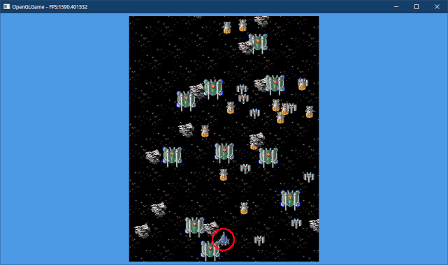
</p>

### 2.6 キー状態を取得する関数を定義する

次に、キー入力に寄って戦闘機を操作できるようにしましょう。そのために、ゲームエンジンにキーの状態を取得する関数を追加します。`Engine.h`を開き、次のプログラムを追加してください。

```diff
   BgSize GetBgSize() const {
     return {bgSizeX, bgSizeY, bgBaseX, bgBaseY};
   }
+
+  // キーが押されていたらtrue, 押されてなければfalseを返す
+  bool GetKey(int key) const {
+    return glfwGetKey(window, key) == GLFW_PRESS;
+  }

 private:
   int Initialize();
```

キーの状態を調べるには`glfwGetKey`(ジーエルエフダブリュー・ゲット・キー)関数を使います。

<p><code class="tnmai_code"><strong>【書式】</strong><br>
int glfwGetKey(GLFWウィンドウオブジェクトのアドレス, キー番号);
</code></p>

キー番号には、`glfw3.h`ヘッダに定義されている`GLFW_KEY_????`というマクロ定数を指定します。戻り値は次の2つのいずれかです。

| 定数 | 意味 |
|:----:|:-----|
| <ruby>GLFW_RELEASE<rt>ジーエルエフダブリュー・リリース</rt></ruby> | キーは押されていない |
| <ruby>GLFW_PRESS<rt>ジーエルエフダブリュー・プレス</rt></ruby> | キーが押されている |

### 2.7 自機をキー操作できるようにする

作成したばかりの`GetKey`関数を使って、戦闘機を移動できるようにしましょう。
`MainGameScene.h`を開き、次のようにメンバ関数宣言を追加してください。

```diff
   virtual bool Initialize(Engine& engine) override;
   virtual void Update(Engine& engine, float deltaTime) override;

 private:
+  void UpdatePlayer(Engine& engine, float deltaTime);
 };

 #endif // MAINGAMESCENE_H_INCLUDED
```

続いて`MainGameScene.cpp`を開き、`Update`関数の定義の下に次のプログラムを追加してください。

```diff
 void MainGameScene::Update(Engine& engine, float deltaTime)
 {
 }
+
+/**
+* 自機の状態を更新
+*/
+void MainGameScene::UpdatePlayer(Engine& engine, float deltaTime)
+{
+  SpriteList& spriteListObj = engine.GetSpriteListObj();
+  Sprite* player = &spriteListObj[0];
+
+  // キー入力を移動方向に変換
+  const float vx = static_cast<float>(
+    engine.GetKey(GLFW_KEY_D) - engine.GetKey(GLFW_KEY_A));
+  const float vy = static_cast<float>(
+    engine.GetKey(GLFW_KEY_W) - engine.GetKey(GLFW_KEY_S));
+
+  // 移動方向の長さが0以上なら入力があったとみなす(0除算を回避するため)
+  const float v = std::sqrt(vx * vx + vy * vy); // 移動方向の長さvを求める
+  if (v > 0) {
+    // 自機の座標を更新
+    const float playerSpeed = 300 * deltaTime / v;
+    player->x += vx * playerSpeed;
+    player->y += vy * playerSpeed;
+  }
+
+  // 自機が画面外に行かないように、値の範囲を制限する
+  const float viewSizeX = 17 * 32;
+  const float viewSizeY = 22 * 32;
+  player->x = std::clamp(player->x, 16.0f, viewSizeX - 16.0f);
+  player->y = std::clamp(player->y, 24.0f, viewSizeY - 24.0f);
+}
```

`UpdatePlayer`(アップデート・プレイヤー)は、自機の移動や弾の発射などを処理する関数です。それでは、この関数を`Update`関数から呼び出しまょう。`Update`関数に次のプログラムを追加してください。

```diff
 void MainGameScene::Update(Engine& engine, float deltaTime)
 {
+  UpdatePlayer(engine, deltaTime);
 }

 /**
 * 自機の状態を更新
```

プログラムが書けたらビルドして実行してください。`W`, `A`, `S`, `D`キーを押して、戦闘機を自由に動かすことができたら成功です。

<p align="center">
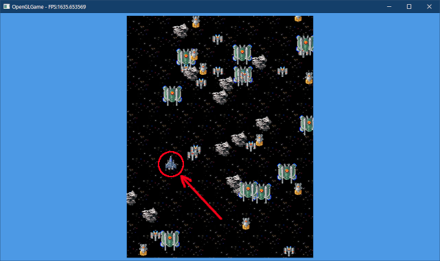
</p>

### 2.7 弾を発射する

よりゲームっぽくするために、弾を発射する機能を追加してみます。`UpdatePlayer`関数に次のプログラムを追加してください。

```diff
   const float viewSizeY = 22 * 32;  
   player->x = std::clamp(player->x, 16.0f, viewSizeX - 16.0f);
   player->y = std::clamp(player->y, 24.0f, viewSizeY - 24.0f);
+
+  // 弾を発射
+  const Texcoord tcBullet = MakeTexcoord(16, 432, 16, 32);
+  const bool shotKey = engine.GetKey(GLFW_KEY_SPACE);
+  if (shotKey) {
+    spriteListObj.push_back({
+      player->x, player->y + 16, 0, 0, tcBullet });
+  }
 }
```

弾のテクスチャ座標は他のプログラムでも使いたいので、`tcBullet`(ティーシー・バレット)という変数に代入しています(`tc`は`texcoord`の短縮形)。

プログラムが書けたらビルドして実行してください。スペースキーを押して弾が発射されていたら成功です。

<p align="center">
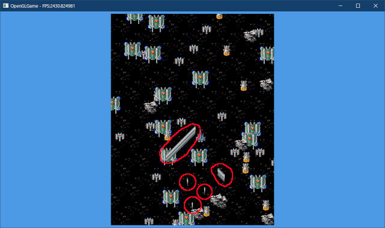
</p>

ところで、スペースキーを押していると無限に弾が発射されます。見た目がたいへんよろしくありませんので、連射間隔を設定しましょう。

これは「前回キーが押されていない場合だけ弾を発射する」というプログラムで実現できます。`MainGameScene.h`を開き、メインゲームシーンクラスの定義に次のプログラムを追加してください。

```diff
 private:
   void UpdatePlayer(Engine& engine, float deltaTime);
+
+  foat shotTimer = 0; // 弾の発射間隔タイマー
 };

 #endif // MAINGAMESCENE_H_INCLUDED
```

`shotTimer`(ショット・タイマー)変数には「弾の発射間隔」を代入します。`prev`は`previous`(プリビアス、「前の」、「直前の」という意味)の短縮形です。

次に`MainGameScene.cpp`を開き、弾を発射するプログラムを次のように変更してください。

```diff
   const Texcoord tcBullet = MakeTexcoord(16, 432, 16, 32);
   const bool shotKey = engine.GetKey(GLFW_KEY_SPACE);
   if (shotKey) {
+    shotTimer -= deltaTime; // キーが押されている間タイマーを減らす
+    if (shotTimer <= 0) {   // タイマーが0以下になったら弾を発射
       spriteListObj.push_back({
         player->x, player->y + 16, 0, 0, tcBullet });
+      shotTimer += 0.2f; // 弾の発射間隔を設定(秒)
+    }
+  } else {
+    // 次にキーが押されたら、すぐ弾が発射されるようにする
+    shotTimer = 0;
   }
 }
```

プログラムが書けたらビルドして実行してください。スペースキーを押しているあいだ、弾が0.2秒ごとに発射されたら成功です。

<p align="center">
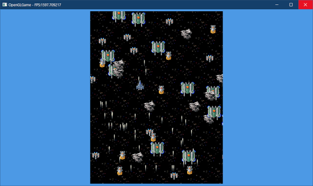
</p>

### 2.8 弾の移動と消去

動かない弾は弾じゃないので、弾を動かしましょう。弾を発射するプログラムの下に、次のプログラムを追加してください。

```diff
     // 次にキーが押されたら、すぐ弾が発射されるようにする
     shotTimer = 0;
   }
+
+  // 弾を移動
+  const float bulletSpeed = 1000 * deltaTime; // 弾の移動速度(pixel/秒)
+  for (auto& e : spriteListObj) {
+    if (e.texcoord.u == tcBullet.u && e.texcoord.v == tcBullet.v) {
+      e.y += bulletSpeed;
+    }
+  }
 }
```

`bulletSpeed`(バレット・スピード)は「弾の速度」をあらわします。プログラムが書けたらビルドして実行してください。弾が画面の上に向かって高速で飛んでいったら成功です。

<p align="center">
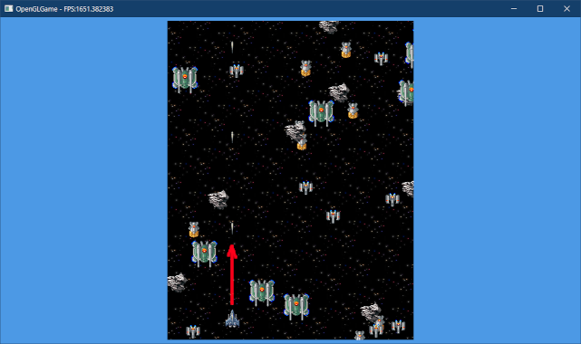
</p>

画面外に飛び去った弾は永遠に飛び続けます。確かに宇宙空間はそういうものです。しかし、現実とは違い、コンピューターは無限の弾数を管理することができません。

そこで、画面外に飛び去った弾を削除します。`texcoordList`配列の定義の下に、次のプログラムを追加してください。

```diff
   MakeTexcoord(128, 160, 48, 48), // 隕石
   MakeTexcoord(128, 64, 32, 48),  // 中型機
 };
+
+/**
+* 座標(x, y)が画面外かどうか
+*/
+bool IsOutOfScreen(float x, float y)
+{
+  const float xMin = -32;     // 画面内とみなす最少X座標
+  const float xMax = 18 * 32; // 画面内とみなす最大X座標
+  const float yMin = -32;     // 画面内とみなす最少Y座標
+  const float yMax = 23 * 32; // 画面内とみなす最大Y座標
+  return
+    x <= xMin || x >= xMax ||
+    y <= yMin || y >= yMax;
+}

 /**
 * シーンを初期化する
```

`IsOutOfScreen`(イズ・アウト・オブ・スクリーン)は「画面外かどうか」を判定する関数です。

続いて、弾を移動させるプログラムの下に、次のプログラムを追加してください。

```diff
       e.y += bulletSpeed;
     }
   }
+
+  // 画面内にある弾を配列の前側に集める
+  const auto i = std::remove_if(spriteListObj.begin(), spriteListObj.end(),
+    [tcBullet](const Sprite& e) {
+      return e.texcoord.u == tcBullet.u && e.texcoord.v == tcBullet.v &&
+        IsOutOfScreen(e.x, e.y); });
+
+  // 配列の後ろ側を削除する
+  spriteListObj.erase(i, spriteListObj.end());
 }
```

`vector`型配列から特定の要素を削除するには、`remove_if`(リムーブ・イフ)関数と、
`vector`型の`erase`(イレース)メンバ関数を使います。

<p><code class="tnmai_code"><strong>【書式】</strong><br>
iterator remove_if(調査範囲の先頭, 調査範囲の終端, 振り分け条件);
</code></p>

`remove_if`は、指定された範囲にある要素をすべて調べ、振り分け条件を「満たさない」要素を、範囲の前側に集めます。それ以外の削除してよい要素は後ろ側に移動されます。

`remove`は「削除」という意味ですが、名前に反して、実際には要素が削除されるとは限りません。実際に行われるのは、条件によって要素を前後に振り分けることで、その過程で一部が削除される場合があります。

「振り分け条件」はラムダ式などで指定します。今回は「弾が画面外にあることを判定する」ラムダ式を指定しています。

振り分けが終わると、後ろ側、つまり「削除してよい範囲」の先頭位置を返します。

<p><code class="tnmai_code"><strong>【書式】</strong><br>
iterator erase(削除する範囲の先頭, 削除する範囲の終端);
</code></p>

`erase`(消去)関数は本当に要素を削除します。このように、要素を削除するときは、上記のプログラムのように`remove_if`と`erase`を組み合わせて使います。

>**【remove_ifの通常版とメンバ関数版の違いについて】**<br>
>実は、標準ライブラリの`list`クラスや`unordered_map`クラスには「`remove_if`**メンバ**関数」が定義されています。これら「メンバ関数の`remove_if`」は名前どおりに要素を削除します。<br>
>要素を削除しないのは、「通常の(メンバ関数ではない)`remove_if`」だけです。

プログラムが書けたらビルドして実行してください。見た目には違いは分からないと思いますが、内部的には弾が削除されているはずです。

<p align="center">

</p>

>**【2章のまとめ】**
>
>* エンジンクラスはOpenGLの初期化や基本的な描画機能を担当する。それ以外の処理は、役割に応じたクラスを作って担当させる。
>* キーの状態を調べるには`glfwGetKey`関数を使う。

<div style="page-break-after: always"></div>

## 3. 背景と敵をファイルから読み込む

### 3.1 配置データを読み込む関数を定義する

背景がいつまでも単調な宇宙だけでは、あまり面白みがありません。しかし、プログラムでそれらしい背景データを作るのは結構大変です。

そこで、ツールを使って作成した背景タイルの配置データを、ファイルから読み込むことにします。とはいえ、いきなり配置データを作るのは難しいので、サンプルファイルを用意しました。

<pre class="tnmai_assignment">
<strong>【課題05】</strong>
次のURLから、<code>map01_bg.csv</code>という配置データファイルをダウンロードしなさい。
<code>https://github.com/tn-mai/OpenGL3D2022/blob/master/res/map01_bg.csv</code>
ファイルをダウンロードしたら、プロジェクトの<code>Res</code>フォルダに保存しなさい。
</pre>

まず、配置データをあらわす構造体を定義します。<br>
プロジェクトの`Src`フォルダに`TileMap.h`という名前のヘッダファイルを追加してください。追加したファイルを開き、次のプログラムを追加してください。

```diff
+/**
+* @file TileMap.h
+*/
+#ifndef TILEMAP_H_INCLUDED
+#define TILEMAP_H_INCLUDED
+#include <vector>
+
+// タイルの配置データ
+struct TileMap
+{
+  size_t sizeX = 0; // 横のタイル数
+  size_t sizeY = 0; // 縦のタイル数
+  std::vector<int> data; // 配置データ
+};
+
+#endif // TILEMAP_H_INCLUDED
```

次に`Engine.h`を開き、`TileMap.h`をインクルードしてください。

```diff
 #include "glad/glad.h"
 #include "Sprite.h"
 #include "Scene.h"
+#include "TileMap.h"
 #include <GLFW/glfw3.h>
 #include <string>
```

それでは、背景の配置ファイルを読み込む関数を追加しましょう。`GetKey`メンバ関数の定義の下に、次のプログラムを追加してください。

```diff
   bool GetKey(int key) const {
     return glfwGetKey(window, key) == GLFW_PRESS;
   }
+
+  // 配置データの読み込み・スプライト設定
+  TileMap LoadTileMap(const char* filename);
+  void SetSpriteList(const TileMap& tileMap);

 private:
   int Initialize();
```

続いて`Engine.cpp`を開き、`Run`関数の定義の下に、次のプログラムを追加してください。

```diff
   Finalize();
   return ret;
 }
+
+/**
+* 配置データを読み込む
+*/
+TileMap Engine::LoadTileMap(const char* filename)
+{
+  // ファイルを開く
+  std::ifstream file;
+  file.open(filename);
+  if ( ! file) {
+    return {}; // 失敗(ファイル名が違う？)
+  }
+
+  // 読み込み先となる変数を準備
+  TileMap tileMap;
+  tileMap.data.reserve(bgSizeX * bgSizeY); // 適当な容量を予約
+
+  // ファイルを読み込む
+  while (!file.eof()) {
+    // 1行読み込む
+    std::string line;
+    std::getline(file, line);
+    if (line.size() <= 0) {
+      continue; // データのない行は無視
+    }
+    line.push_back(','); // 終端を追加
+
+    // カンマ区切り文字列を数値に変換
+    tileMap.sizeX = 0;
+    const char* start = line.data();
+    const char* end = start + line.size();
+    for (const char* p = start; p != end; ++p) {
+      if (*p == ',') {
+        const int n = atoi(start);
+        tileMap.data.push_back(n);
+        start = p + 1; // 次のカンマ区切りを指すように更新
+        ++tileMap.sizeX; // 横のタイル数を更新
+      }
+    }
+    ++tileMap.sizeY; // 縦のタイル数を更新
+  }
+
+  // 読み込んだ配置データを返す
+  return tileMap;
+}

 /**
 * ゲームエンジンを初期化する
```

配置データファイルは普通のテキストファイルで、次のように数値がカンマで区切られています。この種のファイルを、CSV(シーエスブイ)ファイルといいます(CSVは`Comma Separated Values`(カンマ・セパレーテッド・バリューズ)の短縮形)。

>137,140,153,153,153,139,140,153,153,153,139,137,140,153,139,137,137<br>
>140,154,112,115,114,152,154,112,112,112,152,153,154,112,152,153,139<br>
>154,112,116,112,114,112,112,112,113,112,113,113,112,112,114,112,152<br>
>112,113,112,112,112,112,114,...(以下省略)...

これらの数値は「タイル番号」です。タイル番号は、背景用の画像ファイルを16x16に区切り、左上を0番として各タイルに番号を振ったものです。

<p align="center">
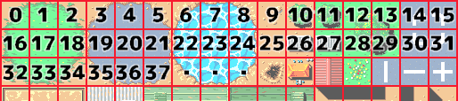<br>
[タイル番号]
</p>

ファイルから1行読み込むには`getline`(ゲット・ライン)関数を使います。

<p><code class="tnmai_code"><strong>【書式】</strong><br>
stream getline(ファイルストリーム, 読み込み先変数);
</code></p>

>**【バイナリファイルとテキストファイルの違い】**<br>
>すべてのファイルは「バイナリ(二進法)ファイル」です。つまり、「テキストファイル」もバイナリファイルの一種です。バイナリファイルに以下の条件を加えると「テキストファイル」になります。
>
>* Unicode(ユニコード)などの「文字として定義されたデータだけを含む」
>* データの区切りとして「<ruby>行<rt>ぎょう</rt></ruby>が定義されている」
>
>このため、テキストファイルは1行ずつ読み込むことができます。バイナリファイルには行の定義がないので、1行ずつ読み込むことはできません。

文字列を数値に変換するには`atoi`(エー・トゥ・アイ)関数を使います。

<p><code class="tnmai_code"><strong>【書式】</strong><br>
int atoi(文字列のアドレス);
</code></p>

### 3.2 配置データからスプライトを作成する

次に、配置データを元にしてスプライトを設定する関数を定義します。`LoadTileMap`関数の定義の下に、次のプログラムを追加してください。

```diff
   // 読み込んだ配置データを返す
   return tileMap;
 }
+
+/**
+* 配置データに従って背景スプライトを設定する
+*/
+void Engine::SetSpriteList(const TileMap& tileMap)
+{
+  // 背景スプライトを削除
+  spriteListBg.clear();
+
+  // 配置開始座標を初期化
+  bgBaseX = 16;
+  bgBaseY = 16;
+
+  // 配置データを参照して背景スプライトを設定
+  // 画像サイズ=512x512, タイルサイズ=32x32
+  for (size_t y = tileMap.sizeY; y > 0;) {
+    --y; // マイナスにならないように、ここで減算
+    for (size_t x = 0; x < tileMap.sizeX; ++x) {
+      // タイル番号を取得
+      const int tileNo = tileMap.data[y * tileMap.sizeX + x];
+
+      // タイル番号に対応するテクスチャ座標を求める
+      const float u = static_cast<float>(tileNo % 16) * 32;
+      const float v = static_cast<float>(tileNo / 16) * 32;
+
+      // 背景スプライトを設定
+      spriteListBg.push_back({
+        static_cast<float>(x * 32 + bgBaseX),
+        static_cast<float>(y * 32 + bgBaseY),
+        0, 0, MakeTexcoord( u, v, 32, 32) });
+    } // for x
+  } // for y
+}

 /**
 * ゲームエンジンを初期化する
```

スプライトを下から順番に作成している点に注目してください。これは、配置データが上から順番に記録されているためです。

これで、「配置データの読み込み」と「スプライトの設定」の2つの関数が揃いました。さっそく使っていきましょう。`MainGameScene.cpp`を開き、背景スプライトを作成するプログラムを次のように変更してください。

```diff
     spriteListObj.push_back({rx(rg), ry(rg), 0, 0, texcoordList[n]});
   }

   // 背景スプライトを作成(タイルサイズ=32x32)
-  for (float y = 0; y < static_cast<float>(bgSizeY); ++y) {
-    for (float x = 0; x < static_cast<float>(bgSizeX); ++x) {
-      spriteListBg.push_back({
-        x * 32 + bgBaseX, y * 32 + bgBaseY, 0, 0,
-        MakeTexcoord(fmod(x + y * 18, 5.0f) * 32, 224, 32, 32) });
-    }
-  }
+  TileMap tileMap = engine.LoadTileMap("Res/map01_bg.csv");
+  engine.SetSpriteList(tileMap);

   return true; // 初期化成功
 }
```

プログラムが書けたらビルドして実行してください。宇宙以外の背景が表示されたら成功です。

<p align="center">
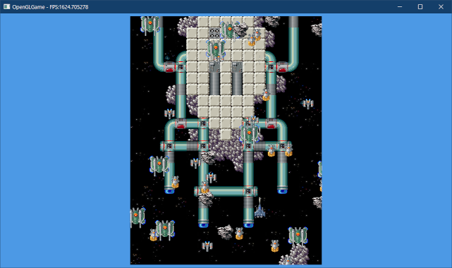
</p>

### 3.3 敵を配置データから作成する

配置データは、背景だけでなく敵にも応用できます。配置データを使って、敵の出現タイミングと位置を指定できるようにしましょう。

<pre class="tnmai_assignment">
<strong>【課題06】</strong>
次のURLから、<code>map01_obj.csv</code>という背景データファイルをダウンロードしなさい。
<code>https://github.com/tn-mai/OpenGL3D2022/blob/master/res/map01_obj.csv</code>
ファイルをダウンロードしたら、プロジェクトの<code>Res</code>フォルダに保存しなさい。
</pre>

`map01_obj.csv`を開くと、ほとんどの値が`-1`で、時折`0`～`3`の数値が現れるデータになっています。数値の意味は次表のとおりです。

| 値 | 出現する敵の種類 |
|:--:|:----------------|
| -1 | (何も出現しない) |
| 0  | 小型機 |
| 1  | 中型機 |
| 2  | 大型機 |
| 3  | 超大型機(ボス) |

この敵配置データですが、次のように使うことを考えています。

>1. 背景と同じ速度で敵出現ラインをスクロールさせる。
>2. 各行が画面最上部を通過したとき、その行に書かれている番号の敵を出現させる。

メインゲームシーンクラスに、敵を出現させる関数を宣言しましょう。`MainGameScene.h`を開き、メインゲームシーンクラスの定義に次のプログラムを追加してください。

```diff
 private:
   void UpdatePlayer(Engine& engine, float deltaTime);
+  void SpawnEnemy(Engine& engine);

   float shotTimer = 0;  // 弾の発射間隔タイマー
+  TileMap enemyMap;     // 敵出現データ
+  size_t spawningY = 0; // 敵出現ライン
 };

 #endif // MAINGAMESCENE_H_INCLUDED
```

敵を出現させる関数には`SpawnEnemy`(スポーン・エネミー)という名前をつけました。次に、既存の敵配置プログラムを`SpawnEnemy`関数で置き換えます。

`MainGameScene.cpp`を開き、`Initialize`関数のスプライト配置プログラムを、次のように変更してください。

```diff
   spriteListObj.push_back({
     static_cast<float>(bgSizeX) * 32 / 2, 64, 0, 0,
     MakeTexcoord(0, 464, 32, 48) });

-  // スプライトの座標をランダムに決定
-  int w, h;
-  glfwGetWindowSize(window, &w, &h);
-  std::uniform_real_distribution<float> rx(0, static_cast<float>(w)); // X軸方向の分布域
-  std::uniform_real_distribution<float> ry(0, static_cast<float>(h)); // Y軸方向の分布域
-  std::uniform_int_distribution<size_t> tc(
-    0, std::size(texcoordList) - 1); // テクスチャ座標の分布域
-  for (size_t i = 0; i < 100; ++i) {
-    const size_t n = tc(rg);
-    spriteListObj.push_back({rx(rg), ry(rg), 0, 0, texcoordList[n]});
-  }
+  // 敵配置データを読み込む
+  enemyMap = engine.LoadTileMap("Res/map01_obj.csv");
+  spawningY = enemyMap.sizeY; // 敵出現ラインを初期化

   // 背景スプライトを作成(タイルサイズ=32x32)
   TileMap tileMap = engine.LoadTileMap("Res/map01_bg.csv");
```

配置データを読み込んだあと、敵が出現するラインをあらわす`spawningY`(スポーニング・ワイ)メンバ変数を、最下段のY座標で初期化します。これは、敵の配置データと背景のスクロールを一致させるためです。

続いて、`Update`関数に`SpawnEnemy`関数の呼び出しを追加してください。

```diff
 void MainGameScene::Update(Engine& engine, float deltaTime)
 {
   UpdatePlayer(engine, deltaTime);
+  SpawnEnemy(engine);
 }
```

最後に`SpawnEnemy`関数を定義します。`UpdatePlayer`関数の定義の下に、次のプログラムを追加してください。

```diff
   // 配列の後ろ側を削除する
   spriteListObj.erase(i, spriteListObj.end());
 }
+
+/**
+* 敵を出現させる
+*/
+void MainGameScene::SpawnEnemy(Engine& engine)
+{
+  // スクロール値を取得
+  auto [sx, sy, bgBaseX, bgBaseY] = engine.GetBgSize();
+  if (bgBaseY >= 0) {
+    return; // 配置データの範囲外なので何もしない
+  }
+
+  // 画面上部(天井)ラインの位置を計算
+  const int startY = static_cast<int>(enemyMap.sizeY) - 23 * 2;
+  int ceilY = startY + static_cast<int>(bgBaseY / 32 * 2);
+  if (ceilY < 0) {
+    ceilY = 0; // 範囲外アクセスを避けるために0を最小値とする
+  }
+
+  // 敵出現ライン～天井ライン間の配置データに従って敵を出現させる
+  SpriteList& spriteListObj = engine.GetSpriteListObj();
+  for (; spawningY > ceilY; --spawningY) {
+    // 横一列分の配置データをチェック
+    for (size_t x = 0; x < enemyMap.sizeX; ++x) {
+      // 配置データから配置する敵の番号を取得
+      const size_t i = ceilY * enemyMap.sizeX + x;
+      const int enemyId = enemyMap.data[i];
+
+      // 敵番号がテクスチャ座標配列の範囲内の場合、敵を出現させる
+      if (enemyId >= 0 && enemyId < std::size(texcoordList)) {
+        // 実際の出現位置に敵を配置(配置データは画像の右下を指している)
+        // 画像サイズ=512x512, タイルサイズ=32x32
+        const Texcoord& tc = texcoordList[enemyId];
+        spriteListObj.push_back({
+          static_cast<float>(x * 32 + tc.sx * 512 / 2),
+          static_cast<float>(21 * 32 + tc.sy * 512 / 2),
+          0, 0, tc });
+      }
+    } // for x
+  } // for spawningY
+}
```

天井ラインを計算するとき、数値を2倍している部分があります。これは、敵の配置データの高さを背景の配置データの2倍の大きさにしているためです。

現在、背景のスクロール速度は1タイル(32ピクセル)につき1秒となっています。敵の配置データを背景と同じサイズにした場合、出現間隔は1秒単位でしか設定できません。

1秒単位では細かい調整ができないため、高さを2倍にして、背景の2倍の速度でスクロールさせることにしました。これによって、敵の出現間隔を0.5秒単位で調整できるようにしています。

敵の出現位置は、タイルの座標から少しずれた位置になります。このずれは画像の大きさによって異なります。

<p align="center">
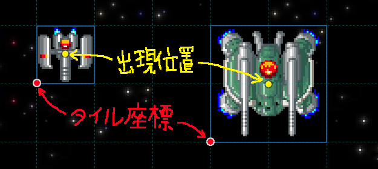<br>
[配置データが示す座標(赤点)と実際の出現位置(黄点)]
</p>

出現位置は`タイル座標+画像の大きさ/2`で求められます。画像の大きさは`Texcoord`から取得できますが、この値は`0～1`に変換されているため、元の大きさに戻すために画像サイズを乗算しています。

プログラムが書けたらビルドして実行してください。画面上部に敵が表示されたら成功です。

<p align="center">
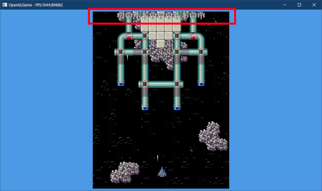
</p>

### 3.4 敵を動かす

敵が画面上部から動かないので、同じ場所に敵が出現しても見た目ではそれが分かりません。そこで、とりあえず下に向かって動かしてみます。

これは仮の動きなので、関数を作ったりはしないで簡単に済ませましょう。`Update`関数に次のプログラムを追加してください。

```diff
   UpdatePlayer(engine, deltaTime);
   SpawnEnemy(engine);
+
+  // 敵を動かす(仮)
+  const float enemySpeed = 100 * deltaTime;
+  SpriteList& spriteListObj = engine.GetSpriteListObj();
+  for (auto& e : spriteListObj) {
+    if (e.texcoord.v <= 256.0f / 512) {
+      e.y -= enemySpeed;
+    }
+  }
 }

 /**
 * 自機の状態を更新
```

プログラムが書けたらビルドして実行してください。敵が下に向かって移動したら成功です。

<p align="center">
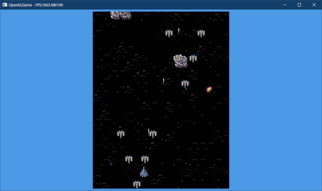
</p>

>**【3章のまとめ】**
>
>* カンマ区切りでデータが記録されたテキストファイルをCSV(シーエスブイ)ファイルという。
>* CSVファイルは、さまざまな種類のデータを表すことができる。
