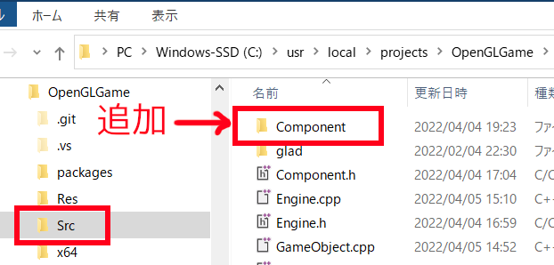
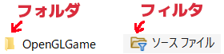
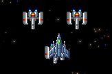
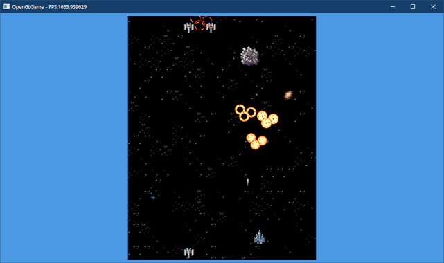
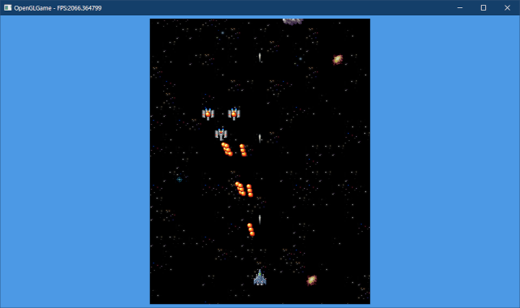
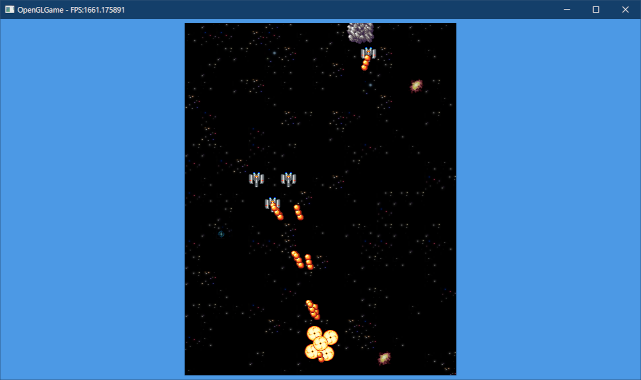

[OpenGL 3D 2022 第05回]

# 衝突！ ゲームオブジェクト

## 習得目標

* エンジンがゲームオブジェクトを管理し、ゲームオブジェクトがコンポーネントを管理するという階層構造を理解する。
* 新規にコンポーネントを作成し、ゲームオブジェクトに割り当てることができる。
* ダメージを与えるコンポーネント、ダメージを受けるコンポーネントを作ることができる。

## 1. ゲームオブジェクトの作成

### 1.1 コンポーネントクラスを作る

ゲームキャラクターを制御するために、`GameObject`(ゲーム・オブジェクト)クラスを作成します。ゲームオブジェクトは以下の機能を持ちます。

>* 表示する「スプライトデータ」の管理。
>* 更新、衝突などの「イベント」の管理。
>* 「衝突判定」データの管理と衝突判定。

このうち、「スプライトデータ」はすでに作成済みなので、残りの2つを作成します。まずは「イベント」の管理から作っていきましょう。

最初に、イベント処理のベースとなる`Component`(コンポーネント)クラスを作成します。<br>
プロジェクトの`Src`フォルダに`Component.h`というファイルを追加してください。追加したファイルを開き、次のプログラムを追加してください。

```diff
+/**
+* @file Component.h
+*/
+#ifndef COMOPNENT_H_INCLUDED
+#define COMOPNENT_H_INCLUDED
+#include <string>
+#include <vector>
+#include <memory>
+
+// 先行宣言
+class GameObject;
+class Component;
+using ComponentPtr = std::shared_ptr<Component>; // コンポーネントのポインタ
+using ComponentList = std::vector<ComponentPtr>; // コンポーネントポインタの配列
+
+// ダメージ情報
+struct Damage
+{
+  float amount = 0; // ダメージ量
+  int type = 0;     // ダメージの種類
+};
+
+/**
+* コンポーネントの基底クラス
+*/
+class Component
+{
+public:
+  Component() = default;
+  virtual ~Component() = default;
+
+  // 最初のUpdateの直前で呼び出される
+  virtual void Start(GameObject& gameObject) {}
+
+  // 毎フレーム1回呼び出される
+  virtual void Update(GameObject& gameObject, float deltaTime) {}
+
+  // 衝突が起きたときに呼び出される
+  virtual void OnCollision(GameObject& gameObject, GameObject& other) {}
+
+  // ダメージを受けたときに呼び出される
+  virtual void OnTakeDamage(GameObject& gameObject, GameObject& other,
+    const Damage& damage) {}
+
+  // ゲームオブジェクトがエンジンから削除されるときに呼び出される
+  virtual void OnDestroy(GameObject& gameObject) {}
+
+  std::string name; // コンポーネント名
+};
+
+#endif // COMOPNENT_H_INCLUDED
```

`Component`クラスは、5つのイベントに対応する仮想関数を定義します。`Component`クラス自体は、これらのイベントに対して何も行いません。<br>
なにか処理をさせたい場合は、`Component`の派生クラスで実装します。

### 1.2 ゲームオブジェクトクラスを作る

これで、ゲームオブジェクトを構成する3つの主要なクラスが完成しました。さっそく、ゲームオブジェクトを作っていきましょう。

プロジェクトの`Src`フォルダに`GameObject.h`という名前のヘッダファイルを追加してください。追加したファイルを開き、次のプログラムを追加してください。

```diff
+/**
+* @file GameObject.h
+*/
+#ifndef GAMEOBJECT_H_INCLUDED
+#define GAMEOBJECT_H_INCLUDED
+#include "Sprite.h"
+#include "Component.h"
+#include <string>
+#include <vector>
+#include <memory>
+
+// 先行宣言
+class Engine;
+class GameObject;
+using GameObjectPtr = std::shared_ptr<GameObject>; // ゲームオブジェクトのポインタ
+using GameObjectList = std::vector<GameObjectPtr>; // ゲームオブジェクトポインタの配列
+
+/**
+* ゲーム内に登場するさまざまなオブジェクトを表す基本クラス
+*/
+class GameObject
+{
+public:
+  GameObject() = default;
+  virtual ~GameObject();
+
+  // イベントの操作
+  virtual void Start();
+  virtual void Update(float deltaTime);
+  virtual void OnCollision(GameObject& object);
+  virtual void OnDestroy();
+  virtual void TakeDamage(GameObject& other, const Damage& damage);
+  bool IsStarted() const { return isStarted; }
+
+  // スプライトの操作
+  void AddSprite(const Texcoord& tc,
+    float x = 0, float y = 0, float scale = 1, float rotation = 0);
+  const SpriteList& GetSprite() const { return spriteList; }
+
+  // コンポーネントの操作
+  template<typename T>
+  std::shared_ptr<T> AddComponent() {
+    std::shared_ptr<T> p = std::make_shared<T>();
+    componentList.push_back(p);
+    return p;
+  }
+
+  Engine* engine = nullptr;    // エンジンのアドレス
+  std::string name;            // オブジェクト名
+  float x = 0;                 // X座標
+  float y = 0;                 // Y座標
+  int priority = 0;            // 表示優先順位
+  SpriteList spriteList;       // スプライト配列
+  ComponentList componentList; // コンポーネント配列
+  bool isDead = false;         // 死亡フラグ
+
+private:
+  bool isStarted = false;      // Start実行済みフラグ
+};
+
+#endif // GAMEOBJECT_H_INCLUDED
```

プログラムを簡単にするため、`GameObject`クラスには、スプライトに関するパラメータをメンバ変数として組み込んでいます。多くのゲームエンジンでは、これらはコンポーネントとして作成されます。

2D, 3Dを含めたさまざまな描画に対応する場合は意味がありますが、今回はスプライトを表示するだけです。そこまで手間をかける意味はないので、ゲームオブジェクトに組み込んでしまうことにしました。

これによって作業が少し減らせます。そのかわり、スプライトを必要としないゲームオブジェクトもスプライトデータを持つことになります。

>「継承」を使って解決することもできますが、今回は継承構造を複雑にすることを避けるために、基底クラスに組み込むことを選びました。

`AddComponent`(アド・コンポーネント)はコンポーネントを追加する「関数テンプレート」です。テンプレート引数には、`Component`クラスの派生クラスを指定します。

関数テンプレートを使うと「異なる型に対して同じ処理をする」関数を書くことができます。関数テンプレートを使うと、型が異なる以外は同じ処理をする関数を何度も書かなくて済みます。

ただし、関数テンプレートには「定義をヘッダファイルに書かなくてはならない」という制限があります。関数によっては、これが問題でテンプレートにできないかもしれません。

### 1.3 ゲームオブジェクトのメンバ関数を定義する

次に`GameObject`クラスのメンバ関数を定義します。プロジェクトの`Src`フォルダに
`GameObject.cpp`という名前のCPPファイルを追加してください。

追加したファイルを開き、次のプログラムを追加してください。

```diff
+/**
+* @file GameObject.cpp
+*/
+#include "GameObject.h"
+#include <algorithm>
+
+/**
+* デストラクタ
+*/
+GameObject::~GameObject()
+{
+  for (auto& e : componentList) {
+    e->OnDestroy(*this);
+  }
+}
+
+/**
+* スタートイベント
+*/
+void GameObject::Start()
+{
+  if (isStarted) {
+    return;
+  } 
+  for (auto& e : componentList) {
+    e->Start(*this);
+  }
+  isStarted = true;
+}
+
+/**
+* 更新イベント
+*/
+void GameObject::Update(float deltaTime)
+{
+  for (auto& e : componentList) {
+    e->Update(*this, deltaTime);
+  }
+}
+
+/**
+* コリジョンイベント
+*/
+void GameObject::OnCollision(GameObject& other)
+{
+  for (auto& e : componentList) {
+    e->OnCollision(*this, other);
+  }
+}
+
+/**
+* 削除イベント
+*/
+void GameObject::OnDestroy()
+{
+  for (auto& e : componentList) {
+    e->OnDestroy(*this);
+  }
+}
+
+/**
+* ダメージイベント
+*/
+void GameObject::TakeDamage(GameObject& other, const Damage& damage)
+{
+  for (auto& e : componentList) {
+    e->OnTakeDamage(*this, other, damage);
+  }
+}
+
+/**
+* スプライトデータを追加する
+*/
+void GameObject::AddSprite(const Texcoord& tc,
+  float x, float y, float scale, float rotation)
+{
+  spriteList.push_back({ x, y, 0, 0, tc });
+}
```

ゲームオブジェクトのイベント関数は、イベントに対応するコンポーネントのメンバ関数を呼び出します。

### 1.4 エンジンにゲームオブジェクト配列を追加する

ゲームオブジェクトはエンジンクラスが管理します。`Engine.h`を開き、`GameObject.h`をインクルードしてください。

```diff
 #include "Sprite.h"
 #include "Scene.h"
 #include "TileMap.h"
+#include "GameObject.h"
 #include <GLFW/glfw3.h>
 #include <string>
```

次に、エンジンクラスの定義に次のプログラムを追加してください。

```diff
   ScenePtr scene; // 実行中のシーン
   ScenePtr nextScene; // 次のシーン
+  GameObjectList gameObjectList; // ゲームオブジェクト配列
 };

 #endif // ENGINE_H_INCLUDED
```

最初にやることは、`gameObjectList`(ゲームオブジェクト・リスト)の容量を予約することです。`Engine.cpp`を開き、`Initialize`メンバ関数の定義に次のプログラムを追加してください。

```diff
   // 乱数を初期化
   std::random_device rd; // 真の乱数を生成するオブジェクト(遅い)
   rg.seed(rd()); // 疑似乱数を「真の乱数」で初期化
+
+  // ゲームオブジェクト配列の容量を予約
+  gameObjectList.reserve(1000);

   // 最初のシーンを作成して初期化
   scene = std::make_shared<MainGameScene>();
```

### 1.5 ゲームオブジェクトを操作する機能を追加する

続いて、ゲームオブジェクトを作成する関数を定義します。`Engine.h`を開き、エンジンクラスの定義に次のプログラムを追加してください。

```diff
   // 次のシーンを設定する
   template<typename T>
   void SetNextScene() { nextScene = std::make_shared<T>(); }
+
+  /**
+  * ゲームオブジェクトを作成する
+  */
+  template<typename T>
+  std::shared_ptr<T> Create(const std::string& name,
+    float x = 0, float y = 0)
+  {
+    std::shared_ptr<T> p = std::make_shared<T>();
+    p->engine = this;
+    p->name = name;
+    p->x = x;
+    p->y = y;
+    gameObjectList.push_back(p);
+    return p;
+  }
+
+  // ゲームオブジェクトを削除する
+  void ClearGameObjectList() { gameObjectList.clear(); }

 private:
   int Initialize();
   int MainLoop();
   int Finalize();
+  void UpdateGameObject(float deltaTime);
+  void RemoveGameObject();
+  void MakeSpriteListObj();

   GLFWwindow* window = nullptr; // ウィンドウオブジェクト
   const std::string title = "OpenGLGame"; // ウィンドウタイトル
```

`Create`(クリエイト)関数テンプレートは、テンプレート引数で指定されたゲームオブジェクトクラス(またはその派生クラス)を作成して、`gameObjectList`(ゲーム・オブジェクト・リスト)配列に追加します。

`UpdateGameObject`(アップデート・ゲームオブジェクト)から`MakeSpriteListObj`(メイク・スプライト・リスト・オブジェ)までの4つのメンバ関数は、ゲームオブジェクトを使った処理を行います。

次に、新しく宣言したメンバ関数を使うプログラムを追加します。`Engin.cpp`を開き、
`MainLoop`メンバ関数の定義に次のプログラムを追加してください。

```diff
     if (scene) {
       scene->Update(*this, deltaTime);
     }
+
+    // ゲームオブジェクトを更新
+    UpdateGameObject(deltaTime);
+    RemoveGameObject();
+    MakeSpriteListObj();

     // 背景をスクロールさせる
     const float scrollSpeed = 32; // スクロール速度(ピクセル毎秒)
```

### 1.6 UpdateGameObjectを定義する

ここからは、1.5節で追加したメンバ関数を定義していきます。最初に`UpdateGameObject`を定義します。`Engine.cpp`を開き、`Finalize`メンバ関数の定義の下に、次のプログラムを追加してください。

```diff
   glfwTerminate();

   return 0;
 }
+
+/**
+* ゲームオブジェクトの状態を更新
+*/
+void Engine::UpdateGameObject(float deltaTime)
+{
+  // 処理中に配列が変化しないようにコピーを作成
+  GameObjectList list = gameObjectList;
+
+  // Startイベント
+  for (auto& e : list) {
+    e->Start();
+  }
+
+  // Updateイベント
+  for (auto& e : list) {
+    if ( ! e->isDead) {
+      e->Update(deltaTime);
+    }
+  } // for list
+}
```

`UpdateGameObject`関数は、ゲームオブジェクトの`Start`と`Update`を実行します。配列のコピーを使っているのは、`Update`と`Start`の順序が保つためです。

コピーを使わない場合、`Update`中にゲームオブジェクトを追加すると、そのゲームオブジェクトの`Start`イベントが次のフレームに遅延してしまいます。

### 1.7 RemoveGameObjectを定義する

続いて、`RemoveGameObject`(リムーブ・ゲームオブジェクト)関数を定義します。
`UpdateGameObject`関数の定義の下に、次のプログラムを追加してください。

```diff
     }
   } // for list
 }
+
+/**
+* 死亡状態のゲームオブジェクトを削除
+*/
+void Engine::RemoveGameObject()
+{
+  // 生きているオブジェクトと死んでいるオブジェクトに分ける
+  const auto i = std::partition(
+    gameObjectList.begin(), gameObjectList.end(),
+    [](const GameObjectPtr& e) { return !e->isDead; });
+
+  // 死んでいるオブジェクトを別の配列に移動
+  GameObjectList deadList(
+    std::make_move_iterator(i),
+    std::make_move_iterator(gameObjectList.end()));
+
+  // 配列から移動済みオブジェクトを削除
+  gameObjectList.erase(i, gameObjectList.end());
+
+  // 死んでいるオブジェクトに対してDestroyイベントを実行
+  for (auto& e : deadList) {
+    e->OnDestroy();
+  }
+
+  // ここで死んでいるオブジェクトが削除される(tmpの寿命が終わるため)
+}
```

`RemoveGameObject`関数は、死亡状態のゲームオブジェクトを配列から削除します。ただ削除するだけでなく、削除するオブジェクトの`OnDestroy`関数を呼び出す必要があります。

そのために、`remove_if`の代わりに`partition`(パーティション)という関数を使います。

<p><code class="tnmai_code"><strong>【書式】</strong><br>
iterator partition(調査範囲の先頭, 調査範囲の終端, 振り分け条件);
</code></p>

`partition`関数は、指定された範囲にある要素をすべて調べ、振り分け条件を「満たさない」要素を、範囲の前側に集めます。それ以外の削除してよい要素は後ろ側に移動されます。

同様に振り分けを行う`remove_if`関数を使うと「一部の要素が削除される」ことがあります。対して`partition`関数では「すべての要素が維持」され、何も削除しません。

振り分け中に要素が削除されてしまうと、その要素の`OnDestroy`関数を呼び出すことができません。そのため、`remove_if`ではなく`partition`を使う必要があります。

振り分けが終わったら、死んでいるオブジェクトを`deadList`(デッド・リスト)配列に移動します。配列から別の配列へ範囲を移動させるには、`move_iterator`(ムーブ・イテレータ)クラスを使います。

`move_iterator`を作成するには、`make_move_iterator`(メイク・ムーブ・イテレータ)関数の引数に、`begin()`メンバ関数などで取得したイテレータを指定します。

<p><code class="tnmai_code"><strong>【書式】</strong><br>
move_iterator make_move_iterator(元になるイテレータ);
</code></p>

移動が完了したら、`erase`で移動済みのオブジェクトを削除します。そして、死んでいるオブジェクトに対して`OnDestroy`を呼び出します。

`deadList`配列はローカル変数なので、関数が終了するときに削除されます。ここで、ようやく死んでいるオブジェクトが実際に削除されます。

### 1.8 MakeSpriteListObjを定義する

最後に、`MakeSpriteListObj`(メイク・スプライト・リスト・オブジェ)関数を定義します。
`RemoveGameObject`関数の定義の下に、次のプログラムを追加してください。

```diff
     [](const GameObjectPtr& e) { return e->isDead; });
   gameObjectList.erase(i, gameObjectList.end());
 }
+
+/**
+* ゲームオブジェクトからスプライト配列を作成
+*/
+void Engine::MakeSpriteListObj()
+{
+  // 既存の動く物体用のスプライト配列を空にする
+  spriteListObj.clear();
+
+  // 優先順位が大きい順番に並び替える
+  std::stable_sort(
+    gameObjectList.begin(), gameObjectList.end(),
+    [](const GameObjectPtr& a, const GameObjectPtr& b) {
+      return a->priority > b->priority;
+    });
+
+  // ゲームオブジェクトのスプライトデータをスプライト配列に追加
+  // 同時にワールド座標へ変換する
+  for (const auto& e : gameObjectList) {
+    for (const auto& sprite : e->spriteList) {
+      spriteListObj.push_back(sprite);
+      Sprite& s = spriteListObj.back();
+      s.x += e->x;
+      s.y += e->y;
+    }
+  } // for gameObjectList
+}
```

`stable_sort`(ステーブル・ソート)関数は、配列を指定した条件で並べ替えます。

<p><code class="tnmai_code"><strong>【書式】</strong><br>
void stable_sort(範囲の先頭, 範囲の終端, 並べ替え条件);
</code></p>

「並べ替え条件」の引数は、範囲内の任意の2つの要素a, bです。aのほうが前に並ぶべきなら
`true`、bのほうが前に並ぶべきなら`false`を返すように記述します。

上記のプログラムでは、優先順位の数値が大きいほうが前に並ぶように設定しています。結果として、優先順位が大きい順で並べ替えが行われます。

並べ替えが終わったら、スプライトデータをスプライト配列に追加します。スプライトデータは「ローカル座標」で作られているので、ゲームオブジェクトの移動を反映(=ワールド座標に変換)しています。

スプライト配列への追加は優先順位の数値が大きい順で行われます。数値の小さい(=順位の高い)ゲームオブジェクトほど手前に表示されることになります。

順位が等しい場合、後から追加したゲームオブジェクトが手前に表示されます。

### 1.9 コンポーネント派生クラスを作成する

ゲームオブジェクトの動作はコンポーネントによって制御します。とりあえず、いくつかの基本的なコンポーネントを追加しましょう。

プロジェクトの`Src`フォルダに新しいフォルダを追加し、`Component`(コンポーネント)という名前を付けてください。

<p align="center">

</p>

次に、プロジェクトの`Src\Component`フォルダに`Move.h`(ムーブ・エイチ)という名前のヘッダファイルを追加してください。

<p align="center">

</p>

<div style="page-break-after: always"></div>

>**【ソリューションエクスプローラーに表示されるのはフィルタ。フォルダじゃない】**<br>
>エクスプローラーアプリで見える「フォルダ」は、実際にディスク上に作成されます。しかし、Visual Studioのソリューションエクスプローラーに表示されるのは「フィルタ」です。フィルタはVisual Studioでファイルを分類するための機能で、フォルダとは一切関係がありません。アイコンと名前が似ているだけです。
>
><p align="center">
>
></p>

追加した`Move.h`を開き、次のプログラムを追加してください。

```diff
+/**
+* @file Move.h
+*/
+#ifndef COMPONENT_MOVE_H_INCLUDED
+#define COMPONENT_MOVE_H_INCLUDED
+#include "../Component.h"
+#include "../GameObject.h"
+
+/**
+* ゲームオブジェクトを移動する
+*/
+class Move : public Component
+{
+public:
+  Move() = default;
+  virtual ~Move() = default;
+  virtual void Update(GameObject& gameObject, float deltaTime) override {
+    gameObject.x += vx * deltaTime;
+    gameObject.y += vy * deltaTime;
+  }
+
+  float vx = 0;
+  float vy = 0;
+};
+
+#endif // COMPONENT_MOVE_H_INCLUDED
```

続いて、プロジェクトの`Src\Component`フォルダに`OutOfScreen.h`(アウト・オブ・スクリーン・エイチ)という名前のヘッダファイルを追加してください。追加したフィアルを開き、次のプログラムを追加してください。

```diff
+/**
+* @file OutOfScreen.h
+*/
+#ifndef COMPONENT_OUTOFSCREEN_H_INCLUDED
+#define COMPONENT_OUTOFSCREEN_H_INCLUDED
+#include "../Component.h"
+#include "../GameObject.h"
+
+/**
+* 画面外と判定されたオブジェクトを削除する
+*/
+class OutOfScreen : public Component
+{
+public:
+  OutOfScreen() = default;
+  virtual ~OutOfScreen() = default;
+  virtual void Update(GameObject& gameObject, float deltaTime) override {
+    const float xMin = -32;
+    const float xMax = 18 * 32;
+    const float yMin = -32;
+    const float yMax = 23 * 32;
+    if (gameObject.x <= xMin || gameObject.x >= xMax ||
+      gameObject.y <= yMin || gameObject.y >= yMax) {
+      gameObject.isDead = true;
+    }
+  }
+};
+
+#endif // COMPONENT_OUTOFSCREEN_H_INCLUDED
```

### 1.10 自機をゲームオブジェクトにする

ここまでのプログラミングによって、自機や敵などのスプライトは、ゲームオブジェクト経由で作成されるように変化しました。この変化に対応するために、自機と敵をゲームオブジェクトで管理するように変更します。

最初に、`Scene`の派生クラスがゲームオブジェクトを扱えるように、先行宣言を追加します。
`Scene.h`を開き、次のプログラムを追加してください。

```diff
 #include <memory>

 // 先行宣言
 class Engine;
+class GameObject;
+using GameObjectPtr = std::shared_ptr<GameObject>;

 /**
 * シーンの基底クラス
```

それでは、スプライトをゲームオブジェクトに変更していきましょう。`MainGameScene.h`を開き、次のプログラムを追加してください。

```diff
   float shotTimer = 0;  // 弾の発射間隔タイマー
   TileMap enemyMap;     // 敵出現データ
   size_t spawningY = 0; // 敵出現ライン
+  GameObjectPtr player; // プレイヤー
 };

 #endif // MAINGAMESCENE_H_INCLUDED
```

これまで自機は「0番目のスプライト」としていました。番号ごとに役割を決めるのは、簡単な操作程度なら十分に機能します。

しかし、ちょっとでも複雑なプログラムをしようとすると、すぐに行き詰まってしまいます。そこで、ゲームオブジェクトはポインタで管理するようにします。

次にヘッダファイルをインクルードします。`MainGameScene.cpp`を開き、次のプログラムを追加してください。

```diff
 * @file MainGameScene.cpp
 */
 #include "MainGameScene.h"
+#include "Component/Move.h"
+#include "Component/OutOfScreen.h"
+#include "GameObject.h"
 #include "Engine.h"
 #include <fstream>
```

これで、`GameObject`クラスのメンバが使えるようになりました。まずは自機を作成します。
`Initialize`関数にある自機スプライトを追加するプログラムを、次のように変更してください。

```diff
 bool MainGameScene::Initialize(Engine& engine)
 {
-  SpriteList& spriteListBg = engine.GetSpriteListBg();
-  SpriteList& spriteListObj = engine.GetSpriteListObj();
   std::mt19937& rg = engine.GetRandomGenerator();
   GLFWwindow* window = engine.GetWindow();
   const auto [bgSizeX, bgSizeY, bgBaseX, bgBaseY] = engine.GetBgSize();
+
+  // ゲームオブジェクトを削除
+  engine.ClearGameObjectList();

-  // 自機スプライトを追加
-  spriteListObj.push_back({
-    static_cast<float>(bgSizeX) * 32 / 2, 64, 0, 0,
-    MakeTexcoord(0, 464, 32, 48) });
+  // 自機を追加
+  player = engine.Create<GameObject>("player",
+    static_cast<float>(bgSizeX) * 32 / 2, 64);
+  player->AddSprite(MakeTexcoord(0, 464, 32, 48));

   // 敵配置データを読み込む
   enemyMap = engine.LoadTileMap("Res/map01_obj.txt");
```

次に、`UpdatePlayer`関数を次のように変更してください。

```diff
 void MainGameScene::UpdatePlayer(Engine& engine, float deltaTime)
 {
-  SpriteList& spriteListObj = engine.GetSpriteListObj();
-  Sprite* player = &spriteListObj[0];
-
   // キー入力を移動方向に変換
   const float vx = static_cast<float>(
```

### 1.11 弾をゲームオブジェクトにする

自機が発射する弾をゲームオブジェクトにします。`UpdatePlayer`関数にある弾を発射するプログラムを、次のように変更してください。

```diff
     shotTimer -= deltaTime; // キーが押されている間タイマーを減らす
     if (shotTimer <= 0) {   // タイマーが0以下になったら弾を発射
-      spriteListObj.push_back({
-        player->x, player->y, 0, 0, tcBullet });
+      GameObjectPtr bullet = engine.Create<GameObject>(
+        "bullet", player->x, player->y);
+      bullet->AddSprite(tcBullet);
+      auto move = bullet->AddComponent<Move>();
+      move->vy = 1000;
+      bullet->AddComponent<OutOfScreen>();
       shotTimer += 0.2f; // 弾の発射間隔を設定(秒)
     }
   } else {
```

弾の移動は`Move`コンポーネント、画面外に出た弾の削除は`OutOfScreen`コンポーネントが処理しますので、`UpdatePlayer`関数にある移動および画面外判定プログラムは不要です。

弾を発射するプログラムの下にある、弾を移動するプログラムと弾を削除するプログラムを削除してください。

```diff
     // 次にキーが押されたら、すぐ弾が発射されるようにする
     shotTimer = 0;
   }
-
-  // 弾を移動
-  const float bulletSpeed = 1000 * deltaTime;
-  for (auto& e : spriteListObj) {
-    if (e.texcoord.u == tcBullet.u && e.texcoord.v == tcBullet.v) {
-      e.y += bulletSpeed;
-    }
-  }
-
-  // 画面内にある弾を配列の前側に集める
-  const auto i = std::remove_if(spriteListObj.begin(), spriteListObj.end(),
-    [tcBullet](const Sprite& e) {
-      return e.texcoord.u == tcBullet.u && e.texcoord.v == tcBullet.v &&
-        IsOutOfScreen(e.x, e.y); });
-
-  // 配列の後ろ側を削除する
-  spriteListObj.erase(i, spriteListObj.end());
 }

 /**
 * 敵を出現させる
```

これで弾をゲームオブジェクトにすることができました。

### 1.12 敵をゲームオブジェクトにする

次は、敵をゲームオブジェクトにします。`SpawnEnemy`関数を次のように変更してください。

```diff
   // 敵出現ライン～天井ライン間の配置データに従って敵を出現させる
-  SpriteList& spriteListObj = engine.GetSpriteListObj();
   for (; spawningY > ceilY; --spawningY) {
     for (size_t x = 0; x < enemyMap.sizeX; ++x) {
       const size_t i = spawningY * enemyMap.sizeX + x;
       const int enemyId = enemyMap.data[i];
       if (enemyId >= 0 && enemyId < std::size(texcoordList)) {
         // 実際の出現位置に敵を配置(配置データは画像の右下を指している)
         const Texcoord& tc = texcoordList[enemyId];
-        spriteListObj.push_back({
-          static_cast<float>(x * 32 + tc.sx * 512 / 2),
-          static_cast<float>(21 * 32 + tc.sy * 512 / 2),
-          0, 0, tc });
+        GameObjectPtr enemy = engine.Create<GameObject>(
+          "enemy",
+          static_cast<float>(x * 32 + tc.sx * 512 / 2),
+          static_cast<float>(21 * 32 + tc.sy * 512 / 2));
+        enemy->AddSprite(tc);
+        auto move = enemy->AddComponent<Move>();
+        move->vy = -100;
+        enemy->AddComponent<OutOfScreen>();
       }
     } // for x
```

この変更によって、敵の移動もコンポーネントがやってくれるようになります。そこで、`Update`関数にある「敵を動かす」プログラムを削除してください。

```diff
   UpdatePlayer(engine, deltaTime);
   SpawnEnemy(engine);
-
-  // 敵を動かす(仮)
-  const float enemySpeed = 100 * deltaTime;
-  SpriteList& spriteListObj = engine.GetSpriteListObj();
-  for (auto& e : spriteListObj) {
-    if (e.texcoord.v <= 256.0f / 512) {
-      e.y -= enemySpeed;
-    }
-  }
 }

 /**
 * 自機の状態を更新
```

プログラムが書けたらビルドして実行してください。スプライトで表示していたときと全く同じように動いていたら成功です。

<pre class="tnmai_assignment">
<strong>【課題01】</strong>
大型機だけ移動速度が半分になるようにしなさい。
</pre>

<pre class="tnmai_assignment">
<strong>【課題02】</strong>
「1秒前進したら1秒停止」を繰り返す<code>MoveAndStop</code>コンポーネントを作成し、中型機に設定しなさい。
</pre>

### 1.13 表示優先順位を指定する

現在、自機は敵や弾の下に表示されています。しかし、これは悪い設計です。自機がほかのスプライトに隠されてしまうと、ユーザーは勘で避けるほかなくなってしまいます。そうならないように、自機はほぼ常にユーザーから見えているべきです。

今回作成するエンジンでは、ゲームオブジェクトの優先順位を設定することで、ゲームオブジェクトの前後関係を定義します。

まず優先順位を定義しましょう。プロジェクトの`Src`フォルダに`SpritePriority.h`(スプライト・プライオリティ・エイチ)という名前のヘッダファイルを追加してください。追加したファイルを開き、次のプログラムを追加してください。

```diff
+/**
+* @file SpritePriority.h
+*/
+#ifndef SPRITEPRIORITY_H_INCLUDED
+#define SPRITEPRIORITY_H_INCLUDED
+
+/**
+* 表示優先順位
+*/
+enum SpritePriority
+{ // 優先順位(高)
+  prioPlayer,       // 自機
+  prioEnemyBullet,  // 敵の弾
+  prioPlayerBullet, // 自機の弾
+  prioExplosion,    // 爆発エフェクト
+  prioEnemy,        // 敵
+};// 優先順位(低)
+
+#endif // SPRITEPRIORITY_H_INCLUDED
```

そして`MainGameScene.cpp`を開き、`SpritePriority.h`をインクルードしてください。

```diff
 #include "MainGameScene.h"
 #include "Component/Move.h"
 #include "Component/OutOfScreen.h"
+#include "SpritePriority.h"
 #include "GameObject.h"
 #include "Engine.h"
```

次に、`Initialize`関数にある自機を追加するプログラムに、優先順位を設定するプログラムを追加してください。

```diff
   // 自機を追加
   player = engine.Create<GameObject>("player",
     static_cast<float>(bgSizeX) * 32 / 2, 64);
+  player->priority = prioPlayer;
   player->AddSprite(MakeTexcoord(0, 464, 32, 48));

   // 敵配置データを読み込む
```

同様に`SpawnEnemy`関数にある敵を出現させるプログラムに、優先順位を設定するプログラムを追加してください。

```diff
           "enemy",
           static_cast<float>(x * 32 + tc.sx * 512 / 2),
           static_cast<float>(21 * 32 + tc.sy * 512 / 2));
+        enemy->priority = prioEnemy;
         enemy->AddSprite(tc);
         auto move = enemy->AddComponent<Move>();
```

プログラムが書けたらビルドして実行してください。自機と敵が重なったとき、自機のほうが手前に表示されていたら成功です。

<p align="center">

</p>

<pre class="tnmai_assignment">
<strong>【課題03】</strong>
自機の弾の優先順位を<code>prioPlayerBullet</code>に設定しなさい。
</pre>

>**【1章のまとめ】**
>
>* 今回作成するゲームエンジンは、ゲームオブジェクトにコンポーネントを追加することで、様々な機能を追加する設計になっている。
>* 実装を簡単にするため、Unityでいうところの`Transform`と`Renderer`はゲームオブジェクトに組み込んでいる。
>* コンポーネントは、ゲームオブジェクトに起きたイベントを処理する。
>* スプライトの表示順序を操作するには、`priority`メンバ変数の値を変更する。

<div style="page-break-after: always"></div>

## 2. 衝突判定

### 2.1 長方形クラスを作る

「衝突判定データ」には長方形を使います。長方形は英語で`Rectangle`(レクタングル)といいますが、ちょっと長すぎるので、`Rect`(レクト)という短縮形がよく使われます。

本テキストでも長方形を表す構造体を作り、`Rect`と名付けることにしました。プロジェクトの`Src`フォルダに`Rect.h`(レクト・エイチ)という名前のヘッダファイルを追加してください。追加したファイルを開き、次のプログラムを追加してください。

```diff
+/**
+* @file Rect.h
+*/
+#ifndef RECT_H_INCLUDED
+#define RECT_H_INCLUDED
+#include <vector>
+
+/**
+* 2Dの長方形
+*/
+struct Rect
+{
+  float min[2];
+  float max[2];
+};
+
+// 2D長方形の配列
+using RectList = std::vector<Rect>;
+
+/**
+* 長方形の座標を移動させる
+*/
+inline Rect Add(const Rect& r, float x, float y)
+{
+  return { r.min[0] + x, r.min[1] + y, r.max[0] + x, r.max[1] + y };
+}
+
+/**
+* 2つの長方形が重なっているか調べる
+*
+* @retval true  重なっている
+* @retval false 重なっていない
+*/
+inline bool Overlap(const Rect& a, const Rect& b)
+{
+  return
+    a.min[0] <= b.max[0] && b.min[0] <= a.max[0] &&
+    a.min[1] <= b.max[1] && b.min[1] <= a.max[1];
+}
+
+/**
+* 2つの長方形配列が重なっているか調べる
+*
+* @retval true  重なっている
+* @retval false 重なっていない
+*/
+inline bool Overlap(const RectList& ra, const RectList& rb) 
+{
+  for (const auto& a : ra) {
+    for (const auto& b : rb) {
+      if (Overlap(a, b)) {
+        return true;
+      }
+    }
+  }
+  return false;
+}
+
+#endif // RECT_H_INCLUDED
```

長方形は図形として単純すぎるため、単独では複雑な形状を表すことができません。そこで、`RectList`(レクト・リスト)という長方形の配列を定義しました。

複数の長方形を組み合わせることによって、それなりに複雑な形状を表現することができます。

### 2.2 ゲームオブジェクトに衝突判定を追加する

`Rect`構造体使って、ゲームオブジェクトに衝突判定を定義します。`GameObject.h`を開き、ゲームオブジェクトクラスの定義に、次のプライベートメンバ変数を追加してください。

```diff
 private:
   bool isStarted = false;     // Start実行済みフラグ
+  RectList collisionList;     // コリジョン配列
+  Rect aabb = { 0, 0, 0, 0 }; // コリジョン境界ボックス
 };
 
 #endif // GAMEOBJECT_H_INCLUDED
```

コリジョン境界ボックスは、「コリジョン配列に含まれる、全ての長方形を囲む、最少の長方形」です。このような長方形のことを「境界ボックス」といいます。

「境界ボックス」は英語ではAxis Aligned Bounding Box(アクシス・アラインド・バウンディング・ボックス)と呼ばれますが、長いので`AABB`(エーエービービー)と短縮されることが多いです。

境界ボックスは衝突判定を高速に行うための工夫です。ゲーム中に数百のゲームオブジェクトが登場するとしても、そのほとんどは近くにあるわずかなゲームオブジェクトとしか衝突しません。

そこで、まず「境界ボックス」同士の衝突判定を行います。境界ボックス同士が交差していない場合、コリジョン配列の衝突判定を行う必要はありません。

これは、コリジョン配列に多数の長方形が含まれる場合に有効な手法です。逆に、ほとんどのゲームオブジェクトがひとつの長方形しか持っていない場合は効率が下がります。

### 2.3 ゲームオブジェクトにコリジョン操作関数を追加する

続いて、コリジョンを追加したり取得する関数を追加します。`GameObject`クラスの定義に、次のパブリックメンバ関数を追加してください。

```diff
     float x = 0, float y = 0, float scale = 1, float rotation = 0);
   const SpriteList& GetSprite() const { return spriteList; }
+
+  // コリジョンの操作
+  void AddCollision(const Rect& r);
+  const RectList& GetCollision() const { return collisionList; }
+  const Rect& GetAabb() const { return aabb; }

   // コンポーネントの操作
   template<typename T>
```

次に`GameObject.cpp`を開き、`AddSprite`メンバ関数の定義の下に、次のプログラムを追加してください。

```diff
 {
   spriteList.push_back({ x, y, 0, 0, tc });
 }
+
+/**
+* コリジョンデータを追加する
+*/
+void GameObject::AddCollision(const Rect& r)
+{
+  collisionList.push_back(r);
+
+  // 境界ボックスを更新
+  aabb.min[0] = std::min(aabb.min[0], r.min[0]);
+  aabb.min[1] = std::min(aabb.min[1], r.min[1]);
+  aabb.max[0] = std::max(aabb.max[0], r.max[0]);
+  aabb.max[1] = std::max(aabb.max[1], r.max[1]);
+}
```

### 2.4 CollideGameObjectを定義する

ゲームオブジェクトクラスの準備が終わったので、次はエンジンクラスにコリジョン機能を追加します。

`Engine.h`を開き、エンジンクラスの定義に、次のプライベートメンバ関数の宣言を追加してください。

```diff
   int MainLoop();
   int Finalize();
   void UpdateGameObject(float deltaTime);
+  void CollideGameObject();
   void RemoveGameObject();
   void MakeSpriteListObj();
```

`CollideGameObject`(コライド・ゲームオブジェクト)関数は、ゲームオブジェクトの衝突判定を行い、衝突していたら衝突イベント関数を呼び出します。

次に衝突判定を呼び出します。`Engine.cpp`を開き、`MainLoop`関数の定義に次のプログラムを追加してください。

```diff
     // ゲームオブジェクトを更新
     UpdateGameObject(deltaTime);
+    CollideGameObject();
     RemoveGameObject();
     MakeSpriteListObj();
```

衝突判定をどのタイミングで行うかは、ゲームエンジンの設計によります。一般的にはゲームオブジェクトの更新直後に行います。ゲームの状態をユーザーに通知するための最速のタイミングだからです。

現在作成しているエンジンの場合、`UpdateGameObject`でゲームオブジェクトの状態を更新しています。そこで、その直後に衝突判定を実行することにしました。

それでは、`CollideGameObject`(コライド・ゲームオブジェクト)関数を定義しましょう。`UpdateGameObject`関数の定義の下に、次のプログラムを追加してください。

```diff
       e->Update(deltaTime);
     }
   }
 }
+
+/**
+* ゲームオブジェクトの衝突判定
+*/
+void Engine::CollideGameObject()
+{
+  struct WorldCollider
+  {
+    GameObject* gameObject;
+    Rect aabb;
+    std::vector<Rect> collision;
+  };
+
+  // ワールド座標のコライダーを計算
+  std::vector<WorldCollider> tmp;
+  tmp.reserve(gameObjectList.size());
+  for (auto& e : gameObjectList) {
+    // Startしていないか死んでいるゲームオブジェクトは衝突しない
+    if ( ! e->IsStarted() || e->isDead) {
+      continue;
+    }
+
+    // ワールド座標 = ローカル座標 + ゲームオブジェクトの座標
+    const RectList& local = e->GetCollision();
+    WorldCollider world;
+    world.gameObject = e.get();
+    world.aabb = Add(e->GetAabb(), e->x, e->y);
+    world.collision.resize(local.size());
+    for (size_t i = 0; i < local.size(); ++i) {
+      world.collision[i] = Add(local[i], e->x, e->y);
+    }
+    tmp.push_back(world);
+  }
+
+  // コライダーの衝突判定
+  for (auto pa = tmp.begin(); pa != tmp.end(); ++pa) {
+    for (auto pb = pa + 1; pb != tmp.end(); ++pb) {
+      if (pb->gameObject->isDead) {
+        continue; // pbが死んでいるなら衝突しない
+      }
+      if ( ! Overlap(pa->aabb, pb->aabb)) {
+        continue; // 衝突していない
+      }
+      if ( ! Overlap(pa->collision, pb->collision)) {
+        continue; // 衝突していない
+      }
+      // 衝突しているので、衝突イベント関数を実行
+      pa->gameObject->OnCollision(*pb->gameObject);
+      pb->gameObject->OnCollision(*pa->gameObject);
+
+      if (pa->gameObject->isDead) {
+        break; // paが死んでいるならループを打ち切る
+      }
+    } // for pb
+  } // for pa
+}

 /**
 * 死亡状態のゲームオブジェクトを削除
```

ゲームオブジェクトに設定されているコライダーは、ゲームオブジェクトが原点にあるときの座標で作られます。

正しい衝突判定を行うためには、すべてのゲームオブジェクトの座標をコライダーの座標に反映し、移動後のコライダー座標を使って衝突判定を行う必要があります。

上記のプログラムでは、ゲームオブジェクトが原点にあるときの座標を「ローカル座標」、ゲームオブジェクトの座標を反映したあとの座標を「ワールド座標」と呼んでいます。

`WorldCollider`(ワールド・コライダー)構造体は、ワールド座標に変換したコライダーを保持するためのものです。

衝突判定は数百回または数千回実行される可能性があるので、判定のたびにワールド座標へ変換する計算を行うと、そのぶん処理に時間がかかってしまいます。そこで、事前に変換を済ませておきます。

このとき、既に死んでいるゲームオブジェクトは衝突判定を行う必要がないので除外します。

また、ループ中にゲームオブジェクトが追加されると、`Start`実行前のゲームオブジェクトが衝突判定に入り込んでしまいます。そこで、`WorldCollider`にゲームオブジェクトのアドレスをコピーし、それを衝突判定に使います。

この工夫によって、死んでいたり`Start`実行前のゲームオブジェクトが、通常のゲームオブジェクトと衝突しないようにしています。

### 2.5 コライダーを設定する

ゲームオブジェクトに衝突判定を追加します。`Initialize`関数にある自機を追加するプログラムに、コライダーを追加するプログラムを追加してください。

```diff
     "player", static_cast<float>(bgSizeX) * 32 / 2, 64);
   player->priority = prioPlayer;
   player->AddSprite(MakeTexcoord(0, 464, 32, 48));
+  player->AddCollision({ -3, -4, 3, 4 });

   // 敵配置データを読み込む
   enemyMap = engine.LoadTileMap("Res/map01_obj.txt");
```

多くのシューティングゲームでは、自機の衝突判定が見た目よりかなり小さく設定されています。これは「避けられないと思ったのに避けられた」というプレイ体験を生みやすくするためです。

それにならって上記のプログラムでも、自機の中央付近に小さな衝突判定を作るだけにしています。

次に、`UpdatePlayer`関数にある自機の弾を発射するプログラムに、コライダーを追加するプログラムを追加してください。

```diff
         "bullet", player->x, player->y);
       bullet->priority = prioPlayerBullet;
       bullet->AddSprite(tcBullet);
+      bullet->AddCollision({-10,-16, 10, 16 });
       auto c = bullet->AddComponent<Move>();
       c->vy = 1000;
```

自機の弾は見た目より大きな衝突判定を付けます。後述しますが、敵の衝突判定には(自機ほどではないものの)見た目より少し小さく設定することが多いです。これは、自機と接触しにくくするためです。

そのため、弾の衝突判定を見た目どおりに付けてしまうと「見た目では敵と弾が重なっているのに衝突していない」という状況が生まれます。そこで、弾の衝突判定を大きめにしてバランスを取ります。

最後に敵の衝突判定を設定します。`SpawnEnemy`関数に次のプログラムを追加してください。

```diff
           static_cast<float>(21 * 32 + tc.sy * 512 / 2));
         enemy->priority = prioEnemy;
         enemy->AddSprite(tc);
+        const float collisionSize = 512 * 0.4f;
+        enemy->AddCollision({
+          -tc.sx * collisionSize, -tc.sy * collisionSize,
+           tc.sx * collisionSize,  tc.sy * collisionSize });
         auto move = enemy->AddComponent<Move>();
         move->vy = -100;
```

敵は種類によって見た目が大きく異なるため、衝突判定の大きさも種類によって変わるはずです。本来であれば、テクスチャ座標配列のようにコライダー配列を用意するべきでしょう。

しかし今回は手抜きをして、「画像サイズの80%」の大きさを設定しています。特殊な形状でない限り、ある程度それらしい衝突判定になると思います。

### 2.6 ダメージ<ruby>源<rt>げん</rt></ruby>コンポーネントを追加する

衝突が起きると、ゲームエンジンによって`OnCollision`(オン・コリジョン)関数が実行されます。弾が当たった敵を消すために`OnCollision`(オン・コリジョン)をオーバーライドしたコンポーネントを作成します。

プロジェクトの`Src/Component`フォルダに`DamageSource.h`(ダメージソース・エイチ)という名前のヘッダファイルを追加してください。追加したファイルを開き、次のプログラムを追加してください。

```diff
+/**
+* @file DamageSource.h
+*/
+#ifndef COMPONENT_DAMAGESOURCE_H_INCLUDED
+#define COMPONENT_DAMAGESOURCE_H_INCLUDED
+#include "../Component.h"
+#include "../GameObject.h"
+#include <string>
+
+/**
+* ダメージ源コンポーネント
+*/
+class DamageSource : public Component
+{
+public:
+  DamageSource() = default;
+  virtual ~DamageSource() = default;
+  virtual void OnCollision(GameObject& gameObject, GameObject& other) override
+  {
+    // ターゲット名と同じ名前のゲームオブジェクトにダメージを与える
+    if (other.name == targetName) {
+      other.TakeDamage(gameObject, { amount, 0 });
+      if (isOnce) {
+        gameObject.isDead = true;
+      }
+    }
+  }
+
+  // ダメージを与えられるゲームオブジェクト名
+  std::string targetName;
+
+  float amount = 1;   // ダメージ量
+  bool isOnce = true; // 一度ダメージを与えたら死ぬか？
+};
+
+#endif // COMPONENT_DAMAGESOURCE_H_INCLUDED
```

`DamageSource`コンポーネントは、`targetName`(ターゲット・ネーム)と同じ名前を持つゲームオブジェクトと衝突したとき、そのゲームオブジェクトにダメージを与えます。

### 2.7 ヘルスコンポーネントを追加する

ダメージに反応するには、`OnTakeDamage`(オン・テイク・ダメージ)をオーバーライドしたコンポーネントを作成します。

プロジェクトの`Src/Component`フォルダに`Health.h`(ヘルス・エイチ)という名前のヘッダファイルを追加してください。追加したファイルを開き、次のプログラムを追加してください。

```diff
+/**
+* @file Health.h
+*/
+#ifndef COMPONENT_HEALTH_H_INCLUDED
+#define COMPONENT_HEALTH_H_INCLUDED
+#include "../Component.h"
+#include "../GameObject.h"
+
+/**
+* 耐久値コンポーネント
+*/
+class Health: public Component
+{
+public:
+  Health() = default;
+  virtual ~Health() = default;
+  virtual void OnTakeDamage(GameObject& gameObject, GameObject& other,
+    const Damage& damage) override
+  {
+    health -= damage.amount;
+    if (health <= 0) {
+      gameObject.isDead = true;
+    }
+  }
+
+  float health = 1; // 耐久値
+};
+
+#endif // COMPONENT_HEALTH_H_INCLUDED
```

`Health`(ヘルス)コンポーネントは、`OnTakeDamage`が実行されると`health`を減らします。そして、`health`が0以下になったら、割り当てられているゲームオブジェクトを死亡させます。

それでは、弾と敵にコンポーネントを追加しましょう。`MainGameScene.cpp`を開き、`DamageSource.h`と`Health.h`をインクルードしてください。

```diff
 #include "MainGameScene.h"
 #include "Component/Move.h"
 #include "Component/OutOfScreen.h"
+#include "Component/DamageSource.h"
+#include "Component/Health.h"
 #include "SpritePriority.h"
 #include "GameObject.h"
```

次に、弾を発射するプログラムに、次のプログラムを追加してください。

```diff
       auto c = bullet->AddComponent<Move>();
       c->vy = 1000;
       bullet->AddComponent<OutOfScreen>();
+      auto damageSource = bullet->AddComponent<DamageSource>();
+      damageSource->targetName = "enemy";
       shotTimer += 0.2f; // 弾の発射間隔を設定(秒)
     }
```

続いて、`SpawnEnemy`関数に次のプログラムを追加してください。

```diff
            tc.sx * 512 * 0.4f,  tc.sy * 512 * 0.4f });
         auto move = enemy->AddComponent<Move>();
         move->vy = -100;
+        auto health = enemy->AddComponent<Health>();
+        health->health = 3;
       }
     } // for x
```

プログラムが書けたらビルドして実行してください。弾が敵にあたったとき、敵が消えたら成功です。

<pre class="tnmai_assignment">
<strong>【課題04】</strong>
敵の大きさによって、ヘルスが変わるようにしなさい。
</pre>

### 2.8 爆発を表示する

敵が消えるだけでは味気ないので、爆発を表示しましょう。プロジェクトの`Src\Component`フォルダに、`Animator2D.h`(アニメーター・ツーディ・エイチ)という名前のヘッダファイルを追加してください。

追加したファイルを開き、次のプログラムを追加してください。

```diff
+/**
+* @file Animator2D.h
+*/
+#ifndef COMPONENT_ANIMATOR2D_H_INCLUDED
+#define COMPONENT_ANIMATOR2D_H_INCLUDED
+#include "../Component.h"
+#include "../GameObject.h"
+#include "../Sprite.h"
+#include <vector>
+#include <algorithm>
+
+/**
+* 2Dアニメーションコンポーネント
+*/
+class Animator2D : public Component
+{
+public:
+  Animator2D() = default;
+  virtual ~Animator2D() = default;
+  virtual void Update(GameObject& gameObject, float deltaTime) override
+  {
+    // データがない場合は何もしない
+    if (clip.empty()) {
+      return;
+    }
+
+    // 経過時間を更新
+    timer += deltaTime;
+
+    // 再生位置を計算
+    const int size = static_cast<int>(clip.size());
+    int i = static_cast<int>(timer / interval);
+    if (loopTime) {
+      i %= size; // ループ再生
+    } else {
+      // アニメ終了時、killWhenEndフラグがtrueならゲームオブジェクトを削除
+      if (i >= size && killWhenEnd) {
+        gameObject.isDead = true;
+      }
+      i = std::clamp(i, 0, size - 1);
+    }
+
+    // スプライトデータを再生位置のデータに更新
+    gameObject.spriteList = clip[i];
+  }
+
+  // フレームにスプライトを追加
+  void AddSprite(size_t frameNo, const Texcoord& tc,
+    float x = 0, float y = 0, float scale = 1, float rotation = 0) {
+    if (frameNo >= clip.size()) {
+      clip.resize(frameNo);
+    }
+    clip[frameNo].push_back({ x, y, 0, 0, tc});
+  }
+
+  bool loopTime = true; // ループ再生の有無
+  bool killWhenEnd = false; // アニメ終了時にゲームオブジェクトを削除
+  float timer = 0; // 経過時間(秒)
+  float interval = 0.1f; // フレームを進める間隔(秒)
+  std::vector<SpriteList> clip; // アニメーションクリップ
+};
+
+#endif // COMPONENT_ANIMATOR2D_H_INCLUDED
```

次に、死亡時に爆発を表示するコンポーネントを作成します。プロジェクトの`Src/Component`フォルダに`Explosion.h`(エクスプロージョン・エイチ)という名前のヘッダファイルを追加してください。

追加したファイルを開き、次のプログラムを追加してください。

```diff
+/**
+* @file Explosion.h
+*/
+#ifndef COMPONENT_EXPLOSION_H_INCLUDED
+#define COMPONENT_EXPLOSION_H_INCLUDED
+#include "../Component.h"
+#include "../SpritePriority.h"
+#include "../GameObject.h"
+#include "../Engine.h"
+#include "Animator2D.h"
+
+/**
+* 爆発コンポーネント
+*/
+class Explosion : public Component
+{
+public:
+  Explosion() = default;
+  virtual ~Explosion() = default;
+  virtual void OnDestroy(GameObject& gameObject) override
+  {
+    // 爆発アニメーションデータ
+    const Texcoord tc[] = {
+      MakeTexcoord(320, 368, 32, 32),
+      MakeTexcoord(352, 368, 32, 32),
+      MakeTexcoord(384, 368, 32, 32),
+      MakeTexcoord(416, 368, 32, 32),
+      MakeTexcoord(448, 368, 32, 32),
+      MakeTexcoord(480, 368, 32, 32),
+    };
+
+    // 座標データ
+    const float x[] = { 0,-12, 20,-16, 12 };
+    const float y[] = { 0, 20, 12,-16,-20 };
+
+    // 爆発を表示
+    int i = static_cast<int>(std::size(x));
+    if (count < i) {
+      i = count;
+    }
+    for (--i; i >= 0; --i) {
+      auto explosion = gameObject.engine->Create<GameObject>(
+        "explosion", gameObject.x, gameObject.y);
+      explosion->AddSprite(tc[0]);
+      explosion->priority = prioExplosion;
+      auto anim = explosion->AddComponent<Animator2D>();
+      anim->clip.resize(std::size(tc));
+      for (size_t frameNo = 0; frameNo < std::size(tc); ++frameNo) {
+        anim->AddSprite(frameNo, tc[frameNo], x[i], y[i]);
+      }
+    } // for a
+  }
+  int count = 3;
+};
+
+#endif // COMPONENT_EXPLOSION_H_INCLUDED
```

爆発コンポーネントを敵に追加しましょう。`MainGameScene.cpp`を開き、`Explosion.h`をインクルードしてください。

```diff
 #include "Component/OutOfScreen.h"
 #include "Component/DamageSource.h"
 #include "Component/Health.h"
+#include "Component/Explosion.h"
 #include "GameObject.h"
 #include "SpritePriority.h"
```

次に、`SpawnEnemy`関数に爆発コンポーネントを設定するプログラムを追加してください。

```diff
         auto move = enemy->AddComponent<Move>();
         move->vy = -100;
         enemy->AddComponent<Health>();
+        enemy->AddComponent<Explosion>();
       }
     } // for x
```

プログラムが書けたらビルドして実行してください。敵を撃ち落とした座標に爆発が表示されていたら成功です。

<p align="center">

</p>

### 2.9 アニメーション終了時に削除する

`Animator2D`コンポーネントの初期状態では、アニメーションが無限にループ再生します。爆発は1回だけで十分なので、ループを止めましょう。`OnCollision`関数に次のプログラムを追加してください。

```diff
       explosion->AddSprite(tc[0]);
       explosion->priority = prioExplosion;
       auto anim = explosion->AddComponent<Animator2D>();
+      anim->loopTime = false; // ループ再生をしない
+      anim->killWhenEnd = true; // 再生完了時にゲームオブジェクトを削除
       anim->clip.resize(std::size(tc));
       for (size_t frameNo = 0; frameNo < std::size(tc); ++frameNo) {
```

プログラムが書けたらビルドして実行してください。爆発がループ再生されず、1回だけ表示されたら成功です。

<pre class="tnmai_assignment">
<strong>【課題05】</strong>
Explosionコンポーネントの<code>count</code>変数に1～5の値を設定すると、爆発の表示数を変更できます。敵の大きさによって表示数が変わるようにしなさい。
</pre>

### 2.10 弾を発射する

次は、敵が弾を発射するようにします。プロジェクトの`Src/Component`フォルダに`FireBullet.h`(ファイア・バレット・エイチ)という名前のヘッダファイルを追加してください。

追加したファイルを開き、次のプログラムを追加してください。

```diff
+/**
+* @file FireBullet.h
+*/
+#ifndef COMPONENT_FIREBULLET_H_INCLUDED
+#define COMPONENT_FIREBULLET_H_INCLUDED
+#include "../Component.h"
+#include "../SpritePriority.h"
+#include "../GameObject.h"
+#include "../Engine.h"
+#include "Move.h"
+#include "OutOfScreen.h"
+
+/**
+* 敵弾発射コンポーネント
+*/
+class FireBullet : public Component
+{
+public:
+  FireBullet() = default;
+  virtual ~FireBullet() = default;
+  virtual void Update(GameObject& gameObject, float deltaTime) override
+  {
+    // 発射用タイマーが発射間隔を超えたら、発射用変数を初期化
+    timerA += deltaTime;
+    if (timerA >= intervalA) {
+      isFiring = true;
+      timerA -= intervalA;
+      timerB = intervalB;
+      fireCounter = numberOfFire;
+      // ターゲット指定があれば、発射ベクトルをターゲットに向ける
+      if (target) {
+        vx = target->x - gameObject.x;
+        vy = target->y - gameObject.y;
+        const float v = sqrt(vx * vx + vy * vy);
+        vx = vx / v * speed;
+        vy = vy / v * speed;
+      } else {
+        vx = 0;
+        vy = -speed;
+      }
+    }
+    // 発射モードでなければ何もしない
+    if ( ! isFiring) {
+      return;
+    }
+
+    // 連射用タイマーが連射間隔を超えたら、弾を発射
+    timerB += deltaTime;
+    if (timerB < intervalB) {
+      return;
+    }
+    timerB -= intervalB;
+
+    // 弾を発射
+    auto bullet = gameObject.engine->Create<GameObject>(
+      "enemy bullet", gameObject.x + x, gameObject.y + y);
+    bullet->AddSprite(tc);
+    bullet->priority = prioEnemyBullet;
+    bullet->AddCollision({ -4, -4, 4, 4 });
+    auto move = bullet->AddComponent<Move>();
+    move->vx = vx;
+    move->vy = vy;
+    bullet->AddComponent<OutOfScreen>();
+    auto damageSource = bullet->AddComponent<DamageSource>();
+    damageSource->targetName = "player";
+
+    // 連射カウンタを減らし、0以下になったら発射モードを解除
+    --fireCounter;
+    if (fireCounter <= 0) {
+      isFiring = false;
+    }
+  }
+
+  // 初期化時に設定する変数
+  GameObjectPtr target; // 標的
+  Texcoord tc = MakeTexcoord(336, 448, 16, 16)); // テクスチャ座標
+  float intervalA = 1;  // 発射間隔
+  float intervalB = 0.1f; // 連射間隔
+  int numberOfFire = 3; // 連射数
+  float speed = 200;    // 弾の速度
+  float x = 0;          // 発射位置のX座標
+  float y = 0;          // 発射位置のY座標
+
+  // 実行中に変化する変数
+  bool isFiring;        // 発射フラグ
+  float timerA = 0;     // 発射用タイマー
+  float timerB = 0;     // 連射用タイマー
+  int fireCounter = 0;  // 連射数カウンタ
+  float vx = 0;         // 発射ベクトルX
+  float vy = 0;         // 発射ベクトルY
+};
+
+#endif // COMPONENT_FIREBULLET_H_INCLUDED
```

`FireBullet`（ファイア・バレット)コンポーネントは、一定時間ごとに弾を連射する機能を持っています。このような単純な機能は、簡単なプログラムで実現することができます。

単純ではあるものの、制御できるパラメータはそれなりに用意しています。たとえば、連射数を増やせば非常に長い弾の列ができるでしょう。

それでは、`FireBullet`を敵に追加しましょう。`MainGameScene.cpp`を開き、`FireBullet.h`をインクルードしてください。

```diff
 #include "Component/OutOfScreen.h"
 #include "Component/Health.h"
 #include "Component/Explosion.h"
+#include "Component/FireBullet.h"
 #include "GameObject.h"
 #include "Engine.h"
```

続いて、`SpawnEnemy`関数に次のプログラムを追加してください。

```diff
         move->vy = -100;
         enemy->AddComponent<Health>();
         enemy->AddComponent<Explosion>();
+        auto damageSource = enemy->AddComponent<DamageSource>();
+        damageSource->targetName = "player";
+        auto fireBullet = enemy->AddComponent<FireBullet>();
+        fireBullet->target = player;
+        fireBullet->timerA = 0.9f; // 最初の弾を出現直後に発射させる
       }
     } // for x
```

プログラムが書けたらビルドして実行してください。自分に向かって、敵が弾を撃ってきたら成功です。

<p align="center">

</p>

### 2.11 自機を爆発させる

自機が敵弾に当たったら爆発するようにしましょう。`Initialize`関数にある時期を作成するプログラムに、次のプログラムを追加してください。

```diff
   player->priority = prioPlayer;
   player->AddSprite(MakeTexcoord(0, 464, 32, 48));
   player->AddCollision({ -3, -4, 3, 4 });
+  player->AddComponent<Health>();
+  auto explosion = player->AddComponent<Explosion>();
+  explosion->count = 5; // 爆発の表示数を増やす

   // 敵配置データを読み込む
   enemyMap = engine.LoadTileMap("Res/map01_obj.txt");
```

プログラムが書けたらビルドして実行してください。自機に敵弾が当たったとき、自機が爆発したら成功です。

<p align="center">

</p>

### 2.12 ゲームをリスタートする

自機が破壊されたら最初からやり直すようにします。まず、爆発が終わるまで待つためのタイマー変数を追加します。`MainGameScene.h`を開き、`MainGameScene`クラスの定義に次のプログラムを追加してください。

```diff
   void UpdatePlayer(Engine& engine, float deltaTime);
   void SpawnEnemy(Engine& engine);
 
+  float restartTimer = 0; // 再スタートまでの時間をはかるタイマー
   float shotTimer = 0;  // 弾の発射間隔タイマー
   TileMap enemyMap;     // 敵出現データ
```

次に、`MainGameScene.cpp`を開き、`UpdatePlayer`関数に次のプログラムを追加してください。

```diff
 void MainGameScene::UpdatePlayer(Engine& engine, float deltaTime)
 {
+  // 自機が破壊されたらリスタート
+  if (player->isDead) {
+    restartTimer += deltaTime;
+    if (restartTimer >= 2) {
+      engine.SetNextScene<MainGameScene>();
+    }
+    return;
+  }
+
   // キー入力を移動方向に変換
   const float vx = static_cast<float>(
```

プログラムが書けたらビルドして実行してください。自機が破壊されて2秒後に、ゲームがリスタートしたら成功です。

<pre class="tnmai_assignment">
<strong>【課題06】</strong>
大型の敵に2個目の<code>FireBullet</code>コンポーネントを追加しなさい。
コンポーネントの<code>x</code>,<code>y</code>座標を調整して、発射位置が重ならないようにすること。
</pre>

>**【2章のまとめ】**
>
>* コライダーはローカル座標で定義するので、衝突判定はワールド座標に変換してから行う。
>* `OnCollision`イベント関数の中でゲームオブジェクトが追加されるかもしれないので、その影響を受けないようにループを設計する必要がある。
>* ダメージを与えるには`TakeDamage`関数を呼び出す。
>* ダメージを受けるには`OnTakeDamage`イベントをオーバーライドする。
>* シーンを切り替えるには、`SetNextScene`のテンプレート引数に、次に実行するシーンクラス名を書く。
