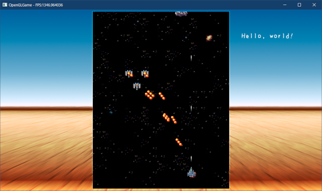
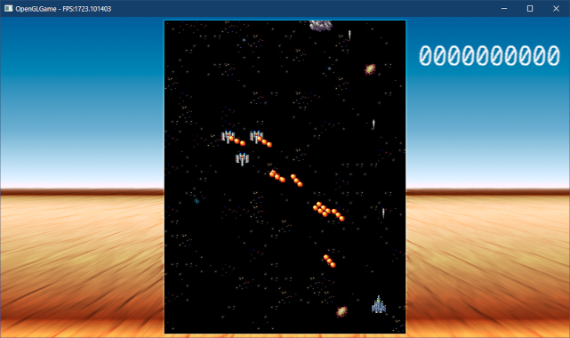
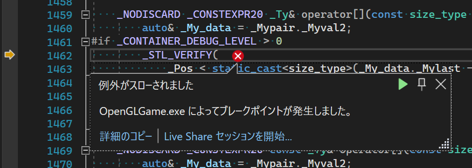

[OpenGL 3D 2022 第06回]

# タイトル画面は必要です

## 習得目標

* 
* 
* 

## 1. ユーザーインターフェイス

### 1.1 UI用ゲームオブジェクトの管理構造を追加する

ゲーム内ではさまざまな画像が表示され、それがプレイヤーの判断基準となります。シューティングゲームの場合、自機、自機の弾、敵、敵の弾、爆発などが該当します。

しかし、画像だけではゲームのルールに関わる情報を伝えきれません。それは「得点」や「再挑戦できる回数(=残り機数)」、「特殊な武器の残り弾数」のような情報です。

こういった情報は「ユーザーインターフェイス」の一部で、文字や専用のアイコンで表示されます。本テキストでは、ユーザーインターフェイスを表示する機能を追加します。

ユーザーインターフェイスは、背景画像やフォントなどさまざまな画像を表示する必要があります。そこで、いろんな画像を使えるようなデータ構造を設計します。

`Engine.h`を開き、`Engine`クラスの定義に次のプログラムを追加してください。

```diff
   ScenePtr scene; // 実行中のシーン
   ScenePtr nextScene; // 次のシーン
   GameObjectList gameObjectList; // ゲームオブジェクト配列
+
+  // UI用ゲームオブジェクトのレイヤー構造
+  struct UILayer {
+    GLuint tex = 0; // レイヤーの描画に使用するテクスチャ
+    GameObjectList gameObjectList;
+    std::vector<Sprite> spriteList;
+  };
+  std::vector<UILayer> uiLayerList; // UIレイヤー配列
 };

 #endif // ENGINE_H_INCLUDED
```

`UILayer`(ユーアイ・レイヤー)構造体は、1枚のテクスチャを複数のゲームオブジェクトを関連付けるデータ構造です。

今回作成するユーザーインターフェイス用のデータ構造は、何枚でも重ねられるレイヤー構造としました。各レイヤーにはひとつの画像と複数のゲームオブジェクトを割り当てることができます。

この構造により、レイヤーごとに異なる画像を設定できます。レイヤーに属するUIゲームオブジェクトは、すべて同じ画像を使って描画されます。

例えば「背景画像を設定した背景レイヤー」「ウィンドウ画像を設定したウィンドウレイヤー」、「フォント画像を設定したテキストレイヤー」のように、レイヤーごとに役割を決めて利用することを想定しています。

### 1.2 テクスチャを作成する関数を定義する

UIレイヤーには個別のテクスチャを設定できます。テクスチャを作成するプログラムは以前に書きましたが、あれはスプライト専用になっています。そこで、新たにテクスチャを作成する関数を定義します。

`Engine.cpp`を開き、`CaclSsboSize`関数の定義の下に、次のプログラムを追加してください。

```diff
   const size_t alignment = 256; // アライメント(データの境界)
   return ((n + alignment - 1) / alignment) * alignment;
 };
+
+/**
+* 画像からテクスチャを作成する
+*
+* @param filename   画像ファイル名
+* @param filterMode テクスチャに設定する拡大縮小フィルタ
+*
+* @return 作成したテクスチャの管理番号
+*/
+GLuint CreateTexture(const char* filename, GLenum filterMode = GL_NEAREST)
+{
+  // ファイルを開く
+  std::ifstream file(filename, std::ios::binary);
+  if (!file) {
+    const auto err = std::string("[エラー]") + __func__ + ":" +
+      filename + "を開けません\n";
+    OutputDebugString(err.c_str());
+    return 0;
+  }
+
+  // ヘッダ情報を読み込む
+  const size_t tgaHeaderSize = 18; // ヘッダ情報のバイト数
+  uint8_t header[tgaHeaderSize];
+  file.read(reinterpret_cast<char*>(header), tgaHeaderSize);
+
+  // ヘッダ情報から画像のサイズを取り出す
+  const GLsizei width = header[12] + header[13] * 0x100;
+  const GLsizei height = header[14] + header[15] * 0x100;
+
+  // 画像情報を読み込む
+  std::vector<char> img(
+    std::filesystem::file_size(filename) - tgaHeaderSize);
+  file.read(img.data(), img.size());
+
+  // テクスチャを作成
+  GLuint tex = 0;
+  glCreateTextures(GL_TEXTURE_2D, 1, &tex);
+  glTextureStorage2D(tex, 1, GL_RGBA8, width, height);
+  glTextureSubImage2D(tex, 0, 0, 0, width, height,
+    GL_BGRA, GL_UNSIGNED_BYTE, img.data());
+
+  // 拡大縮小フィルタを設定
+  glTextureParameteri(tex, GL_TEXTURE_MAG_FILTER, filterMode);
+  glTextureParameteri(tex, GL_TEXTURE_MIN_FILTER, filterMode);
+
+  return tex;
+}

 /**
 * ゲームエンジンを実行する
```

この関数では、TGAファイルのヘッダ情報から「画像のサイズ」を取得しています。

TGAファイルの場合、ファイルの先頭18バイトに画像の情報が格納されています。この部分は「TGAファイルヘッダ」と呼ばれ、次のような構造になっています。

|**名前**|**オフ<br>セット**|**バイト<br>数**|**格納されている情報**|
|---|:-:|:-:|---|
|<ruby>ID Length<rt>アイ・ディ・レングス</rt></ruby>                      | 0| 1| イメージIDデータのバイト数。|
|<ruby>Colormap Type<rt>カラーマップ・タイプ</rt></ruby>                  | 1| 1| カラーマップの有無。<br>0 = 無<br>1 = 有|
|<ruby>Image Type<rt>イメージ・タイプ</rt></ruby>                         | 2| 1| 画像記録形式。<br>0 = 画像データ無し<br>1 = 圧縮なし、インデックス・カラー画像<br>2 = 圧縮なし、カラー画像<br>3 = 圧縮なし、白黒画像<br>9 = 圧縮あり、インデックス・カラー画像<br>10 = 圧縮あり、カラー画像<br>11 = 圧縮あり、白黒画像|
|<ruby>First Entry Index<rt>ファースト・エントリ・インデックス</rt></ruby>| 3| 2| 画像データのインデックス0に対応するカラー<br>マップのインデックス.<br>カラーマップ無しの場合は未使用(常に0).|
|<ruby>Colormap Length<rt>カラーマップ・レングス</rt></ruby>              | 5| 2| カラーマップに登録されている色の数。<br>カラーマップ無しの場合は未使用(常に0)。|
|<ruby>Colormap Entry Size<rt>カラーマップ・エントリ・サイズ</rt></ruby>  | 7| 1| カラーマップに登録されている色ひとつのビッ<br>ト数。カラーマップ無しの場合は未使用(常に0)。|
|<ruby>X-origin<rt>エックス・オリジン</rt></ruby>                         | 8| 2| X座標をずらすピクセル数。|
|<ruby>Y-origin<rt>ワイ・オリジン</rt></ruby>                             |10| 2| Y座標をずらすピクセル数。|
|<ruby>Image Width<rt>イメージ・ウィス</rt></ruby>                        |12| 2| 画像の横のピクセル数。|
|<ruby>Image Height<rt>イメージ・ハイト</rt></ruby>                       |14| 2| 画像の縦のピクセル数。|
|<ruby>Pixel Depth<rt>ピクセル・デプス</rt></ruby>                        |16| 1| 画像の1ピクセルのビット数 |
|<ruby>Image Descriptor<rt>イメージ・デスクリプタ</rt></ruby>             |17| 1| 画像の格納方向および1ピクセルのアルファ<br>要素のビット数。|

このようにTGAファイルヘッダにはさまざまな情報が格納されていますが、今回は最低限必要な「横のピクセル数」と「縦のピクセル数」だけを取得しています。

TGAファイルヘッダの直後に、イメージID(画像の種類などを示す文字列)、カラーマップ(インデックス・カラー形式の画像で使われるパレット)が続き、さらにその直後に画像データが格納されています。

イメージIDやカラーマップが存在しないファイルの場合、TGAファイルヘッダの直後が画像データになります。

>**【インデックス・カラーって何？】**<br>
>インデックス・カラーは、色に番号をつけておき、ピクセルの色を直接記録するかわりに、その番号を記録する形式です。普通の画像では1ピクセルに16～32ビットのデータが必要となりますが、インデックスカラーなら8ビットで済むため、データ量を小さくすることができるのです。もちろん、画像に使われている色数が256以下の場合に限ります。

また、画像ごとに拡大縮小フィルタを指定できるように、フィルターモードを引数で指定できるようにしました。これは、用途によって見た目が良くなるフィルタの種類が異なるためです。

例えば、背景などは拡大時にきれいに見える`GL_LINEAR`が向いていますし、フォントやアイコンは`GL_NEAREST`のほうが良い結果になりやすいです。

### 1.3 UIレイヤーを管理する関数を追加する

テクスチャを作成する準備ができたので、次はUIレイヤーを追加・削除する関数を作成します。`Engine.h`を開き、`Engine`クラスの定義に次のプログラムを追加してください。

```diff
     return p;
   }
   void ClearGameObjectList() { gameObjectList.clear(); }
+
+  size_t AddUILayer(const char* image, GLenum filterMode, size_t reserve);
+  void ClearUILayers();

 private:
   int Initialize();
   int MainLoop();
```

続いて`Engine.cpp`を開き、`SetSpriteList`関数の定義の下に、次のプログラムを追加してください。

```diff
     } // for x
   } // for y
 }
+
+/**
+* UIレイヤーを追加する
+*
+* @param image      レイヤーで使用するテクスチャ画像
+* @param filterMode テクスチャに設定する拡大縮小フィルタ
+* @param reserve    レイヤー用に予約するゲームオブジェクト数
+*
+* @return 追加したレイヤーの番号
+*/
+size_t Engine::AddUILayer(const char* image, GLenum filterMode, size_t reserve)
+{
+  const GLuint tex = CreateTexture(image, filterMode);
+  uiLayerList.push_back({ tex });
+  uiLayerList.back().gameObjectList.reserve(reserve);
+  uiLayerList.back().spriteList.reserve(reserve);
+  return uiLayerList.size() - 1;
+}

 /**
 * ゲームエンジンを初期化する
```

`AddUILayer`(アド・ユーアイ・レイヤー)関数は、新しいUIレイヤーを追加します。

`reserve`(リザーブ)引数は、`vector`クラスの`reserve`メンバ関数の引数として使われます。`reserve`関数は、指定された個数の要素を格納できるサイズのメモリを確保します。

`vector`クラスは最初に小容量のメモリを確保し、サイズが拡大してメモリが足りなくなると、より大容量のメモリを確保しなおす、という動作をします。

必要な最大サイズが分かっている、あるいはある程度予想がつく場合、`reserve`関数で必要なサイズのメモリを確保しておくことで、「メモリを確保しなおす」という無駄な処理をなくせます。

さらに、`AddUILayer`関数の定義の下に、次のプログラムを追加してください。

```diff
   uiLayerList.back().spriteList.reserve(reserve);
   return uiLayerList.size() - 1;
 }
+
+/**
+* すべてのUIレイヤーを削除する
+*/
+void Engine::ClearUILayers()
+{
+  for (auto& layer : uiLayerList) {
+    glDeleteTextures(1, &layer.tex);
+  }
+  uiLayerList.clear();
+}

 /**
 * ゲームエンジンを初期化する
```

`ClearUILayers`(クリア・ユーアイ・レイヤーズ)関数は、すべてのUIレイヤーを削除します。

シーン初期化時に必要なUIレイヤーを追加し、シーン終了時にすべてのUIレイヤーを削除する、といった使いかたを想定しています。

### 1.4 UI用ゲームオブジェクト作成機能を追加する

UI用のゲームオブジェクトはUIレイヤーで管理する必要があるため、既存の`Create`関数は使えません。そこで、UI用ゲームオブジェクトを作成する`CreateUI`(クリエイト・ユーアイ)関数を追加します。

`Engine.h`を開き、`CreateUILayers`関数の宣言の下に、次のプログラムを追加してください。

```diff
   size_t AddUILayer(const char* image, size_t reserve);
   void ClearUILayers();
+
+  /**
+  * UI用ゲームオブジェクトを作成する
+  *
+  * @param layerNo 追加先のレイヤー番号
+  * @param name    ゲームオブジェクトの名前
+  * @param x       ゲームオブジェクトを配置するX座標
+  * @param y       ゲームオブジェクトを配置するY座標
+  *
+  * @return 作成したUI用ゲームオブジェクト
+  */
+  template<typename T>
+  std::shared_ptr<T> CreateUI(size_t layerNo, const std::string& name,
+    float x = 0, float y = 0) {
+    if (layerNo >= uiLayerList.size()) {
+      return nullptr;
+    }
+    std::shared_ptr<T> p = std::make_shared<T>();
+    p->engine = this;
+    p->name = name;
+    p->x = x;
+    p->y = y;
+    uiLayerList[layerNo].gameObjectList.push_back(p);
+    return p;
+  }

 private:
   int Initialize();
   int MainLoop();
```

派生クラスを

レイヤー番号が大きすぎる場合は`nullptr`を返すなどの固有の部分もありますが、やっていることはだいたい`Create`関数テンプレートと同じです。

### 1.5 RemoveGameObject関数を汎用化する

`Engine`クラスの`RemoveGameObject`関数は、不要なゲームオブジェクトを削除するために`gameObjectList`配列を直接操作しています。

UIレイヤーのゲームオブジェクト配列に対してもこの関数を使えるように、「引数で指定したゲームオブジェクト配列」を操作するように改造しましょう。

`Engine.h`を開き、`RemoveGameObject`関数の宣言を次のように変更してください。

```diff
   int Finalize();
   void UpdateGameObject(float deltaTime);
   void CollideGameObject();
-  void RemoveGameObject();
+  void RemoveGameObject(GameObjectList& gameObjectList);
   void MakeSpriteListObj();

   GLFWwindow* window = nullptr; // ウィンドウオブジェクト
```

次に`Engine.cpp`を開き、`RemoveGameObject`関数の定義を次のように変更してください。

```diff
 /**
 * 死亡状態のゲームオブジェクトを削除
 */
-void Engine::RemoveGameObject()
+void Engine::RemoveGameObject(GameObjectList& gameObjectList)
 {
   // 生きているオブジェクトと死んでいるオブジェクトに分ける
   const auto i = std::partition(
```

C++の規格では「メンバ変数と引数が同じ名前の場合は引数が優先される」ので、関数内部は何も変更する必要はありません。

続いて、`RemoveGameObject`を呼び出しているプログラムを修正します。`MainLoop`関数の定義を次のように変更してください。

```diff
     // ゲームオブジェクトを更新
     UpdateGameObject(deltaTime);
     CollideGameObject();
-    RemoveGameObject();
+    RemoveGameObject(gameObjectList);
+    for (auto& layer : uiLayerList) {
+      RemoveGameObject(layer.gameObjectList);
+    }
     MakeSpriteListObj();

     // 背景をスクロールさせる
```

### 1.6 MakeSpriteListObj関数を汎用化する

`RemoveGameObject`関数と同様に、`MakeSpriteListObj`関数もUIレイヤーに対して使えるように改造します。

`Engine.h`を開き、`MakeSpriteListObj`関数の宣言を次のように変更してください。

```diff
   void UpdateGameObject(float deltaTime);
   void CollideGameObject();
   void RemoveGameObject(GameObjectList& gameObjectList);
-  void MakeSpriteListObj();
+  void MakeSpriteList(
+    GameObjectList& gameObjectList, SpriteList& spriteList);

   GLFWwindow* window = nullptr; // ウィンドウオブジェクト
   const std::string title = "OpenGLGame"; // ウィンドウタイトル
```

通常オブジェクトだけでなく、UIオブジェクトにも使える関数になるので、関数名の末尾の`Obj`は取り除きました。

次に`Engine.cpp`を開き、`MakeSpriteListObj`関数の定義を次のように変更してください。

```diff
 /**
 * ゲームオブジェクトからスプライト配列を作成
 */
-void Engine::MakeSpriteListObj()
+void Engine::MakeSpriteList(
+  GameObjectList& gameObjectList, SpriteList& spriteList)
 {
   // 既存の動く物体用のスプライト配列を空にする
-  spriteListObj.clear();
+  spriteList.clear();

   // 優先度が大きい順番に並び替える
   std::stable_sort(
     gameObjectList.begin(), gameObjectList.end(),
     [](const GameObjectPtr& a, const GameObjectPtr& b) {
       return a->priority > b->priority;
     });

   // ゲームオブジェクトのスプライトデータをスプライト配列に追加
   // 同時にワールド座標へ変換する
   for (const auto& e : gameObjectList) {
     for (const auto& sprite : e->spriteList) {
-      spriteListObj.push_back(sprite);
-      Sprite& s = spriteListObj.back();
+      spriteList.push_back(sprite);
+      Sprite& s = spriteList.back();
       s.x += e->x;
       s.y += e->y;
```

続いて、`MakeSpriteListObj`関数を呼び出しているプログラムを修正します。`MainLoop`関数の定義を次のように変更してください。

```diff
     for (auto& layer : uiLayerList) {
       RemoveGameObject(layer.gameObjectList);
     }
-    MakeSpriteListObj();
+    MakeSpriteList(gameObjectList, spriteListObj);
+    for (auto& layer : uiLayerList) {
+      MakeSpriteList(layer.gameObjectList, layer.spriteList);
+    }

     // 背景をスクロールさせる
     const float scrollSpeed = 32; // スクロール速度(ピクセル毎秒)
```

### 1.7 UIレイヤーのゲームオブジェクトを更新する

ゲームオブジェクトの更新は`UpdateGameObject`関数で行っています。しかし、UIレイヤーのゲームオブジェクトは新しく追加したものなので、更新対象になっていません。

関数を変更して、UIレイヤーも更新対象に追加しましょう。`UpdateGameObject`関数の定義を次のように変更してください。

```diff
   std::vector<GameObject*> list(gameObjectList.size());
   std::transform(gameObjectList.begin(), gameObjectList.end(), list.begin(),
     [](const GameObjectPtr& e) { return e.get(); });
+
+  // UIレイヤーのゲームオブジェクトのコピーを作成
+  for (auto& layer : uiLayerList) {
+    const size_t prevListSize = list.size();
+    list.resize(prevListSize + layer.gameObjectList.size());
+    std::transform(layer.gameObjectList.begin(), layer.gameObjectList.end(),
+      list.begin() + prevListSize,
+      [](const GameObjectPtr& e) { return e.get(); });
+  }

   // Startイベント
   for (auto e : list) {
```

基本的なコードは通常のゲームオブジェクトと同じで、それをUIレイヤーの数だけループさせています。

ただし、前のデータの次に新しいデータが追加されるようにするため、最初にリストのサイズを`prevListSize`(プレブ・リスト・サイズ)変数に格納しています。

>`prev`(プレブ)は`previous`(プレビアス, 「直前の」「ひとつ前の」という意味)の短縮形です。

### 1.8 UIレイヤーのスプライトデータを表示する

UIレイヤーのスプライトデータを画面に表示するには、これまでのスプライトと同様にSSBOへコピーします。

`MainLoop`関数にある、スプライトデータをSSBOにコピーするプログラムに、次のプログラムを追加してください。

```diff
       memcpy(p, drawList[i]->data(), drawList[i]->size() * sizeof(Sprite));
       p += CalcSsboSize(drawList[i]->size() * sizeof(Sprite));
     }
+
+    // UIレイヤーのスプライトデータをSSBOにコピー
+    for (const auto& layer : uiLayerList) {
+      memcpy(p, layer.spriteList.data(), layer.spriteList.size() * sizeof(Sprite));
+      p += CalcSsboSize(layer.spriteList.size() * sizeof(Sprite));
+    }

     // バックバッファをクリア
     glViewport(0, 0, 1280, 720);
```

これも、基本部分は、既存のスプライトデータをSSBOにコピーするコードと同じです。

このプログラムの少し下ではスプライト配列を描画しています。UIレイヤーも同じコードを使って描画したいので、スプライト配列を描画するコードを関数化します。

`Engine.h`を開き、`Engine`クラスの定義に次のプログラムを追加してください。

```diff
   void RemoveGameObject(GameObjectList& gameObjectList);
   void MakeSpriteList(
     GameObjectList& gameObjectList, SpriteList& spriteList);
+  void DrawSpriteList(const SpriteList& spriteList,
+    GLuint tex, size_t& spriteSsboOffset);

   GLFWwindow* window = nullptr; // ウィンドウオブジェクト
   const std::string title = "OpenGLGame"; // ウィンドウタイトル
```

次に`Engine.cpp`を開き、`MakeSpriteList`関数の定義の下に、次のプログラムを追加してください。

```diff
     } // for x
   } // for y
 }
+
+/**
+* スプライト配列を描画する
+*
+* @param spriteList       描画するスプライト配列
+* @param tex              描画に使用するテクスチャ
+* @param spriteSsboOffset SSBO内のスプライトデータの開始位置
+*/
+void Engine::DrawSpriteList(const SpriteList& spriteList,
+  GLuint tex, size_t& spriteSsboOffset)
+{
+}
```

次に、`MainLoop`関数にあるスプライトを描画する以下のコードを選択し、`Ctrl+X`キーで切り取ってください。

```diff
     // スプライト配列を描画
     size_t spriteSsboOffset = spriteSsboIndex * spriteSsboSize;
     for (size_t i = 0; i < std::size(drawList); ++i) {
-      const size_t size = CalcSsboSize(drawList[i]->size() * sizeof(Sprite));
-      if (size == 0) {
-        continue; // 描画データがなければスキップ
-      }
-
-      // テクスチャを指定する
-      glBindTextures(0, 1, tex + i);
-
-      // スプライト用SSBOを割り当てる
-      glBindBufferRange(GL_SHADER_STORAGE_BUFFER, 0, ssboSprite,
-        spriteSsboOffset, static_cast<GLintptr>(size));
-      spriteSsboOffset += size;
-
-      // 図形を描画
-      glDrawElementsInstanced(GL_TRIANGLES, 6, GL_UNSIGNED_SHORT, 0,
-        static_cast<GLsizei>(drawList[i]->size()));
     }
 
     // スプライト用SSBOの割り当てを解除する
     glBindBufferRange(GL_SHADER_STORAGE_BUFFER, 0, 0, 0, 0);
```

そして`DrawSpriteList`関数に移動し、`Ctrl+V`で切り取ったコードを貼り付けてください。

```diff
 void Engine::DrawSpriteList(const SpriteList& spriteList,
   GLuint tex, size_t& spriteSsboOffset)
 {
+  const size_t size = CalcSsboSize(drawList[i]->size() * sizeof(Sprite));
+  if (size == 0) {
+    continue; // 描画データがなければスキップ
+  }
+
+  // テクスチャを指定する
+  glBindTextures(0, 1, tex + i);
+
+  // スプライト用SSBOを割り当てる
+  glBindBufferRange(GL_SHADER_STORAGE_BUFFER, 0, ssboSprite,
+    spriteSsboOffset, static_cast<GLintptr>(size));
+  spriteSsboOffset += size;
+
+  // 図形を描画
+  glDrawElementsInstanced(GL_TRIANGLES, 6, GL_UNSIGNED_SHORT, 0,
+    static_cast<GLsizei>(drawList[i]->size()));
 }
```

>**【インデントの修正について】**<br>
>貼り付けたときにインデントが気になる場合は「編集」メニューから「詳細→ドキュメントのフォーマット」を選択してください。すると、ファイルのインデントが自動的に修正されます。

さて、貼り付けた段階ではいくつかの変数が見えなくてエラーになるので、これを修正しましょう。貼り付けたコードを次のように変更してください。

```diff
 void Engine::DrawSpriteList(const SpriteList& spriteList,
   GLuint tex, size_t& spriteSsboOffset)
 {
-  const size_t size = CalcSsboSize(drawList[i]->size() * sizeof(Sprite));
+  const size_t size = CalcSsboSize(spriteList.size() * sizeof(Sprite));
   if (size == 0) {
-    continue; // 描画データがなければスキップ
+    return; // 描画データがなければスキップ
   }

   // テクスチャを指定する
-  glBindTextures(0, 1, tex + i);
+  glBindTextures(0, 1, &tex);

   // スプライト用SSBOを割り当てる
   glBindBufferRange(GL_SHADER_STORAGE_BUFFER, 0, ssboSprite,
     spriteSsboOffset, static_cast<GLintptr>(size));
   spriteSsboOffset += size;

   // 図形を描画
   glDrawElementsInstanced(GL_TRIANGLES, 6, GL_UNSIGNED_SHORT, 0,
-    static_cast<GLsizei>(drawList[i]->size()));
+    static_cast<GLsizei>(spriteList.size()));
 }
```

これで`DrawSpriteList`関数は完成です。それでは、この関数を使ってスプライトを描画しましょう。`MainLoop`関数にあるスプライトを描画するコードを次のように変更してください。

```diff
     // スプライト配列を描画
     size_t spriteSsboOffset = spriteSsboIndex * spriteSsboSize;
     for (size_t i = 0; i < std::size(drawList); ++i) {
+      DrawSpriteList(*drawList[i], tex[i], spriteSsboOffset);
     }
+
+    // UIレイヤーのスプライト配列を描画
+    glViewport(0, 0, 1280, 720);
+    glProgramUniform4f(progSprite, 2, 2.0f / 1280, 2.0f / 720, -1, -1);
+    for (const auto& layer : uiLayerList) {
+      DrawSpriteList(layer.spriteList, layer.tex, spriteSsboOffset);
+    }

     // スプライト用SSBOの割り当てを解除する
     glBindBufferRange(GL_SHADER_STORAGE_BUFFER, 0, 0, 0, 0);
```

これで、UIレイヤーのスプライトを描画できるようになりました。

### 1.8 UIを表示する

UIを表示するために、UI用の画像を用意します。

<pre class="tnmai_assignment">
<strong>【課題01】</strong>
以下のURLから<code>frame.png</code>と<code>font.png</code>をダウンロードしなさい。
ダウンロードしたファイルをTGA形式に変換し、プロジェクトの<code>Res</code>フォルダにコピーしなさい。
<code>https://github.com/tn-mai/OpenGL3D2022/tree/master/res</code>
</pre>

画像の用意ができたら、メインゲーム画面にUIを表示してみましょう。`MainGameScene.cpp`を開き、`Initialize`関数の定義に次のプログラムを追加してください。

```diff
   GLFWwindow* window = engine.GetWindow();
   const auto [bgSizeX, bgSizeY, bgBaseX, bgBaseY] = engine.GetBgSize();

   // ゲームオブジェクトを削除
   engine.ClearGameObjectList();
+  engine.ClearUILayers();

   // 自機を追加
   player = engine.Create<GameObject>(
```

まず、念の為に既存のUIレイヤーを削除しておきます。次に、背景スプライトを作成するコードの下に、次のプログラムを追加してください。

```diff
   // 背景スプライトを作成(タイルサイズ=32x32)
   TileMap tileMap = engine.LoadTileMap("Res/map01_bg.csv");
   engine.SetSpriteList(tileMap);
+
+  // UIレイヤーを追加
+  const size_t frameLayer = engine.AddUILayer("Res/frame.tga", GL_LINEAR, 10);
+  const size_t textLayer = engine.AddUILayer("Res/font.tga", GL_NEAREST, 10);
+
+  auto uiFrame = engine.CreateUI<GameObject>(frameLayer, "frame", 640, 360);
+  uiFrame->AddSprite({ 0, 0, 1, 1 });
+
+  auto uiText = engine.CreateUI<GameObject>(textLayer, "text", 960, 640);
+  const char text[] = "Hello, world!";
+  for (size_t i = 0; i < std::size(text); ++i) {
+    const char c = text[i];
+    uiText->AddSprite({
+      static_cast<float>(text[i] % 16) / 16,
+      static_cast<float>(text[i] / 16) / 8,
+      1.0f / 16.0f, 1.0f / 8.0f }, static_cast<float>(i * 16));
+  }

   return true; // 初期化成功
 }
```

プログラムが書けたらビルドして実行してください。ゲーム画面の外側に画像が表示され、さらに右上に`Hello, world!`という文章が表示されていたら成功です。

<p align="center">

</p>

### 1.9 Textコンポーネントを作成する

`font.png`は、ASCII(アスキー)コードと呼ばれる文字コードの並び順でフォントが描かれています。そのため、1.8節のように、文字コードと対応するテクスチャ座標を求めることが可能です。

とはいえ、テキストを表示しようとするたびに毎回`for`ループを書くのは面倒です。そこで、テキストを表示するための`Text`コンポーネントを作成することにします。

プロジェクトの`Src/Component`フォルダに、`Text.h`という名前のヘッダファイルを追加してください。追加したファイルを開き、次のプログラムを追加してください。

```diff
+/**
+* @file Text.h
+*/
+#ifndef COMPONENT_TEXT_H_INCLUDED
+#define COMPONENT_TEXT_H_INCLUDED
+#include "../Component.h"
+#include "../GameObject.h"
+#include <string>
+
+/**
+* テキストコンポーネント
+*/
+class Text : public Component
+{
+public:
+  Text() = default;
+  virtual ~Text() = default;
+  virtual void Update(GameObject& gameObject, float deltaTime) override
+  {
+    const float fontSizeX = 16 * scale;
+    const float fontSizeY = 32 * scale;
+    gameObject.spriteList.clear();
+    for (size_t i = 0; i < std::size(text); ++i) {
+      const char c = text[i];
+      gameObject.AddSprite({
+        static_cast<float>(c % 16) / 16,
+        static_cast<float>(c / 16) / 8,
+        1.0f / 16.0f, 1.0f / 8.0f },
+        fontSizeX * (0.5f + static_cast<float>(i)),
+        fontSizeY * 0.5f, scale);
+    }
+  }
+
+  void SetText(const std::string& t, float s = 1)
+  {
+    text = t;
+    scale = s;
+  }
+
+  std::string text;
+  float scale = 1;
+};
+
+#endif // COMPONENT_TEXT_H_INCLUDED
```

スプライトの表示座標を`0.5f * フォントサイズ`分ずらしているのは、ゲームオブジェクトの座標と文字列の左下の座標を一致させるためです。

スプライト用シェーダは指定した座標が画像の中心となるように描画しています。ずらし処理がないと、スケールによってテキストの左側の座標が変化してしまいます。

大抵のテキストは左上または左下を基準に配置を決めるので、スケールが変わると配置座標を修正しなくてはなりません。

そこで、ずらし処理を入れて、テキストのスケールにかかわらず、文字列の左下座標を目安として配置を決められるようにしているのです。

それでは、`Hello, world!`を`Text`コンポーネントで置き換えましょう。`MainGameScene.cpp`を開き、`Text.h`をインクルードしてください。

```diff
 #include "Component/Health.h"
 #include "Component/Explosion.h"
 #include "Component/FireBullet.h"
+#include "Component/Text.h"
 #include "GameObject.h"
 #include "SpritePriority.h"
```

次に、`Initialize`関数にある`Hello, world!`を表示するコードを次のように変更してください。

```diff
   auto uiFrame = engine.CreateUI<GameObject>(frameLayer, "frame", 640, 360);
   uiFrame->AddSprite({ 0, 0, 1, 1 });

   auto uiText = engine.CreateUI<GameObject>(textLayer, "text", 960, 640);
-  const char text[] = "Hello, world!";
-  for (size_t i = 0; i < std::size(text); ++i) {
-    const char c = text[i];
-    uiText->AddSprite({
-      static_cast<float>(text[i] % 16) / 16,
-      static_cast<float>(text[i] / 16) / 8,
-      1.0f / 16.0f, 1.0f / 8.0f }, static_cast<float>(i * 16));
-  }
+  auto textComponent = uiText->AddComponent<Text>();
+  textComponent->SetText("Hello, world!");

   return true; // 初期化成功
 }
```

プログラムが書けたらビルドして実行してください。`Hello, world!`文字列が表示されていたら成功です。

ついでに文字の大きさを変更してみましょう。`Text`コンポーネントに文字列を設定するコードを、次のように変更してください。

```diff
   auto uiText = engine.CreateUI<GameObject>(textLayer, "text", 960, 640);
   auto textComponent = uiText->AddComponent<Text>();
-  textComponent->SetText("Hello, world!");
+  textComponent->SetText("Hello, world!", 1.5f);

   return true; // 初期化成功
 }
```

プログラムが書けたらビルドして実行してください。`Hello, world!`が少し大きく表示されていたら成功です。

<p align="center">

</p>

### 1.10 得点管理コンポーネントを作成する

`Hello, world!`と表示するだけではあまり意味がないので、得点を表示するようにしましょう。まず得点管理コンポーネントを作成します。

プロジェクトの`Src\Component`フォルダに`ScoreManager.h`というヘッダファイルを追加してください。追加したファイルを開き、次のプログラムを追加してください。

```diff
+/**
+* @file ScoreManager.h
+*/
+#ifndef COMPONENT_SCOREMANAGER_H_INCLUDED
+#define COMPONENT_SCOREMANAGER_H_INCLUDED
+#include "../Component.h"
+#include "Text.h"
+#include <stdio.h>
+
+/**
+* 得点を管理するコンポーネント
+*/
+class ScoreManager : public Component
+{
+public:
+  ScoreManager() = default;
+  virtual ~ScoreManager() = default;
+  virtual void Update(GameObject& gameObject, float deltaTime) override {
+    if (textComponent) {
+      char str[16];
+      snprintf(str, std::size(str), "%010d", score);
+      textComponent->SetText(str, 2.0f);
+    }
+  }
+
+  int score = 0;
+  std::shared_ptr<Text> textComponent;
+};
+using ScoreManagerPtr = std::shared_ptr<ScoreManager>;
+
+#endif // COMPONENT_SCOREMANAGER_H_INCLUDED
```

`ScoreManager`(スコア・マネージャ)クラスは、得点を管理し、テキストコンポーネントに得点を表示する役割をします。

続いて、`ScoreManager`をゲームに組み込みます。`MainGameScene.h`を開き、`ScoreManager`クラスの先行宣言を追加してください。

```diff
 #define MAINGAMESCENE_H_INCLUDED
 #include "Scene.h"
 #include "TileMap.h"
+
+// 先行宣言
+class ScoreManager;
+using ScoreManagerPtr = std::shared_ptr<ScoreManager>;

 /**
 * メインゲーム画面
```

次に`MainGameScene.cpp`を開き、`ScoreManager.h`をインクルードしてください。

```diff
 #include "Component/Explosion.h"
 #include "Component/FireBullet.h"
 #include "Component/Text.h"
+#include "Component/ScoreManager.h"
 #include "GameObject.h"
 #include "SpritePriority.h"
```

最後に、`Initialize`関数にある`Hello, world!`を表示するコードを、次のように変更してください。

```diff
   auto uiFrame = engine.CreateUI<GameObject>(frameLayer, "frame", 640, 360);
   uiFrame->AddSprite({ 0, 0, 1, 1 });

+  // スコアマネージャを作成
-  auto uiText = engine.CreateUI<GameObject>(textLayer, "text", 960, 600);
-  auto textComponent = uiText->AddComponent<Text>();
-  textComponent->SetText("Hello, world!", 1.5f);
+  auto uiScore = engine.CreateUI<GameObject>(1, "text", 940, 600);
+  scoreManager = uiScore->AddComponent<ScoreManager>();
+  scoreManager->textComponent = uiScore->AddComponent<Text>();

   return true; // 初期化成功
 }
```

プログラムが書けたらビルドして実行してください。画面右上に`0`が並んで表示されていたら成功です。

<p align="center">

</p>

### 1.11 得点コンポーネントを作成する

次に、得点を加算するクラスを作成します。プロジェクトの`Src\Component`フォルダに、`Score.h`というヘッダファイルを追加してください。追加したファイルを開き、次のプログラムを追加してください。

```diff
+/**
+* @file Score.h
+*/
+#ifndef COMPONENT_SCORE_H_INCLUDED
+#define COMPONENT_SCORE_H_INCLUDED
+#include "../Component.h"
+#include "ScoreManager.h"
+
+/**
+* 得点コンポーネント
+*/
+class Score : public Component
+{
+public:
+  Score() = default;
+  virtual ~Score() = default;
+  virtual void OnDestroy(GameObject& gameObject) override {
+    if (scoreManager) {
+      scoreManager->score += score;
+    }
+  }
+
+  ScoreManagerPtr scoreManager;
+  int score = 100;
+};
+
+#endif // COMPONENT_SCORE_H_INCLUDED
```

`Score`(スコア)クラスは、ゲームオブジェクトが破壊されたときに得点を加算します。

それでは、`Score`クラスを敵ゲームオブジェクトのコンポーネントとして追加しましょう。`MainGameScene.cpp`を開き、`SpawnEnemy`関数の定義に次のプログラムを追加してください。

```diff
         auto fireBullet = enemy->AddComponent<FireBullet>();
         fireBullet->target = player;
         fireBullet->timerA = 0.9f;
+
+        // スコアコンポーネントを設定
+        auto score = enemy->AddComponent<Score>();
+        score->scoreManager = scoreManager;
       }
     } // for x
```

プログラムが書けたらビルドして実行してください。敵を破壊するたびに、右上のスコアが100点ずつ増えていったら成功です。

<p align="center">

</p>

>**【1章のまとめ】**
>
>* 
>* 
>* 

<div style="page-break-after: always"></div>

## 2. タイトル画面

### 2.1 タイトル画面クラスを定義する

UIレイヤーを利用してタイトル画面を作成しましょう。まず画像を用意します。

<pre class="tnmai_assignment">
<strong>【課題02】</strong>
「宇宙 背景 フリー」などの検索ワードで適当な背景画像をさがしてダウンロードし、TGA形式に変換してプロジェクトの<code>Res</code>フォルダに保存しなさい。
ファイル名は<code>title_bg.tga</code>としなさい。
</pre>

<pre class="tnmai_assignment">
<strong>【課題03】</strong>
<code>cooltext.com</code>や画像編集ソフトを利用してタイトルロゴ画像を作成し、TGA形式に変換してプロジェクトの<code>Res</code>フォルダに保存しなさい。
ファイル名は<code>title_logo.tga</code>としなさい。
</pre>

プロジェクトの`Src`フォルダに`TitleScene.h`という名前のヘッダファイルを追加してください。追加したファイルを開き、次のプログラムを追加してください。

```diff
+/**
+* @file TitleScene.h
+*/
+#ifndef TITLESCENE_H_INCLUDED
+#define TITLESCENE_H_INCLUDED
+#include "Scene.h"
+
+/**
+* タイトルシーン
+*/
+class TitleScene : public Scene
+{
+public:
+  TitleScene() = default;
+  virtual ~TitleScene() = default;
+  virtual bool Initialize(Engine& engine) override;
+  virtual void Update(Engine& engine, float deltaTime) override;
+};
+
+#endif // TITLESCENE_H_INCLUDED
```

### 2.2 Initialize関数を定義する

それではメンバ関数を定義していきましょう。プロジェクトの`Src`フォルダに`TitleScene.cpp`という名前のCPPファイルを追加してください。追加したファイルを開き、次のプログラムを追加してください。

```diff
+/**
+* @file TitleScene.cpp
+*/
+#include "TitleScene.h"
+#include "MainGameScene.h"
+#include "Component/Text.h"
+#include "GameObject.h"
+#include "Engine.h"
+
+/**
+* タイトル画面を初期化する
+*
+* @retval true  初期化成功
+* @retval false 初期化失敗
+*/
+bool TitleScene::Initialize(Engine& engine)
+{
+  return true; // 初期化成功
+}
```

次に、UIレイヤーを追加し、ユーザーインターフェイスを作成します。`Initialize`関数の定義に次のプログラムを追加してください。

```diff
 bool TitleScene::Initialize(Engine& engine)
 {
+  // ゲームオブジェクトを削除
+  engine.ClearGameObjectList();
+  engine.ClearUILayers();
+
+  // UIレイヤーを作成
+  const size_t bgLayer = engine.AddUILayer("Res/title_bg.tga", GL_LINEAR, 10);
+  const size_t logoLayer = engine.AddUILayer("Res/title_logo.tga", GL_LINEAR, 10);
+  const size_t textLayer = engine.AddUILayer("Res/font.tga", GL_LINEAR, 10);
+
+  // 背景画像
+  auto uiBackground = engine.CreateUI<GameObject>(
+    bgLayer, "title_bg", 640, 360);
+  uiBackground->AddSprite({ 0, 0, 1, 1 });
+
+  // タイトルロゴ画像
+  auto uiTitle = engine.CreateUI<GameObject>(
+    logoLayer, "title_logo", 640, 440);
+  uiTitle->AddSprite({ 0, 0, 1, 1 }, 0, 0, 1.25f);
+
+  // ゲームの開始方法を示すテキスト
+  const char strPressEnter[] = "Press Enter";
+  const float fontSizeX = 16;
+  const float x =
+    640 - static_cast<float>(std::size(strPressEnter) - 1) * fontSizeX;
+  auto uiPressEnter = engine.CreateUI<GameObject>(
+    textLayer, "press enter", x, 100);
+  auto textPressEnter = uiPressEnter->AddComponent<Text>();
+  textPressEnter->SetText(strPressEnter, 2);
+
   return true; // 初期化成功
 }
```

### 2.3 Update関数を定義する

続いて、`Update`関数を定義します。`Initialize`関数の定義の下に、次のプログラムを追加してください。

```diff
   return true; // 初期化成功
 }
+
+/**
+* タイトル画面の状態を更新する
+*/
+void TitleScene::Update(Engine& engine, float deltaTime)
+{
+  // Enterキーが押されたらゲーム開始
+  if (engine.GetKey(GLFW_KEY_ENTER)) {
+    engine.SetNextScene<MainGameScene>();
+  }
+}
```

今回は、`Enter`キーが押されたらゲームが開始されるようにしてみました。

これでタイトル画面クラスは完成です。

### 2.4 ゲームがタイトル画面から始まるようにする

次に、アプリ起動時に実行されるシーンを`TitleScene`に変更します。`Engine.cpp`を開き、`TitleScene.h`をインクルードしてください。

```diff
 */
 #include "Engine.h"
 #include "MainGameScene.h"
+#include "TitleScene.h"
 #include <Windows.h>
 #include <fstream>
```

続いて、`Initialize`関数の定義を次のように変更してください。

```diff
   // ゲームオブジェクト配列の容量を予約
   gameObjectList.reserve(1000);

   // 最初のシーンを作成して初期化
-  scene = std::make_shared<MainGameScene>();
+  scene = std::make_shared<TitleScene>();
   if (scene) {
     scene->Initialize(*this);
   }
```

プログラムが書けたらビルドして実行してください。タイトル画面が表示され…ませんね？ 実行時エラーで停止してしまいます。

### 2.5 実行時エラーをデバッグする

とりあえず「再試行」を選択してエラー箇所で停止させましょう。停止位置は標準ライブラリの中のようですが、本当の原因は自分で作成したコードにあるはずです。

<p align="center">

</p>

こういう場合は「呼び出し履歴」ウィンドウを調べます。「呼び出し履歴」には、関数が呼び出された順序が表示されています。上から下にたどって、「最初に見つかった自分で書いた関数」を探します。

<p align="center">

</p>

今回の場合、最初に見つかるのは`MainLoop`関数です。`MainLoop`関数の行をダブルクリックしてください。すると、呼び出しが行われたコードが表示されます。

どうやら「背景をスクロールさせる」コードで問題が起きたようです。なお、左端の余白領域に「曲がった緑の矢印」アイコンのある行が、呼び出しを実行した行になります。

とりあえず`spriteListBg`変数にカーソルを合わせると、変数の内容がポップアップ表示されます。

<p align="center">

</p>

`size=0`とあるので、`spriteListBg`配列のサイズが`0`であることが分かります。これは確かに問題です。なぜなら、配列に要素が存在しないのに、要素の値を操作することはできないからです。

しかし、これまではちゃんと動作していましたね。種明かしをすると、`SetSpriteList`関数を実行していれば問題は起きません。`MainGameScene`の場合、これは`Initialize`関数で呼び出しています。

ということは、タイトル画面でも`SetSpriteList`関数を呼び出せば解決するはずです。ただ、タイトル画面では背景スプライトを表示する必要性がありません。

なので、本当の解決方法は、例えば「背景スプライトが設定されている場合のみ」背景をスクロールさせるように変更することです。

それではエラーを修正しましょう。背景をスクロールさせるコードを次のように変更してください。

```diff
     // 背景をスクロールさせる
     const float scrollSpeed = 32; // スクロール速度(ピクセル毎秒)
     const int viewSizeY = 22 * 32; // 描画範囲の高さ
+    if (spriteListBg.size() >= bgSizeX * bgSizeY) {
       const float bgBaseYEnd = -static_cast<float>(bgSizeY * 32) +
         viewSizeY + 16; // スクロール終端座標
       bgBaseY -= scrollSpeed * deltaTime;
       if (bgBaseY <= bgBaseYEnd) {
         bgBaseY = bgBaseYEnd;
       }
       for (size_t y = 0; y < bgSizeY; ++y) {
         const float sy = y * 32 + bgBaseY;
         for (size_t x = 0; x < bgSizeX; ++x) {
           spriteListBg[y * bgSizeX + x].y = sy;
         }
       }
+    } // if size

     // コピー先バッファを切り替える
     spriteSsboIndex = (spriteSsboIndex + 1) % 2;
```

プログラムが書けたらビルドして実行してください。実行時エラーにならずにタイトル画面が表示されたらデバッグ完了です。`Enter`キーを押したとき、ゲームが開始されることも確認してください。

<p align="center">

</p>

>**【2章のまとめ】**
>
>* 
>* 
>* 

<div style="page-break-after: always"></div>

## 3. 音声再生

### 3.1 音声ライブラリを追加する

ゲームは、プレイヤーへのフィードバックの多くの部分を音声に頼っています。まるで本物のような映像を作り出せたとしても、それだけではプレイヤーを没入させるのは難しいものです。

例としてテレビ番組を考えてみましょう。みなさんがテレビ番組を見る時、音声は当然スピーカーから再生されています。しかし、みなさんの感覚では、画面の中の人物の口元から発声されているかのように感じていると思います。

これは、人間にとって聴覚よりも視覚が優先的な情報源であるからこそ起こる現象です。一方で、音量を0にして番組を視聴すると、番組の内容がほとんど分からなくなってしまいます(環境映像のようなものは除いて)。

このことは、人間の情報伝達において、聴覚がいかに重要であるかを示しています。そして、音声の重要性は、ゲームにおいても変わりません。そこで、プロジェクトに音声ライブラリを追加して、音声を再生できるようにしましょう。

<pre class="tnmai_assignment">
<strong>【課題04】</strong>
ブラウザで以下のURLを開き、音声ライブラリのZIPファイルをダウンロードしなさい。
  <code>https://github.com/tn-mai/OpenGL3D2021/raw/master/Doc/EasyAudio.zip</code>

EasyAudio.zipファイルには、以下の2つのファイルが格納されています。
 - EasyAudio.cpp
 - EasyAudio.h

上記の2つのファイルをプロジェクトの<code>Src</code>フォルダにコピーしなさい。
</pre>

音声ライブラリのファイルをコピーしたら、Visual Studioのソリューションエクスプローラーにある「ソースファイル」フィルタを右クリックして「追加→既存の項目」を選択します。そして、先程コピーした2つのファイルをプロジェクトに追加してください。

これで音声ライブラリが追加されました。

### 3.2 音声ライブラリの処理を追加する

`EasyAudio`クラスで音声を再生するには、「ライブラリの初期化」、「ライブラリの更新」、「ライブラリの終了」という3つの関数を呼び出す必要があります。

最初に「ライブラリの初期化」関数を呼び出しましょう。`Engine.cpp`を開き、`EasyAudio.h`をインクルードしてください。

```diff
 #include "Engine.h"
 #include "MainGameScene.h"
 #include "TitleScene.h"
+#include "EasyAudio.h"
 #include <Windows.h>
 #include <fstream>
```

次に、`Initialize`関数の定義の最後の方に、次のプログラムを追加してください。

```diff
   // ゲームオブジェクト配列の容量を予約
   gameObjectList.reserve(1000);
+
+  // 音声ライブラリを初期化
+  if ( ! Audio::Initialize()) {
+    return 1; // 初期化失敗
+  }

   // 最初のシーンを作成して初期化
   scene = std::make_shared<TitleScene>();
```

続いて「ライブラリの更新」関数を呼び出します。`MainLoop`関数の定義の最後の方に、次のプログラムを追加してください。

```diff
     // スプライト描画の直後にフェンスを作成
     syncSpriteSsbo[spriteSsboIndex] =
       glFenceSync(GL_SYNC_GPU_COMMANDS_COMPLETE, 0);
+
+    // 音声ライブラリを更新
+    Audio::Update();

     glfwSwapBuffers(window);
     glfwPollEvents();
```

最後に「ライブラリの終了」関数を呼び出します。`Finalize`関数の定義に次のプログラムを追加してください。

```diff
 */
 int Engine::Finalize()
 {
+  // 音声ライブラリを終了
+  Audio::Finalize();
+
   // GLFWの終了
   glfwTerminate();
```

これで、音声を再生できるようになりました。

### 3.3 音声を用意する

音声ライブラリだけでは音声を再生することはできません。なぜなら、音声ファイルが必要だからです。

ということで、適当にゲームで使う音声を都合しなくてはなりません。とりあえず以下の3つの音声を用意してください。

| 分類   | 音声の用途 |
|:------:|:-----|
| BGM    | タイトル画面のBGM |
| BGM    | ゲームプレイ中のBGM |
| 効果音 | 自機の弾の発射音 |
| 効果音 | 自機がやられたときの爆発音 |
| 効果音 | 敵を破壊したときの爆発音(小型の敵用) |
| 効果音 | 敵を破壊したときの爆発音(中型の敵用) |
| 効果音 | 敵を破壊したときの爆発音(大型の敵用) |

>**【音声ライブラリで再生可能な形式】**<br>
>`WAV`, `MP3`, `AAC`, `WMA`に対応しています。`OGG`などには対応していません。
>また、ビットレートの高いMP3は再生できません。高ビットレートのMP3ファイルは、ビットレートを48kbpsに変換する必要があります。

<pre class="tnmai_assignment">
<strong>【課題06】</strong>
プロジェクトの<code>Res</code>フォルダに<code>Audio</code>というフォルダを作成しなさい。
次に、上の表にある用途に適した音声ファイルを、適当なサイトからダウンロードし(自分で作成してもよいでしょう)、<code>Audio</code>フォルダに配置しなさい。
</pre>

>**【フリーのサウンドデータを公開しているサイトについて】**<br>
>音声(に限りませんが)は、ゲーム内容に合っていて、かつ他ではあまり使われていないものを選ぶべきです。就職作品を審査する人々は同じような作品をいくつも見ているため、みんなが使うような音声は聞き飽きているからです。特に、国内で有名な個人サイトの音声などは聞き飽きていると考えてください。
>
>おすすめの方法は、「投稿型サイト」または「国外のサイト」を利用することです。`dova-s.jp`や`soundcloud.com`のような投稿型サイトはファイル数が多いので、同じ音声を使う可能性がかなり低くなります。国外のサイトは「英語で書かれている」ために日本からの利用者が少ないので、国内の他の就職作品と同じ音声になる可能性が低いです。
>
>以下に、高品質なフリーのサウンドデータを公開しているサイトをいくつか挙げておきます。これらのサイトからダウンロードしたファイルは、音声作業用フォルダを作り、さらにサイト名をつけたサブフォルダを作って、そのなかにまとめておくとよいでしょう。
>
>\[BGM(海外の個人サイト)\]
>
>* `soundimage.org`: Eric Matyas(エリック・マティアス)氏のサイト。ゲーム開発者向けの無料の音楽や効果音、テクスチャなどが公開されています。右のリストから好きなジャンルを選んで音楽を探してください。プレイヤーの下に表示される曲名を右クリックしてダウンロードします。
>* `incompetech.filmmusic.io`: Kevin MacLeod(ケビン・マクロード)氏のサイト。映画やゲーム向けの無料の音楽が公開されています。左の`Search`(サーチ)または`Genres`(ジャンル)を選んで音楽を探してください。
>* `bensound.com`: Benjamin Tissot(ベンジャミン・ティソ)氏のサイト。映画やゲーム向けの無料の音楽が公開されています。`DOWNLOAD`(ダウンロード)と表示されているのが無料の音楽です。
>
>\[BGM(投稿型サイト)\]
>
>* `dova-s.jp`: 国内では最大規模の投稿型サイト。ゲーム用を想定した音声ファイルも数多く投稿されています。大量の音声ファイルがあるので、まず重複することはないでしょう。
>* `soundcloud.com`: 世界最大規模の音楽投稿型サイト。有料、無料を見分けにくいうえにボーカルありとなしが混在しているため、BGMの検索には慣れが必要です。しかし、圧倒的な投稿数はそれを補ってあまりあるほど魅力的です。
>
>\[効果音\]
>
>* `www.fesliyanstudios.com`: David Fesliyan(デイビッド・フェスリアン)氏の個人サイトで、映画やゲーム向けの音楽と効果音が公開されています。
>* `freesound.org`: スペインのポンペウ・ファブラ大学の音楽技術グループが管理運営している音声投稿サイトです。23万を超える大量の音声が投稿されています。品質にバラつきはありますが、大抵の効果音が見つかります。
>
>\[オンラインで効果音を作成できるサイト\]
>
>* `sfbgames.itch.io/chiptone`: レトロゲーム風の効果音を生成できます。エフェクターを調整すると音色を調整できますが、少し扱いが難しいです。オフラインで使えるダウンロード版があります。効果音を保存するには、右側にある黒い「SAVE .WAV」ボタンを押します。
>* `sfxr.me`: レトロゲーム風の効果音を生成できるサイトです。左のプリセットボタンをクリックするとランダムな効果音が作成されます。右側の青字で書かれたWAVファイルを右クリックしてダウンロードします。
>* `www.leshylabs.com/apps/sfMaker`: こちらもレトロゲーム風の効果音を生成してくれるサイトです。左のプリセットボタンをクリックするとランダムな効果音が作れます。右側の`Save Wave`ボタンからダウンロードします。

### 3.4 音声定義ファイルを追加する

音声を再生するときは「音声ファイル名」を指定します。ただ、プログラム中に直接ファイル名を書くのはおすすめできません。

というのは、文字列は間違えてもコンパイルエラーにならず、Visual Studioの入力補完機能も働かないからです。

>例えば「爆発音」用に`explosion.wav`という名前の音声ファイルがあるとしましょう。ゲームではいろんなものを爆発させるので、コードのあちこちに`explosion.wav`と書くことになります。<br>
>2, 3カ所程度ならともかく、何度も何度も書いていると、`exprosion.wav`や`exprsion.wav`のように<ruby>綴<rt>つづ</rt></ruby>りを間違える可能性が高まります。<br>
>その結果、音声がならなかったり、間違った音声が再生されたりすることになります。

このような間違いを防ぐには、音声ファイル名を示す「定数」を定義して、ファイル名の代わりに定数を使います。定数には入力補完が働きますし、名前を間違えるとコンパイルエラーになるのですぐ分かります。

>定数を使っても「別の定数名を書いてしまう」という間違いは検出できませんが、他のミスは防げるので十分に意味はあります。

プロジェクトの`Src`フォルダに`AudioSettings.h`(オーディオ・セッティングス)という名前のヘッダファイルを追加してください。追加した`AudioSettings.h`を開き、次のプログラムを追加してください。

```diff
+/**
+* @file AudioSettings.h
+*/
+#ifndef AUDIOSETTINGS_H_INCLUDED
+#define AUDIOSETTINGS_H_INCLUDED
+
+/**
+* 音声再生プレイヤー番号
+*/
+namespace AudioPlayer {
+inline constexpr int bgm = 0; // BGMの再生に使うプレイヤー番号
+} // namespace Player
+
+/**
+* BGM設定
+*/
+namespace BGM {
+inline constexpr char title[]   = "Res/Audio/????"; // タイトル画面のBGM
+inline constexpr char stage01[] = "Res/Audio/????"; // ステージ1のBGM
+} // namespace Bgm
+
+/**
+* 効果音設定
+*/
+namespace SE {
+inline constexpr char playerShot[]      = "Res/Audio/????"; // 弾の発射音
+inline constexpr char playerExplosion[] = "Res/Audio/????"; // 爆発(自機)
+inline constexpr char enemyExplosionS[] = "Res/Audio/????"; // 爆発(小)
+inline constexpr char enemyExplosionM[] = "Res/Audio/????"; // 爆発(中)
+inline constexpr char enemyExplosionL[] = "Res/Audio/????"; // 爆発(大)
+} // namespace SE
+
+#endif // AUDIOSETTINGS_H_INCLUDED
```

>`????`の部分はあとで置き換えます。

`constexpr`(コンスト・エクスプル、コンスト・エクスプレッション、コンスト・イーエックスピーアール)は、C++11で追加された「定数式」を定義する機能です。

変数に`constexpr`を付けると「定数」になり、関数につけると「定数式」になります。どちらの場合も、「コンパイル時に結果(または値)が確定し、実行中は変更されない」ことを意味します。

それから、ヘッダファイルに変数を定義すると、インクルード先のCPPファイルごとにコピーが作られます。

インクルードしているCPPファイルがたくさんあると大量のコピーが作られるため、実行ファイルのサイズが肥大化する可能性があります(実際には、最適化によって解消されることが多いです)。

実行ファイルが肥大化するとプログラムの性能に影響します。そこで、C++17において変数を`inline`指定できるように変更が行われました。

`inline`には「定義をひとつに保つ」という作用があるので、変数を`inline`指定するとコピーが作られなくなります。

これが、`inline constexpr`という宣言の意味です。「C++14以前を使っている」、「チームのコーディングルールで決まっている」などの理由がない限り、定数は`inline constexpr`で定義するとよいでしょう。

>**【constexpr関数とconstexprメンバ変数は勝手にinlineになる】**<br>
>関数またはメンバ変数に`constexpr`を指定すると、自動的に`inline`扱いになります。つまり、`inline`が必要なのはグローバルな「定数」を定義するときだけです。

<pre class="tnmai_assignment">
<strong>【課題06】</strong>
<code>AudioSettings.h</code>にある<code>????</code>の部分を、実際に使用する音声ファイル名に置き換えなさい。
</pre>

### 3.5 BGMを再生する

それでは音声を再生しましょう。`MainGameScene.cpp`を開き、音声用ヘッダファイルをインクルードしてください。

```diff
 #include "GameObject.h"
 #include "SpritePriority.h"
 #include "Engine.h"
+#include "EasyAudio.h"
+#include "AudioSettings.h"
 #include <fstream>
 #include <filesystem>
```

次に、`Initialize`関数の定義にあるUI設定コードの下に、次のプログラムを追加してください。

```diff
   auto uiScore = engine.CreateUI<GameObject>(1, "text", 940, 600);
   scoreManager = uiScore->AddComponent<ScoreManager>();
   scoreManager->textComponent = uiScore->AddComponent<Text>();
+
+  // BGMを再生
+  Audio::Play(AudioPlayer::bgm, BGM::stage01, 1, true);

   return true; // 初期化成功
 }
```

`Play`(プレイ)関数は、BGMのようにループ再生をしたり、途中で停止させる必要のある音声を再生する場合に使います。

<pre class="tnmai_code"><strong>【書式】</strong>
void Play(再生に使うプレイヤー番号, 音声ファイル名, 音量, ループフラグ);
</pre>

プログラムが書けたらビルドして実行してください。ゲームを開始したときにBGMが再生されていたら成功です。

### 3.6 効果音(SE)を再生する

次は効果音を再生しましょう。`UpdatePlayer`関数の定義にある「弾を発射するプログラム」に、次のプログラムを追加してください。

```diff
       auto damageSource = bullet->AddComponent<DamageSource>();
       damageSource->targetName = "enemy";
       shotTimer += 0.2f; // 弾の発射間隔を設定(秒)
+      Audio::PlayOneShot(SE::playerShot); // 効果音を再生
     }
   } else {
```

効果音のようにループや途中停止などが必要ない音声の場合、`PlayOneShot`(プレイ・ワン・ショット)関数を使います。

<pre class="tnmai_code"><strong>【書式】</strong>
void PlayOneShot(音声ファイル名, 音量);
</pre>

プログラムが書けたらビルドして実行してください。玉を発射したときに音声が再生されたら成功です。

### 3.7 音声再生コンポーネントを作成する

敵の爆発の音声は、「ゲームオブジェクトが破壊された」イベントが発生したときに再生します。これを実現するために、イベントが発生したら音声を再生するコンポーネントを作成します。

プロジェクトの`Src\Component`フォルダに、`AudioEvent.h`という名前のヘッダファイルを追加してください。追加したファイルを開き、次のプログラムを追加してください。

```diff
+/**
+* @file AudioEvent.h
+*/
+#ifndef COMPONENT_AUDIOEVENT_H_INCLUDED
+#define COMPONENT_AUDIOEVENT_H_INCLUDED
+#include "../Component.h"
+#include "../EasyAudio.h"
+#include <string>
+
+/**
+* 音声再生コンポーネント
+*/
+class AudioEvent : public Component
+{
+public:
+  AudioEvent() = default;
+  virtual ~AudioEvent() = default;
+
+  virtual void OnCollision(GameObject&, GameObject&) override {
+    if (!files.onCollision.empty()) {
+      Audio::PlayOneShot(files.onCollision.c_str());
+    }
+  }
+
+  virtual void OnTookDamage(GameObject& gameObject, GameObject& other,
+    const Damage& damage) override {
+    if (!files.onTakeDamage.empty()) {
+      Audio::PlayOneShot(files.onTakeDamage.c_str());
+    }
+  }
+
+  virtual void OnDestroy(GameObject& gameObject) override {
+    if (!files.onDestroy.empty()) {
+      Audio::PlayOneShot(files.onDestroy.c_str());
+    }
+  }
+
+  struct {
+    std::string onCollision; // 衝突時の音声ファイル名
+    std::string onTakeDamage;// ダメージを受けたときの音声ファイル名
+    std::string onDestroy;   // 破壊時の音声ファイル名
+  } files;
+};
+
+#endif // COMPONENT_AUDIOEVENT_H_INCLUDED
```

作成した音声再生コンポーネントを使って、敵を破壊したときに音声を再生しましょう。`MainGameScene.cpp`を開き、`AudioEvent.h`をインクルードしてください。

```diff
 #include "Component/Text.h"
 #include "Component/ScoreManager.h"
 #include "Component/Score.h"
+#include "Component/AudioEvent.h"
 #include "GameObject.h"
 #include "SpritePriority.h"
```

次に、`SpawnEnemy`関数の定義に、次のプログラムを追加してください。

```diff
         // スコアコンポーネントを設定
         auto score = enemy->AddComponent<Score>();
         score->scoreManager = scoreManager;
+
+        // 音声再生コンポーネントを設定
+        auto audio = enemy->AddComponent<AudioEvent>();
+        audio->files.onDestroy = SE::enemyExplosionS;
       }
     } // for x
```

プログラムが書けたらビルドして実行してください。敵を破壊したときに爆発音が聞こえたら成功です。

>**【3章のまとめ】**
>
>* 音声を選ぶときは、ゲームの雰囲気に合うこと、ありきたりな音声を避けることに気をつける。
>* 効果音ジェネレーターを使うと、簡単な効果音なら自分で作ることができる。
