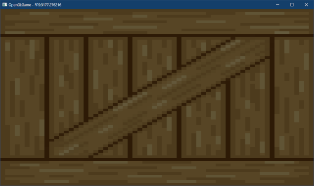
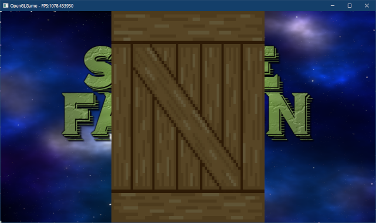
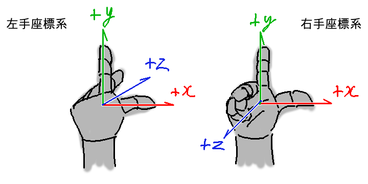
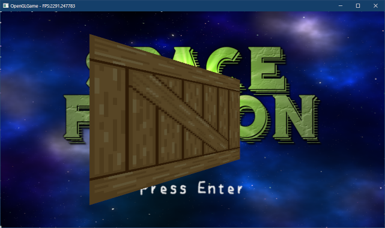
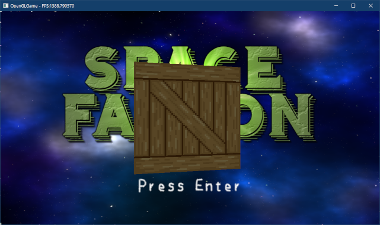

[OpenGL 3D 2022 第07回]

# オブジェクト管理と3D表示

## 習得目標

* RAIIを使ったOpenGLオブジェクトの管理を実装できる。
* クラスのコピーと代入を禁止する意図を説明できる。
* `gl_Position.w`を使って遠近法を実装できる。
* アスペクト比を考慮した、ワールド座標系からクリップ座標系への変換を説明できる。

## 1. RAIIとスマートポインタによるオブジェクト管理

### 1.1 デバッグ出力マクロを定義する

前回までのテキストでは、OpenGLの基本的な機能を使って、2Dシューティングゲームを作成しました。今回からは、「2Dシューティングゲームを3D化する」ことを目指します。

2Dモデルに次元をひとつ足すと3Dモデルになります。しかし、3Dモデルを表示するには、2Dモデルと比べてより複雑なプログラムが必要となります。

そのようなプログラムを作るとき、「OpenGLのオブジェクトを`GLuint`型の変数で管理する」という素朴なやり方は、以下の理由からうまく適合しません。

>1. 全ての種類のオブジェクトが`GLuint`型で管理されるため、種類を間違えやすいうえに、間違えても気づきにくい。
>2. 使い終わったオブジェクトの削除を手動で行わねばならないため、削除し忘れる可能性が高い。

これらの問題を解決するため、オブジェクトを管理するクラスを作成します。クラスを使うことで、2つの問題を次のように解決することができます。

>1. オブジェクトの種類ごとに型を定義する。種類を間違えるとコンパイルエラーになるため、間違えようがなくなる。
>2. クラスのデストラクタでオブジェクトを削除する。使い終わったオブジェクトは自動的に削除されるため、削除し忘れることがなくなる。

今回は、以下のOpenGLオブジェクトを管理するクラスを定義します。

>* VAO
>* プログラムパイプライン(シェーダ)
>* テクスチャ

これに加えて、デバッグメッセージを出力するマクロを作成します。

>* デバッグ出力マクロ

これまで使ってきた`OutputDebugString`マクロは、名前が長いわりに機能が貧弱で、使いやすいとは言いがたいものでした。そこで、`printf`と同じくらい使いやすいデバッグ出力マクロを作成します。

プロジェクトの`Src`フォルダに`Debug.h`という名前のヘッダファイルを追加してください。追加したファイルを開き、次のプログラムを追加してください。

```diff
+/**
+* @file Debug.h
+*/
+#ifndef DEBUG_H_INCLUDED
+#define DEBUG_H_INCLUDED
+
+/**
+* デバッグ用の機能を格納する名前空間
+*/
+namespace Debug {
+
+// メッセージの種類
+enum class Type {
+  error,   // エラー
+  warning, // 警告
+  info,    // その他の情報
+};
+
+void Log(Type type, const char* func, const char* format, ...);
+
+} // namespace Debug
+
+#ifdef NDEBUG
+#   define ENABLE_DEBUG_LOG // このマクロを定義するとデバッグ出力が有効になる
+#endif // NDEBUG
+
+// デバッグ出力マクロ
+#ifdef ENABLE_DEBUG_LOG
+#   define LOG_ERROR(...)   Debug::Log(Debug::Type::error, __func__, __VA_ARGS__)
+#   define LOG_WARNING(...) Debug::Log(Debug::Type::warning, __func__, __VA_ARGS__)
+#   define LOG(...)         Debug::Log(Debug::Type::info, __func__, __VA_ARGS__)
+#else
+#   define LOG_ERROR(...)   ((void)0)
+#   define LOG_WARNING(...) ((void)0)
+#   define LOG(...)         ((void)0)
+#endif // ENABLE_DEBUG_LOG
+
+#endif // DEBUG_H_INCLUDED
```

プログラムを実行中になにか問題が起きたとき、プログラムの実行に支障をきたすレベルの問題には`LOG_ERROR`(ログ・エラー)、設定ミスなどの軽微な問題には`LOG_WARNING`(ログ・ワーニング)を使います。

また、問題ではないが、情報として出力したいメッセージ(例えば「確認のために実際に読み込んだファイル名を出力する」など)には、`LOG`(ログ)を使います。

これらのマクロは記述を簡単にするためのもので、実際にデバッグ出力を行うのは`Log`(ログ)関数です。関数の末尾の`...`(ピリオド3つ)は「可変引数リスト(または可変長引数リスト、可変個引数リスト)」といいます。

可変引数リストを使うと、`printf`のように引数の数が変化する関数を作ることができます。

それから、デバッグ出力をするとゲームの実行速度が遅くなるため、デバッグ時以外では無効にしています。`NDEBUG`(エヌ・デバッグ、ノー・デバッグ)は`Release`ビルドのときだけ定義されるマクロで、「デバッグ機能なし」を意味します。

このマクロと`#ifndef～#else～#endif`を組み合わせることで、`NDEBUG`が定義されているときはデバッグ出力が無効になるようにしています。

また、`ENABLE_DEBUG_LOG`(イネーブル・デバッグ・ログ)マクロをあいだにはさむことで、
`NDEBUG`とは無関係にデバッグ出力を制御できるようにしています。`Release`(リリース)ビルドでのみ発生する問題を解決する場合に使えるでしょう。

>**_DEBUGとNDEBUGの違い**<br>
>`_DEBUG`はVisual Studioが独自に定義するマクロで、`NDEBUG`はC/C++言語規格で定義されているマクロです。使うなら`NDEBUG`をおすすめします。よりよい方法は`MY_DEBUG`
>のような独自のマクロ名を定義することです。

デバッグ出力が無効な場合、`LOG_ERROR`、`LOG_WARNING`、`LOG`は`(void)0`で置きかえられます。

<div style="page-break-after: always"></div>

例えば、

`LOG_ERROR("ファイル%sを開けません", filename);`

は、

`(void)0;`

となります。空文ではなく`(void)0`に置き換えるのは、コンパイラの警告を避けるためです。

>Visual Studioの標準設定では空文でも警告されませんが、警告設定を変えたり他のコンパイラを使うと、単独の`;`に対して警告が発生します。

`__func__`(ファンク)は、コンパイル中に「その行が含まれる関数名」で置き換えられる特別なキーワードです。

`__VA_ARGS__`(バ・アーグス)は、プリプロセッサマクロ版の`...`(可変引数リスト)です。引数の数が不定なマクロを作ることができます。

それでは`Log`関数を定義しましょう。プロジェクトの`Src`フォルダに`Debug.cpp`という名前のCPPファイルを追加してください。追加したファイルを開き、次のプログラムを追加してください。

```diff
+/**
+* @file Debug.cpp
+*/
+#include "Debug.h"
+#include <Windows.h>
+#include <stdio.h>
+#include <stdarg.h>
+
+namespace Debug {
+
+/**
+* 書式付き文字列をデバッグウィンドウに表示する
+*/
+void Log(Type type, const char* func, const char* format, ...)
+{
+  char buffer[1024];
+  char* p = buffer;
+  size_t size = sizeof(buffer) - 1; // 末尾に\nを追加するため
+
+  // ログの種類と関数名を設定
+  static const char* const typeNames[] = { "エラー", "警告", "情報" };
+  size_t n = snprintf(p, size, "[%s] %s: ",
+    typeNames[static_cast<int>(type)], func);
+  p += n;
+  size -= n;
+
+  // メッセージを設定
+  va_list ap;
+  va_start(ap, format);
+  p += vsnprintf(p, size, format, ap);
+  va_end(ap);
+
+  // 末尾に改行を追加
+  p[0] = '\n';
+  p[1] = '\0';
+
+  // 作成した文字列をデバッグウィンドウに表示
+  OutputDebugString(buffer);
+}
+
+} // namespace Debug
```

可変引数リストには引数名がないため、通常の引数のように使うことはできません。個々の引数にアクセスするには`va_list`(バ・リスト)型の変数を使います。`va_list`は可変引数リストを管理するオブジェクト型です。

>`va`(バ)は`variadic arguments`(バリアディック・アーギュメンツ)の短縮形です。

`va_list`型を使って引数にアクセスするには以下の関数を使います。これらは`stdarg.h`(エスティディー・アーグ・エイチ)というヘッダファイルに定義されています。

<p><code class="tnmai_code"><strong>【書式】</strong><br>
va_start(va_list型変数, 可変引数リストの直前にある引数の名前);
</code></p>

`va_start`(バ・スタート)は、`va_list`型の変数を初期化します。

<p><code class="tnmai_code"><strong>【書式】</strong><br>
va_end(va_list型変数);
</code></p>

`va_end`(バ・エンド)は`va_list`型変数を破棄します。

<p><code class="tnmai_code"><strong>【書式】</strong><br>
引数の値 va_arg(va_list型変数, 引数の型);
</code></p>

`va_arg`(バ・アーグ)は可変引数リストから引数をひとつ取り出します。1回目の`va_arg`は1番目の引数、2回目の`va_arg`は2番目の引数、というように、呼び出すたびに次の引数を取得します。

>`va_arg`は、上記のプログラムでは使用してしません。

`vsnprintf`(ブイ・エス・エヌ・プリント・エフ)は`printf`のバリエーションのひとつです。`v`が付いた`printf`系関数は、引数として`va_list`型の変数を受け付けます。それ以外の点では`snprintf`と同じです。

<p><code class="tnmai_code"><strong>【書式】</strong><br>
int vsnprintf(出力先のアドレス, 出力可能なバイト数, 書式付き文字列,<br>
&emsp;va_list型変数);
</code></p>

`vsnprintf`関数は「出力したバイト数」を返します。この値を出力先を指すポインタ`p`に加算することで、出力結果が連続するようにしています。

### 1.2 VAOの管理クラスを定義する

次に`VAO`を管理するクラスを作ります。プロジェクトの`Src`フォルダに`VertexArray.h`
(バーテックス・アレイ・エイチ)というヘッダファイルを追加してください。追加したファイルを開き、次のプログラムを追加してください。

```diff
+/**
+* @file VertexArray.h
+*/
+#ifndef VERTEXARRAY_H_INCLUDED
+#define VERTEXARRAY_H_INCLUDED
+#include "glad/glad.h"
+#include <memory>
+
+// 先行宣言
+class VertexArray;
+using VertexArrayPtr = std::shared_ptr<VertexArray>;
+
+/**
+* VAOを管理するクラス
+*/
+class VertexArray
+{
+public:
+  // VAOを作成
+  static VertexArrayPtr Create() { return std::make_shared<VertexArray>(); }
+
+  // コンストラクタ、デストラクタ
+  VertexArray() { glCreateVertexArrays(1, &vao); }
+  ~VertexArray() { glDeleteVertexArrays(1, &vao); }
+
+  // コピーと代入を禁止
+  VertexArray(const VertexArray&) = delete;
+  VertexArray& operator=(const VertexArray&) = delete;
+
+  // 管理番号を取得
+  operator GLuint() const { return vao; }
+
+private:
+  GLuint vao = 0;
+};
+
+#endif // VERTEXARRAY_H_INCLUDED
```

`VertexArray`(バーテックス・アレイ)クラスは、コンストラクタでVAOを作成し、デストラクタでVAOを削除します。

このような、コンストラクタ(または初期化関数)でOpenGLオブジェクトやメモリのようなコンピュータ資源を確保し、デストラクタでそれらの資源を削除する手法は、<br>
`RAII`(アール・エー・アイ・アイ)と呼ばれています。

>`RAII`は`Resource Acquisition Is Initialization`(「資源の獲得」は「初期化」である)の短縮形です。

また、`VertexArray`は`Create`(クリエイト)関数で作成することを想定しています。

コンストラクタのようにコンパイラが自動的に作成する関数を`delete`(デリート)指定すると、その関数は作成されなくなります。その結果として、対応する機能が無効化されます。

コピーコンストラクタとコピー代入演算子を`delete`指定すると、コピーと代入を禁止できます(やろうとするとコンパイルエラーになる)。

### 1.3 コピーと代入を禁止する理由

コピーと代入を禁止するのは、OpenGLオブジェクトの管理番号をコピーできしてしまうと、デストラクタによる削除が意図したとおりに機能しないためです。次の例を考えてみましょう。

>```c++
>{
>  VertexArray original; // 管理番号=1
>  {
>    VertexArray copy = original; // 管理番号のコピー=管理番号
>  } // ここでcopyのデストラクタが発動し、管理番号1のVAOは削除される
>  glBindVertexArray(original); // エラー(管理番号1のVAOはすでに削除されているため)
>  glDrawElementsInstanced(...);
>} // エラー(管理番号1のVAO(すでに削除されている)を、もう一度削除しようとするため)
>```

この例では`{}`によって`copy`変数の寿命を`original`より短く設定しています。<br>
`copy`がスコープを抜けるとデストラクタが起動し、コピーされた管理番号を使って
`glDeleteVertexArray`が実行されます。

その結果、同じ管理番号を使っている`original`のほうもVAOを使えなくなってしまいます。

もうひとつ例を挙げます。

>```c++
>{
>  VertexArray a; // 管理番号A=1
>  VertexArray b; // 管理番号B=2
>  vao1 = vao2; // 管理番号A = 管理番号B
>} // エラー(管理番号2を2回削除しようとするため)
>  // 管理番号1は削除されない(管理しているオブジェクトがいなくなってしまったため)
>```

この例では、前の例と同様にVAOの多重削除問題が発生しています。さらに、管理番号1は上書きされて消えてしまったため、使うことも削除することもできないまま残り続けてしまいます。

これらの例のような問題を避けるには、OpenGLオブジェクトを管理するクラスのコピーと代入を禁止するのが簡単です。OpenGLオブジェクトを共有するにはポインタを使います。

しかし、普通のポインタを使うと、結局は同じ問題が起きてしまいます。そこで`shared_ptr`
クラスを使います。`shared_ptr`はポインタのコピーを追跡し、すべてのコピーが削除されたら`delete`を呼び出すクラスです。

このように、コピーと代入を禁止し、`shared_ptr`でポインタを管理することで、OpenGLオブジェクトの生存期間を適切に管理できるようになります。

### 1.4 プログラムパイプラインの管理クラスを定義する

続いて、プログラムパイプラインを管理するクラスを定義します。プロジェクトの`Src`フォルダに`ProgramPipeline.h`(プログラム・パイプラン・エイチ)というヘッダファイルを追加してください。

追加したファイルを開き、次のプログラムを追加してください。

```diff
+/**
+* @file ProgramPipeline.h
+*/
+#ifndef PROGRAMPIPELINE_H_INCLUDED
+#define PROGRAMPIPELINE_H_INCLUDED
+#include "glad/glad.h"
+#include <memory>
+#include <string>
+
+// 先行宣言
+class ProgramPipeline;
+using ProgramPipelinePtr = std::shared_ptr<ProgramPipeline>;
+
+/**
+* プログラムパイプラインを管理するクラス
+*/
+class ProgramPipeline
+{
+public:
+  // プログラムパイプラインを作成
+  static ProgramPipelinePtr Create(
+    const std::string& filenameVS, const std::string& filenameFS);
+
+  // コンストラクタ、デストラクタ
+  ProgramPipeline(
+    const std::string& filenameVS, const std::string& filenameFS);
+  ~ProgramPipeline();
+
+  // コピーと代入を禁止
+  ProgramPipeline(const ProgramPipeline&) = delete;
+  ProgramPipeline& operator=(const ProgramPipeline&) = delete;
+
+  // 管理番号を取得
+  operator GLuint() const { return pp; }
+  GLuint GetVS() const { return vs; }
+  GLuint GetFS() const { return fs; }
+
+private:
+  GLuint vs = 0; // 頂点シェーダ
+  GLuint fs = 0; // フラグメントシェーダ
+  GLuint pp = 0; // プログラムパイプライン
+  std::string filenameVS; // 頂点シェーダファイル名
+  std::string filenameFS; // フラグメントシェーダファイル名
+};
+
+#endif // PROGRAMPIPELINE_H_INCLUDED
```

メンバ変数名の`vs`は`vertex shader`の、`fs`は`fragment shader`の短縮形です。そして、`pp`は`Program Pipeline`の短縮形です。

### 1.5 ProgramPipeline::Create関数を定義する

続いてメンバ関数を定義します。プロジェクトの`Src`フォルダに`ProgramPipeline.cpp`というCPPファイルを追加してください。追加したファイルを開き、次のプログラムを追加してください。

```diff
+/**
+* @file ProgramPipeline.cpp
+*/
+#include "ProgramPipeline.h"
+#include "Debug.h"
+#include <fstream>
+#include <filesystem>
+#include <vector>
```

シェーダファイルを読み込むために、`fstream`, `filesystem`, `vector`の3つのヘッダファイルをインクルードしました。それでは`Create`メンバ関数を定義しましょう。インクルード文の下に次のプログラムを追加してください。

```diff
+
+/**
+* プログラムパイプラインを作成する
+*
+* @param filenameVS 頂点シェーダファイル名
+* @param filenameFS フラグメントシェーダファイル名
+*
+* @return 作成したプログラムパイプラインへのポインタ
+*/
+ProgramPipelinePtr ProgramPipeline::Create(
+  const std::string& filenameVS, const std::string& filenameFS)
+{
+  return std::make_shared<ProgramPipeline>(filenameVS, filenameFS);
+}
```

`Create`(クリエイト)関数では、`make_shared`(メイク・シェアード)関数を使って
`shared_ptr`を作成します。

<p><code class="tnmai_code"><strong>【書式】</strong><br>
shared_ptr make_shared<作成するクラス>(コンストラクタ引数リスト);
</code></p>

`make_shared`は関数テンプレートで、テンプレート引数で指定したクラスの`shared_ptr`を作成します。引数には「作成するクラスのコンストラクタと同じ引数」を指定します。

`make_shared`は`new`を使って次のように書いたのと、ほぼ同じ結果を返します。

>```c++
>return std::shared_ptr<ProgramPipeline>(
>  new ProgramPipeline(filenameVS, filenameFS));
>```

しかし、`new`を使う書き方だと、「作成するクラス」を2回書かなくてはなりません。それに対して、`make_shared`を使うと1回書くだけで済むので、ちょっぴり手間が少なくなります。

>**【make_sharedのもうひとつの利点】**<br>
>`shared_ptr`クラスはコピーを追跡するための内部データを持っています。`new`の場合は「作成するクラス」と「内部データ」を別々に作成しますが、`make_shared`関数は、この2つをまとめて作成してくれます。そのため、少しだけ効率的にデータを作成することができます。そのため、基本的には`make_shared`を使って作成するべきです。ただし、`weak_ptr`(ウィーク・ポインタ)というクラスを使う場合はその限りではないので注意が必要です。今回は`weak_ptr`を使わないので詳しい説明はしませんが、調べてみると面白いと思います。

### 1.6 コンストラクタを定義する

次にコンストラクタを定義します。`Create`関数の定義の下に、次のプログラムを追加してください。

```diff
 {
   return std::make_shared<ProgramPipeline>(filenameVS, filenameFS);
 }
+
+/**
+* コンストラクタ
+*
+* @param filenameVS 頂点シェーダファイル名
+* @param filenameFS フラグメントシェーダファイル名
+*/
+ProgramPipeline::ProgramPipeline(
+  const std::string& filenameVS, const std::string& filenameFS) :
+  filenameVS(filenameVS), filenameFS(filenameFS)
+{
+}
```

プログラムパイプラインの作成は、以前に`Engine.cpp`の`Initialize`関数で作成済みです。そこで、既存のプログラムをコピーして改造することにします。

<pre class="tnmai_assignment">
<strong>【課題01】</strong>
<code>Engine.cpp</code>の<code>Initialize</code>関数にある以下の3種類のプログラムを、<code>Ctrl+X</code>で
切り取って、<code>ProgramPipeline</code>コンストラクタの中に貼り付けてください。

  - 頂点シェーダを読み込んでコンパイルする
  - フラグメントシェーダを読み込んでコンパイルする
  - 2つのシェーダをリンクする
</pre>

クラスに合うように、貼り付けたプログラムを改造しましょう。`ProgramPipeline.cpp`を開き、「頂点シェーダを読み込んでコンパイルする」プログラムを次のように変更してください。

```diff
   // 頂点シェーダを読み込んでコンパイルする
   std::ifstream file;
   vs = glCreateShader(GL_VERTEX_SHADER);
-  const char filenameVS[] = "Res/standard_2D.vert";
   file.open(filenameVS, std::ios::binary); // ファイルを開く
   if (file) {
```

`filenameVS`は引数で受け取るので、プログラム内で定義する必要はありません。同様に、「フラグメントシェーダを読み込んでコンパイルする」プログラムから`filenameFS`を削除してください。

```diff
   // フラグメントシェーダを読み込んでコンパイルする
   fs = glCreateShader(GL_FRAGMENT_SHADER);
-  const char filenameFS[] = "Res/standard_2D.frag";
   file.open(filenameFS, std::ios::binary);
   if (file) {
```

次に、プログラムパイプラインオブジェクトを表す`progSprite`変数を、`pp`メンバ変数に変更します。「2つのシェーダをリンクする」プログラムを次のように変更してください。

```diff
   file.close();

   // 2つのシェーダをリンクする
-  progSprite = glCreateProgram();
-  glAttachShader(progSprite, vs);
-  glAttachShader(progSprite, fs);
-  glLinkProgram(progSprite);
+  pp = glCreateProgram();
+  glAttachShader(pp, vs);
+  glAttachShader(pp, fs);
+  glLinkProgram(pp);
 }
```

続いて、エラーメッセージの出力を追加します。「頂点シェーダを読み込んでコンパイルする」プログラムの末尾に、次のプログラムを追加してください。

```diff
     vs = glCreateShader(GL_VERTEX_SHADER);
     glShaderSource(vs, 1, a, nullptr);
     glCompileShader(vs);
+  } else {
+    LOG_ERROR("%sを開けません", filenameVS.c_str());
   }
   file.close();
```

同様に、「フラグメントシェーダを読み込んでコンパイルする」プログラムの末尾を、次のプログラムを追加してください。

```diff
     fs = glCreateShader(GL_FRAGMENT_SHADER);
     glShaderSource(fs, 1, ss, nullptr);
     glCompileShader(fs);
+  } else {
+    LOG_ERROR("%sを開けません", filenameFS.c_str());
   }
   file.close();
```

このメッセージ出力を追加したことで、ファイル名を間違えていた場合はエラーメッセージが表示されるようになります。

最後に、シェーダのリンクに成功したかどうかを調べるプログラムを追加します。「2つのシェーダをリンクする」プログラムに、次のプログラムを追加してください。

```diff
   file.close();

   // 2つのシェーダをリンクする
+  if (vs && fs) {
     pp = glCreateProgram();
     glAttachShader(pp, vs);
     glAttachShader(pp, fs);
     glLinkProgram(pp);
+
+    // リンクの成否を調べる
+    GLint result;
+    glGetProgramiv(pp, GL_LINK_STATUS, &result);
+    if (result != GL_TRUE) {
+      LOG_ERROR("シェーダのリンクに失敗(vs=%s, fs=%s)",
+        filenameVS.c_str(), filenameFS.c_str());
+    }
+  } // if (vs && vs)
 }
```

`glGetProgramiv`(ジーエル・ゲット・プログラム・アイ・ブイ)は、プログラムオブジェクトの状態を調べる関数です。結果は第2引数が指す配列に返されます。

<p><code class="tnmai_code"><strong>【書式】</strong><br>
void glGetProgramiv(プログラムパイプラインの管理番号,<br>
&emsp;調査する状態名, 結果を格納する配列のアドレス);
</code></p>

リンクの結果を調べるには、第2引数に`GL_LINK_STATUS`(ジーエル・リンク・ステータス)を指定します。リンクに成功していたら`GL_TRUE`、失敗なら`GL_FALSE`が返されます。

<div style="page-break-after: always"></div>

### 1.7 デストラクタを定義する

コンストラクタの次はデストラクタを定義します。コンストラクタの定義の下に、次のプログラムを追加してください。

```diff
     }
   } // if (vs && vs)
 }
+
+/**
+* デストラクタ
+*/
+ProgramPipeline::~ProgramPipeline()
+{
+  glDeleteProgram(pp);
+  glDeleteShader(fs);
+  glDeleteShader(vs);
+}
```

デストラクタでは、3つのOpenGLオブジェクトを削除します。<br>
これで`ProgramPipeline`クラスは完成です。

### 1.8 スプライト用シェーダの作成方法を変更する

作成した`ProgramPipeline`を使って、`progSprite`を使用するプログラムを修正しましょう。`Engine.h`を開き、次のプログラムを追加してください。

```diff
 #include <GLFW/glfw3.h>
 #include <string>
 #include <random>
+#include <memory>
+
+// 先行宣言
+class ProgramPipeline;
+using ProgramPipelinePtr = std::shared_ptr<ProgramPipeline>;

 /**
 * ゲームエンジン
```

次に、`progSprite`変数の定義を次のように変更してください。

```diff
   const std::string title = "OpenGLGame"; // ウィンドウタイトル
   GLuint vs = 0; // 頂点シェーダの管理番号
   GLuint fs = 0; // フラグメントシェーダの管理番号
-  GLuint progSprite = 0; // プログラムオブジェクトの管理番号
+  ProgramPipelinePtr progSprite; // プログラムオブジェクトの管理番号
   GLuint vbo = 0; // 頂点バッファの管理番号
   GLuint ibo = 0; // インデックスバッファの管理番号
```

それでは`ProgramPipeline`を作成しましょう。`Engine.cpp`を開き、`ProgramPipeline.h`をインクルードしてください。

```diff
 #include "Engine.h"
 #include "MainGameScene.h"
 #include "TitleScene.h"
+#include "ProgramPipeline.h"
 #include "EasyAudio.h"
 #include <Windows.h>
```

次に、`Initialize`メンバ関数に次のプログラムを追加してください。

```diff
   // メッセージコールバックの設定
   glDebugMessageCallback(DebugCallback, nullptr);
+
+  progSprite = ProgramPipeline::Create(
+    "Res/standard_2D.vert", "Res/standard_2D.frag");

   // 頂点データをGPUメモリにコピー
   struct Vertex {
```

それから、シェーダを作成するプログラムを切り取ったために`file`変数の定義が失われています。先にこの問題を修正します。テクスチャを作成するプログラムに次のプログラムを追加してください。

```diff
   glBindBuffer(GL_ARRAY_BUFFER, 0);
   glBindBuffer(GL_ELEMENT_ARRAY_BUFFER, 0);

   // テクスチャを作成する
+  std::fstream file;
   glCreateTextures(GL_TEXTURE_2D, static_cast<GLsizei>(std::size(tex)), tex);
   const char* filenameImgList[] = { "Res/bg0.tga", "Res/objects.tga" };
```

次に、`progSprite`を使用しているプログラムを修正します。`MainLoop`メンバ関数の中の、シェーダを指定するプログラムを次のように変更してください。

```diff
     glClearColor(0.3f, 0.6f, 0.9f, 1.0f);
     glClear(GL_COLOR_BUFFER_BIT | GL_DEPTH_BUFFER_BIT);

     // 描画に使うシェーダを指定
-    glUseProgram(progSprite);
+    glUseProgram(*progSprite);

     // アルファブレンドを有効化
     glEnable(GL_BLEND);
```

`progSprite`をポインタ変数に変更したので、`*`を追加しています。

<pre class="tnmai_assignment">
<strong>【課題02】</strong>
エラーを解消するため、上記以外の<code>progSprite</code>を使用しているプログラムについて、<code>progSprite</code>の前に<code>*</code>を付けなさい。
</pre>

プログラムが書けたらビルドして実行してください。問題なくゲームが動作したら成功です。

### 1.9 テクスチャの管理クラスを定義する

次に、テクスチャを管理するクラスを定義します。プロジェクトの`Src`フォルダに
`Texture.h`(テクスチャ・エイチ)という名前のヘッダファイルを追加してください。追加したファイルを開き、次のプログラムを追加してください。

```diff
+/**
+* @file Texture.h
+*/
+#ifndef TEXTURE_H_INCLUDED
+#define TEXTURE_H_INCLUDED
+#include "glad/glad.h"
+#include <string>
+#include <memory>
+
+// 先行宣言
+class Texture;
+using TexturePtr = std::shared_ptr<Texture>;
+
+/**
+* テクスチャ
+*/
+class Texture
+{
+public:
+  // テクスチャを作成
+  static TexturePtr Create(
+    const std::string& filename, GLenum filterMode = GL_NEAREST);
+
+  // コンストラクタ、デストラクタ
+  Texture(const std::string& filename, GLenum filterMode = GL_NEAREST);
+  ~Texture();
+
+  // コピーと代入を禁止
+  Texture(const Texture&) = delete;
+  Texture& operator=(const Texture&) = delete;
+
+  // 管理番号を取得
+  operator GLuint() const { return tex; }
+
+private:
+  GLuint tex = 0;
+  std::string filename;
+};
+
+#endif // TEXTURE_H_INCLUDED
```

### 1.10 Create関数を定義する

それでは`Create`メンバ関数を作成します。プロジェクトの`Src`フォルダに`Texture.cpp`
という名前のCPPファイルを追加してください。追加したファイルを開き、次のプログラムを追加してください。

```diff
+/**
+* @file Texture.cpp
+*/
+#include "Texture.h"
+#include "Debug.h"
+#include <filesystem>
+#include <fstream>
+#include <vector>
+
+/**
+* テクスチャを作成する
+*
+* @param filename   画像ファイル名
+* @param filterMode テクスチャに設定する拡大縮小フィルタ
+*
+* @return 作成したテクスチャへのポインタ
+*/
+TexturePtr Texture::Create(const std::string& filename, GLenum filterMode)
+{
+  return std::make_shared<Texture>(filename, filterMode);
+}
```

### 1.11 コンストラクタを定義する

次にコンストラクタを定義します。コンストラクタには、以前作成した「画像からテクスチャを作成する」関数を流用します。`Engine.cpp`を開き、`CreateTexture`関数をまるごと切り取ってください。

<div style="page-break-after: always"></div>

<pre class="tnmai_assignment">
<strong>【課題03】</strong>
<code>Engine.cpp</code>にある<code>CreateTexture</code>関数を
まるごと<code>Ctrl+X</code>で切り取って、<code>Texture::Create</code>関数の下に貼り付けてください。
</pre>

続いて、貼り付けた関数を次のように変更してください。

```diff
   return std::make_shared<Texture>(filename, filterMode);
 }

 /**
-* 画像からテクスチャを作成する
+* コンストラクタ
 *
 * @param filename   画像ファイル名
 * @param filterMode テクスチャに設定する拡大縮小フィルタ
 *
 * @return 作成したテクスチャの管理番号
 */
-GLuint CreateTexture(const char* filename, GLenum filterMode = GL_NEAREST)
+Texture::Texture(const std::string& filename, GLenum filterMode = GL_NEAREST) :
+  filename(filename)
 {
   // ファイルを開く
   std::ifstream file(filename, std::ios::binary);
   if (!file) {
-    const auto err = std::string("[エラー]") + __func__ + ":" +
-      filename + "を開けません\n";
-    OutputDebugString(err.c_str());
-    return 0;
+    LOG_ERROR("%sを開けません", filename.c_str());
   }

   // ヘッダ情報を読み込む
```

それから、関数の末尾にある`tex`変数を削除してください。

```diff
   file.read(img.data(), img.size());

   // テクスチャを作成
-  GLuint tex = 0;
   glCreateTextures(GL_TEXTURE_2D, 1, &tex);
   glTextureStorage2D(tex, 1, GL_RGBA8, width, height);
   glTextureSubImage2D(tex, 0, 0, 0, width, height,
     GL_BGRA, GL_UNSIGNED_BYTE, img.data());

   // 拡大縮小フィルタを設定
   glTextureParameteri(tex, GL_TEXTURE_MAG_FILTER, filterMode);
   glTextureParameteri(tex, GL_TEXTURE_MIN_FILTER, filterMode);
-
-  return tex;
 }
```

これでコンストラクタは完成です。

### 1.12 デストラクタを定義する

次にデストラクタを定義します。コンストラクタの定義の下に、次のプログラムを追加してください。

```diff
   glTextureParameteri(tex, GL_TEXTURE_MAG_FILTER, filterMode);
   glTextureParameteri(tex, GL_TEXTURE_MIN_FILTER, filterMode);
 }
+
+/**
+* デストラクタ
+*/
+Texture::~Texture()
+{
+  glDeleteTextures(1, &tex);
+}
```

これで`Texture`クラスは完成です。

### 1.13 Textureクラスを使う

それでは、既存のテクスチャ管理番号を`Texture`クラスで置き換えます。<br>
`Engine.h`を開き、次の先行宣言を追加してください。

```diff
 // 先行宣言
 class ProgramPipeline;
 using ProgramPipelinePtr = std::shared_ptr<ProgramPipeline>;
+class Texture;
+using TexturePtr = std::shared_ptr<Texture>;

 /**
 * ゲームエンジン
```

次に、`Engine`クラスの定義にある`tex`メンバ変数の定義を、次のように変更してください。

```diff
   GLuint vbo = 0; // 頂点バッファの管理番号
   GLuint ibo = 0; // インデックスバッファの管理番号
   GLuint vao = 0; // 構成情報の管理番号
-  GLuint tex[2] = { 0, 0 }; // テクスチャの管理番号
+  TexturePtr tex[2]; // テクスチャの管理番号
   const size_t maxSpriteCount = 100'000; // スプライトの最大数
   std::vector<Sprite> spriteListBg;  // 背景用
```

同様に、`UILayer`構造体の定義を次のように変更してください。

```diff
   // UI用ゲームオブジェクトのレイヤー構造
   struct UILayer {
-    GLuint tex = 0;
+    TexturePtr tex;
     GameObjectList gameObjectList;
     std::vector<Sprite> spriteList;
```

続いて、上記の変更によるエラーを解決していきます。`Engine.cpp`を開き、`Texture.h`をインクルードしてください。

```diff
 #include "TitleScene.h"
 #include "EasyAudio.h"
 #include "ProgramPipeline.h"
+#include "Texture.h"
 #include <Windows.h>
 #include <fstream>
```

まず`AddUILayer`関数の定義を次のように変更してください。

```diff
 size_t Engine::AddUILayer(const char* image, GLenum filterMode, size_t reserve)
 {
-  const GLuint tex = CreateTexture(image, filterMode);
+  const TexturePtr tex = Texture::Create(image, filterMode);
   uiLayerList.push_back({ tex });
   uiLayerList.back().gameObjectList.reserve(reserve);
   uiLayerList.back().spriteList.reserve(reserve);
```

次に、`ClearUILayers`関数の定義を次のように変更してください。

```diff
 void Engine::ClearUILayers()
 {
-  for (auto& layer : uiLayerList) {
-    glDeleteTextures(1, &layer.tex);
-  }
   uiLayerList.clear();
 }
```

`TexturePtr`(テクスチャ・ポインタ)型は`shared_ptr<Texture>`の別名なので、手動で削除するプログラムは不要です。

続いて、`Initialize`関数にあるテクスチャを作成するプログラムを、次のように変更してください。

```diff
   glBindBuffer(GL_ARRAY_BUFFER, 0);
   glBindBuffer(GL_ELEMENT_ARRAY_BUFFER, 0);

   // テクスチャを作成する
-  std::fstream file;
-  glCreateTextures(GL_TEXTURE_2D, static_cast<GLsizei>(std::size(tex)), tex);
   const char* filenameImgList[] = { "Res/bg0.tga", "Res/objects.tga" };
   for (size_t i = 0; i < std::size(tex); ++i) {
-    const char* filenameImg = filenameImgList[i];
+    tex[i] = Texture::Create(filenameImgList[i], GL_NEAREST);
-    file.open(filenameImg, std::ios::binary);
-    if (file) {
-      const size_t tgaHeaderSize = 18; // ヘッダ情報のバイト数
-
-      // 読み込み先メモリ領域を確保
-      std::vector<char> img(
-        std::filesystem::file_size(filenameImg) - tgaHeaderSize);
-
-      // ファイルを読み込む
-      file.ignore(tgaHeaderSize); // ヘッダ情報をスキップ
-      file.read(img.data(), img.size());
-
-      // テクスチャを作成
-      glTextureStorage2D(tex[i], 1, GL_RGBA8, 512, 512);
-      glTextureSubImage2D(tex[i], 0, 0, 0, 512, 512,
-        GL_BGRA, GL_UNSIGNED_BYTE, img.data());
-
-      // タイル境界で意図しない色が表示されないようにする
-      glTextureParameteri(tex[i], GL_TEXTURE_MAG_FILTER, GL_NEAREST);
-      glTextureParameteri(tex[i], GL_TEXTURE_MIN_FILTER, GL_NEAREST);
-    }
-    file.close();
   }

   // スプライトの配列を作成
   spriteListBg.reserve(10'000);
```

`Texture`クラスを使えば、テクスチャを作成するプログラムを書く必要はありません。

最後に、`tex`メンバ変数を使用しているプログラムを修正します。`MainLoop`関数にある「スプライトを描画」するプログラムを、次のように変更してください。

```diff
     glBindVertexArray(vao);
     size_t spriteSsboOffset = spriteSsboIndex * spriteSsboSize;
     for (size_t i = 0; i < std::size(drawList); ++i) {
-      DrawSpriteList(*drawList[i], tex[i], spriteSsboOffset);
+      DrawSpriteList(*drawList[i], *tex[i], spriteSsboOffset);
     }

    // UIレイヤーのスプライト配列を描画
    glBindVertexArray(vao);
    glViewport(0, 0, 1280, 720);
    glProgramUniform4f(*progSprite, 2, 2.0f / 1280, 2.0f / 720, -1, -1);
    for (const auto& layer : uiLayerList) {
-     DrawSpriteList(layer.spriteList, layer.tex, spriteSsboOffset);
+     DrawSpriteList(layer.spriteList, *layer.tex, spriteSsboOffset);
    }

    // スプライト用SSBOの割り当てを解除する
```

プログラムが書けたらビルドして実行してください。変更前と変わらずにゲームが動作していたら成功です。

>**【1章のまとめ】**
>
>* 可変引数リスト(`...`や`__VA_ARGS__`)を使うと、`printf`のような引数の数が不定な関数やマクロを定義できる。
>* コンストラクタでOpenGLオブジェクトを作成し、デストラクタで削除することにより、オブジェクトの削除忘れを防ぐことができる。この手法は`RAII`と呼ばれている。
>* メンバ関数宣言の末尾に`= delete`を付けると、コンパイラがそのメンバ関数を自動生成することを禁止できる。
>* OpenGLオブジェクトの管理番号や確保したメモリを指すポインタのように、コピーが作れてしまうと多重削除が発生する。これを防ぐには、コピーコンストラクタとコピー代入演算子を`delete`指定する。

<div style="page-break-after: always"></div>

## 2. 3Dモデルの表示

### 2.1 3Dモデルを扱うクラスを定義する

ここからは、3Dモデルを表示するための機能を作成していきます。3Dモデルは2Dモデルに次元を1つ足しただけですが、複雑さは想像以上に増加します。

とりあえず、3Dモデルを管理するクラスを定義します。今回は、以下の3種類のクラス(または構造体)を定義することにしました。

| クラス(構造体)名 | 役割 |
|:--|:--|
| `Vertex`(バーテックス)構造体 | 頂点データをあらわす。 |
| `Primitive`(プリミティブ)構造体 | 描画に必要なパラメータをあらわす。 |
| `PrimitiveBuffer`<br>(プリミティブ・バッファ)クラス | VBO, IBO, VAO, および`Primitive`の配列を<br>管理する。 |

プロジェクトの`Src`フォルダに`Mesh.h`(メッシュ・エイチ)という名前のヘッダファイルを追加してください。追加したファイルを開き、次のプログラムを追加してください。

```diff
+/**
+* @file Mesh.h
+*/
+#ifndef MESH_H_INCLUDED
+#define MESH_H_INCLUDED
+#include "glad/glad.h"
+#include <vector>
+#include <memory>
+
+// 先行宣言
+class VertexArray;
+using VertexArrayPtr = std::shared_ptr<VertexArray>;
+
+/**
+* 3Dモデル関係の機能を格納する名前空間
+*/
+namespace Mesh {
+
+// 先行宣言
+class PrimitiveBuffer;
+using PrimitiveBufferPtr = std::shared_ptr<PrimitiveBuffer>;
+
+} // namespace Mesh
+
+#endif // MESH_H_INCLUDED
```

まず、3Dモデル用の頂点データを表す`Vertex`(バーテックス)構造体を定義します。
`PrimitiveBufferPtr`の先行宣言の下に、次のプログラムを追加してください。

```diff
 // 先行宣言
 class PrimitiveBuffer;
 using PrimitiveBufferPtr = std::shared_ptr<PrimitiveBuffer>;
+
+/**
+* 頂点データ形式
+*/
+struct Vertex
+{
+  float position[3]; // 頂点座標
+  float texcoord[2]; // テクスチャ座標
+};

 } // namespace Mesh

 #endif // MESH_H_INCLUDED
```

次に、描画データを管理する`Primitive`(プリミティブ)構造体を定義します。`Vertex`構造体の定義の下に、次のプログラムを追加してください。

```diff
   float position[3]; // 頂点座標
   float texcoord[2]; // テクスチャ座標
 };
+
+/**
+* プリミティブ
+*/
+struct Primitive
+{
+  GLenum mode = GL_TRIANGLES; // プリミティブの種類
+  GLsizei count = 0;          // 描画するインデックス数
+  const void* indices = 0;    // 描画開始インデックスのバイトオフセット
+  GLint baseVertex = 0;       // インデックス0となる頂点配列内の位置
+};
+void Draw(const Primitive& prim);

 } // namespace Mesh

 #endif // MESH_H_INCLUDED
```

最後に、プリミティブを管理する`PrimitiveBuffer`(プリミティブ・バッファ)クラスを定義します。`Primitive`構造体の定義の下に、次のプログラムを追加してください。

```diff
   GLint baseVertex = 0;       // インデックス0となる頂点配列内の位置
 };
 void Draw(const Primitive& prim);
+
+/**
+* プリミティブを管理するクラス
+*/
+class PrimitiveBuffer
+{
+public:
+  // プリミティブバッファを作成する
+  static PrimitiveBufferPtr Create(size_t vboCapacity, size_t iboCapacity) {
+    return std::make_shared<PrimitiveBuffer>(vboCapacity, iboCapacity);
+  }
+
+  // コンストラクタ・デストラクタ
+  PrimitiveBuffer(size_t vboCapacity, size_t iboCapacity);
+  ~PrimitiveBuffer();
+
+  // コピーと代入を禁止
+  PrimitiveBuffer(const PrimitiveBuffer&) = delete;
+  PrimitiveBuffer& operator=(const PrimitiveBuffer&) = delete;
+
+  // プリミティブの追加
+  void AddPrimitive(const Vertex* vertices, size_t vertexCount,
+    const uint16_t* indices, size_t indexCount, GLenum mode = GL_TRIANGLES);
+
+  // プリミティブの取得
+  const Primitive& GetPrimitive(size_t index) const { return primitives[index]; }
+
+  // VAOの取得
+  VertexArrayPtr GetVAO() const { return vao; }
+
+  // 頂点データ、インデックスデータの追加
+  GLint AddVertices(const Vertex* vertices, size_t count);
+  const void* AddIndices(const uint16_t* indices, size_t count);
+
+  // 全てのプリミティブを削除
+  void Clear();
+
+private:
+  std::vector<Primitive> primitives;
+  VertexArrayPtr vao;
+
+  GLuint vbo = 0;          // VBO管理番号
+  uint8_t* pVbo = nullptr; // VBOの書き込み先アドレス
+  size_t vboCapacity = 0;  // VBOの全容量(バイト)
+  size_t vboSize = 0;      // VBOの使用済み容量(バイト)
+
+  GLuint ibo = 0;          // IBO管理番号
+  uint8_t* pIbo = nullptr; // IBOの書き込み先アドレス
+  size_t iboCapacity = 0;  // IBOの全容量(バイト)
+  size_t iboSize = 0;      // IBOの使用済み容量(バイト)
+};

 } // namespace Mesh

 #endif // MESH_H_INCLUDED
```

これらのクラス(構造体)は`Mesh`(メッシュ)名前空間に格納します。名前空間を使うと、関連する機能をグループ化することができます。また、既存のプログラムで使っている名前との衝突を防ぐ効果もあります。

### 2.2 Draw関数を定義する

それでは、`Primitive`を描画する`Draw`(ドロー)関数から定義していきましょう。

プロジェクトの`Src`フォルダに`Mesh.cpp`という名前のCPPファイルを追加してください。追加したファイルを開き、次のプログラムを追加してください。

```diff
+/**
+* @file Mesh.cpp
+*/
+#include "Mesh.h"
+#include "VertexArray.h"
+#include "Debug.h"
+#include <string>
+#include <vector>
+
+namespace Mesh {
+
+/**
+* プリミティブを描画する
+*/
+void Draw(const Primitive& prim)
+{
+  glDrawElementsInstancedBaseVertex(prim.mode, prim.count,
+    GL_UNSIGNED_SHORT, prim.indices, 1, prim.baseVertex);
+}
+
+} // namespace Mesh
```

`Primitive`の描画には`glDrawElementsInstancedBaseVertex`(ジーエル・ドロー・エレメンツ・インスタンスド・ベース・バーテックス)関数を使います。

<p><code class="tnmai_code"><strong>【書式】</strong><br>
void glDrawElementsInstancedBaseVertex(基本図形の種類, 描画するデータ数,<br>
&emsp;インデックスデータの型, インデックスデータの開始位置,<br>
&emsp;描画する図形の数, 頂点データの開始位置);
</code></p>

この関数は`glDrawElementsInstanced`に、`baseVertex`(ベース・バーテックス)を指定する機能を追加したものです。

`baseVertex`には「頂点データの開始位置」を指定します。これによって、VBOの好きな位置を、頂点データが格納されている場所として扱えるようになります。

>**【baseVertexの意味と効果】**<br>
>`baseVertex`は、3DモデルごとにVBOを作成する場合は必要のない機能です。しかし、GPUは「設定されたVBOを最大限に活用する」ため、描画前および描画中にVBOに関するデータを収集します。
>
>VBOを切り替えると、新しいVBOに関するデータを集めなおさなくてはなりません。そのため、VBOを頻繁に切り替えると、GPUは性能を発揮できません。そこで、複数のVBOをひとつのVBOにまとめます。そして、描画するときは個々のVBOの位置を指定して描画します。
>
>この「個々のVBOの位置」が`baseVertex`です。この方法なら「VBOの切り替えによるデータの集めなおし」は発生しないため、より効率的にGPUを働かせることができます。
>
>ただ、`baseVertex`を使う方法にも欠点はあります。それは「頂点データ形式が異なるVBOは、ひとつにまとめることができない」という点です。これは、頂点データ形式が異なると、収集したVBOに関するデータが使えなくなるからです。
>
>例えば、`Vertex`構造体は`position[3]`と`texcoord[2]`から構成されています。同じ`Vertex`形式を使う3Dモデルであれば、同じVBOにデータを格納できます。しかし、
>`color[4]`を追加した`ColorVertex`という構造体を使う3Dモデルがある場合、頂点データ形式が異なるため、異なるVBOに格納する必要があります。
>
>このように、頂点データ形式が異なる場合は`baseVertex`では対処できないため、VBOを切り替えるしかありません。

### 2.3 PrimitiveBufferコンストラクタを定義する

次に`PrimitiveBuffer`クラスのコンストラクタを定義します。`Draw`関数の定義の下に、次のプログラムを追加してください。

```diff
   glDrawElementsInstancedBaseVertex(prim.mode, prim.count,
     GL_UNSIGNED_SHORT, prim.indices, 1, prim.baseVertex);
 }
+
+/**
+* コンストラクタ
+*
+* @param vboCapacity VBOの最大容量(バイト数)
+* @param iboCapacity IBOの最大容量(バイト数)
+*/
+PrimitiveBuffer::PrimitiveBuffer(size_t vboCapacity, size_t iboCapacity) :
+  vboCapacity(vboCapacity), iboCapacity(iboCapacity)
+{
+  const GLenum flags = GL_MAP_COHERENT_BIT | GL_MAP_PERSISTENT_BIT | GL_MAP_WRITE_BIT;
+
+  // VBOを作成
+  glCreateBuffers(1, &vbo);
+  glNamedBufferStorage(vbo, vboCapacity, nullptr, flags);
+  pVbo = static_cast<uint8_t*>(glMapNamedBufferRange(vbo, 0, vboCapacity, flags));
+
+  // IBOを作成
+  glCreateBuffers(1, &ibo);
+  glNamedBufferStorage(ibo, iboCapacity, nullptr, flags);
+  pIbo = static_cast<uint8_t*>(glMapNamedBufferRange(ibo, 0, iboCapacity, flags));
+
+  // VAOを作成し、OpenGLコンテキストに割り当てる
+  vao = VertexArray::Create();
+  glBindVertexArray(*vao);
+
+  // VAOに、VBOとIBOを割り当てる
+  // 頂点アトリビュート設定前に行う必要がある
+  glBindBuffer(GL_ARRAY_BUFFER, vbo);
+  glBindBuffer(GL_ELEMENT_ARRAY_BUFFER, ibo);
+
+  // 頂点アトリビュートを設定
+  const auto setAttribute = [](GLuint index, GLint size, size_t offset) {
+    glEnableVertexAttribArray(index);
+    glVertexAttribPointer(index, size, GL_FLOAT, GL_FALSE, sizeof(Vertex),
+      reinterpret_cast<void*>(offset));
+  };
+  setAttribute(0, 3, offsetof(Vertex, position));
+  setAttribute(1, 2, offsetof(Vertex, texcoord));
+
+  // OpenGLコンテキストへの割り当てを解除
+  glBindVertexArray(0);
+  glBindBuffer(GL_ARRAY_BUFFER, 0);
+  glBindBuffer(GL_ELEMENT_ARRAY_BUFFER, 0);
+}

 } // namespace Mesh
```

コンストラクタでやっていることは、スプライト用のVBO, IBO, VAOを作成するプログラムとほとんど同じです。違いは、あとからデータを追加できるように、「コピー先アドレス」を取得している点です。

>**【`glVertexAttribArray`と`GL_ARRAY_BUFFER`バインドの順序】**<br>
>VBOは、`glVertexAttribArray`が設定する頂点アトリビュートに設定されます。そのため、VBOのバインドは、頂点アトリビュートを設定する前に行わなくてはなりません。<br>
>対してIBOはVAOに直接設定されるため、順序を気にする必要はありません。しかし、分かりやすさのためにVBOと同じタイミングでバインドするほうがよいでしょう。

### 2.4 PrimitiveBufferデストラクタを定義する

コンストラクタの次はデストラクタを定義します。コンストラクタの定義の下に、次のプログラムを追加してください。

```diff
   glBindBuffer(GL_ARRAY_BUFFER, 0);
   glBindBuffer(GL_ELEMENT_ARRAY_BUFFER, 0);
 }
+
+/**
+* デストラクタ
+*/
+PrimitiveBuffer::~PrimitiveBuffer()
+{
+  glDeleteBuffers(1, &vbo);
+  glDeleteBuffers(1, &ibo);
+}

 } // namespace Mesh
```

デストララクタではVBOとIBOを削除します。VAOは`VertexArray`クラスで管理しているので、明示的に削除する必要はありません。

### 2.5 AddPrimitive関数を定義する

次に`AddPrimitive`(アド・プリミティブ)関数を定義します。デストラクタの定義の下に、次のプログラムを追加してください。

```diff
   glDeleteBuffers(1, &vbo);
   glDeleteBuffers(1, &ibo);
 }
+
+/**
+* プリミティブを追加する
+*
+* @param vertices    GPUメモリにコピーする頂点データ配列
+* @param vertexCount verticesの要素数
+* @param indices     GPUメモリにコピーするインデックスデータ配列
+* @param indexCount  indicesの要素数
+* @param mode        プリミティブの種類
+*/
+void PrimitiveBuffer::AddPrimitive(
+  const Vertex* vertices, size_t vertexCount,
+  const uint16_t* indices, size_t indexCount, GLenum mode)
+{
+  Primitive prim;
+  prim.mode = mode;
+  prim.count = static_cast<GLsizei>(indexCount);
+  prim.indices = AddIndices(indices, indexCount);
+  prim.baseVertex = AddVertices(vertices, vertexCount);
+  primitives.push_back(prim);
+}

 } // namespace Mesh
```

`AddPrimitive`は`Primitive`型のオブジェクトを作成し、`primitives`配列に追加します。

### 2.6 AddVertices関数を定義する

続いて`AddVertices`(アド・バーティシーズ)関数を定義します。`AddPrimitive`関数の定義の下に、次のプログラムを追加してください。

```diff
   prim.baseVertex = AddVertices(vertices, vertexCount);
   primitives.push_back(prim);
 }
+
+/**
+* 頂点データをGPUメモリにコピー
+*
+* @param vertices    GPUメモリにコピーする頂点データ配列
+* @param vertexCount verticesの要素数
+*/
+GLint PrimitiveBuffer::AddVertices(const Vertex* vertices, size_t count)
+{
+  const GLint offset = static_cast<GLint>(vboSize / sizeof(Vertex));
+
+  const size_t verticesSize = count * sizeof(Vertex);
+  memcpy(pVbo + vboSize, vertices, verticesSize);
+  vboSize += verticesSize;
+
+  return offset;
+}

 } // namespace Mesh
```

`AddVertices`関数は、指定された頂点データ配列をGPUメモリにコピーします。戻り値は`Primitive::baesVertex`に指定するオフセット値です。

<div style="page-break-after: always"></div>

### 2.7 AddIndices関数を定義する

次に、`AddIndices`(アド・インディシーズ)関数を定義します。`AddVertices`関数の定義の下に、次のプログラムを追加してください。

```diff
   vboSize += verticesSize;

   return offset;
 }
+
+/**
+* 頂点インデックスをGPUメモリにコピー
+*
+* @param indices     GPUメモリにコピーするインデックスデータ配列
+* @param indexCount  indicesの要素数
+*/
+const void* PrimitiveBuffer::AddIndices(const uint16_t* indices, size_t count)
+{
+  const void* offset = reinterpret_cast<void*>(iboSize);
+
+  const size_t indexSize = count * sizeof(uint16_t);
+  memcpy(pIbo + iboSize, indices, indexSize);
+  iboSize += indexSize;
+
+  return offset;
+}

 } // namespace Mesh
```

コピー先がIBOになっただけで、内容は`AddVertices`関数とほぼ同じです。<br>
戻り値は`Primitive::indices`に指定するオフセット値です。

### 2.8 Clear関数を定義する

最後に`Clear`関数を定義します。<br>
`AddIndices`関数の定義の下に、次のプログラムを追加してください。

```diff
   return offset;
 }
+
+/**
+* 全てのプリミティブを削除する
+*/
+void PrimitiveBuffer::Clear()
+{
+  primitives.clear();
+  vboSize = 0;
+  iboSize = 0;
+}

 } // namespace Mesh
```

GPUメモリにコピーしたデータを削除しなくても、そこにあるデータを参照するための
`Primitive`を削除すれば十分です。

その後、`vboSize`と`iboSize`を0にすることで、次にデータをGPUメモリにコピーするとき、VBO, IBOの先頭にコピーされるようにしています。

これで、`PrimitveBuffer`クラスの定義は完了です。

### 2.9 3Dモデル用の頂点シェーダを追加する

3Dモデルの描画方法はスプライトとは異なるため、3Dモデルを描画するためのシェーダが必要となります。まず頂点シェーダを作成しましょう。

プロジェクトの`Res`フォルダに`standard_3D.vert`という名前の頂点シェーダファイルを追加してください。追加したファイルを開き、次のプログラムを追加してください。

```diff
+/**
+* @file standard_3D.vert
+*/
+#version 450
+
+// シェーダへの入力
+layout(location=0) in vec3 inPosition;
+layout(location=1) in vec2 inTexcoord;
+
+// シェーダからの出力
+layout(location=0) out vec3 outPosition;
+layout(location=1) out vec2 outTexcoord;
+
+// プログラムからの入力
+layout(location=0) uniform vec3 translate;
+layout(location=1) uniform vec2 sincos;
+layout(location=2) uniform vec3 scale;
+
+void main()
+{
+  // 拡大縮小
+  vec3 pos = inPosition * scale;
+
+  // Y軸回転
+  float s = sincos.x;
+  float c = sincos.y;
+  outPosition.x = pos.x * c + pos.z * s;
+  outPosition.y = pos.y;
+  outPosition.z = pos.x * -s + pos.z * c;
+
+  // 平行移動
+  outPosition += translate;
+
+  outTexcoord = inTexcoord * vec2(1, -1) + vec2(0, 1);
+  gl_Position = vec4(outPosition, 1);
+}
```

2Dスプライトでは、表示位置の変更はX,Yの2要素だけでしたが、3DモデルではX,Y,Zの3要素が必要となります。また、3Dらしい表現を行うためにY軸回転を行うコードを加えています。

### 2.10 3Dモデル用のフラグメントシェーダを追加する

続いて、フラグメントシェーダを作成します。<br>
プロジェクトの`Res`フォルダに、`standard_3D.frag`という名前のフラグメントシェーダファイルを追加してください。追加したファイルを開き、次のプログラムを追加してください。

```diff
+/**
+* @file standard_3D.frag
+*/
+#version 450
+
+// シェーダへの入力
+layout(location=0) in vec3 inPosition;
+layout(location=1) in vec2 inTexcoord;
+
+// テクスチャ
+layout(binding=0) uniform sampler2D texColor;
+
+// 出力する色データ
+out vec4 outColor;
+
+void main()
+{
+  outColor = texture(texColor, inTexcoord);
+}
```

3Dモデル用のフラグメントシェーダには、今後さまざまな処理を追加していきます。しかし、今のところは2Dスプライトと同じ処理をさせておきます。

<div style="page-break-after: always"></div>

### 2.11 3Dモデル用のプログラムパイプラインを追加する

作成したシェーダファイルから、`ProgramPipeline`を作成するプログラムを追加します。
`Engine.h`を開き、`Engine`クラスの定義に次のプログラムを追加してください。

```diff
   const size_t bgSizeY = 110; // 縦のタイル数
   float bgBaseX = 16; // 背景の配置開始X座標
   float bgBaseY = 16; // 背景の配置開始Y座標
+
+  // 3Dモデル用の変数
+  ProgramPipelinePtr progStandard3D;
 
   ScenePtr scene; // 実行中のシーン
   ScenePtr nextScene; // 次のシーン
```

次に`Engine.cpp`を開き、`Initialize`メンバ関数にある`progSprite`を初期化するプログラムの下に、次のプログラムを追加してください。

```diff
   // メッセージコールバックの設定
   glDebugMessageCallback(DebugCallback, nullptr);

   progSprite = ProgramPipeline::Create("Res/standard_2D.vert", "Res/standard_2D.frag");
+  progStandard3D = ProgramPipeline::Create(
+    "Res/standard_3D.vert", "Res/standard_3D.frag");

   // 頂点データをGPUメモリにコピー
   struct Vertex {
```

これで、3Dモデル用の`ProgramPipeline`が作成されるようになりました。

### 2.12 EngineクラスにPrimitiveBufferを追加する

ゲームエンジンが3Dモデルを管理できるように、`PrimitiveBufferPtr`型のメンバ変数を追加します。`Engine.h`を開き、次の選考宣言を追加してください。

```diff
 using ProgramPipelinePtr = std::shared_ptr<ProgramPipeline>;
 class Texture;
 using TexturePtr = std::shared_ptr<Texture>;
+namespace Mesh {
+class PrimitiveBuffer;
+using PrimitiveBufferPtr = std::shared_ptr<PrimitiveBuffer>;
+} // namespace Mesh

/**
* ゲームエンジン
```

名前空間に含まれる名前を先行宣言するには、先行宣言を名前空間で囲みます。名前空間はプログラム全体で共有されるので、複数定義することができるのです。

次に、`Engine`クラスの定義に次のプログラムを追加してください。

```diff
   // 3Dモデル用の変数
   ProgramPipelinePtr progStandard3D;
+  Mesh::PrimitiveBufferPtr primitiveBuffer; 
 
   ScenePtr scene; // 実行中のシーン
   ScenePtr nextScene; // 次のシーン
```

続いて`Engine.cpp`を開き、`Mesh.h`と`VertexArray.h`をインクルードしてください。

```diff
 #include "EasyAudio.h"
 #include "ProgramPipeline.h"
 #include "Texture.h"
+#include "Mesh.h"
+#include "VertexArray.h"
 #include <Windows.h>
 #include <fstream>
```

それでは`primitiveBuffer`変数を初期化しましょう。`Initialize`メンバ関数にある
`pSpriteSsbo`変数を初期化するプログラムの下に、次のプログラムを追加してください。

```diff
   // スプライトデータのコピー先アドレスを取得(マッピング)
   pSpriteSsbo =
     static_cast<uint8_t*>(glMapNamedBuffer(ssboSprite, GL_WRITE_ONLY));
+
+  // 3Dモデル用のバッファを作成
+  primitiveBuffer = Mesh::PrimitiveBuffer::Create(
+    sizeof(Mesh::Vertex) * 100'000, sizeof(uint16_t) * 300'000);
+
+  // プリミティブバッファの表示テスト用データを追加
+  {
+    const Mesh::Vertex vertices[] = {
+      { { -1, -1,  0 }, { 0, 0 } },
+      { {  1, -1,  0 }, { 1, 0 } },
+      { {  1,  1,  0 }, { 1, 1 } },
+      { { -1,  1,  0 }, { 0, 1 } },
+    };
+    const uint16_t indices[] = {
+      0, 1, 2, 2, 3, 0,
+    };
+    primitiveBuffer->AddPrimitive(
+      vertices, std::size(vertices), indices, std::size(indices));
+  }

   // 乱数を初期化
   std::random_device rd; // 真の乱数を生成するオブジェクト(遅い)
```

とりあえず、10万頂点、30万インデックスまで格納可能なバッファを作成しました(サイズに根拠はありません)。また、表示テストのために仮データを追加しています。

### 2.13 表示テスト用3Dモデルを表示する

適当なテクスチャを貼り付けて、表示テスト用の3Dモデルを表示してみましょう。まずテクスチャをダウンロードしてください。

<pre class="tnmai_assignment">
<strong>【課題04】</strong>
ブラウザで以下のURLを開き、テクスチャファイルをプロジェクトの<code>Res</code>フォルダにダウンロードしなさい。
  <code>https://github.com/tn-mai/OpenGL3D2022/raw/master/res/box.tga</code>
</pre>

テクスチャファイルの準備ができたら、`Engine.cpp`を開き、`MainLoop`メンバ関数にある「フェンスを作成」するプログラムの下に、次のプログラムを追加してください。

```diff
     // スプライト描画の直後にフェンスを作成
     syncSpriteSsbo[spriteSsboIndex] =
       glFenceSync(GL_SYNC_GPU_COMMANDS_COMPLETE, 0);
+
+    // 3Dモデルの表示テスト
+    {
+      glUseProgram(*progStandard3D);
+      glBindVertexArray(*primitiveBuffer->GetVAO());
+
+      static TexturePtr texBox = Texture::Create("Res/box.tga");
+      static float rotate = 0;
+      glProgramUniform3f(*progStandard3D, 0, 0, 0, 0); // 平行移動
+      glProgramUniform2f(*progStandard3D, 1, sin(rotate), cos(rotate)); // Y軸回転
+      glProgramUniform3f(*progStandard3D, 2, 1, 1, 1); // 拡大縮小
+
+      const GLuint tex[] = { *texBox };
+      glBindTextures(0, 1, tex);
+      Mesh::Draw(primitiveBuffer->GetPrimitive(0));
+
+      glBindTextures(0, 1, nullptr);
+      glBindVertexArray(0);
+      glUseProgram(0);
+    }

     // 音声ライブラリを更新
     Audio::Update();
```

プログラムが書けたらビルドして実行してください。画面いっぱいに「木箱のテクスチャ」が表示されたら成功です。

<p align="center">

</p>

>回転・拡大縮小機能は2Dスプライトにも追加できます。

### 2.14 遠近法

ちゃんと3Dで表示されているのか分からないので、図形をY軸回転させてみましょう。3Dモデルの表示テストプログラムに、次のプログラムを追加してください。

```diff
       static TexturePtr texBox = Texture::Create("Res/box.tga");
       static float rotate = 0;
+      rotate += deltaTime;
       glProgramUniform3f(*progStandard3D, 0, 0, 0, 0); // 平行移動
       glProgramUniform2f(*progStandard3D, 1, sin(rotate), cos(rotate)); // Y軸回転
```

プログラムが書けたらビルドして実行してください。木箱のテクスチャが横に伸び縮みしていたら成功です。

<p align="center">

</p>

とはいえ、図形が拡大縮小しているだけで、回転しているようには見えませんね。これは、遠近法が有効になっていないためです。

遠近法を有効にするには、頂点シェーダで符号反転したZ軸の値を`gl_Position.w`に代入します。`standard_3D.vert`を開き、次のように変更してください。

```diff
   // 平行移動
   outPosition += translate;

   outTexcoord = inTexcoord * vec2(1, -1) + vec2(0, 1);
-  gl_Position = vec4(outPosition, 1);
+  gl_Position.xy = outPosition.xy;
+  gl_Position.zw = -outPosition.zz;
 }
```

GPUは、グラフィックス・パイプラインの「ラスタライゼーション(RS)」ステージにおいて、以下の計算を行ってからフラグメントシェーダに進みます。

`gl_Position /= gl_Position.w`

W要素にZ座標の値を代入することで、「Zの値が大きい(距離が遠い)ほど`gl_Position.xy`の値が小さくなる」ため、遠近法を表現できるのです。

>**【Z座標の符号を反転させるわけ】**<br>
>Z軸の符号を反転させている理由は、座標系をワールド座標系からクリップ座標系に変換するためです。OpenGLは、ワールド座標系には「右手座標系」という
>
>「手前が+Z、奥が-Z」
>
>の座標系(数学の標準)を使い、クリップ座標系には「左手座標系」という
>
>「手前が-Z、奥が+Z」
>
>の座標系(GPUの標準)を使っています。座標系が異なるために変換が必要なのですが、右手座標系と左手座標系の違いはZ軸の方向だけです。そのため、Zの符号を反転させるだけで座標系を変換することができます。
><p align="center"><br>[親指を右、人差し指を上に向けたとき、中指が指す方向が+Zになる]</p>

遠近法の計算を使う場合の注意点は「Zが`0`にならないようにする」ことです。`0`で割ることはできないからです。

Zが`0`にならないようにするには、図形の表示座標を変更します。`Engine.cpp`を開き、平行移動の値を次のように変更してください。

```diff
       static TexturePtr texBox = Texture::Create("Res/box.tga");
       static float rotate = 0;
       rotate += deltaTime;
-      glProgramUniform3f(*progStandard3D, 0, 0, 0, 0); // 平行移動
+      glProgramUniform3f(*progStandard3D, 0, 0, 0, -2); // 平行移動
       glProgramUniform2f(*progStandard3D, 1, sin(rotate), cos(rotate)); // Y軸回転
       glProgramUniform3f(*progStandard3D, 2, 1, 1, 1); // 拡大縮小
```

プログラムが書けたらビルドして実行してください。奥行きがついたことで、さきほどよりは回転しているように見えていると思います。

<p align="center">

</p>

### 2.15 アスペクト比

しかし、木箱が横長で表示される問題が解決していません。横長になってしまうのは、ワールド座標系とクリップ座標系の縦横比(アスペクト比)の違いを考慮していないからです。

そこで、画面の縦横比に応じてX軸方向の長さを補正します。この修正は、拡大縮小・回転・平行移動の後で行う必要があります。この3つはワールド座標系の出来事なので、クリップ座標系に変換した後では実行できないからです。

`standard_3D.vert`を開き、次のプログラムを追加してください。

```diff
 layout(location=1) uniform vec2 sincos;
 layout(location=2) uniform vec3 scale;
+layout(location=3) uniform float invAspect; // アスペクト比の逆数
 
 void main()
 {
```

「画面の縦の長さに対する横の長さの比率(=縦横比)」のことを「アスペクト比」と言います。横方向、つまりX座標をアスペクト比で割ると、縦横の長さが一致します。ただし、除算は時間のかかる処理なので、逆数に変換しておきます。

`invAspect`(インブ・アスペクト)ユニフォーム変数には「アスペクト比の逆数」を設定します(`inv`は`inverse`(インバース、逆数)の短縮形)。

次に、`gl_Position`を計算するプログラムを次のように変更してください。

```diff
   outPosition += translate;

   outTexcoord = inTexcoord * vec2(1, -1) + vec2(0, 1);
-  gl_Position.xy = outPosition.xy;
+  gl_Position.x = outPosition.x * invAspect; // 縦横比を補正
+  gl_Position.y = outPosition.y;
   gl_Position.zw = -outPosition.zz;
```

これで頂点シェーダの修正は完了です。次に、C++プログラム側で「アスペクト比の逆数」を計算し、GPUメモリにコピーします。VAOをバインドするプログラムの下に、次のプログラムを追加してください。

```diff
       glUseProgram(*progStandard3D);
       glBindVertexArray(*primitiveBuffer->GetVAO());
+
+      // アスペクト比をユニフォーム変数にコピー
+      int w, h;
+      glfwGetWindowSize(window, &w, &h);
+      const float aspect = static_cast<float>(w) / h; // アスペクト比
+      glProgramUniform1f(*progStandard3D, 3, 1.0f / aspect);

       static TexturePtr texBox = Texture::Create("Res/box.tga");
```

プログラムが書けたらビルドして実行してください。図形が以前よりも正方形ぽく見えていたら成功です。

<p align="center">

</p>

>**【2章のまとめ】**
>
>* VBOやIBOもSSBOと同様に、メモリにマッピングして書き込むことができる。
>* 3Dモデルでも、基本的な描画手順は2Dスプライトと変わらない。
>* 3D空間らしく表示するには、遠近法の計算を追加する。
>* 画面の縦横の比率のことを「アスペクト比」という。
