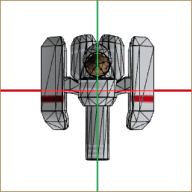
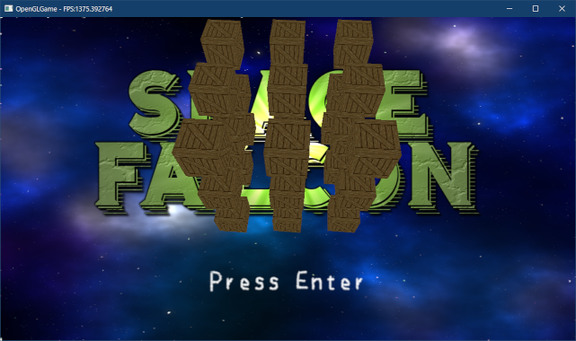

[OpenGL 3D 2022 第08回]

# 座標系とカメラとOBJファイル

## 習得目標

* さまざまな座標系が存在し、座標系によって用途が異なる理由を説明できる。
* 深度値の計算、および視野角の計算の必要性を説明できる。
* 基本的なOBJファイルを書くことができる。
* `sscanf`関数を使って、テキストファイルからデータを読み取ることができる。

## 1. 座標系とカメラ

### 1.1 さまざまな座標系

コンピューター・グラフィックスでは、用途に応じてさまざまな座標系を使い分けます。「座標系」とは「座標を定めるためのルール」です。このルールには「原点の位置」「距離の単位」「軸の数と方向」などが含まれます。

例えば、2Dゲームでは以下のような3種類の座標系を扱います。

<p align="center">
<br>
[ワールド座標系]&emsp;&emsp;&emsp;
[クリップ座標系]&emsp;&emsp;&emsp;
[スクリーン座標系]
</p>

* ワールド座標系:<br>
わたしたちが物体の表示位置を決めるときに使います。ワールド座標系には、表示範囲の制限がありません。

* クリップ座標系:<br>
GPUが物体の憑依位置を決めるときに使います。表示範囲は-1～+1で、変更することはできません。表示範囲を超えた位置のデータを切り捨てるための座標系

* スクリーン座標系:<br>
GPUが実際の表示範囲を決めるときに使います。表示範囲は`glViewport`関数を使って設定します。

2Dゲームの場合、人間が扱うワールド座標系からGPUが理解できるクリップ座標系へと変換すれば、それ以上何もする必要はありませんでした。

また、2Dゲームのワールド座標系の単位は「ピクセル」です。そのため、同じく「ピクセル」を単位とするスクリーン座標系は、ワールド座標系と同じものとして扱うことができました。

しかし本当は、上記の3つ以外にさまざまな座標系が隠れています。それらの座標系は、2Dゲームでは他の座標系と同じルールになるので変換の必要がありません。そのため、表に出てこなかったのです。

3Dモデルを表示するには、これまで隠れていたさまざまな座標系についても理解しなければなりません。

以下の図は、コンピューター・グラフィックスで使われる一般的な座標系とその関係を表しています。それぞれの座標系が、異なる原点と軸を持っていることに注目してください。

<p align="center">




<br>
[ローカル座標系]&emsp;&emsp;&emsp;&emsp;
[ワールド座標系]&emsp;&emsp;&emsp;&emsp;&emsp;
[ビュー座標系]&emsp;&emsp;&emsp;<br>
<br>


<br>
[クリップ座標系]&emsp;&emsp;&emsp;&emsp;
[正規化デバイス座標系]&emsp;&emsp;&emsp;
[スクリーン座標系]
</p>

* **ローカル座標系**<br>
3Dモデルを定義する座標系です。モデル座標系、オブジェクト座標系とも呼ばれます。一般的に、頂点シェーダの入力はこの座標系になります。原点は、3Dモデルの中心か足元とされることが多いです。2Dゲームの場合、回転、拡大縮小を行ったり、ゲームオブジェクトに複数の画像を貼り付けたりするときに登場します。それらを行わない場合は登場しません。

* **ワールド座標系**<br>
3Dモデル同士の位置関係を定義する座標系です。原点はシーンの中心とされることが多いです。ローカル座標系からワールド座標系への変換は「モデル変換」または「ワールド変換」と呼ばれます。2Dゲームと3Dゲームの両方にとって、もっとも重要な座標系になります。

* **ビュー座標系**<br>
視点を基準とする座標系です。カメラ座標系、視点(Eye)座標系とも呼ばれます。原点は視点の座標になります。ワールド座標系からビュー座標系への変換は「ビュー変換」と呼ばれます。多くの2Dゲームでは、カメラの位置と向きが固定されていることから、ビュー座標系を飛ばして直接クリップ座標系へと変換するほうが効率的です。そのため、表に見えることは少ないです。

* **クリップ座標系**<br>
クリッピングという、画面に映らない部分を除去する処理のための座標系です。頂点シェーダ(テッセレータやジオメトリシェーダも使う場合、それらの中で最後に実行されるシェーダ)から出力される座標は、この座標系で定義されていなければなりません。ビュー座標系からクリップ座標系への変換は「プロジェクション変換」と呼ばれます。GPUが直接扱えるのはこの座標系だけなので、2Dでも3Dでも意識せざるを得ません。

* **正規化デバイス(NDC)座標系**<br>
クリップ座標系のX,Y,Z要素をW要素で除算した座標系です。この変換はクリッピングの直後に行われ、PAへの入力になります。英語の頭文字(Normalized Device Coordinates)から、NDC座標系とも呼ばれます。<br>
頂点座標を正規化デバイス座標系に変換したとき、XYZのいずれかの要素が1より大きいか、または-1より小さい場合は描画がスキップされます。画面外の頂点を描画するのは無駄だからです。クリップ座標系から正規化デバイス座標系への変換は`GPU`が自動的に行います。そのため、この変換には特に名前はありません。<br>
2Dゲームの場合、クリップ座標系の`w`要素は常に`1`です。座標を`1`で除算しても結果は変わらないため、正規化デバイス座標系を意識することはありません。

* **スクリーン座標系**<br>
フレームバッファ上の座標系です。ウィンドウ座標系とも呼ばれます。OpenGLでは左下が原点です。ここまでの座標系は3D座標(2Dは3Dの特殊ケース)を扱いましたが、スクリーン座標系は2Dの座標系になります。3Dの正規化デバイス座標系から2Dスクリーン座標系への変換は`GPU`が自動的に行います。そのため、この変換には特に名前はありません。

このように多くの座標系を扱わなくてはならない理由は、それぞれの座標系ごとに、得意な座標の操作、苦手な座標の操作が存在するためです。例えば、物体の向きや大きさを変更するにはローカル座標系が適しています。

一方で、カメラから見た景色を扱うにはビュー座標系が、「画面外」を判定するにはクリップ座標系が適しています。

>ある座標系で定義された座標を、別の座標系で表される座標に変換する操作を「座標変換」といいます。

### 1.2 右手座標系と左手座標系

ここまでは、目的に応じた座標系を説明してきました。それとは別に、各軸の向きに注目した座標系の分類があります。それが、前回も少し説明した「右手座標系」と「左手座標系」です。

これは、親指に+X軸、人差し指に+Y軸、中指に+Z軸を割り当てた時、ある座標系がどちらの手で表現できるかを示します。

<p align="center">

</p>

OpenGLでは伝統的に右手座標系が使われます。右手座標系は数学で一般的な座標系だからです。ところが、クリップ座標系から先、つまりフラグメントシェーダーでは左手座標系が使われます。GPUにとっては、左手座標系ほうが扱いやすいからです。

このため、OpenGLの頂点シェーダーは、通常の座標変換に加えて右手座標系と左手座標系の変換も行う必要があります。幸いなことに、右手座標系と左手座標系の変換はZ座標の符号を逆にするだけです。

>**【最初から左手座標系を使うわけにはいかないの？】**<br>
>可能です。実際、そのほうが座標変換は分かりやすくなるでしょう。しかし、現代のGPUは左手座標系を採用するDirectXとともに発展してきましたが、OpenGLはそれ以前から右手座標系を採用していました。<br>
そうした歴史的背景から、既存のOpenGL用プログラムやライブラリは、ほとんどが右手座標系を採用しています。そのため、右手座標系を使うほうがライブラリを利用しやすくなります。もちろん、既存の資産を捨て去り、全てのプログラムを自分で作り上げるつもりなら、どちらでも好きな座標系を使うことができます。

### 1.3 深度テストを有効にする

一枚板が回転するだけでは立体感が足りませんね。もう少しデータを追加してみましょう。プリミティブバッファの表示テスト用のデータを、次のように変更してください。

```diff
   // プリミティブバッファの表示テスト用データを追加
   {
     const Mesh::Vertex vertices[] = {
-      { { -1, -1,  0 }, { 0, 0 } },
-      { {  1, -1,  0 }, { 1, 0 } },
-      { {  1,  1,  0 }, { 1, 1 } },
-      { { -1,  1,  0 }, { 0, 1 } },
+      { { -1, -1,  1 }, { 0, 0 } },
+      { {  1, -1,  1 }, { 1, 0 } },
+      { {  1,  1,  1 }, { 1, 1 } },
+      { { -1,  1,  1 }, { 0, 1 } },
+
+      { {  1, -1, -1 }, { 0, 0 } },
+      { { -1, -1, -1 }, { 1, 0 } },
+      { { -1,  1, -1 }, { 1, 1 } },
+      { {  1,  1, -1 }, { 0, 1 } },
     };
     const uint16_t indices[] = {
       0, 1, 2, 2, 3, 0,
+      4, 5, 6, 6, 7, 4,
     };
     primitiveBuffer->AddPrimitive(
```

データを変更したら、ビルドして実行してください。2枚の平面が表示されていたら成功です。ですが、見え方がすこし変です。奥にあるはずの平面が、手前の平面を透かして見えてしまっています。

<p align="center">

</p>

奥にあるはずの平面が透けて見えるのは、OpenGLがインデックスデータを前から順番に描画し、ピクセルは「描いた順番で上書き」されるためです。OpenGLの初期設定では、空間における前後関係は一切考慮されないのです。

OpenGLで前後関係を考慮させるには「深度テスト」を有効にする必要があります。`MainLoop`
関数にある「3Dモデルの表示テスト」プログラムに、次のプログラムを追加してください。

```diff
     {
       glUseProgram(*progStandard3D);
       glBindVertexArray(*primitiveBuffer->GetVAO());
+
+      glEnable(GL_DEPTH_TEST); // 深度テストを有効化

       // アスペクト比をユニフォーム変数にコピー
       int w, h;
```

`glEnable`(ジーエル・イネーブル)関数は、指定されたOpenGLコンテキストの機能を有効にします。

<p><code class="tnmai_code"><strong>【書式】</strong><br>
void glEnable(機能を表すマクロ定数);
</code></p>

深度テストを示すマクロ定数は`GL_DEPTH_TEST`(ジーエル・デプス・テスト)です。

#### - 深度テストと深度バッファ -

ピクセルの深度値(奥行き方向の位置をあらわす値)は、自動的に「深度バッファ」に書き込まれます。深度バッファの縦横サイズはカラーバッファと同じで、画面に表示される各ピクセルの深度値が記録されます。

深度テストを有効にすると、以前の描画で書き込まれた深度バッファの値と、これから書き込もうとするピクセルの深度値が比較されるようになります。

比較の結果、「これから書き込もうとするピクセルの深度値」のほうが手前にあると判断された場合のみ、ピクセルが書き込まれます。その結果、ピクセル単位の前後関係が正しく処理されるという仕組みです。

ところで、OpenGLコンテキストの設定が自動的にもとに戻ることはありません。そのため、スプライトを描画するときは深度テストを無効に戻しておく必要があります。スプライトを描画するプログラムに、次のプログラムを追加してください。

```diff
     // 描画に使うシェーダを指定
     glUseProgram(*progSprite);
+
+    glDisable(GL_DEPTH_TEST); // 深度テストを無効化

     // アルファブレンドを有効化
     glEnable(GL_BLEND);
```

プログラムが書けたらビルドして実行してください。・・・何も表示されませんね？

<p align="center">

</p>

### 1.4 深度値の計算方法を改善する

実は、深度テストを有効にしただけでは意図した描画結果になりません。第06回テキストでは、「GPUはラスタライゼーション(RS)ステージで以下の計算を行う」として、次の式を紹介しました。

`gl_Position /= gl_Position.w`

深度バッファには、この計算を行った後の深度値(Z値)が記録されます。

また、`gl_Position.z`と`gl_Position.w`の値は頂点シェーダにおいて、次のように設定したのでした。

```c++
gl_Position.zw = -outPosition.zz;
```

見てのとおり、`gl_Position.z`と`gl_Position.w`の両方に`-outPosition.z`を設定しています。当然ですが、`-outPosition.z / -outPosition.z`の結果は常に`1`になります(`z`がゼロの場合を除く)。

深度テストは「深度バッファの値と、描画するピクセルの深度値を比較する」ことで行われるため、深度値の計算結果が常に`1`になってしまうと、比較する意味がなくなってしまいます。

そこで、計算結果が深度値によって異なるように、`gl_Position.z`に設定する値を調整する必要があります。

この方法では、次の2つの段階を踏んで深度値を補正します。

>1. 「奥行き(Z軸)方向の描画範囲」を決める。手前側の境界を`near`(ニア)、奥側の境界を`far`(ファー)とする。
>2. 計算結果について、深度値が`near`と等しい場合に`-1`、`far`と等しい場合に`1`となるような計算式を求める。

1の「奥行方向の描画範囲」は、例えば`near=1m`、`far=1000m`のように設定します。

>深度バッファの最適な範囲はゲーム内容によって異なります。手前側をできるだけ遠くに設定するのが定石です。そうすることで、深度バッファのビット数を効率的に利用できます。

OpenGLの深度バッファは最小値(手前)が`-1`、最大値(奥)が`+1`となります。そこで、深度値が`near`のとき`-1`、`far`のとき`+1`となるような計算式を求めます。

これは、定数`A`と`B`があるとして、次の条件を満たす式を求めるということです。

`-1 <= (A * 深度値 + B) <= +1`

しかし、実際には深度値ではなく、`gl_Position.w`で除算したものが計算結果になります。
`w`は深度値そのものなので、正しい式は次のようになります。

`-1 <= (A / 深度値 + B) <= +1`

そして、深度値が`near`のとき`-1`、`far`のとき`+1`になるのですから、

`A / near + B = -1` ...①<br>
`A / far + B = 1` ...②

を満たす`A`と`B`を求めればよいことになります。まず`A`を求めるために`B`を消去します。これは②-①とすれば求められます。

>```c++
>(A / far + B) - (A / near + B) = 2
>
>Bを消し、Aを共通因数としてくくり出す
>A * (1 / far - 1 / near) = 2
>
>両辺を(1 / far - 1 / near)で割る
>A = 2 / (1 / far - 1 / near)
>
>1/farと1/nearを通分
>A = 2 / ((near / far * near) - far / near * far))
>
>整理する
>A = 2 / ((near - far) / (far * near))
>A = 2 * far * near / (near - far)
>```

そして、`B`を求めるには①(または②)に`A`を代入します。

>```c++
>(2 * far * near / (near - far)) / near + B = -1
>
>整理する
>(2 * far / (near -far)) + B = -1
>
>両辺から(2 * far / (near - far))を引く
>B = -1 - (2 * far / (near - far))
>
>-1を通分
>B = (-(near - far) - 2 * far) / (near - far)
>B = (-far - near) / (near - far)
>
>右辺の分子分母に-1を掛けて整理する
>B = -(-far - near) / -(near - far)
>B = (far + near) / (far - near)
>```

最後に、`A`と`B`の分母を合わせるために、`A`の式を次のように変形します。

>```c++
>A = 2 * far * near / (near - far)
>
>右辺の分子分母に-1を掛けて整理する
>A = -2 * far * near / -(near - far)
>A = -2 * far * near / (far - near)
>```

これで`A`と`B`を求めることができました。それから、最終的な計算結果は

`gl_Position.z / gl_Position.w`

になるので、頂点シェーダで`gl_Position.z`に値を設定するには少し工夫が必要です。
`gl_Position.z`に設定する値は、次のように式を変形することで求められます。

```c++
gl_Position.z / gl_Position.w = A / outPosition.z + B

両辺にgl_Position.wを掛ける
gl_Position.z = A + B * gl_Position.w

ここでgl_Position.w = -outPosition.zなので
gl_Position.z = A + B * -outPosition.z

順番を整理すると
gl_Position.z = -outPosition.z * B + A
```

それでは、`A`と`B`の値を使って深度値の計算を修正しましょう。`standard_3D.vert`を開き、`gl_Position`の計算を次のように変更してください。

```diff
   // 平行移動
   outPosition += translate;

   outTexcoord = inTexcoord * vec2(1, -1) + vec2(0, 1);
+
+  // 深度値の計算結果が-1～+1になるようなパラメータA, Bを計算
+  const float near = 0.5;
+  const float far = 1000;
+  const float A = -2 * far * near / (far - near);
+  const float B = (far + near) / (far - near);
+
   gl_Position.x = outPosition.x * invAspect; // 縦横比を補正
   gl_Position.y = outPosition.y;
-  gl_Position.zw = -outPosition.zz;
+  gl_Position.z = -outPosition.z * B + A; // 深度値を補正
+  gl_Position.w = -outPosition.z;
 }
```

プログラムが書けたらビルドして実行してください。2枚の平面が表示され、奥にある平面が透けなくなっていたら成功です。

<p align="center">

</p>

### 1.5 視野角を設定する

3Dにおいて、画面に表示する範囲を決めるパラメータは`near`と`far`だけではありません。もうひとつ「視野角(しやかく)」と呼ばれるパラメータが存在します。

視野角は名前のとおり、視野、つまり画面に映る領域の角度を決めるものです。カメラを触ったことがある方であれば「画角」という単語を聞いたことがあるかもしれません。画角と視野角はほぼ同じものです。

一般に、視野角はX,Y座標の拡大率として表現されます。視野角を狭くするとX, Y座標が拡大されるため、画面に映る範囲が狭くなります。これはズームレンズと同じ効果です。

逆に視野角を広くすると、X, Y座標が縮小されて広い範囲が描画されるので、広角レンズで撮影したような画面になります。

視野角を拡大率に変換するには`tan`(タンジェント)を使います。

<p align="center">
<br>
[視野角θとZ値の拡大率<code>Z*tan(θ/2)</code>の関係]
</p>

一般的に、視野角には左右を合わせた角度を指定します。そのため、`tan`の引数は「視野角/2」になります。`Z*tan(θ/2)`は、視野角を考慮したX, Y座標の除算値です。

`-outPosition.z`のかわりに`-outPosition.z*tan(θ/2)`によってX, Y座標を除算することで、視野角を考慮した遠近法になります。遠近法適用後の座標を`xy'`とすると、式は

`xy' = gl_Position.xy / (gl_Position.w * tan(θ/2))`

となります(`Z`が`gl_Position.w`に変わっているのは、`-outPosition.z`が代入されているため)。ただ、GPUが行うのはあくまで`gl_Position.w`で除算することだけです。そこで式を次のように変形します。

`xy' = (gl_Position.xy / tan(θ/2)) / gl_Position.w`

このようにすることで、`gl_Position.xy / tan(θ/2)`の部分を先に計算することができます。それでは`standard_3D.vert`を開き、`gl_Position`の計算を次のように変更してください。

```diff
   const float far = 1000;
   const float A = -2 * far * near / (far - near);
   const float B = (far + near) / (far - near);
+
+  // 垂直視野角(ラジアン)
+  const float fovY = 60;
+  const float rad = fovY * acos(-1) / 180;
+  const float invTanHalfFovY = 1 / tan(rad / 2);

-  gl_Position.x = outPosition.x * invAspect; // 縦横比を補正
-  gl_Position.y = outPosition.y;
+  gl_Position.x = outPosition.x * invAspect * invTanHalfFovY;
+  gl_Position.y = outPosition.y * invTanHalfFovY;
   gl_Position.z = -outPosition.z * B + A;
   gl_Position.w = -outPosition.z;
```

視野角θは`fovY`(エフオーブイ・ワイ)変数で指定しています。`fov`は`field of view`(フィールド・オブ・ビュー、「視野角」という意味)の短縮形で、`Y`はY軸方向の視野角であることを表しています。

視野角には「水平視野角」と「垂直視野角」があり、どちらかが決まれば、他方はアスペクト比から計算できます。

`rad`(ラッド)は`radian`(ラジアン、弧度法)の短縮形です。三角関数は弧度法(ラジアン)で角度を指定する必要があるので、度数法である`fovY`の値を変換しています。

`invTanHalfFovY`(インブ・タン・ハーフ・エフオーブイ・ワイ)は、式をそのまま名前にしたものです。`inv`は逆数`inverse`(インバース)の短縮形です。

プログラムが書けたらビルドして実行してください。視野角を90°から60°に<ruby>狭<rt>せば</rt></ruby>めたので、図形が少し拡大気味に表示されるはずです。

なお、垂直視野角60°のときの水平視野角は、画面サイズが1280x720の場合、約107°となります(`60 * 1280 / 720 = 107`)。FPSタイプのゲームでは水平視野角を設定することが多いので、こちらを基準として採用するのも悪くない考えです。

<p align="center">

</p>

「深度値の変換」と「視野角の変換」は、合わせて「投影変換(とうえいへんかん)」または「射影変換(しゃえいへんかん)」と呼ばれます。

>**【透視投影と平行投影】**<br>
>3Dモデルの表示のように「視点からの距離によって見かけの大きさが変化する」ような変換を「透視投影変換」と呼びます。また、2Dスプライトのように「視点からの距離が違っても大きさは変わらない」変換は「平行投影変換」と呼ばれます。

### 1.6 裏面カリング

2D画像と異なり、多くの3Dモデルは厚みを持ちます。これは、どの方向から見ても、手前と奥の両方にプリミティブが存在することを意味します。

この場合、奥側のプリミティブは常に手前にプリミティブによって遮られるので、画面に表示されることはありません。表示されないプリミティブを描画するのは無駄なので、奥側のプリミティブを描画しない設定が存在します。

それが「裏面(りめん)カリング」です。裏面カリングという名前は、「裏向きのプリミティブは表示しない」という動作から来ています(奥側のプリミティブは常に裏向きになるため)。

裏面カリングを有効にするには、`glEnable`関数の引数に`GL_CULL_FACE`(ジーエル・カル・フェイス)を指定します。`Engine.cpp`を開き、3Dモデルの表示テストを行うプログラムに次のプログラムを追加してください。

```diff
       glBindVertexArray(*primitiveBuffer->GetVAO());

       glEnable(GL_DEPTH_TEST); // 深度テストを有効化
+      glEnable(GL_CULL_FACE);  // 裏面カリングを有効化

       // アスペクト比をユニフォーム変数にコピー
       int w, h;
```

深度テストと同じく、裏面カリングの設定もスプライト描画前にはもとに戻しておく必要があります。スプライトを描画するプログラムに、次のプログラムを追加してください。

```diff
     // 描画に使うシェーダを指定
     glUseProgram(*progSprite);

     glDisable(GL_DEPTH_TEST); // 深度テストを無効化
+    glDisable(GL_CULL_FACE);  // 裏面カリングを無効化

     // アルファブレンドを有効化
     glEnable(GL_BLEND);
```

プログラムが書けたらビルドして実行してください。奥側の平面が表示されず、手前に来た平面だけが表示されていたら成功です。

>**【表裏の判定方法】**<br>
>描画する三角形を構成する3つの頂点が、画面上で反時計回りの順番になっていたら表、時計回りになっていたら裏と判定されます。

<pre class="tnmai_assignment">
<strong>【課題01】</strong>
表示テスト用の頂点データとインデックスデータに左右の平面を追加し、上から見て□の形になるようにしなさい。以下に立方体の座標を示しますので参考にしてください。
<p align="center"></p></pre>

### 1.7 シェーダにビュー変換を追加する

プリミティブがひとつだけでは3D空間という雰囲気が足りませんね。ちょっと、表示するプリミティブの数を増やしましょう。3Dモデルの表示テストを行うプログラムに、次のプログラムを追加してください。

```diff
       const GLuint tex[] = { *texBox };
       glBindTextures(0, 1, tex);
+      for (float x = 0; x < 3; ++x) {
+        glProgramUniform3f(*progStandard3D, 0,
+          x * 4 - 4, 0, -12);
         Mesh::Draw(primitiveBuffer->GetPrimitive(0));
+      }

       glBindTextures(0, 1, nullptr);
       glBindVertexArray(0);
       glUseProgram(0);
```

プログラムが書けたらビルドして実行してください。3つの箱が表示されていたら成功です。

<p align="center">

</p>

<pre class="tnmai_assignment">
<strong>【課題02】</strong>
X軸方向に加えて、Y軸方向に3列、Z軸方向に3列、合計で27個の箱を表示しなさい。
中心の箱の座標は(x=0, Y=0, z=-12)で、Y軸とZ軸の箱同士の間隔は、X軸と同じ4mにすること。
<p align="center"></p></pre>

<pre class="tnmai_assignment">
<strong>【課題03】</strong>
表示テスト用データに上下の平面を追加し、箱を完成させなさい。
<p align="center"></p></pre>

3D空間の特徴のひとつに、「視点(カメラ)を自由に動かせる」ことが挙げられます。もっとも、実際のゲームでは完全な自由はなく、ある程度制限されているものです。

>以後は、視点のことを「カメラ」と呼ぶことにします。カメラのように物理的に存在するモノのほうが、「視点」という抽象的な言葉よりも想像しやすいと考えられるからです。

例えば、2Dシューティングを3D化したゲームでは、カメラは上から見下ろすような位置にあり、イベントシーンなどをのぞいて大きく動くことはありません。

しかし、カメラから見た画像を作り出すプログラムは、カメラが大きく動く場合でも、ほとんど動かない場合でも同じようなプログラムを書く必要があります。

というのは、「カメラの動きを制御するプログラム」と、「カメラの位置と向きから画面を作り出すプログラム」は独立したものだからです。

現在、本テキストの目的は「2Dシューティングゲーム3D化する」ことなので、カメラの動きはあまり考える必要はありません。しかし、後者の「カメラの位置と向きから画面を作り出すプログラム」は作成する必要があります。

「カメラの位置と向きから画面を作り出す」ことを「ビュー変換」といいます。ビュー変換は

>ワールド座標系の頂点の座標を、カメラから見た相対座標に変換する

処理のことです。

ビュー変換は頂点座標を操作するので、頂点シェーダに追加するのが適切です。
`standard_3D.vert`を開き、ビュー変換に必要なユニフォーム変数を追加してください。

```diff
 layout(location=1) uniform vec2 sincos;
 layout(location=2) uniform vec3 scale;
 layout(location=3) uniform float invAspect; // アスペクト比の逆数
+layout(location=4) uniform vec3 cameraPosition; // カメラの座標
+layout(location=5) uniform vec2 cameraSinCosX;  // カメラのX軸回転

 void main()
 {
```

続いて、カメラから見た画面になるように頂点座標を変換します。これは次の2段階の処理で実行します。

>1. 「カメラ座標を原点とする位置」に移動。これは、座標からカメラの位置を引くことで実現できる。
>2. 1で移動した座標を「カメラの右方向がX軸、正面がZ軸」となるように回転。これは、カメラの回転(↺)と逆方向(↻)に回転させることで実現できる。

それでは、`outPosition`を計算するプログラムの下に、次のプログラムを追加してください。

```diff
   // 平行移動
   outPosition += translate;
+
+  // カメラ座標が原点となるように平行移動
+  pos = outPosition - cameraPosition;
+
+  // カメラの右方向がX軸、正面がZ軸となるように回転
+  s = -cameraSinCosX.x; // 回転方向を反時計回りから時計回りに変換
+  c = cameraSinCosX.y;
+  outPosition.x = pos.x;
+  outPosition.y = pos.z * -s + pos.y * c;
+  outPosition.z = pos.z * c + pos.y * s;

   outTexcoord = inTexcoord * vec2(1, -1) + vec2(0, 1);

   // 深度値の計算結果が-1～+1になるようなパラメータA, Bを計算
   const float near = 0.5;
```

ビュー変換を追加したことで、座標変換の流れは

>ローカル座標系→ワールド座標系→ビュー(カメラ)座標系→クリップ座標系

となりました。これが座標変換の完成形です。

### 1.8 カメラオブジェクトを追加する

次に、ビュー変換に必要となる「カメラの位置や向き」を用意します。カメラはゲームオブジェクトとして管理したいのですが、現在の`GameObject`クラスには三次元の姿勢を表現する能力が不足しています。

そこで、`GameObject`クラスにZ座標と回転情報を追加します。`GameObject.h`を開き、
`GameObject`クラスの定義に次のプログラムを追加してください。

```diff
   std::string name;            // オブジェクト名
   float x = 0;                 // X座標
   float y = 0;                 // Y座標
+  float z = 0;                 // Z座標
+  float rotation[3] = { 0, 0, 0 }; // 回転
   int priority = 0;            // 表示優先順位
   ComponentList componentList; // コンポーネント配列
```

次に`Engine.h`を開き、`Engine`クラスの定義にカメラを表す変数を追加してください。

```diff
   // 3Dモデル用の変数
   ProgramPipelinePtr progStandard3D;
   Mesh::PrimitiveBufferPtr primitiveBuffer;
+  GameObjectPtr cameraObject;

   ScenePtr scene; // 実行中のシーン
   ScenePtr nextScene; // 次のシーン
```

続いて`Engine.cpp`を開き、`Initialize`メンバ関数にある「3Dモデル用のバッファを作成」するプログラムの下に、次のプログラムを追加してください。

```diff
   // 3Dモデル用のバッファを作成
   primitiveBuffer = Mesh::PrimitiveBuffer::Create(
     sizeof(Mesh::Vertex) * 100'000, sizeof(uint16_t) * 300'000);
+
+  // メインカメラを作成
+  cameraObject = Create<GameObject>("Main Camera");
+  cameraObject->y = 15;
+  cameraObject->rotation[0] =
+    -60.0f * acos(-1.0f) / 180.0f; // カメラを斜め下に向ける

   // プリミティブバッファの表示テスト用データを追加
   {
```

次に`UpdateGameObject`メンバ関数に、次のプログラムを追加してください。

```diff
       list.begin() + prevListSize,
       [](const GameObjectPtr& e) { return e.get(); });
   }
+
+  // カメラオブジェクトを追加
+  if (cameraObject) {
+    list.push_back(cameraObject.get());
+  }

   // Startイベント
   for (auto e : list) {
```

最後に、`MainLoop`メンバ関数の「3Dモデルの表示テスト」プログラムに、次のプログラムを追加してください。

```diff
       glfwGetWindowSize(window, &w, &h);
       const float aspect = static_cast<float>(w) / h; // アスペクト比
       glProgramUniform1f(*progStandard3D, 3, 1.0f / aspect);
+
+      // 3D表示用のカメラ情報を設定
+      glProgramUniform3f(*progStandard3D, 4,
+        cameraObject->x, cameraObject->y, cameraObject->z);
+      glProgramUniform2f(*progStandard3D, 5,
+        sin(cameraObject->rotation[0]), cos(cameraObject->rotation[0]));

       static TexturePtr texBox = Texture::Create("Res/box.tga");
       static float rotate = 0;
```

プログラムが書けたらビルドして実行してください。箱を上から見下ろすような表示になっていたら成功です。

<p align="center">

</p>

### 1.9 カメラコンポーネントを作成する

今度は、視野角による拡大率や深度値のパラメータを、C++プログラムから変更できるようにします。そのために、「カメラコンポーネント」を作成します。

プロジェクトの`Src/Component`フォルダに`Camera.h`という名前のヘッダファイルを追加してください。追加したファイルを開き、次のプログラムを追加してください。

```diff
+/**
+* @file Camera.h
+*/
+#ifndef COMPONENT_CAMERA_H_INCLUDED
+#define COMPONENT_CAMERA_H_INCLUDED
+#include "../Component.h"
+#include <math.h>
+
+/**
+* カメラコンポーネント
+*/
+class Camera : public Component
+{
+public:
+  Camera() = default;
+  virtual ~Camera() = default;
+
+  virtual void Update(GameObject& gameObject, float deltaTime) override
+  {
+    // 遠近法パラメータA, Bを計算
+    A = -2 * far * near / (far - near);
+    B = (far + near) / (far - near);
+
+    // 視野角による拡大率を計算
+    const float rad = fovY * acos(-1.0f) / 180;
+    fovScaleY = 1 / tan(rad / 2);
+    fovScaleX = aspect * fovScaleY;
+  }
+
+  float near = 1;   // 近平面
+  float far = 1000; // 遠平面
+  float fovY = 60;  // 視野角
+  float aspect = 9.0f / 16.0f; // アスペクト比
+
+  // ユニフォーム変数に設定するパラメータ
+  float fovScaleX = 1;  // 視野角による拡大率
+  float fovScaleY = 1;  // 視野角による拡大率
+  float A = 0.01f;      // 遠近法パラメータA
+  float B = 0.99f;      // 遠近法パラメータB
+};
+
+#endif // COMPONENT_CAMERA_H_INCLUDED
```

`Update`関数では、ユニフォーム変数に送るためのパラメータを計算しています。これらはシェーダに書いた計算式と同じものです(シェーダ側の計算式はあとで消します)。

アスペクト比と拡大率はこの時点で乗算しておきます。

次に、作成したカメラコンポーネントをカメラオブジェクトに追加しましょう。
`Engine.cpp`を開き、`Camera.h`をインクルードしてください。

```diff
 #include "Texture.h"
 #include "Mesh.h"
 #include "VertexArray.h"
+#include "Component/Camera.h"
 #include <Windows.h>
 #include <fstream>
```

続いて、`Initialize`関数にある「メインカメラを作成」するプログラムに、次のプログラムを追加してください。

```diff
   cameraObject = Create<GameObject>("Main Camera");
   cameraObject->y = 15;
   cameraObject->rotation[0] = -60.0f * acos(-1.0f)/ 180.0f;
+  cameraObject->AddComponent<Camera>();

   // プリミティブバッファの表示テスト用データを追加
   {
```

それでは、カメラコンポーネントのパラメータをユニフォーム変数にコピーしましょう。
`MainLoop`関数にある「アスペクト比をユニフォーム変数にコピー」するプログラムを、次のように変更してください。

```diff
     {
       glUseProgram(*progStandard3D);
       glBindVertexArray(*primitiveBuffer->GetVAO());
-
-      // アスペクト比をユニフォーム変数にコピー
-      int w, h;
-      glfwGetWindowSize(window, &w, &h);
-      const float aspect = static_cast<float>(w) / h; // アスペクト比
-      glProgramUniform1f(*progStandard3D, 3, 1.0f / aspect);

       // 3D表示用のカメラ情報を設定
+      Camera& camera = static_cast<Camera&>(*cameraObject->componentList[0]);
+      glProgramUniform4f(*progStandard3D, 3,
+        camera.fovScaleX, camera.fovScaleY, camera.A, camera.B);
       glProgramUniform3f(*progStandard3D, 4,
         cameraObject->x, cameraObject->y, cameraObject->z);
```

最後にシェーダを変更します。`standard_3D.vert`を開き、ユニフォーム変数の定義を次のように変更してください。

```diff
 layout(location=0) uniform vec3 translate;
 layout(location=1) uniform vec2 sincos;
 layout(location=2) uniform vec3 scale;
+
+// x: 視野角による水平拡大率
+// y: 視野角による垂直拡大率
+// z: 遠近法パラメータA
+// w: 遠近法パラメータB
-layout(location=3) uniform float invAspect; // アスペクト比の逆数
+layout(location=3) uniform vec4 cameraData;
+
 layout(location=4) uniform vec3 cameraPosition; // カメラ座標
 layout(location=5) uniform vec2 cameraSinCosX;  // カメラX軸回転
```

次に、ユニフォーム変数を使っているプログラムを、次のように変更してください。

```diff
   outPosition.z =  pos.z * c + pos.y * s;

   outTexcoord = inTexcoord * vec2(1, -1) + vec2(0, 1);
-
-  // 深度値の計算結果が-1～+1になるようなパラメータA, Bを計算
-  const float near = 0.5;
-  const float far = 1000;
-  const float A = -2 * far * near / (far - near);
-  const float B = (far + near) / (far - near);
-
-  // 垂直視野角(ラジアン)
-  const float fovY = 60;
-  const float rad = fovY * acos(-1) / 180;
-  const float invTanHalfFovY = 1 / tan(rad / 2);

-  gl_Position.x = outPosition.x * invAspect * invTanHalfFovY;
-  gl_Position.y = outPosition.y * invTanHalfFovY;
-  gl_Position.z = -outPosition.z * B + A;
+  gl_Position.x = outPosition.x * cameraData.x;
+  gl_Position.y = outPosition.y * cameraData.y;
+  gl_Position.z = -outPosition.z * cameraData.w + cameraData.z;
   gl_Position.w = -outPosition.z;
```

プログラムが書けたらビルドして実行してください。計算をシェーダからカメラコンポーネントに移しただけなので、見た目は変わらないはずです。

<p align="center">

</p>

>**【1章のまとめ】**
>
>* 座標系は「座標を定めるためのルール」。
>* ローカル座標系、ワールド座標系、ビュー座標系、クリップ座標系、NDC座標系、スクリーン座標系といったさまざまな座標系があり、用途に応じて使い分ける。
>* 深度バッファにはピクセルの奥行き座標が記録される。深度バッファを有効にすると、ピクセルの前後関係が正しく判定されるようになる。
>* 画面に表示する範囲は「視野角」によって指定する。
>* 深度値と視野角の変換を合わせて「投影変換」という。
>* 多くの物体では裏面が描画されることはないので、「裏面カリング」を有効にして、裏面と判定されたポリゴンの描画をスキップするとよい。

<div style="page-break-after: always"></div>

## 2. OBJファイルを読み込む

### 2.1 ファイル形式の選択

箱の3Dモデルデータを作成したとき、「単純な立方体程度のモデルでも、手作業で頂点データやインデックスデータを定義するのは大変だ」と感じたのではないでしょうか。

しかし、世の多くの図形データは数千、数万の頂点データから作られています。そんな大量のデータを手作業で書くことは不可能、とは言いませんが非現実的です。

そのため、通常は図形作成用のアプリケーションを使います。このようなアプリは「3Dモデリングソフト」と呼ばれます。世の中にはさまざまな3Dモデリングソフトがあり、それぞれ価格や得意な分野が異なります。

ここで問題となるのは、ソフトによって作成されるデータの形式が異なることです。しかも、それらは3Dモデリングソフト自身が使うために設計されているため、ほかのアプリやOpenGLで使うことが難しいのです。

それでは不便なので、異なるアプリ間でデータをやり取りするための汎用形式が存在します。今回は汎用形式のひとつである`OBJ`(オブジェ)形式を扱います。

OBJ形式を選んたのは、仕様が小さくて比較的プログラミングが簡単なうえ、対応しているツールが多いからです。

>**【OBJ(オブジェ)形式について】**<br>
>Advanced Visualizer(アドバンスド・ビジュアライザ)というツールのために開発されたファイル形式です。仕様が非常に小さくまとまっていて扱いやすいのですが、標準では頂点カラーが定義できない、アニメーションを扱えないなどの制約があります。しかし、単純であること、仕様が公開されていること、定義された時期が古いために長く使われていることの3点から、ほとんどの3Dモデリングソフトが読み書きに対応しています。

### 2.2 OBJファイルを追加する

OBJファイルの仕様では、点・線・三角形に加えて多角形や曲線、曲面も定義できます。しかし、とりあえず必要なのは三角形の読み込み機能だけです。まずはこの機能を作成していきます。

OBJファイルの拡張子は`.obj`ですが、中身は単なるテキストファイルです。そのため、テキストエディタで中身を見たり編集することができます。ただ、`.obj`はありふれた名前なので、他の種類のファイルに使われていたりします。

例えば、Visual Studioはアプリをビルドするときの一時的なファイルとして、CPPファイルから拡張子が`.obj`のファイルを作成します(`x64/Debug`フォルダを見てみるとよいでしょう)。

そのため、Visual Studioプロジェクトに拡張子`.obj`のファイルを追加すると、3Dモデルファイルではなくビルド用のファイルだと認識されてしまいます。

Visual Studioプロジェクトには、3Dモデル用のOBJファイルを追加しないほうが無難でしょう。そんなわけなので、OBJファイルを作成するにはWindowsの「エクスプローラー」を使うことになります。

「エクスプローラー」でプロジェクトの`Res`フォルダを開き、`box.obj`という名前の新規ファイルを追加してください(「ホーム→新しいアイテム→テキストドキュメント」を選択)。

>**【Visual Studioからプロジェクトフォルダを開く】**<br>
>ソリューションエクスプローラーに表示されているプロジェクト名(ソリューションではない)を右クリックして、下のほうにある「エクスプローラーでフォルダーを開く」を選択すると、プロジェクトのフォルダを開くことができます。<br>
>また、開いているファイルのタブを右クリックして「このアイテムのフォルダーを開く」を選択すると、ファイルの置かれたフォルダを開くことができます。

`box.obj`を作成したら、「右クリック→プログラムから開く」を選択して「メモ帳」を選んでファイルを開いてください。

ファイルを開いたら、以下のテキストを入力してください。`v`で始まる行は頂点座標、`vt`で始まる行はテクスチャ座標、`f`で始まる行は平面のインデックスデータです。

>空白の有無に注意すること。

```diff
+# box.obj
+
+v -1 -1  1
+v  1 -1  1
+v  1  1  1
+v -1  1  1
+v  1 -1 -1
+v -1 -1 -1
+v -1  1 -1
+v  1  1 -1
+
+vt 0 0
+vt 1 0
+vt 1 1
+vt 0 1
+
+f 1/1 2/2 3/3 4/4
+f 5/1 6/2 7/3 8/4
+f 2/1 5/2 8/3 3/4
+f 6/1 1/2 4/3 7/4
+f 4/1 3/2 8/3 7/4
+f 2/1 1/2 6/3 5/4
```

OBJファイルには頂点データ用の構文と、インデックスデータ用の構文があります。頂点データは要素ごとに異なる配列として定義されます。頂点データの構文を次に示します。

>**v** *x y z*<br>
>&emsp;頂点の座標を定義します。`v`はvertexの頭文字です。<br>
>&emsp;`x`,`y`,`z`は頂点のX,Y,Z座標を表す浮動小数点数です。

>**vt** *u v*<br>
>&emsp;テクスチャ座標を定義します。`vt`はvertex textureの頭文字です。<br>
>&emsp;`u`,`v`は頂点のU, V座標を表す浮動小数点数です。

>**vn** *i j k*<br>
>&emsp;法線を定義します。`vn`はvertex normalの頭文字です。<br>
>&emsp;`i`,`j`,`k`は法線のX,Y,Z成分を表す浮動小数点数です。<br>
>&emsp;※法線については次回以降のテキストで説明します。

OBJファイルのインデックスデータは頂点データのインデックス番号の組として定義されます。OpenGLとは異なり、番号は1番から始まることに注意してください(0ではありません)。インデックスデータの構文を次に示します。

>**p** *v1*<br>
>&emsp;点を定義します。`p`はpointの頭文字です。<br>
>&emsp;`v1`は点を構成する頂点座標のインデックスです。<br>
>&emsp;OpenGLの`GL_POINTS`プリミティブに相当します。

>**l** *v1 v2 ... vN*<br>
>&emsp;直線を定義します。`l`はlineの頭文字です。<br>
>&emsp;`v1`, `v2`, ...`vN`は直線を構成する頂点座標のインデックスです。<br>
>&emsp;OpenGLの`GL_LINES`プリミティブに相当します。

>**f** *v1 v2 ... vN*<br>
>&emsp;平面を定義します。`f`はfaceの頭文字です。<br>
>&emsp;`v1`, `v2`, ...`vN`は平面を構成する頂点座標のインデックスです。<br>
>&emsp;OpenGLの`GL_TRIANGLES`プリミティブに相当します。

>**f** *v1/vt1 v2/vt2 ... vN/vtN*<br>
>&emsp;`f`のバリエーションで、頂点座標とインデックス座標の組を指定します。<br>
>&emsp;`vt1`, `vt2`, ...`vtN`は平面を構成するテクスチャ座標のインデックスです。<br>
>&emsp;頂点座標インデックスとテクスチャ座標インデックスの間はスラッシュ(`/`)で分離され<br>
>&emsp;ます(インデックス番号とスラッシュの間にスペースを入れてはいけません)。<br>
>&emsp;組のあいだはスペースで区切ります。

>**f** *v1/vt1/vn1 v2/vt2/vn2 ... vN/vtN/vnN*<br>
>&emsp;`f`のバリエーションで、頂点座標、テクスチャ座標、法線の組を指定します。<br>
>&emsp;`vn1`, `vn2`, ...`vnN`は平面を構成する法線のインデックスです。

>**f** *v1//vn1 v2//vn2 ... vn//vnN*<br>
>&emsp;`f`のバリエーションで、頂点座標、法線の組を指定します。<br>
>&emsp;テクスチャ座標のインデックス部分がなくなり、2個の`/`が連続します。

OpenGLのインデックスデータと異なり、OBJファイル・フォーマットでは頂点を構成する座標、テクスチャ座標、法線のインデックスを個別に指定します。そのため、テクスチャと法線が使える`f`構文は、データの有無によって書き方が変化します。

>**【OBJファイルのコメント行の書きかた】**<br>
>OBJファイルでは、コメント記号として`#`(シャープ)を使うことができます。`#`から行末まではコメントとして扱われます。

### 2.3 3Dモデル用の構造体を定義する

OBJファイルは頂点データとインデックスデータだけでなく、3Dモデルの材質を表す「マテリアル」を指定することもできます。

あとからマテリアルに対応できるように、3Dモデル用の新しい構造体を追加します。<br>
まず`Mesh.h`を開き、`string`ヘッダをインクルードしてください。

```diff
 #ifndef MESH_H_INCLUDED
 #define MESH_H_INCLUDED
 #include "glad/glad.h"
+#include <string>
 #include <vector>
 #include <memory>
```

次に、`PrimitiveBuffer`クラスの定義の下に、次の構造体を定義してください。

```diff
   size_t iboSize = 0;

   VertexArrayPtr vao;
 };
+
+/**
+* 3Dモデル
+*/
+struct StaticMesh
+{
+  std::string name;    // メッシュ名
+  std::vector<Primitive> primitives;
+};
+using StaticMeshPtr = std::shared_ptr<StaticMesh>;
+void Draw(const StaticMesh& mesh);

 } // namespace Mesh
```

ひとつのOBJファイルには、異なるマテリアルを使うプリミティブをいくつでも定義することができます。しかし、`glDrawElements`関数で使えるマテリアルは1種類だけです(一般的な実装の場合)。

そのため、マテリアルごとにプリミティブを定義し、プリミティブ単位で描画する必要があります。これに対応するため、`StaticMesh`(スタティック・メッシュ)構造体はプリミティブを配列で管理するようにしています。

>今はまだマテリアルに対応しないので、すぐに役に立つわけではないのですが…。

次に、`StaticMesh`を描画する関数を定義します。`Mesh.cpp`を開き、`Primitive`構造体用の`Draw`関数の定義の下に、次のプログラムを追加してください。

```diff
   glDrawElementsInstancedBaseVertex(prim.mode, prim.count,
     GL_UNSIGNED_SHORT, prim.indices, 1, prim.baseVertex);
 }
+
+/**
+* メッシュを描画する
+*/
+void Draw(const StaticMesh& mesh)
+{
+  for (const auto& prim : mesh.primitives) {
+    Draw(prim);
+  }
+}
 
 /**
 * コンストラクタ
```

### 2.4 StaticMeshを作成するクラスを定義する

次に、OBJファイルから`StaticMesh`を作成するクラスを定義します。<br>
クラス名は`MeshBuffer`(メッシュ・バッファ)としましょう。

さて、このクラスでは、OBJファイルの名前を使って`StaticMesh`を取得できるようにしようと思います。名前のような文字列とデータを関連付けて記録するには、`unordered_map`(アンオーダード・マップ)というクラスを使います。

そして、`unordered_map`クラスを使うには`unordered_map`ヘッダをインクルードする必要があります。`Mesh.h`を開き、`unordered_map`ヘッダをインクルードしてください。

```diff
 #include <string>
 #include <vector>
 #include <memory>
+#include <unordered_map>

 // 先行宣言
 class VertexArray;
```

それから先行宣言を追加します。`Mesh`名前空間の先行宣言に次のプログラムを追加してください。

```diff
 // 先行宣言
 class PrimitiveBuffer;
 using PrimitiveBufferPtr = std::shared_ptr<PrimitiveBuffer>;
+class MeshBuffer;
+using MeshBufferPtr = std::shared_ptr<MeshBuffer>;

 /**
 * 頂点データ
```

それでは、`MeshBuffer`クラスを定義しましょう。`StaticMesh`構造体の定義の下に、次のプログラムを追加してください。

```diff
 };
 using StaticMeshPtr = std::shared_ptr<StaticMesh>;
 void Draw(const StaticMesh& mesh);
+
+/**
+* メッシュを管理するクラス
+*/
+class MeshBuffer
+{
+public:
+  // メッシュバッファを作成する
+  static MeshBufferPtr Create(size_t vboCapacity, size_t iboCapacity) {
+    return std::make_shared<MeshBuffer>(vboCapacity, iboCapacity);
+  }
+
+  MeshBuffer(size_t vboCapacity, size_t iboCapacity);
+  ~MeshBuffer() = default;
+
+  StaticMeshPtr LoadOBJ(const char* filename);
+  VertexArrayPtr GetVAO() const;
+  void Clear();
+
+private:
+  PrimitiveBuffer primitiveBuffer;
+  std::unordered_map<std::string, StaticMeshPtr> meshes;
+};

 } // namespace Mesh
```

`unordered_map`型の宣言を次に示します。

<pre class="tnmai_code"><strong>【書式】</strong>
unordered_map&lt;キーの型, データの型&gt;
</pre>

今回の場合、ファイル名と`StaticMesh`を関連付けたいので、キーの型には`std::string`、データの型には`StaticMeshPtr`を指定しました。

`LoadOBJ`(ロード・オブジェ)メンバ関数は、OBJファイルを読み込んで`StaticMesh`を作成し、作成した`StaticMesh`を返します。

`Clear`(クリア)メンバ関数は、作成したすべての`StaticMesh`を削除します。

### 2.5 MeshBufferコンストラクタを定義する

クラス定義に続いて、メンバ関数を定義します。まずは必要なヘッダフィルをインクルードします。`Mesh.cpp`を開き、次のヘッダファイルをインクルードしてください。

```diff
 #include "Debug.h"
 #include <string>
 #include <vector>
+#include <algorithm>
+#include <filesystem>
+#include <fstream>
+#include <stdio.h>

 namespace Mesh {
```

それでは、`MeshBuffer`コンストラクタから定義していきましょう。
`PrimitiveBuffer::AddIndices`関数の定義の下に、次のプログラムを追加してください。

```diff
   iboSize += indexSize;

   return offset;
 }
+
+/**
+* コンストラクタ
+*
+* @param vboCapacity VBOの最大容量(バイト数)
+* @param iboCapacity IBOの最大容量(バイト数)
+*/
+MeshBuffer::MeshBuffer(size_t vboCapacity, size_t iboCapacity) :
+  primitiveBuffer(vboCapacity, iboCapacity)
+{
+}

 } // namespace Mesh
```

コンストラクタでは`primitiveBuffer`メンバ変数を初期化します。

### 2.6 LoadOBJ関数を定義する

次に、OBJファイルを読み込む`LoadOBJ`関数を定義します。`MeshBuffer`コンストラクタの定義の下に、次のプログラムを追加してください。

```diff
   primitiveBuffer(vboCapacity, iboCapacity)
 {
 }
+
+/**
+* OBJファイルを読み込む
+*
+* @param filename OBJファイル名
+*
+* @return filenameから作成したメッシュ
+*/
+StaticMeshPtr MeshBuffer::LoadOBJ(const char* filename)
+{
+  // 以前に読み込んだファイルなら、作成済みのメッシュを返す
+
+  // OBJファイルを開く
+
+  // OBJファイルを解析して、頂点データとインデックスデータを読み込む
+
+  // 読み込んだデータを、OpenGLで使えるデータに変換
+
+  // 変換したデータをプリミティブバッファに追加
+
+  // メッシュを作成
+
+  // 作成したメッシュを返す
+}

 } // namespace Mesh
```

関数には、OBJファイルを読み込むために必要な処理をコメントで記しています。

### 2.7 unordered_mapを使ってファイル名を比較する

ここからは、これらの処理をひとつひとつ作成していきます。まず「以前に読み込んだファイルかどうか」を判定します。これは、`unordered_map`に「ファイル名と関連付けられたデータがあるかどうか」を調べることで実現できます。

これには`find`(ファインド)メンバ関数を使います。`LoadOBJ`関数に次のプログラムを追加してください。

```diff
 StaticMeshPtr MeshBuffer::LoadOBJ(const char* filename)
 {
   // 以前に読み込んだファイルなら、作成済みのメッシュを返す
+  {
+    auto itr = meshes.find(filename);
+    if (itr != meshes.end()) {
+      return itr->second;
+    }
+  }

   // OBJファイルを開く

   // OBJファイルを解析して、頂点データとインデックスデータを読み込む
```

<pre class="tnmai_code"><strong>【書式】</strong>
検索結果 unordered_map::find(検索するキー);
</pre>

`find`の戻り値が`unordered_map::end`関数の戻り値と同じ場合、キーと一致するデータは存在しません。この場合はファイルの読み込み処理に進みます。

`end`と異なる場合、キーと一致するデータが存在します。この場合は見つかったデータを返します。`unordered_map::find`の戻り値は`pair<キー, データ>`型です。<br>
データは`second`(セカンド)メンバ変数から取得します。

なお、上記のプログラムをブロックで囲んでいるのは、ここでしか使わない`itr`変数を後続のプログラムから見えなくするためです。

>変数のスコープをできる限り短くすることで、間違った変数を使ってしまうトラブルを減らせます。

### 2.8 OBJファイルを開く

次にOBJファイルを開きます。ファイルを開くには`ifstream`クラスを使います。作成済みのメッシュを返すプログラムの下に、次のプログラムを追加してください。

```diff
     }
   }

   // OBJファイルを開く
+  std::ifstream file(filename);
+  if (!file) {
+    LOG_ERROR("%sを開けません", filename);
+    return nullptr;
+  }

   // OBJファイルを解析して、頂点データとインデックスデータを読み込む
```

ファイルを開けなかった場合はエラーメッセージを出力して`nullptr`を返します。

### 2.9 データ読み込み用配列を用意する

さて、首尾よくファイルを開いたら、頂点データとインデックスデータを読み込みます。ただ、データ構造が違うため、OBJファイルのデータをそのまま描画に使うことはできません。

そのため、とりあえずすべてのデータを読み込んでおいて、それからOpenGLで描画できるデータに変換することにします。

まず読み込んだデータを格納する配列を定義しましょう。OBJファイルを開くプログラムの下に、次のプログラムを追加してください。

```diff
     return nullptr;
   }

   // OBJファイルを解析して、頂点データとインデックスデータを読み込む
+  struct vec3 { float x, y, z; };
+  struct vec2 { float x, y; };
+  struct IndexSet { int v, vt; };
+
+  std::vector<vec3> positions;
+  std::vector<vec2> texcoords;
+  std::vector<IndexSet> faceIndexSet;
+
+  positions.reserve(20'000);
+  texcoords.reserve(20'000);
+  faceIndexSet.reserve(20'000 * 3);

   // 読み込んだデータを、OpenGLで使えるデータに変換

   // 変換したデータをプリミティブバッファに追加
```

上記のプログラムは、データの読み込みに使う型を定義し、その型の配列を定義し、そして配列の容量を予約しています。

`vec3`, `vec2`は、それぞれOBJファイルの頂点座標、テクスチャ座標を表します。<br>
`IndexSet`(インデックス・セット)はインデックスデータの組を表します。

配列の初期容量は、頂点データを20'000とし、インデックスデータはその3倍としました。インデックスデータは3個でひとつの三角形を作るので、頂点数と同じ数の三角形を扱うには3倍する必要があるからです。

>この数値は「PlayStation 4/XBox Oneなら楽勝、Nintendo Switchにはちょうどよい」くらいの値です。

次にデータを読み込みます。データの読み込みには`sscanf`関数を使います。ただし、Visual Studioでこの関数を使うとエラーになってしまいます(他の環境ではエラーになりませんし、エラーにならないのが正しいです)。

エラーが出ないようにするには、`_CRT_SECURE_NO_WARNINGS`(シーアールティ・セキュア・ノー・ワーニングス)というマクロを定義します。`Mesh.cpp`の先頭に次のプログラムを追加してください。

```diff
 /**
 * @file Mesh.cpp
 */
+#define _CRT_SECURE_NO_WARNINGS
 #include "Mesh.h"
 #include "VertexArray.h"
```

`sscanf`(エス・スキャン・エフ)関数は、`scanf`関数のバリエーションです

<p><code class="tnmai_code"><strong>【書式】</strong><br>
int sscanf(読み込みバッファ, 書式指定文字列, データ格納先アドレス, ...);
</code></p>

`scanf`は「標準入力」からデータを読み取りますが、`sscanf`は「第一引数で指定したバッファ」からデータを読み取ります。どこから読み取るかが異なる以外は同じ動作になります。戻り値は「読み取りに成功したデータの数」です。

それでは、`sscanf`によって頂点データを処理するプログラムを書きましょう。容量を予約するプログラムの下に、次のプログラムを追加してください。

```diff
   positions.reserve(20'000);
   texcoords.reserve(20'000);
   faceIndexSet.reserve(20'000 * 3);
+
+  while (!file.eof()) {
+    std::string line;
+    std::getline(file, line);
+    const char* p = line.c_str();
+
+    // 頂点座標の読み取りを試みる
+    vec3 v;
+    if (sscanf(p, " v %f %f %f", &v.x, &v.y, &v.z) == 3) {
+      positions.push_back(v);
+      continue;
+    }
+
+    // テクスチャ座標の読み取りを試みる
+    vec2 vt;
+    if (sscanf(p, " vt %f %f", &vt.x, &vt.y) == 2) {
+      texcoords.push_back(vt);
+      continue;
+    }
+  }

   // 読み込んだデータを、OpenGLで使えるデータに変換
```

ファイルから1行読み取るには`getline`関数を使っています。そのあと、`sscanf`に渡すために`const char*`型に変換しています。

1行読み取ったら頂点データの解析をしていきます。頂点データは浮動小数点数になりうるので、`%f`を使って読み取ります。なお、ここで指定している書式指定文字列は、OBJファイルの仕様を見ながらを作りました。

書式指定文字列の先頭に「空白」があることに注意してください。先頭に空白を入れると行頭の空白やタブを飛ばしてくれるため、行頭にインデントがある場合に対応できます。

行が構文と一致しているかどうかは`sscanf`関数の戻り値で判定できます。「戻り値」が「データ格納用変数の数」と「一致した」ら、読み取り成功と判断しています。

読み取りに成功した場合、構文に対応する配列にデータを格納し、`continue`によって次の行の処理に進みます。読み取りに失敗した場合、別の構文の読み取りを試みます。

続いて、インデックスデータを読み取るプログラムを追加します。テクスチャ座標の読み取りを試みるプログラムの下に、次のプログラムを追加してください。

>`%`と`/`の見間違い、空白の見落としに注意すること。

```diff
       texcoords.push_back(vt);
       continue;
     }
+
+    // インデックスデータの読み取りを試みる
+    IndexSet f0, f1, f2;
+    int readByte;
+    if (sscanf(p, " f %u/%u %u/%u%n",
+      &f0.v, &f0.vt, &f1.v, &f1.vt, &readByte) == 4) {
+      p += readByte; // 読み取り位置を更新
+      for (;;) {
+        if (sscanf(p, " %u/%u%n", &f2.v, &f2.vt, &readByte) != 2) {
+          break;
+        }
+        p += readByte; // 読み取り位置を更新
+        faceIndexSet.push_back(f0);
+        faceIndexSet.push_back(f1);
+        faceIndexSet.push_back(f2);
+        f1 = f2; // 次の三角形のためにデータを移動
+      }
+      continue;
+    }
   }

   // 読み込んだデータを、OpenGLで使えるデータに変換

   // 変換したデータをプリミティブバッファに追加
```

`f`構文は3つ以上のインデックスデータの組を持ちます。まず1, 2, 3番目の3つで三角形を作り、次は1, 3, 4番目、その次は1, 4, 5番目というように、1番目の頂点を共有して次々に三角形を定義します。

この動作を実現するために、まず最初の`sscanf`で1, 2番目のデータを取得し、次の`sscanf`
で3番目以降のデータを取得しつつ三角形を作成する、というプログラムにしてみました。

複数の`sscanf`を組み合わせるには、すでに読み込んだデータを飛ばせる必要があります。<br>
これには`%n`という書式を使います。

`%n`の効果は「`%n`が現れるまでに読み取った文字数を引数に格納する」というものです。<br>
書式指定文字列の最後に`%n`を置くことで、`sscanf`が読み取った文字数を取得できます。

そして、次の`sscanf`に渡す読み込み位置は「`p` += 読み取った文字数」とすることで計算できます。

<div style="page-break-after: always"></div>

### 2.10 読み込んだデータを変換する

データを読み込めたら、それをOpenGLで使えるように変換しなくてはなりません。データを読み込むプログラムの下に、次のプログラムを追加してください。

```diff
   }

   // 読み込んだデータを、OpenGLで使えるデータに変換
+  std::vector<Vertex> vertices;
+  vertices.reserve(faceIndexSet.size());
+  for (const auto& e : faceIndexSet) {
+    Vertex v;
+    std::copy_n(&positions[e.v - 1].x, 3, v.position);
+    std::copy_n(&texcoords[e.vt - 1].x, 2, v.texcoord);
+    vertices.push_back(v);
+  }
+  std::vector<uint16_t> indices(faceIndexSet.size());
+  for (int i = 0; i < indices.size(); ++i) {
+    indices[i] = i;
+  }

   // 変換したデータをプリミティブバッファに追加
```

このプログラムは、インデックスデータに対応する頂点データから`Vertex`型の作成と、実際の描画で使用するインデックスデータの作成を行っています。

データをコピーするには`copy_n`(コピー・エヌ)関数を使っています。

<p><code class="tnmai_code"><strong>【書式】</strong><br>
iterator copy_n(コピー元配列, コピーする個数, コピー先配列);
</code></p>

`copy_n`は、コピーする個数が決まっている場合に使うと便利です。

配列の添字について、`e.v - 1`のように`-1`していることに注意してください。理由は、OBJファイルのインデックスは1から始まるのに対し、C++言語の添字は0から始まるためです。

<div style="page-break-after: always"></div>

### 2.11 データをプリミティブバッファに追加する

変換したデータをプリミティブバッファに追加します。データを変換するプログラムの下に、次のプログラムを追加してください。

```diff
   }

   // 変換したデータをプリミティブバッファに追加
+  const GLint baseVertex = 
+    primitiveBuffer.AddVertices(vertices.data(), vertices.size());
+  const void* indexOffset =
+    primitiveBuffer.AddIndices(indices.data(), indices.size());

   // メッシュを作成
```

データを追加するには`AddVertices`と`AddIndices`を呼び出します。

### 2.12 メッシュを作成する

追加したデータの情報を使って、`StaticMesh`クラスのオブジェクトを作成します。データをプリミティブバッファに追加するプログラムの下に、次のプログラムを追加してください。

```diff
     primitiveBuffer.AddIndices(indices.data(), indices.size());

   // メッシュを作成
+  auto pMesh = std::make_shared<StaticMesh>();
+  Primitive prim;
+  prim.mode = GL_TRIANGLES;
+  prim.count = static_cast<GLsizei>(indices.size());
+  prim.indices = indexOffset;
+  prim.baseVertex = baseVertex;
+  pMesh->primitives.push_back(prim);
+  pMesh->name = filename;
+  meshes.emplace(pMesh->name, pMesh);
+
+  LOG("%sを読み込みました", filename);

   // 作成したメッシュを返す
```

`unordered_map`にデータを追加するには`emplace`(エンプレイス)メンバ関数を使います。

<p><code class="tnmai_code"><strong>【書式】</strong><br>
pair&lt;iterator, bool&gt; emplace(キー, データ);
</code></p>

### 2.13 作成したメッシュを返す

最後に、作成したメッシュを返します。`LoadOBJ`関数の末尾に次のプログラムを追加してください。

```diff
   LOG("%sを読み込みました", filename);

   // 作成したメッシュを返す
+  return pMesh;
 }

 } // namespace Mesh
```

これでOBJファイルの読み込み関数が完成しました。

### 2.13 GetVAO関数を定義する

残りは簡単なメンバ関数だけです。`LoadOBJ`関数の定義の下に、次のプログラムを追加してください。

```diff
   // 作成したメッシュを返す
   return pMesh;
 }
+
+/**
+* VAOの取得
+*/
+VertexArrayPtr MeshBuffer::GetVAO() const
+{
+  return primitiveBuffer.GetVAO();
+}

 } // namespace Mesh
```

この関数は、プリミティブバッファクラスにある同名の関数を呼び出すだけです。

### 2.14 Clearメンバ関数を定義する

あとは`Clear`メンバ関数を定義すれば、`MeshBuffer`クラスは完成です。`GetVAO`関数の定義の下に、次のプログラムを追加してください。

```diff
 {
   return primitiveBuffer.GetVAO();
 }
+
+/**
+* 全てのメッシュを削除する
+*/
+void MeshBuffer::Clear()
+{
+  meshes.clear();
+  primitiveBuffer.Clear();
+}

 } // namespace Mesh
```

### 2.15 MeshBufferクラスを使う

それでは`MeshBuffer`クラスを使ってみましょう。`Engine.h`開き、次の先行宣言を追加してください。

```diff
 namespace Mesh {
 class PrimitiveBuffer;
 using PrimitiveBufferPtr = std::shared_ptr<PrimitiveBuffer>;
+class MeshBuffer;
+using MeshBufferPtr = std::shared_ptr<MeshBuffer>;
 }

 /**
 * ゲームエンジン
```

次に、`Engine`クラスの定義に次のプログラムを追加してください。

```diff
   // 3Dモデル用の変数
   ProgramPipelinePtr progStandard3D;
+  Mesh::MeshBufferPtr meshBuffer;
   Mesh::PrimitiveBufferPtr primitiveBuffer;
   GameObjectPtr cameraObject;
```

続いて`Engine.cpp`を開き、`Initialize`関数にある「3Dモデル用のバッファを作成」するプログラムに、次のプログラムを追加してください。

```diff
   pSpriteSsbo =
     static_cast<uint8_t*>(glMapNamedBuffer(ssboSprite, GL_WRITE_ONLY));

   // 3Dモデル用のバッファを作成
+  meshBuffer = Mesh::MeshBuffer::Create(
+     sizeof(Mesh::Vertex) * 100'000, sizeof(uint16_t) * 300'000);
   primitiveBuffer = Mesh::PrimitiveBuffer::Create(
     sizeof(Mesh::Vertex) * 100'000, sizeof(uint16_t) * 300'000);
```

これで初期化することができました。次は`MainLoop`関数にある「3Dモデルの表示テスト」プログラムの先頭付近を、次のように変更してください。

```diff
     // 3Dモデルの表示テスト
     {
       glUseProgram(*progStandard3D);
-      glBindVertexArray(*primitiveBuffer->GetVAO());
+      glBindVertexArray(*meshBuffer->GetVAO());

       glEnable(GL_DEPTH_TEST); // 深度テストを有効化
       glEnable(GL_CULL_FACE);  // 裏面カリングを有効化
```

そして、箱を描画するプログラムを次のように変更してください。

```diff
       const GLuint tex[] = { *texBox };
       glBindTextures(0, 1, tex);
+      const auto mesh = meshBuffer->LoadOBJ("Res/box.obj");
       for (float z = 0; z < 3; ++z) {
         for (float y = 0; y < 3; ++y) {
           for (float x = 0; x < 3; ++x) {
             glProgramUniform3f(*progStandard3D, 0,
               x * 4 - 4, y * 4 - 4, z * 4 - 16);
-            Mesh::Draw(primitiveBuffer->GetPrimitive(0));
+            Mesh::Draw(*mesh);
           }
         }
```

プログラムが書けたらビルドして実行してください。`Primitive`を描画していたときとまったく同じ表示になっていたら成功です。

<p align="center">

</p>

<pre class="tnmai_assignment">
<strong>【課題04】</strong>
ブラウザで以下のURLを開き、
  <code>https://github.com/tn-mai/OpenGL3D2022/tree/master/res</code>
次のファイルをダウンロードして、プロジェクトの<code>Res</code>フォルダに保存しなさい。
PNGファイルはVisual StudioでTGAファイルに変換すること。
※MTLファイルは次回のテキストで使います。
  - enemy_s_01.obj
  - enemy_s_01.png
  - enemy_s_01.mtl
</pre>

最後に、課題04でダウンロードしたファイルを表示してみましょう。`box.tga`を読み込む処理を次のように変更してください。

```diff
       glProgramUniform2f(*progStandard3D, 5,
         sin(cameraObject->rotation[0]), cos(cameraObject->rotation[0]));

-      static TexturePtr texBox = Texture::Create("Res/box.tga");
+      static TexturePtr texBox = Texture::Create("Res/enemy_s_01.tga");
       static float rotate = 0;
       rotate += deltaTime;
```

同様に、`box.obj`を読み込む処理を次のように変更してください。

```diff
       const GLuint tex[] = { *texBox };
       glBindTextures(0, 1, tex);
-      const auto mesh = meshBuffer->LoadOBJ("Res/box.obj");
+      const auto mesh = meshBuffer->LoadOBJ("Res/enemy_s_01.obj");
       for (float z = 0; z < 3; ++z) {
         for (float y = 0; y < 3; ++y) {
```

プログラムが書けたらビルドして実行してください。箱のかわりに灰色の敵戦闘機が表示されていたら成功です。

<p align="center">

</p>

<pre class="tnmai_assignment">
<strong>【課題05】</strong>
課題04と同じURLから、以下の3Dモデルファイルをダウンロードしなさい。
次に、灰色の戦闘機のかわりにダウンロードした3Dモデルが表示されるように、プログラムを変更しなさい。
  - player_fighter_01.obj
  - player_fighter_01.png
  - player_fighter_01.mtl
</pre>

>**【2章のまとめ】**
>
>* 「OBJファイル」は3Dモデルを扱うファイル形式のひとつ。比較的単純な構造なので簡単に読み書きができ、多くのモデリングツールが対応している。
>* OBJファイルには頂点座標、テクスチャ座標、法線、インデックスの組、が記録されている。
>* OBJファイルをOpenGLで使えるようにするには、簡単なデータ変換が必要となる。
>* 文字列とデータを関連付けて記録するには`unordered_map`クラスを使う。
>* Visual Studioで`scanf`関数などを使うとエラーになる。エラーを消すにはファイルの先頭に`_CRT_SECURE_NO_WARNINGS`というマクロを定義する。
