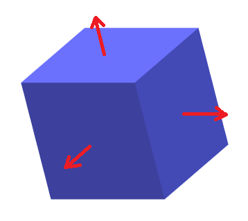
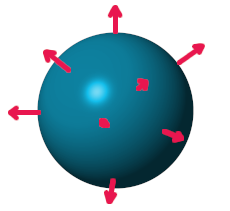
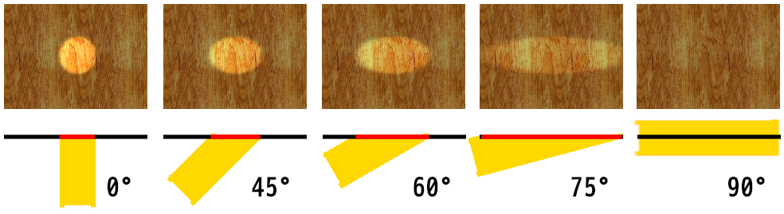
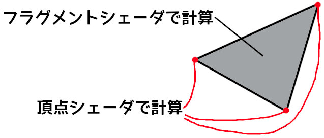
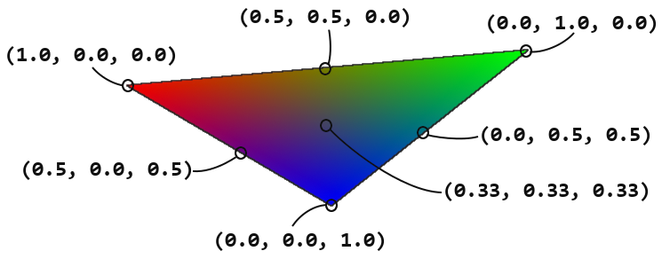
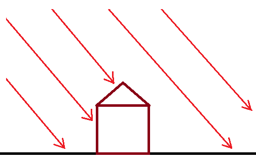
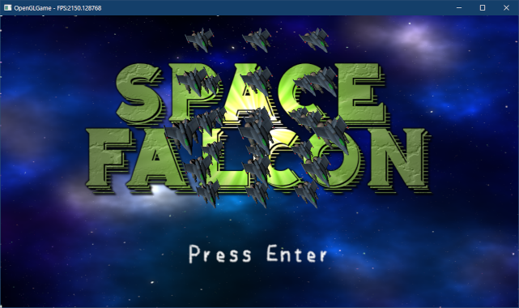
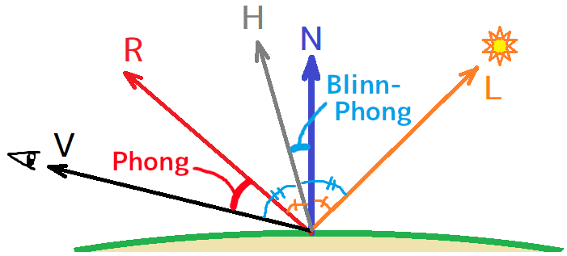
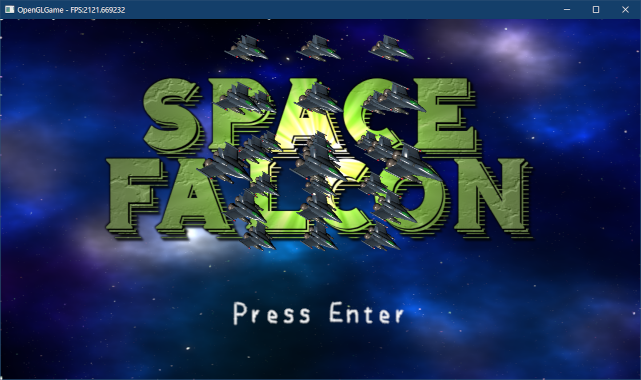

[OpenGL 3D 2022 第09回]

# ベクトルと法線とライティング

## 習得目標

* 法線とランバート反射について説明できる。
* 演算子のオーバーロードのやり方、利点について説明できる。
* 光の反射には「拡散反射」と「鏡面反射」があることを理解する。
* Blinn-Phong鏡面反射モデルについて説明できる。

## 1. ベクトル型

### 1.1 ベクトル型を定義する

ここまで、頂点座標やテクスチャ座標は「`float`型の配列」として扱ってきました。このこと自体は問題ないのですが、配列の操作というものは基本的に書くのが面倒です。

配列をコピーするには`for`や`copy_n`が必要で、クラスや構造体のように代入するだけというわけにはいきません。

GLSLには`vec3`のような組み込みの「ベクトル型」があるので代入は簡単です。また、ベクトル型同士の演算も定義されていて、座標の移動や拡大は、ただベクトルを加算したり乗算するだけで実行できます。

このように、ベクトル型は大変便利です。そこで、GLSLのベクトル型に似せた型を定義して、GLSLのように式を書ける簡単なライブラリを作ろうと思います。

ベクトルおよびベクトル用の数学関数を扱うライブラリなので、ライブラリ名は`VecMath`(ベク・マス、`Vector Mathmatics`(ベクター・マスマティックス)の短縮形)としましょう。

それでは、プロジェクトの`Src`フォルダに`VecMath.h`という名前のヘッダファイルを追加してください。追加したファイルを開き、次のプログラムを追加してください。

```diff
+/**
+* @file VecMath.h
+*/
+#ifndef VECMATH_H_INCLUDED
+#define VECMATH_H_INCLUDED
+#include <cmath>
+
+namespace VecMath {
+
+/**
+* 2Dベクトル
+*/
+struct vec2
+{
+  float x, y;
+};
+
+/**
+* 3Dベクトル
+*/
+struct vec3
+{
+  float x, y, z;
+};
+
+/**
+* 4Dベクトル
+*/
+struct vec4
+{
+  float x, y, z, w;
+};
+
+} // namespace VecMath
+
+#endif // VECMATH_H_INCLUDED
```

このように、コンピュータグラフィックスにおける「ベクトル」は

>2つ以上の座標をまとめた構造体

に過ぎません。

### 1.2 コンストラクタを定義する

次にメンバ関数を定義します。まずは`vec2`のコンストラクタを定義しましょう。`vec2`型の定義に次のプログラムを追加してください。

```diff
 struct vec2
 {
   float x, y;
+
+  vec2() = default;
+  explicit vec2(float s) : x(s), y(s) {}
+  vec2(float x, float y) : x(x), y(y) {}
 };
```

`vec2`型には3つのコンストラクタを定義しています。

次に、`vec3`型のコンストラクタを定義します。`vec3`型の定義に次のプログラムを追加してください(`vec2`コンストラクタを「コピー&ペースト」すると簡単に作れます)。

```diff
 struct vec3
 {
   float x, y, z;
+
+  vec3() = default;
+  explicit vec3(float s) : x(s), y(s), z(s) {}
+  vec3(float x, float y, float z) : x(x), y(y), z(z) {}
+  vec3(const vec2& xy, float z) : x(xy.x), y(xy.y), z(z) {}
 };
```

`vec3`型には、`vec2`型にはなかった「`vec2`と`float`を引数に取るコンストラクタ」を追加しています。

<pre class="tnmai_assignment">
<strong>【課題01】</strong>
<code>vec4</code>型のコンストラクタを定義しなさい。
</pre>

### 1.3 Vertex構造体をベクトル型で書き換える

作成したベクトル型を使って`Vertex`構造体を書き換えます。`Mesh.h`を開き、`VecMath.h`
をインクルードしてください。

```diff
 #ifndef MESH_H_INCLUDED
 #define MESH_H_INCLUDED
 #include "glad/glad.h"
+#include "VecMath.h"
 #include <string>
 #include <vector>
```

次に、`Vertex`構造体の定義を次のように変更してください。

```diff
 */
 struct Vertex
 {
-  float position[3];
-  float texcoord[2];
+  VecMath::vec3 position;
+  VecMath::vec2 texcoord;
 };
```

続いて、`Vertex`構造体を使っているコードを変更します。`Mesh.cpp`を開き、`VecMath`名前空間を`using`指令の引数に指定してください。

```diff
 #include <filesystem>
 #include <fstream>
 #include <stdio.h>
+
+using namespace VecMath;

 namespace Mesh {
```

`using`指令によって、`VecMath::vec3`を単に`vec3`と書けるようになります。

それから、OBJファイルを読み込むときに定義していた`vec3`と`vec2`を削除します。
`LoadOBJ`メンバ関数にある「OBJファイルを解析する」プログラムを次のように変更してください。

```diff
   }

   // OBJファイルを解析して、頂点データとインデックスデータを読み込む
-  struct vec3 { float x, y, z; };
-  struct vec2 { float x, y; };
   struct IndexSet { int v, vt, vn; };
   std::vector<vec3> positions;
```

この定義を削除することで、`VecMath.h`の`vec3`と`vec2`が使われるようになります。

次に、ベクトルのコピーを代入に書き換えてください。

```diff
   vertices.reserve(faceIndexSet.size());
   for (const auto& e : faceIndexSet) {
     Vertex v;
-    std::copy_n(&positions[e.v - 1].x, 3, v.position);
-    std::copy_n(&texcoords[e.vt - 1].x, 2, v.texcoord);
+    v.position = positions[e.v - 1];
+    v.texcoord = texcoords[e.vt - 1];
     vertices.push_back(v);
   }
```

配列を構造体で置き換え、`VecMath.h`の`vec3`, `vec2`を使うようにしたので、`copy_n`
関数を代入で書き換えられるようになりました。

### 1.4 法線を読み取る

OBJファイルの頂点データには、頂点座標、テクスチャ座標のほかに「法線(ほうせん)」が含まれます。法線は、

>曲面上の1点において、その曲面に接する平面に垂直な直線

と定義されます。とりあえず「頂点からまっすぐ上に向かう方向」と考えてください。

<p align="center">
 <br>
[立方体と球体の法線(赤い矢印)]
</p>

それで、法線が何の役に立つのかというと「ライティング」です。どういうことかというと、ある地点の明るさは、その地点の法線と、その地点を照らす光の方向から計算できるのです。

細かい話はあとにして、とりあえず法線を読み込みましょう。法線は英語で`normal`(ノーマル)というので、メンバ変数名も`normal`とします。`Mesh.h`を開き、`Vertex`構造体に法線用のメンバ変数を追加してください。

```diff
 {
   VecMath::vec3 position;
   VecMath::vec2 texcoord;
+  VecMath::vec3 normal;
 };
```

次に頂点アトリビュートを設定します。`Mesh.cpp`を開き、`PrimitiveBuffer`コンストラクタに次のプログラムを追加してください。

```diff
   };
   setAttribute(0, 3, offsetof(Vertex, position));
   setAttribute(1, 2, offsetof(Vertex, texcoord));
+  setAttribute(2, 3, offsetof(Vertex, normal));

   // VAOに、VBOとIBOを割り当てる
   glBindBuffer(GL_ARRAY_BUFFER, vbo);
```

これで、法線データが頂点シェーダの2番目の`in`変数に送られるようになります。

続いて、法線データを読み込む変数を用意します。`LoadOBJ`関数にある「OBJファイルを解析」するプログラムに、次のプログラムを追加してください。

```diff
   // OBJファイルを解析して、頂点データとインデックスデータを読み込む
-  struct IndexSet { int v, vt; };
+  struct IndexSet { int v, vt, vn; };

   std::vector<vec3> positions;
   std::vector<vec2> texcoords;
+  std::vector<vec3> normals;
   std::vector<IndexSet> faceIndexSet;

   positions.reserve(20'000);
   texcoords.reserve(20'000);
+  normals.reserve(20'000);
   faceIndexSet.reserve(20'000 * 3);
```

それでは`sscanf`関数を使って法線データを読み取りましょう。テクスチャ座標を読み取るプログラムの下に、次のプログラムを追加してください。

```diff
       texcoords.push_back(vt);
       continue;
     }
+
+    // 法線の読み取りを試みる
+    vec3 vn;
+    if (sscanf(p, " vn %f %f %f", &vn.x, &vn.y, &vn.z) == 3) {
+      normals.push_back(vn);
+      continue;
+    }

     // インデックスデータの読み取りを試みる
     IndexSet f0, f1, f2;
```

これで、法線データが読み取られるようになりました。

>**【なぜ垂線ではなく法線と言うの？】**<br>
> 「<ruby>法線<rt>ほうせん</rt></ruby>」という名前は、英語の`normal`(ノーマル)を翻訳したものです。ただ、`normal`
>の訳語に「法線」を当てた理由は伝わっていません。`normal`には「標準、規則、垂直」などの意味があるのですが、日本語にはこれらを一語で表せる単語がありません。<br>
>ある説では、`normal`という単語が最初に舶来したとき、法律の本から「規則→法」という翻訳がなされ、あとから数学の本に書かれている`normal`にも同じ訳があてられた、と言われています。<br>
>また、先に中国で訳されたものが入ってきたという説(中国で「`normal`→法線」と訳された理由は不明)もあります。しかし、いずれも噂に過ぎず、真相は不明です。

### 1.5 法線インデックスを読み取る

法線を持つOBJファイルの場合、`f`構文には3つのインデックスを指定します。しかし、現在のプログラムは2つのインデックスにしか対応していません。そこで、3つのインデックスに対応するプログラムを追加します。

基本構造は2つのインデックスと同じなので、コピー&ペーストで作りましょう。2つのインデックスを読み取るプログラムをコピー(`Ctrl+C`)して、元のプログラムの上に貼り付け(`Ctrl+V`)てください。

```diff
     // インデックスデータの読み取りを試みる
     IndexSet f0, f1, f2;
     int readByte;
+    if (sscanf(p, " f %u/%u %u/%u%n",
+      &f0.v, &f0.vt, &f1.v, &f1.vt, &readByte) == 4) {
+      p += readByte; // 読み取り位置を更新
+      for (;;) {
+        if (sscanf(p, " %u/%u%n", &f2.v, &f2.vt, &readByte) != 2) {
+          break;
+        }
+        p += readByte; // 読み取り位置を更新
+        faceIndexSet.push_back(f0);
+        faceIndexSet.push_back(f1);
+        faceIndexSet.push_back(f2);
+        f1 = f2; // 次の三角形のためにデータを移動
+      }
+      continue;
+    }
     if (sscanf(p, " f %u/%u %u/%u%n",
       &f0.v, &f0.vt, &f1.v, &f1.vt, &readByte) == 4) {
```

次に、内容の違いが分かるようなコメントを追加してください。

```diff
     // インデックスデータの読み取りを試みる
     IndexSet f0, f1, f2;
     int readByte;
+
+    // 頂点座標+テクスチャ座標+法線
     if (sscanf(p, " f %u/%u %u/%u%n",
       &f0.v, &f0.vt, &f1.v, &f1.vt, &readByte) == 4) {
          ・
          ・
          ・
         f1 = f2; // 次の三角形のためにデータを移動
       }
       continue;
     }
+
+    // 頂点座標+テクスチャ座標
     if (sscanf(p, " f %u/%u %u/%u%n",
       &f0.v, &f0.vt, &f1.v, &f1.vt, &readByte) == 4) {
```

それでは、コピーしたプログラムを、3つのインデックスを読み取るように変更してください。

>`%`と`/`の見間違い、空白の見落としに注意すること。

```diff
     int readByte;

     // 頂点座標+テクスチャ座標+法線
-    if (sscanf(p, " f %u/%u %u/%u%n",
-      &f0.v, &f0.vt, &f1.v, &f1.vt, &readByte) == 4) {
+    if (sscanf(p, " f %u/%u/%u %u/%u/%u%n",
+      &f0.v, &f0.vt, &f0.vn, &f1.v, &f1.vt, &f1.vn, &readByte) == 6) {
       p += readByte; // 読み取り位置を更新
       for (;;) {
-        if (sscanf(p, " %u/%u%n", &f2.v, &f2.vt, &readByte) != 2) {
+        if (sscanf(p, " %u/%u/%u%n", &f2.v, &f2.vt, &f2.vn, &readByte) != 3) {
           break;
         }
```

それから、`IndexSet`構造体に`vn`メンバ変数を追加しましたが、2つのインデックスを読み取る処理では`vn`がないため設定できません。

`vn`に何も設定しないわけにはいかないので、法線がない場合の`vn`の扱いかたを決める必要があります。OBJファイルの場合、インデックスが`0`になることはないので、「インデックスが`0`の場合はデータがない」とするのが簡単でしょう。

2つのインデックスの読み取りを試みるプログラムに、次のプログラムを追加してください。

```diff
     // 頂点座標+テクスチャ座標
     if (sscanf(p, " f %u/%u %u/%u%n",
       &f0.v, &f0.vt, &f1.v, &f1.vt, &readByte) == 4) {
+      f0.vn = f1.vn = 0; // 法線なし
       p += readByte; // 読み取り位置を更新
       for (;;) {
         if (sscanf(p, " %u/%u%n", &f2.v, &f2.vt, &readByte) != 2) {
           break;
         }
+        f2.vn = 0; // 法線なし
         p += readByte; // 読み取り位置を更新
         faceIndexSet.push_back(f0);
```

これで法線インデックスが読み取られるようになりました。

### 1.6 法線をOpenGL用に変換する

読み取った法線インデックスを使って、OpenGL用の頂点データを作成します。読み取ったデータをOpenGLで使えるデータに変換するプログラムに、次のプログラムを追加してください。

```diff
     Vertex v;
     v.position = positions[e.v - 1];
     v.texcoord = texcoords[e.vt - 1];
+    // 法線がない場合は仮データを設定
+    if (e.vn == 0) {
+      v.normal = vec3(0, 0, 1);
+    } else {
+      v.normal = normals[e.vn - 1];
+    }
     vertices.push_back(v);
   }
```

これで、頂点データに法線が追加されるようになりました。

### 1.7 頂点シェーダで法線を変換する

次は、頂点シェーダとフラグメントシェーダに、法線データを扱うプログラムを追加します。`standard_3D.vert`を開き、法線を受け取るための`in`変数と、法線をフラグメントシェーダに送るための`out`変数を追加してください。

```diff
 // シェーダへの入力
 layout(location=0) in vec3 inPosition;
 layout(location=1) in vec2 inTexcoord;
+layout(location=2) in vec3 inNormal;

 // シェーダからの出力
 layout(location=0) out vec3 outPosition;
 layout(location=1) out vec2 outTexcoord;
+layout(location=2) out vec3 outNormal;

 // プログラムからの入力
 layout(location=0) uniform vec3 translate;
```

続いて法線を座標変換します。法線は「方向」を示すデータで、座標データとは性質が異なります。具体的には回転のみが影響し、拡大率や平行移動は行いません。

>実際には拡大率を考慮する必要があります。これは次回のテキストで行います。

`outPosition`を計算するプログラムの下に、次のプログラムを追加してください。

```diff
   // 平行移動
   outPosition += translate;
+
+  // ワールド法線を計算
+  outNormal.x = inNormal.x * c + inNormal.z * s;
+  outNormal.y = inNormal.y;
+  outNormal.z = inNormal.x * -s + inNormal.z * c;

   // カメラの位置が原点となるように平行移動
   pos = outPosition - cameraPosition;
```

この回転によって、ローカル座標系の法線(=ローカル法線)をワールド座標系の法線(=ワールド法線)に変換することができます。

>**【法線と拡大率】**<br>
>実際には、拡大率が法線に影響を与える場合があります。これは「各軸に異なる拡大率を指定した場合」に発生します。球体を縦に押しつぶすような拡大率(例えばX=2,Y=0.5,Z=2など)を設定したとします。球体の表面がゆがむことで、頂点に接する平面の角度が変化します。法線は平面の垂線であるため、結果として法線の向きも変化することになります。
>そのため、すべての場合に正しく法線を変換するには、拡大率も考慮しなくてはなりません。

### 1.8 フラグメントシェーダで明るさを計算する

続いて、フラグメントシェーダに明るさの計算を追加します。最初に、法線を受け取る`in`変数を加えましょう。`standard_3D.frag`を開き、次のプログラムを追加してください。

```diff
 // シェーダへの入力
 layout(location=0) in vec3 inPosition;
 layout(location=1) in vec2 inTexcoord;
+layout(location=2) in vec3 inNormal;

 // テクスチャ
 layout(binding=0) uniform sampler2D texColor;
```

次に、明るさの元になるライトのパラメータを定義します。アプリケーションから制御できるように、`uniform`変数にしておきます。`main`関数に次のプログラムを追加してください。

```diff
 // 出力する色データ
 out vec4 outColor;
+
+// 平行光源パラメータ
+struct DirectionalLight
+{
+  vec3 color;     // ライトの明るさ
+  vec3 direction; // ライトの向き
+};
+layout(location=100) uniform DirectionalLight directionalLight;

 void main()
 {
```

構造体の名前は`DirectionalLight`(ディレクショナル・ライト、「平行光源」という意味)としました。また、ライトの明るさには`color`(カラー)、向きには`direction`(ディレクション、「向き」という意味)という名前を付けました。

ここで、ロケーション番号を100としているのは、頂点シェーダと番号が重複するのを避けるためです。

>以後は、ロケーション番号0～99を頂点シェーダ用、100～をフラグメントシェーダ用とします。

それから、ユニフォーム変数に構造体や配列を指定すると、要素ごとにロケーション番号が割り振られます。つまり、最初のメンバである`DirectionalLight::color`が`100`、2番目の
`DirectionalLight::direction`が`101`になります。

引き続き、フラグメントの明るさを計算しましょう。コンピューター・グラフィックスでは、物体の表面の明るさも計算で算出します。しかし、現実世界の光を再現するには膨大な計算が必要です。

例えば、CG映画では1秒間に24枚の画像が次々に表示されます。この1枚の計算にどれだけの時間がかかるかというと、映像データを全て揃えたうえで、数万個のCPUを使って、短くて数時間、長い場合は数日にも及びます。

こんなに時間がかかるのでは、とてもゲームのようなリアルタイム性を求められる分野には使えません。そんなわけで、簡単な計算でそれっぽい見た目になる方法がいくつも考案されました。

今回は、そんな方法のひとつである「ランバート反射」を学習します。ランバート反射は、

>**【ランベルトの余弦則】**<br>
>物体のある点で反射した光(反射光)の強さは、その点の法線と光源方向のなす角θの余弦(コサイン)と正比例する

という法則(「ランベルトの余弦則」といいます)を利用した計算方法です。

壁を懐中電灯で照らしているとします。懐中電灯の向きを徐々に斜めに傾けていくと、壁に当たる光は徐々に横に伸びていきます。そして、壁と水平になるまで傾けると、光は壁に沿ってまっすぐ向こう側にいってしまい、壁にはまったく当たりません。
<p align="center">
<br>
[照らす面積が増えると暗くなる]
</p>

上図の赤い線は、角度によって光が照らす面積がどう変わるかを表しています。正面から照らしたときの面積を1とすると、45°で照らしたときの面積は1.4倍になります。60°で照らしたときの面積は2倍、75°だと3.8倍にもなります。

しかし、懐中電灯から出る光の量(エネルギー)は常に一定です。そのため、角度がついて照らす面積が増えると、単位面積当たりの光の量(エネルギー)が減少します。

このとき、「照射角度」と「単位面積当たりの光の量」の関係は余弦(コサイン)で表すことができます。一般に、照射される光の量と反射する光の量は比例するため、反射光の量も余弦で表すことができます。これが「ランベルトの余弦則」です。

>**【ランバート？ ランベルト？】**<br>
>「ランバート反射」と「ランベルトの余弦則」は、これを発見したドイツの数学者「ヨハン・ハインリヒ・ランベルト(Johann Heinrich Lambert)」の名前にちなんでなづけられました。微妙に名前が違うのは、学問分野によって読み方の慣習が違うからです。物理学徒は英語読みで「ランバート」、数学徒はドイツ語読みで「ランベルト」と呼んだのです。

それでは、`standard_3D.frag`の`main`関数に、次のプログラムを追加してください。

```diff
 void main()
 {
   outColor = texture(texColor, inTexcoord);
+
+  float invPi = 1 / acos(-1); // πの逆数
+
+  // 線形補間によって長さが1ではなくなっているので、正規化して長さを1に復元する
+  vec3 normal = normalize(inNormal);
+
+  // ランベルトの余弦則を使って明るさを計算
+  float theta = max(dot(-directionalLight.direction, normal), 0);
+
+  // 拡散光の明るさを計算
+  vec3 diffuse = directionalLight.color * theta * invPi;
+
+  // 拡散光の影響を反映
+  outColor.rgb *= diffuse;
 }
```

物体が反射する光は「拡散反射」と「鏡面反射」に大別されます。ランバート反射は「拡散反射」を再現します。

ランバート反射では、「入射光は物体の表面で全方位に拡散反射する」と仮定しています。これは表面が非常に荒い物体を表します。

`1/π`を掛けている理由ですが、拡散反射では入射光が「全方位に均等に反射」されるため、ある方向に反射する光の量は全体の`1/π`になるからです。

>なぜ`1/π`になるのかが気になる場合は、以下のページにある「拡散反射/cosθの半球積分」の説明を参照してください(内容が分からなくても問題ありません)。<br>
>「物理ベースレンダリングの基礎」<br>
>`https://zenn.dev/mebiusbox/books/619c81d2fbeafd/viewer/239ee2`

#### 法線を正規化している理由

実は、頂点シェーダーの`out`変数に格納された値は、そのままフラグメントシェーダの`in`変数にコピーされるとは限りません。

なぜなら、頂点シェーダの計算結果はあくまで「頂点座標における値」に過ぎないからです。しかし、フラグメントシェーダは頂点間にある全てのピクセルに対して実行されます。

<p align="center">

</p>

そこで、「ピクセルから頂点までの距離に応じて頂点の値を混合」することで、中間領域にあるピクセルの値を作り出します。これを「線形補間(せんけいほかん)」といいます。

例えば、頂点シェーダが`outColor`という`out`変数に頂点の色を書き込み。フラグメントシェーダが`inColor`という`in`変数でそれを受け取るとします。

頂点Aが赤(1, 0, 0)、頂点Bが青(0, 0, 1)を`outColor`に代入したとき、AとBのちょうど中間にあるピクセルの`inColor`には(0.5, 0, 0.5)という値が代入されます。

また、「Aまでの距離:Bまでの距離 = 2:8」となる位置のピクセルの`inColor`には、(0.8, 0, 0.2)という値が代入されます。

<p align="center">

</p>

ここで、色ではなく法線を出力したとします。頂点Aが右(1, 0, 0)、頂点Bが手前(0, 0, 1)とすると、A,Bの中間にあるピクセルの法線は、色と同様に(0.5, 0, 0.5)となります。

また、A,Bからの距離の比が2:8となる位置のピクセルでは(0.8, 0, 0.2)となります。さて、ここまでは問題ありません。

問題は、ランベルトの余弦則による明るさの計算です。2つの方向ベクトルのあいだの`cosθ`を求めるには`dot`(ドット、内積)を使うのが一般的です。内積は、

`内積 = |A||B|cosθ`

と定義されているからです(`|V|`はベクトルVの長さを表す)。

<p><code class="tnmai_code"><strong>【書式】</strong><br>
float dot(ベクトルA, ベクトルB);
</code></p>

内積から`cosθ`を取り出すには`|A||B|`で除算しなくてはなりません。しかし、事前に`|A|=1`、`|B|=1`にしておけば、除算の必要はなくなります。

そこで、明るさの計算で使う「光の向き」と「法線」の長さを1に揃えておくことにします。

>長さ1のベクトルのことを「単位(たんい)ベクトル」といい、ベクトルを単位ベクトルにすることを「正規化(せいきか)」といいます。

まず「光の向き」ですが、これはC++プログラム側で正規化してからユニフォーム変数にコピーすればOKです。対して「法線」はGPUの線形補間の影響を受けるため、フラグメントシェーダで正規化しなくてはなりません。

GLSLでベクトルを正規化するには`normalize`(ノーマライズ)関数を使います。

<p><code class="tnmai_code"><strong>【書式】</strong><br>
単位ベクトル normalize(正規化したいベクトル);
</code></p>

結論としては、法線を正規化する理由は「明るさの計算を簡略化するため」となります。

### 1.9 平行光源のパラメータを設定する

次に、平行光源(へいこうこうげん)のパラメータを設定します。コンピューター・グラフィックスでは、光を放つ物体のことを「ライト」あるいは「光源(こうげん)」と呼びます。

「平行光源」は、太陽や月のように「非常に遠くにあって、強力な光を放つ物体」を表現するためのライトです。単一の方向に平行な光線を放つので「平行光源」というわけです。平行光源は、英語では「ディレクショナル・ライト」といいます。

<p align="center">
<br>
[平行光源のイメージ]
</p>

平行光源には「光の向き」と「光の色および明るさ」という2つ(または3つ)のパラメーターがあります。

今回は、「光の向き」には`direction`(ディレクション、「方向」という意味)、「光の色」には`color`(カラー)、「明るさ」には`intensity`(インテンシティ、「強度」という意味)という変数名を当てることにします。

`Engine.cpp`を開き、`VecMath`名前空間を`using`指令の引数に指定してください。

```diff
 #include <Windows.h>
 #include <fstream>
 #include <filesystem>
+
+using namespace VecMath;

 /**
 * OpenGLからのメッセージを処理するコールバック関数
```

次に、`MainLoop`関数にある「3Dモデルの表示テスト」プログラムに、次のプログラムを追加してください。

```diff
       glEnable(GL_DEPTH_TEST); // 深度テストを有効化
       glEnable(GL_CULL_FACE);  // 裏面カリングを有効化
+
+      // 平行光源
+      struct DirectionalLight
+      {
+        vec3 color;      // 色
+        float intensity; // 明るさ
+        vec3 direction;  // 向き
+      };
+      DirectionalLight directionalLight = {
+        vec3(1.0f, 0.9f, 0.8f),
+        3,
+        vec3(0.57735f, -0.57735f, -0.57735f)
+      };
+
+      // 平行光源の情報を設定
+      glProgramUniform3f(*progStandard3D, 100,
+        directionalLight.color.x * directionalLight.intensity,
+        directionalLight.color.y * directionalLight.intensity,
+        directionalLight.color.z * directionalLight.intensity);
+      glProgramUniform3f(*progStandard3D, 101,
+        directionalLight.direction.x,
+        directionalLight.direction.y,
+        directionalLight.direction.z);

      // 3D表示用のカメラ情報を設定
      Camera& camera = static_cast<Camera&>(*cameraObject->componentList[0]);
```

光の色と明るさは、ユニフォーム変数に設定するときに乗算しておきます。ここで乗算しておけば、シェーダ側で乗算しなくて済むからです。

ここで、`directionalLight.direction`をGPUメモリにコピーする際、ロケーション番号を`101`にしている点に注意してください。

フラグメントシェーダにユニフォーム変数を追加するときにも説明しましたが、ユニフォーム変数に構造体や配列を指定すると、要素ごとにロケーション番号が割り振られます。

そのため、`glProgramUniform～`には、要素に対応するロケーション番号を指定しなくてはなりません。

また、「法線を正規化している理由」でも説明しましたが、「光の向き」は単位ベクトルになっている必要があります。今回の場合、まず(1, -1, -1)という向きを考え、これをベクトルの長さ(`=√3`)で割って求めました(C++には`normalize`関数がないため)。

>**【方向ベクトルは単位ベクトルにしよう】**<br>
>光の向きや法線だけでなく、「方向を表すベクトル」は必ず単位ベクトルにしておきましょう。明るさと同じ理由で、計算が簡単になります。

ここまでで、法線を扱えるプログラムが完成したので、法線を持つOBJファイルを表示してみましょう。

<div style="page-break-after: always"></div>

<pre class="tnmai_assignment">
<strong>【課題02】</strong>
プロジェクトの<code>Res</code>フォルダにある<code>enemy_s_01.obj</code>と<code>player_fighter_01.obj</code>を削除してください。<br>
次に、ブラウザで以下のURLを開き、
  <code>https://github.com/tn-mai/OpenGL3D2022/tree/master/res</code>
以下のファイルをダウンロードして、プロジェクトの<code>Res</code>フォルダに保存しなさい。
  - enemy_s_01_vn.obj
  - player_figher_01_vn.obj
保存したら「ファイル名の変更」を行って、末尾にある<code>_vn</code>という3文字を削除して
ください(名前を<code>enemy_s_01.obj</code>と<code>player_figher_01.obj</code>に変更)。
</pre>

課題02が完了したら、プログラムをビルドして実行してください。なんとなく光が当たったように見えていたら成功です。

<p align="center">

</p>

>**【1章のまとめ】**
>
>* ベクトル型は、座標を表す変数をまとめて管理するために使う。
>* OBJファイルの頂点には、頂点座標、テクスチャ座標、法線の3つのデータがある。
>* 法線は「曲面に接する平面に垂直な直線」で、ベクトルとして表現することができる。
>* メッシュ上の点の明るさは、法線と光の向きの内積で表すことができる(ランバート反射)。
>* GPUによる線形補間の影響で、法線を「正規化(ベクトルの長さを1にすること)」しないと、明るさの計算結果が正しくならない。

<div style="page-break-after: always"></div>

## 2. 演算子のオーバーロード

### 2.1 乗算演算子のオーバーロード

1章の最後に、X, Y, Zのそれぞれに`intensity`を乗算するプログラムを書きました。

>```c++
>glProgramUniform3f(*progStandard3D, 100,
>  directionalLight.color.x * directionalLight.intensity,
>  directionalLight.color.y * directionalLight.intensity,
>  directionalLight.color.z * directionalLight.intensity);
>```

しかし、ここで実際にやりたいことは「ベクトル型」の`color`と「スカラー型(intやfloatのように1要素で表現される型)」の`intensity`の乗算です。このような計算は、次のように書けると便利です。

>```c++
>vec3 color = directionalLight.colr * directionalLight.intensity;
>glProgramUniform3f(*progStandard3D, 100, color.x, color.y, color.z);
>```

この書き方は、組み込みのベクトル型を持つGLSLでは当たり前に使えます。そこで、`VecMath`
に定義したベクトル型にも、GLSLのような計算を行う機能を追加しようと思います。

C++において、自分で作成した型に、組み込み型のような計算機能を追加するには「演算子(えんざんし)をオーバーロード」します。

手始めに、`vec2`同士の乗算を可能にしましょう。`VecMath.h`を開き、`vec2`コンストラクタの定義の下に、次のプログラムを追加してください。

```diff
   vec2() = default;
   explicit vec2(float n) : x(n), y(n) {}
   vec2(float x, float y) : x(x), y(y) {}
+
+  // 乗算
+  vec2& operator*=(const vec2& other) {
+    x *= other.x;
+    y *= other.y;
+    return *this;
+  }
 };

 /**
```

`operator*=`(オペレータ・かけるイコール)は、`*=`演算子に対応する関数です。このように、ベクトル同士の計算はメンバを個別に計算するだけです。

なお、(複合)代入演算子には「自分自身の参照を返す」という暗黙のルールがあります。これは、C++の組み込み型の(複合)代入演算子の動作が「自分自身の参照を返す」となっているためです。

一般に、`*=`のような複合代入演算子はメンバ変数の値を変更します。そのため、メンバ関数として定義する必要があります(C++規格で決まっているわけではない)。

>**【演算子のオーバーロードには自由がある、ただし…】**<br>
>C++規格の上では、オーバーロードした演算子が何をするか自由に決められます。だからといって、`*=`演算子を「ファイル名を受け取ってテクスチャを作成する。戻り値はない。」という関数としてオーバーロードするのはおすすめしません。`*=`演算子なのに掛け算も代入も行わない、というのは予測できないからです。<br>
>合理的な理由がないかぎり、演算子をオーバーロードするときは「組み込み型の演算子の挙動から期待される動作」を定義するべきです。異なるルールで定義してしまうと、演算子を見るたびに「この演算子は本当は何をするんだっけ？」と調べなくてはならず、プログラムが書きにくく、理解しにくいものになるからです。

「operator演算子名」という名前の関数を定義すると、関数名に指定した「演算子」が利用可能になります。`*=`演算子を定義したので、以下の式が書けるようになります。

>```c++
>vec2 a(1, 2), b(3, 4);
>a *= b;
>```

また、「operator演算子名」は名前の付け方が特殊なだけで、それ以外はいたって普通のメンバ関数です。そのため、例えば次のように書くこともできます。

>```c++
>vec2 a(1, 2), b(3, 4);
>a.operator*=(b); // a*=bと同じ
>```

もっとも、せっかく演算子を使えるようにしたのですから、普通はわざわざ関数形式で書くことはありません。C++のルール上は書ける、というだけです。

次に`*`演算子を定義します。`*=`演算子の定義の下に、次のプログラムを追加してください。

```diff
     y *= other.y;
     return *this;
   }
+  friend vec2 operator*(vec2 a, const vec2& b) { return a *= b; }
 };

 /**
```

一般に、`*`のような代入を伴わない演算子は「非メンバ関数(=通常の関数)」として定義します。クラス定義内で非メンバ関数を定義するには、先頭に`friend`(フレンド)キーワードを付けます。

>`friend`の本来の機能は「フレンド指定したクラス・関数から、プライベートメンバを参照できるようにする」ことですが、このような使い方もあります。

算術演算子の戻り値は値型(あたいがた)にします(`&`や`*`を付けない)。理由は、複合代入演算子の場合と同じで「組み込み型がそうなっているから」です。

上記のプログラムで分かるように、似た機能を持つ演算子は、定義済みの演算子や関数を利用することで簡単に作成できます。

### 2.2 ベクトルとスカラーの乗算演算子のオーバーロード

GLSLのベクトル型は`float`や`int`などの「スカラー型(要素が1つだけの型)」に対する算術演算が可能です(これがやりたくて演算子のオーバーロードを始めたのでした)。<br>
というわけで、`VecMath::vec2`型にも同じ機能を追加しましょう。

ベクトル型とスカラー型のあいだの演算を定義す場合、以下の2種類の演算が考えられます。

1. ベクトル型 * スカラー型
2. スカラー型 * ベクトル型

「代入を伴わない演算子は非メンバ関数にする」ルールがあるのは、2つの演算の一貫性を<ruby>保<rt>たも</rt></ruby>つ書き方ができるからです。実際に、`vec2`と`float`の乗算演算子をオーバーロードしてみましょう。

まず、複合代入演算子を定義します。`*`演算子の定義の下に、次のプログラムを追加してください。

```diff
     return *this;
   }
   friend vec2 operator*(vec2 a, const vec2& b) { return a *= b; }
+  vec2& operator*=(float other) { return *this *= vec2(other); }
 };
```

続いて、追加した`*=`演算子を使って2種類の`*`演算子を実装します。追加した`*=`演算子の定義の下に、次のプログラムを追加してください。

```diff
   friend vec2 operator*(vec2 a, const vec2& b) { return a *= b; }
   vec2& operator*=(float other) { return *this *= vec2(other); }
+  friend vec2 operator*(vec2 a, float b) { return a *= b; }
+  friend vec2 operator*(float a, const vec2& b) { return vec2(a) *= b; }
 };
```

追加した2つの演算子のうち、`operator *(vec2, float)`のほうは「`vec2`のメンバ関数」として定義することが可能です。もうひとつの`operator *(float, vec2)`は「`float`のメンバ関数」として定義する必要がありますが、それはできません。

なぜなら、C++規格では「組み込み型にメンバ関数を追加することはできない」からです。必然的に、`operator *(float, vec2)`は「非メンバ関数」として定義することになります。

そうなると、対になる`operator *(vec2, float)`も非メンバ関数として定義するほうが自然です。また、同じように書けることで片方を定義し忘れる可能性が低くなり、間違いも見つけやすくなります。

### 2.3 vec3の乗算演算子のオーバーロード

続いて`vec3`型の乗算演算子をオーバーロードします。`vec3`コンストラクタの定義の下に、次のプログラムを追加してください。

```diff
   explicit vec3(float s) : x(s), y(s), z(s) {}
   vec3(float x, float y, float z) : x(x), y(y), z(z) {}
   vec3(const vec2& xy, float z) : x(xy.x), y(xy.y), z(z) {}
+
+  // 乗算
+  vec3& operator*=(const vec3& other) {
+    x *= other.x;
+    y *= other.y;
+    z *= other.z;
+    return *this;
+  }
+  friend vec3 operator*(vec3 a, const vec3& b) { return a *= b; }
+  vec3& operator*=(float other) { return *this *= vec3(other); }
+  friend vec3 operator*(vec3 a, float b) { return a *= b; }
+  friend vec3 operator*(float a, const vec3& b) { return vec3(a) *= b; }
 };
```

それでは、元々やりたかったことを実現しましょう。`Engine.cpp`を開き、`MainLoop`関数にある「平行光源の情報を設定」するプログラムを、次のように変更してください。

```diff
       // 平行光源の情報を設定
-      glProgramUniform3f(*progStandard3D, 100,
-        directionalLight.color.x * directionalLight.intensity,
-        directionalLight.color.y * directionalLight.intensity,
-        directionalLight.color.z * directionalLight.intensity);
+      const vec3 color = directionalLight.color * directionalLight.intensity;
+      glProgramUniform3f(*progStandard3D, 100, color.x, color.y, color.z);
       glProgramUniform3f(*progStandard3D, 101,
         directionalLight.direction.x,
```

プログラムが書けたらビルドして実行してください。オーバーロードした`*=`で書き換える前と同じ画面が表示されたら成功です。

<p align="center">

</p>

このように、演算子のオーバーロードを適切に利用すると以下のメリットが得られます。

>* やりたいことをより明確に表現できるようになる。
>* 同じプログラムを何度も書く必要がなくなる。

これらのメリットにより、プログラムの「書きやすさ」と「読みやすさ」が向上します。

<pre class="tnmai_assignment">
<strong>【課題03】</strong>
<code>vec4</code>型に<code>operator*=</code>と<code>operator*</code>のオーバーロードを定義しなさい。
</pre>

>**【同じことを何度も書かないで済ませる方法はないの？】**<br>
>実は、あります。簡単なのはプリプロセッサマクロを使うことです。少し難しいですが、クラステンプレートを使う方法も考えられます。あるいはBoost.Optionsというライブラリを使うこともできます。<br>
>テキストの本題からはずれるのでこれ以上の説明はしませんが、試しに挑戦してみると面白いでしょう。

### 2.4 そのほかの演算子のオーバーロード

いい機会なので、乗算以外の演算子もオーバーロードしちゃいましょう。まず加算演算子をオーバーロードします。`vec2`型の定義に次のプログラムを追加してください。

>乗算演算子をコピー&ペーストして修正すると簡単です。演算子の修正漏れがないように注意すること。

```diff
   explicit vec3(float s) : x(s), y(s), z(s) {}
   vec3(float x, float y, float z) : x(x), y(y), z(z) {}
   vec3(const vec2& xy, float z) : x(xy.x), y(xy.y), z(z) {}
+
+  // 加算
+  vec2& operator+=(const vec2& other) {
+    x += other.x;
+    y += other.y;
+    return *this;
+  }
+  friend vec2 operator+(vec2 a, const vec2& b) { return a += b; }
+  vec2& operator+=(float other) { return *this += vec2(other); }
+  friend vec2 operator+(vec2 a, float b) { return a += b; }
+  friend vec2 operator+(float a, const vec2& b) { return vec2(a) += b; }

   // 乗算
   vec3& operator*=(const vec3& other) {
```

このように、演算子のオーバーロードでは、演算子の種類が異なる(`*`と`+`)だけで、それ以外の書き方に違いはありません。

次に、減算演算子をオーバーロードします。加算演算子のオーバーロードの下に、減算演算子のオーバーロードを追加してください。

```diff
   vec2& operator+=(float other) { return *this += vec2(other); }
   friend vec2 operator+(vec2 a, float b) { return a += b; }
   friend vec2 operator+(float a, const vec2& b) { return vec2(a) += b; }
+
+  // 減算
+  vec2& operator-=(const vec2& other) {
+    x -= other.x;
+    y -= other.y;
+    return *this;
+  }
+  friend vec2 operator-(vec2 a, const vec2& b) { return a -= b; }
+  vec2& operator-=(float other) { return *this -= vec2(other); }
+  friend vec2 operator-(vec2 a, float b) { return a -= b; }
+  friend vec2 operator-(float a, const vec2& b) { return vec2(a) -= b; }

   // 乗算
   vec3& operator*=(const vec3& other) {
```

<pre class="tnmai_assignment">
<strong>【課題04】</strong>
<code>vec2</code>型の乗算演算子の定義の下に「除算演算子」を定義しなさい。
</pre>

<pre class="tnmai_assignment">
<strong>【課題05】</strong>
<code>vec3</code>型に「加算演算子」「減算演算子」「除算演算子」を定義しなさい。
</pre>

<pre class="tnmai_assignment">
<strong>【課題06】</strong>
<code>vec4</code>型に「加算演算子」「減算演算子」「除算演算子」を定義しなさい。
</pre>

### 2.5 単項(たんこう)マイナス演算子のオーバーロード

符号を反転させるときは`-5`のようにマイナス符号を付けますよね。これも演算子として追加することができます。`vec2`型の定義に次のプログラムを追加してください。

```diff
   vec2& operator /=(float other) { return *this /= vec2(other); }
   friend vec2 operator /(vec2 a, float b) { return a /= b; }
   friend vec2 operator /(float a, const vec2& b) { return vec2(a) /= b; }
+
+  // 単項マイナス演算子
+  vec2 operator-() const { return vec2(-x, -y); }
 };
```

引数を持たないメンバ演算子のことを「単項(たんこう)演算子」といいます。一方、1つの引数を持つメンバ演算子、または2つの引数を持つ非メンバ演算子は「二項(にこう)演算子」といいます。

<pre class="tnmai_assignment">
<strong>【課題07】</strong>
<code>vec3</code>型と<code>vec4</code>型に「単項マイナス演算子」を定義しなさい。
</pre>

### 2.6 添字(そえじ)演算子のオーバーロード

GLSLのベクトル型は、配列のように添え字で要素を参照することができます。同じ機能を
`vec2`型に追加するには、`operator []`をオーバーロードします。単項`-`演算子の定義の下に、次のプログラムを追加してください。

```diff
   // 単項-演算子
   vec2 operator -() const { return vec2(-x, -y); }
+
+  // 添字演算子
+  float& operator[](size_t n) { return *(&x + n); }
+  const float& operator[](size_t n) const { return *(&x + n); }
 };
```

添字演算子には`const`(コンスト)版と`非const`(ひ・コンスト)版の2種類を定義する必要があります。この2つは次のように呼び分けられます。

>ほとんどのメンバ演算子は`非const`として定義する必要があるため、そもそも`const`版を定義できません。

```c++
vec2 a(0);           // 非const変数
vec2& ra = a;        // Ok. 非const変数を非constで参照
const vec2& cra = a; // Ok. 非const変数をconstで参照

float x;

x = a[0];   // Ok. 非const版が呼ばれる
x = ra[0];  // Ok. 非const版が呼ばれる
x = cra[0]; // Ok. const版が呼ばれる
a[0] = 1;   // Ok. 非const版が呼ばれる
ra[0] = 1;  // Ok. 非const版が呼ばれる
cra[0] = 1; // エラー! const版が呼ばれるため代入できない

const vec2 b(0);     // const変数
vec2& rb = b;        // エラー! const変数は非constでは参照できない
const vec2& crb = b; // Ok. const変数をconstで参照

x = b[0];   // Ok. const版が呼ばれる
x = crb[0]; // Ok. const版が呼ばれる

b[0] = 1;   // エラー! const版が呼ばれるため代入できない
crb[0] = 1; // エラー! const版が呼ばれるため代入できない
```

このように、`const`が付いた変数や参照の場合は`const`版の添字演算子が呼び出され、
`const`が付かない場合のみ`非const`版が呼び出されます。

>`非const`版の添字演算子をオーバーロードしない場合、上記のすべての場合で`const`版が呼び出されます。

<pre class="tnmai_assignment">
<strong>【課題08】</strong>
<code>vec3</code>型と<code>vec4</code>型に「添字演算子」を定義しなさい。
</pre>

<div style="page-break-after: always"></div>

### 2.7 piを定義する

C++言語には標準の円周率(π)定義がありません。しかし、3D計算ではπをよく使うので、定義がないと困ります。そこで、`VecMath.h`にπを定義することにします。

>C++20でようやくπが定義されました。

`VecMath`名前空間の先頭に、次のプログラムを追加してください。

```diff
 #include <cmath>

 namespace VecMath {
+
+inline constexpr float pi = 3.14159265f; // 円周率
+inline constexpr float invPi = 1 / pi;   // 円周率の逆数

 /**
 * 2Dベクトル
```

これで円周率を使えるようになりました。

>**【円周率は計算で求めることもできる】**<br>
>`acos(-1.0f)`のように`acos`(エー・コス)関数を使うと簡単です。

### 2.8 度数法と弧度法の変換関数を定義する

C++言語の三角関数は、角度を弧度法(ラジアン)で指定します。しかし、ラジアン角度は直感的に分かりづらいので、プログラムでは度数法(デグリー)で指定できると便利です。

そこで、度数法の値を弧度法の値に変換する、またはその逆を行う関数を定義しておきます。`invPi`の定義の下に、次のプログラムを追加してください。

```diff
 inline constexpr float pi = 3.14159265f; // 円周率
 inline constexpr float invPi = 1 / pi;   // 円周率の逆数
+
+// 度数法から弧度法へ変換
+inline constexpr float radians(float d) { return d / 180.0f * pi; }
+
+// 弧度法から度数法へ変換
+inline constexpr float degrees(float r) { return r / pi * 180.0f; }

 /**
 * 2Dベクトル
```

度数法を弧度法に変換する関数は`radians`(ラジアンズ, 「弧度法」という意味)、逆に弧度法から度数法に変換する関数は`degrees`(デグリーズ, 「度数法」という意味)としました。

>**【2章のまとめ】**
>
>* 「演算子のオーバーロード」を使うと、ベクトル型同士の四則演算を定義できる。これができるとプログラムが短く、また分かりやすくなる。
>* `friend`(フレンド)キーワードを使うと、クラス定義の中に「普通の(メンバではない)関数」を定義できる。
>* C++言語に円周率を表す定数が追加されたのはC++20から。それ以前のバージョンを使う場合は手動で円周率を定義しなくてはならない。
>* プログラミング言語の三角関数は、一般に「弧度法(ラジアン)」を使う。

<div style="page-break-after: always"></div>

## 3. マテリアル

### 3.1 Material構造体を定義する

OBJファイルでは、3Dモデルの材質を「MTL(エムティーエル)ファイル」という別のファイルに記録します。MTLは`Material Template Library`(マテリアル・テンプレート・ライブラリ)の短縮形です)。

`Material`(マテリアル)は「材料」や「物質」という意味です。3Dグラフィックスでは「光に対する物質の性質」を表します。

>例:「この「手すり」モデルは鋼鉄製という設定です。なので、マテリアルの色は暗い灰色、反射特性は鏡面反射、透過特性は不透明にしています。」

「MTLファイル」には、以下に示すようなパラメータを設定することができます。

>* マテリアル名
>* 色
>* 模様(テクスチャ)
>* 反射特性
>* 透過特性

それでは、マテリアルを管理する構造体を定義しましょう。マテリアルにはテクスチャが含まれるため、`Texture.h`をインクルードしておきます。`Mesh.h`を開き、次のプログラムを追加してください。

```diff
 #ifndef MESH_H_INCLUDED
 #define MESH_H_INCLUDED
 #include "glad/glad.h"
+#include "Texture.h"
 #include "VecMath.h"
 #include <string>
```

続いて、`Vertex`構造体の定義の下に、次のプログラムを追加してください。

```diff
   VecMath::vec2 texcoord;
   VecMath::vec3 normal;
 };
+
+/**
+* マテリアル
+*/
+struct Material
+{
+  std::string name = "<Default>";             // マテリアル名
+  VecMath::vec4 baseColor = VecMath::vec4(1); // 基本色+アルファ
+  float specularPower = 16;                   // 鏡面反射指数
+  float normalizeFactor = 24.0f / 25.13274f;  // 正規化係数
+  TexturePtr texBaseColor;                    // 基本色テクスチャ
+};
+using MaterialPtr = std::shared_ptr<Material>;

 /**
 * プリミティブ
```

`Material`(マテリアル)構造体には5つのメンバ変数を定義しています。<br>
このうち、`normalizeFactor`(ノーマライズ・ファクター)は計算で求める予定なので、実際にMTLから読み取るのは残りの4つです。

続いて、`Primitive`構造体にマテリアルを追加します。`Primitive`構造体の定義に次のプログラムを追加してください。

```diff
   GLsizei count = 0;          // 描画するインデックス数
   const void* indices = 0;    // 描画開始インデックスのバイトオフセット
   GLint baseVertex = 0;       // インデックス0番とみなされる頂点配列内の位置
+  int materialNo = -1;        // マテリアル
 };
 void Draw(const Primitive& prim);
```

実際のマテリアルは`StaticMesh`構造体に持たせます。`StaticMesh`構造体の定義に次のプログラムを追加してください。

```diff
 {
   std::string name;    // メッシュ名
   std::vector<Primitive> primitives;
+  std::vector<MaterialPtr> materials;
 };
 using StaticMeshPtr = std::shared_ptr<StaticMesh>;
```

メッシュとプリミティブにマテリアルを持たせることで、プリミティブごとに異なるマテリアル表現が可能となります。

<div style="page-break-after: always"></div>

### 3.2 MTLファイルの構文

MTLファイルの構文はOBJファイルと似ています。行の最初に構文を区別する文字列があり、その後にパラメータが空白区切りで置かれる、という形式です。

また、OBJファイルと同様に、MTLファイルにもさまざまなパラメータを表す多くの構文が用意されています。

しかし、現代の3Dグラフィックスで使われるパラメータは、それほど多くはありません。というのは、コンピューターの性能向上とグラフィックス理論の発展により、少ないパラメータでも高度な表現ができるようなったからです。

そこで、本テキストで読み取る構文だけを以下に示します。

>**newmtl** *name*<br>
>&emsp;新しいマテリアル定義の開始を宣言し、マテリアルの名前を定義します。`newmtl`はnew materialの短縮形です。<br>
>&emsp;`name`に指定した文字列がマテリアル名になります。

>**Kd** *r g b*<br>
>&emsp;マテリアルの拡散色(基本色)を定義します。`Kd`の`d`は`diffuse`(ディフューズ、拡散)の頭文字です(`K`は不明。`Konstant`の頭文字?)。<br>
>&emsp;`r`,`g`,`b`はマテリアルの赤、緑、青成分を表す浮動小数点数です。

>**d** *factor*<br>
>&emsp;マテリアルの不透明度を定義します。`d`は`dissolve`(ディゾルブ、消失)の頭文字です(`K`は不明)。<br>
>&emsp;`factor`(ファクター)はマテリアルの不透明度を表す浮動小数点数です(1.0=不透明, 0.0=透明)。

>**Ns** *exponent*<br>
>&emsp;マテリアルの鏡面反射指数を定義します。`Ns`の`s`は`specular`(スペキュラ、鏡面反射)の頭文字です(`N`は不明)。<br>
>&emsp;`exponent`(エクスポネント)は鏡面反射指数を表す浮動小数点数です(1.0=表面がざらざら, 1000=表面がつるつる)。

>**map_Kd** *filename*<br>
>&emsp;マテリアルの拡散色(基本色)テクスチャを定義します。`map`はテクスチャマップを示し、`Kd`の`d`は`diffuse`の頭文字です(`K`は不明)。<br>
>&emsp;`filename`(ファイルネーム)はテクスチャ名を表す文字列です。

これら以外の構文については、Wikipediaの記事などを参照してください。<br>
`https://ja.wikipedia.org/wiki/Wavefront_.objファイル`

<div style="page-break-after: always"></div>

### 3.3 MTLファイル読み込み関数を定義する

それでは、MTLファイルを読み込む関数を定義しましょう。関数名は`LoadMTL`(ロード・エムティーエル)とします。`Mesh.cpp`を開き、`Draw`関数の定義の下に、次のプログラムを追加してください。

```diff
     Draw(prim);
   }
 }
+
+/**
+* MTLファイルを読み込む
+*
+* @param foldername OBJファイルのあるフォルダ名
+* @param filename   MTLファイル名
+*
+* @return MTLファイルに含まれるマテリアルの配列
+*/
+std::vector<MaterialPtr> LoadMTL(
+  const std::string& foldername, const char* filename)
+{
+  // MTLファイルを開く
+  const std::string fullpath = foldername + filename;
+  std::ifstream file(fullpath);
+  if (!file) {
+    LOG_ERROR("%sを開けません", fullpath.c_str());
+    return {};
+  }
+
+  // MTLファイルを解析する
+  std::vector<MaterialPtr> materials;
+  MaterialPtr pMaterial;
+  while (!file.eof()) {
+    std::string line;
+    std::getline(file, line);
+  }
+
+  // 読み込んだマテリアルの配列を返す
+  return materials;
+}

 /**
 * コンストラクタ
```

最初に`ifstream`クラスを使ってファイルを開きます。もしファイルを開けなかった場合は、エラーメッセージを出力して長さ0の配列を返します。

OBJファイルにおいて、MTLファイル名は相対パスで指定されます。そのため、フルパスのファイル名を得るには、OBJファイルのフォルダ名を補足する必要があります。<br>
これは、上記のプログラムでは、`foldername + textureName`の部分が該当します。

ファイルを開くことに成功したら、`getline`関数によって1行ずつ読み込んで内容を解析し、マテリアルを作成します。

続いて、解析プログラムを書いていきます。まず`newmtl`構文を解析します。MTLファイルを解析する`while`ループの中に、次のプログラムを追加してください。

>書式指定文字列の空白に注意すること。特に、先頭の空白は見落としがちです。

```diff
   while (!file.eof()) {
     std::string line;
     std::getline(file, line);
+
+    // マテリアル定義の読み取りを試みる
+    char name[1000] = { 0 };
+    if (sscanf(line.data(), " newmtl %999s", name) == 1) {
+      pMaterial = std::make_shared<Material>();
+      pMaterial->name = name;
+      materials.push_back(pMaterial);
+      continue;
+    }
   }
   
   // 読み込んだマテリアルの配列を返す
```

`scanf`系の関数で文字列を読み取るには`%s`を使いますが、このとき`%13s`のようにsの手前に数字を書くと、読み取る文字数を制限することができます(`%13s`の場合は最大13文字)。

通常は、末尾に`￥0`が追加されることを考慮して、「配列サイズ - 1」の値を指定します。上記のプログラムでも、`name`配列のサイズに合わせて`%999s`としています。

次に`Kd`構文を解析します。`newmtl`構文を解析するプログラムの下に、次のプログラムを追加してください。

```diff
       materials.push_back(pMaterial);
       continue;
     }
+    
+    // マテリアルが定義されていない場合は行を無視する
+    if ( ! pMaterial) {
+      continue;
+    }
+
+    // 基本色の読み取りを試みる
+    if (sscanf(line.data(), " Kd %f %f %f",
+      &pMaterial->baseColor.x, &pMaterial->baseColor.y,
+      &pMaterial->baseColor.z) == 3) {
+      continue;
+    }
   }
   
   // 読み込んだマテリアルの配列を返す
```

最初に`pMaterial`が`nullptr`かどうかを調べます。行を解析しても、設定するべきマテリアルが定義されていないと意味がないからです。マテリアルが定義されていると確認できたら、
`sscanf`を使って基本色を読み取ります。

続いて、`d`構文と`Ns`構文を解析します。`Kd`を解析するプログラムの下に、次のプログラムを追加してください。

```diff
       &pMaterial->baseColor.z) == 3) {
       continue;
     }
+
+    // 不透明度の読み取りを試みる
+    if (sscanf(line.data(), " d %f", &pMaterial->baseColor.w) == 1) {
+      continue;
+    }
+
+    // 鏡面反射指数の読み取りを試みる
+    if (sscanf(line.data(), " Ns %f", &pMaterial->specularPower) == 1) {
+      // 正規化係数を求める
+      pMaterial->normalizeFactor =
+        (pMaterial->specularPower + 8) / (8 * pi);
+      continue;
+    }
   }
   
   // 読み込んだマテリアルの配列を返す
```

本テキストの鏡面反射には`Blinn-Phong`(ブリン・フォン)法を使います。`Blinn-Phong`は「明るさを表す`cosθ`の値をN乗する」ことで鏡面反射を再現します。

正規化係数`normalizeFactor`は、N乗したときの反射光の量を一定に保つ働きをします。正規化係数を求める式には、以下のサイトに載っている近似式を使っています。

`https://seblagarde.wordpress.com/2011/08/17/hello-world/`

>今のところは、この部分はよく分からなくても構いません。

最後に`map_Kd`構文を解析します。`Ns`構文を解析するプログラムの下に、次のプログラムを追加してください。

```diff
     if (sscanf(line.data(), " Ns %f", &pMaterial->specularPower) == 1) {
       continue;
     }
+
+    // 基本色テクスチャ名の読み取りを試みる
+    char textureName[1000] = { 0 };
+    if (sscanf(line.data(), " map_Kd %999s", &textureName) == 1) {
+      pMaterial->texBaseColor =
+        Texture::Create(foldername + textureName, GL_LINEAR);
+      continue;
+    }
   }

   // 読み込んだマテリアルの配列を返す
```

`newmtl`と同様に、配列サイズを超えないように読み込む文字数を`999`に制限しています。

MTLファイル名と同様に、`map_Kd`構文のテクスチャファイル名は相対パスで指定されます。そのため、OBJファイルのフォルダ名である`foldername`を補足しています。これで、マテリアルを読み込む準備が整いました。

### 3.4 MTLファイルを読み込む

`LoadMTL`関数を使ってマテリアルを読み込みます。

まずフォルダ名を取得します。`LoadOBJ`関数にある「OBJファイルを開く」プログラムの下に、次のプログラムを追加してください。

```diff
     LOG_ERROR("%sを開けません", filename);
     return nullptr;
   }
+
+  // フォルダ名を取得する
+  std::string foldername(filename);
+  {
+    const size_t p = foldername.find_last_of("\\/");
+    if (p != std::string::npos) {
+      foldername.resize(p + 1);
+    }
+  }

   // OBJファイルを解析して、頂点データとインデックスデータを読み込む
   struct IndexSet { int v, vt, vn; };
```

次にマテリアル用の配列を用意します。`LoadOBJ`関数にある「OBJファイルを解析」するプログラムに、次のプログラムを追加してください。

```diff
   std::vector<vec2> texcoords;
   std::vector<vec3> normals;
   std::vector<IndexSet> faceIndexSet;
+  std::vector<MaterialPtr> materials;

   positions.reserve(20'000);
   texcoords.reserve(20'000);
   normals.reserve(20'000);
   faceIndexSet.reserve(20'000 * 3);
+  materials.reserve(100);

   while (!file.eof()) {
     std::string line;
```

MTLファイルを指定するには`mtllib`(エムティーエル・リブ)構文を使います。

>**mtllib** *filename*<br>
>&emsp;`usemtl`(後述)で使用するマテリアルが格納されたMTLファイル名を定義します。<br>
>&emsp;`mtllib`は`material library`の短縮形です。<br>
>&emsp;`filename`はMTLファイル名を表す文字列です。

次に、`f`構文を解析するプログラムの下に、次のプログラムを追加してください。

```diff
         f1 = f2; // 次の三角形のためにデータを移動
       }
       continue;
     }
+
+    // MTLファイルの読み取りを試みる
+    char mtlFilename[1000];
+    if (sscanf(line.data(), " mtllib %999s", mtlFilename) == 1) {
+      const auto tmp = LoadMTL(foldername, mtlFilename);
+      materials.insert(materials.end(), tmp.begin(), tmp.end());
+      continue;
+    }
   }

   // 読み込んだデータを、OpenGLで使えるデータに変換
```

`vector`型の配列を別の配列に追加するには`insert`(インサート)メンバ関数を使います。

<p><code class="tnmai_code"><strong>【書式】</strong><br>
iterator insert(追加する配列の先頭, 追加する配列の終端);
</code></p>

`insert`にはいくつかのバリエーションが存在しますが、今回は「指定した範囲のデータを追加する」ものを使っています。

### 3.5 マテリアルをインデックスデータに関連付ける

OBJファイルにおいて、ある面が使用するマテリアルは`usemtl`(ユーズ・エムティーエル)構文で指定します。

>**usemtl** *material_name*<br>
>&emsp;この構文以後に現れた`f`構文に割り当てるマテリアル名を定義します。<br>
>&emsp;`usemtl`はuse materialの短縮形です。<br>
>&emsp;`material_name`はマテリアル名を表す文字列です。

まず、マテリアルの割り当て範囲を表すデータを定義します。「OBJファイルを解析」するプログラムに、次のプログラムを追加してください。

```diff
   // OBJファイルを解析して、頂点データとインデックスデータを読み込む
   struct IndexSet { int v, vt, vn; };
+  struct UseMaterial {
+    std::string name;   // マテリアル名
+    size_t startOffset; // 割り当て範囲の先頭位置
+  };

   std::vector<vec3> positions;
   std::vector<vec2> texcoords;
   std::vector<vec3> normals;
   std::vector<IndexSet> faceIndexSet;
   std::vector<MaterialPtr> materials;
+  std::vector<UseMaterial> usemtls;

   positions.reserve(20'000);
   texcoords.reserve(20'000);
   normals.reserve(20'000);
   faceIndexSet.reserve(20'000 * 3);
   materials.reserve(100);
+  usemtls.reserve(100);
+
+  // 仮データを追加(マテリアル指定がないファイル対策)
+  usemtls.push_back({ std::string(), 0 });

  while (!file.eof()) {
    std::string line;
```

`usemtls`(ユーズ・エムティーエルズ)配列に空のデータを`push_back`しているのは、マテリアルを持たないデータにデフォルトのマテリアルを割り当てるためです。

それでは`usemtl`構文を解析しましょう。`mtllib`構文を解析するプログラムの下に、次のプログラムを追加してください。

```diff
       materials.insert(materials.end(), tmp.begin(), tmp.end());
       continue;
     }
+
+    // 使用マテリアル名の読み取りを試みる
+    char mtlName[1000];
+    if (sscanf(line.data(), " usemtl %999s", mtlName) == 1) {
+      // 前回と異なるマテリアルが指定された場合のみ、新しいマテリアル範囲を追加
+      if (usemtls.back().name != mtlName) {
+        usemtls.push_back({ mtlName, faceIndexSet.size() });
+      }
+      continue;
+    }
   }
+
+  // 末尾に番兵を追加
+  usemtls.push_back({ std::string(), faceIndexSet.size() });

   // 読み込んだデータを、OpenGLで使えるデータに変換
   std::vector<Vertex> vertices;
```

「`usemtl`が登場した時点でのインデックスデータ配列サイズ」を記録します。`usemtl`以降の`f`構文はこの位置以降に追加されるので、「次の`usemtl`時点での配列サイズ」までがマテリアル割り当て範囲になるからです。

また、同じマテリアルを参照する場合は範囲を分ける必要はありません。そこで、異なるマテリアルが指定された場合に限り、新しいマテリアル割り当て範囲を追加するようにしています。

>```c++
>usemtl material_0             # 配列サイズ=0
>f 1/1/1 2/2/2 3/3/3           # 配列サイズ=3
>f 4/4/4 5/5/5 6/6/6           # 配列サイズ=6
>f 7/7/7 8/8/8 9/9/9           # 配列サイズ=9
>usemtl material_1             # 配列サイズ=9
>f 10/10/10 11/11/11 12/12/12  # 配列サイズ=12
>f 13/13/13 14/14/14 15/15/15  # 配列サイズ=15
>usemtl material_1             # 配列サイズ=15
>f 20/20/20 21/21/21 22/22/22  # 配列サイズ=18
>usemtl material_2             # 配列サイズ=18
>f 30/30/30 31/31/31 32/32/32  # 配列サイズ=21
>```

上記のようなOBJファイルがあるとします。`material_0`時点での配列サイズは`0`、次の
`material_1`時点では`9`なので、「`material_0`を割り当てる範囲は配列の`0`～`8`まで」ということが分かります。

そして、`material_1`を割り当てる範囲は`9`～`17`となります。連続した同じマテリアルは無視されるため、名前の異なる`material_2`までが割り当て範囲になるからです。

最後のマテリアルである`material_2`の範囲は、プログラムによって末尾に追加された「番兵(ばんぺい)」までとなります。番兵に設定されるサイズは読み込み終了時の値なので、
`material_2`の範囲は`18`～`20`となります。

>**【番兵(Sentinel node)について】**<br>
>「番兵」は「拠点の出入りを警備する兵士」のことです。コンピュータープログラミングでは「配列やリストの終端に置く特殊なデータ」を指します。番兵を使うと、ループ終了の条件判定を単純化できます。C言語文字列の末尾にある`\0`は番兵の例です。

最後に、プリミティブをマテリアル単位で分割します。メッシュを作成するプログラムを、次のように変更してください。

```diff
   // メッシュを作成
   auto pMesh = std::make_shared<StaticMesh>();
   pMesh->name = filename;
+
+  // プリミティブを作成
+  size_t i = 0;
+  if (usemtls.size() > 2) {
+    i = 1; // 仮データと番兵以外のマテリアルがある場合、仮データを飛ばす
+  }
+  for (; i < usemtls.size() - 1; ++i) {
+    const UseMaterial& cur = usemtls[i];
+    const UseMaterial& next = usemtls[i + 1];
+
+    if (next.startOffset == cur.startOffset) {
+      continue; // インデックスデータがない場合は飛ばす
+    }
+
     Primitive prim;
     prim.mode = GL_TRIANGLES;
-    prim.count = static_cast<GLsizei>(indices.size());
+    prim.count = static_cast<GLsizei>(next.startOffset - cur.startOffset);
     prim.indices = indexOffset;
     prim.baseVertex = baseVertex;
+    prim.materialNo = 0; // デフォルト値を設定
+    for (int i = 0; i < materials.size(); ++i) {
+      if (materials[i]->name == cur.name) {
+        prim.materialNo = i; // 名前の一致するマテリアルを設定
+        break;
+      }
+    }
     pMesh->primitives.push_back(prim);
+
+    // インデックスオフセットを進める
+    indexOffset = reinterpret_cast<void*>(
+      reinterpret_cast<size_t>(indexOffset) + sizeof(uint16_t) * prim.count);
+  }
+
+  // マテリアル配列が空の場合、デフォルトマテリアルを追加
+  if (materials.empty()) {
+    pMesh->materials.push_back(std::make_shared<Material>());
+  } else {
+    pMesh->materials.assign(materials.begin(), materials.end());
+  }
+
   meshes.emplace(pMesh->name, pMesh);

   LOG("%sを読み込みました", filename);
```

作成したマテリアルをメッシュにコピーするには、`assign`(アサイン)メンバ関数を使います。

<p><code class="tnmai_code"><strong>【書式】</strong><br>
void assign(コピー元配列の先頭, コピー元配列の終端);
</code></p>

`assign`は`vector`配列を空にしたあと、指定された範囲のデータをコピーします。<br>
これで、マテリアルごとに違うプリミティブを指定できるようになりました。

### 3.6 シェーダをマテリアルに対応させる

次に、シェーダをマテリアルに対応させます。さらに、マテリアルの違いを分かりやすくするために「鏡面反射」を追加します。

鏡面反射には視点の位置が必要です。`standard_3D.frag`を開き、次のプログラムを追加してください。

```diff
 // 出力する色データ
 out vec4 outColor;
+
+layout(location=4) uniform vec3 cameraPosition; // カメラ座標

 // 平行光源パラメータ
 struct DirectionalLight
```

頂点シェーダとフラグメントシェーダで同じロケーション番号を指定すると、同じユニフォーム変数を参照できます。

次にマテリアルを追加します。平行光源ユニフォーム変数の定義の下に、次のプログラムを追加してください。

```diff
   vec3 direction; // ライトの向き
 };
 layout(location=100) uniform DirectionalLight directionalLight;
+
+// マテリアル
+struct Material
+{
+  vec4 baseColor; // 基本色+アルファ
+
+  // x: 鏡面反射指数
+  // y: 正規化係数
+  vec2 specularFactor;
+};
+layout(location=102) uniform Material material;

 void main()
 {
```

追加した`material`(マテリアル)変数を使って、鏡面反射を計算します。拡散光の明るさを計算するプログラムの下に、次のプログラムを追加してください。

```diff
   // 拡散光の明るさを計算
   vec3 diffuse = directionalLight.color * theta * invPi;
+
+  // 鏡面反射パラメータを取得
+  float specularPower = material.specularFactor.x;
+  float normalizeFactor = material.specularFactor.y;
+
+  // ライトとカメラの中間の向きを求める
+  vec3 cameraVector = normalize(cameraPosition - inPosition);
+  vec3 halfVector = normalize(-directionalLight.direction + cameraVector);
+
+  // 正規化Blinn-Phong法によって鏡面反射の明るさを計算
+  float dotNH = max(dot(normal, halfVector), 0);
+  vec3 specular = directionalLight.color;
+  specular *= normalizeFactor * pow(dotNH, specularPower) * theta;

-  // 拡散光の影響を反映
-  outColor.rgb *= diffuse;
+  // 拡散光と鏡面反射を合成する
+  float specularRatio = 0.04; // 鏡面反射の比率
+  diffuse *= outColor.rgb * (1 - specularRatio);
+  specular *= specularRatio;
+  outColor.rgb = diffuse + specular;
 }
```

ランバート反射を作成したとき、

>光の反射には「拡散反射」と「鏡面反射」がある

と説明しました。`Blinn-Phong`鏡面反射モデルは、名前どおり「鏡面反射」を再現します。

`Blinn-Phong`鏡面反射モデルは、`Phong`(フォン)氏が考案した鏡面反射モデルを
`Blinn`(ブリン)氏が改良したものです。いずれのモデルも、

>鏡面反射では、出射角(反射角)と視線の方向が一致しているほど出射光が強くなる。

という物理現象を再現します。

`Phong`反射モデルでは、光の反射ベクトルRを求め、Rと視線ベクトルVのなす角の大きさによって明るさを決めます。

`Phong`反射モデルの欠点は、反射ベクトルRを求める計算が少し重いことです。

ところで、反射ベクトルRは、法線Nを挟んで入射ベクトルLと対称な方向にあります。そのため、反射ベクトルRと入射ベクトルLの中間ベクトルは常に法線Nと一致します。

ここで、視線ベクトルVと入射ベクトルLの中間ベクトルHを考えます。VとRが等しい(反射が最大)のとき、中間ベクトルHは法線Nと一致します。視点が移動すると、視線ベクトルVの変化にしたがって中間ベクトルHも変化します。

ということは、中間ベクトルHと法線Nのなす角は、視線ベクトルVと反射ベクトルRのなす角と類似した変化を見せるはずです。これは、HとNのなす角の大きさを使っても、VとRのなす角と同様に明るさを求められることを意味します。これが、`Blinn-Phong`反射モデルの考え方です。

<p align="center">
<br>
[角度(赤)=Phongで使う角度 角度(青)=Blinn-Phongで使う角度]
</p>

### 3.6 Draw関数をマテリアルに対応させる

続いて、追加したユニフォーム変数にデータを設定してから描画するように`Draw`関数を修正します。`Mesh.h`を開き、`Mesh`用の`Draw`関数の宣言を次のように変更してください。

```diff
   std::vector<std::shared_ptr<StaticMesh>> children;
 };
 using StaticMeshPtr = std::shared_ptr<StaticMesh>;
-void Draw(const StaticMesh& mesh);
+void Draw(const StaticMesh& mesh, GLuint program = 0);
 
 /**
 * メッシュを管理するクラス
```

次に`Mesh.cpp`を開き、`Mesh`用の`Draw`関数の定義を次のように変更してください。

```diff
 /**
 * メッシュを描画する
 */
-void Draw(const StaticMesh& mesh)
+void Draw(const StaticMesh& mesh, GLuint program)
 {
   for (const auto& prim : mesh.primitives) {
+    // マテリアルを設定
+    if (prim.materialNo >= 0 && prim.materialNo < mesh.materials.size()) {
+      const Material& material = *mesh.materials[prim.materialNo];
+      if (program) {
+        glProgramUniform4fv(program, 102, 1, &material.baseColor.x);
+        glProgramUniform3f(program, 103,
+          material.specularPower, material.normalizeFactor, 0);
+      }
+
+      if (material.texBaseColor) {
+        const GLuint tex = *material.texBaseColor;
+        glBindTextures(0, 1, &tex);
+      } else {
+        glBindTextures(0, 1, nullptr);
+      }
+    }
     Draw(prim);
   }
```

最後に、`Draw`関数の呼び出しを修正します。`Engine.cpp`を開き、`MainLoop`メンバ関数にあるメッシュを描画するプログラムを、次のように変更してください。

```diff
           for (float x = 0; x < 3; ++x) {
             glProgramUniform3f(*progStandard3D, 0,
               x * 4 - 4, y * 4 - 4, z * 4 - 16);
-            Mesh::Draw(*mesh);
+            Mesh::Draw(*mesh, *progStandard3D);
           }
         }
```

プログラムが書けたらビルドして実行してください。戦闘機に光沢がついていたら成功です。

<p align="center">

</p>

<div style="page-break-after: always"></div>

>**【3章のまとめ】**
>
>* OBJファイルで使用するテクスチャや色などの物体の質感は、MTLファイルに定義されている。
>* MTLファイルには専用の構文がある。
>* 光の反射には「拡散反射」と「鏡面反射」がある。
>* `Blinn-Phong`(ブリン・フォン)鏡面反射モデルは、中間ベクトルHと法線Nのなす角から明るさを計算する。
