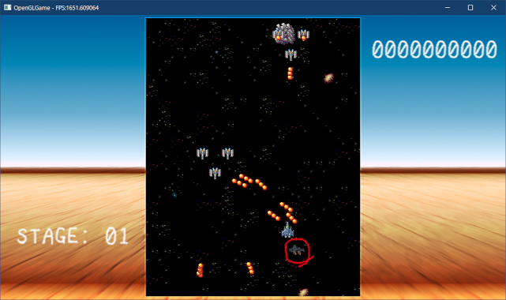
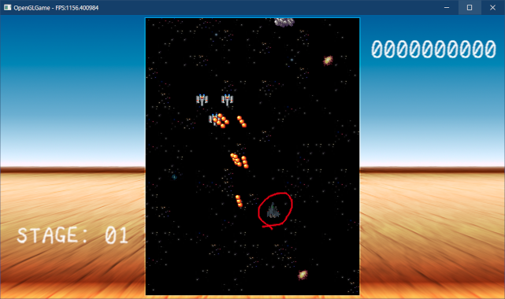

[OpenGL 3D 2022 第10回]

# スプライトからメッシュへ

## 習得目標

* カメラパラメータのわずかな違いが、メッシュの表示に大きく影響すること理解する。
* ベクトルの内積を計算できる。
* 行列とベクトルの乗算を計算できる。
* 行列と行列の乗算を計算できる。

## 1. メッシュ描画コンポーネントによる描画

### 1.1 MeshRendererコンポーネントを作成する

第09回までのプログラミングによって、OBJファイルとMTLファイルからメッシュを作り、割り当てられたマテリアルに応じた質感で表示できるようになりました。

本テキストでは、作成したメッシュを扱うコンポーネントを追加し、ゲームオブジェクト経由でメッシュの表示を操作できるようにしていきます。

まずメッシュ描画用のコンポーネントを追加します。名前は`MeshRenderer`(メッシュ・レンダラ)とします。プロジェクトの`Res/Component`フォルダに次のプログラムを追加してください。

```diff
+/**
+* @file MeshRenderer.h
+*/
+#ifndef COMPONENT_MESHRENDERER_H_INCLUDED
+#define COMPONENT_MESHRENDERER_H_INCLUDED
+#include "../Component.h"
+#include "../Mesh.h"
+#include "../VecMath.h`
+
+/**
+* メッシュ描画コンポーネント
+*/
+class MeshRenderer : public Component
+{
+public:
+  MeshRenderer() = default;
+  virtual ~MeshRenderer() = default;
+
+  Mesh::StaticMeshPtr mesh;
+  VecMath::vec3 translate = VecMath::vec3(0); // 平行移動
+  VecMath::vec3 rotate = VecMath::vec3(0);    // 回転
+  VecMath::vec3 scale = VecMath::vec3(1);     // 拡大率
+};
+using MeshRendererPtr = std::shared_ptr<MeshRenderer>;
+
+#endif // COMPONENT_MESHRENDERER_H_INCLUDED
```

それから、`GameObject`クラスに、メッシュレンダラを扱う機能を追加します。描画を行うたびに、ゲームオブジェクトに設定された全てのコンポーネントからメッシュレンダラを検索する、というのは無駄が多いので、何らかの対策が必要です。

そこで、メッシュレンダラだけを保持するリストを追加します。`GameObject.h`を開き、次の先行宣言を追加してください。

```diff
 class GameObject;
 using GameObjectPtr = std::shared_ptr<GameObject>;
 using GameObjectList = std::vector<GameObjectPtr>;
+class MeshRenderer;
+using MeshRendererPtr = std::shared_ptr<MeshRenderer>;

 /**
 * ゲーム内に登場するさまざまなオブジェクトを表す基本クラス
```

次に、`GameObject`クラス定義に、次の`private`メンバ変数を追加してください。

```diff
   bool isStarted = false;      // Start実行済みフラグ
   RectList collisionList;      // コリジョン配列
   Rect aabb = { 0, 0, 0, 0 };  // コリジョン境界ボックス
+
+  std::vector<MeshRendererPtr> meshRendererList;
 };

 #endif // GAMEOBJECT_H_INCLUDED
```

### 1.2 型の判定とコンパイル時if文

次に、メッシュレンダラを`meshRendererList`(メッシュ・レンダラ・リスト)に追加する機能を作ります。これには、「追加するコンポーネントが`MeshRenderer`かどうか(またはその派生クラス)」を判定しなくてはなりません。

C++には、まさにこれを行う`is_base_of`(イズ・ベース・オブ)というクラスが存在します。

<p><code class="tnmai_code"><strong>【書式】</strong><br>
struct is_base_of<ベースクラス, 判定するクラス>;
</code></p>

`is_base_of`は、「判定するクラス」が「ベースクラス」自身、またはその派生クラスかどうかを、メンバ変数`value`に設定するクラステンプレートです。

さて、`is_base_of`は`type_traits`(タイプ・トレイツ)ヘッダに定義されています。ということで、`GameObject.h`に次のインクルード文を追加してください。

```diff
 #include <string>
 #include <vector>
 #include <memory>
+#include <type_traits>

 // 先行宣言
 class Engine;
```

それでは型を判定しましょう。`AddComponent`関数テンプレートの定義に、次のプログラムを追加してください。

```diff
   std::shared_ptr<T> AddComponent() {
     std::shared_ptr<T> p = std::make_shared<T>();
     componentList.push_back(p);
+    // メッシュレンダラの場合は専用リストに追加
+    if constexpr (std::is_base_of<MeshRenderer, T>::value) {
+      meshRendererList.push_back(p);
+    }
     return p;
   }
```

「判定するクラス」には、`AddComponent`のテンプレート引数`T`を指定します。これにより、`T`が`MeshRenderer`かその派生クラスの場合のみ`meshRendererList.push_back(p)`
が実行されます。

また、`if constexpr`(イフ・コンストエクスプル)は「コンパイル時if」という書式で、コンパイル時に判定が行われ、実行時にはすでに結果が決まっている特殊な`if`文です。

条件式には「コンパイル時に`bool`に評価できる式」を指定する必要があります(そうでないとコンパイル時に評価できないため)。

コンパイル時ifを使うことで、実行速度に一切影響を与えることなく、`T`によって異なる処理を実行することができます。

もしここで通常のifを使った場合、`T`に`MeshRenderer`以外のコンポーネントを指定すると`meshRendererList.push_back(p)`がエラーになってしまいます。

しかし、コンパイル時ifでは`meshRendererList.push_back(p)`が完全に除去されてからコンパイルが行われます。そのため、エラーは発生しません。

これで`MeshRenderer`が専用の配列に追加されるようになりました。

>**【コンパイル時の分岐、今と昔】**<br>
>C++14まで、コンパイル時の条件分岐は「テンプレートの特殊化」や「SFINAE(スフィナエ)」を使って実装していました。しかし、特殊化などによる分岐を使うとプログラムが必要以上に複雑になるため、保守管理が難しく、バグが入り込みやすくなる、という問題がありました。C++17でコンパイル時ifが導入されたことで、保守管理しやすくバグの少ないプログラムを書けるようになりました。

### 1.3 ゲームオブジェクトにメッシュ描画関数を追加する

次に、`meshRendererList`を描画する関数を追加します。まず、`GameObject.h`に次の先行宣言を追加してください

```diff
 using GameObjectList = std::vector<GameObjectPtr>;
 class MeshRenderer;
 using MeshRendererPtr = std::shared_ptr<MeshRenderer>;
+class ProgramPipeline;

 /**
 * ゲーム内に登場するさまざまなオブジェクトを表す基本クラス
```

描画関数の名前は`DrawStaticMesh`(ドロー・スタティック・メッシュ)とします。
`AddComponent`メンバ関数の定義の下に、次のプログラムを追加してください。

```diff
     }
     return p;
   }
+
+  // 描画
+  void DrawStaticMesh(const ProgramPipeline& program) const;

   Engine* engine = nullptr;    // エンジンのアドレス
   std::string name;            // オブジェクト名
```

続いて、`GameObject.cpp`を開き、次のプログラムを追加してください。

```diff
 * @file GameObject.cpp
 */
 #include "GameObject.h"
+#include "ProgramPipeline.h"
+#include "Component/MeshRenderer.h"
+#include "VecMath.h"
 #include <algorithm>
+
+using namespace VecMath;

/**
* スタートイベント
```

それでは`DrawStaticMesh`関数を定義しましょう。`AddCollision`関数の定義の下に、次のプログラムを追加してください。

```diff
   aabb.max[0] = std::max(aabb.max[0], r.max[0]);
   aabb.max[1] = std::max(aabb.max[1], r.max[1]);
 }
+
+/**
+* ゲームオブジェクトを描画する
+*
+* @param program 描画に使用するシェーダプログラム
+*/
+void GameObject::DrawStaticMesh(const ProgramPipeline& program) const
+{
+  for (const auto& e : meshRendererList) {
+    if ( ! e->mesh) {
+      continue;
+    }
+
+    // 平行移動、回転、拡大率を設定
+    const vec3 t = e->translate + vec3(x, y, z);
+    const vec3 r = e->rotation + vec3(rotation[0], rotation[1], rotation[2]);
+    const vec3 s = e->scale;
+    glProgramUniform3f(program, 0, t.x, t.y, t.z);
+    glProgramUniform2f(program, 1, sin(r.y), cos(r.y));
+    glProgramUniform3f(program, 2, s.x, s.y, s.z);
+
+    Mesh::Draw(*e->mesh, program);
+  }
+}
```

ゲームオブジェクトのパラメータとメッシュレンダラのパラメータを合成して、その結果をユニフォーム変数に設定します。

ゲームオブジェクトのパラメータはスプライトと共有しているため、メッシュレンダラにも同じパラメータを持たせることで、メッシュ固有のパラメータを指定できるようにしています。

### 1.4 ゲームエンジンにメッシュ描画機能を追加する

次は、ゲームエンジンにメッシュを描画する機能を追加します。関数名は`DrawStaticMesh`
(ドロー・スタティック・メッシュ)とします。`Engine.h`を開き、`Engine`クラスの定義に次のプログラムを追加してください。

```diff
     GameObjectList& gameObjectList, SpriteList& spriteList);
   void DrawSpriteList(const SpriteList& spriteList,
     GLuint tex, size_t& spriteSsboOffset);
+  void DrawStaticMesh(GameObjectList& gameObjectList);
 
   GLFWwindow* window = nullptr; // ウィンドウオブジェクト
   const std::string title = "OpenGLGame"; // ウィンドウタイトル
```

続いて、`Engine.cpp`を開き、`MeshRenderer.h`をインクルードしてください。

```diff
 #include "Mesh.h"
 #include "VertexArray.h"
 #include "Component/Camera.h"
+#include "Component/MeshRenderer.h"
 #include <Windows.h>
 #include <fstream>
```

そして、`MainLoop`メンバ関数に次のプログラムを追加してください。

```diff
     // スプライト描画の直後にフェンスを作成
     syncSpriteSsbo[spriteSsboIndex] =
       glFenceSync(GL_SYNC_GPU_COMMANDS_COMPLETE, 0);
+
+    // 3Dメッシュを描画
+    DrawStaticMesh(gameObjectList);

     // 3Dモデルの表示テスト
     {
```

それでは、`DrawStaticMesh`関数を定義しましょう。この関数は「3Dモデルの表示テスト」プログラムを流用して作ります。`MainLoop`にある「3Dモデルの表示テスト」プログラム全体を選択し、`Ctrl+X`等で切り取ってください。

```diff
     // 3Dメッシュを描画
     DrawStaticMesh(gameObjectList);
-
-    // 3Dモデルの表示テスト
-    {
-      glUseProgram(*progStandard3D);
-      glBindVertexArray(*meshBuffer->GetVAO());
-          ・
-          ・
-        (省略)
-          ・
-          ・
-      glBindTextures(0, 1, nullptr);
-      glBindVertexArray(vao);
-      glUseProgram(0);
-    }

     // 音声ライブラリを更新
     Audio::Update();
```

次に、カーソルを`DrawSpriteList`関数の定義の下に移動し、切り取ったプログラムを
`Ctrl+V`で貼り付けてください。

```diff
   glDrawElementsInstanced(GL_TRIANGLES, 6, GL_UNSIGNED_SHORT, 0,
     static_cast<GLsizei>(spriteList.size()));
 }
+
+    // 3Dモデルの表示テスト
+    {
+      glUseProgram(*progStandard3D);
+      glBindVertexArray(*meshBuffer->GetVAO());
+          ・
+          ・
+        (省略)
+          ・
+          ・
+      glBindTextures(0, 1, nullptr);
+      glBindVertexArray(vao);
+      glUseProgram(0);
+    }
```

貼り付けたプログラムを、メンバ関数に改造していきます。最初に関数定義を追加します。貼り付けたプログラムの先頭を、次のように変更してください。

```diff
   glDrawElementsInstanced(GL_TRIANGLES, 6, GL_UNSIGNED_SHORT, 0,
     static_cast<GLsizei>(spriteList.size()));
 }

-    // 3Dモデルの表示テスト
+/**
+* 3Dメッシュを描画する
+*
+* @param gameObjectList 描画するゲームオブジェクトの配列
+*/
+void Engine::DrawStaticMesh(GameObjectList& gameObjectList)
     {
       glUseProgram(*progStandard3D);
       glBindVertexArray(*meshBuffer->GetVAO());
```

関数定義を追加したら、「編集」メニューから「詳細→ドキュメントのフォーマット」を選択してインデントを修復してください。

>**【インデントはとても重要】**<br>
>必ず「ドキュメントのフォーマット」を実行すること。相当によく出来た作品でもない限り、企業はインデントの揃っていない作品を即座に落とします。読み手のことを考えていないプログラムは、チーム全体の生産性を下げてしまうからです。

インデントを修復したら、次は不要なコードの削除と必要なコードの追加を行います。テスト用のテクスチャとメッシュを読み込むプログラムは不要になりました。また、27個のメッシュを表示するループも必要ありません。

`DrawStaticMesh`関数から、次のプログラムを削除してください。

```diff
     cameraObject->x, cameraObject->y, cameraObject->z);
   glProgramUniform2f(*progStandard3D, 5,
     sin(cameraObject->rotation[0]), cos(cameraObject->rotation[0]));

-  static TexturePtr texBox = Texture::Create("Res/Model/player_fighter_01.tga");
-  static float rotate = 0;
-  rotate += deltaTime;
-  glProgramUniform3f(*progStandard3D, 0, 0, 0, -2); // 平行移動
-  glProgramUniform2f(*progStandard3D, 1, sin(rotate), cos(rotate)); // Y軸回転
-  glProgramUniform3f(*progStandard3D, 2, 1, 1, 1); // 拡大縮小
-
-  const GLuint tex[] = { *texBox };
-  glBindTextures(0, 1, tex);
-  const auto mesh = meshBuffer->LoadOBJ("Res/Model/player_fighter_01.obj");
-  for (float z = 0; z < 3; ++z) {
-    for (float y = 0; y < 3; ++y) {
-      for (float x = 0; x < 3; ++x) {
-        glProgramUniform3f(*progStandard3D, 0,
-          x * 4 - 4, y * 4 - 4, z * 4 - 16);
-        Mesh::Draw(*mesh, *progStandard3D);
-      }
-    }
-  }

   glBindTextures(0, 1, nullptr);
   glBindVertexArray(vao);
```

次に、メッシュレンダラを使った描画を実装します。`DrawStaticMesh`関数を次のように変更してください。

```diff
     cameraObject->x, cameraObject->y, cameraObject->z);
   glProgramUniform2f(*progStandard3D, 5,
     sin(cameraObject->rotation[0]), cos(cameraObject->rotation[0]));

+  // メッシュレンダラを持つ全てのゲームオブジェクトを描画
+  for (const auto& gameObject : gameObjectList) {
+    gameObject->DrawStaticMesh(*progStandard3D);
+  }

   glBindTextures(0, 1, nullptr);
   glBindVertexArray(vao);
```

これで、メッシュレンダラを持つゲームオブジェクトが描画されるようになりました。

### 1.5 ゲームエンジンにOBJファイル読み込み関数を追加する

メッシュレンダラにメッシュを設定するには、当然ですがメッシュを作成しておく必要があります。そこで、ゲームエンジンにOBJファイルを読み込む関数を追加します。`Engine.h`を開き、次の先行宣言を追加してください。

```diff
 using PrimitiveBufferPtr = std::shared_ptr<PrimitiveBuffer>;
 class MeshBuffer;
 using MeshBufferPtr = std::shared_ptr<MeshBuffer>;
+struct StaticMesh;
+using StaticMeshPtr = std::shared_ptr<StaticMesh>;
 }

 /**
 * ゲームエンジン
```

OBJファイルを読み込む関数の名前は、ストレートに`LoadOBJ`(ロード・オブジェ)とします。
`Engine`クラスの定義に次のプログラムを追加してください。

```diff
     uiLayerList[layerNo].gameObjectList.push_back(p);
     return p;
   }
+
+  Mesh::StaticMeshPtr LoadOBJ(const char* filename);

 private:
   int Initialize();
```

続いて、`Engine.cpp`を開き、次のインクルード分を追加してください。

```diff
 #include "Mesh.h"
 #include "VertexArray.h"
 #include "Component/Camera.h"
+#include "Component/MeshRenderer.h"
 #include <Windows.h>
 #include <fstream>
```

次に、`ClearUILayers`メンバ関数の定義の下に、`LoadOBJ`関数の定義を追加してください。

```diff
 {
   uiLayerList.clear();
 }
+
+/**
+* OBJファイルを読み込む
+*
+* @param filename 読み込むOBJファイル名
+*
+* @return 作成したメッシュのアドレス
+*/
+Mesh::StaticMeshPtr Engine::LoadOBJ(const char* filename)
+{
+  return meshBuffer->LoadOBJ(filename);
+}

 /**
 * ゲームエンジンを初期化する
```

OBJファイルを読み込む機能は、すでに`MeshBuffer::LoadOBJ`関数として定義済みです。<br>
なので、この関数がやることは`LoadOBJ`関数を呼び出すだけです。

### 1.6 ゲームオブジェクトにメッシュレンダラを設定する

それでは、メッシュレンダラを使ってみましょう。<br>
`MainGameScene.cpp`を開き、`MeshRenderer.h`をインクルードしてください。

```diff
 #include "Component/ScoreManager.h"
 #include "Component/Score.h"
 #include "Component/AudioEvent.h"
+#include "Component/MeshRenderer.h"
 #include "GameObject.h"
 #include "SpritePriority.h"
```

次に、`Initialize`メンバ関数にある「自機を追加」するプログラムに、次のプログラムを追加してください。

```diff
   player = engine.Create<GameObject>(
     "player", static_cast<float>(bgSizeX) * 32 / 2, 64);
   player->priority = prioPlayer;
   player->AddSprite(MakeTexcoord(0, 464, 32, 48));
+  auto renderer = player->AddComponent<MeshRenderer>();
+  renderer->mesh = engine.LoadOBJ("Res/Model/player_fighter_01.obj");
   player->AddCollision({ -3, -4, 3, 4 });
   player->AddComponent<Health>();
```

プログラムが書けたらビルドして実行してください。ゲームを開始するとメッシュが・・・どこにも見当たりませんね？

<p align="center">

</p>

<div style="page-break-after: always"></div>

### 1.7 カメラパラメータを設定する

メッシュが表示されない理由は、「ゲームオブジェクトの座標がカメラの視野の外にあるから」です。カメラパラメータを変更すればすぐに表示されるはずです。

問題は、現在の`Engine`クラスには、外からカメラパラメータを設定する方法がないことです。そこで、カメラオブジェクトを取得する関数を追加します。

`Engine.h`を開き、`Engine`クラスの定義に次のプログラムを追加してください。

```diff
     return p;
   }
 
   Mesh::StaticMeshPtr LoadOBJ(const char* filename);
+
+  // メインカメラを取得
+  GameObjectPtr GetMainCameraObject() const { return cameraObject; }
+  std::shared_ptr<Camera> GetMainCamera() const {
+    return std::static_pointer_cast<Camera>(cameraObject->componentList[0]); }

 private:
   int Initialize();
```

`shared_ptr`型はポインタのように振る舞いますが、実際にはクラスなのでCやC++のキャストが使えません。そこで、キャストと同じことを行う`static_pointer_cast`(スタティック・ポインタ・キャスト)関数テンプレートが用意されています。

<p><code class="tnmai_code"><strong>【書式】</strong><br>
template&lt;typename T&gt;<br>
shared_ptr&lt;T&gt; static_pointer_cast&lt;T&gt;(元のシェアードポインタ);
</code></p>

`static_pointer_cast`は、テンプレート引数`T`が「元のシェアードポインタの派生クラス、または同じ型か基底クラス」の場合、`T`型に変換したシェアードポインタを返します。

キャストは常に成功しますが。上記の条件を満たさない場合は「未定義動作」となり、実行時エラーが発生する可能性があります。

>**【GetMainCamera関数について】**<br>
>`GetMainCamera`関数の定義では、「カメラコンポーネントはカメラオブジェクトの0番目のコンポーネントにある」と決めつけています。コンポーネントの位置と種類を決めつけるのは危険なので、できれば別の手段を取りたいのですが、現状では`componentList`から効率的にカメラコンポーネントを検索する手段がありません。とりあえず、カメラオブジェクトのコンポーネントを削除したりしなければ問題ないはずです。

それでは、カメラのパラメータを調整していきます。まず前提条件として、ゲームオブジェクトの座標は2Dスプライト用になっています。現在のスプライトの描画範囲は`(17*32, 22*32)`です。

こういったゲーム全体で決まっている数値は、ゲームエンジンから取得できると便利でしょう。
`Engine.h`を開き、`VecMath.h`をインクルードしてください。

```diff
 #include "TileMap.h"
 #include "Component/Camera.h"
 #include "GameObject.h"
+#include "VecMath.h"
 #include <GLFW/glfw3.h>
 #include <string>
```

次に、`Engine`クラスの定義に次のプログラムを追加してください。

```diff
   BgSize GetBgSize() const {
     return {bgSizeX, bgSizeY, bgBaseX, bgBaseY};
   }
+
+  // スプライト描画範囲
+  VecMath::vec2 GetViewSize() const { return { 17 * 32, 22 * 32 }; }
+
+  // ウィンドウサイズ
+  VecMath::vec2 GetWindowSize() const { return { 1280, 720 }; }

   bool GetKey(int key) const {
     return glfwGetKey(window, key) == GLFW_PRESS;
```

ちょうどいい機会なので、ウィンドウサイズも取得できるようにしてみました。

次にCPPファイルで`VecMath`名前空間を利用可能にします。`MainGameScene.cpp`を開き、次のプログラムを追加してください。

```diff
 #include "AudioSettings.h"
 #include <fstream>
 #include <filesystem>
+
+using namespace VecMath;

 // テクスチャ座標のリスト
 const Texcoord texcoordList[] = {
```

さて、カメラは描画範囲全体を視野に入れる必要があります。とりあえず、カメラを+Z軸方向に500m動かして、-Z方向を向かせます。これでXY平面を正面から見ることになります。

それから、描画範囲の中央を見るように位置を変更します。`Initialize`メンバ関数の定義に、次のプログラムを追加してください。

```diff
   // ゲームオブジェクトを削除
   engine.ClearGameObjectList();
   engine.ClearUILayers();
+
+  // カメラパラメータを設定
+  const vec2 viewSize = engine.GetViewSize();
+  auto cameraObject = engine.GetMainCameraObject();
+  cameraObject->x = viewSize.x / 2;
+  cameraObject->y = viewSize.y / 2;
+  cameraObject->z = 500;
+  cameraObject->rotation[0] = 0;

   // 自機を追加
   player = engine.Create<GameObject>(
```

プログラムが書けたらビルドして実行してください。・・・まだ表示されませんね。あ、いえ、自機を大きく移動させると時々ちらっと数ドットのなにかが表示されます。バグにしか見えませんが、何かが表示されてはいるようです。

この現象の原因は、「メッシュの表示サイズが小さすぎる」ことです。自機のメッシュは2x3の大きさで作成したので、544x704の画面の中では数ドットにしかならないのです。

そこで、表示サイズを大きくします。元の画像は32x48ドットなので、`16`倍すればほぼ同じ大きさで表示されるはずです。`MainGameScene.cpp`を開き、`Initialize`関数にある「自機を追加」するプログラムに、次のプログラムを追加してください。

```diff
   player->AddSprite(MakeTexcoord(0, 464, 32, 48));
   auto renderer = player->AddComponent<MeshRenderer>();
   renderer->mesh = engine.LoadOBJ("Res/Model/player_fighter_01.obj");
+  renderer->scale = vec3(16);
   player->AddCollision({ -3, -4, 3, 4 });
   player->AddComponent<Health>();
```

プログラムが書けたらビルドして実行してください。自機を移動させて、自機の3Dモデルが画面に表示されたら成功です。とはいえ、スプライトの自機とは表示位置がずれていますし、左右に移動すると描画範囲の外側にはみ出してしまいます。

<p align="center">

</p>

自機のメッシュが描画範囲より外に出てしまう理由は以下の2つです。

1. ビューポートが描画範囲と一致していない。
2. カメラの視野角とアスペクト比が描画範囲と一致していない。

まず、1のビューポートを設定しましょう。ビューポート用のパラメータを`Camera`コンポーネントに追加します。`Camera.h`を開き、次のプログラムを追加してください。

```diff
 #define COMPONENT_CAMERA_H_INCLUDED
 #include "../Component.h"
 #include <cmath>
+
+/**
+* ビューポート
+*/
+struct Viewport
+{
+  int x;      // 左下X座標
+  int y;      // 左下Y座標
+  int width;  // 幅
+  int height; // 高さ
+};

 /**
 * カメラコンポーネント
```

次に、`Camera`クラスの定義に次のプログラムを追加してください。

```diff
   float far = 1000; // 遠平面
   float fovY = 60;  // 視野角
   float aspect = 720.0f / 1280.0f; // アスペクト比
+  Viewport viewport = { 0, 0, 1280, 720 };

   // ユニフォーム変数に設定するパラメータ
   float fovScaleX = 1;  // 視野角による拡大率
```

続いて、`viewport`変数をビューポートに反映するプログラムを追加します。`Engine.cpp`
を開き、`DrawStaticMesh`メンバ関数の定義に次のプログラムを追加してください。

```diff
     cameraObject->x, cameraObject->y, cameraObject->z);
   glProgramUniform2f(*progStandard3D, 5,
     sin(cameraObject->rotation[0]), cos(cameraObject->rotation[0]));
+
+  // ビューポートを設定
+  glViewport(
+    camera.viewport.x, camera.viewport.y,
+    camera.viewport.width, camera.viewport.height);

   // メッシュレンダラを持つ全てのゲームオブジェクトを描画
   for (const auto& gameObject : gameObjectList) {
```

それでは、ビューポートを設定しましょう。`MainGameScene.cpp`を開き、カメラパラメータを設定するプログラムに、次のプログラムを追加してください。

```diff
   cameraObject->y = viewSizeY / 2;
   cameraObject->z = 500;
   cameraObject->rotation[0] = 0;
+  auto cameraComponent = engine.GetMainCamera();
+  const vec2 windowSize = engine.GetWindowSize();
+  cameraComponent->viewport = {
+    static_cast<int>(windowSize.x - viewSize.x) / 2,
+    static_cast<int>(windowSize.y - viewSize.y) / 2,
+    static_cast<int>(viewSizeX),
+    static_cast<int>(viewSizeY) };

   // 自機を追加
   player = engine.Create<GameObject>(
```

プログラムが書けたらビルドして実行してください。自機のメッシュが小さくなり、描画範囲の外に出た場合は描画されなくなっていたら成功です。

<p align="center">

</p>

しかし、まだメッシュの大きさが小さすぎるようです。それに、ビューポートを設定する前よりも左右に移動できる範囲が狭くなってしまいました。これを改善するには、視野角とアスペクト比を設定する必要があります。

視野角はタンジェントを使って計算します。目標となる縦方向の視野は`viewSize.y * 0.5`なので、`(viewSize.y * 0.5) / cameraObject->z`とすることで視野角の半分のタンジェントを計算できます。

<p align="center">
<br>
[θ=視野角/2]
</p>

タンジェントから視野角に変換するには`atan`(エー・タン、またはアーク・タンジェント)関数を使います。

<p><code class="tnmai_code"><strong>【書式】</strong><br>
元の角度 atan(タンジェントの値);
</code></p>

`atan`関数は`tan`関数の逆のことを行います。つまり、

`t = tan(θ)`<br>
`θ = atan(t)`

ということです。

それでは、カメラパラメータを設定するプログラムに、次のプログラムを追加してください。

```diff
   cameraObject->y = viewSizeY / 2;
   cameraObject->z = 500;
   cameraObject->rotation[0] = 0;
+
+  // 垂直視野角を計算
+  auto cameraComponent = engine.GetMainCamera();
+  const float tanTheta = (viewSize.y * 0.5f) / cameraObject->z;
+  cameraComponent->fovY = VecMath::degrees(atan(tanTheta)) * 2;

   // 自機を追加
   player = engine.Create<GameObject>(
```

第08回で作成したカメラのプログラムの場合、`fovY`変数には度数法の値を設定する必要があります。しかし`atan`の戻り値は弧度法(ラジアン)です。そこで、`VecMath.h`に定義した
`degrees`関数を使って度数法に戻しています。

アスペクト比は表示範囲の縦横比なので、`viewSize.y / viewSize.x`で求められます。
`fovY`を計算するプログラムの下に、次のプログラムを追加してください。

```diff
   auto cameraComponent = engine.GetMainCamera();
   const float tanTheta = (viewSize.y * 0.5f) / cameraObject->z;
   cameraComponent->fovY = VecMath::degrees(atan(tanTheta)) * 2;
+
+  // アスペクト比を計算
+  cameraComponent->aspect = viewSize.y / viewSize.x;

   // 自機を追加
   player = engine.Create<GameObject>(
```

プログラムが書けたらビルドして実行してください。自機のメッシュがスプライトに重なって移動していたら、カメラパラメータの設定は成功です。

<p align="center">

</p>

>**【1章のまとめ】**
>
>* 特定のコンポーネントだけを頻繁に必要とする場合、専用の配列を作ることで検索コストを無くせる。
>* コンパイル時ifを使うと、テンプレート引数によって処理を分けることができる。
>* カメラパラメータがほんの少し意図した値と違うだけで、メッシュの描画結果は大きく変化する。

<div style="page-break-after: always"></div>

## 2. 回転と行列

### 2.1 3Dメッシュ用シェーダにX軸回転を追加する

現在、メッシュの`rotation`メンバ変数は、Y軸回転にしか対応していません。<br>
しかし、自機を上から見下ろしたように表示するには、X軸で回転させる必要があります。

そこで、X軸用のコサインとサインを追加します。`standard_3D.vert`を開き、次のユニフォーム変数を追加してください。

```diff
 layout(location=0) uniform vec3 translate;
 layout(location=1) uniform vec2 sincos;
 layout(location=2) uniform vec3 scale;
+layout(location=6) uniform vec2 sincosX;

 void main()
 {
```

ロケーション番号が`6`なのは、`3`～`5`はカメラのパラメータで使用済みだからです。

次に、`main`関数にX軸回転を行うプログラムを追加してください。

```diff
 {
   // 拡大縮小
   vec3 pos = inPosition * scale;
+
+  // X軸回転
+  float sx = sincosX.x;
+  float cx = sincosX.y;
+  outPosition.y = pos.y * cx - pos.z * sx;
+  outPosition.z = pos.y * sx + pos.z * cx;
+  pos.yz = outPosition.yz;

   // Y軸回転
   float s = sincos.x;
```

Y軸回転ではXZ平面上で回転しましたが、X軸回転の場合はYZ平面上で回転します。そのため、回転の順序が異なると、回転の結果も異なります。

おなじことを法線に対しても行います。ワールド法線を計算するプログラムを次のように変更してください。

```diff
   outPosition += translate;

   // ワールド法線を計算
+  float ny = inNormal.y * cx - inNormal.z * sx;
+  float nz = inNormal.y * sx + inNormal.z * cx;
-  outNormal.x = inNormal.x * c + inNormal.z * s;
-  outNormal.y = inNormal.y;
-  outNormal.z = inNormal.x * -s + inNormal.z * c;
+  outNormal.x = inNormal.x * c + nz * s;
+  outNormal.y = ny;
+  outNormal.z = inNormal.x * -s + nz * c;

   // カメラの位置が原点となるように平行移動
   pos = outPosition - cameraPosition;
```

シェーダの変更はこれで完了です。次はユニフォーム変数にX軸回転用のサインとコサインを設定します。`GameObject.cpp`を開き、`DrawStaticMesh`メンバ関数の定義に次のプログラムを追加してください。

```diff
     glProgramUniform3f(program, 0, t.x, t.y, t.z);
     glProgramUniform2f(program, 1, sin(r.y), cos(r.y));
     glProgramUniform3f(program, 2, s.x, s.y, s.z);
+    glProgramUniform2f(program, 6, sin(r.x), cos(r.x));

     Mesh::Draw(*e->mesh, program);
   }
```

今回作成したX軸回転の式は、X軸プラス方向からマイナス方向へむかって反時計回りになるように作っています。これは、OpenGLの標準的な回転方向です。そのため、90度回転させると、機首が上に回転します。

これで、`r.x`の値からサインとコサインが計算され、ユニフォーム変数を設定されるようになりました。

それではX軸の回転を設定しましょう。`MainGameScene.cpp`を開き、`Initialize`メンバ関数にある「自機を追加」するプログラムに、次のプログラムを追加してください。

```diff
   auto renderer = player->AddComponent<MeshRenderer>();
   renderer->mesh = engine.LoadOBJ("Res/Model/player_fighter_01.obj");
   renderer->scale = vec3(16);
+  renderer->rotation.x = radians(90);
   player->AddCollision({ -3, -4, 3, 4 });
   player->AddComponent<Health>();
```

プログラムが書けたらビルドして実行してください。自機のメッシュが上から見た状態で表示されていたら成功です。

<p align="center">

</p>

### 2.2 計算をまとめる

Y軸回転の`pos.y`と`pos.z`にX軸回転の式を代入すると、X軸回転とY軸回転をひとつの式にまとめられます。X軸回転とY軸回転の式を次のように変更してください。

```diff
   // X軸回転
   float sx = sincosX.x;
   float cx = sincosX.y;
-  outPosition.y = pos.y * cx - pos.z * sx;
-  outPosition.z = pos.y * sx + pos.z * cx;
-  pos.yz = outPosition.yz;
 
   // Y軸回転
   float s = sincos.x;
   float c = sincos.y;
-  outPosition.x = pos.x * c + pos.z * s;
+  outPosition.x = pos.x * c + (pos.y * sx + pos.z * cx) * s;
-  outPosition.y = pos.y;
+  outPosition.y = pos.y * cx - pos.z * sx;
-  outPosition.z = pos.x * -s + pos.z * c;
+  outPosition.z = pos.x * -s + (pos.y * sx + pos.z * cx) * c;

   // 平行移動
   outPosition += translate;
```

次に、サインとコサインをまとめて括弧をはずします。

```diff
   // Y軸回転
   float s = sincos.x;
   float c = sincos.y;
-  outPosition.x = pos.x * c + (pos.y * sx + pos.z * cx) * s;
+  outPosition.x = pos.x * c + pos.y * sx * s + pos.z * cx * s;
   outPosition.y = pos.y * cx - pos.z * sx;
-  outPosition.z = pos.x * -s + (pos.y * sx + pos.z * cx) * c;
+  outPosition.z = pos.x * -s + pos.y * sx * c + pos.z * cx * c;

   // 平行移動
   outPosition += translate;
```

式は複雑になりましたが、行数を減らすことができました。プログラムが書けたらビルドして実行してください。メッシュが、式をまとめる前と同じように表示にされていたら成功です。

### 2.3 内積(ないせき)

ベクトル型を使った計算では、回転のように「各要素の乗算結果をすべて加算する」という操作がよくあります。例えば、回転の計算は「座標にサインまたはコサインを掛けてから足す」という操作になっていました。

実は、「2つのベクトルの要素同士を乗算し、すべて加算する」という操作は、前回出てきた「内積(ないせき)」の計算方法でもあります。

3次元ベクトルA, Bがあるとすると、内積は以下の式で表されます。

>`内積 = A.x * B.x + A.y * B.y + A.z * B.z`

さて、GLSLで内積を行うには`dot`(ドット)関数を使うのでした。`dot`関数を使って回転の計算を書き直してみましょう。`standard_3D.vert`を開き、X軸回転のプログラムを次のように変更してください。

```diff
   // Y軸回転
   float s = sincos.x;
   float c = sincos.y;
-  outPosition.x = pos.x * c + pos.y * sx * s + pos.z * cx * s;
-  outPosition.y = pos.y * cx - pos.z * sx;
-  outPosition.z = pos.x * -s + pos.y * sx * c + pos.z * cx * c;
+  outPosition.x = dot(pos, vec3(c, sx * s, cx * s));
+  outPosition.y = dot(pos, vec3(0, cx, -sx));
+  outPosition.z = dot(pos, vec3(-s, sx * c, cx * c));

   // 平行移動
   outPosition += translate;
```

>**【「dot関数=内積」とは限らない】**<br>
>上記のプログラムでは、`dot`関数を単に「特定の計算をしてくれる関数」として使用しています。角度を求めているわけではありません。内積の計算式は汎用性が高いので、角度以外の計算に使われることも多いのです。プログラムで`dot`関数を見かけたら、角度を求めたいのか、計算式を利用したいだけなのかを見極める必要があります。

プログラムが書けたらビルドして実行してください。メッシュが、式を内積で置き換える前と同じように表示されたら成功です。

同様に、ワールド法線の回転も`dot`関数で置き換えましょう。まず式をまとめます。ワールド法線を計算するプログラムを次のように変更してください。

```diff
   outPosition += translate;

   // ワールド法線を計算
-  float ny = inNormal.y * cx - inNormal.z * sx;
-  float nz = inNormal.y * sx + inNormal.z * cx;
-  outNormal.x = inNormal.x * c + nz * s;
-  outNormal.y = ny;
-  outNormal.z = inNormal.x * -s + nz * c;
+  outNormal.x = inNormal.x * c + (inNormal.y * sx + inNormal.z * cx) * s;
+  outNormal.y = inNormal.y * cx - inNormal.z * sx;
+  outNormal.z = inNormal.x * -s + (inNormal.y * sx + inNormal.z * cx) * c;

   // カメラの位置が原点となるように平行移動
   pos = outPosition - cameraPosition;
```

次に式を`dot`関数で置き換えます。ワールド法線を計算するプログラムを、次のように変更してください。

```diff
   outPosition += translate;

   // ワールド法線を計算
-  outNormal.x = inNormal.x * c + (inNormal.y * sx + inNormal.z * cx) * s;
-  outNormal.y = inNormal.y * cx - inNormal.z * sx;
-  outNormal.z = inNormal.x * -s + (inNormal.y * sx + inNormal.z * cx) * c;
+  outNormal.x = dot(inNormal, vec3(c, sx * s, cx * s));
+  outNormal.y = dot(inNormal, vec3(0, cx, -sx));
+  outNormal.z = dot(inNormal, vec3(-s, sx * c, cx * c));

   // カメラの位置が原点となるように平行移動
   pos = outPosition - cameraPosition;
```

プログラムが書けたらビルドして実行してください。メッシュが、ワールド法線の計算を内積で置き換える前と同じように表示されていたら成功です。

このように、内積を使うと式を短くすることができます。

<div style="page-break-after: always"></div>

### 2.4 行列

内積を使うことでかなり式が簡単になりましたが、実はさらに簡単に書く方法があります。<br>
それは「行列(ぎょうれつ)」を使った方法です。

行列はベクトルをまとめたものです。例えば回転の計算で使った内積の第2引数は、以下の行列に変換できます。

>```c++
>mat3x3 m = {
>  {      c,   0,     -s },
>  { sx * s,  cx, sx * c },
>  { cx * s, -sx, cx * c },
>};
>```

ここで、`mat3x3`(マット・スリー・バイ・スリー)は「3列3行の行列」を意味します。
`mat`は`matrix`(マトリックス)の短縮形です。`3x3`の最初の`3`は列数(配列のサイズ)、後ろの`3`が行数(ベクトルのサイズ)です。

>内積の第2引数の値が「縦に並んでいる」ことに注意してください。これは、OpenGLの慣習で縦に並べることになっているからです(横並びの行列も作れます)。

`mat3x3`は`float[3][3]`または`vec3[3]`と同じです。<br>
行数を減らした`mat2x3`は`float[2][3]`または`vec3[2]`と同じです。<br>
ベクトル配列だけ数字の並びが逆になる点に注意してください。

このように、行列は「ベクトルの配列」または「`float`の2次元配列」になっています。なお、GLSLには`mat1x3`という型は存在しません。1行の行列は単なるベクトルだからです。

実際、ベクトルは行列の特殊なケース(N列1行または1列N行の行列)と考えることができます。

>**【行列を使う理由】**<br>
>`vec3`の配列のかわりに行列を使う利点は、行列用の関数や演算子が使えることです。これは、`float`の配列のかわりにベクトルを使うのと同じ理由です。

ベクトルと行列を乗算した結果はベクトルになります。注意したいのは、「ベクトル×行列」と「行列×ベクトル」では少し計算方法が異なる、という点です。当然、計算結果も異なります。

3次元ベクトルAと3列3行の行列Mがあるとすると、結果の3次元ベクトルBの値は次のように計算されます。

>```c++
>// B = A * Mの場合
>B.x = dot(A, M[0]);
>B.y = dot(A, M[1]);
>B.z = dot(A, M[2]);
>
>// B = M * Aの場合
>B.x = dot(vec3(M[0].x, M[1].x, M[2].x), A);
>B.y = dot(vec3(M[0].y, M[1].y, M[2].y), A);
>B.z = dot(vec3(M[0].z, M[1].z, M[2].z), A);
>```

ここで、`M[0]`は行列の1行目のベクトル, `M[1]`は2行目のベクトル, `M[2]`は3行目のベクトルを意味します。OpenGLでは主に後者の乗算を使います。

また、GLSLでは、`mat3x3`のような「行と列の数が等しい」行列は、`mat3`のように短縮することができます。通常は短縮形を使います。`mat3x2`などの列数と行数が異なる行列はあまり使わないからです。

それでは、ベクトルの内積を使った計算を、行列を使った計算で置き換えてみましょう。行列変数の名前は`matRotate`(マット・ローテート)とします。座標の回転の計算を次のように変更してください。

```diff
   // 拡大縮小
   vec3 pos = inPosition * scale;

-  // X軸回転
+  // 回転
   float sx = sincosX.x;
   float cx = sincosX.y;
-
-  // Y軸回転
   float s = sincos.x;
   float c = sincos.y;
-  outPosition.x = dot(pos, vec3(c, sx * s, cx * s));
-  outPosition.y = dot(pos, vec3(0, cx, -sx));
-  outPosition.z = dot(pos, vec3(-s, sx * c, cx * c));
+  mat3 matRotate = { 
+    {      c,   0,     -s },
+    { sx * s,  cx, sx * c },
+    { cx * s, -sx, cx * c },
+  };
+  outPosition = matRotate * pos;

   // 平行移動
   outPosition += translate;

   // ワールド法線を計算
-  outNormal.x = dot(inNormal, vec3(c, sx * s, cx * s));
-  outNormal.y = dot(inNormal, vec3(0, cx, -sx));
-  outNormal.z = dot(inNormal, vec3(-s, sx * c, cx * c));
+  outNormal = matRotate * inNormal;

   // カメラの位置が原点となるように移動
   pos = outPosition - cameraPosition;
```

このように、行列を使うとプログラムを短く書くことができます。プログラムが書けたらビルドして実行してください。メッシュが、行列に変更する前と同じように表示されていたら成功です。

### 2.5 拡大縮小を行列にまとめる

実は、回転だけでなく、拡大縮小も行列にまとめられます。内積は「掛け算をして次に足し算をする」という仕組みなので、掛け算のとき、一緒に拡大縮小をやってしまうことができるからです。

拡大縮小の計算と行列の作成を、次のように変更してください。

```diff
 void main()
 {
-  // 拡大縮小
-  vec3 pos = inPosition * scale;

-  // 回転
+  // 拡大縮小と回転
   float sx = sincosX.x;
   float cx = sincosX.y;
   float s = sincos.x;
   float c = sincos.y;
-  mat3 matRotate = { 
+  mat3 matRotateScale = { 
-    {      c,   0,     -s },
-    { sx * s,  cx, sx * c },
-    { cx * s, -sx, cx * c },
+    scale.x * vec3(c, 0, -s),
+    scale.y * vec3(sx * s, cx, sx * c),
+    scale.z * vec3(cx * s, -sx, cx * c),
   };
-  outPosition = matRotate * pos;
+  outPosition = matRotateScale * inPosition;

   // 平行移動
   outPosition += translate;

   // ワールド法線を計算
-  outNormal = matRotate * inNormal;
+  outNormal = matRotateScale * inNormal;

   // カメラの位置が原点となるように移動
-  pos = outPosition - cameraPosition;
+  vec3 pos = outPosition - cameraPosition;

   // カメラの右方向がX軸、正面がZ軸となるように回転
   s = -cameraSinCosX.x; // 回転方向を反時計回りから時計回りに変換
```

このように、行列を作る全てのベクトルに拡大縮小の値を掛け合わせることで、回転と拡大縮小をひとつの行列に組み込むことができます。また、ベクトルの乗算を使うために、書き方を`{}`から`vec3()`に置き換えています。

回転と拡大縮小をまとめられるのは便利ですが、この方法にはひとつ問題があります。その問題とは、

>ワールド法線の計算には「拡大率の逆数」を使う必要がある

ということです。頂点座標と同じ拡大率が含まれた行列を掛けると、法線が歪んで正しい向きにならない可能性があるからです。

まず、拡大縮小していない場合は何もする必要はありません。また、X, Y, Zの拡大率が全て等しい場合も、計算後に正規化(`normalize`)すれば修正できます。

問題は「軸によって拡大率が異なる」場合です。これは、例えば拡大率が`(2, 1, 1)`の場合を指します。このような拡大率を含む行列を使って法線を変換すると、平面の法線にはならずに歪んだ法線になってしまいます。

法線の角度が歪まないようにするには、「拡大率の逆数を掛けた回転行列」を使わなくてはなりません。この特殊な行列は、`inverse`(インバース)関数と`transpose`(トランスポーズ)関数を組み合わせることで作成できます。

それでは、ワールド法線の計算を次のように変更してください。

```diff
   // 平行移動
   outPosition += translate;

   // ワールド法線を計算
-  outNormal = matRotateScale * inNormal;
+  mat3 matNormal = transpose(inverse(matRotateScale));
+  outNormal = normalize(matNormal * inNormal);

   // カメラの位置が原点となるように移動
   vec3 pos = outPosition - cameraPosition;
```

`matNormal`(マット・ノーマル)は、法線変換用の行列です。

さて、`inverse`(インバース)関数は、行列の「逆行列(ぎゃくぎょうれつ)」を計算します。

<p><code class="tnmai_code"><strong>【書式】</strong><br>
逆行列 inverse(行列);
</code></p>

逆行列とは、

>元の行列に掛けると、結果が「単位行列(たんいぎょうれつ)」になる

ような行列のことです。

>**【単位行列】**<br>
>単位行列は、左上から右下へ向かう対角線だけが`1`で、他はすべて`0`の行列です。
>
>```c++
>// 単位行列
>mat3 I = {
>  { 1, 0, 0 },
>  { 0, 1, 0 },
>  { 0, 0, 1 } };
>```

行列`M`と、Mの逆行列`M(-1)`があるとして(逆行列は右上に`-1`を書く)、この2つを掛けると次のようになります。

`M * M(-1) = I`

なお、逆行列を求める計算はそれほど難しくないのですが、3D表示をするだけなら知らなくても問題ありません。なので、詳しい説明は省略します(「掃き出し法」、「余因子」または「LU分解」を使います)。

次に`transpose`(トランスポーズ)関数を説明します。この関数は「転置行列(てんちぎょうれつ)」を計算します。

<p><code class="tnmai_code"><strong>【書式】</strong><br>
転置行列 transpose(行列);
</code></p>

転置行列とは、

>左上から右下へ向かう対角線を軸にして、左下と右上の要素を反転

させた行列のことです。

>**【転置行列の例】**
>
>```c++
>{ 1, 2, 3 }          { 1, 4, 7 }
>{ 4, 5, 6 } →(転置)→ { 2, 5, 8 }
>{ 7, 8, 9 }          { 3, 6, 9 }
>```

このように、転置行列は対角線を挟んで右上と左下を入れ替えるだけで作ることができます。

ただ、逆行列と転置行列を組み合わせると、なぜ「拡大率の逆数を掛けた回転行列」が作れるのか、という問題は、ややこしい話になるので省略します。ここでは、

>1. 「拡大率の逆数を掛けた回転行列」を作るには、`inverse`(インバース)して<br>`transpose`(トランスポーズ)する。この行列は「逆転置行列」という。
>2. 法線に逆転置行列を掛けた結果は単位ベクトルにならない(ことがある)ので、正規化する必要がある。

の2点を覚えておけば十分です。こうして作られた「法線を回転させる行列」のことを「法線行列」と言います。

さて、プログラムが書けたらビルドして実行してください。自機のメッシュが、計算を行列で置き換える前と同じように表示されていたら成功です。

>逆転置行列の必要性については、以下のBlogが参考になります。<br>
>`https://paroj.github.io/gltut/Illumination/Tut09%20Normal%20Transformation.html`

### 2.6 C++で行列を使えるようにする

`matRotateScale`変数の計算に使っているのはユニフォーム変数だけです。ということは、シェーダで計算しなくても、C++アプリ側で計算してシェーダに送ることができるはずです。

そこで、C++用の行列型を追加し、それを使ってユニフォーム変数にデータをコピーできるようにしましょう。

行列型は`VecMath.h`に追加します。`VecMath.h`を開き、`vec4`構造体の定義の下に、次のプログラムを追加してください。

```diff
   float& operator[](size_t n) { return *(&x + n); }
   const float& operator[](size_t n) const { return *(&x + n); }
 };
+
+/**
+* 3x3行列
+*/
+struct mat3
+{
+  vec3 data[3];
+
+  // コンストラクタ
+  mat3() = default;
+  mat3(const vec3& v0, const vec3& v1, const vec3& v2) {
+    data[0] = v0;
+    data[1] = v1;
+    data[2] = v2;
+  }
+  explicit mat3(float s) {
+    data[0] = vec3(s, 0, 0);
+    data[1] = vec3(0, s, 0);
+    data[2] = vec3(0, 0, s);
+  }
+
+  // 添字演算子
+  vec3& operator[](size_t n) { return data[n]; }
+  const vec3& operator[](size_t n) const { return data[n]; }
+};

 } // namespace VecMath
```

次に、`matRotateScale`変数の定義を選択し、`Ctrl+X`で切り取ってください(エラーが出ますが、今は無視します)。

```diff
 void main()
 {
   // 拡大縮小と回転
-  float sx = sincosX.x;
-  float cx = sincosX.y;
-  float s = sincos.x;
-  float c = sincos.y;
-  mat3 matRotateScale = { 
-    scale.x * vec3(c, 0, -s),
-    scale.y * vec3(sx * s, cx, sx * c),
-    scale.z * vec3(cx * s, -sx, cx * c),
-  };
   outPosition = inPosition * matRotateScale;

   // 平行移動
```

次に`GameObject.cpp`を開き、`DrawStaticMesh`メンバ関数の定義に、切り取ったプログラムを貼り付けてください(「ドキュメントのフォーマット」などでインデントを修正すること)。

```diff
     const vec3 t = e->translate + vec3(x, y, z);
     const vec3 r = e->rotation + vec3(rotation[0], rotation[1], rotation[2]);
     const vec3 s = e->scale * scale;
+    float sx = sincosX.x;
+    float cx = sincosX.y;
+    float s = sincos.x;
+    float c = sincos.y;
+    mat3 matRotateScale = { 
+      scale.x * vec3(c, 0, -s),
+      scale.y * vec3(sx * s, cx, sx * c),
+      scale.z * vec3(cx * s, -sx, cx * c),
+    };
     glProgramUniform3f(program, 0, t.x, t.y, t.z);
     glProgramUniform2f(program, 1, sin(r.y), cos(r.y));
```

コンパイルが通るように、貼り付けたプログラムを次のように変更してください。

```diff
     const vec3 t = e->translate + vec3(x, y, z);
     const vec3 r = e->rotation + vec3(rotation[0], rotation[1], rotation[2]);
     const vec3 s = e->scale * scale;
-    float sx = sincosX.x;
-    float cx = sincosX.y;
-    float s = sincos.x;
-    float c = sincos.y;
+    float sx = sin(r.x);
+    float cx = cos(r.x);
+    float sy = sin(r.y);
+    float cy = cos(r.y);
     mat3 matRotateScale = { 
-      scale.x * vec3(c, 0, -s),
-      scale.y * vec3(sx * s, cx, sx * c),
-      scale.z * vec3(cx * s, -sx, cx * c),
+      s.x * vec3(cy, 0, -sy),
+      s.y * vec3(sx * sy, cx, sx * cy),
+      s.z * vec3(cx * sy, -sx, cx * cy),
     };
     glProgramUniform3f(program, 0, t.x, t.y, t.z);
```

次に、拡大縮小+回転行列をユニフォーム変数として受け取れるように、頂点シェーダの回転と拡大率のユニフォーム変数を`mat3`に変更します。`standard_3D.vert`を開き、ユニフォーム変数の定義を次のように変更してください。

```diff
 // プログラムからの入力
 layout(location=0) uniform vec3 translate;
-layout(location=1) uniform vec2 sincos;
-layout(location=2) uniform vec3 scale;
-layout(location=6) uniform vec2 sincosX;
+layout(location=1) uniform mat3 matRotateScale;

 // x: 視野角による水平拡大率
 // y: 視野角による垂直拡大率
```

これで頂点シェーダのエラーは消えると思います。

それでは、行列をユニフォーム変数にコピーしましょう。`GameObject.cpp`を開き、
`DrawStaticMesh`メンバ関数の定義を次のように変更してください。

```diff
       s.z * vec3(cx * sy, -sx, cx * cy),
     };
     glProgramUniform3f(program, 0, t.x, t.y, t.z);
-    glProgramUniform2f(program, 1, sin(r.y), cos(r.y));
-    glProgramUniform3f(program, 2, s.x, s.y, s.z);
-    glProgramUniform2f(program, 6, sin(r.x), cos(r.x));
+    glProgramUniformMatrix3fv(program, 1, 1, GL_FALSE, &matRoatteScale[0][0]);

     Mesh::Draw(*e->mesh, program);
   }
```

`glProgramUniformMatrix3fv`(ジーエル・プログラム・ユニフォーム・マトリックス・スリー・エフ・ブイ)関数は、3x3行列をユニフォーム変数にコピーします。

<p><code class="tnmai_code"><strong>【書式】</strong><br>
void glProgramUniformMatrix3fv(プログラムオブジェクトの管理番号,<br>
&emsp;コピー先ロケーション番号, コピーする行列の個数, 正規化の有無,<br>
&emsp;コピーするデータのアドレス);
</code></p>

`glProgramUniform`系の関数のうち、末尾に`v`が付くものはデータをアドレスで受け取ります。`v`系関数は、コピーするデータの数を、ベクトルまたは行列の個数として指定します。

プログラムが書けたらビルドして実行してください。自機のメッシュが、ユニフォーム変数を`mat3`に変更する前と全く同じように表示されていたら成功です。

### 2.7 平行移動を行列にまとめる

実は、平行移動も行列にまとめることができます。しかし、そのためには3x3行列の`mat3`ではなく4x4行列の`mat4`を使う必要があります。

まずは`VecMath.h`に`mat4`型を定義しましょう。`VecMath.h`を開き、`mat3`型の定義の下に次のプログラムを追加してください(`mat3`をコピペして改造すると早いです)。

```diff
   vec3& operator[](size_t n) { return data[n]; }
   const vec3& operator[](size_t n) const { return data[n]; }
 };
+
+/**
+* 4x4行列
+*/
+struct mat4
+{
+  vec4 data[4];
+
+  mat4() = default;
+  mat4(const vec4& v0, const vec4& v1, const vec4& v2, const vec4& v3) {
+    data[0] = v0;
+    data[1] = v1;
+    data[2] = v2;
+    data[3] = v3;
+  }
+  explicit mat4(float s) {
+    data[0] = vec4(s, 0, 0, 0);
+    data[1] = vec4(0, s, 0, 0);
+    data[2] = vec4(0, 0, s, 0);
+    data[3] = vec4(0, 0, 0, s);
+  }
+
+  // 添字演算子
+  vec4& operator[](size_t n) { return data[n]; }
+  const vec4& operator[](size_t n) const { return data[n]; }
+};

 } // namespace VecMath
```

次に`GameObject.cpp`を開き、`DrawStaticMesh`メンバ関数にある、行列を作成してユニフォーム変数にコピーするプログラムを、次のように変更してください。

```diff
     float sy = sin(r.y);
     float cy = cos(r.y);
-    mat3 matRotateScale = { 
+    mat4 matModel = { 
-      s.x * vec3(cy, 0, -sy),
-      s.y * vec3(sx * sy, cx, sx * cy),
-      s.z * vec3(cx * sy, -sx, cx * cy),
+      vec4(s.x * vec3(cy, 0, -sy), 0),
+      vec4(s.y * vec3(sx * sy, cx, sx * cy), 0),
+      vec4(s.z * vec3(cx * sy, -sx, cx * cy), 0),
+      vec4(t, 1),
     };
-    glProgramUniform3f(program, 0, t.x, t.y, t.z);
-    glProgramUniformMatrix3fv(program, 1, 1, GL_FALSE, &matRotateScale[0][0]);
+    glProgramUniformMatrix4fv(program, 0, 1, GL_FALSE, &matModel[0][0]);
 
     Mesh::Draw(*e->mesh, program);
   }
```

`mat4`を作るには`vec3`ではなく`vec4`を使う必要があります。そこで、`vec4`のコンストラクタを使って`vec3`から`vec4`に変換しています(もし`vec3`から変換するコンストラクタを定義していない場合は追加すること)。

また、行列変数の名前を`matModel`(マット・モデル)に変更しました。ゲームオブジェクトの平行移動、回転、拡大縮小をまとめた行列は「モデル行列」と呼ばれるからです。この名前は、3D表示物を3Dモデルと呼ぶことから来ています。

>**【関数名と引数のわずかな違いに注意！】**<br>
>上記のプログラムでは、コピーする変数の型が`mat4`になったため、関数名の末尾にある数字が`3`から`4`に変わっています。また、「コピー先ロケーション番号」が`1`から`0`に変わっている点にも注意してください。

続いて、頂点シェーダを変更します。`standard_3D.vert`を開き、ユニフォーム変数の定義を次のように変更してください。

```diff
 layout(location=2) out vec3 outNormal;

 // プログラムからの入力
-layout(location=0) uniform vec3 translate;
-layout(location=1) uniform mat3 matRotateScale;
+layout(location=0) uniform mat4 matModel;

 // x: 視野角による水平拡大率
 // y: 視野角による垂直拡大率
```

そして、拡大縮小と回転を行うプログラムと、ワールド法線を計算するプログラムを、次のように変更してください。

```diff
 void main()
 {
-  // 拡大縮小と回転
+  // 拡大縮小と回転と平行移動
-  outPosition = matRotateScale * inPosition;
+  outPosition = vec3(matModel * vec4(inPosition, 1));

-  // 平行移動
-  outPosition += translate;

   // ワールド法線を計算
-  mat3 matNormal = transpose(inverse(matRotateScale));
+  mat3 matNormal = transpose(inverse(mat3(matModel)));
   outNormal = normalize(imatNormal * nNormal);

   // カメラの位置が原点となるように移動
```

4x4行列と乗算できるのは`vec4`だけです。そこで、`vec4`コンストラクタを用いて`vec3`型の`inPosition`を`vec4`に変換してから乗算しています。`w`要素に`1`を指定することで、平行移動の値が加算されるようにしています。

さて、`vec4 * mat4`の計算結果は`vec4`型になります。しかし、代入先の`outPosition`は
`vec3`型です。そこで、今度は`vec3`コンストラクタによって`vec3`型に戻しています。

次に`matNormal`の計算ですが、ここでは平行移動成分を除去するために`mat3`コンストラクタを使っています。これによって4x4行列の左上の3x3部分だけが残ります。

`mat3`に変換するだけで平行移動成分を除去できるのは、平行移動成分が`vec4`で追加した部分に入っているからです。

プログラムが書けたらビルドして実行してください。自機のメッシュが、平行移動を行列にまとめる前と同じように表示されていたら成功です。

### 2.8 さまざまな行列

現在、ゲームオブジェクトが持つ回転パラメータのうちXとYだけが表示に影響します。せっかくなのでZ軸回転も加えたいところです。しかし、すでに行列の初期化はじゅうぶん複雑になっており、Y軸回転とX軸回転をまとめたときのように簡単にはいきません。

そこで、軸ごとに回転行列を作り、行列の乗算によって全てをまとめます。そのために、平行移動、拡大縮小、X軸回転、Y軸回転、Z軸回転の5種類の行列を作成する関数を定義します。

`VecMath.h`を開き、`mat4`構造体の定義に次のプログラムを追加してください。

```diff
   // 添字演算子
   vec4& operator[](size_t n) { return data[n]; }
   const vec4& operator[](size_t n) const { return data[n]; }
+
+  static mat4 Translate(const vec3& v);
+  static mat4 Scale(const vec3& v);
+  static mat4 RotateX(float angle);
+  static mat4 RotateY(float angle);
+  static mat4 RotateZ(float angle);
 };

 } // namespace VecMath
```

次に、プロジェクトの`Src`フォルダに`VecMath.cpp`という名前のCPPファイルを追加してください。追加したファイルを開き、次のプログラムを追加してください。

```diff
+/**
+* @file VecMath.cpp
+*/
+#include "VecMath.h"
+
+namespace VecMath {
+
+} // namespace VecMath
```

それでは、平行移動行列を作成する`Translate`(トランスレート、「移動する」という意味)関数を追加しましょう。`VecMath`名前空間に次のプログラムを追加してください。

```diff
 #include "VecMath.h"

 namespace VecMath {
+
+/**
+* 平行移動行列を作成する
+*/
+mat4 mat4::Translate(const vec3& v)
+{
+  mat4 m(1);
+  m[3][0] = v.x;
+  m[3][1] = v.y;
+  m[3][2] = v.z;
+  return m;
+}

 } // namespace VecMath
```

平行移動行列は、3列目に平行移動成分が入ります。

>**【行列の表記方法とメモリ配置】**<br>
>平行移動行列について検索すると、次の2パターンの表記があることに気づくでしょう。
>
>| 1 0 0 X |&emsp;&emsp;&emsp;| 1 0 0 0 |<br>
>| 0 1 0 Y |&emsp;&emsp;&emsp;| 0 1 0 0 |<br>
>| 0 0 1 Z |&emsp;&emsp;&emsp;| 0 0 1 0 |<br>
>| 0 0 0 1 |&emsp;&emsp;&emsp;| X Y Z 1 |
>
>この2つは、行と列の方向が異なるだけで全く同じ意味(平行移動)を持ちます。<br>
>数学やOpenGLは左のタイプ、DirectXは右のタイプで表記されることが多いようです。<br>
>この違いのため、OpenGLとDirectXでは行列とベクトルを掛ける順序が異なります。
>
>ただし、OpenGLでもメモリ上の並びは右のタイプになります。例えば、以下のように表記されたOpenGLの行列があるとします。
>
>| 0 4 8 c |<br>
>| 1 5 9 d |<br>
>| 2 6 a e |<br>
>| 3 7 b f |
>
>この行列のメモリ配置は、
>
>float\[4]\[4] matrix = {<br>
>&emsp;{ 0, 1, 2, 3 },<br>
>&emsp;{ 4, 5, 6, 7 },<br>
>&emsp;{ 8, 9, a, b },<br>
>&emsp;{ c, d, e, f } };
>
>となります。このメモリ配置はDirectXでも全く同じです。しかし、計算するときは上で示した表記に従います。
>
>このように、行列の縦横の表記や計算順序は文書ごとに異なることが多く、とにかく混乱しやすいです。なれないうちは、自分の中で基準となる表記を決めておき、文書中の表記は常に自分基準の表記に置き換えてから考えることをお薦めします。

次に`Scale`(スケール、「大きさ」という意味)関数を定義します。`Translate`関数の定義の下に、次のプログラムを追加してください。

```diff
   m[3][2] = v.z;
   return m;
 }
+
+/**
+* 拡大縮小行列を作成する
+*/
+mat4 mat4::Scale(const vec3& v)
+{
+  mat4 m(1);
+  m[0][0] = v.x;
+  m[1][1] = v.y;
+  m[2][2] = v.z;
+  return m;
+}

 } // namespace VecMath
```

拡大縮小行列には、左上から右下方向の対角線に拡大縮小成分が入ります。

続いて`RotateX`(ローテート・エックス、`Rotate`は「回転する」という意味)関数を定義します。`Scale`関数の定義の下に、次のプログラムを追加してください。

```diff
   m[2][2] = v.z;
   return m;
 }
+
+/**
+* X軸回転行列を作成する
+*/
+mat4 mat4::RotateX(float angle)
+{
+  const float c = cos(angle);
+  const float s = sin(angle);
+  mat4 m(1);
+  // y' = y * c - z * s
+  // z' = y * s + z * c
+  m[1][1] = c;
+  m[2][1] = -s;
+  m[1][2] = s;
+  m[2][2] = c;
+  return m;
+}

 } // namespace VecMath
```

拡大縮小行列には、回転軸以外の要素を回転させるパラメータを設定します。

次に`RotateY`(ローテート・ワイ)関数を定義します。`RotateX`関数の定義の下に、次のプログラムを追加してください。

```diff
   m[2][2] = c;
   return m;
 }
+
+/**
+* Y軸回転行列を作成する
+*/
+mat4 mat4::RotateY(float angle)
+{
+  const float c = cos(angle);
+  const float s = sin(angle);
+  mat4 m(1);
+  // x' = x * c + z * s
+  // z' = x * -s + z * c
+  m[0][0] = c;
+  m[2][0] = s;
+  m[0][2] = -s;
+  m[2][2] = c;
+  return m;
+}

 } // namespace VecMath
```

<pre class="tnmai_assignment">
<strong>【課題01】</strong>
<code>RotateX</code>, <code>RotateY</code>関数を参考にして、<code>RotateZ</code>関数を定義しなさい。
</pre>

### 2.9 行列の乗算を定義する

行列の乗算は、行列とベクトルの乗算を使って定義することができます。そこで、まず行列とベクトルの乗算を定義します。`VecMath.h`を開き、`mat4`構造体の定義に次のプログラムを追加してください。

```diff
   // 添字演算子
   vec4& operator[](size_t n) { return data[n]; }
   const vec4& operator[](size_t n) const { return data[n]; }
+
+  // 行列とベクトルの乗算
+  friend vec4 operator*(const mat4& m, const vec4& v) {
+    return m[0] * v.x + m[1] * v.y + m[2] * v.z + m[3] * v.w;
+  }

   static mat4 Translate(const vec3& v);
   static mat4 Scale(const vec3& v);
```

行列とベクトルの乗算では、行列の各行とベクトルの各要素を乗算し、それをすべて加算するように定義します。実質的に、これは内積と同じ操作です。上記の計算を内積で書き直すと次のようになります。

>```c++
>x = dot(vec4(m[0].x, m[1].x, m[2].x, m[3].x), v);
>y = dot(vec4(m[0].y, m[1].y, m[2].y, m[3].y), v);
>z = dot(vec4(m[0].z, m[1].z, m[2].z, m[3].z), v);
>w = dot(vec4(m[0].w, m[1].w, m[2].w, m[3].w), v);
>```

それでは、行列同士の乗算を定義しましょう。行列とベクトルの乗算の定義の下に、次のプログラムを追加してください。

```diff
   friend vec4 operator*(const mat4& m, const vec4& v) {
     return m[0] * v.x + m[1] * v.y + m[2] * v.z + m[3] * v.w;
   }
+
+  // 行列と行列の乗算
+  mat4& operator*=(const mat4& other);
+  friend mat4 operator*(const mat4& m0, const mat4& m1) {
+    return mat4(m0) *= m1;
+  }

   static mat4 Translate(const vec3& v);
   static mat4 Scale(const vec3& v);
```

次に`VecMath.cpp`を開き、`VecMath`名前空間の先頭に、次のプログラムを追加してください。

```diff
 #include "VecMath.h"

 namespace VecMath {
+
+/**
+* 行列同士の乗算
+*/
+mat4& mat4::operator*=(const mat4& other)
+{
+  const mat4 m = *this;
+  data[0] = m * other[0];
+  data[1] = m * other[1];
+  data[2] = m * other[2];
+  data[3] = m * other[3];
+  return *this;
+}

 /**
 * 平行移動行列を作成する
```

行列と行列の乗算は、掛ける側の行列をベクトルに分解し、行ごとに行列とベクトルを乗算するように定義します。

>**【行列の乗算のルールはどうやって決めたのか】**<br>
>行列とベクトルの乗算、行列と行列の乗算のルールは「研究の結果、こうやって定義するといろいろ都合がよい」という理由で決められています。そのため、実数の四則演算と比べると分かりにくいです。「そういうもの」だと思ってください。

### 2.10 関数を使って行列を作成する

それでは、作成した関数を使って、モデル行列を作成するプログラムを変更しましょう。
`GameObject.cpp`を開き、`DrawStaticMesh`メンバ関数の定義を次のように変更してください。

```diff
     const vec3 t = e->translate + vec3(x, y, z);
     const vec3 r = e->rotation + vec3(rotation[0], rotation[1], rotation[2]);
     const vec3 s = e->scale * scale;
-    float sx = sin(r.x);
-    float cx = cos(r.x);
-    float sy = sin(r.y);
-    float cy = cos(r.y);
-    mat4 matModel = { 
-      vec4(s.x * vec3(cy, 0, -sy), 0),
-      vec4(s.y * vec3(sx * sy, cx, sx * cy), 0),
-      vec4(s.z * vec3(cx * sy, -sx, cx * cy), 0),
-      vec4(t, 1),
-    };
+    mat4 mt = mat4::Translate(t);
+    mat4 mrx = mat4::RotateX(r.x);
+    mat4 mry = mat4::RotateY(r.y);
+    mat4 mrz = mat4::RotateZ(r.z);
+    mat4 ms = mat4::Scale(s);
+    mat4 matModel = mt * mrx * mry * mrz * ms;
     glProgramUniformMatrix4fv(program, 0, 1, GL_FALSE, &matModel[0][0]);

    Mesh::Draw(*e->mesh, program);
```

Z軸回転が機能しているか試してみましょう。`MainGameScene.cpp`を開き、「自機の座標を更新」するプログラムの下に、次のプログラムを追加してください。

```diff
   if (v > 0) {
     // 自機の座標を更新
     const float playerSpeed = 300 * deltaTime / v;
     player->x += vx * playerSpeed;
     player->y += vy * playerSpeed;
   }
+
+  // 自機を左右に傾ける
+  player->rotation[2] = vx * radians(-30.0f);

   // 自機が画面外に行かないように座標を制限する
```

プログラムが書けたらビルドして実行してください。`A`, `D`キーを押したとき、自機のメッシュが左右に傾いて表示されたら成功です。

スプライトが表示されていると分かりづらいので、自機のスプライトを消しましょう。
`Initialize`メンバ関数にある「自機を追加」するプログラムを、次のように変更してください。

```diff
   player = engine.Create<GameObject>(
     "player", static_cast<float>(bgSizeX) * 32 / 2, 64);
   player->priority = prioPlayer;
-  player->AddSprite(MakeTexcoord(0, 464, 32, 48));
   auto renderer = player->AddComponent<MeshRenderer>();
   renderer->mesh = engine.LoadOBJ("Res/Model/player_fighter_01.obj");
```

プログラムを変更したらビルドして実行してください。スプライトが消え、メッシュだけが表示されていたら成功です。

<p align="center">

</p>

<pre class="tnmai_assignment">
<strong>【課題02】</strong>
小型の敵を3Dモデルで置き換えなさい。
</pre>

>**【2章のまとめ】**
>
>* 内積を使うと「2つのベクトルがなす角」を簡単に求められる。
>* 4x4行列を使うと、平行移動、回転、拡大縮小をひとつにまとめられる。
>* 法線行列(法線を回転させる行列)を作るには、`inverse`と`transpose`を組み合わせる。
>* 行列とベクトルの乗算は、各列とベクトルの内積として定義される。
>* 行列同士の乗算は、「左辺の行列」と「右辺の行列の行ベクトル」の乗算として定義される。
>* 行列の乗算は、座標変換の合成をあらわす。
