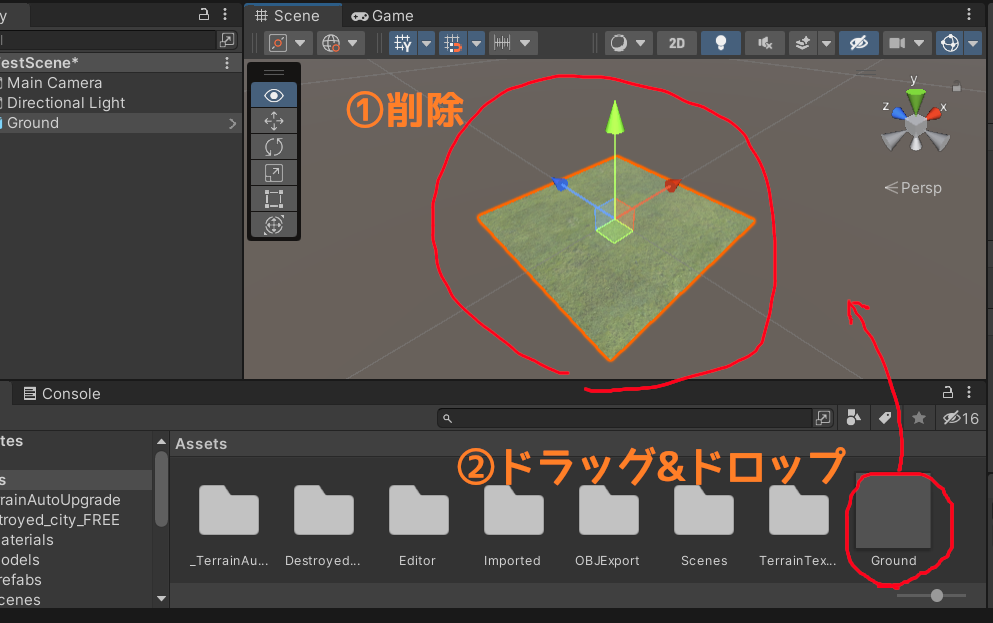
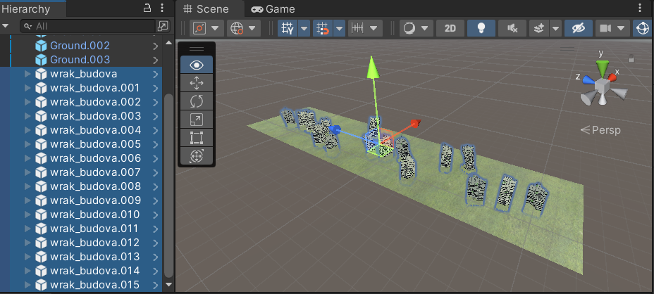
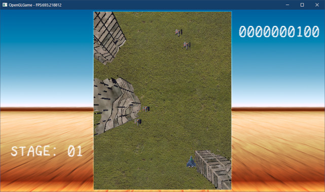

[OpenGL 3D 2022 第11回]

# アセットとレベルエディタ

## 習得目標

* UnityアセットをOBJファイルに変換できる。
* TGAファイルには複数のデータ格納方向があることを理解する。
* TGAファイルのデータ変換し、OpenGLのデータ格納方向と一致させることができる。
* 「生文字列リテラル」の使い方を理解する。
* ツールとOpenGLで座標系が異なる場合、適切な座標変換の組み合わせを選ぶことができる。
* ツールとゲームで単位が異なる場合、ゲーム側の単位に変換することができる。

## 1. UnityのアセットをOBJファイルにする

### 1.1 アセットストアのアセットからOBJファイル作る方法

3Dゲームを作成するときの大きな問題は

>どうやって3Dモデルやテクスチャを用意するか

ということです。この問題を比較的簡単に解決する手段として、「ゲームエンジンのアセットストアを利用する」という方法があります。

例えば、Unityアセットストアにあるアセットには、Unity以外のアプリケーションでも利用可能とされているものがあります。

例えば、標準的なUnityAssetStoreライセンスのものは利用可能です。フリーか有料かを問わず、ほとんどのアセットがこのライセンスを使っているので、かなり選択の幅が広がります。

また、Unreal Engineの標準ライセンスも同様の利用規約になっています。つまり、UnityとUnreal Engineのアセットストアにある大量のアセットが利用できるわけです。

ただ、UnityにもUnreal Engineにも、OBJファイルを出力する機能がありません。そこで、以下のような方法でアセットからOBJファイルやTGAファイルを作成する必要があります。

>1. アセットフォルダにあるFBXとテクスチャをVisual Studioで開き、OBJファイルとTGAファイルとして保存する。
>2. 各エンジンのアセットストアから、OBJ変換アセット(UnityならScene OBJ Exporterなど)をインストールして変換する。
>3. アセットフォルダにあるFBXとテクスチャをBlenderなどのツールにインポートし、OBJファイルとしてエクスポートする。

`1`の方法は、Visual Studioがインストール済みなら手軽に試せます。ただし、多くのアセットを変換するには少し手間がかかります。ひとつひとつファイルを開いて変換を繰り返す必要があるからです。

`2`の方法はインストールの手間があるものの、いちばんのお勧めです。アセットストアにあるアセットは、対応するエンジンであればまず間違いなく読み込めるからです。アセットによってはまとめて変換する機能があり、変換の手間を減らせます。

`3`はアセットを修正したり、アセットの一部分を取り出して使いたい場合に便利です。ただし、FBXファイルには多くのバージョンがあるため、ツールによっては一部のバージョンしか対応していないことがあります。

あるツールでインポートできない場合は、他のツールを試してみてください。

本テキストでは、「無料のOBJ変換アセットがある」という点を考慮して、Unityを使ってアセットを取り込むことにします。Unreal EngineのOBJエクスポートはポリゴンのみで、マテリアルに対応するには有料アセットが必要です。

<div style="page-break-after: always"></div>

### 1.2 Scene OBJ Exporterアセット

Unityには標準でOBJファイルを出力する機能がありません。ですから、まずはOBJファイルを出力する方法を追加する必要があります。

OBJ出力機能を追加するにはいくつかの方法がありますが、今回はアセットストアにある「Scene OBJ Exporter(シーン・オブジェ・エクスポーター)」を使おうと思います。

「Unity Asset Store」のサイトを開き、上部の検索ボックスに「scene obj exporter」と入力すると、次のようにアセットがひとつ見つかります。

<p align="center">

</p>

このアセットをクリックすると、Scene OBJ Exporterアセットのページが開きます。

<p align="center">

</p>

ページが開いたら、「マイアセットに追加する」をクリックしてアセットを追加してください。

次に、新しいプロジェクトを作成してUnityエディタを起動します。そして、メニューから「Edit -> Package Manager」を選択してパッケージマネージャを起動してください。

「Packages」の部分をクリックして「My Assets」を選択すると、リストに「Scene OBJ Exporter」が表示されると思います。

「Scene OBJ Exporter」をクリックするとアセットの詳細が表示されるので、右下の「download」ボタンをクリックしてアセットをダウンロードしてください。

<p align="center">

</p>

ダウンロードが終わるとボタンが「Import」に変化します。「Import」ボタンを押すと「Import Unity Package」ウィンドウが開きます。

<p align="center">

</p>

右下の「Import」ボタンを押してしばらく待つと、プロジェクトに「Scene OBJ Exporter」がインポート(追加)されます。アップデートを促すダイアログが表示された場合は、左側の`Yes, for these and ...`と書かれたボタンをクリックして、APIをアップデートしてください。

<p align="center">

</p>

インポートが完了したら、左上の「File」メニューをクリックしてください。メニューの一番下に「Export」という項目が追加されていたら、「Scene OBJ Exporter」のインポートは成功です。表示されない場合は、新規プロジェクトの作成からやりなおしてみてください。

<p align="center">

</p>

Export項目が表示されていたら、OBJファイルにしたいアセットをプロジェクトにインポートしてください。

<pre class="tnmai_assignment">
<strong>【課題01】</strong>
アセットストアから敵に使えそうな3Dモデルを入手し、Scene OBJ Exporterと同じプロジェクトにインポートしなさい。
</pre>

### 1.3 OBJファイルと一緒にテクスチャを出力する

Scene OBJ ExporterでOBJファイルを出力する時、アセットによってはテクスチャが出力されないことがあります。最初に以下の設定を行うことで、テクスチャも出力されるようになります。

>1. アセットに含まれる全てのテクスチャを選択。
>2. インスペクタの「Read/Write」項目にチェックを入れる。
>3. インスペクタの一番下の「Apply」ボタンをクリックして変更を反映。

<p align="center">

</p>

アセットによってはテクスチャフォルダがなかったり、テクスチャが複数のフォルダに分散していることもあるので注意してください。 必要なテクスチャは、アセットのサンプルデータを参照して調べるとよいでしょう。

### 1.4 メッシュをOBJファイルとして出力する

適当なアセットをインポートしたら、OBJにしたいプレハブまたはメッシュをシーンに配置してください。このとき、Transformコンポーネントの値をPosition:(0,0,0), Rotation:(0,0,0), Scale(1,1,1)に設定してください。

>プレハブによっては、Transformに値が設定されていることがあります。その場合でも、Position:(0,0,0), Rotation:(0,0,0), Scale(1,1,1)に設定してください。

次に、シーン内にある「OBJファイルにしたいゲームオブジェクト」を選択状態にします。ゲームオブジェクトに親子関係がある場合、すべての子ゲームオブジェクトを選択する必要があります。

選択したら、メニューの「File -> Export -> Wavefront OBJ」をクリックしてください。

<p align="center">

</p>

すると「Export OBJ」ウィンドウが開きます。以下の手順でチェックボックスを設定し、エクスポートしてください。

>1. Only Selected Objectsにチェックを入れる(入れないとシーン全体が出力される)。
>2. Exportボタンをクリック。

<p align="center">

</p>

Exportボタンをクリックすると、出力ファイル名を指定するウィンドウが開きます。適当な名前を付けて、OpenGLプロジェクトの`Res/Model`フォルダに出力してください。<br>
これで、あとはOpenGLのプロジェクトから読み込んで使うだけです。

なお、OBJ File Exporterはシーン全体、または選択した全てのメッシュをひとつのOBJファイルとして出力します。複数のメッシュを個別のOBJファイルに出力することはできません。

そのため、面倒ですが、ひとつひとつ選択してエクスポートする必要があります。そのかわり、モジュール式のアセットなどの場合は、モジュールを組み立ててからひとつのOBJファイルに出力する、といった使い方ができます。

>**【その他の注意点】**<br>
>ゲームオブジェクトに `Mesh Renderer`コンポーネントが設定されている必要があります。また、`Skinned Mesh Renderer`には対応していません。

<pre class="tnmai_assignment">
<strong>【課題02】</strong>
課題01で入手したアセットを、Scene OBJ ExporterでOBJファイルに変換し、OpenGLプロジェクトの<code>Res/Model</code>フォルダに保存しなさい。変換の際、以下の2点に注意してください。
- メッシュに親子関係がある場合、子メッシュも選択する。
- Transformコンポーネントの値をPosition:(0,0,0), Rotation:(0,0,0), Scale(1,1,1)に設定する。
</pre>

>**【常に原点に配置するUnityのオプション】**<br>
>Unityエディタの「Preferences → Scene View → General」にある`Create Objects at Origin`項目にチェックを入れると、ドラッグ&ドロップで追加したオブジェクトが常に原点に配置されるようになります。この機能はUnity 2020 LST以降で利用可能です。

<pre class="tnmai_assignment">
<strong>【課題03】</strong>
課題02で変換したアセットの画像ファイルをTGAファイルに変換しなさい。それから、MTLファイルに書かれている画像ファイルの拡張子をTGAに変換しなさい。変換が済んだらPNGファイルは削除しておくこと。
</pre>

変換したOBJファイルを表示してみましょう。`GameManager.cpp`を開き、`Initialize`メンバ関数にある自機を追加するプログラムの下に、次のプログラムを追加してください。

>OBJファイル名には、`ExportedFromUnity.obj`の代わりに課題02で変換したファイル名を指定すること。

```diff
   player->AddCollision({ -3, -4, 3, 4 });
   auto explosion = player->AddComponent<Explosion>();
   explosion->count = 5;
+
+  // Unityアセットから変換した3Dモデルを、画面中央に表示
+  auto obj = engine.Create<GameObject>("test", 0, 0);
+  obj->x = 17 * 32 / 2;
+  obj->y = 22 * 32 / 2;
+  obj->rotation[0] = radians(90); // Y軸が上になるように回転
+  renderer = obj->AddComponent<MeshRenderer>();
+  renderer->mesh = engine.LoadOBJ("Res/Model/ExportedFromUnity.obj");
+  renderer->scale = vec3(16); // ピクセル単位に合わせるために拡大

   // 敵配置データを読み込む
   enemyMap = engine.LoadTileMap("Res/map01_obj.csv");
```

プログラムがけたらビルドして実行してください。画面中央に、変換した3Dモデルが表示されていたら成功です。

<p align="center">

</p>

このように、どんな方法でもいいのでとにかくOBJファイルに変換できれば、ゲームに登場させることができます。

### 1.5 行列の乗算を調整する

UnityからエクスポートしたOBJを表示すると、前後が反転していることに気づくかもしれません。例えば、1.4節の実行画像に表示されている黄色い戦闘機は、Unityエディタ上では上を向いていました。

このような違いが生まれる理由は、OBJファイルやOpenGLは右手座標系を使うのに対して、Unityは左手座標系を採用しているからです。

いちおう、Scene OBJ Exporterは座標系の違いを考慮してデータを変換してくれます。そのため、表示自体は可能です。しかし、Z軸の方向が逆なので、前後が反転するのは避けられません。

もっとも、これを解決するのは簡単です。3DモデルをY軸で180度回転させるだけだからです。ただし、単純にY軸回転の値に180度を足してもうまくいきません。

なぜなら、現在のプログラムの回転順序は

>`Z`→`Y`→`X`

となっていて、Z軸回転が先に行われてしまうからです。Z軸回転を使わないならいいのですが、ゲーム開発の過程でZ軸回転が必要な場面が出てくるのは、ほとんど間違いありません。

問題はZ軸回転が先に来てしまうことなので、Y軸回転を先に行うようにすれば解決します。しかし、多くのプログラムではY軸回転は2番目か3番目に実行されています。これは、そのほうがオブジェクトの姿勢を制御しやすいためです。

つまり、回転順序を`Y`→`Z`→`X`のように変えてしまうと、オブジェクトの姿勢を制御しにくくなってしまうわけです。実際、Unityの回転順序は`Z`→`X`→`Y`となっています。

そこで、回転の計算を「ゲームオブジェクト」と「メッシュレンダラ」の2段に分けることにします。これにより、

>メッシュレンダラの`ZYX`回転→ゲームオブジェクトの`ZYX`回転

となり、ゲームオブジェクトの前にY軸回転を追加できるようになります。

それでは、ゲームオブジェクトとメッシュの行列を分離しましょう。`GameObject.cpp`を開き、`DrawStaticMesh`関数の定義に次のプログラムを追加してください。

```diff
 */
 void GameObject::DrawStaticMesh(const ProgramPipeline& program) const
 {
+  if (meshRendererList.empty()) {
+    return;
+  }
+
+  mat4 mt = mat4::Translate(vec3(x, y, z));
+  mat4 mrx = mat4::RotateX(rotation[0]);
+  mat4 mry = mat4::RotateY(rotation[1]);
+  mat4 mrz = mat4::RotateZ(rotation[2]);
+  mat4 ms = mat4::Scale(scale);
+  const mat4 matGameObject = mt * mrx * mry * mrz * ms;

   for (const auto& e : meshRendererList) {
     if ( ! e->mesh) {
```

`matGameObject`(マット・ゲームオブジェクト)変数は、ゲームオブジェクトの座標変換行列を表します。

次に、同じ`DrawStaticMesh`関数にある`matModel`を計算するプログラムを、次のように変更してください。

```diff
       continue;
     }
 
     // 平行移動、回転、拡大率を設定
-    const vec3 t = e->translate + vec3(x, y, z);
-    const vec3 r = e->rotation + vec3(rotation[0], rotation[1], rotation[2]);
-    const vec3 s = e->scale;
-    mat4 mt = mat4::Translate(t);
-    mat4 mrx = mat4::RotateX(r.x);
-    mat4 mry = mat4::RotateY(r.y);
-    mat4 mrz = mat4::RotateZ(r.z);
-    mat4 ms = mat4::Scale(s);
+    mat4 mt = mat4::Translate(e->translate);
+    mat4 mrx = mat4::RotateX(e->rotation.x);
+    mat4 mry = mat4::RotateY(e->rotation.y);
+    mat4 mrz = mat4::RotateZ(e->rotation.z);
+    mat4 ms = mat4::Scale(e->scale);
-    mat4 matModel = mt * mrx * mry * mrz * ms;
+    mat4 matMesh = mt * mrx * mry * mrz * ms;
+    mat4 matModel = matGameObject * matMesh;
     glProgramUniformMatrix4fv(program, 0, 1, GL_FALSE, &matModel[0][0]);
 
     Mesh::Draw(*e->mesh, program);
```

`matMesh`(マット・メッシュ)変数は、メッシュレンダラの座標変換行列を表します。

このように、メッシュレンダラとゲームオブジェクトのパラメータを異なる座標変換行列に分離することで、「メッシュレンダラの座標変換」→「ゲームオブジェクトの座標変換」という2段階の座標変換を可能にしています。

ついでなので回転順序をUnityに合わせましょう。Unityのアセットを使うなら、回転順序も合わせておいたほうが都合がいいからです。Unityの回転順序は変更できないため、OpenGL側を変更するしかありません。

>**【Unityの回転順序について】**<br>
>オンラインマニュアルの<br>
>&emsp;Unityを使用する → Create Gameplay → Rotation and Orientation in Unity<br>
>に書かれています。<br>
>`https://docs.unity3d.com/ja/current/Manual/QuaternionAndEulerRotationsInUnity.html`

`matGameObject`と`matMesh`を計算するプログラムを次のように変更してください。

```diff
   mat4 mry = mat4::RotateY(rotation[1]);
   mat4 mrz = mat4::RotateZ(rotation[2]);
   mat4 ms = mat4::Scale(scale);
-  const mat4 matGameObject = mt * mrx * mry * mrz * ms;
+  const mat4 matGameObject = mt * mry * mrx * mrz * ms;

   for (const auto& e : meshRendererList) {
     if ( ! e->mesh) {
       continue;
     }
 
     // 平行移動、回転、拡大率を設定
     mat4 mt = mat4::Translate(e->translate);
     mat4 mrx = mat4::RotateX(e->rotation.x);
     mat4 mry = mat4::RotateY(e->rotation.y);
     mat4 mrz = mat4::RotateZ(e->rotation.z);
     mat4 ms = mat4::Scale(e->scale);
-    mat4 matMesh = mt * mrx * mry * mrz * ms;
+    mat4 matMesh = mt * mry * mrx * mrz * ms;
     mat4 matModel = matGameObject * matMesh;
     glProgramUniformMatrix4fv(program, 0, 1, GL_FALSE, &matModel[0][0]);
```

それでは、メッシュレンダラにY軸回転を設定しましょう。`MainGameScene.cpp`を開き、
`Initialize`メンバ関数にあるUnityアセットを表示するプログラムに、次のプログラムを追加してください。

```diff
   renderer = obj->AddComponent<MeshRenderer>();
   renderer->mesh = engine.LoadOBJ("Res/Model/ExportedFromUnity.obj");
   renderer->scale = vec3(16); // ピクセル単位に合わせるために拡大
+  renderer->rotation.y = radians(180); // Unityアセットは180度反転している

   // 敵配置データを読み込む
   enemyMap = engine.LoadTileMap("Res/map01_obj.csv");
```

プログラムがけたらビルドして実行してください。3Dモデルの向きがUnityと同じになっていたら成功です。

<p align="center">

</p>

### 1.6 Scene OBJ Exporterを改造する

ところで、Scene OBJ Exporterが出力する画像ファイルはPNG形式なので、Visual Studio等でTGA形式に変換する必要があります。毎回行うのは面倒なので、Scene OBJ Exporterを改造して、直接TGAファイルが出力されるようにしましょう。

Unityプロジェクトの`Assets/OBJExport`フォルダにある`OBJExporter.cs`というC#ファイルを開き、329～332行目を次のように変更してください。

```diff
           }
       }
-      string exportName = lastExportFolder + "\\" + t.name + ".png";
+      string exportName = lastExportFolder + "\\" + t.name + ".tga";
       Texture2D exTexture = new Texture2D(t.width, t.height, TextureFormat.ARGB32, false);
       exTexture.SetPixels(t.GetPixels());
-      System.IO.File.WriteAllBytes(exportName, exTexture.EncodeToPNG());
+      System.IO.File.WriteAllBytes(exportName, exTexture.EncodeToTGA());
       return exportName;
   }
```

この変更により、画像ファイルがTGA形式で出力されるようになります。

### 1.7 TGA形式の向きを正しく扱う

改造したScene OBJ Exporterから3Dモデルをエクスポートすると、テクスチャが正しく表示されないと思います。この原因は、TGA形式の「画像の格納方向」にあります。

TGA形式では画像データを「上から下」または「下から上」のいずれかの方向で格納します。格納方向の指定はツールによって異なるため、同じTGA形式の画像ファイルでも上下が反転する場合があるのです。

この問題を解決するには、ヘッダに記録されている格納方向を調べて、画像データの向き修正します。

なお、OpenGLのテクスチャの場合「下から上」が正しい方向になります。そこで、格納方向が「上から下」の場合は、データの上下を反転するようにプログラムします。

`Texture.cpp`を開き、`algorithm`(アルゴリズム)ヘッダをインクルードしてください。

```diff
 #include <filesystem>
 #include <fstream>
 #include <vector>
+#include <algorithm>

 /**
 * テクスチャを作成する
```

`algorithm`ヘッダには、このあとで使う`copy`関数が定義されています。<br>
次に、`Texture`クラスのコンストラクタの定義に、次のプログラムを追加してください。

```diff
   std::vector<char> img(
     std::filesystem::file_size(filename) - tgaHeaderSize);
   file.read(img.data(), img.size());
+
+  // TGAヘッダ18バイト目の第5ビットは、画像データの格納方向を表す。
+  //   0の場合: 下から上
+  //   1の場合: 上から下
+  // OpenGLでは画像データを「下から上」に格納するルールになっているので、
+  // TGAが「上から下」に格納されている場合は画像を上下反転する。
+  if (header[17] & 0x20) {
+    // 画像のバイト数と横1列分のバイト数を計算
+    const int pixelDepth = header[16];
+    const int imageSize = width * height * pixelDepth / 8;
+    const size_t lineSize = width * pixelDepth / 8;
+
+    // tmpに上下反転した画像データをコピー
+    std::vector<char> tmp(imageSize);
+    auto source = img.begin();
+    auto destination = tmp.end();
+    for (size_t i = 0; i < height; ++i) {
+      destination -= lineSize;
+      std::copy(source, source + lineSize, destination);
+      source += lineSize;
+    }
+
+    // tmpとimgのデータを交換
+    img.swap(tmp);
+  }

   // テクスチャを作成
   glCreateTextures(GL_TEXTURE_2D, 1, &tex);
```

上下反転コピーを行うプログラムでは、コピー元の行を`source`(ソース、「供給源」という意味)、コピー先の行を`destination`(デスティネーション、「送り先」という意味)として、
`copy`関数によって1行ずつコピーを繰り返しています。

`source`の初期値は`img.begin()`で、1行コピーするたびに`lineSize`を加算しています。対して、`destination`の初期値は`tmp.end()`で、コピーの直前に`lineSize`を減算しています。

コピー前に減算するのは、`destination`が「行末」を指しているからです。

続いて、3D描画用のシェーダを修正します。`standard_3D.vert`を開き、`outTexcoord`変数に値を代入するプログラムを次のように変更してください。

```diff
   outPosition.x = pos.x;
   outPosition.y = pos.z * -s + pos.y * c;
   outPosition.z = pos.z * c + pos.y * s;
 
-  outTexcoord = inTexcoord * vec2(1, -1) + vec2(0, 1);
+  outTexcoord = inTexcoord;
 
   gl_Position.x = outPosition.x * cameraData.x;
   gl_Position.y = outPosition.y * cameraData.y;
```

削除した部分が、上下方向の辻褄を合わせるためのコードです。このコードによって、テクスチャのY座標を`0～1`から`1～0`に変換していたため、Visual Studioで作ったTGAファイルが一見正しく表示されていたわけです。

プログラムが書けたらビルドして実行してください。・・・確かに3D画像のテクスチャは正しくなりましたが、2D画像がメチャクチャになっています。

<p align="center">

</p>

これは、`Texture`コンストラクタを変更したことで、既存のテクスチャも上下反転されるようになったからです。

そして、なぜ既存のテクスチャが上下反転してしまうかというと、Visual Studioが出力するTGAファイルの格納方向が「上から下」になっているからです。つまり、これまでは上下反転したテクスチャを使っていたわけです。

実は、「TGAファイルのデータ格納方向はOpenGLの本筋とはあまり関係がない」ことから、これまでは格納方向あえて無視してプログラムしてもらっていたのです。

しかし、今後は格納方向を無視できません。2D描画が正しく行われるようにするには、以下のいずれかの措置を講ずる必要があります。

>1. 2D描画用のコードをすべて修正し、上下反転に対応させる。
>2. 2D描画用のテクスチャだけ、これまでどおり上下逆に作成する。

これまで書いてきた2D描画用のコード量を思い返すと、明らかに`2`のほうが手間が少なそうです。手間が少ないということは、バグが出にくいということでもあります。

ということで、今回は`2`の「2D描画用のテクスチャは上下逆に作成する」方法を選ぶことにします。

>興味があれば、`1`の方法に挑戦してみてもよいでしょう(ただし、必ずプログラムをバックアップしておくこと)。

さて、`2`の実装方針ですが、`Texture`コンストラクタに「利用目的」を示す引数を追加することで対応します。`Texture.h`を開き、`Texture`クラスの定義を次のように変更してください。

```diff
 class Texture
 {
 public:
+  // テクスチャの利用目的
+  enum class Usage
+  {
+    for2D, // 2D描画用
+    for3D, // 3D描画用
+  };
+
   // テクスチャを作成
   static TexturePtr Create(
-    const std::string& filename, GLenum filterMode = GL_NEAREST);
+    const std::string& filename, GLenum filterMode = GL_NEAREST,
+    Usage usage = Usage::for2D);
 
   // コンストラクタ、デストラクタ
-  Texture(const std::string& filename, GLenum filterMode = GL_NEAREST);
+  Texture(const std::string& filename, GLenum filterMode = GL_NEAREST,
+    Usage usage = Usage::for2D);
   ~Texture();
 
   // コピーと代入を禁止
```

`Usage`(ユーセージ、「利用方法」という意味)列挙型は、テクスチャの利用目的を示します。

次に`Texture.cpp`を開き、`Create`メンバ関数の定義を次のように変更してください。

```diff
 * @param filename   画像ファイル名
 * @param filterMode テクスチャに設定する拡大縮小フィルタ
+* @param usage      利用目的
 *
 * @return 作成したテクスチャへのポインタ
 */
-TexturePtr Texture::Create(const std::string& filename, GLenum filterMode)
+TexturePtr Texture::Create(const std::string& filename, GLenum filterMode,
+  Usage usage)
 {
-  return std::make_shared<Texture>(filename, filterMode);
+  return std::make_shared<Texture>(filename, filterMode, usage);
 }
```

同様に、`Texture`コンストラクタの定義を次のように変更してください。

```diff
 * @param filename   画像ファイル名
 * @param filterMode テクスチャに設定する拡大縮小フィルタ
+* @param usage      利用目的
 */
-Texture::Texture(const std::string& filename, GLenum filterMode)
+Texture::Texture(const std::string& filename, GLenum filterMode,
+  Usage usage) :
   filename(filename)
 {
```

続いて、`usage`引数に応じて反転方向を変更します。画像を上下反転させるプログラムを、次のように変更してください。

```diff
   // OpenGLは画像データを「下から上」に格納するルールになっているので、
   // TGAが「上から下」に格納されている場合は画像を上下反転する.
+  bool topToBottom = header[17] & 0x20;
+  if (usage == Usage::for2D) {
+    topToBottom = !topToBottom; // 2D画像用の場合は反転方向を逆にする
+  }
-  if (header[17] & 0x20) {
+  if (topToBottom) {
     const int pixelDepth = header[16];
     const int imageSize = width * height * pixelDepth / 8;
```

それでは、3D画像用のテクスチャを読み込むプログラムに、利用目的を設定しましょう。
`Mesh.cpp`を開き、`LoadMTL`関数の定義を次のように変更してください。

```diff
     if (sscanf(line.data(), " map_Kd %999s", &textureName) == 1) {
       pMaterial->texBaseColor =
-        Texture::Create(foldername + textureName, GL_LINEAR);
+        Texture::Create(foldername + textureName, GL_LINEAR,
+          Texture::Usage::for3D);
       continue;
     }
```

また、これは別件なのですが、現在の`LoadMTL`関数には「空白を含むテクスチャ名を正しく取得できない」という問題があります。この機会にこれも修正しましょう。テクスチャを読み取るプログラムの書式指定文字列を、次のように変更してください。

```diff
     // 基本色テクスチャ名の読み取りを試みる
     char textureName[1000] = { 0 };
-    if (sscanf(line.data(), " map_Kd %999s", &textureName) == 1) {
+    if (sscanf(line.data(), " map_Kd %999[^\n]", &textureName) == 1) {
       pMaterial->texBaseColor =
         Texture::Create(foldername + textureName, GL_LINEAR,
```

`%[^\n]`とすることで、「改行以外のすべての文字」を読み込めるように変更しています。これによって、空白を含むテクスチャファイル名を正しく取得できるようになります。

プログラムが書けたらビルドして実行してください。2D画像も3D画像も正しく表示されていたら成功です。

<p align="center">

</p>

>**【1章のまとめ】**
>
>* アセットをOBJ形式に変換するには、OBJ変換アセットを使うか、Blender, Visual Studio等にFBXを読み込んで変換する。
>* 変換の効率を上げるには、OBJ変換アセットを改造するとよい。
>* TGA形式には複数のデータ格納方向があるため、必要に応じて画像データを上下反転しなくてはならない。

<div style="page-break-after: always"></div>

## 2. Unityをレベルエディタとして使う

### 2.1 ゲームオブジェクトの配置をエクスポートする

3Dモデルを使って背景を表示するには、2DにおけるTiledのような、3Dモデルを配置するツールがあると便利です。しかし2022年7月現在、これができるツールはあまり見当たりません。

そこで、ゲームエンジンのレベルエディタ機能を流用します。今回はUnityを汎用レベルエディタとして使えるように、「シーンに配置したゲームオブジェクトをテキストファイルとして出力するスクリプト」を追加します。

<pre class="tnmai_assignment">
<strong>【課題04】</strong>
Webブラウザで以下のURLにアクセスし、
<code>https://github.com/tn-mai/OpenGL3D2022</code>

<code>tools</code>フォルダにある<code>ExportGameObjectToJson.cs</code>というC#ファイルをダウンロードしなさい(Rawボタンを右クリック→「名前をつけてリンク先を保存」)。

次に、Unityプロジェクトに<code>Editor</code>という名前のフォルダを作成し、ダウンロードしたC#ファイルを追加しなさい。
</pre>

C#スクリプトを追加すると、Fileメニューの`Export`項目に`GameObject To Json`(ゲームオブジェクト・トゥ・ジェイソン)という項目が追加されます。

<p align="center">

</p>

練習として、適当なアセットを使ってレベルを作成しましょう。Unityのアセットストアを開き、`Destroyed City FREE`という無料アセットを購入してください。

<p align="center">

</p>

購入したらUnityプロジェクトを開き、上記のアセットをインポートしてください。すると、プロジェクトウィンドウに`Destroyed_city_FREE`というフォルダが追加されます。

さて、レベルを作るときは、最初に適切な縮尺を定義しておかないと、人が出入りできないサイズの建物や巨人用の建物が入り乱れた非現実的なレベルが作られることになります。

そして、今回考慮するべきなのは、「2Dのタイルサイズ」です。2Dでは32x32ピクセルですが、1ピクセル=1メートルとしてしまうと巨人族の世界になってしまいます。かといって、32ピクセル=1メートルでは小さすぎます。

背景画像から受けるスケール感とUnityでの作業しやすさを考慮した結果、今回はタイルサイズを「10x10m」とします。これは「3.2ピクセル=1メートル」ということです。

また、2Dタイルマップの大きさは17x110タイルなので、3Dマップの範囲は170x1100mとなります。ただし、3Dではカメラの視野角を考える必要があります。そこで、前後左右に20m広げて(-20,-20)～(190, 1120)とします。

こうして、今回作成するレベルの定義は次のように決まりました。

>* タイルサイズ: 10x10m
>* 縮尺: 3.2ピクセル = 1メートル
>* マップの範囲: (-20,-20)～(190, 1120)

それでは、レベルを作っていきましょう。とりあえず、マップ全体を埋める平面を配置します。「GameObject→3D Object→Quad」を選択して、平面のゲームオブジェクトを追加してください。ゲームオブジェクトの名前は`Ground`としてください。

シーンにQuadを配置したら、インスペクターで`Rotation`の`X`に`90`を指定してQuad(クアッド)を水平にしてください。

次に、`Dstroyed_city_FREE/Textures`フォルダにある`grassHR2 02.jpg`を、Quadゲームオブジェクトにドラッグ&ドロップしてください。これでQuadにテクスチャが設定されます。

続いて、このゲームオブジェクトをプレハブにします。`Hierarchy`ウィンドウの`Ground`ゲームオブジェクトを、`Project`ウィンドウの適当なフォルダにドラッグ&ドロップしてください。これでブレハブに変換されます。

<p align="center">

</p>

プレハブに変換したら、シーンに配置している`Ground`ゲームオブジェクトを削除してください。次に、`Ground`プレハブをシーンにドラッグ&ドロップして追加してください。

<p align="center">

</p>

プレハブで置き換えているのは、配置ファイルの`mesh`要素を識別可能にするためです。Quadから作成したゲームオブジェクトの`mesh`要素はすべて`Quad Instance`になってしまい、見分けることができません。

プレハブを使うと、配置ファイルの`mesh`要素が「プレハブの名前」になるため、OBJファイルの種類を識別できるようになります。

<pre class="tnmai_assignment">
<strong>【課題05】</strong>
<code>Ground</code>ゲームオブジェクトをOBJファイルに変換し、OpenGLプロジェクトの<code>Res/Model</code>フォルダに保存しなさい。
</pre>

それでは、`Ground`ゲームオブジェクトをマップに敷き詰めましょう。といっても、最初の大きさのままで敷き詰めるには膨大な枚数が必要になってしまいます。

そこで、少ない枚数で全体をカバーできるように大きさを変更します。`Scale`を(210, 210, 1)に設定してください。次に座標を移動します。`Position`を(85, 0, 85)に設定してください。これで1枚目の地面を敷くことができました。

拡大率を設定した結果、現在の`Ground`の大きさは210mです。-20～1120の範囲を埋めるにはあと5枚の`Ground`ゲームオブジェクトが必要です。

`Ground`ゲームオブジェクトを選択し、`Ctrl+D`キーを押してコピーしてください。すると
`Ground (1)`のようなゲームオブジェクトが追加されます。<br>
このゲームオブジェクトの`Position`の`Z`に`295`を設定してください。

これで2枚目の地面を敷くことができました。

<pre class="tnmai_assignment">
<strong>【課題06】</strong>
<code>Ground</code>ゲームオブジェクトのコピーをあと4枚作成し、Z方向に隙間なく並べなさい。
</pre>

<p align="center">
<br>
[6枚のGroundを敷き詰めた状態]
</p>

次に、建物を配置します。`Destroyed_city_FREE/Prefabs`にある`wrak_budova.prefab`をシーンにドラッグ&ドロップしてください。

<pre class="tnmai_assignment">
<strong>【課題07】</strong>
<code>wrak_budova</code>ゲームオブジェクトをOBJファイルに変換し、<code>wrak_budova.obj</code>という名前をつけて、OpenGLプロジェクトの<code>Res/Model</code>フォルダに保存しなさい。全ての子ゲームオブジェクトを選択してから変換すること。
</pre>

次に、建物を増やします。`Ctrl`キーを押しながら`D`キーを15回押して、`wrak_budova`ゲームオブジェクトを16個に増やしてください。

建物を増やしたら、`Hierarchy`ウィンドウで16個の`wrak_budova`をすべて選択してください。そして、`Position`と`Rotation`に以下の数式を設定してください。

* Position X: `R(0, 17) * 10`
* Position Y: `R(-50, -30)`
* Position Z: `L(0, 1100)`
* Rotation X: `R(-10, 10)`
* Rotation Y: `R(0, 360)`
* Rotation Z: `R(-10, 10)`

`R()`は「範囲内のランダムな値」を設定する数式、`L()`は「範囲内の等間隔な値」を設定する数式です。これらの数式を利用すると、簡単にランダムな座標や回転を与えることができます。

<p align="center">
<br>
[建物をランダムに配置した状態]
</p>

これで建物の配置は完了です(破壊され、人が住まなくなって数十年が経過した廃墟の街、に見えるでしょうか)。このシーンを配置ファイルに出力しましょう。メニューから`GameObject To Json`を選択すると、次のようなウィンドウが表示されます。

<p align="center">

</p>

`Export`ボタンをクリックすると、ファイル名を指定するウィンドウが聞きます。OpenGLプロジェクトの`Res`フォルダを選択し、ファイル名を`map01.json`に変更してください。変更したら、「保存」ボタンをクリックしてください。

すると、シーンに配置したアセットの名前や座標などを記録したテキストファイルが作成されます。

### 2.2 配置ファイルを読み込む

ゲームオブジェクトの配置ファイルはJSON(ジェイソン)形式になっています。一般的に、JSON形式はライブラリを使って読み込みます。しかし、今回はライブラリを使わず、`sscanf`関数で読み込むことにします。

実際にファイルを開いてみれば分かりますが、配置ファイルの形式はそれほど難しいものではありません。そのため、`sscanf`でも十分に対応できます。

配置ファイルを読み込む機能はゲームエンジンに追加します。<br>
関数名は`LoadGameObjectMap`(ロード・ゲームオブジェクト・マップ)とします。
`Engine.h`を開き、`Engine`クラスの定義に次のプログラムを追加してください。

```diff
   // 配置データの読み込み・スプライト設定
   TileMap LoadTileMap(const char* filename);
   void SetSpriteList(const TileMap& tileMap);
+
+  // 3Dモデル配置データの読み込み
+  GameObjectList LoadGameObjectMap(const char* filename,
+    const VecMath::vec3& translate = VecMath::vec3(0),
+    const VecMath::vec3& scale = VecMath::vec3(1));

   // 次のシーンを設定する
   template<typename T>
```

配置ファイルの座標や拡大率はUnityエディタ上の値がそのまま記録されています。2Dの座標系に合わせるには座標や拡大率を調整する必要があるため、平行移動用の`translate`引数と拡大率用の`scale`引数を渡せるようにしています。

それでは定義を追加しましょう。と、その前に、`sscanf`を使えるようにするためのマクロを定義します。`Engine.cpp`を開き、ファイルの先頭に次のプログラムを追加してください。

```diff
 /**
 * @file Engine.cpp
 */
+#define _CRT_SECURE_NO_WARNINGS
 #include "Engine.h"
 #include "MainGameScene.h"
```

次に、ログ出力用のヘッダファイルをインクルードします。`Engine.cpp`を開き、`Debug.h`
をインクルードしてください。

```diff
 #include "VertexArray.h"
 #include "Component/Camera.h"
 #include "Component/MeshRenderer.h"
+#include "Debug.h"
 #include <Windows.h>
 #include <fstream>
```

これで定義の準備は完了です。`SetSpriteList`メンバ関数の定義の下に、
`LoadGameObjectMap`メンバ関数の定義を追加してください。

```diff
     } // for x
   } // for y
 }
+
+/**
+* 3Dモデル配置ファイルを読み込む
+*
+* @param filename  3Dモデル配置ファイル名
+* @param translate 全ての3Dモデル座標に加算する平行移動量
+* @param scale     全ての3Dモデルに掛ける拡大率
+*
+* @return ファイルから読み込んだゲームオブジェクトの配列
+*/
+GameObjectList Engine::LoadGameObjectMap(const char* filename,
+  const vec3& translate, const vec3& scale)
+{
+  // ファイルを開く
+  std::ifstream ifs(filename);
+  if (!ifs) {
+    LOG_WARNING("%sを開けません", filename);
+    return {};
+  }
+
+  GameObjectList gameObjectList;
+  gameObjectList.reserve(100); // 適当な数を予約
+
+  // 作成したゲームオブジェクト配列を返す
+  LOG("3Dモデル配置ファイル%sを読み込みました", filename);
+  return gameObjectList;
+}

 /**
 * UIレイヤーを追加する
```

次に、行単位で読み込むプログラムを追加します、ゲームオブジェクトの数を予約するプログラムの下に、次のプログラムを追加してください。

```diff
   GameObjectList gameObjectList;
   gameObjectList.reserve(100); // 適当な数を予約
+
+  // ファイルを読み込む
+  while (!ifs.eof()) {
+    std::string line;
+    std::getline(ifs, line);
+    const char* p = line.c_str();
+    int readByte = 0;
+  }

   // 作成したゲームオブジェクト配列を返す
   LOG("3Dモデル配置ファイル%sを読み込みました", filename);
```

### 2.3 JSONのデータ型と生文字列リテラル

それでは、ゲームオブジェクトのデータを読み込むプログラムを追加しましょう。配置ファイルではひとつゲームオブジェクトのデータは1行で表され、`{`と`}`で囲われています。

`{ ゲームオブジェクトのデータリスト },`

これは、JSONでは「オブジェクト」と呼ばれるデータ型です。「オブジェクト」には、「データ名」と「値」のペアをいくつでも定義することができます。各ペアは`,`で区切られます。

`{ データ名 : 値, データ名 : 値, ... }`

配置ファイルでは、ゲームオブジェクトの名前、座標、拡大率などを定義するために使われています。「値」部分には文字列、数値、または配列、オブジェクトが指定できます。

後述するように、読み込みプログラムではデータ名ごとに`sscanf`を実行し、読み込みに成功したら有効なデータだと判断します。

データリストの先頭には「ゲームオブジェクトの名前」が記録されています。そこで、名前の読み込みに成功したら「データリストがある」と判断します。

ところで、JSON形式のデータ名などは`"`(ダブルクォーテーション)で囲むルールになっています。そのため、`sscanf`を使ってJSONを読み込むには、書式指定文字列には何度も`"`を書く必要があります。

しかし、通常の文字列の中に`"`を書くには、`￥"`のように`￥`によるエスケープが必要です。言い換えると、C++の文字列はあまりJSONの読み書きに向いていません。そこで、「生文字列(なまもじれつ)リテラル」を使うことにします。

生文字列リテラルはC++11で追加された機能で、文字列の前に`R`を付け、さらにダブルクォーテーションの内側に丸括弧`(`と`)`を付けた文字列です。

`R"(あ"いうえ"お)"`

>`R`は`Raw string literals`(ロウ・ストリング・リテラル、生文字列リテラル)の最初の文字です。

生文字列リテラルでは、ダブルクォーテーションが使える代わりに、閉じ丸括弧`)`が使えなくなります。閉じ丸括弧も使えるようにするには、次のように`(`と`)`の前後にさらに区切り文字を追加します。

`R"*(あ"い(う)え"お)*"`

このように書くことで、`R"*(`が文字列の開始、`)*"`が文字列の終端として認識されます。そのかわり、`)*`という文字列が使えなくなります。

区切り文字は`￥n`などの一部の制御文字以外ならなんでもよく、また最大16文字まで追加できます。例えば、次のように、

`R"#XYZ*(あ"い(う)え"お)#XYZ*"`

とすれば、`)#XYZ*`という文字列だけが使えなくなります。このように、生文字列リテラルの狙いは「文字列中に現れない文字を区切り文字にすることで、文字列を定義しやすくする」ことです。

それでは、生文字列リテラルを使って名前データを読み込みましょう。名前のデータ名は
`name`です。ファイルを読み込む`while`ループに次のプログラムを追加してください。

>書式指定文字列の括弧とダブルクォーテーション、空白の有無に注意すること。

```diff
     std::getline(ifs, line);
     const char* p = line.c_str();
     int readByte = 0;
+
+    // データ行の開始判定
+    char name[256];
+    if (sscanf(p, R"( { "name" : "%255[^"]" %n)", name, &readByte) != 1) {
+      continue; // データ行ではない
+    }
+    name[255] = '\0';
+    p += readByte; // 読み取り位置を更新
   }

   // 作成したゲームオブジェクト配列を返す
```

名前部分自体もダブルクォーテーションで囲まれた文字列なので、書式指定文字列が少し複雑になっています。実際に名前を読み込む部分は`%255[^"]`の部分で、「`"`以外の文字」を取得します。そして、その前後を`"`で囲っています。

また、以前も説明しましたが、`%n`は「読み込んだ文字数」を取得するための書式です。

次に、メッシュファイル名、座標、回転、拡大率を読み込みます。名前を読み込むプログラムの下に、次のプログラムを追加してください。

```diff
     }
     name[255] = '\0';
     p += readByte; // 読み取り位置を更新
+
+    // 名前以外の要素を読み込む
+    char baseMeshName[256];
+    if (sscanf(p, R"(, "mesh" : "%255[^"]" %n)", baseMeshName, &readByte) != 1) {
+      continue;
+    }
+    baseMeshName[255] = '\0';
+    p += readByte;
+
+    vec3 t(0);
+    if (sscanf(p, R"(, "translate" : [ %f, %f, %f ] %n)",
+      &t.x, &t.y, &t.z, &readByte) != 3) {
+      continue;
+    }
+    p += readByte;
+
+    vec3 r(0);
+    if (sscanf(p, R"(, "rotate" : [ %f, %f, %f ] %n)",
+      &r.x, &r.y, &r.z, &readByte) != 3) {
+      continue;
+    }
+    p += readByte;
+
+    vec3 s(1);
+    if (sscanf(p, R"(, "scale" : [ %f, %f, %f ] %n)",
+      &s.x, &s.y, &s.z, &readByte) != 3) {
+      continue;
+    }
+    p += readByte;
   }

   // 作成したゲームオブジェクト配列を返す
```

`[`と`]`で囲まれたデータは、JSONの配列型です。配列型は「複数の値を`,`で区切ったもの」と定義されています。しかし、配置ファイルでは配列長を含めて決まっているので、配列として扱うことはしていません。

このように、生文字列リテラルを使うと、ダブルクォーテーションを含む文字列を読みやすく定義することができます。

### 2.4 ゲームオブジェクトを追加する

それでは、読み込んだデータからゲームオブジェクトを作成しましょう。名前以外の要素を読み込むプログラムの下に、次のプログラムを追加してください。

```diff
       continue;
     }
     p += readByte;
+
+    // メッシュを読み込む
+    const std::string meshName = std::string("Res/Model/") + baseMeshName + ".obj";
+    auto mesh = LoadOBJ(meshName.c_str());
+    if (!mesh) {
+      LOG_WARNING("メッシュファイル%sの読み込みに失敗", meshName.c_str());
+      continue;
+    }
+
+    // 座標の拡大縮小と平行移動
+    t = t * scale + translate;
+    s *= scale;
+
+    // ゲームオブジェクトを作成
+    auto gameObject = Create<GameObject>(meshName);
+    gameObject->x = t.x;
+    gameObject->y = t.y;
+    gameObject->z = t.z;
+    // Unityは左手座標系なので、回転方向を右手座標系に変換する
+    gameObject->rotation[0] = radians(-r.x);
+    gameObject->rotation[1] = radians(-r.y);
+    gameObject->rotation[2] = radians(r.z);
+    gameObject->scale = s;
+    auto renderer = gameObject->AddComponent<MeshRenderer>();
+    renderer->mesh = mesh;
+
+    // UnityからエクスポートしたOBJはX軸が反転しているので、Y軸で180度回転させる
+    renderer->rotation.y = radians(180);
+
+    // ゲームオブジェクトを追加
+    gameObjectList.push_back(gameObject);
   }

   // 作成したゲームオブジェクト配列を返す
```

このプログラムで注意することは「回転」の扱いです。Unityは左手座標系なのでOpenGLとは回転方向が異なります。以下の図は、座標系による回転方向の違いを表したものです。

<p align="center">

</p>

図から分かるように、X軸とY軸の回転方向が逆になっています。上記のプログラムでは、角度の符号を反転することで回転方向を変換しています。

また、OBJファイルを読み込んだときにやったように、メッシュレンダラをY軸で180度回転させて、Unityと表示が一致するようにしています。これで、配置ファイルを読み込むプログラムは完成です。

### 2.5 配置ファイルを読み込む

それでは配置ファイルを読み込みましょう。`MainGameScene.cpp`を開き、`Initialize`メンバ関数にあるUnityアセットを表示するプログラムを削除し、次のプログラムを追加してください。

```diff
   player->AddComponent<Health>();
   auto explosion = player->AddComponent<Explosion>();
   explosion->count = 5;

-  // Unityアセットから変換した3Dモデルを表示
-  auto obj = engine.Create<GameObject>("test", 0, 0);
-  obj->x = 17 * 32 / 2;
-  obj->y = 22 * 32 / 2;
-  obj->rotation[0] = radians(90);
-  renderer = obj->AddComponent<MeshRenderer>();
-  renderer->mesh = engine.LoadOBJ("Res/Model/FromUnity/StarSparrow17.obj");
-  renderer->scale = vec3(20);
-  renderer->rotation.y = radians(180);
+  // 背景モデルを読み込む
+  auto gameObjectList = engine.LoadGameObjectMap("Res/map01.json",
+    vec3(0, 0, -200), vec3(3.2f));

   // 敵配置データを読み込む
   enemyMap = engine.LoadTileMap("Res/map01_obj.csv");
```

背景モデルの拡大率に`3.2f`を指定しているのは、Unityでレベルを作成したとき、タイルサイズは「10x10m」、縮尺は「3.2ピクセル=1メートル」としたからです。これによって、配置データのサイズをゲーム内のサイズと一致させています。

また、自機などの3DモデルはZ座標`0`に配置されます。ここで、背景モデルを同じZ座標に表示すると、自機が背景に埋まってしまいます。そこで、背景モデルが自機より下に表示されるように、Z座標を`-200`しています。

プログラムが書けたらビルドして実行してください。3Dの背景が表示されていたら成功です。

<p align="center">

</p>

### 2.6 2Dと3Dの描画順を調整する

現在はまず2D画像を描画し、その次に3Dモデルを描画しています。この描画順では、ビューポート内の2D画像は全て3D画像で上書きされて画面には映りません。

しかし、「爆発」などのエフェクトは2D画像のほうが表現しやすいものです。そこで、2D画像と3Dモデルの両方を表示できるように、描画順を変更することにします。

さて、現在の描画順は次のとおりです。

>2D背景 → 2Dオブジェクト → UI → 3Dモデル

これを、次の描画順に変更します。

>2D背景 → 3Dモデル → 2Dオブジェクト → UI

3Dモデルの描画順が手前に移動した形です。それでは、`Engine.cpp`を開き、`MainLoop`メンバ関数にあるスプライト配列を描画するプログラムを、次のように変更してください。

```diff
     glProgramUniform4f(*progSprite, 2,
       2.0f / static_cast<float>(viewSizeX),
       2.0f / static_cast<float>(viewSizeY), -1, -1);

-    // スプライト配列を描画
+    // 2D背景を描画
     size_t spriteSsboOffset = spriteSsboIndex * spriteSsboSize;
-    for (size_t i = 0; i < std::size(drawList); ++i) {
-      DrawSpriteList(*drawList[i], *tex[i], spriteSsboOffset);
-    }
+    DrawSpriteList(*drawList[0], *tex[0], spriteSsboOffset);
+
+    // 2Dオブジェクトを描画
+    DrawSpriteList(*drawList[1], *tex[1], spriteSsboOffset);
 
     // UIレイヤーのスプライト配列を描画
     glViewport(0, 0, 1280, 720);
```

次に、少し下にある3Dメッシュを描画するプログラムを切り取ってください。

```diff
     // スプライト描画の直後にフェンスを作成
     syncSpriteSsbo[spriteSsboIndex] =
       glFenceSync(GL_SYNC_GPU_COMMANDS_COMPLETE, 0);
-
-    // 3Dメッシュを描画
-    DrawStaticMesh(gameObjectList);

     // 3Dモデルの表示テスト
     {
```

そして、先程のスプライト配列を描画するプログラムに貼り付けてください。

```diff
     // 2D背景を描画
     size_t spriteSsboOffset = spriteSsboIndex * spriteSsboSize;
     DrawSpriteList(*drawList[0], *tex[0], spriteSsboOffset);
+
+    // 3Dメッシュを描画
+    DrawStaticMesh(gameObjectList);

     // 2Dオブジェクトを描画
     DrawSpriteList(*drawList[1], *tex[1], spriteSsboOffset);
```

これで予定したとおりの描画順になりました。しかし、2D描画の途中に無理やり3D描画をねじ込んだので、後続の2D描画が正しく描画されません。

そこで、2D描画用のパラメータを再設定します。3Dメッシュを描画するプログラムの下に、次のプログラムを追加してください。

```diff
     // 3Dメッシュを描画
     DrawStaticMesh(gameObjectList);

     // 2Dオブジェクトを描画
+    glUseProgram(*progSprite); // 描画に使うシェーダを指定
+    glDisable(GL_DEPTH_TEST);  // 深度テストを無効化
+    glDisable(GL_CULL_FACE);   // 裏面カリングを無効化
     DrawSpriteList(*drawList[1], *tex[1], spriteSsboOffset);
 
     // UIレイヤーのスプライト配列を描画
```

これで、2Dオブジェクトが3Dモデルの上に描画されるはずです。プログラムが書けたらビルドして実行してください。3Dモデルの上にスプライトが表示されていたら成功です。

<p align="center">

</p>

### 2.7 背景を動かす

次に、背景をスクロールさせます。スクロールさせる方法はいくつか考えられますが、今回は「スクロール座標オブジェクト」を用意し、それを「スクロールコンポーネント」が参照する方法を使うことにします。

最初に「スクロール座標オブジェクト」を用意します。これは単純な`float`値ですが、複数のコンポーネントから参照されることを考慮してスマートポインタにします。
`MainGameScene.h`を開き、次のプログラムを追加してください。

```diff
   size_t spawningY = 0; // 敵出現ライン
   GameObjectPtr player; // プレイヤー
   ScoreManagerPtr scoreManager;
+  std::shared_ptr<float> bgScrollY; // 背景スクロール座標
 };
 
 #endif // MAINGAMESCENE_H_INCLUDED
```

次に、スクロールコンポーネントを定義します。`MainGameScene.cpp`を開き、`VecMath`名前空間の`using`指令の下に、次のプログラムを追加してください。

```diff
 #include <filesystem>

 using namespace VecMath;
+
+/**
+* 背景スクロール用コンポーネント
+*/
+class BgScroll : public Component
+{
+public:
+  BgScroll() = default;
+  virtual ~BgScroll() = default;
+
+  virtual void Start(GameObject& go) override {
+    baseY = go.y; // 初期座標を記録
+  }

+  virtual void Update(GameObject& go, float deltaTime) override {
+    // 座標を更新
+    if (scrollY) {
+      go.y = baseY - *scrollY;
+    }
+  }
+
+  float baseY = 0; // 初期座標
+  std::shared_ptr<float> scrollY; // スクロール値
+};

 // テクスチャ座標のリスト
 const Texcoord texcoordList[] = {
```

他のコードで使う予定がないので、`BgScroll`(ビージー・スクロール)コンポーネントは
`MainGameScene.cpp`に定義しています。ほかのコードでも使いたくなったら、そのときに専用のヘッダファイルに分離するとよいでしょう。

それでは、スクロール座標オブジェクトを作成し、背景オブジェクトにスクロールコンポーネントを追加しましょう。`Initialize`メンバ関数にある「背景モデルを読み込む」プログラムの下に、次のプログラムを追加してください。

```diff
   // 背景モデルを読み込む
   auto gameObjectList = engine.LoadGameObjectMap("Res/map01.json",
     vec3(0, 0, -200), vec3(3.2f));
+
+  // 背景スクロールの設定
+  bgScrollY = std::make_shared<float>(0.0f);
+  for (auto& e : gameObjectList) {
+    auto c = e->AddComponent<BgScroll>();
+    c->scrollY = bgScrollY;
+  }

   // 敵配置データを読み込む
   enemyMap = engine.LoadTileMap("Res/map01_obj.csv");
```

これで、`bgScrollY`の値によって背景オブジェクトの座標を変えられるようになりました。

最後に、スクロール座標を更新します。`Update`メンバ関数の定義に次のプログラムを追加してください。

```diff
 {
   UpdatePlayer(engine, deltaTime);
   SpawnEnemy(engine);
+
+  // 背景モデルのスクロール座標を更新
+  const float tileSize = 32;    // タイルマップのタイルサイズ
+  const float scrollSpeed = 32; // スクロール速度(ピクセル毎秒)
+  const float bgScrollYEnd =    // スクロール終端座標
+    static_cast<float>(engine.GetBgSize().sizeY) * tileSize;
+  if (*bgScrollY < bgScrollYEnd) {
+    *bgScrollY += scrollSpeed * deltaTime;
+  } else {
+    *bgScrollY = bgScrollYEnd;
+  }
 }

 /**
```

プログラムが書けたらビルドして実行してください。背景が下にスクロールしていたら成功です。

<p align="center">

</p>

<pre class="tnmai_assignment">
<strong>【課題07】</strong>
アセットを追加してシーンに配置し、廃墟の街の見た目を改善しなさい。改善したら<code>map01.json</code>を更新し、動作確認をしなさい。
</pre>

### 2.8 環境光を追加する

現在、3Dモデルは平行光源で照らされており、その明るさは「ランバート反射」として求めています。そして、ランバート反射の性質上、平行光源に裏を向けている面には光が当たりません。当然、裏向きの面は真っ黒で表示されます。

ところが、現実世界に目を向けてみると、太陽に裏を向けている部分でも、真っ黒にはなりません。なぜなら、裏を向いていても、周囲の物体で反射したり大気で散乱した光が届いているからです。

このような、間接的に届く光の計算は「大域照明(グローバル・イルミネーション)」と呼ばれています。グローバルイルミネーションを再現できれば、現実と同様の明るさが得られることになります。

<p align="center">
<br>
[左=大域照明なし 右=大域照明あり]<br>
https://commons.wikimedia.org/wiki/File:Radiosity_Comparison.jpg
</p>

しかし、グローバルイルミネーションは非常に複雑な現象です。最近でこそ「ハードウェア・レイ・トレーシング」という機能と研究の成果により、ある程度リアルタイムに再現できるようになりましたが、難しい問題であることに変わりはありません。

そこで、今回はもっとも単純なグローバルイルミネーションである「環境光(アンビエント・ライト)」を採用します。

「環境光」は、「空間全体が、間接光を平均した色の光で満たされている」と考えます。上記の画像の場合、部屋全体が「赤みがかかった白い光」で満たされていると考えるわけです。

もちろん、実際には柱の根元や天井はより赤く、へこんだ角の部分は暗くなるなど、場所によって間接光の色や強さは異なります。しかし、「環境光」ではそれらの詳細をすべて無視します。

細かい部分で違いがあるとしても、間接光の主成分が「天井、壁、柱の白と床の赤が混ざった色」であることは間違いないからです。

まずシェーダに環境光用のユニフォーム変数を追加します。変数名は`ambientLight`(アンビエント・ライト)とします。`standard_3D.frag`を開き、次のプログラムを追加してください。

```diff
   vec3 specularFactor;
 };
 layout(location=102) uniform Material material;
+
+// 環境光パラメータ
+layout(location=104) uniform vec3 ambientLight;

 void main()
 {
```

次に、環境光の計算を追加します。鏡面反射の明るさを計算するプログラムの下に、次のプログラムを追加してください。

```diff
   float dotNH = max(dot(normal, halfVector), 0);
   vec3 specular = directionalLight.color;
   specular *= normalizeFactor * pow(dotNH, specularPower) * theta;
+
+  // アンビエント項
+  vec3 ambient = outColor.rgb * ambientLight;

   // 拡散光と鏡面反射を合成する
   float specularRatio = 0.04; // 鏡面反射の比率
   diffuse *= outColor.rgb * (1 - specularRatio);
   specular *= specularRatio;
-  outColor.rgb = diffuse + specular;
+  outColor.rgb = diffuse + specular + ambient;
 }
```

続いて、環境光を定義し、ユニフォーム変数にコピーします。`Engine.cpp`を開き、
`DrawStaticMesh`メンバ関数の定義に次のプログラムを追加してください。

```diff
     directionalLight.direction.x,
     directionalLight.direction.y,
     directionalLight.direction.z);
+
+  // 環境光の情報を設定
+  const vec3 ambientLight = vec3(0.2f, 0.2f, 0.3f);
+  glProgramUniform3f(*progStandard3D, 104,
+    ambientLight.x, ambientLight.y, ambientLight.z);

   // 3D表示用のカメラ情報を設定
   Camera& camera = static_cast<Camera&>(*cameraObject->componentList[0]);
```

プログラムが書けたらビルドして実行してください。これまで光が当たらず真っ黒だった部分に、わずかに色が付いていたら成功です。

<p align="center">

</p>

>**【2章のまとめ】**
>
>* 手作業で3Dモデルの配置を決めるのは難しいため、既存のツール(ゲームエンジンなど)を利用する。
>* OpenGLとは異なる座標系を採用するツールを使う場合、うまく座標を変換しなくてはならない。
>* JSON形式のように`"`を多用するテキストを読み込むときは、「生文字列リテラル」が役に立つ。
>* 2D描画と3D描画では使うシェーダが異なる。複数の描画タイプを組み合わせて使う場合、描画タイプに対応するシェーダを割り当てなおす必要がある。
>* 「環境光」を使うと、影になっている部分の色が見えるようになる。
