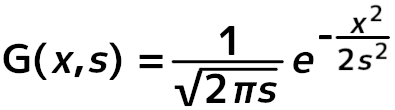
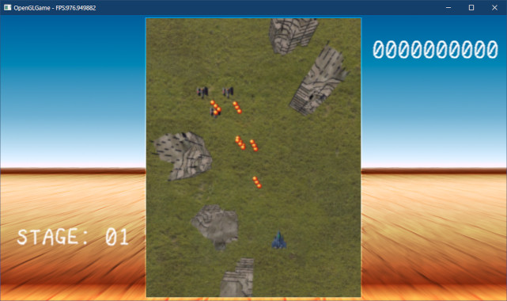
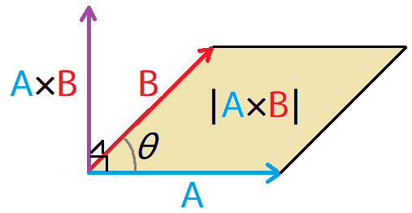
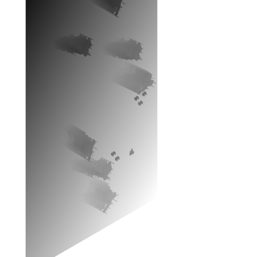
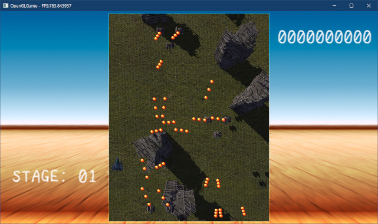
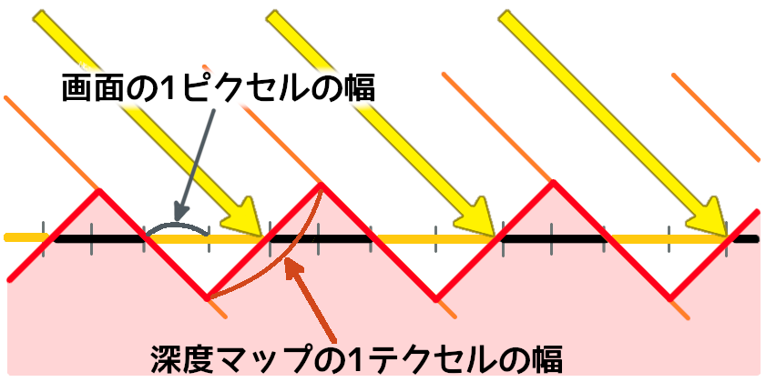
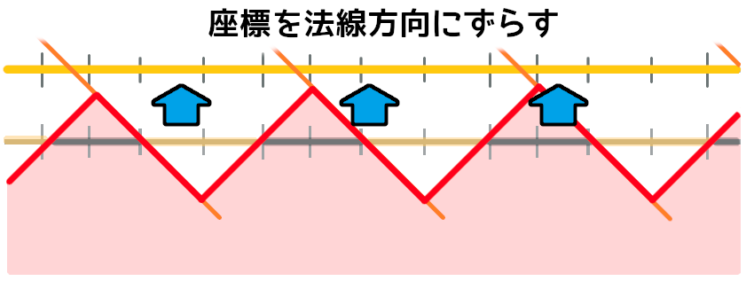
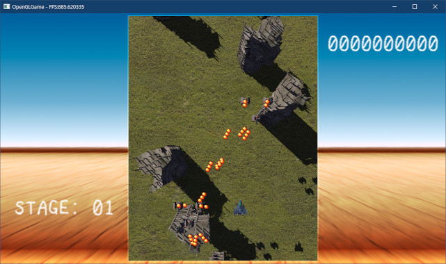

[OpenGL 3D 2022 後期 第01回]

# FBOとガウシアンブラーと影

## 習得目標

* フレームバッファオブジェクト(FBO)を作成できる。
* FBOの描画結果をテクスチャとして使うことができる。
* ベクトルの正規化と外積の用途を説明できる。
* デプスシャドウマッピングの仕組みを説明できる。
* シャドウアクネが発生する理由を説明できる。

## 1. フレームバッファオブジェクト

### 1.1 プリプロセスとポストプロセス

「画像を描画するメモリ領域」のことを「フレームバッファ」と呼びます。OpenGLのグラフィックスパイプラインでは、頂点データとテクスチャが変換され、いくつかのテスト(深度テストなど)に合格したピクセルが、最終的にフレームバッファに描画されます。

OpenGLコンテキストを作成すると、表示用のフレームバッファが自動的に作成され、OpenGLコンテキストに割り当てられます。この「自動的に作成されるフレームバッファ」のことを「デフォルト・フレームバッファ」と呼びます。

フレームバッファには描画が終わった画像が存在します。シェーダを使ってこの画像を編集することで、さまざまな効果を表現することができます。これを「ポスト・プロセス(後処理)」といいます。

ポストプロセスでは、フォトショップの画像フィルタのような「画面全体に影響する処理」を行います。

<div style="page-break-after: always"></div>

よく使われるポストプロセスには次のようなものがあります。

>* ブルーム(光のあふれ出しを表現)
>* 被写界深度(カメラのボケを表現)
>* アンビエント・オクルージョン(へこんだ部分を暗くする)
>* グレー・スケール(白黒画像に変換)
>* セピア(セピア色に変換)
>* ぼかし
>* ポスタリゼーション(イラスト風に変換)
>* アウトライン(輪郭線を描く)
>* アンチ・エイリアス(ギザギザな部分をなめらかにする)

また、異なる視点から見た景色を描画し、その画像を通常視点からの描画で利用する、ということもできます。このような技法を「プリ・プロセス(前処理)」といいます。

プリプロセスでは、通常視点からの描画で使う補助的な画像を作成するために使われます。プリプロセスには次のような表現があります。

>* バックミラー
>* 物体の影
>* 物体の映り込み
>* ディファード・レンダリング

### 1.2 オフスクリーン・バッファ

デフォルトフレームバッファは「実際に画面に表示されるフレームバッファ」です。

わざわざ「実際に画面に表示される」と書いたのは、「画面に表示されないフレームバッファ」も存在するからです。画面に表示されないフレームバッファのことを「オフスクリーン・バッファ」と呼びます。

プリプロセスやポストプロセスを行う場合、描画結果をテクスチャとして読み出せる必要があります。しかし、デフォルトフレームバッファは「モニターに出力可能なデータ形式で作る必要がある」ため、テクスチャとして使うことができません。

それに対して、オフスクリーンバッファの場合、描画先としてテクスチャを指定することができます。つまり、オフスクリーンバッファに描画を行い、オフスクリーンバッファに指定したテクスチャを使って前処理や後処理ができるわけです。

>**【デフォルトフレームバッファからテクスチャを作る別の方法】**<br>
>`PBO`(Pixel Buffer Object)という機能によって、デフォルトフレームバッファからテクスチャを作成する方法もあります。しかし、これはコピー操作を伴うため`FBO`より低速です。`FBO`が使える環境では`FBO`を使うべきです。

オフスクリーン・バッファを作成、管理するには「フレームバッファ・オブジェクト(Framebuffer Object、短縮形はFBO)」を使います。

`FBO`(エフ・ビー・オー)は、「テクスチャ」や「レンダーバッファ(後述)」をまとめて管理するためのオブジェクトで、その点では構造体に似ています。`VBO`や`IBO`と名前こそ似ていますが、メモリ管理機能を持たないなど、機能は全く異なります。

>**【○Framebuffer ☓Frame Buffer】**<br>
>OpenGLにおいて、フレームバッファは`Framebuffer`という一単語で表現されます。
>`Frame`と`Buffer`の組み合わせではないことに注意してください。この違いが重要なのは「`Framebuffer Object`はバッファ・オブジェクトではない」からです(なお、英語としては`Frame Buffer`でも間違いではありません)。

### 1.3 <ruby>空<rt>から</rt></rubh>のテクスチャを作成できるようにする

これまで、テクスチャは画像ファイルから作成していました。しかし、`FBO`に割り当てるテクスチャに「元になる画像ファイル」は存在しません。そこで、サイズとデータ形式を指定してテクスチャを作成する機能を追加しましょう。

`Texture.h`を開き、`Texture`クラスの定義に次のプログラムを追加してください。

```diff
   static TexturePtr Create(
     const std::string& filename, GLenum filterMode = GL_NEAREST,
     Usage usage = Usage::for2D);
+  static TexturePtr Create(
+    const char* name, GLint width, GLint height,
+    GLenum internalFormat = GL_RGBA8, GLenum filterMode = GL_LINEAR);

   // コンストラクタ、デストラクタ
   explicit Texture(const std::string& filename, GLenum filterMode = GL_NEAREST,
     Usage usage = Usage::for2D);
+  Texture(const char* name, GLint width, GLint height,
+    GLenum internalFormat = GL_RGBA8, GLenum filterMode = GL_LINEAR);
   ~Texture();

   // コピーと代入を禁止
```

`internalFormat`(インターナル・フォーマット)はテクスチャのデータ形式を表す引数です。

続いて`Texture.cpp`を開き、`Create`メンバ関数の定義の下に、新しい`Create`メンバ関数を追加してください。

```diff
 {
   return std::make_shared<Texture>(filename, filterMode, usage);
 }
+
+/**
+* テクスチャを作成する
+*
+* @param name            テクスチャ名(デバッグ用)
+* @param width           テクスチャの幅
+* @param height          テクスチャの高さ
+* @param internalFormat  テクスチャのデータ形式
+* @param filterMode      テクスチャに設定する拡大縮小フィルタ
+*
+* @return 作成したテクスチャへのポインタ
+*/
+TexturePtr Texture::Create(
+  const char* name, GLint width, GLint height,
+  GLenum internalFormat, GLenum filterMode)
+{
+  return std::make_shared<Texture>(
+    name, width, height, internalFormat, filterMode);
+}

 /**
 * コンストラクタ
```

追加した`Create`関数は、引数をそのまま`make_shared`関数の引数として渡すだけです。

次に、コンストラクタの定義の下に、新しいコンストラクタを追加してください。

```diff
   glTextureParameteri(tex, GL_TEXTURE_MAG_FILTER, filterMode);
   glTextureParameteri(tex, GL_TEXTURE_MIN_FILTER, filterMode);
 }
+
+/**
+* コンストラクタ
+*
+* @param name            テクスチャ名(デバッグ用)
+* @param width           テクスチャの幅
+* @param height          テクスチャの高さ
+* @param internalFormat  テクスチャのデータ形式
+* @param filterMode      テクスチャに設定する拡大縮小フィルタ
+*/
+Texture::Texture(const char* name, GLint width, GLint height,
+  GLenum internalFormat, GLenum filterMode)
+{
+  // テクスチャを作成
+  glCreateTextures(GL_TEXTURE_2D, 1, &tex);
+  glTextureStorage2D(tex, 1, internalFormat, width, height);
+
+  // 拡大縮小フィルタを設定
+  glTextureParameteri(tex, GL_TEXTURE_MAG_FILTER, filterMode);
+  glTextureParameteri(tex, GL_TEXTURE_MIN_FILTER, filterMode);
+}

 /**
 * デストラクタ
```

空のテクスチャを作成する方法は、ファイルからテクスチャを作成する場合とほとんど同じです。違いは、「コピーするデータがないので`glTextureSubImage2D`を呼び出さない」という点だけです。

これで、空のテクスチャを作成できるようになりました。

### 1.4 FramebufferObjectクラスを定義する

それでは、`FBO`を管理するクラスを作成しましょう。クラス名は`FramebufferObject`(フレームバッファ・オブジェクト)とします(`b`は「小文字」)。

プロジェクトの`Src`フォルダに、`FramebufferObject.h`という名前のヘッダファイルを追加してください。追加したファイルを開き、次のプログラムを追加してください。

```diff
+/**
+* @file FramebufferObject.h
+*/
+#ifndef FRAMEBUFFEROBJECT_H_INCLUDED
+#define FRAMEBUFFEROBJECT_H_INCLUDED
+#include "glad/glad.h"
+#include "Texture.h"
+#include <memory>
+
+// 先行宣言
+class FramebufferObject;
+using FramebufferObjectPtr = std::shared_ptr<FramebufferObject>;
+
+#endif // FRAMEBUFFEROBJECT_H_INCLUDED
```

まずインクルードガードを書き、次に必要なヘッダファイルをインクルードします。そして
`FramebufferObject`クラスのポインタを先行宣言しています。

一般的なフレームバッファは「カラーバッファ」と「深度バッファ」の2つを持ちます。<br>
しかし、2Dスプライトのようにカラーバッファだけで深度バッファは不要だったり、エフェクトによっては逆に深度バッファだけで十分な場合もあります。

不要なバッファを作成するのはGPUメモリの無駄です。そこで、必要なバッファの種類を表す
`FboType`(エフビーオー・タイプ)列挙型を定義し、この値を`FramebufferObject`コンストラクタに渡すことにします。

先行宣言の下に、次のプログラムを追加してください。

```diff
 // 先行宣言
 class FramebufferObject;
 using FramebufferObjectPtr = std::shared_ptr<FramebufferObject>;
+
+/**
+* FBOの種類
+*/
+enum class FboType
+{
+  color = 1, // カラーテクスチャだけ
+  depth = 2, // 深度テクスチャだけ
+  colorDepth = color | depth, // カラーテクスチャと深度テクスチャ
+};

 #endif // FRAMEBUFFEROBJECT_H_INCLUDED
```

また、`FboType`列挙型は、`&`(論理積)演算子によって必要なバッファを判定できるような値を設定しています。しかし、`enum`と異なり、`enum class`は暗黙の型変換が禁止されているため、直接`&`演算子に渡すことはできません。

そこで、演算子オーバーロードを使って、`FboType`専用の`&`演算子を定義します。
`FboType`列挙型の定義の下に、次のプログラムを追加してください。

```diff
   depth = 2, // 深度テクスチャだけ
   colorDepth = color | depth, // カラーテクスチャと深度テクスチャ
 };
+
+/**
+* FboType同士の論理積
+*/
+constexpr int operator&(FboType a, FboType b)
+{
+  return static_cast<int>(a) & static_cast<int>(b);
+}

 #endif // FRAMEBUFFEROBJECT_H_INCLUDED
```

>ヘッダファイルに関数の定義を書く場合、`inline`または`constexpr`キーワードを付ける必要があります。宣言だけの場合は付けてはいけません。

それでは`FramebufferObject`クラスを定義しましょう。`operator&`の定義の下に、次のプログラムを追加してください。

```diff
 {
   return static_cast<int>(a) & static_cast<int>(b);
 }
+
+/**
+* フレームバッファオブジェクト(FBO)
+*/
+class FramebufferObject
+{
+public:
+  // FBOを作成
+  static FramebufferObjectPtr Create(int width, int height, FboType type);
+
+  // コンストラクタ・デストラクタ
+  FramebufferObject(int width, int height, FboType type);
+  ~FramebufferObject();
+
+  // コピーと代入を禁止
+  FramebufferObject(const FramebufferObject&) = delete;
+  FramebufferObject& operator=(const FramebufferObject&) = delete;
+
+  // フレームバッファの管理番号を取得
+  operator GLuint() const { return fbo; }
+
+  // テクスチャの管理番号を取得
+  const TexturePtr& GetColorTexture() const { return texColor; }
+  const TexturePtr& GetDepthTexture() const { return texDepth; }
+
+private:
+  GLuint fbo = 0; // フレームバッファオブジェクトのID
+  TexturePtr texColor; // カラーテクスチャ
+  TexturePtr texDepth; // 深度テクスチャ
+};

 #endif // FRAMEBUFFEROBJECT_H_INCLUDED
```

`FBO`には、自身の管理番号だけでなく、割り当てられたテクスチャを取得する関数も定義します。

### 1.5 Createメンバ関数を定義する

続いてメンバ関数を定義します。プロジェクトの`Src`フォルダに`FramebufferObject.cpp`
という名前のCPPファイルを追加してください。追加したファイルを開き、次のプログラムを追加してください。

```diff
+/**
+* @file FramebufferObject.cpp
+*/
+#include "FramebufferObject.h"
+#include "Debug.h"
+
+/**
+* FBOを作成する
+*
+* @param width  フレームバッファの幅(ピクセル数)
+* @param height フレームバッファの高さ(ピクセル数)
+* @param type   FBOの種類
+*
+* @return 作成したFBO
+*/
+FramebufferObjectPtr FramebufferObject::Create(int width, int height,
+    FboType type = FboType::colorDepth)
+{
+  return std::make_shared<FramebufferObject>(width, height, type);
+}
```

`Create`(クリエイト)メンバ関数は、受け取った引数を`make_shared`関数の引数として指定するだけです。

### 1.6 コンストラクタを定義する

次にコンストラクタを定義しましょう。少し長い関数なので、まず「やることリスト」を書き出します。`Create`メンバ関数の定義の下に、次のプログラムを追加してください。

```diff
 {
   return std::make_shared<FramebufferObject>(width, height, type);
 }
+
+/**
+* コンストラクタ
+*
+* @param width  フレームバッファの幅(ピクセル数)
+* @param height フレームバッファの高さ(ピクセル数)
+* @param type   FBOの種類
+*/
+FramebufferObject::FramebufferObject(int width, int height, FboType type)
+{
+  // カラーテクスチャを作成
+
+  // 深度テクスチャを作成
+
+  // FBOを作成
+
+  // FBOの有効性をチェック
+
+  // 作成成功
+  LOG("FBO(width=%d, height=%d)を作成", width, height);
+}
```

FBOにはカラーテクスチャと深度テクスチャが指定できます。`type`引数に応じてこれらのテクスチャを作成したら、FBOに割り当てます。そして、最後にFBOの有効性をチェックします。

それではカラーテクスチャを作成するプログラムを追加しましょう。「カラーテクスチャを作成」というコメントに下に、次のプログラムを追加してください。

```diff
 FramebufferObject::FramebufferObject(int width, int height, FboType type)
 {
   // カラーテクスチャを作成
+  if (type & FboType::color) {
+    texColor = Texture::Create("FBO(Color)", width, height, GL_RGBA8, GL_LINEAR);
+    if ( ! texColor || !*texColor) {
+      LOG_ERROR("FBO用カラーテクスチャの作成に失敗");
+      texColor.reset(); // カラーテクスチャを破棄
+      return;
+    }
+  }

   // 深度テクスチャを作成
```

ここでは、少し前に追加した「空のテクスチャを作成する機能」を使っています。カラー画像なので、データ形式には`GL_RGBA8`(ジーエル・アールジービーエー・はち)を指定しています。

また、なめらかに拡大縮小が行えるように、フィルタには`GL_LINEAR`を指定しておきます。

テクスチャを作成したらエラーチェックを行います。テクスチャの作成に失敗するケースとしては、以下の2種類が考えられます。

>1. `Texture`クラス用のメモリ確保に失敗
>2. OpenGLの`Texture`オブジェクトの作成に失敗

1のケースでは「`texColor`が`nullptr`かどうか」を判定します。これは上記プログラムの
`!texColor`の部分です。2のケースでは「管理番号が`0`かどうか」を判定します。これは上記プログラムの`!*texColor`の部分です。

常に適切なプログラムを書いている限りは、どちらのケースもまず起きないため、このエラーチェックはなくても問題にならないでしょう。しかし、「常に適切なプログラムを書く」ということは人類には不可能です。

そのため、早期にバグを発見できるように、できるだけ多くの場所にエラーチェックを入れておくことが推奨されます。ただし、チェックを入れ過ぎるとアプリの実行速度が低下します。そこで、「Debugビルドのみチェックする」場合もあります。

>**【!演算子の前後の空白について】**<br>
>本テキストで`!`演算子の前後に空白を入れているのは、見間違えを防ぐためです。<br>
>一般的な書き方ではないので、実際に書き写すときは空白を入れる必要はありません。

次に深度テクスチャを作成します。カラーテクスチャを作成するプログラムの下に、次のプログラムを追加してください。

```diff
   }

   // 深度テクスチャを作成
+  if (type & FboType::depth) {
+    texDepth = Texture::Create("FBO(Depth)", width, height, GL_DEPTH_COMPONENT32F, GL_LINEAR);
+    if ( ! texDepth || !*texDepth) {
+      LOG_ERROR("FBO用深度テクスチャの作成に失敗");
+      texColor.reset(); // カラーテクスチャを破棄
+      texDepth.reset(); // 深度テクスチャを破棄
+      return;
+    }
+  }

   // FBOを作成
```

やることはカラーテクスチャと同じです。ただし、深度テクスチャの場合は特定のデータ形式を指定する必要があります。指定できる形式は以下の4つです。

>* GL_DEPTH_COMPONENT16(ジーエル・デプス・コンポーネント・じゅうろく)
>* GL_DEPTH_COMPONENT24(ジーエル・デプス・コンポーネント・にじゅうよん)
>* GL_DEPTH_COMPONENT32(ジーエル・デプス・コンポーネント・さんじゅうに)
>* GL_DEPTH_COMPONENT32F(ジーエル・デプス・コンポーネント・さんじゅうに・エフ)

数字が大きいほど精度が高くなりますが、そのぶん必要なメモリが増え、処理に時間がかるようになります。また、末尾に`F`の付いていないバッファは整数型の深度バッファで、`F`が付いているのは浮動小数点数型の深度バッファです。

数字が大きいほど精度が高く、さらに整数バッファより浮動小数点数バッファのほうが精度が高いです。通常は`32F`を選べばよいですが、古いGPUやモバイル環境では`24`や`16`しか使えなかったり、描画速度が低下する場合があります。

続いて、`FBO`を作成し、テクスチャを割り当てます。深度テクスチャを作成するプログラムの下に、次のプログラムを追加してください。

```diff
   }

   // FBOを作成
+  glCreateFramebuffers(1, &fbo);
+  if (static_cast<int>(type) & 1) {
+    glNamedFramebufferTexture(fbo, GL_COLOR_ATTACHMENT0, *texColor, 0);
+  } else {
+    glNamedFramebufferDrawBuffer(fbo, GL_NONE);
+  }
+  if (static_cast<int>(type) & 2) {
+    glNamedFramebufferTexture(fbo, GL_DEPTH_ATTACHMENT, *texDepth, 0);
+  }

   // FBOが作成できたかチェック
```

`FBO`を作成するには`glCreateFramebuffers`(ジーエル・クリエイト・フレームバッファーズ)関数を使います。

<p><code class="tnmai_code"><strong>【書式】</strong><br>
void glCreateFramebuffers(作成するFBOの数, 作成したFBOのIDを格納する変数アドレス);
</code></p>

作成した`FBO`には、必要に応じてカラーテクスチャや深度テクスチャを割り当ることができます。`FBO`にテクスチャを割り当てるには`glNamedFramebufferTexture`(ジーエル・ネームド・フレームバッファ・テクスチャ)関数を使います。

<pre class="tnmai_code"><strong>【書式】</strong><code>
void glNamedFramebufferTexture(割り当て先FBO, 用途, テクスチャID, ミップマップレベル);
</code></pre>

「用途」は以下の4種類から指定します。

>* GL_COLOR_ATTACHIMENT0(ジーエル・カラー・アタッチメント・ゼロ)<br>&emsp;～GL_COLOR_ATTACHIMENT31: カラーバッファ
>* GL_DEPTH_ATTACHIMENT(ジーエル・デプス・アタッチメント): 深度バッファ
>* GL_STENCIL_ATTACIMENT(ジーエル・ステンシル・アタッチメント):<br>&emsp;ステンシルバッファ
>* GL_DEPTH_STENCIL_ATTACIMENT(ジーエル・デプス・ステンシル・アタッチメント):<br>&emsp;深度バッファとステンシルバッファの両方

ミップマップを持つテクスチャの場合、「ミップマップレベル」を設定することで割り当てるミップマップを指定できます。ミップマップがないテクスチャの場合は`0`を指定します。

深度バッファだけが必要な場合、`glNamedFramebufferDrawBuffer`(ジーエル・ネームド・フレームバッファ・ドロー・バッファ)関数の引数に`GL_NONE`(ジーエル・ノン)を指定します。これによって「カラーは描画しない」ことを示します。

<pre class="tnmai_code"><strong>【書式】</strong><code>
void glNamedFramebufferDrawBuffer(割り当て先FBO, 描画先のカラーバッファ);
</code></pre>

「描画先のカラーバッファ」は以下の2種類から選択します。

>* GL_NONE(ジーエル・ノン): カラーを描画しない
>* GL_COLOR_ATTACHIMENT0～GL_COLOR_ATTACHIMENT31: カラーバッファ

最後に`FBO`が正しく作成されたことを確認します。<br>
これには`glCheckNamedFramebufferStatus`(ジーエル・チェック・ネームド・フレームバッファ・ステータス)関数を使います。FBOを作成するプログラムの下に、次のプログラムを追加してください。

```diff
   }

   // FBOが作成できたかチェック
+  if (glCheckNamedFramebufferStatus(fbo, GL_FRAMEBUFFER) != GL_FRAMEBUFFER_COMPLETE) {
+    LOG_ERROR("FBOの作成に失敗");
+    glDeleteFramebuffers(1, &fbo);
+    fbo = 0;
+    texColor.reset();
+    texDepth.reset();
+    return;
+  }

   // 作成成功
   LOG("FBO(width=%d, height=%d)を作成", width, height);
```

<p><code class="tnmai_code"><strong>【書式】</strong><br>
検査結果 glCheckNamedFramebufferStatus(チェックするFBOのID, IDが0だったとき代わりにチェックするバインディングポイント);
</code></p>

`glCheckNamedFramebufferStatus`関数の第1引数に`0`を指定すると、第2引数で指定したバインディングポイントに割り当てられている`FBO`がチェックされます。

今回、第1引数にはゼロ以外の値を指定するので、第2引数には(指定可能な値なら)どれを指定しても構いません。とりあえず`GL_FRAMEBUFFER`を指定しておきます。

>その他の指定可能な値については以下のURLを参照(または関数名でWeb検索)してください。<br>
>`https://registry.khronos.org/OpenGL-Refpages/gl4/html/glCheckFramebufferStatus.xhtml`

検査の結果、`FBO`が正しく構築されていたら`GL_FRAMEBUFFER_COMPLETE`(ジーエル・フレームバッファ・コンプリート)という値が返されます。

`FBO`に不良がある場合はそれ以外の値が返されます。これでコンストラクタは完成です。

### 1.7 デストラクタを定義する

続いてデストラクタを定義します。デストラクタでは`FBO`を破棄するだけです。テクスチャには`std::shared_ptr`を使っているため、自動的に破棄されるからです。コンストラクタの定義の下に、次のプログラムを追加してください。

```diff
   // 作成成功
   LOG("FBO(width=%d, height=%d)を作成", width, height);
 }
+
+/**
+* デストラクタ
+*/
+FramebufferObject::~FramebufferObject()
+{
+  glDeleteFramebuffers(1, &fbo);
+}
```

`FBO`を破棄するには`glDeleteFramebuffers`(ジーエル・デリート・フレームバッファーズ)関数を使います。

<p><code class="tnmai_code"><strong>【書式】</strong><br>
void glDeleteFramebuffers(削除するFBOの数, 削除するFBOのIDの配列);
</code></p>

これで`FramebufferObject`クラスは完成です。

### 1.8 FBOを作成する

それでは、ゲーム画面をFBOに描画してみましょう。まずゲームエンジンにFBOを追加します。
`Engine.h`を開き、`FramebufferObject.h`をインクルードしてください。

```diff
 #include "GameObject.h"
 #include "Component/Camera.h"
 #include "VecMath.h"
+#include "FramebufferObject.h"
 #include <GLFW/glfw3.h>
 #include <string>
```

次に、`Engine`クラスにある3Dモデル用の変数定義の下に、次のプログラムを追加してください。

```diff
   Mesh::MeshBufferPtr meshBuffer;
   Mesh::PrimitiveBufferPtr primitiveBuffer;
   GameObjectPtr cameraObject;
+
+  FramebufferObjectPtr fboGameWindow;  // ゲームウィンドウ用FBO

   ScenePtr scene; // 実行中のシーン
   ScenePtr nextScene; // 次のシーン
```

次に`Engine.cpp`を開き、`Initialize`メンバ関数の定義に次のプログラムを追加してください。

```diff
   progSprite = ProgramPipeline::Create("Res/standard_2D.vert", "Res/standard_2D.frag");
   progStandard3D = ProgramPipeline::Create("Res/standard_3D.vert", "Res/standard_3D.frag");
+
+  // ゲームウィンドウ用FBOを作成
+  const vec2 viewSize = GetViewSize();
+  fboGameWindow = FramebufferObject::Create(
+    static_cast<int>(viewSize.x), static_cast<int>(viewSize.y), FboType::colorDepth);

   // 頂点データをGPUメモリにコピー
   struct Vertex {
```

`fboGameWindow`(エフビーオー・ゲーム・ウィンドウ)は、ゲーム表示領域と同じ大きさで作成することにします。ほとんどのエフェクトはこの範囲に対してだけ実行すればよいので、アプリのウィンドウと同じ大きさで作る必要はないからです。

### 1.9 描画先を切り替える

描画先をデフォルトフレームバッファからゲームウィンドウ用FBOに変更するには、
`glBindFramebuffer`(ジーエル・バインド・フレームバッファ)関数を使います。

<p><code class="tnmai_code"><strong>【書式】</strong><br>
void glBindFramebuffer(割り当て先, 割り当てるFBO);
</code></p>

割り当て先は以下の3種類から選択します。

| 割り当て先 | 説明 |
|:----------:|:----:|
| GL_DRAW_FRAMEBUFFER | 描画用フレームバッファ |
| GL_READ_FRAMEBUFFER | 読み取り用フレームバッファ |
| GL_FRAMEBUFFER | 上記の両方 |

通常は`GL_FRAMEBUFFER`を指定して、描画用と読み取り用の両方に同じFBOを割り当てます。ほとんどの場合、`GL_DRAW_FRAMEBUFFER`と`GL_READ_FRAMEBUFFER`に異なるFBOを設定する必要はありません。

>この機能は`glBlitFramebuffer`(ジーエル・ブリット・フレームバッファ)によるフレームバッファ間のコピーや、`glReadPixels`によるピクセルの読み取りなどで使います。
>ただ、フレームバッファ間のコピーについては、通常のポリゴンを使った描画のほうが高速です。そのため、現代では`glBlitFramebuffer`を使う意味はありません。`glReadPixels`はデバッグ用途などで使えるかもしれません。

それでは、`MainLoop`メンバ関数にある、スプライトデータをSSBOにコピーするプログラムの下に、次のプログラムを追加してください。

```diff
       memcpy(p, layer.spriteList.data(), layer.spriteList.size() * sizeof(Sprite));
       p += CalcSsboSize(layer.spriteList.size() * sizeof(Sprite));
     }
+
+    // 描画先をゲームウィンドウに変更
+    glBindFramebuffer(GL_FRAMEBUFFER, *fboGameWindow);
+    const vec2 viewSize = GetViewSize();
+    glViewport(0, 0,
+      static_cast<int>(viewSize.x), static_cast<int>(viewSize.y));
+    glBindVertexArray(vao);

     // バックバッファをクリア
-    glViewport(0, 0, 1280, 720);
    glClearColor(0.3f, 0.6f, 0.9f, 1.0f);
    glClear(GL_COLOR_BUFFER_BIT | GL_DEPTH_BUFFER_BIT);
```

このプログラムでは、FBOの変更と同時にビューポートも設定しています。通常はFBO全体を描画範囲としたいので、ビューポートはFBOと同じサイズに設定します。そのため、FBOを変更すると同時にビューポートも設定すると間違えにくいです。

ビューポートの設定をFBO変更時に行うようにしたので、スプライト描画前にあるビューポート設定プログラムは不要です。スプライトの描画範囲を設定するプログラムを削除してください。

```diff
     glEnable(GL_BLEND);
     glBlendEquation(GL_FUNC_ADD);
     glBlendFunc(GL_SRC_ALPHA, GL_ONE_MINUS_SRC_ALPHA);
-
-    // スプライトの描画範囲を設定
-    const int viewSizeX = 17 * 32;
-    glViewport((1280 - viewSizeX) / 2, (720 - viewSizeY) / 2, viewSizeX, viewSizeY);

     // ユニフォーム変数に、座標変換用パラメータをコピーする
     glProgramUniform4f(*progSprite, 2,
-      2.0f / static_cast<float>(viewSizeX),
-      2.0f / static_cast<float>(viewSizeY), -1, -1);
+      2.0f / viewSize.x, 2.0f / viewSize.y, -1, -1);

     // スプライト配列を描画
     size_t spriteSsboOffset = spriteSsboIndex * spriteSsboSize;
```

ここで削除した`viewSizeX`変数は、直後の「座標変換用パラメータをコピーする」プログラムでも使われています。しかし、これは前のプログラムに追加した`viewSize`変数で置き換えることができます。

描画先をFBOに変更したため、ビューポートの設定も変更する必要があります。
`MainGameScene.cpp`を開き、ビューポートを設定するプログラムを次のように変更してください。

```diff
   auto cameraComponent = engine.GetMainCamera();
   const vec2 windowSize = engine.GetWindowSize();
   cameraComponent->viewport = {
-    static_cast<int>(windowSize.x - viewSize.x) / 2,
-    static_cast<int>(windowSize.y - viewSize.y) / 2,
+    0, 0,
     static_cast<int>(viewSize.x),
     static_cast<int>(viewSize.y) };
```

もともとはウィンドウ全体に対して描画範囲を指定していました。しかし、描画先をFBOに変更したため、描画範囲をゲームウィンドウの範囲と一致させています。これで、描画先の変更は完了です。

### 1.10 描画先をデフォルトフレームバッファに戻す

描画先をFBOにしたままだと、画面には何も表示されません。そのため、最終的には描画先をデフォルトフレームバッファに戻さなくてはなりません。

問題は「いつ戻すか？」です。今回はUIレイヤーを描画する直前で、デフォルトフレームバッファに戻すことにします。

```diff
     glDisable(GL_CULL_FACE);  // 裏面カリングを無効化
     DrawSpriteList(*drawList[1], *tex[1], spriteSsboOffset);

-    // UIレイヤーのスプライト配列を描画
+    // デフォルトフレームバッファに戻す
+    glBindFramebuffer(GL_FRAMEBUFFER, 0);
     glViewport(0, 0, 1280, 720);
```

デフォルトフレームバッファに戻すには、`glBindFramebuffer`の第2引数に`0`を指定します。

### 1.11 FBOの描画結果を利用する

FBOへの描画は、FBOに割り当てたテクスチャに対して行われます。描画が完了したら、そのテクスチャは普通のテクスチャとして使うことができます。

まず描画用のスプライトを追加しましょう。`MainLoop`メンバ関数にある「スプライトデータをSSBOにコピー」するプログラムに、次にプログラムを追加してください。

```diff
       memcpy(p, drawList[i]->data(), drawList[i]->size() * sizeof(Sprite));
       p += CalcSsboSize(drawList[i]->size() * sizeof(Sprite));
     }
+
+    // ゲームウィンドウ用のスプライトデータをSSBOにコピー
+    SpriteList spriteListPostProcess;
+    if ( ! gameObjectList.empty()) {
+      // ポストプロセス用スプライトを追加
+      const vec2 gameWindowPos = GetWindowSize() * 0.5f;
+      spriteListPostProcess.push_back(
+        Sprite{ gameWindowPos.x, gameWindowPos.y, 1, 0, Texcoord{ 0, 1, 1, -1 } });
+
+      const size_t size = spriteListPostProcess.size() * sizeof(Sprite);
+      memcpy(p, spriteListPostProcess.data(), size);
+      p += CalcSsboSize(size);
+    }

     // UIレイヤーのスプライトデータをSSBOにコピー
     for (const auto& layer : uiLayerList) {
```

現在のスプライト描画用頂点データは、上下反転したテクスチャを使うように設計しています。しかし、FBOによって描画されたテクスチャは上下反転していません。

そのため、ポストプロセス用スプライトでは、Yテクスチャ座標を反転させなくてはなりません。そこで、通常は`Texcoord`の`v`メンバに`0`、`sy`メンバに`1`に指定するところを、上下反転させるために`1`と`-1`を指定しています。

ただ、サイズにマイナスを入れると図形の拡大が正しく行われません。そこで、2D用シェーダを修正します。`standard_2D.vert`を開き、図形の大きさを計算するプログラムを次のように変更してください。

```diff
   // 頂点座標を計算
   gl_Position = vec4(inPosition, 1);

   // 図形の大きさを画像の大きさと等しくする
-  gl_Position.xy *= texcoord.size * textureSize(texColor, 0);
+  gl_Position.xy *= abs(texcoord.size) * textureSize(texColor, 0);

   // 図形をSSBOの座標に移動
   gl_Position.xy += spriteList[gl_InstanceID].position.xy;
```

`abs`関数によって絶対値に変換することで、サイズがマイナスになっていても正しく拡大されるようにしています。

最後に、ゲームウィンドウを描画します。デフォルトフレームバッファに戻すプログラムの下に、次のプログラムを追加してください。

```diff
     // デフォルトフレームバッファに戻す
     glBindFramebuffer(GL_FRAMEBUFFER, 0);
     glViewport(0, 0, 1280, 720);

+    // ゲームウィンドウを描画
+    glUseProgram(*progSprite);
+    glProgramUniform4f(*progSprite, 2, 2.0f / 1280, 2.0f / 720, -1, -1);
+    if ( ! gameObjectList.empty()) {
+      DrawSpriteList(spriteListPostProcess,
+        *fboGameWindow->GetColorTexture(), spriteSsboOffset);
+    }
+
+    // UIレイヤーのスプライト配列を描画
     for (const auto& layer : uiLayerList) {
       DrawSpriteList(layer.spriteList, *layer.tex, spriteSsboOffset);
```

プログラムが書けたらビルドして実行してください。特に問題なくゲーム画面が表示されていたら成功です。

<p align="center">

</p>

>**【1章のまとめ】**
>
>* テクスチャに描画するにはフレームバッファオブジェクト(FBO)を使う。
>* 深度バッファを作成するには、画像形式に`GL_DEPTH_COMPONENT32F`を指定する。
>* フレームバッファをバインドするときは、同時に`glViewport`で描画範囲を指定する必要がある。

<div style="page-break-after: always"></div>

## 2. プリプロセスとポストプロセス

### 2.1 ガウシアンブラー

単純な描画では、FBOを使っている実感がわかないと思います。そこで、簡単なぼかしエフェクトを作成してみましょう。

プロジェクトの`Res`フォルダに`gaussian_blur.frag`(ガウシアン・ブラー・フラグ)という名前のテキストファイルを追加してください。追加したファイルを開き、次のプログラムを追加してください。

```diff
+/**
+* @file gaussian_blur.frag
+*/
+#version 450
+
+// シェーダへの入力
+layout(location=1) in vec2 inTexcoord;
+
+// テクスチャ
+layout(binding=0) uniform sampler2D texColor;
+
+// プログラムからの入力
+layout(location=100) uniform float blurRatio; // ぼかし効果量(0～1)
+
+// 出力する色データ
+out vec4 outColor;
+
+// エントリーポイント
+void main()
+{
+  float offset[] = { -5.176, -3.294, -1.412, 0, 1.412, 3.294, 5.176 };
+  float weight[] = { 0.010, 0.094, 0.297, 0.196, 0.297, 0.094, 0.010 };
+  vec2 invTexelSize = 1 / vec2(textureSize(texColor, 0));
+
+  vec3 blurColor = vec3(0);
+  for (int y = 0; y < 7; ++y) {
+    for (int x = 0; x < 7; ++x) {
+      vec2 o = vec2(offset[x], offset[y]) * invTexelSize;
+      float w = weight[x] * weight[y];
+      blurColor.rgb += texture(texColor, inTexcoord + o).rgb * w;
+    }
+  }
+
+  vec3 baseColor = texture(texColor, inTexcoord).rgb;
+  outColor = vec4(mix(baseColor, blurColor, blurRatio), 1);
+}
```

この「ぼかし」シェーダでは、描画するピクセルを中心にして13x13ピクセルを読み取り、中心から離れるほど影響力を減らしながら加算することで、なめらかなぼかしを実行します。

>**【ガウシアン・ブラーの名前の由来】**<br>
>ガウシアン・ブラーという名前は、影響力の値を「ガウス関数」によって決めることから来ています（正確には、ガウス関数の一種である正規分布関数を使います)。
>ちなみに「ガウス関数」という名前は、ドイツの天文学者「カール・フリードリヒ・ガウス」から付けられました。ガウス氏については以下のURLを参照してください。<br>
>`https://dic.nicovideo.jp/a/カール・フリードリヒ・ガウス`<br>
>なお、正規分布を最初に発見したのはフランスの数学者「ド・モアブル」という人物です。正規分布関数は次の式であらわされます(`s`=分布範囲を示す標準偏差, `e`=ネイピア数`2.718281828459`)。<br>
><p></p>

次に、ゲームエンジンにガウシアンブラー・シェーダを追加します。`Engine.h`を開き、ゲームウィンドウ用FBO変数の定義の下に、次のプログラムを追加してください。

```diff
   GameObjectPtr cameraObject;

   FramebufferObjectPtr fboGameWindow; // ゲームウィンドウ用FBO
+
+  // エフェクト用の変数
+  ProgramPipelinePtr progGaussianBlur; // ぼかしシェーダ
+  float blurStrength = 1; // ぼかし強度(0.0～1.0)

   ScenePtr scene; // 実行中のシーン
   ScenePtr nextScene; // 次のシーン
```

`blurStrength`(ブラー・ストレングス)変数は、ぼかしの強さを指定するメンバ変数です。
`0`を指定すると全くぼけません。`1`を指定すると最大までぼかした状態になります。

続いて`Engine.cpp`を開き、`Initialize`メンバ関数にあるFBOを作成するプログラムの下に、次のプログラムを追加してください。

```diff
   const vec2 viewSize = GetViewSize();
   fboGameWindow = FramebufferObject::Create(
     static_cast<int>(viewSize.x), static_cast<int>(viewSize.y), FboType::colorDepth);
+
+  // ぼかしシェーダを読み込む
+  progGaussianBlur = ProgramPipeline::Create(
+    "Res/standard_2D.vert", "Res/gaussian_blur.frag");

   // 頂点データをGPUメモリにコピー
   struct Vertex {
```

ぼかし用の頂点シェーダには、既存の`standard_2D.vert`を流用します。また、クリップ座標系へ変換するためのパラメータは変化しない

最後に、`blurStrength`変数の値に応じて使用するシェーダを切り替えます。ゲームウィンドウを描画するプログラムに、次のプログラムを追加してください。

```diff
     glUseProgram(*progSprite);
     glProgramUniform4f(*progSprite, 2, 2.0f / 1280, 2.0f / 720, -1, -1);
     if ( ! gameObjectList.empty()) {
+      // ぼかし強度が0より大きければぼかしシェーダを使う
+      if (blurStrength > 0) {
+        glUseProgram(*progGaussianBlur);
+        const vec2 windowSize = GetWindowSize();
+        glProgramUniform4f(*progGaussianBlur, 2,
+          2.0f / windowSize.x, 2.0f / windowSize.y, -1, -1);
+        glProgramUniform1f(*progGaussianBlur, 100, blurStrength);
+        DrawSpriteList(spriteListPostProcess,
+          *fboGameWindow->GetColorTexture(), spriteSsboOffset);
+        glUseProgram(*progSprite);
+      } else {
         DrawSpriteList(spriteListPostProcess,
           *fboGameWindow->GetColorTexture(), spriteSsboOffset);
+      } // blurStrength
     }

     // UIレイヤーのスプライト配列を描画
```

プログラムが書けたらビルドして実行してください。ゲーム画面が少しぼけていたら成功です。このように、FBOを利用することで描画結果にエフェクトをかけることができます。

<p align="center">

</p>

<pre class="tnmai_assignment">
<strong>【課題01】</strong>
ゲームエンジンに<code>blurStrength</code>を設定するメンバ関数を追加し、メインゲームが開始されたら徐々にぼかしを解除する機能を作成しなさい。
</pre>

### 2.2 影を描画するシェーダを追加する

コンピューター・グラフィックス、特にゲームにおいて、適切な影を描画することは、長らく困難な問題でした。

ゲームに使われるコンピューターは価格による性能限界があること、また、1/60～1/20秒という短い時間で描画を完了しなくてはならないことがその理由です。現在に至っても、真に適切な影を描画することは、非常に難易度の高い作業です。

それでも、現代では「デプスシャドウマッピング」という方法によって、比較的リアルな影を表現できるようになっています。「デプスシャドウマッピング」は以下の手順で影を描画します。

>1. 影描画用に深度バッファのみのFBOを作成する。
>2. ライトの位置にカメラを置いてビュープロジェクション行列(シャドウ行列)を作成し、「影描画用のFBO」に描画する。
>3. 本来の視点の位置にカメラを置いて通常の描画を行う。
>4. このとき、2で作成したシャドウ行列を使ってライト空間の座標を計算する。
>5. フラグメントシェーダで、4で計算したライト空間の座標と「影用のFBO」に書き込まれたZ値を比較する。
>6. 座標がZ値より奥にある場合、描画するピクセルとライトとの間に「物体」があることを意味する。 つまり、ピクセルは影の中にいるのでライトの明るさを無視する。
>7. 座標がZ値と同じ場合、描画するピクセルとライトとの間にはなにもない。つまり、直接ライトの光が届いているので、ライトの明るさをピクセルに反映する。

<p align="center">
<br>
</p>

影の描画に必要なのは深度バッファだけで、カラーバッファは不要です。<br>
これは、`standard_3D.vert`, `standard_3D.frag`で行っているほとんどの計算が不要であることを意味します。

そこで、必要な処理だけを組み込んだ影描画用のシェーダを追加することにします。プロジェクトの`Res`フォルダに`shadow.vert`(シャドウ・バート)という名前のテキストファイルを追加してください。

追加したファイルを開き、次のプログラムを追加してください。

```diff
+/**
+* @file shadow.vert
+*/
+#version 450
+
+// シェーダへの入力
+layout(location=0) in vec3 inPosition;
+layout(location=1) in vec2 inTexcoord;
+
+// シェーダからの出力
+layout(location=1) out vec2 outTexcoord;
+
+// プログラムからの入力
+layout(location=0) uniform mat4 matModel;
+layout(location=1) uniform mat4 matShadow;
+
+void main()
+{
+  outTexcoord = inTexcoord;
+  gl_Position = matShadow * (matModel * vec4(inPosition, 1));
+}
```

色の計算を行わないので、法線データを扱うプログラムは入れていません。

次にフラグメントシェーダを追加します。プロジェクトの`Res`フォルダに`shadow.frag`という名前のテキストファイルを追加してください。追加したファイルを開き、次のプログラムを追加してください。

```diff
+/**
+* @file shadow.frag
+*/
+#version 450
+
+// シェーダへの入力
+layout(location=1) in vec2 inTexcoord;
+
+// テクスチャ
+layout(binding=0) uniform sampler2D texColor;
+
+// マテリアル
+struct Material
+{
+  vec4 baseColor; // 基本色+アルファ
+
+  // x: 鏡面反射指数
+  // y: 正規化係数
+  vec2 specularFactor;
+};
+layout(location=102) uniform Material material;
+
+void main()
+{
+  float alpha = texture(texColor, inTexcoord).a * material.baseColor.a;
+  if (alpha < 0.5) {
+    discard;
+  }
+}
```

フラグメントシェーダでは、テクスチャとマテリアルのアルファ値を参照し、アルファ値が
`0.5`未満の場合は`discard`(ディスカード、「破棄する」という意味)キーワードによって描画をキャンセルします。

### 2.3 内積、長さ、正規化、外積を求める関数を定義する

頂点シェーダでは、頂点座標を「カメラから見た座標」に変換します。これまでは、カメラの座標と回転から変換用パラメータを計算し、シェーダに送っていました。

実は、カメラ視点への変換にも行列を使うことができます。「カメラから見た視点に変換するための行列」のことを「ビュー行列」といいます。ビュー行列はさまざまな方法で作成できますが、今回は「視点」と「注視点」から計算する関数を作ります。

この方法では、「2つのベクトルの外積(がいせき)」と「ベクトルの正規化(せいきか)」を計算できなくてはなりません。そこで、まずこれらを行う関数を追加します。

最初に、正規化関数を定義します。`VecMath.h`を開き、`vec3`クラスの定義の下に次のプログラムを追加してください。

```diff
   float& operator[](size_t n) { return *(&x + n); }
   const float& operator[](size_t n) const { return *(&x + n); }
 };
+
+// 内積
+inline float dot(const vec3& a, const vec3& b)
+{
+  return a.x * b.x + a.y * b.y + a.z * b.z;
+}
+
+// 長さ
+inline float length(const vec3& v)
+{
+  return sqrt(dot(v, v));
+}
+
+// 正規化
+inline vec3 normalize(const vec3& v)
+{
+  const float d = 1.0f / length(v);
+  return v * d;
+}

 /**
 * 4Dベクトル
```

「ベクトルの正規化」とは「ベクトルの長さを1にする」ことです。方法は簡単で、まずベクトルの長さを求めます。次にX, Y, Zの値をベクトルの長さで割れば、長さ1のベクトルになります。

さて、ベクトルの長さを求めるには、X, Y, Zの値を2乗してから加算し、その平方根を求めます。このとき、前半の「値を2乗する」部分は「内積」によって計算できます。そこで、最初に内積を計算する`dot`(ドット)関数を定義しています。

長さを求める`length`(レングス)関数は、定義した`dot`の戻り値を`sqrt`関数に渡すことで定義できます。そして、`length`関数を使って`normalize`(ノーマライズ)関数を定義します。

次に「外積(がいせき)」を定義します。関数名は`cross`(クロス)とします。`normalize`関数の定義の下に、次のプログラムを追加してください。

```diff
   const float d = 1.0f / length(v);
   return v * d;
 }
+
+// 外積
+inline vec3 cross(const vec3& a, const vec3& b)
+{
+  return vec3(
+    a.y * b.z - a.z * b.y,
+    a.z * b.x - a.x * b.z,
+    a.x * b.y - a.y * b.x
+  );
+}

 /**
 * 4Dベクトル
```

外積は次のように書きます。

>`外積 = A x B`

外積の関数名が`cross`なのは、外積の記号が`x`だからです(記号から「クロス積」とも呼ばれます)。

<p align="center">
<br>
[A, Bの外積]
</p>

外積は次のように定義されます。

>`A x B = |A||B|sinθ n`

ここで、`θ`は「ベクトルAとBがなす角」、`n`は「ベクトルAとBに垂直な単位ベクトル」です。

定義から分かるように、外積の結果はベクトルになります。このベクトルの向きは、ベクトルA, Bの両方に対して直角で、方向は「右ねじの法則」と一致します。ビュー行列の計算ではこの性質を利用します。

`n`の向きによって、ベクトルBがベクトルAの右側にあるのか、左側にあるのかを調べることができます。しかし、この性質のために`A x B`と`B x A`の答えは一致しません(`n`の方向が逆になる)。つまり、交換法則が成り立ちません。

外積の大きさは`n`を除いた`|A||B|sinθ`で表されるので、外積を`sinθ`を求めるために使うことができます(今回は使いません)。また、この「外積の大きさ」は「ベクトルA, Bによって作られる平行四辺形の面積」と一致します(これも今回は使いません)。

>**【外積の計算式の導出】**<br>
>外積の計算式について、詳しくは以下のURLを参照してください。<br>
>`https://ja.wikipedia.org/wiki/クロス積`<br>
>外積の計算方法は公式として覚えるしかありませんが、計算の並びには一定の法則があります。それさえつかめば、あとは最初の`a.y * b.z`を覚えておくだけで済むでしょう。

### 2.4 ビュー行列を求める関数を定義する

>**【注意】**<br>
>この節の内容は少し難しいので、理解するのに時間がかかると思います。当面はよく分からなくても問題ありません。

それでは、作成した`normalize`関数、`cross`関数を使って、ビュー行列を計算する関数を定義しましょう。関数名は`LookAt`(ルック・アット)とします。`mat4`クラスの定義に次のプログラムを追加してください。

```diff
   static mat4 RotateX(float angle);
   static mat4 RotateY(float angle);
   static mat4 RotateZ(float angle);
+  static mat4 LookAt(const vec3& eye, const vec3& target, const vec3& up);
 };

 } // namespace VecMath
```

`look at`は「～を見る」という意味です。この名称は、ワールド座標系から視点座標系への変換行列を返す関数名として、よく使われます。

次に`VecMath.cpp`を開き、`RotateZ`関数の定義の下に次のプログラムを追加してください。

```diff
   m[1][1] = c;
   return m;
 }
+
+/**
+* ビュー行列を作成する
+*
+* @param eye    視点の座標
+* @param target 注視点の座標
+* @param up     視点の上方向を指すベクトル
+*
+* @return eye, target, upから作成したビュー行列
+*/
+mat4 mat4::LookAt(const vec3& eye, const vec3& target, const vec3& up)
+{
+  // ワールド座標系における視点座標系のXYZ軸の向きを計算
+  const vec3 axisZ = normalize(eye - target);
+  const vec3 axisX = normalize(cross(up, axisZ));
+  const vec3 axisY = cross(axisZ, axisX);
+
+  // 座標を各軸に射影するように行列の値を設定
+  mat4 m(1);
+  m[0][0] = axisX.x;
+  m[1][0] = axisX.y;
+  m[2][0] = axisX.z;
+
+  m[0][1] = axisY.x;
+  m[1][1] = axisY.y;
+  m[2][1] = axisY.z;
+
+  m[0][2] = axisZ.x;
+  m[1][2] = axisZ.y;
+  m[2][2] = axisZ.z;
+
+  // 平行移動の値を求めるため、視点座標を各軸に射影する
+  m[3][0] = -dot(axisX, eye);
+  m[3][1] = -dot(axisY, eye);
+  m[3][2] = -dot(axisZ, eye);
+
+  return m;
+}

 } // namespace VecMath
```

>上記のコード中に出てくる`axis`(アクシス)は、「軸」という意味です。つまり、`axisX`はX軸、`axisY`はY軸、`axisZ`はZ軸を意味します。

`LookAt`関数では、ワールド座標系における視点座標系の軸の向きを計算し、その軸に「射影(しゃえい)」するような行列を定義します。

最初に軸の向きを計算します。カメラのZ軸は`target`から`eye`へ向かう方向なので、`eye - target`で求められます。さらに、向きは単位ベクトルでなくてはならないため、
`normalize`関数によって正規化しています。

次にカメラのX軸を求めます。X軸はY軸とZ軸の両方に垂直です。そのため、Y軸とZ軸の外積によって求めることができます。外積の結果は単位ベクトルとは限らないため、ここでも正規化が必要です。

そして、求められたX軸とZ軸から改めてY軸を計算しなおします。このため、`up`引数は多少不正確でも問題ありません。一般に、`up`にはX軸計算用の「仮のY軸」を指定します。

Y軸の計算では正規化を行っていないことに注意してください。X軸とZ軸は直角なので`θ=90°`
で、どちらも単位ベクトルなので長さは`1`です、これらを外積の定義に代入すると

`|A||B|sinθ n = 1 * 1 * 1 * n = n`

となるため、正規化は不要なのです。

こうして視点座標系のXYZ軸を求められたら、ワールド座標をその軸に射影する行列を作成します。

「射影」とは、

>軸に対して垂直な方向から光を当てたとき、ベクトルによって軸上に作られる影のベクトル(射影ベクトル)を求める操作

のことです。

この観点から三角関数を見ると、`cos`はX軸に対する射影、`sin`はY軸に対する射影と考えられます。あまり直感的ではありませんが、回転も射影の一種とみなすことができます。

`cos`が出てきたことから予想されるように、射影は内積によって計算できます。さらに、第10回2.9節で説明したように、行列の乗算は内積によって表すことができます。

そこで、行列の適切な要素に軸ベクトルの値を指定することで、射影を計算することが可能です。これは、上記のプログラムで行っていることです。

>**【射影について】**<br>
>射影について、詳しくは以下のURLを参考にしてください。<br>
>正射影ベクトルの公式の証明と使い方: `https://manabitimes.jp/math/933`

最後に、視点の座標`eye`を実際に射影して視点座標系におけるカメラの座標を求め、4行目に代入しています。ベクトルと行列の乗算を行うとき、ベクトルの`w`には`1`を代入します。これによって4行目は単純な加算となるので、平行移動を再現できるわけです。

### 2.5 垂直投影行列を求める関数を定義する

ビュー行列に続いて、プロジェクション行列の一種である「垂直投影行列(すいちょく とうえい ぎょうれつ)」を求める関数を定義します。

垂直投影は「平行投影」の一種で、投影面に垂直な方向から光を当てた場合を指します。関数名は`Orthogonal`(オーソゴナル、「垂直」という意味)とします。`VecMath.h`を開き、`mat4`型の定義に次のプログラムを追加してください。

```diff
   static mat4 RotateY(float angle);
   static mat4 RotateZ(float angle);
   static mat4 LookAt(const vec3& eye, const vec3& target, const vec3& up);
+  static mat4 Orthogonal(float left, float right, float bottom, float top,
+    float zNear, float zFar);
 };
```

次に`VecMath.cpp`を開き、`LookAt`関数の定義の下に、次のプログラムを追加してください。

```diff
   m[3][2] = -dot(axisZ, eye);

   return m;
 }
+
+/**
+* 垂直投影行列を作成する
+*
+* @param left   描画範囲の左端までの距離
+* @param right  描画範囲の右端までの距離
+* @param bottom 描画範囲の下端までの距離
+* @param top    描画範囲の上端までの距離
+* @param zNear  描画範囲に含まれる最小Z座標
+* @param zFar   描画範囲に含まれる最大Z座標
+*
+* @return 垂直投影行列
+*/
+mat4 mat4::Orthogonal(float left, float right, float bottom, float top,
+  float zNear, float zFar)
+{
+  // 拡大率を設定
+  mat4 m(1);
+  m[0][0] = 2 / (right - left);
+  m[1][1] = 2 / (top - bottom);
+  m[2][2] = -2 / (zFar - zNear);
+
+  // 平行移動を設定
+  m[3][0] = -(right + left) / (right - left);
+  m[3][1] = -(top + bottom) / (top - bottom);
+  m[3][2] = -(zFar + zNear) / (zFar - zNear);
+
+  return m;
+}

 } // namespace VecMath
```

投影行列の目的は、視点座標系の座標をクリップ座標系に変換することです。クリップ座標系はXYZが±1の座標系なので、各軸の長さは`2`です。そのため、座標に`2 / 描画範囲`を掛けるだけでクリップ座標系へ変換することができます。

3Dの透視投影行列のときと同様に、Z軸を反転させていることに注意してください。以前説明したように、OpenGLの視点座標系は右手系、クリップ座標系は左手系になっているためです。

また、透視投影行列では「`w`による除算」を解決するためにややこしい計算をしていました。しかし、垂直投影行列では、Z座標によらず`w`の値は一定です(常に`1`)。そのため、何もする必要はありません。

### 2.6 頂点シェーダに影の処理を追加する

影の処理は`standard_3D`シェーダに追加する必要があります。頂点シェーダから始めましょう。頂点シェーダには以下の機能を追加します。

>光源から見た頂点座標(シャドウ座標)を計算し、フラグメントシェーダに送る。

この機能を実現するには、光源から見た頂点座標を計算する「シャドウ行列」が必要です。また、`out`変数も追加しなくてはなりません。`standard_3D.vert`を開き、次のプログラムを追加してください。

```diff
 layout(location=0) out vec3 outPosition;
 layout(location=1) out vec2 outTexcoord;
 layout(location=2) out vec3 outNormal;
+layout(location=3) out vec3 outShadowPosition;

 // プログラムからの入力
 layout(location=0) uniform mat4 matModel;
+layout(location=1) uniform mat4 matShadowTexture;

 // x: 視野角による水平拡大率
 // y: 視野角による垂直拡大率
```

それではシャドウ座標を計算しましょう。ワールド法線を計算するプログラムの下に、次のプログラムを追加してください。

```diff
   // ワールド法線を計算
   mat3 matNormal = transpose(inverse(mat3(matModel)));
   outNormal = normalize(matNormal * inNormal);
+
+  // 影判定用の座標を計算
+  outShadowPosition = vec3(matShadowTexture * vec4(outPosition, 1));

  // カメラの位置が原点となるように移動
  vec3 pos = outPosition - cameraPosition;
```

### 2.7 フラグメントシェーダに影の処理を追加する

続いて、フラグメントシェーダーに影の判定を行う機能を追加します。これは次の手順で判定します。

>1. シャドウ座標と、影描画用FBOの値を比較。
>2. Z値のほうが大きければ影の中にいる。小さければ影の外にいる。

まずは「シャドウ座標」を受け取る`in`変数と、影用FBOをバインドするサンプラを追加します。`standard_3D.frag`を開き、次のプログラムを追加してください。

```diff
 layout(location=0) in vec3 inPosition;
 layout(location=1) in vec2 inTexcoord;
 layout(location=2) in vec3 inNormal;
+layout(location=3) in vec3 inShadowPosition;

 // テクスチャ
 layout(binding=0) uniform sampler2D texColor;
+layout(binding=1) uniform sampler2DShadow texDepth;

 // 出力する色データ
 out vec4 outColor;
```

影テクスチャ用には、`sampler2DShadow`(サンプラ・ツーディ・シャドウ)という特別なサンプラ型が用意されています。影の判定にはこのサンプラを使います。

`sampler2D`の場合、テクスチャから読み取った値をそのまま返します。<br>
それに対して`sampler2DShadow`は、テクスチャから読み取った値と引数で受け取ったZ座標を比較し、その結果を返します。

`sampler2DShadow`は「`sampler2D`に「Z座標と比較する」という処理を追加したサンプラ」と考えてください。

また、テクスチャのフィルタモードに`GL_LINEAR`を指定している場合、この比較は周囲4テクセルに対して行われます。その後、フラグメントからテクセルまでの距離によって、4つの結果を線形補間した値を返します。

>**【PCFシャドウ】**<br>
>このような、「周囲の複数のテクセルを調べて遮蔽率を求める技法」のことを「PCFシャドウ」といいます。PCFは`Percentage-Closer Filtering`(パーセンテージ・クローザー・フィルタリング)の短縮形で、「光が当たるピクセルへの近さ(`Percentage-Closer`)によって影の濃さを求める(`Filtering`)」ところから名付けられたようです。

それでは、影の影響を色に反映しましょう。アンビエントライトを計算するプログラムの下に、次のプログラムを追加してください。

```diff
   // 環境光を計算
   vec3 ambient = outColor.rgb * ambientLight;
+
+  // 光が届いている比率を計算
+  float shadow = texture(texDepth, inShadowPosition);

   // 拡散光と鏡面反射を合成する
   float specularRatio = 0.04; // 鏡面反射の比率
   diffuse *= outColor.rgb * (1 - specularRatio);
   specular *= specularRatio;
-  outColor.rgb = diffuse + specular + ambient;
+  outColor.rgb = (diffuse + specular) * shadow + ambient;
 }
```

拡散反射と鏡面反射は光が届いているときしか起こりません。それに対して、環境光は全方位から届く光なので影の影響を受けません。そこで、拡散反射と鏡面反射の2つに対してだけ
`shadow`変数を乗算しています。

### 2.8 ゲームエンジンに影用変数を追加する

それでは、ゲームエンジンに影描画用のメンバ変数を追加しましょう。`Engine.h`を開き、3Dモデル描画用の変数の定義の下に、次のプログラムを追加してください。

```diff
   Mesh::MeshBufferPtr meshBuffer;
   Mesh::PrimitiveBufferPtr primitiveBuffer;
   GameObjectPtr cameraObject;
+
+  // 3Dモデルの影描画用の変数
+  FramebufferObjectPtr fboShadow;
+  ProgramPipelinePtr progShadow;

   FramebufferObjectPtr fboGameWindow; // ゲームウィンドウ用FBO

   // エフェクト用の変数
```

次に`Engine.cpp`を開き、`Initialize`メンバ関数に次のプログラムを追加してください。

```diff
   progSprite = ProgramPipeline::Create("Res/standard_2D.vert", "Res/standard_2D.frag");
   progStandard3D = ProgramPipeline::Create(
      "Res/standard_3D.vert", "Res/standard_3D.frag");
+
+  // 影用オブジェクトを作成
+  fboShadow = FramebufferObject::Create(1024, 1024, FboType::depth);
+  progShadow = ProgramPipeline::Create("Res/shadow.vert", "Res/shadow.frag");

   // ゲームウィンドウ用FBOを作成
   const vec2 viewSize = GetViewSize();
```

影用FBOは深度バッファだけがあればいいので、第3引数には`FboType::depth`を指定しています。また、サイズは1024x1024ピクセルとしました。

影用FBOのサイズは影の品質に大きく影響するため、GPUが扱える最大サイズのテクスチャを使いたいところです。しかし、大きくするほど描画時間が長くなるためバランスが重要です。

### 2.9 ゲームエンジンに影用FBO描画関数を追加する

`fboShadow`と`progShadow`を使って影用FBOへ描画するには、OpenGLのさまざまなパラメータを適切に設定しなくてはなりません。これを3Dモデルの描画関数に追加するとコードが煩雑になるため、別の関数として定義することにします。

`Engine.h`を開き、`Engine`クラスの定義に次のプログラムを追加してください。

```diff
   void DrawSpriteList(const SpriteList& spriteList,
     GLuint tex, size_t& spriteSsboOffset);
   void DrawStaticMesh(GameObjectList& gameObjectList);
+  VecMath::mat4 CreateDepthMap(GameObjectList& gameObjectList,
+    const VecMath::vec3& eye, const VecMath::vec3& target,
+    float range, float zNear, float zFar);

   GLFWwindow* window = nullptr; // ウィンドウオブジェクト
   const std::string title = "OpenGLGame"; // ウィンドウタイトル
```

ある点から見た深度を描画したテクスチャのことを「深度マップ」または「デプスマップ」といいます。「深度マップを作成(クリエイト)する」関数なので、名前は`CreateDepthMap`(クリエイト・デプス・マップ)としました。

次に`Engine.cpp`を開き、`DrawStaticMesh`メンバ関数の定義の下に、次のプログラムを追加してください。

```diff
   glBindVertexArray(vao);
   glUseProgram(0);
 }
+
+/**
+* 深度マップを作成する
+*
+* @param gameObjectList 描画するゲームオブジェクトの配列
+* @param eye    影描画用の視点座標
+* @param target 影描画用の注視点の座標
+* @param range  eyeから影描画範囲の上端、下端、左端、右端までの距離
+* @param zNear  eyeから影描画範囲の手前端までの距離
+* @param zFar   eyeから影描画範囲の奥端までの距離
+*
+* @return 影描画用ビュープロジェクション行列
+*/
+mat4 Engine::CreateDepthMap(GameObjectList& gameObjectList,
+  const vec3& eye, const vec3& target,
+  float range, float zNear, float zFar);
+{
+  // 描画先を影用FBOに変更
+  glBindFramebuffer(GL_FRAMEBUFFER, *fboShadow);
+  glClear(GL_DEPTH_BUFFER_BIT);
+}
```

最初に、描画先を`fboShadow`に変更しています。

次にビューポートを設定します。描画先を影用FBOに変更するプログラムの下に、次のプログラムを追加してください。

```diff
   // 描画先を影用FBOに変更
   glBindFramebuffer(GL_FRAMEBUFFER, *fboShadow);
   glClear(GL_DEPTH_BUFFER_BIT);
+
+  // ビューポートをFBOのサイズに合わせる
+  const GLuint texDepth = fboShadow->GetDepthTexture();
+  GLint w, h;
+  glGetTextureLevelParameteriv(*texDepth, 0, GL_TEXTURE_WIDTH, &w);
+  glGetTextureLevelParameteriv(*texDepth, 0, GL_TEXTURE_HEIGHT, &h);
+  glViewport(0, 0, w, h);
 }
```

ビューポートに設定する影用FBOのサイズはテクスチャから取得します。テクスチャのパラメータを取得するには`glGetTextureLevelParameteriv`(ジーエル・ゲット・テクスチャ・レベル・パラメータ・アイ・ブイ)関数を使います。

<p><code class="tnmai_code"><strong>【書式】</strong><br>
void glGetTextureLevelParameteriv(テクスチャ管理番号,<br>
&emsp;ミップマップ番号, パラメータ名, 値を受け取る配列のアドレス);
</code></p>

テクスチャの幅は`GL_TEXTURE_WIDTH`(ジーエル・テクスチャ・ウィス)、高さは
`GL_TEXTURE_HEIGHT`(ジーエル・テクスチャ・ハイト)で取得できます。

>**【その他のパラメータについて】**<br>
>取得可能なパラメータおよびパラメータ名については、次のURLを参照してください。<br>
>`https://registry.khronos.org/OpenGL-Refpages/gl4/html/glGetTexLevelParameter.xhtml`

次に、VAOとシェーダをOpenGLコンテキストに割り当てます。ビューポートを設定するプログラムの下に、次のプログラムを追加してください。

```diff
   glGetTextureLevelParameteriv(*texDepth, 0, GL_TEXTURE_WIDTH, &w);
   glGetTextureLevelParameteriv(*texDepth, 0, GL_TEXTURE_HEIGHT, &h);
   glViewport(0, 0, w, h);
+
+  // 描画パラメータを設定
+  glBindVertexArray(*meshBuffer->GetVAO()); // 3Dモデル用VAOをバインド
+  glUseProgram(*progShadow); // 影描画用シェーダを指定
+  glEnable(GL_DEPTH_TEST);
+  glEnable(GL_CULL_FACE);
+  glDisable(GL_BLEND); // アルファブレンドを無効化
 }
```

VAOの設定は関数の呼び出し順によっては不要かもしれません。しかし、呼び出し順序によって描画結果が異なるのはバグのもとなので、ここで設定しています。

また、影用FBOへの描画では色を扱わないため、アルファブレンドを無効化しています。

続いて、影用ビュープロジェクション行列を作成して、ユニフォーム変数にコピーします。描画パラメータを設定するプログラムの下に、次のプログラムを追加してください。

```diff
   glEnable(GL_DEPTH_TEST);
   glEnable(GL_CULL_FACE);
   glDisable(GL_BLEND); // アルファブレンドを無効化
+
+  // 影用ビュー行列を作成
+  const mat4 matShadowView = mat4::LookAt(eye, target, vec3(0, 1, 0));
+
+  // 影用プロジェクション行列を作成
+  const mat4 matShadowProj = mat4::Orthogonal(
+    -range, range,
+    -range, range,
+    zNear, zFar);
+
+  // 影用ビュープロジェクション行列を作成
+  const mat4 matShadow = matShadowProj * matShadowView;
+
+  // matShadowをユニフォーム変数にコピー
+  glProgramUniformMatrix4fv(*progShadow, 1, 1, GL_FALSE, &matShadow[0][0]);
 }
```

ビュー行列は`LookAt`関数で作成します。カメラをZ軸回転させない限り、上方向ベクトルには(0, 1, 0)を指定します。プロジェクション行列は`Orthogonal`関数で作成します。

最後に、ゲームオブジェクトを描画し、影用ビュープロジェクション行列を返します。
`matShadow`をユニフォーム変数にコピーするプログラムの下に、次のプログラムを追加してください。

```diff
   // matShadowをユニフォーム変数にコピー
   glProgramUniformMatrix4fv(*progShadow, 1, 1, GL_FALSE, &matShadow[0][0]);
+
+  // メッシュレンダラを持つ全てのゲームオブジェクトを描画
+  for (const auto& gameObject : gameObjectList) {
+    gameObject->DrawStaticMesh(*progShadow);
+  }
+
+  return matShadow;
 }
```

この関数から返された影用ビュープロジェクション行列は、3Dモデル描画の際に利用します。これで、深度マップを作成する関数は完成です。

次の画像は、この関数によって作成される深度マップの例です。白いピクセルほど光源から遠く、黒いピクセルほど光源に近い位置にあることを示しています。

<p align="center">
<br>
[深度マップの例]
</p>

### 2.10 深度マップの描画範囲を決める

それでは、`CreateDepthMap`関数を使って深度マップを作成しましょう。影の描画には光源の情報が必要なので、コードの順序を少し変更します。

`Engine.cpp`を開き、`DrawStaticMesh`メンバ関数について、平行光源の定義を切り取り、
`glUseProgram`の上に貼り付けてください。

```diff
 */
 void Engine::DrawStaticMesh(GameObjectList& gameObjectList)
 {
+  // 平行光源
+  struct DirectionalLight
+  {
+    vec3 color;
+    float intensity;
+    vec3 direction;
+  };
+  DirectionalLight directionalLight = {
+    vec3(1, 0.9f, 0.8f),
+    4,
+    vec3(0.57735f, -0.57735f, -0.57735f)
+  };
+
   glUseProgram(*progStandard3D);
   glBindVertexArray(*meshBuffer->GetVAO());

   glEnable(GL_DEPTH_TEST); // 深度テストを有効化
   glEnable(GL_CULL_FACE);  // 裏面カリングを有効化

-  // 平行光源
-  struct DirectionalLight
-  {
-    vec3 color;
-    float intensity;
-    vec3 direction;
-  };
-  DirectionalLight directionalLight = {
-    vec3(1, 0.9f, 0.8f),
-    4,
-    vec3(0.57735f, -0.57735f, -0.57735f)
-  };
-
   // 平行光源の情報を設定
   const vec3 color = directionalLight.color * directionalLight.intensity;
```

次に深度マップを作成します。平行光源の定義の下に、次のプログラムを追加してください。

```diff
     4,
     vec3(0.57735f, -0.57735f, -0.57735f)
   };
+
+  // 深度マップ作成用の注視点座標
+  const vec2 viewSize = GetViewSize();
+  const vec3 shadowTarget =
+    vec3(viewSize.x * 0.5f, viewSize.y * 0.5f, 0);
+
+  // 深度マップ作成用の視点座標
+  const vec3 shadowEye =
+    shadowTarget - directionalLight.direction * 1000;
+
+  // 深度マップを作成
+  const mat4 matShadow = CreateDepthMap(
+    gameObjectList, shadowEye, shadowTarget, 750, 100, 2000);

   glUseProgram(*progStandard3D);
   glBindVertexArray(*meshBuffer->GetVAO());
```

`shadowTarget`(シャドウ・ターゲット)変数は、深度マップの描画に使う注視点の座標です。ゲーム画面全体が描画範囲に入るように、ゲームウィンドウの中心座標を選びました。

`shadowEye`(シャドウ・アイ)変数は、深度マップの描画に使う視点座標です。一般的には、注視点から平行光源ベクトル方向に、一定距離だけ移動させた位置にします。

視点を移動させる距離は座標系の単位によって異なりますが、基本的には、視点座標が、影を落とすオブジェクトよりも光源側に来るようにします。そのためには、オブジェクトの位置とサイズを知っておく必要があります。

#### ニア平面=100m, ファー平面=2000mとする根拠について

今回は地面オブジェクトに注目しましょう。背景を作成したとき、地面オブジェクトのサイズは340x340としました。また、ロード時にゲームウィンドウに合わせて3.2倍に拡大されるため、実サイズは1088x1088になるはずです。

また、`map01.json`を確認したところ、地面オブジェクトの座標は(85, 60～1080, 0)でした。これも3.2倍されるので(272, 192～3456, 0)となります。

光の向きをY軸方向にほぼ水平に設定した場合、この範囲全体を描画範囲にする必要があります。しかし、極端なケースまで考慮すると、それ以外のほとんどのケースで影の外像度が低下してしまいます。

そのため、一般的にはそこまで極端な設定にはしません。光の向きを45°と仮定すると、地面の表示上のサイズは`cos45°≒0.707`から約0.707倍されて約769x769となります。

そこで、今回はZ軸方向の描画範囲を100～2000とし、視点を-1000の位置に置くことにしました。この場合、ワールド座標系における表示範囲は-900～+1000となります。

#### 描画範囲=750mとする根拠について

また、XY軸方向はオブジェクトのサイズだけでなく、ゲームウィンドウのサイズにも依存します。現在、ゲームウィンドウのサイズは544x704です。

光の向きを45°と仮定すると、建物の高さは最大300なので、影の長さは`tan45°=1`から300となります。これは、少なくとも画面外300の範囲までは描画範囲に含める必要があることを示しています。

つまり、この場合に必要な描画範囲は`704 * 0.5 + 300 = 652`となります。そこで、少し余裕を持たせて750としました。

### 2.11 NDC座標をテクスチャ座標に変換する

さて、`CreateDepthMap`関数はフレームバッファを変更するため、直後にゲームウィンドウ用FBOに変更しなおす必要があります。アルファブレンドを無効化されるため、有効化し直さなくてはなりません。

深度マップを作成するプログラムの下に、次のプログラムを追加してください。

```diff
   // 深度マップを作成
   const mat4 matShadow = CreateDepthMap(
     gameObjectList, shadowEye, shadowTarget, 750, 100, 2000);

+  // ゲームウィンドウ用FBOに描画
+  glBindFramebuffer(GL_FRAMEBUFFER, *fboGameWindow);
   glUseProgram(*progStandard3D);
   glBindVertexArray(*meshBuffer->GetVAO());

   glEnable(GL_DEPTH_TEST); // 深度テストを有効化
   glEnable(GL_CULL_FACE);  // 裏面カリングを有効化
+  glEnable(GL_BLEND);      // アルファブレンドを有効化
+  glBlendFunc(GL_SRC_ALPHA, GL_ONE_MINUS_SRC_ALPHA);

   // 平行光源の情報を設定
   const vec3 color = directionalLight.color * directionalLight.intensity;
```

それから、深度マップをテクスチャとして割り当て、影用ビュープロジェクション行列をユニフォーム変数にコピーする必要があります。アルファブレンドを有効化するプログラムの下に、次のプログラムを追加してください。

```diff
   glEnable(GL_CULL_FACE);  // 裏面カリングを有効化
   glEnable(GL_BLEND);      // アルファブレンドを有効化
   glBlendFunc(GL_SRC_ALPHA, GL_ONE_MINUS_SRC_ALPHA);
+
+  // 深度マップをテクスチャとして割り当てる
+  const GLuint texDepth = *fboShadow->GetDepthTexture();
+  glBindTextures(1, 1, &texDepth);
+
+  // 影座標からテクスチャ座標に変換する行列
+  const mat4 matTexture = {
+    vec4(0.5f, 0.0f, 0.0f, 0.0f),
+    vec4(0.0f, 0.5f, 0.0f, 0.0f),
+    vec4(0.0f, 0.0f, 0.5f, 0.0f),
+    vec4(0.5f, 0.5f, 0.5f, 1.0f),
+  };
+  const mat4 matShadowTexture = matTexture * matShadow;
+  glProgramUniformMatrix4fv(*progStandard3D, 1, 1, GL_FALSE, &matShadowTexture[0][0]);

   // 平行光源の情報を設定
   const vec3 color = directionalLight.color * directionalLight.intensity;
```

デプスシャドウマッピングでは、フラグメントの座標を影用ビュープロジェクション行列で変換し、変換したXY座標をテクスチャ座標として深度マップを参照します。

しかし、ここでひとつ問題があります。深度マップに書き込むとき、GPUによって書き込み先がNDC座標系からスクリーン座標系に変換されますが、この変換は`matShadow`には含まれません。

また、テクスチャを参照するときに必要なのはテクスチャ座標であって、スクリーン座標ではありません。そのため、実際に必要なのはNDC座標系からテクスチャ座標系への変換です。

NDC座標系の範囲は-1～+1で、テクスチャ座標系の範囲は0～1です。このことから、NDC座標系からテクスチャ座標系への変換は、XYZ座標を0.5倍して0.5を足すことで実現できます。これを行うのが`matTexture`(マット・テクスチャ)行列です。

>`matTexture`の値を`vec4 operator*(const mat4&, const vec4&)`演算子の定義に当てはめると、実際に0.5倍して0.5を足す操作になることが分かります。確かめてみてください。

最後に、テクスチャのバインド解除を修正します。深度マップのバインドを追加したため、解除するテクスチャの数を増やす必要があるからです。テクスチャのバインド解除数を`2`に変更してください。

```diff
   for (const auto& gameObject : gameObjectList) {
     gameObject->DrawStaticMesh(*progStandard3D);
   }

-  glBindTextures(0, 1, nullptr);
+  glBindTextures(0, 2, nullptr);
   glBindVertexArray(vao);
   glUseProgram(0);
```

プログラムが書けたらビルドして実行してください。次のように物体の影が表示されていたら成功です。

<p align="center">

</p>

### 2.12 シャドウアクネを回避する

影が表示されたのは喜ばしいことです。しかし、画面全体が暗くなってしまっています。これは、深度マップとポリゴンの角度が異なるために発生します。

<p align="center">
<br>
[黒=光が届かない 黄色=光が届く]
</p>

上図が示すように、影用のシャドウ行列と通常描画用の座標変換はそれぞれ異なる平面に描画されます。また、深度マップは画面に映るよりも広い空間を扱う必要があるため、通常の画面描画に比べて解像度が低くなりがちです。

これらの理由から、深度マップの1テクセルの範囲には複数のフラグメントが含まれることになります。その結果、一部のフラグメントが誤って影の中にいると判定されてしまうのです。

このような、解像度の違いによって生まれる物体表面の不自然な影は「シャドウ・アクネ(影のにきび)」と呼ばれています。

シャドウアクネの簡単な解決方法は、深度マップとの比較に使う座標を調整することです。より光源に近い座標を使って影の判定を行うことで、解像度の不一致による悪影響を軽減できます。

<p align="center">
<br>
[座標をずらすことで解像度の不一致を打ち消す]
</p>

座標を調整するにはいくつかの方法がありますが、今回は「座標を法線方向に少しだけ移動させる」方法を使います。手順は次のとおりです。

>1. 「ワールド座標系における影用テクスチャの1テクセルの大きさ」を求める。
>2. 1で求めたサイズだけ、図形を法線方向に移動。

シャドウアクネが最も強く出るのは、フラグメントに対して影用テクスチャがほぼ垂直になる場合です。このとき、テクセルの影響範囲から抜け出すには、1テクセルに相当する距離をずらす必要があります。

それでは、`standard_3D.vert`を開き、シャドウテクスチャサンプラを追加してください。

```diff
 layout(location=1) out vec2 outTexcoord;
 layout(location=2) out vec3 outNormal;
 layout(location=3) out vec3 outShadowPosition;
+
+// テクスチャ
+layout(binding=1) uniform sampler2DShadow texDepth;

 // プログラムからの入力
 layout(location=0) uniform vec3 translate;
```

ここで、フラグメントシェーダと頂点シェーダで同じバインディグポイントを指定している点に注目してください。これによって、同一のテクスチャを参照できます。

次に、影を計算するプログラムを次のように変更してください。

```diff
   mat3 matNormal = transpose(inverse(mat3(matModel)));
   outNormal = normalize(matNormal * inNormal);

   // 影判定用の座標を計算
+  float worldShadowRange = 750 * 2; // 深度マップの描画範囲(CreateDepthMap関数を参照)
+  float shadowTexelSize = 1 / float(textureSize(texDepth, 0).x); // 1テクセルのサイズ
+  float worldShadowTexelSize =
+    worldShadowRange * shadowTexelSize; // 1テクセルのサイズ(ワールド座標)
-  outShadowPosition = vec3(matShadowTexture * vec4(outPosition, 1));
+  outShadowPosition = vec3(matShadowTexture *
+    vec4(outPosition + outNormal * worldShadowTexelSize, 1));

   // カメラの位置が原点となるように移動
   vec3 pos = outPosition - cameraPosition;
```

ずらすのは影判定用の座標だけで、表示座標(`outPosition`)は一切変更しないことに注意してください。

また、`worldShadowRange`(ワールド・シャドウ・レンジ)を750*2=1500mとしている理由は、
`CreateDepthMap`の`range`引数を750としているためです。左右750mなので2倍しています。

プログラムが書けたらビルドして実行してください。不自然な暗さがなくなり、もっともらしい影が表示されていたら成功です。

<p align="center">

</p>

<pre class="tnmai_assignment">
<strong>【課題02】</strong>
影の濃さが少し薄くなるように、<code>standard_3D.frag</code>にある<code>shadow</code>変数の値を補正しなさい。
</pre>

<div style="page-break-after: always"></div>

>**【2章のまとめ】**
>
>* FBOを使うと、画面をぼかす、リアルな影を落とす、といった特殊な描画を実現できる。
>* 視点座標系やクリップ座標系への変換は、行列として定義することができる。
>* 2つのベクトルに垂直なベクトルを求めるには「外積」を使う。
>* デプスシャドウマッピングは「光源方向から描画した深度マップとフラグメントの座標を比較」することで影の有無を求める。
>* 深度マップとの比較には`sampler2DShadow`型のサンプラを使う。
>* PCFシャドウは「光の当たるピクセルまでの近さによって影の濃さを決める」手法のこと。
>* シャドウアクネは「深度マップと画面の解像度の違いから生じる不自然な影」のこと。
>* シャドウアクネを軽減するには、座標を光源に近い方向に移動させる。
