[OpenGL 3D 2022 後期 第02回]

# ブルームエフェクト

## 習得目標

* 連想配列によって重複データを除外する方法を説明できる。
* <ruby>discard<rt>ディスカード</rt></ruby>キーワードを使って、フラグメントの描画をキャンセルできる。
* ブルームエフェクトによって画像の現実感が向上する理由を説明できる。
* ぼかしシェーダを書くことができる。
* テクスチャのラップモードの違いを説明できる。

## 1. 頂点データの最適化

### 1.1 頂点データ数とインデックス数を出力する

現在、`MeshBuffer::LoadOBJ`関数において、OBJファイルをOpenGL用の頂点データに変換しています。

このとき、`f`構文で指定された3つのインデックスデータごとに、ひとつの頂点データを作成しています。この方法では「インデックス数 = 頂点データ数」となります。まず本当にそのとおりなのか確認してみましょう。

`Mesh.cpp`を開き、`LoadOBJ`メンバ関数の末尾を次のように変更してください。

```diff
   pMesh->vao = primitiveBuffer.GetVAO();
   meshes.emplace(pMesh->name, pMesh);

-  LOG("%sを読み込みました", filename);
+  LOG("%sを読み込みました(vertices/indices=%d/%d)", filename,
+    vertices.size(), indices.size());

   // 作成したメッシュを返す
   return pMesh;
```

プログラムが書けたらビルドして実行してください。Visual Studioの「出力」ウィンドウに、読み込んだOBJファイルの頂点データ数とインデックス数が出力されていたら成功です。

### 1.2 頂点データ数を減らす

1.1節の変更によって、頂点数とインデックス数が等しいことが確認できました。しかし、インデックスを使う理由は、「複雑な図形を最小限の頂点数で描画するため」だったはずです。

2つの数値が等しい状態では、インデックスを使う意味がありません。そこで、頂点数を減らす方法を考えます。

`f`構文は、面の頂点に割り当てる座標、テクスチャ座標、法線を示す「3つの番号の組」から構成されます。そして、2つの`f`構文があり、それらの番号が3つとも等しい場合、同じ頂点を指していると考えられます。

そこで、「3つのデータの組」のことを「頂点ID」と呼ぶことにします。

頂点IDが等しい`f`構文には同じインデックスを割り当てれば、頂点データを減らすことができます。

このために、頂点データごとに「頂点IDとインデックスのペア」を記録することにします。そして、新しい頂点IDについて、記録済みの頂点IDの中に一致するものがあるかを調べます。

もし一致する頂点IDあれば、その頂点IDのペアになったインデックスを使います。一致する頂点IDがなければ、新しい頂点データとインデックスを作成して記録します。

次に問題となるのは、「ペアの記録方法と検索方法」です。例えば、`vector`型の配列を用意し、新しいペアが作られるたびに`push_back`で追加する、という方法が考えられます。

この記録方法では、頂点IDの検索は`for`などで「配列全体を頭から調べる」という方法になります。しかし、頂点数が数千、数万に及ぶ場合、「配列全体を頭から調べる」という検索方法は非常に時間がかかります。

このような「重複がなく、番号順に並んでいない値の集合」から特定の値を検索するには、「連想配列」を使います。C++における連想配列は`unordered_map`クラスです。

それでは、「頂点IDとインデックスのペア」を記録する機能を追加しましょう。まず、既存のインデックスを設定するプログラムは不要なので削除します。`LoadOBJ`メンバ関数を次のように変更してください。

```diff
     }
     vertices.push_back(v);
   }
-
-  std::vector<uint16_t> indices(faceIndexSet.size());
-  for (int i = 0; i < indices.size(); ++i) {
-    indices[i] = i;
-  }

   // 変換したデータをプリミティブバッファに追加
   const GLint baseVertex = 
```

次に、連想配列とインデックス配列を追加します。「読み込んだデータを、OpenGLで使えるデータに変換する」プログラムに、次のプログラムを追加してください。

```diff
   // 読み込んだデータを、OpenGLで使えるデータに変換
   std::vector<Vertex> vertices;
   vertices.reserve(faceIndexSet.size());
+  std::vector<uint16_t> indices;
+  indices.reserve(faceIndexSet.size());
+  std::unordered_map<uint64_t, uint16_t> vertexMap;
+  vertexMap.reserve(faceIndexSet.size());

   for (const auto& e : faceIndexSet) {
+    // 頂点IDを作成
+    const uint64_t vertexId =
+      (static_cast<uint64_t>(e.v) << 42) +
+      (static_cast<uint64_t>(e.vt) << 21) +
+      static_cast<uint64_t>(e.vn);
+
+    // 一致する頂点IDがあれば、そのペアのインデックスを使う
+    const auto itr = vertexMap.find(vertexId);
+    if (itr != vertexMap.end()) {
+      indices.push_back(itr->second);
+      continue;
+    }
+
+    // 一致する頂点IDがなければ、新しいインデックスと頂点データを作成する
+    const uint16_t index = static_cast<uint16_t>(vertices.size());
+    indices.push_back(index);
+    vertexMap.emplace(vertexId, index); // 頂点IDとインデックスのペアを追加

+    // 新しい頂点データを作成
     Vertex v;
     v.position = positions[e.v - 1];
```

頂点IDは「64ビット符号なし整数」として定義しました。そして、`v`、`vt`、`vn`を21ビットごとにずらして加算することで、合計63ビットのデータとしています。

3つの番号を1つの整数にまとめた理由は以下の2つです。

* 3つの番号を構造体にした場合、構造体を比較する関数を追加する必要がある。
* 比較回数を減らすことで検索を速くする。

なお、3つの番号は`int`型なので本来なら32x3=96ビット必要となるはずです。しかし、21ビットあれば200万までは扱えます。一般的な3Dモデルの頂点データ数が200万を超えるとは考えにくいので、64ビットで十分だと判断しました。

プログラムが書けたらビルドして実行してください。「出力」ウィンドウに出力される頂点数が、インデックス数より少なくなっていたら成功です。

### 1.3 描画順を安定させる

OpenGLでDestroyed City FREEアセットを描画していると、定期的に輪郭が点滅するような挙動が発生する場合があります。これは、`partition`関数によってゲームオブジェクトの描画順が変わってしまうためです。

アセットの一部で透明(または半透明)と不透明の混じったテクスチャを利用している場合、そのアセットは地面を描画したあとで描画しなくてはなりません。

透明なフラグメントを描画しても、カラーバッファの色は変化しません。しかし、深度値は深度バッファに書き込まれます。GPUは「透明だから描画しない」などといった特別扱いはしないのです。

これにより、深度バッファには地面より手前の深度値が書き込まれた状態になります。こうなると、あとから地面モデルを描画しようとしても、深度テストに失敗して描画されません。

通常、これはゲームオブジェクトの登録順によって制御できるべきです。しかし、ゲームオブジェクトの削除に使用している`partition`関数は、条件を満たすもの同士の順序を変えてしまいます。そのため、登録順が無意味になっているのです。

この問題を解決するには、`partition`関数の代わりに`stable_partition`(ステーブル・パーティション)を使います。`Engine.cpp`を開き、`RemoveGameObject`関数の定義を次のように変更してください。

```diff
 void Engine::RemoveGameObject(GameObjectList& gameObjectList)
 {
   // 生きているオブジェクトと死んでいるオブジェクトに分ける
-  const auto i = std::partition(
+  const auto i = std::stable_partition(
     gameObjectList.begin(), gameObjectList.end(),
     [](const GameObjectPtr& e) { return !e->isDead; });
```

<p><code class="tnmai_code"><strong>【書式】</strong><br>
iterator stable_partition(<br>
&emsp;調査範囲の先頭, 調査範囲の終端, 振り分け条件);
</code></p>

`stable_partition`の引数は`partition`とまったく同じです。機能も同じで、条件によって要素を振り分けます。ただし、条件を満たすもの同士、または満たさないもの同士の順序を変更しません。

例えば、`0234578`という配列があるとして、これを「偶数」という条件で振り分けるとします。`partition`関数を使うと、`0428`と`375`のように元の順序が維持されない可能性があります。

対して`stable_partition`の場合は常に`0248`と`357`になり、元の配列の順序が維持されます。ただ、この性質の代償として、`partition`より少しだけ処理が遅いです。

プログラムが書けたらビルドして実行してください。ビルの輪郭が点滅しなくなっていたら成功です。

### 1.4 透明部分を描画しないようにする

1.3節で説明したように、GPUはフラグメントが透明だからといって特別扱いはしません。「フラグメントが透明な場合は深度バッファに書き込まない」という処理は、プログラマがシェーダに明示しなくてはなりません。

あるフラグメントの処理を打ち切り、フレームバッファに描画しないようにするには、`discard`(ディスカード)というキーワードを使います。

`standared_3D.frag`の場合、アルファ値が0.5未満のフラグメントを描画しないようにするプログラムは次のようになります。

```diff
 void main()
 {
   outColor = texture(texColor, inTexcoord) * material.baseColor;
+
+  // 透明と判断されるフラグメントは描画しない
+  if (outColor.a < 0.5) {
+    discard;
+  }
 
   float invPi = 1 / acos(-1); // πの逆数
```

`0.5`の部分は必要に応じて変更してください。プログラムで変更できるように、`uniform`変数にすることも考えられます。

`discard`は常に使えるわけではありません。例えば上記の修正を行ったシェーダでは、パーティクルのような半透明エフェクトは意図したとおりに描画されません。

半透明エフェクトの多くはライティングも不要なので、専用シェーダを追加するとよいでしょう。

>**【discardと古いGPU】**<br>
>2022年現在、比較的新しいGPUでは、`discard`を使って不要な描画を減らすと、処理速度が向上することが多いです。
>ただ、古いGPUでは処理速度が低下する場合があります。描画の有無が不確定になることが原因で、深度バッファを利用した描画の最適化の流れを乱してしまうためです。
>とはいえ、基本的には`discard`の使用を避ける必要はありません。

<br>

>**【1章のまとめ】**
>
>* OBJファイルを素直に頂点データに変換すると、頂点数とインデックス数が等しくなってしまうのでインデックスデータが無意味になる。
>* インデックスデータを有効活用するには、インデックスの等しいf構文を同じ頂点データに割り当てることで頂点数を減らす。
>* フラグメント単位でフレームバッファへの書き込みをキャンセルするには、<code>discard</code>キーワードを使う。

<div style="page-break-after: always"></div>

## 2. ブルームエフェクト

### 2.1 光の散乱現象について

わたしたちが実際に強い光を見たとき、光の周囲に「光のもや」がかかっているように見えます。これは、大気中の水蒸気、ちり、気体分子などの微小な物体や、目のレンズの不均一性によって光が散乱することで、光が広がるからです。

しかし、仮想の3D空間で「光のもや」を再現するには大量の反射計算を行わなければならないため、現実的な時間では不可能です。

かといって、ディスプレイの明るさを最大にしても、「光のもや」ができるほどのまぶしさは出せません。そこで、別の方法を取ることにします。次の画像を見てください。

<p align="center">
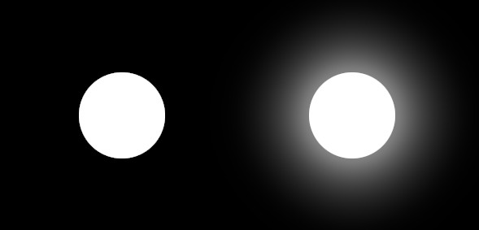
</p>

左右の白丸はどちらも同じ明るさです。ただし、右側の白丸は、周囲に光がにじみ出るようなぼかし処理を追加しています。右のぼかし処理を追加したほうは、なんとなくまぶしいような気がしませんか？

右がまぶしく感じるのは、「グレア錯視(さくし)」と呼ばれる錯覚のためです。人間の目は、グラデーションに囲まれた領域を見ると、グラデーションがない場合に較べて約40%明るいと感じることが分かっています。

>グレア錯視に関する論文<br>
>`https://www.eiiris.tut.ac.jp/koida/topic16-02-12glare/index.html`

また、目に見える強い光が「光のもや」をともなうことも事実です。そこで、ポストプロセスによって「光のもや」の見た目を再現することで、光の強さ、まぶしさを再現する方法が考案されました。

「光のもや」は「ブルーム」や「グレア」と呼ばれます。そのため、「光のもや」を再現するエフェクトのことを、「ブルームエフェクト」または「グレアエフェクト」と呼びます。

### 2.2 ブルームエフェクトの実行手順

ブルームエフェクトは以下の手順で作成します。

>1. 輝度が高いピクセルだけをFBOに抽出(ちゅうしゅつ)する。
>2. 抽出したピクセルをぼかす。
>3. ぼかしたFBOを元のFBOに加算合成する。

現実の光の散乱は、どんなに弱い光でも発生します。しかし、ブルームエフェクトでは物理的な根拠がない計算方法を使います。そのため、どこかで線引きをしないと逆に不自然な見た目になってしまいます。

そこで、一定の輝度以上のピクセルだけを抽出します。

一般的に、ぼかし処理には「ガウシアン・フィルタ」を使います。単純にガウシアンフィルタを実行すると非常に時間がかかるため、見た目がほぼ等しい「川瀬式ブルームフィルタ」や「川瀬式MGF」、またはこれらの改良版が使われます。

>「フィルタ」はカメラや画像処理などで使われる用語で、「画像に特殊効果をかける装置や機能」のことです。MGFは「マルチプル・ガウシアン・フィルタ」の略称です。ガウシアンフィルタを複数回実行することから

今回は、川瀬式MGFを改良した`Call of Duty: Advanced Warfare`の実装を参考に、プログラムを作成することにしました。

川瀬式MGFでは、画像をぼかしながら縦横1/2サイズ縮小し、再びぼかしながら縦横2倍に拡大、合成することで、効率よく広範囲のぼかし処理を行います。

>元画像の縦横の長さを1/2(または1/4)に縮小したフレームバッファのことを「縮小バッファ」といいます。

画像を縮小することで、処理するピクセル数が同じでも広い範囲をぼかすことができます。縮小によって細部は潰れてしまいますが、「ぼかし処理」の目的は「細部をつぶして平均化する」ことなので、むしろ好都合です。

<p align="center">
<br>
縮小バッファを使ったブルーム生成
</p>

アドバンスドウォーフェアにおける「川瀬式MGF」の改良点は、縮小と拡大でぼかす範囲を変えていることです。それにならい、今回は縮小ぼかしを8x8ピクセル、拡大ぼかしを3x3ピクセルで行うことにします。

>**【ブルームエフェクトのバリエーション】**<br>
>ブルームエフェクトの基本的な実現方法はぼかしシェーダを使うことです。ただ、その詳細についてはさまざまなバリエーションがあり、今回作成する方法はそのひとつに過ぎません。実現方法については多くの優れた記事が公開されています。例としていくつかのURLを挙げておきます。<br>
>`https://www.froyok.fr/blog/2021-12-ue4-custom-bloom/`<br>
>`https://rastergrid.com/blog/2010/09/efficient-gaussian-blur-with-linear-sampling/`
>
>また、最近のゲームエンジンでは、高輝度抽出を行わないブルームエフェクトが使われています。意図的にブルームを出すような制御は難しくなりますが、物理ベースレンダリングとの相性がよく、見た目の違和感が少なくなるようです。

### 2.3 ブルーム用頂点シェーダを追加する

それでは、ブルームエフェクトを実装しましょう。まず高輝度ピクセルを抽出するシェーダを追加します。プロジェクトの`Res`フォルダに、`simple_2D.vert`というテキストファイルを追加してください。

追加したファイルを開き、次のプログラムを追加してください。

```diff
+/**
+* @file simple_2D.vert
+*/
+#version 450
+
+// シェーダへの入力
+layout(location=0) in vec3 inPosition;
+layout(location=1) in vec2 inTexcoord;
+
+// シェーダからの出力
+layout(location=0) out vec3 outPosition;
+layout(location=1) out vec2 outTexcoord;
+
+// プログラムからの入力
+layout(location=0) uniform mat4 matModel;
+layout(location=1) uniform mat4 matVewProjection;
+
+/**
+* エントリーポイント
+*/
+void main()
+{
+  outTexcoord = inTexcoord;
+  outPosition = vec3(matModel * vec4(inPosition, 1));
+  gl_Position = matVewProjection * vec4(outPosition, 1); 
+}
```

`simple_2D.vert`(シンプル・ツーディ・バート)は、頂点座標の変換とテクスチャ座標の転送だけを行う、名前のとおり単純な頂点シェーダです。これは、この後作成する3つのフラグメントシェーダ全てで使う頂点シェーダになります。

>このシェーダでは汎用性を優先して、モデル行列とビュープロジェクション行列を分けました。しかし、処理速度を優先するなら、モデル行列とビュープロジェクション行列を乗算し、ひとつのユニフォーム変数とする方法もあります。

### 2.4 高輝度ピクセル抽出シェーダを追加する

次に、「高輝度」と判断したピクセルを抽出するフラグメントシェーダを作成します。また、このシェーダの描画先は縮小バッファになります。そのため、最初の縮小処理も行います。

プロジェクトの`Res`フォルダに`high_pass_filter.frag`(ハイパス・フィルタ・フラグ)という名前のテキストファイルを追加してください。追加したファイルを開き、次のプログラムを追加してください。

```diff
+/**
+* @file high_pass_filter.frag
+*/
+#version 450
+
+// シェーダへの入力
+layout(location=1) in vec2 inTexcoord;
+
+// テクスチャ
+layout(binding=0) uniform sampler2D texColor;
+
+// プログラムからの入力
+// x: 高輝度とみなす明るさ(しきい値)
+// y: ブルームの強さ
+layout(location=100) uniform vec2 bloomParam;
+
+// 出力する色データ
+out vec4 outColor;
+
+/**
+* エントリーポイント
+*/
+void main()
+{
+}
```

`bloomParam`(ブルーム・パラム)はブルームエフェクト用のパラメータです。

続いて、高輝度ピクセルの判定を行い、そのピクセルの色成分を取り出す関数を定義します。`outColor`変数の定義の下に、次のプログラムを追加してください。

```diff
 // 出力する色データ
 out vec4 outColor;
+
+/**
+* 高輝度ピクセルの色成分を取得する
+*/
+vec3 GetBrightnessPart(vec3 color)
+{
+  // RGBのうち、もっとも明るい要素の値をピクセルの輝度とする
+  float brightness = max(color.r, max(color.g, color.b));
+
+  // 高輝度成分の比率を計算
+  float threshold = bloomParam.x;
+  float ratio = max(brightness - threshold, 0) / max(brightness, 0.00001);
+
+  // 高輝度成分を計算
+  return color * ratio;
+}

 /**
 * エントリーポイント
```

ピクセルの輝度の計算は、大きく2つの方法に分けられます。

| 方法 | 利点 | 欠点 |
|:--|:--|:--|
| 人間が感じる明るさを輝度とする | 人間の感覚に合っている | 色によって輝度が異なるため<br>アーティストが制御しにくい |
| RGBのうち最大の要素を輝度とする | 色によらず一定の輝度が得られるため<br>アーティストが制御しやすい | 人間の感覚と一致しない |

今回は「RGBのうち最大の要素を輝度とする」方法を選びました。理由は、著者が以前関わったタイトルで「人間が感じる輝度」を採用したとき、アーティストから「青い炎にブルームがかりにくい」という苦情を受けたためです。

輝度は英語で`brightness`(ブライトネス)なので、変数名も`brightness`にしています。

>Unreal Engineなどのメジャーなゲームエンジンは「人間が感じる輝度」を採用する傾向にあります。ただ、中小のゲームエンジンでは「RGBのうち最大の要素」を使っている例も多いです。結局、どちらを使うかは開発者の好みの問題です。

次に、求めた輝度を使って高輝度成分の比率を計算します。`threshold`(スレッショルド)は「閾値(しきいち、いきち)」という意味で、「その値を境に、意味や条件、動作などが変わる値」のことです。`ratio`(レシオ)は「比率、割合」という意味です。

輝度がしきい値以下であれば0、しきい値より大きければ0より大きい値が、`ratio`変数に代入されます。除算の左辺にある`max`は減算結果が0未満にならないようにするため、右辺の`max`は0除算エラーを回避するために入れています。

このような判定は`if`文でも可能です。しかし、GPUでは条件分岐にかかるコストがCPUに較べて大きくなります。そのため、単純な条件分岐はできるだけ避けるべきです。

>**【分岐命令はシェーダコンパイラによって最適化される(かもしれない)】**<br>
>実際には、単純な`if`文はシェーダコンパイラによって最適化され、手作業で`if`文を取り除いたのと同じコードが生成されることも多いです。ただし、全てのシェーダコンパイラが十分な最適化能力を持っているとは限りません。特に、モバイルGPU用のシェーダコンパイラは最適化能力が低いことが多く、あまり当てになりません。

続いて、高輝度成分を縮小するプログラムを追加します。`main`関数に次のプログラムを追加してください（コピペを活用すること！)。

```diff
 */
 void main()
 {
+  // テクセルサイズを計算
+  vec2 oneTexel = 1 / vec2(textureSize(texColor, 0));
+
+  // 明るい成分を計算し、4x4ピクセルの縮小ぼかし処理を行う
+  outColor.rgb = GetBrightnessPart(texture(texColor, inTexcoord).rgb) * 4;
+  outColor.rgb += GetBrightnessPart(
+    texture(texColor, inTexcoord + vec2(-oneTexel.x, oneTexel.y)).rgb);
+  outColor.rgb += GetBrightnessPart(
+    texture(texColor, inTexcoord + vec2( oneTexel.x, oneTexel.y)).rgb);
+  outColor.rgb += GetBrightnessPart(
+    texture(texColor, inTexcoord + vec2(-oneTexel.x,-oneTexel.y)).rgb);
+  outColor.rgb += GetBrightnessPart(
+    texture(texColor, inTexcoord + vec2( oneTexel.x,-oneTexel.y)).rgb);
+
+  // ブルームの強さを乗算
+  float strength = bloomParam.y;
+  outColor.rgb *= (1.0 / 8.0) * strength;
+  outColor.a = 1;
 }
```

`oneTexel`(ワン・テクセル)変数には「UV座標系における1テクセルのサイズ」が格納されます。`textureSize`(テクスチャ・サイズ)関数を使うと、テクスチャのサイズを取得できます。

`textureSize`は整数ベクトルを返すので、`vec2`コンストラクタで浮動小数点数ベクトルに変換しています。

この時点では画像サイズがまだ大きいので、8x8ピクセルではなく4x4ピクセルで縮小ぼかしを行っています。これは以下のように5点をサンプリングすることで、4x4ピクセルを読み込みます。中央の4ピクセルを重複して読み取ることで中央の影響力が強くなるため、なめらかにぼかすことができます。

<p align="center">
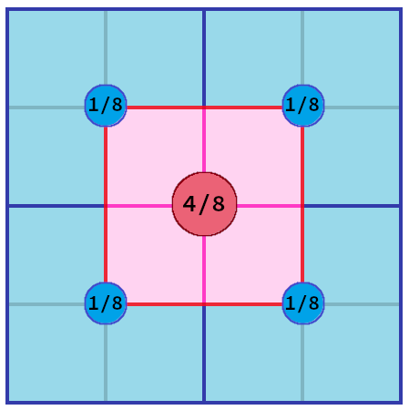<br>
4x4ピクセルぼかしのサンプリングポイント
</p>

テクスチャのフィルタモードを`GL_LINEAR`に設定すると、バイリニアフィルタが有効になります。この状態で`texture`関数を実行すると、指定したテクスチャ座標の周囲4テクセルを読み取り、テクスチャ座標からの距離によって重み付けをした平均値が返されます。

バイリニアフィルタは、1回の`texture`関数で最大4テクセルを読み込むことができる機能なわけです。この機能のおかけで、わずか4回の`texture`関数呼び出しで16テクセル読み出すことができます。

次に、平均化のための値`1/8`と「ブルームの強さ」を乗算します。平均化しないと明るさが8倍になってしまいます。

>**【除算は可能な限り避ける】**<br>
>`(1.0 / 8.0)`は定数式なので、実行時ではなくコンパイル時に計算されます。もし素直に`strength / 8.0`としてしまうと、実行時に除算が行われる可能性があるので注意してください。もっとも、8は2のべき乗数なので、コンパイラの最適化によって乗算に変換される可能性も高いです。しかし、シェーダコンパイラはC++コンパイラほど高性能ではないので、あまり当てにしないほうがよいでしょう。

アルファ値は使わないので`1`を設定しておきます。

### 2.5 縮小シェーダを追加する

続いて縮小シェーダを作成します。プロジェクトの`Res`フォルダに`down_sampling.frag`(ダウン・サンプリング・フラグ)という名前のテキストファイルを追加してください。追加したファイルを開き、次のプログラムを追加してください。

```diff
+/**
+* @file down_sampling.frag
+*/
+#version 450
+
+// シェーダへの入力
+layout(location=1) in vec2 inTexcoord;
+
+// テクスチャ
+layout(binding=0) uniform sampler2D texColor;
+
+// 出力する色データ
+out vec4 outColor;
+
+/**
+* エントリーポイント
+*/
+void main()
+{
+  // サンプリングポイントと重みの配列
+  const float offsets[] = { -2.75, -0.92, 0.92, 2.75 };
+  const float weights[] = { 0.1087, 0.3913, 0.3913, 0.1087 };
+
+  // テクセルサイズを計算
+  vec2 oneTexel = 1 / vec2(textureSize(texColor, 0));
+
+  // 8x8ピクセルのぼかし処理を行う
+  outColor = vec4(0);
+  for (int y = 0; y < 4; ++y) {
+    float ty = inTexcoord.y + offsets[y] * oneTexel.y;
+    for (int x = 0; x < 4; ++x) {
+      float tx = inTexcoord.x + offsets[x] * oneTexel.x;
+      outColor += texture(texColor, vec2(tx, ty)) * weights[x] * weights[y];
+    }
+  }
+}
```

<p align="center">
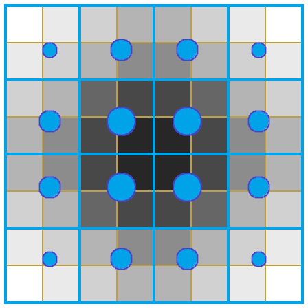<br>
8x8ピクセルぼかしのサンプリングポイント
</p>

縮小シェーダでは`for`文を使って8x8ピクセルの範囲を読み取り、加算合成します。明るさの合計が1になるように、加算する前に`weights`(ウェイツ)を乗算しています。

中央に近いテクセルほど重みが大きくなるように、`offsets`(オフセッツ)のテクスチャ座標を2x2の中心からわずかにずらしています。

>サンプリングポイントと重みの値については、以下のBlogを参考にしています。<br>
>`https://www.rastergrid.com/blog/2010/09/efficient-gaussian-blur-with-linear-sampling/`

### 2.6 拡大シェーダを追加する

最後に追加するのは拡大シェーダです。プロジェクトの`Res`フォルダに`up_sampling.frag`(アップ・サンプリング・フラグ)という名前のテキストファイルを追加してください。追加したファイルを開き、次のプログラムを追加してください。

```diff
+/**
+* @file up_sampling.frag
+*/
+#version 450
+
+// シェーダへの入力
+layout(location=1) in vec2 inTexcoord;
+
+// テクスチャ
+layout(binding=0) uniform sampler2D texColor;
+
+// 出力する色データ
+out vec4 outColor;
+
+/**
+* エントリーポイント
+*/
+void main()
+{
+  // テクセルサイズを計算
+  vec2 halfTexel = 0.5 / vec2(textureSize(texColor, 0));
+
+  // 3x3ピクセルのぼかし処理を行う
+  outColor  = texture(texColor, inTexcoord + vec2(-halfTexel.x, halfTexel.y));
+  outColor += texture(texColor, inTexcoord + vec2( halfTexel.x, halfTexel.y));
+  outColor += texture(texColor, inTexcoord + vec2( halfTexel.x,-halfTexel.y));
+  outColor += texture(texColor, inTexcoord + vec2(-halfTexel.x,-halfTexel.y));
+  outColor *= 1.0 / 4.0; // 平均化
+}
```

拡大ぼかし処理では、基準となるサイズを0.5テクセルとしています。これは、次の図のようにテクセルの四隅をサンプリングポイントとするためです。

<p align="center">
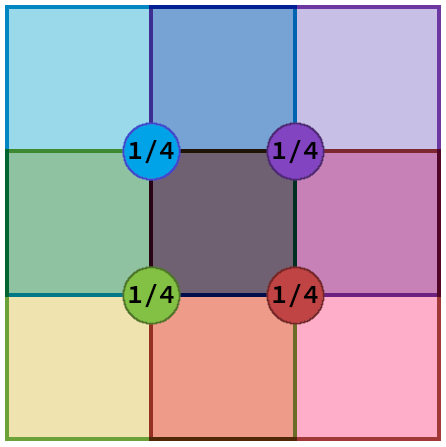<br>
3x3ピクセルぼかしのサンプリングポイント
</p>

2x2テクセルの一部を重複させることで、中央のピクセルは4倍、上下左右は2倍、ななめ方向は1倍の重みで合成しています。

これでブルームエフェクト用のシェーダは完成です。

### 2.7 ゲームエンジンにブルーム用のメンバ変数を追加する

それでは、FBOとシェーダをゲームエンジンに追加しましょう。`Engine.h`を開き、`Engine`クラスの定義に次のプログラムを追加してください。

```diff
   // エフェクト用の変数
   ProgramPipelinePtr progGaussianBlur;
   float blurStrength = 1; // ぼかしの強さ(0.0～1.0)
+
+  ProgramPipelinePtr progHighPassFilter;
+  ProgramPipelinePtr progDownSampling;
+  ProgramPipelinePtr progUpSampling;
+  FramebufferObjectPtr fboBloom[6];
+  float bloomThreshold = 1; // 高輝度とみなす明るさ(0.0～上限なし)
+  float bloomStrength = 8; // ブルームの強さ

   ScenePtr scene; // 実行中のシーン
   ScenePtr nextScene; // 次のシーン
```

>`fboBloom`配列の要素数を変えると、「光のもやの広がり具合」が変化します。減らすともやが弱くなり、増やすと強くなります。

### 2.8 ブルーム用のシェーダを初期化する

追加したメンバ変数を初期化します。まずシェーダを読み込みましょう。`Engine.cpp`を開き、`Initialize`メンバ関数の定義に次のプログラムを追加してください。

```diff
   // ぼかしシェーダを読み込む
   progGaussianBlur = ProgramPipeline::Create(
     "Res/standard_2D.vert", "Res/gaussian_blur.frag");
+
+  // ブルーム用シェーダを読み込む
+  progHighPassFilter = ProgramPipeline::Create(
+    "Res/simple_2D.vert", "Res/high_pass_filter.frag");
+  progDownSampling = ProgramPipeline::Create(
+    "Res/simple_2D.vert", "Res/down_sampling.frag");
+  progUpSampling = ProgramPipeline::Create(
+    "Res/simple_2D.vert", "Res/up_sampling.frag");

   // 頂点データをGPUメモリにコピー
   struct Vertex {
```

次に、シェーダにモデル行列とビュープロジェクション行列を設定します。シェーダを読み込むプログラムの下に、次のプログラムを追加してください。

```diff
     "Res/simple_2D.vert", "Res/down_sampling.frag");
   progUpSampling = ProgramPipeline::Create(
     "Res/simple_2D.vert", "Res/up_sampling.frag");
+
+  // 座標変換行列をユニフォーム変数にコピー
+  // 使用する頂点座標が-0.5～0.5のサイズなので2倍する。
+  // スプライトとFBOのテクスチャ座標は逆なのでY軸をマイナスにする。
+  const mat4 matBloomM = {
+    vec4(2, 0, 0, 0),
+    vec4(0,-2, 0, 0),
+    vec4(0, 0, 2, 0),
+    vec4(0, 0, 0, 1),
+  };
+  const mat4 matBloomVP = mat4(1);
+  const GLuint bloomProgramIdList[] = {
+    *progHighPassFilter, *progDownSampling, *progUpSampling };
+  for (auto prog : bloomProgramIdList) {
+    glProgramUniformMatrix4fv(prog, 0, 1, GL_FALSE, &matBloomM[0][0]);
+    glProgramUniformMatrix4fv(prog, 1, 1, GL_FALSE, &matBloomVP[0][0]);
+  }

   // 頂点データをGPUメモリにコピー
   struct Vertex {
```

ブルームエフェクトではゲーム画面全体を覆う四角形を描画する必要があります。そこで、スプライト用の頂点データを流用することにします。

スプライト用の頂点データのサイズは-0.5～+0.5なので、クリップ座標系のサイズ-1～+1に合わせるにはXYZを2倍に拡大する必要があります。また、FBOとスプライトでは画像の上下が逆なので、Y軸をマイナスにして上下反転させます。

これらのパラメータはモデル行列として定義します。これは、上記のプログラムでは`matBloomM`(マット・ブルーム・エム)変数に当たります。名前の末尾の`M`は`Model`の頭文字です。

また、ブルームエフェクトではプロジェクション行列を使わないので単位行列を設定します。上記のプログラムでは`matBloomVP`(マット・ブルーム・ブイピー)変数に当たります。名前の末尾の`VP`は`View`と`Projection`の頭文字です。

>このプログラムのように、プログラム実行中に変更されないと分かっているユニフォーム変数は、シェーダの読み込みと同時に設定しておくと便利です。

### 2.9 ブルーム用のFBOを初期化する

続いて、ブルームエフェクト用のFBOを初期化します。ユニフォーム変数を設定するプログラムの下に、次のプログラムを追加してください。

```diff
     glProgramUniformMatrix4fv(prog, 0, 1, GL_FALSE, &matBloomM[0][0]);
     glProgramUniformMatrix4fv(prog, 1, 1, GL_FALSE, &matBloomVP[0][0]);
   }
+
+  // メイン画面のブルームエフェクト用FBOを作成
+  int bloomX = static_cast<int>(viewSize.x);
+  int bloomY = static_cast<int>(viewSize.y);
+  for (auto& e : fboBloom) {
+    bloomX /= 2;
+    bloomY /= 2;
+    e = FramebufferObject::Create(bloomX, bloomY, FboType::color);
+  }

   // 頂点データをGPUメモリにコピー
   struct Vertex {
```

ブルームエフェクト用のFBOは、縦横のサイズを1/2に小さくしながら作成します。そのため、`fboBloom[0]`が最も大きなサイズで、インデックスが小さくなるに連れてFBOのサイズも小さくなっていきます。

ブルームエフェクトでは深度バッファは不要なので、FBOタイプには`color`(カラー)を指定します。

### 2.10 Textureクラスにサイズ取得機能を追加する

FBOを変更するときは、それに合わせてビューポートの範囲も設定しなくてはなりません。そのために、FBOのテクスチャサイズを取得する必要があります。

テクスチャのサイズは`glGetTextureLevelParameteriv`関数を使うことで取得できます。しかし、毎回この長い名前の関数を使うのは面倒ですし、ぱッと見て何をしているのかを理解するのに時間がかかります。

そこで、`Texture`クラスに「サイズを取得するメンバ関数」を追加することにします。`Texture.h`を開き、`Texture`クラスの定義に次のプログラムを追加してください。

```diff
   // 管理番号を取得
   operator GLuint() const { return tex; }
+
+  // 幅と高さを取得
+  GLint GetWidth() const { return width; }
+  GLint GetHeight() const { return height; }

 private:
   std::string filename;
   GLuint tex = 0;
+  GLint width = 0;  // 幅
+  GLint height = 0; // 高さ
 };

 #endif // TEXTURE_H_INCLUDED
```

テクスチャの幅を取得するメンバ関数は`GetWidth`(ゲット・ウィス)、高さを取得するメンバ関数は`GetHeight`(ゲット・ハイト)という名前にしました。`width`(ウィス)は「幅」、`height`(ハイト)は「高さ」という意味です。

次に、`width`と`height`を初期化するプログラムを追加します。`Texture.cpp`を開き、ファイル名からテクスチャを作成するコンストラクタの末尾に、次のプログラムを追加してください。

```diff
   // 拡大縮小フィルタを設定
   glTextureParameteri(tex, GL_TEXTURE_MAG_FILTER, filterMode);
   glTextureParameteri(tex, GL_TEXTURE_MIN_FILTER, filterMode);
+
+  // サイズを設定
+  this->width = width;
+  this->height = height;
 }

 /**
 * コンストラクタ
```

続いて、空のテクスチャを作成するコンストラクタの末尾に、次のプログラムを追加してください。

```diff
   // 拡大縮小フィルタを設定
   glTextureParameteri(tex, GL_TEXTURE_MAG_FILTER, filterMode);
   glTextureParameteri(tex, GL_TEXTURE_MIN_FILTER, filterMode);
+
+  // サイズを設定
+  this->width = width;
+  this->height = height;
 }

 /**
 * デストラクタ
```

これで、`glGetTextureLevelParamteriv`関数を使わなくても、素早く簡単にテクスチャのサイズを取得することができます。

### 2.11 ブルームエフェクト用の関数を定義する

それでは、ブルームエフェクトを描画する関数を定義しましょう。`Engine.h`を開き、`Engine`クラスの定義に次のプログラムを追加してください。

```diff
   VecMath::mat4 CreateDepthMap(GameObjectList& gameObjectList,
     const VecMath::vec3& eye, const VecMath::vec3& target,
     float range, float zNear, float zFar);
+  void DrawBloomEffect();

   GLFWwindow* window = nullptr; // ウィンドウオブジェクト
   const std::string title = "OpenGLGame"; // ウィンドウタイトル
```

続いて`Engine.cpp`を開き、`CreateDepthMap`メンバ関数の定義の下に、次のプログラムを追加してください。

```diff
   }
 
   return matShadow;
 }
+
+/**
+* ブルームを描画
+*/
+void Engine::DrawBloomEffect()
+{
+  // ブルームエフェクト用にGLコンテキストを設定
+  glDisable(GL_DEPTH_TEST);
+  glDisable(GL_CULL_FACE);
+
+  // 1. ゲーム画面用FBOから高輝度成分を抽出
+
+  // 2. 縮小ぼかしを行い、1段小さいFBOにコピー
+
+  // 3. 拡大ぼかしを行い、1段大きいFBOに加算合成
+
+  // 4. 最後の拡大ぼかしを行い、ゲーム画面用FBOに加算合成
+}
```

スプライトやUI描画と同様に、ポストエフェクトの描画でも深度バッファや裏面カリングは使いません。処理速度を少しでも高めるために、使わない機能は無効化しています。

コメント文に書いてあるように、ブルームの描画は4段階の処理に分けられます。ひとつひとつ実装していきましょう。GLコンテキストを設定するプログラムの下に、次の「高輝度成分を抽出」するプログラムを追加してください。

```diff
   glDisable(GL_BLEND);
  
   // 1. ゲーム画面用FBOから高輝度成分を抽出
+  glUseProgram(*progHighPassFilter);
+  glDisable(GL_BLEND); // 合成なし
+  {
+    // 高輝度成分はFBOの枚数だけ加算されるので、その影響を打ち消すために枚数で割る
+    const float strength = bloomStrength / static_cast<float>(std::size(fboBloom));
+    glProgramUniform2f(*progHighPassFilter, 100, bloomThreshold, strength);
+
+    const Texture& texFbo = *fboBloom[0]->GetColorTexture();
+    glViewport(0, 0, texFbo.GetWidth(), texFbo.GetHeight());
+    glBindFramebuffer(GL_FRAMEBUFFER, *fboBloom[0]);
+    glBindTextureUnit(0, *fboGameWindow->GetColorTexture());
+    glDrawElements(GL_TRIANGLES, 6, GL_UNSIGNED_SHORT, 0);
+  }

   // 2. 縮小ぼかしを行い、1段小さいFBOにコピー
```

高輝度成分を抽出するプログラムでは半透明合成を行わないので、`GL_BLEND`を無効にしています。それから、ロケーション番号100に、`bloomStrength`(ブルーム・ストレングス)変数に格納されているブルームの強さをコピーします。

このとき、ブルームの強さを「FBOの枚数」で除算します。ブルームエフェクトでは画像をぼかしたあと、それらをすべて加算合成します。このため、画像の明るさはFBOの枚数分だけ増加します(FBOが6枚なら明るさも6倍になる)。

しかし、これは計算の都合であって、実際に画面に反映するときは1倍の明るさになっていなくてはなりません。そこで、加算合計の結果が1倍になるように、ブルームの強さをFBOの枚数で除算しておきます。

その後、ビューポート、描画先フレームバッファ、使用するテクスチャを指定します。インスタンス描画は使わないので、`glDrawElementsInstanced`ではなく`glDrawElements`で四角形を描画します。この描画部分は、以降の2～4でもまったく同じ書き方になります。

次に、「縮小ぼかし」を行うプログラムを追加します。高輝度成分を抽出するプログラムの下に、次のプログラムを追加してください。

```diff
     glDrawElements(GL_TRIANGLES, 6, GL_UNSIGNED_SHORT, 0);
   }

   // 2. 縮小ぼかしを行い、1段小さいFBOにコピー
+  glUseProgram(*progDownSampling);
+  for (size_t i = 1; i < std::size(fboBloom); ++i) {
+    const Texture& texFbo = *fboBloom[i]->GetColorTexture();
+    glViewport(0, 0, texFbo.GetWidth(), texFbo.GetHeight());
+    glBindFramebuffer(GL_FRAMEBUFFER, *fboBloom[i]);
+    glBindTextureUnit(0, *fboBloom[i - 1]->GetColorTexture());
+    glDrawElements(GL_TRIANGLES, 6, GL_UNSIGNED_SHORT, 0);
+  }

   // 3. 拡大ぼかしを行い、1段大きいFBOに加算合成
```

縮小ぼかし処理では、`fboBloom[0]`から`fboBloom[5]`まで、画像をぼかしながら縮小していきます。これは「FBOの枚数-1」回行う必要があるため、`for`を使ってループさせています。

描画部分は「高輝度成分の抽出」と同じで、設定するパラメータが違うだけです。

続いて、「拡大ぼかし」を行うプログラムを追加します。縮小ぼかしを行うプログラムの下に、次のプログラムを追加してください。

```diff
     glDrawElements(GL_TRIANGLES, 6, GL_UNSIGNED_SHORT, 0);
   }

   // 3. 拡大ぼかしを行い、1段大きいFBOに加算合成
+  glUseProgram(*progUpSampling);
+  glEnable(GL_BLEND);
+  glBlendFunc(GL_ONE, GL_ONE); // 加算合成
+  for (size_t i = std::size(fboBloom) - 1; i > 0; ) {
+    --i;
+    const Texture& texFbo = *fboBloom[i]->GetColorTexture();
+    glViewport(0, 0, texFbo.GetWidth(), texFbo.GetHeight());
+    glBindFramebuffer(GL_FRAMEBUFFER, *fboBloom[i]);
+    glBindTextureUnit(0, *fboBloom[i + 1]->GetColorTexture());
+    glDrawElements(GL_TRIANGLES, 6, GL_UNSIGNED_SHORT, 0);
+  }

   // 4. 最後の拡大ぼかしを行い、ゲーム画面用FBOに加算合成
```

拡大ぼかしではテクスチャをFBOに加算合成します。加算合成を行うには、`glBlendFunc`関数のパラメータを両方とも`GL_ONE`に設定します。さて、色のブレンドは以下の式で行われるのでした。

>`結果の色 = シェーダ出力 * 引数1 + FBO * 引数2`

`GL_ONE`(ジーエル・ワン)は読んで字のごとく数値の`1`を意味します。そのため、`glBlendFunc(GL_ONE, GL_ONE)`を指定した場合のブレンド式は次のようになります。加算合成になっていることが分かると思います。

>`結果の色 = シェーダ出力 * 1.0 + FBO * 1.0 = シェーダ出力 + FBO`

このように、`GL_ONE`を指定することで「加算合成」が実現できるわけです。

さて、拡大ぼかし処理では、画像をぼかしながら1段大きいFBOに拡大合成します。小さいFBOから大きいFBOにコピーしていくので、`for`文のカウンタ変数`i`は`FBOの枚数 - 1`から`0`に向かって小さくなるように設計しています。

>`--i`をループ内で行っているのは、`size_t`型は負数にできないためです。

最後に、ゲーム画面用FBOに結果を加算合成します。拡大ぼかしを行うプログラムの下に、次のプログラムを追加してください。

```diff
     glDrawElements(GL_TRIANGLES, 6, GL_UNSIGNED_SHORT, 0);
   }

   // 4. 最後の拡大ぼかしを行い、ゲーム画面用FBOに加算合成
+  {
+    const Texture& texFbo = *fboGameWindow->GetColorTexture();
+    glViewport(0, 0, texFbo.GetWidth(), texFbo.GetHeight());
+    glBindFramebuffer(GL_FRAMEBUFFER, *fboGameWindow);
+    glBindTextureUnit(0, *fboBloom[0]->GetColorTexture());
+    glDrawElements(GL_TRIANGLES, 6, GL_UNSIGNED_SHORT, 0);
+  }
 }
```

合成先が`fboBloom`ではなく`fboGameWindow`であることを除いて、プログラム自体は直前の拡大ぼかしと同じです。

これで、ブルームエフェクトの描画関数は完成です。

### 2.12 ブルーム描画関数を組み込む

完成した`DrawBloomEffect`関数を描画処理に組み込みます。`MainLoop`メンバ関数にあるスプライト描画処理の下に、次のプログラムを追加してください。

```diff
     glDisable(GL_DEPTH_TEST); // 深度テストを無効化
     glDisable(GL_CULL_FACE);  // 裏面カリングを無効化
     DrawSpriteList(*drawList[1], *tex[1], spriteSsboOffset);
+
+    // ブルームを描画
+    DrawBloomEffect();

     // デフォルトフレームバッファに戻す
     glBindFramebuffer(GL_FRAMEBUFFER, 0);
     glViewport(0, 0, 1280, 720);
+    glEnable(GL_BLEND);
+    glBlendFunc(GL_SRC_ALPHA, GL_ONE_MINUS_SRC_ALPHA);

     // ゲームウィンドウを描画
     glUseProgram(*progSprite);
```

`DrawBloomEffect`メンバ関数は、内部でGLコンテキストのブレンド設定を変更しています。そのため、次に行うデフォルトフレームバッファへの描画が正しく行われません。

そこで、デフォルトフレームバッファに戻すときに、以降の描画で使うブレンド設定を行う処理を追加しています。

### 2.13 FBOのピクセル形式を変更する

ブルームエフェクトは、ある程度以上の明るさのピクセルがなくては効果を発揮できません。そこで、ライトの明るさを強くします。`DrawStaticMesh`メンバ関数にある平行光源の定義を、次のように変更してください。

```diff
   };
   DirectionalLight directionalLight = {
     vec3(1, 0.9f, 0.8f),
-    4,
+    12,
     vec3(0.57735f, -0.57735f, -0.57735f)
   };
```

プログラムが書けたらビルドして実行してください。3Dモデルが全体的に明るく表示されていたら成功です。

<p align="center">
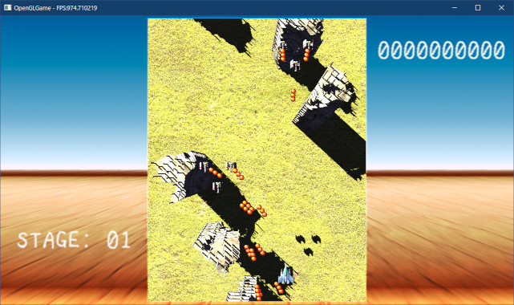
</p>

しかし、ブルームエフェクトの特徴である「光のもや(」のようなものは、どこにも見当たりません。これは、FBOのピクセル形式が`GL_RGBA8`になっているからです。

`GL_RGBA8`で表現可能な明るさの範囲は0.0～1.0しかありません。つまり、1.0を超える明るさを表現できないのです。そこで、FBOのピクセル形式を`GL_RGBA16F`に変更します。

`GL_RGBA16F`(ジーエル・アールジービーエー・じゅうろく・エフ)は、各色を「半精度浮動小数点数(はんせいど・ふどうしょうすうてんすう)」で表わすピクセル形式です。

半精度浮動小数点数があらわせる範囲は-65504.0～+65504.0で、`GL_RGBA8`とは比べものにならないほど強い明るさを表現できます。

それでは、`FramebufferObject.cpp`を開き、コンストラクタの中にある「カラーテクスチャを作成」するプログラムを、次のように変更してください。

```diff
 {
   // カラーテクスチャを作成
   if (type & FboType::color) {
-    texColor = Texture::Create("FBO(Color)", width, height, GL_RGBA8, GL_LINEAR);
+    texColor = Texture::Create("FBO(Color)", width, height, GL_RGBA16F, GL_LINEAR);
     if (!texColor || !*texColor) {
       LOG_ERROR("FBO用カラーテクスチャの作成に失敗");
```

プログラムが書けたらビルドして実行してください。さらに画面が明るくなり、ビルの明るい部分に「光のもや」が現れていたら成功です。この「光のもや」のことを英語で「ブルーム」というので、ブルームエフェクトという名前が付いています。

<p align="center">
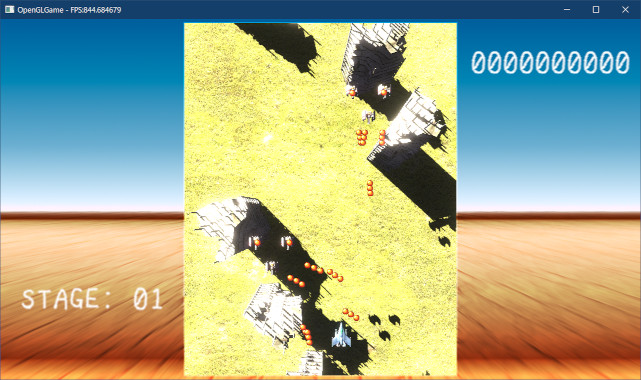
</p>

### 2.14 ブルームのしきい値と強さを調整する

ライトの明るさを調整する以外にも、ブルームエフェクトの「しきい値」と「強さ」を調整することでブルームを制御することもできます。

とりあえず、ライトの明るさをもとに戻しましょう。`Engine.cpp`を開き、`DrawStaticMesh`メンバ関数を次のように変更してください。

```diff
   };
   DirectionalLight directionalLight = {
     vec3(1, 0.9f, 0.8f),
-    12,
+    4,
     vec3(0.57735f, -0.57735f, -0.57735f)
   };
```

プログラムが書けたらビルドして実行してください。画面の明るさが元に戻り、ブルームエフェクトがなくなっていたら成功です。

次に、ゲームエンジンにブルームエフェクトを制御するメンバ関数を追加します。`Engine.h`を開き、メインカメラを取得するメンバ関数の定義の下に、次のプログラムを追加してください。

```diff
   GameObjectPtr GetMainCameraObject() const { return cameraObject; }
   std::shared_ptr<Camera> GetMainCamera() const {
     return std::static_pointer_cast<Camera>(cameraObject->componentList[0]); }
+
+  // ブルームのしきい値の取得・設定
+  float GetBloomThreshold() const { return bloomThreshold; }
+  void SetBloomThreshold(float t) { bloomThreshold = t; }
+
+  // ブルームの強さの取得・設定
+  float GetBloomStrength() const { return bloomStrength; }
+  void SetBloomStrength(float s) { bloomStrength = s; }

 private:
   int Initialize();
```

これで、ブルームエフェクトのパラメータを操作できるようになりました。

それでは、パラメータを設定しましょう。`MainGameScene.cpp`を開き、`Initialize`メンバ関数の定義に次のプログラムを追加してください。

```diff
   // アスペクト比を計算
   cameraComponent->aspect = viewSize.y / viewSize.x;
+
+  // ブルームパラメータを設定
+  engine.SetBloomThreshold(0.5f);
+  engine.SetBloomStrength(8);

   // 自機を追加
   player = engine.Create<GameObject>(
```

プログラムが書けたらビルドして実行してください。敵の弾や爆発にブルーム(光のもや)が発生していたら成功です。

<p align="center">
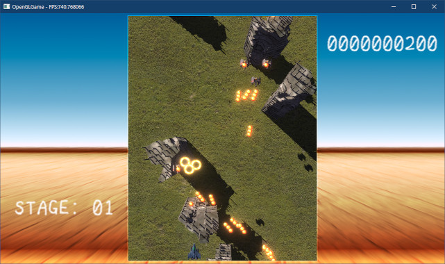
</p>

このようにパラメータを調整することで、ブルームの発生する範囲や強さを自由に調整することができます。

### 2.15 ラップモードによるブルームの見え方の違い

現在、「明るい部分(敵の弾や爆発)が画面の端に来ると、反対側の端にもブルームが出てしまう」という問題が発生しています。

<p align="center">
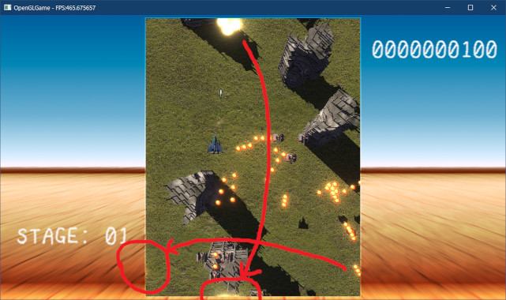<br>
明るい部分の反対側に不自然なブルームが出ている
</p>

この問題の原因は、テクスチャの「ラップモード」を適切に設定していないことです。ラップモードとは「テクスチャ座標に0未満、または1以上が指定された場合の挙動」のことです。

ラップモードには以下の値が指定できます。

| ラップモード | 挙動 |
|:-:|:--|
| GL_REPEAT<br>(ジーエル・リピート) | 画像が無限に繰り返される<br>(デフォルト値) |
| GL_CLAMP_TO_EDGE<br>(ジーエル・クランプ・トゥ・エッジ) | 端のピクセルの色 |
| GL_CLAMP_TO_BORDER<br>(ジーエル・クランプ・トゥ・ボーダー) | GL_TEXTURE_BORDER_COLORで指定された色 |
| GL_MIRRORED_REPEAT<br>(ジーエル・ミラード・リピート) | 画像が反転しながら無限に繰り返される |
| GL_MIRROR_CLAMP_TO_EDGE<br>(ジーエル・ミラー・クランプ・トゥ・エッジ) | -1～0=反転画像<br>-1未満または1より大きい座標=端のピクセルの色 |

<p align="center">
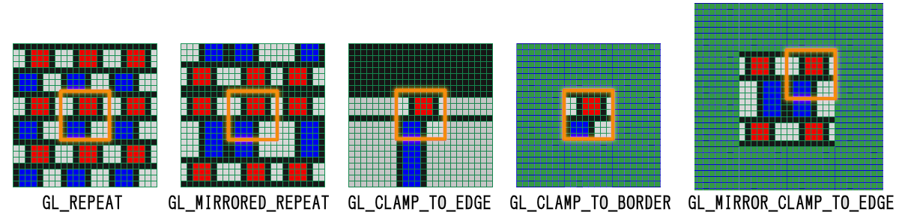
</p>

端付近のフラグメントをぼかすとき、画面外のテクセルを読み出そうとします。ラップモードがデフォルトの`GL_REPEAT`の場合、画面の反対側のピクセルが読み出されます。その結果、画面の反対側にもブルームが発生してしまうのです。

そこで、ラップモードを指定して画面外の色情報を補完します。とはいえ、FBOには画面外の色情報など存在しませんから、正解はありません。考えられる選択肢は以下の3つです。

* GL_CLAMP_TO_EDGE: 画面外にも同じ明るさが続いていると仮定する。画面端が明るくなりすぎることがある。
* GL_CLAMP_TO_BORDER: 画面外に色は存在しない(=黒)と仮定する。画面端が暗くなりすぎることがある。
* GL_MIRRORED_REPEAT: 画面外は鏡写しになった明るさが続いていると仮定する。

このうち、もっとも破綻が少ないのは`GL_CLAMP_TO_BORDER`ですが、それでも完璧ではありません。結局は好みで選択することになります。

また、以下のBLOGでは、縮小ぼかしと拡大ぼかしで異なるラップモードを使う手法を提案しています。

`https://www.froyok.fr/blog/2021-12-ue4-custom-bloom/`

<p align="center">
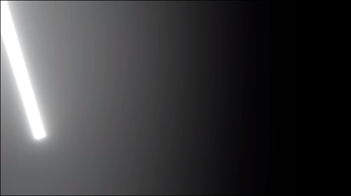

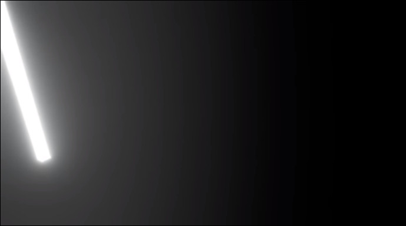<br>
左=GL_CLAMP_TO_EDGE 中=GL_CLAMP_TO_BORDER 右=2つの組み合わせ
</p>

上の画像は、高輝度ピクセルが画面端に接しているときの、ラップモードによるブルームの違いをあらわしています。

左の`GL_CLAMP_TO_EDGE`では、画面の上端と左端付近が必要以上に明るくなっています。中央の`GL_CLAMP_TO_BORDER`ではその逆で、上端と左端付近でブルームが消失していることが分かります。

対して、縮小ぼかしに`GL_CLAMP_TO_EDET`、拡大ぼかしに`GL_CLAMP_TO_BORDER`を設定した右の画像では、上端と左端付近でも、自然なブルームが発生しているようです。

なかなか面白い手法なので、今回はこのBLOGのやり方を真似してみようと思います。

### 2.16 Textureクラスにラップモードを設定する機能を追加する

まずは`Texture`クラスにラップモードを設定するメンバ関数を追加します。名前は`SetWrapMode`(セット・ラップ・モード)とします。`Texture.h`を開き、`Texture`クラスの定義に次のプログラムを追加してください。

```diff
   // サイズを取得
   GLint GetWidth() const { return width; }
   GLint GetHeight() const { return height; }
+
+  // ラップモードを設定
+  void SetWrapMode(GLenum wrapMode);

 private:
   std::string filename;
```

次に`Texture.cpp`を開き、デストラクタの定義の下に、次のプログラムを追加してください。

```diff
 {
   glDeleteTextures(1, &tex);
 }
+
+/**
+* ラップモードを設定
+*
+* @param wrapMode 設定するラップモード
+*/
+void Texture::SetWrapMode(GLenum wrapMode)
+{
+  glTextureParameteri(tex, GL_TEXTURE_WRAP_S, wrapMode);
+  glTextureParameteri(tex, GL_TEXTURE_WRAP_T, wrapMode);
+}
```

ラップモードを設定するには、拡大縮小フィルタの指定でも使用した`glTextureParameteri`関数を使います。

X軸方向のラップモードを指定するには`GL_TEXTURE_WRAP_S`(ジーエル・テクスチャ・ラップ・エス)、Y軸方向のラップモードを指定するには`GL_TEXTURE_WRAP_T`(ジーエル・テクスチャ・ラップ・ティー)を指定します。

このように、ラップモードはX軸方向とY軸方向で別々に指定できます。しかし、異なる値を指定するケースはめったにありません。そのため、`SetWrapMode`メンバ関数では両方に同じ値を設定することにしました。

### 2.17 ブルームの描画処理を関数にする

ブルームエフェクトでは、あるFBOのカラーテクスチャを別のFBOに描画する、という処理を何度も行います。ここにラップモードの指定を追加するわけですが、何箇所も追加するのは面倒です。

そこで、共通部分を「テクスチャをFBOに描画する関数」としてまとめることにします。関数名は`DrawTextureToFbo`(ドロー・テクスチャ・トゥ・エフビーオー)とします。

`Engine.cpp`を開き、`CreateDepthMap`メンバ関数の定義の下に次のプログラムを追加してください。

```diff
   return matShadow;
 }
+
+/**
+* カラーテクスチャをFBOに描画する
+*
+* @param fbo      描画先FBO
+* @param texture  FBOに描画するテクスチャ
+* @param wrapMode テクスチャに設定するラップモード
+*/
+void DrawTextureToFbo(FramebufferObject& fbo,
+  Texture& texture, GLenum wrapMode)
+{
+}

 /**
 * ブルームを描画
```

次に、`DrawBloomEffect`メンバ関数にある「1. ゲーム画面用FBOから高輝度成分を抽出」するプログラムに、次のプログラムを追加してください。

```diff
     // 高輝度成分はFBOの枚数だけ加算されるので、その影響を打ち消すために枚数で割る
     const float strength = bloomStrength / static_cast<float>(std::size(fboBloom));
     glProgramUniform2f(*progHighPassFilter, 100, bloomThreshold, strength);

+    DrawTextureToFbo(*fboBloom[0],
+      *fboGameWindow->GetColorTexture(), GL_CLAMP_TO_BORDER);
     const Texture& texFbo = *fboBloom[0]->GetColorTexture();
     glViewport(0, 0, texFbo.GetWidth(), texFbo.GetHeight());
```

縮小ぼかしでは`GL_CLAMP_TO_BORDER`を指定します。

ここで追加した関数は、その下のプログラムを置き換えるものです。追加したプログラムの下にある、以下の部分を`Ctrl+X`等で切り取り、

```diff
     glProgramUniform2f(*progHighPassFilter, 100, bloomThreshold, strength);

     DrawTextureToFbo(*fboBloom[0],
       *fboGameWindow->GetColorTexture(), GL_CLAMP_TO_BORDER);
-    const Texture& texFbo = *fboBloom[0]->GetColorTexture();
-    glViewport(0, 0, texFbo.GetWidth(), texFbo.GetHeight());
-    glBindFramebuffer(GL_FRAMEBUFFER, *fboBloom[0]);
-    glBindTextureUnit(0, *fboGameWindow->GetColorTexture());
-    glDrawElements(GL_TRIANGLES, 6, GL_UNSIGNED_SHORT, 0);
   }

   // 2. 縮小ぼかしを行い、1段小さいFBOにコピー
```

`DrawTextureToFbo`関数に`Ctrl+V`等で貼り付けてください。

```diff
 void DrawTextureToFbo(FramebufferObject& fbo,
   Texture& texture, GLenum wrapMode)
 {
+    const Texture& texFbo = *fboBloom[0]->GetColorTexture();
+    glViewport(0, 0, texFbo.GetWidth(), texFbo.GetHeight());
+    glBindFramebuffer(GL_FRAMEBUFFER, *fboBloom[0]);
+    glBindTextureUnit(0, *fboGameWindow->GetColorTexture());
+    glDrawElements(GL_TRIANGLES, 6, GL_UNSIGNED_SHORT, 0);
 }

 /**
```

<pre class="tnmai_assignment">
<strong>【課題01】</strong>
上記のプログラムの<code>fboBloom[0]</code>を<code>fbo</code>に、<code>fboGameWindow->GetColorTexture()</code>を<code>texture</code>に置き換えて、エラーを解決しなさい。
</pre>

エラーを解決したら、次のようにラップモードを設定するプログラムを追加してください。

```diff
   const Texture& texFbo = *fbo.GetColorTexture();
   glViewport(0, 0, texFbo.GetWidth(), texFbo.GetHeight());
   glBindFramebuffer(GL_FRAMEBUFFER, fbo);
+  texture.SetWrapMode(wrapMode);
   glBindTextureUnit(0, texture);
   glDrawElements(GL_TRIANGLES, 6, GL_UNSIGNED_SHORT, 0);
```

これで、指定したラップモードを使ってテクスチャを描画できるようになりました。それでは、残りのぼかし処理を`DrawTextureToFbo`関数で書き直しましょう。`DrawBloomEffect`メンバ関数を次のように変更してください。

```diff
   // 2. 縮小ぼかしを行い、1段小さいFBOにコピー
   glUseProgram(*progDownSampling);
   for (size_t i = 1; i < std::size(fboBloom); ++i) {
-    const Texture& texFbo = *fboBloom[i]->GetColorTexture();
-    glViewport(0, 0, texFbo.GetWidth(), texFbo.GetHeight());
-    glBindFramebuffer(GL_FRAMEBUFFER, *fboBloom[i]);
-    glBindTextureUnit(0, *fboBloom[i - 1]->GetColorTexture());
-    glDrawElements(GL_TRIANGLES, 6, GL_UNSIGNED_SHORT, 0);
+    DrawTextureToFbo(*fboBloom[i],
+      *fboBloom[i - 1]->GetColorTexture(), GL_CLAMP_TO_BORDER);
   }

   // 3. 拡大ぼかしを行い、1段大きいFBOに加算合成
```

<pre class="tnmai_assignment">
<strong>【課題02】</strong>
「3. 拡大ぼかしを行い、1段大きいFBOに加算合成」と「4. 最後の拡大ぼかしを行い、ゲーム画面用FBOに加算合成」の2つの処理を、<code>DrawTextureToFbo</code>関数で書き直しなさい。
この2つは拡大ぼかしなので、ラップモードには<code>GL_CLAMP_TO_EDGE</code>を指定すること。
</pre>

課題02を完了したら、ビルドして実行してください。敵の弾や爆発が画面端に来たとき、反対側にブルームが発生していなければ成功です。

<p align="center">
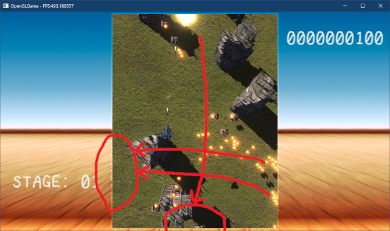<br>
明るい部分の反対側にあった不自然なブルームが消えている
</p>

テクスチャのラップモードの役割は、ポストエフェクトにおいて画面外のピクセル色を決定するだけではありません。例えば、`GL_REPEAT`等の無限に繰り返されるラップモードは、広い範囲を小さなテクスチャで覆うために使われます。

### 2.18 FBOのデフォルトのラップモードを指定する

ブルームエフェクトでは縮小と拡大で異なるラップモードを指定しました。しかし、一般的なFBOでは`GL_CLAMP_TO_EDGE`または`GL_CLAMP_TO_BORDER`のいずれかを指定し、実行中に変更しないことがほとんどです。

そこで、デフォルトのラップモードを設定しておくことにします。`FramebufferObject.cpp`を開き、コンストラクタの定義に次のプログラムを追加してください。

```diff
       texColor.reset(); // カラーテクスチャを破棄
       return;
     }
+    texColor->SetWrapMode(GL_CLAMP_TO_EDGE);
   }

   // 深度テクスチャを作成
   if (type & FboType::depth) {
     texDepth = Texture::Create("FBO(Depth)", width, height,
       GL_DEPTH_COMPONENT32F, GL_LINEAR);
     if (!texDepth || !*texDepth) {
       LOG_ERROR("FBO用深度テクスチャの作成に失敗");
       texColor.reset(); // カラーテクスチャを破棄
       texDepth.reset(); // 深度テクスチャを破棄
       return;
     }
+    texDepth->SetWrapMode(GL_CLAMP_TO_EDGE);
   }

   // FBOを作成
```

ブルームエフェクトのように数値が増大するのでなければ、端の色が無限に続く`GL_CLAMP_TO_EDGE`を指定するのが無難です。

>**【2章のまとめ】**
>
>* ブルームエフェクトはポストエフェクトの一種。「光の散乱現象」を再現することで、画像の現実感を向上させる。
>* 「光の散乱現象」を再現するには、画像から高輝度ピクセルを抽出してぼかす。
>* 縮小バッファを使うと、描画に必要なピクセル数を大きく減らすことができる。
>* 画面端のテクセルが反対側の端に影響しないようにするには、テクスチャのラップモードを設定する。
>* 同じ処理を関数にまとめると、プログラムの「読みやすさ」や「修正のしやすさ」が向上する。
