[OpenGL 3D 2022 後期 第03回]

# <ruby>法線<rt>ノーマル</rt></ruby>マッピングと<ruby>接線空間<rt>タンジェントスペース</rt></ruby>

## 習得目標

* 法線マッピングの考え方を説明できる。
* タンジェント空間の定義を説明できる。
* 法線テクスチャの作成と頂点に設定するタンジェントベクトルの両方で、同じ計算方法を使う必要がある理由を説明できる。

## 1. 法線(ノーマル)マッピング

### 1.1 なぜ法線マッピングを行うのか

<p align="center">
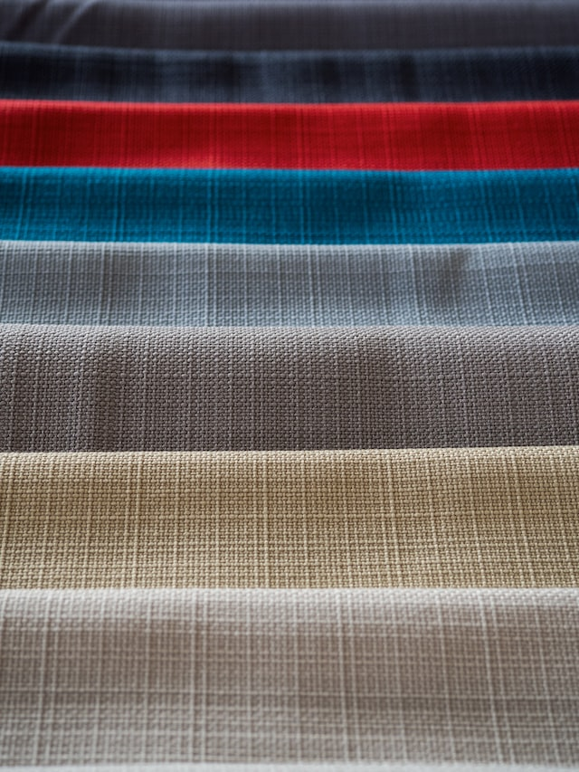

<br>
[撮影者 布地:vitalijs barilo 道路:jonathan borba 湖面:charlie firth]
</p>

布地の繊維、アスファルトの凹凸(おうとつ)、水面に立つさざなみなど、現実世界には微細な凹凸が数多く存在します。わたしたちは、こうした物体表面の構造の存在に慣れているため、凹凸の感じられない物体は作り物だと感じてしまいます。

このような微細な凹凸をポリゴンで再現しようとすると、膨大な頂点数が必要となります。実際に、映画用のモデルなどでは、微細な凹凸まで制作される場合があります。しかし、ゲームのようにリアルタイム性が求められるアプリケーションでは現実的とはいえません。

そのため、3Dグラフィックス性能が十分ではなかった頃は、これらの凹凸はカラーテクスチャに陰影を描き込むことで再現していました。

しかし、陰影として描き込まれた凹凸は、どこから見ても、またどのような光の当たり方をしても陰影が変化しません。そのため、すぐにまやかしの影であることがバレてしまいます。

この問題を解決するために生まれたのが「法線マッピング」です。法線マッピングの基本的な考え方は次のようなものです。

>凹凸が陰影を生むのは法線方向が異なるからだ。つまり、法線さえ再現できれば実際に凹凸を作る必要はないはずだ。

法線の再現には、カラーのかわりに「法線の変化量(摂動)」を記録したテクスチャを使います。法線を記録したテクスチャのことを「法線テクスチャ」といいます。

### 1.2 法線マッピングの種類

法線テクスチャに記録する法線(の摂動)には、以下の2種類が存在します。

| 名前 | 記録する法線の種類 |
|:-----|:-----|
| オブジェクト空間法線マッピング | モデル座標系(オブジェクト空間)の法線 |
| タンジェント空間法線マッピング | 図形に接する平面を基準とする座標系(タンジェント空間)の法線 |

実装は「オブジェクト空間法線マッピング」のほうが簡単です。そのかわり、「モデルの変形に対応できない」、「テクスチャの再利用が難しい」という欠点があります。

「タンジェント空間法線マッピング」は、実装が複雑になるかわりに「オブジェクト空間法線マッピング」の欠点が解消されています。そのため、多くの法線テクスチャはタンジェント空間用に作られています。

本テキストでは欠点の少ない「タンジェント空間法線マッピング」を実装することにします。

### 1.3 タンジェント空間

>「座標系」は、「空間において、座標を決めるための基本情報」です。

コンピューターグラフィックスにおける「タンジェント空間」は、「頂点座標に接する、頂点法線に垂直な平面を基準とする座標系」として定義されます。

<p align="center">
<br>
[緑=タンジェント(T) 赤=バイタンジェント(B) 青=頂点法線(N)]
</p>

タンジェント空間のX軸は「タンジェントベクトル」と呼ばれます(「タンジェント空間」の名前の由来)。Y軸は「バイタンジェント・ベクトル」と呼ばれます。Z軸は平面の法線で、これは頂点法線と同じです。

タンジェントベクトル`T`とバイタンジェントベクトル`B`は、頂点座標に接する平面上であればどんな向きも取り得ます。これは、「タンジェント空間の座標系の定義は無数に存在する」ことを意味します。

とはいえ、法線を定義するには「無数に存在する」と言われても困ります。そこで、タンジェント空間法線マッピングでは、「TとBがテクスチャ座標系のUV軸の向きと一致する座標系」が選択されます。

この座標系では、テクスチャ座標系のU軸がタンジェントベクトルと一致し、V軸がバイタンジェントベクトルと一致します。実際の利用法にもとづく説明をすると「法線テクスチャに記録する法線ベクトルの基準となる座標系」が選ばれるわけです。

法線テクスチャと3Dモデルは、この座標系によって関連付けられます。

>**【バイタンジェントとバイノーマル】**<br>
>法線マッピングでは、タンジェント空間を定義するために「ノーマル(法線)」、「タンジェント(接線)」、「バイタンジェント(従接線)」という3つのベクトルを使います。
>しかし、法線マッピングについて検索すると、バイタンジェントのかわりに「バイノーマル(従法線)」を使っている記事が見つかります。どちらが正しいのでしょう？　あるいは、名前が違うだけで同じものを意味しているのでしょうか？
>
>バイノーマルは「曲線(きょくせん)」の研究で導入された概念です。曲線のタンジェント空間は、1つの接線と直交する2つの法線によって定義されます。2つの法線はノーマル、バイノーマルと呼ばれます。<br>
>対して、バイタンジェントは「曲面(きょくめん)」において導入された概念です。曲面のタンジェント空間は、2つの接線と1つの法線によって定義されます。2つの接線はタンジェント、バイタンジェントと呼ばれます。<br>
>つまり、タンジェント空間の定義としては、バイタンジェントもバイノーマルも正解です。しかし、法線マッピングでは曲面のタンジェント空間を使います。その意味では「バイタンジェント」が正解で、「バイノーマル」は誤用といえます。
>
>`https://math.stackexchange.com/questions/3491798/difference-between-bitangent-and-binormal`

### 1.3 頂点シェーダにタンジェントベクトル変数を追加する

タンジェント空間法線マッピングでは、頂点ごとにタンジェントベクトルを持たせます。

>今回は説明しませんが、頂点に持たせず、シェーダでタンジェントベクトルを計算するやり方もあります。

それから、法線テクスチャを読み込んでシェーダに割り当てる必要もあります。法線テクスチャはマテリアルとして定義するのが一般的です。

これらを実現するために必要な作業は以下のとおりです。

頂点シェーダ:

>1. タンジェントベクトル用のin変数とout変数を追加。
>2. タンジェントベクトルをワールド座標系に変換。

フラグメントシェーダ:

>1. タンジェントベクトル用のin変数と、法線テクスチャのサンプラを追加。
>2. 法線テクスチャから法線を読み取る。
>3. タンジェント座標系からワールド座標系へ変換する行列を作成。
>4. 法線をポリゴン平面の座標系(タンジェント座標系)からワールド座標系に変換。

C++アプリケーション:

>1. `Material`構造体に法線テクスチャ変数を追加。
>2. MTLファイルから法線テクスチャ名を読み取り、法線テクスチャを読み込んで変数に代入。
>3. 描画前に法線テクスチャをバインド。
>4. `Vertex`構造体に「タンジェントベクトル」変数を追加。
>5. 頂点アトリビュートに「タンジェントベクトル」を追加。
>6. 「タンジェントベクトル」と「バイタンジェントベクトルの向き」を計算し、タンジェントベクトル変数に代入。

それでは、頂点シェーダから法線マッピングに対応させていきましょう。`standared_3D.vert`を開き、タンジェントベクトル用のin変数とout変数を追加してください。

なお、`outShadowPosition`と`texDepth`変数については、ロケーション番号とバインディングポイントを変更しているだけです。

```diff
 layout(location=0) in vec3 inPosition;
 layout(location=1) in vec2 inTexcoord;
 layout(location=2) in vec3 inNormal;
+layout(location=3) in vec4 inTangent;
 
 // シェーダからの出力
 layout(location=0) out vec3 outPosition;
 layout(location=1) out vec2 outTexcoord;
 layout(location=2) out vec3 outNormal;
+layout(location=3) out vec4 outTangent;
-layout(location=3) out vec3 outShadowPosition;
+layout(location=4) out vec3 outShadowPosition;
 
 // テクスチャ
-layout(binding=1) uniform sampler2DShadow texDepth;
+layout(binding=2) uniform sampler2DShadow texDepth;

 // プログラムからの入力
 layout(location=0) uniform vec3 translate;
```

`outShdowPosition`のロケーション番号を変更したのは、同じ行列によって変換される変数をまとめるためです。`texDepth`のバインディングポイントの変更も似た理由で、後述する法線テクスチャのバインディングポイントを揃えるためです。

>ロケーション番号に限らず、共通の性質を持つ変数は近くにまとめたり、順番を揃えるようにしましょう。プログラムが読みやすくなります。

### 1.4 タンジェントベクトルをワールド座標系に変換する

次に、タンジェントベクトルをローカル座標系からワールド座標系に変換します。ワールド法線を計算するプログラムの下に、次のプログラムを追加してください。

```diff
   // ワールド法線を計算
   mat3 matNormal = transpose(inverse(mat3(matModel)));
   outNormal = normalize(matNormal * inNormal);
+
+  // ワールドタンジェントを計算
+  outTangent.xyz = normalize(matNormal * inTangent.xyz);
+  outTangent.w = inTangent.w;

   // 影判定用の座標を計算
   float worldShadowRange = 750 * 2; // 深度マップの描画範囲(CreateDepthMap関数を参照)
```

タンジェントベクトルは法線と同じ「向きベクトル」です。そのため、平行移動を含まない`matNormal`行列を使ってワールド座標系に変換します。

これで頂点シェーダの変更は完了です。

### 1.5 フラグメントシェーダにタンジェントベクトル変数を追加する

続いて、フラグメントシェーダを法線マッピングに対応させます。まずタンジェントベクトル用の変数を追加しましょう。`standard_3D.frag`を開き、変数定義を次のように変更してください。

```diff
 layout(location=0) in vec3 inPosition;
 layout(location=1) in vec2 inTexcoord;
 layout(location=2) in vec3 inNormal;
+layout(location=3) in vec4 inTangent;
-layout(location=3) in vec3 inShadowPosition;
+layout(location=4) in vec3 inShadowPosition;

 // テクスチャ
 layout(binding=0) uniform sampler2D texColor;
+layout(binding=1) uniform sampler2D texNormal;
-layout(binding=1) uniform sampler2DShadow texDepth;
+layout(binding=2) uniform sampler2DShadow texDepth;

 // 出力する色データ
 out vec4 outColor;
```

ここでも、`inShadowPosition`と`texDepth`は、ロケーション番号またはバインディングポイントを変えているだけです。

`texDepth`のバインディングポイントを変えた理由は、`texColor`と`texNormal`はマテリアルですが、`texDepth`はマテリアルではないからです。

### 1.6 法線テクスチャから法線を読み取る

法線マッピングでは、法線テクスチャと頂点の法線及びタンジェントを使ってピクセルの法線を計算します。少し長い処理になるので、関数として定義することにします。

関数名は`ComputeWorldNormal`(コンピュート・ワールド・ノーマル)とします。環境光パラメータの定義の下に、次のプログラムを追加してください。

```diff
 // 環境光パラメータ
 layout(location=104) uniform vec3 ambientLight;
+
+/**
+* 法線を計算する
+*/
+vec3 ComputeWorldNormal()
+{
+}
+
+/**
+* エントリーポイント
+*/
 void main()
 {
```

それでは、`texNormal`から法線を読み取るプログラムを追加しましょう。`ComputeWorldNormal`関数に次のプログラムを追加してください。

```diff
 */
 vec3 ComputeWorldNormal()
 {
+  vec3 normal = texture(texNormal, inTexcoord).rgb;
+
+  // 値が小さすぎる場合、法線テクスチャが設定されていないと判断して頂点法線を返す
+  if (dot(normal, normal) <= 0.0001) {
+    return normalize(inNormal);
+  }
+
+  // 8bit値であることを考慮しつつ0～1を-1～+1に変換(128を0とみなす)
+  normal = normal * (255.0 / 127.0) - (128.0 / 127.0);
 }

 /**
```

法線テクスチャの読み込み方法は、通常のテクスチャと変わりません。法線テクスチャを持たない3Dモデルを考慮して、読み込んだ値が小さすぎる場合は「法線テクスチャなし」と判定しています。

この判定が有効なのは、法線テクスチャの仕様上、RGBが全て0になることはありえないためです。もし全て0になるとしたら、それはテクスチャがバインドされていない場合です。

#### 変換式に現れる255/127と128/127の意味

一般に、法線テクスチャには、法線のXYZ値(-1～+1)をRGBカラー(0～1)に変換した値が記録されます。法線テクスチャが明るい青紫色になるのは、この変換の結果、頂点法線と一致する値が(0.5, 0.5, 1.0)になるからです。

法線テクスチャから読み取った値の範囲は0～1となりますが、そのままでは法線ベクトルとして使えません。そこで、値を`-1～+1`に復元する必要があります。

しかし、法線ベクトルは「32ビット浮動小数点数」で表されるのに対して、法線テクスチャに記録できるのは「8ビット符号なし整数」です。精度にこれほど大きな<ruby>隔<rt>へだ</rt></ruby>たりがあると、正確な復元は不可能です。

そのため、性質の異なる2つの復元方法が考えられました。

| 復元方法 | 利点 | 欠点 |
|:-:|:--|:--|
| 法線テクスチャ * 2 - 1 | 誤差が小さい | 0を表現できない |
| (法線テクスチャ * 255 - 128) / 127 | 0を表現できる | 誤差が大きい |

上側の方法では`-1`→`0`, `0`→`127.5`, `+1`→`255`のように割り当てます。この割り当て方では`0`を整数で表すことができません。そのかわり、`-1～0`と`0～+1`の両方を128段階で表すことができ、。

下側の方法では`-1`→`0`, `0`→`128`, `+1`→`255`のように割り当てます。この割り当て方では、`0`を除いて`-1～0`が128段階、`0～+1`が127段階となり、プラス側の表現力が低下します。そのかわり、`0`を正確に表せます。

どちらを使うかはアプリケーション次第ですが、基本的には下側の方法が使われます。0を表現できないと(0, 0, 1)のような垂直ベクトルが表せないためです。この理由から、本テキストでも下側の方法を採用しています。

もちろん、「浮動小数点数テクスチャ」を使えば上記の問題はなくなります。しかし、必要なメモリが2倍～4倍になるため、2022年現在ではほとんど使われていません。

>法線テクスチャの誤差については以下のURLが詳しいです。<br>
>`http://www.aclockworkberry.com/normal-unpacking-quantization-errors/`<br>
>`http://wiki.polycount.com/wiki/Normal_Map_Technical_Details`

### 1.7 法線ベクトルをワールド座標系に変換する

法線テクスチャから読み込んだ法線ベクトルは「タンジェント座標系」にあります。これをワールド座標系に変換するには、タンジェント座標系の各軸をワールド座標系で表現したベクトルを作り、そのベクトルに各成分を乗算します。

タンジェント座標系の軸はX=タンジェント、Y=バイタンジェント、Z=ノーマル(これは法線のことです)と呼ばれます。このうちタンジェントとノーマルはin変数で受け取っているので、あとはバイタンジェントを計算するだけです。

バイタンジェントは、タンジェントとノーマルに直交するように定義されます。直交するベクトルは外積によって計算できるので、頂点データにはノーマルとタンジェントの2つを持たせれば十分です。

ただし、直交ベクトルの向きにはプラス方向とマイナス方向の2つがありえます。しかし、外積は常にプラス方向になります。つまり、ノーマルとタンジェントだけでは直交ベクトルの向きを決めるには不十分なのです。

そこで、CPPアプリケーションでタンジェントベクトルを計算するとき、バイタンジェントの正しい方向をタンジェントベクトルの`w`要素に設定しておきます。この処理は後で書きますが、シェーダはこれを前提として作成します。

法線テクスチャから読み取った法線を変換するプログラムの下に、次のプログラムを追加してください。

```diff
   // 8bit値であることを考慮しつつ0～1を-1～+1に変換(128を0とみなす)
   normal = normal * (255.0 / 127.0) - (128.0 / 127.0);
+
+  // 法線テクスチャの値をワールド空間に変換
+  vec3 bitangent = inTangent.w * cross(inNormal, inTangent.xyz);
+  return normalize(
+    inTangent.xyz * normal.x +
+    bitangent * normal.y +
+    inNormal * normal.z);
 }

 /**
```

これで法線ベクトルを計算する関数は完成です。最後に、作成した関数を`main`関数から呼び出しましょう。`main`関数を次のように変更してください。

```diff
   outColor = texture(texColor, inTexcoord) * material.baseColor;

   float invPi = 1 / acos(-1); // πの逆数

-  // 線形補間によって長さが1ではなくなっているので、正規化して長さを1に復元する
-  vec3 normal = normalize(inNormal);
+  vec3 normal = ComputeWorldNormal();

   // ランベルトの余弦則を使って明るさを計算
   float theta = max(dot(-directionalLight.direction, normal), 0);
```

これで、フラグメントシェーダの変更は完了です。

### 1.8 Material構造体に法線テクスチャ変数を追加する

ここからは、CPPアプリケーション側を法線マッピングに対応させていきます。まずマテリアルに法線テクスチャ変数を追加します。`Mesh.h`を開き、`Material`構造体の定義に次のプログラムを追加してください。

```diff
   float specularPower = 16;                   // 鏡面反射指数
   float normalizeFactor = 24.0f / 25.13274f;  // 正規化係数
   TexturePtr texBaseColor;                    // 基本色テクスチャ
+  TexturePtr texNormal;                       // 法線テクスチャ
 };
 using MaterialPtr = std::shared_ptr<Material>;
```

次に、追加した`texNormal`にテクスチャを読み込みます。`Mesh.cpp`を開き、`LoadMTL`関数にある基本色テクスチャを読み取りを試みるプログラムの下に、次のプログラムを追加してください。

```diff
           Texture::Usage::for3D);
       continue;
     }
+
+    // 法線テクスチャ名の読み取りを試みる
+    textureName[0] = 0;
+    if (sscanf(line.data(), " bump %999[^\n]", &textureName) < 1) {
+      sscanf(line.data(), " map_bump %999[^\n]", &textureName);
+    }
+    if (textureName[0] != 0) {
+      pMaterial->texNormal =
+        Texture::Create(foldername + textureName, GL_LINEAR,
+          Texture::Usage::for3D);
+      continue;
+    }
   }

   return materials;
```

MTLファイルにおける法線テクスチャの構文は`bump`です。しかし、`map_bump`という構文も広く使われているため、両方に対応させることにしました。

読み取りの成功・失敗は`textureName`配列の0番目の要素で判定しています。何らかの名前が読み取れたなら`0`以外になるはずなので、最初に`0`を設定しておくことで判別できるようにしています。

### 1.9 法線テクスチャをGLコンテキストに割り当てる

読み込んだテクスチャを使うには、GLコンテキストに割り当てなくてはなりません。`StaticMesh`用の`Draw`関数の定義を、次のように変更してください。

```diff
         glProgramUniform3f(program, 103,
           material.specularPower, material.normalizeFactor, 0);
       }

+      // GLコンテキストにテクスチャを割り当てる
+      GLuint tex[2] = { 0 };
       if (material.texBaseColor) {
-        const GLuint tex = *material.texBaseColor;
+        tex[0] = *material.texBaseColor;
-        glBindTextures(0, 1, &tex);
-      } else {
-        glBindTextures(0, 1, nullptr);
       }
+      if (material.texNormal) {
+        tex[1] = *material.texNormal;
+      }
+      glBindTextures(0, 2, tex);
     }
     Draw(prim);
```

ここには、テクスチャのバインディングポイントの順序を変更した理由のひとつが現れています。`texColor`と`texNormal`のバインディングポイントを連番にしたことで、1回の`glBindTextures`関数でを設定できるわけです。

### 1.10 深度テクスチャの割り当てを変更する

そうそう、バインディングポイントの番号を変更したので、深度テクスチャの割り当てプログラムも修正しなくてはなりません。`Engine.cpp`を開き、`MainLoop`メンバ関数にある深度テクスチャを割り当てるプログラムを、次のように変更してください。

```diff
   // 影描画用の深度テクスチャを割り当てる
   const GLuint texDepth = *fboShadow->GetDepthTexture();
-  glBindTextures(1, 1, &texDepth);
+  glBindTextures(2, 1, &texDepth);

   // 影座標からテクスチャ座標に変換する行列
   const mat4 matTexture = {
```

これで法線テクスチャの設定は完了です。

### 1.11 Vertex構造体にタンジェントベクトルを追加する

続いて、頂点データにタンジェントベクトルを追加していきます。`Mesh.h`を開き、`Vertex`構造体にタンジェントベクトル変数を追加してください。

```diff
   VecMath::vec3 position;
   VecMath::vec2 texcoord;
   VecMath::vec3 normal;
+  VecMath::vec4 tangent;
 };

 /**
 * マテリアル(材質)
```

次に、頂点アトリビュートにタンジェントベクトルを追加します。`Mesh.cpp`を開き、`PrimitiveBuffer`コンストラクタの定義に次のプログラムを追加してください。

```diff
   setAttribute(0, 3, offsetof(Vertex, position));
   setAttribute(1, 2, offsetof(Vertex, texcoord));
   setAttribute(2, 3, offsetof(Vertex, normal));
+  setAttribute(3, 4, offsetof(Vertex, tangent));

   // バインド解除
   glBindVertexArray(0);
```

これで`tangent`変数が頂点シェーダに送られるようになりました。

### 1.12 タンジェントベクトルの求めかた

最後に、タンジェントベクトルを計算します。計算手順は以下のようになります。

>1. ポリゴン単位でタンジェントベクトルを計算して加算。
>2. 全ての計算が完了したら、正規化して単位ベクトルに変換。

それではプログラムを書いていきましょう。加算していくので、初期値を0にして置く必要があります。`LoadOBJ`メンバ関数の「新しい頂点データを作成」するプログラムに、次のプログラムを追加してください。

```diff
     } else {
       v.normal = normals[e.vn - 1];
     }
+    v.tangent = vec4(0); // 初期値を0にする
     vertices.push_back(v);
   }
```

次にタンジェントベクトルを計算します。ポリゴンの頂点座標P0, P1, P2と、テクスチャ座標(u0,v0), (u1,v1), (u2,v2)があり、次のようにテクスチャが貼られているとします。

<p align="center">
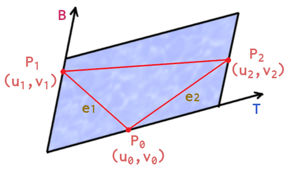
</p>

このとき、(u0,v0)と(u1,v1)を結ぶ線分e1は、ベクトルTとBを用いて次のように表わすことができます。

>`e1 = (u1 - u0)T + (v1 - v0)B`

同様に、線分e2は次のように表せます。

>`e2 = (u2 - u0)T + (v2 - v0)B`

上記の2つの式を連立方程式として考えると、これは次のように行列で書くことができます。

>```txt
>| e1.x e1.y e1.z |   | (u1-u0) (v1-v0) |   | T.x T.y T.z |
>| e2.x e2.y e2.z | = | (u2-u0) (v2-v0) | * | B.x B.y B.z |
>```

これを簡略化して`E = A * B`とすると、求めたいタンジェントベクトルは`B`です。また、上の図から`E`と`A`は計算できることが分かっています。

この式の両辺に`A`の逆行列`A(-1)`を掛けると次のようになります。

>`A(-1) * E = A(-1) * A * B`

`A(-1) * A`は単位行列なので消去して、

>`B = A(-1) * E`

が得られます。ようするに「`A`の逆行列を`E`に掛ければタンジェントベクトルが求められる」ということです。

2x2行列の逆行列を求めるには次の公式を使います。

>```txt
>     | a b |
>A = | c d |
>
>                         | d -b |
>A(-1) = 1 / (ad - bc) * |-c  a |
>```

また、今回求めるのはタンジェントだけなので、`T`に関する計算だけを行えば十分です。これは`1 / (ad - bc)`を`S`とすると、

>`T = S * ((v2 - v0) * e1 - (v1 -v0) * e2)`

これで、タンジェントベクトルを求める方法が分かりました。

### 1.13 辺ベクトルを求める

それでは、計算式をプログラムしていきましょう。とりあえず辺ベクトルe1, e2と、uvの差分uv1, uv2を求めます。OpenGLで使えるデータに変換するループの下に、次のプログラムを追加してください。

```diff
     v.tangent = vec4(0); // 初期値を0にする
     vertices.push_back(v);
   }
+
+  // タンジェントベクトルを計算
+  for (size_t i = 0; i < indices.size(); ++i) {
+    // 頂点座標とテクスチャ座標の辺ベクトルを計算
+    const size_t offset = (i / 3) * 3;
+    const int i0 = indices[(i + 0) % 3 + offset];
+    const int i1 = indices[(i + 1) % 3 + offset];
+    const int i2 = indices[(i + 2) % 3 + offset];
+    Vertex& v0 = vertices[i0];
+    Vertex& v1 = vertices[i1];
+    Vertex& v2 = vertices[i2];
+    vec3 e1 = v1.position - v0.position; // 座標ベクトル
+    vec3 e2 = v2.position - v0.position; // 座標ベクトル
+    vec2 uv1 = v1.texcoord - v0.texcoord; // テクスチャ座標ベクトル
+    vec2 uv2 = v2.texcoord - v0.texcoord; // テクスチャ座標ベクトル
+  }

  // 変換したデータをプリミティブバッファに追加
  const GLint baseVertex = 
```

ループ変数`i`は、タンジェントベクトルを求める頂点インデックスのオフセットです。変数`i0`, `i1`, `i2`はポリゴンを構成する頂点インデックスのオフセットです。

`i = 0`のとき`i0 = 0, i1 = 1, i2 = 2`、`i= 1`のとき`i0 = 1, i1 = 2, i2 = 0`、`i = 2`のとき`i0 = 2,i1 = 0, i2 = 1`となります。

0, 1, 2は最初のポリゴンの頂点インデックスです。同様に、変数`i`が`3～5`のときは`3,4,5`, `4,5,3`, `5,3,4`となり、`i`が`6～8`のときは`6,7,8', '7,8,6`, `8,6,7`となります。

<p align="center">
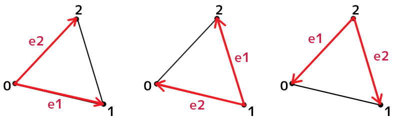<br>
[i=0, i=1, i=2のときの辺ベクトルe1, e2の向き]
</p>

### 1.14 辺ベクトルの有効性を判定する

次に、テクスチャ座標ベクトルuv1とuv2の外積を計算します。ベクトルを計算するプログラムの下に、次のプログラムを追加してください。

```diff
     vec3 e2 = v2.position - v0.position; // 座標ベクトル
     vec2 uv1 = v1.texcoord - v0.texcoord; // テクスチャ座標ベクトル
     vec2 uv2 = v2.texcoord - v0.texcoord; // テクスチャ座標ベクトル
+
+    // テクスチャの面積がほぼ0の場合は無視
+    float uvArea = uv1.x * uv2.y - uv1.y * uv2.x; // uvベクトルによる平行四辺形の面積
+    if (abs(uvArea) < 0x1p-20) { // 十六進浮動小数点数リテラル(C++17)
+      continue;
+    }
   }

  // 変換したデータをプリミティブバッファに追加
```

外積の結果はUV平面に垂直なベクトルです。このベクトルの長さは、2つの辺ベクトルによって作られる平行四辺形の面積をあらわします。

<p align="center">
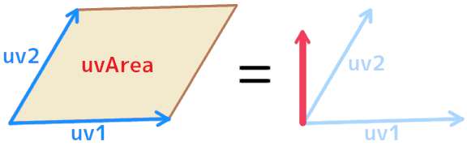
</p>

uv1とuv2の向きが等しい、またはいずれかのベクトルの長さが0の場合、平行四辺形の面積は0になります。どちらの場合もタンジェントベクトルを計算できません。そこで、面積が「ほぼ0」の場合は`continue`して以降の計算をスキップします。

`0x1p-20`はC++17で追加された「16進数の指数表記」」です。`p`の前が「仮数部(かすうぶ)」、後が「指数部(しすうぶ)」で、以下の式で10進数に戻すことができます。

>`仮数部 * 2^指数部`

`0x1p-20`の場合、仮数部は`0x1`、指数部は`-20`です。これを上の式に当てはめると、`0x1 * 2^-20 = 0.00000095367431640625`となります。

>**【浮動小数点数の計算誤差を常に考慮しよう】**<br>
>「ぴったり0」ではなく「ほぼ0」で判定するのは、浮動小数点数の計算誤差を考慮するためです。「0.1fを10回足しても1.0fにならない」など、浮動小数点数の計算に誤差はつきものです。そのため、等号`==`による比較はうまくいきません。代わりに不等号を使って、「ある一定の範囲の値」と比較するようにしましょう。

### 1.15 バイタンジェントベクトルの向きを決める

次に、バイタンジェントベクトルの向きを決めます。テクスチャの面積がほぼ0の場合を判定するプログラムの下に、次のプログラムを追加してください。

```diff
     if (abs(uvArea) < 0x1p-20) { // 十六進浮動小数点数リテラル(C++17)
       continue;
     }
+
+    // テクスチャが裏向きに貼られている(面積が負の)場合、バイタンジェントベクトルの向きを逆にする
+    if (uvArea >= 0) {
+      v0.tangent.w = 1; // 表向き
+    } else {
+      v0.tangent.w = -1;// 裏向き
+    }
   }

  // 変換したデータをプリミティブバッファに追加
```

次の図のように、外積の結果は元になったベクトルの向きによって符号が異なります。

<p align="center">
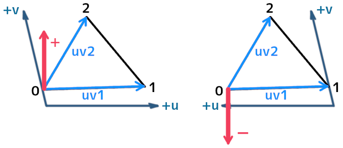<br>
[左=uv1がプラス向き 右=uv1がマイナス向き]
</p>

右図のように、テクスチャ座標が逆を向いている場合、タンジェント空間も反転していることを意味します。つまり、バイタンジェントベクトルが逆向きになります。

### 1.16 タンジェントベクトルを求める

それではタンジェントベクトルを求めましょう。まず辺ベクトルをタンジェント平面と平行になるように修正します。バイタンジェントベクトルの向きを決めるプログラムの下に、次のプログラムを追加してください。

```diff
     } else {
       v0.tangent.w = -1;
     }
+
+    // タンジェント平面と平行なベクトルにするため、法線方向の成分を除去
+    e1 -= v0.normal * dot(e1, v0.normal);
+    e2 -= v0.normal * dot(e2, v0.normal);
   }

  // 変換したデータをプリミティブバッファに追加
```

辺ベクトルをタンジェント平面と平行にするには、辺ベクトルから法線方向の成分を除去します。「法線方向の成分」は、辺ベクトルを法線方向に射影した長さ(これは内積によって求められます)と法線を掛けたものです。

次にタンジェントベクトルを計算します。すでにe1, e2はタンジェント平面上にあるので、1.12節で求めた以下の式のとおりに計算するだけです。タンジェント平面上の辺ベクトルを求めるプログラムの下に、次のプログラムを追加してください。

>`T = S * ((v2 - v0) * e1 - (v1 - v0) * e2)`

プログラム中では`v2 - v0`は`uv2.y`、`v1 - v0`は`uv1.y`に相当することに注意してください。タンジェント平面と平行な辺ベクトルを求めるプログラムの下に、次のプログラムを追加してください。

```diff
     // タンジェント平面上のベクトルにするため、法線方向の成分を除去
     e1 -= v0.normal * dot(e1, v0.normal);
     e2 -= v0.normal * dot(e2, v0.normal);
+
+    // タンジェントベクトルを計算
+    vec3 tangent = normalize((uv2.y * e1 - uv1.y * e2) * v0.tangent.w);
```

上の式で求められるタンジェントベクトルの方向は、バイタンジェントと同様にテクスチャ座標の向きによって異なります。バイタンジェントとタンジェントの両方を逆向きにすると、それは逆向きではなくなってしまいます。

そのため、タンジェントベクトルの方向はテクスチャ座標の向きに関わらず同じでなくてはなりません。そこで、最後に`w`を掛けることで常に同じ方向を向けさせています。

### 1.17 タンジェントベクトルを加算する

続いて、計算したタンジェントベクトルを頂点のタンジェントデータに加算します。タンジェントベクトルを計算するプログラムの下に、次のプログラムを追加してください。

```diff
     // タンジェントベクトルを計算
     vec3 tangent = normalize((uv2.y * e1 - uv1.y * e2) * v0.tangent.w);
+
+    // 辺ベクトルのなす角を重要度としてタンジェントを合成
+    float angle = acos(dot(e1, e2) / (length(e1) * length(e2)));
+    v0.tangent += vec4(tangent * angle, 0);
   }

  // 変換したデータをプリミティブバッファに追加
```

このプログラムでは、辺ベクトルe1とe2のなす角度によってタンジェントベクトルの重要度を変えています。次の図が示すように、「角度が大きいポリゴンほど、その頂点に影響する面積が広い」と考えられるからです。

<p align="center">
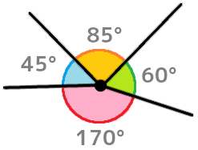
</p>

### 1.18 タンジェントベクトルを正規化する

ここまでで、全てのポリゴンのタンジェントベクトルを計算し終えました。各頂点の`tangent`変数には、その頂点に影響する全てのタンジェントベクトルが加算されています。

複数のベクトルを加算して作られたベクトルは、正規化することで平均値を出すことができます。

```diff
     float angle = acos(dot(e1, e2) / (length(e1) * length(e2)));
     v0.tangent += vec4(tangent * angle, 0);
   }
+
+  // タンジェントベクトルを正規化
+  for (auto& e : vertices) {
+    vec3 t = normalize(vec3(e.tangent.x, e.tangent.y, e.tangent.z));
+    e.tangent = vec4(t.x, t.y, t.z, e.tangent.w);
+  }

   // 変換したデータをプリミティブバッファに追加
   const GLint baseVertex = 
```

これで、頂点の「タンジェントベクトル」と「バイタンジェントの向き」を求めることができました。

>**【1章のまとめ】**
>
>* 法線マッピングはピクセル単位で法線の向きを変形することで、物体表面の複雑な形状を「擬似的に」表現する技法。
>* 法線マッピングを行うには、頂点ごとにタンジェント空間を定義する。
>* タンジェント空間は「頂点座標に接する、頂点法線に垂直な平面を基準とする座標系」で、タンジェント(接線)、バイタンジェント(従接線)、ノーマル(法線)の3つのベクトルによって定義される。
>* タンジェントとバイタンジェントは、頂点のテクスチャ座標から求める。
>* 多くの法線テクスチャが青紫なのは、法線のXYZ方向をRGB値として格納するため。

<div style="page-break-after: always"></div>

## 2. 法線テクスチャを作成する

### 2.1 法線テクスチャを作成する

ここまでで、法線マッピング自体は実行できるようになっています。とはいえ、肝心の法線テクスチャがなければ意味がありません。そこで、地面に法線テクスチャを追加しようと思います。

法線テクスチャを作成するには、法線テクスチャ作成ツールが必要です。

Materialize(マテリアライズ)というツールを使うことにします。WebブラウザのURL入力欄に以下のURLを入力して、Materializeの公式サイトを開いてください。

>`www.boundingboxsoftware.com/materialize/`

<p align="center">
<br>
[Materialize公式サイト(2022.09現在)]
</p>

ページを一番下までスクロールさせると、次のようなダウンロードボタンがあると思います。このボタンをクリックしてZIPファイルをダウンロードしてください。

<p align="center">

</p>

ダウンロードしたZIPファイルを「展開」し、適当なフォルダに配置してください。Materializeのインストールはこれだけです。展開したフォルダ内にある`Materialize.exe`をダブルクリックして、Materializeを起動してください。

<p align="center">
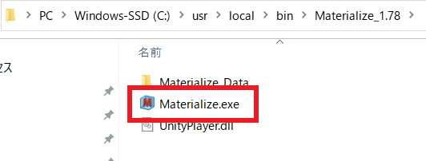
</p>

<div style="page-break-after: always"></div>

すると、次のようなウィンドウが開きます。

<p align="center">
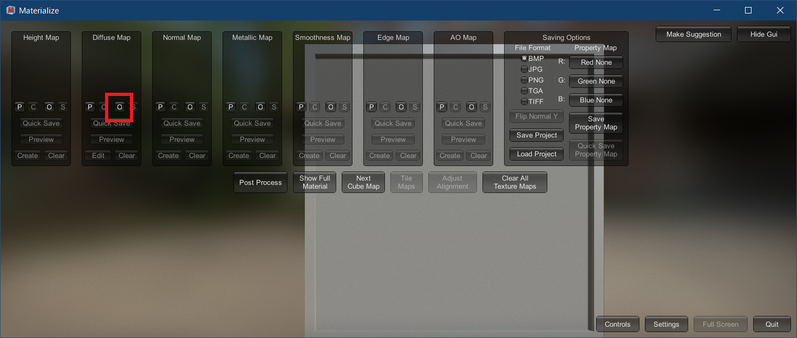
</p>

まず`Diffuse Map`パネルにある`O`(オー)`ボタンをクリックしてください。するとファイル選択ウィンドウが開きます。

<p align="center">
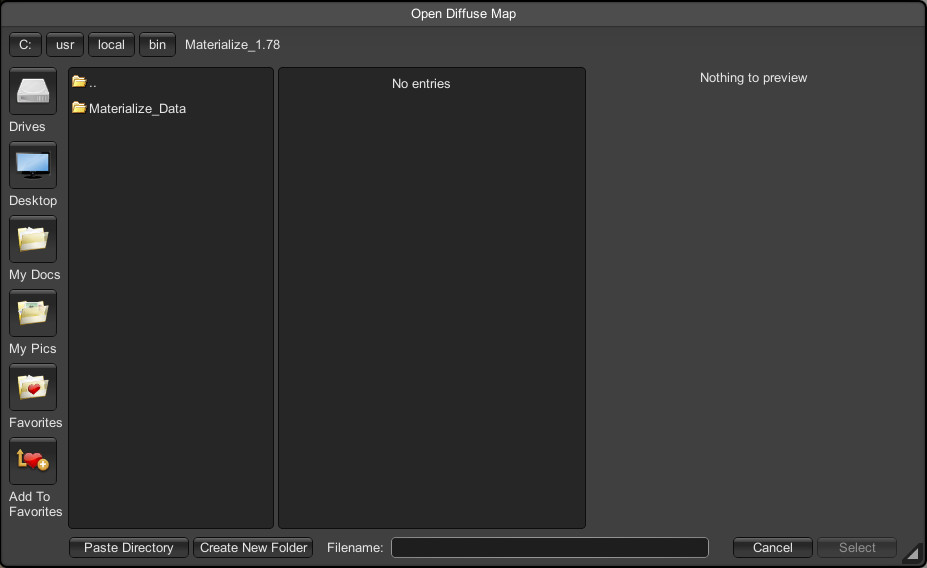
</p>

プロジェクトの`Res`フォルダから地面テクスチャを選択し、右下の`Select`ボタンをクリックしてください。

<p align="center">
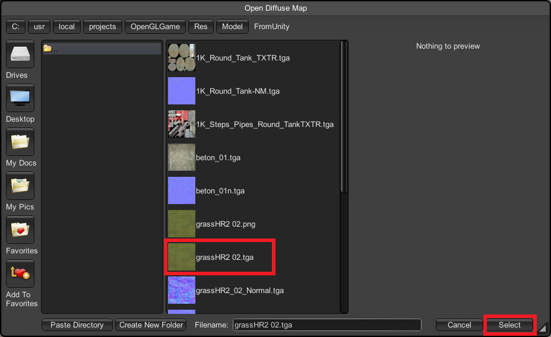
</p>

<div style="page-break-after: always"></div>

すると、次のように地面テクスチャが表示された状態になります。

<p align="center">
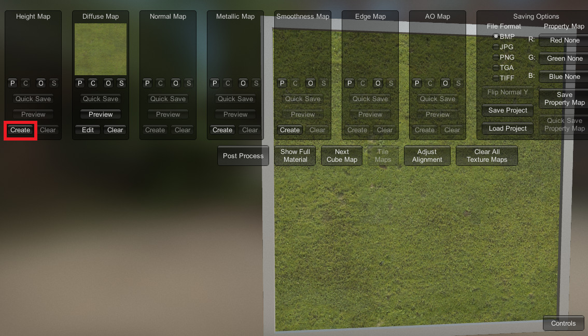
</p>

そうしたら、今度は`Height map`(ハイトマップ)パネルにある`Create`(クリエイト)ボタンをクリックしてください。すると、左側に「ハイトマップ作成パネル」が開き、中央のモデルが地面テクスチャと作成されるハイトマップに2分割表示されます。

<p align="center">
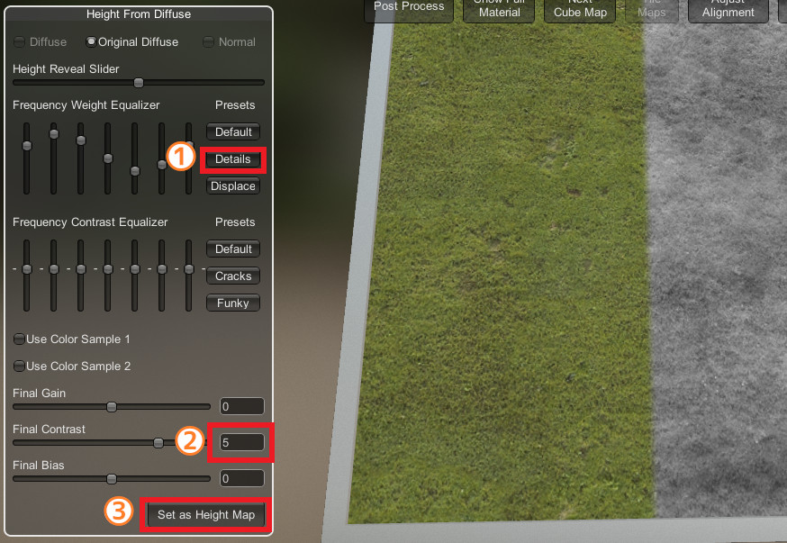
</p>

初期設定では高さの変化がほとんどないので、パラメータを調整します。まず「ハイトマップ作成パネル」にある`Details`(ディティールズ)ボタンをクリックしてください(①)。`Details`はテクスチャが詳細な凹凸を含む場合に使う設定です。

次に、下の方にある`Final Contrast`(ファイナル・コントラスト)の値を`5`にしてください。これで陰影がくっきりするはずです(②)。

2つのパラメータを設定したら、一番下にある`Set as Height Map`(セット・アズ・ハイトマップ)ボタンをクリックすると、高さテクスチャが作成されます(③)。

>**【ハイトマップ(高さマップ)って何？】**<br>
>ハイトマップは「テクセル座標の高さ」を表すテクスチャです。一般的には白黒画像で、高い部分ほど白く、低い部分ほど黒くなります。

高さテクスチャを作成したら、いよいよ法線テクスチャを作成します。`Normal Map`(ノーマルマップ)パネルにある`Create`(クリエイト)ボタンをクリックしてください。

<p align="center">
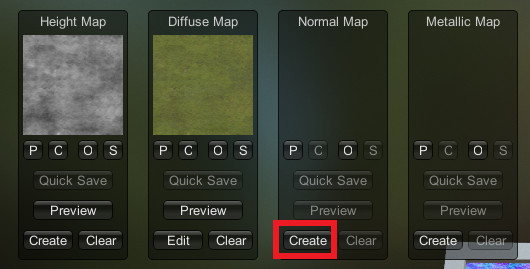
</p>

すると、左側に「法線マップ作成パネル」が表示され、中央のモデルには次のような青紫の画像が表示されます。今回はとくに修正する必要はないので、一番下にある`Set as Normal Map`(セット・アズ・ノーマルマップ)ボタンをクリックしてください。

<p align="center">
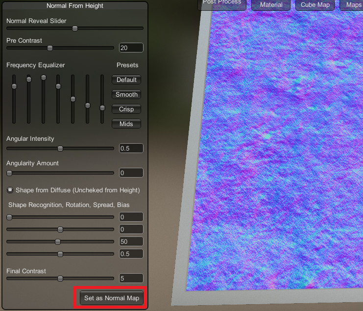
</p>

法線テクスチャがセットされたら`Preview`(プレビュー)ボタンをクリックして「法線マップ作成パネル」を閉じてください。

<p align="center">
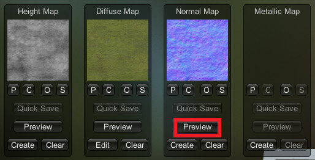
</p>

さて、MaterializeはデフォルトではDirectX用の法線テクスチャを作成します。Y軸の向きが逆なので、そのままではOpenGLでは使えません。そこで、`Saving Options`(セービング・オプションズ)パネルにある`Flip Normal Y`ボタンをクリックしてください。

<p align="center">
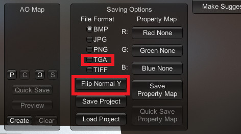
</p>

すると、Y軸に相当する緑成分の値が反転します。これでOpenGL用の法線テクスチャをになりました。

それから、保存するファイル形式をTGAにするため、`Fiel Format`の下の一覧から`TGA`をクリックしてチェックマークを付けておいてください。

それでは、作成した法線テクスチャを保存しましょう。特定のテクスチャを保存するには、各パネルにある`S`ボタンをクリックします。今回は法線テクスチャなので、`Normal Map`パネルにある`S`ボタンをクリックしてください。

<p align="center">
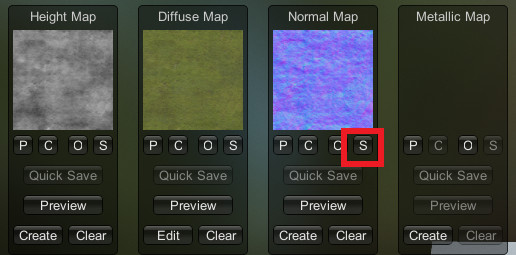
</p>

保存ダイアログが表示されるので、

>`地面テクスチャ名_normal.tga`

のように、元のテクスチャ名に`_normal`を付けて保存してください。これで法線テクスチャが作成されました。

### 2.2 MTLファイルに法線テクスチャを追加する

作成した法線テクスチャを地面モデルに追加します。`Res/Model`フォルダにある`Ground.mtl`ファイルを開き、次のテキストを追加してください。

```diff
 newmtl grassHR2 02
 Kd 1 1 1
 map_Kd grassHR2 02.tga
+bump grassHR2 02_normal.tga
 Ns 20
 illum 2
```

MTLファイルを修正したら、プログラムを実行してください。地面に凹凸があるように見えていたら成功です。

<p align="center">
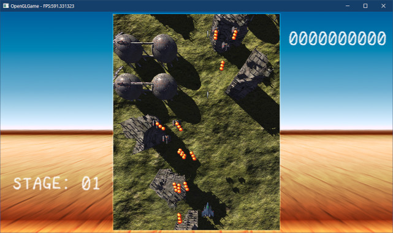
</p>

このように、法線テクスチャを利用すると、ポリゴンでは難しい複雑な凹凸を表現することができます。

>**【2章のまとめ】**
>
>* 法線テクスチャを作成するにはツールを活用する。Materializeというツールの他、PhotoShopやGIMPにも法線テクスチャを作成するフィルタがある。
>* MTLファイルに法線テクスチャを指定するには、`bump`または`map_bump`構文を使う。

<div style="page-break-after: always"></div>

## 3. MikkTSpace(ミック・ティー・スペース)

### 3.1 作成時と利用時で同じ座標系を使う

「法線テクスチャを作成するとき」と「法線テクスチャから法線を読み出すとき」の両方で、同じ座標系を使うことが重要です。

タンジェント空間の座標系はポリゴンごとに定義されます。なぜなら、ポリゴンの法線と、ポリゴンに貼り付けられるテクスチャの向きは、ポリゴンごとに異なっているからです。

このことは、頂点が複数のポリゴンで共有されている場合に問題となります。一般に、「ひとつの頂点に設定できるタンジェント空間はひとつだけ」だからです。

そのため、法線テクスチャ作成ツールは「頂点が関わる全てのタンジェント空間を平均化」する処理を行います。そして、平均化されたタンジェント空間を使って法線テクスチャを作成します。

しかし、タンジェント空間の平均化には次のような問題があります。

>* 浮動小数点数の計算誤差
>* 平均化手順が公開されていないツールがある

浮動小数点数の計算誤差により、タンジェント空間を計算するとき、同じポリゴンでもインデックス順が異なるとわずかに異なる結果になります。同様に、タンジェント空間を加算する順序が異なる場合も結果が変わります。

また、平均化手順が公開されていない場合、ツールと同じタンジェント空間を計算することはほとんど不可能です。

上記のような問題があることで、ツールが異なるとタンジェント空間を正しく復元できません。結果として、ポリゴンの境界で不自然な陰影が生まれることがありました。

この問題をなくす方法のひとつは、同じモデリングツールを使って3Dモデルと法線テクスチャを作成することです。しかし近年は、3Dモデルに求められる水準が上がり、ひとつのツールですべての作業を行うことが困難になってきました。

複数のツールで作業を行うには、標準的なタンジェント空間計算方法が必要でした。そんなときに登場したのが`MikkTSpace`(ミック・ティー・スペース)という方法です。

`MikkTSpace`は、2008年にMorten S. Mikkelsen氏が発表した「タンジェント空間の計算方法」です。

`MikkTSpace`の特徴は、「同じ3Dモデルであれば、たとえインデックス順が異なっていても常に同じ計算結果が得られる」ことです。入力データの順序に注意する必要がないため、ため、多くの3Dツールやゲームエンジンで採用されています。

それ以外の基本的な部分は「タンジェントとバイタンジェントのなす角が大きいほど、その頂点に影響する面積が広い」という考え方にもとづいています。この考え方は、先に実装してもたったプログラムでも採用していますす。

>2008年の論文は、コペンハーゲン大学のサイト(以下のURL)からダウンロードできます。<br>
>`http://image.diku.dk/projects/media/morten.mikkelsen.08.pdf`
>
>また、以下のURLでは法線とタンジェントの計算方法について、いくつかの議論を読むことができます。<br>
>`https://github.com/KhronosGroup/glTF/issues/2056`

### 3.2 プロジェクトにMikkTSpaceを組み込む

`MikkTSpace`は、`https://github.com/mmikk/MikkTSpace`で公開されているソースファイルを組み込んで利用します。環境にかかわらず同じ結果を得られることが重要なので、自分で実装することは避けてください。

それでは、ソースファイルをダウンロードしてプロジェクトに組み込みましょう。ブラウザで
`https://github.com/mmikk/MikkTSpace`を開いてください。すると次のようなページが表示されます。

<p align="center">
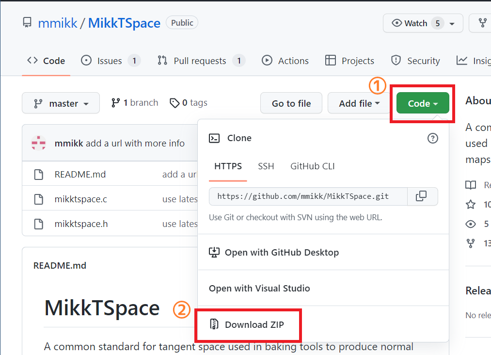
</p>

`Code`(コード)と書かれた緑色のボタンをクリックすると、サブメニューが表示されます。<br>
一番下の`Download ZIP`(ダウンロード・ジップ)をクリックして、適当なフォルダにZIPファイルをダウンロードしてください。

次に、プロジェクトの`Src`フォルダに、`MikkTSpace`という名前のフォルダを作成してください。

<p align="center">
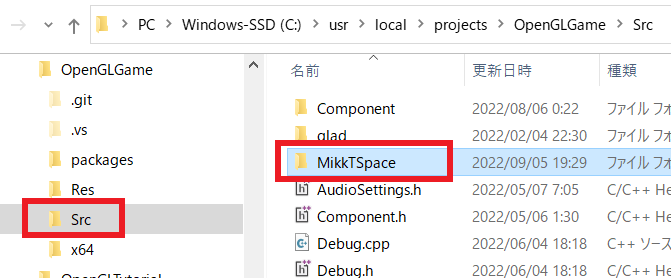
</p>

ダウンロードしたZIPファイルを展開すると`mikktspace.h`と`mikktspace.c`というファイルが見つかります。この2つのファイルを、先ほど作成した`MikkTSpace`フォルダにコピーしてください。

次に、プロジェクトにMikkTSpace用のフィルターを追加します。Visual Studioでプロジェクトを開いてください。そして、ソリューションエクスプローラーにある「ソースファイル」フィルタを右クリックして右クリックメニューを開いてください(①)。

右クリックメニューから「追加」を選び(②)、次に「新しいフィルター(F)」を選択してください(③)。ソリューションエクスプローラーに「新しいフィルター」が追加されるので、名前を`MikkTSpace`に変更してください。

<p align="center">
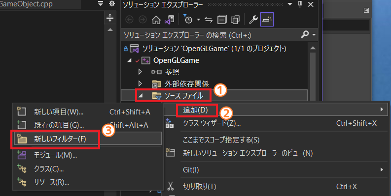
</p>

作成したフィルタに、MikkTSpace用のファイルを追加します。エクスプローラーでプロジェクトの`Src`フォルダを開いてください。次に、エクスプローラーの`MikkTSpace`フォルダをVisual Studioの`MikkTSpace`フィルタにドラッグ&ドロップしてください。

<p align="center">
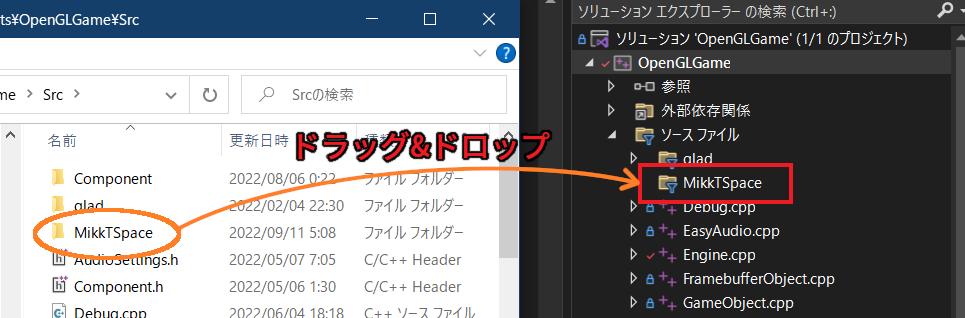
</p>

ドラッグ&ドロップを使うと、フォルダ内にあるすべてのファイルをプロジェクトに追加することができます。

この段階でプロジェクトをビルドして、エラーが起きないことを確認してください。

### 3.3 MikkTSpace用のクラスを定義する

`mikktspace.h`には`SMikkTSpaceInterface`(エス・ミック・ティー・スペース・インターフェイス)と`SMikkTSpaceContext`(エス・ミック・ティー・スペース・コンテキスト)という2つの構造体が定義されています。

>* `SMikkTSpaceInterface`構造体: MikkTSpaceシステムとのあいだで、3Dモデルデータを送受信するための関数ポインタを設定する。
>* `SMikkTSpaceContext`構造体: MikkTSpaceシステムを実行する、`genTangSpaceDefault`(ジェン・タン・スペース・デフォルト)関数の引数。`SMikkTSpaceInterface`構造体へのポインタと、ユーザーデータ(プログラムが任意に設定できるデータ)を設定する。

とりあえずヘッダファイルをインクルードしましょう。<br>
`Mesh.cpp`を開き、`mikktspace.h`をインクルードしてください。

```diff
 #include "Mesh.h"
 #include "VertexArray.h"
 #include "Debug.h"
+#include "MikkTSpace/mikktspace.h"
 #include <string>
 #include <vector>
```

`SMikkTSpaceInterface`に設定するすべての関数ポインタ型は「コールバック関数(ライブラリが必要なタイミングで呼び出す関数のこと)」です。これらのコールバック関数は
`SMikkTSpaceContext`型のポインタ引数を持ちます。

`SmikkTSpaceContext`型には`SMikkTSpaceInterface`へのポインタに加えて、ユーザー(ライブラリの利用者)が自由に指定できる`m_pUserData`(エム・ピー・ユーザーデータ)メンバ変数が用意されています。

コールバック関数はこのメンバ変数を通じて必要なデータにアクセスします。最低限必要なのは3Dモデルの頂点データとインデックスデータです。

しかし、指定できるポインタはひとつだけです。そこで、この2つを持つ構造体を作成して、構造体のポインタを指定することにします。Mesh名前空間の定義の下に、次の型定義を追加してください。

```diff
 using namespace VecMath;

 namespace Mesh {
+
+/**
+* MikkTSpace用のユーザーデータ
+*/
+struct UserData
+{
+  std::vector<Mesh::Vertex>& vertices;
+  std::vector<uint16_t>& indices;
+};

 /**
 * プリミティブを描画する
```

次に、`MikkTSpace`クラスを定義します。これは`SMikkTSpaceInterface`を実装するクラスです。`UserData`構造体の定義の下に、次のプログラムを追加してください。

```diff
   std::vector<uint16_t>& indices;
   std::vector<Mesh::Vertex>& vertices;
 };
+
+/**
+* MikkTSpaceのインターフェイス実装
+*/
+class MikkTSpace
+{
+public:
+  // コンストラクタ
+  MikkTSpace()
+  {
+  }
+
+  // デストラクタ
+  ~MikkTSpace() = default;
+
+  // メンバ変数
+  SMikkTSpaceInterface interface;
+};

 /**
 * プリミティブを描画する
```

>**【interfaceメンバ変数が青く表示されるんですけど？】**<br>
>これは、`interface`がC++/CLI(シープラスプラス・シーエルアイ)という言語のキーワードだからです。C++/CLIはMicrosoftが開発した「C++に.NET対応機能を組み込んだ言語」です。名前にC++と付いてはいますが、C++とは別モノです。<br>
>しかし、IntelliSenseはC++とC++/CLIを区別しません。そのため、C++/CLI専用のキーワードにも色が付いてしまいます。<br>
>2022年現在、残念ながらこの現象を回避する方法はありません。

<div style="page-break-after: always"></div>

### 3.4 総ポリゴン数を返す関数を設定する

MikkTSpaceを動作させるには、以下の6つのインターフェイス関数を設定する必要があります。

>* m_getNumFaces: 3Dモデルのポリゴン数を返す。
>* m_getNumVerticesOfFace: ひとつのポリゴンの頂点数を返す。
>* m_getPosition: 頂点の座標を返す。
>* m_getNormal: 頂点の法線を返す。
>* m_getTexCoord: 頂点のテクスチャ座標を返す。
>* m_setTSpaceBasic: タンジェント空間の情報を受け取る。

>上記以外に`m_setTSpace`というインターフェイス関数があります。この関数を使うと、
>`m_setTSpaceBasic`より詳細なタンジェント空間情報を受け取れます。通常の法線マッピングでは詳細情報を使わないので、今回は設定しません。

それでは、インターフェイス関数を作成しましょう。ただ、インターフェイス関数はここでしか使いません。そこで、ラムダ式で無名関数を作成して割り当てることにします。

`MikkTSpace`クラスのコンストラクタに次のプログラムを追加してください。

```diff
   // コンストラクタ
   MikkTSpace()
   {
+    // モデルの総ポリゴン数を返す
+    interface.m_getNumFaces = [](const SMikkTSpaceContext* pContext)
+    {
+      UserData* p = static_cast<UserData*>(pContext->m_pUserData);
+      return static_cast<int>(p->indices.size() / 3);
+    };
   }

   // デストラクタ
```

`m_getNumFaces`(エム・ゲット・ナム・フェイシズ)には「モデルの総ポリゴン数を返す」関数を設定します。

ユーザーデータは`SMikkTSpaceContext`構造体の`m_pUserData`(エム・ピー・ユーザーデータ)メンバ変数として渡されます。この変数は`void*`型なので、`static_cast`を使って
`UserData`型に戻してから使用します。

総ポリゴン数はインデックス数の1/3です。

<div style="page-break-after: always"></div>

### 3.5 ポリゴンの頂点数を返す関数を設定する

次に、ポリゴンの頂点数を返す関数`m_getNumVerteciesOfFace`(エム・ゲット・ナム・バーティシーズ・オフ・フェイス)メンバ変数を設定します。`m_getNumFaces`メンバ変数を設定するプログラムの下に、次のプログラムを追加してください。

```diff
       UserData* p = static_cast<UserData*>(pContext->m_pUserData);
       return static_cast<int>(p->indices.size() / 3);
     };
+
+    // ポリゴンの頂点数を返す
+    interface.m_getNumVerticesOfFace = [](const SMikkTSpaceContext* pContext,
+      int iFace)
+    {
+      return 3;
+    };
   }

   // デストラクタ
```

MikkTSpaceは三角形だけでなく四角形にも対応しています。そのため、ポリゴンごとに頂点数を指定できるようになっています。今回は三角形しか使わないため、常に3を返します。

### 3.6 頂点の座標を返す関数を設定する

続いて、頂点の座標を返す`m_getPosition`(エム・ゲット・ポジション)メンバ変数を設定します。`m_getNumVerticesOfFace`メンバ変数を設定するプログラムの下に、次のプログラムを追加してください。

```diff
     {
       return 3;
     };
+
+    // 頂点の座標を返す
+    interface.m_getPosition = [](const SMikkTSpaceContext* pContext,
+      float fvPosOut[], int iFace, int iVert)
+    {
+      UserData* p = static_cast<UserData*>(pContext->m_pUserData);
+      const int index = p->indices[iFace * 3 + iVert];
+      fvPosOut[0] = p->vertices[index].position.x;
+      fvPosOut[1] = p->vertices[index].position.y;
+      fvPosOut[2] = p->vertices[index].position.z;
+    };
   }

   // デストラクタ
```

このインターフェイス関数には、`pContext`(ピー・コンテキスト)以外に`fvPosOut`(エフブイ・ポス・アウト)と`iFace`(アイ・フェイス)、`iVert`(アイ・バート)という3つの引数があります。

実装する内容は、

>`iFace`番目のポリゴンの`iVert`番目の頂点の座標を、`fvPosOut`配列にX,Y,Zの順に代入すること。

です。`iVert`には0～2の値が指定される点に注意してください。

### 3.7 頂点の法線を返す関数を設定する

頂点の法線を返す`m_getNormal`(エム・ゲット・ノーマル)メンバ変数を設定します。
`m_getPosition`メンバ変数を定義するプログラムの下に、次のプログラムを追加してください。

```diff
       fvPosOut[1] = p->vertices[index].position.y;
       fvPosOut[2] = p->vertices[index].position.z;
     };
+
+    // 頂点の法線を返す
+    interface.m_getNormal = [](const SMikkTSpaceContext* pContext,
+      float fvNormOut[], int iFace, int iVert)
+    {
+      UserData* p = static_cast<UserData*>(pContext->m_pUserData);
+      const int index = p->indices[iFace * 3 + iVert];
+      fvNormOut[0] = p->vertices[index].normal.x;
+      fvNormOut[1] = p->vertices[index].normal.y;
+      fvNormOut[2] = p->vertices[index].normal.z;
+    };
   }

   // デストラクタ
```

関数の内容は`m_getPosition`とほとんど同じです。違いは、引数`fvNormalOut`(エフブイ・ノーマル・アウト)配列に法線を代入することだけです。

### 3.8 頂点のテクスチャ座標を返す関数を設定する

頂点のテクスチャ座標を返す`m_geteTexCoord`(エム・ゲット・テックスコード)メンバ変数を設定します。

`m_getNormal`メンバ変数を設定するプログラムの下に、次のプログラムを追加してください。

```diff
       fvNormOut[1] = p->vertices[index].normal.y;
       fvNormOut[2] = p->vertices[index].normal.z;
     };
+
+    // 頂点のテクスチャ座標を返す
+    interface.m_getTexCoord = [](const SMikkTSpaceContext* pContext,
+      float fvTexcOut[], int iFace, int iVert)
+    {
+      UserData* p = static_cast<UserData*>(pContext->m_pUserData);
+      const int index = p->indices[iFace * 3 + iVert];
+      fvTexcOut[0] = p->vertices[index].texcoord.x;
+      fvTexcOut[1] = p->vertices[index].texcoord.y;
+    };
   }

   // デストラクタ
```

この関数も`m_getPosition`, `m_getNormal`とほとんど同じです。ただし、テクスチャ座標は二次元なので、`fvTexOut`(エフブイ・テックス・アウト)配列も2要素しかない点には注意してください。

### 3.9 タンジェント空間データを受け取る関数を設定する

続いて、`m_setTSpaceBasic`(エム・セット・ティースペース・ペーシック)メンバ変数を設定します。`m_getTexCoord`メンバ変数を設定するプログラムの下に、次のプログラムを追加してください。

```diff
       fvTexcOut[0] = p->vertices[index].texcoord.x;
       fvTexcOut[1] = p->vertices[index].texcoord.y;
     };
+
+    // 「タンジェントベクトル」と「バイタンジェントベクトルの向き」を受け取る
+    interface.m_setTSpaceBasic = [](const SMikkTSpaceContext* pContext,
+      const float fvTangent[], float fSign, int iFace, int iVert)
+    {
+      UserData* p = static_cast<UserData*>(pContext->m_pUserData);
+      const int index = p->indices[iFace * 3 + iVert];
+      p->vertices[index].tangent =
+        vec4(fvTangent[0], fvTangent[1], fvTangent[2], fSign);
+    };
   }

   // デストラクタ
```

このインターフェイスはMikkTSpaceが計算した「タンジェント空間のデータ」を受け取るためのものです。引数の意味は次のとおりです。

>* `fvTangent`(エフブイ・タンジェント): タンジェントベクトル
>* `fSign`(エフ・サイン): バイタンジェントベクトルの向き
>* `iFace`(アイ・フェイス): データを設定するポリゴンの番号
>* `iVert`(アイ・バート): データを設定する頂点の番号

### 3.10 使わないメンバ変数にnullptrを設定する

MikkTSpaceには、タンジェント空間を受け取る関数が２つあります。ひとつはすぐ前に設定した`m_setTSpaceBasic`で、もうひとつは`m_setTSpace`メンバ変数です。

`m_setTSpace`を設定すると、「レリーフマッピング」という技法のための「より詳細なデータ」を受け取ることができます。しかし、法線マッピングでは必要ありません。

MikkTSpaceでは、`m_setTSpaceBasice`または`m_setTSpace`のうち、使わないメンバ変数にはnullptrを設定しておく必要があります。`m_setTSpaceBasic`メンバ変数を設定するプログラムの下に、次のプログラムを追加してください。

```diff
       p->vertices[index].tangent =
         vec4(fvTangent[0], fvTangent[1], fvTangent[2], fSign);
     };
+
+    // 使わないのでnullptrを設定
+    interface.m_setTSpace = nullptr;
   }

   // デストラクタ
```

これでインターフェイスの設定は完了です。

### 3.11 MikkTSpaceオブジェクトを作成する

さて、完成したMikkTSpaceクラスですが、適当なタイミングでオブジェクトを作成しなくてはなりません。MikkTSpaceオブジェクトを作成するタイミングには、次の2パターンが考えられます。

>* 最初に作成して使い回す。
>* OBJファイルを読み込むときに毎回作成する。

選択基準となるのは「オブジェクトのサイズ」、「作成にかかる時間」です。

| | メリット | デメリット |
|:-:|:--|:--|
| 使い回す | 作成にかかる時間が最初の1回だけ | サイズが大きいとメモリが無駄になる |
| 毎回作成 | メモリが無駄にならない | 読み込み時間が長くなる |

MikkTSpaceクラスの場合、サイズは大きくありません。コンストラクタも、そんなに時間のかかる内容ではありません。つまり、MikkTSpaceのような小さなクラスは「どちらでも大差ない」のです。

このような小さなクラスの作成タイミングは、実行する環境によって決めることが多いです。そして、2022年現在のコンピューターにとっては、どちらかというとメモリより実行速度のほうが重要です。

そこで、「最初に作成して使い回す」ことにします。

ということで、MikkTSpaceクラスは`MeshBuffer`コンストラクタで作成することにします。<br>
また、使い回すためにはメンバ変数にする必要があります。`Mesh.h`を開き、`MeshBuffer`クラスの定義に次のプログラムを追加してください。

```diff
 private:
   PrimitiveBuffer primitiveBuffer;
   std::unordered_map<std::string, StaticMeshPtr> meshes;
+  std::shared_ptr<class MikkTSpace> mikkTSpace;
 };

 } // namespace Mesh
```

`shared_ptr`のテンプレート型に指定した`class MikkTSpace`型は、`Mesh.cpp`で定義します。続いて`Mesh.cpp`を開き、`MeshBuffer`コンストラクタに次のプログラムを追加してください。

```diff
 MeshBuffer::MeshBuffer(size_t vboCapacity, size_t iboCapacity) :
   primitiveBuffer(vboCapacity, iboCapacity)
 {
+  // タンジェント空間計算用のオブジェクトを作成する
+  mikkTSpace = std::make_shared<MikkTSpace>();
+  if ( ! mikkTSpace) {
+    LOG_ERROR("MikkTSpaceの作成に失敗");
+  }
 }

 /**
 * OBJファイルを読み込む
```

### 3.12 MikkTSpaceを使ってタンジェントを計算する

最後に、MikkTSpaceオブジェクトを使ってタンジェント空間を計算するプログラムを追加しましょう。`LoadOBJ`メンバ関数を次のように変更してください。

>閉じ`}`の位置に注意すること。前後のコードをよく確認してください。

```diff
     vertices.push_back(v);
   }
 
   // タンジェントベクトルを計算
+  if (mikkTSpace) {
+    // MikkTSpaceライブラリを使ってタンジェントを計算
+    UserData userData = { indices, vertices };
+    SMikkTSpaceContext context = { &mikkTSpace->interface, &userData };
+    genTangSpaceDefault(&context);
+  } else {
+    // 手動でタンジェントを計算
     for (size_t i = 0; i < indices.size(); ++i) {
       // 頂点座標とテクスチャ座標の辺ベクトルを計算
       const size_t offset = (i / 3) * 3;
       const int i0 = indices[(i + 0) % 3 + offset];
                 ・
                 ・
                 ・
       v0.tangent += vec4(tangent * angle, 0);
     }

     // タンジェントベクトルを正規化
     for (auto& e : vertices) {
       vec3 t = normalize(vec3(e.tangent.x, e.tangent.y, e.tangent.z));
       e.tangent = vec4(t.x, t.y, t.z, e.tangent.w);
     }
+  } // mikkTSpace

  // 変換したデータをプリミティブバッファに追加
  const GLint baseVertex = 
```

`mikkTSpace`メンバ変数が存在しない場合は、以前作成したタンジェント空間作成プログラムを実行するようにしています。

現実的には`mikkTSpace`の作成に失敗することは考えにくいので、以前のプログラムは消してしまっても問題ないと思われます。しかし、すぐに削除してしまうと、新しいプログラムがうまく動作しなかった場合に比較して調べることができません。

また、「`MikkTSpace`オブジェクトの作成」がメモリ確保を伴う動作である以上、常に失敗の可能性があると考えなくてはなりません。ということで、とりあえずは以前のタンジェント計算プログラムも残しておくことにしました。

プログラムが書けたらビルドして実行してください。MikkTSpaceを使う前と同じ凹凸が表示されていたら成功です(地面は単純な平面モデルなので、MikkTSpaceを使っても見た目は変わりません)。

<p align="center">

</p>

>**【タンジェント空間は実行時に計算しなくてもよい】**<br>
>市販ゲームなどでは、タンジェント空間の計算はデータ作成時に行います。事前に作成しておくことで、データのロード時間を短縮できます。ただし、タンジェントを扱えるファイル形式を使わなくてはなりません(FBX, Collada, glTFなど)。ただ、汎用ファイル形式には無駄なデータが大量に含まれるため、ゲーム用のファイル形式を開発して使うことがほとんどです。<br>
>なお、ファイルやデータの設計はOpenGLの<ruby>範疇<rt>はんちゅう</rt></ruby>ではないため、本テキストでは扱いません。とはいえ、ロード時間を短縮するためのデータ設計を考えたり、実際に試してみるのはよい練習になります。余裕があればチャレンジしてみてください。

>**【3章のまとめ】**
>
>* タンジェント空間の計算方法は複数考えられる。ただし、法線マッピングを正しく行うには、法線テクスチャを作成するときと、シェーダで法線テクスチャを変換するときの両方で、同じ計算方法を使う必要がある。
>* 現代の多くの法線マッピングではMikkTSpace(ミック・ティー・スペース)という計算方法が使われている。
>* すべての環境で同じMikkTSpaceライブラリを使うことで、法線マッピングに関する不具合のほとんどをなくすことができる。
