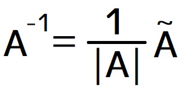

[OpenGL 3D 2022 後期 第04回]

# RAII, 転置行列, 逆行列

## 習得目標

* RAII(リソースの取得は初期化である)技法の考え方を説明できる。
* バッファオブジェクトをCPU側のアドレスにマッピングする機能について、マッピングを行う関数の名前と使い方を説明できる。
* 転置行列の定義を説明できる。
* 逆行列の定義を説明できる。

## 1. バッファオブジェクトをクラスにする

### 1.1 VBOとIBOを管理するクラスを定義する

現在までに、VAO, テクスチャ, プログラムパイプライン, FBOという4種類のOpenGLオブジェクトの管理クラスを作成しました。これらの管理クラスはRAIIという技法を使って、オブジェクトの破棄を自動化しています。

改めて説明すると、RAII(アールエーアイアイ)は`Resource Acquisition Is Initialization`(リソース・アクイジション・イズ・イニシャリゼーション)の短縮形で、日本語では「リソースの取得は初期化である」という意味になります。

RAIIの考え方は、

>リソース(メモリやファイルハンドル)の取得と解放を、オブジェクトの初期化と破棄に紐づける

というものです。RAIIを使うことで、C言語ではやりがちな「メモリやファイルハンドルを解放し忘れる」ことがなくなります。

なお、RAIIは「オブジェクトが破棄されるときにデストラクタが呼ばれる言語」固有の技法です。デストラクタがないJavaや、デストラクタがあっても破棄のタイミングで呼ばれないC#では使えません(似たようなことはできます)。

そんな便利なRAIIですが、VBO, IBO, SSBOはまだクラスにしていないため、RAIIによる管理が行われていません。このままでは、今後プログラムを追加していく際、うっかり解放し忘れるかもしれません。

また、これらのバッファオブジェクトは、次回以降のテキストでも必要となります。そこで、これらのバッファオブジェクトもRAIIで管理するようにしておきましょう。

さて、VBO, IBO, SSBOは用途が異なるだけで、すべて「バッファオブジェクト」です。そのため、ひとつのクラスですべてを扱うことができます。しかし、実用上は「マップ機能」を使うかどうかによって設定が大きく異なります。

そこで、「マップしないバッファオブジェクト」用のクラスと、「マップするバッファオブジェクト」用のクラスの2つを作成することにします。

それでは、マップしないバッファオブジェクトから作成しましょう。クラス名は`BufferObject`(バッファ・オブジェクト)とします。

プロジェクトの`Src`フォルダに`BufferObject.h`という名前のヘッダファイルを追加してください。追加したファイルを開き、次のプログラムを追加してください。

```diff
+/**
+* @file BufferObject.h
+*/
+#ifndef BUFFEROBJECT_H_INCLUDED
+#define BUFFEROBJECT_H_INCLUDED
+#include "glad/glad.h"
+#include <memory>
+
+// 先行宣言
+class BufferObject;
+using BufferObjectPtr = std::shared_ptr<BufferObject>;
+
+/**
+* バッファオブジェクト
+*/
+class BufferObject
+{
+public:
+  static BufferObjectPtr Create(GLsizeiptr size,
+    const void* data = nullptr, GLbitfield flags = 0);
+
+  explicit BufferObject(GLsizeiptr size,
+    const void* data = nullptr, GLbitfield flags = 0);
+  ~BufferObject();
+
+  operator GLuint() const { return id; }
+  GLsizeiptr GetSize() const { return bufferSize; }
+
+private:
+  GLuint id = 0;
+  GLsizeiptr bufferSize = 0;
+};
+
+#endif // BUFFEROBJECT_H_INCLUDED
```

### 1.2 Create関数を定義する

それではメンバ関数を定義しましょう。プロジェクトの`Src`フォルダに`BufferObject.cpp`という名前のCPPファイルを追加してください。追加したファイルを開き、次のプログラムを追加してください。

```diff
+/**
+* @file BufferObject.cpp
+*/
+#include "BufferObject.h"
+#include "Debug.h"
+
+/**
+* バッファオブジェクトを作成する
+*
+* @param type        バッファオブジェクトの種類
+* @param size        バッファオブジェクトのバイトサイズ
+* @param data        バッファにコピーするデータのアドレス
+*                    不要な場合はnullptrを指定する
+* @param flags       使途を示すビットフラグの論理和(glBufferStorageを参照)
+*
+* @return 作成したバッファオブジェクトへのポインタ
+*/
+BufferObjectPtr BufferObject::Create(
+  GLsizeiptr size, const void* data, GLbitfield flags)
+{
+  return std::make_shared<BufferObject>(size, data, flags);
+}
```

`Create`メンバ関数は`shared_ptr`を作成して返すだけの関数です。

### 1.3 コンストラクタを定義する

続いてコンストラクタを定義します。`Create`メンバ関数の定義の下に、次のプログラムを追加してください。

```diff
 {
   return std::make_shared<BufferObject>(size, data, flags);
 }
+
+/**
+* コンストラクタ
+*
+* @param type        バッファオブジェクトの種類
+* @param size        バッファオブジェクトのバイトサイズ
+* @param data        バッファにコピーするデータのアドレス
+*                    不要な場合はnullptrを指定する
+* @param flags       使途を示すビットフラグの論理和(glBufferStorageを参照)
+*/
+BufferObject::BufferObject(
+  GLsizeiptr size, const void* data, GLbitfield flags) :
+  bufferSize(size)
+{
+  glCreateBuffers(1, &id);
+  glNamedBufferStorage(id, bufferSize, data, flags);
+}
```

コンストラクタでは`glCreateBuffers`関数によってバッファオブジェクトを作成し、`glNamedBufferStorage`関数を使ってGPUメモリを確保します。

### 1.4 デストラクタを定義する

最後にデストラクタを定義します。コンストラクタの定義の下に、次のプログラムを追加してください。

```diff
   glCreateBuffers(1, &id);
   glNamedBufferStorage(id, bufferSize, data, flags);
 }
+
+/**
+* デストラクタ
+*/
+BufferObject::~BufferObject()
+{
+  glDeleteBuffers(1, &id);
+}
```

デストラクタでは`glDeleteBuffers`関数によってバッファオブジェクトを削除します。これで`BufferObject`クラスは完成です。

### 1.5 VBO, IBOをBufferObjectクラスで置き換える

作成した`BufferObject`クラスで、`Engine`クラスのVBOとIBOを置き換えます。`Engine.h`を開き、`BufferObject.h`をインクルードしてください。

```diff
 #include "GameObject.h"
 #include "VecMath.h"
 #include "FramebufferObject.h"
+#include "BufferObject.h"
+#include "VertexArray.h"
 #include <GLFW/glfw3.h>
 #include <string>
```

次に`Engine`クラス定義にある、`vbo`, `ibo`, `vao`の3つのメンバ変数定義を、次のように変更してください。

```diff
   GLuint vs = 0; // 頂点シェーダの管理番号
   GLuint fs = 0; // フラグメントシェーダの管理番号
   ProgramPipelinePtr progSprite; // プログラムオブジェクトの管理番号

-  GLuint vbo = 0; // 頂点バッファの管理番号
-  GLuint ibo = 0; // インデックスバッファの管理番号
-  GLuint vao = 0; // 構成情報の管理番号
+  BufferObjectPtr vbo;
+  BufferObjectPtr ibo;
+  VertexArrayPtr vao;

   TexturePtr tex[2]; // テクスチャの管理番号
```

続いて`Engine.cpp`を開き、`Initailize`メンバ関数にあるVBO, IBO, VAOを作成するプログラムを、次のように変更してください。

```diff
     { 0.5f, 0.5f, 0, 1, 0},
     {-0.5f, 0.5f, 0, 0, 0},
   };
-  glCreateBuffers(1, &vbo);
-  glNamedBufferStorage(vbo, sizeof(vertexData), vertexData, 0);
+  vbo = BufferObject::Create(sizeof(vertexData), vertexData);

   // インデックスデータをGPUメモリにコピー
   const GLushort indexData[] = {
     0, 1, 2, 2, 3, 0,
   };
-  glCreateBuffers(1, &ibo);
-  glNamedBufferStorage(ibo, sizeof(indexData), indexData, 0);
+  ibo = BufferObject::Create(sizeof(indexData), indexData);

   // 頂点データの形式を設定
-  glCreateVertexArrays(1, &vao);
-  glBindVertexArray(vao);
-  glBindBuffer(GL_ARRAY_BUFFER, vbo);
-  glBindBuffer(GL_ELEMENT_ARRAY_BUFFER, ibo);
+  vao = VertexArray::Create();
+  glBindVertexArray(*vao);
+  glBindBuffer(GL_ARRAY_BUFFER, *vbo);
+  glBindBuffer(GL_ELEMENT_ARRAY_BUFFER, *ibo);
   glEnableVertexAttribArray(0);
   glVertexAttribPointer(0, 3, GL_FLOAT, GL_FALSE, sizeof(Vertex), 0);
```

<pre class="tnmai_assignment">
<strong>【課題01】</strong>
<code>vao</code>を使うコードがエラーになっているはずです。<code>*vao</code>に置き換えてエラーを解消しなさい。
</pre>

これで`Engine`クラスのVBO, IBO, VAOをクラスで置き換えることができました。プログラムが書けたらビルドして実行してください。問題なくゲームが遊べていたら成功です。

### 1.6 SSBOを管理するクラスを定義する

続いて、SSBOを管理するためのクラスを定義します。CPUメモリにマップされたバッファオブジェクトを扱うクラスなので、名前は`MappedBufferObject`(マップド・バッファ・オブジェクト)とします。

>Mapは「土地、物を地図に対応させる」という意味から派生して「あるものを別のなにかと対応させる」ことを意味します。

`BufferObject.h`を開き、次の先行宣言を追加してください。

```diff
 // 先行宣言
 class BufferObject;
 using BufferObjectPtr = std::shared_ptr<BufferObject>;
+class MappedBufferObject;
+using MappedBufferObjectPtr = std::shared_ptr<MappedBufferObject>;

 /**
 * バッファオブジェクト
```

次に、`BufferObject`クラスの定義の下に、`MappedBufferObject`クラスの定義を追加してください。

```diff
   GLuint id = 0;
   GLsizeiptr bufferSize = 0;
 };
+
+/**
+* バッファオブジェクト(マップあり)
+*/
+class MappedBufferObject
+{
+public:
+  static MappedBufferObjectPtr Create(
+    GLsizeiptr size, GLenum type, GLenum access);
+
+  MappedBufferObject(
+    GLsizeiptr size, GLenum type, GLenum access);
+  ~MappedBufferObject();
+
+  operator GLuint() const { return id; }
+  GLsizeiptr GetSize() const { return bufferSize; }
+
+  void WaitSync();
+  uint8_t* GetMappedAddress() const;
+  void Bind(GLuint index, size_t offset, size_t size);
+  void SwapBuffers();
+
+  GLenum GetType() const { return type; }
+
+private:
+  GLuint id = 0;
+  GLsizeiptr bufferSize = 0;
+
+  uint8_t* p = nullptr;          // データコピー先アドレス
+  size_t bufferIndex = 0;        // コピー先バッファのインデックス
+  GLsync syncList[2] = { 0, 0 }; // 同期オブジェクト
+  GLenum type = GL_ARRAY_BUFFER; // バッファの種類
+};

 #endif // BUFFEROBJECT_H_INCLUDED
```

`MappedBufferObject`クラスには、`BufferObject`クラスと同じ機能に加えて、マップしたバッファを制御するための機能を追加しています。これらは次のような順序で使うことを想定しています。

>1. WaitSync(ウェイト・シンク): PUメモリへのコピーの完了を待つ。
>2. GetMappedAddress(ゲット・マップド・アドレス): 取得したアドレスにデータをコピーする。
>3. Bind(バインド): GPUメモリを割り当てて描画に利用する。
>4. SwapBuffers(): コピー用と描画用のバッファを切り替える。

これらの関数の内容は、以前に作成したSSBO用のプログラムとほぼ同じです。「SSBO用のプログラムを関数にまとめたもの」と考えてください。

### 1.7 Create関数を定義する

それでは`Create`メンバ関数から定義していきましょう。`BufferObject`クラスのデストラクタの定義の下に、次のプログラムを追加してください。

```diff
 {
   glDeleteBuffers(1, &id);
 }
+
+/**
+* バッファオブジェクトを作成する
+*
+* @param size        バッファオブジェクトのバイトサイズ
+* @param type        バッファオブジェクトの種類
+* @param access      以下のいずれかを指定する
+*                    GL_READ_WRITE 読み取りと書き込みの両対応でマップする
+*                    GL_READ_ONLY  読み取り専用としてマップする
+*                    GL_WRITE_ONLY 書き込み専用としてマップする
+*
+* @return 作成したバッファオブジェクトへのポインタ
+*/
+MappedBufferObjectPtr MappedBufferObject::Create(
+  GLsizeiptr size, GLenum type, GLenum access)
+{
+  return std::make_shared<MappedBufferObject>(size, type, access);
+}
```

`Create`メンバ関数では、`make_shared`関数によってシェアードポインタを作成するだけです。

### 1.8 コンストラクタを定義する

次にコンストラクタを定義します。`Create`関数の定義の下に、次のプログラムを追加してください。

```diff
+
+/**
+* コンストラクタ
+*
+* @param size        バッファオブジェクトのバイトサイズ
+* @param type        バッファオブジェクトの種類
+* @param access      以下のいずれかを指定する
+*                    GL_READ_WRITE 読み取りと書き込みの両対応でマップする
+*                    GL_READ_ONLY  読み取り専用としてマップする
+*                    GL_WRITE_ONLY 書き込み専用としてマップする
+*/
+MappedBufferObject::MappedBufferObject(
+  GLsizeiptr size, GLenum type, GLenum access) :
+  type(type)
+{
+  // ダブルバッファのため、サイズを256バイト境界に繰り上げる
+  bufferSize = ((size + 255) / 256) * 256;
+
+  // アクセスの種類によってフラグを選択
+  GLbitfield flags = GL_MAP_PERSISTENT_BIT | GL_MAP_COHERENT_BIT;
+  switch (access) {
+  default:
+    LOG_ERROR("引数が間違っています(access=%d)", access);
+    [[fallthrough]];
+  case GL_READ_WRITE: flags |= GL_MAP_READ_BIT | GL_MAP_WRITE_BIT; break;
+  case GL_READ_ONLY:  flags |= GL_MAP_READ_BIT; break;
+  case GL_WRITE_ONLY: flags |= GL_MAP_WRITE_BIT; break;
+  }
+
+  // バッファオブジェクトを作成
+  glCreateBuffers(1, &id);
+  glNamedBufferStorage(id, bufferSize * 2, // ダブルバッファ用に2倍確保
+    nullptr, flags);
+
+  // GPUメモリをCPUメモリアドレスにマップする
+  p = static_cast<uint8_t*>(glMapNamedBuffer(id, access));
+}
```

最初に`size`を256バイトサイズに繰り上げています。OpenGLパラメータに、「バインド可能なアドレス境界」を表わす`GL_SHADER_STORAGE_BUFFER_OFFSET_ALIGNMENT`という値があるのですが、この値の最大値が256なためです。

この計算によって、ダブルバッファの境界を256バイトに合わせています。

次に、マップ可能なバッファオブジェクトを作成するためのフラグを作成しています。読み取りと描き込みの有無によって、異なるフラグを設定しなくてはなりません。

>常に`GL_READ_WRITE`を指定するという横着もできますが、メモリ効率や処理速度が悪化する場合がある(環境による)ため、おすすめしません。

### 1.9 デストラクタを定義する

次にデストラクタを定義します。`MappedBufferObject`コンストラクタの定義の下に、次のプログラムを追加してください。

```diff
+
+/**
+* デストラクタ
+*/
+MappedBufferObject::~MappedBufferObject()
+{
+  glDeleteBuffers(1, &id);
+}
```

デストラクタは`BufferObject`クラスと同じです。バッファオブジェクトを破棄すると、マップは自動的に解除されます。そのため、明示的なマップの解除はしていません。

### 1.10 WaitSync関数を定義する

ここからは`MappedBufferObject`クラスに固有のメンバ関数を定義していきます。`WaitSync`(ウェイト・シンク)メンバ関数から始めましょう。`MappedBufferObject`デストラクタの定義の下に、次のプログラムを追加してください。

```diff
 {
   glDeleteBuffers(1, &id);
 }
+
+/**
+* GPUがバッファを使い終わるのを待つ
+*/
+void MappedBufferObject::WaitSync()
+{
+  for (GLsync& sync = syncList[bufferIndex]; sync;) {
+    const GLuint64 timeout = 16'700'000; // 16.7ミリ秒(約1/60秒)
+    const GLenum status = glClientWaitSync(sync, 0, timeout);
+    if (status != GL_TIMEOUT_EXPIRED) {
+      // 使い終わった同期オブジェクトは削除しなくてはならない
+      glDeleteSync(sync);
+      sync = 0;
+      break;
+    }
+  } // for syncList
+}
```

このコードは、`Engine.cpp`の`MainLoop`メンバ関数にあるコードとほぼ同じです。同期オブジェクトが存在する場合、`glClientWaitSync`関数によって処理完了を待ちます。

### 1.11 GetMappedAdress関数を定義する

次に`GetMappedAddres`(ゲット・マップド・アドレス)メンバ関数を定義します。`WaitSync`メンバ関数の定義の下に、次のプログラムを追加してください。

```diff
     }
   } // for syncList
 }
+
+/**
+* データのコピー先アドレスを取得する
+*
+* @return コピー先アドレス
+*
+* コピー可能な範囲はGetSize()で取得できる
+*/
+uint8_t* MappedBufferObject::GetMappedAddress() const
+{
+  return p + bufferIndex * bufferSize;
+}
```

`bufferIndex`メンバ変数は、ダブルバッファのうち「CPUが読み書き可能」なバッファのアドレスを返します。

### 1.12 Bind関数を定義する

続いて`Bind`(バインド)メンバ関数を定義します。`GetMappedAddress`メンバ関数の定義の下に、次のプログラムを追加してください。

```diff
 {
   return p + bufferIndex * bufferSize;
 }
+
+/**
+* 指定した範囲をOpenGLコンテキストに割り当てる
+*
+* @param index  割り当てるバインディングポイント番号
+* @param offset 割り当て範囲の先頭位置
+* @param size   割り当て範囲のバイトサイズ
+*/
+void MappedBufferObject::Bind(
+  GLuint index, size_t offset, size_t size)
+{
+  offset += bufferIndex * bufferSize;
+  glBindBufferRange(type, index, id, offset, size);
+}
```

内部的には`glBindBufferRange`関数を呼んでいるだけです。これをメンバ関数としたのは、ダブルバッファのオフセットを計算する処理をまとめることで、計算を間違えたり入れ忘れたりする可能性をなくせると考えたからです。

### 1.13 SwapBuffers関数を定義する

最後に`SwapBuffers`メンバ関数を定義します。`Bind`メンバ関数の定義の下に、次のプログラムを追加してください。

```diff
   offset += bufferIndex * bufferSize;
   glBindBufferRange(type, index, id, offset, size);
 }
+
+/**
+* コピー先バッファを切り替える
+*/
+void MappedBufferObject::SwapBuffers()
+{
+  syncList[bufferIndex] =
+    glFenceSync(GL_SYNC_GPU_COMMANDS_COMPLETE, 0);
+
+  bufferIndex = (bufferIndex + 1) % 2;
+}
```

この関数は「同期オブジェクト」を作成してから、CPUから読み書き可能なバッファを示す`bufferIndex`メンバ変数を更新します。

これで`MappedBufferObject`クラスは完成です。

### 1.14 EngineクラスのSSBOをMappedBufferObjectで置き換える

作成した`MappedBufferObject`を使って、`Engine`クラスのSSBOに関するメンバ変数を整理しましょう。`Engine.h`を開き、`Engine`クラスの定義を次のように変更してください。

```diff
   const size_t maxSpriteCount = 100'000; // スプライトの最大数
   std::vector<Sprite> spriteListBg;  // 背景用
   std::vector<Sprite> spriteListObj; // 味方、敵、その他用
-
-  size_t spriteSsboSize = 0; // スプライト用SSBOのバイトサイズ
-  GLuint ssboSprite = 0;     // スプライト用SSBOの管理番号
-  size_t spriteSsboIndex = 0;     // コピー先バッファのインデックス
-  uint8_t* pSpriteSsbo = nullptr; // スプライトデータのコピー先アドレス
-  GLsync syncSpriteSsbo[2] = { 0, 0 }; // スプライト用SSBOの同期オブジェクト
+  MappedBufferObjectPtr ssboSprite;

   std::mt19937 rg;       // 疑似乱数を生成するオブジェクト
```

削除したメンバ変数の機能は、`MappedBufferObject`クラスがまとめて担当します。

続いて`Engine.cpp`を開き、`Initialize`メンバ関数にあるSSBOを作成するプログラムを、次のように変更してください。

```diff
   spriteListObj.reserve(10'000);

   // スプライト用のSSBOを作成
-  spriteSsboSize = CalcSsboSize(maxSpriteCount * sizeof(Sprite));
-  glCreateBuffers(1, &ssboSprite);
-  glNamedBufferStorage(ssboSprite,
-    spriteSsboSize * 2, // ダブルバッファのためにサイズを2倍にする
-    nullptr,
-    // コピー先アドレスを取得するためのフラグを指定
-    GL_MAP_PERSISTENT_BIT | GL_MAP_COHERENT_BIT | GL_MAP_WRITE_BIT);
-
-  // スプライトデータのコピー先アドレスを取得(マッピング)
-  pSpriteSsbo =
-    static_cast<uint8_t*>(glMapNamedBuffer(ssboSprite, GL_WRITE_ONLY));
+  ssboSprite = MappedBufferObject::Create(
+    CalcSsboSize(maxSpriteCount * sizeof(Sprite)),
+    GL_SHADER_STORAGE_BUFFER, GL_WRITE_ONLY);

   // 3Dモデル用のバッファを作成
   meshBuffer = Mesh::MeshBuffer::Create(3'000'000, 9'000'000);
```

次に、`MainLoop`メンバ関数にある「コピー先バッファを切り替える」処理から下を、次のように変更してください。

```diff
         }
       }
     } // if size

-    // コピー先バッファを切り替える
-    spriteSsboIndex = (spriteSsboIndex + 1) % 2;
-
     // GPUがバッファを使い終わるのを待つ
-    for (GLsync& sync = syncSpriteSsbo[spriteSsboIndex]; sync;) {
-      const GLuint64 timeout = 16'700'000; // 16.7ミリ秒(約1/60秒)
-      const GLenum status = glClientWaitSync(sync, 0, timeout);
-      if (status != GL_TIMEOUT_EXPIRED) {
-        // 使い終わった同期オブジェクトは削除しなくてはならない
-        glDeleteSync(sync);
-        sync = 0;
-        break;
-      }
-    }
+    ssboSprite->WaitSync();

     // スプライトデータをSSBOにコピー
     const std::vector<Sprite>* drawList[] = { &spriteListBg, &spriteListObj };
-    uint8_t* p = pSpriteSsbo + (spriteSsboIndex * spriteSsboSize);
+    uint8_t* p = ssboSprite->GetMappedAddress();
     for (size_t i = 0; i < std::size(drawList); ++i) {
       memcpy(p, drawList[i]->data(), drawList[i]->size() * sizeof(Sprite));
```

次に、少し下にある`spriteSsboOffset`変数の初期化を次のように変更してください。

```diff
     glProgramUniform4f(*progSprite, 2,
       2.0f / viewSize.x, 2.0f / viewSize.y, -1, -1);

     // スプライト配列を描画
-    size_t spriteSsboOffset = spriteSsboIndex * spriteSsboSize;
+    size_t spriteSsboOffset = 0;
     DrawSpriteList(*drawList[0], *tex[0], spriteSsboOffset);

     // 3Dメッシュを描画
```

ダブルバッファのオフセット計算は`MappedBufferObject`によって自動化されたので、利用する側ではダブルバッファを意識せずにコードを書くことができます。

さらに少し下に進むと「フェンスを作成」するプログラムがあります。この部分も次のように変更してください。

```diff
     // スプライト用SSBOの割り当てを解除する
     glBindBufferRange(GL_SHADER_STORAGE_BUFFER, 0, 0, 0, 0);

     // スプライト描画の直後にフェンスを作成
-    syncSpriteSsbo[spriteSsboIndex] =
-      glFenceSync(GL_SYNC_GPU_COMMANDS_COMPLETE, 0);
+    ssboSprite->SwapBuffers();

     // 音声ライブラリを更新
     Audio::Update();
```

最後に、`DrawSpriteList`メンバ関数を次のように変更してください。

```diff
   glBindTextures(0, 1, &tex);

   // スプライト用SSBOを割り当てる
-  glBindBufferRange(GL_SHADER_STORAGE_BUFFER, 0, ssboSprite,
-    spriteSsboOffset, static_cast<GLintptr>(size));
+  ssboSprite->Bind(0, spriteSsboOffset, size);
   spriteSsboOffset += size;

   // 図形を描画
```

これで`MappedBufferObject`クラスへの置き換えは完了です。SSBOを使うコードをクラスにまとめることで、プログラムがわかりやすくなったと思います。

プログラムが書けたらビルドして実行してください。問題なくゲームが遊べていたら成功です。

>**【1章のまとめ】**
>
>* RAIIは「リソースの取得と開放を、オブジェクトの初期化と破棄に紐づける」技法。
>* OpenGLのオブジェクトはRAIIに向いている。破棄のタイミングを気にせずに済むため扱いやすくなる。
>* マップしたいバッファオブジェクトは、ポインタや動機オブジェクトの管理が必要となるため、マップ不要なオブジェクトと比べて管理機能が複雑になる。

<div style="page-break-after: always"></div>

## 2. VecMathに機能を追加する

### 2.1 vec4からvec3を作成できるようにする

GLSLでは、あるベクトル型から、より小さいベクトル型への変換コンストラクタが用意されています。特に`vec4`から`vec3`への変換は、行列とベクトルの乗算結果を`vec3`に戻したい場合によく利用されます。

そこで、VecMathライブラリにもこの機能を追加します。`VecMath.h`を開き、次の先行宣言を追加してください。

```diff
 namespace VecMath {
+
+// 先行宣言
+struct vec3;
+struct vec4;
+struct mat3;
+struct mat4;

 inline constexpr float pi = 3.14159265f; // 円周率
 inline constexpr float invPi = 1 / pi;   // 円周率の逆数
```

次に`vec3`型の定義に次のプログラムを追加してください。

```diff
   explicit vec3(float s) : x(s), y(s), z(s) {}
   vec3(float x, float y, float z) : x(x), y(y), z(z) {}
   vec3(const vec2& xy, float z) : x(xy.x), y(xy.y), z(z) {}
+  explicit vec3(const vec4& v);

   // 加算
   vec3& operator+=(const vec3& other) {
```

次に、`vec4`型の定義の下に、次のプログラムを追加してください。

```diff
   float& operator[](size_t n) { return *(&x + n); }
   const float& operator[](size_t n) const { return *(&x + n); }
 };
+
+// vec4からvec3への変換コンストラクタ
+inline vec3::vec3(const vec4& v) :
+  x(v.x), y(v.y), z(v.z)
+{
+}

 /**
 * 3x3行列
```

関数定義を`vec4`型の定義より下に書くのは、そうしないと`vec4`型の定義が不明なので変換のやりようがないためです。

### 2.2 mat4からmat3を作成できるようにする

同様に、`mat4`から`mat3`に変換するコンストラクタを追加します。`mat3`型の定義に次のプログラムを追加してください。

```diff
     data[1] = vec3(0, s, 0);
     data[2] = vec3(0, 0, s);
   }
+  explicit mat3(const mat4& m);

   // 添字演算子
   vec3& operator[](size_t n) { return data[n]; }
```

次に、`mat4`型の定義の下に、次のプログラムを追加してください。

```diff
   static mat4 Orthogonal(float left, float right, float bottom, float top,
     float zNear, float zFar);
 };
+
+// mat4からmat3への変換コンストラクタ
+inline mat3::mat3(const mat4& m)
+{
+  data[0] = vec3(m[0]);
+  data[1] = vec3(m[1]);
+  data[2] = vec3(m[2]);
+}

 } // namespace VecMath
```

<pre class="tnmai_assignment">
<strong>【課題02】</strong>
<code>vec3</code>から<code>vec2</code>への変換コンストラクタを作成しなさい。
</pre>

### 2.3 転置行列を求める関数を定義する

3Dグラフィックスの計算では転置行列(てんちぎょうれつ)や逆行列(ぎゃくぎょうれつ)を使うことがあります。これらの関数も追加しましょう。`mat3`型の定義の下に、次のプログラムを追加してください。

```diff
   vec3& operator[](size_t n) { return data[n]; }
   const vec3& operator[](size_t n) const { return data[n]; }
 };
+
+mat3 transpose(const mat3& m); // 転置行列
+mat3 inverse(const mat3& m);   // 逆行列

 /**
 * 4x4行列
```

次に、転置行列を求める`transpose`(トランスポーズ)関数を定義します。転置行列の定義を次に示します。

>転置行列 = もとの行列の行と列の成分を入れ替えた(転置した)行列

転置行列を単独で使うことはあまりありませんが、逆行列などと組み合わせてさまざまな行列を作り出せる、とても重要な行列です。それでは、`VecMath.cpp`を開き、VecMath名前空間の先頭に次のプログラムを追加してください。

```diff
 #include "VecMath.h"

 namespace VecMath {
+
+/**
+* 転置行列を求める
+*/
+mat3 transpose(const mat3& m)
+{
+  mat3 t;
+
+  t[0][0] = m[0][0];
+  t[0][1] = m[1][0];
+  t[0][2] = m[2][0];
+
+  t[1][0] = m[0][1];
+  t[1][1] = m[1][1];
+  t[1][2] = m[2][1];
+
+  t[2][0] = m[0][2];
+  t[2][1] = m[1][2];
+  t[2][2] = m[2][2];
+
+  return t;
+}

 /**
 * 行列同士の乗算
```

行列の転置は「行と列を入れ替える」だけです。

<pre class="tnmai_assignment">
<strong>【課題03】</strong>
<code>mat4</code>の転置行列を求める関数を定義しなさい。関数名は<code>mat3</code>と同じ<code>transpose</code>としなさい。
</pre>

### 2.4 逆行列を求める関数を追加する

次に、逆行列を求める`inverse`(インバース)関数を追加します。逆行列の定義は次のようなものです。

>正方行列(せいほうぎょうれつ)Aに対して、右から掛けても左から掛けても結果が単位行列Eとなるような行列
>
>(正方行列 = 行と列の数が等しい行列)

行列をAとすると、逆行列はA⁻¹と書きます。上記の定義を数式にすると以下になります。

>AA⁻¹ = E<br>
>A⁻¹A = E

逆行列は「正方行列」の場合だけ計算可能です。そのため、2x2, 3x3, 4x4行列の逆行列はありえますが、2x3, 3x2, 3x4, 4x3行列の逆行列はありえません。

逆行列を求めるには「行列式(ぎょうれつしき)」と「余因子行列(よいんしぎょうれつ)」を使います。どちらも公式や計算方法が決まっているので、そのまま実装します。

行列をAとすると、行列式は|A|、余因子行列はÃ(Aの上に`~`を付ける)で表されます。これらを使った逆行列の定義は以下のようになります。

<p align="center">

</p>

ただし、正方行列であっても逆行列が存在するとは限りません。さらに「行列式の値が0以外」という条件が付きます。上の図から分かるように、行列式が0の場合は割り算が成立しないためです。

とはいえ、3Dグラフィックスで扱う行列は、基本的には行列式が0以外になるものばかりです。そのため、「行列式が0かどうか」の判定がなくても問題ありません。

#### \[行列式\]

行列式は「行列から特定の方法計算された値」のことです。名前に「式」と付いていますが、実際には実数です。2x2と3x3の行列式は次の公式で計算できます。

>```txt
>2次(2x2行列)の行列式:
>| a00 a01 |
>| a10 a11 | = a00 * a11 - a01 * a10
>
>3次(3x3行列)の行列式:
>| a00 a01 a02 |
>| a10 a11 a12 | = (a00 * a11 * a22) + (a01 * a12 * a20) + (a02 * a10 * a21)  
>| a20 a21 a22 |     - (a02 * a11 * a20) - (a01 * a10 * a22) - (a00 * a12 * a21)
>```

4次以上の行列には簡単な公式はありません。しかし、次に述べる「余因子(よいんし)」を利用した「余因子展開」という方法で計算可能です。

#### \[余因子行列\]

余因子行列は、「成分の余因子を行列にまとめて転置した行列」のことです。i行j列の成分Aijの「余因子(よいんし)」は、行列からi行とj列を除いた成分からなる「小行列(しょうぎょうれつ)の行列式」に「符号」を付けた値です。

余因子の「符号」は「-1のi+j乗」です。例えば、3x3行列の成分a00の余因子は次のように求められます。

>```txt
>| a00 a01 a02 |                   a00の小行列    a00の行列式
>| a10 a11 a12 | -(0行0列を除く)->| a11 a12 | --> a11 * a22 - a12 * a21
>| a20 a21 a22 |                 | a21 a22 |
>
>-1^(i+j) = -1^0 = 1なので符号は+、つまり
>
>a00の余因子 = +(a11 * a22 - a12 * a21)
>```

<div style="page-break-after: always"></div>

同様に、成分a12の余因子は次のように求められます。

>```txt
>| a00 a01 a02 |                  a12の小行列     a12の行列式
>| a10 a11 a12 | -(1行1列を除く)->| a00 a01 | --> a00 * a21 - a01 * a20
>| a20 a21 a22 |                 | a20 a21 |
>
>-1^(i+j) = -1^3 = -1なので符号は-、つまり
>
>a12の余因子 = -(a00 * a21 - a01 * a20)
>```

この計算をa00～a22までの全ての成分について行い、求めた余因子をまとめて行列にします。各成分の余因子をa'ij(エーダッシュ・アイ・ジェー)とすると、これは次のようになります

>```txt
>| a'00 a'01 a'02 |
>| a'10 a'11 a'12 |
>| a'20 a'21 a'22 |
>```

これを転置すれば「余因子行列」の完成です。

>```txt
>成分を余因子で置換            余因子行列
>| a'00 a'01 a'02 |           | a'00 a'10 a'20 |
>| a'10 a'11 a'12 | -(転置)-> | a'01 a'11 a'21 |
>| a'20 a'21 a'22 |           | a'02 a'12 a'22 |
>```

それでは`inverse`関数を実装しましょう。`Transpose`関数の定義の下に、次のプログラムを追加してください。

```diff
   t[2][2] = m[2][2];
 
   return t;
 }
+
+/**
+* 逆行列を求める
+*/
+mat3 inverse(const mat3& m)
+{
+  // 余因子行列を計算
+  mat3 adjugate;
+  adjugate[0][0] =  m[1][1] * m[2][2] - m[1][2] * m[2][1];
+  adjugate[0][1] = -m[0][1] * m[2][2] + m[0][2] * m[2][1];
+  adjugate[0][2] =  m[0][1] * m[1][2] - m[0][2] * m[1][1];
+
+  adjugate[1][0] = -m[1][0] * m[2][2] + m[1][2] * m[2][0];
+  adjugate[1][1] =  m[0][0] * m[2][2] - m[0][2] * m[2][0];
+  adjugate[1][2] = -m[0][0] * m[1][2] + m[0][2] * m[1][0];
+
+  adjugate[2][0] =  m[1][0] * m[2][1] - m[1][1] * m[2][0];
+  adjugate[2][1] = -m[0][0] * m[2][1] + m[0][1] * m[2][0];
+  adjugate[2][2] =  m[0][0] * m[1][1] - m[0][1] * m[1][0];
+
+  // 行列式を計算
+  const float det =
+    m[0][0] * m[1][1] * m[2][2] - m[0][0] * m[1][2] * m[2][1] +
+    m[0][1] * m[1][2] * m[2][0] - m[0][1] * m[1][0] * m[2][2] +
+    m[0][2] * m[1][0] * m[2][1] - m[0][2] * m[1][1] * m[2][0];
+
+  // 行列式の逆数を掛ける
+  const float invDet = 1.0f / det;
+  adjugate[0] *= invDet;
+  adjugate[1] *= invDet;
+  adjugate[2] *= invDet;
+
+  return adjugate;
+}

 /**
 * 行列同士の乗算
```
A⁻¹

>`adjugate`(アジュゲート)は「余因子行列」という意味です。<br>`det`(デト)は`determinant`(デターミナント)の短縮形で「行列式」という意味です。

<pre class="tnmai_assignment">
<strong>【課題04】</strong>
<code>mat4</code>の逆行列を求める関数を定義しなさい。関数名は<code>mat3</code>と同じ<code>inverse</code>としなさい。
※この課題の難易度は高めです。普通に実装する場合、まず「余因子展開」について検索する必要があるでしょう。他に、「逆行列 4x4」などのワードで検索して、見つかった数式や実装を参考に定義する方法もあります。
</pre>

### 2.5 透視投影行列を求める関数を定義する

最後に、透視投影行列を求める`Perspeitive`(パースペクティブ)関数を定義します。
`VecMath.h`を開き、`mat4`型の定義に次のプログラムを追加してください。

```diff
   static mat4 LookAt(const vec3& eye, const vec3& target, const vec3& up);
   static mat4 Orthogonal(float left, float right, float bottom, float top,
     float zNear, float zFar);
+  static mat4 Perspective(float fovy, float aspectRatio, float zNear, float zFar);
 };
```

次に`VecMath.cpp`を開き、`Orthogonal`関数の定義の下に、次のプログラムを追加してください。

```diff
   m[3][2] = -(zFar + zNear) / (zFar - zNear);
   return m;
 }
+
+/**
+* 透視投影行列を作成する
+*
+* @param fovy        垂直視野角(ラジアン)
+* @param aspectRatio 垂直視野角に対する水平視野角の比率
+* @param zNear       描画範囲に含まれる最小Z座標
+* @param zFar        描画範囲に含まれる最大Z座標
+*/
+mat4 mat4::Perspective(float fovy, float aspectRatio, float zNear, float zFar)
+{
+  const float tanHalfFovy = tan(fovy / 2);
+
+  mat4 Result(0);
+  Result[0][0] = 1 / (aspectRatio * tanHalfFovy);
+  Result[1][1] = 1 / (tanHalfFovy);
+  Result[2][2] = -(zFar + zNear) / (zFar - zNear);
+  Result[2][3] = -1;
+  Result[3][2] = -(2 * zFar * zNear) / (zFar - zNear);
+  return Result;
+}

 } // namespace VecMath
```

`Perspective`関数の内容は、以前`Camera`コンポーネントに実装した遠近法と視野角の拡大率の計算を、行列で表現したものになっています。見比べてみると、同じ式が出てきているのが分かると思います。

>**【2章のまとめ】**
>
>* より大きいベクトル型や行列型から、より小さいベクトル型や行列型に簡単に変換する機能があると、コードが読みやすくなる。
>* 転置行列は、もとの行列の行と列を入れ替えた(転置した)行列のこと。
>* 逆行列は、もとの行列に掛けると結果が単位行列になる行列のこと。
>* 逆行列を求めるには「行列式」と「余因子行列」を使う。
