[OpenGL 3D 2022 後期 第05回]

# パーティクル(粒子)

## 習得目標

* パーティクル・システムを使うことで表現できる物体について説明できる。
* パーティクルとエミッターの違いを説明できる。
* より自然なパーティクルを定義するための調整項目について理解する。

## 1. パーティクル・システム

### 1.1 不定形な物体を表すには

<p align="center">
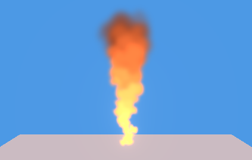 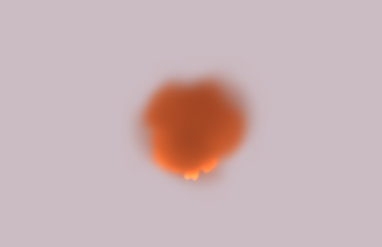<br>
[パーティクルによる炎の表現(左=前から 右=上から)]
</p>

現代の3Dグラフィックスでは、三角形(ポリゴン)を組み合わせることで物体を表現します。この方法は、明確に定義された表面を持つ多くの物体を表現できます。しかし、煙や炎のように、表面が不規則で、複雑で、不明確なものを表すことは得意ではありません。

古典的には、そういった不定形の物体はテクスチャに描いておき、四角メッシュに貼り付け、四角メッシュが常にカメラの方を向くように座標を変換する、という方法が使われました。これは現代でも使われている一般的なテクニックになっています。

しかし、この四角メッシュを使う方法は万能ではありません。例えば、炎を上から見下ろす、というような場合には使えません。

そこで考え出されたのが、炎や煙を粒子の集合としてとらえ、個々の粒子を四角メッシュで表示する方法です。この方法は、「粒子」を表す英単語「パーティクル(Particle)」から「パーティクル・システム(Particle System)」と呼ばれます。

パーティクル・システムでは、物体の大まかな形状は粒子の配置や動きによって定義されます。個々の粒子は三次元空間に配置されるので、どの方向からでも、それなりに正しい形に見えるのです。

個々のパーティクルが四角メッシュで表現されるという点において、パーティクルシステムはスプライトと似ています。しかし、次のようにスプライトと異なる点もあります。

>1. ほとんどのパーティクルは３次元空間に存在する。一方、スプライトは基本的に２次元空間に存在する。このため、パーティクル用の頂点シェーダは、スプライトとメッシュの中間的なものになる。
>2. パーティクルは比較的単純な動きしかしない。スプライトは個別に複雑な動作を設定できる。 ゲームオブジェクトのように複雑な機能を持たせないことで、大量のパーティクルを効率よく扱うことができる。

さて、パーティクルシステムの作成では、次に挙げるパーティクルを扱うクラスとシェーダを作成します。

>* パーティクルクラス
>* パーティクル生成クラス
>* パーティクル管理クラス
>* その他の補助的なクラスや構造体
>* 頂点シェーダ
>* フラグメントシェーダ

### 1.2 値を補間するクラスを定義する

それでは、パーティクルクラス用のファイルを追加し、必要なヘッダファイルをインクルードしましょう。プロジェクトの`Src`フォルダに`Particle.h`(パーティクル・エイチ)という名前のヘッダファイルを追加してください。

追加したファイルを開き、次のプログラムを追加してください。

```diff
+/**
+* @file Particle.h
+*/
+#ifndef PARTICLE_H_INCLUDED
+#define PARTICLE_H_INCLUDED
+#include "glad/glad.h"
+#include "Texture.h"
+#include "BufferObject.h"
+#include "VertexArray.h"
+#include "ProgramPipeline.h"
+#include "Sprite.h" // for Texcoord
+#include "VecMath.h"
+#include <vector>
+#include <memory>
+#include <random>
+
+// 先行宣言
+class Particle;
+class ParticleEmitter;
+using ParticleEmitterPtr = std::shared_ptr<ParticleEmitter>;
+class ParticleManager;
+using ParticleManagerPtr = std::shared_ptr<ParticleManager>;
+
+#endif // PARTICLE_H_INCLUDED
```

パーティクルシステムは「パーティクル専用の描画エンジン」なので、描画に必要なクラスはゲームエンジンとほぼ同じです。そのため、多くのヘッダファイルをインクルードする必要があります。

パーティクルには、座標、大きさ、角度、移動速度など、さまざまなパラメータがあります。こうした個々のパーティクル状態を表すパラメータは、時間経過によって変化します。そこで、値を補間するクラスを用意します。

「補間する」は英語で`Interporate`(インターポレート)なので、クラス名は`Interporator`(インターポレーター)とします。先行宣言の下に、次のプログラムを追加してください。

```diff
 using ParticleEmitterPtr = std::shared_ptr<ParticleEmitter>;
 class ParticleManager;
 using ParticleManagerPtr = std::shared_ptr<ParticleManager>;
+
+/**
+* 値の補間方法
+*/
+enum class InterporationType
+{
+  linear,    // 線形補間
+  easeIn,    // 徐々に加速
+  easeOut,   // 徐々に減速
+  easeInOut, // 徐々に加速し、徐々に減速する
+  none,      // 補間しない
+};
+
+/**
+* 値を補間する機能を持つクラス
+*/
+template<typename T>
+class Interporator
+{
+public:
+  Interporator() = default;
+  ~Interporator() = default;
+  explicit Interporator(const T& start) : start(start), end(start) {}
+  Interporator(const T& start, const T& end) : start(start), end(end) {}
+
+  // 値を設定する
+  void Set(const T& start, const T& end) {
+    this->start = start;
+    this->end = end;
+  }
+
+  // 引数t(範囲0.0～1.0)で補間した値を返す
+  T Interporate(float t) const {
+    switch (type) {
+    default:
+    case InterporationType::linear: return start + t * (end - start);
+    case InterporationType::none:   return start;
+    }
+  }
+
+  T start; // 補間開始時の値
+  T end;   // 補間終了時の値
+  InterporationType type = InterporationType::linear; // 補間方法
+};
+using Interporator1f = Interporator<float>;
+using Interporator2f = Interporator<VecMath::vec2>;
+using Interporator3f = Interporator<VecMath::vec3>;
+using Interporator4f = Interporator<VecMath::vec4>;

 #endif // PARTICLE_H_INCLUDED
```

さまざまな型に対して同じコードを書くのは手間がかかるため、クラステンプレートを使って無駄をはぶいています。

実際の補間は`Interporate`メンバ関数で行います。上記のプログラムでは、最低限必要な`linear`(リニア)補間方法と、補間を行わない`none`(ノン)の2種類だけを実装しています。

>その他の補間方法については「イージング」で検索すると実装例が見つかります。検索結果を参考にして、みなさん自身の手で実装してください。

### 1.3 パーティクルの動作を表わす構造体を定義する

作成した`Interporator`を使って、パーティクルの動作を表す構造体を定義します。

名前は`ParticleParameter`(パーティクル・パラメータ)とします。`Interporator`クラスの定義の下に、次のプログラムを追加してください。

```diff
 using Interporator2f = Interporator<VecMath::vec2>;
 using Interporator3f = Interporator<VecMath::vec3>;
 using Interporator4f = Interporator<VecMath::vec4>;
+
+/**
+* パーティクルの動作を定義するパラメータ
+*/
+struct ParticleParameter
+{
+  float lifetime = 1;           // 生存期間
+  Texcoord tc = { 0, 0, 1, 1 }; // テクスチャ座標
+  Interporator1f radial   = Interporator1f(10);             // 半径方向の速度
+  Interporator3f velocity = Interporator3f({ 0, 0, 0 });    // 速度
+  Interporator2f scale    = Interporator2f({ 1, 1 });       // 大きさ
+  Interporator1f rotation = Interporator1f(0);              // 回転
+  Interporator4f color    = Interporator4f({ 1, 1, 1, 1 }); // 色と不透明度
+};

 #endif // PARTICLE_H_INCLUDED
```

今回は、ある程度の動作をアニメーションできるように、速度、大きさ、回転、色の4つを補間パラメータとしました。

速度には2つの種類があります。

>* `radial`(ラジアル): 中心から放出点へ向かう速度。パーティクルを、エミッターの中心から放射状に放出したい場合に設定。
>* `velocity`(ベロシティ): ローカル座標系の速度ベクトル。パーティクルを、特定の向きに放出したい場合に設定。

### 1.4 パーティクルの生成パラメータを表わす構造体を定義する。

一般的に、パーティクルシステムは複数のパーティクルを放出します。そのために、放出する範囲や方向、放出頻度、重力の有無といった「生成パラメータ」が必要となります。「放出」は英語で`Emit`(エミット)といいます。そして、放出を管理するオブジェクトのことを`Emitter`
(エミッター)といいます。

パーティクルの放出範囲はプログラム次第で自由に設定できます。本テキストでは「球」と「直方体」の2つの放出範囲を実装します(必要に応じて形状を追加するとよいでしょう)。

形状は列挙型で定義します。名前は`ParticleEmitterShape`(パーティクル・エミッター・シェイプ)とします。`ParticleParameter`構造体の定義の下に、次のプログラムを追加してください。

```diff
   Interporator1f rotation = Interporator1f(0);              // 回転
   Interporator4f color    = Interporator4f({ 1, 1, 1, 1 }); // 色と不透明度
 };
+
+/**
+* エミッターの形状
+*/
+enum class ParticleEmitterShape
+{
+  sphere, // 球
+  box,    // 直方体
+};

 #endif // PARTICLE_H_INCLUDED
```

エミッターの生成パラメータの名前は`ParticleEmitterParameter`(パーティクル・エミッター・パラメータ)とします。`ParticleEmitterShape`列挙型の定義の下に、次のプログラムを追加してください。

```diff
   sphere, // 球
   box,    // 直方体
 };
+
+/**
+* パーティクル・エミッターのパラメーター
+*/
+struct ParticleEmitterParameter
+{
+  std::string name;      // エミッター名
+  float gravity = -9.8f; // 重力
+
+  // 画像とブレンド係数
+  std::string imagePath;          // テクスチャ・ファイル名
+  VecMath::vec2 tiles = { 1, 1 }; // テクスチャの縦と横の分割数
+  GLenum srcFactor = GL_SRC_ALPHA;           // ブレンド係数
+  GLenum dstFactor = GL_ONE_MINUS_SRC_ALPHA; // ブレンド係数
+
+  // 放出時間と放出頻度
+  float duration = 1.0f; // パーティクルを放出する秒数
+  bool loop = false; // duration経過後の動作(true=ループ, false=停止)
+  float emissionsPerSecond = 10; // 秒あたりのパーティクル放出数
+
+  // 放出範囲の形状
+  VecMath::vec3 position = { 0, 0, 0 }; // 座標
+  VecMath::vec3 rotation = { 0, 0, 0 }; // 回転
+  ParticleEmitterShape shape = ParticleEmitterShape::sphere; // 形状
+  float randomizeDirection = 0; // 放出方向の乱数性(0=なし 1=完全ランダム)
+  union {
+    struct Sphere {
+      float radius = 1;    // 球の半径
+      float thickness = 1; // 球殻の厚み(0=最薄 1=中心までぎっしり)
+    } sphere;
+    struct Box {
+      VecMath::vec3 size = { 1, 1, 1 }; // 直方体のサイズ
+    } box;
+  };
+};

 #endif // PARTICLE_H_INCLUDED
```

放出範囲の形状パラメータは「無名共用体」として定義しています。共用体のどのメンバが有効なのかは`shape`(シェイプ)メンバ変数で指定します。

C++では、共用体を`std::vector`などで使えるようにするには、コンストラクタでいずれかのメンバを選んで初期化しなくてはなりません。`ParticleEmitterParameter`構造体の定義に次のプログラムを追加してください。

```diff
       VecMath::vec3 size = { 1, 1, 1 }; // 直方体のサイズ
     } box;
   };
+
+  // コンストラクタ・デストラクタ
+  ParticleEmitterParameter() : sphere({1, 1}) {}
+  ~ParticleEmitterParameter() = default;
 };

 #endif // PARTICLE_H_INCLUDED
```

それから、形状を設定するとき、`shape`メンバの指定を忘れる可能性があります。これを防ぐために、形状を設定するメンバ関数を用意することにします。デストラクタの定義の下に、次のプログラムを追加してください。

```diff
   // コンストラクタ・デストラクタ
   ParticleEmitterParameter() : sphere({1, 1}) {}
   ~ParticleEmitterParameter() = default;
+
+  // 放出範囲に球を指定する
+  void SetSphereShape(float radius, float thickness) {
+    shape = ParticleEmitterShape::sphere;
+    sphere.radius = radius;
+    sphere.thickness = thickness;
+  }
+
+  // 放出範囲に直方体を指定する
+  void SetBoxShape(const VecMath::vec3& size) {
+    shape = ParticleEmitterShape::box;
+    box.size = size;
+  }
 };

 #endif // PARTICLE_H_INCLUDED
```

### 1.5 パーティクルクラスを定義する

「パーティクルクラス」は、個々のパーティクルの状態を管理するクラスです。クラス名は
`Particle`(パーティクル)とします。`ParticleEmitterParameter`構造体の定義の下に、
次のプログラムを追加してください。

```diff
     shape = ParticleEmitterShape::box;
     box.size = size;
   }
 };
+
+/**
+* パーティクル
+*/
+class Particle
+{
+public:
+  friend ParticleManager;
+  friend ParticleEmitter;
+
+  Particle() = default;
+  ~Particle() = default;
+
+  // 生存期間の比率
+  float GetLifetimeRatio() const {
+    const float t = 1 - lifetime / pParameter->lifetime;
+    return std::clamp(t, 0.0f, 1.0f);
+  }
+
+  // true=死亡, false=生存
+  bool IsDead() const { return lifetime <= 0; }
+
+private:
+  // 変化しないパラメータ
+  const ParticleParameter* pp;          // 基本パラメータ
+  VecMath::vec3 radialDirection = { 1, 0, 0 }; // 中心からの向き
+  Interporator3f velocity = Interporator3f({ 0, 0, 0 }); // 速度
+  Texcoord tc = { 0, 0, 1, 1 };         // テクスチャ座標
+
+  // 変化するパラメータ
+  float lifetime = 0;                   // 生存期間
+  VecMath::vec3 position = { 0, 0, 0 }; // 座標
+  float gravityAccel = 0;               // 重力による加速度の合計
+  float gravitySpeed = 0;               // 重力による速度の合計
+  float viewDepth = 0;                  // 視点からの深度値
+};

 #endif // PARTICLE_H_INCLUDED
```

重力は単純な補間では再現できないため、パーティクルパラメータとは別に用意することにしました。重力は`gravityAccel`(グラビティ・アクセル), `gravitySpeed`(グラビティ・スピード)メンバ変数の2つで管理します。

`gravityAccel`は重力加速度によって蓄積された総加速度を示します。`gravityAccel`は毎フレーム`gravitySpeed`に加算されます。つまり`gravitySpeed`は重力加速度によって得られた速度を示します。

>これは重力を扱う方法のひとつです。他にもさまざまな方法が考えられます。意図したとおりに機能するならどんな方法でも正解です。

`viewDepth`(ビュー・デプス)メンバ変数は、視点から見た深度値です。半透明描画では「奥から手前」の順で描画する必要があるため、`viewDepth`を使ってソートします。

### 1.6 エミッタークラスを定義する

次に「パーティクル生成クラス」を定義します。クラス名は`ParticleEmitter`(パーティクル・エミッター)とします。`Particle`クラスの定義の下に、次のプログラムを追加してください。

```diff
   float gravitySpeed = 0; // 重力による速度の合計
   float viewDepth = 0;    // 視点からの深度値
 };
+
+/**
+* パーティクル放出クラス
+*/
+class ParticleEmitter
+{
+public:
+  friend ParticleManager;
+
+  ParticleEmitter(const ParticleEmitterParameter& ep,
+    const ParticleParameter& pp, ParticleManager* pManager);
+  ~ParticleEmitter() = default;
+  ParticleEmitter(const ParticleEmitter&) = delete;
+  ParticleEmitter& operator=(const ParticleEmitter&) = delete;
+
+  void Update(const VecMath::mat4& matView, float deltatime);
+  void Die() { ep.loop = false; ep.duration = 0; }
+  bool IsDead() const { return !ep.loop && timer >= ep.duration && particles.empty(); }
+
+  // パラメータの取得・設定
+  ParticleEmitterParameter& GetEmitterParameter() { return ep; }
+  const ParticleEmitterParameter& GetEmitterParameter() const { return ep; }
+  ParticleParameter& GetParticleParameter() { return pp; }
+  const ParticleParameter& GetParticleParameter() const { return pp; }
+
+private:
+  void AddParticle();
+
+  ParticleEmitterParameter ep; // エミッターのパラメーター
+  ParticleParameter pp;        // パーティクルのパラメーター
+  ParticleManager* pManager = nullptr; // 管理クラスのアドレス
+
+  TexturePtr texture;      // パーティクル用テクスチャ
+  float interval = 0;      // パーティクルの発生間隔(秒)
+  float timer = 0;         // 総経過時間(秒)
+  float emissionTimer = 0; // パーティクル発生タイマー(秒)
+  float viewDepth = 0;     // 視点からの深度値
+
+  std::vector<Particle*> particles; // パーティクルリスト
+  GLsizei dataCount = 0; // 描画するパーティクル数
+  size_t dataOffset = 0; // 描画の基準となる頂点のオフセット
+};

 #endif // PARTICLE_H_INCLUDED
```

エミッターは、パーティクルを生成・表示するためのパラメータを管理します。エミッターの状態を操作するには、`ParticleEmitterParameter`の値を直接変更します。

### 1.7 パーティクル管理クラスを定義する

最後に、パーティクルを管理するクラスを定義します。クラス名は`ParticleManager`(パーティクル・マネージャ)とします。`ParticleEmitter`クラスの定義の下に、次のプログラムを追加してください。

```diff
+
+/**
+* パーティクル管理クラス
+*/
+class ParticleManager
+{
+public:
+  static ParticleManagerPtr Create(size_t maxParticleCount);
+
+  explicit ParticleManager(size_t maxParticleCount);
+  ~ParticleManager();
+  ParticleManager(const ParticleManager&) = delete;
+  ParticleManager& operator=(const ParticleManager&) = delete;
+
+  void Update(const VecMath::mat4& matView, float deltatime);
+  void UpdateSSBO();
+  void Draw(const VecMath::mat4& matProj, const VecMath::mat4& matView);
+
+  // エミッターの管理
+  ParticleEmitterPtr AddEmitter(
+    const ParticleEmitterParameter& ep, const ParticleParameter& pp);
+  ParticleEmitterPtr FindEmitter(const std::string& name) const;
+  void RemoveEmitter(const ParticleEmitterPtr&);
+  void RemoveEmitterAll();
+
+  // パーティクルの管理
+  Particle* AllocateParticle();
+  void DeallocateParticle(Particle* p);
+
+  // 乱数の生成
+  int RandomInt(int min, int max) {
+    return std::uniform_int_distribution<>(min, max)(randomEngine);
+  }
+  float RandomFloat(float min, float max) {
+    return std::uniform_real_distribution<float>(min, max)(randomEngine);
+  }
+
+private:
+  std::vector<ParticleEmitterPtr> emitters; // エミッターのリスト
+  std::vector<Particle> particles; // パーティクルのリスト
+  std::vector<Particle*> freeParticles; // 未使用パーティクルのリスト
+
+  size_t maxParticleCount = 0; // 生成可能な最大パーティクル数
+  BufferObjectPtr vbo;
+  BufferObjectPtr ibo;
+  VertexArrayPtr vao;
+  ProgramPipelinePtr program;
+  MappedBufferObjectPtr ssbo;
+  std::mt19937 randomEngine;
+};

 #endif // PARTICLE_H_INCLUDED
```

`ParticleManager`クラスは、エミッターとパーティクルの両方を管理し、パーティクルの描画を行います。また、エミッターで使用する乱数の生成も担当します。

これでヘッダファイルの定義は完了です。

<div style="page-break-after: always"></div>

>**【最初から完璧を求めない】**<br>
>本テキストでは、構造体やクラスの定義は完成形だけをお見せしています。しかし、実際にこの形になるまでには、何度も試行錯誤を繰り返しています。プログラムは最初から完成形にならないのが普通です。ですから、「とりあえず作って動かしてみる」ことが大切です。

### 1.8 ParticleEmitterコンストラクタを定義する

ここからはメンバ関数を定義していきます。`ParticleEmitter`コンストラクタから始めましょう。プロジェクトの`Src`フォルダに`Particle.cpp`という名前のCPPファイルを追加してください。追加したファイルを開き、次のプログラムを追加してください。

```diff
+/**
+* @file Particle.cpp
+*/
+#include "Particle.h"
+#include "Debug.h"
+#include <algorithm>
+
+using namespace VecMath;
+
+/**
+* コンストラクタ
+*
+* @param ep       エミッターの初期化パラメータ
+* @param pp       パーティクルの初期化パラメータ
+* @param pManager 管理オブジェクトのアドレス
+*/
+ParticleEmitter::ParticleEmitter(const ParticleEmitterParameter& ep,
+  const ParticleParameter& pp, ParticleManager* pManager) :
+  ep(ep), pp(pp), pManager(pManager), interval(1.0f / ep.emissionsPerSecond)
+{
+  texture = Texture::Create(ep.imagePath.c_str(), GL_LINEAR);
+}
```

コンストラクタではパラメータを設定し、それからテクスチャを作成します。

### 1.9 Updateメンバ関数を定義する

次に`Update`メンバ関数を定義します。すこし長いコードになるので、少しずつ書いていきます。`ParticleEmitter`コンストラクタの定義の下に、次のプログラムを追加してください。

```diff
 {
   texture = Texture::Create(ep.imagePath.c_str(), GL_LINEAR);
 }
+
+/**
+* エミッターの管理下にあるパーティクルの状態を更新する
+*
+* @param matView    描画に使用するビュー行列
+* @param deltaTime  前回の更新からの経過時間(秒)
+*/
+void ParticleEmitter::Update(const VecMath::mat4& matView, float deltaTime)
+{
+  // 管理オブジェクトが未設定なら何もしない
+  if ( ! pManager) {
+    return;
+  }
+}
```

まず、管理オブジェクトが未設定の場合は何もしません。パーティクルが描画されないのに更新処理を行う必要はないからです。

管理オブジェクトが設定されている場合は更新を継続します。管理オブジェクトの有無を判定するプログラムの下に、次のプログラムを追加してください。

```diff
   if ( ! pManager) {
     return;
   }
+
+  // 時間を経過させる
+  timer += deltaTime;
+  if (timer >= ep.duration) {
+    if (ep.loop) {
+      timer -= ep.duration;
+      emissionTimer -= ep.duration;
+    } else {
+      timer = ep.duration;
+    }
+  }
+  // ソートに使う「視点からの深度値」を計算
+  viewDepth = (matView * vec4(ep.position, 1)).z;
 }
```

このプログラムは、総経過時間を示す`timer`(タイマー)に`deltaTime`(デルタタイム)を加算することで、時間の経過を表現します。

そして、総経過時間が`duration`(デュレーション、「期限」という意味)を超えたらパーティクルの放出を終了します。ただし、`loop`(ループ)フラグが`true`の場合は経過時間をリセットします。

さらに、ソートに使用する「視点からの深度値」を求めます。半透明を適切に描画するには、「奥から手前」の順番で描画する必要があるためです。

すべてのパーティクルをまとめてソートできるのが理想ですが、実際にはテクスチャや描画設定が異なると描画命令をやり直す必要があるため、エミッター単位で描画することが多いです。

そこで、本テキストでは全てのエミッターを「奥から手前」にソートし、エミッターごとに管理するパーティクルを「奥から手前」にソートする、という2段構えの実装を使うことにしました。

次に、時間経過によってパーティクルを放出する処理を追加します。視点からの深度値を計算するプログラムの下に、次のプログラムを追加してください。


```diff
   // ソートに使う「視点からの深度値」を計算
   viewDepth = (matView * vec4(ep.position, 1)).z;
+
+  // パーティクルの放出
+  for (; timer - emissionTimer >= interval; emissionTimer += interval) {
+    AddParticle();
+  }
 }
```

`timer`と`emissionTimer`(エミッション・タイマー)の差が`interval`(インターバル)以上なら、新規パーティクルを生成します。`interval`は「パーティクル生成間隔」を示します。パーティクルの生成は後述する`AddParticle`(アド・パーティクル)メンバ関数で行います。

続いて、自身が放出したパーティクルの状態を更新します。パーティクルを放出するプログラムの下に、次のプログラムを追加してください。

```diff
   for (; timer - emissionTimer >= interval; emissionTimer += interval) {
     AddParticle();
   }
+
+  // パーティクルの更新
+  for (auto e : particles) {
+    if (e->lifetime <= 0) {
+      continue;
+    }
+    e->lifetime -= deltaTime;
+
+    // 速度を計算
+    const float t = e->GetLifetimeRatio();
+    vec3 velocity = e->velocity.Interporate(t);
+
+    // 半径方向の速度を計算
+    velocity += e->radialDirection * e->pp->radial.Interporate(t);
+
+    // 重力による加速度と速度を更新
+    e->gravityAccel += ep.gravity * deltaTime; // 加速度
+    e->gravitySpeed += e->gravityAccel * deltaTime; // 速度
+    velocity.z += e->gravitySpeed;
+
+    // 座標を更新
+    e->position += velocity * deltaTime;
+
+    // ソートに使う「視点からの深度値」を計算
+    e->viewDepth = (matView * vec4(e->position, 1)).z;
+  }
 }
```

このプログラムでは、パーティクルの生存期間を更新し、次に速度と座標、視点からの深度値を更新します。

続いて、死んているパーティクルを削除します。パーティクルを更新するプログラムの下に、次のプログラムを追加してください。

```diff
     // ソートに使う「視点からの深度値」を計算
     e->viewDepth = (matView * vec4(e->position, 1)).z;
   }
+
+  // 死んでいるパーティクルを削除
+  auto itr = std::partition(particles.begin(), particles.end(),
+    [](const Particle* p) { return !p->IsDead(); });
+  for (auto i = itr; i != particles.end(); ++i) {
+    pManager->DeallocateParticle(*i); // パーティクルを返却
+  }
+  particles.erase(itr, particles.end());
 }
```

パーティクルの削除には、ゲームオブジェクトでも使用した`std::partition`と
`vector::erase`の組み合わせを使います。

`erase`で削除する前に、`DeallocateParticle`(デアロケート・パーティクル)によって、パーティクルを返却している点に注意してください。

パーティクルはパーティクルシステムの内部で管理されます。そのため、スマートポインタを使わなくても比較的管理が簡単です。さらに大量に発生することから、スマートポインタを避けることによる高速化の価値が大きいのです。

最後にパーティクルを「視点からの深度値」でソートします。死んでいるパーティクルを削除するプログラムの下に、次のプログラムを追加してください。

```diff
     pManager->DeallocateParticle(*i);
   }
   particles.erase(itr, particles.end());
+
+  // パーティクルをソート
+  std::sort(particles.begin(), particles.end(),
+    [](const Particle* a, const Particle* b) { return a->viewDepth < b->viewDepth; });
 }
```

これで`Update`関数は完成です。

### 1.10 AddParticleメンバ関数を定義する

次にパーティクルを生成するメンバ関数を定義します。`Update`関数の定義の下に、次のプログラムを追加してください。

```diff
+
+/**
+* パーティクルを追加する
+*/
+void ParticleEmitter::AddParticle()
+{
+  // パーティクルを確保できなければ何もしない
+  Particle* particle = pManager->AllocateParticle();
+  if ( ! particle) {
+    return;
+  }
+}
```

`AllocateParticle`(アロケート・パーティクル)関数がnullptrを返した場合、これ以上パーティクルを生成できないので何もしません。

新しいパーティクルを確保できた場合は、各種パラメータを初期化します。最初に、エミッターのローカル座標系におけるパーティクル放出座標を計算します。パーティクルを確保するプログラムの下に、次のプログラムを追加してください。

```diff
   if ( ! particle) {
     return;
   }
+
+  // ローカル放出座標を計算
+  vec4 position = { 0, 0, 0, 1 };
+  switch (ep.shape) {
+  case ParticleEmitterShape::sphere: {
+    const float cosTheta = pManager->RandomFloat(-1, 1);
+    const float sinTheta = std::sqrt(1 - cosTheta * cosTheta);
+    const float phi = pManager->RandomFloat(0, 2 * pi);
+    // 球の体積の公式4/3πr^3から、半径ごとの放出頻度は半径の3乗根で求められる
+    // thicknessを3乗することで、3乗根を取ったとき最小値がthicknessと一致する
+    const float t = ep.sphere.thickness;
+    const float r0 = pManager->RandomFloat(1 - t * t * t, 1);
+    const float r = std::cbrt(r0) * ep.sphere.radius;
+    position.x = r * sinTheta * std::cos(phi);
+    position.y = r * sinTheta * std::sin(phi);
+    position.z = r * cosTheta;
+    break;
+  }
+  case ParticleEmitterShape::box:
+    position.x = pManager->RandomFloat(-ep.box.size.x, ep.box.size.x);
+    position.y = pManager->RandomFloat(-ep.box.size.y, ep.box.size.y);
+    position.z = pManager->RandomFloat(-ep.box.size.z, ep.box.size.z);
+    break;
+  }
 }
```

放出座標はランダムに決定します。直方体は簡単ですが、球体の場合はX軸回転とZ軸回転を組み合わせて計算する必要があります。また、球体内の放出座標の密度が一定になるように、三乗根関数`cbrt`によって、中心からの距離`r`を変形しています。

>三乗根を使うのは、物体の体積が3乗で表されるためです。

`thickness`(ティックネス)は放出範囲の厚みを示します。`tickness`が`0`なら球の表面から、`1`なら球の全域からパーティクルが放出されます。

次に、パーティクルのメンバ変数を初期化します。ローカル放出座標を計算するプログラムの下に、次のプログラムを追加してください。

```diff
     position.z = pManager->RandomFloat(-ep.box.size.z, ep.box.size.z);
     break;
   }
+
+  // Z->X->Yの順で回転を適用し、放出方向へ向ける行列を計算
+  const mat4 matRot = mat4::RotateY(ep.rotation.y) *
+    mat4::RotateX(ep.rotation.x) * mat4::RotateZ(ep.rotation.z);
+
+  // パーティクルのメンバ変数を初期化
+  particle->pp = &pp;
+  particle->lifetime = pp.lifetime;
+  particle->position = ep.position + vec3(matRot * position);
+  particle->radialDirection = normalize(particle->position - ep.position);
+  particle->gravityAccel = 0;
+  particle->gravitySpeed = 0;
+  particle->viewDepth = 0;
 }
```

>**【`pp`の生存期間について】**<br>
>個々のパーティクルは、エミッターの`pp`メンバ変数を<ruby>生<rt>なま</rt></ruby>ポインタで参照しています。そのため、もしエミッターが先に消滅してしまうと、`pp`は破棄されたオブジェクトを参照してしまいます。
>
>しかし、本プログラムの実装ではこの問題は起こりません。というのは、エミッターの寿命が「`duration`が経過し、さらに、管理下の全てのパーティクルが消滅するまで」となっているからです。このため、エミッターの寿命は「少なくともパーティクルの寿命以上」となることが保証されています。
>
>この例ように、寿命を適切に管理できる場合、スマートポインタを使わない選択肢もありうるということです。

続いて、パーティクルの移動方向をランダム化し、速度ベクトルを回転させます。ランダム化は、`randomizeDirection`(ランダマイズ・ディレクション)が`0`以外の場合に実行します。

```diff
   particle->gravityAccel = 0;
   particle->gravitySpeed = 0;
   particle->viewDepth = 0;
+
+  // 方向ランダム係数が0でなければ、移動方向にランダムを加える
+  if (ep.randomizeDirection) {
+    // 移動方向をランダム化する行列を計算
+    const float randomRange = pi * ep.randomizeDirection;
+    const mat4 matRandom =
+      mat4::RotateY(pManager->RandomFloat(-randomRange, randomRange)) *
+      mat4::RotateX(pManager->RandomFloat(-randomRange, randomRange)) *
+      mat4::RotateZ(pManager->RandomFloat(-randomRange, randomRange));
+    matRot *= matRandom; // 回転とランダムを合成
+    
+    // 半径方向をランダム化
+    particle->radialDirection = vec3(matRandom * vec4(particle->radialDirection, 1));
+  }
+  // 速度ベクトルを回転
+  particle->velocity.start = vec3(matRot * vec4(pp.velocity.start, 1));
+  particle->velocity.end = vec3(matRot * vec4(pp.velocity.end, 1));
 }
```

`randomizeDirection`は移動方向をランダム化する比率です。`0`ならランダム化なし、
`1`なら完全にランダムになります。`1`の場合、速度ベクトルの方向は無意味になります。
`0.5`なら半球状の範囲でランダムな方向が選ばれます。

ベロシティ(速度ベクトル)に回転行列を掛けることで、パーティクルの移動方向と放出方向を一致させています。

続いて、スプライトシート情報からテクスチャ座標を計算します。ベロシティを計算するプログラムの下に、次のプログラムを追加してください。

```diff
   // 速度ベクトルを回転
   particle->velocity.start = vec3(matRot * vec4(pp.velocity.start, 1));
   particle->velocity.end = vec3(matRot * vec4(pp.velocity.end, 1));
+
+  // タイル数が1より多い場合、ランダムにタイルを選択する
+  if (ep.tiles.x > 1 || ep.tiles.y > 1) {
+    const vec2 invTiles = 1.0f / ep.tiles;
+    const int u = pManager->RandomInt(0, static_cast<int>(ep.tiles.x) - 1);
+    const int v = pManager->RandomInt(0, static_cast<int>(ep.tiles.y) - 1);
+    particle->tc.u = static_cast<float>(u) * invTiles.x;
+    particle->tc.v = static_cast<float>(v) * invTiles.y;
+    particle->tc.sx = invTiles.x;
+    particle->tc.sy = invTiles.y;
+  }
 }
```

上記のプログラムでは、スプライトシートからランダムに選択したタイルをテクスチャ座標に設定しています。タイル数が1の場合、パーティクルパラメータで指定したテクスチャ座標がそのまま使われます。

「スプライトシート」はテクスチャを等間隔に分け、それぞれの領域(タイル)を個別のテクスチャとして扱います。今回作成するパーティクルシステムでは、`tiles`(タイルズ)に2以上の値を設定することでスプライトシートが有効になります。

例えば以下のように、4等分した範囲に異なる画像を指定し、`tiles = { 2, 2 }`とすると、4つの画像がランダムに選択されます。

<p align="center">
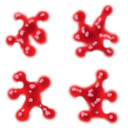<br>
[血しぶきテクスチャ]
</p>

>**【アニメーションについて】**<br>
>本テキストでは実装しませんが、スプライトシートにUnityのようなアニメーション機能を追加しても面白いでしょう。

最後に、エミッターのパーティクル管理リストに、作成したパーティクルを登録します。スプライトシートを処理するプログラムの下に、次のプログラムを追加してください。

```diff
     particle->tc.sx = invTiles.x;
     particle->tc.sy = invTiles.y;
   }
+
+  // エミッターの管理リストにパーティクルを追加
+  particles.push_back(particle);
 }
```

これで`ParticleEmitter`クラスは完成です。

### 1.11 GPU用の構造体を定義する

ここからは`ParticleManager`(パーティクル・マネージャ)クラスのメンバ関数を定義していきますが、その前に、VAOやSSBOのための構造体を作成しておきます。`Particle.cpp`の先頭付近にに次のプログラムを追加してください。

```diff
 #include <algorithm>

 using namespace VecMath;
+
+// 頂点データ構造体
+struct ParticleVertex
+{
+  float x, y; // 座標(XYのみ)
+  float u, v; // テクスチャ座標
+};
+
+// 画像表示用データを格納する構造体(float*16個=64バイト)
+struct ParticleData 
+{
+  vec4 position; // 座標(w要素は未使用)
+  vec2 scale;    // 拡大縮小
+  float cos;     // Z軸回転のcos
+  float sin;     // Z軸回転のsin
+  vec4 color;    // 色と不透明度
+  Texcoord texcoord; // テクスチャ座標
+};

 /**
 * コンストラクタ
```

`PerticleVertex`(パーティクル・バーテックス)はVBO, `PerticleData`(パーティクル・データ)はSSBO用の構造体です。

### 1.12 Createメンバ関数を定義する

それでは、`Create`(クリエイト)メンバ関数から定義していきましょう。`AddParticle`メンバ関数の定義の下に、次のプログラムを追加してください。

```diff
   // エミッターの管理リストにパーティクルを追加
   particles.push_back(particle);
 }
+
+/**
+* パーティクル管理オブジェクトを作成する
+*
+* @param maxParticleCount 表示可能なパーティクルの最大数
+*/
+ParticleManagerPtr ParticleManager::Create(size_t maxParticleCount)
+{
+  return std::make_shared<ParticleManager>(maxParticleCount);
+}
```

内容は、これまで作成してきた`Create`メンバ関数とほとんど同じです。

### 1.13 ParticleMangerコンストラクタを定義する

次に、コンストラクタを定義します。`Create`メンバ関数の定義の下に、次のプログラムを追加してください。

```diff
 {
   return std::make_shared<ParticleManager>(maxParticleCount);
 }
+
+/**
+* コンストラクタ
+*
+* @param maxParticleCount 表示可能なパーティクルの最大数
+*/
+ParticleManager::ParticleManager(size_t maxParticleCount) :
+  maxParticleCount(maxParticleCount)
+{
+  const ParticleVertex vertexData[] = {
+    {-0.5f,-0.5f, 0, 1},
+    { 0.5f,-0.5f, 1, 1},
+    { 0.5f, 0.5f, 1, 0},
+    {-0.5f, 0.5f, 0, 0},
+  };
+  vbo = BufferObject::Create(sizeof(vertexData), vertexData);
+
+  const GLushort indexData[] = { 0, 1, 2, 2, 3, 0 };
+  ibo = BufferObject::Create(sizeof(indexData), indexData);
+
+  vao = VertexArray::Create();
+
+  glBindVertexArray(*vao);
+  glBindBuffer(GL_ARRAY_BUFFER, *vbo);
+  glBindBuffer(GL_ELEMENT_ARRAY_BUFFER, *ibo);
+
+  glEnableVertexAttribArray(0);
+  glVertexAttribPointer(0, 2, GL_FLOAT, GL_FALSE, sizeof(ParticleVertex), 0);
+
+  glEnableVertexAttribArray(1);
+  glVertexAttribPointer(1, 2, GL_FLOAT, GL_FALSE, sizeof(ParticleVertex),
+    (const void*)offsetof(ParticleVertex, u));
+
+  glBindVertexArray(0);
+  glBindBuffer(GL_ARRAY_BUFFER, 0);
+  glBindBuffer(GL_ELEMENT_ARRAY_BUFFER, 0);
+
+  program = ProgramPipeline::Create("Res/particle.vert", "Res/particle.frag");
+  ssbo = MappedBufferObject::Create(maxParticleCount * sizeof(ParticleData),
+    GL_SHADER_STORAGE_BUFFER, GL_WRITE_ONLY);
+
+  // 必要なメモリ領域を確保
+  emitters.reserve(100);
+  particles.resize(maxParticleCount);
+
+  // 未使用パーティクルリストを作成
+  freeParticles.resize(maxParticleCount);
+  auto itr = particles.end();
+  for (auto& e : freeParticles) {
+    --itr;
+    e = &*itr;
+  }
+
+  // 乱数を初期化
+  std::random_device rd;
+  randomEngine.seed(rd());
+}
```

VBO, IBO, VAO, SSBOの作成は、これまで何度か行ってきたものとほとんど同じです。分かりにくい場合は、処理ごとにコメントを書いておくと良いでしょう。

`freeParticles`(フリー・パーティクルズ)は、全ての「未使用パーティクル」のポインタを保持します。パーティクルが必要になったら、`freeParticles`の末尾からポインタを取得します。

パーティクルが不要になったら、`freeParticles`の末尾にポインタを追加します。この仕組みによって、`particles`配列を動的に更新する処理が不要になります。

### 1.14 ParticleManagerデストラクタを定義する

続いて、デストラクタを定義します。`ParticleManager`コンストラクタの定義の下に、次のプログラムを追加してください。

```diff
   std::random_device rd;
   randomEngine.seed(rd());
 }
+
+/**
+* デストラクタ
+*/
+ParticleManager::~ParticleManager()
+{
+  // すべてのエミッターからマネージャのアドレスを消去する
+  for (auto& e : emitters) {
+    e->pManager = nullptr;
+  }
+}
```

デストラクタでは、全てのエミッターから管理オブジェクトへのポインタを削除します。これは、パーティクル管理オブジェクトが先に解放された場合、`pManager`が無効なポインタになることを防ぐためです。

エミッターはスマートポインタになっていて、パーティクルシステムの外部にあるオブジェクトに持たせることができます。その場合に無効なポインタになる可能性があるため、この処理を入れています。

### 1.15 Updateメンバ関数を定義する

次に、`Update`(アップデート)メンバ関数を定義します。`ParticleManager`デストラクタの定義の下に、次のプログラムを追加してください。

```diff
     e->pManager = nullptr;
   }
 }
+
+/**
+* パーティクルの状態を更新する
+*
+* @param  matView 描画に使用するビュー行列
+* @param deltaTime  前回の更新からの経過時間(秒)
+*/
+void ParticleManager::Update(const mat4& matView, float deltaTime)
+{
+  if (emitters.empty()) {
+    return;
+  }
+
+  // エミッターの更新
+  for (auto& e : emitters) {
+    e->Update(matView, deltaTime);
+  }
+
+  // 死んでいるエミッターを削除
+  auto itr = std::stable_partition(emitters.begin(), emitters.end(),
+    [](const ParticleEmitterPtr& e) { return !e->IsDead(); });
+  for (auto i = itr; i != emitters.end(); ++i) { (*i)->pManager = nullptr; }
+  emitters.erase(itr, emitters.end());
+
+  // エミッターをソート
+  std::stable_sort(emitters.begin(), emitters.end(),
+    [](const ParticleEmitterPtr& a, const ParticleEmitterPtr& b) {
+      return a->viewDepth < b->viewDepth; });
+}
```

基本的な処理内容はパーティクルの更新と同じです。大きな違いは、エミッターには更新関数があるのでそれを呼び出していることと、死んでいるエミッターを削除する過程で「管理オブジェクトへのポインタ」を削除していることです。

また、通常のソートを使うと、ソート結果が順不同になることでエフェクトがちらつく可能性があります。この問題を回避するため`stable`バージョンの関数を使っています。

### 1.16 UpdateSSBOメンバ関数を定義する

SSBOの更新は、エミッターの更新とは別の関数にしています。エミッターとSSBOでは更新対象が異なるため、分けたほうが分かりやすいと考えたからです。

関数名は`UpdateSSBO`(アップデート・エスエスビーオー)です。`Update`メンバ関数の定義の下に、次のプログラムを追加してください。

```diff
     [](const ParticleEmitterPtr& a, const ParticleEmitterPtr& b) {
       return a->viewDepth < b->viewDepth; });
 }
+
+/**
+* SSBOの内容を更新する
+*/
+void ParticleManager::UpdateSSBO()
+{
+  ssbo->WaitSync();
+
+  // 視点座標系で奥にあるエミッターからデータを設定
+  auto* begin = reinterpret_cast<ParticleData*>(ssbo->GetMappedAddress());
+  auto* pData = begin;
+  for (auto& e : emitters) {
+    // エミッターの描画用データ変数を更新
+    e->dataOffset = (pData - begin) * sizeof(ParticleData); // データの位置
+    e->dataCount = static_cast<GLsizei>(e->particles.size()); // データの数
+
+    // SSBOにデータを設定
+    for (const auto particle : e->particles) {
+      const float t = particle->GetLifetimeRatio();
+      pData->position = vec4(particle->position, 1);
+      pData->scale = particle->pp->scale.Interporate(t);
+      const float rotation = particle->pp->rotation.Interporate(t);
+      pData->cos = std::cos(rotation);
+      pData->sin = std::sin(rotation);
+      pData->color = particle->pp->color.Interporate(t);
+      pData->texcoord = particle->tc;
+      ++pData;
+    }
+
+    // 次のオフセットが256バイト境界になるように調整
+    pData += e->dataCount % 4;
+  }
+}
```

SSBOに設定するデータは`Interporate`(インターポレート)メンバ関数による補間値です。

`glBindBufferRange`に指定するオフセットは256バイト単位にする必要があります。そこで、ループの最後で`pData`を調整しています。4の剰余を使っているのは、`ParticleData`構造体のサイズが64バイトなので、4個で256バイトになるからです。

### 1.17 Drawメンバ関数を定義する

次に、パーティクルを描画する`Draw`(ドロー)メンバ関数を定義します。長めの関数なので少しずつ書いていきます。`UpdateSSBO`メンバ関数の定義の下に、次のプログラムを追加してください。

```diff
+
+/**
+* パーティクルを描画する
+*
+* @param  matProj 描画に使用するプロジェクション行列
+* @param  matView 描画に使用するビュー行列
+*/
+void ParticleManager::Draw(const mat4& matProj, const mat4& matView)
+{
+  if (emitters.empty()) {
+    return;
+  }
+
+  // 深度テスト有効、深度バッファへの書き込みは行わないように設定
+  glEnable(GL_DEPTH_TEST);
+  glDepthMask(GL_FALSE);
+
+  glEnable(GL_BLEND);
+  glDisable(GL_CULL_FACE);
+
+  glBindVertexArray(*vao);
+  glUseProgram(*program);
+}
```

ここでは描画の初期設定をしています。特に注意してもらいたいのは`glDepthMask`(ジーエル・デプス・マスク)関数です。

<p><code class="tnmai_code"><strong>【書式】</strong><br>
void glDepthMask(深度バッファへの書き込み許可フラグ);
</code></p>

`glDepthMask`関数に`GL_FALSE`を指定すると、深度バッファへの書き込みが禁止されます。これによって、「深度テストは実行するが、深度バッファへの書き込みは行わない」という動作を実現できます。

パーティクルのような半透明を伴う描画では、深度バッファへ書き込んでしまうと不自然な表示になることが多いため、書き込みを行わない設定が使われます。通常描画では書き込みを許可する必要があるので、あとで設定を戻さなくてはなりません。

次に、シェーダに行列を設定します(シェーダは後で作成します)。描画の初期設定を行うプログラムの下に、次のプログラムを追加してください。

```diff
   glBindVertexArray(*vao);
   glUseProgram(*program);
+
+  // シェーダにビュープロジェクション行列を設定
+  const GLint locMatVP = 1;
+  const mat4 matVP = matProj * matView;
+  glProgramUniformMatrix4fv(*program,
+    locMatVP, 1, GL_FALSE, &matVP[0][0]);
+
+  // シェーダにビルボード行列を設定
+  const GLint locMatBillboard = 2;
+  const mat3 matBillboard = inverse(transpose(inverse(mat3(matView))));
+  glProgramUniformMatrix3fv(*program,
+    locMatBillboard, 1, GL_FALSE, &matBillboard[0][0]);
 }
```

パーティクルは常にカメラの方向を向くように描画されます。このような、常にカメラの方向を向く四角形プリミティブのことを「ビルボード」と言います(ビルボードは「立て看板」や「掲示板」という意味です)。

ビルボードを描画するには、カメラの回転を無効化する必要があります。手順としては、逆行列の転置行列を求めることで回転行列を取り出し、さらに回転行列の逆行列を作成します。

これで描画の準備が整ったので、パーティクルを描画します。シェーダに行列を設定するプログラムの下に、次のプログラムを追加してください。

```diff
   const mat3 matBillboard = inverse(transpose(inverse(mat3(matView))));
   glProgramUniformMatrix3fv(*program,
     locMatIVR, 1, GL_FALSE, &matBillboard[0][0]);
+
+  // パーティクルを描画
+  for (auto& e : emitters) {
+    if (e->dataCount <= 0) {
+      continue;
+    }
+    glBlendFunc(e->ep.srcFactor, e->ep.dstFactor);
+    GLuint tex = *e->texture;
+    glBindTextures(0, 1, &tex);
+    ssbo->Bind(0, e->dataOffset, e->dataCount * sizeof(ParticleData));
+    glDrawElementsInstanced(
+      GL_TRIANGLES, 6, GL_UNSIGNED_SHORT, 0, e->dataCount);
+  }
+  glBindBufferRange(GL_SHADER_STORAGE_BUFFER, 0, 0, 0, 0);
+  ssbo->SwapBuffers();
 }
```

パーティクルの描画はスプライトの描画とほぼ同じです。

最後に描画設定をデフォルトに戻します。パーティクルを描画するプログラムの下に、次のプログラムを追加してください。

```diff
   }
   glBindBufferRange(GL_SHADER_STORAGE_BUFFER, 0, 0, 0, 0);
   ssbo->SwapBuffers();
+
+  glBindTextures(0, 1, nullptr);
+  glUseProgram(0);
+  glBindVertexArray(0);
+
+  // ブレンド設定、深度バッファへの書き込みをデフォルトに戻す
+  glBlendFunc(GL_SRC_ALPHA, GL_ONE_MINUS_SRC_ALPHA);
+  glDepthMask(GL_TRUE); // 深度バッファへの書き込みを許可
 }
```

ここで重要なことは、`glDephtMask`関数によって深度バッファへの書き込みを許可することです。

### 1.18 AddEmitterメンバ関数を定義する

ここからはエミッターを管理するメンバ関数を定義していきます。まず`AddEmitter`(アド・エミッター)からやっていきます。`Draw`メンバ関数の定義の下に、次のプログラムを追加してください。

```diff
   glBlendFunc(GL_SRC_ALPHA, GL_ONE_MINUS_SRC_ALPHA);
   glDepthMask(GL_TRUE); // 深度バッファへの書き込みを許可
 }
+
+/**
+* エミッターを追加する
+*
+* @param  ep  エミッターの初期化パラメータ
+* @param  pp  パーティクルの初期化パラメータ
+*
+* @return 追加したエミッター
+*/
+ParticleEmitterPtr ParticleManager::AddEmitter(const ParticleEmitterParameter& ep,
+  const ParticleParameter& pp)
+{
+  ParticleEmitterPtr p = std::make_shared<ParticleEmitter>(ep, pp, this);
+  emitters.push_back(p);
+  return p;
+}
```

### 1.19 FindEmitterメンバ関数を定義する

次に、エミッターを検索する`FindEmitter`(ファインド・エミッター)メンバ関数を定義します。`AddEmitter`メンバ関数の定義の下に、次のプログラムを追加してください。

```diff
   emitters.push_back(p);
   return p;
 }
+
+/**
+* 指定された名前を持つエミッターを検索する
+*
+* @param name  検索する名前
+*
+* @return nameと一致する名前を持つエミッターへのポインタ
+*/
+ParticleEmitterPtr ParticleManager::FindEmitter(const std::string& name) const
+{
+  auto itr = std::find_if(emitters.begin(), emitters.end(),
+    [name](const ParticleEmitterPtr& p) { return p->ep.name == name; });
+  if (itr != emitters.end()) {
+    return *itr;
+  }
+  return nullptr;
+}
```

配列から特定の属性を持つ値を検索するには`find_if`(ファインド・イフ)関数を使います。

<p><code class="tnmai_code"><strong>【書式】</strong><br>
iterator find_if(検索範囲の先頭, 検索範囲の終端, 検索条件);
</code></p>

### 1.20 RemoveEmitterメンバ関数を定義する

続いて、エミッターを削除する`RemoveEmitter`(リムーブ・エミッター)メンバ関数を定義します。`FindEmitter`メンバ関数の定義の下に、次のプログラムを追加してください。

```diff
   }
   return nullptr;
 }
+
+/**
+* 指定されたエミッターを削除する
+*/
+void ParticleManager::RemoveEmitter(const ParticleEmitterPtr& p)
+{
+  auto itr = std::find(emitters.begin(), emitters.end(), p);
+  if (itr != emitters.end()) {
+    (*itr)->pManager = nullptr; // 管理オブジェクトへのポインタを削除
+    std::swap(*itr, emitters.back());
+    emitters.pop_back();
+  }
+}
```

要素型を直接検索する場合、`find_if`の簡略版の`find`(ファインド)関数を使うことができます。

<p><code class="tnmai_code"><strong>【書式】</strong><br>
iterator find(検索範囲の先頭, 検索範囲の終端, 検索する要素);
</code></p>

### 1.21 RemoveEmitterAllメンバ関数を定義する

次に、全てのエミッターを削除する`RemoveEmitterAll`(リムーブ・エミッター・オール)メンバ関数を定義します。`RemoveEmitter`メンバ関数の定義の下に、次のプログラムを追加してください。

```diff
     emitters.pop_back();
   }
 }
+
+/**
+* すべてのエミッターを削除する
+*/
+void ParticleManager::RemoveEmitterAll()
+{
+  for (auto& e : emitters) {
+    e->pManager = nullptr; // 管理オブジェクトへのポインタを削除
+  }
+  emitters.clear();
+}
```

### 1.22 AllocateParticleメンバ関数を定義する

続いて、パーティクルを確保する`AllocateParticle`(アロケート・パーティクル)メンバ関数を定義します。`RemoveEmitterAll`メンバ関数の定義の下に、次のプログラムを追加してください。

```diff
   }
   emitters.clear();
 }
+
+/**
+* パーティクルを確保する
+*
+* @retval nullptr    パーティクルの確保に失敗
+* @retval nullptr以外 確保したパーティクルのアドレス
+*/
+Particle* ParticleManager::AllocateParticle()
+{
+  if (freeParticles.empty()) {
+    return nullptr;
+  }
+  auto p = freeParticles.back();
+  freeParticles.pop_back();
+  return p;
+}
```

パーティクルは`feeParticles`配列から取得します。配列が空の場合は確保できないので、
`nullptr`を返します。

### 1.23 DeallocateParticleメンバ関数を定義する

最後に、確保したパーティクルを開放する`DeallocateParticle`(デアロケート・パーティクル)メンバ関数を定義します。`AllocateParticle`メンバ関数の定義の下に、次のプログラムを追加してください。

```diff
   freeParticles.pop_back();
   return p;
 }
+
+/**
+* パーティクルを解放する
+*
+* @param p 解放するパーティクルのアドレス
+*/
+void ParticleManager::DeallocateParticle(Particle* p)
+{
+  if (p < &particles.front() || p > &particles.back()) {
+    LOG_ERROR("管理範囲外のアドレスです(p=%x, 範囲%x-%x)",
+      p, &particles.front(), &particles.back());
+    return;
+  }
+  freeParticles.push_back(p);
+}
```

パーティクルの解放は`freeParticles`配列にポインタを追加するだけです。念のため、ポインタが範囲内かどうかをチェックしています。

### 1.24 パーティクル用のシェーダを作成する

パーティクルの個々の四角メッシュをカメラの方へ向けるため、専用のシェーダーが必要となります。プロジェクトのResフォルダに`particle.vert`というファイルを追加してください。追加したファイルを開き、次のプログラムを追加してください。

```diff
+/**
+* @file particle.vert
+*/
+#version 450
+
+// シェーダへの入力
+layout(location=0) in vec2 inPosition;
+layout(location=1) in vec2 inTexcoord;
+
+// シェーダからの出力
+layout(location=0) out vec4 outColor;
+layout(location=1) out vec2 outTexcoord;
+
+// プログラムからの入力
+layout(location=1) uniform mat4 matViewProj;
+layout(location=2) uniform mat3 matBillboard;
+
+// テクスチャ
+layout(binding=0) uniform sampler2D texColor;
+
+// テクスチャ座標構造体
+struct Texcoord
+{
+  vec2 uv;
+  vec2 size;
+};
+
+// パーティクルデータ構造体
+struct ParticleData
+{
+  vec4 position; // 座標(w要素は未使用)
+  vec2 scale;    // 拡大縮小
+  float cos;     // Z軸回転のcos
+  float sin;     // Z軸回転のsin
+  vec4 color;    // 色と不透明度
+  Texcoord texcoord; // テクスチャ座標
+};
+
+// パーティクル用SSBO
+layout(std430, binding=0) buffer particleDataBlock
+{
+  ParticleData particleList[];
+};
+
+// エントリーポイント
+void main()
+{
+}
```

`ParticleData`構造体は、`Particle.cpp`に定義した同名の構造体と完全に一致する必要があります。この構造体に要素を追加する場合は、両方に追加するように注意してください。

これで必要な変数を定義できました。次はmain関数を書いていきましょう。main関数に次のプログラムを追加してください。

```diff
 // エントリーポイント
 void main()
 {
+  ParticleData particle = particleList[gl_InstanceID];
+
+  // プリミティブの色を設定
+  outColor = particle.color;
+  outColor.a = clamp(outColor.a, 0, 1);
+
+  // プリミティブのテクスチャ座標を計算
+  outTexcoord = particle.texcoord.uv + (inTexcoord * particle.texcoord.size);
+
+  // プリミティブの大きさを画像の大きさと等しくする
+  vec2 v = inPosition * abs(particle.texcoord.size) * textureSize(texColor, 0);
+
+  // プリミティブを拡大縮小
+  v *= particle.scale;
+
+  // プリミティブを回転
+  gl_Position.x = v.x * particle.cos - v.y * particle.sin;
+  gl_Position.y = v.x * particle.sin + v.y * particle.cos;
+
+  // プリミティブをカメラの方向に向ける(ビルボード化する)
+  gl_Position.z = 0;
+  gl_Position.xyz = matBillboard * gl_Position.xyz;
+
+  // プリミティブをワールド座標に平行移動
+  gl_Position.xyz += particle.position.xyz;
+
+  // プリミティブをワールド座標系からクリップ座標系へ変換
+  gl_Position.w = 1;
+  gl_Position = matViewProj * gl_Position;
 }
```

パーティクルをビルボードとして扱いたい場合、次の順序でプリミティブを操作しなくてはなりません。

>1. 拡大縮小
>2. 回転
>3. ビルボード化するための回転
>4. 平行移動
>5. ビュープロジェクション変換

特に3の「ビルボード化するための回転」を、4の「平行移動」の前に実行するのが重要です。ビルボード化はローカル座標系で行う必要があるためです。

### 1.25 フラグメントシェーダを定義する

続いてフラグメントシェーダを作成します。プロジェクトの`Res`フォルダに`particle.frag`
という名前のテキストファイルを追加してください。追加したファイルを開き、次のプログラムを追加してください。

```diff
+/**
+* @file particle.frag
+*/
+#version 450
+
+// シェーダへの入力
+layout(location=0) in vec4 inColor;
+layout(location=1) in vec2 inTexcoord;
+
+// テクスチャ
+layout(binding=0) uniform sampler2D texColor;
+
+// 出力する色データ
+out vec4 outColor;
+
+void main()
+{
+  outColor = inColor * texture(texColor, inTexcoord);
+}
```

現在のフラグメントシェーダは、テクスチャを読み取り、頂点シェーダから送られた頂点カラーと乗算するだけの単純なものです。必要に応じてエフェクト処理を追加しても良いでしょう。

これでパーティクル・システムは完成です。

>**【1章のまとめ】**
>
>* 「パーティクル(粒子)」は、炎や煙のようなポリゴンでは表現しにくい物体を扱う方法のひとつ。
>* パーティクルは物体の大まかな形状を、粒子の三次元的な配置や動きによって定義する。これによって、どの方向からでもそれなりに正しい形に見える。
>* パーティクルを放出するオブジェクトのことを「エミッター(放射体)」という。
>* パーティクルを管理・描画するシステムは、スプライトのシステムとよく似ている。しかし、全く同じではない。

<div style="page-break-after: always"></div>

## 2. パーティクル・システムを使う

### 2.1 Engineクラスにパーティクル・システムを追加する

それでは、パーティクル・システムを使っていきましょう。まずはゲームエンジンにパーティクル・システムを追加します。`Engine.h`を開き、次のプログラムを追加してください。

```diff
 #include "Sprite.h"
 #include "Scene.h"
 #include "TileMap.h"
+#include "Particle.h"
 #include "Component/Camera.h"
 #include "GameObject.h"
```

次にエミッターを扱うメンバ関数を追加します。`Engine`クラスの定義に次のプログラムを追加してください。

```diff
   // ブルームの強さの取得・設定
   float GetBloomStrength() const { return bloomStrength; }
   void SetBloomStrength(float s) { bloomStrength = s; }
+
+  // パーティクルエミッタの操作
+  ParticleEmitterPtr AddParticleEmitter(
+    const ParticleEmitterParameter& ep, const ParticleParameter& pp);
+  ParticleEmitterPtr FindParticleEmitter(const std::string& name) const;
+  void RemoveParticleEmitter(const ParticleEmitterPtr&);
+  void RemoveParticleEmitterAll();

 private:
   int Initialize();
```

それから、パーティクルマネージャを追加します。`Engine`クラスの定義に次のプログラムを追加してください。

```diff
     std::vector<Sprite> spriteList;
   };
   std::vector<UILayer> uiLayerList; // UIレイヤー配列
+
+  // パーティクル管理
+  ParticleManagerPtr particleManager;
 };

 #endif // ENGINE_H_INCLUDED
```

### 2.2 ParticleManagerを作成する

続いて、Engineの初期化時に`ParticleManager`を作成します。`Engine.cpp`を開き、
`Initialize`メンバ関数の定義に次のプログラムを追加してください。

```diff
   // 乱数を初期化
   std::random_device rd; // 真の乱数を生成するオブジェクト(遅い)
   rg.seed(rd()); // 疑似乱数を「真の乱数」で初期化
+
+  // パーティクルマネージャを作成
+  particleManager = ParticleManager::Create(10'000);

   // ゲームオブジェクト配列の容量を予約
   gameObjectList.reserve(1000);
```

とりあえず10,000個のパーティクルを作成できるようにしてみました。不足するようなら数を増やしてください。

### 2.3 AddParticleEmitterメンバ関数を定義する

次に、エミッターを操作するメンバ関数を定義していきます。といっても、いずれの関数も
`ParticleManager`クラスのメンバ関数を呼び出すだけです。`LoadOBJ`メンバ関数の定義の下に、次のプログラムを追加してください。

```diff
 {
   return meshBuffer->LoadOBJ(filename);
 }
+
+/**
+* エミッターを追加する
+*
+* @param  ep  エミッターの初期化パラメータ
+* @param  pp  パーティクルの初期化パラメータ
+*
+* @return 追加したエミッター
+*/
+ParticleEmitterPtr Engine::AddParticleEmitter(
+  const ParticleEmitterParameter& ep, const ParticleParameter& pp)
+{
+  return particleManager->AddEmitter(ep, pp);
+}

 /**
 * ゲームエンジンを初期化する
```

`AddParticleEmitter`(アド・パーティクル・エミッター)メンバ関数は、パーティクルエミッターを追加します。

### 2.4 FindParticleEmitterメンバ関数を定義する

`FindParticleEmitter`(ファインド・パーティクル・エミッター)メンバ関数は、指定した名前を持つパーティクルエミッターを検索します。`AddParticleEmitter`メンバ関数の定義の下に、次のプログラムを追加してください。

```diff
 {
   return particleManager->AddEmitter(ep, pp);
 }
+
+/**
+* 指定された名前を持つエミッターを検索する
+*
+* @param name  検索するID
+*
+* @return 引数idと一致するIDを持つエミッター
+*/
+ParticleEmitterPtr Engine::FindParticleEmitter(const std::string& name) const
+{
+  return particleManager->FindEmitter(name);
+}

 /**
 * ゲームエンジンを初期化する
```

### 2.5 RemoveParticleEmitterメンバ関数を定義する

`RemoveParticleEmitter`(リムーブ・パーティクル・エミッター)メンバ関数は、指定した<br>パーティクルエミッターをマネージャから削除します。`FindParticleEmitter`メンバ関数の定義の下に、次のプログラムを追加してください。

```diff
 {
   return particleManager->FindEmitter(name);
 }
+
+/**
+* 指定されたエミッターを削除する
+*/
+void Engine::RemoveParticleEmitter(const ParticleEmitterPtr& p)
+{
+  particleManager->RemoveEmitter(p);
+}

 /**
 * ゲームエンジンを初期化する
```

### 2.6 RemoveParticleEmitterAllメンバ関数を定義する

`RemoveParticleEmitterAll`(リムーブ・パーティクル・エミッター・オール)メンバ関数は、全てのパーティクルエミッターをマネージャから削除します。
`RemoveParticleEmitter`メンバ関数の定義の下に、次のプログラムを追加してください。

```diff
 {
   particleManager->RemoveEmitter(p);
 }
+
+/**
+* すべてのエミッターを削除する
+*/
+void Engine::RemoveParticleEmitterAll()
+{
+  particleManager->RemoveEmitterAll();
+}

 /**
 * ゲームエンジンを初期化する
```

### 2.7 パーティクルの描画処理を追加する 

次に、パーティクルを描画するプログラムを追加します。パーティクルは3D空間に表示するので、3Dモデルと同様に、カメラオブジェクトから座標変換行列を作成します。

UIレイヤーのスプライトデータをSSBOにコピーするプログラムの下に、次のプログラムを追加してください。

```diff
       memcpy(p, layer.spriteList.data(), layer.spriteList.size() * sizeof(Sprite));
       p += CalcSsboSize(layer.spriteList.size() * sizeof(Sprite));
     }
+
+    // パーティクルを更新
+    // カメラがZ軸方向を向くようにビュー行列を作成
+    const vec3 eye = vec3(cameraObject->x, cameraObject->y, cameraObject->z);
+    const vec3 target = vec3(
+      mat4::RotateX(cameraObject->rotation[0]) * vec4(0, 0, -1, 1));
+    const mat4 matParticleView = mat4::LookAt(eye, eye + target, vec3(0, 1, 0));
+    particleManager->Update(matParticleView, deltaTime);
+    particleManager->UpdateSSBO();

     // 描画先をゲームウィンドウに変更
     glBindFramebuffer(GL_FRAMEBUFFER, *fboGameWindow);
```

ビュー行列の作成には、以前に作成した`LookAt`関数を使っています。

続いて、パーティクルを描画するプログラムを追加します。スプライトと3Dメッシュを描画するプログラムの下に、次のプログラムを追加してください。

>`near`と`far`でエラーが表示される場合があります。このエラーは次の節で解決するので、ここでは無視してください。

```diff
     glDisable(GL_DEPTH_TEST); // 深度テストを無効化
     glDisable(GL_CULL_FACE);  // 裏面カリングを無効化
     DrawSpriteList(*drawList[1], *tex[1], spriteSsboOffset);
+
+    // パーティクルを描画
+    {
+      // 描画範囲を設定
+      const Camera& camera = static_cast<Camera&>(*cameraObject->componentList[0]);
+      glViewport(camera.viewport.x, camera.viewport.y,
+        camera.viewport.width, camera.viewport.height);
+
+      // プロジェクション行列を作成
+      const float w = static_cast<float>(camera.viewport.width);
+      const float h = static_cast<float>(camera.viewport.height);
+      const mat4 matParticleProj = mat4::Perspective(
+        radians(camera.fovY), w / h, camera.near, camera.far);
+
+      // パーティクルを描画
+      particleManager->Draw(matParticleProj, matParticleView);
+    }

     // ブルームを描画
+    glBindVertexArray(*vao);
     DrawBloomEffect();

     // デフォルトフレームバッファに戻す
```

プロジェクション(投影)行列の作成には、第1章で定義した`Parspective`(パースペクティブ)関数を使っています。

### 2.8 Windows.hのnear, farマクロを未定義に戻す

プログラムを書いていると、`near`と`far`という名前でエラーが起きることがあります。その原因は`Windows.h`において、これらの名前が次のようにマクロ定義されているためです。

>```c++
>#define near
>#define far
>```

古いMicrosoft C/C++コンパイラでは`near`と`far`が特別な意味を持っていました。しかし、現代のコンパイラは`near`と`far`には対応していません。つまり、この定義は現代のコンパイラで古いコードのコンパイルを通すためのものです。

ただ、Microsoftは「`near`と`far`マクロを定義しない方法」を提供していません。そこで、
`#undef`(アンデフ)を使って定義を無効化することにします。`#undef`は「指定したマクロを未定義にする」プリプロセッサ指令です。

<p><code class="tnmai_code"><strong>【書式】</strong><br>
#undef 未定義にしたいマクロ名
</code></p>

`Engine.cpp`の先頭にある`Windows.h`のインクルード文の下に、次のプログラムを追加してください。

```diff
 #include "Component/Camera.h"
 #include "Component/MeshRenderer.h"
 #include "Debug.h"
 #include <Windows.h>
+#undef far
+#undef near
 #include <fstream>
 #include <filesystem>
```

これで、`#include Windows.h`以前の行と、`#undef`以降の行の両方で、自由に`far`と`near`を使えるようになります。

>**【APIENTRYマクロの警告を消す方法】**<br>
>なお、`APIENTRY`で警告が表示されるのは`APIENTRY`が、`glad.h`と`Windows.h`の両方で定義されているためです。対処法は「`Windows.h`の直前で`APIENTRY`を未定義に戻す」ことです。

### 2.9 ParticleSystemコンポーネントを定義する

パーティクルによるエフェクトは、複数のエミッターを組み合わせて表現することが多いです。そこで、複数のエミッターをまとめて管理できるコンポーネントを定義しましょう。

コンポーネント名は`ParticleSystem`(パーティクル・システム)とします。プロジェクトの
`Src/Component`フォルダに`ParticleSystem.h`という名前のヘッダファイルを追加してください。

追加したファイルを開き、次のプログラムを追加してください。

```diff
+/**
+* @file ParticleSystem.h
+*/
+#ifndef COMPONENT_PARTICLESYSTEM_H_INCLUDED
+#define COMPONENT_PARTICLESYSTEM_H_INCLUDED
+#include "../Component.h"
+#include "../Engine.h"
+
+/**
+* パーティクル管理コンポーネント
+*
+* コンポーネント作成時にemitters配列のサイズを設定し、epとppを設定しておく。
+* すると、Update関数でエミッターが生成される。
+*/
+class ParticleSystem : public Component
+{
+public:
+  ParticleSystem() = default;
+  virtual ~ParticleSystem() = default;
+
+  virtual void Update(GameObject& gameObject, float deltaTime) override {
+    for (auto& e : emitters) {
+      if ( ! e.emitter) {
+        e.emitter = gameObject.engine->AddParticleEmitter(e.ep, e.pp);
+      }
+      auto& parameter = e.emitter->GetEmitterParameter();
+      parameter.position = e.ep.position +
+        VecMath::vec3(gameObject.x, gameObject.y, gameObject.z);
+    }
+
+    auto itr = std::partition(emitters.begin(), emitters.end(),
+      [](const Parameter& p) { return !p.emitter->IsDead(); });
+    emitters.erase(itr, emitters.end());
+
+    // 全てのエミッターが死んだらゲームオブジェクトを消す
+    if (emitters.empty() && killWhenEmpty) {
+      gameObject.isDead = true;
+    }
+  }
+
+  virtual void OnDestroy(GameObject& gameObject) override {
+    for (auto& e : emitters) {
+      e.emitter->Die();
+    }
+  }
+
+  // epとppにパラメータを設定しておくと、エミッターが生成される
+  struct Parameter {
+    ParticleEmitterParameter ep;
+    ParticleParameter pp;
+    ParticleEmitterPtr emitter;
+  };
+  std::vector<Parameter> emitters;
+
+  // 全てのエミッターが死んだらゲームオブジェクトを消す
+  bool killWhenEmpty = true;
+};
+
+#endif // COMPONENT_PARTICLESYSTEM_H_INCLUDED
```

使い方は、コンポーネント作成時に、メンバ変数`emitters`(エミッターズ)配列に`ep`と`pp`
を指定しておきます。すると、コンポーネントの`Update`の中で、対応するエミッターが生成されます。

### 2.10 パーティクル用のテクスチャを追加する

パーティクルはどんなテクスチャを使っても構いません。実験として、ちょっとぼやけた円盤状のテクスチャを作りましょう。Resフォルダに`particle_fire.tga`というファイルを追加してください。

追加した画像ファイルを、Visual Studioで開き、幅と高さを32にします。画像のタブを選択しなおし、Ctrl+Aを押して全体を選択します。そのままDelete(でりーと)キーを押して、画像全体を削除してください。

`B`キーを押して「ブラシ」ツールを選び、プロパティで幅を`15`にします。そして、画像の中央付近をクリックして円を配置してください(少しずれているくらいでちょうどいいです)。

次に`E`キーを押して「消しゴム」ツールを選び、プロパティで幅を`8`にします。そして、白い円の外周を3ヶ所ほどクリックして形を崩します。

仕上げに、ウィンドウ上部ツールバーの一番右の下向き矢印をクリックし、「フィルタ→ぼかし」を選択して画像をぼかします。以下のような画像になると思います。

<p align="center">


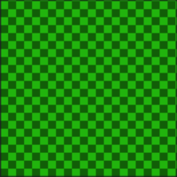

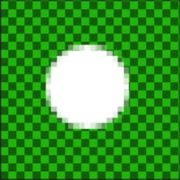

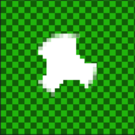

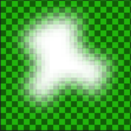<br>
[パーティクル画像の作成手順]
</p>

作成したあとは、画像の保存を忘れないでください。

### 2.11 ParticleSystemコンポーネントを使う

それでは、ParticleSystemコンポーネントを使ってパーティクルを表示してみましょう。
`Explosion.h`を開き、`OnDestroy`メンバ関数の定義に次のプログラムを追加してください。

```diff
         anim->AddSprite(frameNo, tc[frameNo], x[i], y[i]);
       }
     }
+
+    // パーティクルによる爆発
+    auto particleObject = gameObject.engine->Create<GameObject>(
+      "particle explosion", gameObject.x, gameObject.y);
+    auto ps = particleObject->AddComponent<ParticleSystem>();
+    ps->emitters.resize(1);
+    auto& emitter = ps->emitters[0];
+    emitter.ep.imagePath = "Res/particle_fire.tga";
   }

   int count = 3;
```

プログラムが書けたらビルドして実行してください。敵を破壊したとき、白い何かが表示されていたら成功です。

<p align="center">
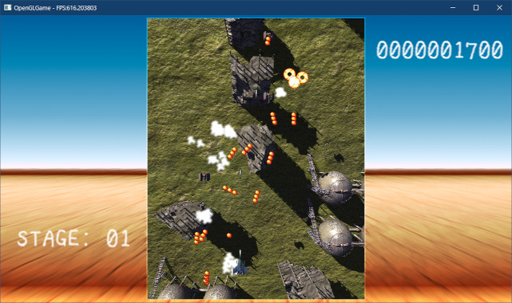
</p>

<div style="page-break-after: always"></div>

### 2.12 パーティクルに色を付ける

爆発っぽさを出すために、パーティクルの色を変更しましょう。パーティクルに色をつけるには、`ParticleParameter`の`color`メンバに値をセットします。パーティクルによる爆発を追加するプログラムに、次のプログラムを追加してください。

```diff
     ps->emitters.resize(1);
     auto& emitter = ps->emitters[0];
     emitter.ep.imagePath = "Res/particle_fire.tga";
+    emitter.pp.color.Set({ 2, 1, 0.5f, 1 }, { 2, 1, 0.5f, 0 });
   }

   int count = 3;
```

プログラムが書けたらビルドして実行してください。敵を破壊したときのパーティクルがオレンジ色になり、徐々に透明になって消えていったら成功です。

<p align="center">
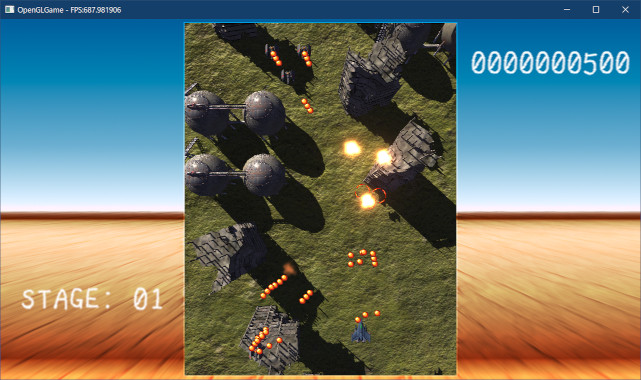
</p>

色を変えるだけで、エフェクトの印象が大きく異なることが分かると思います。また、赤の値を1以上にしているのは、ブルームエフェクトを発生させるためです。

### 2.13 パーティクルの移動速度を変更する

初期状態ではパーティクルの速度が小さすぎて、爆発らしさが足りません。そこで、半径方向の速度を調整します。半径方向の速度を設定するには`ParticleParameter`の`radial`(ラジアル)メンバに値をセットします。

パーティクルに色を付けるプログラムの下に、次のプログラムを追加してください。

```diff
     auto& emitter = ps->emitters[0];
     emitter.ep.imagePath = "Res/particle_fire.tga";
     emitter.pp.color.Set({ 2, 1, 0.5f, 1 }, { 2, 1, 0.5f, 0 });
+    emitter.pp.radial.Set(300, 0);
   }

   int count = 3;
```

初期速度を300, 最終速度を0とすることで、徐々に減速するようにしてみました。プログラムが書けたらビルドして実行してください。パーティクルが勢いよく四方八方に飛んでいったら成功です。

<p align="center">
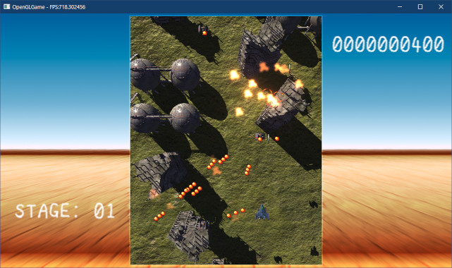
</p>

パーティクルの速度を変えることで、エフェクトを発生させる衝撃の強さを表現することができます。

### 2.14 パーティクルの放出期間を変更する

現在の設定では、敵を撃墜したあとしばらくパーティクルが放出され続けます。これは放出期間を表す`duration`の初期値が1秒になっているためです。爆発は一瞬なので、放出期間を短くしましょう。

パーティクルによる爆発を追加するプログラムに、次のプログラムを追加してください。

```diff
     ps->emitters.resize(1);
     auto& emitter = ps->emitters[0];
     emitter.ep.imagePath = "Res/particle_fire.tga";
+    emitter.ep.duration = 0.1f;
+    emitter.ep.emissionsPerSecond = 100;
     emitter.pp.color.Set({ 2, 1, 0.5f, 1 }, { 2, 1, 0.5f, 0 });
     emitter.pp.radial.Set(300, 0);
```

放出期間を短くするだけだと、放出されるパーティクルの数も減ってしまいます。<br>
そこで、`emissionsPerSecond`(エミッションズ・パー・セコンド)に「1秒間に放出するパーティクル数」を指定しています。

上記の設定では秒間放出数100, 放出期間0.1としているため、実際に放出されるパーティクル数は100*0.1=10個になると予想されます。

プログラムが書けたらビルドして実行してください。パーティクルの放出が一種で終わっていたら成功です。

<p align="center">
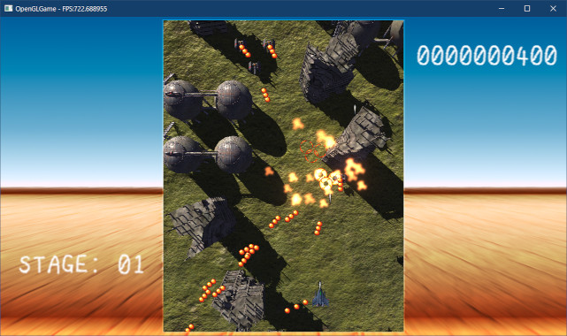
</p>

パーティクルの放出期間は、エフェクトを発生させる衝撃の持続時間を表現します。

### 2.15 パーティクルの寿命を変更する

爆発が間延びしているように思えるので、パーティクルの寿命を短くしてみます。パーティクルによる爆発を追加するプログラムに、次のプログラムを追加してください。

```diff
     emitter.ep.imagePath = "Res/particle_fire.tga";
     emitter.ep.duration = 0.1f;
     emitter.ep.emissionsPerSecond = 100;
+    emitter.pp.lifetime = 0.4f;
     emitter.pp.color.Set({ 2, 1, 0.5f, 1 }, { 2, 1, 0.5f, 0 });
     emitter.pp.radial.Set(300, 0);
```

プログラムが書けたらビルドして実行してください。寿命を設定する前と比べて、パーティクルが早く消えていったら成功です。

<p align="center">

</p>

一般的に、火や炎のようなエフェクトの寿命は短く、水や煙のようなエフェクトの寿命は長めです。

### 2.16 パーティクルの拡大率を変更する

多くのエフェクトは、発生直後は小さくて徐々に大きくなるか(炎や煙など)、逆に発生直後は大きくて徐々に小さくなる(水滴、光など)かのいずれかです。

爆発は「徐々に大きくなる」タイプなので、拡大率が変化するようにしましょう。パーティクルによる爆発を追加するプログラムに、次のプログラムを追加してください。

```diff
     emitter.ep.emissionsPerSecond = 100;
     emitter.pp.lifetime = 0.4f;
     emitter.pp.color.Set({ 2, 1, 0.5f, 1 }, { 2, 1, 0.5f, 0 });
+    emitter.pp.scale.Set({ 1, 1 }, { 2, 2 });
     emitter.pp.radial.Set(300, 0);
   }
```

プログラムが書けたらビルドして実行してください。パーティクルが大きくなりながら消えていったら成功です。

<p align="center">
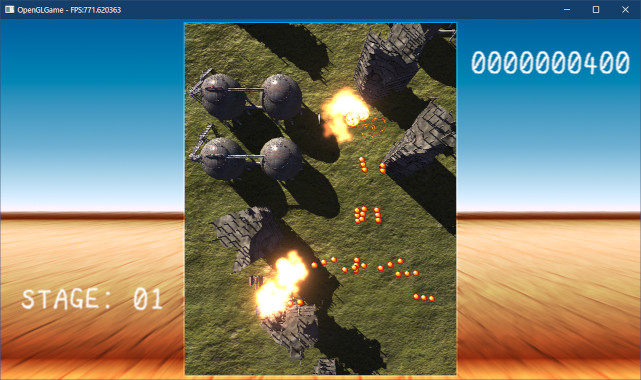
</p>

### 2.17 パーティクルにランダム回転機能を追加する

パーティクルの角度がいつも同じだと不自然で、あまり見栄えがよくありません。そこで、回転角度をランダム化する機能を追加しましょう。`Particle.h`を開き、`ParticleParamter`構造体の定義に次のプログラムを追加してください。

```diff
   VecMath::vec3 rotation = { 0, 0, 0 }; // 回転
   ParticleEmitterShape shape = ParticleEmitterShape::sphere; // 形状
   float randomizeDirection = 0; // 放出方向の乱数性(0=なし 1=完全ランダム)
+  float randomizeRotation = 0;  // 回転角度の乱数性(0=なし 1=完全ランダム)
   union {
     struct Sphere {
```

次に、`Particle`クラスの定義に次のプログラムを追加してください。

```diff
   // 変化しないパラメータ
   const ParticleParameter* pp;   // 基本パラメータ
   VecMath::vec3 radialDirection = { 1, 0, 0 }; // 中心からの向き
+  Interporator1f rotation = Interporator1f(0, 0);        // 回転
   Interporator3f velocity = Interporator3f({ 0, 0, 0 }); // 速度
   Texcoord tc = { 0, 0, 1, 1 }; // テクスチャ座標
```

`pp`が持つ`rotation`は変更できないので、パーティクルごとに`rotation`を持たせるようにしています。

続いて`Particle.cpp`を開き、`ParticleEmitter::AddParticle`メンバ関数に、次のプログラムを追加してください。

```diff
   // 速度ベクトルを回転
   particle->velocity.start = vec3(matRot * vec4(pp.velocity.start, 1));
   particle->velocity.end = vec3(matRot * vec4(pp.velocity.end, 1));
+
+  // 回転角度のランダム係数が0でなければ、回転角度にランダムを加える
+  particle->rotation = pp.rotation;
+  if (ep.randomizeRotation) {
+    const float randomRange = pi * ep.randomizeRotation;
+    const float a = pManager->RandomFloat(-randomRange, randomRange);
+    particle->rotation.start += a;
+    particle->rotation.end += a;
+  }

   // タイル数が指定されている場合、ランダムにタイルを選択する
   if (ep.tiles.x > 1 || ep.tiles.y > 1) {
```

追加したプログラムは「`randomRotation`(ランダム・ローテーション)が0以外の場合、
`rotation`メンバ変数にランダム値を加算する」というものです。

最後に、`ParticleParameter::rotation`の代わりに`Particle::rotation`を使うように
`UpdateSSBO`メンバ関数を修正します。`UpdateSSBO`メンバ関数の定義を次のように変更してください。

```diff
       const float t = particle->GetLifetimeRatio();
       pData->position = vec4(particle->position, 1);
       pData->scale = particle->pp->scale.Interporate(t);
-      const float rotation = particle->pp->rotation.Interporate(t);
+      const float rotation = particle->rotation.Interporate(t);
       pData->cos = std::cos(rotation);
       pData->sin = std::sin(rotation);
```

それでは回転角度をランダムにしてみましょう。`Explosion.h`を開き、`Update`メンバ関数の定義に次のプログラムを追加してください。

```diff
     emitter.ep.imagePath = "Res/particle_fire.tga";
     emitter.ep.duration = 0.1f;
     emitter.ep.emissionsPerSecond = 100;
+    emitter.ep.randomizeRotation = 1;
     emitter.pp.lifetime = 0.4f;
     emitter.pp.color.Set({ 2, 1, 0.5f, 1 }, { 2, 1, 0.5f, 0 });
```

プログラムが書けたらビルドして実行してください。パーティクルごとに角度が異なっていたら成功です(見かけがほぼ同じ角度になることはあります)。

<p align="center">
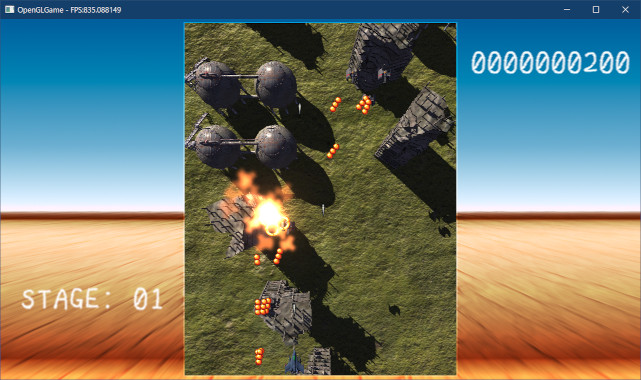
</p>

このように、パーティクルの見た目や動作にランダム性を加えると、より自然な表現に近づけることができます。本節で見たように、ランダム性を追加するには次の手順でプログラムを追加します。

>1. `ParticleEmitter`構造体に、ランダム性を制御するメンバ変数を追加する。
>2. `Particle`クラスに、ランダム性を与えたいパラメータのコピーを追加する。
>3. `AddParticle`メンバ関数に、ランダム性を実装する。

<pre class="tnmai_assignment">
<strong>【課題01】</strong>
パーティクルシステムに、拡大縮小に対してランダム性を加える機能を追加しなさい。追加した機能を使って、爆発の拡大縮小をランダム化しなさい。
</pre>

>**【2章のまとめ】**
>
>* エミッターがパーティクルを放出する時間と量を調整することで、爆発、炎、煙、雨などさまざまなエフェクトを表現できる。
>* パーティクルの速度や生存期間を調整することで、衝撃の強さや勢いをあらわせる。
>* パーティクルの見た目や動作にランダム性を加えることで、より自然な表現に近づけることができる。
