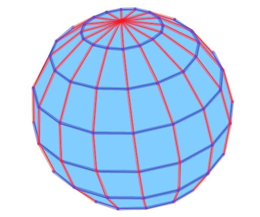
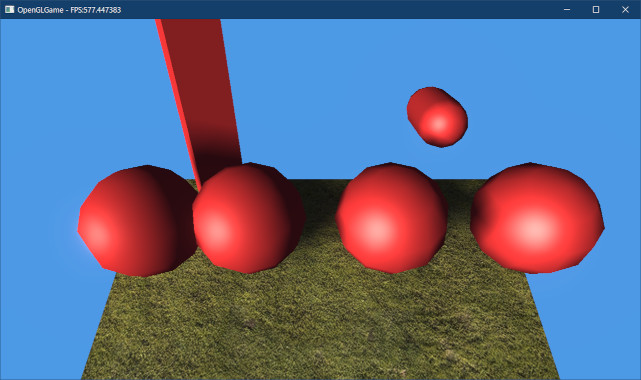

[OpenGL 3D 2022 後期 第06回]

# 球体の衝突判定

## 習得目標

* 既存プロジェクトから必要なファイルだけをコピーし、新規プロジェクトを作成できる。
* 三角関数を使って、球やカプセル形状の頂点座標を定義できる。
* 「球体」の衝突を判定する方法を説明できる。
* コンタクトポイントについて説明できる。

## 1. 3Dエンジン用プロジェクトの準備

### 1.1 新規プロジェクトを作る

2Dシューティングでは長方形の衝突判定を使いました。長方形を組み合わせることで、ある程度それらしい衝突判定を作ることができたのでした。

しかし、単純な長方形では「画像の回転に対応できない」という問題がありました。回転を多用する3Dグラフィックスにおいて、回転に対応できないことは2Dより大きな問題となります。

そこで、いくつかの基本図形について、「3D空間における衝突を判定する関数」を作成します。そして、作成した衝突判定関数を使って、ゲームエンジンに3Dゲーム用の衝突判定を実装することにします。

さて、これまで本テキストで作成してきたゲームエンジンの目的は、主に縦スクロール型の2Dシューティングゲームを作ることでした。目的が目的なので、汎用的な3Dゲームエンジンには不要なプログラムが多数含まれています。

3Dゲーム用のエンジンとして考えた場合、2Dシューティングゲーム専用のコードのほとんどは不要です。とはいえ、そのためにせっかく作成した2Dシューティングゲーム用エンジンを壊してしまうのはもったいないです。

そこで、新規プロジェクトを作成してゲームエンジン用のファイルをコピーし、それを改造していくことにします。

<pre class="tnmai_assignment">
<strong>【課題01】</strong>
次の手順に従って、3Dゲーム用のプロジェクトを作成しなさい。新規プロジェクトの作成方法は、第1回テキストを参照してください。
<ol>
<li>Visual Studioで「空のプロジェクト」を作成する。プロジェクト名は適当でよい。思いつかない場合は<code>OpenGLGame3D</code>とする。</li>
<li>C++のバージョンを設定し、GLFWのNuGetパッケージを追加する。</li>
<li>作成された空のプロジェクトのフォルダに、2Dシューティングゲーム用のプロジェクトから、ゲームエンジン関連のファイルをコピーする。タイトルシーンやメインゲームシーンなど、2Dシューティング用のファイルをコピーしないこと。</li>
<li>3でコピーしたファイルをプロジェクトに追加する。</li>
<li>新規に<code>MainGameScene</code>クラスを定義する。</li>
<li><code>MainGameScene</code>に<ruby>空<rt>から</rt></ruby>の<code>Initialize</code>関数と<code>Update</code>関数を定義する。</li>
<li>プロジェクトをビルドする。エラーが発生したら、エラーを解決して再度ビルドする。</li>
<li>全てのエラーを解決してビルドを成功させる。Debug, Releaseの両方で成功させること。</li></ol></pre>

### 1.2 2Dシューティング用スプライト機能を削除する

ゲームエンジンのうち、2Dシューティングゲームに固有の部分は背景や移動物体などのスプライト表示です。これらは3Dゲームには不要なので削除しましょう。一方、UI用スプライトは必要なので残します。

最初に、スプライトを扱うメンバ関数を削除します。`Engine.h`を開き、`Engine`クラスの定義を次のように変更してください。

```diff
   int Run();
   GLFWwindow* GetWindow() { return window; }
   std::mt19937& GetRandomGenerator() { return rg; }
-  SpriteList& GetSpriteListBg() { return spriteListBg; }
-  SpriteList& GetSpriteListObj() { return spriteListObj; }
-
-  // 背景スプライトの配置情報
-  struct BgSize
-  {
-    size_t sizeX; // 横のタイル数
-    size_t sizeY; // 縦のタイル数
-    float baseX;  // 背景の配置開始X座標
-    float baseY;  // 背景の配置開始Y座標
-  };
-  BgSize GetBgSize() const {
-    return {bgSizeX, bgSizeY, bgBaseX, bgBaseY};
-  }

-  // スプライト描画範囲
-  VecMath::vec2 GetViewSize() const { return { 17 * 32, 22 * 32 }; }
+  // 描画解像度
+  VecMath::vec2 GetViewSize() const { return { 1280, 720 }; }

   // ウィンドウサイズ
   VecMath::vec2 GetWindowSize() const { return { 1280, 720 }; }

   // キーが押されていたらtrue, 押されてなければfalseを返す
   bool GetKey(int key) const {
     return glfwGetKey(window, key) == GLFW_PRESS;
   }

-  // 配置データの読み込み・スプライト設定
+  // 配置データの読み込み
   TileMap LoadTileMap(const char* filename);
-  void SetSpriteList(const TileMap& tileMap);

   // 3Dモデル配置データの読み込み
   GameObjectList LoadGameObjectMap(const char* filename,
```

次に、スプライト用のメンバ変数を削除します。`Engine`クラスの定義を次のように変更してください。

```diff
   BufferObjectPtr vbo;
   BufferObjectPtr ibo;
   VertexArrayPtr vao;
-
-  TexturePtr tex[2]; // テクスチャの管理番号

   const size_t maxSpriteCount = 100'000; // スプライトの最大数
-  std::vector<Sprite> spriteListBg;  // 背景用
-  std::vector<Sprite> spriteListObj; // 味方、敵、その他用
-
   MappedBufferObjectPtr ssboSprite;
 
   std::mt19937 rg;       // 疑似乱数を生成するオブジェクト(速い)
```

### 1.3 SetSpriteListメンバ関数を削除する

1.2節の変更により、多くのエラーが発生します。例えば、「`SetSpriteList`メンバ関数の宣言を削除したが、定義はまだ削除していない」ためにエラーが発生しています。

そこで、エラーを解消するために関数定義を削除します。<br>
`Engine.cpp`を開き、`SetSpriteList`メンバ関数の定義を削除してください。

```diff
   // 読み込んだ配置データを返す
   return tileMap;
 }
-
-/**
-* 配置データに従って背景スプライトを設定する
-*/
-void Engine::SetSpriteList(const TileMap& tileMap)
-{
-  // 背景スプライトを削除
-        ・
-        ・
-        ・
-    } // for x
-  } // for y
-}

/**
* 3Dモデル配置ファイルを読み込む
```

### 1.4 エラーを解決する

続いて、他のエラーを解決していきましょう。発生したエラーは「削除した変数や関数を使っているコード」で起きているので、それらのコードを削除すれば解決するはずです。

手始めに、`Initialize`メンバ関数から次のコードを削除してください。

```diff
   glBindVertexArray(0);
   glBindBuffer(GL_ARRAY_BUFFER, 0);
   glBindBuffer(GL_ELEMENT_ARRAY_BUFFER, 0);
-
-  // テクスチャを作成する
-  const char* filenameImgList[] = { "Res/bg0.tga", "Res/objects.tga" };
-  for (size_t i = 0; i < std::size(tex); ++i) {
-    tex[i] = Texture::Create(filenameImgList[i], GL_NEAREST);
-  }
-
-  // スプライトの配列を作成
-  spriteListBg.reserve(10'000);
-  spriteListObj.reserve(10'000);

   // スプライト用のSSBOを作成
   ssboSprite = MappedBufferObject::Create(
```

>**【コードを変更する理由を説明できるようにしましょう】**<br>
>上記のコードを削除した理由を説明できますか？　「テキストに「削除してください」と書いてあったから」、「エラーが起きていたから」は理由として不適当です。<br>
>適切な説明としては、例えば、<br>
>「3Dエンジン化のためには2Dシューティング専用機能は不要なので、2D専用であるtex, spriteListObj, spriteListBg変数と、これらの変数を使うコードを削除する必要があるから」<br>
>のような文章が考えられるでしょう。

次に`MainLoop`メンバ関数に移動し、以下のコードを削除してください。

```diff
     for (auto& layer : uiLayerList) {
       RemoveGameObject(layer.gameObjectList);
     }
-    MakeSpriteList(gameObjectList, spriteListObj);
     for (auto& layer : uiLayerList) {
       MakeSpriteList(layer.gameObjectList, layer.spriteList);
     }
-
-    // 背景をスクロールさせる
-    const float scrollSpeed = 32; // スクロール速度(ピクセル毎秒)
-    const int viewSizeY = 22 * 32; // 描画範囲の高さ
-    if (spriteListBg.size() >= bgSizeX * bgSizeY) {
-      const float bgBaseYEnd = -static_cast<float>(bgSizeY * 32) +
-        viewSizeY + 16; // スクロール終端座標
-      bgBaseY -= scrollSpeed * deltaTime;
-      if (bgBaseY <= bgBaseYEnd) {
-        bgBaseY = bgBaseYEnd;
-      }
-      for (size_t y = 0; y < bgSizeY; ++y) {
-        const float sy = y * 32 + bgBaseY;
-        for (size_t x = 0; x < bgSizeX; ++x) {
-          spriteListBg[y * bgSizeX + x].y = sy;
-        }
-      }
-    } // if size

     // GPUがバッファを使い終わるのを待つ
     ssboSprite->WaitSync();
```

すぐ下にもエラーコードがあるので修正しましょう。スプライトデータをSSBOにコピーするコードを次のように変更してください。

```diff
     // GPUがバッファを使い終わるのを待つ
     ssboSprite->WaitSync();

-    // スプライトデータをSSBOにコピー
-    const std::vector<Sprite>* drawList[] = { &spriteListBg, &spriteListObj };
+    // スプライト用SSBOのアドレスを取得
     uint8_t* p = ssboSprite->GetMappedAddress();
-    for (size_t i = 0; i < std::size(drawList); ++i) {
-      memcpy(p, drawList[i]->data(), drawList[i]->size() * sizeof(Sprite));
-      p += CalcSsboSize(drawList[i]->size() * sizeof(Sprite));
-    }

     // ゲームウィンドウ用のスプライトデータをSSBOにコピー
     SpriteList spriteListPostProcess;
```

ローカル変数`p`を消さずに残している理由は、この`p`はUI用スプライトのコードでも使われているからです。

続いて、2Dシューティング用スプライトを描画するコードを削除します。上記のコードから50行くらい下に、次のようなコードがあると思います。これらも2Dシューティング用なので削除してください。

```diff
     // アルファブレンドを有効化
     glEnable(GL_BLEND);
     glBlendEquation(GL_FUNC_ADD);
     glBlendFunc(GL_SRC_ALPHA, GL_ONE_MINUS_SRC_ALPHA);
-
-    // ユニフォーム変数に、座標変換用パラメータをコピーする
-    glProgramUniform4f(*progSprite, 2,
-      2.0f / viewSize.x, 2.0f / viewSize.y, -1, -1);
-
-    // スプライト配列を描画
-    size_t spriteSsboOffset = 0;
-    DrawSpriteList(*drawList[0], *tex[0], spriteSsboOffset);

     // 3Dメッシュを描画
     DrawStaticMesh(gameObjectList);
-
-    glUseProgram(*progSprite); // 描画に使うシェーダを指定
-    glDisable(GL_DEPTH_TEST); // 深度テストを無効化
-    glDisable(GL_CULL_FACE);  // 裏面カリングを無効化
-    DrawSpriteList(*drawList[1], *tex[1], spriteSsboOffset);

     // パーティクルを描画
     {
```

これで、2Dシューティング用のコードを削除することができました。

<pre class="tnmai_assignment">
<strong>【課題02】</strong>
みなさん自身がゲームエンジンに追加したコードがある場合、それらのうちで「2Dシューティングでしか使わない」と考えられるコードを全て削除してください。
</pre>

### 1.5 地面を描画する

さて、ここまではエンジンから2Dシューティング用のコードを削除しただけです。プログラムを実行しても画面には何も表示されません。とりあえず、適当な3Dモデルを表示しましょう。

`MainGameScene.cpp`を開き、ヘッダファイルをインクルードしてください。

```diff
 /**
 * @file MainGameScene.cpp
 */
 #include "MainGameScene.h"
+#include "Component/MeshRenderer.h"
+#include "Engine.h"
+#include "Debug.h"
+
+using namespace VecMath;

 /**
 * シーンを初期化する
```

次に、`Initialize`メンバ関数の定義に次のプログラムを追加してください。

```diff
 bool MainGameScene::Initialize(Engine& engine)
 {
+  // 表示テスト用に地面を配置
+  auto ground = engine.Create<GameObject>("Ground");
+  auto groundRenderer = ground->AddComponent<MeshRenderer>();
+  groundRenderer->mesh = engine.LoadOBJ("Res/Model/Ground.obj");
+  groundRenderer->scale = vec3(20);
+  groundRenderer->rotation.x = pi * 0.5f;
+
   return true;
 }
```

プログラムが書けたらビルドして実行してください。地面が表示されていたら成功です。

<p align="center">

</p>

>**【地面が表示されない場合】**<br>
>デバッグ出力に「`Ground.obj`を開けません」と表示されているかどうかを調べてください。表示されていたら、`Res/Model`フォルダに地面のOBJファイルをコピーしましょう。
>表示されていない場合、地面の角度のせいでカメラから見えなくなっている可能性があります。`renderer->rotation.x`に適当な値を設定してみてください。

### 1.6 共通マテリアルを用意する

衝突判定が適切に行われていることを調べるには、実際に表示して確認するのが確実です。そこで、基本的な図形を作成するコードを追加しましょう。作成する基本図形は以下の3種類です。

>* 直方体
>* 球
>* カプセル

ひとつの方法は、図形ごとにOBJファイルを作り、それを読み込むことです。しかし、OBJファイルでは決まった図形しか作成できません。後述しますが、「カプセル」ではパラメータに応じて図形を調整しなくてはなりません。

そのため、今回は`MeshBuffer`クラスに図形を作成する関数を追加することにします。

まず、図形描画用のマテリアルを準備します。このマテリアルは全ての図形で共通のものを使います。`Mesh.h`を開き、`MeshBuffer`クラスの定義に次のプログラムを追加してください。

```diff
   PrimitiveBuffer primitiveBuffer;
   std::unordered_map<std::string, StaticMeshPtr> meshes;
   std::shared_ptr<class MikkTSpace> mikkTSpace;
+  MaterialPtr defaultMaterial; // マテリアル未設定時に使用する仮マテリアル
 };
 
 } // namespace Mesh
```

次に`Mesh.cpp`を開き、`MeshBuffer`コンストラクタの定義に次のプログラムを追加してください。

```diff
   if (!mikkTSpace) {
     LOG_ERROR("MikkTSpaceの作成に失敗");
   }
+
+  // マテリアル未設定時に使用するマテリアルを作成
+  defaultMaterial = std::make_shared<Material>();
+  defaultMaterial->texBaseColor = Texture::Create("defaultMaterial", 4, 4);
+  std::vector<uint32_t> img(4 * 4, 0xff'cc'cc'cc);
+  glTextureSubImage2D(*defaultMaterial->texBaseColor, 0, 0, 0,
+    4, 4, GL_BGRA, GL_UNSIGNED_BYTE, img.data());
 }

 /**
```

### 1.7 直方体を生成する関数を定義する

直方体は立方体の拡大縮小で表現できます。そのため、実際に作成するのは立方体を生成する関数となります。`Mesh.h`を開き、`MeshBuffer`クラスの定義に次のプログラムを追加してください。

```diff
   StaticMeshPtr LoadOBJ(const char* filename);
   VertexArrayPtr GetVAO() const;
   void Clear();
+
+  StaticMeshPtr CreateMesh(
+    const char* name, GLenum mode,
+    const Vertex* vertices, size_t vertexCount,
+    const uint16_t* indices, size_t indexCount);
+  StaticMeshPtr CreateBox(const char* name);

 private:
   PrimitiveBuffer primitiveBuffer;
```

`CreateMesh`(クリエイト・メッシュ)関数は、頂点データとインデックスデータを受け取ってメッシュを作成します。

`CreateBox`(クリエイト・ボックス)関数は、直方体の頂点データとインデックスデータを生成し、それらを`CreateMesh`関数に渡して直方体メッシュを作成します。

続いて、これらのメンバ関数を定義します。`Mesh.cpp`を開き、`Clear`メンバ関数の定義の下に、次のプログラムを追加してください。

```diff
 void MeshBuffer::Clear()
 {
   meshes.clear();
 }
+
+/**
+* メッシュを作成する
+*
+* @param name        メッシュ名(検索などで使用)
+* @param mode        プリミティブの種類
+* @param vertices    頂点データのアドレス
+* @param vertexCount 頂点データ数
+* @param indices     インデックスデータのアドレス
+* @param indexCount  インデックスデータ数
+*
+* @return 作成したメッシュへのポインタ
+*/
+StaticMeshPtr MeshBuffer::CreateMesh(
+  const char* name, GLenum mode,
+  const Vertex* vertices, size_t vertexCount,
+  const uint16_t* indices, size_t indexCount)
+{
+  // データをプリミティブバッファに追加
+  const GLint baseVertex = primitiveBuffer.AddVertices(vertices, vertexCount);
+  const void* indexOffset = primitiveBuffer.AddIndices(indices, indexCount);
+
+  // メッシュを作成
+  auto pMesh = std::make_shared<StaticMesh>();
+  pMesh->name = name;
+
+  // プリミティブを作成
+  Primitive prim;
+  prim.mode = mode;
+  prim.count = static_cast<GLsizei>(indexCount);
+  prim.indices = indexOffset;
+  prim.baseVertex = baseVertex;
+  prim.materialNo = 0;
+  pMesh->primitives.push_back(prim);
+
+  // マテリアルとVAOを設定
+  pMesh->materials.push_back(defaultMaterial);
+  pMesh->vao = primitiveBuffer.GetVAO();
+  meshes.emplace(pMesh->name, pMesh);
+
+  LOG("%sメッシュを作成ました(vertices/indices=%d/%d)", name,
+    vertexCount, indexCount);
+
+  // 作成したメッシュを返す
+  return pMesh;
+}

 } // namespace Mesh
```

次に、`CreateMesh`メンバ関数の定義の下に、次のプログラムを追加してください。

```diff
   // 作成したメッシュを返す
   return pMesh;
 }
+
+/**
+* 立方体メッシュを作成する
+*
+* @param name メッシュ名(検索などで使用)
+*
+* @return 作成したメッシュへのポインタ
+*/
+StaticMeshPtr MeshBuffer::CreateBox(const char* name)
+{
+  const vec3 positions[] = {
+    { 1,-1, 1 }, { 1,-1,-1 }, { 1, 1,-1 }, { 1, 1, 1 }, // +X
+    {-1,-1,-1 }, {-1,-1, 1 }, {-1, 1, 1 }, {-1, 1,-1 }, // -X
+    {-1, 1, 1 }, { 1, 1, 1 }, { 1, 1,-1 }, {-1, 1,-1 }, // +Y
+    { 1,-1, 1 }, {-1,-1, 1 }, {-1,-1,-1 }, { 1,-1,-1 }, // -Y
+    {-1,-1, 1 }, { 1,-1, 1 }, { 1, 1, 1 }, {-1, 1, 1 }, // +Z
+    { 1,-1,-1 }, {-1,-1,-1 }, {-1, 1,-1 }, { 1, 1,-1 }, // -Z
+  };
+  const vec3 normals[] = { {1, 0, 0}, {0, 1, 0}, {0, 0, 1} };
+  const vec4 tangents[] = { {0, 0,-1, 1}, {1, 0, 0, 1}, {-1, 0, 0, 1} };
+  
+  // 頂点データを生成
+  std::vector<Vertex> vertices(6 * 4);
+  for (int i = 0; i < 24; i += 4) {
+    const int axis = i / 8;
+    const float sign = (i & 0b100) ? -1.0f : 1.0f;
+    const vec3 normal = normals[axis] * sign;
+    const vec4 tangent = tangents[axis] * sign;
+    vertices[i + 0] = { positions[i + 0], { 0, 0 }, normal, tangent };
+    vertices[i + 1] = { positions[i + 1], { 1, 0 }, normal, tangent };
+    vertices[i + 2] = { positions[i + 2], { 1, 1 }, normal, tangent };
+    vertices[i + 3] = { positions[i + 3], { 0, 1 }, normal, tangent };
+  }
+
+  const uint16_t indices[] = {
+    0, 1, 2, 2, 3, 0, // +X
+    4, 5, 6, 6, 7, 4, // -X
+    8, 9,10,10,11, 8, // +Y
+   12,13,14,14,15,12, // -Y
+   16,17,18,18,19,16, // +Z
+   20,21,22,22,23,20, // -Z
+  };
+
+  return CreateMesh(name, GL_TRIANGLES,
+    vertices.data(), vertices.size(), indices, std::size(indices));
+}

 } // namespace Mesh
```

直方体の生成は、データで用意したほうが簡単な部分はデータを用意し、プログラムで生成するほうが簡単な部分は、プログラムによって生成するようにしています。

`for`の内容が少し分かりにくいかもしれませんので、変数の意味を説明します。

`axis`(アクシス)変数は「面がX軸、Y軸、Z軸のどの方向を向いているか」を表します。
`positions`(ポジションズ)配列のコメントに書いてあるように、面データは8個単位でX→Y→Zと並んでいます。つまり、8で割れば軸の方向が分かるのです。

`sign`(サイン)は「プラス方向かマイナス方向か」を表します。`positions`配列のコメントに書いてあるように、4個単位でプラスとマイナスが切り替わります。これは「3つめのビットが0ならプラス、1ならマイナス」と言い換えることができます。

`axis`と`sign`を使うことで、面に対応する法線とタンジェントを求めることができます。

### 1.8 直方体を表示する

実際に直方体を表示してみましょう。`Engine.cpp`を開き、`Initialize`メンバ関数の定義に次のプログラムを追加してください。

```diff
   // 3Dモデル用のバッファを作成
   meshBuffer = Mesh::MeshBuffer::Create(3'000'000, 9'000'000);
+  meshBuffer->CreateBox("Box");
   primitiveBuffer = Mesh::PrimitiveBuffer::Create(
     sizeof(Mesh::Vertex) * 100'000, sizeof(uint16_t) * 300'000);
```

次に`MainGameScene.h`を開き、`MainGameScene`クラスの定義に次のプログラムを追加してください。

```diff
   virtual bool Initialize(Engine& engine) override;
   virtual void Update(Engine& engine, float deltaTime) override;
+
+private:
+  GameObjectPtr box;
 };

 #endif // MAINGAMESCENE_H_INCLUDED
```

次に`MainGameScene.cpp`を開き、`Initialize`メンバ関数の定義に次のプログラムを追加してください。

```diff
   groundRenderer->mesh = engine.LoadOBJ("Res/Model/Ground.obj");
   groundRenderer->scale = vec3(20);
   groundRenderer->rotation.x = pi * 0.5f;
+
+  box = engine.Create<GameObject>("Box");
+  auto boxRenderer = box->AddComponent<MeshRenderer>();
+  boxRenderer->mesh = engine.LoadOBJ("Box");
+  box->x = -5;
+  box->y = 5;
+  box->z = -10;
+  box->rotation[2] = radians(30.0f);
 }
```

続いて、`Update`メンバ関数の定義に次のプログラムを追加してください。

```diff
 void MainGameScene::Update(Engine& engine, float deltaTime)
 {
+  box->rotation[0] += radians(90.0f) * deltaTime;
 }
```

プログラムが書けたらビルドして実行してください。エラーがあれば修正して、またビルドしてください。ビルドに成功し、画面に灰色の立方体が表示されたら成功です。

<p align="center">

</p>

<pre class="tnmai_assignment">
<strong>【課題03】</strong>
boxRendererの<code>scale</code>メンバに値を設定して、Z方向の長さを4倍にしなさい。
</pre>

<p align="center">

</p>

### 1.9 球体を生成する関数を定義する

直方体に続いて、球体を生成する関数を作成しましょう。ポリゴンで球体を近似する一般的な方法には、「ICO(アイコ)スフィア」と「UV(ユーブイ)スフィア」の2種類があります。どちらの方法にも利点と欠点があります。

今回は「作りやすい」という理由から、UVスフィアを生成することにします。UVスフィアは、円筒の上下をすぼませて球体にしたものです。

それでは、関数宣言を追加しましょう。`Mesh.h`を開き、`MeshRenderer`クラスの定義に次のプログラムを追加してください。

```diff
     const Vertex* vertices, size_t vertexCount,
     const uint16_t* indices, size_t indexCount);
   StaticMeshPtr CreateBox(const char* name);
+  StaticMeshPtr CreateSphere(const char* name,
+    int segment = 12, int ring = 6);

 private:
   PrimitiveBuffer primitiveBuffer;
```

`CreateSphere`(クリエイト・スフィア)関数は、球体の頂点データとインデックスデータを生成し、それらを`CreateMesh`関数に渡して球体メッシュを作成します。

`Mesh.cpp`を開き、`CreateBox`メンバ関数の定義の下に、次のプログラムを追加してください。

```diff
   return CreateMesh(name, GL_TRIANGLES,
     vertices.data(), vertices.size(), indices, std::size(indices));
 }
+
+/**
+* 球体メッシュを作成する
+*
+* @param name    メッシュ名(検索などで使用)
+* @param segment 経度方向の分割数
+* @param ring    緯度方向の分割数
+*
+* @return 作成したメッシュへのポインタ
+*/
+StaticMeshPtr MeshBuffer::CreateSphere(const char* name,
+  int segment, int ring)
+{
+  const float angleLon = radians(360.0f / segment);
+  const float angleLat = radians(180.0f / ring);
 }

 } // namespace Mesh
```

`angleLon`(アングル・ロン)は経度方向の角度変化、`angleLat`(アングル・ラット)は緯度方向の角度変化を表します。

>`Lon`は経度を意味する`Longitude`(ロンギチュード)の短縮形です。<br>
>`Lat`は緯度を表す`Latitude`(ラチチュード)の短縮形です。

<p align="center">
<br>
[赤=経度(Longitude), 青=緯度(Latitude)]
</p>

次に、頂点データを生成します。`angleLat`変数の定義の下に、次のプログラムを追加してください。

```diff
 {
   const float angleLon = radians(360.0f / segment);
   const float angleLat = radians(180.0f / ring);
+
+  // 頂点データを生成
+  // lon(ロン) -> longitude(ロンギチュード, 経度)
+  // lat(ラット) -> latitude(ラチチュード, 緯度)
+  std::vector<Vertex> vertices((segment + 1) * (ring + 1));
+  auto v = vertices.begin();
+  for (float lat = 0; lat < ring + 1; ++lat) {
+    const float x = std::cos(angleLat * lat - pi * 0.5f);
+    const float y = std::sin(angleLat * lat - pi * 0.5f);
+    for (float lon = 0; lon < segment + 1; ++lon) {
+      v->position.x = x * std::cos(angleLon * lon);
+      v->position.y = y;
+      v->position.z = x * -std::sin(angleLon * lon);
+      v->normal = v->position;
+      v->tangent = vec4(v->normal.z, v->normal.y, -v->normal.x, 1);
+      v->texcoord.x = lon / segment;
+      v->texcoord.y = lat / ring;
+      ++v;
+    }
+  }
 }

 } // namespace Mesh
```

ここでは2重for文によって、緯度と経度に対応する頂点データを作成しています。`lat`変数はXY平面の回転、`lon`変数はXZ平面の回転に相当します。XY平面の回転において`0.5π`を引いている理由は、回転を球体の下側から始めるためです。

また、半径1の球体であることから、法線には頂点座標の値を使い回すことができます。<br>
タンジェントには「法線をXZ平面で90°回転させた値」を設定します。これは、XとZの値を入れ替えることで実現できます。

続いて、インデックスデータを生成するプログラムを追加しましょう。頂点データを生成するプログラムの下に、次のプログラムを追加してください。

```diff
       ++v;
     }
   }
+
+  // インデックスデータを生成
+  std::vector<uint16_t> indices(segment * ring * 6);
+  auto i = indices.begin();
+  const uint16_t oneRingVertexCount = segment + 1;
+  for (int lat = 0; lat < ring; ++lat) {
+    for (int lon = 0; lon < segment; ++lon) {
+      const uint16_t base = lat * oneRingVertexCount + lon;
+      i[0] = base;
+      i[1] = base + 1;
+      i[2] = base + oneRingVertexCount + 1;
+      i[3] = base + oneRingVertexCount + 1;
+      i[4] = base + oneRingVertexCount;
+      i[5] = base;
+      i += 6;
+    }
+  }
+
+  return CreateMesh(name, GL_TRIANGLES,
+    vertices.data(), vertices.size(), indices.data(), indices.size());
 }

 } // namespace Mesh
```

頂点データド同様に、インデックスデータも2重for文によって作成します。球体上に配置された4点ごとに四角形を定義しています。

プログラムが書けたら`Ctrl+Shift+B`キーを押してビルドしてください。エラーがあれば修正し、またビルドしてください。これを、エラーが無くなるまで続けてください。

### 1.10 球体を表示する

実際に球体を表示してみましょう。`Engine.cpp`を開き、`Initialize`メンバ関数の定義に次のプログラムを追加してください。

```diff
   // 3Dモデル用のバッファを作成
   meshBuffer = Mesh::MeshBuffer::Create(3'000'000, 9'000'000);
   meshBuffer->CreateBox("Box");
+  meshBuffer->CreateSphere("Sphere");
   primitiveBuffer = Mesh::PrimitiveBuffer::Create(
     sizeof(Mesh::Vertex) * 100'000, sizeof(uint16_t) * 300'000);
```

次に`MainGameScene.h`を開き、`MainGameScene`クラスの定義に次のプログラムを追加してください。

```diff
 private:
   GameObjectPtr box;
+  GameObjectPtr sphere;
 };

 #endif // MAINGAMESCENE_H_INCLUDED
```

次に`MainGameScene.cpp`を開き、`Initialize`メンバ関数の定義に次のプログラムを追加してください。

```diff
   box->y = 5;
   box->z = -10;
   box->rotation[2] = radians(30.0f);
+
+  sphere = engine.Create<GameObject>("Sphere");
+  auto sphereRenderer = sphere->AddComponent<MeshRenderer>();
+  sphereRenderer->mesh = engine.LoadOBJ("Sphere");
+  sphere->y = 5;
+  sphere->z = -10;
 }
```

続いて、`Update`メンバ関数の定義に次のプログラムを追加してください。

```diff
 void MainGameScene::Update(Engine& engine, float deltaTime)
 {
   box->rotation[0] += radians(90.0f) * deltaTime;
+  sphere->rotation[0] += radians(90.0f) * deltaTime;
 }
```

プログラムが書けたらビルドして実行してください。エラーがあれば修正して、またビルドしてください。ビルドに成功し、画面に灰色の球体が表示されたら成功です。

<p align="center">

</p>

<pre class="tnmai_assignment">
<strong>【課題04】</strong>
sphereRendererの<code>scale</code>メンバに値を設定して、球体の大きさを2倍にしなさい。
</pre>

### 1.11 カプセルを生成する関数を定義する

最後に、カプセルを生成する関数を定義します。`Mesh.h`を開き、`MeshBuffer`クラスの定義に次のプログラムを追加してください。

```diff
   StaticMeshPtr CreateBox(const char* name);
   StaticMeshPtr CreateSphere(const char* name,
     int segment = 12, int ring = 6);
+  StaticMeshPtr CreateCapsule(const char* name, float length,
+    int segment = 12, int ring = 6);

 private:
   PrimitiveBuffer primitiveBuffer;
```

`CreateCapsule`(クリエイト・カプセル)関数は、球体の中央部分を縦に伸ばした図形になります。伸ばす長さは`length`(レングス)引数で指定します。

次に`Mesh.cpp`を開き、`CreateSphere`メンバ関数の定義の下に、次のプログラムを追加してください。

```diff
   return CreateMesh(name, GL_TRIANGLES,
     vertices.data(), vertices.size(), indices.data(), indices.size());
 }
+
+/**
+* カプセルメッシュを作成する
+*
+* @param name    メッシュ名(検索などで使用)
+* @param length  カプセルの長さ
+* @param segment 経度方向の分割数
+* @param ring    緯度方向の分割数
+*
+* @return 作成したメッシュへのポインタ
+*/
+StaticMeshPtr MeshBuffer::CreateCapsule(const char* name, float length,
+  int segment, int ring)
+{
+  // 円柱部分の半径が1になるように、リング数を偶数にする
+  ring = ((ring + 1) / 2) * 2;
+
+  const float angleLon = radians(360.0f / segment);
+  const float angleLat = radians(180.0f / ring);
+}

 } // namespace Mesh
```

カプセルの生成では、まず球体を作成し、次に球体の中央の円周から上半分を上方向に引き伸ばしてカプセル状にします。

リング数が偶数の場合、球体のちょうど中央の円周上に頂点が生成されます。球体の半径は1なので、中央円周上の頂点を引き伸ばして円柱を作ると、円柱の半径も1になります。

しかし、リング数が奇数の場合、中央円周から少し離れた位置に頂点が生成されます。この頂点を引き伸ばして円柱を作ると、半径が1より小さくなってしまいます。

実際の衝突判定は半径で行われるため、円柱の半径が実際の半径と異なっていると、衝突判定を可視化したときに「衝突してないように見えるのに実際は衝突している」という状態になってしまいます。

そこで、リング数を偶数に制限することで、見た目と判定の不一致を防いでいます。

次に頂点データを生成します。`angleLat`(アングル・ラット)変数の定義の下に、次のプログラムを追加してください。

```diff
   const float angleLon = radians(360.0f / segment);
   const float angleLat = radians(180.0f / ring);
+
+  // 球体を下にずらした頂点データを生成
+  std::vector<Vertex> vertices((segment + 1) * (ring + 2));
+  auto v = vertices.begin();
+  for (float lat = 0; lat < ring + 1; ++lat) {
+    const float x = std::cos(angleLat * lat - pi * 0.5f);
+    const float y = std::sin(angleLat * lat - pi * 0.5f);
+    for (float lon = 0; lon < segment + 1; ++lon) {
+      v->position.x = x * std::cos(angleLon * lon);
+      v->position.y = y;
+      v->position.z = x * -std::sin(angleLon * lon);
+      v->normal = v->position;
+      v->tangent = vec4(v->normal.z, v->normal.y, -v->normal.x, 1);
+      v->texcoord.x = lon / segment;
+      v->texcoord.y = lat / (ring + ring * length);
+      v->position.y -= length * 0.5f; // カプセルの下側に移動
+      ++v;
+    }
+  }
 }

 } // namespace Mesh
```

`vertices`の要素数が`CreateSphere`関数と異なっている点に注意してください。これは、カプセルでは中央の円周が2周分存在するためです。

また、カプセルの下端に球体を生成するために、座標を`length * 0.5f`だけ下にずらしています。

この「ずらし処理」を法線を設定した後に行っている点にも注意してください。この順序を守らないと、座標と法線が一致しないため、法線がおかしくなってしまいます。

テクスチャ座標の計算式にある`ring + ring * length`は、円柱部分の長さを考慮してテクスチャ座標を設定するためのものです。

半径1の球体用のテクスチャ領域を`ring`とすると、上記の四季によって、円柱部分のテクスチャ領域は`ring * 円柱の長さ`となります。

続いて、球体の上半分をカプセル状に引き伸ばすプログラムを追加します。球体の頂点を生成するプログラムの下に、次のプログラムを追加してください。

```diff
       ++v;
     }
   }
+
+  // 球体の上半分をコピーして上方向にlengthだけずらす
+  auto rend = vertices.begin() + (segment + 1) * (ring / 2);
+  auto src = vertices.begin() + (segment + 1) * (ring + 1);
+  auto dest = vertices.end();
+  const float texcoordOffsetY =(ring * length) / (ring + ring * length);
+  while (src != rend) {
+    *(--dest) = *(--src);
+    dest->position.y += length;
+    dest->texcoord.y += texcoordOffsetY;
+  }
 }

 } // namespace Mesh
```

上記のプログラムでは、範囲`[rend, srd)`を`dest`にコピーし、さらに頂点座標とテクスチャ座標をずらしています。コピーの順序が通常の「先頭から末尾」ではなく、「末尾から先頭」としている点に注意してください。

コピー元の後方にある領域と、コピー先の前方にある領域が重複しているため、先頭からコピーする方法では正しくコピーすることができないからです。

最後にインデックスデータを生成するプログラムを追加します。球体の上半分をコピーするプログラムの下に、次のプログラムを追加してください。

```diff
     dest->position.y += length;
     dest->texcoord.y += texcoordOffsetY;
   }
+
+  // インデックスデータを生成
+  std::vector<uint16_t> indices(segment * (ring + 1) * 6);
+  auto i = indices.begin();
+  const uint16_t oneRingVertexCount = segment + 1;
+  for (int lat = 0; lat < ring + 1; ++lat) {
+    for (int lon = 0; lon < segment; ++lon) {
+      const uint16_t base = lat * oneRingVertexCount + lon;
+      i[0] = base;
+      i[1] = base + 1;
+      i[2] = base + oneRingVertexCount + 1;
+      i[3] = base + oneRingVertexCount + 1;
+      i[4] = base + oneRingVertexCount;
+      i[5] = base;
+      i += 6;
+    }
+  }
+
+  return CreateMesh(name, GL_TRIANGLES,
+    vertices.data(), vertices.size(), indices.data(), indices.size());
+}

 } // namespace Mesh
```

インデックスデータの生成は、球体の場合とほとんど同じです。違いは、生成する要素数がリング1周分多くなっていることだけです。

プログラムが書けたら`Ctrl+Shift+B`キーを押してビルドしてください。エラーがあれば修正し、またビルドしてください。これを、エラーが無くなるまで続けてください。

<p align="center">

</p>

### 1.12 カプセルを表示する

実際にカプセルを表示してみましょう。`Engine.cpp`を開き、`Initialize`メンバ関数の定義に次のプログラムを追加してください。

```diff
   meshBuffer = Mesh::MeshBuffer::Create(3'000'000, 9'000'000);
   meshBuffer->CreateBox("Box");
   meshBuffer->CreateSphere("Sphere");
+  for (int i = 1; i <= 8; ++i) {
+    std::string s = "Capsule";
+    s += std::to_string(i);
+    meshBuffer->CreateCapsule(s.c_str(), static_cast<float>(i));
+  }
   primitiveBuffer = Mesh::PrimitiveBuffer::Create(
     sizeof(Mesh::Vertex) * 100'000, sizeof(uint16_t) * 300'000);
```

カプセルの長さは自由に指定できます。しかし、全ての長さについてメッシュを定義するのは難しいので、とりあえず長さ1～8までの8個を生成しています。

>スケールによって長さを変化させる方法は、半球部分が歪んでしまうために使えません。

次に`MainGameScene.h`を開き、`MainGameScene`クラスの定義に次のプログラムを追加してください。

```diff
 private:
   GameObjectPtr box;
   GameObjectPtr sphere;
+  GameObjectPtr capsule;
 };

 #endif // MAINGAMESCENE_H_INCLUDED
```

次に`MainGameScene.cpp`を開き、`Initialize`メンバ関数の定義に次のプログラムを追加してください。

```diff
   sphereRenderer->mesh = engine.LoadOBJ("Sphere");
   sphere->y = 5;
   sphere->z = -10;
+
+  capsule = engine.Create<GameObject>("Capsule");
+  auto capsuleRenderer = capsule->AddComponent<MeshRenderer>();
+  capsuleRenderer->mesh = engine.LoadOBJ("Capsule2");
+  capsule->x = 5;
+  capsule->y = 5;
+  capsule->z = -10;
 }
```

続いて、`Update`メンバ関数の定義に次のプログラムを追加してください。

```diff
 {
   box->rotation[0] += radians(90.0f) * deltaTime;
   sphere->rotation[0] += radians(90.0f) * deltaTime;
+  capsule->rotation[0] += radians(90.0f) * deltaTime;
 }
```

プログラムが書けたらビルドして実行してください。エラーがあれば修正して、またビルドしてください。ビルドに成功し、画面に灰色のカプセルが表示されたら成功です。

<p align="center">

</p>

<pre class="tnmai_assignment">
<strong>【課題05】</strong>
カプセルの長さを変更する方法として、capsuleRendererの<code>scale.y</code>メンバの値を4を設定した場合と、メッシュ名に<code>"Capsule8"</code>を指定した場合の違いを確認しなさい。
確認が済んだら<code>"Capsule2"</code>に戻しなさい。
</pre>

>**【1章のまとめ】**
>
>* 既存のプロジェクトを元にした新規プロジェクトを作るには、既存のプロジェクトから必要最低限のファイルをコピーし、元のプロジェクトと同じプロパティを設定する。
>* 球体表面の座標は、緯度と経度の2つを三角関数に指定して計算する。
>* カプセルは、球体の中央部分を引き伸ばすことで作成する。

<div style="page-break-after: always"></div>

## 2. 球体の衝突判定

### 2.1 球体の定義を追加する

3D空間の衝突判定は2D空間よりも複雑です。しかし、全ての図形が複雑なわけではありません。最も簡単なのは、「球体」です。球体は「中心の座標」と「半径」の2つのパラメータで定義されます。

とりあえず衝突判定用のヘッダファイルを追加しましょう。`Src`フォルダに`Collision.h`
(コリジョン・エイチ)という名前のヘッダファイルを追加してください。追加したファイルを開き、次のプログラムを追加してください。

```diff
+/**
+* @file Collision.h
+*/
+#ifndef COLLISION_H_INCLUDED
+#define COLLISION_H_INCLUDED
+#include "VecMath.h"
+
+namespace Collision {
+
+/**
+* 球体
+*/
+struct Sphere
+{
+  VecMath::vec3 p; // 中心の座標
+  float radius;    // 半径
+};
+
+} // namespace Collision
+
+#endif // COLLISION_H_INCLUDED
```

### 2.2 球体の衝突判定を追加する

2つの物体の衝突判定を行い、もしそれらが衝突していた場合、衝突した位置と向き、そして交差距離が計算されます。これらの情報は`ContactPoint`(コンタクト・ポイント、衝突点)という構造体にまとめることにします。

`Sphere`構造体の定義の下に、次のプログラムを追加してください。

```diff
   VecMath::vec3 p; // 中心の座標
   float radius;    // 半径
 };
+
+/**
+* 衝突情報を保持する構造体
+*/
+struct ContactPoint
+{
+  VecMath::vec3 position; // 衝突座標
+  VecMath::vec3 normal;   // 衝突方向(物体Bから物体Aに向かう方向)
+  float penetration;      // 貫通距離(マイナスの場合は衝突している)
+};

 } // namespace Collision
```

コンタクトポイントの情報を利用することで、次のような処理が可能になります。

>* 物体が重ならないように、互いの位置を調整する。
>* 互いに跳ね返るような速度を設定する。
>* 衝突した位置にエフェクトを表示する。

定義したコンタクトポイント構造体を使って、球体同士の衝突判定を作成します。関数名は
`Intersect`(インターセクト、「交差する」という意味)とします。`ContactPoint`構造体の定義の下に、次のプログラムを追加してください。

```diff
   VecMath::vec3 normal;   // 衝突方向
   float penetration;      // 貫通距離
 };
+
+bool Intersect(const Sphere& s0, const Sphere& s1, ContactPoint& cp);

 } // namespace Collision
```

次に、プロジェクトの`Src`フォルダに`Collision.cpp`(コリジョン・シーピーピー)という名前のCPPファイルを追加してください。追加したファイルを開き、次のプログラムを追加してください。

```diff
+/**
+* @file Collision.cpp
+*/
+#include "Collision.h"
+#include <algorithm>
+#include <cmath>
+
+using namespace VecMath;
+
+/**
+* 衝突判定用の構造体や関数を格納する名前空間
+*/
+namespace Collision {
+
+} // namespace Collision
```

続いて`Intersect`関数を定義します。`Collision`(コリジョン)名前空間の中に、次のプログラムを追加してください。

```diff
 * 衝突判定用の構造体や関数を格納する名前空間
 */
 namespace Collision {

+/**
+* 球体と球体の衝突判定
+*
+* @param s0  衝突判定を行う球体その1
+* @param s1  衝突判定を行う球体その2
+* @param cp  衝突結果を格納するコンタクトポイント
+*
+* @retval true  衝突している
+* @retval false 衝突していない
+*/
+bool Intersect(const Sphere& s0, const Sphere& s1, ContactPoint& cp)
+{
+  // 「中心間の距離」が「半径の合計」より大きければ、衝突していない
+  const vec3 d = s0.p - s1.p;
+  const float d2 = dot(d, d);
+  const float totalRadius = s0.radius + s1.radius;
+  if (d2 > totalRadius * totalRadius) {
+    return false; // 衝突していない
+  }
+
+  // 衝突している
+
+  // 球体間の距離がほぼ0の場合、衝突方向を上向きに設定
+  if (d2 < 0.00001f) {
+    cp.normal = vec3(0, 1, 0);
+    cp.penetration = -totalRadius;
+  } else {
+    const float distance = std::sqrt(d2);
+    cp.normal = d * (1.0f / distance);
+    cp.penetration = distance - totalRadius;
+  }
+
+  // 衝突位置を球体の中間に設定
+  cp.position = s0.p - cp.normal * (s0.radius - cp.penetration * 0.5f);
+  return true;
+}

 } // namespace Collision
```

球体同士の衝突は、「2つの球体の中心のあいだの距離」と「2つの球体の半径の合計」を比較することで判定できます。

>中心間の距離 <= 半径の合計

となっていたら衝突しています。上記のプログラムでは時間のかかる「除算」を後回しにするため、「距離の2乗」で比較しています。

「衝突している」というコメントから下は、コンタクトポイントを設定するプログラムになっています。「衝突したかどうか」だけを知りたい場合は、コンタクトポイントを設定するコードは不要です。

衝突していた場合の衝突座標と貫通距離は、次の図のように決定されます。

<p align="center">

</p>

衝突方向は中心を結ぶベクトルから求められます。ただし、2つの球体が完全に重なっていると衝突方向を決められません。そこで、完全に重なっている場合は衝突方向を上向きに設定しています。

>**【衝突方向が決められない場合について】**<br>
>衝突方向を決められない場合にどの方向を設定するべきかは、ゲームによって異なります。一般的には、地面の下に落ちてしまうのを防ぐために「重力の逆方向」を指定します。また、移動速度が0ではない場合は、移動速度から方向を決めることもできます。

<div style="page-break-after: always"></div>

### 2.3 球体をたくさん表示する

それでは、球体の衝突判定をテストしましょう。まずテストのために球体を増やします。
`MainGameScene.h`を開き、`vector`ヘッダをインクルードします。

```diff
 #ifndef MAINGAMESCENE_H_INCLUDED
 #define MAINGAMESCENE_H_INCLUDED
 #include "Scene.h"
+#include <vector>

 /**
 * メインゲーム画面
```

次に、`MainGameScene`クラスの定義を次のように変更してください。

```diff
   virtual void Update(Engine& engine, float deltaTime) override;

 private:
   GameObjectPtr box;
-  GameObjectPtr sphere;
+  std::vector<GameObjectPtr> sphereList;
   GameObjectPtr capsule;
 };
```

続いて`MainGameScene.cpp`を開き、`Initialize`メンバ関数の定義を次のように変更してください。

```diff
   box->y = 5;
   box->z = -10;
   box->rotation[2] = radians(30.0f);

+  sphereList.resize(4);
+  for (int i = 0; i < sphereList.size(); ++i) {
+    GameObjectPtr& sphere = sphereList[i];
+    std::string name("Sphere");
+    name += std::to_string(i);
-    sphere = engine.Create<GameObject>("Sphere");
+    sphere = engine.Create<GameObject>(name);
     auto sphereRenderer = sphere->AddComponent<MeshRenderer>();
     sphereRenderer->mesh = engine.LoadOBJ("Sphere");
     sphereRenderer->scale = vec3(2);
+    sphere->x = -7.5f + i * 5;
     sphere->y = 5;
-    sphere->z = -6 - i * 4;
+    sphere->z = -5;
+  }

   capsule = engine.Create<GameObject>("Capsule");
   auto capsuleRenderer = capsule->AddComponent<MeshRenderer>();
```

次に、`Update`メンバ関数の定義を次のように変更してください。

```diff
 void MainGameScene::Update(Engine& engine, float deltaTime)
 {
   box->rotation[0] += radians(90.0f) * deltaTime;
-  sphereL->rotation[0] += radians(90.0f) * deltaTime;
   capsule->rotation[0] += radians(90.0f) * deltaTime;
 }
```

プログラムが書けたらビルドして実行してください。4つの球体が表示されていたら成功です。

<p align="center">

</p>

### 2.4 球体の衝突判定をテストする

衝突判定のテストを行うために、`Collision.h`をインクルードしましょう。
`MainGameScene.cpp`に次のプログラムを追加してください。

```diff
 #include "MainGameScene.h"
 #include "Component/MeshRenderer.h"
+#include "Collision.h"
 #include "Engine.h"
 #include "Debug.h"
```

次に、衝突判定を作成します。`Update`メンバ関数の定義に次のプログラムを追加してください。

```diff
 {
   box->rotation[0] += radians(90.0f) * deltaTime;
   capsule->rotation[0] += radians(90.0f) * deltaTime;

+  // 衝突判定のテスト
+
+  // ゲームオブジェクトから球体の衝突判定を作成する
+  std::vector<Collision::Sphere> s;
+  s.resize(sphereList.size());
+  for (int i = 0; i < s.size(); ++i) {
+    auto& go = sphereList[i];
+    auto& renderer = static_cast<MeshRenderer&>(*go->componentList[0]);
+    s[i].p = vec3(go->x, go->y, go->z);
+    s[i].radius = renderer.scale.x;
+  }
+  
+  // 衝突判定を行う
+  for (auto a = s.begin(); a != s.end() - 1; ++a) {
+    for (auto b = a + 1; b != s.end(); ++b) {
+      Collision::ContactPoint cp;
+      if (Collision::Intersect(*a, *b, cp)) {
+        auto& ga = sphereList[a - s.begin()];
+        auto& gb = sphereList[b - s.begin()];
+        LOG("%sと%sが衝突", a->name.c_str(), b->name.c_str());
+      }
+    } // for b
+  } // for a
 }
```

ところで、衝突判定を行っていたとしても、実際に衝突が発生しなければ何も起こりません。<br>
そこで、`WASD`キーで0番目の球体を動かせるようにしましょう。`Update`メンバ関数の定義に次のプログラムを追加してください。

```diff
   box->rotation[0] += radians(90.0f) * deltaTime;
   capsule->rotation[0] += radians(90.0f) * deltaTime;
+
+  // 0番目の球体を動かす
+  GameObjectPtr p = sphereList[0];
+  if (engine.GetKey(GLFW_KEY_W)) {
+    p->z -= 10 * deltaTime;
+  }
+  if (engine.GetKey(GLFW_KEY_S)) {
+    p->z += 10 * deltaTime;
+  }
+  if (engine.GetKey(GLFW_KEY_A)) {
+    p->x -= 10 * deltaTime;
+  }
+  if (engine.GetKey(GLFW_KEY_D)) {
+    p->x += 10 * deltaTime;
+  }
+
   // 衝突判定のテスト
   std::vector<Collision::Sphere> s;
```

プログラムが書けたらビルドして実行してください。0番目の球体を動かして他の球体と衝突させたとき、Visual Studioの「出力ウィンドウ」に衝突を示すテキストが表示されていたら成功です。

### 2.5 衝突した物体の色を変える

衝突したかどうかを確認するために、いちいち出力ウィンドウを見るのは面倒です。そこで、衝突したときに球体の色を変化させるようにしようと思います。

```diff
     auto& renderer = static_cast<MeshRenderer&>(*go->componentList[0]);
     s[i].p = vec3(go->x, go->y, go->z);
     s[i].radius = renderer.scale.x;
+
+    // 表示色を初期状態に戻す
+    renderer.mesh->materials[0]->baseColor = vec4(1);
   }
   
   // 衝突判定を行う
   for (auto a = s.begin(); a != s.end() - 1; ++a) {
     for (auto b = a + 1; b != s.end(); ++b) {
       Collision::ContactPoint cp;
       if (Collision::Intersect(*a, *b, cp)) {
         auto& ga = sphereList[a - s.begin()];
         auto& gb = sphereList[b - s.begin()];
-        LOG("%sと%sが衝突", a->name.c_str(), b->name.c_str());
+        auto& ra = static_cast<MeshRenderer&>(*ga->componentList[0]);
+        auto& rb = static_cast<MeshRenderer&>(*gb->componentList[0]);
+
+        // 色を変える
+        ra.mesh->materials[0]->baseColor = vec4(1, 0.25f, 0.25f, 1);
+        rb.mesh->materials[0]->baseColor = vec4(1, 0.25f, 0.25f, 1);
       }
     } // for b
```

プログラムが書けたらビルドして実行してください。衝突したときに球体が赤色に変化したら成功です。しかし、どういうわけか衝突していないものも含めて、全部の図形の色が変わってしまいますね…。

<p align="center">

</p>

### 2.6 メッシュレンダラーにマテリアルを追加する

衝突したときにすべての図形の色が変わるのは、メッシュに割り当てられたマテリアルを直接変更したためです。本テキストで作成した図形メッシュには、同じ`defaultMaterial`が割り当てられているため、全てに変更が及んでしまうのです。

問題は、現在のプログラムには「描画する図形単位でマテリアルを設定する機能がない」ことです。そこで、メッシュレンダラーにマテリアルを設定できるようにします。

そして、メッシュレンダラーにマテリアルが設定されていたら、メッシュに割り当てられたマテリアルの代わりに、メッシュレンダラーの設定されたマテリアルを使って描画させます。

それでは、メッシュレンダラーにマテリアルを追加しましょう。`MeshRenderer.h`を開き、
`MeshRenderer`クラスの定義に次のプログラムを追加してください。

```diff
   MeshRenderer() = default;
   virtual ~MeshRenderer() = default;

   Mesh::StaticMeshPtr mesh;
+
+  // この配列にマテリアルを設定すると、メッシュのマテリアルの代わりに使われる
+  std::vector<Mesh::MaterialPtr> materials;
+
   VecMath::vec3 translate = VecMath::vec3(0);
   VecMath::vec3 scale = VecMath::vec3(1);
```

次に、指定したマテリアルを使って描画するように`Draw`関数を変更します。`Mesh.h`を開き、スタティックメッシュ用の`Draw`関数の宣言を次のように変更してください。

```diff
   std::vector<MaterialPtr> materials;
 };
 using StaticMeshPtr = std::shared_ptr<StaticMesh>;
-void Draw(const StaticMesh& mesh, GLuint program = 0);
+void Draw(const StaticMesh& mesh,
+  const std::vector<MaterialPtr>& materials, GLuint program = 0);

 /**
 * メッシュを管理するクラス
```

続いて`Mesh.cpp`を開き、スタティックメッシュ用の`Draw`関数の定義を次のように変更してください。

```diff
 /**
 * メッシュを描画する
 */
-void Draw(const StaticMesh& mesh, GLuint program)
+void Draw(const StaticMesh& mesh,
+  const std::vector<MaterialPtr>& materials, GLuint program)
 {
   for (const auto& prim : mesh.primitives) {
     // マテリアルを設定
-    if (prim.materialNo >= 0 && prim.materialNo < mesh.materials.size()) {
-      const Material& material = *mesh.materials[prim.materialNo];
+    if (prim.materialNo >= 0 && prim.materialNo < materials.size()) {
+      const Material& material = *materials[prim.materialNo];
       if (program) {
         glProgramUniform4fv(program, 102, 1, &material.baseColor.x);
```

最後に、メッシュレンダラーにマテリアルが設定されているかどうかによって、マテリアルを切り替えて描画するようにします。`GameObject.cpp`を開き、`DrawStaticMesh`メンバ関数の定義を次のように変更してください。

```diff
     mat4 ms = mat4::Scale(e->scale);
     mat4 matModel = matGameObject * mt * mry * mrx * mrz * ms;
     glProgramUniformMatrix4fv(program, 0, 1, GL_FALSE, &matModel[0][0]);

-    Mesh::Draw(*e->mesh, program);
-  }
+    if (e->materials.empty()) {
+      Mesh::Draw(*e->mesh, e->mesh->materials, program);
+    } else {
+      Mesh::Draw(*e->mesh, e->materials, program);
+    }
+  } // for
 }
```

これで、メッシュレンダラーごとに異なるマテリアルを使って描画できるようになりました。

<div style="page-break-after: always"></div>

### 2.7 球体の色を個別に変更する

それでは、メッシュレンダラーにマテリアルを設定しましょう。`MainGameScene.cpp`を開き、`Initialize`メンバ関数の定義に次のプログラムを追加してください。

```diff
     sphere->x = -7.5f + i * 5;
     sphere->y = 5;
     sphere->z = -5;
+
+    // 個別に色を変えられるように、マテリアルのコピーを作る
+    sphereRenderer->materials.push_back(
+      std::make_shared<Mesh::Material>(*sphereRenderer->mesh->materials[0]));
   }

   capsule = engine.Create<GameObject>("Capsule");
```

これで、レンダラーごとに個別のマテリアルを持たせることができました。次に色の設定方法を修正します。`Update`メンバ関数の定義を次のように変更してください。

```diff
     s[i].radius = renderer.scale.x;
 
     // 表示色を初期状態に戻す
-    renderer.mesh->materials[0]->baseColor = vec4(1);
+    renderer.materials[0]->baseColor = vec4(1);
   }
   
   // 衝突判定を行う
   for (auto a = s.begin(); a != s.end() - 1; ++a) {
     for (auto b = a + 1; b != s.end(); ++b) {
       Collision::ContactPoint cp;
       if (Collision::Intersect(*a, *b, cp)) {
         auto& ga = sphereList[a - s.begin()];
         auto& gb = sphereList[b - s.begin()];
         auto& ra = static_cast<MeshRenderer&>(*ga->componentList[0]);
         auto& rb = static_cast<MeshRenderer&>(*gb->componentList[0]);

         // 色を変える
-        ra.mesh->materials[0]->baseColor = vec4(1, 0.25f, 0.25f, 1);
-        rb.mesh->materials[0]->baseColor = vec4(1, 0.25f, 0.25f, 1);
+        ra.materials[0]->baseColor = vec4(1, 0.25f, 0.25f, 1);
+        rb.materials[0]->baseColor = vec4(1, 0.25f, 0.25f, 1);
       }
     } // for b
```

プログラムが書けたらビルドして実行してください。球体同士を衝突させたとき、衝突した球体だけ色が変化するようになっていたら成功です。

<p align="center">

</p>

### 2.8 球体が重ならないようにする

続いて、コンタクトポイントの情報を使って、球体が重ならないようにしてみましょう。色を変えるプログラムの下に、次のプログラムを追加してください。

```diff
         ra.materials[0]->baseColor = vec4(1, 0.25f, 0.25f, 1);
         rb.materials[0]->baseColor = vec4(1, 0.25f, 0.25f, 1);
+
+        // 重ならない位置に移動させる
+        a->p -= cp.normal * cp.penetration * 0.5f;
+        ga->x = a->p.x;
+        ga->y = a->p.y;
+        ga->z = a->p.z;
+
+        b->p += cp.normal * cp.penetration * 0.5f;
+        gb->x = b->p.x;
+        gb->y = b->p.y;
+        gb->z = b->p.z;
       }
     } // for b
```

プログラムが書けたらビルドして実行してください。球体を衝突させたとき、球体同士が重ならないように押し合うような動きをしたら成功です。

<p align="center">

</p>

このように、コンタクトポイントの情報を使うことで、物体同士が重ならないように制御することができます。

>**【2章のまとめ】**
>
>* 衝突判定で使う球体は「中心座標と半径」によって定義される。
>* 2つの球体の衝突を判定するには、中心間の距離と半径の合計を比較する。距離が半径の合計以下なら衝突している。
>* 衝突に対して適切な応答を行うには、衝突点の「座標」、「向き」、「貫通距離」の3つが必要となる。これらをまとめて「コンタクトポイント」と呼ぶ。
