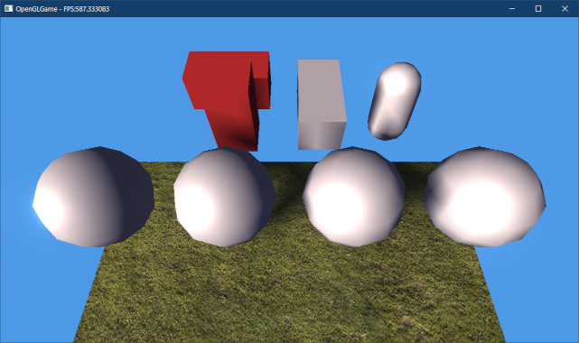
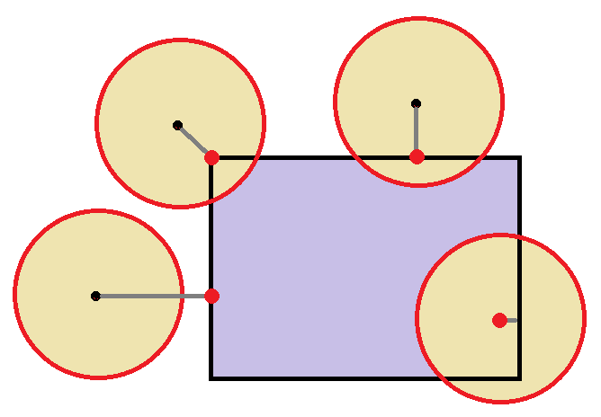
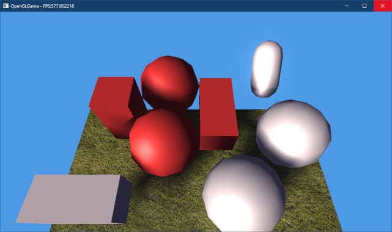
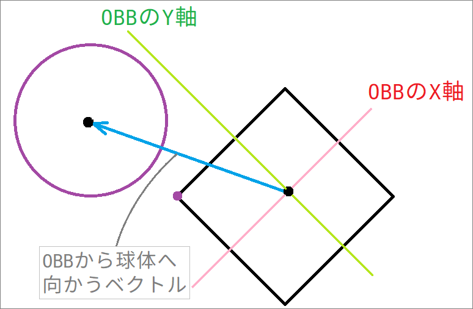
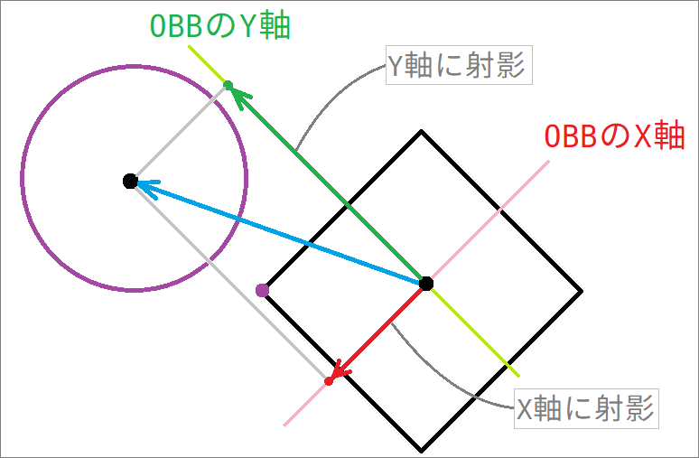
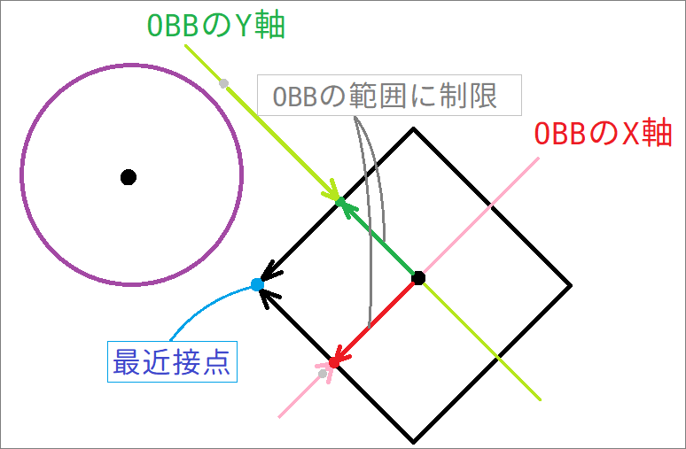
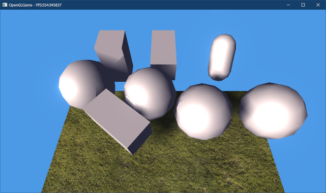

[OpenGL 3D 2022 後期 第07回]

# AABBとOBBの衝突判定

## 習得目標

* 「軸平行境界ボックス(AABB)」同士の衝突を判定する方法を説明できる。
* 「軸平行境界ボックス」と「球体」の衝突を判定する方法を説明できる。
* 「有向境界ボックス(OBB)」と「球体」の衝突を判定する方法を説明できる。
* 「軸平行境界ボックス(AABB)」と「有向境界ボックス(OBB)」の違いを説明できる。

## 1. 軸平行境界ボックス(AABB)

### 1.1 GameObjectのx,y,zメンバをベクトル型にする

`GameObject`は最初の頃に作成したクラスなので、座標や回転などのメンバがベクトル型になっていません。このままでは計算が面倒なので、ベクトル型で置き換えましょう。

`GameObject.h`を開き、`VecMath.h`をインクルードしてください。

```diff
 #define GAMEOBJECT_H_INCLUDED
 #include "Sprite.h"
 #include "Component.h"
+#include "VecMath.h"
 #include "Debug.h"
 #include <string>
```

次に、`GameObject`クラスの定義を次のように変更してください。

```diff
   void DrawStaticMesh(const ProgramPipeline& program) const;

   Engine* engine = nullptr;    // エンジンのアドレス
   std::string name;            // オブジェクト名
-  float x = 0;                 // X座標
-  float y = 0;                 // Y座標
-  float z = 0;                 // Z座標
-  float rotation[3] = { 0, 0, 0 }; // 回転
+  VecMath::vec3 position = { 0, 0, 0 }; // 座標
+  VecMath::vec3 rotation = { 0, 0, 0 }; // 回転
+  VecMath::vec3 scale = { 1, 1, 1 };    // 拡大率
   int priority = 0;            // 表示優先順位
   ComponentList componentList; // コンポーネント配列
```

次に`GameObject.cpp`を開き、`DrawStaticMesh`メンバ関数の定義を次のように変更してください。

```diff
   if (meshRendererList.empty()) {
     return;
   }

-  mat4 mt = mat4::Translate(vec3(x, y, z));
+  mat4 mt = mat4::Translate(position);
   mat4 mrx = mat4::RotateX(rotation[0]);
   mat4 mry = mat4::RotateY(rotation[1]);
   mat4 mrz = mat4::RotateZ(rotation[2]);
+  mat4 ms = mat4::Scale(scale);
-  const mat4 matGameObject = mt * mry * mrx * mrz;
+  const mat4 matGameObject = mt * mry * mrx * mrz * ms;
 
   for (const auto& e : meshRendererList) {
     if ( ! e->mesh) {
```

### 1.2 Engine.hをx,y,zメンバの変更に対応させる

続いて、ゲームエンジンを修正していきます。`Engine.h`を開き、`Create`メンバ関数テンプレートの定義を次のように変更してください。

```diff
   * ゲームオブジェクトを作成する
   */
   template<typename T>
   std::shared_ptr<T> Create(const std::string& name,
-    float x = 0, float y = 0)
+    const VecMath::vec3& position = { 0, 0, 0 })
   {
     std::shared_ptr<T> p = std::make_shared<T>();
     p->engine = this;
     p->name = name;
-    p->x = x;
-    p->y = y;
+    p->position = position;
     gameObjectList.push_back(p);
     return p;
```

次に、`CreateUI`メンバ関数テンプレートの定義を次のように変更してください。

```diff
   template<typename T>
   std::shared_ptr<T> CreateUI(size_t layerNo, const std::string& name,
-    float x = 0, float y = 0) {
+    const VecMath::vec3& position = { 0, 0, 0 }) {
     if (layerNo >= uiLayerList.size()) {
       return nullptr;
     }
     std::shared_ptr<T> p = std::make_shared<T>();
     p->engine = this;
     p->name = name;
-    p->x = x;
-    p->y = y;
+    p->position = position;
     uiLayerList[layerNo].gameObjectList.push_back(p);
     return p;
```

### 1.3 Engine.cppをx,y,zメンバの変更に対応させる

続いてCPPファイルを修正します。修正箇所が多いので大変ですが、がんばりましょう。
`Engine.cpp`を開き、`LoadGameObjectMap`メンバ関数の定義を次のように変更してください。

```diff
     // ゲームオブジェクトを作成
     auto gameObject = Create<GameObject>(meshName);
-    gameObject->x = t.x;
-    gameObject->y = t.y;
-    gameObject->z = t.z;
+    gameObject->position = t;
     // Unityは左手座標系なので、回転方向を右手座標系に変換する
-    gameObject->rotation[0] = radians(-r.x);
-    gameObject->rotation[1] = radians(-r.y);
-    gameObject->rotation[2] = radians(r.z);
+    gameObject->rotation =
+      vec3(radians(-r.x), radians(-r.y), radians(r.z));
+    gameObject->scale = s;
     auto renderer = gameObject->AddComponent<MeshRenderer>();
     renderer->mesh = mesh;
-    renderer->scale = s;

     // UnityからエクスポートしたOBJはX軸が反転しているので、Y軸で180度回転させる
     renderer->rotation.y = radians(180);
```

次に、`Initialize`メンバ関数にある「メインカメラを作成する」プログラムを、次のように変更してください。

```diff
   // メインカメラを作成
   cameraObject = Create<GameObject>("Main Camera");
-  cameraObject->y = 15;
-  cameraObject->rotation[0] =
+  cameraObject->position.y = 15;
+  cameraObject->rotation.x =
    -60.0f * acos(-1.0f) / 180.0f; // カメラを斜め下に向ける
   cameraObject->AddComponent<Camera>();
```

次に、`MainLoop`メンバ関数にある「パーティクルを更新」するプログラムを、次のように変更してください。

```diff
     // パーティクルを更新
     // カメラがZ軸方向を向くようにビュー行列を作成
-    const vec3 eye = vec3(cameraObject->x, cameraObject->y, cameraObject->z);
+    const vec3 eye = cameraObject->position;
     const vec3 target = vec3(
-      mat4::RotateX(cameraObject->rotation[0]) * vec4(0, 0, -1, 1));
+      mat4::RotateX(cameraObject->rotation.x) * vec4(0, 0, -1, 1));
     const mat4 matParticleView = mat4::LookAt(eye, eye + target, vec3(0, 1, 0));
     particleManager->Update(matParticleView, deltaTime);
```

次に、`CollideGameObject`メンバ関数にある、コライダーのワールド座標を計算するプログラムを、次のように変更してください。

```diff
     WorldCollider world;
     world.gameObject = e.get();
-    world.aabb = Add(e->GetAabb(), e->x, e->y);
+    world.aabb = Add(e->GetAabb(), e->position.x, e->position.y);
     world.collision.resize(local.size());
     for (size_t i = 0; i < local.size(); ++i) {
-      world.collision[i] = Add(local[i], e->x, e->y);
+      world.collision[i] = Add(local[i], e->position.x, e->position.y);
     }
     tmp.push_back(world);
```

それから、`MakeSpriteList`メンバ関数にもワールド座標を計算するプログラムがあるので、次のように変更してください。

```diff
     for (const auto& sprite : e->spriteList) {
       spriteList.push_back(sprite);
       Sprite& s = spriteList.back();
-      s.x += e->x;
-      s.y += e->y;
+      s.x += e->position.x;
+      s.y += e->position.y;
     } // for x
   } // for y
```

続いて、`DrawStaticMesh`メンバ関数にある「」を次のように変更してください。

```diff
   glProgramUniform4f(*progStandard3D, 3,
     camera.fovScaleX, camera.fovScaleY, camera.A, camera.B);
-  glProgramUniform3f(*progStandard3D, 4,
-    cameraObject->x, cameraObject->y, cameraObject->z);
+  glProgramUniform3fv(*progStandard3D, 4, 1, &cameraObject->position.x);
   glProgramUniform2f(*progStandard3D, 5,
-    sin(cameraObject->rotation[0]), cos(cameraObject->rotation[0]));
+    sin(cameraObject->rotation.x), cos(cameraObject->rotation.x));

   // ビューポートを設定
   glViewport(
```

これで、ゲームエンジンの修正は完了です。

<pre class="tnmai_assignment">
<strong>【課題01】</strong>
みなさんがゲームエンジンにコードを追加している場合、それらのコードでエラーが発生する可能性があります。<code>Ctrl+F7</code>キーを押して、ファイルのコンパイルに成功することを確認しなさい。
ゲームエンジンの全てのエラーを修正し、コンパイルが成功するようにしなさい。
</pre>

<pre class="tnmai_assignment">
<strong>【課題02】</strong>
<code>MainGameScene.cpp</code>をx,y,zメンバの変更に対応させて、ビルドが成功することを確認しなさい。
</pre>

<div style="page-break-after: always"></div>

### 1.4 軸平行境界ボックス(AABB)の定義を追加する

次は、球体と同じくらい簡単な図形である「軸平行境界ボックス(じく・へいこう・きょうかい・ボックス)」の衝突判定を作成しましょう。

軸平行境界ボックスは、2Dの衝突判定で使われる「長方形」にZ軸を加えて「直方体」にしたものです。長方形と同じく回転させることはできませんが、そのぶん高速に衝突判定を行えます。

「軸並行境界ボックス」だと長いので、以後は`AABB`(エーエービービー)と表記することにします(「軸平行境界ボックス」の英語名`Axis Aligned Bounding Box`(アクシス・アラインド・バウンディング・ボックス)の略称です)。

`Collision.h`を開き、次のプログラムを追加してください。

```diff
 #include "VecMath.h"

 namespace Collision {
+
+/**
+* 軸平行境界ボックス
+*/
+struct AABB
+{
+  VecMath::vec3 min = { 0, 0, 0 };
+  VecMath::vec3 max = { 0, 0, 0 };
+};

 /**
 * 球体
```

次に衝突判定関数を宣言します。関数名は球体と同じ`Intersect`(インターセクト)とします。球体同士の衝突判定関数の宣言の下に、次のプログラムを追加してください。

```diff
   float penetration;      // 貫通距離
 };

 bool Intersect(const Sphere& s0, const Sphere& s1, ContactPoint& cp);
+bool Intersect(const AABB& a, const AABB& b, ContactPoint& cp);

 } // namespace Collision
```

関数名は同じですが、引数の型が異なるのでオーバーロードすることができます。

### 1.5 AABBの衝突判定を追加する

続いて、AABB用の`Intersect`関数を定義します。球体用の`Intersect`関数の定義の下に、次のプログラムを追加してください。

```diff
   cp.position = s0.p - cp.normal * (s0.radius - cp.penetration * 0.5f);
   return true;
 }
+
+/**
+* AABBとAABBの衝突判定
+*
+* @param a   衝突判定を行うAABBその1
+* @param b   衝突判定を行うAABBその2
+* @param cp  衝突結果を格納するコンタクトポイント
+*
+* @retval true  衝突している
+* @retval false 衝突していない
+*/
+bool Intersect(const AABB& a, const AABB& b, ContactPoint& cp)
+{
+  // 衝突したかどうかを判定
+  for (int i = 0; i < 3; ++i) {
+    const float t0 = a.min[i] - b.max[i];
+    if (t0 > 0) {
+      return false; // 衝突していない
+    }
+
+    const float t1 = b.min[i] - a.max[i];
+    if (t1 > 0) {
+      return false; // 衝突していない
+    }
+  }
+
+  return true;
+}

 } // namespace Collision
```

2D長方形ではX軸とY軸の交差を調べました。3DのAABBの衝突判定では、X軸、Y軸に加えてZ軸の交差も調べます。とはいえ、判定方法自体は2D長方形と同じです。

しかし、今回は交差の有無だけでなくコンタクトポイントの情報も計算しなくてはなりません。そこで、`for`文を使って3つの軸をループ処理するようにしました。

衝突方向は、6つの面のうちで貫通距離が最も短い方向になります。そこで、貫通距離を比較して、最も短い方向を選択するプログラムを追加します。AABBの`Intersect`関数の定義に次のプログラムを追加してください。

```diff
 bool Intersect(const AABB& a, const AABB& b, ContactPoint& cp)
 {
+  int n = 0; // 衝突方向
+  cp.penetration = -FLT_MAX; // 貫通距離
+
   // 衝突したかどうかを判定
   for (int i = 0; i < 3; ++i) {
     const float t0 = a.min[i] - b.max[i];
     if (t0 > 0) {
       return false; // 衝突していない
     }
+    // 貫通距離が短い方向を衝突方向とする
+    if (t0 > cp.penetration) {
+      cp.penetration = t0;
+      n = i * 2;
+    }

     const float t1 = b.min[i] - a.max[i];
     if (t1 > 0) {
       return false; // 衝突していない
     }
+    // 貫通距離が短い方向を衝突方向とする
+    if (t1 > cp.penetration) {
+      cp.penetration = t1;
+      n = i * 2 + 1;
+    }
   }

   return true;
```

変数`n`は、衝突方向を示すインデックスで`0=+X方向`,`1=-X方向`,`2=+Y方向`, ..., `5=-Z方向`を示します。

「交差している場合は貫通距離がマイナスになる」ことに注意してください。このため、「貫通距離がより大きい」面を選択する必要があります。

これで衝突した面が分かるようになったので、衝突方向と衝突点を計算します。`for`ループの下に、次のプログラムを追加してください。

```diff
       n = i * 2 + 1;
     }
   }
+
+  // 衝突方向を設定
+  static const vec3 normal[] = {
+    { 1, 0, 0 }, {-1, 0, 0 },
+    { 0, 1, 0 }, { 0,-1, 0 },
+    { 0, 0, 1 }, { 0, 0,-1 }
+  };
+  cp.normal = normal[n];
+
+  // 衝突点を計算
+  for (int i = 0; i < 3; ++i) {
+    cp.position[i] =
+      std::max(a.min[i], b.min[i]) + std::min(a.max[i], b.max[i]);
+  }
+  cp.position *= 0.5f;
   return true;
 }
```

衝突点は、交差した領域の中心に設定します。

### 1.6 直方体を複数表示する

衝突判定をテストするために直方体を増やします。`MainGameScene.h`を開き、`box`メンバ変数の定義を次のように変更してください。

```diff
   virtual void Update(Engine& engine, float deltaTime) override;

 private:
-  GameObjectPtr box;
+  std::vector<GameObjectPtr> boxList;
   std::vector<GameObjectPtr> sphereList;
   GameObjectPtr capsule;
```

次に`MainGameScene.cpp`を開き、`Initialize`メンバ関数にある直方体を作成するプログラムを、次のように変更してください。

```diff
   groundRenderer->mesh = engine.LoadOBJ("Res/Model/Ground.obj");
   groundRenderer->scale = vec3(20);
   groundRenderer->rotation.x = pi * 0.5f;

+  boxList.resize(3);
+  for (int i = 0; i < boxList.size(); ++i) {
+    GameObjectPtr& box = boxList[i];
     box = engine.Create<GameObject>("Box");
     auto boxRenderer = box->AddComponent<MeshRenderer>();
     boxRenderer->mesh = engine.LoadOBJ("Box");
-    boxRenderer->scale.z = 4;
-    box->position = { -5, 5, -10 };
-    box->rotation.z = radians(30.0f);
+    boxRenderer->scale[i] = 2;
+    box->position = { -8 + i * 4.0f, 5, -10 };
+    boxRenderer->materials.push_back(
+      std::make_shared<Mesh::Material>(*boxRenderer->mesh->materials[0]));
+  }

   sphereList.resize(4);
   for (int i = 0; i < sphereList.size(); ++i) {
```

続いて`Update`メンバ関数の定義を次のように変更してください。

```diff
 void MainGameScene::Update(Engine& engine, float deltaTime)
 {
-  box->rotation[0] += radians(90.0f) * deltaTime;
   capsule->rotation[0] += radians(90.0f) * deltaTime;

-  // 0番目の球体を動かす
-  GameObjectPtr p = sphereList[0];
+  // 0番目の直方体を動かす
+  GameObjectPtr p = boxList[0];
   if (engine.GetKey(GLFW_KEY_W)) {
     p->position.z -= 10 * deltaTime;
```

プログラムが書けたらビルドして実行してください。3つの直方体が表示され、WASDキーで左端の直方体を移動させられたら成功です。

### 1.7 AABBの衝突判定をテストする

それでは、直方体からAABB形状の衝突判定を作成し、衝突を判定できるようにしましょう。
`Update`メンバ関数に次のプログラムを追加してください。

```diff
     // 表示色を初期状態に戻す
     renderer.materials[0]->baseColor = vec4(1);
   }
+
+  // 直方体からAABBを作成する
+  std::vector<Collision::AABB> aabb(boxList.size());
+  for (int i = 0; i < aabb.size(); ++i) {
+    auto& box = boxList[i];
+    auto& renderer = static_cast<MeshRenderer&>(*box->componentList[0]);
+    aabb[i].min = box->position - box->scale * renderer.scale;
+    aabb[i].max = box->position + box->scale * renderer.scale;
+    renderer.materials[0]->baseColor = vec4(1); // 表示色を初期状態に戻す
+  }

  // 衝突判定を行う
  for (auto a = s.begin(); a != s.end() - 1; ++a) {
```

次に、AABB同士の衝突判定を行います。やることは球体の場合とほとんど同じで、全てのAABBの組み合わせに対して`Intersect`関数を呼び出すだけです。球体同士の衝突判定を行うプログラムの下に、次のプログラムを追加してください。

```diff
       }
     } // for b
   } // for a
+
+  // AABBとAABBの衝突判定
+  for (auto a = aabb.begin(); a != aabb.end() - 1; ++a) {
+    for (auto b = a + 1; b != aabb.end(); ++b) {
+      Collision::ContactPoint cp;
+      if (Collision::Intersect(*a, *b, cp)) {
+        auto& ga = boxList[a - aabb.begin()];
+        auto& gb = boxList[b - aabb.begin()];
+        auto& pa = static_cast<MeshRenderer&>(*ga->componentList[0]);
+        auto& pb = static_cast<MeshRenderer&>(*gb->componentList[0]);
+
+        // 色を変える
+        pa.materials[0]->baseColor = vec4(1, 0.25f, 0.25f, 1);
+        pb.materials[0]->baseColor = vec4(1, 0.25f, 0.25f, 1);
+
+        // 重ならない位置に移動させる
+        const vec3 v = cp.normal * cp.penetration * 0.5f;
+        a->min -= v;
+        a->max -= v;
+        ga->position -= v;
+        b->min += v;
+        b->max += v;
+        gb->position += v;
+      }
+    } // for b
+  } // for a
 }
```

プログラムが書けたらビルドして実行してください。直方体を動かして他の直方体と衝突したとき、衝突した直方体の色が赤くなり、重ならないように移動できていたら成功です。

<p align="center">

</p>

>**【コピー&ペースト(貼り付け)、活用してますか？】**<br>
>上記のプログラムを作成するとき、どの程度コピー&ペーストを活用したでしょうか？<br>
>よく似た行が2行つづく部分が多いと気付いて、行をコピペすることは考えましたか？<br>
>「球体の衝突判定とほとんど同じ」という説明から、球体の衝突判定コードを丸ごとコピペすることは？<br>
>ここで言いたいことは、「コードの類似性を認識すること」です。よく似たコードを比較し、その違いを理解することは、よいプログラマになるために重要な技術です。常にコピペできる部分を探してください。<br>
>それから、「マウスを使わずにコピペする」ことを覚えましょう。`Shift+矢印キー`で範囲選択し、`Ctrl+C`でコピー、`Ctrl+V`でペーストができます。<br>
>`Ctrl+矢印キー`で単語単位にカーソル移動、`Shift+Ctrl+矢印キー`で単語単位に選択、も便利です。<br>
>また、マウスを使う場合でも、「ダブルクリックで単語選択」、「トリプルクリックで行選択」は、覚えておくと役に立つかもしれません。

### 1.8 AABBと点の最近接点を求める

球体とAABBの衝突を判定するには、まず「球体に対して最も近いAABB上の座標」を求めます。この座標のことを「最近接点(さいきんせつてん)」といいます。

<p align="center">
<br>
[黒点=球体の中心 赤点=最近接点]
</p>

最近接点が分かったら、そこから球体の中心までの距離と球体の半径を比較し、距離が半径以下ならば衝突していると判定します。

このような手順になるので、まずは「最近接点を求める関数」から作ることにします。
`Collision.h`を開き、次のプログラムを追加してください。

```diff
   float penetration;      // 貫通距離
 };
+
+VecMath::vec3 ClosestPoint(const AABB& aabb, const VecMath::vec3& p);

 bool Intersect(const Sphere& s0, const Sphere& s1, ContactPoint& cp);
 bool Intersect(const AABB& a, const AABB& b, ContactPoint& cp);
```

次に`Collision.cpp`を開き、`Collision`名前空間に次のプログラムを追加してください。

```diff
 using namespace VecMath;

 namespace Collision {
+
+/**
+* AABB上の最近接点を求める
+*
+* @param aabb  最近接点を求めるAABB
+* @param point 最近接点を求める座標
+*
+* @return pointからaabbへの最近接点
+*/
+vec3 ClosestPoint(const AABB& aabb, const vec3& point)
+{
+  return vec3(
+    std::clamp(point.x, aabb.min.x, aabb.max.x),
+    std::clamp(point.y, aabb.min.y, aabb.max.y),
+    std::clamp(point.z, aabb.min.z, aabb.max.z)
+  );
+}

 /**
 * 球体と球体の衝突判定
```

AABBから点への最近接点は、点の座標をAABBの範囲に制限することで求められます。<br>
「値をある範囲に制限する」には`clamp`(クランプ)関数を使います。

<p><code class="tnmai_code"><strong>【書式】</strong><br>
範囲制限後の値 std::clamp(元の値, 範囲の最小値, 範囲の最大値);
</code></p>

<div style="page-break-after: always"></div>

### 1.9 AABBと球体の衝突判定を追加する

それでは、球体とAABBの衝突判定を作成しましょう。`Collision.h`を開き、AABBとAABBの衝突判定を行う`Intersect`関数の宣言の下に、次のプログラムを追加してください。

```diff
 bool Intersect(const Sphere& s0, const Sphere& s1, ContactPoint& cp);
 bool Intersect(const AABB& a, const AABB& b, ContactPoint& cp);
+bool Intersect(const Sphere& sphere, const AABB& aabb, ContactPoint& cp);
+bool Intersect(const AABB& aabb, const Sphere& sphere, ContactPoint& cp);

 } // namespace Collision
```

次に`Collision.cpp`を開き、AABBとAABBの衝突判定を行う`Intersect`関数の定義の下に、次のプログラムを追加してください。

```diff
   cp.position *= 0.5f;
   return true;
 }
+
+/**
+* 球体とAABBの衝突判定
+*
+* @param sphere  衝突判定を行う球体
+* @param aabb    衝突判定を行うAABB
+* @param cp      衝突結果を格納するコンタクトポイント
+*
+* @retval true  衝突している
+* @retval false 衝突していない
+*/
+bool Intersect(const Sphere& sphere, const AABB& aabb, ContactPoint& cp)
+{
+  // 最近接点から球体の中心までの距離が、球体の半径より大きければ衝突していない
+  const vec3 p = ClosestPoint(aabb, sphere.p); // 最近接点
+  const vec3 d = sphere.p - p; // 最近接点から球体の中心へのベクトル
+  const float d2 = dot(d, d); // 距離の2乗
+  if (d2 > sphere.radius * sphere.radius) {
+    return false; // 衝突していない
+  }
+
+  return true;
+}

 } // namespace Collision
```

衝突の有無を調べるだけならこれで完了ですが、衝突に対するさまざまな応答を実現するためには「コンタクトポイント」を計算しなくてはなりません。衝突を判定するif文の下に、次のプログラムを追加してください。

```diff
   if (d2 > sphere.radius * sphere.radius) {
     return false; // 衝突していない
   }
+
+  if (d2 < 0.00001f) {
+    // 距離が0の場合、球体の中心はAABBの内部にある
+    // この場合、貫通距離が最も短い面から衝突したとみなす
+    int n = 0;
+    cp.penetration = -FLT_MAX;
+    for (int i = 0; i < 3; ++i) {
+      float t0 = p[i] - aabb.max[i];
+      if (t0 > cp.penetration) {
+        n = i * 2;
+        cp.penetration = t0;
+      }
+      float t1 = aabb.min[i] - p[i];
+      if (t1 > cp.penetration) {
+        n = i * 2 + 1;
+        cp.penetration = t1;
+      }
+    }
+
+    static const vec3 normal[] = {
+      { 1, 0, 0 }, {-1, 0, 0 },
+      { 0, 1, 0 }, { 0,-1, 0 },
+      { 0, 0, 1 }, { 0, 0,-1 }
+    };
+    cp.normal = normal[n];
+  } else {
+    // 距離が0より大きい場合、球体の中心はAABBの外側にある
+    // この場合、最近接から球体の中心へ向かう方向から衝突したとみなす
+    const float distance = std::sqrt(d2);
+    cp.normal = d * (1.0f / distance);
+    cp.penetration = distance - sphere.radius;
+  }
+  cp.position = p - cp.normal * cp.penetration * 0.5f;
   return true;
 }
```

コンタクトポイントの計算では、最近接点から球体中心までの距離によって処理を分ける必要があります。距離が0の場合、最近接点と球体の中心が一致します。これは球体の中心がAABBの内部にあることを意味します。

この場合、最近接点までの距離が最短となる面から衝突したとみなします。最短の面の求め方は、AABBとAABBの衝突判定とほとんど同じです。

距離が0より大きい場合、球体の中心はAABBの外側にあります。この場合、最近接点から球体中心へ向かう方向から衝突したとみなします。

続いて、引数の順序が逆のバージョンの関数を定義します。球体とAABBの衝突判定を行う
`Intersect`関数の定義の下に、次のプログラムを追加してください。

```diff
   cp.position = sphere.p - cp.normal * sphere.radius;
   return true;
 }
+
+/**
+* AABBと球体の衝突判定
+*
+* @param aabb    衝突判定を行うAABB
+* @param sphere  衝突判定を行う球体
+* @param cp      衝突結果を格納するコンタクトポイント
+*
+* @retval true  衝突している
+* @retval false 衝突していない
+*/
+bool Intersect(const AABB& aabb, const Sphere& sphere, ContactPoint& cp)
+{
+  if (Intersect(sphere, aabb, cp)) {
+    cp.normal = -cp.normal;
+    return true;
+  }
+  return false;
+}

 } // namespace Collision
```

引数の順序が逆の場合、衝突法線の向きを反転します。

### 1.10 球体とAABBの衝突判定をテストする

作成した「球体とAABBの衝突判定」が正しく動作するかどうか、テストプログラムを書いて確認しましょう。`MainGameScene.cpp`を開き、AABBとAABBの衝突判定の下に、次のプログラムを追加してください。

```diff
       }
     } // for b
   } // for a
+
+  // 球体とAABBの衝突判定
+  for (auto a = s.begin(); a != s.end(); ++a) {
+    for (auto b = aabb.begin(); b != aabb.end(); ++b) {
+      Collision::ContactPoint cp;
+      if (Collision::Intersect(*a, *b, cp)) {
+        auto& ga = sphereList[a - s.begin()];
+        auto& gb = boxList[b - aabb.begin()];
+        auto& pa = static_cast<MeshRenderer&>(*ga->componentList[0]);
+        auto& pb = static_cast<MeshRenderer&>(*gb->componentList[0]);
+
+        pa.materials[0]->baseColor = vec4(1, 0.25f, 0.25f, 1);
+        pb.materials[0]->baseColor = vec4(1, 0.25f, 0.25f, 1);
+
+        const vec3 v = cp.normal * cp.penetration * 0.5f;
+        a->p -= v;
+        ga->position = a->p;
+
+        b->min += v;
+        b->max += v;
+        gb->position += v;
+      }
+    } // for b
+  } // for a
 }
```

>コピー&ペーストは活用しましたか？

プログラムが書けたらビルドして実行してください。直方体を動かして球体と衝突したとき、衝突した直方体と球体の色が赤くなり、重ならないように移動できていたら成功です。

<p align="center">

</p>

>**【1章のまとめ】**
>
>* 「軸平行境界ボックス(AABB)」は、2Dの長方形を3Dに拡張した図形。
>* AABBを回転させることはできない。
>* AABBと球体の衝突を判定するには、球体からAABBへの最近接点を求め、球体中心から最近接点までの距離と球体の半径を比較する。

<div style="page-break-after: always"></div>

## 2. 衝突判定をコンポーネントにする

### 2.1 コライダーコンポーネントを追加する

1章では、球体とAABBの衝突判定を作成し、動作テストを行いました。本章では「コライダー・コンポーネント」を作成し、ゲームオブジェクトに衝突判定を割り当てられるようにしていきます。

プロジェクトの`Src/Component`フォルダに`Collider.h`(コライダー・エイチ)という名前のヘッダファイルを追加してください。追加したファイルを開き、次のプログラムを追加してください。

```diff
+/**
+* @file Collider.h
+*/
+#ifndef COMPONENT_COLLIDER_H_INCLUDED
+#define COMPONENT_COLLIDER_H_INCLUDED
+#include "../Component.h"
+#include "../Collision.h"
+#include "../VecMath.h"
+#include <memory>
+
+// 先行宣言
+class Collider;
+using ColliderPtr = std::shared_ptr<Collider>;
+
+/**
+* 衝突形状
+*/
+class Collider : public Component
+{
+public:
+  Collider() = default;
+  virtual ~Collider() = default;
+
+  // コライダーの形状
+  enum class Type {
+    Sphere, // 球体
+    AABB,   // 軸平行境界ボックス
+  };
+  virtual Type GetType() const = 0;
+
+  // 座標を変更する
+  virtual void AddPosition(const VecMath::vec3& translate) = 0;
+
+  // 座標変換したコライダーを取得する
+  virtual ColliderPtr GetTransformedCollider(
+    const VecMath::vec3& translation,
+    const VecMath::mat3& matRotation,
+    const VecMath::vec3& scale) = 0;
+};
+
+#endif // COMPONENT_COLLIDER_H_INCLUDED
```

`Type`列挙体と`GetType`メンバ関数は、実行時間のかかる`dynamic_cast`を避けるために使います。`AddPosition`(アド・ポジション)メンバ関数は、「コライダーの座標を変更」します。

`GetTransformedCollider`(ゲット・トランスフォームド・コライダー)メンバ関数は、「座標変換したコライダー」を作成して返します。

コライダーは形状によってメンバ変数が異なるため、座標にかかわる処理はコライダーごとに変える必要があります。そこで、座標を操作する処理は仮想関数として実装することにしました。

### 2.2 スフィアコライダーを追加する

次に、球体用のコライダーを追加します。名前は`SphereCollider`(スフィア・コライダー)とします。`Collider`クラスの定義の下に、次のプログラムを追加してください。

```diff
   };
   virtual Type GetType() const = 0;
 };
+
+/**
+* 球体用コライダー
+*/
+class SphereCollider : public Collider
+{
+public:
+  SphereCollider() = default;
+  virtual ~SphereCollider() = default;
+
+  // コライダーの形状
+  virtual Type GetType() const override { return Type::Sphere; }
+  const Collision::Sphere& GetShape() const { return sphere; }
+
+  // 座標を変更する
+  virtual void AddPosition(const VecMath::vec3& translate) override;
+
+  // 座標変換したコライダーを取得する
+  virtual ColliderPtr GetTransformedCollider(
+    const VecMath::vec3& translation,
+    const VecMath::mat3& matRotation,
+    const VecMath::vec3& scale) override;
+
+  Collision::Sphere sphere;
+};

 #endif // COMPONENT_COLLIDER_H_INCLUDED
```

それでは、メンバ関数を定義しましょう。プロジェクトの`Src/Component`フォルダに
`Collider.cpp`という名前のCPPファイルを追加してください。追加したファイルを開き、次のプログラムを追加してください。

```diff
+/**
+* @file Collider.cpp
+*/
+#include "Collider.h"
+
+using namespace VecMath;
+
+/*
+* 座標を変更する
+*/
+void SphereCollider::AddPosition(const vec3& translate)
+{
+  sphere.p += translate;
+}
+
+/*
+* 座標変換したコライダーを取得する
+*/
+ColliderPtr SphereCollider::GetTransformedCollider(
+  const vec3& translation,
+  const mat3& matRotation,
+  const vec3& scale)
+{
+  auto world = std::make_shared<SphereCollider>();
+  world->sphere.p = translation + matRotation * (sphere.p * scale);
+  world->sphere.radius = sphere.radius * std::max({scale.x, scale.y, scale.z});
+  return world;
+}
```

球体のスケールには、`scale`のうちで最大の値を使います。X, Y, Zで異なる拡大率を指定できるようにしないのは、それを許可すると球体ではなく楕円体になってしまうからです。

楕円体の衝突判定は球体と比べるとかなり複雑なため、リアルタイムな衝突判定には使えません。

### 2.3 AABBコライダーを追加する

球体と同様にAABB用のコライダーを追加します。名前は`AABBCollider`(エーエービービー・コライダー)とします。`SphereCollider`クラスの定義の下に、次のプログラムを追加してください。

```diff
   Collision::Sphere sphere;
 };
+
+/**
+* AABB用コライダー
+*/
+class AABBCollider : public Collider
+{
+public:
+  AABBCollider() = default;
+  virtual ~AABBCollider() = default;
+
+  // コライダーの形状
+  virtual Type GetType() const override { return Type::AABB; }
+  const Collision::AABB& GetShape() const { return aabb; }
+
+  // 座標を変更する
+  virtual void AddPosition(const VecMath::vec3& translate) override;
+
+  // 座標変換したコライダーを取得する
+  virtual ColliderPtr GetTransformedCollider(
+    const VecMath::vec3& translation,
+    const VecMath::mat3& matRotation,
+    const VecMath::vec3& scale) override;
+
+  Collision::AABB aabb;
+};

 #endif // COMPONENT_COLLIDER_H_INCLUDED
```

続いて、メンバ関数を定義します。<br>
`Collider.cpp`を開き、`SphereCollider::GteWorldCollider`メンバ関数の定義の下に、次のプログラムを追加してください。

```diff
   world->sphere.radius = sphere.radius * std::max({scale.x, scale.y, scale.z});
   return world;
 }
+
+/*
+* 座標を変更する
+*/
+void AABBCollider::AddPosition(const vec3& translate)
+{
+  aabb.min += translate;
+  aabb.max += translate;
+}
+
+/*
+* 座標変換したコライダーを取得する
+*/
+ColliderPtr AABBCollider::GetTransformedCollider(
+  const vec3& translation,
+  const mat3& matRotation,
+  const vec3& scale)
+{
+  auto world = std::make_shared<AABBCollider>();
+  auto center = (aabb.max + aabb.min) * 0.5f;
+  center = translation + matRotation * (center * scale);
+  auto s = (aabb.max - aabb.min) * 0.5f * scale;
+  world->aabb.max = center + s;
+  world->aabb.min = center - s;
+  return world;
+}
```

### 2.4 形状に対応する衝突判定を呼び出す関数を追加する

コライダーの衝突判定では、コライダーの種類によって、異なる衝突判定関数を呼び出さなくてはなりません。そこで、衝突判定関数を呼び分ける関数を作成します。`AABBCollider`クラスの定義の下に、次のプログラムを追加してください。

```diff
   virtual Type GetType() const override { return Type::AABB; }

   Collision::AABB aabb;
 };
+
+bool Intersect(const Collider& a, const Collider& b, Collision::ContactPoint& cp);

 #endif // COMPONENT_COLLIDER_H_INCLUDED
```

実際のコライダーの型に対応する衝突判定関数を呼び出すには、コライダーの型ごとに関数を呼び分ける機能が必要です。

ただ、今は球体とAABBだけなのでまだいいのですが、これから図形を増やすとなると、全ての型の組み合わせについて機能を用意するのは結構手間がかかります。

そこで、関数テンプレートを使います。関数テンプレートを使うことで、テンプレートパラメータによって異なる関数を呼び分けられます。`Collider.cpp`を開き、次のプログラムを追加してください。

```diff
 #include "Collider.h"

 using namespace VecMath;
+
+namespace /* unnamed */ {
+
+/**
+* コライダー型に対応する衝突判定関数を呼び出す
+*/
+template<typename T, typename U>
+bool Func(const Collider& a, const Collider& b,
+  Collision::ContactPoint& cp)
+{
+  return Intersect(static_cast<const T&>(a).GetShape(),
+    static_cast<const U&>(b).GetShape(), cp);
+}
+
+} // unnamed namespace

 /*
 * 座標を変更する
```

続いて、`Func`(ファンク)関数テンプレートを利用して衝突判定関数を呼び分ける
`Intersect`関数を追加します。無名名前空間の下に、次のプログラムを追加してください。

```diff
 }

 } // unnamed namespace
+
+/**
+* コライダーの衝突判定
+*
+* @param a   衝突判定を行うコライダーその1
+* @param b   衝突判定を行うコライダーその2
+* @param cp  衝突結果を格納するコンタクトポイント
+*
+* @retval true  衝突している
+* @retval false 衝突していない
+*/
+bool Intersect(const Collider& a, const Collider& b,
+  Collision::ContactPoint& cp)
+{
+  // 関数ポインタ型を定義
+  using FuncType =
+    bool(*)(const Collider&, const Collider&, Collision::ContactPoint&);
+
+  // 関数テーブル
+  static const FuncType funcList[2][2] = {
+    {
+      Func<SphereCollider, SphereCollider>,
+      Func<SphereCollider, AABBCollider>,
+    }, {
+      Func<AABBCollider, SphereCollider>,
+      Func<AABBCollider, AABBCollider>,
+    },
+  };
+
+  // コライダーの型に対応する衝突判定関数を実行
+  const int shapeA = static_cast<int>(a.GetType());
+  const int shapeB = static_cast<int>(b.GetType());
+  return funcList[shapeA][shapeB](a, b, cp);
+}
```

`FuncType`(ファンク・タイプ)は「関数ポインタ型」の定義です。関数ポインタ型を定義するには、関数名の部分に`(*)`を指定します。

`funcList`(ファンク・リスト)は関数ポインタの二次元配列です。ここではコライダーの型によって関数を呼び分けるために使っています。

ここでは、`GetType`仮想関数によって型の番号を取得することで、実際の型に対応する関数を呼び出しています。もし`GetType`がなかったら、`dynamic_cast`で型を識別したうえで、さらに`if`や`switch`で分岐させる必要があったでしょう。

このプログラムのように「複数の型の組み合わせによって実行する関数を変えたい」場合、仮想関数では難しいことがあります。これは、仮想関数は「自身の型」しか考慮できないためです。

そこで、「関数ポインタと多次元配列を利用して、実行する関数を切り替える」方法を使うことにしました。これは「関数テーブル」と呼ばれる方法です。

>**【関数テーブル以外の方法】**<br>
>「ダブルディスパッチ」という、「仮想関数とオーバーロードを組み合わせる技法」を使うと、関数テーブルを置き換えることができます。またClojure(クロージャ)という言語には、「クラスのペアに対して実装を定義する」機能があり、関数テーブルもダブルディスパッチも必要ありません。

### 2.5 ゲームオブジェクトにコライダー配列を追加する

コライダーの操作を高速化するため、ゲームオブジェクトには「コライダー専用の配列」を持たせることにします。`GameObject.h`を開き、次の先行宣言を追加してください。

```diff
 class MeshRenderer;
 using MeshRendererPtr = std::shared_ptr<MeshRenderer>;
 class ProgramPipeline;
+class Collider;
+using ColliderPtr = std::shared_ptr<Collider>;

 /**
 * ゲーム内に登場するさまざまなオブジェクトを表す基本クラス
```

次に、`GameObject`クラスの定義に次のプログラムを追加してください。

```diff
   bool isStarted = false;      // Start実行済みフラグ
 
   std::vector<MeshRendererPtr> meshRendererList;
+  std::vector<ColliderPtr> colliderList;
 };

 #endif // GAMEOBJECT_H_INCLUDED
```

続いて、`AddComponent`メンバ関数テンプレートの定義に次のプログラムを追加してください。

```diff
     if constexpr (std::is_base_of<MeshRenderer, T>::value) {
       meshRendererList.push_back(p);
     }
+    // コライダーを専用リストに追加
+    if constexpr (std::is_base_of<Collider, T>::value) {
+      colliderList.push_back(p);
+    }
     return p;
   }
```

このように、全てのコライダーを`Collider`クラスから継承する利点は、さまざまな図形をを単一の配列にまとめて管理できることにあります。

これで、`Collider`クラスの派生クラスは`colliderList`配列にも追加されるようになりました。

<div style="page-break-after: always"></div>

>**【クラス階層またはプログラムの設計について】**<br>
>`Collider`基底クラスを定義したのは、「本テキストの設計方針でしかない」ことに注意してください。
>
>コライダーを`Collider`ポインタではなく、`Component`ポインタの配列として管理することも可能です。その場合、コライダーの種類を調べるために`dynamic_cast`を使ったり、図形ごとに配列を分ける、といった方法が考えられます。
>これらを踏まえて、今回は、以下の理由でクラス階層を設計しました。
>
>&emsp;&emsp;A. C++の`dynamic_cast`は低速なため避けたい。<br>
>&emsp;&emsp;B. 将来、図形を追加するたびにその図形を管理する配列を追加したくない。<br>
>&emsp;&emsp;C. 複数の配列を持つことでメモリ消費量が増大するのは避けたい。
>
>`Collider`基底クラスの目的は以下の2つです。
>
>1. `GetType`関数によって実際の型を識別することで、低速な`dynamic_cast`を避ける。
>2. コライダー共通の仮想関数を定義することで、コライダーの基本操作では型の識別を不要にする。
>
>しかし、例えば「`Component`クラス自体にクラスIDを取得する機能がある」場合、1の目的は不要です。また、`switch`等による分岐を<ruby>厭<rt>いと</rt></ruby>わないなら、`static_cast`で高速にキャストし、型固有の基本操作を呼び出すのは簡単です。<br>
>他の例として、C#などの「`dynamic_cast`相当の操作が高速に行える言語」では、キャストを避ける理由は弱くなります。
>また、JavaScriptやRubyのように「実行時に適切な変数・関数を持っていればよい」タイプの言語では、クラス階層自体の必要性が低くなります。
>
>このように、プログラムの設計には「唯一絶対の正解」などは存在しません。「ある環境、ある瞬間における最良に近い設計」がせいぜいで、そういった設計が複数考えられることも多いです。
>結局、プログラマが目指すのは「根拠を十分に説明できる設計」ということになります。

### 2.6 WorldCollider構造体を定義する

ゲームオブジェクトの衝突判定は、`Engine`クラスの`CollideGameObject`(コライド・ゲームオブジェクト)メンバ関数で行っています。この関数を3Dの衝突判定用に改造していきます。

まずは、ヘッダファイルをインクルードしましょう。`Engine.cpp`を開き、`Collider.h`をインクルードしてください。

```diff
 #include "VertexArray.h"
 #include "Component/Camera.h"
 #include "Component/MeshRenderer.h"
+#include "Component/Collider.h"
 #include <Windows.h>
 #include <fstream>
```

次に、「ワールド座標系における衝突判定」を管理する構造体を作成します。`VecMath`名前空間をusing宣言している行の下に、次のプログラムを追加してください。

```diff
 #include <filesystem>

 using namespace VecMath;
+
+/**
+* ワールド座標系の衝突判定を表す構造体
+*/
+struct WorldCollider
+{
+  // ゲームオブジェクトと衝突判定の座標を変更する
+  void AddPosition(const vec3& v)
+  {
+    gameObject->position += v;
+    for (auto& e : collidersList) {
+      e->AddPosition(v);
+    }
+  }
+
+  // 他のワールドコライダーとの衝突判定を行う
+  std::vector<Collision::ContactPoint> DetectCollision(WorldCollider& other)
+  {
+    std::vector<Collision::ContactPoint> cpList;
+    for (auto& ca : colliderList) {
+      for (auto& cb : other.colliderList) {
+        Collision::ContactPoint cp;
+        if ( ! Intersect(*ca, *cb, cp)) {
+          continue; // 衝突していない
+        }
+
+        // 衝突した
+        cpList.push_back(cp);
+
+        // 座標を戻す
+        const vec3 v = cp.normal * cp.penetration * 0.5f;
+        AddPosition(-v);
+        other.AddPosition(v);
+      } // for cb
+    } // for ca
+
+    return cpList;
+  }
+
+  GameObject* gameObject; // コライダーを所有するゲームオブジェクト
+  std::vector<ColliderPtr> colliderList; // コライダー配列
+};

 /**
 * OpenGLからのメッセージを処理するコールバック関数
```

この`WorldCollider`(ワールド・コライダー)構造体は、`CollideGameObject`メンバ関数内で定義していた同名のローカル構造体を置き換えるためのものです。

ということで、`CollideGameObject`メンバ関数にある`WorldCollider`構造体をの定義を削除してください。

```diff
 void Engine::CollideGameObject()
 {
-  struct WorldCollider
-  {
-    GameObject* gameObject;
-    Rect aabb;
-    RectList collision;
-  };

   // ワールド座標のコライダーを計算
   std::vector<WorldCollider> tmp;
```

### 2.7 衝突判定を3D用コライダーに対応させる

続いて、衝突判定プログラムを、コライダーコンポーネントを使うように変更します。手始めに
`WorldCollider`を作成するプログラムを修正しましょう。`CollideGameObject`メンバ関数の定義を次のように変更してください。

```diff
     if ( ! e->IsStarted() || e->isDead) {
       continue;
     }

     // ワールド座標 = ローカル座標 + ゲームオブジェクトの座標
-    const RectList& local = e->GetCollision();
+    const auto& local = e->colliderList;
     if (local.empty()) {
       continue;
     }
+
+    const mat3 matRotation = mat3(mat4::RotateY(e->rotation.y) *
+      mat4::RotateX(e->rotation.x) * mat4::RotateZ(e->rotation.z));

     WorldCollider world;
     world.gameObject = e.get();
-    world.aabb = Add(e->GetAabb(), e->x, e->y);
-    world.collision.resize(local.size());
+    world.colliderList.resize(local.size());
     for (size_t i = 0; i < local.size(); ++i) {
-      world.collision[i] = Add(local[i], e->x, e->y);
+      world.colliderList[i] =
+        local[i]->GetTransformedCollider(e->position, matRotation, e->scale);
     }
     tmp.push_back(world);
```

次に衝突判定を修正します。「コライダーの衝突判定」を行うプログラムを、次のように変更してください。

```diff
       if (pb->gameObject->isDead) {
         continue; // pbが死んでいるなら衝突しない
       }
-      if ( ! Overlap(pa->aabb, pb->aabb)) {
-        continue; // 衝突していない
-      }
-      if ( ! Overlap(pa->collision, pb->collision)) {
-        continue; // 衝突していない
-      }
+
+      auto cpList = pa->DetectCollision(*pb);
+      if ( ! cpList.empty()) {
         // 衝突しているので、衝突イベント関数を実行
         pa->gameObject->OnCollision(*pb->gameObject);
         pb->gameObject->OnCollision(*pa->gameObject);
         if (pa->gameObject->isDead) {
           break; // paが死んでいるならループを打ち切る
         }
+      } // if cpList
     } // for pb
   } // for pa
```

これで、衝突判定をコライダーに対応させることができました。

### 2.8 ゲームオブジェクトにコライダーを割り当てる

変更した衝突判定プログラムが、意図したように動作することを確かめましょう。そのために、ゲームオブジェクトにコライダーを割り当てます。

`MainGameScene.cpp`を開き、`Initialize`メンバ関数にある直方体を作成するプログラムに、次のプログラムを追加してください。

```diff
     boxRenderer->materials.push_back(
       std::make_shared<Mesh::Material>(*boxRenderer->mesh->materials[0]));
+
+    // コライダーを割り当てる
+    auto collider = box->AddComponent<AABBCollider>();
+    collider->aabb.min = boxRenderer->translate - boxRenderer->scale;
+    collider->aabb.max = boxRenderer->translate + boxRenderer->scale;
   }

   sphereList.resize(4);
```

`Box`メッシュは半径1の立方体なので、コライダーの大きさはレンダラーの`scale`をそのまま指定することができます。

次に、球体コライダーを割り当てます。球体を作成するプログラムに、次のプログラムを追加してください。

```diff
     sphereRenderer->materials.push_back(
       std::make_shared<Mesh::Material>(*sphereRenderer->mesh->materials[0]));
+
+    // コライダーを割り当てる
+    auto collider = sphere->AddComponent<SphereCollider>();
+    collider->sphere.p = sphereRenderer->translate;
+    collider->sphere.radius = std::max({
+      sphereRenderer->scale.x,
+      sphereRenderer->scale.y,
+      sphereRenderer->scale.z });
   }

   return true;
```

球体の大きさは`scale`のX, Y, Zの最大値を選択しています。

>一般的に、球体コライダーを持つゲームオブジェクトは、X, Y, Zに同じ拡大率を指定するべきです。

### 2.9 MainGameSceneからテストコードを取り除く

最後に衝突判定のテストコードを削除し、コライダーが機能することを確認しましょう。
`Update`メンバ関数の衝突判定テストを削除してください。

```diff
     p->position.x += 10 * deltaTime;
   }

-  // 衝突判定のテスト
-
-  // ゲームオブジェクトから球体の衝突判定を作成する
-  std::vector<Collision::Sphere> s;
-  s.resize(sphereList.size());
-            ・
-            ・
-            ・
-    } // for b
-  } // for a
 }
```

テストコードを削除したら、プログラムをビルドして実行してください。色は変化しなくなっているものの、互いに押し合うような挙動が再現されていたら成功です。

>**【2章のまとめ】**
>
>* 基底クラスのポインタから実際の型を識別するには、`dynamic_cast`以外に「識別用の仮想関数を定義する」方法がある。
>* 座標の移動などの処理方法がクラスによって異なる場合、基底クラスに仮想関数を宣言し、派生クラスで固有の処理を実装するとよい。
>* 2つ以上の型の組み合わせによって実行する関数が異なる場合、仮想関数ではなく、「組み合わせに対応した関数ポインタ配列」を

<div style="page-break-after: always"></div>

## 3. 有向境界ボックス(OBB)

### 3.1 OBBの定義を追加する

有向境界(ゆうこう・きょうかい)ボックスは、簡単に言えば「回転可能なAABB」です。「有向」という名前は、「ワールド座標系のXYZ軸以外の、固有の軸を持っている」ことから来ています。

有向境界ボックスは、英語では`Oriented Bounding Box`(オリエンテッド・バウンディング・ボックス)と呼ばれます。以後は英語名の略称`OBB`(オービービー)と表記します。

それではOBBの定義を追加しましょう。`Collision.h`を開き、`Sphere`構造体の定義の下に、次のプログラムを追加してください。

```diff
   VecMath::vec3 p; // 中心の座標
   float radius;    // 半径
 };
+
+/**
+* 有向境界ボックス(OBB)
+*/
+struct Box
+{
+  VecMath::vec3 p = { 0, 0, 0 }; // 中心の座標
+  VecMath::vec3 axis[3] =
+    { { 1, 0, 0 }, { 0, 1, 0 }, { 0, 0, 1 } }; // 固有軸
+  VecMath::vec3 scale = { 1, 1, 1 }; // 各軸方向の大きさ
+};

 /**
 * 衝突情報を保持する構造体
```

OBBは「中心座標」、「固有軸(X, Y, Z)」、「大きさ」の3つのパラメータで定義されます。

次に衝突判定関数を宣言します。ただ、OBB同士の衝突判定はかなり複雑なので、先に球体とOBBの衝突判定から作成することにします。AABBと球体の衝突判定関数の宣言の下に、次のプログラムを追加してください。

```diff
 };

 VecMath::vec3 ClosestPoint(const AABB& aabb, const VecMath::vec3& p);
+VecMath::vec3 ClosestPoint(const Box& box, const VecMath::vec3& p);

 bool Intersect(const Sphere& s0, const Sphere& s1, ContactPoint& cp);
 bool Intersect(const AABB& a, const AABB& b, ContactPoint& cp);
 bool Intersect(const Sphere& sphere, const AABB& aabb, ContactPoint& cp);
 bool Intersect(const AABB& aabb, const Sphere& sphere, ContactPoint& cp);
+bool Intersect(const Sphere& sphere, const Box& box, ContactPoint& cp);
+bool Intersect(const Box& box, const Sphere& sphere, ContactPoint& cp);

 } // namespace Collision
```

### 3.2 OBBと点の最近接点を求める

OBBと球体の衝突判定は、AABBと同様に「最近接点」を求めることで行います。そこで、まずは最近接点を求める`ClosestPoint`(クローゼスト・ポイント)関数を定義します。

<p align="left">
&nbsp;1. OBBの中心から球体中心へのベクトルを求める<br>
&nbsp;2. ベクトルをOBBのX, Y, Z軸に射影する<br>
&nbsp;3. 射影した長さをOBBのサイズに制限する
</p>

AABBと点の最近接点を求める`ClosestPoint`関数の定義の下に、次のプログラムを追加してください。

```diff
     std::clamp(point.z, aabb.min.z, aabb.max.z)
   );
 }
+
+/**
+* OBB上の最近接点を求める
+*
+* @param box   最近接点を求めるOBB
+* @param point 最近接点を求める座標
+*
+* @return pointからboxへの最近接点
+*/
+vec3 ClosestPoint(const Box& box, const vec3& point)
+{
+  vec3 v = point - box.p;
+  vec3 p = box.p;
+  for (int i = 0; i < 3; ++i) {
+    float d = dot(box.axis[i], v);
+    d = std::clamp(d, -box.scale[i], box.scale[i]);
+    p += box.axis[i] * d;
+  }
+  return p;
+}

 /**
 * 球体と球体の衝突判定
```

AABBの場合と同様に、`clamp`関数によって、点の座標をOBBの範囲内に制限することで最近接点が求められます。違いは、内積によって「点の座標をOBBの固有軸に射影する」部分です。

>球体とAABBの最近接点の計算では、射影は省略されています。これは「AABBの固有軸」と「ワールド座標系の固有軸」が等しいためです。例えば、AABBのX軸は(1,0,0)なので、座標(x,y,z)との内積はxとなります。同様に、Y軸の内積はy, Z軸の内積はzになるため、計算の必要がないのです。

### 3.3 OBBの衝突判定を追加する

それでは、球体とOBB用の`Intersect`関数を定義しましょう。AABBと球体用の`Intersect`関数の定義の下に、次のプログラムを追加してください。

```diff
   }
   return false;
 }
+
+/**
+* 球体とOBBの衝突判定
+*
+* @param sphere  衝突判定を行う球体
+* @param obb     衝突判定を行うOBB
+* @param cp      衝突結果を格納するコンタクトポイント
+*
+* @retval true  衝突している
+* @retval false 衝突していない
+*/
+bool Intersect(const Sphere& sphere, const Box& box, ContactPoint& cp)
+{
+  // 最近接点から球体の中心までの距離が、球体の半径より大きければ衝突していない
+  vec3 p = ClosestPoint(box, sphere.p);
+  vec3 d = sphere.p - p;
+  float d2 = dot(d, d);
+  if (d2 > sphere.radius * sphere.radius) {
+    return false;
+  }
+
+  return true;
+}

 } // namespace Collision
```

球体とOBBの衝突判定の内容は、球体とAABBの衝突判定と非常によく似ています。実際、上記のプログラムは「球体とAABBの衝突判定」と全く同じで、呼び出している`ClosestPoint`関数が異なるだけです。

次に、コンタクトポイントを計算します。距離を判定するプログラムの下に、次のプログラムを追加してください。

```diff
   if (d2 > sphere.radius * sphere.radius) {
     return false;
   }
+
+  if (d2 < 0.00001f) {
+    // 距離が0の場合、球体の中心はOBBの内部にある
+    // この場合、貫通距離が最も短い面から衝突したとみなす
+    const vec3 a = p - box.p; // OBB中心から球体中心へのベクトル
+    cp.penetration = -FLT_MAX;
+    for (int i = 0; i < 3; ++i) {
+      float f = dot(box.axis[i], a); // 固有軸へ射影
+      float t0 = f - box.scale[i];
+      if (t0 > cp.penetration) {
+        cp.normal = box.axis[i];
+        cp.penetration = t0;
+      }
+      float t1 = -box.scale[i] - f;
+      if (t1 > cp.penetration) {
+        cp.normal = -box.axis[i];
+        cp.penetration = t1;
+      }
+    }
+    // 貫通距離に球の半径を加える(貫通距離は常にマイナス)
+    cp.penetration -= sphere.radius;
+  } else {
+    // 距離が0より大きい場合、球体の中心はOBBの外側にある
+    // この場合、最近接から球体の中心へ向かう方向から衝突したとみなす
+    const float distance = std::sqrt(d2);
+    cp.normal = d * (1.0f / distance);
+    cp.penetration = distance - sphere.radius;
+  }
+  cp.position = p - cp.normal * cp.penetration * 0.5f;
   return true;
 }
```

この部分もAABBの場合とほとんど同じです。ただし、座標を固有軸へ射影するコードが追加され、距離の計算をOBBのローカル座標系で行っている点が異なります。また、距離が0より大きい場合のコードは、AABBの場合と完全に同じです。

続いて、引数の順序が逆のバージョンの関数を定義します。球体とOBBの衝突判定を行う
`Intersect`関数の定義の下に、次のプログラムを追加してください。

```diff
   cp.position = p - cp.normal * cp.penetration * 0.5f;
   return true;
 }
+
+/**
+* OBBと球体の衝突判定
+*
+* @param box     衝突判定を行うOBB
+* @param sphere  衝突判定を行う球体
+* @param cp      衝突結果を格納するコンタクトポイント
+*
+* @retval true  衝突している
+* @retval false 衝突していない
+*/
+bool Intersect(const Box& box, const Sphere& sphere, ContactPoint& cp)
+{
+  if (Intersect(sphere, box, cp)) {
+    cp.normal = -cp.normal;
+    return true;
+  }
+  return false;
+}

 } // namespace Collision
```

### 3.4 ボックスコライダーを追加する

次に、ボックスコライダーを追加します。`Collider.h`を開き、`Type`列挙体の定義に次のプログラムを追加してください。

```diff
   enum class Type {
     Sphere, // 球体
     AABB,   // 軸平行境界ボックス
+    Box,    // 有向境界ボックス
   };
   virtual Type GetType() const = 0;
```

OBB用コライダークラスの名前は`BoxCollider`(ボックス・コライダー)とします。
`AABBCollider`クラスの定義の下に、次のプログラムを追加してください。

```diff
   Collision::AABB aabb;
 };
+
+/**
+* OBB用コライダー
+*/
+class BoxCollider : public Collider
+{
+public:
+  BoxCollider() = default;
+  virtual ~BoxCollider() = default;
+
+  // 図形を取得する
+  virtual Type GetType() const override { return Type::Box; }
+  const Collision::Box& GetShape() const { return box; }
+
+  // 座標を変更する
+  virtual void AddPosition(const VecMath::vec3& translate) override;
+
+  // 座標変換したコライダーを取得する
+  virtual ColliderPtr GetTransformedCollider(
+    const VecMath::vec3& translation,
+    const VecMath::mat3& matRotation,
+    const VecMath::vec3& scale) override;
+
+  Collision::Box box;
+};

 #endif // COMPONENT_COLLIDER_H_INCLUDED
```

次にメンバ関数を定義します。`Collider.cpp`を開き、`AABBCollider`クラスの
`GetTransformedCollider`メンバ関数の定義の下に、次のプログラムを追加してください。

```diff
   world->aabb.min = center - s;
   return world;
 }
+
+/*
+* 座標を変更する
+*/
+void BoxCollider::AddPosition(const vec3& translate)
+{
+  box.p += translate;
+}
+
+/*
+* 座標変換したコライダーを取得する
+*/
+ColliderPtr BoxCollider::GetTransformedCollider(
+  const vec3& translation,
+  const mat3& matRotation,
+  const vec3& scale)
+{
+  auto world = std::make_shared<BoxCollider>();
+  world->box.p = translation + matRotation * (box.p * scale);
+  for (int i = 0; i < 3; ++i) {
+    world->box.axis[i] = matRotation * box.axis[i];
+  }
+  world->box.scale = box.scale * scale;
+  return world;
+}

 /**
 * コライダー同士の衝突判定
```

OBBの場合、固有軸を回転させるfor文があることに注目してください。

### 3.5 関数テーブルにOBBを追加する

続いて、関数テーブルにOBBを追加するのですが、OBB同士の衝突判定などまだ実装していない組み合わせが存在します。実装していない組み合わせの場合は常に`false`を返すようにしたいです。

そこで、「衝突しない組み合わせに使う関数」を定義します。`Collider.cpp`を開き、
`Func`関数テンプレートの定義の下に、次のプログラムを追加してください。

>テンプレートの特殊化によって対処する方法もあります。

```diff
   return Intersect(static_cast<const T&>(a).GetShape(),
     static_cast<const U&>(b).GetShape(), cp);
 }
+
+/**
+* 衝突しない組み合わせに使う関数
+*/
+bool NotCollide(const Collider& a, const Collider& b,
+  Collision::ContactPoint& cp)
+{
+  return false;
+}

 } // unnamed namespace
```

次に関数テーブルを修正します。`Intersect`関数にある`funcList`変数の定義を次のように変更してください。

```diff
+  // 関数テーブル
-  static const FuncType funcList[2][2] = {
+  static const FuncType funcList[3][3] = {
     {
       Func<SphereCollider, SphereCollider>,
       Func<SphereCollider, AABBCollider>,
+      Func<SphereCollider, BoxCollider>,
     }, {
       Func<AABBCollider, SphereCollider>,
       Func<AABBCollider, AABBCollider>,
+      NotCollide,
+    }, {
+      Func<BoxCollider, SphereCollider>,
+      NotCollide,
+      NotCollide,
     },
   };
```

### 3.6 直方体のコライダーを変更する

それでは、球体とOBBの衝突判定をテストしましょう。`MainGameScene.cpp`を開き、
`Initialize`メンバ関数にある、直方体にコライダーを割り当てるプログラムを次のように変更してください。

```diff
     boxRenderer->materials.push_back(
       std::make_shared<Mesh::Material>(*boxRenderer->mesh->materials[0]));

     // コライダーを割り当てる
-    auto collider = box->AddComponent<AABBCollider>();
-    collider->aabb.min = boxRenderer->translate - boxRenderer->scale;
-    collider->aabb.max = boxRenderer->translate + boxRenderer->scale;
+    auto collider = box->AddComponent<BoxCollider>();
+    collider->box.scale = boxRenderer->scale;
  }
```

これだけだと回転に対応できているか分からないので、スペースバーを押すと直方体が回転するようにしましょう。`Update`メンバ関数に次のプログラムを追加してください。

```diff
   if (engine.GetKey(GLFW_KEY_D)) {
     p->position.x += 10 * deltaTime;
   }
+  if (engine.GetKey(GLFW_KEY_SPACE)) {
+    p->rotation.y += radians(90) * deltaTime;
+  }
 }
```

プログラムが書けたらビルドして実行してください。直方体と球体が、直方体の面に沿って衝突するようになっていたら成功です。

<p align="center">

</p>

>**【3章のまとめ】**
>
>* 「有向境界ボックス(OBB)」は「回転可能なAABB」で、固有の軸と大きさを持つ。
>* 球体とOBBの最近接点は、OBBから球体へのベクトルを、OBBの固有軸に射影することで計算できる。
