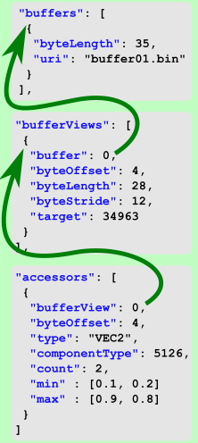
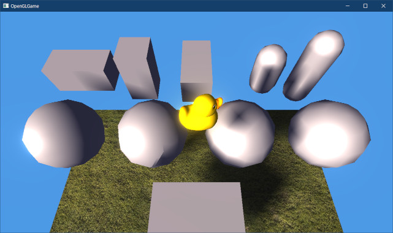

[OpenGL 3D 2022 後期 第09回]

# glTFファイルとJSON形式

## 習得目標

* JSONファイルの構成要素を説明できる。
* バッファ、バッファビュー、アクセサの関係を説明できる。
* 適切なキー文字列を使って、頂点アトリビュートの作成に必要なデータ取得できる。
* 適切なキー文字列を使って、マテリアルの作成に必要なデータ取得できる。

## 1. glTFとJSON

### 1.1 glTFについて

OBJファイルは仕様が比較的単純であり、しかもテキスト形式であることから、最初に扱う3Dモデル用のファイル形式としては優秀です。

ですが、なにぶんにも古くからある形式なので、近代的なグラフィックス機能には対応していません。そこで、より近代的なファイル形式を読み込む機能を追加します。

今回選んだのは`glTF`(ジーエル・ティー・エフ)というファイル形式です。

「glTF」は「GL Transmission Format(ジーエル・トランスミッション・フォーマット)」を略したもので、OpenGLの標準化団体である「クロノス・グループ」によって開発されました。

glTFは比較的新しいファイル形式で、バージョン1.0は2015年、バージョン2.0は2017に公開されています。

glTFの主要な特徴は以下の２つです。

>1. 「JSON(ジェイソン)」という、単純なデータ記述用の言語を元に作られている。
>2. OpenGLの標準化団体が開発しただけあって、OpenGL(およびその後継であるVulkan)との親和性が高いファイル形式になっている。

OpenGLとの親和性の高さは、今回扱うファイル形式としてglTFを選んだ理由でもあります。

>**【glTF仕様のありか】**<br>
>glTFの仕様は以下のURLで公開されています。翻訳機能を使って、2章、3章に軽く目を通しておいてください。<br>
>`https://registry.khronos.org/glTF/specs/2.0/glTF-2.0.html`
>
>プログラムを書くだけでは、glTFを理解することは難しいです。仕様書とプログラムを見比べながら学習することをおすすめします。

### 1.2 JSONについて

JSON(ジェイソン)は`JavaScript Object Notation`(ジャバスクリプト・オブジェクト・ノーテーション)の略で、JavaScriptの文法からデータを定義する文法要素だけを取り出した「データ記述言語」です。

JSONは、人間にとってもコンピューターにとっても比較的簡単に読み書きが可能なため、さまざまな分野で利用されています。

JSONには６種類のデータ型が存在します。６種類のうち２つは構造を作るためのデータ型で、以下の２種類があります。

>* オブジェクト(名前/値のペアの集まり)。<br>`{ "身長" : 129, "体重" : 24, "血液型" : "O" }`<br>のように書き、名前と値を「：(コロン)」で、ペア同士を「，(カンマ)」で区切り、全体を「｛」と「｝」で囲う。
>* 配列。`[ 2, 7, 1, 8, 2, 8 ]`のように、データ型同士を「，」で区切り、全体を「［」と「］」で囲う。

残りは数値や文字列などを直接に表すデータ型で、以下の４種類があります。

>* 文字列。`"これは文字列です"`のように、「”(ダブル・クォーテーション)」で囲う(つまりC++言語と同じ)。
>* 数値。`57`や`3.14159`、のように、数値そのものを書く。小数も書ける。
>* 真偽値。`true`と`false`のこと(これもC++言語と同じ)。
>* null値。C++言語では`nullptr`と書くが、JSONでは単に`null`と書く。

JSONでは、これらを組み合わせて多様なデータを表現します。「配列の配列」や「オブジェクトの配列」「オブジェクトや配列の値を持つオブジェクト」なども作成可能です。

>本テキストの主題はglTFなので、JSONの詳しい説明は行いません。詳細は以下のサイトを参照してください。<br>
>`https://www.json.org/json-ja.html`

このように、JSONの文法規則はかなり少ないです。とはいえ、JSONを読み込むプログラムを書くには、ある程度のJavaScriptの知識と経験が必要となります。

とはいえ、今回の目的はglTFを読み込むことで、JSONはそのための手段に過ぎません。そこで、既存のJSONライブラリを使って読み込むことにします。

JSONライブラリはいくつも存在しますが、今回は「JSON for Modern C++」というライブラリを使います。ブラウザで以下のGitHubリポジトリを開いてください。

`https://github.com/nlohmann/json`

ページが開いたら、右側にある`Release`という単語をクリックしてください。すると、リリースバージョンの一覧画面が表示されます。

<pre class="tnmai_assignment">
<strong>【課題01】</strong>
最新バージョン(一番上のバージョン)の<code>json.hpp</code>というファイル名をクリックしてダウンロードしなさい。
プロジェクトの<code>Src</code>フォルダに<code>nlohmann</code>というフォルダを作成して、そこに<code>json.hpp</code>を移動しなさい。
</pre>

JSON for Modern C++は「たったひとつのヘッダファイルで完結」しています。そのため、ライブラリの準備はHPPファイルをダウンロードするだけです。

### 1.4 C++におけるJSONデータ型の扱い

JSONのデータは、JavaScriptで表現可能な型として定義されています。JavaScriptとC++の型の対応を以下に示します。

| JSONの型 | 内容 | C++の型 |
|:-:|:-:|:-:|
| オブジェクト | 名前/値のペアの集まり | std::map, std::unordered_map |
| 配列 | 値の配列 | std::vector |
| 文字列 | 文字列 | std::string |
| 数値 | 数値 | double, int |
| 真偽値 | 真偽値 | bool |
| ヌル | null値 | nullptr |

JSON for Modern C++ライブラリでは、データを`json`というクラスに格納します。`json`(ジェイソン)クラスは、JSONの6つの型のいずれかの値を保持することができます。

どの型のデータが格納されているかは`type`メンバ関数で調べることができます。型の値を取り出すには`get`メンバ関数や`value`メンバ関数を使います。また、「オブジェクト」や「配列」の場合、`[]`演算子によって個々の要素にアクセスできます。

JSON for Modern C++は高機能なライブラリなので、他にもさまざまなメンバ関数が定義されています。

### 1.5 glTF用のヘッダファイルを作成する

ここからは、glTFを読み込んでメッシュデータを構築する機能を作っていきます。glTFでは、プリミティブごとにVAOの構造を指定できるようになっています。そのため、プリミティブごとにVAOを持つことになります。

それでは、glTFを扱う機能を作っていきましょう。glTFは以下のような階層構造を持っています。下図において、矢印の根本のオブジェクトが、矢印の指すオブジェクトを参照しています。

<p align="center">

</p>

とはいえ、最初から全てのオブジェクトを扱うのは大変すぎます。そこで、本テキストでは`mesh`(メッシュ)と`material`(マテリアル)と、これらの配下のオブジェクトだけを扱います。

>この概要図は重要なオブジェクトだけを表している点に注意してください。<br>
>glTFの概要については、以下のURLで公開されている「glTF 2.0の概要図の日本語訳」が参考になるでしょう。<br>
>`https://qiita.com/randall2835/items/ec911cb6b0f10677559b`

glTFとOBJファイルは異なる部分も多いので、専用のファイルを作成することにします。

プロジェクトの`Src`フォルダに`GltfMesh.h`(ジーエルティーエフ・メッシュ・エイチ)という名前のヘッダファイルを追加してください。追加したファイルを開き、次のプログラムを追加してください。

```diff
+/**
+* @file GltfMesh.h
+*/
+#ifndef GLTFMESH_H_INCLUDED
+#define GLTFMESH_H_INCLUDED
+#include "glad/glad.h"
+#include "VecMath.h"
+#include <vector>
+#include <string>
+#include <unordered_map>
+#include <memory>
+
+// 先行宣言
+class Texture;
+using TexturePtr = std::shared_ptr<Texture>;
+class BufferObject;
+using BufferObjectPtr = std::shared_ptr<BufferObject>;
+class VertexArray;
+using VertexArrayPtr = std::shared_ptr<VertexArray>;
+
+namespace Mesh {
+
+} // namespace Mesh
+
+#endif // GLTFMESH_H_INCLUDED
```

glTFもメッシュの一種なので、`Mesh`名前空間に格納することにしました。

さて、glTFファイルには複数のメッシュを格納することができます。そして、ひとつのメッシュは複数の「プリミティブ」によって構成されています。さらに、各プリミティブは異なる「マテリアル」を参照することができます。

<p align="center">

</p>

この構造を再現するために、以下の4つの構造体を定義します。

>* `GltfMaterial`(ジーエルティーエフ・マテリアル): glTFのマテリアル
>* `GltfPrimitive`(ジーエルティーエフ・プリミティブ): glTFのプリミティブ
>* `GltfMesh`(ジーエルティーエフ・メッシュ): glTFのメッシュ
>* `GltfFile`(ジーエルティーエフ・ファイル): glTFファイル

### 1.6 GltfMaterial構造体を定義する

それでは、`GltfMaterial`構造体から定義していきましょう。`Mesh`名前空間の中に、次のプログラムを追加してください。

```diff
 using VertexArrayPtr = std::shared_ptr<VertexArray>;

 namespace Mesh {
+
+/**
+* glTFのマテリアル
+*/
+struct GltfMaterial
+{
+  std::string name;        // マテリアル名
+  VecMath::vec4 baseColor = VecMath::vec4(1); // 基本色
+  TexturePtr texBaseColor; // 基本色テクスチャ
+  TexturePtr texNormal;    // 法線テクスチャ
+  float roughness = 1;     // 表面の粗さ。粗い=1 なめらか=0
+};
+using GltfMaterialPtr = std::shared_ptr<GltfMaterial>;

 } // namespace Mesh
```

`roughness`(ラフネス)は「物体の表面の<ruby>粗<rt>あら</rt></ruby>さ」を表すパラメータです。機能的にはOBJファイルの「スペキュラ」と似ていますが、より直感的で、0が「最もなめらか」、1が「最も粗い」を表します。

>**【glTFのマテリアルについて】**<br>
>glTFのマテリアルは、2010年代からゲームでの利用が進んでいる「物理ベースレンダリング(PBR)」を念頭に置いて設計されています。そのため、OBJファイルと比べるとデータの種類が多いです。<br>
>ただし、今回はページの都合で物理ベースレンダリングには踏み込みません。<br>
>そこで、`GltfMaterial`構造体では必要最低限のメンバだけを定義しています。

### 1.7 GltfPrimitive構造体を定義する

次に、`GltfPrimitive`構造体を定義します。`GltfMaterial`構造体の定義の下に、次のプログラムを追加してください。

```diff
   TexturePtr texNormal;
 };
 using GltfMaterialPtr = std::shared_ptr<GltfMaterial>;
+
+/**
+* プリミティブデータ
+*/
+struct GltfPrimitive
+{
+  GLenum mode = GL_TRIANGLES; // プリミティブの種類
+  GLsizei count = 0;          // 描画するインデックス数
+  GLenum type = GL_UNSIGNED_SHORT; // インデックスデータ型
+  const GLvoid* indices = 0;  // 描画開始インデックスのバイトオフセット
+  GLint baseVertex = 0;       // インデックス0番とみなされる頂点配列内の位置
+
+  VertexArrayPtr vao;    // プリミティブ用VAO
+  size_t materialNo = 0; // マテリアル番号
+};

 } // namespace Mesh
```

glTFのプリミティブも、はOBJファイルのプリミティブとほぼ同一です。しかし、インデックスデータ型を指定する機能が追加されていたりして、より高機能になっています。

先に説明したように、glTFのプリミティブは専用のVAOを持ちます。これは、glTFでは「プリミティブごとに異なる頂点アトリビュートを指定できる」仕様になっているためです。

また、glTFのプリミティブは名前を持たない仕様のため、OBJファイルのプリミティブにあった`name`メンバはありません。

>**【VAOの共通化について】**<br>
>実際のところは、ほとんどのglTFのプリミティブはメッシュ単位で同一なことがほとんどです。例えば、「プリミティブの頂点アトリビュートを比較し、全て一致した場合は共通のVAOを割り当てる」という実装も可能です。しかし、今回は実装の簡単さを優先して、プリミティブごとにVAOを作成することにしました。

### 1.8 GltfMesh構造体を定義する

続いて`GltFMesh`構造体を定義します。`GltfPrimitive`構造体の定義の下に、次のプログラムを追加してください。

```diff
   VertexArrayPtr vao;
   size_t materialNo = 0; // マテリアル番号
 };
+
+/**
+* メッシュデータ
+*/
+struct GltfMesh
+{
+  std::string name; // メッシュ名
+  std::vector<GltfPrimitive> primitives; // プリミティブ配列
+};

 } // namespace Mesh
```

メッシュ構造体のメンバは「名前」と「プリミティブ配列」の2つだけです。

>**【その他の要素について】**<br>
>glTFの仕様では、メッシュには上記の2つに加えて「モーフターゲットのウェイト」を指定できることになっています。しかし、「モーフターゲット」は本テキストでは扱わないため無視しています。

### 1.9 GltfFile構造体を定義する

次に`GltfFile`構造体を定義します。`GltfMesh`構造体の定義の下に、次のプログラムを追加してください。

```diff
   std::string name; // メッシュ名
   std::vector<GltfPrimitive> primitives;
 };
+
+/**
+* ファイル
+*/
+struct GltfFile
+{
+  std::string name; // ファイル名
+  std::vector<GltfMesh> meshes;             // メッシュ配列
+  std::vector<GltfMaterialPtr> materials;   // マテリアル配列
+  VecMath::mat4 matRoot = VecMath::mat4(1); // 基本姿勢行列
+};
+using GltfFilePtr = std::shared_ptr<GltfFile>;

 } // namespace Mesh
```

ファイル構造体は「メッシュ配列」と「マテリアル配列」を管理します。さらに、ファイルを識別するための「ファイル名」を持ちます。

`matRoot`(マット・ルート)は「メッシュの基本姿勢を表す行列」です。一部のglTFファイルでは、「メッシュをデータ作成ツールそのままの値を出力し、ノードの姿勢行列を利用してglTFの仕様に合わせる」という構造のものがあります。

そのようなファイルの場合、単にメッシュを読み込んだだけでは表示方向がおかしくなってしまいます。姿勢行列を使うことで、正しい向きで表示することができまます。

### 1.10 ファイル管理クラスを作成する

次に、glTFファイルを読み込み、4種類の構造体に変換して管理するクラスを作成します。クラス名は`GltfFileBuffer`(ジーエルティーエフ・ファイル・バッファ)とします。
`GltfFile`構造体の定義の下に、次のプログラムを追加してください。

```diff
   VecMath::mat4 matRoot = VecMath::mat4(1);
 };
 using GltfFilePtr = std::shared_ptr<GltfFile>;
+
+/**
+* glTFファイルから読み込んだメッシュを管理するクラス
+*/
+class GltfFileBuffer
+{
+public:
+  // glTFファイルバッファを作成する
+  static std::shared_ptr<GltfFileBuffer> Create(size_t bufferCapacity) {
+    return std::make_shared<GltfFileBuffer>(bufferCapacity);
+  }
+
+  // コンストラクタ・デストラクタ
+  explicit GltfFileBuffer(size_t bufferCapacity);
+  ~GltfFileBuffer() = default;
+
+  // ファイルの読み込み
+  GltfFilePtr Load(const char* filename);
+
+private:
+  GltfFilePtr Parse(const char* text, const char* foldername);
+
+  BufferObjectPtr buffer;          // binファイルを読み込むバッファ
+  uint8_t* pBuffer = nullptr;      // マップされたアドレス
+  GLsizeiptr curBufferSize = 0;    // 書き込み済みデータ数
+  GltfMaterialPtr defaultMaterial; // マテリアル未設定時に使用するマテリアル
+
+  // ファイル管理用の連想配列
+  std::unordered_map<std::string, GltfFilePtr> files;
+};
+using GltfFileBufferPtr = std::shared_ptr<GltfFileBuffer>;

 } // namespace Mesh
```

`GltfFileBuffer`クラスの役割は、OBJファイル用の`MeshBuffer`クラスとほぼ同じです。

### 1.11 デフォルト頂点データ型を定義する

ここからは`GltfFileBuffer`クラスのメンバ関数と、glTFファイルを読み込むための補助的な関数を定義していきます。まずは定義用のCPPファイルを作成し、必要なヘッダファイルをインクルードします。

プロジェクトの`Src`フォルダに`GltfMesh.cpp`という名前のCPPファイルを追加してください。追加したファイルを開き、次のプログラムを追加してください。

```diff
+/**
+* @file GltfMesh.cpp
+*/
+#include "GltfMesh.h"
+#include "Texture.h"
+#include "BufferObject.h"
+#include "VertexArray.h"
+#include "Debug.h"
+#define JSON_USE_IMPLICIT_CONVERSIONS 0
+#include "nlohmann/json.hpp"
+#include <fstream>
+#include <filesystem>
+
+using namespace VecMath;
+using json = nlohmann::json;
+
+namespace Mesh {
+
+} // namespace Mesh
```

次に、「デフォルト頂点データ」を定義します。これは、「必要な頂点データ要素がプリミティブに存在しない場合に使うデータ」です。`Mesh`名前空間の中に、次のプログラムを追加してください。

```diff
 using json = nlohmann::json;

 namespace Mesh {
+
+namespace /* unnamed */ {
+
+/**
+* 必要な頂点データ要素がプリミティブに存在しない場合に使うデータ
+*/
+struct DefaultVertexData
+{
+  vec3 position = vec3(0);
+  vec2 texcoord0 = vec2(0);
+  vec3 normal = vec3(0, 0, -1);
+  vec4 tangent = vec4(1, 0, 0, 1);
+};
+
+} // unnamed namespace

 } // namespace Mesh
```

デフォルト頂点データはこのファイルでしか使わないので、無名名前空間のメンバにしています。

### 1.12 頂点アトリビュート番号を示す列挙型を定義する

次に、頂点アトリビュート番号を示す列挙型を定義します。この列挙型は、VAOが管理している頂点アトリビュート配列のうち「何番目の頂点アトリビュートを操作するのか」を指定します。

それでは、無名名前空間の先頭に次のプログラムを追加してください。

```diff
 namespace Mesh {

 namespace /* unnamed */ {
+
+/**
+* 頂点アトリビュート番号
+*/
+enum AttribIndex
+{
+  position,
+  texcoord0,
+  normal,
+  tangent,
+};

 /**
 * 必要な頂点データ要素がプリミティブに存在しない場合に使うデータ
```

`AttribIndex`(アトリブ・インデックス)は、OBJファイルの読み込みで使った同名の列挙型とほぼ同じものです。

### 1.13 バイナリファイルを管理する機能を作成する

glTFでは、頂点データやインデックスデータはglTFとは別のバイナリファイルに格納されます。必要なバイナリファイルの名前は`buffers`(バッファーズ)という配列に記録されます。

<div style="page-break-after: always"></div>

以下の図では`buffer01.bin`がバイナリファイル名です。

<p align="center">

</p>

バイナリファイルにはさまざまなデータが格納されるので、どのデータがどの位置にあるかを示す情報が必要です。この情報は`bufferView`(バッファビュー)と`accessor`(アクセサ)に記録されています。

「バッファビュー」は、バイナリファイル内の「同じ性質を持つデータをまとめた領域」を表します。ひとつのバイナリファイルには、ひとつまたは複数のバッファビューが含まれます。

「アクセサ」は、バッファビュー内の「個々のデータ領域」を表します(バイナリにアクセスするためのデータなので、アクセス+erで「アクセサ」という名前になっている)。ひとつのバッファビューには、ひとつ以上のアクセサが含まれます。

アクセサとバッファビューを参照することで、例えば「頂点座標データがバイナリファイルの先頭から何バイト目にあるか」を知ることができます。

バイナリファイルはglTFファイルとは別になっています。glTFのバイナリファイルにはGPUがそのまま扱えるデータが記録されており、そのままGPUメモリにコピーして使用します。

バイナリファイルを扱うために、バイナリファイルを読み込んで管理する機能を作成します。無名名前空間の先頭に、次のプログラムを追加してください。

```diff
 namespace Mesh {

 namespace /* unnamed */ {
+
+/**
+* バイナリデータ
+*/
+struct BinaryData
+{
+  GLsizeiptr offset;     // GPUメモリ上のデータ開始オフセット
+  std::vector<char> bin; // CPUメモリに読み込んだデータ
+};
+using BinaryList = std::vector<BinaryData>;
+
+/**
+* ファイルを読み込む
+*
+* @param filename 読み込むファイル名
+*
+* @return 読み込んだデータ配列
+*/
+std::vector<char> ReadFile(const char* filename)
+{
+  std::ifstream file(filename, std::ios::binary);
+  if (!file) {
+    LOG_WARNING("%sを開けません", filename);
+    return {};
+  }
+  std::vector<char> buf(std::filesystem::file_size(filename));
+  file.read(buf.data(), buf.size());
+  return buf;
+}

 /**
 * 頂点アトリビュート番号
```

`BinaryData`(バイナリ・データ)構造体は、glTFファイルに付随するバイナリファイルから読み取ったデータを管理します。実際の読み込みは`ReadFile`関数で行います。

今回作成するプログラムでは、すべてのバイナリファイルを単一のバッファオブジェクトへコピーします。そして、頂点アトリビュートは、バッファオブジェクトのどこかにコピーされている頂点データを参照します。

頂点データの位置を知るためには、バイナリファイルがどこにコピーされたのかを覚えておく必要があります。これは`BinaryData::offset`メンバ変数の役割です。

`BinaryList`(バイナリ・リスト)は`BinaryData`の配列です。

### 1.14 GltfFileBufferコンストラクタを定義する

それでは、`GltfFileBuffer`コンストラクタを定義しましょう。無名名前空間の下に、次のプログラムを追加してください。

```diff
   vec4 tangent = vec4(1, 0, 0, 1);
 };

 } // unnamed namespace
+
+/**
+* コンストラクタ
+*
+* @param bufferCapacity ファイル格納用バッファの最大バイト数
+*/
+GltfFileBuffer::GltfFileBuffer(size_t bufferCapacity)
+{
+  // GPUメモリを確保し、書き込み専用としてマップする
+  buffer = BufferObject::Create(bufferCapacity, nullptr,
+    GL_MAP_WRITE_BIT | GL_MAP_PERSISTENT_BIT | GL_MAP_COHERENT_BIT);
+  pBuffer = static_cast<uint8_t*>(glMapNamedBuffer(*buffer, GL_WRITE_ONLY));
+
+  // バッファの先頭にダミーデータを設定
+  const DefaultVertexData defaultData;
+  memcpy(pBuffer, &defaultData, sizeof(defaultData));
+  curBufferSize = sizeof(defaultData);
+
+  // デフォルトマテリアルを作成
+  defaultMaterial = std::make_shared<GltfMaterial>();
+  defaultMaterial->name = "defaultMaterial";
+  defaultMaterial->texBaseColor = Texture::Create("defaultTexture", 4, 4);
+  static const uint32_t img[4 * 4] = { // テクスチャデータ
+    0xffff'ffff, 0xffff'ffff, 0xffff'ffff, 0xffff'ffff, 
+    0xffff'ffff, 0xffff'ffff, 0xffff'ffff, 0xffff'ffff, 
+    0xffff'ffff, 0xffff'ffff, 0xffff'ffff, 0xffff'ffff, 
+    0xffff'ffff, 0xffff'ffff, 0xffff'ffff, 0xffff'ffff, 
+  };
+  glTextureSubImage2D(*defaultMaterial->texBaseColor, 0, 0, 0,
+    4, 4, GL_BGRA, GL_UNSIGNED_BYTE, img);
+}

 } // namespace Mesh
```

コンストラクタでは、glTFファイルを格納するバッファオブジェクトを作成します。一般的にglTFの場合、VBOとIBOに分けることはせず、頂点データもインデックスデータも同じバッファオブジェクトに格納します。

また、バッファオブジェクトの先頭にデフォルト頂点データを追加しています。テクスチャ座標などを持たないglTFファイルを読み込んだとき、VAOにこれらのデータを割り当てます。

### 1.15 Loadメンバ関数を定義する

次に、glTFファイルを読み込む`Load`(ロード)メンバ関数を定義します。コンストラクタの定義の下に、次のプログラムを追加してください。

```diff
   glTextureSubImage2D(*defaultMaterial->texBaseColor, 0, 0, 0,
     4, 4, GL_BGRA, GL_UNSIGNED_BYTE, img);
 }
+
+/**
+* glTFファイルからGltfFileオブジェクトを作成する
+*
+* @param filename glTFファイル名
+*
+* @retval nullptr以外  filenameから作成したファイルオブジェクト
+* @retval nullptr     読み込み失敗
+*/
+GltfFilePtr GltfFileBuffer::Load(const char* filename)
+{
+  // 以前に読み込んだファイルなら、作成済みのファイルを返す
+  auto itr = files.find(filename);
+  if (itr != files.end()) {
+    return itr->second;
+  }
+
+  // glTFファイルを読み込む
+  std::vector<char> buf = ReadFile(filename);
+  if (buf.empty()) {
+    return nullptr;
+  }
+  buf.push_back('\0'); // テキスト終端を追加
+
+  // フォルダ名を取り出す
+  const std::string foldername =
+    std::filesystem::path(filename).parent_path().string() + '/';
+
+  // JSONを解析
+  auto p = Parse(buf.data(), foldername.c_str());
+  if (!p) {
+    LOG_ERROR("'%s'の読み込みに失敗しました", filename);
+    return p;
+  }
+
+  // 作成したファイルを連想配列に追加
+  p->name = filename;
+  files.emplace(filename, p);
+
+  // 読み込んだファイル名とメッシュ名をデバッグ情報として出力
+  LOG("%sを読み込みました", filename);
+  for (size_t i = 0; i < p->meshes.size(); ++i) {
+    LOG(R"(  meshes[%d]="%s")", i, p->meshes[i].name.c_str());
+  }
+  return p;
+}

 } // namespace Mesh
```

`Load`メンバ関数はglTFファイルを読み込み、読み込んだJSONテキストを`Parse`(パース)メンバ関数に渡して「`GltfFile`オブジェクト」を作成します。また、ファイル名に関する処理は`Load`メンバ関数で行っています。

`Parse`メンバ関数にはJSONテキストに加えて「フォルダ名」を渡す必要があります。フォルダ名は「ファイル名のフォルダ部分(ファイル名が`abc/def/file.glTF`の場合、`abc/def/`の部分)」です。

ファイル名からフォルダ部分を取得するには`filesystem`ライブラリの`parent_path`(ペアレント・パス)関数を使います。こうして取得したフォルダ名は、バイナリファイルやテクスチャを読み込むために使います。

### 1.16 glTFファイルを解析する

続いて、`Parse`(パース、「解析する」という意味)メンバ関数を定義します。OBJファイルと比較すると、glTFファイルはかなり複雑です。そのため、glTFファイルを解析する`Parse`関数も複雑にならざるを得ません。

`Parse`メンバ関数では、以下の手順でファイルオブジェクトを作成します。

>1. glTFファイルのJSONを解析し、JSONオブジェクトを作成する
>2. バイナリファイルを読み込む
>3. ルートノードの姿勢制御行列を取得する
>4. JSONオブジェクトからプリミティブを作成する(ここが特に長い)
>5. マテリアルを読み込む

量が多いので、雛形から少しずつ作成していきます。`Load`メンバ関数の定義の下に、次のプログラムを追加してください。

```diff
   }
   return p;
 }
+
+/**
+* JSONテキストからGltfFileオブジェクトを作成する
+*
+* @param text       glTFのJSONテキスト
+* @param foldername リソース読み込み用のフォルダ
+*
+* @retval nullptr以外  filenameから作成したファイルオブジェクト
+* @retval nullptr     読み込み失敗
+*/
+GltfFilePtr GltfFileBuffer::Parse(const char* text, const char* foldername)
+{
+  // JSON解析
+
+  // バイナリファイルを読み込む
+
+  // ルートノードの姿勢行列を取得
+
+  // メッシュを作成
+
+  // マテリアルを作成
+}

 } // namespace Mesh
```

### 1.17 JSONを解析する

最初に、JSON for Modern C++ライブラリを使ってJSON(ジェイソン)テキストを解析します。解析は`parse`関数で行います。

<p><code class="tnmai_code"><strong>【書式】</strong><br>
解析結果のJSONオブジェクト json::parse(<br>
&emsp;解析するテキスト, 解析制御関数, C++例外の制御);
</code></p>

「解析制御関数」は、テキストに含まれる特定のデータを除外したり、差し替えたりしたい場合に使います。必要がなければnullptrを指定します。

「C++例外の制御」は、解析エラーをC++例外で返すか、JSONオブジェクトの`is_discarded`(イズ・ディスカーデッド)関数で判定するかを制御します。デフォルトは`true`で、C++例外を使用します。`false`にするとC++例外を使いません。

それでは、`Parse`メンバ関数の定義に次のプログラムを追加してください。

```diff
 GltfFilePtr GltfFileBuffer::Parse(const char* text, const char* foldername)
 {
+  // JSON解析
+  json gltf = json::parse(text, nullptr, false);
+  if (gltf.is_discarded()) {
+    LOG_ERROR("JSONの解析に失敗しました");
+    return nullptr;
+  }

   // バイナリファイルを読み込む
```

パース(解析)に成功したかどうかを調べるには、`json`クラスの`is_discared`(イズ・ディスカーデッド)メンバ関数を使います。

<p><code class="tnmai_code"><strong>【書式】</strong><br>
bool json::is_discarded();
</code></p>

戻り値が`true`の場合は解析に失敗しています。`false`の場合は成功しています。

### 1.18 バイナリファイルを読み込む

glTFファイルの仕様では、glTFファイルには「シーン」、「頂点データ」、「テクスチャ」などのあらゆるデータを格納できます。しかし、一般的なglTFファイルでは、拡張子`glTF`のファイルにはシーン構造などの基本的なデータだけを格納します。

頂点データは拡張子`bin`(ビン)のバイナリファイルとして、`glTF`ファイルとセットで作成されます。テクスチャはOBJファイルなどと同様に、独立したファイルとして用意します。

glTFの描画に必要な外部ファイルは、glTFファイル内の`buffers`配列や`images`配列にファイル名が書き込まれます。

JSONの解析が完了したので、これらのファイル名を取得できるようになりました。ファイル名を取り出して、頂点データが含まれるバイナリファイルを読み込みましょう。

JSONを解析するプログラムの下に、次のプログラムを追加してください。

```diff
     return nullptr;
   }
 
   // バイナリファイルを読み込む
+  const GLsizeiptr prevBufferSize = curBufferSize;
+  const json& buffers = gltf["buffers"];
+  BinaryList binaryList(buffers.size());
+  for (size_t i = 0; i < buffers.size(); ++i) {
+    const auto uri = buffers[i].find("uri");
+    if ( uri == buffers[i].end()) {
+      continue;
+    }
+
+    // ファイルを読み込む
+    const std::string binPath = foldername + uri->get<std::string>();
+    binaryList[i].bin = ReadFile(binPath.c_str());
+    if (binaryList[i].bin.empty()) {
+      curBufferSize = prevBufferSize; // 読み込んだデータをなかったことにする
+      return nullptr; // バイナリファイルの読み込みに失敗
+    }
+
+    // バイナリデータをGPUメモリにコピー
+    memcpy(pBuffer + curBufferSize, binaryList[i].bin.data(), binaryList[i].bin.size());
+
+    // オフセットを更新
+    binaryList[i].offset = curBufferSize;
+    curBufferSize += binaryList[i].bin.size();
+  }

   // ルートノードの姿勢行列を取得
```

JSONの「オブジェクト型」は、「キー文字列と任意の値のペアの集合」です。値にアクセスするには、`[]`演算子または`at`(アット)メンバ関数の引数に「キー文字列」を指定します。

例えば、変数`gltf`からbuffers(バッファーズ)というキーの値を取得するには<br>
`gltf["buffers"]`や`gltf.at("buffers")`のように書きます。

それから、キーは常に存在するとは限りません。存在しないキーの値を取得しようとするとエラーになります。オブジェクトがキーを保持していることを調べるには、`find`(ファインド)関数を使います。

<p><code class="tnmai_code"><strong>【書式】</strong><br>
イテレータ json::find(調べるキー文字列);
</code></p>

`find`関数は、対象のオブジェクトに、キー文字列に対応するオブジェクトが含まれている場合、そのオブジェクトを指す「イテレータ」を返します。含まれていない場合は`end`メンバ関数の戻り値を返します。

つまり、`find`関数の戻り値を`end`関数の戻り値と比較することで、オブジェクトの有無を判定できるわけです。

`find`関数は、対象が「JSONのオブジェクト型」の場合しか使えないことに注意してください。例えば、`gltf`変数は「オブジェクト型」なので問題ありませんが、`uri`は「文字列型」なので使えません。

<p><code class="tnmai_code"><strong>【書式】</strong><br>
イテレータ json::end();
</code></p>

`end`メンバ関数は、オブジェクトのメンバの終端位置を返します。`std::vector`の`end`関数と同じだと考えてください。

<br>

さて、バイナリファイル名の配列は、`buffers`(バッファーズ)というキーで参照できます。そして、glTFが外部のバイナリファイルを使用している場合、外部ファイル名は`uri`(ユー・アール・アイ)というキーで取得できます。

`uri`で取得するファイル名は、元になるglTFファイルからの相対パスとなっていることに注意してください。正確なファイル名を得るには、フォルダ名を加える必要があります。

バイナリファイルを読み込んだら、`memcpy`関数を使ってGPUメモリへ転送します。転送先は
`GltfFileBuffer`コンストラクタで作成したバッファオブジェクトです。

`binaryList`(バイナリ・リスト)配列には、読み込んだデータと共に、バッファオブジェクト先頭からバイナリファイルまでの距離(=オフセット)が格納されます。この値は、VAOへ頂点アトリビュートを設定するときに参照します。

GPUメモリへの転送が終わったら、`curBufferSize`(カー・バッファ・サイズ, `cur`は
`current`の短縮形)をバイナリファイルのサイズ分だけ増加させます。

`curBufferSize`変数は全体の転送量を示すとともに、次のデータの転送開始位置をも示します。そのため、`curBufferSize`はバイナリファイルを読み込むたびに増加します。減ることはありません。

>本テキストでは「不要になったデータを開放する処理」は実装しません。必要に応じてみなさん自身が実装してください。

### 1.19 姿勢制御行列を取得する

次に「ルート・ノード」の姿勢制御行列を取得します。一般的に、ルートノードは「`nodes`
(ノーズ)に記録された0番目のノード」を指します(そうでない場合もありますが、今回は面倒なのでそういったケースは無視します)。

姿勢制御行列は`matrix`というキーで取得できます。バイナリファイルを読み込むプログラムの下に、次のプログラムを追加してください。

```diff
     binaryList[i].offset = curBufferSize;
     curBufferSize += binaryList[i].bin.size();
   }
+
+  // ファイルオブジェクトを作成
+  GltfFilePtr file = std::make_shared<GltfFile>();

   // ルートノードの姿勢行列を取得
+  const auto nodes = gltf.find("nodes");
+  if (nodes != gltf.end()) {
+    const json& rootNode = nodes->at(0);
+    const auto matrix = rootNode.find("matrix");
+    if (matrix != rootNode.end()) {
+      if (matrix->size() >= 16) {
+        for (int i = 0; i < 16; ++i) {
+          file->matRoot[i / 4][i % 4] = matrix->at(i).get<float>();
+        }
+      }
+    } // if matrix
+  } // if nodes

   // メッシュを作成
```

glTFの仕様では、`nodes`キーも`matrix`キーも省略可能です。そのため、`find`関数によって存在判定を行っています。

仕様によると、`nodes`が存在する場合、1つ以上のノードが存在することになっています。つまり、0番目のノードは確実に存在するはずです。

また、`matrix`キーの値は「16個の浮動小数点数配列」だと決まっています。しかし、念のために`size`関数で数を調べています。

>**【より厳密なチェックについて】**<br>
>上記のプログラムに「ノード数が0のglTFファイル」を読み込ませると、プログラムがエラー終了します。仕様違反なのですが、glTFファイルが破損するなどの原因で、そうしたファイルを読み込むことは起こり得ます。そのため、厳密には`at(0)`を実行する前に、「ノード数をチェック」する必要があります。
>
>とはいえ、このようなチェックを全て実装するとなると、テキストの分量が膨大になってしまいます。そのため、本テキストでは仕様で保証されている項目のチェックは実装しないことにしました。
>
>ただし、これは「厳密なチェックを実装しなくていい」という意味ではありません。実務では全てのチェックを実装するべきです(最悪の場合、ユーザのセーブデータが壊れたりするので)。そこで、より厳密なチェックの実装は自由課題とします。

### 1.20 メッシュオブジェクトを作成する

次にメッシュオブジェクトを作成します。メッシュオブジェクトは「名前」と「プリミティブの配列」を持ちます。まず名前を設定しましょう。姿勢制御行列を読み込むプログラムの下に、次のプログラムを追加してください。

```diff
       }
   } // if nodes

   // メッシュを作成
+  const json& accessors = gltf["accessors"];
+  const json& bufferViews = gltf["bufferViews"];
+  const json& meshes = gltf["meshes"];
+  file->meshes.reserve(meshes.size());
+  for (const json& jsonMesh : meshes) {
+    // メッシュ名を取得
+    GltfMesh mesh;
+    mesh.name = jsonMesh.value("name", "<default>");
+
+    // 作成したメッシュオブジェクトを配列に追加
+    file->meshes.push_back(mesh);
+  }

   // マテリアルを作成
```

glTFの仕様ではメッシュ名は省略可能なため、常に存在するとは限りません。そこで、メッシュ名が存在しない場合は、それが分かるように`<default>`という名前を設定することにします。

このような「キーが存在する場合はペアの値を、存在しない場合は特定の値を設定したい」という場合は、`value`(バリュー)メンバ関数が使えます。

<p><code class="tnmai_code"><strong>【書式】</strong><br>
値 json::value(キー文字列, キーが存在しない場合の戻り値);
</code></p>

これは、「キー文字列が存在する場合はそのキーのペアの値を返し、存在しない場合は第2引数の値を返す」関数です。デフォルト値が決まっている場合に使うと便利です。

`accessors`(アクセサーズ)変数と`bufferViews`(バッファ・ビューズ)変数は、この後でプリミティブを作成するときに使います。

### 1.21 プリミティブを作成する

続いて、プリミティブを作成します。メッシュ名を取得するプログラムの下に、次のプログラムを追加してください。

```diff
     // メッシュ名を取得
     GltfMesh mesh;
     mesh.name = jsonMesh.value("name", "<default>");
+
+    // プリミティブを作成
+    const json& primitives = jsonMesh["primitives"];
+    mesh.primitives.reserve(primitives.size());
+    for (const json& jsonPrim : primitives) {
+      // VAOを作成
+
+      // プリミティブのパラメータを取得
+
+      // 頂点アトリビュート(頂点座標)を取得
+
+      // 頂点アトリビュート(テクスチャ座標)を取得
+
+      // 頂点アトリビュート(法線)を取得
+
+      // 頂点アトリビュート(タンジェント)を取得
+
+      // プリミティブが使用するマテリアル番号を取得
+
+      // 作成したプリミティブを配列に追加
+      mesh.primitives.push_back(prim);
+    }

     // 作成したメッシュオブジェクトを配列に追加
     file->meshes.push_back(mesh);
```

プリミティブの実際のデータはバイナリファイルに含まれており、`memcpy`によってGPUメモリにコピーしました。ここで行うのは、コピーしたデータの位置や属性の設定です。

それでは、VAOの作成からやっていきましょう。「VAOを作成」というコメントの下に、次のプログラムを追加してください。

```diff
     mesh.primitives.reserve(primitives.size());
     for (const json& jsonPrim : primitives) {
       // VAOを作成
+      GltfPrimitive prim;
+      prim.vao = std::make_shared<VertexArray>();
+
+      // VAOをOpenGLコンテキストに割り当てる
+      glBindVertexArray(*prim.vao);
+
+      // VBOとIBOを、OpenGLコンテキストとVAOの両方に割り当てる
+      glBindBuffer(GL_ARRAY_BUFFER, *buffer);
+      glBindBuffer(GL_ELEMENT_ARRAY_BUFFER, *buffer);

       // プリミティブのパラメータを取得
```

glTF用のVBOとIBOはバッファを共有しているので、同じバッファを割り当てます。

### 1.23 プリミティブのパラメータを取得する

次に、プリミティブのパラメータを取得します。VAOを作成するプログラムのしたに、次のプログラムを追加してください。

```diff
       glBindBuffer(GL_ELEMENT_ARRAY_BUFFER, *buffer);

       // プリミティブのパラメータを取得
+      {
+        // プリミティブの種類
+        prim.mode = jsonPrim.value("mode", GL_TRIANGLES);
+
+        // インデックス数と型
+        const int accessorId = jsonPrim["indices"].get<int>();
+        const json& accessor = accessors[accessorId];
+        prim.count = accessor["count"].get<int>();
+        prim.type = accessor["componentType"].get<int>();
+
+        // インデックスデータの開始位置
+        const int bufferViewId = accessor["bufferView"].get<int>();
+        const json& bufferView = bufferViews[bufferViewId];
+        const int bufferId = bufferView["buffer"].get<int>();
+        const int byteOffset = accessor.value("byteOffset", 0);
+        const int baseByteOffset = bufferView.value("byteOffset", 0);
+        prim.indices = reinterpret_cast<const GLvoid*>(
+          binaryList[bufferId].offset + baseByteOffset + byteOffset);
+      }

       // 頂点アトリビュート(頂点座標)を取得
```

プリミティブの種類は`mode`(モード)キーで取得します。インデックス数と型は`indices`
(インディシーズ)キーの値が示す「アクセサ」から取得します。

インデックスデータの開始位置はちょっと複雑です。以下にバッファにアクセスするためのデータ構造を再掲します。

<p align="center">

</p>

バッファ、バッファビュー、アクセサの役割は次のとおりです。

>バッファ: あらゆるデータを含むことができるデータの塊(通常はバイナリファイルと1対1に対応する)<br>
>バッファビュー: バッファ内の用途が等しいデータのある領域(インデックスデータや頂点データなど)<br>
>アクセサ: バッファビュー内の特定のデータの型情報とデータ数

参照するバッファビューとバッファを取得するには次のキーを使います。

>アクセサの`bufferView`キーの値: バッファビュー配列のインデックス<br>
>バッファビューの`buffer`キーの値: バッファ配列のインデックス

また、アクセサとバッファビューには「自分がどの位置に格納されているか」を示す
`byteOffset`(バイト・オフセット)というキーがあります。

>アクセサの`byteOffset`: バッファビュー先頭からデータの先頭までの距離<br>
>バッファビューの`byteOffset`: バッファ先頭からデータセットの先頭までの距離

例えば、アクセサの`byteOffset`が16、バッファビューの`byteOffset`が1024だったとします。バッファビューが参照しているバッファのアドレスを`p`とすると、アクセサのデータ位置は

>p + 1024 + 16

で表すことができます。

このように、とあるデータの位置は、アクセサからバッファビュー、バッファビューからバッファ、と辿ることで計算できます。

なお、`byteOffset`は省略可能で、省略した場合は0として扱われます。そのため、`value`関数を使い、第2引数には0を指定しています。

### 1.24 成分数を取得する補助関数を定義する

続いて、頂点アトリビュートのパラメータを取得してVAOに設定します。頂点アトリビュートの設定に使う`glVertexAttribPointer`関数には、以下の6個の引数を指定します。

>1. 頂点アトリビュート番号
>2. 成分の数(コンポーネント数)
>3. 成分の型
>4. 正規化の有無
>5. 次の要素までの距離(ストライド)
>6. 頂点データの開始位置(バイトオフセット)

このうち3と4は簡単に取得できます。しかし、2と5は少し面倒です。というのは、データが数字ではなく文字列で定義されていたり、特殊ルールが存在していたりするためです。

また、「6. 頂点データの開始位置」は、「インデックスデータの開始位置」と全く同じ方法で計算できます。これは「バッファ内のデータ開始位置」という点が共通しているからです。

頂点アトリビュートは頂点座標の他にもテクスチャ座標、法線、タンジェントがありますが、パラメータの取得方法は全て同じです。同じことを4回も書くのは無駄なので、パラメータを取得する関数を定義します。

まず「成分の数」を取得する補助関数を定義しましょう。関数名は`GetComponentCount`(ゲット・コンポーネント・カウント)とします。このファイルでだけ使えればいいので、無名名前空間に定義することにしましょう。

`DefaultVertexData`構造体の定義の下に、次のプログラムを追加してください。

```diff
   vec3 normal = vec3(0, 0, -1);
   vec4 tangent = vec4(1, 0, 0, 1);
 };
+
+/**
+* 成分の数を取得する
+*
+* @param accessor パラメータを持つアクセサ
+*
+* @return 成分の数
+*/
+int GetComponentCount(const json& accessor)
+{
+  // 型名と成分数の対応表
+  static const struct {
+    const char* type;   // 型の名前
+    int componentCount; // 成分数
+  } componentCountList[] = {
+    { "SCALAR", 1 },
+    { "VEC2", 2 }, { "VEC3", 3 }, { "VEC4", 4 },
+    { "MAT2", 4 }, { "MAT3", 9 }, { "MAT4", 16 },
+  };
+
+  // 対応表から成分数を取得
+  const std::string& type = accessor["type"].get<std::string>();
+  for (const auto& e : componentCountList) {
+    if (type == e.type) {
+      return e.componentCount;
+    }
+  }
+  LOG_WARNING("不明な型`%s`が指定されています", type.c_str());
+  return 1; // glTFの仕様どおりなら、ここに来ることはないはず
+}

 } // unnamed namespace
```

アクセサが指すデータ型は、`type`キーと`componentType`キーの2つで表されます。成分数を調べるには`type`キーのほうを使います。`type`キーは常に存在し、その値は次のいずれかの文字列です。

| 文字列 | 成分数 |
|:-------|:------:|
| SCALAR | 1      |
| VEC2   | 2      |
| VEC3   | 3      |
| VEC4   | 4      |
| MAT2   | 4      |
| MAT3   | 9      |
| MAT4   | 16     |

上のプログラムはこの表を配列として定義し、文字列比較によって一致する成分数を返しています。仕様どおりならいずれかの名前に一致するため、for文の下に進むことはないはずです。

しかし、ファイルが壊れていたりバグがあったりする場合に備えて、エラーログを出力したのち、デフォルト値を返すようにしてみました。

### 1.25 ストライドを取得する補助関数を定義する

次に、「次の要素までの距離(ストライド)」を取得する補助関数を定義します。<br>
関数名は`GetByteStride`(ゲット・バイト・ストライド)とします。`GetComponentCount`関数の定義の下に、次のプログラムを追加してください。

```diff
  LOG_WARNING("不明な型`%s`が指定されています", type.c_str());
  return 1; // glTFの仕様どおりなら、ここに来ることはないはず
}
+
+/**
+* ストライド(次の要素までの距離)を取得する
+*
+* @param accessor   アクセサ
+* @param bufferView バッファビュー
+*
+* @return ストライド
+*/
+GLsizei GetByteStride(const json& accessor, const json& bufferView)
+{
+  // byteStrideが定義されていたら、その値を返す
+  const auto byteStride = bufferView.find("byteStride");
+  if (byteStride != bufferView.end()) {
+    return byteStride->get<int>();
+  }
+
+  // byteStrideが未定義の場合、要素1個分のサイズをストライドとする
+  // 参考: glTF-2.0仕様 3.6.2.4. Data Alignment
+
+  int componentSize = 1; // 成分型のサイズ
+  const int componentType = accessor["componentType"].get<int>();
+  switch (componentType) {
+  case GL_BYTE:           componentSize = 1; break;
+  case GL_UNSIGNED_BYTE:  componentSize = 1; break;
+  case GL_SHORT:          componentSize = 2; break;
+  case GL_UNSIGNED_SHORT: componentSize = 2; break;
+  case GL_UNSIGNED_INT:   componentSize = 4; break;
+  case GL_FLOAT:          componentSize = 4; break;
+  default:
+    LOG_WARNING("glTFの仕様にない型%dが使われています", componentType);
+    break;
+  }
+
+  // ストライド = 成分型のサイズ * 成分数
+  const int componentCount = GetComponentCount(accessor);
+  return componentSize * componentCount;
+}

 } // unnamed namespace
```

`byteStride`キーは省略可能です。未定義の場合は、成分型のサイズと成分数から計算で求めなくてはなりません。

成分型は`componentType`キーで取得します。このキーは常に存在し、その値はOpenGLのデータ型を示す列挙型です。

glTFで許可されている成分型は、以下の6種類です。

|  値  | 対応するOpenGL列挙値 | バイト数 |
|:----:|:--------------------|:--------:|
| 5120 | GL_BYTE             | 1 |
| 5121 | GL_UNSIGNED_BYTE    | 1 |
| 5122 | GL_SHORT            | 2 |
| 5123 | GL_UNSIGNED_SHORT   | 2 |
| 5125 | GL_UNSIGNED_INT     | 4 |
| 5126 | GL_FLOAT            | 4 |

glTFの仕様では`GL_INT`は使えませんので注意してください。用途を3Dモデルの定義に限るならば、`int`が`float`より役に立つ場面はほとんどないためです(`unsigned int`はインデックスで使う場合がある)。

### 1.26 データの開始位置を取得する補助関数を定義する

続いて、「データの開始位置」を取得する補助関数を定義します。<br>
関数名は`GetBinaryDataOffset`(ゲット・バイナリ・データ・オフセット)とします。
`GetByteStride`関数の定義の下に、次のプログラムを追加してください。

>プログラムの内容は、インデックスデータの開始位置の計算と全く同じなので、コピーして作成すると簡単です。

```diff
   const int componentCount = GetComponentCount(accessor);
   return componentSize * componentCount;
 }
+
+/**
+* データの開始位置を取得する
+*
+* @param accessor   アクセサ
+* @param bufferView バッファビュー
+* @param binaryList バイナリデータ配列
+*
+* @return データの開始位置
+*/
+GLsizeiptr GetBinaryDataOffset(const json& accessor,
+  const json& bufferView, const BinaryList& binaryList)
+{
+  const int bufferId = bufferView["buffer"].get<int>();
+  const int byteOffset = accessor.value("byteOffset", 0);
+  const int baseByteOffset = bufferView.value("byteOffset", 0);
+  return binaryList[bufferId].offset + baseByteOffset + byteOffset;
+}

 } // unnamed namespace
```

### 1.27 頂点座標アトリビュートを取得する

それでは、頂点座標アトリビュートを取得しましょう。`Parse`メンバ関数に戻り、「頂点アトリビュート(頂点座標)を取得」というコメントの下に、次のプログラムを追加してください。

```diff
           binaryList[bufferId].offset + baseByteOffset + byteOffset);
       }

       // 頂点アトリビュート(頂点座標)を取得
+      const json& attributes = jsonPrim["attributes"];
+      glEnableVertexAttribArray(AttribIndex::position); // 頂点アトリビュートを有効化
+      const auto position = attributes.find("POSITION");
+      if (position != attributes.end()) {
+        // アクセサとバッファビューを取得
+        const json& accessor = accessors[position->get<int>()];
+        const int bufferViewId = accessor["bufferView"].get<int>();
+        const json& bufferView = bufferViews[bufferViewId];
+
+        // 頂点アトリビュートのパラメータを取得
+        const GLint componentCount = GetComponentCount(accessor);
+        const GLenum componentType = accessor["componentType"].get<int>();
+        const GLboolean normalized = accessor.value("normalized", false);
+        const GLsizei byteStride = GetByteStride(accessor, bufferView);
+        const GLsizeiptr offset = GetBinaryDataOffset(accessor, bufferView, binaryList);
+
+        // VAOに頂点アトリビュートを設定
+        glVertexAttribPointer(AttribIndex::position, componentCount,
+          componentType, normalized, byteStride, reinterpret_cast<void*>(offset));
+      }

       // 頂点アトリビュート(テクスチャ座標)を取得
```

補助関数を定義したので比較的短いプログラムで済んでいます。しかし、もし補助関数の中身をここに全部書いていたら、相当な長さになっていたことでしょう。

せっかくなので、インデックスデータの開始位置の取得プログラムも、補助関数を使うように修正しましょう。インデックスデータの開始位置を設定するプログラムを、次のように変更してください。

```diff
         // インデックスデータの開始位置
         const int bufferViewId = accessor["bufferView"].get<int>();
         const json& bufferView = bufferViews[bufferViewId];
-        const int bufferId = bufferView["buffer"].get<int>();
-        const int byteOffset = accessor.value("byteOffset", 0);
-        const int baseByteOffset = bufferView.value("byteOffset", 0);
         prim.indices = reinterpret_cast<const GLvoid*>(
-          binaryList[bufferId].offset + baseByteOffset + byteOffset);
+          GetBinaryDataOffset(accessor, bufferView, binaryList));
       }

       // 頂点アトリビュート(頂点座標)を取得
```

これで、少しですがプログラムが読みやすくなったと思います。

### 1.28 テクスチャ座標アトリビュートを取得する

次にテクスチャ座標の頂点アトリビュートを取得しましょう。頂点アトリビュートを設定するプログラムの下に、次のプログラムを追加してください。

```diff
           componentType, normalized, byteStride, reinterpret_cast<void*>(offset));
       }

       // 頂点アトリビュート(テクスチャ座標)を取得
+      glEnableVertexAttribArray(AttribIndex::texcoord0); // 頂点アトリビュートを有効化
+      const auto texcoord0 = attributes.find("TEXCOORD_0");
+      if (texcoord0 != attributes.end()) {
+        // アクセサとバッファビューを取得
+        const json& accessor = accessors[texcoord0->get<int>()];
+        const int bufferViewId = accessor["bufferView"].get<int>();
+        const json& bufferView = bufferViews[bufferViewId];
+
+        // 頂点アトリビュートのパラメータを取得
+        const GLint componentCount = GetComponentCount(accessor);
+        const GLenum componentType = accessor["componentType"].get<int>();
+        const GLboolean normalized = accessor.value("normalized", false);
+        const GLsizei byteStride = GetByteStride(accessor, bufferView);
+        const GLsizeiptr offset = GetBinaryDataOffset(accessor, bufferView, binaryList);
+
+        // VAOに頂点アトリビュートを設定
+        glVertexAttribPointer(AttribIndex::texcoord0, componentCount,
+          componentType, normalized, byteStride, reinterpret_cast<void*>(offset));
+      }

       // 頂点アトリビュート(法線)を取得
```

「あれ？　これって、頂点座標のプログラムと同じ？」と気づいたあなたは鋭いです。比べてみると分かりますが、違いは「頂点アトリビュート番号」と「キー文字列」の2箇所だけです。

ここまで似ているうえに、目的も「頂点アトリビュートを設定する」という点では全く同じです。こういったプログラムを見たとき「関数を作って楽をしよう」と考えるのは自然なことです。

### 1.29 頂点アトリビュートを設定する補助関数を定義する

そこで、「頂点アトリビュートを設定する補助関数」を作ることにします。関数名は、頂点アトリビュートを設定するのですから、`SetVertexAttribute`(セット・バーテックス・アトリビュート)としましょう。

`GetBinaryDataOffset`関数の定義の下に、次のプログラムを追加してください。

```diff
   const int baseByteOffset = bufferView.value("byteOffset", 0);
   return binaryList[bufferId].offset + baseByteOffset + byteOffset;
 }
+
+/**
+* 頂点アトリビュートを設定する
+*
+* @retval true  頂点アトリビュートを設定した
+* @retval false 頂点アトリビュートのパラメータがなかった
+*/
+bool SetVertexAttribute()
+{
+}

 } // unnamede namespace
```

次に、頂点座標の頂点アトリビュートを設定するプログラムをコピーし`SetVertexAttribute`
関数に貼り付けてください(コピーする範囲は以下のコードを参考にしてください)。

```diff
 bool SetVertexAttribute()
 {
+  glEnableVertexAttribArray(AttribIndex::position); // 頂点アトリビュートを有効化
+  const auto position = attributes.find("POSITION");
+  if (position != attributes.end()) {
+    // アクセサとバッファビューを取得
+    const json& accessor = accessors[position->get<int>()];
+    const int bufferViewId = accessor["bufferView"].get<int>();
+    const json& bufferView = bufferViews[bufferViewId];
+
+    // 頂点アトリビュートのパラメータを取得
+    const GLint componentCount = GetComponentCount(accessor);
+    const GLenum componentType = accessor["componentType"].get<int>();
+    const GLboolean normalized = accessor.value("normalized", false);
+    const GLsizei byteStride = GetByteStride(accessor, bufferView);
+    const GLsizeiptr offset = GetBinaryDataOffset(accessor, bufferView, binaryList);
+
+    // VAOに頂点アトリビュートを設定
+    glVertexAttribPointer(AttribIndex::position, componentCount,
+      componentType, normalized, byteStride, reinterpret_cast<void*>(offset));
+  }
 }

 } // unnamede namespace
```

ただ貼り付けただけなのでエラーが表示されます。エラーを解決して関数を完成させましょう。見たところ、いくつかの変数が見えなくなっているようです。これらの変数を引数にします。

次のように`SetVertexAttribute`関数の引数を追加してください。

```diff
 * @retval true  頂点アトリビュートを設定した
 * @retval false 頂点アトリビュートのパラメータがなかった
 */
-bool SetVertexAttribute()
+bool SetVertexAttribute(
+  const json& attributes, const json& accessors,
+  const json& bufferViews, const BinaryList& binaryList)
 {
   glEnableVertexAttribArray(AttribIndex::position); // 頂点アトリビュートを有効化
```

これでエラーはなくなりました。しかし、現在の`SetVertexAttribute`関数は、頂点座標しか設定できません。なぜなら、関数の中でキー文字列と頂点アトリビュート番号を指定しているからです。

いろいろな頂点アトリビュートを設定できるようにしたいので、これらも引数にします。`SetVertexAttribute`関数の引数を次のように変更してください。

```diff
 * @retval false 頂点アトリビュートのパラメータがなかった
 */
 bool SetVertexAttribute(
+  GLuint index, const char* key,
   const json& attributes, const json& accessors,
   const json& bufferViews, const BinaryList& binaryList)
```

次に、キー文字列と頂点アトリビュート番号を、追加した引数で置き換えます。
`SetVertexAttribute`関数の定義を次のように変更してください。

```diff
   const json& attributes, const json& accessors,
   const json& bufferViews, const BinaryList& binaryList)
 {
-  glEnableVertexAttribArray(AttribIndex::position); // 頂点アトリビュートを有効化
-  const auto position = attributes.find("POSITION");
-  if (position != attributes.end()) {
+  glEnableVertexAttribArray(index); // 頂点アトリビュートを有効化
+  const auto attribute = attributes.find(key);
+  if (attribute != attributes.end()) {
     // アクセサとバッファビューを取得
-    const json& accessor = accessors[position->get<int>()];
+    const json& accessor = accessors[attribute->get<int>()];
     const int bufferViewId = accessor["bufferView"].get<int>();
     const json& bufferView = bufferViews[bufferViewId];

     // 頂点アトリビュートのパラメータを取得
     const GLint componentCount = GetComponentCount(accessor);
     const GLenum componentType = accessor["componentType"].get<int>();
     const GLboolean normalized = accessor.value("normalized", false);
     const GLsizei byteStride = GetByteStride(accessor, bufferView);
     const GLsizeiptr offset = GetBinaryDataOffset(accessor, bufferView, binaryList);

     // VAOに頂点アトリビュートを設定
-    glVertexAttribPointer(AttribIndex::position, componentCount,
+    glVertexAttribPointer(index, componentCount,
       componentType, normalized, byteStride, reinterpret_cast<void*>(offset));
   }
```

最後に結果を返します。`SetVertexAttribute`関数の定義に次のプログラムを追加してください。

```diff
     // VAOに頂点アトリビュートを設定
     glVertexAttribPointer(index, componentCount,
       componentType, normalized, byteStride, reinterpret_cast<void*>(offset));
+    return true;
   }
+  return false;
 }

 } // unnamede namespace
```

それでは、頂点アトリビュートの設定を`SetVertexAttribute`関数で置き換えましょう。<br>
頂点座標の頂点アトリビュートを設定するプログラムを、次のように変更してください。

```diff
       // 頂点アトリビュート(頂点座標)を取得
       const json& attributes = jsonPrim["attributes"];
-      glEnableVertexAttribArray(AttribIndex::position); // 頂点アトリビュートを有効化
-      const auto position = attributes.find("POSITION");
-      if (position != attributes.end()) {
-        // アクセサとバッファビューを取得
-        const json& accessor = accessors[position->get<int>()];
-        const int bufferViewId = accessor["bufferView"].get<int>();
-        const json& bufferView = bufferViews[bufferViewId];
-
-        // 頂点アトリビュートのパラメータを取得
-        const GLint componentCount = GetComponentCount(accessor);
-        const GLenum componentType = accessor["componentType"].get<int>();
-        const GLboolean normalized = accessor.value("normalized", false);
-        const GLsizei byteStride = GetByteStride(accessor, bufferView);
-        const GLsizeiptr offset = GetBinaryDataOffset(accessor, bufferView, binaryList);
-
-        // VAOに頂点アトリビュートを設定
-        glVertexAttribPointer(AttribIndex::position, componentCount,
-          componentType, normalized, byteStride, reinterpret_cast<void*>(offset));
-      }
+      const bool hasPosition = SetVertexAttribute(AttribIndex::position, "POSITION",
+        attributes, accessors, bufferViews, binaryList);

       // 頂点アトリビュート(テクスチャ座標)を取得
       glEnableVertexAttribArray(AttribIndex::texcoord0); // 頂点アトリビュートを有効化
```

<pre class="tnmai_assignment">
<strong>【課題02】</strong>
テクスチャ座標の頂点アトリビュートを設定するプログラムを<code>SetVertexAttribute</code>関数を使うように書き換えなさい。
戻り値は<code>hasTexcoord0</code>という名前のbool変数に格納しなさい。
</pre>

### 1.30 デフォルトの頂点アトリビュートを設定する

glTFの仕様によると、頂点座標やテクスチャ座標は常に存在するとは限りません。頂点アトリビュートが指定されていない場合、仕様で決められた値を設定しなくてはなりません。

そこで、デフォルトの頂点アトリビュートを設定する関数を定義します。
`SetVertexAttribute`関数の定義の下に、次のプログラムを追加してください。

```diff
  }
  return false;
}
+
+/**
+* VAOにデフォルトの頂点アトリビュートを設定する
+*
+* @param index  設定先の頂点アトリビュート番号
+* @param size   データの要素数
+* @param offset データの位置
+* @param vbo    頂点データを保持するVBO
+*/
+void SetDefaultAttribute(GLuint index, GLint size, GLuint offset, GLuint vbo)
+{
+  glVertexAttribFormat(index, size, GL_FLOAT, GL_FALSE, offset);
+  glVertexAttribBinding(index, index);
+  glBindVertexBuffer(index, vbo, 0, 0);
+}

 } // unnamede namespace
```

デフォルトの頂点アトリビュートの設定では、`glVertexAttribPointer`関数ではなく、OpenGL 4.3から追加された3つの新しい関数を使うことにしました。

<p><code class="tnmai_code"><strong>【書式】</strong><br>
void glVertexAttribFormat(頂点アトリビュート番号,<br>
&emsp;成分数, データの型, 正規化の有無, 相対オフセット);
</code></p>

<p><code class="tnmai_code"><strong>【書式】</strong><br>
void glVertexAttribBinding(頂点アトリビュート番号,<br>
&emsp;バインディングポイント番号);
</code></p>

<p><code class="tnmai_code"><strong>【書式】</strong><br>
void glBindVertexBuffer(バインディングポイント番号,<br>
&emsp;設定するVBO, オフセット, ストライド);
</code></p>

これらの新しい関数を使う利点は「頂点属性の制御がこれまでより柔軟になる」ということです。実際、`glVertexAttribPointer`は上記の3つの関数を使って次のように定義されます。

>以下のコードは、エラーチェック等を省略したものです。

>```c++
>void glVertexAttribPointer(GLuint index, GLint size, GLenum type,
>  GLboolean normalized, GLsizei stride, const GLvoid* pointer)
>{
>  glVertexAttribFormat(index, size, type, normalized, 0);
>  glVertexAttribBinding(index, index);
>  if (stride == 0) { // ストライドがゼロの場合、要素サイズを計算してストライドにする
>    stride = OpenGL::ComputeStride(size, type);
>  }
>  glBindVertexBuffer(index, OpneGL::GetVBO(), 
>    reinterpret_cast<GLsizei>(pointer), stride);
>}
>```

上記のコードを読むと、「ストライドに0を指定できない」、「同じVBOを使う場合でも毎回バインドしなくてはならない」、「VBOだけを切り替えることはできない」などの欠点が見つかります。

これらの欠点は、頂点データが比較的単純だった時代にはあまり問題ではありませんでした。しかし、頂点データとその利用方法が複雑化した現代では、かゆいところに手が届かない
`glVertexAttribPointer`では力不足な場面が出てきました。

そこで、`glVertexAttribPointer`の機能を細分化した関数が追加されたわけです。そして今回は「ストライドにゼロを指定できる」という点を利用しています。

ストライドにゼロを指定すると、すべての頂点インデックスに対して同じ頂点データが使われます。まさに、デフォルト頂点データにぴったりの機能です。

それでは、頂点アトリビュートを設定するプログラムに、次のプログラムを追加してください。

```diff
       const bool hasPosition = SetVertexAttribute(AttribIndex::position, "POSITION",
         attributes, accessors, bufferViews, binaryList);
+      if ( ! hasPosition) {
+        SetDefaultAttribute(AttribIndex::position,
+          3, offsetof(DefaultVertexData, position), *buffer);
+      }

       // 頂点アトリビュート(テクスチャ座標)を取得
       const bool hasTexcoord0 = SetVertexAttribute(AttribIndex::texcoord0, "TEXCOORD_0",
         attributes, accessors, bufferViews, binaryList);
+      if ( ! hasTexcoord0) {
+        SetDefaultAttribute(AttribIndex::texcoord0,
+          2, offsetof(DefaultVertexData, texcoord0), *buffer);
+      }

       // 頂点アトリビュート(法線)を取得
```

<pre class="tnmai_assignment">
<strong>【課題03】</strong>
法線の頂点アトリビュートを設定するプログラムを追加しなさい。
戻り値は<code>hasNormal</code>という名前のbool変数に格納しなさい。
</pre>

<pre class="tnmai_assignment">
<strong>【課題04】</strong>
タンジェントの頂点アトリビュートを設定するプログラムを追加しなさい。
戻り値は<code>hasTangent</code>という名前のbool変数に格納しなさい。
</pre>

### 1.31 マテリアル番号を取得する

プリミティブの最後にやることは、マテリアル番号の取得と、バッファオブジェクトの割り当て解除です。「プリミティブが使用するマテリアル番号を取得」というコメントの下に、次のプログラムを追加してください。

```diff
           4, offsetof(DefaultVertexData, tangent), *buffer);
       }

       // プリミティブが使用するマテリアル番号を取得
+      prim.materialNo = jsonPrim.value("material", 0);
+
+      // VAO, VBO, IBOのOpenGLコンテキストへの割り当てを解除
+      glBindVertexArray(0);
+      glBindBuffer(GL_ELEMENT_ARRAY_BUFFER, 0);
+      glBindBuffer(GL_ARRAY_BUFFER, 0);

       // 作成したプリミティブを配列に追加
       mesh.primitives.push_back(prim);
```

割り当て解除の順番には意味があり、VAOを先に解除する必要があります。VBOやIBOを先に解除してしまうと、OpenGLコンテキストだけでなく、VAOへのバインドまで解除されてしまうからです。

VAOを解除してからVBO, IBO(これらはどちらが先でも良い)を解除することで、VAOへの割り当てを維持しつつ、OpenGLコンテキストへの割り当てだけを解除できます。

### 1.32 マテリアルを読み込む

最後に、マテリアルを作成します。「マテリアルを作成」というコメントの下に、次のプログラムを追加してください。

```diff
     file->meshes.push_back(mesh);
   }

   // マテリアルを作成
+  const auto materials = gltf.find("materials");
+  if (materials != gltf.end()) {
+    file->materials.reserve(materials->size());
+    for (const json& material : *materials) {
+      GltfMaterialPtr m = std::make_shared<GltfMaterial>();
+
+      // 名前を設定
+
+      // カラーを設定
+
+      // 法線テクスチャを読み込む
+
+      // 作成したマテリアルを追加
+      file->materials.push_back(m);
+    }
+  } // if materials
 }

 } // namespace Mesh
```

まずマテリアル名を取得します。マテリアル名は`name`キーで取得できますが、例によって
`name`は必須項目ではありません。そこで、`value`関数を使い、`name`がない場合のデフォルト値を指定します。

「名前を設定」というコメントの下に、次のプログラムを追加してください。

```diff
       GltfMaterialPtr m = std::make_shared<GltfMaterial>();

       // 名前を設定
+      m->name = material.value("name", std::string());
 
       // カラーを設定
```

デフォルト値には「空の文字列」を指定しました。

### 1.33 テクスチャを読み込む補助関数を定義する

次にカラーを設定します。ここではテクスチャを読み込む必要があります。一般的なglTFでは、テクスチャファイルはglTFファイルやバイナリファイルとは別ファイルになっています。

>glTFの仕様では、テクスチャをglTFファイルやバイナリファイルに埋め込むこともできます。今回はそれらの方法は扱いません。

そこで、テクスチャを読み込む補助関数を定義します。ただ、その前に「テクスチャの利用目的」にglTFを追加します。`Texture.h`を開き、`Usage`(ユーセージ)列挙型に次のプログラムを追加してください。

```diff
   enum class Usage
   {
     for2D, // 2D描画用
     for3D, // 3D描画用
+    forGltf, // glTF描画用
   };
```

何故こんなことをするのかというと、「glTFのテクスチャ座標は左上が原点」だからです。しかし、OpenGLでは「左下が原点」です。そのため、glTF用のテクスチャはOpenGL用とは上下逆にする必要があります。

`Texture.cpp`を開き、`Texture`コンストラクタの中にある`topToBottom`変数を設定するプログラムを、次のように変更してください。

```diff
   // TGAが「上から下」に格納されている場合は画像を上下反転する.
   bool topToBottom = header[17] & 0x20;
-  if (usage == Usage::for2D) {
-    topToBottom = !topToBottom; // 2D画像用の場合は反転方向を逆にする
+  if (usage == Usage::for2D || usage == Usage::forGltf) {
+    topToBottom = !topToBottom; // 2D画像またはglTF用の場合は反転方向を逆にする
   }
   if (topToBottom) {
```

これで、glTFに対応したテクスチャを作れるようになりました。

それでは、テクスチャを読み込む補助関数を定義しましょう。`GltfMesh.cpp`を開き、
`SetDefaultAttribute`補助関数の定義の下に、次のプログラムを追加してください。

```diff
   glVertexAttribBinding(index, index);
   glBindVertexBuffer(index, vbo, 0, 0);
 }
+
+/**
+* テクスチャを読み込む
+*
+* @param objectName  テクスチャ情報のキー文字列
+* @param gltf        glTFファイルのJSONオブジェクト
+* @param parent      テクスチャ情報を持つJSONオブジェクト
+* @param foldername  glTFファイルがあるフォルダ名
+* @param texDefault  テクスチャが作成できない場合に返すテクスチャ
+*
+* @return 読み込んだテクスチャ、またはtexDefault
+*/
+TexturePtr LoadTexture(const char* objectName, const json& gltf, const json& parent,
+  const std::string& foldername, const TexturePtr& texDefault)
+{
+  // テクスチャ情報を取得
+  const auto textureInfo = parent.find(objectName);
+  if (textureInfo == parent.end()) {
+    return texDefault;
+  }
+
+  // テクスチャ番号を取得
+  const auto textures = gltf.find("textures");
+  const int textureNo = textureInfo->at("index").get<int>();
+  if (textures == gltf.end() || textureNo >= textures->size()) {
+    return texDefault;
+  }
+
+  // イメージソース番号を取得
+  const json& texture = textures->at(textureNo);
+  const auto source = texture.find("source");
+  if (source == texture.end()) {
+    return texDefault;
+  }
+
+  // イメージ番号を取得
+  const auto images = gltf.find("images");
+  const int imageNo = source->get<int>();
+  if (images == gltf.end() || imageNo >= images->size()) {
+    return texDefault;
+  }
+
+  // ファイル名を取得
+  const json& image = images->at(imageNo);
+  const auto imageUri = image.find("uri");
+  if (imageUri == image.end()) {
+    return texDefault;
+  }
+
+  // フォルダ名を追加し、拡張子をtgaに変更
+  std::filesystem::path uri = imageUri->get<std::string>();
+  std::filesystem::path filename = foldername;
+  filename /= uri.parent_path();
+  filename /= uri.stem();
+  filename += ".tga";
+
+  // テクスチャを読み込む
+  return Texture::Create(filename.string(), GL_LINEAR, Texture::Usage::forGltf);
+}

 } // unnamede namespace
```

拡張子を`tga`に変更しているのは、単に現在のプログラムがTGAファイルにしか対応していないからです。

>glTFの仕様では、テクスチャはPNGとJPGのどちらかで保存することになっています。

### 1.34 マテリアルのカラーを設定する

次に、マテリアルのカラーを設定しましょう。`Parse`関数のある「カラーを設定」というコメントの下に、次のプログラムを追加してください。

```diff
       m->name = material.value("name", std::string());

       // カラーを設定
+      const auto pbr = material.find("pbrMetallicRoughness");
+      if (pbr != material.end()) {
+        // マテリアルカラーを取得
+        m->baseColor = vec4(1);
+        const auto baseColorFactor = pbr->find("baseColorFactor");
+        if (baseColorFactor != pbr->end()) {
+          for (int i = 0; i < baseColorFactor->size(); ++i) {
+            m->baseColor[i] = baseColorFactor->at(i).get<float>();
+          }
+        }
+
+        // カラーテクスチャを読み込む
+        m->texBaseColor = LoadTexture("baseColorTexture", gltf, *pbr,
+          foldername, defaultMaterial->texBaseColor);
+      } // if pbr

       // 法線テクスチャを読み込む
```

glTFのカラー情報は、`pbrMetallicRoughness`(ピービーアール・メタリック・ラフネス)というキー文字列で取得できます。

このキーの値には「物理ベースレンダリング」という描画方法で使うパラメータが含まれており、そのため`pbr`(Physically Based Rendering)という接頭辞が付いています。

glTFでは、カラー情報はPBRパラメータの一部です。そのため、PBRを実装しない場合でも、カラー情報はPBRパラメータから取得します。

PBRパラメータからマテリアルカラーを取得するには`baseColorFactor`(ベース・カラー・ファクター)キーを使います。カラーテクスチャのを取得するには`baseColorTexture`(ベース・カラー・テクスチャ)キーを使います。

### 1.35 法線テクスチャを読み込む

続いて法線テクスチャを読み込みます。カラーと異なり、法線テクスチャはマテリアルの直接のメンバになっています。法線テクスチャは`normalTexture`(ノーマル・テクスチャ)キーで取得できます。

「法線テクスチャを読み込む」というコメントの下に、次のプログラムを追加してください。

```diff
           foldername, defaultMaterial->texBaseColor);
       } // if pbr

       // 法線テクスチャを読み込む
+      m->texNormal = LoadTexture("normalTexture", gltf, material,
+        foldername, nullptr);

       // 作成したマテリアルを追加
       file->materials.push_back(m);
```

### 1.36 作成したファイルを返す

最後に、完成したファイルオブジェクトを関数の戻り値として返します。`Parse`関数の末尾に、次のプログラムを追加してください。

```diff
     }
   } // if materials

+  return file; // 作成したファイルオブジェクトを返す
 }

 } // namespace Mesh
```

これで、glTFを解析する`Parse`メンバ関数が完成しました。そして、`GltfFileBuffer`クラスも完成となります。

>**【1章のまとめ】**
>
>* glTFはOpenGLから扱いやすい構造になっている3Dモデル用ファイル。
>* glTFはJSON(ジェイソン)というデータ記述言語で定義する。
>* 頂点データやインデックスデータなどは、glTFファイルと一緒に作成される「バイナリファイル」に含まれている。
>* 「テクスチャ」はglTFファイルとは別のファイルになっている。
>* glTFを描画する場合、プリミティブごとにVAOを作成するのが簡単。
>* glTFのマテリアルはPBR(物理ベースレンダリング)用に作られている。PBRを使わなくても表示はできる。

<div style="page-break-after: always"></div>

## 2. glTFファイルを表示する

### 2.1 Draw関数を定義する

この章では、glTFファイルを表示する機能を作成します。手順は次のとおりです。

>1. 実際に描画を行う`Draw`関数を定義する。
>2. レンダラー基底クラスを定義する。
>3. `GameObject`をレンダラー基底クラスに対応させる。
>4. glTFファイル描画用のレンダラーを定義する。
>5. glTFファイルを表示してみる。

さっそく、「1. 実際に描画を行う`Draw`関数を定義する」からやっていきましょう。<br>
`GltfMesh.h`を開き、`GltfFilePtr`型の定義の下に、次のプログラムを追加してください。

```diff
   VecMath::mat4 matRoot = VecMath::mat4(1); // 基本姿勢行列
 };
 using GltfFilePtr = std::shared_ptr<GltfFile>;
+
+void Draw(const GltfMesh& mesh,
+  const std::vector<GltfMaterialPtr>& materials, GLuint program);

 /**
 * glTFファイルから読み込んだメッシュを管理するクラス
```

次に`GltfMesh.cpp`を開き、無名名前空間の下に、次のプログラムを追加してください。

```diff
   return data;
 }

 } // unnamede namespace
+
+/**
+* glTFメッシュを描画する
+*
+* @param mesh      描画するメッシュ
+* @param materials 描画に使うマテリアル配列
+* @param program   描画プログラム
+*/
+void Draw(const GltfMesh& mesh,
+  const std::vector<GltfMaterialPtr>& materials, GLuint program)
+{
+  // すべてのプリミティブを描画
+  for (const auto& prim : mesh.primitives) {
+    // マテリアルを設定
+    if (prim.materialNo >= 0 && prim.materialNo < materials.size()) {
+      const GltfMaterial& material = *materials[prim.materialNo];
+
+      // スペキュラパラメータを計算
+      const float a = 1.0f - material.roughness;
+      const float specularPower = (a * a) * 999 + 1;
+      const float normalizeFactor = (specularPower + 8) / (8 * pi);
+      glProgramUniform4fv(program, 102, 1, &material.baseColor.x);
+      glProgramUniform3f(program, 103, specularPower, normalizeFactor, 0);
+
+      // OpenGLコンテキストにテクスチャを割り当てる
+      GLuint tex[2] = {};
+      if (material.texBaseColor) {
+        tex[0] = *material.texBaseColor;
+      }
+      if (material.texNormal) {
+        tex[1] = *material.texNormal;
+      }
+      glBindTextures(0, 2, tex);
+    }
+
+    glBindVertexArray(*prim.vao);
+    glDrawElements(prim.mode, prim.count, prim.type, prim.indices);
+  }
+
+  // OpenGLコンテキストへの割り当てを解除
+  glBindVertexArray(0);
+  glBindTextures(0, 2, nullptr);
+}

 /**
 * コンストラクタ
```

`roughness`(ラフネス, <ruby>粗<rt>あら</rt></ruby>さ)は、物体の表面の粗さを示すパラメータです。1.0が最も粗く、0.0が最もなめらかな状態を表します。

一方、MTLファイルでは`Ns`によって「なめらかさ」を表します。0.0が最も粗く、1000.0がもっともなめらかな状態です。以前に作成したシェーダは`Ns`の値を前提としているので、<br>
`roughness`の値を`Ns`の値に変換しなくてはなりません。

ただ、筆者が調べた範囲では決まった変換方法はないらしく、変換式はツールによって異なります。上記のプログラムの式は、Blender(ブレンダー)という3Dモデリングツールの変換式をベースにしています。

>**【ラフネス変換式について】**<br>
>決まった方法がないとはいえ、ある程度の傾向はあります。例外はあるものの「2乗または4乗などの指数を使う」という点は共通しているようです。
>人間の知覚は指数的な反応を示すことが知られているので、指数関数を使うことは理にかなっています。他に「逆数にする」という変換式もよく見かけます。<br>
>多くの変換式からBlenderの式を選択した理由は、コードが公開されていることと、処理が簡単で分かりやすいためです。コードは以下のURLで公開されています。
>`https://github.com/blender/blender`

### 2.2 レンダラー基底クラスを定義する

続いて、glTFファイル用のレンダラーを作成します。既存の`MeshRenderer`は「OBJから作成したメッシュ」用なので使えないからです。

ただ、`GameObject`から2種類のレンダラーを呼び分けるのは面倒です。そこで、レンダラーの基底クラスを作り、`Draw`メンバ関数を仮想化することにします。そして、`GameObject`は基底クラスのポインタを保持するように変更します。

それではレンダラー基底クラスを定義しましょう。プロジェクトの`Src\Component`フォルダに`Renderer.h`(レンダラー・エイチ)という名前のヘッダファイルを追加してください。追加したファイルを開き、次のプログラムを追加してください。

```diff
+/**
+* @file Renderer.h
+*/
+#ifndef COMPONENT_RENDERER_H_INCLUDED
+#define COMPONENT_RENDERER_H_INCLUDED
+#include "../Component.h"
+#include "../VecMath.h"
+
+// 先行宣言
+class ProgramPipeline;
+
+/**
+* レンダラーコンポーネントの基底クラス
+*/
+class Renderer : public Component
+{
+public:
+  Renderer() = default;
+  ~Renderer() = default;
+
+  virtual void Draw(const ProgramPipeline& program,
+    const VecMath::mat4& matGameObject) const {}
+};
+using RendererPtr = std::shared_ptr<Renderer>;
+
+#endif // COMPONENT_RENDERER_H_INCLUDED
```

### 2.3 MeshRendererをRendererの派生クラスにする

次に、`MeshRenderer`コンポーネントを`Renderer`の派生クラスにします。<br>
`MeshRenderer.h`を開き、プログラムを以下のように変更してください。

```diff
 #ifndef COMPONENT_MESHRENDERER_H_INCLUDED
 #define COMPONENT_MESHRENDERER_H_INCLUDED
-#include "../Component.h"
+#include "Renderer.h"
+#include "../ProgramPipeline.h"
 #include "../Mesh.h"
 #include "../VecMath.h"
 
 /**
 * メッシュ描画コンポーネント
 */
-class MeshRenderer : public Component
+class MeshRenderer : public Renderer
 {
 public:
   MeshRenderer() = default;
   virtual ~MeshRenderer() = default;
+
+  // 描画
+  virtual void Draw(const ProgramPipeline& program,
+    const VecMath::mat4& matGameObject) const override
+  {
+  }

   Mesh::StaticMeshPtr mesh;
   std::vector<Mesh::MaterialPtr> materials;
```

続いて、描画プログラムを`GameObject::DrawStaticMesh`関数から移動します。<br>
`GameObject.cpp`を開き、インクルード文を次のように変更してください。

```diff
 */
 #include "GameObject.h"
 #include "ProgramPipeline.h"
-#include "Component/MeshRenderer.h"
+#include "Component/Renderer.h"
 #include "VecMath.h"
 #include <algorithm>
```

次に、`DrawStaticMesh`メンバ関数に次のプログラムを追加してください。

```diff
   const mat4 matGameObject = mt * mry * mrx * mrz * ms;

   for (const auto& e : meshRendererList) {
+    e->Draw(program, matGameObject);
     if ( ! e->mesh) {
       continue;
```

次に、追加したプログラムの下側をごっそりと切り取ってください。

```diff
   const mat4 matGameObject = mt * mry * mrx * mrz * ms;

   for (const auto& e : meshRendererList) {
     e->Draw(program, matGameObject);
-    if ( ! e->mesh) {
-      continue;
-    }
-
-    // 平行移動、回転、拡大率を設定
-    mat4 mt = mat4::Translate(e->translate);
-    mat4 mrx = mat4::RotateX(e->rotation.x);
-    mat4 mry = mat4::RotateY(e->rotation.y);
-    mat4 mrz = mat4::RotateZ(e->rotation.z);
-    mat4 ms = mat4::Scale(e->scale);
-    mat4 matMesh = mt * mry * mrx * mrz * ms;
-    mat4 matModel = matGameObject * matMesh;
-    glProgramUniformMatrix4fv(program, 0, 1, GL_FALSE, &matModel[0][0]);
-
-    if (e->materials.empty()) {
-      Mesh::Draw(*e->mesh, e->mesh->materials, program);
-    } else {
-      Mesh::Draw(*e->mesh, e->materials, program);
-    }
  } // for
}
```

`MeshRenderer.h`を開き、切り取ったプログラムを`Draw`メンバ関数の中に貼り付けてください。

```diff
   // 描画
   virtual void Draw(const ProgramPipeline& program,
     const VecMath::mat4& matGameObject) const override
   {
+    if ( ! e->mesh) {
+      continue;
+    }
+
+    // 平行移動、回転、拡大率を設定
+    mat4 mt = mat4::Translate(e->translate);
+    mat4 mrx = mat4::RotateX(e->rotation.x);
+    mat4 mry = mat4::RotateY(e->rotation.y);
+    mat4 mrz = mat4::RotateZ(e->rotation.z);
+    mat4 ms = mat4::Scale(e->scale);
+    mat4 matMesh = mt * mry * mrx * mrz * ms;
+    mat4 matModel = matGameObject * matMesh;
+    glProgramUniformMatrix4fv(program, 0, 1, GL_FALSE, &matModel[0][0]);
+
+    if (e->materials.empty()) {
+      Mesh::Draw(*e->mesh, e->mesh->materials, program);
+    } else {
+      Mesh::Draw(*e->mesh, e->materials, program);
+    }
   }

   Mesh::StaticMeshPtr mesh;
```

<pre class="tnmai_assignment">
<strong>【課題05】</strong>
貼り付けたプログラムのエラーを解決しなさい。
</pre>

### 2.4 GameObjectをRendererコンポーネントに対応させる

続いて、`GameObject`クラスを改造して、`MeshRenderer`以外の`Renderer`派生コンポーネントを描画できるようします。`GameObject.h`を開き、先行宣言を次のように変更してください。

```diff
 class GameObject;
 using GameObjectPtr = std::shared_ptr<GameObject>;
 using GameObjectList = std::vector<GameObjectPtr>;
-class MeshRenderer;
-using MeshRendererPtr = std::shared_ptr<MeshRenderer>;
+class Renderer;
+using RendererPtr = std::shared_ptr<Renderer>;
 class ProgramPipeline;
 class Collider;
```

次に、`AddComponent`メンバ関数テンプレートを次のように変更してください。

```diff
     std::shared_ptr<T> p = std::make_shared<T>();
     componentList.push_back(p);
     // メッシュレンダラを専用リストに追加
-    if constexpr (std::is_base_of<MeshRenderer, T>::value) {
+    if constexpr (std::is_base_of<Renderer, T>::value) {
       meshRendererList.push_back(p);
     }
```

最後に、メンバ変数の定義を次のように変更してください。

```diff
 private:
   bool isStarted = false;      // Start実行済みフラグ
 
-  std::vector<MeshRendererPtr> meshRendererList;
+  std::vector<RendererPtr> meshRendererList;
   std::vector<ColliderPtr> colliderList;
 };
```

これで、`MeshRenderer`ではなく`Renderer`コンポーネントを使って、レンダラーを管理するようになりました。

### 2.5 GltfMeshRendererコンポーネントを追加する

それでは、glTF描画コンポーネントを追加しましょう。プロジェクトの`Src/Component`フォルダに`GltfMeshRenderer.h`という名前のヘッダファイルを追加してください。追加したファイルを開き、次のプログラムを追加してください。

```diff
+/**
+* @file GltfMeshRenderer.h
+*/
+#ifndef COMPONENT_GLTFMESHRENDERER_H_INCLUDED
+#define COMPONENT_GLTFMESHRENDERER_H_INCLUDED
+#include "Renderer.h"
+#include "../ProgramPipeline.h"
+#include "../GltfMesh.h"
+
+#endif // COMPONENT_GLTFMESHRENDERER_H_INCLUDED
```

`GltfMesh.h`のインクルード文の下に、次のプログラムを追加してください。

```diff
 #include "../ProgramPipeline.h"
 #include "../GltfMesh.h"
+
+/**
+* glTFメッシュ描画コンポーネント
+*/
+class GltfMeshRenderer : public Renderer
+{
+public:
+  GltfMeshRenderer() = default;
+  virtual ~GltfMeshRenderer() = default;
+
+  // 描画
+  virtual void Draw(const ProgramPipeline& program,
+    const VecMath::mat4& matGameObject) const override
+  {
+    if (!file || meshIndex >= static_cast<int>(file->meshes.size())) {
+      return; // ファイルまたはメッシュが存在しない場合は何もしない
+    }
+
+    // 座標変換行列を設定
+    const VecMath::mat4 matModel = matGameObject * file->matRoot;
+    glProgramUniformMatrix4fv(program, 0, 1, GL_FALSE, &matModel[0][0]);
+
+    // マテリアルが指定されていない場合、共有マテリアルを使って描画する
+    const auto* pMaterials = &materials;
+    if (materials.empty()) {
+      pMaterials = &file->materials;
+    }
+
+    // インデックスが負の場合は全メッシュを描画、0以上の場合は指定されたメッシュだけ描画
+    if (meshIndex < 0) {
+      for (const auto& e : file->meshes) {
+        Mesh::Draw(e, *pMaterials, program);
+      }
+    } else {
+      Mesh::Draw(file->meshes[meshIndex], *pMaterials, program);
+    }
+  }
+
+  static const int drawAllMeshes = -1; // 全てのメッシュを描画するための番号
+
+  Mesh::GltfFilePtr file;                       // 描画に使うglTFファイル
+  std::vector<Mesh::GltfMaterialPtr> materials; // 固有マテリアル
+  int meshIindex = drawAllMeshes;               // 描画するメッシュ番号
+};
+using GltfMeshRendererPtr = std::shared_ptr<GltfMeshRenderer>;

 #endif // COMPONENT_GLTFMESHRENDERER_H_INCLUDED
```

glTFファイルには複数のメッシュを格納できます。そこで、`meshIndex`(メッシュ・インデックス)変数によって、「全てのメッシュを描画する」か「ひとつのメッシュを指定して描画する」かを選べるようにしてみました。

>他の方法として、すべてのメッシュに「描画する・しない」を示すフラグを持たせる、というものも考えられます。

### 2.6 ゲームエンジンにglTFファイルを読み込む機能を追加する

次に、ゲームエンジンにglTFファイルを読み込んで管理する機能を追加します。`Engine.h`を開き、先行宣言に次のプログラムを追加してください。

```diff
 using MeshBufferPtr = std::shared_ptr<MeshBuffer>;
 struct StaticMesh;
 using StaticMeshPtr = std::shared_ptr<StaticMesh>;
+
+struct GltfFile;
+using GltfFilePtr = std::shared_ptr<GltfFile>;
+class GltfFileBuffer;
+using GltfFileBufferPtr = std::shared_ptr<GltfFileBuffer>;
 }

/**
* ゲームエンジン
```

glTFを読み込む関数は`LoadGltf`(ロード・ジーエルティーエフ)という名前にします。<br>
`Engine`クラスの定義に次のプログラムを追加してください。

```diff
   Mesh::StaticMeshPtr LoadOBJ(const char* filename);
+  Mesh::GltfFilePtr LoadGltf(const char* filename);
 
   // メインカメラを取得
   GameObjectPtr GetMainCameraObject() const { return cameraObject; }
```

それから、glTFファイルを管理するメンバ変数を追加します。`Engine`クラスの定義にある「3Dモデル用の変数」に、次のプログラムを追加してください。

```diff
   ProgramPipelinePtr progStandard3D;
   Mesh::MeshBufferPtr meshBuffer;
   Mesh::PrimitiveBufferPtr primitiveBuffer;
+  Mesh::GltfFileBufferPtr gltfFileBuffer;
   GameObjectPtr cameraObject;

   // 3Dモデルの影描画用の変数
```

続いて、追加した変数を初期化します。が、その前にヘッダファイルをインクルードしましょう。`Engine.cpp`を開き、`GltfMesh.h`をインクルードしてください。

```diff
 #include "ProgramPipeline.h"
 #include "Texture.h"
 #include "Mesh.h"
+#include "GltfMesh.h"
 #include "VertexArray.h"
 #include "Component/Camera.h"
```

続いて、変数を初期化します。`Initialize`メンバ関数の定義に、次のプログラムを追加してください。

```diff
   primitiveBuffer = Mesh::PrimitiveBuffer::Create(
     sizeof(Mesh::Vertex) * 10'000, sizeof(uint16_t) * 30'000);
+
+  // glTFファイル用のバッファを作成
+  gltfFileBuffer = Mesh::GltfFileBuffer::Create(32'000'000);

   // メインカメラを作成
   cameraObject = Create<GameObject>("Main Camera");
```

バッファ容量はとりあえず32MBにしていますが、容量の大きなのモデルを複数読み込むと不足するかもしれません。その場合はバッファ容量を大きくしてください。

最後に`LoadGltf`メンバ関数を定義します。`LoadOBJ`メンバ関数の定義の下に、次のプログラムを追加してください。

```diff
   return meshBuffer->LoadOBJ(filename);
 }
+
+/**
+* glTFファイルを読み込む
+*
+* @param filename 読み込むglTFファイル名
+*
+* @retval nullptr以外 作成したglTFファイルオブジェクト
+* @retval nullptr     読み込み失敗
+*/
+Mesh::GltfFilePtr Engine::LoadGltf(const char* filename)
+{
+  return gltfFileBuffer->Load(filename);
+}

 /**
 * エミッターを追加する
```

これで、ゲームエンジンにglTFファイルを管理する機能が追加されました。

### 2.7 glTFファイルを準備する

glTFファイルを描画するには、まずglTFファイルを用意しなくてはなりません。以下のURLでは、glTFのさまざまな機能をテストするためのモデルが公開されています。

>`https://github.com/KhronosGroup/glTF-Sample-Models`

2023年1月現在、glTFには1.0と2.0のバージョンがあります。本テキストで作成したのはバージョン2.0用のプログラムなので、2.0のフォルダを開いてください。

画面を下にスクロールさせると、モデルのサムネイル画像のリストが現れます。`Duck`(ダック)というアヒルちゃんのモデルを探してください。見つけたら`Duck`という文字をクリックすると、glTFファイルの有るフォルダが開きます。

glTFには下記に示す数種類のデータ形式があります。

| 種類 | 機能 |
|:----:|:-----|
| glTF,<br>glTF-Separate | 最も基本となる形式で、JSON, バイナリ, テクスチャが全て個別の<br>ファイルに分かれている。「セパレート」とも呼ばれる。|
| glTF-Binary | JSON, バイナリ, テクスチャをひとつのファイルにまとめた形式。<br>ファイルの拡張子は`glb`(ジーエルビー)。 |
| glTF-Embedded | バイナリとテクスチャをテキスト形式に変換し、JSONファイルに<br>組み込んだ形式。 |
| glTF-Draco | バイナリ内のデータを「Draco(ドラコ)」という方式で圧縮した形式。<br>バイナリファイルを小さくできるのが利点。 |


なお、本テキストでは一番上の`glTF-Separate`にしか対応していません。

<pre class="tnmai_assignment">
<strong>【課題06】</strong>
<code>glTF</code>というフォルダを選択し、以下の3つのファイルをダウンロードして、プロジェクトの<code>Res/Model</code>フォルダに保存しなさい。
ファイルをダウンロードするには、<code>Download</code>または<code>Raw</code>というボタンを右クリックし「名前を付けてリンクを保存」を選びます。
- Duck.gltf
- Duck0.bin
- DuckCM.png
</pre>

<pre class="tnmai_assignment">
<strong>【課題07】</strong>
保存した<code>DuckCM.png</code>をTGAに変換して保存しなさい。
</pre>

### 2.8 glTFファイルを表示する

それでは、`GltfMeshRenderer`コンポーネントを使ってglTFファイルを表示しましょう。
`MainGameScene.cpp`を開き、`GltfMeshRenderer.h`をインクルードしてください。

```diff
 #include "MainGameScene.h"
 #include "Component/MeshRenderer.h"
+#include "Component/GltfMeshRenderer.h"
 #include "Component/Collider.h"
 #include "Collision.h"
```

次に、`Initialize`メンバ関数の先頭に次のプログラムを追加してください。

```diff
 bool MainGameScene::Initialize(Engine& engine)
 {
+  // glTF表示テスト
+  auto gltf = engine.Create<GameObject>("glTF Test");
+  gltf->position = vec3(0, 8, -4);
+  auto gltfRenderer = gltf->AddComponent<GltfMeshRenderer>();
+  gltfRenderer->file = engine.LoadGltf("Res/Model/Duck.gltf");
+
   // 表示テスト用に地面を配置
   auto ground = engine.Create<GameObject>("Ground");
```

プログラムが書けたらビルドして実行してください。画面中央上に黄色いアヒルちゃんが表示されていれば成功です・・・が、どういうわけか、地面とか衝突用の物体とかが消えてますね？

<p align="center">

</p>

<div style="page-break-after: always"></div>

<pre class="tnmai_assignment">
<strong>【課題08】</strong>
アヒルちゃんを表示するプログラムの位置を、「地面の配置」の下や「AABBの配置」の下などに移動して、表示が変わるかどうか、変わる場合はどのように変わるかを調べなさい。
</pre>

### 2.9 VAOを再設定する

glTFファイルはプリミティブごとにVAOを持つため、`Draw`関数で描画するたびにVAOが変更されます。そして、`Draw`関数の最後でバインドを解除しています。

それに対して、OBJファイルの描画では、描画前に設定したVAOを使い回す設計になっています。glTFファイルを描画するとVAOが解除されるため、OBJファイルが描画されなくなってしまうのです。

対処法いろいろ考えられます。簡単なのは、「ゲームオブジェクトごとにVAOを設定しなおす」ことです。

現在、ゲームオブジェクトの描画は「影」と「通常」の2回行われています。まず影の描画を修正しましょう。`Engine.cpp`を開き、`CreateDepthMap`メンバ関数の定義に次のプログラムを追加してください。

```diff
   const mat4 matShadow = matShadowProj * matShadowView;
   glProgramUniformMatrix4fv(*progShadow, 1, 1, GL_FALSE, &matShadow[0][0]);

-  // メッシュレンダラを持つ全てのゲームオブジェクトを描画
+  // レンダラコンポーネントを持つ全てのゲームオブジェクトを描画
   for (const auto& gameObject : gameObjectList) {
+    glBindVertexArray(*meshBuffer->GetVAO());
     gameObject->DrawStaticMesh(*progShadow);
   }
```

同様に、通常の描画も修正します。`DrawStaticMesh`メンバ関数の定義に次のプログラムを追加してください。

```diff
     camera.viewport.x, camera.viewport.y,
     camera.viewport.width, camera.viewport.height);

-  // メッシュレンダラを持つ全てのゲームオブジェクトを描画
+  // レンダラコンポーネントを持つ全てのゲームオブジェクトを描画
   for (const auto& gameObject : gameObjectList) {
+    glBindVertexArray(*meshBuffer->GetVAO());
     gameObject->DrawStaticMesh(*progStandard3D);
   }
```

プログラムが書けたらビルドして実行してください。アヒルちゃんを追加する位置に関係なく、すべての物体が表示されていたら成功です。

<p align="center">

</p>

>**【glTFファイルへの変換方法】**<br>
>OBjやFBXなどをglTFに変換するには以下の方法があります。<br>
>
>* Blender(ブレンダー)などの3Dモデリングツールを使う。
>* Unityに「UniGLTFプラグイン」をインストールする<br>
>  参考: `https://zenn.dev/eightbeat/articles/8530fc7c833ba1`
>* Unreal Engineに「glTF Exporterプラグイン」をインストールする。<br>
>  参考: `https://zenn.dev/iwaken71/articles/unreal-gltf-exporter`

<pre class="tnmai_assignment">
<strong>【課題09】</strong>
<code>github.com/KhronosGroup/glTF-Sample-Models</code>からDuck以外のglTFファイルをダウンロードして表示しなさい。
ただし、本テキストのプログラムは、glTF仕様の30%程度しか実装できていません。そのため、それなりの見た目で表示できるモデルは全体の半分程度です。
あるいは、SketchFabなどの3Dモデル配布サイトからglTFファイルをダウンロードしてもよいでしょう。
</pre>

>**【2章のまとめ】**
>
>* 意味的に似たことを行う複数のクラスがある場合、共通部分を基底クラスに分けると、プログラムを簡素化できる場合がある。
>* VAOが切り替わるタイミングに注意する。意図しない切り替えがあると、モデルが表示されないなどのいろいろなことが起こりうる。
>* glTFのように仕様の規模が大きい場合、最初からすべてを実装しようとしても上手くいかないことが多い。こういうときは、最初は必要な機能に絞って実装するとよい。
