[OpenGL 3D 2022 後期 第10回]

# glTFファイルのアニメーション

## 習得目標

* バインドポーズ行列、逆バインドポーズ行列の役割を説明できる。
* ボーンIDとウェイトの役割を説明できる。
* ボーンIDとウェイトを使ってスケルタルアニメーションを行うシェーダを作成できる。

## 1. 関節を行列であらわす

### 1.1 関節とローカル座標

ロボットアームのモデルについて考えてみましょう。このロボットアームには根本、肘、手首の3つの関節があります。先端は溶接機になっていて指はありません。

<p align="center">
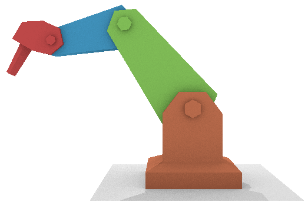
</p>

ロボットアームを単一のモデルとして作ってしまうと、関節を動かせません。そこで、根本、上腕、下腕、手の4つのモデルに分割します。これらは別々のローカル座標系を持ちますので、ロボットアームのローカル座標系は合計4つということになります。

<p align="center">
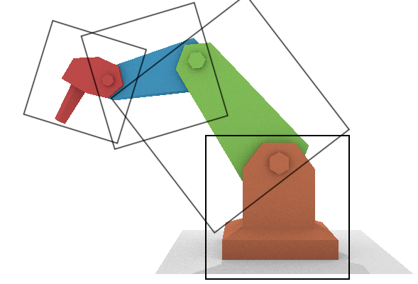
</p>

ロボットアームの場合、根本モデルを親として、その子が上腕モデル、孫が下腕モデル、ひ孫が手モデルという関係になります。この関係を行列で書くと次のようになります。

```txt
根本のローカル→ワールド変換行列 = 根本のローカル行列
上腕のローカル→ワールド変換行列 = 根本のローカル行列 * 上腕のローカル行列
下腕のローカル→ワールド変換行列 = 根本のローカル行列 * 上腕のローカル行列 * 下腕のローカル行列
手のローカル→ワールド変換行列   = 根本のローカル行列 * 上腕のローカル行列 * 下腕のローカル行列 *
  手のローカル行列
```

それぞれの式をよく見ると、自分自身の変換行列は、すぐ上の変換行列と自分自身のローカル行列の乗算であることが分かります。このため、式を次のように変形できます。

```txt
根本のローカル→ワールド変換行列 = 根本のローカル行列
上腕のローカル→ワールド変換行列 = 根本のローカル→ワールド変換行列 * 上腕のローカル行列
下腕のローカル→ワールド変換行列 = 上腕のローカル→ワールド変換行列 * 下腕のローカル行列
手のローカル→ワールド変換行列   = 下腕のローカル→ワールド変換行列 * 手のローカル行列
```

ロボットアームの根本モデルはワールド座標系に配置されます。これは、ワールド座標系が親になると考えられます。ワールド座標系の行列を追加すると、次のようになります。

```txt
根本のローカル→ワールド変換行列 = ワールド→ワールド変換行列       * 根本のローカル行列
上腕のローカル→ワールド変換行列 = 根本のローカル→ワールド変換行列 * 上腕のローカル行列
下腕のローカル→ワールド変換行列 = 上腕のローカル→ワールド変換行列 * 下腕のローカル行列
手のローカル→ワールド変換行列   = 下腕のローカル→ワールド変換行列 * 手のローカル行列
```

これは、全てモデルの変換行列が次の式で表されると考えられます。

```txt
自分のローカル→ワールド変換行列 = 親の変換行列 * 自分のローカル行列
```

つまり、座標系の親子関係は、このたったひとつのルールによって作られているわけです。このような、関節をつないでモデルを制御する仕組みを「スケルトン」といいます。

そして、スケルトンをアニメーションさせることを「スケルタル・アニメーション」、スケルタルアニメーションによって制御されるメッシュのことを「スケルタル・メッシュ」または「スキン・メッシュ」といいます。

>`skin`(スキン)は「<ruby>皮膚<rt>ひふ</rt></ruby>」という意味です。

<br>

### 1.2 関節と単一モデル

ロボットアームのようにパーツに分割できるモデルについては、ここまで説明してきた手法で親子関係を作って動かすことができます。しかし、人間のように分割できないモデルは少し工夫が必要です。

>**【箱人間でいいのなら】**<br>
>マインクラフトのキャラクターのように、モデルを非常に単純化すれば対応できます。

そこで、モデルごとにボーンを割り当てるのではなく、頂点ごとにボーンを割り当てることを考えます。これができれば、頂点ごとにボーンによってアニメーションさせることができます。

ローカル座標系はボーンごとに存在するので、ひとつのモデルに複数のローカル座標系が存在できなければなりません。

しかし、ひとつのモデルにはひとつのローカル座標系しか存在できません。この矛盾を解決しないかぎり、分割できないモデルの関節を動かすことはできません。

ロボットアームのようにパーツごとに分割できるモデルでは、全てのモデルは原点にあります。そして、対応するボーンのローカル行列によって、ワールド座標系の適切な位置に移動していくわけです。

<p align="center">
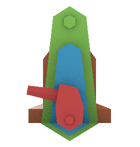→
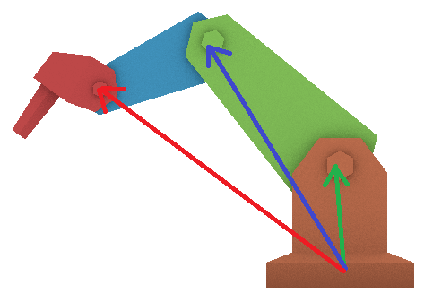<br>
[左:初期状態 右:ローカル行列を適用]
</p>

さて、仮にロボットアームが単一モデルであり、頂点ごとにボーンが割り当てられているとします。このモデルの頂点に対応するボーンのローカル行列を適用すると、次のようにパーツの位置や角度が大きくずれてしまいます。

<p align="center">
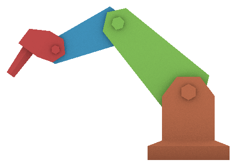→
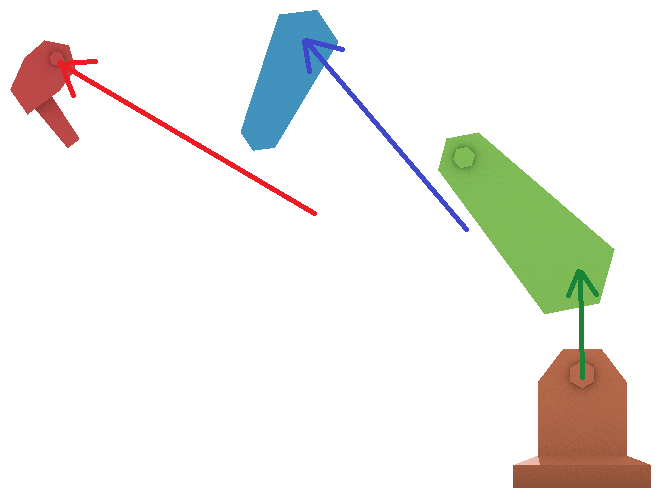<br>
[左:初期状態 右:ローカル行列を適用]
</p>

単一モデルの各頂点の位置や角度は、パーツ分割モデルにローカル行列を掛けたあとの状態と同じです。つまり、既にローカル行列を掛けてあるわけです。そこにさらにローカル行列を掛けてしまうと、ローカル行列を2回掛けたことになってしまうわけです。

### 1.3 逆バインドポーズ行列

この問題を解決するためには、最初のローカル行列の影響を打ち消さなくてはなりません。そのために、「バインドポーズ行列」と「逆バインドポーズ行列」という、2種類の行列を導入します。

>バインドポーズ行列と逆バインドポーズ行列は、OBJファイルをグループ単位で座標変換させるときに使ったのと同じものです。

「バインド・ポーズ」というのは、モデルのローカル座標系で定義された、何のアニメーションもしていない素の状態のボーンの姿勢のことです。バインドポーズ行列は、ボーンのローカル座標系をモデルのローカル座標系に変換します。

<p align="center">
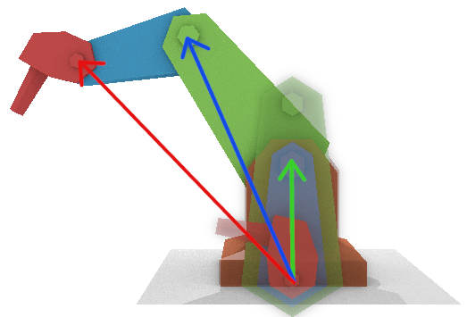<br>
[ボーンローカル座標系→モデルローカル座標系]
</p>

つまりバインドポーズ行列は、「バインドポーズに変換するためのローカル行列」ということです。パーツ分割モデルにバインドポーズ行列を掛けると、各パーツは単一モデルと同じ位置に表示されます。

逆バインドポーズ行列は、名前の通りバインドポーズ行列の逆の操作をします。つまり、座標をモデルのローカル座標系からボーンのローカル座標系へと変換します。

<p align="center">
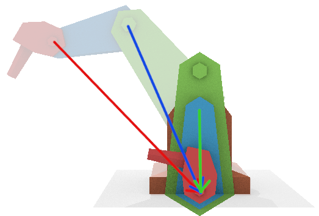<br>
[モデルローカル座標系→ボーンローカル座標系]
</p>

モデルの頂点に逆バインドポーズ行列を掛けると、パーツ分割モデルにローカル行列を掛ける前と同じ状態を作り出すことができます。つまり、最初のローカル行列の影響を打ち消すことができるわけです。

そうなれば、あとはパーツ分割モデルと全く同じ方法で、ワールド座標系へと変換することができます。単一モデルに逆バインドポーズ行列を掛けると、各パーツはパーツ分割モデルと同じ位置に表示されます。

逆バインドポーズ行列によって頂点をボーンのローカル座標系へと変換し、次にバインドポーズ行列によってモデル座標系に戻す、この2つの操作がスケルタルメッシュの基本的な仕組みです。

### 1.4 ボーンウェイトと座標補間

人間の関節を観察すると、関節の根本にある皮膚は、完全に一方の関節だけに引っ張られるのではないことが分かります。この挙動を再現するために、スケルタルメッシュでは「ボーンウェイト」という数値を使ってボーンの影響度合いを設定します。

すべての頂点には、その頂点に影響を与える複数の「ボーンID」と、各ボーンが及ぼす影響の強さを示す「ボーンウェイト」というパラメータを設定します。

実際のアニメーションでは、まずボーンIDに対応する座標変換行列を使って座標をワールド座標系に変換します。これを影響するボーンの数だけ行います。

>```c++
>// ボーン1, 2, 5, 7が影響する場合
>ワールド頂点座標1 = ボーン1の座標変換行列 * ローカル頂点座標
>ワールド頂点座標2 = ボーン2の座標変換行列 * ローカル頂点座標
>ワールド頂点座標5 = ボーン5の座標変換行列 * ローカル頂点座標
>ワールド頂点座標7 = ボーン7の座標変換行列 * ローカル頂点座標
>```

影響するボーンの全ての座標変換がすんだら、それらをボーンウェイトの比率で合成し、最終的な座標を得ます。

>```c++
>// ボーン1, 2, 5, 7のボーンウェイトが(0.1, 0.3, 0.5, 0.1)の場合
>ワールト頂点座標 = ワールド頂点座標1 * 0.1
>                  + ワールド頂点座標2 * 0.3
>                  + ワールド頂点座標5 * 0.5
>                  + ワールド頂点座標7 * 0.1
>```

これが基本ですが、実際のプログラムでは計算回数を減らすためにちょっと工夫をします。といっても、計算順序を変えるだけです。つまり、座標変換をしてから座標を合成するのではなく、座標変換行列を合成してから座標変換を行います。

>```c++
>// ボーン1, 2, 5, 7が影響し、ボーンウェイトが(0.1, 0.3, 0.5, 0.1)の場合
>座標変換行列 = ボーン1の座標変換行列 * 0.1
>              + ボーン2の座標変換行列 * 0.3
>              + ボーン5の座標変換行列 * 0.5
>              + ボーン7の座標変換行列 * 0.1
>ワールド頂点座標 = 座標変換行列 * ローカル頂点座標
>```

影響するボーンが8本あるとします。行列とベクトルの乗算(座標変換)に必要な計算回数は加算`12`回+乗算`16`回、ベクトルの合成にはボーン1本につき加算`4`回、乗算`4`回の計算が必要です。また、行列の合成にはボーン1本につき加算`16`回+乗算`16`回の計算が必要です。

8本のボーンについて座標変換をしてからベクトルを合成する場合、その計算回数は

>加算: `12*8 + 4*7 = 124`<br>
>乗算: `16*8 + 4*8 = 160`
>合計`284`回

となります。行列を合成してから座標変換する場合、その計算回数は

>加算: `16*7 + 12 = 124`<br>
>乗算: `16*8 + 16 = 144`
>合計`268`回

となります。このように、行列を合成してから座標変換するほうが計算回数が少なくなるのです。そのため、多くのスケルタルアニメーション・プログラムでは、「行列を合成してから座標変換する」という順序を採用しています。

>**【ボーン数が少ない場合は？】**<br>
>影響するボーンの数が3本以下の場合、座標変換してからベクトルを合成するほうが、計算回数が少なくなります。もし影響するボーン数を3本以下に制限できる場合は「座標変換→合成」の手順を使うとよいでしょう。

### 1.5 glTFのデータ型を追加する

ボーンの説明が済んだので、glTFのスケルタルアニメーションを実装しましょう。<br>
最初に、glTFの構造を再掲します。

<p align="center">
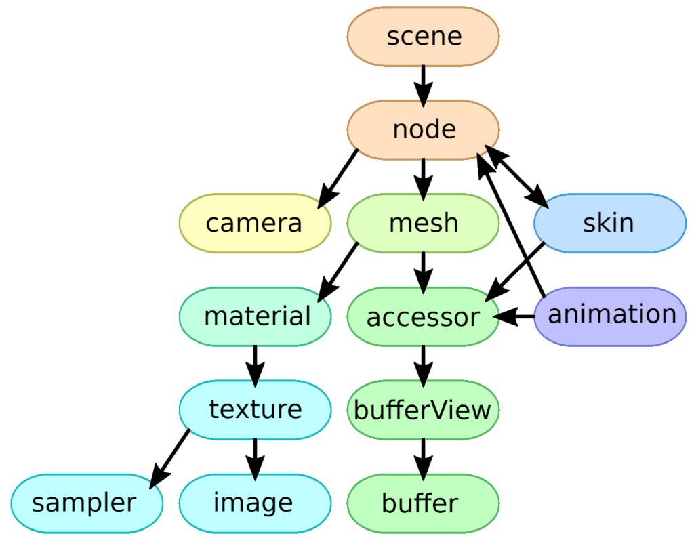
</p>

今回は`scene`(シーン)、`node`(ノード)、`skin`(スキン)、`animation`(アニメーション)を読み込みます。アニメーションの読み込みには手間がかかるので、残りの3つ(`scene`, `node`, `skin`)から読み込むことにします。

「シーン」はglTFのノードの始点を決めるデータです。glTFファイルには複数のシーンが存在する可能性がありますが、一度に表示されるのはひとつのシーンだけです。

glTFを正しく表示するには、ひとつのシーンに含まれるすべてのメッシュを描画する必要があります。

`node`と`skin`にはスケルタルメッシュの情報が格納されています。ノードには「ボーンの親子関係」が記録されています。

スキンには「ボーンとして使用するノードIDの配列」と「逆バインドポーズ行列」という2つのデータが含まれます。

<p align="center">
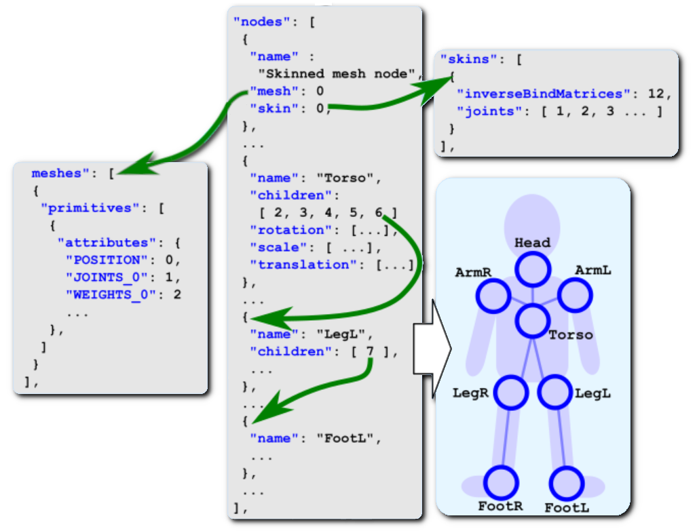
</p>

glTFではすべての「親子関係」は「ノード」で表されます。つまり、ボーンだけでなく、カメラの位置や姿勢、さまざまなモデルの配置情報などを含んでいる可能性があります。

そのため、「どのノードがスケルトンなのか」をあらわす「スキン」データが必要なわけです。

シーンとノード、およびスキンを読み込むために、これらを表す構造体を追加します。
`GltfMesh.h`を開き、`GltfMesh`構造体の定義の下に次のプログラムを追加してください。

```diff
   std::string name; // メッシュ名
   std::vector<GltfPrimitive> primitives;
 };
+
+/**
+* スキン
+*/
+struct GltfSkin
+{
+  std::string name; // スキン名
+
+  // ジョイント(ボーン)データ
+  struct Joint {
+    int nodeId;
+    VecMath::mat4 matInverseBindPose;
+  };
+  std::vector<Joint> joints; // ジョイント配列
+};
+
+/**
+* ノード
+*/
+struct GltfNode
+{
+  std::string name;                // ノード名
+  int mesh = -1;                   // メッシュ番号
+  int skin = -1;                   // スキン番号
+  GltfNode* parent = nullptr;      // 親ノード
+  std::vector<GltfNode*> children; // 子ノード配列
+  VecMath::mat4 matLocal = VecMath::mat4(1);  // ローカル行列
+  VecMath::mat4 matGlobal = VecMath::mat4(1); // グローバル行列
+};
+
+/**
+* シーン
+*/
+struct GltfScene
+{
+  std::vector<const GltfNode*> nodes;     // ノード配列
+  std::vector<const GltfNode*> meshNodes; // メッシュを持つノードのみの配列
+};

 /**
 * ファイル
 */
 struct GltfFile
 {
   std::string name;                       // ファイル名
+  std::vector<GltfScene> scenes;          // シーン配列
+  std::vector<GltfNode> nodes;            // ノード配列
+  std::vector<GltfSkin> skins;            // スキン配列
   std::vector<GltfMesh> meshes;           // メッシュ配列
   std::vector<GltfMaterialPtr> materials; // マテリアル配列
```

glTFでは「ボーン」のことを「ジョイント(関節)」と呼びます。ジョイントは対応するノード番号と、逆バインドポーズ行列を持ちます。

実装上の工夫として、`GltfNode`に「親ノードを表すメンバ変数」を追加しています。glTFファイルの「ノード」データには子ノードの配列しかありませんが、プログラムでは子から親をたどれると便利だからです。

### 1.6 バインディングポイントとデフォルト頂点データを追加する

それでは、ジョイントとウェイトからを読み込んでいきましょう。まずは頂点アトリビュート番号を追加し、次にデフォルト頂点データにもジョイントとウェイトを追加します。

`GltfMesh.cpp`を開き、`AttribIndex`列挙型の定義に、次のプログラムを追加してください。

```diff
   texcoord0,
   normal,
   tangent,
+  joints0,
+  weights0,
 };
```

続いて、`DefaultVertexData`構造体の定義に、次のプログラムを追加してください。

```diff
   vec2 texcoord = vec2(0);
   vec3 normal = vec3(0, 0, -1);
   vec4 tangent = vec4(1, 0, 0, 1);
+  vec4 joints0 = vec4(0);
+  vec4 weights0 = vec4(0);
 };
```

今回は、頂点ごとに最大4つのジョイントを扱えるようにしていきます。GPUは3D座標を扱うために作られたものなので、`vec4`のような4個単位のデータを効率的に扱うことができます。

そのため、多くのボーン制御プログラムは4本までのボーンを扱えるようになっています。本テキストでも同様の方針をとります。

### 1.7 頂点アトリビュートを設定する

次に、ジョイント番号とジョイントウェイトの頂点アトリビュートをVAOに設定します。
`Parse`関数の中にある「頂点アトリビュートを設定するプログラム」に、次のプログラムを追加してください。

```diff
         SetDefaultAttribute(AttribIndex::tangent,
           4, offsetof(DefaultVertexData, tangent), *buffer);
       }
+
+      // 頂点アトリビュート(ジョイント番号)を取得
+      const auto hasJoints = SetVertexAttribute(AttribIndex::joints0, "JOINTS_0",
+        attributes, accessors, bufferViews, binaryList);
+      if (! hasJoints) {
+        SetDefaultAttribute(AttribIndex::joints0,
+          4, offsetof(DefaultVertexData, joints0), *buffer);
+      }
+
+      // 頂点アトリビュート(ジョイントウェイト)を取得
+      const auto hasWeights = SetVertexAttribute(AttribIndex::weights0, "WEIGHTS_0",
+        attributes, accessors, bufferViews, binaryList);
+      if (! hasWeights) {
+        SetDefaultAttribute(AttribIndex::weights0,
+          4, offsetof(DefaultVertexData, weights0), *buffer);
+      }

       // プリミティブが使用するマテリアル番号を取得
       prim.materialNo = jsonPrim.value("material", 0);
```

ジョイント番号は`JOINT_0`というキーで取得します。ひとつのジョイントデータは4個のジョイント番号に相当します。もし頂点あたり5個以上のジョイントに対応する場合は`JOINT_1`, `JOINT_2`, ...を追加します。

ジョイントウェイトは`WEIGHT_0`というキーで取得します。ジョイントと同様に4個のウェイトがひとまとまりになっています。5個以上のウェイトに対応する場合は`WEIGHT_1`, `WEIGHT_2`, ...を追加します。

### 1.8 JSON配列をvec3に変換する関数を定義する

次はノードを読み込みますが、その前にノードのローカル座標変換行列を計算する関数を作成しておきます。ノードのローカル座標変換行列は、行列またはスケール・回転・平行移動の組のどちらかで記録されています。

ただし、JSONには`vec3`や`mat4`のようなデータ型は定義されていません。ではglTFはどうしているかというと、それらを配列として記録しています。そこで、まず配列からベクトルや行列を作成する関数を作ります。

これらの関数は他のCPPファイルから使うことはないので、無名名前空間に定義します。<br>
まず`vec3`から定義しましょう。関数名は`GetVec3`(ゲット・ベク・スリー)とします。
`LoadTexture`補助関数の定義の下に、次のプログラムを追加してください。

```diff
   // テクスチャを読み込む
   return Texture::Create(filename.string(), GL_LINEAR, Texture::Usage::forGltf);
 }

+
+/**
+* JSONの配列データをvec3に変換する
+*
+* @param json 変換元となる配列データ
+*
+* @return jsonを変換してできたvec3の値
+*/
+vec3 GetVec3(const json& json)
+{
+  if (json.size() < 3) {
+    return vec3(0);
+  }
+  return {
+    json[0].get<float>(),
+    json[1].get<float>(),
+    json[2].get<float>() };
+}

 // バインディングポイント
 enum BindingPoint
```

### 1.9 クォータニオン型を定義する

glTFでは、回転を「クォータニオン(四元数, しげんすう)」という「複素数を拡張した数体系」で表します。

複素数は2つの実数a, bと虚数単位iを用いて、

>`a + bi`

として表されるのでした。これに対し、クォータニオンは4つの実数w, x, y, zと3つの虚数単位i, j, kを用いて、

>`w + xi + yj + zk`

と表されます。回転を表すクォータニオンでは、虚数単位は無視してx, y, zを回転軸、wを回転角度として扱います。軸ベクトルNまわりの回転θを表すクォータニオンQは次のようになります。

>Qx = Nx * sin(θ/2)<br>
>Qy = Ny * sin(θ/2)<br>
>Qz = Nz * sin(θ/2)<br>
>Qw = cos(θ/2)

クォータニオンによる回転を適切に実行するためには、回転クォータニオンは単位クォータニオン(長さが1のクォータニオン)でなくてはなりません。

>**【クォータニオンのついてどこまで勉強するべきか】**<br>
>複素数において`ii = -1`であるように、クォータニオンでも`ii = -1`, `jj = -1`, `kk = -1`と定義されます。ただし、`ij = k`, `ji = -k`のように、虚数単位同士では交換法則が成立しません。
>なんだか難しそうですが、ゲームで利用する場合は、ごく一部の計算を作成できれば十分です。
>理論としてのクォータニオンは非常に奥深く、一定の理解に達するには相当の勉強が必要ですが、使うだけならそこまで詳しくなる必要はありません。

それでは構造体を定義しましょう。`VecMath.h`を開き、`mat4`から`mat3`に変換するコンストラクタの定義の下に、次のプログラムを追加してください。

```diff
   data[1] = vec3(m[1]);
   data[2] = vec3(m[2]);
 }
+
+/**
+* クォータニオン
+*/
+struct quat
+{
+  float x, y, z, w;
+
+  quat() = default;
+  explicit quat(float s) : x(s), y(s), z(s), w(s) {}
+  quat(float x, float y, float z, float w) : x(x), y(y), z(z), w(w) {}
+};
+
+// 内積
+inline float dot(const quat& a, const quat& b) {
+  return a.x * b.x + a.y * b.y + a.z * b.z + a.w * b.w;
+}

 } // namespace VecMath
```

見かけは`vec4`型と同じで、構造体名が違うだけです。しかし、クォータニオンの演算はベクトル型とは明確に異なります。そのため、`vec4`を流用するのではなく、独自の`quat`型を定義する必要があるのです。

>**【w変数の順序について】**<br>
>クォータニオンのパラメータ定義順には、上記のプログラムのようにx,y,z,wのものと、w,x,y,zのようにwが先頭にくるものの2種類があります。単なる流儀の違いなので、どちらを使っても構いません。ただし、ひとつのプログラムではどちらかに統一するべきでしょう。

### 1.10 クォータニオンを行列に変換する関数を定義する

次に、クォータニオンを行列に変換する関数を定義します。関数名は`mat3_cast`(マット・スリー・キャスト)とします(GLMライブラリから借用)。また、利便性のために`mat4_cast`(マット・フォー・キャスト)関数も作成することにします。

`quat`の内積の定義の下に、次のプログラムを追加してください。

```diff
 inline float dot(const quat& a, const quat& b) {
   return a.x * b.x + a.y * b.y + a.z * b.z + a.w * b.w;
 }
+
+mat3 mat3_cast(const quat& q);
+mat4 mat4_cast(const quat& q);

 } // namespace VecMath
```

クォータニオンをQとすると、回転行列Rは次の行列で表されます。

<p align="center">
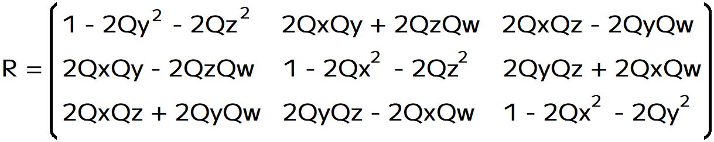<br>
</p>

難しく見えますが、対角線成分がよく似ていたり、対角線の左下と右上の成分は符号以外は対称になっていたりと、一定の規則性があります(この行列は覚えなくて構いません)。

>**【回転行列Rの求め方】**<br>
>回転行列Rを求めるには、多くの計算と証明が必要となります。詳しく知りたい場合は以下のURLを参照してください。<br>
>補足: 数学的な行列をOpenGLの行列にするには転置が必要です。<br>
>四元数と回転行列の関係: `http://risalc.info/src/quaternion-rotation.html`<br>
>回転行列、クォータニオン(四元数)、オイラー角の相互変換:<br>`https://qiita.com/aa_debdeb/items/3d02e28fb9ebfa357eaf`

計算式が分かればあとは実装するだけです。`VecMath.cpp`を開き、`mat4`型の`transpose`
関数の定義の下に、次のプログラムを追加してください。

```diff
   t[3][3] = m[3][3];
   return t;
 }
+
+/**
+* クォータニオンを3x3行列に変換する
+*/
+mat3 mat3_cast(const quat& q)
+{
+  const float xx(q.x * q.x);
+  const float yy(q.y * q.y);
+  const float zz(q.z * q.z);
+  const float xz(q.x * q.z);
+  const float xy(q.x * q.y);
+  const float yz(q.y * q.z);
+  const float xw(q.w * q.x);
+  const float yw(q.w * q.y);
+  const float zw(q.w * q.z);
+
+  return {
+    { 1 - 2 * (yy + zz), 2 * (xy + zw),     2 * (xz - yw) },
+    { 2 * (xy - zw),     1 - 2 * (xx + zz), 2 * (yz + xw) },
+    { 2 * (xz + yw),     2 * (yz - xw),     1 - 2 * (xx + yy) },
+  };
+}

 } // namespace VecMath
```

続いて`mat4_cast`関数を定義します。`mat3_cast`関数の定義の下に、次のプログラムを追加してください。

```diff
     { 2 * (xz + yw),     2 * (yz - xw),     1 - 2 * (xx + yy) },
   };
 }
+
+/**
+* クォータニオンを4x4行列に変換する
+*/
+mat4 mat4_cast(const quat& q)
+{
+  return mat4(mat3_cast(q));
+}

 } // namespace VecMath
```

`mat4_cast`は、`mat3_cast`の結果を「`mat3`から`mat4`への変換コンストラクタ」に渡すだけです。

### 1.11 クォータニオンの球面線形補間を行う関数を定義する

実数やベクトル型には「線形補間」という計算があります。これは「2つの値を比率によって加算する」というものです。

クォータニオンでも線形補間は可能なのですが、回転を表すクォータニオンの場合は「線形補間の結果が意図したように働かない」という問題があります。この原因は「クォータニオンのx,y,z成分が回転軸を表している」ことです。

以前、法線の補完について説明したとき、ベクトルを線形補間すると長さが変わってしまうことを学習しました。法線の線形補間はGPUが自動で行うため、苦肉の策として正規化を使ったのでした。

しかし、今回はより良い計算式を定義することが可能です。「クォータニオンを補完するより良い計算式」は「球面線形補間(きゅうめん・せんけいほかん」と呼ばれています。

>線形補間と球面線形補間の違いについては、以下の動画が参考になるでしょう。<br>
>`https://www.youtube.com/watch?v=uNHIPVOnt-Y`
>
>詳しい説明についてはWikipediaの記事を参照してください(英語の記事)。
>`https://en.wikipedia.org/wiki/Slerp`

球面線形補間は以下の手順で角度を補間します。

>1. ふたつのクォータニオン間の角度θを計算する
>2. 角度θに`1 -t`と`t`を掛け、それぞれsinを計算する
>3. 2で求めた値の合計が1.0になるようにsinθで割る
>4. 3で求めた値を係数として、ふたつのクォータニオンを合成する

それでは関数を定義しましょう。球面線形補間は英語でslerp(スラープ, Spherical Linear intERPolationの短縮形 )」というので、 関数名も`slerp`とします。<br>
`VecMath.h`を開き、`mat4_cast`の宣言の下に次のプログラムを追加してください。

```diff
 mat3 mat3_cast(const quat& q);
 mat4 mat4_cast(const quat& q);
+quat slerp(const quat& a, const quat& b, float t);

 } // namespace VecMath

 #endif // VECMATH_H_INCLUDED
```

次に`VecMath.cpp`を開き、`mat4_cast`の定義の下に次のプログラムを追加してください。

```diff
 {
   return mat4(mat3_cast(q));
 }
+
+/**
+* クォータニオンを球面線形補間する
+*/
+quat slerp(const quat& a, const quat& b, float t)
+{
+  // クォータニオンの補間方向は補間軸に対して時計回り、または反時計回りになる
+  // マイナスのコサインの値は、遠回りになる方向が選択されていることを示す
+  // 正しい補間方向は常に短い方向なので、方向を反転する
+  quat c = b;
+  float cosTheta = dot(a, b);
+  if (cosTheta < 0) {
+    c = quat(-c.x, -c.y, -c.z, -c.w);
+    cosTheta = -cosTheta;
+  }
+
+  // cosThetaが1に近い場合は演算誤差が出るので線形補間で代用
+  float t0, t1;
+  if (cosTheta > 1.0f - std::numeric_limits<float>::epsilon()) {
+    t0 = 1 - t;
+    t1 = t;
+  } else {
+    const float theta = acos(cosTheta);
+    const float sinTheta = sin(theta);
+    t0 = sin(theta * (1 - t)) / sinTheta;
+    t1 = sin(theta * t) / sinTheta;
+  }
+  return quat(
+    a.x * t0 + c.x * t1,
+    a.y * t0 + c.y * t1,
+    a.z * t0 + c.z * t1,
+    a.w * t0 + c.w * t1);
+}

 } // namespace VecMath
```

上記のプログラムでは、前掲の手順をベースとしつつ、2つの例外ケースに対処しています。ひとつはクォータニオンの補間方向の問題です。

slerpは角度の補間なので、時計回りと反時計回りという2つの補間方向を取り得ます。しかし、正しい補間方向は常に「補間距離が短くなる方向」です。

そして、クォータニオンから計算されたcosθが負の場合、距離が長い方向が選ばれていることを示します。短い方向を選択しなおすにはクォータニオンの正負を反転します。

>**【ある姿勢を表すクォータニオンは2つある】**<br>
>クォータニオンの符号を反転させると、軸と回転角度の両方が反転します。これは結果的に、元のクォータニオンと同じ姿勢を表します。姿勢は同じですが、軸の向きが逆なので回転方向も逆になっています。

もう一つの問題は、`float`型の精度です。slerpは三角関数を多用しますが、コンピュータ上で実行される三角関数には「非常に小さな角度では計算誤差が大きくなる」という問題があります。

`sin`だけ、または`cos`だけ、といった用途では大きな問題にはなりませんが、「ある三角関数の出力を別の三角関数の入力に使う」といった操作では、誤差が蓄積することで間違った値になる可能性が高まります。

単純な解決方法は`long double`などのより高精度な型を使うことです。しかし、高精度な型は計算時間も長く、リアルタイムアプリケーションには向いていません。そのため、上記のプログラムでは「2つのクォータニオンを線形補間する」ことで対応しています。

線形補間には「ベクトルの長さが変わってしまう」という問題がありますが、角度差がほぼ0の場合は長さの変化量もほぼ0です。三角関数による大きな誤差と比べれば許容範囲内です。

>ちなみに、「長さが変わってしまうなら、正規化すればいいじゃない」という方法は、nlerp(エヌラープ)と呼ばれています。

### 1.12 JSON配列をquatに変換する関数を定義する

クォータニオン型を定義したので、JSONから`quat`型に変換する関数を定義します。念のためglTF仕様を確認すると「クォータニオンの順序はx, y, z, w」と書いてあります。0から順番に代入すればよさそうです。

関数名は`GetQuat`(ゲット・クォート)とします。`GltfMesh.cpp`を開き、`GetVec3`関数の定義の下に次のプログラムを追加してください。

```diff
     json[1].get<float>(),
     json[2].get<float>() };
 }
+
+/**
+* JSONの配列データをquatに変換する
+*
+* @param json 変換元となる配列データ
+*
+* @return jsonを変換してできたquatの値
+*/
+quat GetQuat(const json& json)
+{
+  if (json.size() < 4) {
+    return { 0, 0, 0, 1 };
+  }
+  return {
+    json[0].get<float>(),
+    json[1].get<float>(),
+    json[2].get<float>(),
+    json[3].get<float>() };
+}

 } // unnamede namespace
```

### 1.13 JSON配列をmat4に変換する関数を定義する

`vec3`、`quat`の次は`mat4`に変換する`GetMat4`(ゲット・マット・フォー)関数を定義します。`GetQuat`関数の定義の下に、次のプログラムを追加してください。

```diff
     json[2].get<float>(),
     json[3].get<float>() };
 }
+
+/**
+* JSONの配列データをmat4に変換する
+*
+* @param json 変換元となる配列データ
+*
+* @return jsonを変換してできたmat4の値
+*/
+mat4 GetMat4(const json& json)
+{
+  if (json.size() < 16) {
+    return mat4(1);
+  }
+  mat4 m;
+  for (int y = 0; y < 4; ++y) {
+    for (int x = 0; x < 4; ++x) {
+      m[y][x] = json[y * 4 + x].get<float>();
+    }
+  }
+  return m;
+}

 } // unnamede namespace
```

16回`json[N].get<float>()`を書く方法も考えたのですが、さすがに面倒なので素直に2重ループでデータを取得してみました。

<div style="page-break-after: always"></div>

### 1.14 ローカル座標変換行列を計算する関数を定義する

ここまでで、必要なデータを取得できるようになりました。定義したデータ取得関数を使って、ローカル座標変換行列を計算する関数を定義しましょう。glTF仕様によると、ノードの座標変換行列は次のどちらかの方法で格納されています。

>1. `matrix`という名前で行列がそのまま書いてある。
>2. `translation`, `rotation`, `scale`という3つの名前に分けられている。

1の場合は行列を取得すれば終わりです。2の場合は3つの座標変換行列を作って掛け合わせる必要があります。`GetMat4`関数の定義の下に、次のプログラムを追加してください。

```diff
   }
   return m;
 }
+
+/**
+* ノードのローカル座標変換行列を計算する
+*
+* @param node gltfノード
+*
+* @return nodeのローカル座標変換行列
+*/
+mat4 GetLocalMatrix(const json& node)
+{
+  // 行列データがある場合、行列データを読み取って返す
+  const auto matrix = node.find("matrix");
+  if (matrix != node.end()) {
+    return GetMat4(*matrix);
+  }
+
+  // 行列データがない場合、
+  // スケール→回転→平行移動の順で適用した行列を返す
+  mat4 result(1);
+  const auto t = node.find("translation");
+  if (t != node.end()) {
+    result[3] = vec4(GetVec3(*t), 1);
+  }
+  const auto r = node.find("rotation");
+  if (r != node.end()) {
+    result *= mat4_cast(GetQuat(*r));
+  }
+  const auto s = node.find("scale");
+  if (s != node.end()) {
+    result *= mat4::Scale(GetVec3(*s));
+  }
+  return result;
+}

 } // unnamede namespace
```

ノードに`matrix`という名前の配列データが存在する場合、配列を行列に変換して返します。
`matrix`配列が存在しない場合は、`translation`、`rotation`、`scale`という名前の配列データを調べます。

配列データが存在する場合、平行移動、スケールは`vec3`、回転は`quat`としてデータを取得し、さらにそのデータから行列を作成して合成します。

なお、合成の順序はglTFの仕様で決まっています。その順序は「スケール→回転→平行移動」です。そこで、上記のプログラムでは、

>`((VecMath::mat4(1) * 平行移動) * 回転) * スケール`

の順となるようにしています。これで、ローカル座標変換行列を計算できるようになりました。

### 1.15 ノードデータを取得する

ローカル座標変換行列を作成できるようになったので、ようやく「ノード」を取得できます。
`Parse`メンバ関数の定義にある、マテリアルを作成するプログラムの下に、次のプログラムを追加してください。

```diff
     // 取得したデータからマテリアルを作成
     file->materials.push_back({ baseColor, texBaseColor });
   }
+
+  // ノードを作成
+  if (nodes != gltf.end()) {
+    file->nodes.resize(nodes->size());
+    for (size_t i = 0; i < nodes->size(); ++i) {
+      const json& node = nodes->at(i);
+      GltfNode& n = file->nodes[i];
+      n.name = node.value("name", std::string());
+      n.mesh = node.value("mesh", -1);
+      n.skin = node.value("skin", -1);
+    }
+  } // if nodes

   // 作成したファイルを返す
   return file;
```

このプログラムは、全てのノードに対して「ノード名」、「ノードに表示するメッシュのID」、「メッシュに適用するスキンのID」を取得します。

また、「あとで配列内要素のアドレスを取得する必要がある」という理由から、ループ前に
`resize`関数を使ってノード配列のサイズを確定させています。

>**【resizeやreserveを積極的に使おう】**<br>
>事前に`resize`や`reserve`を利用して必要なメモリを確保しておくと、メモリの再確保による効率低下を避けられます。これはC++では重要なテクニックです。<br>
>`resize`と`reserve`のどちらを使うかは場合によります。基本的には、サイズが不明な場合は`reserve`、サイズが確定しているなら`resize`が適しています。<br>
>どちらを使うべきか判断がつかない場合は`reserve`を使ってください。

次に「子ノードの設定」、「親ノードの設定」、「ローカル座標変換行列の作成」を行います。スキンIDを取得するプログラムの下に、次のプログラムを追加してください。

```diff
       n.name = node.value("name", std::string());
       n.mesh = node.value("mesh", -1);
       n.skin = node.value("skin", -1);
+
+      // 子ノードを取得し、子ノードに対して親ノードを設定
+      const auto children = node.find("children");
+      if (children != node.end()) {
+        n.children.resize(children->size());
+        for (int b = 0; b < children->size(); ++b) {
+          const json& child = children->at(b);
+          const int childId = child.get<int>();
+          n.children[b] = &file->nodes[childId]; // 子ノードを追加
+          n.children[b]->parent = &n; // 親ノードを設定
+        }
+      }
+
+      // ローカル座標変換行列を計算
+      n.matLocal = GetLocalMatrix(node);
     }
   } // if nodes
```

このプログラムは、全てのノードを取得し、名前と子オブジェクトへのポインタを設定します。

### 1.16 ノードのグローバル座標変換行列を作成する

親子関係にあるノードにおいて、子ノードの姿勢は親ノードのローカル座標系で定義されます。

「子ノードのローカル座標系で定義された頂点」をワールド座標系に変換するには、まず子ノードのローカル座標変換行列を掛け、次に親ノードのローカル座標変換行列を掛ける必要があります。

親の親、親の親の親が存在する場合は、それらもすべて掛ける必要があります。しかし、座標変換が必要になるたびに行列の乗算を行っていては時間の無駄です。

そこで、事前にすべてを掛け合わせた「グローバル座標変換行列」を作成します。ローカル座標変換行列を作成するプログラムの下に、次のプログラムを追加してください。

```diff
       // ローカル座標変換行列を計算
       n.matLocal = GetLocalMatrix(nodes[i]);
     }
+
+    // 親をたどってグローバル座標変換行列を計算する
+    for (GltfNode& e : file->nodes) {
+      e.matGlobal = e.matLocal;
+      const GltfNode* parent = e.parent;
+      while (parent) {
+        e.matGlobal = parent->matLocal * e.matGlobal;
+        parent = parent->parent;
+      }
+    }
   } // if nodes

   // 作成したファイルを返す
```

### 1.17 シーンデータを取得する

「ノード」の次は「シーン」を取得します。glTFの「シーン」オブジェクトには、「シーンに含まれるノードIDの配列」が格納されています。そこでこのプログラムでは、ノードIDからノードポインタを取得して配列に記録しています。

ただし、実際に描画されるのはメッシュを持つノードだけです。なので、メッシュを持つノードをリストアップしておくと効率的にメッシュを描画できます。

そこで、メッシュを持つノードをリストアップする関数を定義します。`GetLocalMatrix`関数の定義の下に、次のプログラムを追加してください。

```diff
   }
   return m;
 }
+
+/**
+* メッシュを持つノードをリストアップする
+*/
+void GetMeshNodeList(const GltfNode* node, std::vector<const GltfNode*>& list)
+{
+  if (node->mesh >= 0) {
+    list.push_back(node);
+  }
+  for (const GltfNode* child : node->children) {
+    GetMeshNodeList(child, list);
+  }
+}

 } // unnamede namespace
```

`GetMeshNodeList`(ゲット・メッシュ・ノード・リスト)関数は、指定されたノードがメッシュを持っている場合はそのノードをリストに追加します。そして、全ての子ノードに対して
`GetMeshNodeList`を再帰的に呼び出します。

>インデックスやポインタで相互に接続された複数のオブジェクトがあり、その全てに対して「何らかの処理」を行いたい場合、再帰関数が便利です。

それでは「シーン」を取得しましょう。`LoadFromFile`関数に戻り、ノードを取得するプログラムの下に次のプログラムを追加してください。

```diff
       }
     }
   } // if nodes
+
+  // シーンを作成
+  const auto scenes = gltf.find("scenes");
+  if (scenes != gltf.end()) {
+    // 各シーンに表示するノード配列を取得
+    file->scenes.resize(scenes->size());
+    for (size_t a = 0; a < scenes->size(); ++a) {
+      const json& scene = scenes->at(a);
+      const auto nodes = scene.find("nodes");
+      if (nodes == scene.end()) {
+        continue;
+      }
+      GltfScene& s = file->scenes[a];
+      s.nodes.resize(nodes->size());
+      for (size_t b = 0; b < nodes->size(); ++b) {
+        const int nodeId = nodes->at(b).get<int>();
+        const GltfNode* n = &file->nodes[nodeId];
+        s.nodes[b] = n;
+        GetMeshNodeList(n, s.meshNodes);
+      }
+    }
+  } // if scenes

   // 作成したファイルを返す
   return file;
```

<div style="page-break-after: always"></div>

### 1.18 バイナリデータを取得する関数を定義する

次は「スキン」を取得しますが、その前に「バイナリファイルに含まれるデータの位置を返す」補助関数を定義します。これは、スキンに必要な逆バインドポーズ行列のデータがバイナリファイルに格納されているためです。

`GetBinaryDataOffset`補助関数の定義の下に、次のプログラムを追加してください。

```diff
   const int baseByteOffset = bufferView.value("byteOffset", 0);
   return binaryList[bufferId].offset + baseByteOffset + byteOffset;
 }
+
+/**
+* CPU側のデータのアドレスを取得する
+*
+* @param accessor    アクセサ
+* @param bufferViews バッファビュー配列
+* @param binaryList  バイナリデータ配列
+*
+* @return データのアドレス
+*/
+const void* GetBinaryDataAddress(const json& accessor,
+  const json& bufferViews, const BinaryList& binaryList)
+{
+  const int bufferViewId = accessor["bufferView"].get<int>();
+  const json& bufferView = bufferViews[bufferViewId];
+
+  const int bufferId = bufferView["buffer"].get<int>();
+  const int byteOffset = accessor.value("byteOffset", 0);
+  const int baseByteOffset = bufferView.value("byteOffset", 0);
+  return binaryList[bufferId].bin.data()  + baseByteOffset + byteOffset;
+}

 /**
 * 頂点アトリビュートを設定する
```

### 1.19 スキンを取得する

それでは「スキン」を取得しましょう。`Parse`関数に戻り、シーンを取得するプログラムの下に、次のプログラムを追加してください。

```diff
       }
     }
   } // if scenes
+
+  // スキンを取得する
+  const auto skins = gltf.find("skins");
+  if (skins != gltf.end()) {
+    file->skins.resize(skins->size());
+    for (size_t skinId = 0; skinId < skins->size(); ++skinId) {
+      // スキン名を設定
+      const json& skin = skins->at(skinId);
+      GltfSkin& s = file->skins[skinId];
+      s.name = skin.value("name", std::string());
+
+      // 逆バインドポーズ行列のアドレスを取得
+      const mat4* inverseBindMatrices = nullptr;
+      const auto ibm = skin.find("inverseBindMatrices");
+      if (ibm != skin.end()) {
+        const int ibmId = ibm->get<int>();
+        inverseBindMatrices = static_cast<const mat4*>(
+          GetBinaryDataAddress(accessors[ibmId], bufferViews, binaryList));
+      }
+
+      // 関節データを取得
+      const json& joints = skin["joints"];
+      s.joints.resize(joints.size());
+      for (size_t jointId = 0; jointId < joints.size(); ++jointId) {
+        auto& j = s.joints[jointId];
+        j.nodeId = joints[jointId].get<int>();
+        // 逆バインドポーズ行列が未指定の場合は単位行列を使う(glTF仕様 5.28.1)
+        if (inverseBindMatrices) {
+          j.matInverseBindPose = inverseBindMatrices[jointId];
+        } else {
+          j.matInverseBindPose = mat4(1);
+        }
+      }
+    } // for skinId
+  } // if skins

   // 作成したファイルを返す
   return file;
```

スキンの取得でポイントとなるのは「逆バインドポーズ行列」の取得方法です。glTFの逆バインドポーズ行列はバイナリファイルに格納されているので、前節で作成した`GetBinaryDataAddress`関数でバイナリファイル内のアドレスを取得しています。

>**【バイナリファイルのデータはGPUメモリに配置したはずなのに、なぜCPU側にも必要なのか？】**<br>
>理由は「スケルタルアニメーションの計算内容を理解するためには、CPU側で扱うほうが都合がよいから」です。
>glTFのバイナリファイルは、基本的にはGPUメモリに配置するためのデータです。そのため、通常は逆バインドポーズ行列を含むすべての計算はGPU側で行います(コンピュートシェーダを使うことが多いです)。<br>
>ただ、glTFのアニメーションに加えてコンピュートシェーダの説明までしていると、アニメーションの説明をしたいのか、コンピュートシェーダの説明をしたいのかでどっちつかずになってしまいます。<br>
>そうなれば、肝心のスケルタルアニメーションの理解を妨げることになるでしょう。そこで、本テキストでは目的を「スケルタルアニメーションの計算方法を理解すること」に絞ることにして、CPU側でボーンアニメーションを計算するようにしています。<br>

<br>

>**【1章のまとめ】**
>
>* バインドポーズ行列は、ボーンのローカル座標系からモデルのローカル座標系に変換する行列。
>* 逆バインドポーズ行列は、モデルのローカル座標系からボーンのローカル座標系に変換する行列。
>* glTFのスケルタルメッシュは「シーン」、「ノード」、「スキン」によって定義されている。
>* JSONには`vec3`や`mat4`などの型はない。glTFは、これらを配列として記録する。
>* クォータニオンは`vec4`と同様にx,y,z,wの4要素を持つ。
>* 回転を表すクォータニオンではx,y,zが回転軸、wが角度となる。回転クォータニオンは単位クォータニオンでなくてはならない。

<div style="page-break-after: always"></div>

## 2. アニメーション

### 2.1 アニメーションデータの構成

この章ではアニメーションを取得します。アニメーションの取得は、ノードと同じくらいのプログラミングが必要なので章を分けました。

さて、改めてアニメーションデータの構成を確認しましょう。glTF概要図によると、glTFのアニメーションデータは以下の構造になっています。

<p align="center">
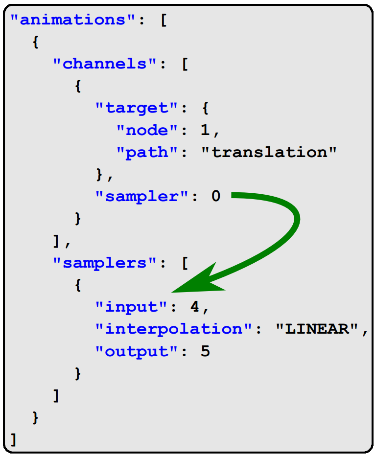
</p>

この図で示されているように、アニメーションは`channels`(チャネルズ)と`samplers`(サンプラーズ)という2つの配列を持ちます。

`channels`はチャネル(またはチャンネル)の配列で、アニメーションの`target`(ターゲット、対象)と、ターゲットに適用するアニメーションデータを指す`sampler`(サンプラ)を指定します。

`target`には「ノードID」を示す`node`(ノード)、「座標変換の種類」を示す`path`(パス)という2つのデータがあります。`sampler`は`samplers`配列のインデックスを示します(上図の矢印)。「座標変換の種類」は以下の3種類です

| path | 型 | 種類 |
|:-:|:-:|:-:|
| <ruby>translation<rt>トランスレーション</rt></ruby> | vec3 | 平行移動 |
| <ruby>rotation<rt>ローテーション</rt></ruby> | quat | 回転 |
| <ruby>scale<rt>スケール</rt></ruby> | vec3 | 拡大・縮小 |

>pathには`weights`(ウェイツ)というデータもありますが、今回は対応しません。

`path`に指定された文字列によってデータの型が異なる点に注意してください。今回はデータごとに対応するクラスを作るのではなく、クラステンプレートとして定義することにします。

`sampler`にはキーフレームの「時刻」のアクセサIDを示す`input`(インプット)と、チャネルに適用する「<ruby>値<rt>あたい</rt></ruby>」のアクセサIDを示す`output`(アウトプット)、そしてキーフレーム間の補間方法を示す`interpolation`(インターポレーション)、という3つのデータがあります。

>**【キーフレームって？】**<br>
>「キーフレーム」は「アニメーションが大きく変化する瞬間を表す」フレームのことです。例えば、強力なパンチのアニメーションを30フレームで作成するとします。<br>
>しかし、全てのフレームの平行移動・回転・拡大縮小を設定するのは手間がかかりすぎます。そこで、腕の動きが大きく変化するフレーム(例えば0, 5, 20, 25, 30フレーム目)だけを作成し(これがキーフレーム)、中間部分はコンピューターに補間させます。

<p align="center">
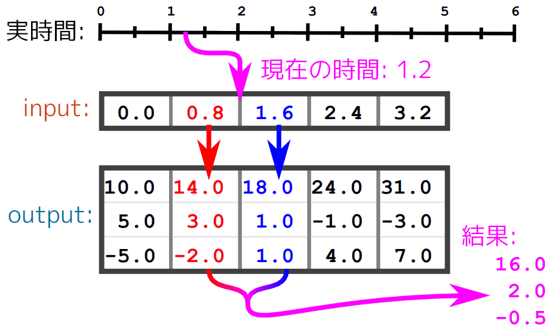<br>
[input=キーフレーム]
</p>

### 2.2 アニメーションを扱うクラスを定義する

それでは、アニメーションを管理する構造体を定義しましょう。`GltfMesh.h`を開き、
`GltfScene`構造体の定義の下に次のプログラムを追加してください。

```diff
   std::vector<const GltfNode*> nodes;     // ノード配列
   std::vector<const GltfNode*> meshNodes; // メッシュを持つノードのみの配列
 };
+
+/**
+* アニメーションの補間方法
+*/
+enum class GltfInterpolation
+{
+  step,        // 補間なし
+  linear,      // 線形補間
+  cubicSpline, // 3次スプライン補間
+};
+
+/**
+* アニメーションのキーフレーム
+*/
+template<typename T> struct GltfKeyframe
+{
+  float time; // 時刻
+  T value;    // 適用する値
+};
+
+/**
+* アニメーションのチャネル
+*/
+template<typename T> struct GltfChannel
+{
+  int targetNodeId;                       // 値を適用するノードID
+  GltfInterpolation interpolation;        // 補間方法
+  std::vector<GltfKeyframe<T>> keyframes; // キーフレーム配列
+};
+
+/**
+* アニメーション
+*/
+struct GltfAnimation
+{
+  std::string name; // アニメーション名
+  std::vector<GltfChannel<VecMath::vec3>> translations; // 平行移動チャネルの配列
+  std::vector<GltfChannel<VecMath::quat>> rotations;    // 回転チャネルの配列
+  std::vector<GltfChannel<VecMath::vec3>> scales;       // 拡大縮小チャネルの配列
+  std::vector<int> staticNodes; // アニメーションしないノードIDの配列
+  float totalTime = 0;
+};
+using GltfAnimationPtr = std::shared_ptr<GltfAnimation>;

 /**
 * ファイル
```

`GltfAnimation`(ジーエルティーエフ・アニメーション)構造体が、ひとつのアニメーションを表します。個々のアニメーションは平行移動、回転、拡大縮小の3つのターゲットに対応するチャネル配列を持ち、各チャネルはキーフレーム配列を持ちます。

>```txt
>GltfAnimation → GltfChannel(ノード1の平行移動) → GltfKeyframe[Na]
>                 GltfChannel(ノード1の回転)     → GltfKeyframe[Nb]
>                 GltfChannel(ノード3の拡大縮小) → GltfKeyframe[Nc]
>                 GltfChannel(ノード4の回転)     → GltfKeyframe[Nd]
>                 GltfChannel(ノード7の拡大縮小) → GltfKeyframe[Ne]
>※Na～Neは任意の整数
>```

次に、`GltfFile`構造体の定義にアニメーションの配列を追加してください。

```diff
   std::vector<GltfSkin> skins;            // スキン配列
   std::vector<GltfMesh> meshes;           // メッシュ配列
   std::vector<GltfMaterialPtr> materials; // マテリアル配列
+  std::vector<GltfAnimationPtr> animations; // アニメーション
   VecMath::mat4 matRoot = VecMath::mat4(1); // 基本姿勢行列
 };
```

これで、アニメーション用の構造体の準備は完了です。

### 2.3 アニメーションデータを取得する

glTFファイルからアニメーションデータを取得し、`GltfFile`のアニメーション配列に設定しましょう。`GltfMesh.cpp`を開き、`Parse`関数のスキンを取得するプログラムの下に、次のプログラムを追加してください。

```diff
       }
     } // for skinId
   } // if skins
+
+  const auto animations = gltf.find("animations");
+  if (animations != gltf.end()) {
+    file->animations.resize(animations->size());
+    for (size_t animeId = 0; animeId < animations->size(); ++animeId) {
+      // 名前を設定
+      const json& animation = animations->at(animeId);
+      GltfAnimationPtr a = std::make_shared<GltfAnimation>();
+      a->name = animation.value("name", std::string());
+
+      // アニメーションを設定
+      file->animations[animeId] = a;
+    }
+  } // if animations

   // 作成したファイルを返す
   return file;
```

このプログラムでは、アニメーションデータ配列の参照変数を定義し、次にアニメーション名を取得しています。そして最後に、作成したアニメーションオブジェクトを配列に設定します。

次にチャネルの容量を予約します。アニメーションの名前を設定するプログラムの下に、次のプログラムを追加してください。

>`reserve`と`resize`の違いに注意すること。

```diff
       const json& animation = animations[animeId];
       GltfAnimationPtr a = std::make_shared<GltfAnimation>();
       a->name = animation.value("name", std::string());
+
+      // チャネル配列の容量を予約
+      // 一般的に、平行移動・回転・拡大縮小の3つはセットで指定するので、
+      // 各チャネル配列のサイズは「総チャネル数 / 3」になる可能性が高い。
+      // 安全のため、予測サイズが必ず1以上になるように1を足している。
+      const json& channels = animation["channels"];
+      const size_t predictedSize = channels.size() / 3 + 1; // 予測サイズ
+      a->translations.reserve(predictedSize);
+      a->rotations.reserve(predictedSize);
+      a->scales.reserve(predictedSize);
+
+      // 全てのノードを「アニメーションなし」として登録
+      a->staticNodes.resize(nodes->size());
+      for (int i = 0; i < nodes->size(); ++i) {
+        a->staticNodes[i] = i;
+      }

       // アニメーションを設定
       file->animations[i] = a;
     }
```

`predictedSize`(プレディクテッド・サイズ、予測サイズ)変数は、3つのチャネル配列の予測サイズを表します。

`channels`で取得できるチャネル配列には、平行移動・回転・拡大縮小がまとめて格納されています。通常、これらは同じキーフレームで作成されるので、チャネル配列のサイズは「いずれかの`path`の3倍」になることが多いです。

そこで、予測サイズを「総チャネル数 / 3」としています。ただし、総チャネル数が2以下の場合に3で割ると、予測サイズが0になってしまいます。そのため、0になることを避けるために1を足しています。

`staticNodes`は「アニメーションしないノードIDのリスト」です。このリストはアニメーションに必須ではなく、処理の高速化のために使われます。

アニメーションの有無はチャネルの有無から判定するしかないため、チャネルと同じループで作成することにしました。作成方法は次のとおりです。

>1. 全ノードの番号を設定
>2. チャネルデータを持つノードの番号を-1にする
>3. -1の要素を全て削除

続いて、チャネルを取得する`for`ループを追加します。チャネルの容量を予約するプログラムの下に、次のプログラムを追加してください。

```diff
       for (int i = 0; i < nodes->size(); ++i) {
         a->staticNodes[i] = i;
       }
+
+      // チャネル配列を設定
+      const json& samplers = animation["samplers"];
+      a->totalTime = 0;
+      for (const Json& e : channels) {
+        // 時刻の配列を取得
+        const json& sampler = samplers[e["sampler"].get<int>()];
+        const json& inputAccessor = accessors[sampler["input"].get<int>()];
+        const GLfloat* pTimes = static_cast<const GLfloat*>(
+          GetBinaryDataAddress(inputAccessor, bufferViews, binaryList));
+
+        // 再生時間を計算
+        a->totalTime =
+          std::max(a->totalTime, inputAccessor["max"][0].get<float>());
+
+        // 値の配列を取得
+        const json& outputAccessor = accessors[sampler["output"].get<int>()];
+        const void* pValues =
+          GetBinaryDataAddress(outputAccessor, bufferViews, binaryList);
+      }

       // アニメーションを設定
       file->animations[i] = a;
```

キーフレームの「時刻」の配列と「値」の配列は、どちらもバイナリデータに記録されています。そこで、`GetBinaryDataAddress`関数を使ってデータのアドレスを計算します。

また、glTFの仕様では、キーフレームは常に`GLfloat`(=`float`)型と決められています(glTF仕様5.8.1)。そのため、`componentType`を調べることなく`const GLfloat*`にキャストできます。

>安全のために`componentType`が`GL_FLOAT`であることをチェックするのは良い考えです。型が違う場合、glTFファイルが壊れているか、またはプログラムにバグがあります。

アニメーションの値は`vec3`と`quat`のどちらかですが、どちらなのかは`path`キーを見るまで分かりません。とりあえず`const void*`型の`pValues`(ピー・バリューズ)変数に入れておきます。

「時刻」の配列にはアニメーションの再生期間も記録されており、開始時刻は`min`、終了時刻は`max`というキーで取得できます。ただし、glTFの仕様ではアニメーションの開始時刻は常に
`0`を指定することになっています。

注意点として、この`min`と`max`もまた「配列」になっています。これは、アニメーション以外のデータでも`min`と`max`を使うことがあり、その場合の値は`vec3`や`mat4`などになるためです。アニメーションの時刻の場合は常に「長さ1の配列」なので、0番目のデータを取得しています。

次に「補間方法」を取得します。値の配列を取得するプログラムの下に、次のプログラムを追加してください。

```diff
         const json& outputAccessor = accessors[sampler["output"].get<int>()];
         const void* pValues =
           GetBinaryDataAddress(outputAccessor, bufferViews, binaryList);
+
+        // 補間方法を取得
+        GltfInterpolation interp = GltfInterpolation::linear;
+        const json& target = e["target"];
+        const std::string& interpolation =
+          target.value("interpolation", std::string());
+        if (interpolation == "LINEAR") {
+          interp = GltfInterpolation::linear;
+        } else if (interpolation == "STEP") {
+          interp = GltfInterpolation::step;
+        } else if (interpolation == "CUBICSPLINE") {
+          interp = GltfInterpolation::cubicSpline;
+        }
       }

       // アニメーションを設定
       file->animations[i] = a;
```

「補間方法」はキーフレームのあいだの値を作り出す方法を指定します。以下の3つのうちいずれかの文字列として定義されます。

| 文字列 | 補間方法 |
|:-:|:--|
| <ruby>STEP<rt>ステップ</rt></ruby> | 補間しない |
| <ruby>LINEAR<rt>リニア</rt></ruby> | 線形補間 |
| <ruby>CUBICSPLINE<rt>キュービック・スプライン</rt></ruby> | 3次スプライン補間 |

文字列のままではプログラムで扱いにくい(比較が遅い、メモリが余分に必要、インテリセンスが効かない)ので、列挙値に変換しています。

### 2.4 アニメーションチャネルを取得する

アニメーションは「チャネルの集合」です。ただし、チャネルには「平行移動」、「回転」、「拡大縮小」の3つの種類があり、それぞれ扱い方が異なります。そこで、`GltfAnimation`構造体は「3種類のチャネルの集合」として定義しています。

チャネルの種類によって値の型が異なるため、`GltfChannel`と`GltfKeyframe`はクラス(構造体)テンプレートとして定義したのでした。

「値の型が異なる」ということは、`pValues`が指すアドレスに格納されている型も異なるということです。そのため、値を取得する関数は、「型ごとに作る」か「関数テンプレートで作る」のどちらかを選ぶことになります。

「型ごとに作る」のは簡単ですが、同じような処理を複数書く必要があります。「関数テンプレートで作る」場合は1回書けば終わりです。書く量が少なくて済むので、今回は関数テンプレートで書くことにします。

`GetMeshNodeList`関数の定義の下に、次のプログラムを追加してください。

```diff
     GetMeshNodeList(child, list);
   }
 }
+
+/**
+* アニメーションチャネルを作成する
+*
+* @param pTimes       時刻の配列のアドレス
+* @param pValues      値の配列のアドレス
+* @param inputCount   配列の要素数
+* @param targetNodeId 値の適用対象となるノードID
+* @param interp       補間方法
+*
+* @return 作成したアニメーションチャネル
+*/
+template<typename T>
+GltfChannel<T> MakeAnimationChannel(
+  const GLfloat* pTimes, const void* pValues, size_t inputCount,
+  int targetNodeId, GltfInterpolation interp)
+{
+  // 時刻と値の配列からキーフレーム配列を作成
+  const T* pData = static_cast<const T*>(pValues);
+  GltfChannel<T> channel;
+  channel.keyframes.resize(inputCount);
+  for (int i = 0; i < inputCount; ++i) {
+    channel.keyframes[i] = { pTimes[i], pData[i] };
+  }
+
+  // 適用対象ノードIDと補間方法を設定
+  channel.targetNodeId = targetNodeId;
+  channel.interpolation = interp;
+
+  return channel; // 作成したチャネルを返す
+}

 // バインディングポイント
 enum BindingPoint
```

それでは、`path`キーを調べて、対応するチャネル配列を作成しましょう。補完方法を取得するプログラムの下に、次のプログラムを追加してください。

```diff
         } else if (interpolation == "CUBICSPLINE") {
           interp = GltfInterpolation::cubicSpline;
         }
+
+        // 時刻と値の配列からチャネルを作成し、pathに対応する配列に追加
+        const int inputCount = inputAccessor["count"].get<int>();
+        const int targetNodeId = target["node"].get<int>();
+        const std::string& path = target["path"].get<std::string>();
+        if (path == "translation") {
+          a->translations.push_back(MakeAnimationChannel<vec3>(
+            pTimes, pValues, inputCount, targetNodeId, interp));
+        } else if (path == "rotation") {
+          a->rotations.push_back(MakeAnimationChannel<quat>(
+            pTimes, pValues, inputCount, targetNodeId, interp));
+        } else if (path == "scale") {
+          a->scales.push_back(MakeAnimationChannel<vec3>(
+            pTimes, pValues, inputCount, targetNodeId, interp));
+        }
+        a->staticNodes[targetNodeId] = -1; // アニメーションあり
       }

       // アニメーションを設定
       file->animations[i] = a;
```

最後に、「アニメーションあり」とされたノードを`staticNodes`配列から削除します。「チャネル配列を設定」するforループの下に、次のプログラムを追加してください。

```diff
         a->staticNodes[targetNodeId] = -1; // アニメーションあり
       }
+
+      // 「アニメーションあり」をリストから削除する
+      const auto itr = std::remove(
+        a->staticNodes.begin(), a->staticNodes.end(), -1);
+      a->staticNodes.erase(itr, a->staticNodes.end());
+      a->staticNodes.shrink_to_fit();
 
       // アニメーションを設定
       file->animations[animeId] = a;
```

これで、アニメーションデータを読み込めるようになりました。

### 2.5 アニメーション名をデバッグ出力する

アプリ実行時に、どのアニメーションが読み込まれているのかを確認できるように、デバッグ出力を追加します。`Load`関数のデバッグ情報を出力するプログラムに、次のプログラムを追加してください。

```diff
   for (size_t i = 0; i < p->meshes.size(); ++i) {
     LOG(R"(  meshes[%d]="%s")", i, p->meshes[i].name.c_str());
   }
+  for (size_t i = 0; i < p->animations.size(); ++i) {
+    const std::string& name = p->animations[i]->name;
+    if (name.size() <= 0) {
+      LOG("  animations[%d]=<NO NAME>", i);
+    } else {
+      LOG(R"(  animations[%d]="%s")", i, name.c_str());
+    }
+  }
   return p;
 }
```

これで、アニメーションデータの読み込みは完了です。

### 2.6 姿勢行列を計算する関数を宣言する

スケルタルアニメーションは、「ボーンの姿勢を表す行列(姿勢行列)」が時間によって変化することでアニメーションを行います。

>ここでいう「姿勢を表す行列、または姿勢行列」は「平行移動・回転・拡大縮小を合成した行列」のことで、つまり「座標変換行列」を言い換えたものです。

アニメーションを行うためには「ある時間における姿勢行列」を計算しなくてはなりません。そこで、姿勢行列を計算する関数を作成します。

関数名は`CalcAnimationMatrices`(カルク・アニメーション・マトリシーズ)とします。
`GltfMesh.h`を開き、`GltfFilePtr`型の定義の下に次のプログラムを追加してください。

```diff
   std::vector<GltfAnimationPtr> animations;
 };
 using GltfFilePtr = std::shared_ptr<GltfFile>;
+
+// アニメーション用座標変換行列の配列
+using GltfAnimationMatrices = std::vector<VecMath::mat4>;
+
+GltfAnimationMatrices CalcAnimationMatrices(const GltfFilePtr& file,
+  const GltfNode* meshNode, const GltfAnimation* animation, float time);

 void Draw(const GltfMesh& mesh,
   const std::vector<GltfMaterialPtr>& materials, GLuint program);
```

### 2.7 値を補間する関数を定義する

`CalcAnimationMatrices`関数を定義する前に、2つの補助関数を定義しておきます。

ひとつは値の補間を行う`Interpolate`(インターポレート)関数で、もうひとつは、ローカル姿勢行列からグローバル姿勢行列を作成する`CalcGlobaNodeMatrix`(カルク・グローバル・ノード・マトリックス)関数です。

とりあえず、必要なヘッダファイルをインクルードしましょう。`GltfMesh.cpp`を開き、
`algorithm`(アルゴリズム)ヘッダファイルをインクルードしてください。

```diff
 #include "nlohmann/json.hpp"
 #include <fstream>
 #include <filesystem>
+#include <algorithm>

 using namespace VecMath;
 using json = nlohmann::json;
```

それでは、`Interpolate`関数を定義しましょう(`Interpolate`は「補間する、修正する」という意味です)。`GltfMesh.cpp`を開き、`MakeAnimationChannel`関数の定義の下に、次のプログラムを追加してください。

```diff
   channel.interpolation = interp;

   return channel; // 作成したチャネルを返す
 }
+
+/**
+* チャネル上の指定した時刻の値を求める
+*
+* @param channel 対象のチャネル
+* @param time    値を求める時刻
+*
+* @return 時刻に対応する値
+*/
+template<typename T>
+T Interpolate(const GltfChannel<T>& channel, float time)
+{
+  // time以上の時刻を持つ、最初のキーフレームを検索
+  const auto curOrOver = std::lower_bound(
+    channel.keyframes.begin(), channel.keyframes.end(), time,
+    [](const GltfKeyframe<T>& keyframe, float time) {
+      return keyframe.time < time; });
+
+  // timeが先頭キーフレームの時刻と等しい場合、先頭キーフレームの値を返す
+  if (curOrOver == channel.keyframes.begin()) {
+    return channel.keyframes.front().value;
+  }
+
+  // timeが末尾キーフレームの時刻より大きい場合、末尾キーフレームの値を返す
+  if (curOrOver == channel.keyframes.end()) {
+    return channel.keyframes.back().value;
+  }
+
+  // timeが先頭と末尾の間だった場合
+  // キーフレーム間の時間におけるtimeの比率を計算し、比率によって補間した値を返す
+  const auto prev = curOrOver - 1; // ひとつ前の(time未満の時刻を持つ)キーフレーム
+  const float frameTime = curOrOver->time - prev->time;
+  const float t = std::clamp((time - prev->time) / frameTime, 0.0f, 1.0f);
+
+  // 注意: 今は常に(球状)線形補間をしているが、本来は補間方法によって処理を分けるべき
+  if constexpr (std::is_same_v<T, quat>) {
+    return slerp(prev->value, curOrOver->value, t);
+  } else {
+    return prev->value * (1 - t) + curOrOver->value * t;
+  }
+}

 } // unnamede namespace
```

チャネルには`vec3`または`quat`の2パターンがありうるため、関数テンプレートとして定義しています。

`lower_bound`(ローワー・バウンド)関数は「ソート済みの範囲」に対して使える関数で、「指定した値以上の値を持つ、最初の要素の位置」を返します。

<pre class="tnmai_code"><strong>【書式】</strong><code>
iterator lower_bound(検索範囲の先頭, 検索範囲の終端, 検索する値, 比較関数);
</code></pre>

上記のプログラムでは、比較関数に`keyframe.time < time`を返すラムダ式を指定することで、時刻による検索を行っています。

`lower_bound`はソート済み範囲を非常に高速に検索することができます(ソートされていない場合は`find_if`を使う)。キーフレームは常に時刻順になっているので、`lower_bound`で検索することができるのです。

検索の結果、見つかったキーフレームが先頭、または末尾より後ろのキーフレームの場合、つまり`time`がチャネルの範囲外の場合は、先頭または末尾の値をそのまま返します。

チャネルの範囲内だった場合は補間処理を行います。本来はチャネルの`interpolation`変数によって補間方法を変える必要がありますが、今回は手を抜いて全て線形補間を使っています。

>スケルタルアニメーションでは、線形補間以外が設定されることはまずありません。ですので、この手抜きは特に問題にはならないと考えています。

2つの値a, b、補完係数tがあるとすると、線形補間された値cは次の式で表されます。

>`c = a(1 - t) + bt`

このように、tが0から1へ変化していくと、cの値はaから始まって徐々にbに近づいていき、t=0の時点でbと一致するようになっています。

ただし、線形補間ではクォータニオンの回転を補間できません。そのため、クォータニオンの場合は`slerp`(スラープ)関数を使うようにしています。

### 2.8 グローバル姿勢行列を作成する関数を定義する

続いて`CalcGlobalNodeMatrix`関数を定義します。`Interpolate`関数の定義の下に、次のプログラムを追加してください。

```diff
     return prev->value * (1 - t) + curOrOver->value * t;
   }
 }
+
+/**
+* アニメーション計算用の中間データ型
+*/
+struct NodeMatrix
+{
+  mat4 m = mat4(1); // 姿勢行列
+  bool isCalculated = false;  // 計算済みフラグ
+};
+using NodeMatrices = std::vector<NodeMatrix>;
+
+/**
+* ノードのグローバル姿勢行列を計算する
+*/
+const mat4& CalcGlobalNodeMatrix(const std::vector<GltfNode>& nodes,
+  const GltfNode& node, NodeMatrices& matrices)
+{
+  const intptr_t currentNodeId = &node - &nodes[0];
+  NodeMatrix& nodeMatrix = matrices[currentNodeId];
+
+  // 「計算済み」の場合は自分の姿勢行列を返す
+  if (nodeMatrix.isCalculated) {
+    return nodeMatrix.m;
+  }
+
+  // 「計算済みでない」場合、親の姿勢行列を合成する
+  if (node.parent) {
+    // 親の行列を取得(再帰呼び出し)
+    const VecMath::mat4& matParent =
+      CalcGlobalNodeMatrix(nodes, *node.parent, matrices);
+
+    // 親の姿勢行列を合成
+    nodeMatrix.m = matParent * nodeMatrix.m;
+  }
+
+  // 「計算済み」にする
+  nodeMatrix.isCalculated = true;
+
+  // 自分の姿勢行列を返す
+  return nodeMatrix.m;
+}

 } // unnamede namespace
```

この関数は、自分自身を再帰的に呼び出すことで、自分自身とすべての親の「ローカル姿勢行列」を合成した「グローバル姿勢行列」を作成します。

`isCalculated`(イズ・カルキュレーテッド)変数には、ノードのグローバル姿勢行列の計算が完了していれば`true`、まだなら`false`が設定されます。

計算のためにノードの親を辿っていくと、どこかで他のノードと同じ親に到達します。
`isCalculated`がない場合、たとえ別のノードが同じ親ノードの姿勢行列を計算したことがあったとしても、もう一度同じ計算を行う必要があります。

行列の計算には時間がかかるため、これは相当な時間の無駄になります。そこで、「既に別のノードによって計算が終わっている場合は計算済みの結果を返す」とすることで計算時間を短縮しています。

### 2.9 アニメーション行列を計算する関数を定義する

必要な関数を準備することができたので、ようやく`CalcAnimationMatrices`関数を定義することができます。

ちょっと長いので、少しずつ書いていきましょう。無名名前空間の定義の下に、次のプログラムを追加してください。

```diff
   return nodeMatrix.m;
 };

 } // unnamed namespace
+
+/**
+* アニメーションを適用した姿勢行列を計算する
+*
+* @param file             meshNodeを所有するファイルオブジェクト
+* @param meshNode         メッシュを持つノード
+* @param animation        計算の元になるアニメーション
+* @param time             アニメーションの再生位置
+*
+* @return アニメーションを適用した姿勢行列の配列
+*/
+GltfAnimationMatrices CalcAnimationMatrices(const GltfFilePtr& file,
+  const GltfNode* meshNode, const GltfAnimation* animation, float time)
+{
+  GltfAnimationMatrices matBones;
+  if (!file || !meshNode) {
+    return matBones;
+  }
+
+  // アニメーションが設定されていない場合...
+  if (!animation) {
+    return matBones;
+  }
+
+  // アニメーションが設定されている場合...
+
+  NodeMatrices matrices;
+  const auto& nodes = file->nodes;
+  matrices.resize(nodes.size());
+
+  return matBones;
+}

 /**
 * glTFメッシュを描画する
```

アニメーション可能なメッシュだからといって、常にアニメーションが設定されているとは限りません。そのため、アニメーションの設定状態によって処理を分ける必要があります。

まずは、簡単なほうの「アニメーションが設定されていない場合」を書きましょう。アニメーションが設定されていない場合の`if`文の中に、次のプログラムを追加してください。

```diff
   // アニメーションが設定されていない場合...
   if (!animation) {
+    // ノードのグローバル座標変換行列を使う
+    size_t size = 1;
+    if (meshNode->skin >= 0) {
+      size = file->skins[meshNode->skin].joints.size();
+    }
+    matBones.resize(size, meshNode->matGlobal);
     return matBones;
   }

   // アニメーションが設定されている場合...
```

アニメーションが設定されていない場合は、ボーンの姿勢行列として、glTFファイルを読み込んだときに作成した「グローバル座標変換行列」を使います。メッシュにスキンIDが設定されている場合はジョイント数、なければ1つだけコピーします。

ジョイントがない場合、ルートジョイントが1つだけ存在するかのように扱います。これは、ジョイントの有無によって後の処理を分けたくないからです。

### 2.10 ローカル姿勢行列を設定する

次に、「アニメーションが設定されている場合」を書いていきます。これは以下の4段階で行います。

>1. アニメーションしないノードのローカル姿勢行列を設定
>2. アニメーションするノードのローカル姿勢行列を計算
>3. グローバル姿勢行列を計算
>4. 姿勢行列と逆バインドポーズ行列を合成

最初に、アニメーションしないノードのローカル姿勢行列を設定します。`matrices`(マトリシーズ)変数をリサイズするプログラムの下に、次のプログラムを追加してください。

```diff
   NodeMatrices matrices;
   const auto& nodes = file->nodes;
   matrices.resize(nodes.size());
+
+  // アニメーションしないノードのローカル姿勢行列を設定
+  for (const auto e : animation->staticNodes) {
+    matrices[e].m = nodes[e].matLocal;
+  }

   return matBones;
 }
```

アニメーションしないノードには、glTFファイルを読み込んだときに作成した「ローカル座標変換行列」を設定しておきます(グローバルではありません)。

グローバル座標変換行列ではなくローカル座標変換行列を設定する理由は、アニメーションを適用した結果、親ノードの座標変換行列が変化する可能性があるからです。

どのノードが変化するか分からないので、とりあえずローカル行列を設定しておき、アニメーションの適用が完了したあとで、ローカル行列からグローバル行列を計算します。

次に、アニメーションするノードのローカル姿勢行列を計算します。アニメーションしないノードのローカル姿勢行列を設定するプログラムの下に、次のプログラムを追加してください。

```diff
   for (const auto e : animation->staticNodes) {
     matrices[e].m = nodes[e].matLocal;
   }
+
+  // アニメーションするノードのローカル姿勢行列を計算
+  // (拡大縮小→回転→平行移動の順で適用)
+  for (const auto& e : animation->translations) {
+    const vec3 translation = Interpolate(e, time);
+    matrices[e.targetNodeId].m = mat4::Translate(translation);
+  }
+  for (const auto& e : animation->rotations) {
+    const quat rotation = Interpolate(e, time);
+    nmatrices[e.targetNodeId].m *= mat4_cast(rotation);
+  }
+  for (const auto& e : animation->scales) {
+    const vec3 scale = Interpolate(e, time);
+    matrices[e.targetNodeId].m *= mat4::Scale(scale);
+  }

   return matBones;
 }
```

このプログラムは、`translations`、`rotations`、`scales`の3つのチャネル配列について、`Interpolate`関数によって補間した値をローカル姿勢行列に合成します。

3つのチャネルを実行する順序に注意してください。`VecMath::mat4`の`*=`演算子は次のように解釈されます。

`A *= B → A = A * B`

そのため、平行移動→回転→拡大縮小の順番で書くと、次のように書いた場合と同じになります。

`m = ((m * T) * R) * S → m = m * T * R * S`

そして、座標変換の適用順は「右から左」なので、「拡大縮小→回転→平行移動」という適用順になります。

### 2.11 グローバル姿勢行列を計算する

続いて、グローバル姿勢行列を計算します。ローカル姿勢行列を計算するプログラムの下に、次のプログラムを追加してください。

```diff
     const vec3 scale = Interpolate(e, time);
     matrices[e.targetNodeId].m *= mat4::Scale(scale);
   }
+
+  // アニメーションを適用したグローバル姿勢行列を計算
+  if (meshNode->skin >= 0) {
+    for (const auto& joint : file->skins[meshNode->skin].joints) {
+      CalcGlobalNodeMatrix(nodes, nodes[joint.nodeId], matrices);
+    }
+  } else {
+    // ジョイントがないのでメッシュノードだけ計算
+    CalcGlobalNodeMatrix(nodes, *meshNode, matrices);
+  }

   return matBones;
 }
```

グローバル姿勢行列は全てのジョイントについて計算する必要があります。ジョイントと親子関係にないノードは描画に影響しないため、計算の必要はありません。

また、スキンが設定されていない(=ジョイントがない)場合はメッシュノードだけを計算します。ジョイントの計算でメッシュノードを入れていない理由は、ジョイントと親子関係にあるなら自動的に計算され、なければ描画に影響しないからです。

glTFのアニメーションデータは、座標変換行列とバインドポーズ行列を合成した結果になるように作成されるルールになっています。そのため、この時点で「ローカル座標変換行列→バインドポーズ行列」の合成までが完了したことになります。

### 2.12 逆バインドポーズ行列を合成する

残る作業は「逆バインドポーズ行列を合成する」ことだけです。それでは「逆バインドポーズ行列の合成」を行うプログラムを書いていきましょう。グローバル姿勢行列を計算するプログラムの下に、次のプログラムを追加してください。

```diff
     // ジョイントがないのでメッシュノードだけ計算
     CalcGlobalNodeMatrix(nodes, *meshNode, matrices);
   }
+
+  // 逆バインドポーズ行列を合成
+  if (meshNode->skin >= 0) {
+    // glTFのjointsキーにはノード番号が格納されている
+    // しかし、頂点データのJOINTS_n属性には「joints配列のインデックス」が格納されている
+    // 実際に姿勢行列を使うのは頂点データなので、姿勢行列をjoints配列の順番で格納する
+    const auto& joints = file->skins[meshNode->skin].joints;
+    matBones.resize(joints.size());
+    for (size_t i = 0; i < joints.size(); ++i) {
+      const auto& joint = joints[i];
+      matBones[i] = matrices[joint.nodeId].m * joint.matInverseBindPose;
+    }
+  } else {
+    // ジョイントがないので逆バインドポーズ行列も存在しない
+    const size_t nodeId = meshNode - &nodes[0];
+    matBones.resize(1, matrices[nodeId].m);
+  }

   return matBones;
 }
```

ここでも、スキンが設定されている(=ジョイントがある)かどうかで処理が分かれます。ジョイントがある場合、ジョイント配列の順序に従って「逆バインドポーズ行列を合成した姿勢行列」を格納していきます。

頂点アトリビュートのジョイント番号は「ジョイント配列のインデックス」だという点には注意が必要です。ノード番号で姿勢行列を設定してしまうと、メッシュが正しく表示されません。

当然のことですが、ジョイントがない場合は逆バインドポーズ行列も存在しません。そのため、メッシュノードの姿勢行列を格納するだけで十分です。

これで、アニメーション用の座標変換行列を作成できるようになりました。

>**【2章のまとめ】**
>
>* glTFのアニメーションデータは「チャネル」と「サンプラ」の2つで構成される。
>* チャネルは、アニメーションするノードとアニメーションデータを持つサンプラによって定義される。
>* サンプラには、キーフレームデータと値データの場所が書かれれている。
>* キーフレームの補間には、線形補間と球状線形補間を使う。
>* glTFの場合、アニメーションするノードとしないノードが混ざっている。アニメーションの有無によって扱い方を変える必要がある。

<div style="page-break-after: always"></div>

## 3. 姿勢行列の管理

### 3.1 SSBOを追加する

スケルタルアニメーションの表示は次の3つの手順で行います。

>1. \[CPU\] ボーンの<ruby>姿勢<rt>しせい</rt></ruby>を表す行列を計算。
>2. \[CPU\] ボーンの姿勢を表す行列をGPUメモリにコピー。
>3. \[シェーダ\] 姿勢を表す行列を使って頂点座標を変換。

姿勢を表す行列(姿勢行列)の数はボーン数に比例するので、モデルによってはかなりの数になる可能性があります。数が多すぎてユニフォーム変数では扱いきれないので、`SSBO`をダブルバッファで使うことにします。

まずSSBOを使うための先行宣言を行います。`GltfMesh.h`を開き、次の先行宣言を追加してください。

```diff
 using TexturePtr = std::shared_ptr<Texture>;
 class BufferObject;
 using BufferObjectPtr = std::shared_ptr<BufferObject>;
+class MappedBufferObject;
+using MappedBufferObjectPtr = std::shared_ptr<MappedBufferObject>;
 class VertexArray;
 using VertexArrayPtr = std::shared_ptr<VertexArray>;
```

次に、`GltfFileBuffer`クラスに「姿勢制御行列を管理するメンバ変数」を追加します。`GltfFileBuffer`クラスの定義に次のプログラムを追加してください。

```diff
   // ファイル管理用の連想配列
   std::unordered_map<std::string, GltfFilePtr> files;
+
+  // アニメーションの姿勢行列バッファ
+  MappedBufferObjectPtr animationBuffer;
+  AnimationMatrices tmpAnimationBuffer;
 };
 using GltfFileBufferPtr = std::shared_ptr<GltfFileBuffer>;
```

`tmpAnimationBuffer`(テンプ・アニメーション・バッファ)は、計算した姿勢行列を溜めておき、まとめてSSBOにコピーするために使います。

一時的に溜めておく理由は、GPUメモリへのアクセスが発生する処理では、少しずつデータを送るより、まとめてデータを送るほうが、かかる時間が短くなるためです。

### 3.2 SSBOを初期化する

姿勢行列の最大数は、コンストラクタ引数で指定できるようにします。`GltfFileBuffer`クラスの定義に次のプログラムを追加してください。

```diff
 {
 public:
   // glTFファイルバッファを作成する
-  static std::shared_ptr<GltfFileBuffer> Create(size_t bufferCapacity) {
-    return std::make_shared<GltfFileBuffer>(bufferCapacity);
+  static std::shared_ptr<GltfFileBuffer> Create(size_t bufferCapacity,
+    size_t maxMatrixCount) {
+    return std::make_shared<GltfFileBuffer>(bufferCapacity, maxMatrixCount);
   }

   // コンストラクタ・デストラクタ
-  explicit GltfFileBuffer(size_t bufferCapacity);
+  GltfFileBuffer(size_t bufferCapacity, size_t maxMatrixCount);
   ~GltfFileBuffer() = default;

   // ファイルの読み込み
```

次に、コンストラクタにSSBOを初期化するプログラムを追加します。`GltfMesh.cpp`を開き、`GltfFileBuffer`コンストラクタの定義を次のように変更してください。

```diff
 * コンストラクタ
 *
 * @param bufferCapacity メッシュ格納用バッファの最大バイト数
+* @param maxMatrixCount アニメーション用SSBOに格納できる最大行列数
 */
-GltfFileBuffer::GltfFileBuffer(size_t bufferCapacity)
+GltfFileBuffer::GltfFileBuffer(size_t bufferCapacity, size_t maxMatrixCount)
 {
   // GPUメモリを確保し、書き込み専用としてマップする
   buffer = BufferObject::Create(bufferCapacity, nullptr,
     GL_MAP_WRITE_BIT | GL_MAP_PERSISTENT_BIT | GL_MAP_COHERENT_BIT);
   pBuffer = static_cast<uint8_t*>(glMapNamedBuffer(*buffer, GL_WRITE_ONLY));
 
   // バッファの先頭にダミーデータを設定
   const DefaultVertexData defaultData;
   memcpy(pBuffer, &defaultData, sizeof(defaultData));
   curBufferSize = sizeof(defaultData);
+
+  // アニメーションの姿勢行列用バッファを作成
+  animationBuffer = MappedBufferObject::Create(maxMatrixCount * sizeof(mat4),
+    GL_SHADER_STORAGE_BUFFER, GL_WRITE_ONLY);
+  tmpAnimationBuffer.reserve(maxMatrixCount);

   // デフォルトマテリアルを作成
   defaultMaterial = std::make_shared<GltfMaterial>();
```

### 3.3 姿勢行列を操作するメンバ関数を追加する

作成される姿勢行列の数は、毎フレーム異なる可能性があります。例えば、アニメーションするキャラクターが1体のときと比べると、3体のときは3倍の数の姿勢行列を作成することになるでしょう。

表示されるキャラクターの数は事前には分からないので、必要になるたびに追加できるようになっていると便利です。そこで、姿勢行列バッファを操作するメンバ関数を追加します。

`GltfMesh.h`を開き、`GltfFileBuffer`クラスの定義に次のプログラムを追加してください。

```diff
   // ファイルの読み込み
   GltfFilePtr Load(const char* filename);
+
+  // 姿勢行列の配列
+  using AnimationMatrices = std::vector<VecMath::mat4>;
+
+  // メッシュ描画に使うSSBOの範囲
+  struct Range {
+    GLintptr offset;
+    size_t size;
+  };
+
+  // アニメーションの姿勢行列バッファの管理
+  void ClearAnimationBuffer();
+  Range AddAnimationMatrices(const AnimationMatrices& matBones);
+  void UploadAnimationBuffer();
+  void BindAnimationBuffer(GLuint bindingPoint, const Range& range);
+  void UnbindAnimationBuffer(GLuint bindingPoint);

 private:
   GltfFilePtr Parse(const char* text, const char* foldername);
```

追加したメンバ関数は、以下の手順で使用することを想定しています。

| 順序 | メンバ関数名 | 説明 |
|:-:|:--|:--|
| 1 | <ruby>ClearAnimationBuffer<rt>クリア・アニメーション・バッファ</rt></ruby> | フレーム開始時に`tmpAnimationBuffer`をクリア。 |
| 2 | <ruby>AddAnimationMatrices<rt>アド・アニメーション・マトリシーズ</rt></ruby> | メッシュごとに現在フレームの姿勢行列を計算して<br>`tmpAnimationBuffer`に格納。 |
| 3 | <ruby>UploadAnimationBuffer<rt>アップロード・アニメーション・バッファ</rt></ruby> | 全ての姿勢行列の格納が終わったら、`tmpAnimationBuffer`をSSBOにコピー。 |
| 4 | <ruby>BindAnimationBuffer<rt>バインド・アニメーション・バッファ</rt></ruby> | 描画するメッシュの姿勢行列が格納されたSSBO領域をバインド(`AddAnimationMatrices`の戻り値を使用)。 |
| 5 | <ruby>UnbindAnimationBuffer<rt>アンバインド・アニメーション・バッファ</rt></ruby> | 全てのメッシュを描画したあとで、SSBO領域のバインドを解除。 |

アニメーションは毎フレーム更新されるので、当然SSBOも毎フレーム更新されます。さらに、アニメーションするメッシュが複数存在するとき、それらのメッシュの姿勢行列はすべてGPUメモリへコピーしておく必要があります。

しかし、GPUメモリへのコピーは時間のかかる処理なので、フレーム中に何度も実行したくありません。そこで、まず全てのメッシュの姿勢行列を`tmpAnimationBuffer`に格納します。

そして、描画を行う前に`tmpAnimationxBuffer`の内容をGPUメモリにコピーします。この方法はCPU側のメモリを必要としますが、かわりにGPUメモリへのコピーを毎フレーム1回で済ませられるようになります。

### 3.4 ClearAnimationBuffer関数を定義する

それでは、`ClearAnimationBuffer`(クリア・アニメーション・バッファ)関数から定義していきましょう。`GltfMesh.cpp`を開き、`GltfFileBuffer`コンストラクタの定義の下に、次のプログラムを追加してください。

```diff
   glTextureSubImage2D(*defaultMaterial->texBaseColor, 0, 0, 0,
     4, 4, GL_BGRA, GL_UNSIGNED_BYTE, img);
 }
+
+/**
+* アニメーションメッシュの描画用データをすべて削除
+*
+* フレームの最初に呼び出すこと。
+*/
+void GltfFileBuffer::ClearAnimationBuffer()
+{
+  tmpAnimationBuffer.clear();
+}

 /**
 * glTFファイルからファイルオブジェクトを作成する
```

この関数は`tmpAnimationBuffer`をクリアするだけの簡単な関数です。しかし、この関数をフレームの最初に呼び出さない限り、以降の関数を適切に運用することはできません。「関数の長さ」と「関数の重要性」は関係ないのです。

### 3.5 AddAnimationMatrices関数を定義する

続いて`AddAnimationMatrices`(アド・アニメーション・マトリシーズ)関数を定義します。
`ClearAnimationBuffer`関数の定義の下に、次のプログラムを追加してください。

```diff
 {
   tmpAnimationBuffer.clear();
 }
+
+/**
+* アニメーションメッシュの描画用データを追加
+*
+* @param matBones SSBOに追加する姿勢行列の配列
+*
+* @return matBones用に割り当てられたSSBOの範囲
+*/
+GltfFileBuffer::Range GltfFileBuffer::AddAnimationMatrices(
+  const AnimationMatrices& matBones)
+{
+  const GLintptr offset =
+    static_cast<GLintptr>(tmpAnimationBuffer.size() * sizeof(VecMath::mat4));
+  tmpAnimationBuffer.insert(
+    tmpAnimationBuffer.end(), matBones.begin(), matBones.end());
+
+  // SSBOのオフセットアライメント条件を満たすために、256バイト境界(mat4の4個分)に配置する。
+  // 256はOpenGL仕様で許される最大値。
+  tmpAnimationBuffer.resize(((tmpAnimationBuffer.size() + 3) / 4) * 4);
+  return { offset, matBones.size() * sizeof(mat4) };
+}

 /**
 * glTFファイルからファイルオブジェクトを作成する
```

`offset`(オフセット)変数は、行列のコピー先バイトオフセットを示します。この値は、
`BindAnimationBuffer`関数の`offset`引数として使うことを想定しています。

OpenGLの仕様では、バインド時に指定するオフセットは特定の境界値になっていることを要求します。境界値はバインドするバッファによって異なりますが、SSBOの場合は最大でも256バイトであることが保証されています。

つまり、オフセットが常に256バイト境界になるようにすれば、どのようなGPUやドライバであっても意図したとおりに動作すると期待できるわけです。そして、`mat4`は64バイトです。そこで、`mat4`4つ単位でオフセットを設定しています。

>**【OpenGLの仕様ってどこにあるの？】**<br>
>SSBOの境界値は`GL_SHADER_STORAGE_BUFFER_OFFSET_ALIGNMENT`というパラメータで取得できます。また、このパラメータで取得できるオフセット境界値が最大256であることは、以下のOpenGL 4.5 仕様書の表23.64に書かれています。<br>
>`https://www.khronos.org/registry/OpenGL/specs/gl/glspec45.core.pdf`

### 3.6 UploadAnimationBuffer関数を定義する

次に`UploadAnimationBuffer`(アップロード・アニメーション・バッファ)関数を定義します。`AddAnimationMatrices`関数の定義の下に、次のプログラムを追加してください。

```diff
   matrixBuffer.resize(((matrixBuffer.size() + 3) / 4) * 4);
   return offset;
 }
+
+/**
+* アニメーションメッシュの描画用データをGPUメモリにコピー
+*/
+void GltfFileBuffer::UploadAnimationBuffer()
+{
+  if (tmpAnimationBuffer.empty()) {
+    return; // 転送するデータがない場合は何もしない
+  }
+  animationBuffer->WaitSync();
+  uint8_t* p = animationBuffer->GetMappedAddress();
+  memcpy(p, tmpAnimationBuffer.data(), tmpAnimationBuffer.size() * sizeof(mat4));
+  animationBuffer->SwapBuffers();
+}

 /**
 * glTFファイルからファイルオブジェクトを作成する
```

この関数を実行することで、`tmpAnimationBuffer`に蓄積された姿勢行列がGPUメモリにコピーされます。

### 3.7 BindAnimationBuffer関数を定義する

次に`BindAnimationBuffer`(バインド・アニメーション・バッファ)関数を定義します。
`UploadAnimationBuffer`関数の定義の下に、次のプログラムを追加してください。

```diff
   memcpy(p, matrixBuffer.data(), matrixBuffer.size() * sizeof(mat4));
   ssbo->SwapBuffers();
 }
+
+/**
+* アニメーションメッシュの描画に使うSSBO領域を割り当てる
+*
+* @param bindingPoint バインディングポイント
+* @param range        バインドする範囲
+*/
+void GltfFileBuffer::BindAnimationBuffer(
+  GLuint bindingPoint, const Rnage& range)
+{
+  if (range.size > 0) {
+    animationBuffer->Bind(bindingPoint, range.offset, range.size);
+  }
+}

 /**
 * glTFファイルからファイルオブジェクトを作成する
```

この関数がやることは、`MappedBufferObject`クラスの`Bind`メンバ関数を呼び出すだけです。

### 3.8 UnbindAnimationBuffer関数を定義する

最後に`UnbindAnimationBuffer`(アンバインド・アニメーション・バッファ)関数を定義します。`BindAnimationBuffer`関数の定義の下に、次のプログラムを追加してください。

```diff
     animationBuffer->Bind(bindingPoint, offset, size);
   }
 }
+
+/**
+* アニメーションメッシュの描画に使うSSBO領域の割り当てを解除する
+*/
+void GltfFileBuffer::UnbindAnimationBuffer(GLuint bindingPoint)
+{
+  glBindBufferRange(GL_SHADER_STORAGE_BUFFER, bindingPoint, 0, 0, 0);
+}

 /**
 * glTFファイルからファイルオブジェクトを作成する
```

これで、アニメーション用のSSBOを管理する機能は完成です。

<div style="page-break-after: always"></div>

### 3.9 ファイルバッファオブジェクトの初期化を修正する

`GltfFileBuffer`のコンストラクタを変更したので、コンストラクタを呼び出しているプログラムも修正しなくてはなりません。`Engine.cpp`を開き、`Initialize`関数の定義を次のように変更してください。

```diff
     sizeof(Mesh::Vertex) * 10'000, sizeof(uint16_t) * 30'000);

   // glTFファイル用バッファを初期化
+  const size_t maxAnimeModelCount = 64;   // アニメーションするモデル数
+  const size_t maxAnimeMatrixCount = 256; // 1モデルのボーン数
-  engine->gltfFileBuffer = std::make_shared<GltfFileBuffer>(10'000'000);
+  engine->gltfFileBuffer = std::make_shared<GltfFileBuffer>(10'000'000,
+    maxAnimeModelCount * maxAnimeMatrixCount);

   // メインカメラを作成
   cameraObject = Create<GameObject>("Main Camera");
```

ボーン数の想定を256としたのは、指先までしっかりボーンが設定されたモデルには少なくとも100本程度のボーンが必要で、さらに髪の毛や衣服、アクセサリ等が付くと200本を超えることがあるためです。

モデル数の64は、モデル1体256ボーンとして、SSBOのサイズが1MBになる数値にしました(`4x4行列(64バイト)*256ボーン*64モデル=1MB`, 実際にはダブルバッファなので2MB)。

もっとも、この1MBという数値には特に根拠はなく、単にキリのいい数値というだけです。そういうことなので、これらの数値は必要に応じて変更してください。

### 3.10 姿勢行列ををGPUメモリにコピーする

続いて`UploadAnimationBuffer`の呼び出しを追加します。これは、フレームの全てのモデルのアニメーション状態の計算が完了した後、モデルを描画するまでのあいだならどこでも構いません。

今回は描画の直前、パーティクルの更新の直後で呼び出すことにします。`MainLoop`関数の定義に、次のプログラムを追加してください。

```diff
       mat4::LookAt(eye, eye + target, vec3(0, 1, 0));
     particleManager->Update(matParticleView, deltaTime);
     particleManager->UpdateSSBO();
+
+    // アニメーションバッファをクリア
+    gltfFileBuffer->ClearAnimationBuffer();
+
+    // アニメーションバッファをGPUメモリにコピーする
+    gltfFileBuffer->UploadAnimationBuffer();

     // 描画先をゲームウィンドウに変更
     glBindFramebuffer(GL_FRAMEBUFFER, *fboGameWindow);
```

>**【無意味なコメントは避けるべき、ですが...】**<br>
>`ClearAnimationBuffer`という名前の関数のコメントに「アニメーションバッファをクリア」と書くのは冗長で無駄なので(関数名から自明)、本来であれば避けるべきです。しかし、就職活動では無意味であってもコメントが多いほうが喜ばれたりします。めんどくさいですね。

### 3.11 レンダラーコンポーネントに姿勢行列を更新する機能を追加する

姿勢行列の更新はレンダラーコンポーネントで行うことにします。ただし、これを`Update`で行うと、「アニメーションの更新」と「姿勢行列の更新」の実行順序がコンポーネントの登録順によって異なる場合があり、あまりよくありません。

そこで、専用の関数を用意することにします。関数名は`PreDraw`(プレ・ドロー)とします。
`Renderer.h`を開き、`Renderer`クラスの定義に次のプログラムを追加してください。

```diff
   Renderer() = default;
   ~Renderer() = default;

+  virtual void PreDraw(const GameObject& gameObject) {}
   virtual void Draw(const ProgramPipeline& program,
     const VecMath::mat4& matGameObject) const {}
```

追加したイベント関数をゲームエンジンから呼び出しましょう。`Engine.cpp`を開き、
`MainLoop`関数にある「アニメーションバッファをクリア」するプログラムの下に、次のプログラムを追加してください。

```diff
     // アニメーションバッファをクリア
     gltfFileBuffer->ClearAnimationBuffer();
+
+    // 描画の前処理を実行
+    for (auto& e : gameObjectList) {
+      for (auto& r : e->meshRendererList) {
+        r->PreDraw(*e);
+      }
+    }

     // アニメーションバッファをGPUメモリにコピーする
     gltfFileBuffer->UploadAnimationBuffer();
```

### 3.12 アニメーション用シェーダを定義する

アニメーションを行うモデルのために、アニメーション用のシェーダとレンダラを追加する必要があります。まずシェーダを作成しましょう。プロジェクトの`Res`フォルダに
`animation_3D.vert`という名前の頂点シェーダファイルを追加してください。

アニメーション以外の処理は`standard_3D.vert`と同じなので、とりあえず内容をコピーしましょう。

<pre class="tnmai_assignment">
<strong>【課題01】</strong>
<code>standard_3D.vert</code>の内容をコピーし、<code>animation_3D.vert</code>に貼り付けなさい。
</pre>

それでは、アニメーション機能を追加していきます。`animation_3D.vert`を開き、シェーダへの入力変数として次のプログラムを追加してください。

```diff
 layout(location=1) in vec2 inTexcoord;
 layout(location=2) in vec3 inNormal;
 layout(location=3) in vec4 inTangent;
+layout(location=4) in vec4 inJoints;
+layout(location=5) in vec4 inWeights;

 // シェーダからの出力
 layout(location=0) out vec3 outPosition;
```

`inJoints`(イン・ジョインツ)は「使用する姿勢行列の番号」、`inWeights`(イン・ウェイツ)は「姿勢行列の重要度」を表します。

次に、モデル行列を削除します。モデル行列は、次に追加する「姿勢行列の配列」から作成できるためです。プログラムからの入力を次のように変更してください。

```diff
 layout(binding=2) uniform sampler2DShadow texDepth;

 // プログラムからの入力
-layout(location=0) uniform mat4 matModel;
 layout(location=1) uniform mat4 matShadowTexture;

 // x: 視野角による水平拡大率
```

続いて、アニメーション用の姿勢行列を表すSSBOを追加します。カメラパラメータの定義の下に、次のプログラムを追加してください。

```diff
 layout(location=3) uniform vec4 cameraData;
 layout(location=4) uniform vec3 cameraPosition; // カメラ座標
 layout(location=5) uniform vec2 cameraSinCosX;  // カメラX軸回転
+
+// スケルタルアニメーション用SSBO
+layout(std430, binding=0) buffer AnimationDataBlock
+{
+  mat4 matBones[]; // 姿勢行列の配列
+};

 void main()
 {
```

姿勢行列の名前は`matBones`(マット・ボーンズ)としました。日本語では「骨用の行列たち」といった意味になるでしょうか。

次に、この姿勢行列を合成してモデル行列を作成しまます。`main`関数の先頭に次のプログラムを追加してください。

```diff
 void main()
 {
+  // 姿勢行列にウェイトを掛けて加算合成し、モデル行列を作成
+  mat4 matModel =
+    matBones[int(inJoints.x)] * inWeights.x +
+    matBones[int(inJoints.y)] * inWeights.y +
+    matBones[int(inJoints.z)] * inWeights.z +
+    matBones[int(inJoints.w)] * inWeights.w;
+
+  // ウェイトが正規化されていない場合の対策([3][3]が1.0になるとは限らない)
+  matModel[3][3] = dot(inWeights, vec4(1));
+
   outPosition = vec3(matModel * vec4(inPosition, 1));

   // ワールド法線を計算
```

スケルタルアニメーション用の頂点データには「何番目の姿勢行列を使うか」が記録されています。これは`inJoints`(イン・ジョインツ)入力変数で取得します。

プログラムを見ると分かるように、スケルタルアニメーションのポイントは、複数のボーン(姿勢)行列をウェイトによって加算合成するところにあります。

頂点ごとに複数の姿勢行列を合成することができます。glTF仕様では、合成に使える姿勢行列の数は決められていません。しかし、「少なくとも4つに対応すること」となっています。今回作成するプログラムでも、最大4つまでの合成に対応しています。

>モデル行列の扱いは実装方針によって異なります。本テキストのように事前にボーン行列に合成してしまうこともあれば、普通に`uniform`変数で渡して、合成後の姿勢行列に掛ける場合もあります。

<pre class="tnmai_assignment">
<strong>【課題02】</strong>
プロジェクトの<code>Res</code>フォルダに<code>shadow_animation.vert</code>という頂点シェーダファイルを作成し、<code>shadow.vert</code>をコピーしなさい。
<code>animation_3D.vert</code>を参考に、スケルタルアニメーションに対応させなさい。
</pre>

### 3.13 シェーダを読み込む

それではシェーダを読み込みましょう。`Engine.h`を開き、`Engine`クラス定義に次のプログラムを追加してください。

```diff
   // 3Dモデル用の変数
   ProgramPipelinePtr progStandard3D;
+  ProgramPipelinePtr progAnimation3D;
   Mesh::MeshBufferPtr meshBuffer;
   Mesh::PrimitiveBufferPtr primitiveBuffer;
   Mesh::GltfFileBufferPtr gltfFileBuffer;
   GameObjectPtr cameraObject;

   // 3Dモデルの影描画用の変数
   FramebufferObjectPtr fboShadow;
   ProgramPipelinePtr progShadow;
+  ProgramPipelinePtr progShadowAnimation;
 
   FramebufferObjectPtr fboGameWindow; // ゲームウィンドウ用FBO
```

変数名は`progAnimation3D`(プログ・アニメーション・スリーディ)、
`progShadowAnimation`(プログ・シャドウ・アニメーション)としました。

次に`Engine.cpp`を開き、`Initialize`関数の定義に次のプログラムを追加してください。

```diff
   progStandard3D = ProgramPipeline::Create(
      "Res/standard_3D.vert", "Res/standard_3D.frag");
+  progAnimation3D = ProgramPipeline::Create(
+    "Res/animation_3D.vert", "Res/standard_3D.frag");

   // 影用オブジェクトを作成
   progShadow = ProgramPipeline::Create("Res/shadow.vert", "Res/shadow.frag");
+  progShadowAnimation = ProgramPipeline::Create(
+    "Res/shadow_animation.vert", "Res/shadow.frag");
   fboShadow = FramebufferObject::Create(1024, 1024, FboType::depth);
```

フラグメントシェーダには、アニメーションしないメッシュと同じシェーダを使います。スケルタルアニメーションが影響するのはモデル行列だけで、ライティングにはなんの影響も及ぼさないからです。

### 3.14 レンダラーからモデル形式を取得できるようにする

メジャーなゲームエンジンでは、メッシュデータをゲームエンジン専用のモデル形式に変換することで、元のファイル形式が異なっていても同じシェーダが使えるようになっています。

しかし、本テキストで作成したエンジンでは、OBJファイルとglTFファイルで異なるモデル形式を使っています。そのため、適切な描画方法はファイルによって異なります。

ここでの問題は「モデル形式が異なるレンダラーが混在しているため、レンダラーごとに適切な描画方法を選択できない」ことです。実際、現在は効率を無視して同じ描画方法を使っています。

理想的にはひとつのモデル形式にまとめるべきですが、いまから形式をまとめるのはかなり面倒です。そこで、妥協案として、レンダラーを「モデル形式」によって分類し、分類したレンダラーごとにまとめて描画することにします。手順は次のとおりです。

>1. モデル形式を表す列挙型を追加する。
>2. レンダラーからモデル形式を取得できるようにする。
>3. モデル形式によってレンダラーを分類する。
>4. モデル形式ごとに適切な描画方法を選択する。

最初に、モデル形式を表す列挙型を追加します。列挙型の名前は`ModelFormat`(モデル・フォーマット)とします。`Renderer.h`を開き、次のプログラムを追加してください。

```diff
 // 先行宣言
 class ProgramPipeline;
+
+/**
+* モデル形式
+*/
+enum class ModelFormat
+{
+  obj,          // OBJファイル
+  gltfStatic,   // glTF(アニメーションなし)
+  gltfAnimated, // glTF(アニメーションあり)
+};

 /**
 * レンダラーコンポーネントの基底クラス
```

次に、レンダラーにモデル形式を取得する機能を追加します。`Renderer`クラスの定義に次のプログラムを追加してください。

```diff
   Renderer() = default;
   ~Renderer() = default;
+
+  // モデル形式を取得
+  virtual ModelFormat GetModelFormat() const = 0;

   virtual void PreDraw(const GameObject& gameObject) {}
   virtual void Draw(const ProgramPipeline& program,
```

全てのレンダラー派生クラスは、適切なモデル形式を返す必要があります。そのため、`GetModelFormat`メンバ関数は「純粋仮想関数」にしました。

それでは、派生クラスに`GetModelFormat`関数を実装しましょう。`MeshRenderer.h`を開き、次のプログラムを追加してください。

```diff
   MeshRenderer() = default;
   virtual ~MeshRenderer() = default;
+
+  virtual ModelFormat GetModelFormat() const override { return ModelFormat::obj; }

   virtual void Draw(const ProgramPipeline& program,
     const VecMath::mat4& matGameObject) const override {
```

続いて`GltfMeshRenderer.h`を開き、次のプログラムを追加してください。

```diff
   GltfMeshRenderer() = default;
   virtual ~GltfMeshRenderer() = default;
+
+  virtual ModelFormat GetModelFormat() const override {
+    return ModelFormat::gltfStatic; }

   virtual void Draw(const ProgramPipeline& program,
     const VecMath::mat4& matGameObject) const override
```

これで、レンダラーからモデル形式を取得できるようになりました。

### 3.15 モデル形式によってレンダラーを分類する

次に、「モデル形式によってレンダラーを分類する」機能を作成します。レンダラーを使って描画を実行するのはゲームエンジンなので、これはゲームエンジンの機能になります。

`Engine.h`を開き、`Engine`クラスの定義に次のプログラムを追加してください。

```diff
   Mesh::GltfFileBufferPtr GetGltfFileBuffer() const { return gltfFileBuffer; }

 private:
+  // 分類済みレンダラーリスト
+  struct SortedRendererList
+  {
+    struct Data {
+      const Renderer* renderer = nullptr;
+      const VecMath::mat4* pModelMatrix = nullptr;
+    };
+    std::vector<Data> obj;
+    std::vector<Data> gltfStatic;
+    std::vector<Data> gltfAnimated;
+    std::vector<VecMath::mat4> modelMatrices;
+  
+    void SortByModelFormat(const GameObjectList& gameObjectList);
+  };
+
   int Initialize();
   int MainLoop();
```

`SortedRendererList`(ソーテッド・レンダラー・リスト)構造体は、レンダラーを分類(ソート)し、ポインタ配列として記録します。加えて、描画に使用するモデル行列も管理します。

>クラス設計として見ると、「分類済みレンダラーリスト」にモデル行列の管理機能を持たせるのはちょっと怪しげです。もっと良い方法があるように思います。

`Engine.cpp`を開き、`RemoveParticleEmitterAll`メンバ関数の定義の下に、次のプログラムを追加してください。

```diff
 {
   particleManager->RemoveEmitterAll();
 }
+
+/**
+* レンダラーをモデル形式で分類する
+*
+* @param gameObjectList 分類対象のゲームオブジェクトの配列
+*/
+void Engine::SortedRendererList::SortByModelFormat(
+  const GameObjectList& gameObjectList)
+{
+  obj.reserve(gameObjectList.size());
+  gltfStatic.reserve(gameObjectList.size());
+  gltfAnimated.reserve(gameObjectList.size());
+  modelMatrices.reserve(gameObjectList.size());
+
+  for (const auto& e : gameObjectList) {
+    if (e->meshRendererList.empty()) {
+      continue; // レンダラーがないので無視
+    }
+
+    // モデル行列を計算
+    const mat4 mt = mat4::Translate(e->position);
+    const mat4 mrx = mat4::RotateX(e->rotation[0]);
+    const mat4 mry = mat4::RotateY(e->rotation[1]);
+    const mat4 mrz = mat4::RotateZ(e->rotation[2]);
+    const mat4 ms = mat4::Scale(e->scale);
+    modelMatrices.push_back(mt * mry * mrx * mrz * ms);
+
+    // モデル形式によって分類
+    const mat4* pModelMatrix = &modelMatrices.back();
+    for (const auto& renderer : e->meshRendererList) {
+      switch (renderer->GetModelFormat()) {
+      case ModelFormat::obj:
+        obj.push_back({ renderer.get(), pModelMatrix });
+        break;
+      case ModelFormat::gltfStatic:
+        gltfStatic.push_back({ renderer.get(), pModelMatrix });
+        break;
+      case ModelFormat::gltfAnimated:
+        gltfAnimated.push_back({ renderer.get(), pModelMatrix });
+        break;
+      }
+    }
+  } // for gameObjectList
+}

 /**
 * ゲームエンジンを初期化する
```

ところで、モデル行列の計算は他のプログラムでも登場します。そこで、ゲームオブジェクトのメンバ関数にします。`GameObject.h`を開き、`GameObject`クラスの定義に次のプログラムを追加してください。

```diff
   // 描画
   void DrawStaticMesh(const ProgramPipeline& program) const;
+
+  // モデル行列を取得
+  VecMath::mat4 GetModelMatrix() const
+  {
+    const auto mt = VecMath::mat4::Translate(position);
+    const auto mrx = VecMath::mat4::RotateX(rotation[0]);
+    const auto mry = VecMath::mat4::RotateY(rotation[1]);
+    const auto mrz = VecMath::mat4::RotateZ(rotation[2]);
+    const auto ms = VecMath::mat4::Scale(scale);
+    return mt * mry * mrx * mrz * ms;
+  }

   Engine* engine = nullptr;    // エンジンのアドレス
   std::string name;            // オブジェクト名
```

このメンバ関数で、モデル行列の計算を置き換えます。モデル行列を計算するプログラムを、次のように変更してください。

```diff
       continue; // レンダラーがないので無視
     }

     // モデル行列を計算
-    const mat4 mt = mat4::Translate(e->position);
-    const mat4 mrx = mat4::RotateX(e->rotation[0]);
-    const mat4 mry = mat4::RotateY(e->rotation[1]);
-    const mat4 mrz = mat4::RotateZ(e->rotation[2]);
-    const mat4 ms = mat4::Scale(e->scale);
-    modelMatrices.push_back(mt * mry * mrx * mrz * ms);
+    modelMatrices.push_back(e->GetModelMatrix());

     // モデル形式によって分類
     const mat4* pModelMatrix = &modelMatrices.back();
```

それでは、レンダラーを分類しましょう。`DrawStaticMesh`メンバ関数の定義に次のプログラムを追加してください。

```diff
   if (gameObjectList.empty()) {
     return;
   }
+
+  // 使用するモデル形式ごとにレンダラーを分類
+  SortedRendererList rendererList;
+  rendererList.SortByModelFormat(gameObjectList);

   // 平行光源
   struct DirectionalLight
```

次に、ゲームオブジェクトの描画を「分類済みレンダラーリスト」を使うように変更します。ゲームオブジェクトを描画するプログラムを次のように変更してください。

```diff
   glViewport(
     camera.viewport.x, camera.viewport.y,
     camera.viewport.width, camera.viewport.height);

-  // レンダラコンポーネントを持つ全てのゲームオブジェクトを描画
-  for (const auto& gameObject : gameObjectList) {
-    glBindVertexArray(*meshBuffer->GetVAO());
-    gameObject->DrawStaticMesh(*progStandard3D);
-  }
+  // OBJファイルを描画
+  glUseProgram(*progStandard3D);
+  glBindVertexArray(*meshBuffer->GetVAO());
+  for (const auto& e : rendererList.obj) {
+    e.renderer->Draw(*progStandard3D, *e.pModelMatrix);
+  }
+
+  // glTF(アニメーションなし)を描画
+  for (const auto& e : rendererList.gltfStatic) {
+    e.renderer->Draw(*progStandard3D, *e.pModelMatrix);
+  }
+
+  // glTF(アニメーションあり)を描画
+  glUseProgram(*progAnimation3D);
+  for (const auto& e : rendererList.gltfAnimated) {
+    e.renderer->Draw(*progAnimation3D, *e.pModelMatrix);

   glBindTextures(0, 2, nullptr);
   glBindVertexArray(*vao);
```

### 3.16 ユニフォーム変数を設定する

ユニフォーム変数はプログラムオブジェクトごとに異なる領域として作られます。これは、「同じシェーダファイルから作成したとしても、ユニフォーム変数は共有されない」ことを意味します。

例えば、`progStandard3D`と`progAnimation3D`のフラグメントシェーダは、どちらも
`standard_3D.frag`を使っています。そして、`standard_3D.frag`にはライティング用のユニフォーム変数が定義されています。

しかし、ユニフォーム変数はプログラムオブジェクト間で共有されません。そのため、2つのプログラムオブジェクトの両方に対して、ユニフォーム変数を設定する必要があります。

これは、ほとんど同じプログラムを、プログラムオブジェクトの数だけ書く必要があることを意味します。しかし、重複するプログラムを書くのは面倒ですし、なによりバグの元です。そのため、何らかの方法で関数としてまとめることになります。

今回は、利用範囲が局所的なことから、「ラムダ式」を使ってユニフォーム変数を設定するプログラムをまとめることにします。

`DrawStaticMesh`メンバ関数の`matShadowTexture`をユニフォーム変数に設定するプログラムに、次のプログラムを追加してください。

```diff
     vec4(0.5f, 0.5f, 0.5f, 1.0f),
   };
   const mat4 matShadowTexture = matTexture * matShadow;
+
+  // ユニフォーム変数を設定するラムダ式
+  const auto setUniform = [&](GLuint program) {
     glProgramUniformMatrix4fv(*progStandard3D, 1, 1, GL_FALSE, &matShadowTexture[0][0]);

     // 平行光源の情報を設定
```

次に、カメラ情報を設定するプログラムの下に、閉じカッコを追加してください。

```diff
     glProgramUniform3fv(*progStandard3D, 4, 1, &cameraObject->position.x);
     glProgramUniform2f(*progStandard3D, 5,
       sin(cameraObject->rotation[0]), cos(cameraObject->rotation[0]));
+  };

   // ビューポートを設定
+  Camera& camera = static_cast<Camera&>(*cameraObject->componentList[0]);
   glViewport(
     camera.viewport.x, camera.viewport.y,
```

ビューポートを設定する直前に`camera`変数を追加したのは、元の`camera`変数がラムダ式の中に入ったことで、見えなくなってしまったからです。これで、ユニフォーム変数を設定するプログラムがラムダ式になりました。

さて、このラムダ式は、常に`progStandard3D`のユニフォーム変数を設定するようになっています。これを、指定したプログラムオブジェクトのユニフォーム変数を設定するように修正しましょう。`setUniform`ラムダ式を次のように変更してください。

```diff
   // ユニフォーム変数を設定するラムダ式
   const auto setUniform = [&](GLuint program) {
-    glProgramUniformMatrix4fv(*progStandard3D, 1, 1, GL_FALSE, &matShadowTexture[0][0]);
+    glProgramUniformMatrix4fv(program, 1, 1, GL_FALSE, &matShadowTexture[0][0]);

     // 平行光源の情報を設定
     const vec3 color = directionalLight.color * directionalLight.intensity;
-    glProgramUniform3f(*progStandard3D, 100, color.x, color.y, color.z);
-    glProgramUniform3f(*progStandard3D, 101,
+    glProgramUniform3f(program, 100, color.x, color.y, color.z);
+    glProgramUniform3f(program, 101,
       directionalLight.direction.x,
       directionalLight.direction.y,
       directionalLight.direction.z);

     // 環境光の情報を設定
     const vec3 ambientLight = vec3(0.2f, 0.2f, 0.3f);
-    glProgramUniform3f(*progStandard3D, 104,
+    glProgramUniform3f(program, 104,
       ambientLight.x, ambientLight.y, ambientLight.z);

     // 3D表示用のカメラ情報を設定
     Camera& camera = static_cast<Camera&>(*cameraObject->componentList[0]);
-    glProgramUniform4f(*progStandard3D, 3,
+    glProgramUniform4f(program, 3,
       camera.fovScaleX, camera.fovScaleY, camera.A, camera.B);
-    glProgramUniform3fv(*progStandard3D, 4, 1, &cameraObject->position.x);
-    glProgramUniform2f(*progStandard3D, 5,
+    glProgramUniform3fv(program, 4, 1, &cameraObject->position.x);
+    glProgramUniform2f(program, 5,
       sin(cameraObject->rotation[0]), cos(cameraObject->rotation[0]));
   };
```

それでは、ラムダ式を使ってユニフォーム変数を設定しましょう。分類済みレンダラーを描画するプログラムに、次のプログラムを追加してください。

```diff
   // OBJファイルを描画
   glUseProgram(*progStandard3D);
+  setUniform(*progStandard3D);
   glBindVertexArray(*meshBuffer->GetVAO());
   for (const auto& e : rendererList.obj) {
     e.renderer->Draw(*progStandard3D, *e.pModelMatrix);
   }

   // glTF(アニメーションなし)を描画
   for (const auto& e : rendererList.gltfStatic) {
     e.renderer->Draw(*progStandard3D, *e.pModelMatrix);
   }

   // glTF(アニメーションあり)を描画
   glUseProgram(*progAnimation3D);
+  setUniform(*progAnimation3D);
   for (const auto& e : rendererList.gltfAnimated) {
     e.renderer->Draw(*progAnimation3D, *e.pModelMatrix);
```

これで、`progAnimation3D`のユニフォーム変数を設定できるようになりました。

### 3.17 影の描画で分類済みレンダラーリストを使う

モデルの描画は、`DrawStaticMesh`メンバ関数だけでなく、`CreateDepthMap`メンバ関数でも行っています。こちらも分類済みレンダラーリストに対応させなくてはなりません。

レンダラーの分類は`DrawStaticMesh`で行っているので、`CraeteDepthMap`では分類済みレンダラーリストを受け取って使うことにします。

`Engine.h`を開き、`CraeteDepthMap`メンバ関数の宣言を次のように変更してください。

```diff
   void DrawSpriteList(const SpriteList& spriteList,
     GLuint tex, size_t& spriteSsboOffset);
   void DrawStaticMesh(GameObjectList& gameObjectList);
-  VecMath::mat4 CreateDepthMap(GameObjectList& gameObjectList,
+  VecMath::mat4 CreateDepthMap(const SortedRendererList& rendererList,
     const VecMath::vec3& eye, const VecMath::vec3& target,
     float range, float zNear, float zFar);
```

次に`Engine.cpp`を開き、`CreateDepthMap`メンバ関数の定義を次のように変更してください。

```diff
 /**
 * 深度マップを作成する
 *
-* @param gameObjectList 描画するゲームオブジェクトの配列
+* @param rendererList 描画する分類済みレンダラーリスト
 * @param eye    影描画用の視点座標
 * @param target 影描画用の注視点の座標
 * @param range  eyeから影描画範囲の上端、下端、左端、右端までの距離
 * @param zNear  eyeから影描画範囲の手前端までの距離
 * @param zFar   eyeから影描画範囲の奥端までの距離
 * 
 * @return 影描画用ビュープロジェクション行列
 */
-mat4 Engine::CreateDepthMap(GameObjectList& gameObjectList,
+mat4 Engine::CreateDepthMap(const SortedRendererList& rendererList,
   const vec3& eye, const vec3& target,
   float range, float zNear, float zFar)
```

次に、ゲームオブジェクトを描画するプログラムを、次のように変更してください。

```diff
   const mat4 matShadowView = mat4::LookAt(eye, target, vec3(0, 1, 0));
   const mat4 matShadowProj = mat4::Orthogonal(-range, range, -range, range, zNear, zFar);
   const mat4 matShadow = matShadowProj * matShadowView;
+
+  // OBJファイルを描画
+  glUseProgram(*progShadow);
   glProgramUniformMatrix4fv(*progShadow, 1, 1, GL_FALSE, &matShadow[0][0]);
-
-  // レンダラコンポーネントを持つ全てのゲームオブジェクトを描画
-  for (const auto& gameObject : gameObjectList) {
-    glBindVertexArray(*meshBuffer->GetVAO());
-    gameObject->DrawStaticMesh(*progShadow);
-  }
+  glBindVertexArray(*meshBuffer->GetVAO());
+  for (const auto& e : rendererList.obj) {
+    e.renderer->Draw(*progShadow, *e.pModelMatrix);
+  }
+
+  // glTF(アニメーションなし)を描画
+  for (const auto& e : rendererList.gltfStatic) {
+    e.renderer->Draw(*progShadow, *e.pModelMatrix);
+  }
+
+  // glTF(アニメーションあり)を描画
+  glUseProgram(*progShadowAnimation);
+  glProgramUniformMatrix4fv(*progShadowAnimation, 1, 1, GL_FALSE, &matShadow[0][0]);
+  for (const auto& e : rendererList.gltfAnimated) {
+    e.renderer->Draw(*progShadowAnimation, *e.pModelMatrix);
+  }

   return matShadow;
 }
```

影の描画で設定するユニフォーム変数はひとつだけです。そのため、ラムダ式は使っていません。しかし、わずか1行とはいえ、同じことを2書いているのは事実です。ラムダ式を使っても良いかもしれません。

最後に、`CreateDepthMap`関数の呼び出しを修正します。`DrawStaticMesh`メンバ関数の定義を次のように変更してください。

```diff
   // 深度マップを作成
   const mat4 matShadow = CreateDepthMap(
-    gameObjectList, shadowEye, shadowTarget, 750, 100, 2000);
+    rendererList, shadowEye, shadowTarget, 750, 100, 2000);

   // ゲームウィンドウ用FBOに描画
   glBindFramebuffer(GL_FRAMEBUFFER, *fboGameWindow);
```

プログラムが書けたらビルドして実行してください。特に問題なく描画が行われていたら成功です。

### 3.18 アニメーションありレンダラーを作成する

それでは、アニメーションを扱うレンダラーコンポーネントを定義しましょう。プロジェクトの`Src/Component`フォルダに`GltfAnimatedMeshRenderer`(ジーエルティーエフ・アニメーテッド・メッシュ・レンダラ)という名前のヘッダファイルを追加してください。

追加したファイルを開き、次のプログラムを追加してください。

```diff
+/**
+* @file GltfAnimatedMeshRenderer.h
+*/
+#ifndef COMPONENT_GLTFANIMATEDMESHRENDERER_H_INCLUDED
+#define COMPONENT_GLTFANIMATEDMESHRENDERER_H_INCLUDED
+#include "Renderer.h"
+#include "../GltfMesh.h"
+
+/**
+* アニメーション付きglTFメッシュ描画用コンポーネント
+*/
+class GltfAnimatedMeshRenderer : public Renderer
+{
+public:
+  GltfAnimatedMeshRenderer() = default;
+  ~GltfAnimatedMeshRenderer() = default;
+
+  // シェーダの種類
+  virtual ModelFormat GetModelFormat() const override {
+    return ModelFormat::gltfAnimated; }
+
+  virtual void Update(GameObject& gameObject, float deltaTime) override;
+  virtual void PreDraw(const GameObject& gameObject) override;
+  virtual void Draw(const ProgramPipeline& program,
+    const VecMath::mat4& matGameObject) const override;
+
+  std::vector<Mesh::GltfMaterialPtr> materials; // 固有マテリアル
+  Mesh::GltfFileBufferPtr fileBuffer;
+  Mesh::GltfFilePtr file; // 描画に使うglTFファイル
+  float time = 0;         // 現在の再生時刻
+
+private:
+  std::vector<Mesh::GltfFileBuffer::Range> ssboRanges;
+};
+using GltfAnimatedMeshRendererPtr =
+  std::shared_ptr<GltfAnimatedMeshRenderer>;
+
+#endif // COMPONENT_GLTFANIMATEDMESHRENDERER_H_INCLUDED
```

### 3.19 Updateメンバ関数を定義する

それでは`GltfAnimatedMeshRenderer`のメンバ関数を定義しましょう。プロジェクトの
`Src/Component`フォルダに`GltfAnimatedMeshRenderer.cpp`という名前のCPPファイルを追加してください。追加したファイルを開き、次のプログラムを追加してください。

```diff
+/**
+* @file GltfAnimatedMeshRenderer.cpp
+*/
+#include "GltfAnimatedMeshRenderer.h"
+#include "../ProgramPipeline.h"
+#include "../Texture.h"
+#include "../VertexArray.h"
+#include "../GameObject.h"
+#include <algorithm>
+
+using namespace VecMath;
+
+/**
+* アニメーション状態を更新する
+*
+* @param gameObject 描画対象のゲームオブジェクト
+* @param deltaTime  前回の更新からの経過時間
+*/
+void GltfAnimatedMeshRenderer::Update(GameObject& gameObject, float deltaTime)
+{
+  time += deltaTime;
+}
```

### 3.20 PreDrawメンバ関数を定義する

次に`PreDraw`(プレ・ドロー)メンバ関数を定義します。`Update`メンバ関数の定義の下に、次のプログラムを追加してください。

```diff
 {
   time += deltaTime;
 }
+
+/**
+* 描画の前処理を実行
+*
+* @param gameObject 描画対象のゲームオブジェクト
+*/
+void GltfAnimatedMeshRenderer::PreDraw(const GameObject& gameObject)
+{
+  if (!fileBuffer || !file) {
+    return;
+  }
+
+  // シーンに含まれるメッシュのアニメーション行列を更新
+  const auto scene = &file->scenes[0];
+  const auto& animation = file->animations[0];
+  const mat4 matModel = gameObject.GetModelMatrix();
+  ssboRanges.clear();
+  for (const auto e : scene->meshNodes) {
+    // アニメーション行列を計算
+    auto matBones = Mesh::CalcAnimationMatrices(file, e, animation.get(), time);
+    for (auto& m : matBones) {
+      m = matModel * m; // アニメーション行列にモデル行列を合成
+    }
+
+    // アニメーション行列をバッファに追加し、追加先のオフセットとサイズを記録
+    ssboRanges.push_back(fileBuffer->AddAnimationMatrices(matBones));
+  }
+}
```

`PreDraw`メンバ関数は、`CalcAnimationMatrices`関数によって全てのメッシュの姿勢行列を更新します。そして、計算した姿勢行列をSSBOに追加するために
`AddAnimationMatrices`関数を呼び出します。

`AddAnimationMatrices`関数は、追加したデータに対応するSSBO範囲を返してくれます。SSBO範囲は`Draw`関数で描画するときに必要なので、`ssboRanges`(エスエスビーオー・レンジズ)配列に記録しておきます。

>**【姿勢行列の使いみち】**<br>
>姿勢行列は、手に武器を持たせたり、特定の部位にエフェクトを発生させるために使うこともできます。

### 4.6 Draw関数を定義する

最後に`Draw`(ドロー)メンバ関数を定義します。`ssboRanges`に記録したSSBO範囲はここで使います。`PreDraw`メンバ関数の定義の下に、次のプログラムを追加してください。

```diff
     ssboRanges.push_back(fileBuffer->AddAnimationMatrices(matBones));
   }
 }
+
+/**
+* メッシュを描画する
+*
+* @param program 描画に使うプログラムパイプラインオブジェクト
+* @param matGameObject ゲームオブジェクトのモデル行列
+*/
+void GltfAnimatedMeshRenderer::Draw(const ProgramPipeline& program,
+  const VecMath::mat4& matGameObject) const
+{
+  if (!fileBuffer || !file || ssboRanges.empty()) {
+    return;
+  }
+
+  // シーンに含まれるメッシュを描画
+  const auto scene = &file->scenes[0];
+  for (size_t i = 0; i < scene->meshNodes.size(); ++i) {
+    const int meshNo = scene->meshNodes[i]->mesh;
+    const Mesh::GltfMesh& mesh = file->meshes[meshNo];
+
+    // SSBOをバインディングポイント0番に割り当てる
+    fileBuffer->BindAnimationBuffer(0, ssboRanges[i]);
+
+    // マテリアルが指定されていない場合、共有マテリアルを使って描画する
+    const auto* pMaterials = &materials;
+    if (materials.empty()) {
+      pMaterials = &file->materials;
+    }
+
+    // メッシュに含まれる全てのプリミティブを描画
+    Mesh::Draw(mesh, *pMaterials, program);
+  }
+}
```

これまでの描画と異なるのは、「描画の前にSSBOを割り当てる処理が追加されている」点です。

### 3.22 アニメーションglTFを描画する

アニメーションを処理するには`GltfFileBuffer`が必要なので、ゲームエンジンから取得できるようにします。`Engine.h`を開き、`Engine`クラスの定義に次のプログラムを追加してください。

```diff
   ParticleEmitterPtr FindParticleEmitter(const std::string& name) const;
   void RemoveParticleEmitter(const ParticleEmitterPtr&);
   void RemoveParticleEmitterAll();
+
+  Mesh::GltfFileBufferPtr GetGltfFileBuffer() const { return gltfFileBuffer; }

 private:
   // 分類済みレンダラーリスト
```

それではアニメーションglTFを表示してみましょう。

<pre class="tnmai_assignment">
<strong>【課題03】</strong>
以下のURLでglTFの動作確認用モデルが公開されています。
<code>https://github.com/KhronosGroup/glTF-Sample-Models</code>
このサイトから<code>2.0/CesiumMan/glTF</code>にある
- CesiumMan.glTF
- CesiumMan_data.bin
- CesiumMan_img0.png
をダウンロードし、プロジェクトの<code>Res/Model</code>フォルダに保存しなさい。
画像ファイルCesiumMan_img0.pngはTGA形式に変換しておくこと。
</pre>

glTFファイルをダウンロードしたら、`MainGameScene.cpp`を開き、`Initialize`関数にあるアヒルちゃんを追加するプログラムの下に、次のプログラムを追加してください。

```diff
   gltf->position = vec3(0, 8, -4);
   auto gltfRenderer = gltf->AddComponent<GltfMeshRenderer>();
   gltfRenderer->file = engine.LoadGltf("Res/Model/Duck.gltf");
+
+  // アニメーション表示テスト
+  auto animeTest = engine.Create<GameObject>("Animated glTF Test");
+  animeTest->position = vec3(2, 8, -4);
+  animeTest->scale = vec3(2); // 見やすいようにサイズを2倍にする
+  auto animeTestRenderer = animeTest->AddComponent<GltfAnimatedMeshRenderer>();
+  animeTestRenderer->fileBuffer = engine.GetGltfFileBuffer());
+  animeTestRenderer->file = engine.LoadGltf("Res/Model/CesiumMan.gltf");

   // 表示テスト用に地面を配置
   auto ground = engine.Create<GameObject>("Ground");
```

プログラムが書けたらビルドして実行してください。アヒルちゃんの横に、全身白タイツ人間のようなモデルが表示されていたら成功です。

<p align="center">
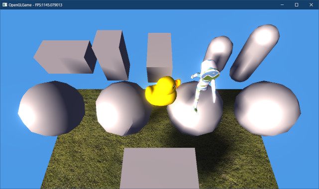
</p>

<div style="page-break-after: always"></div>

>**【3章のまとめ】**
>
>* アニメーション用の行列は数が多く、ユニフォーム変数に格納しきれない。そのため、SSBOなどを使う必要がある。
>* 複数のデータをSSBOにコピーする場合、コピー回数を減らすために、コピーするデータを貯めておくバッファを使うとよい。
>* スケルタルアニメーションのポイントは、複数のボーン(姿勢)行列をウェイトによって加算合成すること。ボーン行列は事前に計算してSSBOにコピーしておく。
>* スケルタルアニメーションには大量の追加の計算が必要になる。アニメーションしないメッシュと同じように扱うことはできない。

<div style="page-break-after: always"></div>

## 4. アニメーションの制御

### 4.1 アニメーション制御機能を追加する

3章で表示したアニメーションは、途中で止まってしまったと思います。glTFに限らず、ほとんどのモデル形式はループを指定する機能を持っていません。そのため、ループ再生などはプログラムで制御する必要があります。

そこで、ループ制御機能に加えて、再生、停止、一時停止といった操作を追加することにします。まず、アニメーションの状態を示す列挙型を追加します。

`GltfAnimatedMeshRenderer.h`を開き、`GltfAnimatedMeshRenderer`クラスの定義に次のプログラムを追加してください。

```diff
 class GltfAnimatedMeshRenderer : public Renderer
 {
 public:
+  // アニメーションの再生状態
+  enum class State {
+    stop,  // 停止中
+    play,  // 再生中
+    pause, // 一時停止中
+  };
+
   GltfAnimatedMeshRenderer() = default;
   ~GltfAnimatedMeshRenderer() = default;
```

次に、再生状態とループ状態を示すメンバ変数を追加します。
`GltfAnimatedMeshRenderer`クラスの定義に、次のプログラムを追加してください。

```diff
   Mesh::GltfFileBufferPtr fileBuffer;
   Mesh::GltfFilePtr file; // 描画に使うglTFファイル
   float time = 0;         // 現在の再生時刻
+  bool isLoop = true;     // true=ループする, false=ループしない

 private:
   std::vector<Mesh::GltfFileBuffer::Range> ssboRanges;
+  State state = State::stop; // 再生状態
 };
 using GltfAnimatedMeshRendererPtr =
```

続いて、アニメーションを制御するメンバ関数を宣言します。`Draw`メンバ関数の宣言の下に、次のプログラムを追加してください。

```diff
   virtual void PreDraw(const GameObject& gameObject) override;
   virtual void Draw(const ProgramPipeline& program,
     const VecMath::mat4& matGameObject) const override;
+
+  // アニメーション制御
+  void Play();
+  void Stop();
+  void Pause();
+  State GetState() const { return state; }

   std::vector<Mesh::GltfMaterialPtr> materials; // 固有マテリアル
   Mesh::GltfFileBufferPtr fileBuffer;
```

それでは、アニメーション制御関数を定義しましょう。`GltfAnimatedMeshRenderer.cpp`を開き、`Draw`メンバ関数の定義の下に、次のプログラムを追加してください。

```diff
     Mesh::Draw(mesh, *pMaterials, program);
   }
 }
+
+/**
+* アニメーションの再生を開始・再開する
+*/
+void GltfAnimatedMeshRenderer::Play()
+{
+  switch (state) {
+  case State::play: break;
+  case State::stop:
+    time = 0; // 先頭から再生
+    state = State::play;
+    break;
+  case State::pause:
+    state = State::play;
+    break;
+  }
+}
+
+/**
+* アニメーションの再生を停止する
+*/
+void GltfAnimatedMeshRenderer::Stop()
+{
+  switch (state) {
+  case State::play:  state = State::stop; break;
+  case State::stop:  break;
+  case State::pause: state = State::stop; break;
+  }
+}
+
+/**
+* アニメーションの再生を一時停止する
+*/
+void GltfAnimatedMeshRenderer::Pause()
+{
+  switch (state) {
+  case State::play:  state = State::pause; break;
+  case State::stop:  break;
+  case State::pause: break;
+  }
+}
```

これらのメンバ関数は、現在のアニメーション状態を見て、対応する状態を設定します。

### 4.2 Updateメンバ関数をアニメーション状態に対応させる

アニメーション状態を変更できるだけでは無意味です。そこで、アニメーション状態に応じて再生時間を変化させます。`Update`メンバ関数の定義を次のように変更してください。

```diff
 void GltfAnimatedMeshRenderer::Update(GameObject& gameObject, float deltaTime)
 {
+  const auto& animation = file->animations[0];
+
+  // アニメーション状態を更新
+  switch (state) {
+  case State::stop:
+    break;
+
+  case State::play:
+    // 再生時刻を更新
+    time += deltaTime * animationSpeed;
+    if (isLoop) {
+      time -= animation->totalTime * std::floor(time / animation->totalTime);
+    } else {
+      time = std::clamp(time, 0.0f, animation->totalTime);
+      if (time >= animation->totalTime) {
+        state = State::stop;
+      }
+    }
+    break;
+
+  case State::pause:
+    break;
+  }
 }
```

ループ再生は、「現在の再生時刻`time`が総再生時間`totalTime`を超えたら、現在の再生時刻から総再生時間を引く」という方法で行っています。

>「現在の再生時刻を総再生時間で割った余りを使う」という方法も考えられますが、「現在の再生時刻が負の場合」に正しく動作しない可能性があります。

ループ再生が指定されている場合、`time`が`totalTime`以上になったら再生位置を先頭に移動し、0未満になったら再生位置を末尾に移動します。この処理には`floor`(フロア)関数を使っています。

<pre class="tnmai_code"><strong>【書式】</strong><code>
float floor(数値);
</code></pre>

`floor`関数は、「引数で指定した数値以下の最大の整数」を返します。例えば`3.4`を指定すると`3`、`-1.5`を指定すると`-2`が返されます。

この機能によって、`time`が0未満の場合は`-1`、`totalTime`以上の場合は`1`が返されるため、これを利用して再生時刻のループを実現しています。

また、ループ再生が無効の場合、`time`が`0`以下の場合は`0`、`totalTime`以上の場合は`totalTime`にする必要があります。これには`clamp`(クランプ)関数を使っています。

<pre class="tnmai_code"><strong>【書式】</strong><code>
float clamp(数値, 最小値, 最大値);
</code></pre>

ループ再生が無効の場合、現在の再生時刻が総再生時間以上になったら停止状態に変更します。

>音声や映像の再生装置は再生終了時に自動停止するため、それらの仕様に合わせています。最後まで再生したときに自動停止させない実装もあり得ます。

これでループ再生ができるようになったので、実際に試してみましょう。初期化時の再生状態は`stop`なので、`Play`メンバ関数を呼び出して再生を開始する必要があります。

`MainGameScene.cpp`を開き、アニメーション付きglTFを設定するプログラムの下に、次のプログラムを追加してください。

```diff
   auto animeTestRenderer = animeTest->AddComponent<GltfAnimatedMeshRenderer>();
   animeTestRenderer->fileBuffer = engine.GetGltfFileBuffer());
   animeTestRenderer->file = engine.LoadGltf("Res/Model/CesiumMan.gltf");
+  animeTestRenderer->Play();

   // 表示テスト用に地面を配置
   auto ground = engine.Create<GameObject>("Ground");
```

プログラムが書けたらビルドして実行してください。再生が停止せず、白タイツ人間が歩きつづけていたら成功です。

### 4.3 アニメーション選択機能を追加する

glTFでは、ひとつのファイルに複数のアニメーションを設定できます。ファイル内にある全てのアニメーションを使えるように、アニメーションを選択する機能を追加します。

`GltfAnimatedMeshRenderer.h`を開き、`GltfAnimatedMeshRenderer`クラスの定義に次のプログラムを追加してください。

```diff
 private:
   std::vector<Mesh::GltfFileBuffer::Range> ssboRanges;
   State state = State::stop; // 再生状態
+  Mesh::GltfAnimationPtr animation; // 再生するアニメーション
 };
 using GltfAnimatedMeshRendererPtr =
```

次に、`GetState`メンバ関数の定義の下に、次のプログラムを追加してください。

```diff
   bool Stop();
   bool Pause();
   State GetState() const { return state; }
+
+  // アニメーションの指定と取得
+  bool SetAnimation(const Mesh::GltfAnimationPtr& animation, bool isLoop = true);
+  bool SetAnimation(const std::string& name, bool isLoop = true);
+  bool SetAnimation(size_t index, bool isLoop = true);
+  const Mesh::GltfAnimationPtr& GetAnimation() const { return animation; }

   std::vector<Mesh::GltfMaterialPtr> materials; // 固有マテリアル
   Mesh::GltfFileBufferPtr fileBuffer;
```

glTFのアニメーションには名前を設定できます。もし名前が設定されている場合、その名前でアニメーションを指定できると便利です。名前が設定されていない場合もあるため、インデックス番号による指定も必要です。

さらに、「他のglTFファイル」にあるアニメーションを指定することも考えられます。これは、「アニメーションだけのアセット」を想定したものです。

それから、アニメーションを指定するとき、ループフラグも一緒に指定できると便利です。そこで、引数にループフラグを追加しています。

### 4.4 ポインタでアニメーションを指定する関数を定義する

それでは、ポインタ引数版のアニメーション指定関数から定義していきましょう。`GltfAnimatedMeshRenderer.cpp`を開き、`Pause`(ポーズ)メンバ関数の定義の下に、次のプログラムを追加してください。

```diff
   case State::pause: return true;
   }
 }
+
+/**
+* アニメーションを設定する
+*
+* @param animation 再生するアニメーション
+* @param isLoop    ループ再生の指定(true=ループする false=ループしない)
+*
+* @retval true  設定成功
+* @retval false 設定失敗
+*/
+bool GltfAnimatedMeshRenderer::SetAnimation(
+  const Mesh::GltfAnimationPtr& animation, bool isLoop)
+{
+  // 同じアニメーションが指定された場合は何もしない
+  if (this->animation == animation) {
+    return true; // 設定成功として扱う
+  }
+ 
+  this->animation = animation; // アニメーションを設定
+
+  // 状態を「停止中」に設定
+  time = 0;
+  state = State::stop;
+  this->isLoop = isLoop;
+  return true;
+}
```

同じアニメーションが指定された場合、現在のアニメーション状態を維持します。この機能の目的は、ユーザー側でアニメーションを管理するプログラムを書くとき、「同じアニメーションかどうか」のチェックを省けるようにすることです。

### 4.5 名前でアニメーションを指定する関数を定義する

次に、名前でアニメーションを指定する関数を定義します。ポインタ版の`SetAnimation`メンバ関数の定義の下に、次のプログラムを追加してください。

```diff
   this->isLoop = isLoop;
   return true;
 }
+
+/**
+* アニメーションを設定する
+*
+* @param name   再生するアニメーションの名前
+* @param isLoop ループ再生の指定(true=ループする false=ループしない)
+*
+* @retval true  設定成功
+* @retval false 設定失敗
+*/
+bool GltfAnimatedMeshRenderer::SetAnimation(const std::string& name, bool isLoop)
+{
+  if ( ! file) {
+    return false;
+  }
+  for (const auto& e : file->animations) {
+    if (e->name == name) {
+      return SetAnimation(e, isLoop);
+    }
+  }
+  return false;
+}
```

for文で名前の一致するアニメーションを検索し、見つかったアニメーションを引数にしてポインタ版`SetAnimation`を呼び出します。

### 4.6 インデックスでアニメーションを指定する関数を定義する

最後に、インデックス番号でアニメーションを指定する関数を定義します。名前版の`SetAnimation`メンバ関数の定義の下に、次のプログラムを追加してください。

```diff
   }
   return false;
 }
+
+/**
+* アニメーションを設定する
+*
+* @param index  再生するアニメーション番号
+* @param isLoop ループ再生の指定(true=ループする false=ループしない)
+*
+* @retval true  設定成功
+* @retval false 設定失敗
+*/
+bool GltfAnimatedMeshRenderer::SetAnimation(size_t index, bool isLoop)
+{
+  if (!file || index >= file->animations.size()) {
+    return false;
+  }
+  return SetAnimation(file->animations[index], isLoop);
+}
```

インデックスは検索の必要はありません。しかし、インデックスが範囲内かどうかのチェックが必要となります。

### 4.7 アニメーションするglTFファイルを表示する

それでは、`SetAnimation`メンバ関数を使って、アニメーションを指定してみましょう。ただ、`glTF-Sample-Models`のサイトには、使いやすい複数のアニメーションが設定されているファイルがありません。

こちらでテスト用のファイルを用意したので、それをダウンロードして使ってください。

<pre class="tnmai_assignment">
<strong>【課題04】</strong>
以下のURLにアクセスし、<code>res</code>フォルダにある<code>animation_models.zip</code>をダウンロードして、プロジェクトの<code>Res/Model</code>フォルダに展開しなさい。
画像ファイルはTGA形式に変換しておくこと。
<code>https://github.com/tn-mai/OpenGL3D2022</code>
</pre>

ダウンロードしたZIPファイルを展開し、PNGファイルをTGAファイルに変換したら、表示テストを行いましょう。`MainGameScene.h`を開き、`GltfAnimatedMeshRenderer.h`をインクルードしてください。

```diff
 #ifndef MAINGAMESCENE_H_INCLUDED
 #define MAINGAMESCENE_H_INCLUDED
 #include "Scene.h"
+#include "Component/GltfAnimatedMeshRenderer.h"
 #include <vector>
 
 /**
 * メインゲーム画面
 */
 class MainGameScene : public Scene
 {
 public:
   MainGameScene() = default;
   virtual ~MainGameScene() = default;
   virtual bool Initialize(Engine& engine) override;
   virtual void Update(Engine& engine, float deltaTime) override;
 
 private:
+  GltfAnimatedMeshRendererPtr animeTestRenderer;
   std::vector<GameObjectPtr> boxList;
   std::vector<GameObjectPtr> sphereList;
```

次に`MainGameScene.cpp`を開き、`Initialize`メンバ関数にあるアニメーション表示プログラムを次のように変更してください。

```diff
   animeTest->position = vec3(2, 8, -4);
   animeTest->scale = vec3(2);
-  auto animeTestRenderer = animeTest->AddComponent<GltfAnimatedMeshRenderer>();
+  animeTestRenderer = animeTest->AddComponent<GltfAnimatedMeshRenderer>();
   animeTestRenderer->fileBuffer = engine.GetGltfFileBuffer());
-  animeTestRenderer->file = engine.LoadGltf("Res/Model/CesiumMan.gltf");
+  animeTestRenderer->file = engine.LoadGltf("Res/Model/skeleton.gltf");
+  animeTestRenderer->SetAnimation("Walk");
   animeTestRenderer->Play();

   // 表示テスト用に地面を配置
   auto ground = engine.Create<GameObject>("Ground");
```

次に、`Update`メンバ関数に次のプログラムを追加してください。

```diff
   if (engine.GetKey(GLFW_KEY_E)) {
     p->position.y += 10 * deltaTime;
   }
+
+  // アニメーション切り替えテスト
+  if (engine.GetKey(GLFW_KEY_SPACE)) {
+    animeTestRenderer->SetAnimation("Attack", false);
+    animeTestRenderer->Play();
+  } else if (animeTestRenderer->time >= 2) {
+    animeTestRenderer->SetAnimation("Walk");
+    animeTestRenderer->Play();
+  }
 }
```

プログラムが書けたらビルドして実行してください。白タイツ人間が消えて、ガイコツが歩いていると思います。スペースバーを押すと刀を振ります。2秒後にまた歩き始めたら成功です。

<p align="center">
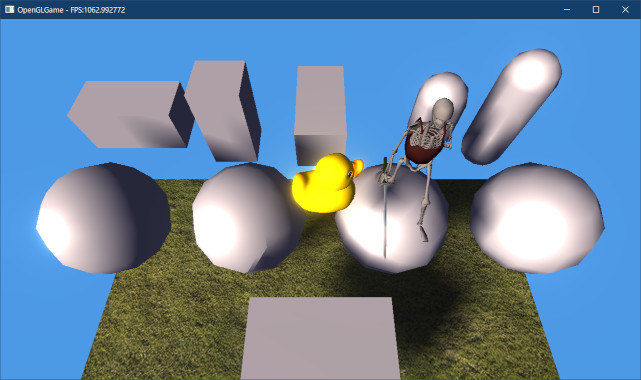
</p>

<pre class="tnmai_assignment">
<strong>【課題05】</strong>
<code>GltfAnimatedMeshRenderer</code>コンポーネントに、アニメーションの終了を検出するメンバ関数を追加しなさい。
</pre>

<pre class="tnmai_assignment">
<strong>【課題06】</strong>
課題05で追加した関数を使って、刀を振るアニメーションが終了したら、歩きアニメーションが再生されるようにプログラムを修正しなさい。
</pre>

<pre class="tnmai_assignment">
<strong>【課題07】</strong>
アニメーションモデルと衝突判定を使ったゲームを作成しなさい。ジャンルは問いません。
</pre>

>**【4章のまとめ】**
>
>* 3Dのアニメーションは再生時刻を制御することで行われる。
>* 再生を制御する個々の機能は、状態を変更するだけの単純な関数として定義できる。
>* ループ再生を行うには、総再生時間の範囲内に収まるように再生時刻を調整する。
>* glTFファイルには複数のアニメーションを記録できる。アニメーションは名前や番号で指定できる。
