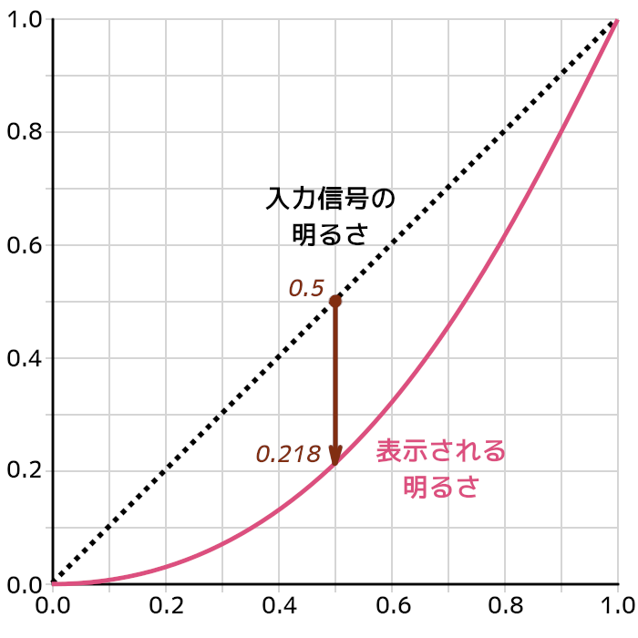
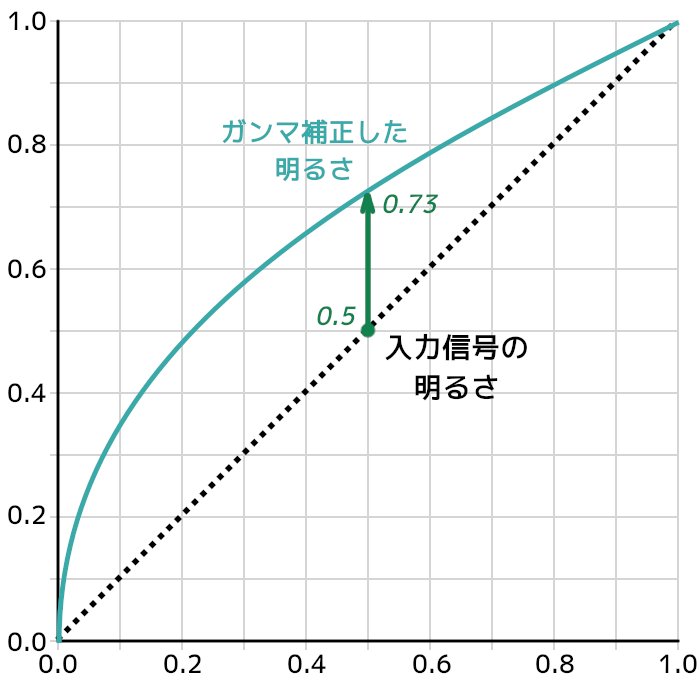
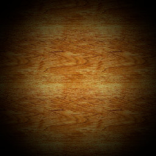
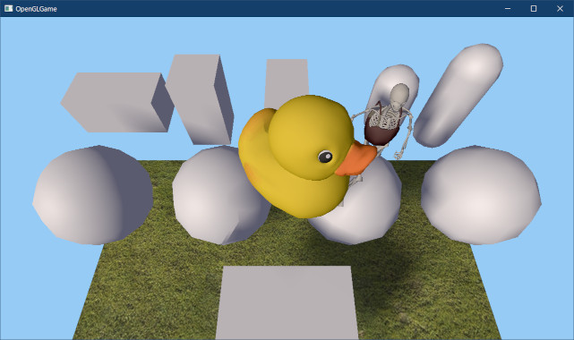
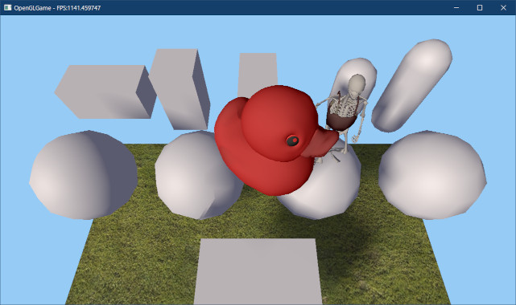
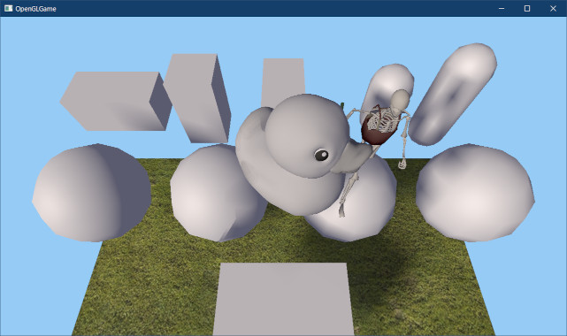

[OpenGL 3D 2023 Tips 第01回]

# ガンマ補正と圧縮テクスチャ

## 習得目標

* ガンマ補正を解除する必要性(正しいライティングを行うため)を説明できる。
* sRGB対応機能を使ってガンマ補正を制御するプログラムを作成できる。
* TGAファイルのランレングスエンコーディング(RLE)の仕組みを説明できる。
* 画像データのピクセル形式とGPU側のピクセル形式の違いを説明できる。

## 1. テクスチャをsRGBに対応させる

### 1.1 ブラウン管とガンマ補正

その昔、映像を表示する装置といえば「ブラウン管(CRT)」でした。ブラウン管は、電子を蛍光体にぶつけることで映像を映し出す装置です。ブラウン管には「発生する電子の数が、かけた電圧の2.2乗に反比例する」という特性があります。

これは、入力した明るさが、モニタにそのまま表示されるわけではないことを意味します。この特性は「ガンマ」と呼ばれます。

2023年現在、ブラウン管はほぼ液晶に取って代わられ、見かけることはほとんどありません。しかし、過去の映像作品などを正しく表示するために、液晶モニターはブラウン管と同じ「ガンマ」を持つように制御されています。

<div style="page-break-after: always"></div>

次の図は、モニタに入力される電圧の強さと、実際に画面に表示される明るさの関係を表しています。

<p align="center">

</p>

このように`0.5`の電圧をかけても、明るさは`0.218`にしかなりません。この特性により、自然に見える画像をそのまま表示すると、本来の明るさよりかなり暗く表示されます。

そこで、画像や映像を作成するときは、この特性を考慮して撮影時より明るく補正することになっています。この補正のことを「ガンマ補正」といいます。

次の図は、ガンマ補正によって明るさを引き上げた状態を表しています。

<p align="center">

</p>

ガンマ補正した明るさをブラウン管に入力することで、カーブが相殺しあって正しい明るさ(点線)で表示することができます。

### 1.2 ガンマ補正の問題点

単に画像を表示するだけの場合、ガンマを気にすることはありません。というのは、画像や映像の制作に使うモニターも同じガンマを持っているからです。

ガンマが同じモニターを使って作成されたデータの場合、ガンマ補正の存在に気づくことはありませんし、気にする必要もありません。

問題は、画像を編集したり、3Dグラフィックスのように、ライトを物理的な計算によって表現する場合です。例えば明るさ`1.0`と`0.0`の平均を計算すると、結果は`0.5`になります。

しかし、`0.5`をモニターに表示すると、ガンマによって明るさは`0.218`相当になってしまい、意図した中間の明るさにはなりません。

これはOpenGLのライトの計算にも影響します。物理的にはライトからの距離の2乗で明るさが低下します。例えば距離10mで明るさが`1.0`になるライトがあったとすると、距離14mでは約半分の`0.5`になるはずです。

しかし、`0.5`をモニターに入力すると、ガンマにより`0.218`として表示されてしまいます。このため、物理的に正しい明るさで表示することができません。

これまで気づいていなかっただけで、みなさんが作成したプログラムも、物理的に正しい明るさで表示できていなかったのです。

以下の比較画像で分かるように、これまでの描画手順では、光が暗くなるにつれて急速に明るさが失われます。それに対して、ガンマ補正を行った場合は、明るさの減衰がゆるやかになり、より自然に明るさが変化しているように見えます。

<p align="center">
 <br>
[左=ガンマ補正なし(急に暗くなる) 右=ガンマ補正あり(徐々に暗くなる)]
</p>

>アンビエントライトの明るさを設定するとき、意図したような明るさにするには、かなり明るめの値を指定しなければならなかった経験があるかと思います。それは実は、ガンマのためだったのです。

ガンマは全てのモニターに共通する特性で、無効化することはできません。しかし、正しい明るさを計算するにはガンマ補正をなんとかする必要があります。

そこで、以下の手順で正しい明るさの計算を行います。

>1. 逆ガンマ補正を行ってテクスチャを本来の明るさに戻す。
>2. シェーダで明るさの計算を行う。
>3. フレームバッファに描き込む際にガンマ補正をやりなおす。

このように、シェーダの処理前にテクスチャのガンマ補正を解除し、フレームバッファに書き込む際に再びガンマ補正を行うことで、明るさを適切に計算できます。

OpenGLでこの手順を実行するには、「シェーダで上記の手順を実行する」か、「sRGB対応フレームバッファとsRGB対応テクスチャを使う」という2種類の方法があります。

>**【sRGBって？】**<br>
>sRGBは色の表し方を決める「色空間」の定義のひとつで、液晶モニターやカメラで使用されている国際標準規格です。

後者の方法は、GPUが自動的に行なってくれるために速度面で有利なうえ、設定の手間もそれほどかかりません。そのため、sRGBに対応していない古いハードウェアを除くと、後者のsRGB対応機能を使う方法が一般的です。

本テキストでも「sRGB対応フレームバッファとsRGB対応テクスチャを使う」方法を採用します。

### 1.3 TextureクラスをsRGBに対応させる

「sRGB(エス・アールジービー)」は、国際的な色の標準規格のひとつです。2023年現在、ほとんどのデジタル映像機器がこの規格に対応しています。このsRGB規格にはガンマ補正の方法も含まれます。

OpenGLもsRGB規格に対応しており、以下の2つの機能を実装しています。

>* テクスチャのガンマ補正を解除する。
>* フレームバッファに書き込むときにガンマ補正を行う。

この2つの機能を適切に使うことで、明るさの計算を正しく行えるようになります。

テクスチャのガンマ補正を解除するには、テクスチャのGPU側のピクセル形式として以下のいすれかを指定します。

>* `GL_SRGB8`
>* `GL_SRGB8_ALPHA8`

これらのテクスチャ形式では、作成したテクスチャをシェーダーで読み込むときに、自動的にガンマ補正が解除されます。

ただし、ガンマ補正の解除を行ってはいけない画像もあるため、常にこれらの定数を使うわけにはいきません。これには以下のような画像が挙げられます。

>* 法線マップテクスチャ
>* 表面の滑らかさを表すスムースネステクスチャ
>* 金属・非金属を表すメタルネステクスチャ

このようなテクスチャに記録されている値は、従来の意味での色を表すデータではありません。そのため、ガンマ補正をかけてはいけません。

ガンマ補正された色は「ガンマ色空間(いろくうかん)」、ガンマ補正されていない色は「リニア色空間」と呼ばれます。

ガンマ色空間のテクスチャを扱うには、これまでに定義した全てのテクスチャ作成関数を、ガンマ色空間に対応させる必要があります。`Texture.h`を開き、`Texture`クラスの定義を次のように変更してください。

```diff
   // テクスチャの利用目的
   enum class Usage
   {
-    for2D, // 2D描画用
-    for3D, // 3D描画用
-    forGltf, // glTF描画用
+    for2D, // 2D描画用(ガンマ色空間)
+    for3D, // 3D描画用(ガンマ色空間)
+    for3DLinear, // 3D描画用(リニア色空間)
+    forGltf, // glTF描画用(ガンマ色空間)
+    forGltfLinear, // glTF描画用(リニア色空間)
   };
 
   // テクスチャを作成
   static TexturePtr Create(
-    const std::string& filename, GLenum filterMode = GL_NEAREST,
-    Usage usage = Usage::for2D);
+    const std::string& filename, GLenum filterMode, Usage usage);
   static TexturePtr Create(
     const char* name, GLint width, GLint height,
-    GLenum internalFormat = GL_RGBA8, GLenum filterMode = GL_NEAREST);
+    GLenum internalFormat, GLenum filterMode);
 
   // コンストラクタ、デストラクタ
   explicit Texture(const std::string& filename, GLenum filterMode = GL_NEAREST,
     Usage usage = Usage::for2D);
   Texture(const char* name, GLint width, GLint height,
-    GLenum internalFormat = GL_RGBA8, GLenum filterMode = GL_NEAREST);
+    GLenum internalFormat, GLenum filterMode);
   ~Texture();
```

`Usage`(ユーセージ)列挙型には`for3DLinear`(フォー・スリーディー・リニア)と
`forGltfLinear`(フォー・ジーエルティーエフ・リニア)いう列挙値を追加しました。

リニア色空間のテクスチャを作成する場合は、これらの列挙値を指定します。

それから、デフォルト引数を削除していることに注意してください。このプログラムのデフォルト引数は、元々は古いプログラムを変更せずに動作させるために定義したものです。

しかし、本来は暗黙の定義を使わず、すべてのプログラムで適切な引数を指定するべきです。<br>そこで、テクスチャ作成関数の総点検が必要となるこの機会に、デフォルト引数を削除することにしました。

次に関数の定義を変更します。まず`forGltfLinear`の場合にテクスチャの反転方向を逆にします。`Texture.cpp`を開き、ファイル名を引数に取る`Texture`コンストラクタの定義を次のように変更してください。

```diff
   // OpenGLは画像データを「下から上」に格納するルールになっているので、
   // TGAが「上から下」に格納されている場合は画像を上下反転する。
   bool topToBottom = header[17] & 0x20;
-  if (usage == Usage::for2D || usage == Usage::forGltf
+  if (usage == Usage::for2D ||
+    usage == Usage::forGltf ||
+    usage == Usage::forGltfLinear) {
     topToBottom = !topToBottom; // 2D画像またはglTF用の場合は反転方向を逆にする
   }
```

次に、用途によって`GL_RGBA8`と`GL_SRGB8_ALPHA8`を使い分けるようにします。テクスチャを作成するプログラムを次のように変更してください。

```diff
     }
     img.swap(tmp);
   }
+
+  // ピクセル形式を選択
+  GLenum gpuFormat = GL_SRGB8_ALPHA8;
+  if (usage == Usage::for3DLinear || usage == Usage::forGltfLinear) {
+    gpuFormat = GL_RGBA8;
+  }

   // テクスチャを作成
   glCreateTextures(GL_TEXTURE_2D, 1, &tex);
-  glTextureStorage2D(tex, 1, GL_RGBA8, width, height);
+  glTextureStorage2D(tex, 1, gpuFormat, width, height);
   glTextureSubImage2D(tex, 0, 0, 0, width, height,
     GL_BGRA, GL_UNSIGNED_BYTE, img.data());
```

<div style="page-break-after: always"></div>

>**【名前がSRGBA8ではない理由】**<br>
>それは、ガンマ色空間なのはRGB成分だけで、アルファ成分は線形(リニア)の値だからです。つまり、RGBとアルファで性質が異なることを示すためです。<br>
>以下のURLの`Issues 3`に説明があります。<br>
>`https://registry.khronos.org/OpenGL/extensions/EXT/EXT_texture_sRGB.txt`

### 1.4 MeshBufferクラスをsRGBに対応させる

続いて、`MeshBuffer`クラスをsRGBに対応させます。といっても、変更点は2箇所だけです。

ひとつめは`LoadMTL`関数内の法線テクスチャを読み込むところです。前述したように法線テクスチャはリニア色空間で定義されるため、`for3DLinear`を指定する必要があります。

`Mesh.cpp`を開き、`LoadMTL`関数の定義にある、法線テクスチャを読み込むプログラムを次のように変更してください。

```diff
     if (textureName[0] != 0) {
       pMaterial->texNormal =
         Texture::Create(foldername + textureName, GL_LINEAR,
-          Texture::Usage::for3D);
+          Texture::Usage::for3DLinear);
       continue;
     }
   }
```

もうひとつの変更箇所は、デフォルトマテリアルを作成するプログラムにあります。
`MeshBuffer`コンストラクタの定義を次のように変更してください。

```diff
   // マテリアル未設定時に使用するマテリアルを作成
   defaultMaterial = std::make_shared<Material>();
-  defaultMaterial->texBaseColor = Texture::Create("defaultTexture", 4, 4);
+  defaultMaterial->texBaseColor = Texture::Create("defaultTexture", 4, 4,
+    GL_SRGB8_ALPHA8, GL_LINEAR);
   std::vector<uint32_t> img(4 * 4, 0xff'c0'c0'c0);
   glTextureSubImage2D(*defaultMaterial->texBaseColor, 0, 0, 0,
```

sRGBに対応するため、`texBaseColor`に設定するテクスチャを`GL_SRGB8_ALPHA8`形式で作成するように変更しています。

### 1.5 EngineクラスをsRGBに対応させる

`Engine`クラスのsRGB対応では、主にフレームバッファオブジェクトの設定を行います(もちろん`Texture::Create`の引数も変更します)。

早速、テクスチャをsRGBに対応させましょう。`AddUILayer`メンバ関数の定義を次のように変更してください。

```diff
 */
 size_t Engine::AddUILayer(const char* image, GLenum filterMode, size_t reserve)
 {
-  const TexturePtr tex = Texture::Create(image, filterMode);
+  const TexturePtr tex = Texture::Create(image, filterMode, Texture::Usage::for2D);
   uiLayerList.push_back({ tex });
   uiLayerList.back().gameObjectList.reserve(reserve);
```

`Engine`クラスのテクスチャ作成の変更点はこの一箇所だけです。

次に、デフォルトフレームバッファをsRGBに対応させます。`glfwWindowHint`関数を使って、ウィンドウ作成時にsRGBを有効にします。`Initialize`メンバ関数に次のプログラムを追加してください。

```diff
   glfwWindowHint(GLFW_CONTEXT_VERSION_MAJOR, 4);
   glfwWindowHint(GLFW_CONTEXT_VERSION_MINOR, 5);
   glfwWindowHint(GLFW_OPENGL_DEBUG_CONTEXT, GLFW_TRUE);
+
+  // フレームバッファをsRGB対応にする
+  glfwWindowHint(GLFW_SRGB_CAPABLE, GLFW_TRUE);

   window = glfwCreateWindow(1280, 720, title.c_str(), nullptr, nullptr);
   if (!window) {
```

sRGB対応のフレームバッファを作成するには`GLFW_SRGB_CAPABLE`(ジーエルエフダブリュー・エスアールジービー・キャパブル)ヒントを`GLFW_TRUE`に設定します。

`GLFW_SRGB_CAPABLE`ヒントを有効にすると、、ハードウェア、OS、ドライバがsRGBに対応していれば、sRGBに対応したデフォルトフレームバッファが作成されます。

>**【sRGBは常に使えると考えて大丈夫？】**<br>
>2023年現在、sRGBを有効にできないPC環境はほぼ存在しません(最初にOpenGLのsRGB対応が提案されたのは2006年のことです)。そのため、「PCに限れば、sRGBに対応していることをチェックする必要はない」と考えてよいでしょう。
>スマホなどでも状況は同じですが、少し古い廉価版のスマホではsRGBに対応していないことがあります。

続いて、フレームバッファのガンマ補正を制御するプログラムを追加します。ガンマ補正を制御する機能には`GL_FRAMEBUFFER_SRGB`(ジーエル・フレームバッファ・エスアールジービー)というマクロ名が付けられています。

有効、無効の切り替えには`glEnable`, `glDisable`関数を使います。

よく考える必要があるのは、ガンマ補正を「有効にするタイミング」と「無効にするタイミング」です。これは以下のルールに従います。

>* sRGBに対応したフレームバッファに書き込むときは有効にする
>* それ以外は無効にする

本テキストで作成してきたプログラムの場合、sRGBに対応しているのはデフォルトフレームバッファだけです。そのため、最初はガンマ補正を無効にしておき、デフォルトフレームバッファに書き込むタイミングで有効にすればOKです。

まず、ガンマ補正を無効化するプログラムを追加しましょう。`MainLoop`メンバ関数にある、描画先をゲームウィンドウに変更するプログラムに、次のプログラムを追加してください。

```diff
     // 描画先をゲームウィンドウに変更
     glBindFramebuffer(GL_FRAMEBUFFER, *fboGameWindow);
+    glDisable(GL_FRAMEBUFFER_SRGB); // ガンマ補正を無効にする
     const vec2 viewSize = GetViewSize();
     glViewport(0, 0,
```

次に、ガンマ補正を有効化するプログラムを追加します。描画先をデフォルトフレームバッファに戻すプログラムに、次のプログラムを追加してください。

```diff
     // デフォルトフレームバッファに戻す
     glBindFramebuffer(GL_FRAMEBUFFER, 0);
+    glEnable(GL_FRAMEBUFFER_SRGB); // ガンマ補正を有効にする
     glViewport(0, 0, 1280, 720);
     glEnable(GL_BLEND);
```

これで、`Engine`クラスをsRGBに対応させることができました。

### 1.6 ParticleEmitterクラスをsRGBに対応させる

続いて`ParticleEmitter`クラスをsRGBに対応させます。やることはテクスチャ作成方法の変更だけです。`Particle.cpp`を開き、`ParticleEmitter`コンストラクタの定義を次のように変更してください。

```diff
   const ParticleParameter& pp, ParticleManager* pManager) :
   ep(ep), pp(pp), pManager(pManager), interval(1.0f / ep.emissionsPerSecond)
 {
-  texture = Texture::Create(ep.imagePath.c_str(), GL_LINEAR);
+  texture = Texture::Create(ep.imagePath.c_str(), GL_LINEAR,
+    Texture::Usage::for2D);
 }
```

`ParticleEmitter`クラスの変更点はこれだけです。

### 1.7 GltfFileBufferクラスをsRGBに対応させる

最後に、`GltfFileBuffer`クラスをsRGBに対応させます。このクラスも、やることはテクスチャの作成方法の変更だけです。

`GltfMesh.cpp`を開き、`LoadTexture`関数の定義を次のように変更してください。

```diff
   filename += ".tga";
 
   // テクスチャを読み込む
+  Texture::Usage usage = Texture::Usage::forGltfLinear;
+  if (objectName == "baseColorTexture") {
+    usage = Texture::Usage::forGltf;
+  }
-  return Texture::Create(filename.string(), GL_LINEAR, Texture::Usage::forGltf);
+  return Texture::Create(filename.string(), GL_LINEAR, usage);
 }
 
 /**
```

glTFの仕様`https://registry.khronos.org/glTF/specs/2.0/glTF-2.0.html`によると、sRGBなのは`baseColorTexture`に限られるようです。

そこで、オブジェクト名が`baseColorTexture`の場合のみ`forGltf`を指定し、それ以外は
`forGltfLinear`を指定するようにしています。

次に`GltfFileBuffer`コンストラクタの定義にある、デフォルトマテリアルを作成するプログラムを次のように変更してください。

```diff
   // デフォルトマテリアルを作成
   defaultMaterial = std::make_shared<GltfMaterial>();
   defaultMaterial->name = "<default>";
-  defaultMaterial->texBaseColor = Texture::Create("defaultTexture", 4, 4);
+  defaultMaterial->texBaseColor = Texture::Create("defaultTexture", 4, 4,
+    GL_SRGB8_ALPHA8, GL_LINEAR);
   static const uint32_t img[4 * 4] = {
     0xffff'ffff, 0xffff'ffff, 0xffff'ffff, 0xffff'ffff, 
```

これで、全てのクラスのsRGB対応が完了しました。

プログラムが書けたらビルドして実行してください。sRGB対応前よりも画面が明るくなり、全体的に柔らかな雰囲気になっていたら成功です。

<p align="center">

</p>

>**【1章のまとめ】**
>
>* 液晶モニタなどの表示装置は、入力データを「ガンマ補正」して画面に表示している。
>* 「ガンマ補正」されたモニタを見ながら作られた画像データは「ガンマ補正」の影響を受けるため、明るさの変化が曲線になっている。
>* 物理的に正しいライティングを行うには、明るさの変化が直線的なるように、画像のガンマ補正を解除する必要がある。
>* OpenGLで物理的に正しいライティングを行うには、sRGBに対応したフレームバッファと、sRGBに対応したテクスチャを使う。

<div style="page-break-after: always"></div>

## 2. 対応するTGAの形式を増やす

### 2.1 ランレングス・エンコーディング

現在のプログラムで扱えるTGAファイルは「32bitカラーで無圧縮(むあっしゅく)」形式のものだけです。しかし、TGAファイルには他にも様々な形式でデータを記録できます。

特に便利なのは「圧縮形式」です。圧縮形式に対応できると、アプリの容量が削減できるうえにロード時間まで短かくなります。良いことずくめです。これはもう、圧縮形式を読み込めるようにするしかありませんね。

さて、TGAの圧縮形式には「ランレングス・エンコーディング(Run Length Encoding, RLE)」が採用されています。ランレングスエンコーディングは、データ中にある連続する同じ値を「連続する個数+値」で置き換える方法です。

TGAのランレングス・エンコーディング(長いので以降は略称のRLEを使います)では、画像データを「ヘッダ」と「データ」の組として表します。この組のことを`packet`(パケット)といいます。

ヘッダは1バイトで、最上位の1ビットが「パケットID」、残りの7ビットが「データ数」となっています。つまり、ヘッダは次のようになっています。

| **bit** |  7 | 6 5 4 3 2 1 |
|:---:|:--:|:-:|
| **機能** | ID | データ数 |

パケットIDが`0`の場合は「無圧縮パケット」です。無圧縮パケットでは、ヘッダの直後に「データ数 + 1」個のピクセルデータが続きます。データを展開するときはこのデータをそのまま使います。

<table><tr><td>ヘッダ</td><td>ピクセル0</td><td>ピクセル1 </td><td>ピクセル2</td><td>...</td></tr></table>

パケットIDが、`1`なら「圧縮パケット」になります。圧縮パケットでは、ヘッダの直後に1ピクセル分のデータだけが続きます。データを展開するときはこの1ピクセルを「データ数 + 1」個複製します。

<table><tr><td>ヘッダ</td><td>ピクセル</td></tr></table>

説明はこれくらいにして、あとは実際にプログラムを書いて理解してもらいましょう。まず、画像が圧縮されているかどうかを判定しなくてはなりません。

これは、TGAヘッダの2バイト目を見ることで調べられます。`Texture.cpp`を開き、
`Texture`コンストラクタの定義にある「ヘッダ情報を読み込む」プログラムの下に、次のプログラムを追加してください。

```diff
   const size_t tgaHeaderSize = 18; // ヘッダ情報のバイト数
   uint8_t header[tgaHeaderSize];
   file.read(reinterpret_cast<char*>(header), tgaHeaderSize);
+
+  // 画像の種類を取り出す
+  // 0: 画像なし
+  // 1: インデックス(無圧縮)
+  // 2: トゥルーカラー(無圧縮)
+  // 3: 白黒(無圧縮)
+  // 9: インデックス(RLE) 
+  // 10: トゥルーカラー(RLE)
+  // 11: 白黒(RLE)
+  const int imageType = header[2];

   // ヘッダ情報から画像のサイズを取り出す
   const int width = header[12] + header[13] * 0x100;
```

次に「1ピクセルのビット数」を取り出します。ここで取得した情報は、圧縮データを展開する際に必要になります。

```diff
   // ヘッダ情報から画像のサイズを取り出す
   const int width = header[12] + header[13] * 0x100;
   const int height = header[14] + header[15] * 0x100;
+
+  // 1ピクセルのビット数を取り出す
+  const int pixelDepth = header[16];
+  const int pixelBytes = pixelDepth / 8; // 1ピクセルのバイト数

   // 画像情報を読み込む
   std::vector<char> img(
```

それでは、圧縮データの判定を行いましょう。画像情報を読み込むプログラムの下に、次のプログラムを追加してください。

```diff
   std::vector<char> img(
     std::filesystem::file_size(filename) - tgaHeaderSize);
   file.read(img.data(), img.size());
+
+  // 圧縮されている場合は展開する
+  if (imageType & 0x08) {
+    // データ展開先となるバッファを作成
+    std::vector<char> tmp(width * height * pixelBytes);
+    char* dest = tmp.data(); // 展開先のアドレス
+    const char* const end = dest + tmp.size(); // 終端アドレス
+
+    // バッファが埋まるまでループ
+    const char* packet = img.data(); // パケットのアドレス
+    while (dest < end) {
+    }
+
+    // 展開先バッファと画像データバッファを入れ替える
+    img.swap(tmp);
+  }

   // TGAヘッダ18バイト目の第5ビットは、画像データの格納方向を表す。
   //   0の場合: 下から上
```

「画像の種類」の第3ビットが`1`の場合、画像データは圧縮されています。GPUはTGAの圧縮データを扱えないため、GPUメモリにコピーする前にデータを展開しておく必要があります。

まずデータの展開先となるバッファを用意します。バッファのサイズは「画像の幅x画像の高さx1ピクセルのバイト数」で求められます。

TGAは古いデータ形式なので、総バイト数のようなデータの終端を示す情報を持ちません。そこで、「バッファがデータで埋まったら展開完了」と判断しています。

データ展開が終わったら、`swap`メンバ関数を使って、本来の画像データを指す`img`変数と、展開された画像データを指す`tmp`変数の内容を交換します。`vector`クラス同士の交換は、ポインタを入れ替えるだけなので非常に高速に行われます。

次に、パケットの種類によって処理を分けるプログラムを追加します。バッファが埋まるまでループさせるプログラムに、次のプログラムを追加してください。

```diff
     // バッファが埋まるまでループ
     const char* packet = img.data(); // パケットのアドレス
     while (dest < end) {
+      // パケットのヘッダ部からidとデータ数を取り出す
+      const int id = *packet & 0x80;
+      const int count = (*packet & 0x7f) + 1;
+      ++packet; // データ部へ移動
+
+      // IDによって分岐
+      if (id) {
+        // 圧縮パケット
+      } else {
+        // 無圧縮パケット
+      }
     }

     // 展開先バッファと画像データバッファを入れ替える
```

このプログラムは、パケットのヘッダ部にあるIDとデータ数を取り出し、IDによって処理を分岐させます。

次に、圧縮パケットを展開するプログラムを追加します。<ruby>前述<rt>ぜんじゅつ</rt></ruby>したように、圧縮パケットは1ピクセル分のデータしか持ちません。

この1ピクセルのデータを、ヘッダ部に記録された「データ数」の数だけ複製することでデータを展開します。ピクセルのバイト数は不定なため、「ピクセルをコピーするループ(1)」と「(1)をデータ数だけ実行するループ」の2重ループを使います。

「圧縮パケット」というコメントの下に、次のプログラムを追加してください。

```diff
       // IDによって分岐
       if (id) {
         // 圧縮パケット
+        // ひとつのピクセルデータをcount個複製する
+        for (int i = 0; i < count; ++i) {
+          for (int j = 0; j < pixelBytes; ++j) {
+            *dest = packet[j];
+            ++dest;
+          }
+        }
+        packet += pixelBytes;
       } else {
         // 無圧縮パケット
```

最後に、無圧縮パケットを展開します。これは簡単で、パケットのピクセルデータを展開先にコピーするだけです。「無圧縮パケット」というコメントの下に、次のプログラムを追加してください。

```diff
         packet += pixelBytes;
       } else {
         // 無圧縮パケット
+        // count個のピクセルデータをそのままコピーする
+        const int rawDataBytes = count * pixelBytes;
+        dest = std::copy(packet, packet + rawDataBytes, dest);
+        packet += rawDataBytes;
       }
     }
```

上記プログラムでは`copy`関数でデータをコピーしています。`memcpy`など他のコピー方法をでもいいのですが、C++らしさを考慮するなら、標準ライブラリの`copy`関数(または類似の
`copy_n`関数)が第一候補です。

さて、「プログラムが書けたらビルドして実行してください」と言いたいところですが、圧縮データを展開するプログラムを試すには圧縮されたTGAファイルが必要です。

残念なことに、Visual Studioには圧縮形式のTGAを作成する機能がありません。PhotoShopやGIMP、Paint.netなどは圧縮形式に対応しているので、それらのソフトで圧縮TGAファイルを作成して動作試験を行ってください。

### 2.2 32ビット以外のカラーに対応する

これまで扱ってきたTGAファイルは、32ビットの画像データだけでした。しかし、TGA形式自体は、8, 16, 24ビットの画像データも扱えるように作られています。

これらの形式にも対応しておくと、画像の性質と利用目的に応じて適切な形式を選べるようになります(あまり使う機会はないかもしれませんが)。

さまざまな形式の画像データをGPUメモリにコピーするには、`glTextureSubImage2D`関数の
`format`引数と`type`引数に対して、データ形式ごとに異なる値を指定します。

また、一部の画像データ形式はアルファ値を持ちません。アルファ値を持たない場合、GPU側のデータ形式には`GL_SRGB8_ALPHA8`ではなく`GL_SRGB8`を使うのが適切です。

それでは、ピクセルのビット数によって引数を変更できるようにしましょう。画像の上下を反転させるプログラムの下に、次のプログラムを追加してください。

```diff
       source += lineSize;
     }
     img.swap(tmp);
   }
+
+  // 「1ピクセルのビット数」からピクセル形式とデータタイプを選択
+  struct FormatData {
+    GLenum imageFormat; // 画像データのピクセル形式
+    GLenum imageType;   // 画像データの型
+    GLenum gpuFormat;   // GPU側のピクセル形式
+  };
+  constexpr FormatData formatList[] = {
+    { GL_RED,  GL_UNSIGNED_BYTE,              GL_SRGB8 },
+    { GL_BGRA, GL_UNSIGNED_SHORT_1_5_5_5_REV, GL_SRGB8_ALPHA8 },
+    { GL_BGR,  GL_UNSIGNED_BYTE,              GL_SRGB8 },
+    { GL_BGRA, GL_UNSIGNED_BYTE,              GL_SRGB8_ALPHA8 },
+  };
+  FormatData format = formatList[pixelBytes - 1];

   // ピクセル形式を選択
   GLenum gpuFormat = GL_SRGB8_ALPHA8;
```

TGAで実際に利用されているビット数は8, 16, 24, 32だけなので、バイト数に変換することで配列の添字として利用できます。

ひとつの数値によって複数のパラメータが変化する場合、変化するパラメータを配列にまとめると便利です。配列は`if`や`switch`よりもパラメータの管理がしやすく(データの増減が簡単にできる等)、プログラムも短くなるからです。

また、上記のプログラムでは`FormatData`(フォーマット・データ)構造体を定義し、パラメータをまとめて管理できるようにしています。このように、一緒に使うことが多いパラメータを構造体にまとめると、パラメータを管理しやすくなります。

次に、`format`(フォーマット)変数の値を引数に渡すように、テクスチャ作成プログラムを書き換えます。

```diff
   FormatData format = formatList[pixelBytes - 1];

   // ピクセル形式を選択
-  GLenum gpuFormat = GL_SRGB8_ALPHA8;
   if (usage == Usage::for3DLinear || usage == Usage::forGltfLinear) {
-    gpuFormat = GL_RGBA8;
+    format.gpuFormat = GL_RGBA8;
   }

   // テクスチャを作成
   glCreateTextures(GL_TEXTURE_2D, 1, &tex);
-  glTextureStorage2D(tex, 1, gpuFormat, width, height);
+  glTextureStorage2D(tex, 1, format.gpuFormat, width, height);
+
+  // GPUメモリにデータをコピー
   glTextureSubImage2D(tex, 0, 0, 0, width, height,
-    GL_BGRA, GL_UNSIGNED_BYTE, img.data());
+    format.imageFormat, format.imageType, img.data());

   // 拡大縮小フィルタを設定
   glTextureParameteri(tex, GL_TEXTURE_MAG_FILTER, filterMode);
```

これで、32ビット以外の画像形式を読み込めるようになりました。しかし、まだひとつだけ問題が残っています。次の課題を行うことでどんな問題があるかが分かるでしょう。

<div style="page-break-after: always"></div>

<pre class="tnmai_assignment">
<strong>【課題01】</strong>
適当な3Dモデルの画像のバックアップを取りなさい。
次に、Visual Studioで元の画像ファイルを開き、画像のプロパティにある「形式」を<code>16bpp BGRA5551`</code>に変更しなさい。
さらに、画像の横の長さを「奇数」に変更しなさい(例えば横が1024なら1023や1025にする)。変更したらファイルを保存しなさい。
ファイルを保存したらプログラムを実行し、形式を変更したテクスチャが3Dモデルに貼られていることを確認しなさい(表示がおかしくなっていると思います)。
</pre>

### 2.3 アラインメント

<p align="center">

</p>

表示が崩れる原因は、OpenGLが画像データを読み取るときに「あるルール」を使っているためです。そのルールとは「データを4バイト単位で読み取る」というものです。この読み取り単位のことを「アラインメント(Alignment, 整列)」といいます。

人間が数字や文章を書き写すとき、1文字ずつ細切れに行うより、一度に読めるだけ読んで、それをまとめて書くほうが効率的ですよね。例えば、電話番号の数字をひとつずつ書き写すより、3つか4つの数字をまとめて書き写すほうがはやく終わります。

コンピュータも突き詰めれば物理的な存在です。そのため、人間と同様に、メモリの読み書き速度を上げるために、連続したデータを一度に読み書きするという設計になっています。

この読み書きの単位が「アラインメント」というわけです。2023年現在、ほとんどのコンピューターの「アラインメント」は4バイトになっています。

ところで、一般的な画像データは「横一列のピクセルを記録したら次の列のピクセルを記録する」というようになっています。

32ビット形式の画像データの場合、1ピクセルは4バイトなので、横一列のデータ数は常にアラインメントで割り切れます。そのため、アラインメント単位でコピーを行ってもデータがずれることはありません。

ところが16ビット形式では、横幅が奇数のときにアラインメントで割り切れない長さになってしまいます。この場合、コンピューターは次の行の先頭2バイトを読み込むことで、無理やり不足分を<ruby>補<rt>おぎな</rt></ruby>います。

その結果、次の行のデータが1ピクセル短くなってしまいます。この不足を補うために、コンピュータはさらに次の行から4バイトを追加で読み込みます。これが繰り返されることで、1列ごとに1ピクセルずつずれていってしまうわけです。

この問題の対策方法は2つあります。

>1. 横一列のピクセル数が4で割り切れない画像を使わない。
>2. アラインメントを変更する。

実際の開発では、たいてい1の方法を取ります。アラインメントを変更すると、GPUメモリへのコピー速度が低下するためです。また、横幅が奇数サイズの画像は、わずかですがGPUメモリを余分に必要とします。

しかし、今回は2のアラインメントを変更する方法を使います。インターネットからダウンロードできる3Dモデルを使おうとする限り、テクスチャ画像の横幅が4の倍数であることは保証できないからです。

さて、画像をコピーするときのアラインメントを変更するには`glPixelStorei`(ジーエル・ピクセル・ストア・アイ)関数を使います。

<p><code class="tnmai_code"><strong>【書式】</strong><br>
void glPixelStorei(設定するパラメータ名, 設定する値);
</code></p>

この関数は「テクスチャ用メモリ領域の動作モード」を変更します。設定可能な動作モードは複数あり、「設定するパラメータ名」によって指定します。

「GPUメモリにコピーするときのアラインメント」のパラメータ名は`GL_UNPACK_ALIGNMENT`
(ジーエル・アンパック・アラインメント)です。また、アラインメントとして設定できる値は
1, 2, 4, 8だけで、それ以外の数値を設定しようとしても無視されます。

>設定可能なパラメータ名については、以下のURLを参照してください。<br>
>`https://registry.khronos.org/OpenGL-Refpages/gl4/html/glPixelStore.xhtml`

それから、コピーが終わったらアラインメントを元に戻さなくてはなりません。元に戻さないと、プログラムの別の場所でGPUメモリにデータを転送しようとしたとき、コピー速度が遅くなってしまう可能性があるからです。

後から「なんかプログラムの実行速度が遅い気がするなあ」と感じたとしても、実はその原因が「`Texture`コンストラクタでアラインメントを戻し忘れたから」だなんて、なかなか気づきませんよね。

さて、アラインメントを元に戻すためには、変更前のアラインメントを覚えておく必要があります。現在のアラインメントを取得するには`glGetIntergerv`(ジーエル・ゲット・インテジャー・ブイ)関数を使います。

<p><code class="tnmai_code"><strong>【書式】</strong><br>
void glGetintegerv(取得するパラメータ名, 値を格納する変数のアドレス);
</code></p>

それでは、GPUメモリにデータをコピーするプログラムの前後に、次のプログラムを追加してください。

```diff
   // テクスチャを作成
   glCreateTextures(GL_TEXTURE_2D, 1, &tex);
   glTextureStorage2D(tex, 1, format.gpuFormat, width, height);
+
+  // 現在のアラインメントを記録してからアラインメントを変更
+  GLint alignment;
+  glGetIntegerv(GL_UNPACK_ALIGNMENT, &alignment);
+  if (alignment != pixelBytes) {
+    glPixelStorei(GL_UNPACK_ALIGNMENT, 1);
+  }
 
   // GPUメモリにデータをコピー
   glTextureSubImage2D(tex, 0, 0, 0, width, height,
     format.imageFormat, format.imageType, img.data());
+
+  // アラインメントを元に戻す
+  if (alignment != pixelBytes) {
+    glPixelStorei(GL_UNPACK_ALIGNMENT, alignment);
+  }

   // 拡大縮小フィルタを設定
   glTextureParameteri(tex, GL_TEXTURE_MAG_FILTER, filterMode);
```

また、このプログラムでは、アラインメントを変更不要な場合はなにもしないようにしています。常に変更するようにプログラムすると、32ビット形式のときにコピーが遅くなってしまうからです。

プログラムが書けたらビルドして実行してください。課題01で変更したテクスチャが正しく表示されていたら成功です。

<p align="center">

</p>

### 2.4 白黒画像の扱いかた

早速ですが、次の課題を行って画像ファイルを白黒に変換してください。

<pre class="tnmai_assignment">
<strong>【課題02】</strong>
課題01で変更した画像ファイルをVisual Studioで開き、画像のプロパティにある「形式」を<code>8bpp Gray`</code>に変更しなさい。変更したらファイルを保存しなさい。
ファイルを保存したらプログラムを実行し、形式を変更したテクスチャが3Dモデルに貼られていることを確認しなさい(赤くなっていると思います)。
</pre>

<p align="center">

</p>

白黒に変換したはずなのに、実際には赤色で表示されたと思います。原因は以下の2つです。

>1. OpenGLにおいて、単色を表すピクセル形式は`GL_RED`である。つまり緑、青、アルファのデータがない。
>2. 設定されていない要素をシェーダで読み取ると(0, 0, 0, 1)が返される。`GL_RED`の場合、緑と青は0、アルファは1になる。

このような仕様になっているため、ピクセル形式に`GL_RED`を指定した場合は赤要素にしかデータが反映されません。しかし、白黒画像として扱うには、緑と青にも赤要素と同じ値を反映する必要があります。

こんなときに便利なのが「スウィズル(Swizzle、かきまぜる)」という機能です。この機能を使うと、シェーダでテクスチャを読み取る時の、データの順序を入れ替えることができます。

スウィズルを設定するには、拡大縮小フィルタの設定で使っている`glTextureParameteri`
(ジーエル・テクスチャ・パラメータ・アイ)関数を使います。アラインメントを元に戻すプログラムの下に、次のプログラムを追加してください。

```diff
   if (alignment != pixelBytes) {
     glPixelStorei(GL_UNPACK_ALIGNMENT, alignment);
   }
+
+  // 白黒画像の場合、(R,R,R,1)として読み取られるように設定
+  if (format.imageFormat == GL_RED) {
+    glTextureParameteri(tex, GL_TEXTURE_SWIZZLE_G, GL_RED);
+    glTextureParameteri(tex, GL_TEXTURE_SWIZZLE_B, GL_RED);
+  }

   // 拡大縮小フィルタを設定
   glTextureParameteri(tex, GL_TEXTURE_MAG_FILTER, filterMode);
```

`glTextureParameteri`関数で設定できるパラメータは多岐にわたりますが、今回は以下の2つを設定しています。

| パラメータ名 | 機能 |
|:------------:|:----|
| <ruby>GL_TEXTURE_SWIZZLE_G<rt>ジーエル・テクスチャ・スウィズル・ジー</rt></ruby> | シェーダに送られる前に緑要素に適用されるスウィズル。<br>ここで指定した要素が緑要素に渡されます。 |
| <ruby>GL_TEXTURE_SWIZZLE_B<rt>ジーエル・テクスチャ・スウィズル・ビー</rt></ruby> | シェーダに送られる前に青要素に適用されるスウィズル。<br>ここで指定した要素が青要素に渡されます。 |

今回は使いませんが、赤とアルファのスウィズルを設定することも可能です。

>`glTextureParameteri`関数で設定可能なパラメータについては、以下のURLを参照してください。<br>
>`https://registry.khronos.org/OpenGL-Refpages/gl4/html/glTexParameter.xhtml`

プログラムが書けたらビルドして実行してください。3Dモデルが白黒で表示されていたら成功です。

<p align="center">

</p>

<pre class="tnmai_assignment">
<strong>【課題03】</strong>
課題01, 課題02で変更した画像ファイルを、元(課題01で変更する前)の状態に戻しなさい。
</pre>

### 2.5 より効率的なGPU側のピクセル形式を選ぶ

ガンマ色空間を使う場合、指定できるピクセル形式は`GL_SRGB8`と`GL_SRGB8_ALPHA8`の2つだけです。対して、リニア色空間の場合はOpenGLで利用できる多様なピクセル形式から選ぶことができます。

これは、「より効率的なピクセル形式を選べる」ということです。例えば画像データのピクセル形式が`GL_RED`の場合、ガンマ色空間では`GL_SRGB8`しか選べません。

そのため、元データはわずか8ビットなのに、GPUメモリは24ビット必要になってしまいます。これは、GPUのガンマ補正機能がRGBが揃っているデータにしか対応していないためです。

しかし、リニア色空間の場合は`GL_R8`(ジーエル・アール・はち)という8ビットのピクセル形式を選ぶことができます。`GL_R8`を使えば、`GL_SRGB8`のような無駄は発生しません。

これによって、GPUメモリにより多くのデータを入れられるようになり、さらに扱うデータ量が減ることで描画速度も向上します。

それでは、使用目的によってピクセル形式を選択するプログラムを、次のように変更してください。

```diff
   struct FormatData {
     GLenum imageFormat; // 画像データのピクセル形式
     GLenum imageType;   // 画像データの型
     GLenum gpuFormat;   // GPU側のピクセル形式
+    GLenum gpuFormatLinear; // GPU側のピクセル形式(リニア色空間)
   };
   constexpr FormatData formatList[] = {
-    { GL_RED,  GL_UNSIGNED_BYTE,              GL_SRGB8 },
-    { GL_BGRA, GL_UNSIGNED_SHORT_1_5_5_5_REV, GL_SRGB8_ALPHA8 },
-    { GL_BGR,  GL_UNSIGNED_BYTE,              GL_SRGB8 },
-    { GL_BGRA, GL_UNSIGNED_BYTE,              GL_SRGB8_ALPHA8 },
+    { GL_RED,  GL_UNSIGNED_BYTE,              GL_SRGB8,        GL_R8 },
+    { GL_BGRA, GL_UNSIGNED_SHORT_1_5_5_5_REV, GL_SRGB8_ALPHA8, GL_RGB5_A1 },
+    { GL_BGR,  GL_UNSIGNED_BYTE,              GL_SRGB8,        GL_RGB8 },
+    { GL_BGRA, GL_UNSIGNED_BYTE,              GL_SRGB8_ALPHA8, GL_RGBA8 },
   };
   FormatData format = formatList[pixelBytes - 1];
 
-  // ピクセル形式を選択
+  // リニア色空間が指定された場合、専用のGPUピクセル形式を選択
   if (usage == Usage::for3DLinear || usage == Usage::forGltfLinear) {
-    format.gpuFormat = GL_RGBA8;
+    format.gpuFormat = format.gpuFormatLinear;
   }
 
   // テクスチャを作成
```

プログラムが書けたらビルドして実行してください。といっても、見た目に違いが見えるわけではないため、修正前と同じ画像が表示できていれば、とりあえずは成功と考えてよいでしょう。

<p align="center">

</p>

>**【2章のまとめ】**
>
>* TGAファイルには、ランレングスエンコーディング(RLE)で圧縮されたデータを記録できる。
>* 圧縮形式を使うと、アプリのサイズが小さくなる、ロード時間が短くなるなどの利点がある。
>* 32ビット以外のカラーに対応するには、画像データのピクセル形式とデータ型、それからGPU側のピクセル形式を正しく設定しなくてはならない。
>* 白黒画像は実際には赤成分として扱われる。白黒画像にするにはスウィズル機能を使う。
