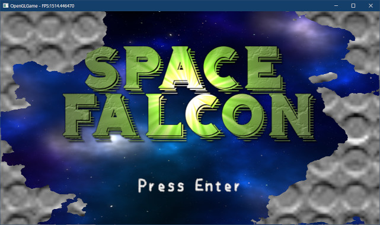
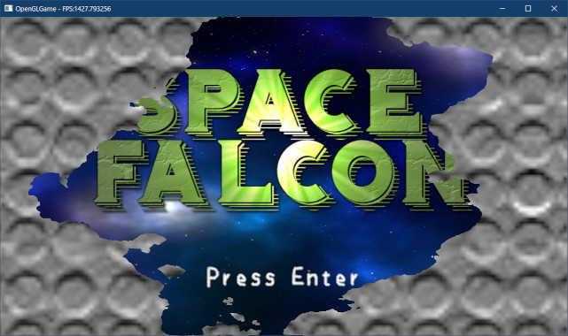
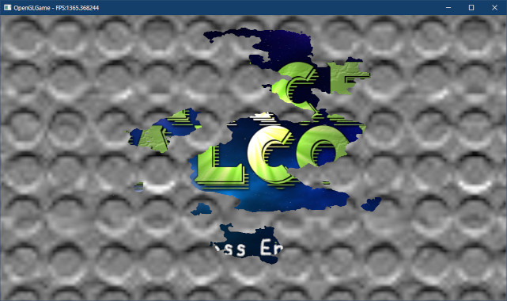

[OpenGL 3D 2023 Tips 第03回]

# シーン遷移エフェクト

## 習得目標

* テクスチャを数値の集合として考えることができる。
* `discard`文の機能を説明できる。
* 「しきい値」の使われ方を説明できる。

## 1. シーン遷移エフェクト

### 1.1 シーン遷移とルール画像

<p align="center">


<br>
[複雑な模様のフェードアウト]
</p>

シーンを切り替えることを「シーン遷移(せんい)」といいますが、多くのゲームではシーン遷移のときに「何らかの全画面エフェクト」を差し込みます。

エフェクトを入れることで、シーンが切り替わったことがユーザーに明確に伝わります。また、ゲームの雰囲気にあったエフェクトを使うことで、ゲーム体験の質を高めることができます。

2023年現在、シーン遷移エフェクトはゲームごとに全く異なっており、またひとつのゲームの中で複数のエフェクトを使い分けることも多いです。そこで、シーン遷移エフェクトを追加して、より品質の高いシーン遷移を行えるようにしましょう。

さて、本テキストでは、「ルール画像とシェーダによるシーン遷移エフェクト」を作成します。「ルール画像」は一般的に白黒画像です。明るさを表す0～255の数値は「ピクセルを隠す順番」として扱われます。

シェーダには「現在の隠す順番」を表すuniform変数を定義します。時間経過によってこのuniform変数の値を更新することで、画面を隠す範囲を制御します。

テクスチャとシェーダを組み合わせることで、「ルール画像の黒い部分から白い部分へと徐々に画面が表示される」というエフェクトを実現します。

### 1.2 シーン遷移シェーダを作成する

まずシーン遷移を行うシェーダを作成しましょう。画面全体を対象とするので、頂点シェーダには`simple_2D.vert`を流用し、フラグメントシェーダだけ作成することにします。

プロジェクトの`Res`フォルダに`fade.frag`(フェード・フラグ)という名前のテキストファイルを追加してください(`fade`は「(色、光が)弱まる」「色褪せる」という意味)。追加したファイルを開き、次のプログラムを追加してください。

```diff
+/**
+* @file fade.frag
+*/
+#version 450
+
+// シェーダへの入力
+layout(location=1) in vec2 inTexcoord;
+
+// テクスチャ
+layout(binding=0) uniform sampler2D texColor; // カラー画像
+layout(binding=1) uniform sampler2D texRule;  // ルール画像
+
+// ピクセルを破棄する「しきい値」
+layout(location=100) uniform float threshold;
+
+// 出力する色データ
+out vec4 outColor;
+
+void main()
+{
+  // ルール画像の値が「しきい値」未満だったら描画をキャンセル
+  float a = texture(texRule, inTexcoord).r;
+  if (a < threshold) {
+    discard;
+  }
+
+  // 指定された画像を描画
+  outColor = texture(texColor, inTexcoord);
+
+  // 境界部分のぎざぎざ感をなくすために、アルファ値をなめらかに変化させる
+  const float smoothingRange = 0.02;
+  outColor.a *= smoothstep(threshold - smoothingRange, threshold, a);
+}
```

`threshold`(スレッショルド、「しきい値」という意味)ユニフォーム変数は「表示と非表示の境界の明るさ」を表します。ルール画像のピクセルが`threshold`未満の場合、そのピクセルは描画されません。

描画をキャンセルするには`discard`(ディスカード、「破棄」、「切り捨てる」という意味)文を使います。`discard`はフラグメントシェーダ専用の文で、頂点シェーダなどでは使えません。

シェーダプログラムが`discard`に到達すると、その時点でシェーダプログラムが終了し、さらにフレームバッファへの書き込みがキャンセルされます。

### 1.3 ゲームエンジンにシーン遷移エフェクト用の変数を追加する

シーン遷移エフェクトの管理は、ゲームエンジンで行うことにします。

<pre class="tnmai_assignment">
<strong>【課題01】</strong>
ルール画像を入手または作成し、プロジェクトの<code>Res</code>フォルダに保存しなさい。ファイル名は<code>fade_rule.tga</code>としなさい。
入手方法には「image dissolve texture」で画像検索するか、以下のURLから素材をダウンロードするなどの方法があります。

「AviUtl用シーンチェンジ/ワイプ用フィルタ素材」
https://booth.pm/ja/items/874938
</pre>

<pre class="tnmai_assignment">
<strong>【課題02】</strong>
カラー画像を入手または作成し、プロジェクトの<code>Res</code>フォルダに保存しなさい。特にこだわりがなければ4x4サイズの黒い画像で十分です。
ファイル名は<code>fade_color.tga</code>としなさい。
</pre>

最初にエフェクトの状態を表す列挙型を定義します。`Engine.h`を開き、`Engine`クラスの定義にある`SetNextScene`メンバ関数の定義の下に、次のプログラムを追加してください。

```diff
   // 次のシーンを設定する
   template<typename T>
   void SetNextScene() { nextScene = std::make_shared<T>(); }
+
+  // シーン遷移エフェクトの状態
+  enum class FadeState {
+    fading, // フェードイン・フェードアウト実行中
+    open,   // フェードイン完了
+    closed, // フェードアウト完了
+  };

   /**
   * ゲームオブジェクトを作成する
```

`FadeState`(フェード・ステート)列挙型は、シーン遷移エフェクトの状態を表します。<br>
エフェクトの動作中は`fading`(フェーディング)、動作完了は`open`(オープン)または
`closed`(クローズド)になります。

次に、管理用の変数を追加します。`Engine`クラスにある「エフェクト用の変数」の定義に次のプログラムを追加してください。

```diff
   FramebufferObjectPtr fboBloom[6];
   float bloomThreshold = 1; // 高輝度とみなす明るさ(0.0～上限なし)
   float bloomStrength = 8; // ブルームの強さ
+
+  // シーン遷移エフェクト用の変数
+  ProgramPipelinePtr progFade; // シーン遷移エフェクト用シェーダ
+  TexturePtr texFadeColor;     // シーン遷移エフェクト用カラー画像
+  TexturePtr texFadeRule;      // シーン遷移エフェクト用ルール画像
+  float fadeFrom = 0;          // シーン遷移エフェクト開始時のしきい値
+  float fadeTo = 1;            // シーン遷移エフェクトと終了時のしきい値
+  float fadeTotalTime = 1;     // シーン遷移エフェクトにかかる時間
+  float fadeTimer = 0;         // シーン遷移エフェクトの経過時間
+  FadeState fadeState = FadeState::open; // エフェクトの状態

   ScenePtr scene; // 実行中のシーン
   ScenePtr nextScene; // 次のシーン
```

続いて、シェーダと画像ファイルを読み込みます。`Engine.cpp`を開き、`Initialize`メンバ関数の定義にあるシェーダを読み込むプログラムの下に、次のプログラムを追加してください。

```diff
     "Res/simple_2D.vert", "Res/down_sampling.frag");
   progUpSampling = ProgramPipeline::Create(
     "Res/simple_2D.vert", "Res/up_sampling.frag");
+
+  // シーン遷移エフェクト用のファイルを読み込む
+  progFade = ProgramPipeline::Create("Res/simple_2D.vert", "Res/fade.frag");
+  texFadeColor = Texture::Create(
+    "Res/fade_color.tga", GL_LINEAR, Texture::Usage::for3D);
+  texFadeRule = Texture::Create(
+    "Res/fade_rule.tga", GL_LINEAR, Texture::Usage::for3DLinear);

   // 座標変換行列をユニフォーム変数にコピー
   // 使用する頂点座標が-0.5～0.5のサイズなので2倍する。
```

ルール画像をリニア色空間で読み込んでいることに注意してください。ルール画像の値は色ではなく「ピクセルを隠す順番」なので、ガンマ補正を行ってしまうと正しい値が取得できないからです。

それから、頂点シェーダに座標変換行列を設定します。座標変換行列をユニフォーム変数にコピーするプログラムを、次のように変更してください。

```diff
   };
   const mat4 matBloomVP = mat4(1);
   const GLuint bloomProgramIdList[] = {
-    *progHighPassFilter, *progDownSampling, *progUpSampling };
+    *progHighPassFilter, *progDownSampling, *progUpSampling, *progFade };
   for (auto prog : bloomProgramIdList) {
     glProgramUniformMatrix4fv(prog, 0, 1, GL_FALSE, &matBloomM[0][0]);
```

このように、あるユニフォーム変数に毎回同じ値をコピーすることが分かっている場合、初期化時に一度だけコピーすることで、描画のたびにコピーする手間を減らせます。

### 1.4 シーン遷移エフェクト用のメンバ関数を定義する

続いて、シーン遷移エフェクトを制御するメンバ関数を宣言します。`Engine.h`を開き、
`FadeState`列挙型の定義の下に、次のプログラムを追加してください。

```diff
     open,   // フェードイン完了
     closed, // フェードアウト完了
   };
+
+  // シーン遷移エフェクトのデフォルト動作時間
+  static constexpr float defaultFadeTime = 1;
+
+  void StartFadeIn(float time = defaultFadeTime);
+  void StartFadeOut(float time = defaultFadeTime);
+
+  // シーン遷移エフェクトの状態を取得
+  FadeState GetFadeState() const { return fadeState; }

   /**
   * ゲームオブジェクトを作成する
```

`StartFadeIn`(スタート・フェードイン)メンバ関数は、フェードイン(シーンを徐々に表示していく処理)を開始します。`StartFadeOut`(スタート・フェードアウト)メンバ関数は、<br>
フェードアウト(シーンを徐々に隠していく処理)を開始します。

この2つが今回作成する「シーン遷移エフェクト」になります。

`StartFadeIn`と`StartFadeOut`には、エフェクトにかかる時間を指定します。時間を指定しなかった場合、`defaultFadeTime`(デフォルト・フェード・タイム)に設定している値が使われます。

一般的に、シーン遷移エフェクトにかかる時間は常に同じ長さになるように統一しておきます。演出にかかる時間をシーンごとに変えてしまうと、ゲームを操作するテンポが崩れてゲーム体験が低下するためです。

>もちろん、演出的な意図をもってエフェクトの動作時間を変えるのは構いません。重要なのは「その変更によってゲーム体験が向上するか」という点です。

それでは、宣言したメンバ関数の定義を作成しましょう。`Engine.cpp`を開き、
`LoadTileMap`メンバ関数の定義の下に、次のプログラムを追加してください。

```diff
   LOG("3Dモデル配置ファイル%sを読み込みました", filename);
   return gameObjectList;
 }
+
+/**
+* フェードインを開始する
+*
+* @param time フェードインにかかる時間
+*/
+void Engine::StartFadeIn(float time)
+{
+  // 状態をフェード実行中にする
+  fadeState = FadeState::fading;
+
+  // エフェクトにかかる時間を設定し、経過時間をリセット
+  fadeTotalTime = time;
+  fadeTimer = 0;
+
+  // しきい値が「0から1に変化する」ように設定
+  fadeFrom = 0;
+  fadeTo = 1;
+}
+
+/**
+* フェードアウトを開始する
+*
+* @param time フェードアウトにかかる時間
+*/
+void Engine::StartFadeOut(float time)
+{
+  // 状態をフェード実行中にする
+  fadeState = FadeState::fading;
+
+  // エフェクトにかかる時間を設定し、経過時間をリセット
+  fadeTotalTime = time;
+  fadeTimer = 0;
+
+  // しきい値が「1から0に変化する」ように設定
+  fadeFrom = 1;
+  fadeTo = 0;
+}

 /**
 * UIレイヤーを追加する
```

`StartFadeIn`と`StartFadeOut`の違いは、「しきい値」を「0から1に変化」させるか、<br>
「1から0に変化」させるかという点だけです。これによって、画面を徐々に隠していくのか、逆に隠れた状態から徐々に表示していくのかを選択しています。

### 1.5 シーン遷移エフェクトを実装する

最後に、シーン遷移エフェクトを実装します。

```diff
     for (const auto& layer : uiLayerList) {
       DrawSpriteList(layer.spriteList, *layer.tex, spriteSsboOffset);
     }
+
+    // シーン遷移エフェクト
+    if (fadeState != FadeState::open) {
+      glUseProgram(*progFade);
+      glBindVertexArray(*vao);
+
+      // テクスチャをOpenGLコンテキストに割り当てる
+      const GLuint tex[] = { *texFadeColor, *texFadeRule };
+      glBindTextures(0, 2, tex);
+
+      // しきい値をGPUメモリにコピー
+      constexpr GLint locFadeThreshold = 100;
+      const float fadeThreshold =
+        fadeFrom + (fadeTo - fadeFrom) * (fadeTimer / fadeTotalTime);
+      glProgramUniform1f(*progFade, locFadeThreshold, fadeThreshold);
+
+      // エフェクトを描画
+      glDrawElements(GL_TRIANGLES, 6, GL_UNSIGNED_SHORT, 0);
+
+      glBindTextures(0, 1, nullptr);
+      glBindVertexArray(0);
+      glUseProgram(0);
+
+      // タイマーの更新
+      fadeTimer += deltaTime;
+
+      // タイマーが総動作時間以上になったら状態を更新
+      if (fadeTimer >= fadeTotalTime) {
+        fadeTimer = fadeTotalTime;
+        // しきい値の変化方向が「0から1」ならopen、それ以外はclosed状態にする
+        if (fadeFrom < fadeTo) {
+          fadeState = FadeState::open;
+        } else {
+          fadeState = FadeState::closed;
+        }
+      }
+    } // if fadeState

     // スプライト用SSBOの割り当てを解除する
     glBindBufferRange(GL_SHADER_STORAGE_BUFFER, 0, 0, 0, 0);
```

まずシェーダとVAO、テクスチャをOpenGLコンテキストに割り当てます。次に、シェーダに必要な「しきい値」をユニフォーム変数にコピーし、`glDrawElements`関数で画面と同じサイズの四角形を描画します。

描画が完了したら、テクスチャ、VAO、シェーダのOpenGLコンテキストへの割り当てを解除します。

そして最後に、タイマーを更新し、タイマーが動作時間を超えたら状態も更新します。これはデルタタイム(前回の更新からの経過時間)を加算するだけです。

このとき、タイマーが`fadeTotalTime`(フェード・トータル・タイム)以上になった場合は、エフェクトを停止させます。

エフェクトを停止するには、`fadeState`メンバ変数の値を`open`か`closed`に変更します。どちらを選ぶかは`fadeFrom`と`fadeTo`の値によって決めています。

`StartFadeIn`メンバ関数では`fadeFrom`に0、`fadeTo`に1を、`StartFadeOut`メンバ関数ではその逆で`fadeFrom`に1、`fadeTo`に0を設定しているので、この2つのメンバ変数を調べれば、どちらが実行されたかが分かるわけです。

>**【プログラムには正解があったりなかったりする】**<br>
>他にも、`FadeState`にフェードインとフェードアウトを示す値を追加するとか、動作モードを示すメンバ変数を追加するとか、いろいろやり方はあると思います。そして、どのやり方でも正解です。プログラムとはそういうもので、パターンとして正解がひとつに決まっている場合もありますが、さまざまなやり方のすべてが正解、ということも非常に多いです。回数をこなしたり本を読むことで、より良いやり方を選べる確率を上げることができます。

<div style="page-break-after: always"></div>

### 1.6 シーン遷移エフェクトを実行する

シーン遷移エフェクトの使い方は以下のとおりです。

>1. シーンを切り替える前に`StartFadeOut`を呼び出す。
>2. フェードアウトが完了したら、シーンを切り替える。
>3. 次のシーンの`Initialize`メンバ関数で`StartFadeIn`を呼び出す。

<pre class="tnmai_assignment">
<strong>【課題03】</strong>
<code>TitleScene</code>を追加し、シーン遷移エフェクトを使って<code>MainGameScene</code>に切り替える処理を作成しなさい。
</pre>

<pre class="tnmai_assignment">
<strong>【課題04】</strong>
フェードインとフェードアウトに異なるルール画像を指定できるようにしなさい。
</pre>

<pre class="tnmai_assignment">
<strong>【課題05】</strong>
透明と不透明の境界部分に輪郭線が描かれるように、シェーダを修正しなさい。
</pre>

>**【1章のまとめ】**
>
>* テクスチャは画像以外にも、数値が格納されたデータとして扱うことができる。
>* `discard`文を使うと、ピクセルの描画をキャンセルできる。
