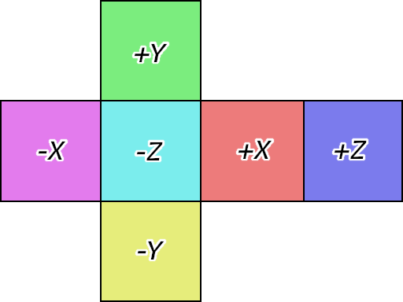

[OpenGL 3D 2023 Tips 第04回]

# キューブマップとスカイボックス

## 習得目標

* キューブマップ・テクスチャを作成できる。
* スカイボックスを使う利点を説明できる。
* スカイボックスのための適切な描画設定を選択できる。

## 1. スカイ・ボックス

### 1.1 遠景を表示するには

<p align="center">
<br>
[キューブマップ]
</p>

3Dグラフィックスでは、遠くの景色になるほど多くの物体が見えることになります。しかし、コンピューターが描画できるデータ量には限りがあるため、「視界に写る全ての物体を3Dモデルとして描画する」ということはできません。

そこで、「ゲームを成立させるために、必要最小限の範囲にある物体」だけを3Dモデルとして描画します。範囲より遠くにある物体は、事前に一枚の画像にまとめておき、ゲーム中はその画像を「遠景」として表示させます。

ただし、カメラが動くと一枚の画像では対応できなくなってしまいます。カメラが動いても大丈夫なように、前後左右および上下の6方向を、それぞれ画像で覆ってしまう方法が考えられました。

それが「スカイボックス」です。今回は、「キューブマップ」という種類のテクスチャを使ってスカイボックスを作成します。

キューブマップを使うと、6枚のテクスチャをまとめて扱うことができます。テクスチャ配列にはないキューブマップの特性は、方向ベクトルを使ってピクセルを参照する機能を持つことです。この機能を使うと、スカイボックスを簡単に描画することができます。

<p align="center">
<br>
[キューブマップは方向ベクトルが指すピクセルを参照できる<br>
出典 https://learnopengl.com/Advanced-OpenGL/Cubemaps]
</p>

### 1.2 TGAファイルを読み込む関数を定義する

現在の`Texture`クラスは1枚の画像を読み込んで、それをそのままテクスチャにしています。しかし、キューブマップを作成するには、少なくとも6枚の画像を読み込む必要があります。

そこで、画像を読み込むプログラムを関数として分離します。そして、作成した関数を使って6枚の画像を読み込み、キューブマップを作成します。

画像データにはバイト列だけでなく、幅や高さ、ピクセル形式などの情報も記録されています。テクスチャを作成するにはこれらの情報も必要になるため、バイト列と情報をまとめた構造体を定義します。構造体名は`ImageData`(イメージ・データ)とします。

そして、画像読み込み関数は、画像ファイルから`ImageData`を作成して返します。画像読み込み関数の名前は`LoadImagaData`(ロード・イメージ・データ)とします。`Texture.h`を開き、次のプログラムを追加してください。

```diff
 #include "glad/glad.h"
 #include <memory>
 #include <string>
+#include <vector>

 // 先行宣言
 class Texture;
 using TexturePtr = std::shared_ptr<Texture>;
+
+/**
+* 画像データ情報
+*/
+struct ImageData
+{
+  std::vector<char> data; // バイトデータ
+  GLenum imageFormat = 0; // 画像のピクセル形式
+  GLenum imageType = 0;   // 画像の型
+  GLenum gpuFormat = 0;   // GPUのピクセル形式
+  int pixelBytes = 0;     // 1ピクセルのバイト数
+  GLint width = 0;        // 画像の幅(ピクセル数)
+  GLint height = 0;       // 画像の高さ(ピクセル数)
+};
+
+// 画像の格納方向を表す列挙型
+enum class ImageDirection
+{
+  bottomToTop, // 下から上
+  topToBottom, // 上から下
+};
+
+// 色空間を表す列挙型
+enum class ColorSpace
+{
+  gamma,  // ガンマ色空間
+  linear, // リニア色空間
+};
+
+ImageData LoadImageData(const std::string& filename,
+  ImageDirection direction, ColorSpace colorSpace);

 /**
 * テクスチャ
```

`LoadImageData`関数宣言の`reverseY`(リバース・ワイ)引数は、画像の上下反転を行うかどうかを指定します。`colorSpace`(カラー・スペース)引数は、画像の色空間を指定します。

続いて`LoadImageData`関数の定義を作成しましょう。`Texture.cpp`を開き、
`Texture::Create`関数の定義の下に、`LoadImageData`関数の定義を追加してください。

```diff
   return std::make_shared<Texture>(
     name, width, height, internalFormat, filterMode);
 }
+
+/**
+* ファイルから画像データを読み込む
+*
+* @param filename   画像ファイル名
+* @param direction  画像データの格納方向
+* @param colorSpace 使用する色空間
+*
+* @return 読み込んだデータを保持するImageData構造体
+*/
+ImageData LoadImageData(const std::string& filename,
+  ImageDirection direction, ColorSpace colorSpace)
+{
+}

 /**
 * コンストラクタ
```

次に、画像ファイルからテクスチャを作成するほうの`Texture`コンストラクタの定義から、以下の範囲を切り取ってください。

```diff
       return;
     }
   }

-  // ファイルを開く
-  std::ifstream file(filename, std::ios::binary);
-  if (!file) {
-    LOG_ERROR("%sを開けません", filename.c_str());
-    return;
-  }
-
-  // ヘッダ情報を読み込む
-  const size_t tgaHeaderSize = 18; // ヘッダ情報のバイト数
-  uint8_t header[tgaHeaderSize];
-  file.read(reinterpret_cast<char*>(header), tgaHeaderSize);
-        ・
-        ・
-      (省略)
-        ・
-        ・
-    { GL_BGRA, GL_UNSIGNED_BYTE,              GL_SRGB8_ALPHA8, GL_RGBA8 },
-  };
-  FormatData format = formatList[pixelBytes - 1];
-
-  // リニア色空間が指定された場合、専用のGPUピクセル形式を選択
-  if (usage == Usage::for3DLinear || usage == Usage::forGltfLinear) {
-    format.gpuFormat = format.gpuFormatLinear;
-  }
-
   // テクスチャを作成
   glCreateTextures(GL_TEXTURE_2D, 1, &tex);
   glTextureStorage2D(tex, 1, format.gpuFormat, width, height);
```

そして、切り取った部分を`LoadImageData`関数に貼り付けてください。

```diff
 ImageData LoadImageData(const std::string& filename,
   ImageDirection direction, ColorSpace colorSpace)
 {
+  // ファイルを開く
+  std::ifstream file(filename, std::ios::binary);
+  if (!file) {
+    LOG_ERROR("%sを開けません", filename.c_str());
+    return;
+  }
+
+  // ヘッダ情報を読み込む
+  const size_t tgaHeaderSize = 18; // ヘッダ情報のバイト数
+  uint8_t header[tgaHeaderSize];
+  file.read(reinterpret_cast<char*>(header), tgaHeaderSize);
+        ・
+        ・
+      (省略)
+        ・
+        ・
+    { GL_BGRA, GL_UNSIGNED_BYTE,              GL_SRGB8_ALPHA8, GL_RGBA8 },
+  };
+  FormatData format = formatList[pixelBytes - 1];
+
+  // リニア色空間が指定された場合、専用のGPUピクセル形式を選択
+  if (usage == Usage::for3DLinear || usage == Usage::forGltfLinear) {
+    format.gpuFormat = format.gpuFormatLinear;
+  }
+
 }

 /**
 * コンストラクタ
```

この「切り取りと貼り付け(カット・アンド・ペースト)」の結果、当然ですがエラーがたくさん出ます。ひとつずつ修正しましょう。最初に「ファイルを開けなかった場合」の戻り値を設定します。

`LoadImageData`関数の定義にある「ファイルを開く」プログラムを次のように変更してください。

```diff
   std::ifstream file(filename, std::ios::binary);
   if (!file) {
     LOG_ERROR("%sを開けません", filename.c_str());
-    return;
+    return {};
   }
 
   // ヘッダ情報を読み込む
```

コンストラクタと違い、`LoadImageData`関数は`ImageData`型の戻り値を返す必要があります。ここでは「読み込み失敗」を意味する値を返したいので、空のを返すことにしました。

呼び出し側では「画像データが空かどうか」をチェックすることで、読み込みの成功・失敗を判定できます。明確に失敗を表しているわけではないため良い方法とは言い難いのですが、少なくとも「失敗を返す」という目的は達成できます。

次に、`usage`を使って上下反転フラグを判定していた部分を、`reverseY`を使うように書き換えます。`topToBottom`変数を設定するプログラムを次のように変更してください。

```diff
   // TGAが「上から下」に格納されている場合は画像を上下反転する
   bool topToBottom = header[17] & 0x20;
-  if (usage == Usage::for2D ||
-    usage == Usage::forGltf ||
-    usage == Usage::forGltfLinear) {
+  if (direction == ImageDirection::topToBottom) {
     topToBottom = !topToBottom; // 2D画像用の場合は反転方向を逆にする
   }
```

ここでは引数の変更に対応しています。`LoadImageData`関数では、`Texture`コンストラクタでは`usage`引数で処理していた「画像の上下反転」と「色空間」の選択を個別の引数に分けました。

>**【引数を変えた理由】**<br>
>`usage`は「テクスチャの利用方法」を意味するものなので、テクスチャを作成しない
>`LoadImageData`関数では「より具体的な意味を持つ引数」を使うべきと考えました。

同様に、色空間を判定するプログラムを次のように変更してください。

```diff
   FormatData format = formatList[pixelBytes - 1];

   // リニア色空間が指定された場合、専用のGPUピクセル形式を選択
-  if (usage == Usage::for3DLinear || usage == Usage::forGltfLinear) {
+  if (colorSpace == ColorSpace::linear) {
     format.gpuFormat = format.gpuFormatLinear;
   }
```

最後に`ImageData`型のオブジェクトを作成して返します。色空間を判定するプログラムの下に、次のプログラムを追加してください。

```diff
   if (colorSpace == ColorSpace::linear) {
     format.gpuFormat = format.gpuFormatLinear;
   }
+
+  return ImageData{img,
+    format.imageFormat, format.imageType, format.gpuFormat,
+    pixelBytes, width, height };
 }

 /**
 * コンストラクタ
```

これで`LoadImagaData`関数は完成ですが、まだ`Texture`コンストラクタのエラーが残っています。

`Texture`コンストラクタでは、TGAファイルの読み込みを`LoadImageData`関数で行うように修正します。`Texture`コンストラクタに次のプログラムを追加してください。

```diff
       return;
     }
   }
+
+  // 画像の向きを設定
+  ImageDirection direction = ImageDirection::bottomToTop;
+  if (usage == Usage::for2D || usage == Usage::forGltf || usage == Usage::forGltfLinear) {
+    direction = ImageDirection::topToBottom;
+  }
+
+  // 色空間を選択
+  ColorSpace colorSpace = ColorSpace::gamma;
+  if (usage == Usage::for3DLinear || usage == Usage::forGltfLinear) {
+    colorSpace = ColorSpace::linear;
+  }
+
+  // 画像ファイルを読み込む
+  const ImageData imageData = LoadImageData(filename, direction, colorSpace);
+  if (imageData.data.empty()) {
+    return; // 読み込み失敗
+  }

   // テクスチャを作成
   glCreateTextures(GL_TEXTURE_2D, 1, &tex);
```

次に、移動によって消えてしまった変数を`imageData`変数で置き換えていきます。
`Texture`コンストラクタを次のように変更してください。

```diff
   // テクスチャを作成
   glCreateTextures(GL_TEXTURE_2D, 1, &tex);
-  glTextureStorage2D(tex, 1, format.gpuFormat, width, height);
+  glTextureStorage2D(tex, 1,
+    imageData.gpuFormat, imageData.width, imageData.height);

   // 現在のアラインメントを記録してからアラインメントを1にする
   GLint alignment;
   glGetIntegerv(GL_UNPACK_ALIGNMENT, &alignment);
-  if (alignment != pixelBytes) {
+  if (alignment != imageData.pixelBytes) {
     glPixelStorei(GL_UNPACK_ALIGNMENT, 1);
   }

   // GPUメモリにデータをコピー
-  glTextureSubImage2D(tex, 0, 0, 0, width, height,
-    format.imageFormat, format.imageType, img.data());
+  glTextureSubImage2D(tex, 0, 0, 0, imageData.width, imageData.height,
+    imageData.imageFormat, imageData.imageType, imageData.data.data());

   // アラインメントを元に戻す
-  if (alignment != pixelBytes) {
+  if (alignment != imageData.pixelBytes) {
     glPixelStorei(GL_UNPACK_ALIGNMENT, alignment);
   }

   // 白黒画像の場合、(R,R,R,1)として読み取られるように設定
-  if (format.imageFormat == GL_RED) {
+  if (imageData.imageFormat == GL_RED) {
     glTextureParameteri(tex, GL_TEXTURE_SWIZZLE_G, GL_RED);
     glTextureParameteri(tex, GL_TEXTURE_SWIZZLE_B, GL_RED);
   }

   // 拡大縮小フィルタを設定
   glTextureParameteri(tex, GL_TEXTURE_MAG_FILTER, filterMode);
   glTextureParameteri(tex, GL_TEXTURE_MIN_FILTER, filterMode);

   // サイズを設定
-  this->width = width;
-  this->height = height;
+  width = imageData.width;
+  height = imageData.height;

   LOG("%sを読み込みました", filename.c_str());
 }
```

これで、TGAファイルを読み込むプログラムを関数にすることができました。

### 1.3 キューブマップテクスチャのコンストラクタを定義する

それでは、作成した`LoadImageData`関数を使って、キューブマップテクスチャを作成する機能を追加しましょう。まずキューブマップ用のコンストラクタを定義します。`Texture.h`を開き、`Texture`クラスの定義に次のプログラムを追加してください。

```diff
   static TexturePtr Create(
     const char* name, GLint width, GLint height,
     GLenum internalFormat, GLenum filterMode);
+  static TexturePtr CreateCubemap(const std::string pathList[6]);

   // コンストラクタ、デストラクタ
   explicit Texture(const std::string& filename, GLenum filterMode,
     Usage usage);
   Texture(const char* name, GLint width, GLint height,
     GLenum internalFormat, GLenum filterMode);
+  explicit Texture(const std::string pathList[6]);
   ~Texture();

   // コピーと代入を禁止
```

次に、`CreateCubemap`(クリエイト・キューブマップ)メンバ関数を定義します。
`Texture.cpp`を開き、`Texture::Create`関数の定義の下に、次のプログラムを追加してください。

```diff
   return std::make_shared<Texture>(
     name, width, height, internalFormat, filterMode);
 }
+
+/**
+* キューブマップテクスチャを作成する
+*
+* @param pathList 画像ファイル名の配列
+*
+* @return 作成したテクスチャへのポインタ
+*/
+TexturePtr Texture::CreateCubemap(const std::string pathList[6])
+{
+  return std::make_shared<Texture>(pathList);
+}

 /**
 * ファイルから画像データを読み込む
```

続いて、キューブマップテクスチャを作成するコンストラクタを定義します。空のテクスチャを作成するコンストラクタの定義の下に、次のプログラムを追加してください。

```diff
   this->width = width;
   this->height = height;
 }
+
+/**
+* キューブマップテクスチャを作成するコンストラクタ
+*
+* @param pathList 画像ファイル名の配列
+*/
+Texture::Texture(const std::string pathList[6])
+{
+  LOG("キューブマップ%sを作成", filename.c_str());
+}

 /**
 * デストラクタ
```

さて、典型的なキューブマップは次のような6つの面から構成されます。

<p align="center">

</p>

キューブマップテクスチャはこれら6枚の画像を配列として格納します。各面は以下の添字で表されます。

| 添字 | 面の向き |
|:----:|:----:|
|  0   |  +X  |
|  1   |  -X  |
|  2   |  +Y  |
|  3   |  -Y  |
|  4   |  +Z  |
|  5   |  -Z  |

キューブマップテクスチャを作成するには、まず6枚の画像ファイルを読み込みます。`Texture`コンストラクタの定義に次のプログラムを追加してください。

```diff
 */
 Texture::Texture(const std::string pathList[6])
 {
+  // 画像ファイルを読み込む
+  ImageData imageData[6];
+  for (int i = 0; i < 6; ++i) {
+    // キューブマップは原点が「左上」なので、画像の方向には「上から下」を指定
+    imageData[i] = LoadImageData(
+      pathList[i], ImageDirection::topToBottom, ColorSpace::gamma);
+
+    // 画像データが空の場合は「読み込み失敗」とみなす
+    if (imageData[i].data.empty()) {
+      return; // 読み込み失敗
+    }
+  }
   LOG("キューブマップ%sを作成", filename.c_str());
 }
```

画像ファイルを読み込む際は、

>キューブマップでは上下反転が通常とは逆になる

ことに注意する必要があります。これは、キューブマップの仕様が「RenderMan(レンダーマン)」という3Dレンダリングソフトウェアから持ち込まれたためです。

通常のテクスチャとはルールが異なるために混乱すると思いますが、今さらこのルールを変更することはできません。あきらめて慣れてください。

>DirectXのキューブマップもRenderMan由来なので(つまりOpenGLと同じルール)、キューブマップを流用しやすいという利点はあります。

それから、「画像データが空っぽ」の場合は読み込み失敗としています。実際のところ、
`ImagaData`型のメンバ変数はどれを使っても読み込み失敗を判定できます。

なぜなら`ImageData`型のメンバ変数の初期値は全て`0`であり、画像ファイルを読み込めた場合は必ず`0`以外の値が設定されるからです。

とはいえ、せっかくなら「何を判定しているのか」が分かりやすいメンバを選ぶべきです。そこで、「画像データが空かどうか」が一番分かりやすい、と判断したというわけです。

次に、画像の幅と高さを設定します。それから、作成可能なミップマップ数を計算します。OpenGLにはミップマップを自動生成する機能があるので、基本的なミップマップはファイルを読み込むと同時に作成できます。

>**【ミップマップの自動生成の品質】**<br>
>ミップマップの自動生成は「4ピクセルの平均を取る」という単純なものです。そのため、生成されるミップマップの品質はあまり良くありません。可能であれば専用のツールで生成するべきです。

画像ファイルを読み込むプログラムの下に、次のプログラムを追加してください。

```diff
       return; // 読み込み失敗
     }
   }
+
+  // 幅と高さを設定
+  width = imageData[0].width;
+  height = imageData[0].height;
+
+  // 作成可能なミップマップ数を計算
+  const int mipCount = static_cast<int>(std::log2(std::max(width, height)) + 1);
+
+  // キューブマップテクスチャを作成
+  glCreateTextures(GL_TEXTURE_CUBE_MAP, 1, &tex);
+  glTextureStorage2D(tex, mipCount, imageData[0].gpuFormat, width, height);
+
   LOG("キューブマップ%sを作成", filename.c_str());
 }
```

キューブマップテクスチャを作成するには、`glCreateTextures`関数の引数に
`GL_TEXTURE_CUBE_MAP`(ジーエル・テクスチャ・キューブマップ)を指定します。

テクスチャを作成してGPUメモリを確保したので、次は画像データを確保したGPUメモリにコピーします。キューブマップテクスチャを作成するプログラムの下に、次のプログラムを追加してください。

```diff
   // キューブマップテクスチャを作成
   glCreateTextures(GL_TEXTURE_CUBE_MAP, 1, &tex);
   glTextureStorage2D(tex, mipCount, imageData[0].gpuFormat, width, height);
+
+  // 画像データをGPUメモリにコピー
+  glGetError(); // エラー状態をリセット
+  for (int i = 0; i < 6; ++i) {
+    glTextureSubImage3D(tex, 0,
+      0, 0, i, width, height, 1,
+      imageData[i].imageFormat, imageData[i].imageType, imageData[i].data.data());
+
+    const GLenum result = glGetError();
+    if (result != GL_NO_ERROR) {
+      LOG_ERROR("%sの作成に失敗", pathList[i].c_str());
+    }
+  }

   LOG("キューブマップ%sを作成", filename.c_str());
 }
```

キューブマップテクスチャの場合、画像データのコピーには`glTextureSubImage3D`(ジーエル・テクスチャ・サブ・イメージ・スリーディ)関数を使う必要があります。

これは、キューブマップテクスチャが内部的にはテクスチャ配列として管理されているためです。そのため、2次元用の`glTextureSubImage2D`ではなく3次元用の
`glTextureSubImage3D`を使う必要があるのです。

<p><code class="tnmai_code"><strong>【書式】</strong><br>
void glTextureSubImage3D(テクスチャの管理番号,<br>
&emsp;ミップマップレベル, コピー先X座標, コピー先Y座標,<br>
&emsp;コピー先Z座標(キューブマップの場合は面番号),<br>
&emsp;画像データの幅, 画像データの高さ, 画像データの枚数,<br>
&emsp;画像データのピクセル形式, 画像データの型, 画像データのアドレス);
</code></p>

扱う次元数の増加に伴って、「コピー先Z座標」と「画像データの枚数」という引数が追加されています。しかし、それ以外は`glTextureSubImage2D`関数と全く同じです。

それから、ここでは画像データをコピーしたあとで、明示的にエラーチェックを行っています。OpenGLコンテキストをデバッグモードで作成し、コールバック関数を設定しているため、明示的なエラーチェックをしなくてもエラーメッセージは表示されます。

しかし、デバッグモードによるエラーメッセージでは、「どのファイルを読み込んだときに起きたエラーなのか」は分かりません。そこで、明示的にエラーチェックを行って、エラーの原因となったファイル名を表示させています。

明示的なエラーチェックを行うには`glGetError`(ジーエル・ゲット・エラー)関数を使います。

<p><code class="tnmai_code"><strong>【書式】</strong><br>
GLenum glGetError();
</code></p>

この関数は、ある`glGetError`関数呼び出しから次の`glGetError`関数呼び出しまでの間に発生した「最初のエラーの番号」を返します。関数呼び出しの間でエラーが起きていない場合は`GL_NO_ERROR`(ジーエル・ノー・エラー)を返します。

直前に実行された関数のエラーが返されるとは限らないことに注意してください。この仕様のため、ある期間内でエラーが発生したかどうかを調べたい場合、期間の最初に`glGetError`関数を呼び出してエラー状態をリセットする方法が使われます。

次にミップマップを作成します。画像データをGPUメモリにコピーするプログラムの下に、次のプログラムを追加してください。

```diff
       LOG_ERROR("%sの作成に失敗", pathList[i].c_str());
     }
   }
+
+  // ミップマップの自動生成
+  glGenerateTextureMipmap(tex);

   LOG("キューブマップ%sを作成", filename.c_str());
 }
```

ミップマップを自動生成させるには`glGenerateTextureMipmap`(ジーエル・ジェネレート・テクスチャ・ミップマップ)関数を使います。

<p><code class="tnmai_code"><strong>【書式】</strong><br>
void glGenerateTextureMipmap(テクスチャの管理番号);
</code></p>

最後に、テクスチャのパラメータを設定します。ミップマップを自動生成させるプログラムの下に、次のプログラムを追加してください。

```diff
   // ミップマップの自動生成
   glGenerateTextureMipmap(tex);
+
+  // 最大ミップマップレベルを設定
+  glTextureParameteri(tex, GL_TEXTURE_MAX_LEVEL, mipCount - 1);
+
+  // 拡大縮小フィルタを設定
+  if (mipCount > 1) {
+    glTextureParameteri(tex, GL_TEXTURE_MIN_FILTER, GL_LINEAR_MIPMAP_LINEAR);
+  } else {
+    glTextureParameteri(tex, GL_TEXTURE_MIN_FILTER, GL_LINEAR);
+  }
+  glTextureParameteri(tex, GL_TEXTURE_MAG_FILTER, GL_LINEAR);
+
+  // ラップモードを設定
+  glTextureParameteri(tex, GL_TEXTURE_WRAP_S, GL_CLAMP_TO_EDGE);
+  glTextureParameteri(tex, GL_TEXTURE_WRAP_T, GL_CLAMP_TO_EDGE);

   LOG("キューブマップ%sを作成", filename.c_str());
 }
```

基本的に、キューブマップはバイリニア補間で使います。そのため、ニアレスト補間は考慮していません。

これで、キューブマップテクスチャを作成できるようになりました。

### 1.4 スカイボックス用の頂点シェーダを定義する

基本的に、スカイボックスにはテクスチャの色をそのまま表示します。これは、「スカイボックスはライトや影の影響を受けない」ことを意味します。

理由は、スカイボックスは「遠くに見える景色を全部まとめて一枚の画像に押し込んだもの」なので、ライトや影を反映するために必要な「物体の位置や形状の情報」を持たないためです。

そんなわけで、スカイボックスの描画には専用のシェーダを使うのが一般的です。スカイボックス用の頂点シェーダは、頂点データとして立方体(または球体)を受け取り、カメラの回転と視野角による座標変換を行います。

スカイボックス用のフラグメントシェーダは、頂点シェーダから送られたテクスチャ座標によってキューブマップから色を取得し、その色をそのまま出力色とします。

まず頂点シェーダから作成していきます。、頂点シェーダは少し長いので、変数を定義から徐々に書いていきます。

プロジェクトの`Res`フォルダに`skybox.vert`という名前のテキストファイルを追加してください。追加したファイルを開き、次のプログラムを追加してください。

```diff
+/**
+* @file skybox.vert
+*/
+#version 450
+
+// シェーダへの入力
+layout(location=0) in vec3 inPosition;
+
+// シェーダからの出力
+layout(location=0) out vec3 outTexcoord;
+
+// プログラムからの入力
+
+// x: 視野角による水平拡大率
+// y: 視野角による垂直拡大率
+// z: 遠近法パラメータA
+// w: 遠近法パラメータB
+layout(location=3) uniform vec4 cameraData;
+
+// x: カメラX軸回転のsin
+// y: カメラX軸回転のcos
+// z: カメラY軸回転のsin
+// w: カメラY軸回転のcos
+layout(location=5) uniform vec4 cameraSinCosXY;
+
+/**
+* エントリーポイント
+*/
+void main()
+{
+}
```

今回は、スカイボックスの効果を確認できるように、カメラのY軸回転にも対応することにしました。

続いて`main`関数の中身を書いていきます。`main`関数の定義に次のプログラムを追加してください。

```diff
 */
 void main()
 {
+  // 頂点座標をキューブマップのテクスチャ座標とする
+  outTexcoord = inPosition;
+
+  // カメラの回転をモデルに反映するには、カメラの回転と逆方向に回転させる
+  // 標準の回転方向は反時計回りなので、時計回りになるようにすればよい
+  vec3 pos = inPosition;
+
+  // Y軸回転(XZ平面上の回転)
+  float sy = -cameraSinCosXY.z; // 回転方向を反時計回りから時計回りに変換
+  float cy = cameraSinCosXY.w;
+  pos = vec3(pos.x * cy + pos.z * sy,
+             pos.y,
+             pos.x * -sy + pos.z * cy);
+
+  // X軸回転(ZY平面上の回転)
+  float sx = -cameraSinCosXY.x; // 回転方向を反時計回りから時計回りに変換
+  float cx = cameraSinCosXY.y;
+  pos = vec3(pos.x,
+             pos.z * -sx + pos.y * cx,
+             pos.z * cx + pos.y * sx);
+
+  // 視野角を反映
+  gl_Position.x = pos.x * cameraData.x;
+  gl_Position.y = pos.y * cameraData.y;
+  gl_Position.z = -pos.z * cameraData.w + cameraData.z;
+  gl_Position.w = -pos.z;
 }
```

カメラの回転は「X軸回転→Y軸回転」の順で実行します。回転の順序が異なると、同じ回転角度を設定しても回転後の姿勢は異なります。回転の順序は注意深く選択しましょう。

### 1.5 スカイボックス用のフラグメントシェーダを定義する

続いて、フラグメントシェーダを定義します。プロジェクトの`Res`フォルダに`skybox.frag`
という名前のテキストファイルを追加してください。追加したファイルを開き、次のプログラムを追加してください。

```diff
+/**
+* @file skybox.frag
+*/
+#version 450
+
+// シェーダへの入力
+layout(location=0) in vec3 inTexcoord;
+
+// テクスチャ
+layout(binding=0) uniform samplerCube texSkybox;
+
+// 出力する色データ
+out vec4 outColor;
+
+/**
+* エントリーポイント
+*/
+void main()
+{
+  outColor = texture(texSkybox, inTexcoord);
+}
```

キューブマップテクスチャを使うには、サンプラ変数を`samplerCube`(サンプラ・キューブ)型として定義する必要があります。

それと、`samplerCube`から色を取得する場合、`texture`関数の第2引数はテクスチャ座標ではなく、「キューブの中心からキューブの外側に向かう3Dベクトル」です。ベクトルが指す先にある色が読み取られるというイメージです。

### 1.6 ゲームエンジンにスカイボックス用の変数を追加する

シェーダの準備が整ったので、ゲームエンジンにスカイボックス用の変数を追加しましょう。
`Engine.h`を開き、`Engine`クラスの定義にある「影描画用の変数」の定義の下に、次のプログラムを追加してください。

```diff
   // 3Dモデルの影描画用の変数
   FramebufferObjectPtr fboShadow;
   ProgramPipelinePtr progShadow;
   ProgramPipelinePtr progShadowAnimation;
+
+  // スカイボックス用の変数
+  TexturePtr texSkybox;
+  ProgramPipelinePtr progSkybox;

   FramebufferObjectPtr fboGameWindow; // ゲームウィンドウ用FBO
```

次に`Engine.cpp`を開き、`Initialize`メンバ関数定義にある影用オブジェクトを作成するプログラムの下に、次のプログラムを追加してください。

```diff
   // 影用オブジェクトを作成
   progShadow = ProgramPipeline::Create("Res/shadow.vert", "Res/shadow.frag");
   progShadowAnimation = ProgramPipeline::Create("Res/shadow_animation.vert", "Res/shadow.frag");
   fboShadow = FramebufferObject::Create(1024, 1024, FboType::depth);
+
+  // スカイボックス用オブジェクトを作成
+  const std::string skyboxPathList[6] = {
+    "Res/skybox/skybox_px.tga", "Res/skybox/skybox_nx.tga",
+    "Res/skybox/skybox_py.tga", "Res/skybox/skybox_ny.tga",
+    "Res/skybox/skybox_pz.tga", "Res/skybox/skybox_nz.tga",
+  };
+  texSkybox = Texture::CreateCubemap(skyboxPathList);
+  progSkybox = ProgramPipeline::Create("Res/skybox.vert", "Res/skybox.frag");

   // ゲームウィンドウ用FBOを作成
   const vec2 viewSize = GetViewSize();
```

<div style="page-break-after: always"></div>

### 1.7 スカイボックスを描画する

それでは、スカイボックスを描画しましょう。`MainLoop`メンバ関数にある「バックバッファをクリア」するプログラムの下に、次のプログラムを追加してください。

```diff
     // バックバッファをクリア
     glClearColor(0.3f, 0.6f, 0.9f, 1.0f);
     glClear(GL_COLOR_BUFFER_BIT | GL_DEPTH_BUFFER_BIT);
+
+    // スカイボックスを描画
+    {
+      // 深度バッファへの書き込みを行わないことで、「最も遠くにある」という幻想を作リ出す
+      glDisable(GL_DEPTH_TEST);
+
+      // 立方体の裏側を描画したいのでカリング対象を表側にする
+      glEnable(GL_CULL_FACE);
+      glCullFace(GL_FRONT);
+
+      // アルファブレンドは使わないので描画の高速化のために無効化
+      glDisable(GL_BLEND);
+
+      // キューブマップのつなぎ目を目立たなくする機能を有効化
+      glEnable(GL_TEXTURE_CUBE_MAP_SEAMLESS);
+
+      // ビューポートを設定
+      Camera& camera = static_cast<Camera&>(*cameraObject->componentList[0]);
+      glViewport(
+        camera.viewport.x, camera.viewport.y,
+        camera.viewport.width, camera.viewport.height);
+
+      // スカイボックス用のカメラ情報を設定
+      glProgramUniform4f(*progSkybox, 3,
+        camera.fovScaleX, camera.fovScaleY, camera.A, camera.B);
+      glProgramUniform4f(*progSkybox, 5,
+        sin(cameraObject->rotation.x), cos(cameraObject->rotation.x),
+        sin(cameraObject->rotation.y), cos(cameraObject->rotation.y));
+
+      // 立方体にキューブマップを描画
+      const auto& skybox = meshBuffer->LoadOBJ("Res/Model/box.obj");
+      const auto& prim = skybox->primitives[0];
+      glUseProgram(*progSkybox);
+      glBindVertexArray(*meshBuffer->GetVAO());
+      glBindTextureUnit(0, *texSkybox);
+      glDrawElementsBaseVertex(prim.mode, prim.count,
+        GL_UNSIGNED_SHORT, prim.indices, prim.baseVertex);
+
+      glCullFace(GL_BACK); // カリング対象を元に戻す
+    }

    // 描画に使うシェーダを指定
    glUseProgram(*progSprite);
```

スカイボックスのための立方体メッシュには、以前に作成した`box.obj`を使います。

<pre class="tnmai_assignment">
<strong>【課題01】</strong>
スカイボックス用の画像をダウンロードし、プロジェクトの<code>Res/skybox</code>フォルダに保存しなさい。

スカイボックス用の画像は、例えば以下のサイトで見つけられます。
<code>https://humus.name/index.php?page=Textures</code>

なお、いくつかのサイトやUnityアセットでは、キューブマップ自体ではなく、その元になるパノラマ画像だけが提供される場合があります。
パノラマ画像からキューブマップ用の画像に変換するには以下のサイトを利用するとよいでしょう。
<code>https://jaxry.github.io/panorama-to-cubemap/</code>
</pre>

### 1.8 メインゲームシーンにカメラ操作機能を追加する

これでスカイボックスが表示されるはずなので、あとはプログラムを実行して背景に画像が表示されることを確認するだけです。ただ、カメラを動かさないと、スカイボックスの効果がわかりにくいと思います。

そこで、カメラを動かす機能を追加しましょう。プロジェクトの`Src/Component`フォルダに
`MoveController.h`(ムーブ・コントローラ・エイチ)という名前のヘッダファイルを追加してください。

追加したヘッダファイルを開き、次のプログラムを追加してください。

```diff
+/**
+* @file MoveController.h
+*/
+#ifndef MOVECONTROLLER_H_INCLUDED
+#define MOVECONTROLLER_H_INCLUDED
+#include "../Component.h"
+#include "../Engine.h"
+
+/**
+* 移動制御コンポーネント
+*/
+class MoveController : public Component
+{
+public:
+  MoveController() = default;
+  virtual ~MoveController() = default;
+
+  virtual void Update(GameObject& gameObject, float deltaTime) override
+  {
+    const Engine* engine = gameObject.engine;
+
+    // 向きを回転
+    if (engine->GetKey(GLFW_KEY_UP)) {
+      gameObject.rotation.x += deltaTime;
+    }
+    if (engine->GetKey(GLFW_KEY_DOWN)) {
+      gameObject.rotation.x -= deltaTime;
+    }
+    if (engine->GetKey(GLFW_KEY_LEFT)) {
+      gameObject.rotation.y += deltaTime;
+    }
+    if (engine->GetKey(GLFW_KEY_RIGHT)) {
+      gameObject.rotation.y -= deltaTime;
+    }
+  }
+};
+
+#endif // MOVECONTROLLER_H_INCLUDED
```

次に`MainGameScene.cpp`を開き、`MoveController.h`をインクルードしてください。

```diff
 * @file MainGameScene.cpp
 */
 #include "MainGameScene.h"
+#include "Component/MoveController.h"
 #include "Component/MeshRenderer.h"
 #include "Component/GltfMeshRenderer.h"
```

続いて`Initialize`メンバ関数の定義に、次のプログラムを追加してください。

```diff
 {
   engine.ClearGameObjectList();
   engine.ClearUILayers();
+
+  // カメラに移動制御コンポーネントを追加
+  auto cameraObject = engine.GetMainCameraObject();
+  cameraObject->AddComponent<MoveController>();

   // glTF表示テスト
   auto gltf = engine.Create<GameObject>("glTF Test");
```

プログラムが書けたらビルドして実行してください。矢印キーでカメラを回転できます。カメラをさまざまな方向へ向けて、すべての方向にキューブマップテクスチャの画像が表示されていることを確認してください。

<p align="center">

</p>

>**【1章のまとめ】**
>
>* スカイボックスは効率的に遠景を描画するための仕組み。
>* スカイボックスの描画にはキューブマップを使うのが簡単。
>* キューブマップは立方体の6つの面にそれぞれ画像を割り当てたもの。
>* キューブマップには「方向ベクトルの指すピクセルを参照する」機能がある。<br>この機能を使うと、比較的簡単にスカイボックスを描画できる。
