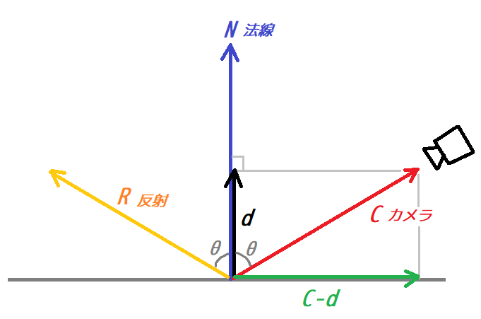
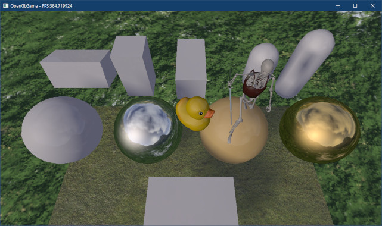
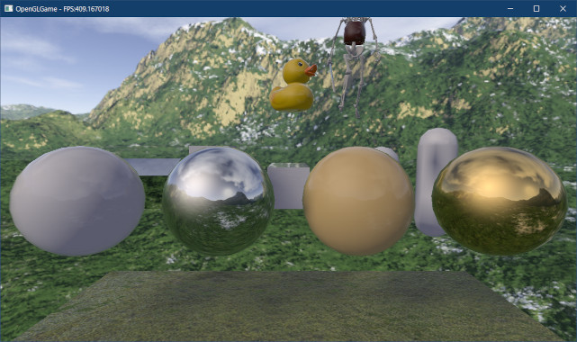
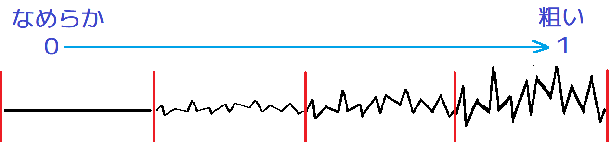
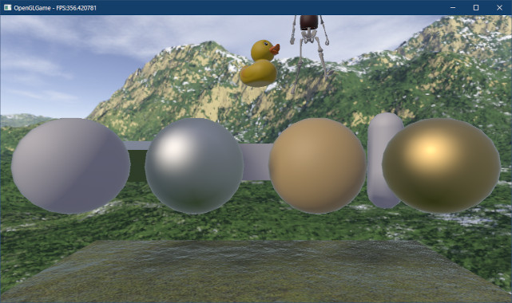
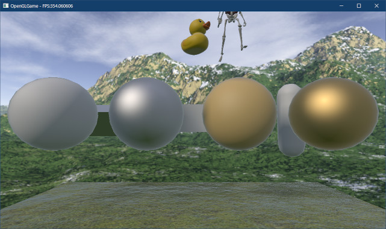
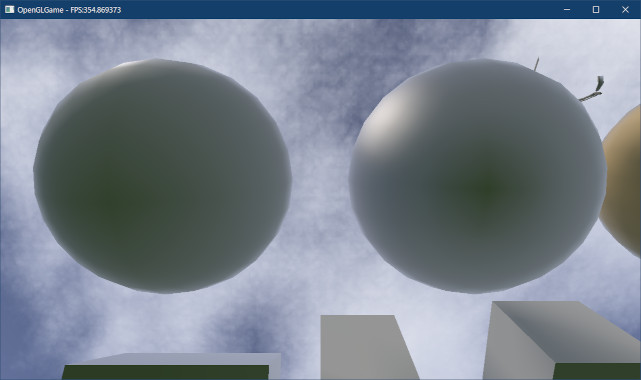
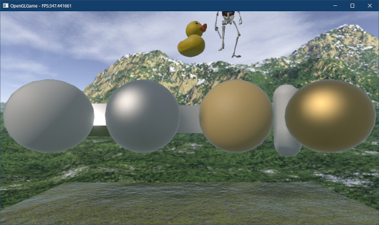
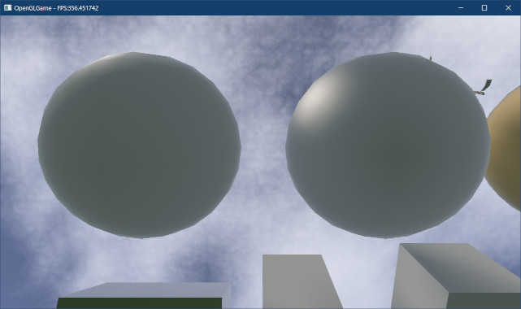

[OpenGL 3D 2023 Tips 第05回]

# 環境マッピングと材質の表現

## 習得目標

* 金属と非金属の性質の違いを説明できる。
* キューブマップと反射ベクトルによって環境マッピングを実装できる。
* フレネル方程式が描画に与える影響を説明できる。
* イメージ・ベースド・ライティング(IBL)について説明できる。

## 1. 環境マッピング

### 1.1 金属と非金属

前回は、「キューブマップ」を利用して「スカイボックス」を作成しました。しかし、キューブマップを使ってできることは、スカイボックスだけではありません。

今回はキューブマップのもうひとつの使い方である「環境マッピング」と、これをさらに発展させた「イメージ・ベースド・ライティング(IBL)」を実装します。

環境マッピングとは、

>物体に周囲の風景を反射するような効果を与えることで、金属や鏡、水面が持つ反射を表現する技術

のことです。実は、キューブマップは、元々は「環境マッピング」のために開発された技術だったりします。

「反射」そのものは全ての物体が持つ性質です。しかし、「金属」と「それ以外(非金属)」では反射特性が大きく異なります。

ライトを追加したときに、反射には「拡散反射(ディフューズ)」と「鏡面反射(スペキュラ)」の2種類があるという話をしました。ところが金属の反射は「鏡面反射だけで、拡散反射は起こらない」のです。

さらに、金属は非常に高い鏡面反射率を持ちます。金属が鏡のように周囲の景色を写し出すのは、鏡面反射率が高いからなのです。「環境マッピング」を使うと、金属の持つ高い鏡面反射率を再現することができます。

また、金属の鏡面反射率は、光の波長ごとに値が異なります。金属の色が材質によって異なるのは、材質ごとに赤、緑、青の鏡面反射係数が異なるためです。

|  材質  | 赤の反射率 | 緑の反射率 | 青の反射率 |
|:------:|:----:|:----:|:----:|
|   金   | 1.00 | 0.71 | 0.29 |
|   銀   | 0.95 | 0.93 | 0.88 |
|   銅   | 0.95 | 0.64 | 0.54 |
|   鉄   | 0.56 | 0.57 | 0.58 |
| アルミ | 0.91 | 0.92 | 0.92 |

### 1.2 金属性パラメータを追加する

先に述べたように、金属と非金属では反射特性が大きく異なります。そこで、`Material`構造体に「金属性」を表すパラメータを追加することにします。シェーダではこの金属性パラメータを参照して、「金属」と「非金属」を描き分けます。

具体的には、材質が「非金属」の場合はこれまでどおりの描画を行い、「金属」の場合は「環境マッピング」によって鏡面反射を再現します。これを踏まえて、プログラムに環境マッピングを追加する手順は次のとおりです。

>1. `Material`構造体に金属性パラメータを追加。
>2. `standard_3D.frag`に金属性パラメータとキューブマップサンプラを追加。
>3. `standard_3D.frag`を、金属と非金属を描き分けるように変更。
>4. 金属性パラメータをGPUメモリへコピーするプログラムを追加。
>5. キューブマップテクスチャをOpenGLコンテキストに割り当てるプログラムを追加。

まずは金属性パラメータを追加するところから始めましょう。金属性パラメータの名前は`metallic`(メタリック)とします。`Mesh.h`を開き、`Material`構造体の定義に次のプログラムを追加してください。

```diff
   VecMath::vec4 baseColor = VecMath::vec4(1); // 基本色+アルファ
   float specularPower = 16;                   // 鏡面反射指数
   float normalizeFactor = 24.0f / 25.13274f;  // 正規化係数
+  float metallic = 0;                         // 0=非金属, 1=金属
   TexturePtr texBaseColor;                    // 基本色テクスチャ
   TexturePtr texNormal;                       // 法線テクスチャ
```

glTFの読み込みを実装している場合は、`GltfMaterial`構造体にも金属性パラメータを追加します。`GltfMesh.h`を開き、`GltfMaterial`構造体の定義に次のプログラムを追加してください。

```diff
   TexturePtr texBaseColor; // 基本色テクスチャ
   TexturePtr texNormal;    // 法線テクスチャ
   float roughness = 1;     // 表面の粗さ。粗い=1 なめらか=0
+  float metallic = 0;      // 0=非金属, 1=金属
 };
 using GltfMaterialPtr = std::shared_ptr<GltfMaterial>;
```

### 1.3 シェーダに金属性パラメータとキューブマップサンプラを追加する

次に、キューブマップ用のサンプラ変数を追加します。`standard_3D.frag`を開き、次のプログラムを追加してください。

```diff
 // テクスチャ
 layout(binding=0) uniform sampler2D texColor;
 layout(binding=1) uniform sampler2D texNormal;
 layout(binding=2) uniform sampler2DShadow texDepth;
+layout(binding=3) uniform samplerCube texSkybox;

 // 出力する色データ
 out vec4 outColor;
```

続いて、金属性パラメータを表すユニフォーム変数を追加します。マテリアルの定義を次のように変更してください。

```diff
   vec4 baseColor; // 基本色+アルファ

   // x: 鏡面反射指数
   // y: 正規化係数
+  // z: 金属性(メタリック)
-  vec2 specularFactor;
+  vec3 specularFactor;
 };
 layout(location=102) uniform Material material;
```

「メタリック(金属性)」は鏡面反射に関するパラメータなので、`specularFactor`変数の要素を`vec3`に変更することで対処しました。

>**【ユニフォーム変数の領域を有効活用しよう】**<br>
>ユニフォーム変数は内部的に`vec4`単位で領域が用意されます。そのため、ユニフォーム変数の型が`vec3`, `vec2`, `float`の場合、領域の一部が無駄になります。ユニフォーム変数用の領域は有限なので、できるだけ既存のユニフォーム変数を使い回すべきです。

### 1.4 金属と非金属を描き分ける(平行光源編)

それでは、追加した「金属性パラメータ」を使って「材質の描き分け」を行いましょう。まずメタリックの値によって拡散反射(ディフューズ)を変化させます。

拡散反射を計算するプログラムを次のように変更してください。

```diff
   // 拡散光と鏡面反射を合成する
+  float metallic = material.specularFactor.z;
   float specularRatio = 0.04; // 鏡面反射の比率
-  diffuse *= outColor.rgb * (1 - specularRatio);
+  diffuse *= outColor.rgb * (1 - specularRatio) * (1 - metallic);
   specular *= specularRatio;

   outColor.rgb = (diffuse + specular) * shadow + ambient;
 }
```

`diffuse`の計算に追加した`(1 - metallic)`の部分は、

>`metallic`が0(非金属)の場合は`1`
>`metallic`が1(金属)の場合は`0`

となります。結果として、金属の場合は拡散反射がゼロになるという仕組みです。

次に、金属性によって鏡面反射の比率を変化させます。これまでは、「マテリアルの色」を拡散反射に使っていました。しかし、金属は拡散反射がゼロです。そこで、マテリアルの色を「鏡面反射率」として利用します。

鏡面反射の比率を計算するプログラムを次のように変更してください。

```diff
   // 拡散光と鏡面反射を合成する
   float metallic = material.specularFactor.z;
-  float specularRatio = 0.04; // 鏡面反射の比率
+  vec3 specularRatio = mix(vec3(0.04), outColor.rgb, metallic); // 鏡面反射の比率
   diffuse *= outColor.rgb * (1 - specularRatio) * (1 - metallic);
   specular *= specularRatio;
```

`mix`(ミックス)関数を使うと、2つの数値を比率によって合成することができます。上のプログラムでは`metallic`を比率とみなし、非金属の反射率`vec3(0.04)`と金属の反射率`outColor.rgb`を合成しています。

これにより、`metallic`が`0`のときは`vec3(0.04)`が、`1`のときは`outColor.rgb`が鏡面反射率になります(`outColor`には、シェーダの最初のほうでマテリアルの色を代入しているはずです)。

また、光の波長によって鏡面反射の比率を変えるために、`specularRatio`変数の型を`vec3`に変更しています。

これらの変更によって、平行光源に対して、非金属の場合はRGBが等しい弱い反射が、金属の場合はRGBが異なる強い反射が再現できるようになりました。

### 1.5 金属と非金属を描き分ける(環境光編)

次に環境光を描き分けます。 環境光は「360°全方向から入射する光」の近似です。環境光は拡散反射と鏡面反射をまとめたものですが、「全方向から」という点から主要成分は拡散反射になります。そのため、金属は環境光を反射しません。

代わりに、金属は強い鏡面反射を持ちます。これを再現するのが「環境マッピング」というわけです。環境マッピングは「フラグメントを鏡面とみなし、鏡に写った色(鏡像)をフラグメントの色とする」技法です。

さて、鏡像を求めるには、フラグメントの「反射ベクトル」を求める必要があります。まず反射ベクトルの定義を次に示します。

>光線のベクトルを「法線ベクトルに対して対称な方向」に変換したもの

先に説明したように、フラグメントにはすべての方向から光線が入射します。しかし、実際の描画に必要のは「カメラに届く光線」だけです。

そこで、光線の方向を反転して「カメラからフラグメントに向かって光線を発射し、その光線の反射ベクトルが指す位置の色を取得」します。この反射ベクトルは、次の図のようになります。

<p align="center">
<br>
[反射ベクトル]
</p>

反射ベクトル`R`を求めるには、まずカメラベクトルを「垂直ベクトル」と「水平ベクトル」に分解します。垂直ベクトルは、カメラベクトル`C`を法線`N`に射影したベクトル`d`です。

&emsp;d = dot(C, N) * N

水平ベクトルは`C - d`として求められます。反射ベクトル`R`は「水平ベクトル`C-d`の方向に逆向きにして、垂直ベクトル`d`を足したもの」になります。これは次の式になります。

&emsp;R = -(C - d) + d

この式を変形して整理すると以下になります。

&emsp;R = -C + d + d<br>
&emsp;&emsp;= 2d - C

この`2d - C`が反射ベクトルを求める式です。

それでは、反射ベクトルを求める式をプログラムしましょう。拡散反射と鏡面反射を計算するプログラムの下に、次のプログラムを追加してください。

```diff
   vec3 specularRatio = mix(vec3(0.04), outColor.rgb, metallic); // 鏡面反射の比率
   diffuse *= outColor.rgb * (1 - specularRatio) * (1 - metallic);
   specular *= specularRatio;
+
+  // カメラベクトルと法線から反射ベクトルを計算
+  vec3 reflectionVector =
+    2.0 * dot(cameraVector, normal) * normal - cameraVector;

   outColor.rgb = (diffuse + specular) * shadow + ambient;
 }
```

反射ベクトルを表す変数名は、`reflectionVector`(リフレクション・ベクトル、`reflection`(リフレクション)は「反射」という意味)としました。

それでは、求めた反射ベクトルを使って環境マッピングを実行しましょう。反射ベクトルを求めるプログラムの下に、次のプログラムを追加してください。

```diff
   // カメラベクトルと法線から反射ベクトルを計算
   vec3 reflectionVector =
     2.0 * dot(cameraVector, normal) * normal - cameraVector;
+
+  // 金属の場合、環境光をゼロにする
+  ambient *= (1 - specularRatio) * (1 - metallic);
+
+  // 環境マッピングによって鏡面反射を再現する
+  vec3 specularAmbient = texture(texSkybox, reflectionVector).rgb;
+  ambient += specularAmbient * specularRatio;

   outColor.rgb = (diffuse + specular) * shadow + ambient;
 }
```

キューブマップからピクセルを取得するには、`texture`関数の第2引数に反射ベクトルを指定します。

平行光源の場合と同様に、「鏡面反射の比率」を利用して、拡散反射と鏡面反射の比率を調整していることに注意してください。これによって、金属特有の色が付くようになります。

### 1.6 キューブマップテクスチャをOpenGLコンテキストに割り当てる

次に、メッシュを描画するときに、キューブマップテクスチャをOpeGLコンテキストに割り当てます。`MainGameScene.cpp`を開き、`DrawStaticMesh`メンバ関数の定義を次のように変更してください。

```diff
   glBlendFunc(GL_SRC_ALPHA, GL_ONE_MINUS_SRC_ALPHA);

-  // 影描画用の深度テクスチャを割り当てる
-  const GLuint texDepth = *fboShadow->GetDepthTexture();
-  glBindTextures(2, 1, &texDepth);
+  // 影描画用の深度テクスチャと環境マッピング用のテクスチャを割り当てる
+  const GLuint tex[] = { *fboShadow->GetDepthTexture(), *texSkybox };
+  glBindTextures(2, 2, tex);

   // 影座標からテクスチャ座標に変換する行列
   const mat4 matTexture = {
```

### 1.7 金属性パラメータをGPUメモリにコピーする

次に、金属性パラメータをGPUメモリにコピーします。`Mesh.cpp`を開き、`Draw`関数の定義を次のように変更してください。

```diff
       if (program) {
         glProgramUniform4fv(program, 102, 1, &material.baseColor.x);
-        glProgramUniform2f(program, 103,
-          material.specularPower, material.normalizeFactor);
+        glProgramUniform3f(program, 103,
+          material.specularPower, material.normalizeFactor, material.metallic);
       }

       // OpenGLコンテキストにテクスチャを割り当てる
```

続いて`GltfMesh.cpp`を開き、`Draw`メンバ関数の定義を次のように変更してください。

```diff
       const float specularPower = (a * a) * 999 + 1;
       const float normalizeFactor = (specularPower + 8) / (8 * pi);
       glProgramUniform4fv(program, 102, 1, &material.baseColor.x);
-      glProgramUniform2f(program, 103, specularPower, normalizeFactor);
+      glProgramUniform3f(program, 103, specularPower, normalizeFactor, material.mettalic);

       // OpenGLコンテキストにテクスチャを割り当てる
```

これで、マテリアルの金属性パラメータを、シェーダから読み込めるようになりました。

### 1.8 金属性を設定する

金属と非金属の描き分けができていることを確認するために、いくつかのオブジェクトのマテリアルを金属に変えましょう。

`MainGameScene.cpp`を開き、`Initialize`メンバ関数の中の球体を追加するプログラムに、次のプログラムを追加してください。

>球体を追加していない場合は、適当なモデルを金属にしてください。

```diff
     // 個別に色を変えられるように、マテリアルのコピーを作る
     sphereRenderer->materials.push_back(
       std::make_shared<Mesh::Material>(*sphereRenderer->mesh->materials[0]));
+    if (i % 2) {
+      sphereRenderer->materials[0]->metallic = 1;
+    }
+    if (i >= 2) {
+      sphereRenderer->materials[0]->baseColor = { 1.0f, 0.71f, 0.8f, 0.29f, 1 };
+    }

     // コライダーを割り当てる
     auto collider = sphere->AddComponent<SphereCollider>();
```

プログラムが書けたらビルドして実行してください。球体に周囲の風景が写り込んでいたら成功です。

<p align="center">

</p>

<pre class="tnmai_assignment">
<strong>【課題01】</strong>
直方体のどれかひとつについて、マテリアルを金属に変更しなさい。
</pre>

### 1.7 カメラの移動

せっかく環境マッピングができたので、様々な方向から物体を鑑賞できるように、カメラを移動させる機能を追加しましょう。

そこで、`MoveController`コンポーネントに移動機能を追加しましょう。`MoveController.h`を開き、`Update`メンバ関数の定義に次のプログラムを追加してください。

```diff
     if (engine->GetKey(GLFW_KEY_RIGHT)) {
       gameObject.rotation.y -= deltaTime;
     }
+
+    // Y軸回転から正面と右のベクトルを計算
+    const float s = sin(gameObject.rotation.y);
+    const float c = cos(gameObject.rotation.y);
+    const VecMath::vec3 front(-s, 0, -c);
+    const VecMath::vec3 right(c, 0, -s);
+
+    // 移動速度
+    const float speed = 10 * deltaTime;
+
+    // 前後の移動
+    if (engine->GetKey(GLFW_KEY_W)) {
+      gameObject.position += front * speed;
+    }
+    if (engine->GetKey(GLFW_KEY_S)) {
+      gameObject.position -= front * speed;
+    }
+
+    // 左右の移動
+    if (engine->GetKey(GLFW_KEY_D)) {
+      gameObject.position += right * speed;
+    }
+    if (engine->GetKey(GLFW_KEY_A)) {
+      gameObject.position -= right * speed;
+    }
+
+    // 上下の移動
+    if (engine->GetKey(GLFW_KEY_Q)) {
+      gameObject.position.y += speed;
+    }
+    if (engine->GetKey(GLFW_KEY_E)) {
+      gameObject.position.y -= speed;
+    }
   }
 };

 #endif // MOVECONTROLLER_H_INCLUDED
```

プログラムが書けたらビルドして実行してください。WASDでカメラを移動させて、さまざまな方向から球体を観察してみましょう。環境マッピングの効果が分かると思います。

### 1.9 フレネル効果

流れの静かな川を見ることを考えてみましょう。水面を真上から見ると、水底まで見通すことができます。そこから、徐々に角度を付けていくと、少しずつ空の色が写り込んできます。

やがて水面をかすめるような角度になると、見えるのは空ばかり。水底どころか水中はほとんど見えません。このような、「見る角度によって反射率が異なる」という光のふるまいは「フレネル方程式」と呼ばれる式で表せることが分かっています。

フレネル方程式は水と空気の境界にかぎらず、あらゆる「界面(異なる物質の境界)」で発生します。リアルな映像表現を行う場合、フレネル方程式を避けて通ることはできません。しかし、フレネル方程式は複雑な計算を必要とします。

>フレネル方程式は以下のURLで確認できます。<br>
>`https://en.wikipedia.org/wiki/Fresnel_equations`

前掲のURLを見てみると分かりますが、リアルタイムに計算させるには計算量が多すぎます。そこで、いろいろ違いはあるものの、ある程度同じ反射特性を表現できる「近似式(きんじしき)」が考案されました。

この近似式は、発見者の名前をとって「シュリック(Schlick)の近似式」と呼ばれています。シュリックの近似式は次のように表されます。

&emsp;F = F0 + (1 - F0)(1 - cosθ)^5

ここで`F0`は「光線が法線と平行な角度(θ=0)で入射した場合の鏡面反射係数」です。`F0`の値は物体によって異なり、非金属の平均値はおよそ`0.04`、金属は`0.5`～`1.0`の範囲になります。

この数値で気づいたかもしれませんが、実は`F0`はシェーダプログラムで計算していた`specularRatio`と同じものです。なので、改めて求める必要はありません。

それでは、シェーダにフレネル方程式を追加しましょう。`standard_3D.frag`を開き、鏡面反射の比率を計算するプログラムの下に、次のプログラムを追加してください。

```diff
   // 拡散光と鏡面反射を合成する
   float metallic = material.specularFactor.z;
   vec3 specularRatio = mix(vec3(0.04), outColor.rgb, metallic); // 鏡面反射の比率
+
+  // シュリックの近似式でフレネルを計算
+  float dotNV = max(dot(normal, cameraVector), 0);
+  specularRatio = specularRatio + (1.0 - specularRatio) * pow(1 - dotNV, 5);

   diffuse *= outColor.rgb * (1 - specularRatio) * (1 - metallic);
   specular *= specularRatio;
```

プログラムが書けたらビルドして実行してください。フレネル方程式を追加したことで、球体の輪郭部分の反射が強くなり、直方体の面をかすめるように見たときに鏡のように見えていたら成功です。

<p align="center">

</p>

>**【物質のF0を知るには】**<br>
>金や鉄のような一般的な材質の`F0`は、以下のURLにある`Specular color`の説明の中で見つけられます。<br>
>`https://seblagarde.wordpress.com/2011/08/17/feeding-a-physical-based-lighting-mode/`

>**【1章のまとめ】**
>
>* 「金属」と「非金属(金属以外の物質)」では、光に対するふるまいが大きく異なる。金属は拡散反射がないかわりに強い鏡面反射を持つ。非金属は拡散反射を持つが鏡面反射は非常に弱い。
>* 環境マッピングを使うと「金属の持つ強い鏡面反射」を再現できる。
>* フレネル方程式を使うと「視線と法線のなす角によって反射率が変わる 」という現象を再現できる。特に、視線と平面がほぼ平行な角度では、非金属であっても鏡面反射が非常に強くなる。

<div style="page-break-after: always"></div>

## 2.  イメージ・ベースド・ライティング(IBL)

### 2.1 事前処理された放射輝度環境マップ(PMREM)

環境マッピングとフレネル方程式によって、金属、非金属の両方がより写実的に描画できるようになりました。その結果、すべての物体の質感がかなり「なめらか」になっています。

しかし、現実世界において質感が完全に「なめらか」な物体はそんなに多くありません。コンクリート、アスファルト、木、布、土のように、むしろ表面の「粗い」物体のほうが多数派です。

現在のシェーダでも、平行光源についてはスペキュラ係数によって「なめらか」と「粗い」の違いを表現できています。ということは、環境マッピングにもスペキュラ係数を反映すれば、質感の違いを表現できるはずです。

物体の表面が「粗く」見える理由は、それらの物体の表面には「目に見えないほど細かい凹凸(おうとつ)がある」からです。細かな凹凸があるため、表面に入射した光はあちこちに反射し、粗い質感になるわけです。

この「表面の粗さ」のことを「ラフネス」といいます。表面が「完全になめらか」な場合のラフネスは`0.0`です。反対に、「非常に粗い」場合のラフネスは`1.0`です。

<p align="center">

</p>

さて、「光があちこちに反射」するということは、それだけ広い範囲から来る光線を計算しなくてはならないことを意味します。ラフネスが高ければ高いほど、計算しなくてはならない光線の数は増えます。

いくら2023年の最新GPUが強力だろうと、「粗さ」を再現するために必要なすべての光線を計算していては、とてもリアルタイムに物体を描画することなどできません。

そこで、環境マッピングで使用するキューブマップを作成するとき、ラフネスに応じた範囲の光線の平均値を記録します。そして、何段階かのラフネスについて、個別にキューブマップを作成します。

こうして事前に広い範囲からの光線を計算しておくことで、プログラムの実行時には「ラフネスに応じたキューブマップ」を選択するだけで済ませられます。

また、ラフネスが高くなるほど広い範囲からの光線を平均するので、ラフネスが高くなるほど画像がボケます。ボケた画像は、より小さなキューブマップに記録しても見た目の違いが分かりません。そこで、ミップマップを活用します。

このように、事前に広い範囲からの光線を平均化した画像には「事前処理されミップマップ化された放射輝度環境マップ(Prefiltered Mipmapped Radiance Environment Map, PMREM)」という、長い名前が付いています。

PMREMのように、画像に光線の明るさを格納し、その画像を光源とみなしてライティングを行う技法のことを「イメージ・ベースド・ライティング(IBL)」といいます。

### 2.2 自動ミップマップ生成によるPMREM

Unreal EngineやUnityは、実行時の計算量を最小にするために「ラフネスとミップレベルが線形に一致」するようなPMREMを作成します。同様のPMREMは、`AMD Cubemapgen`や`cmftStudio`といったツールで作成することができます。

しかし、今回は「自動ミップマップ作成機能」によってPMREMを作成することにします。実行時に多少の計算が必要となりますが、ツールなどが必要ないため手軽に使えますし、見た目もそんなに悪くはないからです。

>**【】**<br>
>自動ミップマップでは2x2ピクセルの平均を取ることで画像を縮小していきます。そのため、正方形の範囲の光線を平均したものになります。本来のPMREMは「円形の範囲の平均」を取るので、あまり正確とはいえません。それでも、「真に正確な反射を目指す」のでもない限りは許容範囲内だと思います。<br>
>このような品質の問題があるため、実際の業務では、自動ミップマップ生成機能はあまり使われません。

`standard_3D.frag`を開き、環境マッピングを行うプログラムを次のように変更してください。

```diff
   // カメラベクトルと法線から反射ベクトルを計算
   vec3 reflectionVector =
     2.0 * max(dot(cameraVector, normal), 0.0) * normal - cameraVector;
+
+  // 鏡面反射指数(範囲=1～1000)からミップレベルを求める
+  float maxMipmapLevel = textureQueryLevels(texSkybox) - 1;
+  float lodLevel = maxMipmapLevel * (1 - specularPower * (1.0 / 1000.0));

   // 金属の場合、環境光をゼロにする
   ambient *= (1 - specularRatio) * (1 - metallic);

   // 環境マッピングによって鏡面反射を再現する
-  vec3 specularAmbient = texture(texSkybox, reflectionVector).rgb;
+  vec3 specularAmbient = textureLod(texSkybox, reflectionVector, lodLevel).rgb;
   ambient += specularAmbient * specularRatio;

   outColor.rgb = (diffuse + specular) * shadow + ambient;
```

ミップマップの範囲は0～`maxMipmapLevel`で、小さくなるほど表面がなめらかな状態を示します。それに対し、鏡面反射指数`specularPower`の範囲は1～1000なので、大きくなるほど表面がなめらかな状態を示します。

この2つの値は範囲と向きの両方が異なるため、鏡面反射指数に対応するミップマップレベルを求めるには、それぞれに対処しなくてはなりません。上記のプログラムでは次のように変換しています。

>1. 鏡面反射指数に`1/1000`を掛けることで、範囲を`0～1`に変換する。
>2. `1 - 範囲`の計算によって、なめらかさの向きを反転する。この値は「ラフネス」に相当する。
>3. 求めたラフネスに`maxMipmapLevel`を掛けて、ミップレベルに変換する。

特定のミップレベルのピクセルを取得するには`textureLod`(テクスチャ・エルオーディ)関数を使います。

<p><code class="tnmai_code"><strong>【書式】</strong><br>
ピクセルの色 texturelod(サンプラ, テクスチャ座標, ミップレベル);
</code></p>

プログラムが書けたらビルドして実行してください。鏡面反射指数が反映されて、球体にザラザラ感が出ていたら成功です。

<p align="center">

</p>

### 2.3 環境光の拡散反射をPMREMで置き換える

ここまでのプログラムで、環境光の鏡面反射成分をPMREMで置き換えることができました。しかし、まだ環境光の拡散反射成分が残っています。環境光の拡散反射成分をPMREMにすることには以下の利点があります。

>1. 拡散反射にキューブマップの画像に合わせた適切な色が使われるようになります。環境マッピングと物体の色合いが調和するので、合成写真のような違和感がなくなります。
>2. キューブマップの画像を変える場合、画像に合わせて環境光にも適切な色を設定しなくてはなりません。しかし、PMREMなら自動的に画像に合わせた色合いになるため、いちいち環境光の値を調整する必要がなくなります。

それでは、環境光の拡散反射成分をPMREMで置き換えましょう。`standard_3D.frag`を開き、環境光を計算するプログラムを次のように変更してください。

```diff
   // 鏡面反射指数(範囲=1～1000)からミップレベルを求める
   float maxMipmapLevel = textureQueryLevels(texSkybox) - 1;
   float lodLevel = maxMipmapLevel * (1 - specularPower * (1.0 / 1000.0));
-
-  // 金属の場合、環境光をゼロにする
+  // 環境マッピングによって拡散反射を再現する
+  vec3 diffuseAmbient = textureLod(texSkybox, normal, maxMipmapLevel).rgb;
-  ambient *= (1 - specularRatio) * (1 - metallic);
+  ambient = outColor.rgb * diffuseAmbient * (1 - specularRatio) * (1 - metallic);

   // 環境マッピングによって鏡面反射を再現する
   vec3 specularAmbient = textureLod(texSkybox, reflectionVector, lodLevel).rgb;
```

環境マッピングで拡散反射を求める場合、反射ベクトルではなく「法線ベクトル」を使うことに注意してください。

プログラムが書けたらビルドして実行してください。違いが分かりにくいかもしれませんが、非金属の物体が以前より風景の色を反射しているように見えていたら成功です。特に底面が少し暗くなっていると思います。

<p align="center">

</p>

<p align="center">
<br>
[下から見たところ]
</p>

>**【放射照度と放射輝度】**<br>
>本テキストでは拡散反射と鏡面反射をひとつのキューブマップで処理しています。しかし、2つの反射の物理的な挙動はかなり異なるため、本来は別々のキューブマップで管理する必要があります。実際に、多くのゲームエンジンではキューブマップを分けて管理しています。
>
>鏡面反射に使う`PMREM`が表すのは「放射輝度」で、これは「キューブマップの各ピクセルからキューブの中心に向けて放出される光の強さ」を意味します。<br>
>拡散反射に必要なのは「放射照度」で、これは「キューブマップの中心に球体があるとして、球体上のある点に対して全方向から入射する光の合計」を意味します。この合計値は、法線方向にあるキューブマップのピクセルに記録されます。
>
>cmftStudioなどのPMREMを作成するツールは、拡散反射と鏡面反射のどちらのキューブマップも作成できるので、よりリアルな映像を作りたいと思ったら、キューブマップを分けて管理する方法に挑戦してみるとよいでしょう。

### 2.4 底面の汚れをなんとかする

拡散反射をPMREMに置き換えると物体の底面が暗くなるのは、ほとんどのキューブマップでは空や天井の方向に光源があるからです。

実は、正しい計算で求めたPMREMの場合はあまり暗くなりません。暗くなるのはPMREMを自動ミップマップ生成で作っているからです。

自動ミップマップ生成では2x2ピクセルの平均を求めることで画像を縮小します。1x1まで縮小したとき、ピクセルの色は、直径90°の範囲から入射した光線の平均値になります。

しかし、本当は直径180°の範囲から入射した光線の平均を取らなくてはなりません。ただ、この違いを完全に解消するとなると、素直にツールを使ってPMREMを作成するほうが簡単になってしまいます。

そこで、最大ミップマップレベルに限定して、入射光の範囲を180°相当にすることを考えます。作成したプログラムにおいて、拡散反射に影響するのは最大ミップマップレベルだけだからです。

さて、今回は「ある面と、その面に隣接する4つの面の色を適当な比率で合成する」という方法を使います。

それから、合成を簡単に行うために`vec4`型を使うことにします。`Texture.cpp`を開き、`VecMath.h`をインクルードしてください。

```diff
 #include "Texture.h"
 #include "DDS.h"
 #include "Debug.h"
+#include "VecMath.h"
 #include <filesystem>
 #include <fstream>
 #include <vector>
 #include <algorithm>
+
+using namespace VecMath;

 /**
 * テクスチャを作成する
```

次に、キューブマップを作成する`Texture`コンストラクタの定義に、次のプログラムを追加してください。

```diff
   // ミップマップの自動生成
   glGenerateTextureMipmap(tex);
+
+  // 自動ミップマップで作られるミップマップでは立体角90°が最大
+  // 拡散反射には立体角180°が必要なので、隣接面を合成することで近似する
+  vec4 f[6]; // PX, NX, PY, NY, PZ, NZの順に格納される
+  glGetTextureImage(tex, mipCount - 1, GL_RGBA, GL_FLOAT, sizeof(f), f);
+  vec4 g[6];
+  g[0] = (f[0] * 2 + f[2] + f[3] + f[4] + f[5]) / 6; // PX
+  g[1] = (f[0] * 2 + f[2] + f[3] + f[4] + f[5]) / 6; // NX
+  g[2] = (f[2] * 2 + f[0] + f[1] + f[4] + f[5]) / 6; // PY
+  g[3] = (f[3] * 2 + f[0] + f[1] + f[4] + f[5]) / 6; // NY
+  g[4] = (f[4] * 2 + f[0] + f[1] + f[2] + f[3]) / 6; // PZ
+  g[5] = (f[5] * 2 + f[0] + f[1] + f[2] + f[3]) / 6; // PZ
+  glTextureSubImage3D(tex, mipCount - 1, 0, 0, 0, 1, 1, 6, GL_RGBA, GL_FLOAT, g);

   // 最大ミップマップレベルを設定
   glTextureParameteri(tex, GL_TEXTURE_MAX_LEVEL, mipCount - 1);
```

GPUメモリにあるテクスチャデータをCPUメモリにコピーするするには`glGetTextureImage`(ジーエル・ゲット・テクスチャ・イメージ)関数を使います。

<p><code class="tnmai_code"><strong>【書式】</strong><br>
void glGetTextureImage(テクスチャ管理番号, ミップレベル,<br>
&emsp;ピクセル形式, データ型, バッファのバイト数, バッファのアドレス);
</code></p>

対象がキューブマップの場合、6面すべてを格納できるバッファを用意する必要があります。最大レベルは各面1ピクセルなので、6ピクセル分のバッファがあれば十分です。

また、面の格納順はキューブマップの添字と一致します。前回説明したように、キューブマップは画像を配列として格納しているからです。

| 添字 | 面の向き |
|:----:|:----:|
|  0   |  +X  |
|  1   |  -X  |
|  2   |  +Y  |
|  3   |  -Y  |
|  4   |  +Z  |
|  5   |  -Z  |

<p align="center">

</p>

データを取得したら、隣接する4つ面の色を混ぜ合わせます。元になる面と隣接面の比率は2:1:1:1としました。この比率を選んだのは、中央ピクセルが直径90°なので、隣接ピクセルを直径45°で参照すると、直径の合計がちょうど180°になるからです。

すべての色を比率に応じて加算し、最後に比率の合計値である`6`で割ることで合成が完了します。

色の合成が完了したら、そのデータをキューブマップに書き戻します。これはキューブマップ作成時にも利用した`glTextureSubImage3D`関数で行います。

プログラムが書けたらビルドして実行してください。前回よりも、物体の底面が明るく表示されていたら成功です。

<p align="center">

</p>
<p align="center">
<br>
[明るくなっている]
</p>

>**【2章のまとめ】**
>
>* 「イメージ・ベースド・ライティング(IBL)」は、光線の明るさを格納した画像を使ってライティングを行う技法のこと。
>* 「事前処理されミップマップ化された放射輝度環境マップ(PMREM)」は、物体の表面の粗さを再現する方法のひとつ。
>* OpenGLにはミップマップを自動的に作成する機能があるが、あまり品質は高くない。
