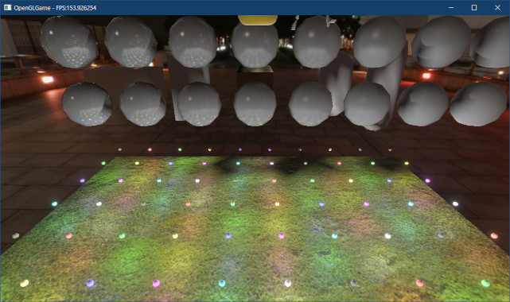
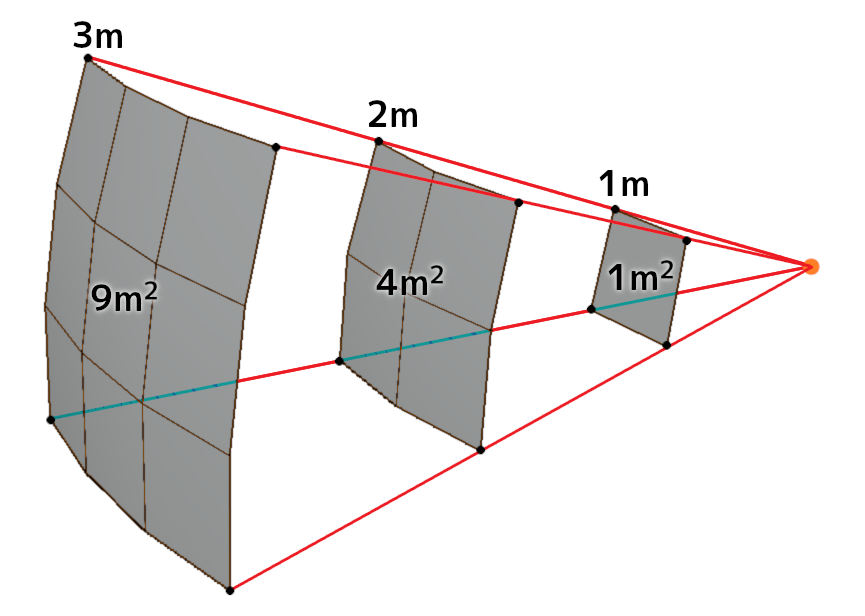

[OpenGL 3D 2023 Tips 第06回]

# より多くのライトを灯すには

## 習得目標

* SSBOの使い方を説明できる。
* ポイントライト(点光源)から放射される光の明るさの減衰について説明できる。

## 1. たくさんのライトを置けるようにする

### 1.1 シェーダー・ストレージ・ブロックを使う意味

<p align="center">
<br>
[多くのライトを表示した画面]
</p>

現実世界の光源は「平行光源」だけではありません。他にもたくさんの光源が存在し、世界を照らしています。電気の通っていない山奥や孤島でもないかぎり、人間の暮らす領域には無数の光源が存在します。

たくさんのライトをシェーダで扱うには、ライトのデータをGPUメモリに転送し、シェーダーから読み込めるようにしなくてはなりません。

現在のシェーダには平行光源がひとつだけ存在しており、そのパラメータはユニフォーム変数として定義されています。ライトを増やすなんて、定義するユニフォーム変数を増やすだけの簡単な仕事に思えます。

残念ながら、これはうまくいきません。なぜなら、シェーダに定義できるユニフォーム変数の数には限界があるからです。

OpenGLの仕様で保証されているユニフォーム変数の数は「1024個」です。結構多いように見えますが、これは`float`換算の数値です。`vec4`換算だと256個になり、`mat4`換算ではわずか64個です。

例えば、点光源は2個の`vec4`で表せます。ユニフォーム変数を全て点光源に割り当てると、合計128個定義できます。しかし、近年のゲームでは数百から数千のライトが使われることもめずらしくありません。

加えて、座標変換行列などのデータも定義しなくてはならないため、実際に使えるのはよくて半分程度でしょう。とても足りているとは言えません。

結局、現代のゲームに必要とされる大量のデータを定義するには、ユニフォーム変数は少なすぎるのです。そこで、より大量のデータを扱える「ユニフォームブロック」と「シェーダストレージブロック」が追加されました。

本テキストではシェーダストレージブロックを使って、大量のライトを表示してみようと思います。

### 1.2 ライトを管理するクラスを作る

現在のプログラムでは、ライトのデータはゲームエンジンが管理しています。これは、平行光源をひとつしか使っていないので、専用の管理機能を作る意義があまりなかったからです。

しかし、SSBOによって大量のライトを扱う場合は話が変わります。SSBOと大量のライトの管理をゲームエンジンが行うと、ゲームエンジンのプログラムがむやみに長くなってしまいます。そこで、ライト管理用のクラスを作成します。

クラス名は`LightBuffer`(ライト・バッファ)とします。`LightBuffer`クラスはライト用のSSBOを管理し、ライトのデータをSSBOにコピーして、グラフィックスパイプラインに割り当てる役割を<ruby>担<rt>にな</rt></ruby>います。

とりあえずファイルを追加して、必要そうなヘッダファイルをインクルードしましょう。プロジェクトの`Src`フォルダに、`LightBuffer.h`という名前のヘッダファイルを追加してください。追加したファイルを開き、次のプログラムを追加してください。

```diff
+/**
+* @file LightBuffer.h
+*/
+#ifndef LIGHTBUFFER_H_INCLUDED
+#define LIGHTBUFFER_H_INCLUDED
+#include "BufferObject.h"
+#include "VecMath.h"
+#include <vector>
+#include <memory>
+
+// 先行宣言
+class LightBuffer;
+using LightBufferPtr = std::shared_ptr<LightBuffer>;
+
+#endif //LIGHTBUFFER_H_INCLUDED
```

>**【インクルードするヘッダファイルについて】**<br>
>ヘッダファイルは必要があるからインクルードしています。たくさんのデータを扱うから`vector`をインクルードする、文字列を使うので`string`をインクルードする、スマートポインタを使いたいので`memory`をインクルードする、といった具合です。見かたを変えると、インクルードされているヘッダファイルを見れば、そのファイルでどんなプログラムが書かれているかをある程度予想できる、ということになります。<br>
>ただし、「必要だと思ってインクルードしたけど結局使わなかった」とか、「最初は必要だったけれど作っていくうちに不要になった」という理由で、もはやインクルードしている意味が失われていることはありえます。不要になったヘッダファイルをインクルードしたままにすると、あとからプログラムを見た時に理解しづらくなってしまいます。不要になったインクルード文は速やかに削除しましょう。

`LightBuffer`クラスには以下の機能を実装します。

* SSBOに送るライトデータを作成する機能。
* 全ライトのデータをSSBOを使ってGPUメモリに転送する機能。
* SSBOをグラフィックスパイプラインに割り当てる機能。

このように、クラスの設計は「目的達成に必要な機能」を考えることから始まります。

>**【最初から完璧なクラスを作るのは難しい】**<br>
>もっとも、あとから必要な機能に気づいたり、作ってはみたものの実際には必要なかった機能が出てくるのは普通のことです。ですから、最初から完璧に作ろうとは考えないでください。作っている過程や、完成したクラスを使っているうちに、徐々に改善していけばよいのです。

それでは、`LightBuffer.h`に次のプログラムを追加してください。

```diff
 // 先行宣言
 class LightBuffer;
 using LightBufferPtr = std::shared_ptr<LightBuffer>;
+
+/**
+* ライトを管理するクラス
+*/
+class LightBuffer
+{
+public:
+  // ライトバッファを作成
+  static LightBufferPtr Create(size_t lightCount) {
+    return std::make_shared<LightBuffer>(lightCount);
+  }
+
+  // コンストラクタ・デストラクタ
+  explicit LightBuffer(size_t lightCount);
+  ~LightBuffer() = default;
+
+  // コピーと代入を禁止
+  LightBuffer(const LightBuffer&) = delete;
+  LightBuffer& operator=(const LightBuffer&) = delete;
+
+  // ライトデータ作成
+  void BeginUpdate(); // 作成開始
+  void AddPointLight(
+    const VecMath::vec3& position, const VecMath::vec3& color);
+  void EndUpdate(); // 作成終了
+  void SwapBuffers();
+
+  // SSBOのバインド
+  void Bind(GLuint index);
+  void Unbind(GLuint index);
+
+private:
+  // シェーダに送るライトデータ
+  struct LightData
+  {
+    VecMath::vec4 position; // 座標(wは未使用)
+    VecMath::vec4 color; // 色と明るさ(wは未使用)
+  };
+  std::vector<LightData> buffer;
+  MappedBufferObjectPtr ssbo;
+  bool isUpdating = false; // ライトデータ作成中はtrue
+};

 #endif // LIGHTBUFFER_H_INCLUDED
```

### 1.3 コンストラクタを定義する

それでは`LightBuffer`クラスのコンストラクタから書いていきましょう。プロジェクトの
`Src`フォルダに`LightBuffer.cpp`というファイルを追加してください。追加したファイルを開き、次のプログラムを追加してください。

```diff
+/**
+* @file LightBuffer.cpp
+*/
+#include "glad/glad.h"
+#include "LightBuffer.h"
+#include "Debug.h"
+
+using namespace VecMath;
+
+/**
+* コンストラクタ
+*
+* @param lightCount 扱えるライトの数
+*/
+LightBuffer::LightBuffer(size_t lightCount)
+{
+  ssbo = MappedBufferObject::Create(
+    lightCount * sizeof(LightData),
+    GL_SHADER_STORAGE_BUFFER, GL_WRITE_ONLY);
+
+  LOG("LightBufferを作成(最大ライト数=%d)", lightCount);
+}
```

`MappedBufferObject`コンストラクタの引数は「SSBOのバイト数」です。`LightBuffer`クラスでは、「ライト数×`LightData`構造体のバイト数」を指定する必要があります。

### 1.4 ライトデータを作成するメンバ関数を定義する

ライトデータをGPUメモリにコピーする場合、ライトをひとつずつコピーするより、全てのライトをまとめてコピーするほうが効率的です。また、コピー元のバッファはコピーが終わったら不要になるため、一時的に作成できれば十分です。

そこで、ライトデータの作成とGPUメモリへのコピーを、以下の3つのメンバ関数で行うようにします。

1. `BeginUpdate`: バッファを確保し、ライトデータの作成を開始。
2. `AddPointLight`: `BeginUpdate`で確保したバッファにライトデータを追加。
3. `EndUpdate`: ライトデータをGPUメモリにコピーし、バッファを解放。

それでは、`BeginUpdate`メンバ関数から定義していきましょう。コンストラクタの定義の下に、次のプログラムを追加してください。

```diff
     lightCount * sizeof(LightData),
     GL_SHADER_STORAGE_BUFFER, GL_WRITE_ONLY);
 }
+
+/**
+* ライトデータの作成を開始
+*/
+void LightBuffer::BeginUpdate()
+{
+  if (isUpdating) {
+    return;
+  }
+  isUpdaring = true;
+
+  buffer.reserve(ssbo->GetSize() / sizeof(LightData));
+}
```

次に、ライトデータを追加するメンバ関数を定義します。`BeginUpdate`メンバ関数の定義の下に、次のプログラムを追加してください。

```diff
   isUpdaring = true;

   buffer.reserve(ssbo->GetSize() / sizeof(LightData));
 }
+
+/**
+* ライトデータを追加
+*
+* @param position ライトの座標
+* @param color    ライトの色および明るさ
+*/
+void LightBuffer::AddPointLight(const vec3& position, const vec3& color)
+{
+  if (isUpdating) {
+    buffer.push_back(
+      LightData{ vec4(position, 0), vec4(color, 0) });
+  }
+}
```

最後に、ライトデータの作成を終了して、ライトデータをGPUメモリにコピーするメンバ関数を定義します。`AddPointLight`メンバ関数の定義の下に、次のプログラムを追加してください。

```diff
+
+/**
+* ライトデータの作成を終了
+*/
+void LightBuffer::EndUpdate()
+{
+  if (isUpdaring) {
+    isUpdaring = false;
+
+    // データをGPUメモリにコピー
+    ssbo->WaitSync();
+    uint8_t* p = ssbo->GetMappedAddress();
+    const int lightCount[4] = { static_csat<int>(buffer.size()) }
+    memcpy(p, buffer.data(), sizeof(lightCount));
+    if ( ! buffer.empty()) {
+      p += sizeof(lightCount);
+      const size_t size = std::min<size_t>(
+        ssbo->GetSize(), buffer.size() * sizeof(LightData));
+      memcpy(p, buffer.data(), size);
+
+      // バッファの容量を最小化
+      buffer.clear();
+      buffer.shrink_to_fit();
+    }
+  } // if isUpdating
+}
```

`push_back`メンバ関数、`resize`メンバ関数、`reserve`メンバ関数などによって確保されたメモリは、`clear`メンバ関数を実行しても開放されません。なぜなら、一度必要とされたメモリはまた必要になる可能性が高いためです。

しかし、「メモリが必要なのはデータ作成からコピーまでの一時的な期間だけ」のような場合、「使わない期間はメモリを開放しておきたい」と考えるのは自然です。このようなときは、
`shrink_to_fit`(シュリンク・トゥ・フィット)メンバ関数を使います。

<p><code class="tnmai_code"><strong>【書式】</strong><br>
void shrink_to_fit();
</code></p>

`shrink_to_fit`メンバ関数は、「`vector`が管理するメモリ領域を、サイズまで切り詰める」という処理を行います。`clear`でサイズを`0`にしてからこの関数を呼び出すことで、メモリ領域を最小サイズに縮小することができます。

### 1.5 SSBOをスワップする関数を定義する

次に、SSBOをスワップするメンバ関数を定義します。`EndUpdate`メンバ関数の定義の下に、次のプログラムを追加してください。

```diff
     }
   } // if isUpdating
 }
+
+/**
+* SSBOをスワップする
+*/
+void LightBuffer::SwapBuffers()
+{
+  ssbo->SwapBuffers();
+}
```

### 1.6 SSBOのバインドを管理するメンバ関数を定義する

SSBOを使うにはSSBOをバインドする必要があります。しかし、`ssbo`メンバ変数はプライベートメンバなので、外部から操作することができません。そこで、`LightBuffer`クラスにSSBOをバインドするメンバ関数を追加します。

`SwapBuffers`メンバ関数の定義の下に、次のプログラムを追加してください。

```diff
   // バッファの容量を最小化
   std::vector<LightData>().swap(buffer);
 }
+
+/**
+* SSBOをバインドする
+*
+* @param index バインディングポイント番号
+*/
+void LightBuffer::Bind(GLuint index)
+{
+  // EndUpdateが呼ばれていない場合への対策(おそらくバグ)
+  if (isUpdating) {
+    LOG_WARNING("EndUpdateが呼ばれていません");
+    EndUpdate();
+  }
+
+  ssbo->Bind(index, 0, ssbo->GetSize());
+}
+
+/**
+* SSBOのバインドを解除する
+*
+* @param index バインディングポイント番号
+*/
+void LightBuffer::Unbind(GLuint index)
+{
+  glBindBufferRange(ssbo->GetType(), index, 0, 0, 0);
+  ssbo->SwapBuffers();
+}
```

これで、`LightBuffer`クラスは完成です。

### 1.7 standard_3D.fragにシェーダーストレージブロックを追加する

続いて、フラグメントシェーダにライトデータを扱うシェーダストレージブロックを追加します。`standard_3D.frag`を開き、次のプログラムを追加してください。

```diff
 // 環境光パラメータ
 layout(location=104) uniform vec3 ambientLight;
+
+// 点光源パラメータ
+struct Light
+{
+  vec4 position; // 座標
+  vec4 color;    // 色および明るさ
+};
+
+// 点光源用SSBO
+layout(std430, binding=1) readonly buffer LightDataBlock
+{
+  int lightCount;
+  int dummy[3];
+  Light lightList[];
+};

 const int sampleCount = 4;
 const vec2 poissonDisk[sampleCount] = {
```

バインディングポイントの番号は`1`にしています。これはglTFのアニメーションを実装している場合、アニメーション用のSSBOが`0`を使用するので、重複しないようにするためです。

シェーダからSSBOへの書き込みを行わない場合、読み取り専用を示す`readonly`(リード・オンリー)修飾子を付けることができます。効果は保証されませんが、多くの場合にシェーダの高速化が期待できます。

### 1.8 シェーダに点光源の処理を追加する

それでは、点光源を処理するプログラムを追加しましょう。それなりに長いコードになるので、関数として定義します。関数名は`ComputePointLight`(コンピュート・ポイント・ライト)とします。

`ComputeWorldNormal`関数の定義の下に、次のプログラムを追加してください。

```diff
      bitangent * normal.y +
      inNormal * normal.z
    );
  }
+
+/**
+* 点光源の明るさを計算
+*
+* @param[in]      normal       フラグメントの法線
+* @param[in]      cameraVector カメラベクトル
+* @param[in, out] diffuse      拡散色の格納先
+* @param[in, out] specular     鏡面反射色の格納先
+*/
+void ComputePointLight(in vec3 normal, in vec3 cameraVector,
+  inout vec3 diffuse, inout vec3 specular)
+{
+  const float specularPower = material.specularFactor.x;
+  vec3 d = vec3(0);
+  vec3 s = vec3(0);
+  for (int i = 0; i < lightCount; ++i) {
+    // フラグメントからライトへ向かうベクトルを計算
+    vec3 lightVector = lightList[i].position.xyz - inPosition;
+    float lengthSq = dot(lightVector, lightVector);
+
+    // 面の傾きによる明るさの変化量を計算
+    float theta = 1;
+    float specularFactor = 1;
+    if (lengthSq > 0) {
+      // ランベルトの余弦則によって拡散反射の明るさを計算
+      vec3 direction = normalize(lightVector);
+      theta = max(dot(normal, direction), 0);
+
+      // 正規化Blinn-Phong法によって鏡面反射の明るさを計算
+      vec3 halfVector = normalize(direction + cameraVector);
+      float dotNH = max(dot(normal, halfVector), 0);
+      specularFactor = pow(dotNH, specularPower);
+    }
+
+    // 変化量をかけ合わせて明るさを求め、ライトの明るさ変数に加算
+    float intensity = 1.0 / (1.0 + lengthSq); // 距離による明るさの減衰
+    vec3 color = lightList[i].color.rgb * theta * intensity; 
+    d += color;
+    s += color * specularFactor;
+  }
+
+  // 全ての光源に共通の乗算を実行
+  const float invPi = 1 / acos(-1); // πの逆数
+  const float normalizeFactor = material.specularFactor.y;
+  diffuse += d * invPi;
+  specular += s * normalizeFactor;
+}

 /**
 * エントリーポイント
```

GLSLにはポインタや参照はありません。そのかわり、引数に`inout`(イン・アウト)または
`out`(アウト)修飾子を点けることで、参照と同様の動作を実現できます。これらの修飾子の効果は次のとおりです。

| 修飾子 | 効果 |
|:------:|:-----|
| `in`   | 関数の開始時に、実引数の値が仮引数にコピーされる。 |
| `out`  | 関数の終了時に、仮引数の値が実引数にコピーされる。 |
| `inout`| 関数の開始時に実引数の値が仮引数にコピーされ、終了時に仮引数の値が実引数にコピーされる(`in`と`out`を合わせた動作)。 |

`ComputePointLight`関数では、`diffuse`(ディフューズ)仮引数と`specular`(スペキュラ)仮引数に`inout`修飾子を指定しています。

`in`修飾子の効果により、`ComputePointLight`関数の実引数に指定された値が、これらの仮引数にコピーされます。関数終了時には`out`修飾子の効果により、`diffuse`と`specular`
の値が呼び出し元の実引数にコピーされます。

結果として、参照によって呼び出し元の値にアクセスしているのと同じ効果が得られます。引数に修飾子が使えることを除けば、GLSLの関数はC言語の関数とほぼ同じです。

さて、このプログラムの大半は、平行光源の明るさの計算と全く同じものです。違いは、光源の方向の計算と、距離による明るさの減衰の計算が追加されている点です。

点光源の明るさは、光源から離れるほど照射範囲が広がるために暗くなります。距離による明るさの減衰は「逆２乗の法則」によって計算できます。上記のプログラムでは`intensity`(インテンシティ)変数が相当します。

<p align="center">
<br>
</p>

次に、この関数を呼び出すプログラムを追加します。`main`関数に次のプログラムを追加してください。

```diff
   float dotNH = max(dot(normal, halfVector), 0);
   vec3 specular = directionalLight.color;
   specular *= normalizeFactor * pow(dotNH, specularPower) * theta;
+
+  // 点光源の明るさを計算
+  ComputePointLight(normal, cameraVector, diffuse, specular);

   // 環境光を計算
   vec3 ambient = outColor.rgb * ambientLight;
```

これでポイントライトの計算が可能になります。残りの作業は`LightBuffer`オブジェクトの追加と、ライトオブジェクトの追加です。

### 1.9 ゲームエンジンにLightBufferオブジェクトを追加する

ようやく部品の準備が整ったので、ゲームエンジンに組み込みましょう。`Engine.h`を開き、
`LightBuffer`クラスの先行宣言を追加してください。

```diff
 using ProgramPipelinePtr = std::shared_ptr<ProgramPipeline>;
 class Texture;
 using TexturePtr = std::shared_ptr<Texture>;
+class LightBuffer;
+using LightBufferPtr = std::shared_ptr<LightBuffer>;
 
 namespace Mesh {
 class PrimitiveBuffer;
```

次に、`Engine`クラスの定義に次のプログラムを追加してください。

```diff
   // スカイボックス用の変数
   TexturePtr texSkybox;
   ProgramPipelinePtr progSkybox;
+
+  static constexpr int lightBindingIndex = 1;
+  LightBufferPtr lightBuffer; // ライト用SSBO管理オブジェクト

   FramebufferObjectPtr fboGameWindow; // ゲームウィンドウ用FBO
```

それでは、`lightBuffer`メンバ変数を初期化しましょう。`Engine.cpp`を開き、
`Initialize`メンバ関数の定義に次のプログラムを追加してください。

```diff
   const size_t maxAnimeMatrixCount = 256; // 1モデルのボーン数
   gltfFileBuffer = Mesh::GltfFileBuffer::Create(10'000'000,
     maxAnimeModelCount * maxAnimeMatrixCount);
+
+  // ライトバッファを作成
+  lightBuffer = LightBuffer::Create(1000);

   // メインカメラを作成
   cameraObject = Create<GameObject>("Main Camera");
```

とりあえす1000個のライトを作成できるようにしてみました。この数値は必要に応じて増減させるとよいでしょう。

次に、ライトバッファを更新する処理を追加します。`UpdateGameObject`メンバ関数の定義に次のプログラムを追加してください。

```diff
     e->Start();
   }

   // Updateイベント
+  lightBuffer->BeginUpdate();
   for (auto e : list) {
     if ( ! e->isDead) {
       e->Update(deltaTime);
     }
   } // for list
+  lightBuffer->EndUpdate();
 }
```

後でライトコンポーネントを作成し、ライトコンポーネントの`Update`メンバ関数の中でライトデータを追加する予定です。

次に、描画処理の前にライト用SSBOをバインドするプログラムを追加します。
`DrawStaticMesh`メンバ関数の定義に次のプログラムを追加してください。

```diff
   glViewport(
     camera.viewport.x, camera.viewport.y,
     camera.viewport.width, camera.viewport.height);
+
+  // ライト用SSBOをバインド
+  lightBuffer->Bind(lightBindingIndex);

   // OBJファイルを描画
   glUseProgram(*progStandard3D);
   setUniform(*progStandard3D);
```

次にバインドを解除するプログラムを追加します。

```diff
   for (const auto& e : rendererList.gltfAnimated) {
     e.renderer->Draw(*progAnimation3D, *e.pModelMatrix);
   }
+
+  // ライト用SSBOのバインドを解除
+  lightBuffer->Unbind(lightBindingIndex);
+  lightBuffer->SwapBuffers();

   glBindTextures(0, 4, nullptr);
   glBindVertexArray(*vao);
```

これで、シェーダからライト用SSBOを参照できるようになりました。

### 1.10 ライトデータを追加する関数を定義する

`lightBuffer`はプライベートメンバ変数なので、外部からライトデータを追加することができません。そこで、ゲームエンジンにライトデータを追加するメンバ関数を宣言します。

`Engine.h`を開き、`Engine`クラスの定義にある「ブルームの強さ」を制御するメンバ関数定義の下に、次のプログラムを追加してください。

```diff
   // ブルームの強さの取得・設定
   float GetBloomStrength() const { return bloomStrength; }
   void SetBloomStrength(float s) { bloomStrength = s; }
+
+  // ライトの操作
+  void AddPointLightData(const VecMath::vec3& position,
+    const VecMath::vec3& color);

   // パーティクルエミッタの操作
   ParticleEmitterPtr AddParticleEmitter(
```

次に`Engine.cpp`を開き、`LoadGltf`または`LoadOBJ`メンバ関数の定義の下に、次のプログラムを追加してください。

```diff
 {
   return gltfFileBuffer->Load(filename);
 }
+
+/**
+* ポイントライトのデータをライトバッファに追加する
+*
+* @param position ライトの座標
+* @param color    ライトの色および明るさ
+*/
+void Engine::AddPointLightData(const vec3& position, const vec3& color)
+{
+  lightBuffer->AddPointLight(position, color);
+}

 /**
 * エミッターを追加する
```

これでゲームエンジンを経由してライトデータを追加できるようになりました。

### 1.11 ライトコンポーネントを作成する

ライトの制御用に「ライトコンポーネント」を作成します。<br>
プロジェクトの`Src/Component`フォルダに`Light.h`という名前のヘッダファイルを追加してください。追加したファイルを開き、次のプログラムを追加してください。

```diff
+/**
+* @file Light.h
+*/
+#ifndef COMPONENT_LIGHT_H_INCLUDED
+#define COMPONENT_LIGHT_H_INCLUDED
+#include "../Component.h"
+#include "../VecMath.h"
+
+/**
+* ライトコンポーネント
+*/
+class Light : public Component
+{
+public:
+  Light() = default;
+  virtual ~Light() = default;
+
+  virtual void Update(GameObject& gameObject, float deltaTime) override;
+
+  VecMath::vec3 color = { 1, 1, 1 }; // ライトの色
+  float intensity = 1; // ライトの明るさ
+};
+
+#endif // COMPONENT_LIGHT_H_INCLUDED
```

ライトの座標にはゲームオブジェクトの座標を使うので、コンポーネントには定義しません。

次にプロジェクトの`Src/Component`フォルダに`Light.cpp`という名前のCPPファイルを追加してください。追加したファイルを開き、次のプログラムを追加してください。

```diff
+/**
+* @file Light.cpp
+*/
+#include "Light.h"
+#include "../GameObject.h"
+#include "../Engine.h"
+
+/**
+* ライトコンポーネントの更新
+*/
+void Light::Update(GameObject& gameObject, float deltaTime)
+{
+  Engine* engine = gameObject.engine;
+
+  // ライトデータを追加
+  engine->AddPointLightData(gameObject.position, color * intensity);
+}
```

これでライトコンポーネントは完成です。

### 1.12 ライトを配置する

それでは、ライトコンポーネントを使ってみましょう。<br>
`MainGameScene.cpp`を開き、`Light.h`をインクルードしてください。

```diff
 * @file MainGameScene.cpp
 */
 #include "MainGameScene.h"
+#include "Component/Light.h"
 #include "Component/MoveController.h"
 #include "Component/MeshRenderer.h"
```

次に`Initialize`メンバ関数の定義に、次のプログラムを追加してください。

```diff
   // カメラに移動制御コンポーネントを追加
   auto cameraObject = engine.GetMainCameraObject();
   cameraObject->AddComponent<MoveController>();
+
+  // ライトコンポーネントの実験
+  for (int i = 0; i < 100; ++i) {
+    // ライトを地面(20x20)に2m間隔で配置
+    auto lightObject = engine.Create<GameObject>("light");
+    lightObject->position = {
+      (i % 10) * 2.0f - 9,
+      1,
+      (i / 10) * 2.0f - 9 };
+
+    // ライトの色を3ビットの組み合わせで選択
+    auto light = lightObject->AddComponent<Light>();
+    light->intensity = 5;
+    light->color = {
+      (i & 0b001) * 0.7f * 1.0f + 0.3f,
+      (i & 0b010) * 0.7f * 0.5f + 0.3f,
+      (i & 0b100) * 0.7f * 0.25f + 0.3f };
+
+    // ライトの位置と色が分かるように球体を配置
+    auto renderer = lightObject->AddComponent<MeshRenderer>();
+    renderer->mesh = engine.LoadOBJ("Sphere");
+    renderer->scale = vec3(0.1f);
+    renderer->materials.push_back(
+      std::make_shared<Mesh::Material>(*renderer->mesh->materials[0]));
+    renderer->materials[0]->baseColor = vec4(light->color * 2, 1);
+  }

   // glTF表示テスト
   auto gltf = engine.Create<GameObject>("glTF Test");
```

プログラムが書けたらビルドして実行してください。地面などのオブジェクトが、さまざまな色のライトで照らされていたら成功です。

<p align="center">
<br>
</p>

このように、SSBOを使うと大量のライトを表示することができます。もちろん、あまり数を増やすと描画速度が低下しますので、やりすぎには注意が必要です。

>**【1章のまとめ】**
>
>* SSBOを利用すると、大量のライトを描画できる。
>* ポイントライト(点光源)から放射される光の明るさは、「逆２乗の法則」によって減衰する。
>* 大量に描画できるからとライトを増やしすぎると、描画に時間がかかるようになるので注意する。
