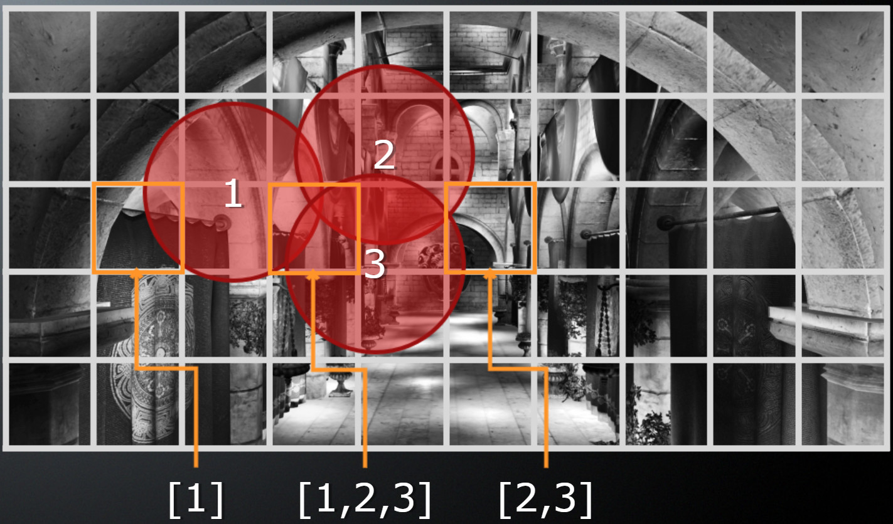
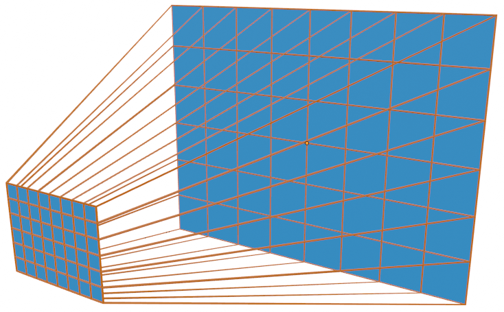
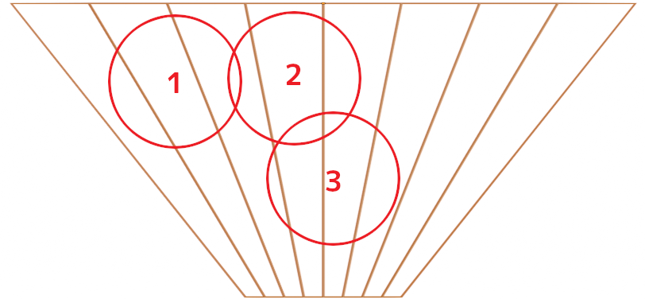
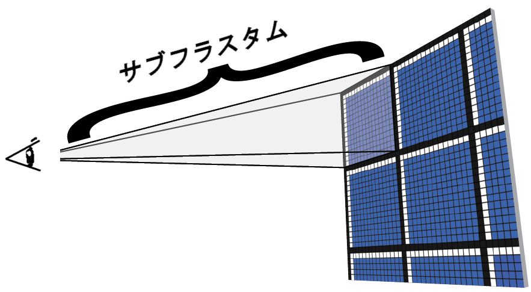
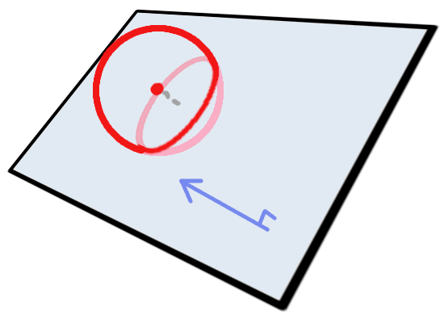
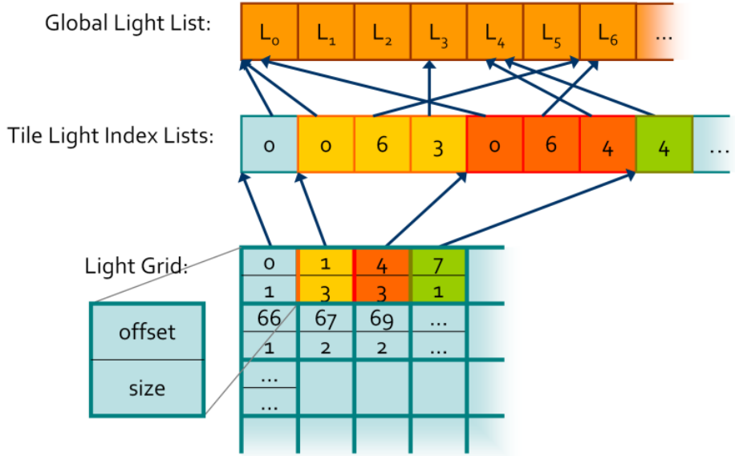
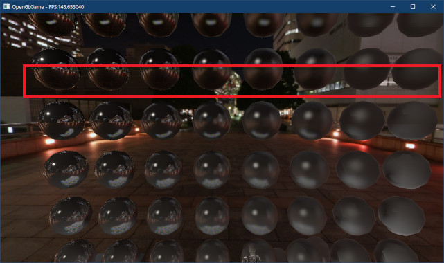
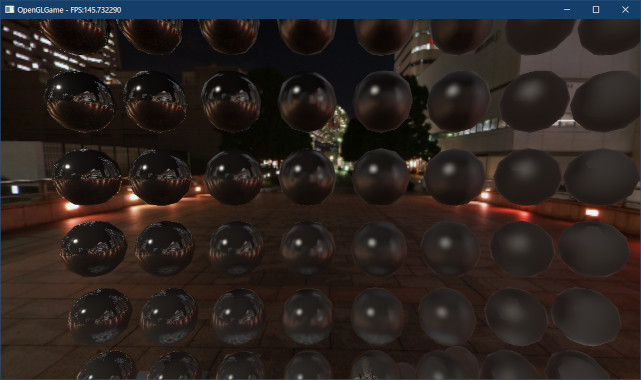
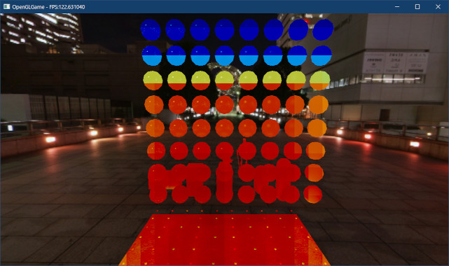

[OpenGL 3D 2023 Tips 第07回]

# タイルベースドレンダリング

## 習得目標

* 「視錐台(しすいだい)」の形状について説明できる。
* 視錐台と球体の交差判定の方法を説明できる。
* 「タイル・ベースド・レンダリング(TBR)」の仕組みと利点について説明できる。
* ライトの影響半径を制限する必要性を説明できる。

## 1. 視錐台の交差判定

### 1.1 全てのライトが見た目に影響するとは限らない

<p align="center">
<br>
https://github.com/GPUOpen-LibrariesAndSDKs/ForwardPlus11
</p>

大量のライトを扱えるようになったのはいいのですが、そのぶん処理に時間がかかるようになりました。フラグメントを1つ描画するのに100個のライトを処理しなくてはならない以上、時間がかかるのは当然のことです。

しかし、ゲーム画面をよく観察してみると、全てのライトが全てのフラグメントに影響しているようには見えません。どちらかというと、近くにあるライト以外は何の影響もないように見えるのではないでしょうか。

その感覚は正しいものです。例えば、夜は星々や月の光が地上を照らしています。しかし昼間は星や月の光を感じることはありません。では、昼は、星や月の光は届いていないのでしょうか？

もちろん、そんなわけはありません。昼間でも間違いなくそれらの光は地上に届いています。しかし、太陽の光が強力すぎるため、人間の目では見分けられないのです。

つまり、「十分に弱い光は存在しないものとみなす」ことができるわけです。そこで、全てのライトに「影響範囲」というパラメータを追加し、フラグメントが範囲外にあるときはそのライトを無視するようにします。

ただ、影響範囲を設定しただけでは少ししか処理時間を減らせません。結局100個のライトについて、フラグメントが範囲内かどうかを調べなくてはならないからです。

こうした問題でよく使われるのは、本節の最初に掲載した画像のように空間を格子状に分割し、分割した小さな空間ごとに処理を分ける方法です。分割した空間に影響しないライトは描画処理から除外されるため、処理時間を減らすことができます。

画面を分割したそれぞれの空間を「タイル」と呼びます。今回は画面を32x18個のタイルに分割し、個々の空間に影響するライトのリストを作ることにします。この分割数は、1920x1080と1280x720のどちらの画面サイズでも等分できる適度な数として選びました。

このように、画面をタイル状に分割して描画を行う技法は、`Tile Based Rendering`(タイル・ベースド・レンダリング), TBRと呼ばれています。

>**【Forward+(フォワード・プラス)について】**<br>
>本テキストの内容は、AMD社が2012年に発表した`Forward+`(フォワード・プラス)と呼ばれる技法を元にしています。ただし、元論文ではGPUのコンピュートシェーダで実行している計算を、CPUで実行するように再構成しています。元論文と実装は以下のURLにあります:<br>
>`https://github.com/GPUOpen-LibrariesAndSDKs/ForwardPlus11`

### 1.2 視錐台を定義する

画面に描画される領域は、カメラから見える範囲が錘台形(すいだいけい)をしていることから「視錐台(しすいだい)」と呼ばれます。今回のプログラムでは視錐台をタイルに分割し、それぞれのタイルについてライトの影響の有無を判定します。

>錐台形はピラミッドの上の部分を水平に切り落としたような図形です。

<p align="center">
&emsp;<br>
[左=タイル化した視錐台&emsp;&emsp;右=タイル化した視錐台を上から見た図]
</p>

ところで、「視錐台をタイル状に分割ししてできる小さな視錐台」では呼びにくいので、今後は「サブ視錐台」と呼ぶことにします。そして、分割前の大きな視錐台は「メイン視錐台」と呼ぶことにします。

ポイントライトの影響範囲を球形とすると、サブ視錐台とライトを表す球が重なっていたら、そのライトはサブ視錐台に影響する可能性があります。

視錐台は6つの平面を組み合わせて作られます。これらは上下左右と前後の平面です。ただし、すべてのサブ視錐台の前後の面は、メイン視錐台の前後の面と同一です。

そのため、サブ視錐台に前後の面を持たせる必要はありません。また、判定をビュー空間で行うようにすれば、前後の平面は視点からの距離だけで判定できます。

これらのことから、上下左右の平面を持つ小さな「サブ視錐台」と、上下左右の平面に加えて前後方向の距離を持ち、全てのサブ視錐台を掌握する「メイン視錐台」の2つがあればよさそうです。

<p align="center">
<br>
https://www.3dgep.com/forward-plus/
</p>

さっそく視錐台を作成しましょう。メイン視錐台の構造体名は`Frusutm`(フラスタム、「視錐台」という意味)。サブ視錐台は`SubFrustum`(サブ・フラスタム)とします。

プロジェクトの`Src`フォルダに`Frustum.h`という名前のヘッダファイルを追加してください。追加したファイルを開き、次のプログラムを追加してください。

```diff
+/**
+* @file Frustum.h
+*/
+#ifndef FRUSTUM_H_INCLUDED
+#define FRUSTUM_H_INCLUDED
+#include "Collision.h"
+#include "VecMath.h"
+#include <memory>
+
+/**
+* 表示するライトを選別するためのサブ視錐台
+*/
+struct SubFrustum
+{
+  Collision::Plane planes[4]; // 0=左 1=右 2=上 3=下
+};
+
+/**
+* 表示するライトを選別するための視錐台
+*/
+struct Frustum
+{
+  // TBR用タイル情報(シェーダ側と一致させること)
+  static constexpr int tileCountX = 32; // 視錐台のX方向の分割数
+  static constexpr int tileCountY = 18; // 視錐台のY方向の分割数
+  static constexpr int lightsPerTile = 256; // 1タイルの想定ライト数
+
+  float zNear;     // メイン視錐台の手前側平面までの距離
+  float zFar;      // メイン視錐台の奥側平面までの距離
+  SubFrustum main; // メイン視錐台の上下左右平面
+  SubFrustum sub[tileCountY][tileCountX]; // サブ視錐台の配列
+};
+using FrustumPtr = std::shared_ptr<Frustum>;
+
+FrustumPtr CreateFrustum(
+  const VecMath::mat4& matInvProj, float zNear, float zFar);
+
+#endif // FRUSTUM_H_INCLUDED
```

>`Collision.h`に球と平面の構造体を定義していない場合は、以下の構造体定義を追加してください。
>
>```c++
>/**
>* 平面
>*/
>struct Plane
>{
>  VecMath::vec3 normal; // 面の法線
>  float d; // 原点からの距離
>};
>
>/**
>* 球体
>*/
>struct Sphere
>{
>  VecMath::vec3 p; // 中心座標
>  float radius;    // 半径
>};
>```

### 1.3 NDC座標をビュー座標に変換する

`CreateFrustum`関数を定義するためのファイルを追加しましょう。プロジェクトの`Src`フォルダに`Frustum.cpp`という名前のCPPファイルを追加してください。追加したファイルを開き、次のプログラムを追加してください。

```diff
+/**
+* @file Frustum.cpp
+*/
+#include "Frustum.h"
+
+using namespace Collision;
+using namespace VecMath;
```

`Frustum`オブジェクトを作成するにはサブフラスタムを作成する必要があります。サブフラスタムへの分割をビュー座標系で行うのは面倒なので、NDC座標系で分割してからビュー座標系に変換する、という手順を踏むことにします。

通常、シェーダではプロジェクション行列を使ってビュー座標系からクリップ座標系へ変換します。その後GPU内部で「`w`要素で除算」が行われ、NDC座標系に変換されます。

これと逆の操作を行えば、NDC座標系からビュー座標系へ変換することができます。手順は「NDC座標にプロジェクション行列の逆行列を掛け、その後`w`要素で除算する」となります。

逆プロジェクション行列を掛けると`w`要素には「クリップ座標系の`w`の逆数」が入るため、実質的に「クリップ座標系の`w`を掛ける」のと同じになるわけです。

それでは関数を定義しましょう。関数名は`NdcToView`(エヌディーシー・トゥ・ビュー)とします。`using`宣言の下に次のプログラムを追加してください。

```diff
 using namespace Collision;
 using namespace VecMath;
+
+/**
+* NDC座標をビュー座標に変換する
+*
+* @param p          NDC座標 
+* @param matInvProj 逆プロジェクション行列
+*
+* @return ビュー座標系に変換したpの座標
+*/
+vec3 NdcToView(const vec3& p, const mat4& matInvProj)
+{
+  const vec4 result = matInvProj * vec4(p, 1);
+  return vec3(result) / result.w;
+}
```

### 1.4 サブフラスタムを作成する

次に、`NdcToView`関数を使ってサブフラスタムを作る関数を書いていきます。関数名は`CreateSubFrustum`(クリエイト・サブフラスタム)でいいでしょう。

スクリーン座標からサブフラスタムを作成するには、逆プロジェクション行列とサブフラスタムの範囲を表す2つのスクリーン座標が必要です。

`Plane`構造体は「法線`normal`と平面までの距離`d`」によって平面を表します。ビュー座標系において視点は常に`(0, 0, 0)`にあります。サブ視錐台を構成する上下左右の平面は必ず視点を通るので、「平面までの距離」は常に`0`です。

法線は「外積」の結果が「2つのベクトルに垂直なベクトル」になる性質から計算できます。例えば左側の平面の場合「視点とサブ視錐台の左下を通るベクトル」と「視点と左上を通るベクトル」の外積が法線になります。

同様に、右の平面の法線は「視点と右上を通るベクトル」と「視点と右下を通るベクトル」の外積になります。それでは`NdcToView`関数の定義の下に、次のプログラムを追加してください。

```diff
   const vec4 result = matInvProj * vec4(p, 1);
   return vec3(result) / result.w;
 }
+
+/**
+* ビュー座標系のサブ視錐台を作成する
+*
+* @param matProj プロジェクション行列
+* @param x0      タイルの左下のX座標
+* @param y0      タイルの左下のY座標
+* @param x1      タイルの右上のX座標
+* @param y1      タイルの右上のY座標
+*
+* @return 作成したサブ視錐台
+*/
+SubFrustum CreateSubFrustum(const mat4& matInvProj,
+  float x0, float y0, float x1, float y1)
+{
+  const vec3 p0 = NdcToView(vec3(x0, y0, 1), matInvProj);
+  const vec3 p1 = NdcToView(vec3(x1, y0, 1), matInvProj);
+  const vec3 p2 = NdcToView(vec3(x1, y1, 1), matInvProj);
+  const vec3 p3 = NdcToView(vec3(x0, y1, 1), matInvProj);
+
+  return SubFrustum{
+    Plane{ normalize(cross(p0, p3)), 0 },
+    Plane{ normalize(cross(p2, p1)), 0 },
+    Plane{ normalize(cross(p3, p2)), 0 },
+    Plane{ normalize(cross(p1, p0)), 0 }
+  };
+}
```

### 1.5 メインフラスタムを作成する

`CreateFrustum`(クリエイト・フラスタム)関数は、引数として通常のプロジェクション行列と、手前及び奥の平面までの距離を受け取り、メインフラスタムとサブフラスタムを計算します。

サブフラスタムは、`CreateSubFrustum`関数を分割領域の数だけループさせて作成します。`CreateSubFrustum`関数の定義の下に、次のプログラムを追加してください。

```diff
     Plane{ normalize(cross(p1, p0)), 0 }
   };
 }
+
+/**
+* ビュー座標系の視錐台を作成する
+*
+* @param matProj プロジェクション行列
+* @param zNear   視点から近クリップ平面までの距離
+* @param zFar    視点から遠クリップ平面までの距離
+*
+* @return 作成した視錐台
+*/
+FrustumPtr CreateFrustum(const mat4& matProj, float zNear, float zFar)
+{
+  FrustumPtr frustum = std::make_shared<Frustum>();
+
+  // 逆プロジェクション行列を計算
+  const mat4& matInvProj = inverse(matProj);
+
+  // メインフラスタムを作成
+  frustum->zNear = -zNear;
+  frustum->zFar = -zFar;
+  frustum->main = CreateSubFrustum(matInvProj, -1, -1, 1, 1);
+
+  // サブフラスタムを作成
+  const vec2 tileCount(Frustum::tileCountX, Frustum::tileCountY);
+  for (int y = 0; y < Frustum::tileCountY; ++y) {
+    for (int x = 0; x < Frustum::tileCountX; ++x) {
+      const vec2 pos(static_cast<float>(x), static_cast<float>(y));
+      const vec2 min = pos / tileCount * 2 - 1;       // 左下の座標
+      const vec2 max = (pos + 1) / tileCount * 2 - 1; // 右上の座標
+      frustum->sub[y][x] =
+        CreateSubFrustum(matInvProj, min.x, min.y, max.x, max.y);
+    }
+  }
+  return frustum;
+}
```

`zNear`と`zFar`の符号を逆にしていることに注意してください。一般に近平面と遠平面の距離には正の値が使われます。しかしOpenGLのビュー座標系では視点の前方は-Z方向なので、座標の比較を簡単にするために負の値にしています。

また、サブフラスタムを計算するにはタイルの左下及び右上のNDC座標が必要となります。メインフラスタムを横に`tileCountX`個、縦に`tileCountY`個のタイルに分割したとき、変数`x`と`y`は分割したタイルの位置を表すインデックスに相当します。

サブフラスタムのNDC座標はこのインデックスから作成します。NDC座標系の範囲は`-1`～`+1`なので、まずインデックスをタイル数で割って`0`～`1`に変換し、次に`2`倍して`1`を引くと、`-1`～`+1`に変換できます。

### 1.6 平面と球の交差判定

視錐台は6つの平面を組み合わせて作られるため、6回の「球と平面の交差判定」で交差を判定できます。

<p align="center">
<br>
</p>

まず交差判定関数を宣言します。さきほどは「球と平面の交差判定」と言いましたが、実際に必要なのは「球が平面のどちら側に存在するか」という判定です。球と平面の判定は以下の手順で行います。

>1. 球の中心座標から平面までの距離を計算する。
>2. 距離が球の半径未満なら交差している。
>3. 距離の値の符号が正なら、球の中心は表側(法線の向いている方向)にある。負なら裏側にある。

関数名は`SphereInsidePlane`(スフィア・インサイド・プレーン、「球は平面の表面側にありますか？」といった意味)としました。`CreateFrustum`関数の定義の下に、次のプログラムを追加してください。

```diff
   }
   return frustum;
 }
+
+/**
+* 球が平面の表側にあるかどうかを調べる
+*
+* @param sphere 球
+* @param plane  平面
+*
+* @retval true  平面の表側にあるか、部分的に重なっている
+* @retval false 完全に裏側にある
+*/
+bool SphereInsidePlane(
+  const Sphere& sphere, const Plane& plane)
+{
+  const float d = dot(plane.normal, sphere.p);
+  return plane.d - d <= sphere.radius;
+}
```

距離を求めるには内積を使います。内積によって中心座標を法線に射影することで、法線方向の原点からの距離`d`が求まります。

この`d`と平面の原点からの距離`plane.d`の差を求め、それが球の半径未満なら、球体は平面と交差している、または表側に存在します。

### 1.7 球とサブフラスタムの交差判定

次は球とサブフラスタムの交差判定を書いていきます。といっても、最も重要な「球と平面の交差判定」はすでに作ってあるので、難しい部分はありません。

球が、サブ視錐台の上下左右すべての面に対して内側に存在する、つまり`SphereInsidePlane`関数が`true`を返すなら交差しています。どれかひとつでも`false`だったら交差していません。

関数名は`SphereInsideSubFrustum`(スフィア・インサイド・サブフラスタム)とします。`SphereInsidePlane`関数の定義の下に次のプログラムを追加してください。

```diff
   const float d = dot(plane.normal, sphere.p);
   return plane.d - d <= sphere.radius;
 }
+
+/**
+* 球とサブ視錐台の交差判定
+*
+* @param sphere  球
+* @param frustum サブ視錐台
+*
+* @retval true  交差している
+* @retval false 交差していない
+*/
+bool SphereInsideSubFrustum(const Sphere& sphere, const SubFrustum& frustum)
+{
+  for (int i = 0; i < 4; ++i) {
+    if ( ! SphereInsidePlane(sphere, frustum.planes[i])) {
+      return false;
+    }
+  }
+  return true;
+}
```

### 1.8 球とメインフラスタムの交差判定

続いて、球とメインフラスタムの交差判定を書いていきます。メインフラスタムでは、まず前後の平面との交差判定を行います。これは、ビュー空間ではZ軸のみの判定になります。

球が前後の平面の内側にあることが分かったら、`SphereInsideSubFrustum`関数を使って上下左右の平面との交差判定を行います。

関数名は`SphereInsideFrustum`(スフィア・インサイド・フラスタム)とします。`SphereInsideSubFrustum`関数の定義の下に次のプログラムを追加してください。

```diff
   }
   return true;
 }
+
+/**
+* 球と視錐台の交差判定
+*
+* @param sphere  球
+* @param frustum 視錐台
+*
+* @retval true  交差している
+* @retval false 交差していない
+*/
+bool SphereInsideFrustum(const Sphere& sphere, const Frustum& frustum)
+{
+  // ニア平面との交差判定
+  if (sphere.p.z - sphere.radius > frustum.zNear) {
+    return false;
+  }
+
+  // ファー平面との交差判定
+  if (sphere.p.z + sphere.radius < frustum.zFar) {
+    return false;
+  }
+
+  // 上下左右の平面との交差判定
+  return SphereInsideSubFrustum(sphere, frustum.main);
+}
```

最後に、これらの関数をヘッダファイルに宣言しましょう。`Frustum.h`を開き、次のプログラムを追加してください。

```diff
 using FrustumPtr = std::shared_ptr<Frustum>;

 FrustumPtr CreateFrustum(const VecMath::mat4& matInvProj, float zNear, float zFar);
+bool SphereInsideFrustum(const Collision::Sphere& sphere, const Frustum& frustum);
+bool SphereInsideSubFrustum(const Collision::Sphere& sphere, const SubFrustum& frustum);

 #endif // FRUSTUM_H_INCLUDED
```

これで、球とメインフラスタム、球とサブフラスタムの交差判定は完成です。

>**【1章のまとめ】**
>
>* 3Dのカメラに映る範囲のことを「視錐台(しすいだい)」という。視錐台は「錘台形(すいだいけい)」という、ピラミッドの上端を水平に切り落としたような図形。
>* 視錐台は6つの平面で構成される。ライトの影響範囲を球体とすると、ライトが視錐台に影響するかどうかは「球体と平面の交差判定」によって調べることができる。
>* 視錐台をビュー座標系で定義することで、Z軸方向の判定を簡単にすることができる。

<div style="page-break-after: always"></div>

## 2. タイル単位のライティング

### 2.1 LightDataBlockにタイルデータを追加する

球とフラスタムの交差判定を行うことで、ライトがどのタイルに影響するかを調べることができます。あとは、影響するライトをSSBOに記録する方法を考えるだけです。これは次のようなデータ構造によって実現できます。

<p align="center">
<br>
https://www.zora.uzh.ch/id/eprint/107598/1/a11-olsson.pdf
</p>

この図には3つの配列があります。それぞれの配列の意味は次のとおりです。

| 配列名 | 説明 |
|:------:|:-----|
| `Global Light List`      | 画面に影響するすべてのライトの配列 |
| `Tile Light Index Lists` | タイルに影響するライトインデックス配列を、隙間なく<br>繋いだ配列 |
| `Light Grid`             | `Tile Light Index Lists`内の、各タイルが使用する<br>領域の始点と数 |

フラグメントシェーダでは次の手順でタイルに影響するライトを取得し、明るさを計算します。

>1. 自分(フラグメント)が属するタイルを求める。
>2. `Light Grid`から`Tile Light Index Lists`内の始点とインデックス数を取得。
>3. 始点とインデックス数を利用して、`Global Light List`からライトデータを取得。
>4. forで範囲内のすべてのライトデータについて明かるさを計算。

まず、3つの配列をフラグメントシェーダの`LightDataBlock`に追加します。ライトのインデックスを格納するメンバの名前は`lightIndices`(ライト・インディシーズ)、ライトの数を格納するメンバの名前は`lightCounts`(ライト・カウンツ)とします。

`standard_3D.frag`を開き、`LightDataBlock`の定義を次のように変更してください。

```diff
   vec4 position; // 座標
   vec4 color;    // 色および明るさ
 };
+
+// TBR用タイル情報(CPP側と数値を一致させること)
+const int tileCountX = 32; // 横のタイル数
+const int tileCountY = 18; // 縦のタイル数
+const int lightsPerTile = 256; // 1タイルの想定ライト数
+const int maxLightIndexCount =
+  tileCountX * tileCountY * lightsPerTile; // 最大ライトインデックス数

 // 点光源用SSBO
 layout(std430, binding=1) readonly buffer LightDataBlock
 {
-  int lightCount;
-  int dummy[3];
+  vec2 tileSize;  // タイルの大きさ
+  float dummy[2]; // 16バイトアラインのためのダミー領域
+
+  // ライトインデックス配列
+  uint lightIndices[maxLightIndexCount];
+
+  // ポイントライト用のライトインデックスの範囲
+  uvec2 lightIndexRanges[tileCountY][tileCountX];
+
+  // ライトデータ配列
   Light lightList[];
 };
```

### 2.2 ComputePointLight関数をタイルに対応させる

次に、追加した配列を使ってライトの明るさを計算します。`ComputePointLight`関数を次のように変更してください。

```diff
   const float specularPower = material.specularFactor.x;
   vec3 d = vec3(0);
   vec3 s = vec3(0);
+  // スクリーン座標からライトインデックスの範囲を取得
+  uvec2 tileId = uvec2(gl_FragCoord.xy * tileSize);
+  uvec2 lightRange = lightIndexRanges[tileId.y][tileId.x];
-  for (int i = 0; i < lightCount; ++i) {
+  for (uint i = lightRange.x; i < lightRange.x + lightRange.y; ++i) {
     // フラグメントからライトへ向かうベクトルを計算
+    uint lightIndex = lightIndices[i];
-    vec3 lightVector = lightList[i].position.xyz - inPosition;
+    vec3 lightVector = lightList[lightIndex].position.xyz - inPosition;
     float lengthSq = dot(lightVector, lightVector);
 
     // 面の傾きによる明るさの変化量を計算
     float theta = 1;
     float specularFactor = 1;
     if (lengthSq > 0) {
       // ランベルトの余弦則によって拡散反射の明るさを計算
       vec3 direction = normalize(lightVector);
       theta = max(dot(normal, direction), 0);
 
       // 正規化Blinn-Phong法によって鏡面反射の明るさを計算
       vec3 halfVector = normalize(direction + cameraVector);
       float dotNH = max(dot(normal, halfVector), 0);
       specularFactor = pow(dotNH, specularPower);
     }
 
     // 変化量をかけ合わせて明るさを求め、ライトの明るさ変数に加算
     float intensity = 1.0 / (1.0 + lengthSq); // 距離による明るさの減衰
-    vec3 color = lightList[i].color.rgb * theta * intensity; 
+    vec3 color = lightList[lightIndex].color.rgb * theta * intensity; 
     d += color;
     s += color * specularFactor;
   }
```

変更部分は、ライトのインデックスとしてfor文の添え字を直接使うのではなく、`lightIndices`内の`lightRange`で指定した範囲から取得したところです。

これによって、常にすべてのライトを計算することなく、タイルに割り当てられたライトだけを計算すれば済みます。タイルにすることによるシェーダの変更は、たったこれだけです。

フラグメントのスクリーン座標は`gl_FragCoord`という変数で取得できます。スクリーン座標をタイルサイズで割れば、フラグメントを含むタイルのインデックスが得られます。除算を避けるため、`tileSize`変数には逆数を代入する予定です。

### 2.3 LightBuffer::EndUpdate関数に引数を追加する

次はゲームエンジンをタイルに対応させます。今回の本命はこちら側です。最初に、`Frustum`型の先行宣言を追加します。`LightBuffer.h`を開き、次のプログラムを追加してください。

```diff
 #include <vector>
 #include <memory>
 
 // 先行宣言
+struct Frustum;
+struct SubFrustum;
 class LightBuffer;
 using LightBufferPtr = std::shared_ptr<LightBuffer>;
```

ライトインデックス配列の作成は、SSBOへデータをコピーする直前に行うことにします。SSBOへのコピーは`EndUpdate`メンバ関数で行っているので、作成機能もこの関数に追加しましょう。

ライトインデックス配列の作成には「フラスタム」、「ビュー行列」、「ウィンドウサイズ」が必要となります。そこで、この3つを`EndUpdate`メンバ関数の引数にします。`EndUpdate`メンバ関数の宣言を次のように変更してください。

```diff
   void BeginUpdate();
   void AddPointLight(
     const VecMath::vec3& position, const VecMath::vec3& color);
-  void EndUpdate();
+  void EndUpdate(const Frustum& frustum,
+    const VecMath::mat4& matView, const VecMath::vec2& windowSize);
   void SwapBuffers();

   // SSBOのバインド
```

次に`LightBuffer.cpp`を開き、`Frustum.h`をインクルードしてください。

```diff
 */
 #include "glad/glad.h"
 #include "LightBuffer.h"
+#include "Frustum.h"
 #include "Debug.h"
 #include <algorithm>
```

続いて、`EndUpdate`メンバ関数の定義を次のように変更してください。

```diff
 /**
 * ライトデータの作成を終了
+*
+* @param frustum    表示範囲を示す視錐台
+* @param matView    ビュー行列
+* @param windowSize 画面の大きさ(ピクセル単位)
 */
-void LightBuffer::EndUpdate()
+void LightBuffer::EndUpdate(const Frustum& frustum
+  const mat4& matView, const vec2& windowize)
 {
   if (isUpdaring) {
```

「ビュー行列」は、ライトの座標をビュー座標系に変換するために使います。「画面の大きさ」はシェーダにコピーする`LightDataBlock`の`tileSize`(タイル・サイズ)を計算するために使います。

引数を変更したので、`EndUpdate`を呼び出しているプログラムも修正しなくてはなりません。まず`Bind`メンバ関数の定義を次のように変更してください。

```diff
   // EndUpdateが呼ばれていない場合への対策(おそらくバグ)
   if (isUpdating) {
     LOG_WARNING("EndUpdateが呼ばれていません");
-    EndUpdate();
   }
 
   ssbo->Bind(index, 0, ssbo->GetSize());
```

`Bind`の引数に視錐台やビュー行列を追加するのは使いにくくなるだけなので、`EndUpdate`呼び出しは削除します。ここで`EndUpdate`を呼び出していたのは、コード中で「`EndUpdate`が呼び出されていない」というバグがあってもプログラムを動作させるためです。

しかし、ここで`EndUpdate`が呼び出された場合、ほぼ間違いなくバグが原因です。ということは、結局はバグ修正が必要なわけで、`EndUpdate`を呼び出さないようにしても大きな問題にはならないと考えられます。

次に`Engine`クラスの`UpdateGameObject`メンバ関数を変更します。`Engine.cpp`を開き、`Frustum.h`をインクルードしてください。

```diff
 #include "GltfMesh.h"
 #include "VertexArray.h"
 #include "LightBuffer.h"
+#include "Frustum.h"
 #include "Component/Camera.h"
 #include "Component/MeshRenderer.h"
```

次に、`UpdateGameObject`メンバ変数の定義を次のように変更してください。

```diff
       e->Update(deltaTime);
     }
   } // for list
+
+  // TBR用のフラスタムを作成
+  const auto& camera = GetMainCamera();
+  const float aspect =
+    static_cast<float>(camera->viewport.width) / camera->viewport.height;
+  const mat4 matProj = mat4::Perspective(
+    radians(camera->fovY), aspect, camera->near, camera->far);
+  const auto frustum = CreateFrustum(matProj, camera->near, camera->far);
+
+  // TBR用のビュー行列を作成(乗算の順序がモデル行列と逆になることに注意)
+  const mat4 matInvRotation =
+    mat4::RotateZ(-cameraObject->rotation.z) *
+    mat4::RotateX(-cameraObject->rotation.x) *
+    mat4::RotateY(-cameraObject->rotation.y);
+  const mat4 matView =
+    matInvRotation * mat4::Translate(-cameraObject->position);
+
+  // ライトデータをGPUメモリにコピー
-  lightBuffer->EndUpdate();
+  lightBuffer->EndUpdate(*frustum, matView, GetWindowSize());
}
```

フラスタムを作成するにはプロジェクション行列が必要となります。プロジェクション行列はパーティクルの描画で使ったのと同じプログラムで作成できます。

さらに、`EndUpdate`メンバ関数にはビュー行列が必要となります。ビュー行列はカメラの回転と平行移動の計算を逆にすることで作成できます。

>「計算を逆にする」というのは「回転と平行移動を負にする」、「行列を掛ける順序を逆にする」の2つによって実現できます。また、`inverse`関数でも作成可能です。

### 2.4 ライトの到達半径を設定する

本来、ライトの光は無限の彼方にまで到達します。しかし、タイルベースドレンダリングではライティングの計算時間を減らすために、意図的に光が到達する半径を制限します。

到達半径を指定できるように、`LightData`構造体と`AddPointLight`メンバ関数に変更を加えます。`LightBuffer.h`を開き、`LightData`構造体の定義を次のように変更してください。

```diff
   // シェーダに送るライトデータ
   struct LightData
   {
-    VecMath::vec4 position; // 座標(wは未使用)
+    VecMath::vec3 position; // 座標
+    float radius;           // 到達半径
     VecMath::vec4 color;    // 色と明るさ(wは未使用)
   };
```

次に、`AddPointLight`メンバ関数の宣言を次のように変更してください。

```diff
   // ライトデータ作成
   void BeginUpdate();
   void AddPointLight(
-    const VecMath::vec3& position, const VecMath::vec3& color);
+    const VecMath::vec3& position, const VecMath::vec3& color, float radius = 0);
   void EndUpdate(const Frustum& frustum,
     const VecMath::mat4& matView, const VecMath::vec2& windowSize);
```

続いて`LightBuffer.cpp`を開き、`AddPointLight`メンバ関数の定義を次のように変更してください。

```diff
 *
 * @param position ライトの座標
 * @param color    ライトの色および明るさ
+* @param radius   ライトの到達半径(0=自動計算)
 */
-void LightBuffer::AddPointLight(const vec3& position, const vec3& color,
+void LightBuffer::AddPointLight(const vec3& position, const vec3& color, float radius)
 {
   if (isUpdating) {
+    // ライトの到達半径を計算
+    if (radius <= 0) {
+      const float K = std::max(color.x, std::max(color.y, color.z));
+      constexpr float Lmin = 0.02f;
+      radius = sqrt(K / Lmin - 1);
+    }
     buffer.push_back(
-      LightData{ vec4(position, 0), vec4(color, 0) });
+      LightData{ position, radius, vec4(color, 0) });
   }
 }
```

ライトの明るさを`K`とすると、光源中心からの距離`D`における明るさ`L`は、`L = K / (1 + D^2)`という式(1)で表せます(フラグメントシェーダを参照)。

この式から光の到達距離を求めるには、まず十分に暗いとみなす明るさ`L(min)`を決めます。そして、`L(min)`を`L`に代入することで`D`について式を解きます。

&emsp;L(min) = K / (1 + D^2)&emsp;&emsp;&emsp;...(1)<br>
&emsp;L(min) * (1 + D^2) = K<br>
&emsp;L(min) + L(min) * D^2 = K<br>
&emsp;L(min) * D^2 = K - L(min)<br>
&emsp;D^2 = (K - L(min)) / L(min)<br>
&emsp;D^2 = K / L(min) - 1<br>
&emsp;D = √(K / L(min) - 1)&emsp;&emsp;&emsp;...(2)<br>

式(2)によって、明るさが`L(min)`になる距離`D`を求めることができます。この`D`がライトの到達半径になります。

次に`Engine.h`を開き、`Engine`クラス定義にある`AddPointLight`メンバ関数の宣言を次のように変更してください。

```diff
   void SetBloomStrength(float s) { bloomStrength = s; }

   // ライトの操作
   void AddPointLightData(const VecMath::vec3& position,
-    const VecMath::vec3& color);
+    const VecMath::vec3& color, float radius = 0);

   // パーティクルエミッタの操作
   ParticleEmitterPtr AddParticleEmitter(
```

続いて`Engine.cpp`を開き、`AddPointLight`メンバ関数の定義を次のように変更してください。

```diff
 * ポイントライトのデータをライトバッファに追加する
 *
 * @param position ライトの座標
 * @param color    ライトの色および明るさ
+* @param radius   ライトの到達半径(0=自動計算)
 */
-void Engine::AddPointLightData(const vec3& position, const vec3& color)
+void Engine::AddPointLightData(const vec3& position, const vec3& color, float radius)
 {
-  lightBuffer->AddPointLight(position, color);
+  lightBuffer->AddPointLight(position, color, radius);
 }

 /**
```

それから、`Light`コンポーネントにも影響半径を追加します。プロジェクトの`Src/Component`フォルダにある`Light.h`を開き、次のプログラムを追加してください。

```diff
   Type type = Type::PointLight; // ライトの種類
   VecMath::vec3 color = { 1, 1, 1 }; // ライトの色
   float intensity = 1; // ライトの明るさ
+  float radius = 0; // 影響半径(0=自動計算)
 };

 #endif // COMPONENT_LIGHT_H_INCLUDED
```

続いて`Light.cpp`を開き、`Update`メンバ関数の定義に次のプログラムを追加してください。

```diff
   Engine* engine = gameObject.engine;

   // ライトデータを追加
-  engine->AddPointLightData(gameObject.position, color * intensity);
+  engine->AddPointLightData(gameObject.position, color * intensity, radius);
 }
```

これで、意図的に影響半径を小さくしたり、大きくすることが可能になりました。例えば、マップのシンボル的な光源は大きく、火花のようにすぐ消えるエフェクトは小さくすることで、描画効率が向上します。

### 2.5 LightDataBlockBuilderクラスを定義する

シェーダの`LightDataBlock`にいくつかのメンバを追加したため、単純に`LigthData`の配列をコピーするだけ、というわけにはいかなくなりました。

そこで、C++プログラム側に`LightDataBlock`と同じメンバを持つ構造体を定義し、GPUに対してこの構造体をコピーするように変更します。構造体名は`LightDataBlock`として、シェーダ側のブロック名と合わせます。

`LightBuffer.cpp`を開き、`VecMath`を`using`宣言するプログラムの下に、次のプログラムを追加してください。

```diff
 #include <algorithm>

 using namespace VecMath;
+
+// 無名名前空間
+namespace /* unnamed */ {
+
+// 最大ライトインデックス数
+constexpr int maxLightIndexCount =
+Frustum::tileCountX * Frustum::tileCountY * Frustum::lightsPerTile;
+
+// タイルのライトインデックス配列の範囲
+struct Range
+{
+  uint32_t begin = 0; // ライトインデックス配列の開始位置
+  uint32_t count = 0; // ライトインデックスの数
+};
+
+// SSBOに設定するライトデータ
+struct LightDataBlock
+{
+  vec2 tileSize;  // タイルの大きさ
+  float dummy[2]; // 16バイトアラインのためのダミー領域
+
+  // ライトインデックス配列
+  uint32_t lightIndices[maxLightIndexCount];
+
+  // ポイントライト用のライトインデックスの範囲
+  Range lightIndexRanges[Frustum::tileCountY][Frustum::tileCountX];
+};
+
+} // unnamed namespace

 /**
 * コンストラクタ
```

`LightDataBlock`構造体はシェーダ側の`LightDataBlock`バッファに対応する構造体です。

`Range`(レンジ)構造体は、シェーダ側の`LightDataBlock`にある`lightIndexRanges`配列の`uvec2`型に相当します。実装詳細を公開する必要はないので、メンバ変数の引数にできるように宣言だけを行っています。

シェーダ側に`Range`型を定義していない理由は、シェーダでは`uint`のような1要素の型を複数使うより、`uvec2`のような2要素以上をまとめたベクトル型のほうが、効率よく処理できるからです。

>**【スカラーとベクトル】**<br>
>`float`や`int`のように、1要素で構成される型のことを「スカラー型」、`vec2`, `vec3`, `vec4`のように2つ以上の要素で構成される型のことを「ベクトル型」といいます。

CPU側ではスカラー型でもベクトル型でも処理能力に違いはないので、コードを読みやすくするために構造体を定義しているわけです。

### 2.6 LightDataBlockBuilderクラスを定義する

`LightDataBlock`構造体にデータを設定するには、ライトをワールド座標系からビュー座標系に変換したり、視錐台との衝突判定を行わなくてはなりません。その過程では、ビュー座標系の衝突判定を作成して管理する必要があります。

そこで、`LightDataBlock`を作成するための補助クラスを定義します。クラス名は`LightDataBlockBuilder`(ライトデータブロック・ビルダー)とします。`LightBuffer.h`を開き、次のプログラムを追加してください。

```diff
   std::vector<LightData> buffer;
   MappedBufferObjectPtr ssbo;
   bool isUpdating = false; // ライトデータ作成中はtrue
+
+  class LightDataBlockBuilder;
+  std::shared_ptr<LightDataBlockBuilder> lightDataBlockBuilder;
 };

 #endif // LIGHTBUFFER_H_INCLUDED
```

続いて、`LightDataBlockBuilder`クラスを定義します。無名名前空間の定義の下に、次のプログラムを追加してください。

```diff
   Range lightIndexRanges[Frustum::tileCountY][Frustum::tileCountX];
 };

 } // unnamed namespace
+
+/**
+* GPUに送るライトインデックス配列を構築するための補助クラス
+*/
+class LightBuffer::LightDataBlockBuilder
+{
+public:
+  // コンストラクタ、デストラクタ
+  explicit LightDataBlockBuilder(size_t maxLightCount) :
+    maxLightCount(maxLightCount)
+  {
+  }
+  ~LightDataBlockBuilder() = default;
+
+  /**
+  * 視錐台に影響しないポイントライタを削除
+  *
+  * @param frustum 視錐台
+  * @param matView ビュー行列
+  */
+  void RemoveIneffectivePointLight(const Frustum& frustum, const mat4& matView)
+  {
+  }
+
+  /**
+  * ポイントライトのライトインデックス配列を構築
+  *
+  * @param frustum 視錐台
+  */
+  void BuildPointLightIndices(const Frustum& frustum)
+  {
+  }
+
+  /**
+  * サブフラスタムと交差するライトをインデックス配列に登録
+  *
+  * @param subFrustum サブ視錐台
+  */
+  void BuildPointLightIndices(const SubFrustum& subFrustum)
+  {
+  }
+
+  /**
+  * ライトデータブロックを構築する
+  *
+  * @param frustum  視錐台
+  * @param matView  ビュー行列
+  * @param tileSize タイルサイズの逆数
+  */
+  void Build(const Frustum& frustum, const mat4& matView,
+    const vec2& tileSize)
+  {
+  }
+
+  /**
+  * ライトデータをGPUメモリにコピー
+  *
+  * @param p コピー先アドレス
+  */
+  void Upload(uint8_t* p)
+  {
+  }
+
+private:
+  LightDataBlock lightDataBlock; // シェーダに送るデータ
+  uint32_t lightIndexCount = 0;  // 現在のライトインデックス数
+  size_t maxLightCount = 0;      // 最大ライト数
+
+  // ビュー座標系に変換したライトの衝突判定
+  std::vector<Collision::Sphere> pointLightColliders;
+};

 /**
 * コンストラクタ
```

`LightDataBlockBuilder`クラスは、ライトインデックス配列の作成とGPUメモリへのコピーを、5つのメンバ関数に分けて行います。各メンバ関数の名前の意味と機能の要約は次のとおりです。

| メンバ関数 | 機能 |
|:----------:|:----|
| `RemoveIneffectivePointLight`<br>(リムーブ・インエフェクティブ・ポイントライト) | 「効果のないライトを除外する」という意味。視錐台の範囲に影響しないライトを除去する。 |
| `BuildPointLightIndices`<br>(ビルド・ポイントライト・インディシーズ) | 「ライトインデックス配列を構築する」という意味。タイルごとのライトインデックス配列を作成する。<br>メインフラスタム用とサブフラスタム用で2種類定義する。 |
| `Build`(ビルド) | 上の3つのメンバ関数を使ってライトインデックス配列を作成する。 |
| `Upload`(アップロード) | `Build`で作成したライトインデックス配列をGPUメモリにコピーする。 |

クラス内で宣言した構造体やクラスは、`::`演算子を使うことで宣言と定義を別々に行うことができます。これによって、宣言だけを公開し、実装は非公開にすることができます。

>**【::演算子(スコープ解決演算子)について】**<br>
>`::`は「スコープ解決演算子」といいます。異なるスコープ(名前空間やクラス)で使用される名前(識別子)を特定し、曖昧さを解消するために使われます。

### 2.7 buffer配列をLightDataBlockBuilderに移動する

ライトインデックス配列を作成するには`LightBuffer`クラスが持つ`buffer`配列の情報が必要です。それならば、`buffer`配列を`LightDataBlockBuilder`クラスに移動して管理を任せてしまったほうが、プログラムが簡単になりそうです。

ということで、`buffer`配列を`LightDataBlockBuilder`クラスに移動させましょう。`LightBuffer.h`を開き、`buffer`配列の定義を切り取ってください。

```diff
     VecMath::vec4 position; // 座標(wは未使用)
     VecMath::vec4 color; // 色と明るさ(wは未使用)
   };
-  std::vector<LightData> buffer;
   MappedBufferObjectPtr ssbo;
   bool isUpdating = false; // ライトデータ作成中はtrue
```

次に`LightBuffer.cpp`を開き、`LightDataBlockBuilder`クラスの定義に貼り付けてください。

```diff
   LightDataBlock lightDataBlock; // シェーダに送るデータ
   uint32_t lightIndexCount = 0;  // 現在のライトインデックス数
   size_t maxLightCount = 0;      // 最大ライト数
+  std::vector<LightData> buffer;
 
   // ビュー座標系に変換したライトの衝突判定
   std::vector<Collision::Sphere> pointLightColliders;
```

それから、ライトデータを設定するためのメンバ関数を定義します。`LightDataBlockBuilder`クラスの定義に次のプログラムを追加してください。

```diff
     maxLightCount(maxLightCount)
   {
   }
   ~LightDataBlockBuilder() = default;
+
+  /**
+  * ポイントライトのデータを追加
+  */
+  void AddPointLight(const LightData& light) { buffer.push_back(light); }

   /**
   * 視錐台に影響しないポイントライタを削除
```

次に、`LightDataBlockBuilder`コンストラクタに`buffer`を初期化するプログラムを追加してください。

```diff
   explicit LightDataBlockBuilder(size_t maxLightCount) :
     maxLightCount(maxLightCount)
   {
+    buffer.reserve(maxLightCount);
   }
   ~LightDataBlockBuilder() = default;
```

続いて、`buffer`配列を移動させたことによるエラーに対処します。まず`BeginUpdate`メンバ関数の定義を次のように変更してください。

```diff
     return;
   }
   isUpdaring = true;
 
-  buffer.reserve(ssbo->GetSize() / sizeof(LightData));
+  // ライトインデックス配列を作成する補助オブジェクトを作成
+  // このオブジェクトはEndUpdateで削除される
+  const size_t maxLightCount =
+    (ssbo->GetSize() - sizeof(LightDataBlock)) / sizeof(LightData);
+  lightDataBlockBuilder =
+    std::make_shared<LightDataBlockBuilder>(maxLightCount);
 }

 /**
 * ライトデータを追加
```

次に、`AddPointLight`メンバ関数の定義を次のように変更してください。

```diff
 void LightBuffer::AddPointLight(const vec3& position, const vec3& color)
 {
   if (isUpdating) {
-    buffer.push_back(
+    lightDataBlockBuilder->AddPointLight(
       LightData{ vec4(position, 0), vec4(color, 0) });
   }
 }
```

最後に、`EndUpdate`メンバ関数の定義を次のように変更してください。

```diff
   if (isUpdaring) {
     isUpdaring = false;
+
+    // GPUメモリに送るデータを構築
+    const vec2 tileSize =
+      vec2(Frustum::tileCountX, Frustum::tileCountY) / windowSize;
+    lightDataBlockBuilder->Build(frustum, matView, tileSize);

     // データをGPUメモリにコピー
     ssbo->WaitSync();
-    uint8_t* p = ssbo->GetMappedAddress();
+    lightDataBlockBuilder->Upload(ssbo->GetMappedAddress());
-    const int lightCount[4] = { static_csat<int>(buffer.size()) }
-    memcpy(p, buffer.data(), sizeof(lightCount));
-    if ( ! buffer.empty()) {
-      p += sizeof(lightCount);
-      const size_t size = std::min<size_t>(
-        ssbo->GetSize(), buffer.size() * sizeof(LightData));
-      memcpy(p, buffer.data(), size);

-      // バッファの容量を最小化
-      buffer.clear();
-      buffer.shrink_to_fit();
-    }
+
+    // ライトデータ構築用オブジェクトを削除
+    lightDataBlockBuilder.reset();
   } // if isUpdating
 }
```

`tileSize`(タイル・サイズ)は、フラグメントの座標をタイルのインデックスに変換するために使います。タイルのインデックスは次の式で求められます。

&emsp;タイルインデックス = フラグメントの座標 / ウィンドウサイズ * タイル数

この式の後半部分を次のように変形します。

&emsp;タイルインデックス
&emsp;&emsp; = フラグメントの座標 * (1 / ウィンドウサイズ) * タイル数<br>
&emsp;&emsp; = フラグメントの座標 * (タイル数 / ウィンドウサイズ)<br>

`(タイル数 / ウィンドウサイズ)`をGPUメモリの`tileSize`変数にコピーし、フラグメントシェーダでは`tileSize`を掛けてタイルインデックスを計算します。

これで、`buffer`配列を使っていた部分をすべて`LightDataBlockBuilder`クラスで置き換えることができました。

### 2.8 bufferという名前を改良する

`buffer`配列にはライトデータが格納されるわけですが、`buffer`という名前からはいまいち想像がつきません。そこで、より適切な名前に改名することにします。新しい名前は`pointLigts`(ポイントライツ)とします。

`pointLigts`という名前からは「ポイントライト(点光源)」であること、末尾に付けた複数形を意味する`s`から「配列」であることが分かるため、`buffer`よりも優れていると言えます。

それでは、`LigthDataBlockBuilder`クラスの定義を次のように変更してください。

```diff
   LightDataBlock lightDataBlock; // シェーダに送るデータ
   uint32_t lightIndexCount = 0;  // 現在のライトインデックス数
   size_t maxLightCount = 0;      // 最大ライト数
-  std::vector<LightData> buffer;
+  std::vector<LightData> pointLigts; // ポイントライト配列
 
   // ビュー座標系に変換したライトの衝突判定
   std::vector<Collision::Sphere> pointLightColliders;
```

次に`AddPointLight`メンバ関数の定義を次のように変更してください。

```diff
   /**
   * ポイントライトのデータを追加
   */
-  void AddPointLight(const LightData& light) { buffer.push_back(light); }
+  void AddPointLight(const LightData& light) { pointLights.push_back(light); }

   /**
   * 視錐台に影響しないポイントライトを削除
```

少しですが、以前よりコードの意味が明確になりました。より良いコードを作るには、こうした小さな改良の積み重ねが大切です。

### 2.9 RemoveIneffectivePointLight関数を定義する

この時点でビルドエラーはないはずですが、`LightDataBlockBuilder`クラスが未完成なので正しい描画はできません。`LightDataBlockBuilder`のメンバ関数の中身を書いて、プログラムを完成させましょう。

まずは`RemoveIneffectivePointLight`メンバ関数を定義します。このメンバ関数は、「ポイントライトがメインフラスタムと交差しているかどうか」、言い換えると「画面に影響するライトかどうか」を調べ、影響しないライトを除去します。

この処理によって、GPUに転送するライトデータを減らせます。`RemoveIneffectivePointLight`メンバ関数の定義に、次のプログラムを追加してください。

```diff
   */
   void RemoveIneffectivePointLight(const Frustum& frustum, const mat4& matView)
   {
+    std::vector<LightData> lightInFrustum;
+    lightInFrustum.reserve(pointLights.size());
+    pointLightColliders.reserve(pointLights.size());
+
+    // メインフラスタムと交差しているライトだけをピックアップ
+    for (uint32_t i = 0; i < pointLights.size(); ++i) {
+      // ライトの座標をビュー座標系に変換
+      const LightData& e = pointLights[i];
+      const vec3 pos = vec3(matView * vec4(e.position, 1));
+
+      // ライトの影響範囲とメインフラスタムの交差判定を行う
+      const Collision::Sphere s = { pos, e.radius };
+      if (SphereInsideFrustum(s, frustum)) {
+        // 交差しているのでライトを登録
+        lightInFrustum.push_back(e);
+        pointLightColliders.push_back(s);
+      }
+    }
+
+    // ライトデータを入れ替える
+    pointLights.swap(lightInFrustum);
   }

   /**
   * 視錐台に影響しないスポットライトを削除
```

このプログラムでは`SphereInsideFrustum`関数によって、ライトの影響半径とフラスタムの交差判定を行い、交差しているライトだけを`lightInFrustum`(ライト・イン・フラスタム)配列に追加します。

そして、関数の最後で`buffer`と`lightInFrustum`を入れ替えることで、`buffer`から「フラスタムに影響しないライト」を除去しています。

ビュー行列はライトの座標を変換するために使います。フラスタムはビュー空間で定義されているので、ライトの座標もビュー座標系でなくては正しい判定が行えないからです。

また、ビュー座標系のライト座標は次に作成する`BuildLightDataBlock`メンバ関数でも必要なので、引数で受け取ったオブジェクトに格納しています。

### 2.10 BuildLightDataBlock関数を定義する

続いて、`BuildPointLightIndices`メンバ関数を定義します。`RemoveIneffectivePointLight`メンバ関数の定義の下に、次のプログラムを追加してください。

```diff
   */
   void BuildPointLightIndices(const Frustum& frustum)
   {
+    // すべてのサブフラスタムについてループ
+    // NOTE: 高速化を目指す場合、サブフラスタムごとにスレッド化するとよい
+    for (int y = 0; y < Frustum::tileCountY; ++y) {
+      for (int x = 0; x < Frustum::tileCountX; ++x) {
+        // ライトインデックス配列の位置を範囲の先頭として設定
+        Range& range = lightDataBlock.lightIndexRanges[y][x];
+        range.begin = lightIndexCount;
+
+        // サブフラスタムと交差するライトをインデックス配列に登録
+        BuildPointLightIndices(frustum.sub[y][x]);
+
+        // ライトインデックス数を設定
+        range.count = lightIndexCount - range.begin;
+
+        // 容量不足なら構築を終了する
+        if (lightIndexCount >= maxLightIndexCount) {
+          return; // 容量不足
+        }
+      } // for x
+    } // for y
   }

   /**
   * サブフラスタムと交差するライトをインデックス配列に登録
```

`Range`構造体に設定している値に注意してください、`lightIndexCount`変数は「現在のライトインデックス配列の要素数」を表します。

`BuildLightIndices`関数を実行すると、タイルに影響するライトのインデックス数だけ`lightIndexCount`が増加します。つまり、関数実行前後の`lightIndexCount`の差が、タイルのライトインデックス数になるわけです。

また、このプログラムはすべてのタイルを処理するために2重ループになっています。フラスタムを細かく分割し、タイル数を増やすほどシェーダの効率は向上しますが、分割しすぎるとこの部分のループ回数が増え、CPU側の効率が低下します。

そのため、分割数は多すぎず少なすぎずというバランスが大切になります。

### 2.11 BuildLightIndices関数を定義する

次にサブフラスタム用の`BuildPointLightIndices`メンバ関数を定義します。この関数は、あるタイルのサブフラスタムと全てのライトの交差判定を行い、タイルに影響するライトのインデックスをライトインデックス配列に記録します。

`BuildLightDataBlock`メンバ関数の定義の下に、次のプログラムを追加してください。

```diff
   */
   void BuildPointLightIndices(const SubFrustum& subFrustum)
   {
+    // すべてのライトについてループ
+    for (uint32_t i = 0; i < pointLights.size(); ++i) {
+      // ライトの影響範囲とサブフラスタムの交差判定を行う
+      if (SphereInsideSubFrustum(pointLightColliders[i], subFrustum)) {
+        // ライトインデックス配列にインデックスを記録
+        lightDataBlock.lightIndices[lightIndexCount] = i;
+        ++lightIndexCount;
+
+        // 容量不足なら構築を終了する
+        if (lightIndexCount >= maxLightIndexCount) {
+          LOG_WARNING("ライトインデックス配列が不足しています(サイズ=%d)",
+            maxLightIndexCount);
+          break;
+        }
+      }
+    } // for i
   }

   /**
   * スポットライトのライトインデックス配列を構築する
```

### 2.12 Build関数を定義する

ここまでに作成したメンバ関数を使って`Build`メンバ関数を完成させます。`Build`メンバ関数の定義に次のプログラムを追加してください。

```diff
   void Build(const Frustum& frustum, const mat4& matView,
     const vec2& tileSize)
   {
+    // タイルサイズの逆数を設定
+    lightDataBlock.tileSize = tileSize;
+
+    // 視錐台に影響するポイントライトを選別し、タイルに配置
+    RemoveIneffectivePointLight(frustum, matView);
+    BuildPointLightIndices(frustum);
   }

   /**
   * ライトデータをGPUメモリにコピー
```

### 2.13 Upload関数を定義する

最後に、`Upload`メンバ関数を定義します。この関数は、作成したライトインデックス配列とライトデータをGPUメモリにコピーします。`Upload`メンバ関数の定義に次のプログラムを追加してください。

```diff
   */
   void Upload(uint8_t* p)
   {
+    // ライトインデックス配列をコピー
+    memcpy(p, &lightDataBlock, sizeof(LightDataBlock));
+    p += sizeof(LightDataBlock);
+
+    // ポイントライトのデータをコピー
+    if ( ! pointLights.empty()) {
+      const size_t count = std::min(maxLightCount, pointLights.size());
+      memcpy(p, pointLights.data(), count * sizeof(LightData));
+      p += count * sizeof(LightData);
+    }
   }

 private:
```

これで、タイルに影響するライトの情報がSSBOにコピーされるようになりました。

プログラムが書けたらビルドして実行してください。見た目の変化はありませんが、処理速度は向上しているはずです。

### 2.14 ライトの範囲を制限する

カメラを動かしたときに気づいたかもしれませんが、前節で「見た目の変化はない」と書いたのは嘘です。実際には鏡面反射に大きな影響が出ています。カメラの向きや位置によって、ライトの鏡面反射が描画されたりされなかったりするはずです。

<p align="center">
<br>
[赤枠内の鏡面反射が消えている]
</p>

これは、鏡面反射が「かなり遠くの光源からの光でも強い反射を起こす」ためです(入射光の大半を同じ方向に反射するため)。

この性質があるため、距離が離れているオブジェクトが偶然サブフラスタム内に存在する場合のみ、鏡面反射が発生してライトが描画されます。そして、オブジェクトがサブフラスタムから外れるとライトは描画されなくなります。

つまり、現在のライトの影響半径の計算式は、実際には拡散反射にしか有効ではないのです。かといって、鏡面反射に対応できるように影響半径を広げると、事実上タイルベースドレンダリングが無意味になってしまいます。

そこで、影響範囲の境界において鏡面反射の明るさが0になるように、反射光の明るさを徐々に減衰させることにします。これは物理的には完全な嘘っぱちですが、遠距離からの鏡面反射の有無がゲームプレイに影響することはあまり考えられません。

実際に、現代のほぼすべてのゲームエンジンでも鏡面反射の距離は制限されています。それでは、`standard_3D.frag`を開き、ComputePointLight`関数の定義に次のプログラムを追加してください。

```diff
       vec3 halfVector = normalize(direction + cameraVector);
       float dotNH = max(dot(normal, halfVector), 0);
       specularFactor = pow(dotNH, specularPower);
+
+      // 影響半径境界に近づくにつれて、光の影響が0になるようにする
+      const float radius = lightList[lightIndex].position.w;
+      const float smoothFactor = clamp(1 - pow(sqrt(lengthSq) / radius, 4), 0, 1);
+      theta *= smoothFactor * smoothFactor;
     }

     // 変化量をかけ合わせて明るさを求め、ライトの明るさ変数に加算
```

このプログラムの計算式は`Unreal Engine 4`で用いられているものです。物理的な根拠はありませんが、できるだけ不自然にならないように徐々に明るさを減衰しつつ、かつ比較的計算が単純であることから選ばれたようです。

>式については以下のURLを参照:<br>
>`https://blog.selfshadow.com/publications/s2013-shading-course/karis/s2013_pbs_epic_notes_v2.pdf`

プログラムが書けたらビルドして実行してください。カメラを動かしたとき、鏡面反射が出たり消えたりしなくなっていれば成功です。

<p align="center">
<br>
[全体的に鏡面反射が弱くなっている]
</p>

### 2.15 タイルごとのライト数を確認する

処理速度が向上したと言われても、見た目ではあまり違いが分からないかもしれません。そこで、シェーダに手を加えて「タイルごとのライト数を視覚化」してみましょう。

`standard_3D.frag`を開き、次のプログラムを追加してください。

```diff
   ambient += specularAmbient * specularRatio;

   outColor.rgb = (diffuse + specular) * shadow + ambient;
+
+#if 1
+  // jetカラーマップによってライト数を表示
+  uvec2 tileId = uvec2(gl_FragCoord.xy * tileSize);
+  uvec2 range = lightIndexRanges[tileId.y][tileId.x];
+  float level = min(float(range.y) / 100, 1);
+  vec3 jet = vec3(
+    level < 0.7 ? 4 * level - 1.5 : 4.5 - level * 4,
+    level < 0.5 ? 4 * level - 0.5 : 3.5 - level * 4,
+    level < 0.3 ? 4 * level + 0.5 : 2.5 - level * 4);
+  outColor.rgb = mix(outColor.rgb, jet, 0.5);
+#endif
 }
```

「jet(ジェット)カラーマップ」は画像化された情報を視覚化する手法の一つです。jetカラーマップによって、0～1の値を色のグラデーションとして表示できます。

>上記のコードは以下のURLにある`glsl/MATLAB_jet.frag`を参照しました<br>
>`https://github.com/kbinani/colormap-shaders`

プログラムが書けたらビルドして実行してください。タイルごとに青、緑、黄、赤のグラデーションが表示されていたら成功です。

ライト数が少ないタイルは青で表示され、ライト数が増えるにつれて水色、緑、黄色、赤、暗赤色と変化します。暗青色のタイルには5個未満のライトが、暗赤色のタイルには100個前後のライトが影響していることになります。

<p align="center">

</p>

<pre class="tnmai_assignment">
<strong>【課題01】</strong>
<code>MainGameScene.cpp</code>で作成している<code>Light</code>コンポーネントの<code>intensity</code>メンバ変数の値を3や10に変更して、カラーマップがどのように変化するかを確認しなさい。
</pre>

<pre class="tnmai_assignment">
<strong>【課題02】</strong>
インテンシティを5に戻し、<code>Light</code>コンポーネントの<code>radius</code>メンバ変数に10や100といった値を指定して、カラーマップがどのように変化するかを確認しなさい。
</pre>

<pre class="tnmai_assignment">
<strong>【課題03】</strong>
インテンシティと影響半径を元に戻し、jetカラーマップを作成するプログラムの<code>#if 1</code>の部分を<code>#if 0</code>にして、jetカラーマップを非表示にしなさい。
</pre>

>**【2章のまとめ】**<br>
>
>* 画面を小さなタイル状の領域に分割して描画することを「タイル・ベースド・レンダリング(TBR)」という。
>* タイルは3D空間では錘台形(フラスタム)になる。
>* 個々のライトが目に見える影響を及ぼす半径には限界があるため、タイル単位でライトを選択することでライティングの計算量を減らすことができる。
>* 分割数が少なすぎるとタイルのライト数が増加するためTBRの恩恵が少なくなる。逆に多すぎるとタイルの計算に時間がかかり、やはりTBRの恩恵が少なくなる。TBRを最大限に活かすには、適切な分割数を選択する必要がある。
>* 各タイルの状態を視覚的に調べるには「カラーマップ」を使う。なお、このような強度を視覚的に表す手法は「ヒート・マップ」と呼ばれる。
