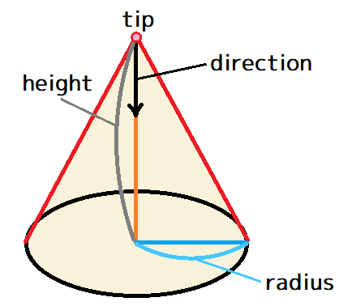
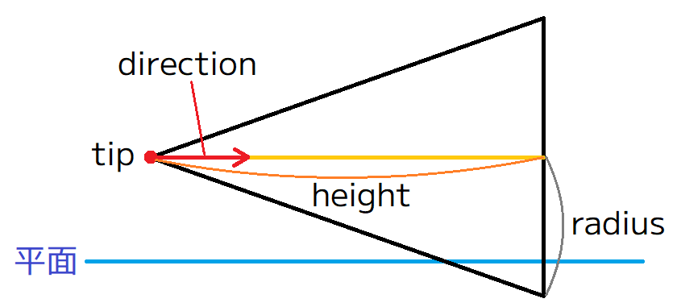
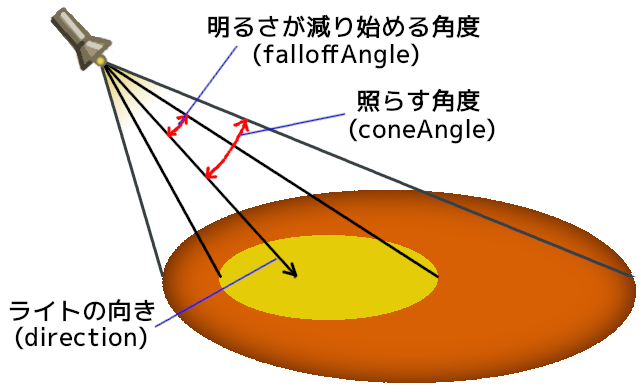
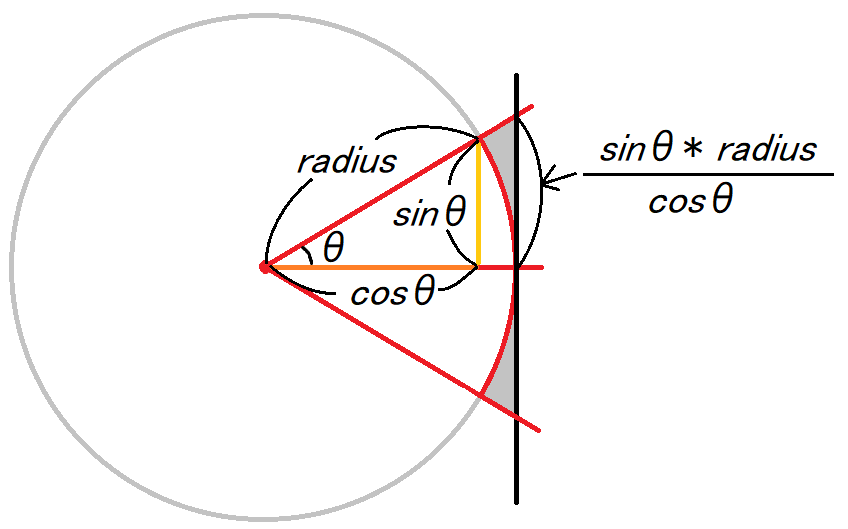
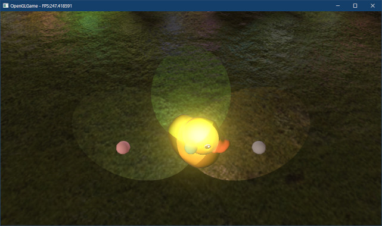
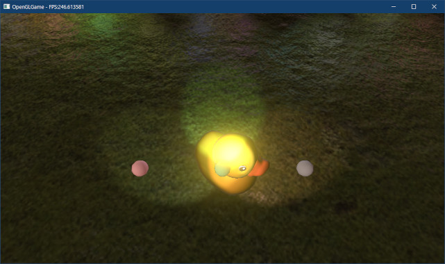

[OpenGL 3D 2020 第23回]

# スポットライトと円錐

## 習得目標

* 円錐と視錐台の交差判定
* GPUメモリに転送するデータを`vec4`にまとめる方法
* スポットライトの使い方

## 1. 円錐と視錐台の交差判定

### 1.1 スポットライトと円錐

ポイントライト(点光源)を使うと、電球やろうそく、松明といった光源を表現することができます。しかし、現実世界の光源を見渡してみると、一部もしくは大部分がシェードなどで隠された、純粋な点光源ではないものが多いことに気づくでしょう。

例えば、懐中電灯や自動車のヘッドライトは正面の狭い範囲にだけ光が当たるようになっています。街灯の上側は覆いがかぶせられ、道路だけを照らすようになっています。

このような「光の一部分が<ruby>覆<rt>おお</rt></ruby>い隠されている光源」を「スポットライト」と言います。コンピューター・グラフィックスで現実のような光を表現するために、スポットライトはポイントライト以上に重要です。

角度によりますが、スポットライトの形状は「円錐(えんすい)」にかなり近い形状をしています。そのため、フラスタムとスポットライトの交差判定は、フラスタムと円錐の交差判定として実装することができます。

まずは「円錐」の構造体を定義しましょう。円錐は「先端座標`tip`(ティップ)」、「円錐の高さ`height`(ハイト)」、「円錐の向き`direction`(ディレクション)」、「底面の半径`radius`(レイディアス)」によって定義できます。

<p align="center">
<br>
</p>

これらをまとめて構造体にしていきます。円錐は英語で`Cone`(コーン)というので、構造体名は`Cone`とします。円錐と平面の交差判定を行う関数は`ConeInsidePlane`(コーン・インサイド・プレーン)としましょう。

`Collision.h`を開き、`Sphere`構造体の定義の下に次のプログラムを追加してください

```diff
   VecMath::vec3 p;
   float radius;
 };
+
+/**
+* 円錐
+*/
+struct Cone
+{
+  VecMath::vec3 tip;       // 先端の座標
+  float height;            // 円錐の高さ
+  VecMath::vec3 direction; // 円錐の向き
+  float radius;            // 底面の半径
+};

 /**
 * 有向境界ボックス(OBB)
```

次に`Frustum.h`を開き、次の関数宣言を追加してください。

```diff
 FrustumPtr CreateFrustum(const VecMath::mat4& matInvProj, float zNear, float zFar);
 bool SphereInsideFrustum(const Collision::Sphere& sphere, const Frustum& frustum);
 bool SphereInsideSubFrustum(const Collision::Sphere& sphere, const SubFrustum& frustum);
+bool ConeInsideFrustum(const Collision::Cone& cone, const Frustum& frustum);
+bool ConeInsideSubFrustum(const Collision::Cone& cone, const SubFrustum& frustum);

 #endif // FRUSTUM_H_INCLUDED
```

### 1.3 ConeInsidePlane関数を定義する

<p align="center">
<br>
</p>

それでは、円錐と平面の交差判定を定義しましょう。幸いなことに、これは以下の2つの判定を行うだけです。

>1. 円錐の頂点が平面の表側にあれば、円錐は平面の表側に存在する。
>2. 頂点が平面の裏側にあるとき、平面から円錐底部の中心までの距離が、底部の半径のマイナス値より大きければ、円錐は平面の表側に存在する.

`1`は球体と平面の交差判定と同じです。`2`について計算するには「底面から平面へ最短距離で向かうベクトル」を求めます。これには以下のように、外積の結果が「2つのベクトルに垂直なベクトルになる」という性質を利用します。

>1. 円錐の向きベクトルと平面の法線ベクトルの外積を計算 → 向きベクトルに垂直で平面と平行なベクトルが求まる。
>2. 向きベクトルと1で求めたベクトルの外積を計算 → 最短距離で向かうベクトルが求まる。

`Frustum.cpp`を開き、`SphereInsideFrustum`関数の定義の下に、次のプログラムを追加してください。

```diff
   }
   return SphereInsideSubFrustum(sphere, frustum.main);
 }
+
+/**
+* 円錐が平面の表側にあるかどうかを調べる
+*
+* @param cone   円錐
+* @param plane  平面
+*
+* @retval true  平面の表側にあるか、部分的に重なっている
+* @retval false 完全に裏側にある
+*/
+bool ConeInsidePlane(const Cone& cone, const Plane& plane)
+{
+  // 円錐の頂点が平面の表側にあれば判定終了
+  if (dot(plane.normal, cone.tip) - plane.d >= 0) {
+    return true; // 表側にある
+  }
+
+  // 平面の法線と円錐の向きに垂直なベクトルaを求める
+  // これは平面と平行なベクトルになる
+  const vec3 a = cross(plane.normal, cone.direction);
+
+  // 円錐の向きとベクトルaに垂直なベクトルbを求める
+  // これは底面と平行で、底面の中心から平面への最短の向きベクトルになる
+  const vec3 b = normalize(cross(cone.direction, a));
+
+  // ベクトルbの方向の底面の端の座標pを求める
+  const vec3 p = cone.tip + cone.direction * cone.height + b * cone.radius;
+
+  // 座標pをの平面の法線方向に射影した長さが0以上なら、pは表側にある
+  return dot(plane.normal, p) - plane.d >= 0;
+}
```

### 1.4 円錐と視錐台の交差判定を作成する

続いて、本命の円錐と視錐台の交差判定を書いていきます。といっても、基本的な作りは球と視錐台の交差判定と同じで、使う関数が違うだけです。

まずはサブフラスタムとの交差判定を書きましょう。関数名は`ConeInsideSubFrustum`(コーン・インサイド・サブフラスタム)とします。`ConeInsidePlane`関数の定義の下に、次のプログラムを追加してください。

```diff
   // 座標qをの平面の法線方向に射影した長さが0以上なら、qは表側にある
   return dot(plane.normal, q) - plane.d >= 0;
 }
+
+/**
+* 円錐とサブ視錐台の交差判定
+*
+* @param cone    円錐
+* @param frustum サブ視錐台
+*
+* @retval true  衝突している
+* @retval false 衝突していない
+*/
+bool ConeInsideSubFrustum(const Cone& cone, const SubFrustum& frustum)
+{
+  for (const auto& plane : frustum.planes) {
+    if (!ConeInsidePlane(cone, plane)) {
+      return false;
+    }
+  } // for plane
+  return true;
+}
```

サブフラスタムを構成する全ての平面との交差判定を行い、全てに合格したら交差しています。この流れは`SpehreInsideSubFrustum`関数とまったく同じです。

続いて、メインフラスタムとの交差判定を作成します。関数名は`ConeInsideFrustum`(コーン・インサイド・フラスタム)とします。`ConeInsideSubFrustum`関数の定義の下に、次のプログラムを追加してください。

```diff
   } // for plane
   return true;
 }
+
+/**
+* 円錐と視錐台の交差判定
+*
+* @param cone    円錐
+* @param frustum 視錐台
+*
+* @retval true  衝突している
+* @retval false 衝突していない
+*/
+bool ConeInsideFrustum(const Cone& cone, const Frustum& frustum)
+{
+  // ニア平面との交差判定
+  if (!ConeInsidePlane(cone, Plane{ vec3(0, 0, -1), frustum.zNear })) {
+    return false;
+  }
+
+  // ファー平面との交差判定
+  if (!ConeInsidePlane(cone, Plane{ vec3(0, 0, 1), frustum.zFar })) {
+    return false;
+  }
+
+  // 上下左右の平面との交差判定
+  return ConeInsideSubFrustum(cone, frustum.main);
+}
```

この関数も`SphereInsideFrustum`関数と見比べてみてください。関数や引数の名前が違うだけで、やっていることはまったく同じだということが分かります。なぜなら、どちらも「全ての平面と交差判定を行い、全て合格したら交差している」という仕組みを使うからです。

これで円錐と視錐台の交差判定は完成です。

## 2. スポットライト

### 2.1 シェーダにスポットライト用のデータを追加する

スポットライトを扱えるように、シェーダの`Light`構造体を変更します。スポットライトの底面は実際には球面なので、円錐とは微妙に形状が異なります。そのため、底面の半径のかわりに、円錐の頂点部分の角度を使用します。

<p align="center">
<br>
</p>

スポットライトは、ポイントライトに「ライトの向き」と照射範囲を表す「最大照射角」を追加することで表現できます。

さらに、多くのスポットライトは<ruby>外縁部<rt>がいえんぶ</rt></ruby>にいくほど光が弱くなる傾向があります。そこで、「減衰開始角(明るさが減り始める角度)」も追加することにします。

`standard_3D.frag`を開き、`Light`構造体の定義を次のように変更してください。

```diff
 // 環境光パラメータ
 layout(location=104) uniform vec3 ambientLight;

-// 点光源パラメータ
+// 光源パラメータ
 struct Light
 {
-  vec4 position; // 座標
-  vec4 color;    // 色および明るさ
+  // xyz=座標, w=影響半径
+  vec4 positionAndRadius;
+
+  // xyz=色および明るさ, w=スポットライトの最大照射角
+  vec4 colorAndConeAngle;
+
+  // xyz=スポットライトの向き, w=スポットライトの減衰開始角
+  vec4 directionAndFalloffAngle;
 };

 // TBR用タイル情報
```

シェーダで扱うデータは、できるだけ`vec4`型にまとめたほうがメモリ効率が良くなります。そこで、XYZ要素しか使っていない変数のW要素にスポットライト用のパラメータを埋め込みます。

ただ、何を埋め込んだののか分からないと困るので、変数名に埋め込んだデータ名を追加し、さらにコメントで各要素に格納されるデータを説明しています。

`coneAngle`(コーン・アングル)は最大照射角、`falloffAngle`(フォールオフ・アングル)は減衰開始角を示します(前図を参照)。

<pre class="tnmai_assignment">
<strong>【課題01】</strong>
<code>Light</code>構造体のメンバ変数名を変更したことで、<code>ComputePointLight</code>関数がコンパイルできなくなっています。コンパイルが成功するように変数名を変更しなさい。
</pre>

次に、`LightDataBlock`に「スポットライト用のライトインデックス配列」を追加してください。

```diff
 const int maxLightIndexCount =
   tileCountX * tileCountY * lightsPerTile; // 最大ライトインデックス数

-// 点光源用SSBO
+// ライト用SSBO
 layout(std430, binding=1) readonly buffer LightDataBlock
 {
   vec2 tileSize;  // タイルの大きさ
   float dummy[2]; // 16バイトアラインのためのダミー領域

   // ライトインデックス配列
   uint lightIndices[maxLightIndexCount];

   // ポイントライト用のライトインデックスの範囲
   uvec2 lightIndexRanges[tileCountY][tileCountX];
+
+  // スポットライト用のライトインデックスの範囲
+  uvec2 spotLightIndexRanges[tileCountY][tileCountX];

   // ライトデータ配列
   Light lightList[];
```

`spotLightIndexRanges`(スポットライト・インデックス・レンジズ)配列は、スポットライト用の「ライトインデックス配列の範囲」を示します。スポットライト用である、という点を除けば、役割はポイントライト用の`lightIndexRanges`配列と同じです。

### 2.2 スポットライトの明るさを計算する関数を定義する

データを定義したので、次はスポットライトの明るさを計算します。スポットライトといっても、座標や距離による減衰などの基本的な計算はポイントライトと全く同じです。違いは「照射範囲を考慮するかどうか」だけです。

そのため、スポットライト用の関数は、ポイントライト用の関数をコピーして作るのが簡単です。`ComputePointLight`関数をまるごとコピーし、`ComputePointLight`関数の定義の下に貼り付けてください。

```diff
   diffuse += d * invPi;
   specular += s * normalizeFactor;
 }
+
+/**
+* 点光源の明るさを計算
+*
+* @param[in]      normal       フラグメントの法線
+* @param[in]      cameraVector カメラベクトル
+* @param[in, out] diffuse      拡散色の格納先
+* @param[in, out] specular     鏡面反射色の格納先
+*/
+void ComputePointLight(in vec3 normal, in vec3 cameraVector,
+  inout vec3 diffuse, inout vec3 specular)
+{
+        ・
+        ・
+      (省略)
+        ・
+        ・
+  // 全ての光源に共通の乗算を実行
+  const float invPi = 1 / acos(-1); // πの逆数
+  const float normalizeFactor = material.specularFactor.y;
+  diffuse += d * invPi;
+  specular += s * normalizeFactor;
+}

 /**
 * エントリーポイント
```

それでは、コピーした関数をスポットライト用に変更していきましょうまずは関数名を`ComputeSpotLight`(コンピュート・スポットライト)に変更してください。

```diff
 /**
-* 点光源の明るさを計算
+* スポットライトの明るさを計算
 *
 * @param[in]      normal       フラグメントの法線
 * @param[in]      cameraVector カメラベクトル
 * @param[in, out] diffuse      拡散色の格納先
 * @param[in, out] specular     鏡面反射色の格納先
 */
-void ComputePointLight(in vec3 normal, in vec3 cameraVector,
+void ComputeSpotLight(in vec3 normal, in vec3 cameraVector,
   inout vec3 diffuse, inout vec3 specular)
 {
   const float specularPower = material.specularFactor.x;
```

次に利用するライトインデックス範囲を変更します。範囲を取得するプログラムを次のように変更してください。

```diff
   vec3 s = vec3(0);

   // スクリーン座標からライトインデックスの範囲を取得
   uvec2 tileId = uvec2(gl_FragCoord.xy * tileSize);
-  uvec2 lightRange = lightIndexRanges[tileId.y][tileId.x];
+  uvec2 lightRange = spotLightIndexRanges[tileId.y][tileId.x];
   for (uint i = lightRange.x; i < lightRange.x + lightRange.y; ++i)
   {
```


続いて、スポットライトの照射範囲の影響を計算します。これは、「スポットライトの方向ベクトル」と「スポットライトからフラグメントへ向かうベクトル」のなす角を求め、`coneAngle`変数の値と比較するだけです。

拡散反射の明るさを計算するプログラムの下に、次のプログラムを追加してください。

```diff
       // ランベルトの余弦則によって拡散反射の明るさを計算
       vec3 direction = normalize(lightVector);
       theta = max(dot(normal, direction), 0);
+
+      // スポットライトの場合、円錐の外周部の減衰を計算する
+      // ライトからフラグメントへ向かうベクトルと、スポットライトのベクトルのなす角が
+      // ライトが照らす角度以上なら範囲外
+      vec3 lightDirection = lightList[lightIndex].directionAndFalloffAngle.xyz;
+      float coneAngle = lightList[lightIndex].colorAndConeAngle.w;
+      float angle = acos(dot(lightDirection, -direction));
+      if (angle >= coneAngle) {
+        continue; // 照射範囲外
+      }
 
       // 正規化Blinn-Phong法によって鏡面反射の明るさを計算
       vec3 halfVector = normalize(direction + cameraVector);
```

スポットライトの場合、最大照射角を超えると明るさが0になります。明るさが0になる場合、以後の計算を続ける必要はないので`continue`して次のライトの計算に進みます。

続いて、`main`関数から`ComputeSpotLight`関数を呼び出します。`ComputePointLight`関数呼び出しの下に、`ComputeSpotLight`関数呼び出しを追加してください。

```diff
   float dotNH = max(dot(normal, halfVector), 0);
   vec3 specular = directionalLight.color;
   specular *= normalizeFactor * pow(dotNH, specularPower) * theta;

-  // 点光源の明るさを計算
+  // ライトの明るさを計算
   ComputePointLight(normal, cameraVector, diffuse, specular);
+  ComputeSpotLight(normal, cameraVector, diffuse, specular);

   // 環境光を計算
   vec3 ambient = outColor.rgb * ambientLight;
```

これで、シェーダがスポットライトを扱えるようになりました。

### 2.3 LightDataBlock構造体にスポットライトのパラメータを追加する

次は、CPPプログラムの`LightData`構造体と`LightDataBlock`構造体にスポットライトのパラメータを追加します。`LightBuffer.h`を開き、`LightData`構造体の定義を次のように変更してください。

```diff
   struct LightData
   {
     VecMath::vec3 position; // 座標
     float radius;           // ライトの半径
-    VecMath::vec4 color;    // 色と明るさ(wは未使用)
+    VecMath::vec3 color;    // 色と明るさ
+    float coneAngle;        // スポットライトが照らす角度
+    VecMath::vec3 direction;// 光を放つ方向
+    float falloffAngle;     // スポットライトの減衰開始角度
   };
   MappedBufferObjectPtr ssbo;
```

次に`LightBuffer.cpp`を開き、`LightDataBlock`構造体の定義に次のプログラムを追加してください。

```diff
   uint32_t lightIndices[maxLightIndexCount];

   // ポイントライト用のライトインデックスの範囲
   Range lightIndexRanges[Frustum::tileCountY][Frustum::tileCountX];
+
+  // スポットライト用のライトインデックスの範囲
+  Range spotlightIndexRanges[Frustum::tileCountY][Frustum::tileCountX];
 };

 } // unnamed namespace
```

### 2.4 LightDataBlockBuilderクラスにスポットライトを扱う変数を追加する

ライトインデックス配列を扱う`LightDataBlockBuilder`クラスも、スポットライトに対応させなくてはなりません。まずメンバ変数を追加します。`LightDataBlockBuilder`クラスの定義に次のプログラムを追加してください。

```diff
   uint32_t lightIndexCount = 0;  // ライトインデックス数
   size_t maxLightCount = 0;      // 最大ライト数
   std::vector<LightData> pointLights; // ポイントライト配列
+  std::vector<LightData> spotLights;  // スポットライト配列

   // ビュー座標系に変換したライトの衝突判定
   std::vector<Collision::Sphere> pointLightColliders;
+  std::vector<Collision::Cone> spotLightColliders;
 };
```

次に、追加した`spotLights`(スポットライツ)配列を初期化します。`LightDataBlockBuilder`コンストラクタに次のプログラムを追加してください。

```diff
   explicit LightDataBlockBuilder(size_t maxLightCount) :
     maxLightCount(maxLightCount)
   {
     pointLights.reserve(maxLightCount);
+    spotLights.reserve(maxLightCount);
   }
   ~LightDataBlockBuilder() = default;
```

それから、スポットライトデータを追加するメンバ関数を定義します。、`AddPointLight`メンバ関数の定義の下に、次のプログラムを追加してください。

```diff
   * ポイントライトのデータを追加
   */
   void AddPointLight(const LightData& light) { pointLights.push_back(light); }
+
+  /**
+  * スポットライトのデータを追加
+  */
+  void AddSpotLight(const LightData& light) { spotLights.push_back(light); }

   /**
   * 視錐台に影響しないポイントライトを削除
```

### 2.5 視錐台に影響しないスポットライトを除去する関数を定義する

続いて、スポットライト用のライトインデックス配列を作成するメンバ関数を定義します。まず「メインフラスタムに影響しないライトを除外する関数」を定義しましょう。

ポイントライトにおいて`pointLights`配列全体をループ処理したのと同様に、スポットライトでは`spotLights`配列全体をループ処理します。基本部分はポイントライトと同じなので、コピー&ペーストで作成しましょう。

`RemoveIneffectivePointLight`メンバ関数の定義をコピーし、`RemoveIneffectivePointLight`メンバ関数の定義の下に貼り付けてください。

```diff
     // ライトデータを入れ替える
     pointLights.swap(lightInFrustum);
   }
+
+  /**
+  * 視錐台に影響しないポイントライトを削除
+  *
+  * @param frustum 視錐台
+  * @param matView ビュー行列
+  */
+  void RemoveIneffectivePointLight(const Frustum& frustum, const mat4& matView)
+  {
+    std::vector<LightData> lightInFrustum;
+    lightInFrustum.reserve(pointLights.size());
+    pointLightColliders.reserve(pointLights.size());
+        ・
+        ・
+      (省略)
+        ・
+        ・
+    // ライトデータを入れ替える
+    pointLights.swap(lightInFrustum);
+  }

  /**
  * ポイントライトのライトインデックス配列を構築
```

とりあえず説明文と名前をスポットライトに変更します。

```diff
     // ライトデータを入れ替える
     pointLights.swap(lightInFrustum);
   }

   /**
-  * 視錐台に影響しないポイントライトを削除
+  * 視錐台に影響しないスポットライトを削除
   *
   * @param frustum 視錐台
   * @param matView ビュー行列
   */
-  void RemoveIneffectivePointLight(const Frustum& frustum, const mat4& matView)
+  void RemoveIneffectiveSpotLight(const Frustum& frustum, const mat4& matView)
   {
     std::vector<LightData> lightInFrustum;
```

次に使用しているメンバ変数を変更します。`pointLights`を`spotLights`に、`pointLightColliders`を`spotLightColliders`に変更してください。

```diff
   void RemoveIneffectiveSpotLight(const Frustum& frustum, const mat4& matView)
   {
     std::vector<LightData> lightInFrustum;
-    lightInFrustum.reserve(pointLights.size());
-    pointLightColliders.reserve(pointLights.size());
+    lightInFrustum.reserve(spotLights.size());
+    spotLightColliders.reserve(spotLights.size());
 
     // メインフラスタムと交差しているライトだけをピックアップ
-    for (uint32_t i = 0; i < pointLights.size(); ++i) {
+    for (uint32_t i = 0; i < spotLights.size(); ++i) {
       // ライトの座標をビュー座標系に変換
-      const LightData& e = pointLights[i];
+      const LightData& e = spotLights[i];
       const vec3 pos = vec3(matView * vec4(e.position, 1));
 
       // ライトの影響範囲とメインフラスタムの交差判定を行う
       const Collision::Sphere s = { pos, e.radius };
       if (SphereInsideFrustum(s, frustum)) {
         // 交差しているのでライトを登録
         lightInFrustum.push_back(e);
-        pointLightColliders.push_back(s);
+        spotLightColliders.push_back(s);
       }
     }
 
     // ライトデータを入れ替える
-    pointLights.swap(lightInFrustum);
+    spotLights.swap(lightInFrustum);
   }
```

この時点では、`spotLightColliders.push_back`の引数型が合わないためエラーになります。次はこのエラーを修正します。

`LightDataBlockBuilder`クラスにおいて、ポイントライトとスポットライトの最大の違いは交差判定です。スポットライトの交差判定は、スポットライトを円錐に近似することで行うのでした。

ワールド座標系のスポットライトデータから、ビュー座標系の円数を作成する手順は次のとおりです。

1. ビュー行列を使って、ワールド座標系のライトの位置と向きをビュー座標系に変換。
2. ライトの「影響半径」と「最大照射角」から円錐の底面の半径を計算。
3. 1と2で求めた値から`Cone`(円錐)を作成し、視錐台と交差判定を行う。

それでは1の「ビュー座標系への変換」からやっていきましょう。ライト座標は球と同じなので、向きの変換を追加するだけです。`RemoveIneffectiveSpotLight`メンバ関数の定義を、次のように変更してください。

```diff
     std::vector<LightData> lightInFrustum;
     lightInFrustum.reserve(spotLights.size());
     spotLightColliders.reserve(spotLights.size());
+
+    // スポットライトの向きをビュー座標系に変換するための回転行列を作る
+    const mat3 matViewRotation = transpose(inverse(mat3(matView)));
 
     // 視錐台に影響するライトを計算
     for (int i = 0; i < spotLights.size(); ++i) {
-      // ライトの座標をビュー座標系に変換
+      // ライトの座標と向きをビュー座標系に変換
       const LightData& e = spotLights[i];
       const vec3 pos = vec3(matView * vec4(e.position, 1));
+      const vec3 dir = matViewRotation * e.direction;

       // ライトの影響範囲とメインフラスタムの交差判定を行う
       const Collision::Sphere s = { pos, e.radius };
```

次に2の「円錐の底面の半径」を計算します。「円錐の底面の半径」は、スポットライトの影響半径と最大照射角から次の図のようにして求められます。

&emsp;radius: スポットライトの影響半径<br>
&emsp;θ: スポットライトの最大照射角<br>

<p align="center">
<br>
</p>

上記の式からは、`θ`が大きい場合に底面の半径が非常に長くなることが予想されます。その結果、円錐とスポットライト形状は<ruby>著<rt>いちじる</rt></ruby>しく異なってしまいます。

目安は、最大照射角`θ`を45度以下にすることです。最大照射角が45度を超えるスポットライトは円錐では近似できません。

それでは、ライトの座標と向きをビュー座標系に変換するプログラムの下に、次のプログラムを追加してください。

```diff
       const LightData& e = spotLights[i];
       const vec3 pos = vec3(matView * vec4(e.position, 1));
       const vec3 dir = matViewRot * e.direction;
+
+      // 影響半径と最大照射角から円錐底面の半径を計算
+      const float radius =
+        std::sin(e.coneAngle) * e.radius / std::cos(e.coneAngle);

       // ライトの影響範囲とメインフラスタムの交差判定を行う
       const Collision::Sphere s = { pos, e.radius };
```

これで、円錐の定義に必要な値はすべて揃いました。円錐を定義し、`spotLightColliders.push_back`のエラーを解決しましょう。メインフラスタムの交差判定を行うプログラムを、次のように変更してください。

```diff
       const float radius =
         std::sin(e.coneAngle) * e.radius / std::cos(e.coneAngle);

       // ライトの影響範囲とメインフラスタムの交差判定を行う
-      const Collision::Sphere s = { pos, e.radius };
-      if (SphereInsideFrustum(s, frustum)) {
+      const Collision::Cone cone = { pos, e.radius, dir, radius };
+      if (ConeInsideFrustum(cone, frustum)) {
         // 交差しているのでライトを登録
         lightInFrustum.push_back(e);
-        spotLightColliders.push_back(s);
+        spotLightColliders.push_back(cone);
       }
     }
```

これで、スポットライトから作成した円錐とメインフラスタムの交差判定が行えるようになりました。

### 2.6 スポットライトのライトインデックス配列を作成する関数を定義する(その1)

続いて、「スポットライトのライトインデックス配列を作成するメンバ関数」を定義します。これも、ポイントライト用のメンバ関数をコピー＆ペーストして作成します。

`SubFrustum`を引数に取る`BuildPointLightIndices`メンバ関数をコピーし、コピー元の関数の下に貼り付けてください。

```diff
       }
     } // for i
   }
+
+  /**
+  * サブフラスタムと交差するライトをインデックス配列に登録
+  *
+  * @param subFrustum サブ視錐台
+  */
+  void BuildPointLightIndices(const SubFrustum& subFrustum)
+  {
+    // すべてのライトについてループ
+    for (uint32_t i = 0; i < pointLights.size(); ++i) {
+      // ライトの影響範囲とサブフラスタムの交差判定を行う
+      if (SphereInsideSubFrustum(pointLightColliders[i], subFrustum)) {
+        // ライトインデックス配列にインデックスを記録
+        lightDataBlock.lightIndices[lightIndexCount] = i;
+        ++lightIndexCount;
+
+        // 容量不足なら構築を終了する
+        if (lightIndexCount >= maxLightIndexCount) {
+          LOG_WARNING("ライトインデックス配列が不足しています(サイズ=%d)",
+            maxLightIndexCount);
+          break;
+        }
+      }
+    } // for i
+  }

   /**
   * ライトデータブロックを構築する
```

コピーした関数の名前と、使用する変数を書き換えます。貼り付けたプログラムを次のように変更してください。

```diff
     } // for i
   }

   /**
-  * サブフラスタムと交差するライトをインデックス配列に登録
+  * サブフラスタムと交差するスポットライトをインデックス配列に登録
   *
   * @param subFrustum サブ視錐台
   */
-  void BuildPointLightIndices(const SubFrustum& subFrustum)
+  void BuildSpotLightIndices(const SubFrustum& subFrustum)
   {
     // すべてのライトについてループ
-    for (uint32_t i = 0; i < pointLights.size(); ++i) {
+    for (uint32_t i = 0; i < spotLights.size(); ++i) {
       // ライトの影響範囲とサブフラスタムの交差判定を行う
-      if (SphereInsideSubFrustum(pointLightColliders[i], subFrustum)) {
+      if (ConeInsideSubFrustum(spotLightColliders[i], subFrustum)) {
         // ライトインデックス配列にインデックスを記録
         lightDataBlock.lightIndices[lightIndexCount] = i;
```

ところで、シェーダの`lightList`配列にはポイントライトのデータが送られています。スポットライトのデータは、ポイントライトの後に追加する予定です。

そうすると、スポットライトのライトインデックスは`0`からではなく、「ポイントライトの数」から始まらなくてはつじつまが合いません。

そこで、`BuildSpotLightIndices`の引数にインデックスの補正値を追加します。`BuildSpotLightIndices`メンバ関数の定義を次のように変更してください。

```diff
   * サブフラスタムと交差するスポットライトをインデックス配列に登録
   *
   * @param subFrustum サブ視錐台
+  * @param offset     インデックスに加算する補正値
   */
-  void BuildSpotLightIndices(const SubFrustum& subFrustum)
+  void BuildSpotLightIndices(const SubFrustum& subFrustum, uint32_t offset)
   {
     // すべてのライトについてループ
     for (uint32_t i = 0; i < spotLights.size(); ++i) {
       // ライトの影響範囲とサブフラスタムの交差判定を行う
       if (ConeInsideSubFrustum(spotLightColliders[i], subFrustum)) {
         // ライトインデックス配列にインデックスを記録
-        lightDataBlock.lightIndices[lightIndexCount] = i;
+        lightDataBlock.lightIndices[lightIndexCount] = i + offset;
         ++lightIndexCount;
 
         // 容量不足なら構築を終了する
```

これで、正しいライトインデックスを指定できるようになりました。

### 2.7 スポットライトのライトインデックス配列を作成する関数を定義する(その2)

引き続き、「スポットライトのライトインデックス配列を作成するメンバ関数」を定義します。次はメインフラスタムとの交差判定です。

`Frustum`を引数に取る`BuildPointLightIndices`メンバ関数をコピーし、コピー元の関数の下に貼り付けてください。

```diff
       } // for x
     } // for y
   }
+
+  /**
+  * ポイントライトのライトインデックス配列を構築
+  *
+  * @param frustum 視錐台
+  */
+  void BuildPointLightIndices(const Frustum& frustum)
+  {
+    // すべてのサブフラスタムについてループ
+    for (int y = 0; y < Frustum::tileCountY; ++y) {
+      for (int x = 0; x < Frustum::tileCountX; ++x) {
+        // ライトインデックス配列の位置を範囲の先頭として設定
+        Range& range = lightDataBlock.lightIndexRanges[y][x];
+        range.begin = lightIndexCount;
+
+        // サブフラスタムと交差するライトをインデックス配列に登録
+        BuildPointLightIndices(frustum.sub[y][x]);
+
+        // ライトインデックス数を設定
+        range.count = lightIndexCount - range.begin;
+
+        // 容量不足なら構築を終了する
+        if (lightIndexCount >= maxLightIndexCount) {
+          return; // 容量不足
+        }
+      } // for x
+    } // for y
+  }
```

コピーした関数の名前と、使用する変数を書き換えます。貼り付けたプログラムを次のように変更してください。

```diff
   /**
-  * ポイントライトのライトインデックス配列を構築
+  * スポットライトのライトインデックス配列を構築
   *
   * @param frustum 視錐台
   */
-  void BuildPointLightIndices(const Frustum& frustum)
+  void BuildSpotLightIndices(const Frustum& frustum)
   {
     // すべてのサブフラスタムについてループ
     for (int y = 0; y < Frustum::tileCountY; ++y) {
       for (int x = 0; x < Frustum::tileCountX; ++x) {
         // ライトインデックス配列の位置を範囲の先頭として設定
-        Range& range = lightDataBlock.lightIndexRanges[y][x];
+        Range& range = lightDataBlock.spotLightIndexRanges[y][x];
         range.begin = lightIndexCount;
 
         // サブフラスタムと交差するライトをインデックス配列に登録
-        BuildPointLightIndices(frustum.sub[y][x]);
+        BuildSpotLightIndices(frustum.sub[y][x]);
 
         // ライトインデックス数を設定
         range.count = lightIndexCount - range.begin;
```

次に、サブフラスタムに指定するオフセットを引数で受け取るようにします。`BuildSotLightIndices`メンバ関数の定義を次のように変更してください。

```diff
   * スポットライトのライトインデックス配列を構築
   *
   * @param frustum 視錐台
+  * @param offset     インデックスに加算する補正値
   */
-  void BuildSpotLightIndices(const Frustum& frustum)
+  void BuildSpotLightIndices(const Frustum& frustum, uint32_t offset)
   {
     // すべてのサブフラスタムについてループ
     for (int y = 0; y < Frustum::tileCountY; ++y) {
       for (int x = 0; x < Frustum::tileCountX; ++x) {
         // ライトインデックス配列の位置を範囲の先頭として設定
         Range& range = lightDataBlock.spotLightIndexRanges[y][x];
         range.begin = lightIndexCount;
 
         // サブフラスタムと交差するライトをインデックス配列に登録
-        BuildSpotLightIndices(frustum.sub[y][x]);
+        BuildSpotLightIndices(frustum.sub[y][x], offset);
 
         // ライトインデックス数を設定
         range.count = lightIndexCount - range.begin;
```

これで、スポットライトのライトインデックス配列を作成できるようになりました。

### 2.8 スポットライトのライトインデックス配列を作成する

それでは、スポットライトのライトインデックス配列を作成しましょう。`Build`メンバ関数に次のプログラムを追加してください。

```diff
     // 視錐台に影響するポイントライトを選別し、タイルに配置
     RemoveIneffectivePointLight(frustum, matView);
     BuildPointLightIndices(frustum);
+
+    // 視錐台に影響するスポットライトを選別し、タイルに配置
+    const uint32_t offset = static_cast<uint32_t>(pointLights.size());
+    RemoveIneffectiveSpotLight(frustum, matView);
+    BuildSpotLightIndices(frustum, offset);
   }

   /**
   * ライトデータをGPUメモリにコピー
```

先にポイントライトのライトインデックス配列を作成し、次にスポットライトのライトインデックス配列を作成することで、適切なライトインデックスを設定することができます。

### 2.9 スポットライトのデータをGPUメモリにコピーする

続いて、スポットライトのライトデータをGPUメモリにコピーします。`Upload`メンバ関数の定義を次のように変更してください。

```diff
     p += sizeof(LightDataBlock);

     // ポイントライトのデータをコピー
+    size_t capacity = maxLightCount; // コピー可能なライトデータ数
     if ( ! pointLights.empty()) {
-      const size_t count = std::min(maxLightCount, pointLights.size());
+      const size_t count = std::min(capacity, pointLights.size());
       memcpy(p, pointLights.data(), count * sizeof(LightData));
       p += count * sizeof(LightData);
+      capacity -= count;
     }
+
+    // スポットライトのデータをコピー
+    if ( ! spotLights.empty()) {
+      const size_t count = std::min(capacity, spotLights.size());
+      memcpy(p, spotLights.data(), count * sizeof(LightData));
+    }
   }

 private:
```

これで、スポットライトのライトデータが、ポイントライトのデータの直後にコピーされるようになりました。

### 2.10 LightBufferクラスにスポットライトを設定する関数を追加する

スポットライトを追加できるように、`LightBuffer`クラスにスポットライトのデータを設定するメンバ関数を追加します。

`LightBuffer.h`を開き、`AddPointLight`メンバ関数の宣言の下に次のプログラムを追加してください。

```diff
   void AddPointLight(
     const VecMath::vec3& position, const VecMath::vec3& color, float radius = 0);
+  void AddSpotLight(
+    const VecMath::vec3& position, const VecMath::vec3& color,
+    const VecMath::vec3& direction, float coneAngle, float falloffAngle,
+    float radius = 0);
   void EndUpdate(const Frustum& frustum,
     const VecMath::mat4& matView, const VecMath::vec2& windowSize);
```

次に`LightBuffer.cpp`を開き、`AddPointLight`メンバ関数の定義の下に、次のプログラムを追加してください。

```diff
       LightData{ position, radius, color, 0, vec3(0), 0 });
   }
 }
+
+/**
+* スポットライトのデータを追加
+*
+* @param position     スポットライトの座標
+* @param color        スポットライトの色および明るさ
+* @param direction    スポットライトの向き
+* @param coneAngle    スポットライトの最大照射角度(単位=ラジアン)
+* @param falloffAngle スポットライトの減衰開始角度(単位=ラジアン)
+* @param radius       スポットライトの到達半径(0=自動計算)
+*/
+void LightBuffer::AddSpotLight(const vec3& position, const vec3& color,
+  const vec3& direction, float coneAngle, float falloffAngle, float radius)
+{
+  if (isUpdating) {
+    // ライトの到達半径を計算
+    if (radius <= 0) {
+      const float K = std::max(color.x, std::max(color.y, color.z));
+      constexpr float Lmin = 0.02f;
+      radius = sqrt(K / Lmin - 1);
+    }
+    lightDataBlockBuilder->AddSpotLight(
+      LightData{ position, radius, color, coneAngle, direction, falloffAngle });
+  }
+}

 /**
 * ライトデータの作成を終了
```

これで、`LightBuffer`にスポットライトのデータを追加できるようになりました。

### 2.11 ゲームエンジンにスポットライトを追加する関数を定義する

続いて、ゲームエンジンにスポットライトを追加する関数を定義します。`Engine.h`を開き、`AddPointLightData`メンバ関数の宣言の下に、次のプログラムを追加してください。

```diff
    // ライトの操作
    void AddPointLightData(const VecMath::vec3& position,
      const VecMath::vec3& color, float radius = 0);
+   void AddSpotLightData(const VecMath::vec3& position,
+     const VecMath::vec3& color, const VecMath::vec3& direction,
+     float coneAngle, float falloffAngle, float radius = 0);

   // パーティクルエミッタの操作
   ParticleEmitterPtr AddParticleEmitter(
```

次に`Engine.cpp`を開き、`AddPointLightData`メンバ関数の定義の下に、次のプログラムを追加してください。

```diff
 {
   lightBuffer->AddPointLight(position, color, radius);
 }
+
+/**
+* スポットライトデータをライトバッファに追加する
+*
+* @param position  ライトの座標
+* @param color     ライトの色および明るさ
+* @param direction ライトの向き
+* @param coneAngle    スポットライトの最大照射角度(単位=ラジアン)
+* @param falloffAngle スポットライトの減衰開始角度(単位=ラジアン)
+* @param radius    ライトの到達半径(0=自動計算)
+*/
+void Engine::AddSpotLightData(const vec3& position, const vec3& color,
+  const vec3& direction, float coneAngle, float falloffAngle, float radius)
+{
+  lightBuffer->AddSpotLight(
+    position, color, direction, coneAngle, falloffAngle, radius);
+}

 /**
 * エミッターを追加する
```

これでゲームエンジンにスポットライトを追加できるようになりました。

### 2.12 Lightコンポーネントにスポットライトのパラメータを追加する

ポイントライトと同様に、スポットライトはライトコンポーネントとして作成します。新規のコンポーネントを作るのも手間なので、`Light`コンポーネントにスポットライトのパラメータを追加することにします。

`Light.h`を開き、`Light`コンポーネントの定義に次のプログラムを追加してください。

```diff
   virtual ~Light() = default;

   virtual void Update(GameObject& gameObject, float deltaTime) override;

+  // ライトの種類
+  enum class Type {
+    PointLight, // 点光源
+    SpotLight,  // スポット光源
+  };
+
+  // ポイントライト・スポットライト共通パラメータ
+  Type type = Type::PointLight; // ライトの種類
   VecMath::vec3 color = { 1, 1, 1 }; // ライトの色
   float intensity = 1; // ライトの明るさ
   float radius = 0; // 影響半径(0=自動計算)
+
+  // スポットライト専用パラメータ
+  // 方向はGameObject::rotationから計算
+  float coneAngle;    // スポットライトの最大照射角(ラジアン)
+  float falloffAngle; // スポットライトの減衰開始角(ラジアン)
 };

 #endif // COMPONENT_LIGHT_H_INCLUDED
```

ライトの向きはゲームオブジェクトの`rotation`メンバから計算できます。そのため、`Light`コンポーネントには含めません。

次に、`Update`メンバ関数で追加したパラメータを反映します。`Light.cpp`を開き、`Update`メンバ関数の定義を次のように変更してください。

```diff
 #include "Light.h"
 #include "../GameObject.h"
 #include "../Engine.h"
+
+using namespace VecMath;

 /**
 * ライトコンポーネントの更新
 */
 void Light::Update(GameObject& gameObject, float deltaTime)
 {
   Engine* engine = gameObject.engine;

   // ライトデータを追加
+  if (type == Type::SpotLight) {
+    // 回転行列を作成
+    const mat3 matRot = mat3(
+      mat4::RotateY(gameObject.rotation.y) *
+      mat4::RotateX(gameObject.rotation.x) *
+      mat4::RotateZ(gameObject.rotation.z));
+
+    // 回転行列を使ってワールド座標系のライトの向きを求める
+    constexpr vec3 defaultDirection = vec3(0, 0, -1);
+    const vec3 direction = matRot * defaultDirection;
+
+    engine->AddSpotLightData(gameObject.position, color * intensity,
+      direction, coneAngle, falloffAngle, radius);
+  } else {
    engine->AddPointLightData(gameObject.position, color * intensity, radius);
+  }
 }
```

「ライトの向き」は、全く回転していない状態、つまり「ローカル座標系の向き」を`(0, 0, -1)`とし、Z→X→Yの順で回転させたものを「ワールド座標系の向き」とします。

### 2.13 スポットライトを使う

それでは、スポットライトを表示してみましょう。ポイントライトがたくさんあると効果が分かりづらいので、数を減らします。`MainGameScenc.cpp`を開き、`Initialize`メンバ関数にあるポイントライトの数を`100`から`10`に減らしてください。

```diff
   cameraObject->AddComponent<MoveController>();

   // ライトコンポーネントの実験
-  for (int i = 0; i < 100; ++i) {
+  for (int i = 0; i < 10; ++i) {
     // ライトを(-9, 1, -9)から(9, 1, 9)の範囲に2m間隔で配置
     auto lightObject = engine.Create<GameObject>("light");
```

次に、ポイントライトを配置するプログラムの下に、次のプログラムを追加してください。

```diff
       std::make_shared<Mesh::Material>(*renderer->mesh->materials[0]));
     renderer->materials[0]->baseColor = vec4(light->color * 2, 1);
   }
+
+  // スポットライトの実験
+  for (int i = 0; i < 3; ++i) {
+    // ライトの位置と向きを設定
+    auto obj = engine.Create<GameObject>("spotlight");
+    obj->position = { -1 + static_cast<float>(i), 2.5f, -1 };
+    obj->rotation.x = radians(-45.0f);
+    obj->rotation.y = radians(-60 + 60 * static_cast<float>(i));
+
+    // ライトの照射角と明るさを設定
+    auto spotlight = obj->AddComponent<Light>();
+    spotlight->type = Light::Type::SpotLight;
+    spotlight->coneAngle = radians(20);
+    spotlight->falloffAngle = radians(15);
+    static const vec3 color[] = {
+      { 1, 0.5f, 0.5f }, { 0.5f, 1, 0.5f }, { 0.5f, 0.5f, 0.5f } };
+    spotlight->color = color[i];
+    spotlight->intensity = 25;
+
+    // ライトの位置が分かるように球体を配置
+    auto renderer = obj->AddComponent<MeshRenderer>();
+    renderer->mesh = engine.LoadOBJ("Sphere");
+    renderer->scale = vec3(0.1f);
+    renderer->materials.push_back(
+      std::make_shared<Mesh::Material>(*renderer->mesh->materials[0]));
+    renderer->materials[0]->baseColor = vec4(spotlight->color * 10, 1);
+  }

   // glTF表示テスト
   auto gltf = engine.Create<GameObject>("glTF Test");
```

プログラムが書けたらビルドして実行してください。地面が3つのスポットライトで照らされていたら成功です。

スポットライトが見えにくい場合は、ディレクショナルライトとアンビエントライトを暗くしたり、キューブマップを暗い画像に変更するとよいでしょう。

<p align="center">
<br>
</p>

### 2.14 フォールオフを計算する

現在のスポットライトは、最大照射角を超えると突然明るさが0になります。これは光源としては少し不自然なので、「最大照射角に近づくほど暗くする」計算を追加します。

`standard_3D.frag`を開き、`ComputeSpotLight`関数の定義にある「面の傾きによる明るさの変化量を計算」するプログラムに、次のプログラムを追加してください。

```diff
     // 面の傾きによる明るさの変化量を計算
     float theta = 1;
     float specularFactor = 1;
+    float spotFalloff = 1; // スポットライトの向きによる減衰
     if (lengthSq > 0) {
       // ランベルトの余弦則によって拡散反射の明るさを計算
```

次に、照射範囲外の判定を行うプログラムの下に、次のプログラムを追加してください。

```diff
       if (angle >= coneAngle) {
         continue; // 照射範囲外
       }
+
+      // 最大照射角のとき0, 減衰開始角のとき1になるように補間
+      float falloffAngle = lightList[lightIndex].directionAndFalloffAngle.w;
+      spotFalloff = smoothstep(coneAngle, falloffAngle, angle);

       // 正規化Blinn-Phong法によって鏡面反射の明るさを計算
       vec3 halfVector = normalize(direction + cameraVector);
```

続いて、ライトの明るさを計算するプログラムを次のように変更してください。

```diff
     // 変化量をかけ合わせて明るさを求め、ライトの明るさ変数に加算
     float intensity = 1.0 / (1.0 + lengthSq); // 距離による明るさの減衰

-    vec3 color = lightList[lightIndex].colorAndConeAngle.rgb * theta * intensity;
+    vec3 color = lightList[lightIndex].colorAndConeAngle.rgb *
+      theta * intensity * spotFalloff; 
     d += color;
     s += color * specularFactor;
```

スポットライト作成時に注意することとして、「`falloffAngle`は常に`coneAngle`より小さくする」ことが挙げられます。`falloffAngle`が`coneAngle`以上の場合、`spotFalloff`が常に0になるため、ライトが無意味になってしまうからです。

つまり、スポットライトを作成するときは、以下の2点を守らなくてはなりません。

* 最大照射角を45度以下にする。
* `falloffAngle`を`coneAngle`未満にする。

プログラムが書けたらビルドして実行してください。スポットライトの輪郭部分が徐々に暗くなっていたら成功です。

<p align="center">
<br>
</p>

なお、スポットライトはポイントライト以上にライトの位置が分かりにくいです。常に何らかのオブジェクトを配置したり、円錐状のライトエフェクトを表示するなどの工夫をすると、スポットライトの説得力が増します。

>**【2章のまとめ】**<br>
>
>* ポイントライトだけでは現実のライトを再現しきれないため、スポットライトのような特殊な光源が必要となる。
>* 円錐と平面の交差は、先端座標の交差判定と底面の交差判定の2つの計算によって判定できる。
>* 円錐をスポットライトに近似した図形として使うためには、照らす角度を45度以下にすることが望ましい。
