[OpenGL 3D 2023 Tips 第06回]

# 手続き的な雲

## 習得目標

* 「レイマーチング」の仕組みを説明できる。
* フラグメントのワールド座標を復元する手順を説明できる。
* レイマーチングにディザリングを組み合わせる必要性を説明できる。
* 「しきい値」や「高さ」などのパラメータを追加して、密度を制御する方法を理解する。

## 1. レイマーチング

### 1.1 雲密度(くも・みつど)テクスチャ

スプライトやパーティクルを使うと、煙や炎など、輪郭のはっきりしない物体を表現することができます。ただ、雲や霧のように広い範囲に広がる物体の場合、大量のスプライトやパーティクルを表示しなくてはなりません。

特に、空のように非常に遠くまで描画する必要がある物体は、2023年現在のコンピューターシステムであっても処理速度の低下は<ruby>免<rt>まぬが</rt></ruby>れません。

そこで、雲や霧を全画面エフェクトとして描画する方法が考えられました。この方法では、

>すべてのピクセルから光線を飛ばし、光線が通過した雲の濃さを求める

ことで、雲を描画します。

「雲の濃さ」を求めるには、

>光線の経路について、一定間隔ごとに雲の濃さを取得して合計する

というやり方をします。このような、「光線の経路を一定間隔で調べることを繰り返す方法」のことを「`Ray Marching`(レイ・マーチング)」と言います。光線を少しずつ等間隔で進めて処理を行うさまを「行進」に見立てた命名となっています。

さて、雲の描画では「雲密度(くもみつど)テクスチャ」というものが使われます。これは次のような画像で、作成にはペイントソフトウェアに標準で装備されている「雲」「雲模様」「ソリッドノイズ」などの名前のツールを使います。

<p align="center">
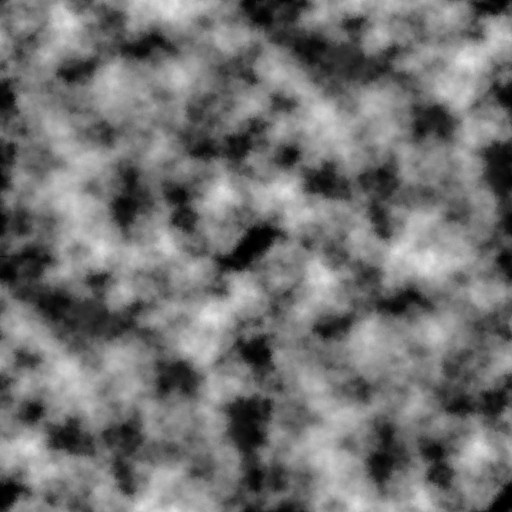<br>
</p>

<pre class="tnmai_assignment">
<strong>【課題01】</strong>
以下のURLから「雲密度テクスチャ」をダウンロードし、TGA形式に変換してプロジェクトの<code>Res</code>フォルダに保存しなさい。ファイル名は<code>cloud.tga</code>としなさい。
https://github.com/tn-mai/OpenGL3D2022/blob/master/res/cloud.png
</pre>

このテクスチャを「サンプリング(値を取得すること)」すると、雲の密度が得られます。そして、密度に応じたアルファ値で雲を描画します。

とりあえず、雲密度テクスチャを表示しましょう。プロジェクトの`Res`フォルダに
`cloud.frag`という名前のテキストファイルを追加してください。追加したファイルを開き、次のプログラムを追加してください。

```diff
+/**
+* @file cloud.frag
+*/
+#version 450
+
+// シェーダへの入力
+layout(location=1) in vec2 inTexcoord;
+
+// テクスチャ
+layout(binding=0) uniform sampler2D texDensity;
+
+// プログラムからの入力
+layout(location=100) uniform vec3 color;      // 雲の色
+
+// 出力する色データ
+out vec4 outColor;
+
+/**
+* エントリーポイント
+*/
+void main()
+{
+  float density = texture(texDensity, inTexcoord).r;
+  outColor = vec4(color, density);
+}
```

>`Density`(デンシティ)は「密度」という意味の名詞です。

全画面エフェクトなので、頂点シェーダには`standard_2D.vert`が流用できます。

次に、エンジンクラスにプログラムオブジェクトとテクスチャを管理する変数を追加します。
`Engine.h`を開き、ブルームエフェクト用のメンバ変数の定義の下に、次のプログラムを追加してください。

```diff
   FramebufferObjectPtr fboBloom[6];
   float bloomThreshold = 1; // 高輝度とみなす明るさ(0.0～上限なし)
   float bloomStrength = 8; // ブルームの強さ
+
+  // 雲描画用の変数
+  bool enableCloudEffect = true; // 雲を描画するならtrue
+  ProgramPipelinePtr progCloud; // 雲シェーダ
+  TexturePtr texCloudDensity;   // 雲の密度テクスチャ
+  VecMath::vec3 cloudColor = { 1, 1, 1 }; // 雲の色

   // シーン遷移エフェクト用の変数
   ProgramPipelinePtr progFade; // シーン遷移エフェクト用シェーダ
```

続いて、`Engine.cpp`を開き、`Initialize`メンバ関数の定義にあるシェーダを読み込むプログラムに、雲用シェーダを読み込むプログラムを追加してください。

```diff
     "Res/fade_color.tga", GL_LINEAR, Texture::Usage::for3D);
   texFadeRule = Texture::Create(
     "Res/fade_rule.tga", GL_LINEAR, Texture::Usage::for3DLinear);
+
+  // 雲用シェーダを読み込む
+  progCloud = ProgramPipeline::Create(
+    "Res/simple_2D.vert", "Res/cloud.frag");
+  texCloudDensity = Texture::Create(
+    "Res/cloud.tga", GL_LINEAR, Texture::Usage::for3D);

   // 座標変換行列をユニフォーム変数にコピー
   // 使用する頂点座標が-0.5～0.5のサイズなので2倍する。
   // スプライトとFBOのテクスチャ座標は逆なのでY軸をマイナスにする。
   const mat4 matBloomM = {
     vec4(2, 0, 0, 0),
     vec4(0,-2, 0, 0),
     vec4(0, 0, 2, 0),
     vec4(0, 0, 0, 1),
   };
   const mat4 matBloomVP = mat4(1);
   const GLuint bloomProgramIdList[] = {
-    *progHighPassFilter, *progDownSampling, *progUpSampling, *progFade };
+    *progHighPassFilter, *progDownSampling, *progUpSampling, *progFade, *progCloud };
   for (auto prog : bloomProgramIdList) {
     glProgramUniformMatrix4fv(prog, 0, 1, GL_FALSE, &matBloomM[0][0]);
```

`standard_2D.vert`を利用して全画面エフェクトを行うシェーダは、「最初に座標変換行列をシェーダに送っておいて、以後は変更しない」という運用をしています。

そこで、`bloomProgramIdList`に雲描画用シェーダも追加しています(この変数名、そろそろ変えたほうがよさそうですね…)。

さて、雲を描画するプログラムは、最終的にはそれなりの長さになる予定です。そこで、雲を描画するための関数を定義します。関数名は`DrawCloudEffect`(ドロー・クラウド・エフェクト)とします。`Engine.h`を開き、次のメンバ関数定義を追加してください。

```diff
   VecMath::mat4 CreateDepthMap(const SortedRendererList& rendererList,
     const VecMath::vec3& eye, const VecMath::vec3& target,
     float range, float zNear, float zFar);
+  void DrawCloudEffect() const;
   void DrawBloomEffect();

   GLFWwindow* window = nullptr; // ウィンドウオブジェクト
```

それから、今回は扱うユニフォーム変数の数が多くなりそうなので、ロケーション番号を表す定数を定義することにします。`Engine.cpp`を開き、`VecMath`名前空間の`using`宣言の下に次のプログラムを追加してください。

```diff
 #include <filesystem>

 using namespace VecMath;
+
+// ユニフォーム変数のロケーション番号
+constexpr GLint locCloudColor = 100;

 /**
 * ワールド座標系の衝突判定を表す構造体
```

それでは、`DrawCloudEffect`メンバ関数を定義しましょう。`CreateDepthMap`メンバ関数の定義の下に、次のプログラムを追加してください。

```diff
     e.renderer->Draw(*progShadowAnimation, *e.pModelMatrix);
   }
   return matShadow;
 }
+
+/**
+* 雲を描画
+*/
+void Engine::DrawCloudEffect() const
+{
+  // 雲描画が無効なら何もしない
+  if ( ! enableCloudEffect) {
+    return;
+  }
+
+  glEnable(GL_BLEND);       // アルファブレンドを有効化
+  glDisable(GL_DEPTH_TEST); // 深度テストを無効化
+  glDisable(GL_CULL_FACE);  // 裏面カリングを無効化
+  glUseProgram(*progCloud);
+  glBindVertexArray(*vao);
+
+  // ビューポートを設定
+  const Camera& camera = *GetMainCamera();
+  glViewport(camera.viewport.x, camera.viewport.y,
+    camera.viewport.width, camera.viewport.height);
+
+  // ユニフォーム変数にデータをコピー
+  glProgramUniform3fv(*progCloud, locCloudColor, 1, &cloudColor.x);
+
+  // テクスチャを設定
+  glBindTextureUnit(0, *texCloud);
+
+  // 雲を描画
+  glDrawElements(GL_TRIANGLES, 6, GL_UNSIGNED_SHORT, 0);
+}

 /**
 * カラーテクスチャをFBOに描画する
```

最後に`DrawCloudEffect`メンバ関数を呼び出します。`MainLoop`メンバ関数の定義にある「3Dメッシュを描画」するプログラムの下に、次のプログラムを追加してください。

```diff
     // 3Dメッシュを描画
     DrawStaticMesh(gameObjectList);
+
+    // 雲を描画
+    DrawCloudEffect();

     // パーティクルを描画
     {
```

プログラムが書けたらビルドして実行してください。画面に雲のような模様が表示されていたら成功です。

<p align="center">
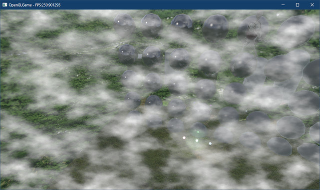<br>
</p>

### 1.2 平面と光線の交点に雲を描く

ただテクスチャを画面に張り付けただけでは、3D空間に存在する雲のようには見えません。簡単に思いつく方法は「普通に3Dポリゴンとして描画する」ことですが、それは結局「広大な空をすべてポリゴンで埋めるのには無理がある」という問題に戻ってしまいます。

そこで、以下の手順で「無限の広さをを持つ雲レイヤー」を作り出します。

>1. 3D空間に「雲をあらわす仮想的な無限平面」を配置。
>2. 視点からフラグメントに向けて光線(レイ)を発射し、光線(レイ)が「仮想的な無限平面」と交差する座標を求める。
>3. 交点の座標からテクスチャ座標を求め、テクスチャを描画。

この方法では「画面上の1ピクセルにつき1回、レイを発射」するだけで、雲を描画することが出来ます。

さて、光線は「発射点」と「向き」の2つの要素で定義されます。発射点は視点(カメラ)の座標でいいとして(正確にはレイと`near`平面の交点)、問題は「向き」の求め方です。

向きを求めるには、視点からフラグメントへのベクトルを計算します。ただ、フラグメントの座標はスクリーン座標形の値なので、なんとかしてワールド座標系に変換しなくてはなりません。

これは、通常の3Dモデルで使用する座標変換を「逆方向に適用」することで実現できます。この「逆変換の手順」は以下のとおりです。

>1. フラグメントのテクスチャ座標を2倍して1を引くことでNDC座標を求める。
>2. NDC座標に逆プロジェクション行列を掛けて「NDCベースのビュー座標」を求める。この時点では「クリップ座標」への変換は行わない。
>3. 「NDCベースのビュー座標」の`w`要素は、NDC座標系からクリップ座標系に変換するための係数になっている。「NDCベースのビュー座標」を`w`で除算すると「クリップ座標ベースのビュー座標」、つまり本来のビュー座標が求められる。
>4. 本来のビュー座標に逆ビュー行列を掛けて、ワールド座標を求める。

この手順は、「座標変換」、「グラフィックス・パイプライン」、「逆行列」の3つを理解している必要があります。とはいえ、個々の処理はそれほど難しいものではありません。

それでは、上記の処理に必要なユニフォーム変数をシェーダに追加しましょう。
`cloud.frag`を開き、次のプログラムを追加してください。

```diff
 // テクスチャ
 layout(binding=0) uniform sampler2D texDensity;

 // プログラムからの入力
+layout(location=4) uniform vec3 cameraPosition; // カメラ座標
 layout(location=100) uniform vec3 color;      // 雲の色
+layout(location=101) uniform mat4 matInvProj; // 逆プロジェクション行列
+layout(location=102) uniform mat4 matInvView; // 逆ビュー行列

 // 出力する色データ
 out vec4 outColor;
```

`cameraPosition`のロケーション番号を`4`にしているのは、`standard_3D.veert`などの他のシェーダとロケーション番号を合わせるためです。

>**【シェーダ間でロケーション番号を統一する】**<br>
>同じ意味を持つユニフォーム変数は、シェーダが異なっても同じロケーション番号を使うとよいです。CPU側でGPUメモリにデータをコピーするとき、ロケーション番号を間違えるミスがなくなります。

次に、追加したユニフォーム変数を使って、フラグメントのワールド座標を求めます。
`main`関数の定義に次のプログラムを追加してください。

```diff
 */
 void main()
 {
+  // ピクセル座標と深度値からワールド座標を復元
+  vec3 ndcPosition = vec3(inTexcoord, 1) * 2 - 1;
+  vec4 viewPosition = matInvProj * vec4(ndcPosition, 1);
+  viewPosition /= viewPosition.w;
+  vec3 worldPosition = vec3(matInvView * vec4(viewPosition.xyz, 1));
+
   float density = texture(texDensity, inTexcoord).r;
   outColor = vec4(color, density);
```

前に挙げた「逆変換の手順」と、このプログラムを見比べてみてください、手順のとおりにプログラムが書かれていることが分かると思います。

全画面エフェクトの場合、`inTexcoord`には左下のフラグメントの場合に`(0, 0)`、右上のフラグメントの場合に`(1, 1)`が渡される点に注意してください。

また、`vec3(inTexcoord, 1)`の`1`の部分は深度値に相当します。`1`はファー平面の座標を意味します。

フラグメントに対応するファー平面上のワールド座標が手に入ったので、光線ベクトル(光線の向き)を求め、さらに光線ベクトルと雲平面の交点を求めます。ワールド座標を復元するプログラムの下に、次のプログラムを追加してください。

```diff
   vec4 viewPosition = matInvProj * vec4(ndcPosition, 1);
   viewPosition /= viewPosition.w;
   vec3 worldPosition = vec3(matInvView * vec4(viewPosition.xyz, 1));
+
+  // 光線ベクトルvを計算
+  vec3 v =  normalize(worldPosition - cameraPosition);
+
+  // 雲平面までの距離tを計算
+  const float cloudPlaneY = 1; // 雲平面のY座標
+  float t = (cloudPlaneY - cameraPosition.y) / v.y;
+
+  // 光線と雲平面との交点を求める
+  vec3 samplingPoint = cameraPosition + v * t;

   float density = texture(texDensity, inTexcoord).r;
   outColor = vec4(color, density);
```

今回は雲は「XZ平面に無限に広がる」ことにしています。これによって、光線と平面の交点までの距離は、Y座標の計算だけで求めることができます。

次に、交点のワールド座標をテクスチャ座標として使用します。テクスチャを読み取るプログラムを次のように変更してください。

```diff
   // 光線と雲平面との交点を求める
   vec3 samplingPoint = cameraPosition + v * t;

-  float density = texture(texDensity, inTexcoord).r;
+  float density = texture(texDensity, samplingPoint.xz).r;
   outColor = vec4(color, density);
 }
```

続いて、ユニフォーム変数に送るデータを作成します。`Engine.cpp`を開き、次のロケーション番号定義を追加してください。

```diff
 using namespace VecMath;

 // ユニフォーム変数のロケーション番号
+constexpr GLint locCameraPosition = 4;
 constexpr GLint locCloudColor = 100;
+constexpr GLint locMatInvProj = 101;
+constexpr GLint locMatInvView = 102;

 /**
 * ワールド座標系の衝突判定を表す構造体
```

次に、`DrawCloudEffect`メンバ関数の定義に次のプログラムを追加してください。

```diff
   const Camera& camera = *GetMainCamera();
   glViewport(camera.viewport.x, camera.viewport.y,
     camera.viewport.width, camera.viewport.height);
+
+  // 逆プロジェクション行列を作成
+  const float aspect =
+    static_cast<float>(camera.viewport.width) / camera.viewport.height;
+  const mat4 matProj = mat4::Perspective(
+    radians(camera.fovY), aspect, camera.near, camera.far);
+  const mat4 matInvProj = inverse(matProj);
+
+  // 逆ビュー行列を作成
+  const mat4 matInvRotation =
+    mat4::RotateZ(-cameraObject->rotation.z) *
+    mat4::RotateX(-cameraObject->rotation.x) *
+    mat4::RotateY(-cameraObject->rotation.y);
+  const mat4 matInvTranslate = mat4::Translate(-cameraObject->position);
+  const mat4 matInvView = inverse(matInvRotation * matInvTranslate);

   // ユニフォーム変数にデータをコピー
+  glProgramUniform3fv(*progCloud, locCameraPosition,
+    1, &cameraObject->position.x);
   glProgramUniform3fv(*progCloud, locCloudColor, 1, &cloudColor.x);
+  glProgramUniformMatrix4fv(*progCloud, locMatInvProj,
+    1, GL_FALSE, &matInvProj[0][0]);
+  glProgramUniformMatrix4fv(*progCloud, locMatInvView,
+    1, GL_FALSE, &matInvView[0][0]);

   // テクスチャを設定
   glBindTextureUnit(0, *texCloud);
```

逆プロジェクション行列と逆ビュー行列を作成するには、普通にプロジェクション行列とビュー行列を作成したあと、`inverse`関数を使って逆行列に変換します。

プログラムが書けたらビルドして実行してください。次のような画面が表示されていたら成功です。

<p align="center">
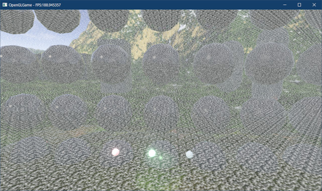<br>
</p>

>**【ビュー行列とプロジェクション行列の作成について】**<br>
>ビュー行列とプロジェクション行列は、同じものを描画コードで何回も利用することになります。どこか１か所で作成して使い回すほうが効率的です。

### 1.3 雲の見え方を調整する

雲がやたらと細かく見えるのは、テクスチャが1x1mの単位で貼り付けられているからです。雲としては小さすぎるので、拡大して表示しましょう。テクスチャを読み取るプログラムを次のように変更してください。

```diff
   // 光線と雲平面との交点を求める
   vec3 samplingPoint = cameraPosition + v * t;

+  const float scale = 1.0 / 311; // テクスチャの拡大率
-  float density = texture(texDensity, samplingPoint.xz).r;
+  float density = texture(texDensity, samplingPoint.xz * scale).r;
   outColor = vec4(color, density);
 }
```

プログラムが書けたらビルドして実行してください。テクスチャが拡大され、少しは雲らしくなっていたら成功です。

<p align="center">
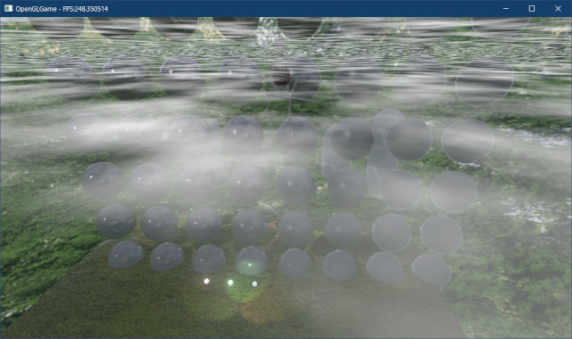<br>
</p>

それから、雲平面のY座標は`0`にしているので、本当なら雲は下側にだけ表示されるはずです。それなのに、現在は上にも雲が表示されています。原因は、平面までの距離`t`がマイナスの場合にもテクスチャを表示しているためです。

そこで、`t`がマイナスの場合はテクスチャを表示しないようにします。雲の密度を求めるプログラムを次のように変更してください。

```diff
   // 雲平面までの距離tを計算
   const float cloudPlaneY = 1;
   float t = (cloudPlaneY - cameraPosition.y) / v.y;

+  // 距離がマイナスの場合、交点は光線の発射点より後ろにあるのでサンプリングしない
+  float density = 0; // 雲の密度
+  if (t >= 0) {
     // 光線と雲平面との交点を求める
     vec3 samplingPoint = cameraPosition + v * t;

     // 交点の座標をテクスチャ座標とする
     const float scale = 1.0 / 311; // テクスチャの拡大率
-    float density = texture(texDensity, samplingPoint.xz * scale).r;
+    density = texture(texDensity, samplingPoint.xz * scale).r;
+  }
   outColor = vec4(color, density);
```

プログラムが書けたらビルドして実行してください。上側の雲が表示されなくなっていたら成功です。

<p align="center">
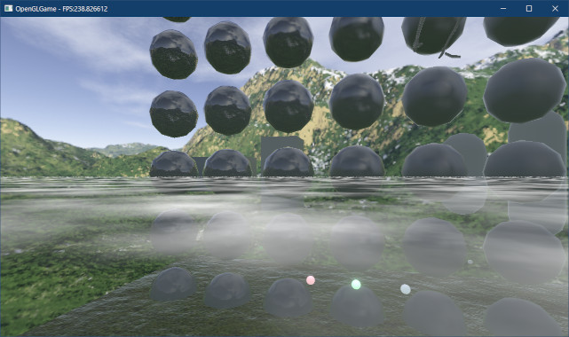<br>
</p>

### 1.4 2枚のテクスチャを合成する

テクスチャの拡大率を311mにしましたが、それでも少し遠くを見れば、同じパターンが続いていることはすぐに分かります。繰り返しを目立たなくするには、拡大率の異なる二枚以上のテクスチャを合成します。

```diff
     // 光線と雲平面との交点を求める
     vec3 samplingPoint = cameraPosition + v * t;

     // 交点の座標をテクスチャ座標とする
-    const float scale = 1.0 / 311; // テクスチャの拡大率
+    const float scale0 = 1.0 / 311; // テクスチャの拡大率(1枚目)
+    const float scale1 = 1.0 / 127; // テクスチャの拡大率(2枚目)
-    density = texture(texDensity, samplingPoint.xz * scale).r;
+    density = texture(texDensity, samplingPoint.xz * scale0).r;
+    density *= texture(texDensity, samplingPoint.xz * scale1).r;
   }
   outColor = vec4(color, density);
```

なお、`311`や`127`は素数から選択しています。密度テクスチャを合成するときに素数以外を選ぶと、素数を使った場合よりも同じパターンが早く現れてしまうからです。

プログラムが書けたらビルドして実行してください。雲が薄くなり、繰り返しが目立たなくなっていたら成功です。

<p align="center">
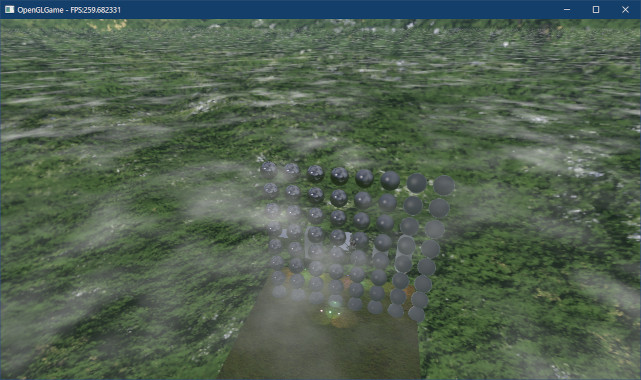<br>
</p>

先程はテクスチャを乗算しましたが、加算や減算など、ほかの演算で合成することもできます。合成式の乗算を、加算に変更してください。

```diff
     // 交点の座標をテクスチャ座標とする
     const float scale0 = 1.0 / 311; // テクスチャの拡大率(1枚目)
     const float scale1 = 1.0 / 127; // テクスチャの拡大率(2枚目)
     density = texture(texDensity, samplingPoint.xz * scale0).r;
-    density *= texture(texDensity, samplingPoint.xz * scale1).r;
+    density += texture(texDensity, samplingPoint.xz * scale1).r;
   }
   outColor = vec4(color, density);
```

プログラムが書けたらビルドして実行してください。加算しているので当たり前ですが、今度は雲が濃くなります。繰り返しは、乗算と同じくらいに目立たないはずです。

<p align="center">
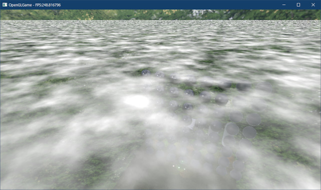<br>
</p>

思い通りの濃さの雲を表現するには、薄すぎる場合は`1`より大きい値(`2`など)を掛け、濃すぎる場合は`1`未満の値(`0.5`など)を掛けて調整します。しかし、わずかとはいえ計算が増えてしまうので、可能ならテクスチャ自体を修正するほうがよいでしょう。

### 1.5 雲を動かす

現実の雲は、風に流されて少しずつ動いています。この動きを再現するには、サンプリングするテクスチャ座標を経過時間によってずらします。

そのために、「ずらし量」を表すユニフォーム変数を定義しましょう。変数名は`offset`(オフセット)とします。`cloud.frag`を開き、次のユニフォーム変数を追加してください。

```diff
 layout(location=100) uniform vec3 color;      // 雲の色
 layout(location=101) uniform mat4 matInvProj; // 逆プロジェクション行列
 layout(location=102) uniform mat4 matInvView; // 逆ビュー行列
+layout(location=103) uniform vec4 offset;     // 雲テクスチャのオフセット値

 // 出力する色データ
 out vec4 outColor;
```

次に、テクスチャを読み込むプログラムを次のように変更してください。

```diff
     // 交点の座標をテクスチャ座標とする
     const float scale = 1.0 / 300; // テクスチャの拡大率
-    density = texture(texDensity, samplingPoint.xz * scale0).r;
-    density += texture(texDensity, samplingPoint.xz * scale1).r;
+    density = texture(texDensity, samplingPoint.xz * scale0 + offset.xy).r;
+    density += texture(texDensity, samplingPoint.xz * scale1 + offset.zw).r;
   }
   outColor = vec4(color, density);
```

続いて、ゲームエンジンに`Engine.h`を開き、雲描画用変数の定義に次のプログラムを追加してください。

```diff
   ProgramPipelinePtr progCloud;  // 雲シェーダ
   TexturePtr texCloud;           // 雲の密度テクスチャ
   VecMath::vec3 cloudColor = { 1, 1, 1 }; // 雲の色
+  VecMath::vec4 cloudOffset = { 0, 0, 0.3f, 0.7f }; // 雲座標のオフセット値
+  VecMath::vec4 cloudSpeed = {
+    -0.0019f, -0.0041f, -0.0027f, -0.0013f }; // 雲の移動速度

   // シーン遷移エフェクト用の変数
   ProgramPipelinePtr progFade; // シーン遷移エフェクト用シェーダ
```

初期オフセット値と移動速度に、テクスチャごとに異なる値を設定していることに注目してください。この設定によって、時間の経過とともに雲の合成結果が変化し、アニメーションのような効果が得られます。

次に`Engine.cpp`を開き、`MainLoop`メンバ関数の定義に次のプログラムを追加してください。

```diff
     // 3Dメッシュを描画
     DrawStaticMesh(gameObjectList);

     // 雲を描画
+    cloudOffset += cloudSpeed * deltaTime; // 雲座標オフセットを更新
     DrawCloudEffect();

     // パーティクルを描画
```

最後に、ずらし量をユニフォーム変数にコピーします。`DrawCloudEffect`メンバ関数の定義に次のプログラムを追加してください。

```diff
     1, GL_FALSE, &matInvProj[0][0]);
   glProgramUniformMatrix4fv(*progCloud, locMatInvView,
     1, GL_FALSE, &matInvView[0][0]);
+  glProgramUniform4fv(*progCloud, locCloudOffset, 1, &cloudOffset.x);

   // テクスチャを設定
   glBindTextureUnit(0, *texCloud);
```

プログラムが書けたらビルドして実行してください。雲がゆっくりと移動していたら成功です。また、少し分かりづらいですが時間経過で雲の模様が変化しています。

### 1.6 既存のテクスチャからFBOを作成する

雲が空高くにしか見えなかったり、高所から雲海を見下ろすタイプのゲームの場合、ここまでに作成した平面の雲でも十分です。しかし、雲が低い位置にあって、山や建物と交差するような場合、雲と山や建物の前後関係を正しく描画しなくてはなりません。

これは、深度バッファを利用することで実現できます。ただし、あるFBOがOpenGLコンテキストにバインドされているとき、シェーダからそのFBOにアタッチされているバッファを読み取ることはできません(GPUの制限)。

ところで、雲の描画中は`GL_DEPTH_TEST`が無効なため、深度バッファへの書き込まれることはありません。つまり、深度バッファのアタッチを解除しても問題ないわけです。

ただ、一度作成したFBOからバッファのアタッチを解除することはできません。しかし、同じテクスチャを複数のFBOにアタッチすることは許可されています。

そこで、メインウィンドウ用FBOのカラーバッファだけをアタッチした、新しいFBOを作成します。

まず、`FramebufferObject`クラスに「既存のテクスチャからFBOを作成する」機能を追加します。`FramebufferObject.h`を開き、`FramebufferObject`クラスの定義に次のプログラムを追加してください。

```diff
 public:
   // FBOを作成
   static FramebufferObjectPtr Create(int width, int height, FboType type);
+  static FramebufferObjectPtr Create(
+    const TexturePtr& color, const TexturePtr& depth);

   // コンストラクタ・デストラクタ
   FramebufferObject(int width, int height, FboType type);
+  FramebufferObject(const TexturePtr& color, const TexturePtr& depth);
   ~FramebufferObject();

   // コピーと代入を禁止
```

次に`FramebufferObject.cpp`を開き、既存の`Create`メンバ関数の定義の下に、次のプログラムを追加してください。

```diff
 {
   return std::make_shared<FramebufferObject>(width, height, type);
 }
+
+/**
+* 既存のテクスチャからFBOを作成する
+*
+* @param color  カラーテクスチャ
+* @param depth  深度テクスチャ
+*
+* @return 作成したFBO
+*/
+FramebufferObjectPtr FramebufferObject::Create(
+  const TexturePtr& color, const TexturePtr& depth)
+{
+  return std::make_shared<FramebufferObject>(color, depth);
+}

 /**
 * コンストラクタ
```

```diff
   // 作成成功
   LOG("FBO(width=%d,height=%d)を作成", width, height);
 }
+
+/**
+* 既存のテクスチャからFBOを作成するコンストラクタ
+*
+* @param color  カラーテクスチャ
+* @param depth  深度テクスチャ
+*/
+FramebufferObject::FramebufferObject(
+  const TexturePtr& color, const TexturePtr& depth) :
+  texColor(color), texDepth(depth)
+{
+  // FBOを作成
+  int width = 0;
+  int height = 0;
+  glCreateFramebuffers(1, &fbo);
+  if (texColor) {
+    glNamedFramebufferTexture(fbo, GL_COLOR_ATTACHMENT0, *texColor, 0);
+    width = texColor->GetWidth();
+    height = texColor->GetHeight();
+  } else {
+    glNamedFramebufferDrawBuffer(fbo, GL_NONE);
+  }
+  if (texDepth) {
+    glNamedFramebufferTexture(fbo, GL_DEPTH_ATTACHMENT, *texDepth, 0);
+    width = texDepth->GetWidth();
+    height = texDepth->GetHeight();
+  }
+
+  // FBOの有効性をチェック
+  if (glCheckNamedFramebufferStatus(fbo, GL_FRAMEBUFFER) != GL_FRAMEBUFFER_COMPLETE) {
+    LOG_ERROR("FBOの作成に失敗");
+    glDeleteFramebuffers(1, &fbo);
+    fbo = 0;
+    texColor.reset();
+    texDepth.reset();
+    return;
+  }
+
+  // 作成成功
+  LOG("FBO(width=%d,height=%d)を作成", width, height);
+}

 /**
 * デストラクタ
```

これで、既存のテクスチャからFBOを作成できるようになりました。

続いて`Engine.h`を開き、`Engine`クラスの定義に次のプログラムを追加してください。

```diff
   LightBufferPtr lightBuffer; // ライト用SSBO管理オブジェクト

   FramebufferObjectPtr fboGameWindow; // ゲームウィンドウ用FBO
+  FramebufferObjectPtr fboGameWindowColor; // ゲームウィンドウのカラーバッファのみ

   // エフェクト用の変数
   ProgramPipelinePtr progGaussianBlur;
```

次に`Engine.cpp`を開き、`Initialize`メンバ関数の定義にある「ゲームウィンドウ用FBOを作成」するプログラムに、次のプログラムを追加してください。

```diff
   const vec2 viewSize = GetViewSize();
   fboGameWindow = FramebufferObject::Create(
     static_cast<int>(viewSize.x), static_cast<int>(viewSize.y), FboType::colorDepth);
+  fboGameWindowColor = FramebufferObject::Create(
+    fboGameWindow->GetColorTexture(), nullptr);

   // ぼかしシェーダを読み込む
   progGaussianBlur = ProgramPipeline::Create(
```

これで、メインウィンドウ用FBOとカラーバッファを共有する、新しいFBOが作成されます。
`fboGameWindowColor`をバインドしているときは、シェーダで深度バッファを読み取ることができます。

それでは、作成したFBOをバインドしましょう。`DrawCloudEffect`メンバ関数の定義に次のプログラムを追加してください。

```diff
   glDisable(GL_CULL_FACE);  // 裏面カリングを無効化
   glUseProgram(*progCloud);
   glBindVertexArray(*vao);
+  glBindFramebuffer(GL_FRAMEBUFFER, *fboGameWindowColor);

   // ビューポートを設定
   const Camera& camera = *GetMainCamera();
```

### 1.7 雲シェーダに前後関係の判定を追加する

次に、シェーダを改造して、深度バッファを利用して前後関係を正しく描画できるようにしましょう。まず深度テクスチャを追加します。`cloud.frag`を開き、次のプログラムを追加してください。

```diff
 layout(location=1) in vec2 inTexcoord;

 // テクスチャ
 layout(binding=0) uniform sampler2D texDensity;
+layout(binding=1) uniform sampler2D texDepth;

 // プログラムからの入力
 layout(location=4) uniform vec3 cameraPosition; // カメラ座標
```

これまで、フラグメントのワールド座標を求めるときはZ座標の値に`1`を指定していました。今回は、これを深度バッファの値に変更します。

深度バッファには、「描画されたうち、最も手前にある図形の深度値」が格納されているので、計算されたワールド座標は「最も手前にある図形のワールド座標」になります。ワールド座標を求めるプログラムを次のように変更してください。

```diff
 void main()
 {
   // ピクセル座標と深度値からワールド座標を復元
-  vec3 ndcPosition = vec3(inTexcoord, 1) * 2 - 1;
+  vec3 ndcPosition = vec3(inTexcoord, texture(texDepth, inTexcoord).r) * 2 - 1;
   vec4 viewPosition = matInvProj * vec4(ndcPosition, 1);
   viewPosition /= viewPosition.w;
```

この「新しいワールド座標」は、視点からファー平面へ向かう直線上に存在するため、光線ベクトルなどの計算を変更する必要はありません、

続いて、「新しいワールド座標」とサンプリング座標を比較して、雲を描画するべきかどうかを決めます。テクスチャをサンプリングするプログラムを、次のように変更してください。

```diff
   if (t >= 0) {
     // 光線と雲平面との交点を求める
     vec3 samplingPoint = cameraPosition + v * t;

+    // 交点が物体より手前にある場合だけサンプリングする
+    if (
+      (v.y >= 0 || samplingPoint.y >= worldPosition.y) &&
+      (v.y < 0 || samplingPoint.y <= worldPosition.y))
+    {
       // 交点の座標をテクスチャ座標とする
       const float scale0 = 1.0 / 311; // テクスチャの拡大率
       const float scale1 = 1.0 / 127; // テクスチャの拡大率
       density = texture(texDensity, samplingPoint.xz * scale0 + offset.xy).r;
       density += texture(texDensity, samplingPoint.xz * scale1 + offset.zw).r;
+    }
   }
   outColor = vec4(color, density);
```

追加した`if`文は少し複雑に見えますが、光線が「下に向かう」場合と「上に向かう」場合を切り分ければそこまで難しくはありません。

光線が下に向かう(`v.y`がマイナス)のとき、`v.y >= 0`は`false`, `v.y < 0`は`true`になるので:

```c++
(false || samplingPoint.y >= worldPosition.y) &&
(true || samplingPoint.y <= worldPosition.y))
```

`||`演算子は左側が`true`なら右側を評価しないので:

```c++
(samplingPoint.y >= worldPosition.y) && true
```

となり、結局、光線が下に向かう場合は「交点がワールド座標と同じか高い位置にある場合、雲を描画する」ことになります。

同様に、光線が上に向かう場合は:

```c++
(true || samplingPoint.y >= worldPosition.y) &&
(false || samplingPoint.y <= worldPosition.y))
```

`||`演算子は左側が`true`なら右側を評価しないので:

```c++
true && (samplingPoint.y <= worldPosition.y))
```

となり、光線が上に向かう場合は「交点がワールド座標と同じか低い位置にある場合、雲を描画する」となります。

結局、この`if`文は光線の向きによって判定を切り替えているだけなのです。

次に、深度テクスチャをOpenGLコンテキストにバインドします。`Engine.cpp`を開き、
`DrawCloudEffect`メンバ関数の定義に次のプログラムを追加してください。

```diff
   glProgramUniform4fv(*progCloud, locCloudOffset, 1, &cloudOffset.x);

   // テクスチャを設定
   glBindTextureUnit(0, *texCloud);
+  glBindTextureUnit(1, *fboGameWindow->GetDepthTexture());

   // 雲を描画
   glDrawElements(GL_TRIANGLES, 6, GL_UNSIGNED_SHORT, 0);
```

プログラムが書けたらビルドして実行してください。雲平面より手前にある物体が、雲より手前に描画されていたら成功です。

<p align="center">
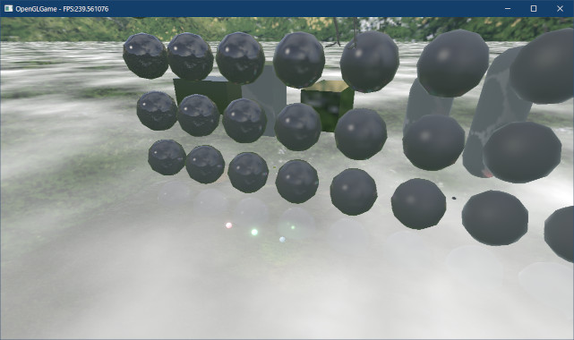<br>
</p>

### 1.8 レイマーチングを行う

物体と雲の前後関係を正しく扱えるようになると、物体と雲平面が交差する部分が直線になり、雲が平面であることが簡単にバレてしまいます。そこで、雲を立体的に描画することにします。

雲を立体的に描画するには、雲を多層化して各階層について光線との考査を行い、結果の密度値を合計します。ようやく、本テキストの最初に説明した「レイマーチング」が登場します。

レイマーチングの範囲を決定するために、「雲が存在する高さの範囲」と「レイマーチングの回数」を表すユニフォーム変数を追加します。レイマーチングは高さ方向に等間隔で実行したいので、「高さ/回数」も追加することにします。

ロケーション番号を節約するために、これらをひとつのユニフォーム変数にまとめます。
`cloud.frag`を開き、次のプログラムを追加してください。

```diff
 layout(location=101) uniform mat4 matInvProj; // 逆プロジェクション行列
 layout(location=102) uniform mat4 matInvView; // 逆ビュー行列
 layout(location=103) uniform vec4 offset;     // 雲テクスチャのオフセット値
+
+// xy=雲の範囲 z=レイマーチング回数 w=1回に進む距離
+layout(location=104) uniform vec4 range_count_step;

 // 出力する色データ
 out vec4 outColor;
```

それでは「レイマーチング」を実装しましょう。まず雲の上下の平面までの距離を計算します。雲平面までの距離を計算するプログラムを、次のように変更してください。

```diff
   // 光線ベクトルvを計算
   vec3 v =  normalize(worldPosition - cameraPosition);

-  // 雲平面までの距離tを計算
-  const float cloudPlaneY = 1; // 雲平面のY座標
-  float t = (cloudPlaneY - cameraPosition.y) / v.y;
+  // 雲の上平面、下平面までの距離を計算
+  float tmin = (range_count_step.x - cameraPosition.y) / v.y;
+  float tmax = (range_count_step.y - cameraPosition.y) / v.y;
+  // 常にtminのほうが小さくなるようにする
+  if (tmin > tmax) {
+    float tmp = tmin;
+    tmin = tmax;
+    tmax = tmp;
+  }

   // 距離がマイナスの場合、交点は光線の発射点より後ろにあるのでサンプリングしない
   float density = 0; // 雲の密度
-  if (t >= 0) {
+  if (tmin >= 0) {
     // 光線と雲平面との交点を求める
-    vec3 samplingPoint = cameraPosition + v * t;
+    vec3 samplingPoint = cameraPosition + v * tmin;

     // 交点が物体より手前にある場合だけサンプリングする
     if (
```

次に、レイマーチングに使用するいくつかの値を計算します。レイマーチングでは、「光線を等間隔で少しずつ進ませて、各座標でテクスチャを読み取る」ことを繰り返します。そのため、「1回のマーチングで光線を進める距離」を求めておきます。

```diff
   // 距離がマイナスの場合、交点は光線の発射点より後ろにあるのでサンプリングしない
   float density = 0; // 雲の密度
   if (tmin >= 0) {
+    // 1回のマーチングで光線を進める距離
+    vec3 step = v * range_count_step.w / max(abs(v.y), 0.1);
+
     // 光線と雲平面との交点を求める
     vec3 samplingPoint = cameraPosition + v * tmin;
```

それでは、レイマーチングを行いましょう。テクスチャをサンプリングするプログラムを、次のように変更してください。

```diff
     // 光線と雲平面との交点を求める
     vec3 samplingPoint = cameraPosition + v * t;

+    const int marchingCount = int(range_count_step.z);
+    for (int i = 0; i < marchingCount; ++i) {
       // 交点が物体より手前にある場合だけサンプリングする
       if (
         (v.y >= 0 || samplingPoint.y >= worldPosition.y) &&
         (v.y < 0 || samplingPoint.y <= worldPosition.y))
       {
         // 交点の座標をテクスチャ座標とする
         const float scale0 = 1.0 / 311; // テクスチャの拡大率
         const float scale1 = 1.0 / 127; // テクスチャの拡大率
-        density = texture(texDensity, samplingPoint.xz * scale0 + offset.xy).r;
-        density += texture(texDensity, samplingPoint.xz * scale1 + offset.zw).r;
+        float a = texture(texDensity, samplingPoint.xz * scale0 + offset.xy).r;
+        a += texture(texDensity, samplingPoint.xz * scale1 + offset.zw).r;
+
+        // 密度を加算
+        const float transmittance = max(1 - density, 0); // 透過率
+        const float densityScale = 0.3; // サンプリングごとの密度調整係数
+        density += a * transmittance * densityScale;
       }
+      samplingPoint += step; // 光線を進める
+    } // for i
+    density = clamp(density, 0, 1); // 密度を0-1の範囲に制限
   }
   outColor = vec4(color, density);
```

`densityScale`(デンシティ・スケール)は、1回のサンプリングによって加算される密度の最大値です。`transmittance`(トランスミッタンス)は「光の透過率」で、雲の密度によって視点に届く光が減少する様子を再現します。

あとはユニフォーム変数に値を設定するだけです。`Engine.h`を開き、雲描画用の変数定義に次のプログラムを追加してください。

```diff
   VecMath::vec4 cloudOffset = { 0, 0, 0.3f, 0.7f }; // 雲のオフセット座標
   VecMath::vec4 cloudSpeed = {
     -0.0019f, -0.0041f, -0.0027f, -0.0013f }; // 雲の移動速度
+  VecMath::vec2 cloudRange = { 0, 2 }; // 雲を描画する範囲
+  float cloudMarchingCount = 8;  // レイマーチング回数

   // シーン遷移エフェクト用の変数
   ProgramPipelinePtr progFade; // シーン遷移エフェクト用シェーダ
```

次に`Engine.cpp`を開き、ロケーション番号の定義に次のプログラムを追加してください。

```diff
 constexpr GLint locMatInvProj = 101;
 constexpr GLint locMatInvView = 102;
 constexpr GLint locCloudOffset = 103;
+constexpr GLint locCloudRange_count_step = 104;

 /**
 * ワールド座標系の衝突判定を表す構造体
```

最後に、`DrawCloudEffect`メンバ関数の定義に次のプログラムを追加してください。

```diff
   glProgramUniformMatrix4fv(*progCloud, locMatInvView,
     1, GL_FALSE, &matInvView[0][0]);
   glProgramUniform4fv(*progCloud, locCloudOffset, 1, &cloudOffset.x);
+
+  // 1回のレイマーチで進む距離を計算
+  const float step = (cloudRange.y - cloudRange.x) / cloudMarchingCount;
+  glProgramUniform4f(*progCloud, locCloudRange_count_step,
+    cloudRange.x, cloudRange.y, cloudMarchingCount, step);

   // テクスチャを設定
   glBindTextureUnit(0, *texCloud);
```

プログラムが書けたらビルドして実行してください。視点を動かしたとき、雲がなんとなく立体的に見えたら成功です。

<p align="center">
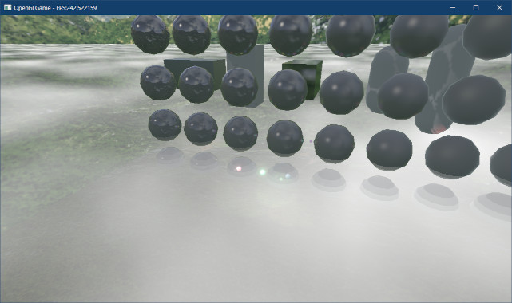<br>
</p>

>**【1章のまとめ】**
>
>* レイの座標を少しずつ進めながらサンプリングを繰り返す技法のことを「レイマーチング」という。
>* フラグメントのワールド座標を復元するには、逆ビュー行列と逆プロジェクション行列に加えて、GPU内部で計算される処理も再現しなくてはならない。
>* 雲のような不定形の物体は、「密度テクスチャ」として扱うことができる。
>* 全画面エフェクトの中で物体を描画するには、視点からフラグメントにレイを発射し、平面などの物体との交点を求める。
>* 密度テクスチャのサイズを変えて複数回合成すると、繰り返しパターンの目立ちにくい、より複雑な画像を表現できる。
>* レイマーチングと密度テクスチャを組み合わせることで、雲のように空間に広がる不定形の物体を表現できる。

<div style="page-break-after: always"></div>

## 2. レイマーチングで得られた結果を改善する

### 2.1 視点が雲の中に入ったとき雲が消えないようにする

現在のシェーダで雲範囲の内側に入ると、雲が全く表示されません。<br>
雲の中では`tmin`が常にマイナスになるためです。

以前の雲は単なる平面だったため、「`tmin`がマイナスの場合は雲が見えない」という判断は正しいものでした。しかし、現在の雲には厚みがあるため、`tmin`がマイナスでも、`tmax`までは雲が続いていることを考慮しなくてはなりません。

さて、`tmin`がマイナスの場合、雲範囲との交点が光線の視点より手前にあることを意味します。雲のサンプリングは視点から開始する必要があるので、`tmin`の最小値を0に制限します。

`tmin`を制限した結果、`tmin`が`tmax`より大きくなった場合、雲範囲と光線は交差しないと判断できます。サンプリングの有無を判定するプログラムを、次のように変更してください。

```diff
     tmin = tmax;
     tmax = tmp;
   }
+  tmin = max(tmin, 0); // tminを光線の始点に制限

-  // 距離がマイナスの場合、交点は光線の発射点より後ろにあるのでサンプリングしない
+  // tmaxがtmin未満の場合、雲範囲は光線の発射点より後ろにあるのでサンプリングしない
   float density = 0; // 雲の密度
-  if (tmin >= 0) {
+  if (tmax >= min) {
     // 1回のマーチングで光線を進める距離
     vec3 step = v * range_count_step.w / max(abs(v.y), 0.1);
```

プログラムが書けたらビルドして実行してください。雲の内部に入っても雲が描画されていたら成功です。

<p align="center">
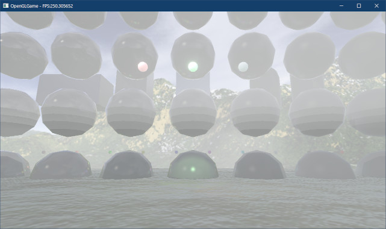<br>
</p>

これで問題ないように見えますが、実は上下方向のマーチング回数に少し問題があります。始点が雲の中にある場合、視点から雲の境界までの距離は雲の厚みより短いため、レイマーチングの回数も少なくなるはずです。

しかし、現在のプログラムではサンプリング座標が雲の範囲内かどうかを判定していません。そのため、雲の内部にいるときに雲の外を見ると、常に同じ密度の雲が表示されます。

そこで、サンプリング座標と物体の前後判定を、「雲範囲と物体のうち、視点に近いほうとの前後判定」とするように変更します。交点と物体の前後判定を行うプログラムを、次のように変更してください。

```diff
     // 光線と雲平面との交点を求める
     vec3 samplingPoint = cameraPosition + v * t;
+
+    // レイマーチングの範囲として、物体の座標と雲範囲のうち近い方を選択
+    const float rangeMin = max(worldPosition.y, range_count_step.x);
+    const float rangeMax = min(worldPosition.y, range_count_step.y);

     const int marchingCount = int(range_count_step.z);
     for (int i = 0; i < marchingCount; ++i) {
       // 交点が物体より手前にある場合だけサンプリングする
       if (
-        (v.y >= 0 || samplingPoint.y >= worldPosition.y) &&
-        (v.y < 0 || samplingPoint.y <= worldPosition.y))
+        (v.y >= 0 || samplingPoint.y >= rangeMin) &&
+        (v.y < 0 || samplingPoint.y <= rangeMax))
       {
         // 交点の座標をテクスチャ座標とする
```

プログラムが書けたらビルドして実行してください。視点を上下に向けて雲の内部に入ったとき、視点の位置によって上下方向の雲の密度が変化していたら成功です。

また、この変更によって、雲範囲に出入りするとにいきなり雲が表示されるのではなく、徐々に濃くなっていくようになっているはずです。

<p align="center">
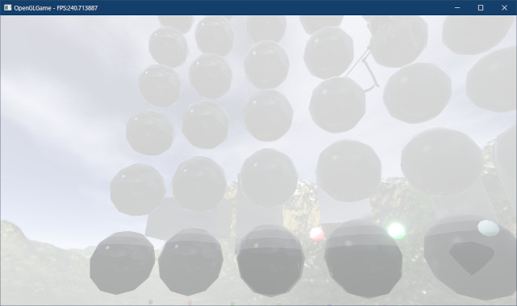&emsp;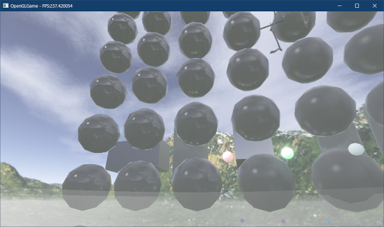<br>
[左=雲範囲を無視 右=雲範囲を考慮]
</p>

### 2.2 ディザリング

雲と物体の境界をながめると縞模様になっていることが分かります。これは、サンプリング回数が少ないためです。サンプリング回数を十分に増やせば縞模様は目立たなくなります。

しかし、普通は気づかれない程度まで縞模様を目立たくするには、100回ほどサンプリングをしなくてはなりません。これではシェーダの処理速度が大きく低下してしまいます。

サンプリング回数を増やすことなく縞模様を目立たなくするには、ピクセルごとに光線の発射位置をずらします。

発射位置をずらすには、乱数を使う方法と「ディザリング」と呼ばれるパターンを使う方法があります。本テキストでは「ディザリング」を使います。理由は「ディザリング」のほうが見た目を制御しやすく、また計算効率も良いためです。

ディザリングは「ディザマトリクス」と呼ばれる2次元配列によって、各ピクセルの色などに変化を与える方法です。まずディザマトリクスを定義しましょう。`outColor`出力変数の定義の下に、次のプログラムを追加してください。

```diff
 // 出力する色データ
 out vec4 outColor;
+
+// ディザマトリクス
+const float ditherMatrix[4][4] = {
+  {  0 / 16.0,  8 / 16.0,  2 / 16.0, 10 / 16.0 },
+  { 12 / 16.0,  4 / 16.0, 14 / 16.0,  6 / 16.0 },
+  {  3 / 16.0, 11 / 16.0,  1 / 16.0,  9 / 16.0 },
+  { 15 / 16.0,  7 / 16.0, 13 / 16.0,  5 / 16.0 },
+};

 /**
 * エントリーポイント
```

これは「ベイヤーマトリクス」と呼ばれる配列です。それでは、このディザマトリクスを使って光線の始点をずらしましょう。光線と雲平面との交点を求めるプログラムの下に、次のプログラムを追加してください。

```diff
     // 光線と雲平面との交点を求める
     vec3 samplingPoint = cameraPosition + v * tmin;
+
+    // 光線の始点がピクセルごとに少しずつ異なるようにする
+    // これによって、サンプル数が少ない場合に発生する縞模様(バンディング)が軽減される
+    float dither = ditherMatrix[int(gl_FragCoord.y) % 4][int(gl_FragCoord.x) % 4];
+    samplingPoint += step * dither;

     // レイマーチングの範囲として、物体の座標と雲範囲のうち近い方を選択
     const float rangeMin = max(worldPosition.y, range_count_step.x);
     const float rangeMax = min(worldPosition.y, range_count_step.y);
```

プログラムが書けたらビルドして実行してください。縞模様が分からなくなっていたら成功です。そのかわりに「ディザ・パターン」と呼ばれる模様が表示されるようになります。

ディサパターンを目立たなくするにはサンプリング回数を増やしますが、一般的にはそこまですることは少ないです。ほとんどの場面では、そこまでディザパターンが気になることはないからです。

<p align="center">
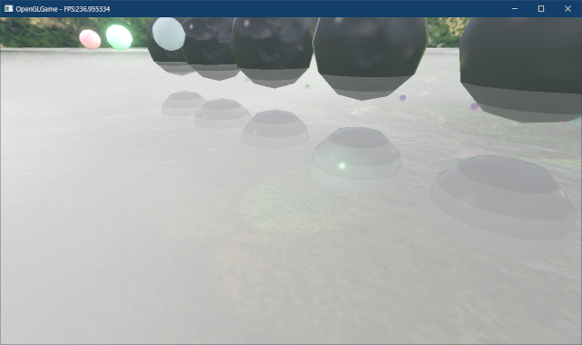&emsp;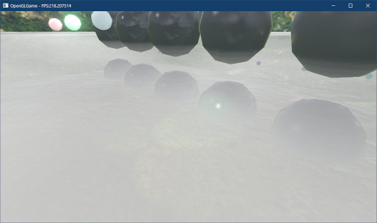<br>
[左=ディザリングなし 右=ディザリングあり]
</p>

### 2.3 影を反映する

雲も実態のある存在である以上は、物体の影が落ちるはずです。そこで、シャドウテクスチャを利用して雲に影を落としましょう。`cloud.frag`を開き、次のプログラムを追加してください。

```diff
 // プログラムからの入力
 layout(location=4) uniform vec3 cameraPosition; // カメラ座標
+layout(location=10) uniform float shadowOffset; // アクネを防ぐためのオフセット
 layout(location=100) uniform vec3 color;      // 雲の色
 layout(location=101) uniform mat4 matInvProj; // 逆プロジェクション行列
 layout(location=102) uniform mat4 matInvView; // 逆ビュー行列
 layout(location=103) uniform vec4 offset;     // 雲テクスチャのオフセット値

 // xy=雲の範囲 z=レイマーチング回数 w=1回に進む距離
 layout(location=104) uniform vec4 range_count_step;
+
+layout(location=105) uniform mat4 matShadowTexture; // シャドウテクスチャ行列

 // 出力する色データ
 out vec4 outColor;
```

次に、影の濃さを表す変数を追加します。

```diff
   tmin = max(tmin, 0); // tminを光線の始点に制限

   // 距離がマイナスの場合、交点は光線の発射点より後ろにあるのでサンプリングしない
   float density = 0; // 雲の密度
+  float shadow = 0; // 影の濃さ
   if (tmin <= tmax) {
     // 1回のマーチングで光線を進める距離
```

続いて、影の濃さを計算し、`outColor`に反映します。

```diff
         const float transmittance = max(1 - density, 0); // 透過率
         const float densityScale = 0.3; // サンプリングごとの密度調整係数
         density += a * transmittance * densityScale;
+
+        // 影判定を行って「影の濃さ」を更新
+        vec3 shadowPosition = samplingPoint - v * shadowOffset; // アクネ防止オフセット
+        shadowPosition = vec3(matShadowTexture * vec4(shadowPosition, 1));
+        float s = (1 - texture(texShadowDepth, shadowPosition));
+        shadow += s * transmittance * densityScale;
       }
       samplingPoint += step; // 光線を進める
     } // for i
     density = clamp(density, 0, 1); // 密度を0-1の範囲に制限
+
+    // 影の濃さを調整
+    const float shadowScale = 0.5;
+    shadow = min(shadow, 1) * shadowScale;
   }
-  outColor = vec4(color, density);
+  outColor = vec4(color * (1 - shadow), density);
 }
```

影の判定方法は、`standard_3D.frag`と全く同じです。レイマーチングで座標が更新されるたびに影の判定を行うことで、雲の密度に応じた影が作成されます。

`shadowScale`(シャドウ・スケール)は、最終的な影の濃さを決めるパラメータです。

これでシェーダの準備はできたので、次は、CPU側に「シャドウテクスチャ行列をコピーするプログラム」を追加します。

次に、影の判定に使うシャドウテクスチャ行列とシャドウオフセットを、エンジンクラスのメンバ変数にして、どのメンバ関数からでも参照できるようにします。`Engine.h`を開き、3Dモデルの影描画用の変数に次のプログラムを追加してください。

```diff
   FramebufferObjectPtr fboShadow;
   ProgramPipelinePtr progShadow;
   ProgramPipelinePtr progShadowAnimation;
+  float shadowRange = 150;   // 深度マップの描画範囲
+  float shadowOffset = 0.1f; // シャドウアクネ防止用のオフセット
+  VecMath::mat4 matShadowTexture; // 影テクスチャ行列

   // スカイボックス用の変数
   TexturePtr texSkybox;
   ProgramPipelinePtr progSkybox;
```

なお、`shadowRange`(シャドウレンジ)に指定した`150`は一般的な3Dゲーム用の数値です(以前作成したシューティングゲームでは`750`でした)。なお、`shadowOffset`に指定した
`0.1f`にはあまり深い意味はありません。1mでは大きすぎる気がするので、1/10の10cmにしただけです。

次に`Engine.cpp`を開き、ロケーション番号をあらわす変数を追加してください。

```diff
 // ユニフォーム変数のロケーション番号
 constexpr GLint locCameraPosition = 4;
+constexpr GLint locShadowOffset = 10;
 constexpr GLint locCloudColor = 100;
 constexpr GLint locMatInvProj = 101;
 constexpr GLint locMatInvView = 102;
 constexpr GLint locCloudOffset = 103;
 constexpr GLint locCloudRange_count_step = 104;
+constexpr GLint locMatShadowTexture = 105;

 /**
 * ワールド座標系の衝突判定を表す構造体
```

シャドウオフセットのロケーション番号を`10`にしているのは、他の頂点シェーダでも使う予定だからです。これについては後述します。

>**【ロケーション番号は考えてつけよう】**<br>
>本当はシャドウテクスチャ行列のロケーション番号を`standard_3D.vert`と同じ`1`にしたかったのですが、`simple_2D.vert`において`matViewProjection`が割り当てられているため断念しました。皆さんはこんなことにならないように気をつけてください。

続いて、`DrawStaticMesh`メンバ関数にある、深度マップを作成するプログラムを次のように変更してください。

```diff
   // 深度マップ作成用の注視点座標
-  const vec2 viewSize = GetViewSize();
-  const vec3 shadowTarget =
-    vec3(viewSize.x * 0.5f, viewSize.y * 0.5f, 0);
+  const vec3 shadowTarget = { 0, 0, 0 };

   // 深度マップ作成用の視点座標
   const vec3 shadowEye =
     shadowTarget - directionalLight.direction * 1000;

   // 深度マップを作成
   const mat4 matShadow = CreateDepthMap(
-    rendererList, shadowEye, shadowTarget, 750, 100, 2000);
+    rendererList, shadowEye, shadowTarget, shadowRange, 100, 2000);

   // ゲームウィンドウ用FBOに描画
   glBindFramebuffer(GL_FRAMEBUFFER, *fboGameWindow);
```

この変更によって、ゲームに合わせて影の描画範囲を調整できるようになりました。

>**【shadowTargetについて】**<br>
>`shadowTarget`の値はゲームによって変更する必要があります。上記の値は、カメラに映る範囲が、原点の周囲の狭い範囲に限定されているゲームの設定例です。キャラクターが広い空間を移動するゲームの場合、カメラの座標と向きから計算する必要があります。

次に、`DrawStaticMesh`メンバ関数にある影テクスチャ行列をローカル変数からメンバ変数に変更し、シャドウオフセットをGPUメモリにコピーする処理を追加します。影テクスチャ行列を計算するプログラムを次のように変更してください。

```diff
     vec4(0.0f, 0.0f, 0.5f, 0.0f),
     vec4(0.5f, 0.5f, 0.5f, 1.0f),
   };
-  const mat4 matShadowTexture = matTexture * matShadow;
+  matShadowTexture = matTexture * matShadow;

   // ユニフォーム変数を設定するラムダ式
   const auto setUniform = [&](GLuint program) {
    glProgramUniformMatrix4fv(program, 1, 1, GL_FALSE, &matShadowTexture[0][0]);
+   glProgramUniform1(program, locShadowOffset, shadowOffset);

    // 平行光源の情報を設定
    const vec3 color = directionalLight.color * directionalLight.intensity;
```

次に、`DrawCloudEffect`メンバ関数の定義にある、ユニフォーム変数にデータをコピーするプログラムと、テクスチャを設定するプログラムに、次のプログラムを追加してください。

```diff
   glProgramUniform4f(*progCloud, locCloudRange_count_step,
     cloudRange.x, cloudRange.y, cloudMarchingCount, step);
+
+  glProgramUniform1f(*progCloud, locShadowOffset, shadowOffset);
+  glProgramUniformMatrix4fv(*progCloud, locMatShadowTexture,
+    1, GL_FALSE, &matShadowTexture[0][0]);

   // テクスチャを設定
   glBindTextureUnit(0, *texCloud);
   glBindTextureUnit(1, *fboGameWindow->GetDepthTexture());
+  glBindTextureUnit(2, *fboShadow->GetDepthTexture());

   // 雲を描画
   glDrawElements(GL_TRIANGLES, 6, GL_UNSIGNED_SHORT, 0);
```

エンジン側の最後の変更として、シャドウオフセットを計算するプログラムを追加します。
`MainLoop`メンバ関数の定義にある3Dメッシュを描画するプログラムの上に、次のプログラムを追加してください。

```diff
     glEnable(GL_BLEND);
     glBlendEquation(GL_FUNC_ADD);
     glBlendFunc(GL_SRC_ALPHA, GL_ONE_MINUS_SRC_ALPHA);
+
+    // シャドウアクネを防ぐための、影判定のオフセット値を計算
+    const float depthTextureSize =
+      static_cast<float>(fboGameWindow->GetDepthTexture()->GetWidth());
+    const float shadowTexelSize = 1 / depthTextureSize; // 1テクセルのサイズ
+    shadowOffset = shadowRange * 2 * shadowTexelSize; // 1テクセルのサイズ(ワールド座標)

     // 3Dメッシュを描画
     DrawStaticMesh(gameObjectList);
```

プログラムが書けたらビルドして実行してください。雲に物体の影が落ちていたら成功です。

<p align="center">
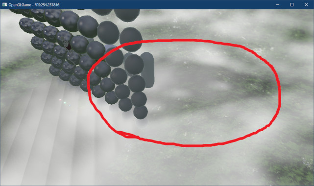
</p>

<div style="page-break-after: always"></div>

### 2.4 3Dモデル描画用のシェーダを修正する

シャドウオフセットは3Dモデル描画でも利用していますが、現在はシェーダ内部で計算しています。しかし、同じ値を`MainLoop`メンバ関数で求めるようにしたので、シェーダでもう一度計算する必要はありません。

そこで、シェーダからシャドウオフセットの計算を除去します。`standard_3D.vert`を開き、シャドウオフセット用のユニフォーム変数を追加してください。

```diff
 // プログラムからの入力
 layout(location=0) uniform mat4 matModel;
 layout(location=1) uniform mat4 matShadowTexture;
+layout(location=10) uniform float shadowOffset;

 // x: 視野角による水平拡大率
 // y: 視野角による垂直拡大率
```

>**【シャドウオフセットのロケーション番号を10にした理由】**<br>
>シャドウオフセットのロケーション番号を`10`にしたのは、既存のユニフォーム変数と番号が衝突しないようにするためです。しかし、すでに`10`を他のユニフォーム変数に割り当てている場合は、シャドウオフセットのロケーション番号を変更してください。

次に、影判定用の座標を計算するプログラムを、次のように変更してください。

```diff
   // ワールドタンジェントを計算
   outTangent.xyz = normalize(matNormal * inTangent.xyz);
   outTangent.w = inTangent.w;

   // 影判定用の座標を計算
-  float worldShadowRange = 750 * 2; // 深度マップの描画範囲(CreateDepthMap関数を参照)
-  float shadowTexelSize = 1 / float(textureSize(texDepth, 0).x); // 1テクセルのサイズ
-  float worldShadowTexelSize =
-    worldShadowRange * shadowTexelSize; // 1テクセルのサイズ(ワールド座標)
-  float normalOffset = 1.0 * worldShadowTexelSize;
   outShadowPosition =
-    vec3(matShadowTexture * vec4(outPosition + outNormal * normalOffset, 1));
+    vec3(matShadowTexture * vec4(outPosition + outNormal * shadowOffset, 1));

   // カメラの位置が原点となるように移動
   vec3 pos = outPosition - cameraPosition;
```

これで、CPU側で計算したシャドウオフセットが使われるようになりました。

<pre class="tnmai_assignment">
<strong>【課題02】</strong>
glTFアニメーションを実装している場合、<code>animation_3D.vert</code>にある影判定用の座標を計算するプログラムを、CPU側で計算したシャドウオフセットを使うように変更しなさい。
</pre>

プログラムが書けたらビルドして実行してください。影の見た目が変化していなければ成功です。この変更によってシェーダの計算量を減らせたので、わずかですが処理速度が向上しているはずです。

### 2.5 雲の分布を制御できるようにする

現在は雲海とでも言うべき状態ですが、もっと雲が少ない空を表現したい場合も多いでしょう。そこで、密度が一定の「しきい値」以下の場合は、雲として表示しないようにします。

しきい値は`threshold`(スレッショルド)と言います。計算上、「`1 - しきい値`の逆数」も必要なので、英文にした`inverse one minus threshold`(インバース・ワン・マイナス・スレッショルド)を短縮し、変数名は`threshold_invOneMinusThreshold`とします。

`cloud.frag`を開き、しきい値をあらわすユニフォーム変数を追加してください。

```diff
 layout(location=104) uniform vec4 range_count_step;

 layout(location=105) uniform mat4 matShadowTexture; // シャドウテクスチャ行列
 layout(location=10) uniform float shadowOffset; // アクネを防ぐためのオフセット
+
+// x=雲とみなす密度のしきい値 y=1/(1-しきい値)
+layout(location=106) uniform vec2 threshold_invOneMinusThreshold;

 // 出力する色データ
 out vec4 outColor;
```

次に、雲の密度を計算するプログラムに、次のプログラムを追加してください。

```diff
         const float scale1 = 1.0 / 127; // テクスチャの拡大率
         float a = texture(texDensity, samplingPoint.xz * scale0 + offset.xy).r;
         a += texture(texDensity, samplingPoint.xz * scale1 + offset.zw).r;
+
+        // 雲とみなす密度以下は密度0にする
+        a = clamp(a - threshold_invOneMinusThreshold.x, 0, 1);
+        a *= threshold_invOneMinusThreshold.y;

         // 密度を加算
         const float transmittance = max(1 - density, 0); // 透過率
```

これで、しきい値以下の密度は雲として表示されなくなりました。

続いて、ゲームエンジンにしきい値を追加します。`Engine.h`を開き、雲描画用の変数の定義に次のプログラムを追加してください。

```diff
     -0.0019f, -0.0041f, -0.0027f, -0.0013f }; // 雲の移動速度
   VecMath::vec2 cloudRange = { 0, 2 }; // 雲を描画する範囲
   float cloudMarchingCount = 8;  // レイマーチング回数
+  float cloudThreshold = 0.5f;   // 雲を描画する最小の密度

   // シーン遷移エフェクト用の変数
   ProgramPipelinePtr progFade; // シーン遷移エフェクト用シェーダ
```

次に`Engine.cpp`を開き、ロケーション番号をあらわす変数を追加してください。

```diff
 constexpr GLint locCloudOffset = 103;
 constexpr GLint locCloudRange_count_step = 104;
 constexpr GLint locMatShadowTexture = 105;
+constexpr GLint locThreshold_invOneMinusThreshold = 106;

 /**
 * ワールド座標系の衝突判定を表す構造体
```

それでは「しきい値」をGPUメモリにコピーしましょう。`DrawCloudEffect`メンバ関数の定義に次のプログラムを追加してください。

```diff
   glProgramUniformMatrix4fv(*progCloud, locMatShadowTexture,
     1, GL_FALSE, &matShadowTexture[0][0]);
   glProgramUniform1f(*progCloud, locShadowOffset, shadowOffset);
+
+  // 雲とみなす密度のしきい値を設定
+  const float invOneMinusThreshold = 1 / (1 - cloudThreshold);
+  glProgramUniform2f(*progCloud, locThreshold_invOneMinusThreshold,
+    cloudThreshold, invOneMinusThreshold);

   // テクスチャを設定
   glBindTextureUnit(0, *texCloud);
```

プログラムが書けたらビルドして実行してください。雲のない空間が増えていたら成功です。

<p align="center">
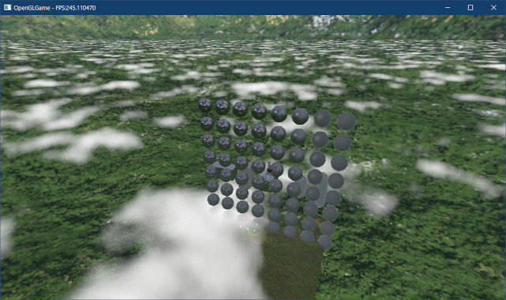
</p>

### 2.6 高さ方向の密度を制御する

雲の境界部分が分かりやすくなると、なんとなく雲というより「厚みのある白い何か」のように見えることがあります。これは、雲の高さ方向の密度が一定だからです。

そういう雲もありますが、やはり雲といえば、上部が山のように盛り上がった形を思い浮かべるでしょう。そこで、サンプリング座標が雲の上面に近づくほど密度を低下させましょう。

`cloud.frag`を開き、テクスチャを読み取るプログラムの下に、次のプログラムを追加してください。

```diff
         const float scale1 = 1.0 / 127; // テクスチャの拡大率
         float a = texture(texDensity, samplingPoint.xz * scale0 + offset.xy).r;
         a += texture(texDensity, samplingPoint.xz * scale1 + offset.zw).r;
+
+        // 高さ方向の密度係数を計算(Yが大きくなるほど密度を下げる)
+        const float thickness = range_count_step.y - range_count_step.x;
+        const float heightScale = (range_count_step.y - samplingPoint.y) / thickness;
+        a *= clamp(heightScale, 0, 1) * 0.5 + 0.5;

         // 雲とみなす密度以下は密度0にする
         a = clamp(a - threshold_invOneMinusThreshold.x, 0, 1);
```

`heightScale`(ハイと・スケール)は、雲の下端では`1`、上端では`0`になります。そのあとで`0.5`を掛けて`0.5`を足しているのは、上端の密度が低くなりすぎることを防ぐためです。

プログラムが書けたらビルドして実行してください。雲の形がわずかに山のようになり、より雲らしく見えていたら成功です。

<p align="center">
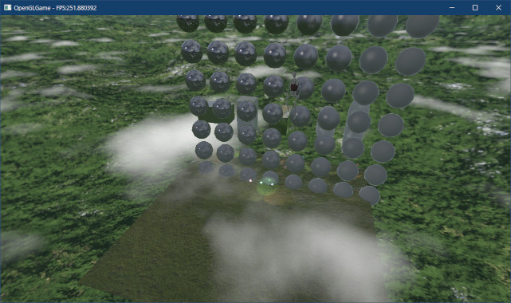
</p>

>**【雲のライティング】**<br>
>今回作成した雲はライティングを行っていません。ディレクショナルライトについては、雲の色とライトカラーを乗算してからGPUメモリにコピーすることで対応できます。<br>
>ポイントライト、スポットライトについては、描画範囲をサブフラスタムに分割することで対応でききるかもしれません。

>**【2章のまとめ】**
>
>* ディザリングを使うと、レイマーチングのサンプリング回数の不足を目立たなくすることができる。
>* 「しきい値」を利用して密度を制御することで、雲が発生する範囲を制御できる。
>* 高さ方向の密度を調整すると、厚板のような不自然な見た目を緩和できる。
