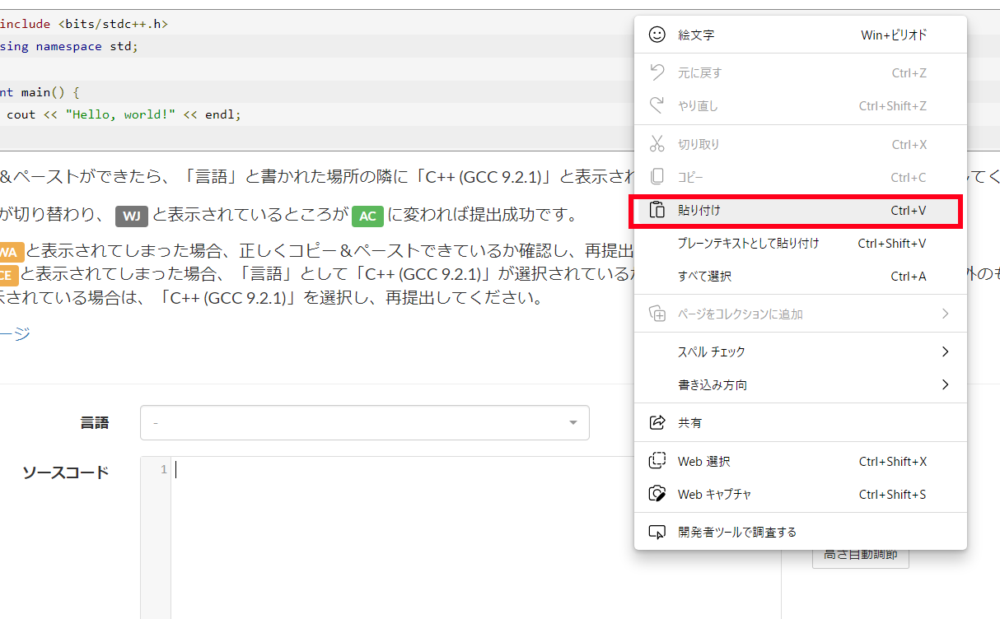
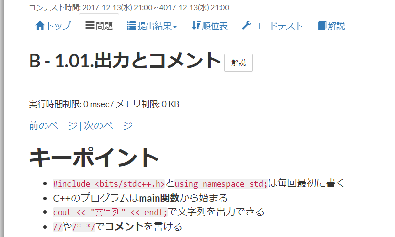

[C/C++講座]

# C/C++講座の進めかた

## 1. 授業の目的

この授業の目的は、CおよびC++言語の理解度を上げることです。

プログラミング言語の理解度を上げるには、自分のレベルに合ったさまざまな問題を解くことが近道です。

この授業では、AtCoder(アット・コーダー)というサイトに公開されている問題を解いてもらいます。

アットコーダーには以下のURLからアクセスできます。

>`atcoder.jp`

## 2. AtCoderについて

AtCoderは「アルゴリズムを題材とした問題をプログラミングによって解く競技」を開催しているサイトです。

この競技は「プログラミングコンテスト」と呼ばれています。プログラミングコンテストは、

>出題される問題を、プログラミングを使って制限時間内にできるだけ多く解いていく

という競技です。

>なお、この授業ではコンテストには参加しません。個人的に参加することは推奨します。

AtCoderはプログラミングコンテストを開催するだけではありません。C/C++言語の基本を学べるコースや、過去のコンテストで出題された大量の問題が公開されています。

この授業では、C/C++言語の基本を学べるコースを実際にやってもらいます。

## 3. AtCoderへの登録

ウェブブラウザで`atcoder.jp`にアクセスすると、次のページが表示されます。

左上の「新規登録」をクリックすると、登録ページが表示されます。

必須の項目をすべて入力してください。メール通知のチェックは、必要がなければすべてチェックを外してください。

必須の項目を入力したら、一番下にある「新規登録」をクリックしてください。すると登録が行われます。

登録したメールアドレスにメールが届くかもしれません。その場合、メールに従って登録を完了させてください。

## 4. プログラミングガイドをはじめる

上部にある「コンテスト」という文字をクリックすると、次のページが表示されます。

ページの左側にコンテスト一覧が表示されています。一覧から「C++入門 AtCoder Programming Guide for beginners(APG4b)」をクリックしてください。すると次のページが表示されます。

とりあえず「参加登録」ボタンをクリックしてください。参加登録ができたら、ページを下にスクロールさせて、「1.00.はじめに」をクリックしてください。

## 5. はじめての問題提出

「1.00.はじめに」をクリックすると、次のようなページが表示されます。

読み進めていくと「問題」が出てきます。問題といっても、これはAtCoderの「自動採点システム」の使い方を説明するためのものです。ですから、書いてあるとおりの手順を踏めばクリアできます。

まずは解説にしたがって、プログラムの右上にある「Copy」ボタンをクリックしてください。

すると「Copied!(コピード)」と表示され、コピーが完了します。

次に、問題の下にある「ソースコード」ウィンドウを「右クリック」して、「貼り付け」を選択してください。

プログラムを貼り付けたら、「言語」欄をクリックします。すると、AtCoderで使用可能な言語(正確には言語処理系)の一覧が表示されます。「C++(GCC9.2.1)」を選択してください。「C(GCC9.2.1)」と間違えないように注意すること。

プログラムを貼り付けて、言語を選択したら、下の方にある「提出」ボタンをクリックしてください。

## 6. 結果の見かた

「提出」をクリックすると、次のページに移動します。このページには、提出したプログラムの採点結果が表示されます(赤く囲った部分)。

問題を提出するたびに、このページに結果が追加されていきます。

ここで重要なのは「結果」の列です。提出直後は`WJ`(採点中)と表示されます。しばらくすると採点が終わり、以下のいずれかに変わります。

>* AC(アクセプテッド): 合格
>* WA(ロング・アンサー): 出力結果が間違っている
>* CE(コンパイル・エラー): ビルド失敗

`AC`以外の場合は失敗です。プログラムを修正して再提出してください。

「問題」の行にある問題ページのリンクをクリックすると、問題ページに戻ることができます。

AtCoderでは、提出した回数は得点に影響しません。最終的に`AC`にできればよいので、気軽に提出してください。

また、いちばん右にある「詳細」をクリックすると、提出したプログラムと得点を参照できます。

なお、問題ページに戻っても、前に入力したプログラムは表示されません。必要に応じて「詳細」ページからコピーするとよいでしょう。

また、AtCoderのプログラム入力欄には、色分けなどの便利な機能がありません。Visual Studioなどで書いてコピペするのは良い方法です。

わざわざVisual Studioを立ち上げるのが面倒な場合、`wandbox.org`や`ideone.com`といった、オンライン実行環境を利用してもよいでしょう。

## 7. 次の問題へ

なんとなくAtCoderの提出方法が分かったと思います。それでは、次の問題へ進みましょう。上部にある「問題」をクリックすると、問題一覧ページが表示されます。

「1.01.出力とコメント」をクリックして、次の問題を表示してください。

内容を読み進めていくと、ページの末尾に問題へのリンクがあります。

リンクをクリックすると、問題文ページが表示されます。

これ以降は、最初にC/C++言語の説明が行われ、ページの末尾に問題へのリンクが置かれる、という構成になります。

それでは、問題文をよく読んで、プログラムを書いて提出してください。

結果が`AC`になれば正解です。どんどん次の問題へと進んで、`AC`を増やしてください。

>最初の目標は、第1章と第2章で出題されるすべての問題(ABC問題は除く)を`AC`にすることです。がんばっていきましょう。
