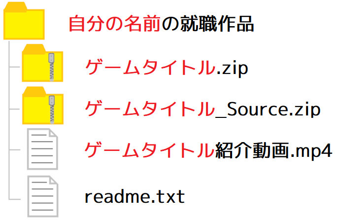

# 就職作品を準備する手順2022

## 1 提出するファイルについて

>**【やること】**<br>
>[ ] 必要なファイルを全て揃える。<br>
>[ ] 「`自分の名前`の就職作品」というフォルダにまとめる。

就職作品を提出する際に必要なファイルは以下のとおりです。

>1. 就職作品のプレイ動画。
>2. 就職作品の実行ファイル
>3. 就職作品のソースファイル
>4. 就職作品の説明書(リード・ミー・ファイル)

この4つを「`自分の名前`の就職作品」というフォルダに入れて、ZIP形式で圧縮します。

<p align="center">
<br>
[提出用フォルダ構成(赤字部分は個別に変更すること)]
</p>

>**【重要】**<br>
>実際には上記ファイルとは別に履歴書も提出します。

ZIP以外の形式は使わないでください。ゲーム会社であっても、採用窓口の担当者が圧縮形式に詳しいとは限らないからです。Windowsが標準で対応しているZIPにしておくのが無難です。

また、上記の4つが全て揃っていないと選考を通過する可能性が下がります。なぜなら、あなたの競争相手は「これらをすべて揃えて就職活動にのぞんでいる人物」だからです。

<div style="page-break-after: always"></div>

## 2 プレイ動画について

>**【やること】**<br>
>[ ] 編集ソフトをインストールする。<br>
>[ ] 紹介動画の長さは3～5分以内にする。<br>
>[ ] 作成した動画を「`自分の名前`の就職作品」フォルダにコピーする。

現在のWindows10には使いやすい動画編集ソフトが付属していないため、就職作品の紹介動画を作るのは難しいです。以下のような録画ソフトをインストールして録画・編集を行ってください。

>ロイロ・ゲームレコーダー: `https://loilo.tv/jp/product/game_recorder`<br>
>OBS Studio: `https://obsproject.com/ja/`<br>
>バンディ・カム: `https://www.bandicam.jp/`<br>

紹介動画の長さは3～5分程度にしましょう。あまり長いと最後まで見てもらえませんし、「要点をまとめる能力がない」と判断されます。

紹介動画にゲームオーバーシーンを入れないでください(ループものなどゲームオーバーが売りである場合をのぞく)。大抵の場合、ゲームオーバーは見せたい要素ではないはずです。見せたい要素だけを動画に入れてください。

いまいち動画映えしないと感じたときは、動画映えするエフェクトをゲームに追加して撮り直すとよいでしょう。

それから、紹介動画とは別にプレイ動画を作るのはよい考えです。プレイ動画は紹介動画より長くなっても構いません。プレイ動画は`YouTube`にアップロードして、後述するリードミーファイルにURLを記載するとよいでしょう。

<div style="page-break-after: always"></div>

## 3 実行ファイル

>**【やること】**<br>
>[ ] `x64/Release`フォルダにある全てのexeファイルとdllファイルを「`自分の名前`の就職作品」フォルダにコピーする。<br>
>[ ] `Res`フォルダから、ゲームの実行に使わないファイルを削除する。<br>
>[ ] `Res`フォルダを「`自分の名前`の就職作品」フォルダにコピーする。

ここでいう「実行ファイル」は「ゲームの実行に必要な最小限のファイルのまとまり」を指します。OpenGLプロジェクトの場合、これは以下の3つです。

* ゲームのexe(エグゼ)ファイル
* ゲームがリンクしているdll(ディーエルエル)ファイル
* `Res`フォルダ

以下の手順に従って、プロジェクトを提出用の実行ファイルとしてまとめます。

>1. デスクトップに「ゲームのタイトル」をつけたフォルダを作成します。<br>これを「アプリフォルダ」と呼ぶことにします。
>2. プロジェクトの`x64/Release`フォルダにある以下のファイルをアプリフォルダにコピーします。<br>
`プロジェクト名.exe`<br>
`glfw3.dll`<br>
※その他のライブラリを利用していて、そのライブラリのDLLファイルがある場合、それらもコピーすること)
>3. `Res`フォルダから不要なファイルを削除します。
>4. `Res`フォルダをアプリフォルダへコピーします。
>5. アプリフォルダをZIP圧縮します。

<div style="page-break-after: always"></div>

exeファイルとdllファイルはプロジェクトフォルダ直下の`x64/Release`フォルダにあるものを使います(下図①と②)。

`x64/Release`フォルダは、プロジェクトの「ソリューション構成」を`Release`、「プラットフォーム」を`x64`に設定してビルドすると作成されます。

<p align="center">
<br>
</p>

実際のゲーム開発でも、最終的にストアにアップロードしたり出荷される製品は`Relase`(あるいは`Release`を調整して)ビルドしたものになります。

exeファイルは`プロジェクト名.exe`という名前になります。「種類」タブをクリックすると、exeとdllが近くに並ぶようになります(③)。

dllファイルは`ライブラリ名.dll`か、`ライブラリ名とバージョン番号などを組み合わせた名前.dll`となっていることが多いです。

>**【exeファイル名の変更方法】**<br>
>exeファイル名は「プロジェクトのプロパティ→リンカー→全般→出力ファイル」を編集することで変更できます。一般的には`ゲームの名前.exe`とします。例えば、ゲーム名が「Tank Battalion(タンクバタリアン)」の場合は`TankBattalion.exe`とします。

新しいライブラリを導入すると、必要な`dll`ファイルが増えることがありますので注意してください。提出するフォルダには`x64/Release`フォルダにある全ての`dll`ファイルを含めてください。

なお、`Release`ビルドでは、`Debug`ビルドのときには起こらなかったエラーが発生する可能性があります。そのほとんどは、プログラムの潜在的なバグによるものです。提出前になってあわてないように、日頃から定期的に`Release`ビルドを行い、正しく動作することを確認するようにしてください。

どうしても`Release`ビルドではうまく動かないときだけ、`Debug`フォルダの中にあるexeとdllを使ってください。ただ、`Debug`バージョンは提出先で起動できない可能性があるため、本当に最後の手段です。

>**【Debugフォルダのファイルを使わないように注意】**<br>
>`Debug`でビルドした実行ファイルは、開発環境にしか存在しないライブラリをリンクしていることがあります。提出先のPCでは起動できない可能性がありますので、やむを得ない場合以外は提出用に使ってはいけません。

実行ファイルには`Res`フォルダも必要です。`Res`フォルダには実行時に読み込まれるモデル、テクスチャ、シェーダーといったファイルがあるからです(下図①)。

<p align="center">
<br>
</p>

ゲームの実行に必要ないファイルが`Res`フォルダに入っていると、ZIPファイルのサイズが無駄に大きくなってしまいます。それらのファイルは別の場所に移動させるか、削除してください。また、10MBを超える画像ファイルは、解像度やビット数を減らすことを検討してください。

マップデータがある場合は、それらもコピーしてください(②)。ただ、毎回個別にコピーするのはミスのもとです。そこで、マップデータの保存先を`Res`フォルダに変更するとよいでしょう。そうすれば、以後は`Res`フォルダをコピーするだけで済みます。

<div style="page-break-after: always"></div>

## 4 ソースファイル

>**【やること】**<br>
>[ ] 「`ゲームのタイトル`_Source」というフォルダにプロジェクトのソースファイルをコピーする。

「誰かにゲームを遊んでもらうこと」だけが目的なら、3で作成したアプリフォルダにドキュメントを追加すれば十分です。

しかし、今回の目的は「就職作品」です。この場合は、ビルド可能なソースファイルも必要となります。ソースファイルは次の手順でまとめます。

>1. デスクトップに「`ゲームのタイトル`_Source」という名前のフォルダを作成します。これを「提出用プロジェクトフォルダ」と呼ぶことにします。
>2. プロジェクトフォルダにある`プロジェクト名.sln`, `プロジェクト名.vcxproj`, `プロジェクト名.vcxproj.filter`, `packages.config`の4つを、提出用プロジェクトフォルダへコピーします。
>3. プロジェクトフォルダにある`packages`フォルダ、`Src`フォルダ、`Res`フォルダを、提出用プロジェクトフォルダへコピーします。
>4. 提出用プロジェクトフォルダをZIP圧縮します。

<p align="center">
<br>
</p>

>**【マップデータをResに移していない場合】**<br>
>プロジェクトフォルダ直下にマップデータがある場合、マップデータも提出用プロジェクトフォルダへコピーしてください。

<div style="page-break-after: always"></div>

## 5 リードミー・ファイル

>**【やること】**<br>
>[ ] 作品送付先の企業が指定した書式がある場合、その書式に従っていることを確認する。<br>
>[ ] リードミーファイルの誤字脱字をチェックして修正する。<br>
>[ ] リードミーファイルを複数の人間にチェックしてもらう。<br>
>[ ] 最新のリードミーファイルを「`自分の名前`の就職作品」フォルダにコピーする。

### 5.1 リードミー・ファイルの書き方

リードミー・ファイルには、採用担当者に「ゲームの評価してほしい点」、「ゲームの動かし方」を伝える、という、重要な役割があります。

典型的なリードミー・ファイルは`readme.txt`あるいは`readme`という名前のテキストファイルとして作られます。図や画像を使いたい場合は、PDFやワード、エクセル文書で作成してもよいでしょう。

>**【重要】**<br>
>作品送付先の企業が指定した書式がある場合、その書式に従うこと。

リードミー・ファイルには、次に示すような情報を書きます。

>```txt
>[ゲーム名] 開発したゲームのタイトルを書く。
>  タイトルが英語だったり特殊な読み方をする場合はよみがなも書くとよい。
>[作成者] 自分の名前(よみがな)を書く。
>[製作期間] 制作にかかった期間を書く。
>
>[開発環境]
>  ゲームの開発に使用したOS、ツール、言語、使用したライブラリを書く。
>  使用したバージョンまで書くこと。
>  ADX LEのように、別途インストールが必要なライブラリについては、
>  インストールが必要だと注意書きをして、URLを記載すること。
>
>[ゲーム内容]
>  どんなゲームなのかを簡潔に説明する。
>  PDFファイルやワード・エクセル文書の場合、画像や図を使って説明するとよい。
>  紹介動画、プレイ動画のURLはここに書く。
>
>[制作目的]
>  制作にあたって「実現したかったこと」や「表現したかったこと」を書く。
>  「〇〇のゲームが好きなので、自分で再現してみたかった。」
>  「授業で作ったゲームに☓☓のアイデア加えたら面白くなると思った。」
>  「〇〇と☓☓のアイデアを組み合わせたら面白くなると思った。」
>   など。
>  「どうしてそう思ったのか」まで書くこと。
>
>[工夫した部分]
>  開発にあたって工夫した部分を書く。ある程度くわしく書くとちゃんと分かってる感が出る。
>  授業で学んだ内容を、自分なりに詳しく説明するのもあり。
>  面接官が工夫について質問したくなるように誘導できるとよい。
>  図表が必要な場合、HTMLやPDF文書にすることも考慮する。
>
>[ファイル構成]
>  ファイル構成を書く。
>
>[ソースフォルダ構成]
>  ソースファイルのフォルダ構成を書く。
>  GitHub等を利用している場合はここにURLを書くとよい。
>    
>[インストール方法] インストールの手順を書く。
>
>[アンインストール方法] アンインストールの手順を書く。
>
>[実行方法] ゲームの実行方法を書く。
>
>[遊び方] ゲームの操作方法を書く。
>
>[使用素材]
>  ゲームの作成にあたって利用した画像や音楽がある場合、その出典を明記する。
>
>[参考資料]
>  参考にした情報源などを書く。たくさん書くと勉強した感が出る。
>```

全ての項目を書き終えたら、誤字脱字を入念にチェックしましょう。また、かならずクラスメートや先生、ご家族など複数の他人にチェックをお願いしましょう。自分では気づかなかったミスが見つかる確率が高いからです。

<div style="page-break-after: always"></div>

### 5.2 リードミー・ファイルの例

>```txt
>[ゲーム名] SPACE FALCON(スペース ファルコン)
>[作成者] バンタンゲームアカデミー プログラム総合 21年度生
>         鈴木 佐藤(すずき さとう)
>[製作期間] 2022/09/23～2022/12/20
>[想定動作環境]
>  OS: Windows 10
>  CPU: Intel AVX対応CPU
>  GPU: OpenGL 4.5対応GPU
>
>[開発環境]
>  OS: Windows10 Pro 21H1
>  IDE: Visual Studio 2022
>  言語: C++17
>  ライブラリ:
>    OpenGL 4.5
>    WindowsSDK 10.0.16299.0
>    GLFW 3.3.6
>    ADX LE
>
>  ※ADX LEはライセンスの都合により同梱していません。
>    以下のURLからダウンロード・インストールをお願いします。
>    インストール後、環境変数ADX_LE_PATHにcriフォルダを指定してください。
>    https://game.criware.jp/products/adx-le/
>
>[ゲーム内容]
>  自分の戦闘機を操作して、次々と現れる敵を破壊して高得点を目指すゲームです。
>  自分のHPが0になるとゲームオーバーです。
>  敵を破壊してから一定時間以内に次の敵を破壊すると「コンボ」となり、得点に倍率
>  がかかります。全6ステージで、各ステージの最後にはボス敵が待ち構えています。
>  ボスを破壊する、または一定時間経過でステージクリアとなり、次のステージへ進み
>  ます。
>
>  紹介動画   → 同梱した紹介動画の名前.mp4
>  プレイ動画 → https://www.youtube.com/watch?v=MyAwesomPlayMovie
>
>[制作目的]
>  怒首領蜂シリーズが好きで、大量の弾をかいくぐりコンボをつないでいく感覚を再現
>  したくて制作しました。
>  3Dモデルを使うことで、プレイヤーに立体的な空間で戦っている雰囲気が感じてもら
>  えるように工夫しました（手前や奥から出現する敵、ステージ開始デモやボス登場時
>  のデモなど）。
>
>[工夫した部分]
>・弾幕定義ファイル
>  ボスや一部の敵の弾幕は、弾の発射方向、発射回数、発射間隔などを記述したファイ
>  ルから生成しています。弾幕定義ファイルを使うことで、プログラムを再ビルドしな
>  くても簡単に新しい弾幕をテストできるので、弾幕を作る時間が短くなりました。
>
>・ベクトルクラス、行列クラス
>  C++で3Dの計算をやりやすくするため、ベクトルクラスと行列クラスを自作しました。
>  GLSLと同じようにベクトルの計算を書けるので、floatの配列を使っていた頃より
>  コード量を減らすことができました。また、コードがかなり見やすくなったと感じま
>  した。
>  実装はGLMライブラリを参考にしています。
>
>・イージング
>  敵の移動をなめらかにしたくて、EaseInOutなどいくつかのイージング関数を実装し
>  ました。２乗や３乗を組み合わせるだけで自然な速度変化ができることに感動し、敵
>  の移動を全面的にイージングで書き直してしまいました。
>
>・ビームと地形の交差判定
>  敵が発射し続けるビームを、地形を利用して回避する場面を作りたくて、直線と直方
>  体(OBB)の交差判定を実装しました。
>
>・ゲームバランスの調整
>  怒首領蜂シリーズで見られる、敵を遅らせて破壊することでコンボをつなぐテクニッ
>  クが使えるように、一部ザコ敵は長期間画面内にとどまるようにしました。
>  全てのステージで、ボス戦直前までコンボがつながることを確認しています。
>
>[ファイル構成]
>  SpaceFalcon.zip: ゲーム本体
>  SpaceFalcon_Source.zip: ゲームのソースコード
>  紹介動画.mp4: ゲーム紹介動画
>  readme.txt: このファイル
>
>[ソースファイル構成]
>  SpaceFalcon
>   +- packages         NuGetパッケージ
>   +- Res
>   |   +- Audio        音声データ
>   |   +- Map          マップデータ
>   |   +- Model        3Dモデル
>   |   +- Bullet       弾幕記述ファイル
>   |   +- *.tga        UIなどのテクスチャ
>   |   +- *.frag       フラグメントシェーダ
>   |   +- *.vert       頂点シェーダ
>   +- Src
>   |   +- Actor        アクター派生クラス
>   |   +- glad         GLADライブラリ
>   |   +- imgui        ImGuiライブラリ
>   |   +- Actor.cpp    アクタークラス
>   |   +- Actor.h      アクタークラス
>   |   +- .
>   |   +- . (残りの部分は自分で書くこと)
>   |   +- .
>   |   +- Texture.cpp  テクスチャ管理クラス
>   |   +- Texture.h    テクスチャ管理クラス
>   +- SpaceFalcon.sln             VSソリューションファイル
>   +- SpaceFalcon.vcxproj         VSプロジェクトファイル
>   +- SpaceFalcon.vcxproj.filters VSフィルタファイル
>   +- SpaceFalcon.vcxproj.user    VSユーザー設定ファイル
>   +- packages.config             NuGetパッケージ設定ファイル
> 
>[インストール方法]
>  SpaceFalcon.zipを任意のフォルダに展開してください。
>
>[アンインストール方法]
>  展開したSpaceFalconフォルダを削除してください。
>
>[実行方法]
>  展開した「SpaceFalconフォルダ」にある「SpaceFalcon.exe」をダブルクリックする
>  とゲームが起動します。
>
>[遊び方]
>  キーボード:
>    W/A/S/D ---------- メニュー操作/自機の移動
>    Enter/Space ------ 決定/画面送り
>    Space ------------ 弾を発射(押しっぱなしで自動連射)
>    左Shift ---------- ワイドショットとレーザーの切り替え
>    左Ctrl ----------- ボム
>    Esc -------------- 一時停止と再開
>    1/2/3 ------------ 弾の種類を切り替える
>
>[使用素材]
>  3Dモデル:
>    https://assetstore.unity.com/packages/3d/vehicles/space/
>      star-sparrow-modular-spaceship-73167
>    https://assetstore.unity.com/packages/3d/vehicles/space/
>      federation-corvette-f3-79860
>    https://assetstore.unity.com/packages/3d/vehicles/space/
>      lowpolyspaceshippack-196496
>
>  フォント: はんなり明朝(https://typingart.net/)
>  ロゴ: https://cooltext.com
>  BGM: https://incompetech.com/
>  SE: https://sfbgames.itch.io/chiptone
>
>[参考資料]
>  弾幕定義言語: http://www.asahi-net.or.jp/~cs8k-cyu/bulletml/
>  GLMライブラリ: https://github.com/g-truc/glm
>  直線とOBBの交差判定: http://marupeke296.com/COL_3D_No18_LineAndAABB.html
>  イージング: https://easings.net/ja
>```
